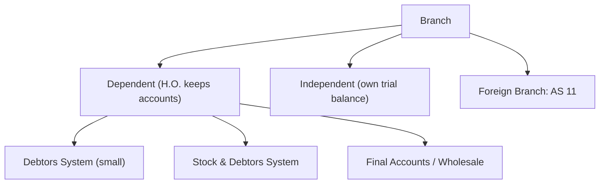
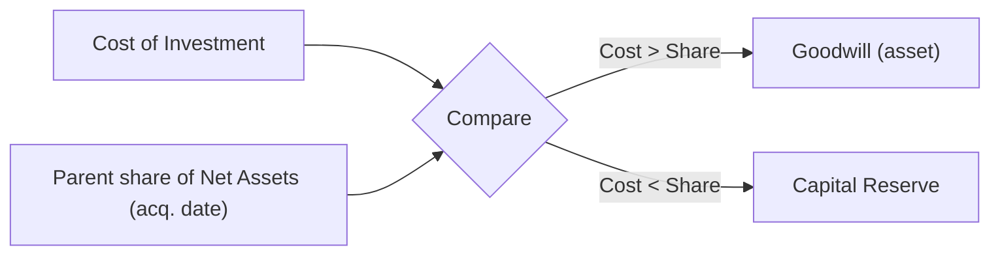

# Advanced Accounting — Quick-Revision Cheat-Sheet

*CA Intermediate · last-mile scan. Terse by design. Verify any rate/limit against current ICAI material (some are AY/notification-specific).*

---

## 1. Accounting Standards — Recognition & Measurement (must-know triggers)

| AS | Core rule (memory hook) |
|----|-------------------------|
| **AS 1** Disclosure of Policies | Fundamentals: **Going Concern, Consistency, Accrual**. Qualitative: Prudence, Substance>Form, Materiality. Disclose all significant policies at one place. |
| **AS 2** Inventories | Lower of **Cost** or **NRV**. Cost = purchase + conversion + other to present location/condition. Exclude: abnormal waste, storage (unless needed), admin, selling. FIFO/Weighted Avg. NRV item-by-item. Reverse write-down if NRV recovers. |
| **AS 3** Cash Flow | Operating/Investing/Financing. Direct or Indirect (op). Interest & div: financial enterprise—op; others—choice (paid=fin/op, recd=inv/op). Tax=operating unless identifiable. |
| **AS 4** Events after BS date | **Adjusting** (conditions existed at BS date) vs **Non-adjusting**. **Proposed dividend NOT a liability** (post AS 4 amendment 2016) — disclose in notes. Going concern lost ⇒ adjust. |
| **AS 5** P&L, Prior Period, Changes | Ordinary vs **Extraordinary** (disclose separately). **Prior period** = errors/omissions of past. **Change in estimate** ⇒ prospective. Change in policy ⇒ only if statute/AS/better presentation; disclose impact. |
| **AS 7** Construction Contracts | **% completion** only. Expected **loss ⇒ recognise immediately** (full). Outcome not reliable ⇒ revenue = recoverable cost, no profit. |
| **AS 9** Revenue | Sale of goods: **significant risks & rewards transferred** + no continuing control + measurable + collectable. Services: proportionate completion / completed service. Interest—time basis; Royalty—accrual; Dividend—right to receive established. |
| **AS 10** PPE | Cost = purchase + directly attributable + decommissioning est. **Component approach**. Revaluation—entire class. Spares of major value capitalised. Depreciate over useful life; residual & method reviewed yearly. |
| **AS 11** Forex | Monetary items ⇒ **closing rate**, exch diff to P&L. Non-monetary ⇒ transaction (historical) rate. Integral vs Non-integral (FCTR to reserve). Forward contract: premium amortised over life; for speculation—MTM. |
| **AS 12** Govt Grants | Related to **depreciable asset** ⇒ deduct from cost OR deferred income. **Non-depreciable** ⇒ capital reserve (or income if condition). Revenue grant ⇒ P&L. **Promoter's contribution ⇒ capital reserve**. Refund ⇒ reverse. |
| **AS 13** Investments | Current ⇒ **lower of cost or fair value**. Long-term ⇒ **cost**, provide only for **other than temporary** decline. Investment property at cost. |
| **AS 14** Amalgamation | See §3. Merger (pooling) vs Purchase. |
| **AS 15** Employee Benefits | Short-term—undiscounted. **DC plan**—expense contribution. **DB plan**—actuarial, PUC method; actuarial gains/losses to P&L. |
| **AS 16** Borrowing Costs | Capitalise if **qualifying asset** (substantial time to get ready) + active development. Suspend on interruption. Cease when ready. General borrowing ⇒ **capitalisation rate** × outlay. |
| **AS 17** Segment | Business/Geographical. **Primary vs Secondary** by risk source. Threshold **≥10%** (rev/result/assets); ensure external rev ≥75% covered. |
| **AS 18** Related Party | Control/significant influence/KMP. Disclose relationship + txns + o/s. Excludes: state-controlled links (mere), providers of finance in normal course. |
| **AS 19** Leases | **Finance lease** (substantially all risks/rewards) ⇒ lessee capitalises at **lower of FV or PV of MLP**; split principal/interest. **Operating** ⇒ SLM expense. Sale & leaseback: finance—defer profit; operating—recognise if at FV. |
| **AS 20** EPS | Basic = (Net profit − pref div) / **WA equity shares**. Diluted—include potential shares if dilutive. Bonus/split ⇒ adjust retrospectively. |
| **AS 21** Consolidation | See §6. Line-by-line, eliminate intra-group, minority interest. |
| **AS 22** Deferred Tax | On **timing differences** (reverse over time). DTA on unabsorbed dep/loss ⇒ only **virtual certainty** + convincing evidence. Others DTA ⇒ reasonable certainty. No discounting. |
| **AS 24** Discontinuing Ops | Disclose from **initial disclosure event** (plan approved / binding agreement). Not a measurement standard—disclosure only. |
| **AS 25** Interim | Same policies as annual; **discrete** view (each period standalone) generally, tax on estimated annual effective rate. |
| **AS 26** Intangibles | **No self-generated goodwill**. Recognise if identifiable + control + future benefit + cost measurable. Amortise over useful life (rebuttable ≤10 yr presumption). Research ⇒ expense; Development ⇒ capitalise if criteria met. |
| **AS 27** JV | Jointly controlled entity ⇒ **proportionate consolidation** (in CFS). |
| **AS 28** Impairment | If **carrying > recoverable** (higher of NSP & value-in-use) ⇒ impairment loss. Reverse (except goodwill) if estimates change. CGU concept. |
| **AS 29** Provisions | Recognise if **present obligation (past event) + probable outflow + reliable estimate**. **Contingent liability**—disclose only. **Contingent asset**—neither (disclose if virtually certain ⇒ becomes asset). No provision for future op losses. |

**High-freq exam traps:** Proposed dividend not a liability (AS 4). Expected contract loss recognised fully & immediately (AS 7). Only *other-than-temporary* decline provided for long-term investment (AS 13). DTA on losses needs *virtual* certainty (AS 22). Promoter grant ⇒ capital reserve (AS 12).

---

## 2. Buyback of Shares (Sec 68–70)

**Limits (all must satisfy):** ① ≤ **25% of (paid-up equity + free reserves)** [resources test]; ② shares bought in a year ≤ **25% of paid-up equity capital**; ③ post-buyback **Debt : Equity ≤ 2:1**; ④ only **fully paid** shares; ⑤ Board resolution ≤10% (of paid-up equity+free reserves); Special resolution beyond, up to 25%. Gap between two buybacks ≥ **1 year**.

**Sources:** Free reserves, Securities Premium, Proceeds of a fresh issue (not same-class).
**CRR:** Amount = **nominal value of shares bought back** transferred from free reserves/securities premium to **Capital Redemption Reserve** (when buyback out of free reserves/premium, not out of fresh issue proceeds).

| Journal Entries |
|---|
| **Bank A/c Dr** / To Share Capital, To Sec Premium *(if fresh issue for buyback)* |
| **Equity Share Capital A/c Dr** (nominal) & **Premium on buyback (Sec Prem/Gen Res) Dr** / To **Shareholders/Equity buyback A/c** |
| **Shareholders A/c Dr** / To Bank *(payment)* |
| **General Reserve/P&L Dr** / To **CRR A/c** *(= nominal value bought back, sources other than fresh issue)* |

---

## 3. Amalgamation (AS 14)

| | **Merger (Pooling of Interests)** | **Purchase** |
|--|--|--|
| Conditions | All 5 met: all assets/liab taken over; ≥90% equity SH become SH of transferee; consideration in equity (except cash for fractions); same business continues; **no adjustment** to book values | Any condition fails |
| Recording | Book values, uniform accounting policies | Assets/liab at **fair/agreed values** |
| Reserves | Carry forward all reserves (incl statutory) | Only statutory reserves (via Amalgamation Adjustment Reserve); rest ignored |
| Difference | Consideration vs share capital ⇒ adjust **reserves** | ⇒ **Goodwill / Capital Reserve** |

**Purchase Consideration (AS 14):** payment to **shareholders** only (not debentureholders/creditors). Methods: Net Assets (careful—that's net payment), **Net Payment** (agreed amounts to SH), Intrinsic/Shares.

**Books of Transferor (closing):**
- Realisation A/c Dr / To sundry assets (book value)
- Sundry liab Dr / To Realisation
- Transferee Co. Dr (PC) / To Realisation
- Bank/Shares in transferee recd; distribute to SH; close Realisation (profit/loss to SH).

**Books of Transferee (Purchase):**
- Business Purchase A/c Dr / To Liquidator of transferor (PC)
- Assets A/c Dr (FV) & **Goodwill Dr** (bal) / To Liabilities (FV), To Business Purchase, To **Capital Reserve** (bal)
- Liquidator Dr / To Share Capital + Sec Premium (discharge).
- Statutory reserve: **Amalgamation Adjustment Reserve Dr / To Statutory Reserve**.

---

## 4. Internal Reconstruction

Reduce/rearrange capital to write off accumulated losses & overstated assets. **No new company formed** (vs amalgamation/external reconstruction).

- **Capital Reduction / Reconstruction A/c** is the clearing account.
- Reduction in share capital ⇒ **credit** Capital Reduction; write-offs (goodwill, fict. assets, P&L Dr, asset impairment) ⇒ **debit**. Balance ⇒ **Capital Reserve**.

| Entries |
|---|
| Equity Share Capital (old ₹X) Dr / To Equity Share Capital (new) + To **Capital Reduction A/c** |
| Capital Reduction A/c Dr / To P&L (Dr bal), Goodwill, Preliminary exp, Asset write-downs |
| Sundry creditors/Debentureholders A/c Dr (sacrifice) / To Capital Reduction |
| Capital Reduction A/c Dr / To **Capital Reserve** *(surplus)* |

Settlement of arrears of pref dividend, contingent liabilities crystallising, and asset revaluation all route through Capital Reduction.

---

## 5. Branch Accounting (quick map)

- **Debtors System:** Branch A/c = memorandum P&L. Dr opening stock, goods sent, expenses; Cr sales, closing stock ⇒ balance = **profit**.
- **Stock & Debtors System:** maintain Branch Stock, Branch Debtors, Branch Expenses, Branch Adjustment (loading), Goods sent to Branch. **Branch Adjustment A/c** captures **loading** (invoice−cost); surplus loading on closing stock ⇒ stock reserve.
- **Loading** = invoice price − cost. Stock reserve = loading on unsold stock (eliminate unrealised profit).
- **Goods sent to branch** shown net of loading in HO Trading.
- **Foreign branch (AS 11):** Integral—monetary at closing, non-monetary at historical; Non-integral—all assets/liab at closing, P&L at average, diff ⇒ **Foreign Currency Translation Reserve**.

---

## 6. Consolidated Financial Statements (AS 21 / 23 / 27)

| Relationship | Control | Method |
|--|--|--|
| **Subsidiary** (AS 21) | >50% voting / control of board | **Full (line-by-line) consolidation** |
| **Associate** (AS 23) | Significant influence (20–50%) | **Equity method** (in CFS only) |
| **Joint Venture** (AS 27) | Joint control | **Proportionate consolidation** |

**Consolidation mechanics:**
- **Cost of Control / Goodwill = Cost of investment − Parent's share of net assets (equity) on acquisition date.** Excess ⇒ **Goodwill**; shortfall ⇒ **Capital Reserve**.
- **Minority Interest (NCI) = MI% × (Share capital + all reserves/profits of subsidiary at BS date)**.
- **Pre-acquisition profits** ⇒ capital profit (goes to cost of control / MI). **Post-acquisition** ⇒ revenue, parent share to consolidated P&L (MI share to MI).
- Eliminate: **intra-group balances**, **unrealised profit** on stock (parent share only for down/up-stream per share), intra-group dividends.
- **Equity method (associate):** Investment = Cost + share of post-acq profits − dividends received − impairment; goodwill/CR embedded, disclosed.

**Goodwill / Capital Reserve quick formula**

---

## 7. Redemption of Preference Shares (Sec 55) & Debentures

**Pref shares:** only **fully paid** redeemed. Fund from ① fresh issue proceeds, ② profits (⇒ transfer nominal value to **CRR**). Premium on redemption: from securities premium/profits.
`CRR = Nominal value of pref shares redeemed − nominal value of fresh equity/pref issued for redemption.`

**Debentures — redemption sources/methods:** lump-sum, instalment/draw-lots, purchase in open market (own debentures as investment / cancellation), conversion. **DRR** (Debenture Redemption Reserve) per Cos Act rules; **DRI** (Debenture Redemption Investment) 15% of debentures maturing during the year deposited by 30 April — *rules amended over time; verify current threshold & applicability.*

---

## 8. Formats & Ratios (fast recall)

- **Schedule III (Div I) Balance Sheet** order: Equity & Liab → Shareholders' funds, Share application money pending allotment, Non-current liab (LT borrowings, DTL, LT prov), Current liab (ST borrow, Trade pay, Other, ST prov) | Assets → Non-current (PPE, CWIP, Intangibles, Non-current inv, DTA, LT L&A), Current (Inv, Trade recv, Cash, ST L&A).
- **Debt–Equity (buyback)** = Secured+Unsecured debt : (Paid-up capital + Free reserves) ≤ 2:1.
- **Loading %** = (Invoice − Cost)/Cost; **Reserve** = Loading × closing stock at invoice / (100+loading%).
- **WA shares (AS 20)** = time-weighted; bonus/split adjusted from earliest period presented.

---

## 9. Last-Minute Do-Not-Forget

- CRR is created for **buyback** and **redemption of pref shares out of profits** (= nominal value). Can be used only for **bonus issue**.
- **Securities Premium** uses (Sec 52): bonus, premium on redemption of pref/deb, buyback, preliminary/issue expenses, discount on debentures.
- AS 14 **PC = payment to shareholders only**.
- Purchase method ⇒ Goodwill/Capital Reserve; Merger ⇒ adjust reserves.
- Reconstruction: all write-offs cleared via **Capital Reduction A/c**; residue ⇒ Capital Reserve.
- Consolidation: **pre-acq = capital**, **post-acq = revenue**; MI on **all** reserves at BS date.
- AS 4 proposed dividend = disclosure, not provision. AS 7/AS 29 losses recognised immediately.
- *(Taxation cross-links — e.g. buyback distribution tax, MAT/DTA interplay — are **AY-specific**; confirm exact rates/limits in current ICAI/Finance Act material before quoting.)*
