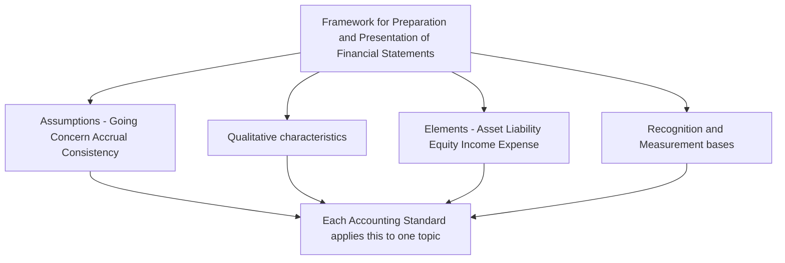
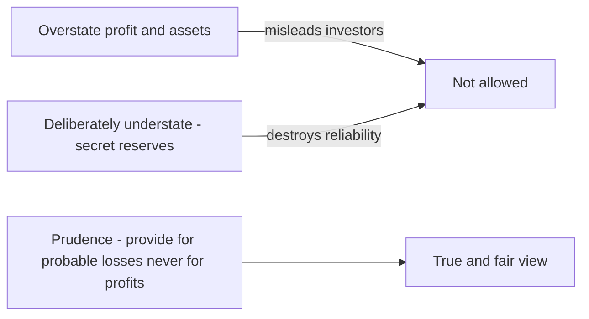
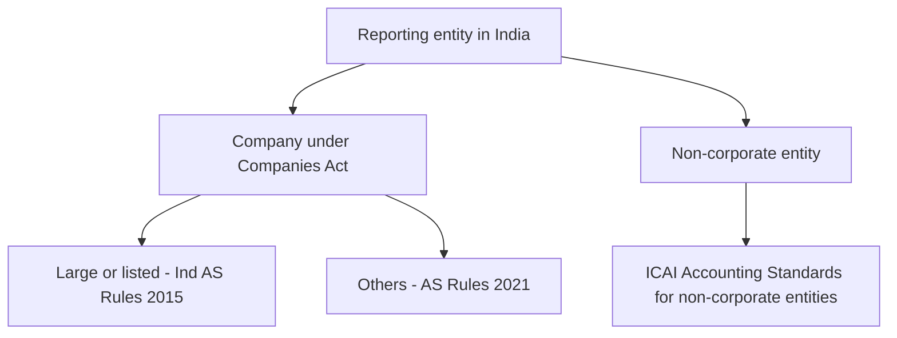
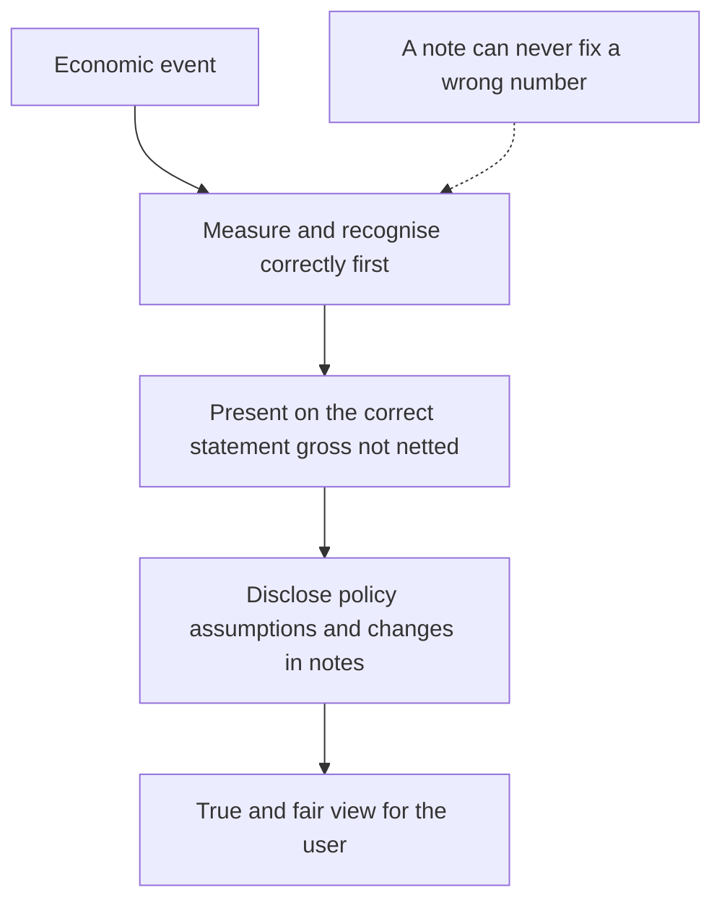

<!-- v2-deep -->

# Chapter 1 — Why Accounting Standards Exist (and the Framework beneath them)

*This is the most important chapter in the whole subject. Every Accounting Standard you will ever study is just this one idea, applied to a specific situation. Get this, and the other standards stop being a list of things to memorize — they become obvious.*

---

## 1. The Problem

Imagine two shops on the same street, selling the same goods, earning the same cash. At year end:

- Shop A says "I made ₹10 lakh profit."
- Shop B says "I made ₹2 lakh profit."

Same business, wildly different numbers. How? Because each owner *chose their own rules*:

- Shop A counted a big order as "sold" the moment the customer *promised* to buy. Shop B waited until goods were actually delivered.
- Shop A valued leftover stock at the price it hopes to sell for. Shop B valued it at what it paid.
- Shop A ignored the fact that a machine is wearing out. Shop B subtracted for it.

Now a banker, an investor, and a tax officer look at these accounts. **They cannot trust either number, and they cannot compare the two shops.** Accounting has become opinion. Worse, a dishonest owner can *engineer* whatever profit he wants — high to attract investors, low to dodge tax.

That is the problem: **when everyone measures money their own way, financial statements become useless for the people who rely on them.**

### 1a. Who actually gets hurt — the "users" lens
The Framework says financial statements are prepared for a wide set of **users**, and *every* rule ultimately protects one of them. Naming them makes the "why" of each standard concrete:

| User | What they decide | What bad accounting does to them |
|---|---|---|
| **Investors / shareholders** | Buy, hold, sell; is management doing well? | Overstated profit lures them into a losing investment. |
| **Lenders / bankers** | Give a loan? At what rate? Will it be repaid? | Hidden liabilities make a risky borrower look safe. |
| **Suppliers / trade creditors** | Sell on credit? | Overstated solvency = unpaid bills. |
| **Employees** | Job security, bonus, wage bargaining | Fictitious profit funds unsustainable demands or masks distress. |
| **Government / tax authorities** | Tax due, regulation | Understated profit dodges legitimate tax. |
| **Public / customers** | Continuity of supply, warranty | Misjudged going concern. |

The exam point: standards are **not** written for the *preparer's* convenience — they are written for these *external users* who cannot demand a custom report and must rely on the general-purpose statements. This is why "the management already knows the truth" is never a defence for weak disclosure.

### 1b. The two questions every user silently asks
Strip the table down and only two questions remain, and the entire subject is engineered to answer them:

1. **Can I trust this number?** (reliability)
2. **Can I compare it — to last year, and to a rival?** (comparability)

Whenever a rule feels arbitrary, map it to one of these two questions and it stops being arbitrary.

---

## 2. The Core Idea

> Accounting Standards are a **shared rulebook** that forces every company to measure and report the same economic event the same way.

Think of it exactly like **standard units of measurement.** A "kilogram" means the same thing in every shop, so you can compare and trust weights. Accounting Standards make a "profit," an "asset," a "liability" mean the same thing across all companies. The goal in one word: **comparability** (and its cousins, **reliability** and **transparency**).

Every single rule in every standard exists to push accounting toward one thing: *the numbers should reflect economic reality, be comparable across companies, and be hard to manipulate.*


*Figure 1 — the whole subject in one line: standards exist to turn opinion back into information.*

### 2a. What a standard does NOT do (the boundary)
Sharpening the idea by its edges — a common source of exam confusion:

- Standards do **not** dictate the *format of ledgers* or the bookkeeping software; they govern the *content and disclosure* of the final financial statements.
- Standards do **not** override **law**. Where a specific statute (e.g. the Companies Act, a banking or insurance regulation) mandates a treatment, the law prevails and the standard's disclosure requirements adapt around it.
- Standards do **not** claim to produce a single "correct" number in every case. Many involve **estimates** (useful life, bad debts, warranty cost). What a standard removes is *arbitrary freedom*; it does not remove *honest judgment*. This distinction — eliminating manipulation while permitting estimation — is a favourite discussion-question theme.
- Standards apply to **material** items only. An immaterial departure from a standard is not a violation (see materiality, §3e).

### 2b. "True and fair view" — the master objective
Above every individual standard sits one legal phrase the Companies Act demands: the accounts must show a **true and fair view**. Standards are the *means*; a true and fair view is the *end*. The rare, examinable consequence: if following a standard's letter would, in an exceptional case, make the accounts misleading, the entity may depart from it **and disclose** the departure and its effect — precisely so the *true and fair* end is not defeated by the *rulebook* means. Standards serve the objective; they are not the objective itself.

---

## 3. Why it's built this way — the Framework beneath the standards

Before any specific standard, ICAI issued a **Framework for the Preparation and Presentation of Financial Statements** — the "constitution" that all standards must obey. You don't memorize the Framework; you understand it, because every standard is downstream of it. The Framework is not itself an Accounting Standard and does not override any specific AS — if a standard ever conflicts with the Framework, the **standard wins**. But when a standard is silent, you reason from the Framework.


*Figure 2 — the Framework feeds every standard. Learn the four boxes at the top and each standard becomes a special case.*

### 3a. The fundamental accounting assumptions (why these three?)
Financial statements are prepared assuming three things are true *unless the contrary is disclosed*. Each one solves a specific problem. (These three are the **fundamental accounting assumptions** named in AS 1.)

| Assumption | The problem it solves | The logic |
|---|---|---|
| **Going Concern** | Should we value assets at "sell-it-all-today" fire-sale prices, or at cost? | We assume the business will *continue* for the foreseeable future. So a machine is valued by the use we'll get from it, not what a scrap dealer would pay tomorrow. If a business is actually shutting down, this assumption breaks and values change. |
| **Accrual** | When cash and the actual economic event happen at different times, which one do we record? | We record the *event*, not the cash. Sold goods on credit in March? That's March's income, even if cash comes in May. This is the difference between "profit" and "cash" — and the reason accrual accounting exists at all. |
| **Consistency** | A company could switch methods every year to flatter its profit. | Once you pick a method, you *stick with it* year to year, so this year is comparable to last year. You can change only with good reason, and you must disclose it. |

The disclosure rule that flows from this (AS 1): if these three assumptions **are** followed, you need say *nothing* — they are presumed. If any one is **not** followed, that fact **must be disclosed**. Silence means "all three hold."

**Finer distinctions the exam tests on these three:**

- **"Foreseeable future"** for going concern is conventionally read as **at least twelve months** from the balance-sheet date, but it is a *judgment*, not a fixed statutory number — flag as "verify current ICAI material" if a question demands an exact horizon.
- **Going concern is binary in effect, graded in evidence.** A business need not be *closing* to break the assumption; *material uncertainty* (e.g. loss of the only customer, inability to refinance a maturing loan) already requires disclosure. Only when management *intends or is forced* to liquidate do you actually switch to break-up (net realisable) values.
- **Accrual has two symmetric halves** students forget: it defers *cash received in advance* (a liability, "income received in advance") just as firmly as it accrues *income earned but not received*. It cuts both ways, and on both the income and expense side (outstanding expenses, prepaid expenses).
- **Consistency is horizontal, not vertical.** It demands the *same* method *across time* — it does **not** demand the same method for every asset. You may depreciate buildings straight-line and vehicles on WDV in the *same* year; that is not inconsistency.
- **Which is NOT a fundamental assumption?** A classic MCQ trap: *materiality, prudence, substance over form* are **policy-selection considerations**, not fundamental assumptions. Only Going Concern, Accrual, Consistency are the three assumptions.

### 3b. Qualitative characteristics (what makes information "good"?)
Information in the accounts should be:
- **Understandable** — a reasonably informed reader can follow it.
- **Relevant** — it actually helps a decision (would you act differently if you knew it?). Governed by *nature* and *materiality*.
- **Reliable** — free from material error and bias; it faithfully represents what happened. Reliability itself rests on faithful representation, substance over form, neutrality, prudence and completeness.
- **Comparable** — across years (consistency) and across companies (common standards).

These four are the *test* a standard-setter applies. Whenever you wonder "why does the standard demand this disclosure?" the answer is almost always "to protect relevance or reliability or comparability."

**Two trade-offs the examiner loves:**

- **Relevance vs Reliability.** The most relevant number (today's market value of a half-built asset) is often the least reliable (it is a guess); the most reliable number (historical cost) can be less relevant (it is stale). Standards constantly *balance* the two rather than maximise either — which is exactly why AS accounts lean on historical cost yet still demand fair-value disclosures in places.
- **Timeliness vs Reliability.** Report too early and you lack facts; wait for perfect certainty and the information is useless. Interim uncertainty is handled by *estimates plus disclosure*, not by delay.
- **Benefit vs Cost** is an overriding constraint sitting above all four: information is required only where its benefit to users exceeds the cost of producing it. This is the theoretical parent of *materiality*.

### 3c. The great tension: Prudence vs. not lying the other way
Here is a subtle idea that explains *dozens* of specific rules:

- **Prudence (conservatism):** when in doubt, **don't overstate** assets or income, and **don't understate** liabilities or losses. Anticipate probable losses, but never anticipate profits. *Why?* Because the dangerous mistake in accounting is optimism — a company that overstates profit misleads investors into losses. So the system deliberately leans cautious.
- **But not too cautious:** if you deliberately *understate* everything, you've also lied and destroyed reliability (hidden "secret reserves"). So prudence is a *lean*, not a licence to lowball.


*Figure 3 — prudence is the narrow safe path between two kinds of lying.*

This single tension is why, for example, stock is valued at **cost OR net realisable value, whichever is lower** (Chapter 3). You'll see prudence everywhere once you know to look for it.

**Where prudence yields to neutrality.** Prudence is a servant of reliability, not a master of it. When an outflow is only *possible* (not *probable*), prudence does **not** let you book a provision — that would understate profit and create a hidden reserve; instead you *disclose* a contingent liability (AS 29). So the boundary is: **probable loss → provide; possible loss → disclose; remote loss → ignore.** That three-way split is prudence *calibrated*, and it is directly examinable.

### 3d. Substance over form
Record the **economic reality**, not just the legal paperwork. If a company "sells" an asset but agrees to buy it back next year at a fixed price, in *substance* it never really sold it — it took a loan with the asset as security. Standards make you record the substance. *Why?* Because form is exactly what a manipulator hides behind.

Other recurring illustrations to recognise instantly:
- **Hire purchase / finance lease** — legal owner is the lessor, but the asset sits on the *lessee's* balance sheet because the lessee bears the risks and rewards (AS 19).
- **Bill-and-hold / consignment "sales"** — goods invoiced but risk not passed are *not* revenue (AS 9).
- **Sale with a repurchase agreement** — financing, not sale (Example 3 below).

### 3e. Materiality
Don't sweat amounts too small to change any reader's decision. A ₹500 stapler in a ₹500-crore company doesn't need to be capitalised and depreciated over 5 years — expense it. *Why?* Because the cost of perfect precision would exceed its benefit, and clutter reduces understandability. Prudence, Substance over Form, and Materiality are, per AS 1, the three **major considerations governing the selection of accounting policies**.

**Materiality is relative and dual-sided:**
- It is judged against **size** *and* **nature**. A ₹5,000 payment can be immaterial by size yet *material by nature* if it is, say, a bribe or a director's related-party transaction — because its *nature* changes a reader's view regardless of amount.
- Materiality is assessed relative to the *entity*: ₹90 is trivial for a ₹500-crore firm but decisive for a ₹2-lakh proprietor.
- Materiality cannot be used to **hide** something. It excuses trivial *imprecision*; it never excuses *omitting a fact* a user needs. Aggregating immaterial items is fine; burying a material one inside them is not.

### 3f. Accounting policies vs estimates vs measurement bases (a distinction that trips students)
The exam tests whether you can separate three ideas that sound similar:

- An **accounting policy** is the *chosen method* for a class of transactions (e.g. FIFO vs weighted-average for stock; straight-line vs WDV for depreciation). Changing it needs justification + disclosure and affects **comparability**.
- An **accounting estimate** is a *judgment about an uncertain amount* under a chosen policy (e.g. the useful life used *within* the straight-line method, the % for doubtful debts). Estimates are *expected* to be revised as facts change; a revision is **not** an error and is applied prospectively.
- A **measurement base** is the *yardstick* (historical cost, current cost, realisable value, present value) the policy sits on.

Mini-drill: "Switching from FIFO to weighted average" = change of **policy**. "Revising machine life from 10 to 8 years" = change of **estimate**. Confusing the two changes the accounting treatment, so examiners test it deliberately.

---

## 4. Full technical content — what a "Standard" actually is, and the machinery around it

### 4a. The anatomy of every standard
An **Accounting Standard (AS)** is a written document that says, for one topic: *here is how you recognise it, measure it, present it, and disclose it.* Notice those four verbs — they are the anatomy of every standard (you'll meet them formally in Chapter 2):

- **Recognition** — *when* does it enter the books? (Two tests from the Framework: it is **probable** that future economic benefit will flow, **and** the item has a **cost or value that can be measured reliably**.)
- **Measurement** — at *what amount*? The Framework lists four measurement bases: **historical cost, current cost, realisable (settlement) value, and present value.** AS accounts are dominated by *historical cost*.
- **Presentation** — *where* on the financial statements?
- **Disclosure** — what extra *explanation* goes in the notes?


*Figure 4 — the four-verb lens. Every standard in the syllabus is these same four questions answered for one topic.*

**Sharper notes on the two recognition tests:**
- Both tests are *cumulative* — fail either and the item is not recognised. A lottery you *might* win is not an asset (benefit not probable); a brand you built internally may be a real benefit yet fails recognition because its value cannot be **measured reliably**. This is exactly why *internally generated goodwill* is never recognised but *purchased goodwill* is — the purchase price makes it reliably measurable.
- "Probable" is usually read as **more likely than not** (> 50%); flag the exact threshold as "verify current ICAI material" where a question pins a number.
- **De-recognition** is the mirror image and equally testable: an item *leaves* the books when the benefit/obligation is gone (asset sold or fully consumed; liability settled or lapsed).

### 4b. The elements being measured
The Framework defines the building blocks so that "asset" and "liability" mean one thing everywhere:
- **Asset** — a resource controlled by the entity from past events, from which future economic benefits are expected.
- **Liability** — a present obligation from past events, whose settlement is expected to result in an outflow of resources.
- **Equity** — the residual: Assets minus Liabilities.
- **Income** — increases in economic benefits (inflows or reduced liabilities) that increase equity, other than contributions from owners.
- **Expense** — decreases in economic benefits (outflows or increased liabilities) that reduce equity, other than distributions to owners.

**The two load-bearing words examiners probe:**
- **"Control," not ownership,** defines an asset. A leased machine the company controls and uses is *its* asset even though it never owns the title — the bridge back to *substance over form*.
- **"Present obligation from a past event"** defines a liability. A plan to buy machinery next year is **not** a liability — no past event, no present obligation yet. This is why *proposed* future expenditure is never provided for. A **constructive** obligation (created by a past pattern or public promise, not a contract) still counts — the "past event" can be an established practice, not only a signed contract.
- **"Other than contributions from / distributions to owners"** is the clause that keeps *capital introduced* out of income and *dividends* out of expense. Drop that clause and share issues would look like profit — which is why it is written in.

### 4c. Who makes them and who must follow them
- ICAI's **Accounting Standards Board (ASB)** drafts them. For companies they acquire legal force when notified as the **Companies (Accounting Standards) Rules, 2021** under the Companies Act, 2013; the **National Financial Reporting Authority (NFRA)** recommends and advises the Central Government on these. For non-corporate entities (proprietorships, firms), ICAI's own pronouncements apply.
- India runs **two parallel sets**: **AS** (the older standards, what you study first at Inter) and **Ind AS** (converged with global IFRS, notified as the Companies (Indian Accounting Standards) Rules, 2015). *Why two?* Because forcing a tiny company to follow the full complexity built for a listed multinational would cost more than it's worth — so applicability is tiered.


*Figure 5 — one country two rulebooks. Which set applies depends on who you are, not on what happened.*

**The tiered-applicability idea (the "why" of proportionate compliance).** Within the AS regime, entities are graded into **Levels** (broadly by turnover, borrowings and public accountability). Smaller entities get **exemptions and relaxations** — for instance certain disclosure-heavy standards or parts of them do not fully apply to the smallest tier. The principle to carry into the exam: *the recognition and measurement core applies to everyone; the disclosure burden scales with the entity's public importance.* Treat the exact turnover/borrowing thresholds as "verify current ICAI material / AY" because ICAI revises the classification.

### 4d. IFRS and convergence (the one-line why)
Capital is global — an investor in New York may fund a company in Nagpur. If every country's accounting differed, cross-border investment would be a guessing game. So the world converged toward common standards (**IFRS**, issued by the IASB); India adopted **Ind AS** as its *converged* version rather than copy-pasting IFRS, keeping a few **carve-outs** for Indian legal and economic reality. "Convergence," not "adoption" — the distinction matters.

- **Adoption** = take IFRS word-for-word. **Convergence** = align with IFRS but keep deliberate differences (**carve-outs**) where Indian law, tax, or economics demand. Because Ind AS carries carve-outs, Ind AS financials are *not* automatically labelled "IFRS-compliant."
- **AS vs Ind AS in one contrast:** AS leans on **historical cost** and legal form in more places; Ind AS pushes **fair value** and substance further, and uses *Other Comprehensive Income*, which AS does not. You only need the *idea* of the gap at Inter, not the item-by-item map.

---

## 5. Worked examples (each reconciles back to a principle)

### Example 1 — Accrual decides *when*, and the numbers must tie out
*A trader delivers goods worth ₹1,00,000 on 28 March on 60-day credit. Cash arrives 27 May. The owner wants the profit "only when cash arrives," pushing it into the next year.*

Reason from the assumption, don't recall a rule. **Accrual** records the *event* (delivery), not the cash. The earning happened in March.

Year 1 (March):
```
Debtors (Asset)        Dr  1,00,000
    To Sales (Income)              1,00,000
```
Year 2 (May), on receipt:
```
Bank                   Dr  1,00,000
    To Debtors                     1,00,000
```
**Reconciliation:** Income recognised = ₹1,00,000 in Year 1, ₹0 in Year 2. The May entry moves an asset (Debtors) into another asset (Bank) — total assets unchanged, **no new profit** in Year 2. Cash timing and profit timing are deliberately different, and the two years still tie to a single ₹1,00,000 sale. The owner's wish is exactly the manipulation the assumption blocks.

### Example 2 — Prudence: cost vs net realisable value
*Closing stock cost ₹80,000. Due to a market crash it can now be sold for only ₹65,000 (net of selling costs). At what value does it appear?*

**Prudence** says never overstate an asset and provide for a *probable* loss now. Value at **lower of cost and NRV = ₹65,000**. The ₹15,000 fall is charged to this year's Profit & Loss.

**Reconciliation — why not the reverse?** Suppose instead NRV had *risen* to ₹95,000. You would **not** write the stock up to ₹95,000, because that anticipates a profit not yet earned. So the rule is one-directional: write **down** to NRV, never **up**. Both halves of the same example are pure prudence — the asymmetry *is* the principle. (This is AS 2, Chapter 3, derived here from first principles.)

### Example 3 — Substance over form: a "sale" that is really a loan
*On 31 March a company "sells" a machine (book value ₹5,00,000) to a financier for ₹6,00,000, with a binding agreement to buy it back on 30 September for ₹6,30,000. It wants to book a ₹1,00,000 profit on sale.*

Look at **substance**, not the invoice. The company keeps use of the machine, must repurchase it, and pays back ₹6,30,000 for ₹6,00,000 received — that ₹30,000 is *interest* over six months. In substance this is a **secured borrowing**, not a sale.

Correct treatment (substance):
```
Bank                   Dr  6,00,000
    To Borrowing (Liability)       6,00,000
```
No profit on "sale"; the machine stays an asset; ₹30,000 is booked as finance cost over the six months.

**Reconciliation of the two views:**

| | If treated as a Sale (form) | Correct - Borrowing (substance) |
|---|---|---|
| Profit this year | +₹1,00,000 (fictitious) | ₹0 |
| Machine on Balance Sheet | Removed | Still shown as asset |
| Liability created | None | ₹6,00,000 borrowing |
| ₹30,000 buy-back premium | Ignored | Interest expense over 6 months |

The "sale" view inflates profit by ₹1,00,000 and hides a ₹6,00,000 liability — precisely the distortion **substance over form** exists to prevent.

### Example 4 — Materiality: don't drown the reader in trivia
*A ₹500-crore company buys a stapler for ₹450 that will last 5 years.*

Strictly, it is an asset used over 5 years, so "should" be capitalised and depreciated ₹90 a year. But ₹90 could never change any reader's decision about a ₹500-crore company. **Materiality** says expense the whole ₹450 now.
```
Office expenses        Dr  450
    To Bank                        450
```
**Reconciliation:** capitalising would move at most ₹360 of value onto a balance sheet that already runs into thousands of crores — invisible, and it would clutter the fixed-asset register with junk. Materiality trades trivial precision for **understandability**, exactly as the Framework intends.

### Example 5 — Going concern breaks: the same asset, two values
*A firm's plant cost ₹20,00,000; accumulated depreciation ₹8,00,000, so book (going-concern) value ₹12,00,000. Case A: the firm continues normally. Case B: on 31 March management resolves to shut down and sell everything; the plant would fetch only ₹7,00,000 in a forced sale.*

Reason from the **going concern** assumption, which decides *which measurement base* is appropriate.

- **Case A (assumption holds):** value by *continued use* → carry at **₹12,00,000** (historical cost less depreciation). No write-down; the ₹7,00,000 market price is irrelevant while the asset stays in use.
- **Case B (assumption fails):** the basis switches from "cost less depreciation" to **net realisable / break-up value** → carry at **₹7,00,000**, and charge the ₹5,00,000 fall to P&L. The intent to liquidate must be **disclosed** (a fundamental assumption has not been followed).

**Reconciliation — what actually changed?** The machine is physically identical in both cases; only the *assumption about the future* changed, and that alone moved the carrying amount by ₹5,00,000. This is the cleanest proof that going concern is a *measurement-driving* assumption, not a footnote.

*Examiner tweak — "material uncertainty but no decision to close":* if the firm is in serious difficulty (say its loan is overdue and refinancing is doubtful) but has **not** resolved to liquidate, you do **not** yet switch to ₹7,00,000. You keep the going-concern value **and disclose the material uncertainty**. Only an actual intention/necessity to liquidate flips the base. Students over-apply the write-down here — the trigger is *decision to liquidate*, not merely *bad times*.

### Example 6 — Provision vs contingency: prudence, calibrated
*At 31 March a customer sues the company for ₹10,00,000. (a) Lawyers say the company will *probably* lose about ₹6,00,000. (b) Instead, lawyers say a loss is *possible but not probable*. (c) Instead, the claim is frivolous and loss is *remote*.*

Reason from **prudence bounded by neutrality** and the probable/possible/remote ladder (AS 29 territory, derived here from first principles).

- **(a) Probable + reliably estimable → provide.** Recognise a liability and expense of ₹6,00,000 now.
  ```
  Legal claim expense    Dr  6,00,000
      To Provision for claim         6,00,000
  ```
- **(b) Only possible → do NOT provide; disclose a contingent liability** in the notes (no entry, no charge to P&L).
- **(c) Remote → neither provide nor disclose.**

**Reconciliation — why the three-way split?** Booking ₹6,00,000 in case (b) would *understate* profit and manufacture a hidden reserve (over-prudence); ignoring it in case (a) would *overstate* profit and mislead lenders (under-prudence). The ladder is prudence *calibrated to probability* so it protects reliability in **both** directions.

*Examiner tweak — the range:* if the probable loss is estimated as a *range* ₹5,00,000–₹7,00,000 with no point more likely, you provide the **best estimate** (mid-point ₹6,00,000 here), not the highest figure — providing the worst case would again slide into over-prudence. Flag any exact "which point in the range" rule as "verify current ICAI material."

### Example 7 — Policy change vs estimate change (and how each hits the accounts)
*A machine cost ₹10,00,000, expected life 10 years, straight-line, nil scrap. After 4 years (carrying value ₹6,00,000) the company revises the *remaining* life. Compare two scenarios.*

- **Scenario X — change of ESTIMATE:** at the start of Year 5 the firm now expects only **3** more years of life. Spread the remaining ₹6,00,000 over 3 years → new charge **₹2,00,000 per year**, applied **prospectively**. Years 1–4 are *not* restated; this is not an error.
  - *Check:* ₹8,00,000 already charged (4 × ₹2,00,000 was the old ₹1,00,000 × 4 = ₹4,00,000; carrying value ₹6,00,000) then ₹6,00,000 over the next 3 years → total ₹4,00,000 + ₹6,00,000 = ₹10,00,000 = cost. Fully absorbed, no restatement.
- **Scenario Y — change of POLICY** (say, switching the *method* from straight-line to WDV): this is a change in an **accounting policy**; disclose the change, the **reason**, and the **amount of the effect** if ascertainable. Comparability is preserved by *disclosure*, not by pretending nothing changed.

**Reconciliation — why treat them differently?** An estimate revision reflects *new information about the future* (the machine wears faster than thought) — so it can only be forward-looking. A policy change alters the *method itself*, so users must be *told* to keep year-on-year figures comparable. Same machine, but the label ("estimate" vs "policy") dictates a completely different treatment — which is exactly why the examiner plants the ambiguity.

---

## 6. Presentation and disclosure

This chapter is the *ground* of AS 1 (Disclosure of Accounting Policies), which you study formally next; here is where it lands on the page.

- **A complete set of financial statements** under AS comprises the **Balance Sheet**, the **Statement of Profit and Loss**, and (where applicable) the **Cash Flow Statement**, together with the **notes** and accounting policies. The very existence of a *separate* Cash Flow Statement (AS 3) is the accrual/cash distinction made visible.
- **Accounting policies must be disclosed** — the specific principles and methods adopted (e.g. the depreciation method, the stock-valuation basis). All significant policies should be disclosed **at one place** as the first note.
- **Fundamental assumptions:** if Going Concern, Accrual and Consistency are followed, **no disclosure is required**. If any is *not* followed, the fact **must be disclosed**.
- **Change in an accounting policy** that has a material effect must be disclosed, along with the **amount** of the effect where ascertainable; if not ascertainable, that fact is stated. This is how comparability survives a genuine change of method.
- Presentation is governed throughout by the qualitative characteristics: group like items, show comparatives for the previous year, and don't offset assets against liabilities unless a standard permits it.

**Four presentation principles the exam quietly assumes you know:**
- **No offsetting.** Show assets and liabilities (and income and expenses) *gross*, not netted, unless a standard specifically permits netting. Netting hides gross exposure — a reliability concern. (E.g. don't net an overdraft against a separate bank balance.)
- **Comparatives.** Every figure carries the *previous year's* figure alongside — comparability made physical on the face of the statement.
- **Consistency of presentation.** Not just methods but *classification and layout* stay stable year to year, so a reader isn't misled by a reshuffled format.
- **Disclosure is not a cure for wrong accounting.** You cannot recognise an item incorrectly and "fix" it with a note. Correct recognition and measurement come first; disclosure *supplements*, it does not *substitute*. This is a favourite one-line theory question.


*Figure 6 — disclosure supplements correct accounting; it never rescues incorrect accounting.*

---

## 7. Connections

- **Chapter 2** turns "recognition / measurement / presentation / disclosure" into a reusable lens for reading *any* standard, and covers AS 1 (Disclosure of Accounting Policies) — the Framework made into a rule.
- **Prudence** → directly drives AS 2 (inventory at lower of cost/NRV, Ch 3), provisions in AS 29, and investments in AS 13.
- **Accrual** → drives AS 9 revenue, AS 7 construction contracts, and depreciation (Ch 4).
- **Going concern** → underpins asset valuation everywhere, and is a red flag the *auditor* independently checks (Auditing subject).
- **Substance over form** → reappears in leases (AS 19), amalgamation (AS 14), and consolidation.
- **Cash vs profit** → the reason the Cash Flow Statement (AS 3) exists as a separate statement.
- **Materiality / estimates** → decide capitalisation thresholds (Ch 4, AS 10 property, plant and equipment) and the treatment of a *change in estimate* (AS 5).
- **Probable / possible / remote ladder** → the spine of AS 29 (provisions, contingent liabilities and contingent assets), and the reason contingent *assets* are treated even more cautiously than contingent liabilities.

---

## 8. Traps & confusions

- **"Profit = cash." No.** Because of accrual, a company can be profitable and still cash-starved (all sales on credit), or cash-rich and loss-making. Keep the two ideas separate — this is the #1 beginner error.
- **Prudence ≠ pessimism.** You provide for *probable* losses, not *imaginary* ones. Deliberately understating profit (secret reserves) is as wrong as overstating it.
- **"Standards are arbitrary rules to memorize." No.** Each is a solution to a manipulation or ambiguity. Always ask "what would go wrong if this rule didn't exist?" — the answer is the point of the rule.
- **Consistency ≠ never changing.** You *can* change a method for a genuinely better one; you just disclose it and its effect, so comparability is preserved by transparency.
- **Framework ≠ a Standard.** The Framework guides standard-setting and fills gaps, but it does **not** override any specific AS. If they conflict, the standard prevails.
- **"Ind AS = IFRS." Not quite.** India *converged* to IFRS as Ind AS with carve-outs; it did not blindly adopt IFRS.
- **Fundamental assumptions and disclosure.** Following them needs *no* disclosure; *departing* from any one triggers disclosure. Students often state it backwards.
- **Change of *policy* vs change of *estimate*.** Policy change → disclose amount of effect, comparability concern. Estimate change → prospective, *not* an error, minimal fuss. Mislabelling them is a classic lost mark.
- **Provide vs disclose vs ignore.** Probable loss → *provide*; possible → *disclose* (contingent liability); remote → *ignore*. Booking a provision for a merely *possible* loss is over-prudence and wrong.
- **Going concern trigger.** The break-up basis kicks in only on an actual *intention/need to liquidate* — not merely on losses or uncertainty (which trigger *disclosure*, not a write-down).
- **Materiality is not a hiding place.** It excuses trivial *imprecision*, never the *omission* of a fact a user needs; and a small amount can still be material by *nature*.
- **"Control = ownership." No.** An asset is what you *control*, not what you legally *own* — the reason leased assets can sit on the lessee's books.
- **Substance over form works both ways.** It can *add* an item the paperwork omits (finance lease onto the books) and *remove* one the paperwork asserts (a repo "sale"). Don't treat it as only a deletion rule.
- **Disclosure cannot cure wrong recognition.** A note explaining a misstated figure does not make it acceptable — fix the number, then disclose.

---

## 9. First-principles recap

- Accounting Standards exist because **without a shared rulebook, profit becomes opinion** and comparison and trust collapse — and the people harmed are the *external users* (investors, lenders, tax) who can't demand a custom report.
- The whole system optimises for **comparability + reliability + relevance**, expressed through a **Framework** every standard obeys, and it *balances* those qualities (relevance vs reliability) rather than maximising any one.
- Three fundamental assumptions do the heavy lifting: **Going Concern** (value by continued use), **Accrual** (record the event, not the cash), **Consistency** (same method year to year).
- **Prudence** makes the system lean cautious (never overstate profit or assets) — but *calibrated* by the probable/possible/remote ladder so it never slides into hidden reserves.
- **Substance over form** + **materiality** keep the numbers honest and readable, and together with prudence govern the *choice* of accounting policies.
- **Recognition** needs *probable benefit* **and** *reliable measurement* (both), which alone explains purchased vs internal goodwill; **control** (not ownership) defines an asset; **present obligation from a past event** defines a liability.
- Every standard is just **recognise → measure → present → disclose** applied to one topic — so learn the *lens*, not a stack of separate lists. And above all standards sits one legal objective: a **true and fair view**.

---

## 10. Quick-revision sheet

| Item | One-line memory hook |
|---|---|
| Why standards exist | Without a shared rulebook, profit is opinion — kills comparability and trust |
| Who they protect | External **users** — investors, lenders, suppliers, employees, government, public |
| Master objective | **True and fair view**; standards are the means, not the end |
| Three fundamental assumptions | **Going Concern, Accrual, Consistency** (AS 1) |
| Going Concern | Value assets by future use, not fire-sale price; break-up basis only on *intent to liquidate* |
| Accrual | Record the **event**, not the cash → profit ≠ cash; cuts both ways (income & expense) |
| Consistency | Same method **over time** (not across all assets) → comparable year to year |
| 4 qualitative characteristics | **Understandable, Relevant, Reliable, Comparable** |
| Key trade-off | **Relevance vs Reliability** (and Timeliness vs Reliability); Benefit > Cost overrides all |
| 3 policy-selection considerations | **Prudence, Substance over Form, Materiality** (AS 1) |
| Prudence | Provide for probable **losses**, never for unearned **profits** (one-directional) |
| Probable / possible / remote | **Provide / Disclose / Ignore** — prudence calibrated |
| Substance over form | Record economic reality, not the legal label; works both ways (add *and* remove) |
| Materiality | Ignore amounts too small to change a decision; but *nature* can make a small amount material |
| Policy vs estimate | Policy change → disclose effect; estimate change → **prospective, not an error** |
| 4 verbs of any standard | **Recognise → Measure → Present → Disclose** |
| Recognition test | Probable future benefit **and** reliably measurable (both) → why purchased goodwill in, internal out |
| Asset vs liability keywords | Asset = **control** (not ownership); liability = **present obligation from a past event** |
| Measurement bases | Historical cost, Current cost, Realisable value, Present value |
| 5 elements | Asset, Liability, Equity, Income, Expense |
| Two Indian rulebooks | **AS** (Rules 2021) for most companies; **Ind AS** (Rules 2015) for large/listed |
| Tiered applicability | Recognition/measurement for all; **disclosure scales** with size/public importance |
| Standard-setter / enforcer | ICAI **ASB** drafts; **NFRA** recommends; notified under Companies Act |
| IFRS link | India **converged** (not adopted) → Ind AS with carve-outs |
| Framework vs Standard | Framework guides and fills gaps but a specific **AS prevails** on conflict |
| Disclosure of assumptions | Followed → no disclosure; **departed → must disclose** |
| Disclosure limit | A note **cannot cure** a wrong number; correct accounting first |
| Complete financial statements | Balance Sheet + Statement of P&L + Cash Flow Statement + notes/policies |
| Presentation rules | No offsetting, show comparatives, consistent classification |
