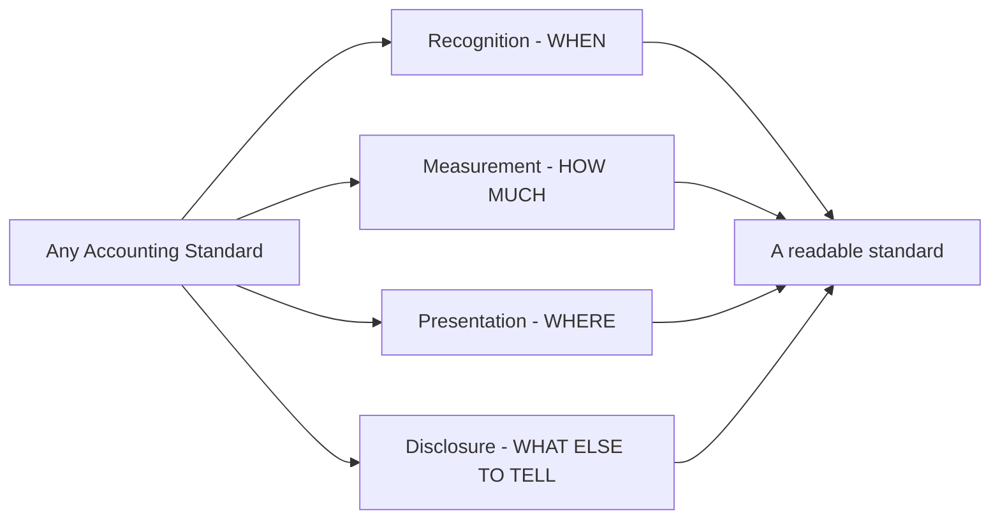
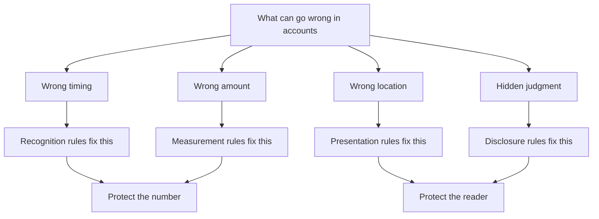
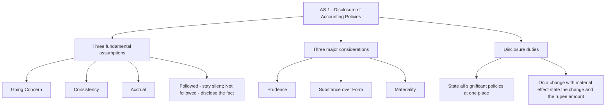
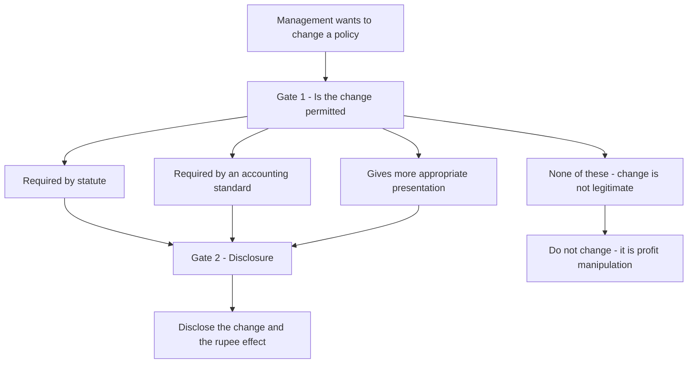
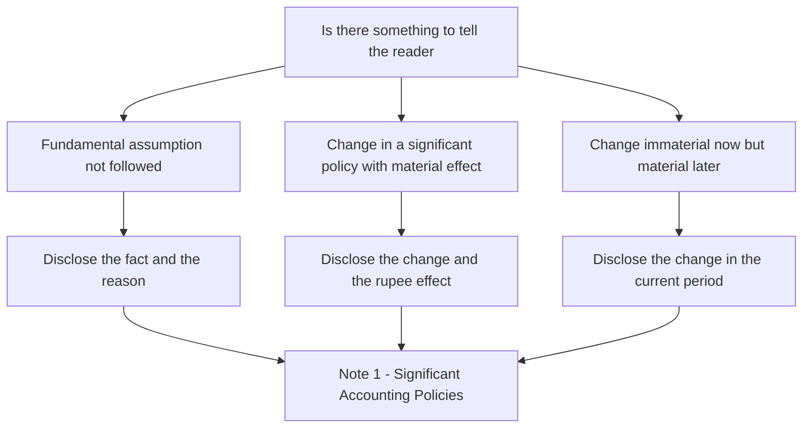

<!-- v2-deep -->

# Chapter 02 — How to Read Any Accounting Standard (+ AS 1: Accounting Policies)

*There are around 27 notified Accounting Standards. Nobody masters them by treating them as 27 unrelated documents. There is a single lens that unlocks all of them. This chapter hands you that lens, then applies it to the simplest standard, AS 1, so you see the lens actually working.*

---

## 1. The Problem

A student opens AS 2, then AS 10, then AS 16, and drowns. Each looks like a wall of paragraphs, definitions, and exceptions. It feels like 27 separate mountains to climb. The natural panic response is to **memorise the answer** — memorise "inventory is valued at lower of cost and net realisable value," memorise "borrowing costs on a qualifying asset are capitalised."

That strategy fails in the exam, and it fails for a precise reason. The examiner rarely asks the plain textbook line. She *tweaks the situation*: the goods are on a sale-or-return basis, the loan was partly idle, the policy changed mid-year. The memorised sentence no longer fits the tweaked fact pattern, and the student freezes.

The deeper problem is not that the student forgot a rule. **The student has no reusable structure on which to hang each standard.** Every standard is actually built on the same small skeleton — but if you cannot see the skeleton, every standard looks new, and every tweak looks unanswerable.

There is a second, quieter failure mode worth naming, because the exam punishes it just as hard. A student who *has* memorised the line often applies it in the **wrong box**. Told that a contingent liability must be "shown," they *record* it — when AS 29 only wants it *disclosed*. Told a policy changed, they *restate* last year — when AS 5's default for a policy change under Indian GAAP is to hit the **current** period and merely *disclose* the effect. The confusion is not about the rule; it is about *which of the four jobs* the rule is doing. A structure that separates the four jobs cleanly is therefore not a study aid — it is the thing that stops these mis-classifications.

So before we learn any single standard, we need the skeleton itself.

---

## 2. The Core Idea

> Every Accounting Standard answers the same four questions, in the same order. Learn the four questions once, and you can *interrogate* any standard instead of memorising it.

Call it the **RMPD lens**:

1. **Recognition — WHEN does it enter the books?** What conditions must be true before I am allowed to record this item at all?
2. **Measurement — at WHAT AMOUNT?** The initial amount, and then the amount at each later balance sheet date.
3. **Presentation — WHERE does it go?** Which line of the Balance Sheet, Statement of Profit and Loss, or Cash Flow Statement?
4. **Disclosure — what EXTRA explanation goes in the notes?** So a reader can understand the judgment behind the number.

That is the whole trick. AS 2 is just "RMPD applied to inventory." AS 10 is "RMPD applied to property, plant and equipment." AS 16 is "RMPD applied to borrowing costs." Whenever a standard overwhelms you, break its paragraphs into these four buckets and it collapses into something small enough to hold in your head.

**A fifth silent question sits under Recognition: does this standard even apply to me here?** Before you ask "when do I record it," ask "am I inside this standard's *scope*?" Almost every standard opens with a scope paragraph that carves out exceptions — AS 2 excludes work-in-progress under construction contracts (that is AS 7's territory); AS 10 excludes biological assets and wasting assets like mineral rights. Reading the scope first prevents the commonest silly error: applying the right rule to the wrong item. Treat scope as the doormat you must cross before entering the RMPD house.

*Every standard, no matter how long, sorts into the same four buckets.*

**How to actually use the lens on a fresh standard — a repeatable drill.** When a new standard lands in front of you, do not read top to bottom. Run this pass:

1. **Scope** — one line: what is in, what is carved out.
2. **Definitions** — underline only the two or three terms the rules hinge on (for AS 16 it is "qualifying asset"; for AS 2 it is "net realisable value").
3. **Recognition trigger** — find the single sentence that says "recognise when...".
4. **Measurement — initial** then **subsequent**. Almost every measurement error in the exam is confusing these two.
5. **Presentation** — one line on where it lands.
6. **Disclosure** — skim; it is rarely where marks are lost, but it is where easy marks are won.

Six passes, six lines. A twelve-page standard becomes a six-line map. The rest of the standard is elaboration and examples hanging off those six hooks.

---

## 3. Why It's Built This Way — Why These Four Questions, In This Order

The four questions are not arbitrary. Each one exists because a *specific* thing can go wrong, and they are ordered by the sequence in which those things go wrong.

- **Recognition comes first**, because the earliest place to distort accounts is *timing* — booking income too early or a liability too late. A recognition rule says "you may not record this until *these* conditions are true." For example, do not recognise revenue until the significant risks and rewards of ownership have passed to the buyer; otherwise you would book profit on goods still sitting in your own warehouse.

- **Measurement comes next**, because even once we agree that *something* exists, *how much* is the next place to differ or to lie. Measurement rules pin the amount — cost, fair value, or the lower of the two — so that two honest accountants looking at the same facts reach the same figure.

- **Presentation comes third**, because *where* a number sits changes the story it tells. Hiding a short-term loan inside "trade payables," or netting a large expense against income so the reader never sees it, misleads even when the arithmetic total is correct. Presentation rules fix the location.

- **Disclosure comes last**, because numbers alone conceal the *judgment* behind them. Two companies can both be "correct" and yet have used different methods. Disclosure forces each to *tell* you which method it used, restoring comparability. Disclosure is the framework's release valve: "you may exercise judgment, but you must confess it."

Notice the pattern, because it is the single most useful sentence in this chapter:

> **Recognition and measurement protect the *number*. Presentation and disclosure protect the *reader's understanding* of the number.**

That is exactly the reliability-and-comparability goal from Chapter 1, now operationalised into a four-step machine.

**Why *this* order and not another — the dependency argument.** The sequence is not just "when things go wrong"; it is a genuine dependency chain. You cannot measure what you have not first recognised — an amount presupposes an item to attach it to. You cannot decide where to present a number until you know both that it exists and how big it is. And you cannot meaningfully disclose the judgment behind a figure until the figure itself is settled. So RMPD is not four parallel questions; it is a **pipeline**, where each stage feeds the next. This is why the exam's hardest questions bury the trap at Recognition: get the first stage wrong and every downstream stage is automatically wrong too, so a single early error can cost an entire question.

**Why disclosure is a *release valve* and not a loophole.** A student sometimes reads "you may exercise judgment, but you must confess it" as permission to do anything so long as you mention it in the notes. That is a misreading. Recognition and measurement rules are *mandatory floors* — you cannot recognise revenue you have not earned and cure it with a note. Disclosure only opens up *after* recognition and measurement have been satisfied, and only over the space where the standard genuinely *permits* a choice (FIFO vs weighted average, SLM vs WDV). Disclosure widens comparability inside the permitted space; it never legalises a wrong number. Hold this line, because examiners love the fact pattern where a company "discloses" its way around a hard recognition rule — and the correct answer is that disclosure cannot rescue it.

*Each of the four questions exists to block one specific way accounts get distorted.*

---

## 4. Full Technical Content

### 4a. Applicability — why not every enterprise applies every standard identically

Forcing a corner grocery to apply, in full, a standard designed for a listed conglomerate would cost more than it delivers. So the standards are applied in **tiers** based on size and public interest.

At the Intermediate level you work with the ICAI classification of **Non-company entities into Levels I, II, III and IV**, and, for companies, the **Small and Medium-sized Company (SMC)** concept under the Companies (Accounting Standards) Rules, 2021. Smaller entities receive **relaxations** — but read what those relaxations actually touch:

- The relaxations are overwhelmingly in **disclosure**, plus exemption from a few complex standards (for example, an SMC need not present certain segment or diluted-EPS information and gets simplified treatment for defined-benefit and lease disclosures).
- The relaxations **do not** touch core recognition and measurement. A wrongly computed profit is wrong for a small firm exactly as for a large one.

**The logic to carry forward:** relaxations target *disclosure volume and a handful of complex standards*, never the honesty of the core number.

**Finer distinctions the exam tests on applicability.**

- **The classification is driven by objective triggers, not self-declaration.** An SMC is essentially a company that (i) has no equity or debt securities listed or in the process of listing, (ii) is not a bank, financial institution or insurance company, (iii) has turnover and borrowings below prescribed thresholds, and (iv) is not a holding or subsidiary of a non-SMC. Cross *any one* trigger and you are out. *(Verify the current turnover and borrowing thresholds against the latest ICAI material / Companies (Accounting Standards) Rules, as these figures are periodically revised.)*
- **Non-company Level I** broadly captures entities that are large or in the public interest — those with turnover or borrowings above prescribed limits, banks, financial institutions, insurers, and entities whose securities are listed or being listed. Levels II, III and IV are progressively smaller and get progressively more relaxations. *(Again, verify the precise numeric thresholds against current ICAI material.)*
- **The "once out, always disclose the transition" idea.** When an entity that enjoyed relaxations *ceases* to qualify (e.g., an SMC crosses a threshold), it must comply fully; and when it *re-qualifies* after previously being non-SMC, it can avail relaxations again, but the fact and the reasons are typically disclosed. Consistency of classification matters so readers are not whipsawed.
- **A crucial trap: exemption from *disclosure* is optional, not a prohibition.** A small entity is *permitted* to skip certain disclosures; it is never *forbidden* from making them. Voluntarily giving more information is always allowed and often good practice.

### 4b. AS 1 — Disclosure of Accounting Policies (the Framework made enforceable)

AS 1 is the natural first standard to study, because it is the **Framework of Chapter 1 turned into an actual rule**. Its entire job is to *make an enterprise tell readers which accounting choices it made.*

**The problem AS 1 solves.** A company's reported profit depends on choices — depreciation method, inventory cost formula, revenue timing, treatment of foreign exchange. If the company does not reveal those choices, a reader cannot interpret the profit and certainly cannot compare it against another company. AS 1 forces the choices into the open.

**Accounting policies, defined.** AS 1 defines accounting policies as *the specific accounting principles and the methods of applying those principles adopted by an enterprise in preparing and presenting financial statements.* There is no single list of "correct" policies, precisely because different businesses legitimately need different methods.

**Two nouns in that definition, and both matter.** A policy has a *principle* half and a *method* half. The *principle* is the accounting idea ("inventory is carried at cost, subject to a lower-of test"); the *method* is the concrete way that principle is applied ("cost is measured using the weighted-average formula"). AS 1 covers both. This two-part structure is exactly why a change from FIFO to weighted average is a *policy* change: you kept the principle (carry at cost) but changed the method of applying it. Keep this dissection ready — it settles most "is this a policy?" questions instantly.

**The three fundamental accounting assumptions.** AS 1 names exactly three:

1. **Going Concern** — the enterprise is assumed to continue in operation for the foreseeable future.
2. **Consistency** — accounting policies are assumed to be applied consistently from one period to the next.
3. **Accrual** — revenues and costs are recognised as they are earned or incurred, not as cash is received or paid.

The rule on these assumptions is elegant and asymmetric, and it is a favourite examiner trap:

> If a fundamental assumption is **followed**, it need **not** be disclosed — it is presumed. If a fundamental assumption is **not followed**, that fact **must** be disclosed.

You only raise your voice when something is broken.

**Why exactly these three, and why they are "assumptions" not "considerations."** An *assumption* is a default the reader is entitled to presume without being told — it is baked into the very act of preparing general-purpose financial statements. Going Concern justifies carrying assets at cost rather than fire-sale value; Accrual justifies recording a credit sale before cash arrives; Consistency justifies comparing this year with last. Remove any one and the financial statements would need a completely different construction — which is precisely why their *absence* is the newsworthy event that must be disclosed. Contrast that with the three *considerations* below, which are not defaults but *inputs you actively weigh* when choosing between permitted methods.

**The three major considerations governing selection of policies.** When choosing among defensible methods, AS 1 says the choice is governed by:

1. **Prudence** — do not anticipate profits; provide for all known liabilities and losses even if the amount is only an estimate.
2. **Substance over Form** — account for transactions by their commercial reality, not merely their legal label.
3. **Materiality** — disclose every item whose knowledge might influence the decisions of a user.

These are the same three ideas from Chapter 1, now made mandatory inputs into policy selection. That is the clearest possible proof that AS 1 *is* the Framework wearing a uniform.

**Prudence has a knife-edge the exam loves.** Prudence says *provide for all known losses* but *do not anticipate profits*. The trap is over-prudence: deliberately creating excessive provisions or secret reserves to understate profit is **not** prudence — it violates the true-and-fair requirement just as surely as overstating profit does. Prudence is a guard against optimism, not a licence for pessimism. If an examiner shows a company padding a provision "to be safe," the answer is that this breaches prudence, not that it honours it.

**What AS 1 requires you to do.**

- **Disclose all significant accounting policies** in one place, normally the first note to the accounts, so a reader sees the "rules of the game" this enterprise played by.
- Disclose the policies **at one place** and as **part of the financial statements** (not buried in the directors' report).
- If any fundamental assumption is **not** followed, **disclose that fact**.
- If there is a **change in an accounting policy** that has a **material effect**, disclose the change **and the rupee amount of the effect**. If the effect is not ascertainable, wholly or in part, disclose that fact.
- A change in policy that has **no material effect in the current period but is reasonably expected to have a material effect in later periods** should also be **disclosed** in the period of the change.

**When is a company even *allowed* to change a policy?** AS 1 does not let you swap methods on a whim. A change in accounting policy is permitted only when (a) it is **required by statute**, (b) it is **required by an accounting standard**, or (c) it results in a **more appropriate presentation** of the financial statements. A change made purely to inflate profit fails all three and is not a legitimate policy change at all. This is the hidden gatekeeper behind Example 1: before you even reach the disclosure duty, the change must first *clear this permission test*.

**Why disclosure rather than one fixed method?** Because for many topics more than one method is genuinely defensible — FIFO versus weighted average, straight-line versus written-down-value depreciation. Rather than banning choice, AS 1 says "choose sensibly, then *tell* everyone." Choice plus disclosure beats a rigid one-size rule that would misfit half the businesses in the country.

**AS 1 versus the presentation standards — a boundary students blur.** AS 1 governs *which policies you disclose and how you handle changes*. It does **not** dictate the *format* of the balance sheet or profit and loss account — that comes from Schedule III to the Companies Act for companies. So a question about "under what head does this appear" is usually a Schedule III / presentation-standard question, not an AS 1 question. AS 1's territory is narrow and deep: the *policy note* and the *discipline around changing policies*, nothing more.

*AS 1 in one picture — three assumptions, three considerations, and the disclosure duties they drive.*

**The permission-then-disclosure sequence, made visual.** A legitimate policy change has to pass through two gates, in order — first "am I *allowed* to change," then "what must I *tell* the reader." Skipping the first gate is the most common conceptual error.

*A policy change must clear the permission gate before the disclosure gate even opens.*

---

## 5. Worked Examples

### Example 1 — A quiet change in two policies (the classic AS 1 trigger)

*Company X changed its depreciation method from straight-line to written-down-value and switched inventory valuation from FIFO to weighted average this year. Reported profit jumped from Rs 80,00,000 to Rs 1,10,00,000. Management plans to simply report the higher profit without comment.*

Reasoning through AS 1:

- Depreciation method and inventory cost formula are both **significant accounting policies**. They must be disclosed as policies in the first place.
- Each is a **change in an accounting policy** with a **material effect** (the two together lifted profit by Rs 30,00,000). AS 1 requires disclosure of the change **and the rupee amount of its effect** — here the roughly Rs 30,00,000 uplift, split by cause where ascertainable.
- **Why it matters:** a reader who sees "profit up 37.5 percent" must be able to tell whether the business genuinely improved or whether the company merely *changed the rules of measurement*. Without disclosure the two are indistinguishable — which is precisely the trust problem the standards exist to kill.

**Reconciliation of the number the reader is entitled to:**

| Item | Rs |
|---|---|
| Profit reported last year (old policies) | 80,00,000 |
| Effect of change in depreciation method | + 12,00,000 |
| Effect of change in inventory formula | + 18,00,000 |
| Profit reported this year (new policies) | 1,10,00,000 |

The "quiet" plan violates AS 1. The reconciliation shows *exactly what a reader is owed*: the Rs 30,00,000 is a measurement change, not operating improvement. You derived that from the comparability principle, not from rote.

**The tweak the examiner adds:** *"The effect of the depreciation change can be computed as Rs 12,00,000, but the inventory effect cannot be reliably split out from ordinary price movements."* Now AS 1's fallback fires: where the effect of a change is **not ascertainable, wholly or in part, that fact itself must be disclosed.** So the answer becomes: disclose the Rs 12,00,000 depreciation effect *and* state that the inventory-formula change had a material effect whose amount is not ascertainable. Note how you never lose marks here — the standard always leaves you a sentence to write.

### Example 2 — A broken fundamental assumption

*Company Y has lost its only major customer, its bank has recalled its loan, and the directors have resolved to wind up operations within six months. The accountant nonetheless prepares the accounts on the usual going-concern basis and says nothing, reasoning "Going Concern is a fundamental assumption, so I never need to mention it."*

Reasoning through AS 1:

- Going Concern is indeed a fundamental assumption — but the AS 1 rule is **asymmetric**. Silence is permitted only when the assumption **is** followed.
- Here the assumption is **not** appropriate: the enterprise is not expected to continue for the foreseeable future. AS 1 requires the entity to **disclose the fact** that the going-concern assumption is not followed.
- **Why it matters:** assets carried at going-concern values (say, a factory at Rs 5,00,00,000 book value) may realise far less in a forced sale. A reader must be warned that the whole valuation basis is in doubt.

**Contrast that pins the rule:**

| Situation | Going Concern | AS 1 duty |
|---|---|---|
| Company Y (winding up) | Not followed | **Must disclose** the fact |
| A healthy trading company | Followed | Stay silent — it is presumed |

The accountant's reasoning is exactly backwards. You disclose the assumption only when it *breaks*.

**The tweak the examiner adds:** *"The directors are worried about liquidity and have merely discussed the possibility of closure, but no decision has been taken; the company expects to trade on."* Here Going Concern is **not** actually broken — a doubt is not a departure. The correct treatment is to continue on the going-concern basis. Whether the doubt is severe enough to warrant *some* narrative depends on judgment and on AS-4-type events after the balance sheet date, but AS 1's mandatory "disclose the fact of non-adherence" trigger fires only when the assumption is genuinely *abandoned*, not merely *questioned*. Distinguishing "broken" from "doubted" is the whole marks-differentiator in this variation.

### Example 3 — Change in policy versus change in estimate (the boundary case)

*Company Z, in the same year, (a) switches its depreciation method from straight-line to written-down-value, and (b) revises the estimated useful life of a machine from 10 years to 8 years after new wear data. A junior accountant lumps both together as "policy changes to be disclosed under AS 1."*

Reasoning:

- (a) The switch from straight-line to written-down-value is a **change in accounting policy** — it is a change in the *method* of applying a principle. It falls squarely inside AS 1's disclosure duty: disclose the change and its rupee effect.
- (b) Revising useful life from 10 to 8 years is a **change in an accounting estimate**, not a policy. Estimates are revised as new information arrives; this is normal and is governed by **AS 5**, applied **prospectively**, not by AS 1's policy-change disclosure.

**Reconciliation and correct classification:**

| Action | Policy or estimate | Governing standard | Treatment |
|---|---|---|---|
| SLM to WDV depreciation | Policy | AS 1 (disclosure) | Disclose change + rupee effect |
| Useful life 10 to 8 years | Estimate | AS 5 | Apply prospectively |

Merging the two would over-disclose the estimate and mis-frame it as a policy reversal, misleading the reader about how stable the company's methods are. The RMPD lens keeps the boxes distinct: only the *method* choice is a policy.

**The tie-breaker rule when you genuinely cannot tell.** AS 5 gives an explicit escape hatch: *when it is difficult to distinguish a change in policy from a change in estimate, the change is treated as a change in estimate*, with appropriate disclosure. This default exists because the estimate treatment (prospective) is less disruptive than restating the meaning of past figures. So if an exam fact pattern is deliberately ambiguous — "the company changed the way it computes its warranty provision" — lean towards *estimate* unless the change is clearly a switch of principle or method. Stating this tie-breaker in your answer signals genuine command of the AS 1 / AS 5 border.

### Example 4 — Substance over Form in action (a numerical policy test)

*Company P "sells" goods costing Rs 40,00,000 to a financier for Rs 50,00,000 on 31 March, with a written agreement to buy them back on 30 June for Rs 53,00,000. P records a sale, books a Rs 10,00,000 profit, and removes the goods from inventory. Is P's policy choice sound under AS 1?*

Reasoning through the considerations:

- **Legal form** says: a sale happened; title passed; therefore recognise revenue and profit. That is the label on the transaction.
- **Substance over Form** — an AS 1 major consideration — asks what *commercially* happened. P will repurchase the same goods in three months for Rs 53,00,000. The Rs 3,00,000 gap between Rs 50,00,000 received now and Rs 53,00,000 repaid later is, in substance, **interest on a secured loan**. The "sale" is a **financing arrangement**, not a sale.
- Correct treatment: do **not** recognise a sale or the Rs 10,00,000 profit. Keep the goods in inventory at cost (Rs 40,00,000), record Rs 50,00,000 as a **borrowing**, and treat the Rs 3,00,000 as **interest expense** accruing over the three months.

**Reconciliation of profit impact — form versus substance:**

| Item | If treated as sale (form) | If treated as loan (substance) |
|---|---|---|
| Revenue recognised now | 50,00,000 | Nil |
| Cost of goods removed | 40,00,000 | Nil (stays in inventory) |
| Profit booked this year | 10,00,000 | Nil |
| Interest expense (accrued, this year and next) | Nil | 3,00,000 over 3 months |

Booking Rs 10,00,000 of profit on a loan overstates income and hides a liability — exactly the twin distortions RMPD's Recognition and Presentation stages exist to block. Substance over Form is not decoration; here it moves Rs 10,00,000 of reported profit. This is why AS 1 elevates it to a *governing consideration* rather than a nicety.

### Example 5 — Materiality as a filter on "significant" policies

*Company Q's accountant, wanting to be thorough, drafts a policy note running to 14 pages that describes the accounting for every item down to the method of valuing Rs 2,000 of loose office stationery, while the note on revenue recognition — the policy that drives most of the company's Rs 60,00,000 profit — is a single vague line. Has Q served AS 1's purpose?*

Reasoning:

- AS 1 requires disclosure of **significant** accounting policies, and "significant" is filtered by **materiality**. A policy is significant if knowledge of it could influence a user's economic decisions.
- The stationery policy is **immaterial** — no user's decision turns on how Rs 2,000 of pencils are valued. Reciting it adds noise, not information. Burying the material revenue policy inside that noise actively *defeats* AS 1's comparability purpose.
- Correct approach: give the revenue-recognition, depreciation, inventory and foreign-exchange policies clear, specific treatment; drop or compress trivial ones. **Length is not the goal; decision-usefulness is.**

**The principle to carry:** materiality works in *both directions*. It compels disclosure of what matters and it *licenses omission* of what does not. A student who thinks "more disclosure is always safer" misunderstands AS 1 — over-disclosure that drowns the signal is itself a failure of the standard's purpose. This is the mirror image of Example 5's over-prudence trap: excess is a defect, not a virtue.

---

## 6. Presentation and Disclosure

- **Location.** All significant accounting policies are disclosed **at one place**, normally as the **first note** ("Note 1 — Significant Accounting Policies") forming part of the financial statements. They must be inside the financial statements, not merely in the narrative reports around them.
- **Fundamental assumptions.** Going Concern, Consistency and Accrual are **not** stated when followed. When any is **not** followed, the fact is disclosed.
- **Changes in policy.** Disclosed in the period of change, together with the **rupee amount of the effect** where ascertainable; where not ascertainable, that fact is stated. A change expected to be material in future periods is also disclosed now.
- **Presentation quality.** Policies should be disclosed clearly and in a manner useful to a reader — a wall of boilerplate that hides the entity's actual choices defeats the purpose.

**Why "at one place" is a substantive rule, not a formatting preference.** If revenue policy sat in Note 8, depreciation policy in Note 12, and the inventory policy in the directors' report, a reader could never assemble the full "rules of the game" without hunting through the whole document — and comparison across companies would collapse. Concentrating all policies in a single note is what makes the statements *interpretable at a glance*. The rule serves comparability, which is why examiners treat "policies scattered across several notes" as a genuine AS 1 breach, not a stylistic quibble.

**The relationship between Consistency (an assumption) and a change in policy (a disclosure duty).** These two look contradictory — one says "be consistent," the other assumes you sometimes change. They reconcile cleanly: Consistency is the **default presumption**; a change is the **permitted exception**, but only when it clears the permission gate (statute, standard, or more appropriate presentation) *and* is disclosed with its effect. So a policy change does not *violate* the Consistency assumption — it is the controlled, disclosed departure the framework explicitly allows. The disclosure is precisely what keeps Consistency meaningful: readers are told exactly where the comparability chain was broken and by how much.

*The AS 1 disclosure decision — three trigger paths, all landing in the first note.*

---

## 7. Connections

- **The RMPD lens threads through the entire Accounting course.** Every later standard note in these chapters will explicitly sort itself into Recognition / Measurement / Presentation / Disclosure. AS 2 (inventory), AS 10 (PPE), AS 16 (borrowing costs), AS 9 (revenue) — all four buckets, every time.
- **AS 1 to Chapter 1.** AS 1's three major considerations (Prudence, Substance over Form, Materiality) are the Framework concepts from Chapter 1, now made compulsory. AS 1 is the Framework made enforceable.
- **AS 1 to AS 5.** AS 5 extends AS 1's "disclose your changes" idea to **changes in accounting estimates**, **prior period items**, and **extraordinary items**. Example 3 above is really the AS 1 / AS 5 border. Note the treatment split: a change in *policy* generally hits the current period with disclosure of the effect, whereas a change in *estimate* is applied *prospectively* — same "tell the reader" instinct, different mechanics.
- **AS 1 to AS 2, AS 6/AS 10.** The very "choices" AS 1 forces you to disclose — inventory cost formula, depreciation method — are defined and constrained in these measurement standards. AS 1 says *reveal the choice*; those standards say *which choices are permitted*. (Depreciation, once housed partly in the old AS 6, now sits within AS 10 in the revised standard — verify against current ICAI material for your attempt.)
- **AS 1 to AS 4.** The Going Concern branch of Example 2 connects to AS 4 (events occurring after the balance sheet date): if events after year-end reveal that the going-concern assumption is no longer appropriate, the accounts may need to be re-drawn on a non-going-concern basis, and AS 1's "disclose the fact" duty is triggered.
- **AS 1 to Substance over Form standards.** Example 4's "sale-and-repurchase is really a loan" logic reappears in AS 9 (revenue recognition) and lease accounting — AS 1 plants the *principle*; those standards apply it to specific transaction types.
- **AS 1 to Auditing.** In the Audit paper the auditor checks whether disclosed policies are appropriate and consistently applied. AS 1 is what makes that check possible in the first place.

---

## 8. Traps and Confusions

- **Disclosure is not recognition.** Disclosing something in the notes is *not* the same as recording it in the accounts. A contingent liability under AS 29 is *disclosed* but *not recognised*. Keep RMPD's four boxes distinct — a note is not a journal entry.
- **The assumption rule is asymmetric.** Students write "if Going Concern, Consistency and Accrual are followed you must state them." **Wrong** — AS 1 says the opposite: if they are followed you need *not* state them; you disclose only when one is **broken**.
- **Policy versus estimate.** A *policy* is the chosen method ("we use WDV depreciation"). An *estimate* is a judgment input ("this machine will last 8 years"). Changing a policy (AS 1) and revising an estimate (AS 5, prospective) are treated differently. Do not merge them — see Example 3. And when genuinely unsure, AS 5's tie-breaker treats it as an **estimate**.
- **"Doubted" is not "broken."** For fundamental assumptions, the mandatory disclosure fires only when the assumption is actually *abandoned*, not merely *worried about*. See Example 2's tweak.
- **Over-prudence is not prudence.** Padding provisions or building secret reserves to understate profit breaches the true-and-fair view; prudence guards against optimism, not against honesty. Under-stating profit is a violation, not a virtue.
- **More disclosure is not automatically better.** "Significant" is filtered by materiality; reciting immaterial policies is noise that can *bury* the material ones. See Example 5. Materiality both compels and *licenses omission*.
- **A policy change needs permission first.** You cannot change a policy at will — it must be required by statute, required by a standard, or produce a more appropriate presentation. A change made to inflate profit is not a legitimate policy change, and disclosing it does not cure it.
- **Disclosure cannot rescue a wrong number.** Recognition and measurement are mandatory floors. You cannot recognise unearned revenue and fix it with a note.
- **SMC / small-entity relaxations are mostly about disclosure**, not permission to compute a different profit. Students wrongly assume small companies can "ignore" standards. They cannot ignore recognition and measurement — a wrong number is wrong for everyone. And relaxations are *permissions to omit*, never *prohibitions to disclose*.
- **There are three fundamental assumptions, not four, and three major considerations, not four.** Do not smuggle "materiality" into the assumptions or "going concern" into the considerations. Assumptions = Going Concern, Consistency, Accrual. Considerations = Prudence, Substance over Form, Materiality.
- **AS 1 is not a format standard.** It governs the policy note and changes; the *layout* of the balance sheet and profit and loss comes from Schedule III, not AS 1.

---

## 9. First-Principles Recap

- Do not memorise 27 standards. **Interrogate** each with one lens: **Recognition → Measurement → Presentation → Disclosure (RMPD)** — and check **scope** before you even start.
- RMPD is a **pipeline, not a checklist**: each stage depends on the one before, so an early (Recognition) error poisons everything downstream.
- The four questions are ordered by the sequence in which accounts get distorted: wrong timing, wrong amount, wrong location, hidden judgment.
- **Recognition and measurement protect the number; presentation and disclosure protect the reader's understanding of it.** Disclosure is a release valve *inside* the permitted space — it never legalises a wrong number.
- **Applicability is tiered** by size and public interest; relaxations hit *disclosure and a few complex standards*, never core honesty — and they *permit* omission rather than *forbid* disclosure.
- **AS 1 is the Framework made enforceable.** Disclose significant policies at one place. The three fundamental assumptions (Going Concern, Consistency, Accrual) are presumed and disclosed only when broken. Policy selection is governed by three major considerations (Prudence, Substance over Form, Materiality). A change in policy needs permission (statute / standard / better presentation) and then disclosure of the change and its rupee effect.
- When a standard overwhelms you, sort its paragraphs into the four RMPD boxes and it becomes readable.

---

## 10. Quick-Revision Sheet

**The lens (RMPD):**

| Question | Asks | Guards against |
|---|---|---|
| Recognition | WHEN does it enter the books | Wrong timing |
| Measurement | at WHAT AMOUNT | Wrong amount |
| Presentation | WHERE does it go | Wrong location |
| Disclosure | what EXTRA to tell | Hidden judgment |

Recognition + Measurement protect the **number**. Presentation + Disclosure protect the **reader**. Check **scope** before all four.

**AS 1 — Disclosure of Accounting Policies:**

- **3 fundamental assumptions:** Going Concern, Consistency, Accrual. → Followed = stay silent. Not followed = **disclose the fact**. (Doubted ≠ broken.)
- **3 major considerations for selecting policies:** Prudence, Substance over Form, Materiality. (Prudence ≠ over-provisioning; Materiality both compels and licenses omission.)
- **Disclose** all significant policies **at one place** (Note 1), as part of the financial statements.
- **A policy change is allowed only if** required by statute, required by a standard, or it gives a more appropriate presentation.
- **Change in policy with material effect** → disclose the change **and the rupee amount**; if effect not ascertainable, disclose that fact.
- **Change immaterial now but material later** → still disclose in the current period.
- **Policy (method) = AS 1.** **Estimate (judgment input) = AS 5, prospective.** When in doubt → treat as **estimate**.
- **SMC / small-entity relaxations** → mostly disclosure; never recognition or measurement; permission to omit, not a bar on disclosing.
- **AS 1 ≠ format** — layout is Schedule III.

**One-line trigger memory:** *Silence on assumptions until one breaks; loud on every material policy change, in rupees — but only after the change has earned its permission.*
