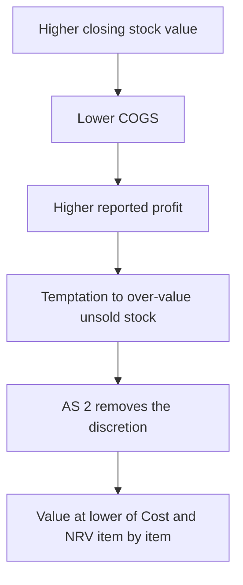
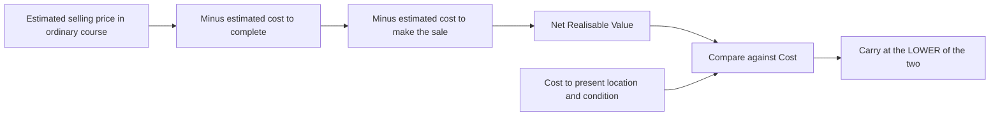
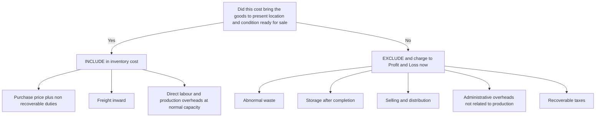
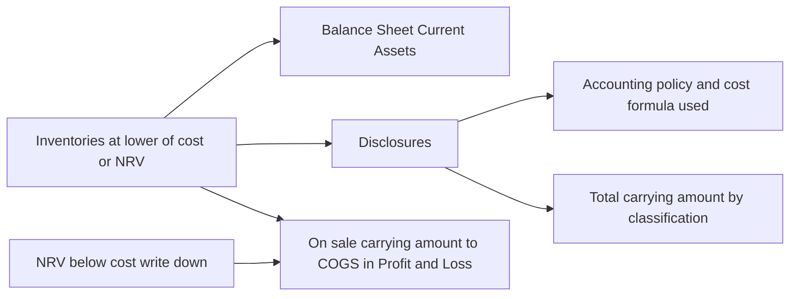

<!-- v2-deep -->

# Chapter 03 — AS 2: Valuation of Inventories

*If Chapter 1 taught you "prudence," this chapter shows prudence doing real work. AS 2 is small, high-scoring, and the perfect proof that a standard is just a principle applied honestly.*

---

## 1. The Problem

At year end a business has unsold goods sitting in the warehouse — **closing stock.** That stock has to appear on the Balance Sheet (as an asset) and it directly affects profit, because:

> Profit = Sales − Cost of Goods Sold, and **COGS = Opening Stock + Purchases − Closing Stock.**

Look hard at that formula. **The higher you value closing stock, the lower your COGS, and the higher your reported profit.** So the number you put on unsold stock is a *direct profit lever*. That is dangerous: a business could inflate profit for the year simply by valuing leftover stock optimistically — no extra sale, no extra cash, just a friendlier number.

Worse, the manipulation is *self-reversing but delayed.* Today's closing stock becomes next year's opening stock, so an over-valuation today inflates this year's profit and deflates next year's. Management chasing a bonus, a loan covenant, or a share-issue valuation this year does not care that the chickens come home next year — the fraud lives exactly in that timing gap. AS 2 slams the gap shut by fixing *one* honest value, so profit cannot be time-shifted through the stock account.

Two questions must be pinned down, or profit becomes fiction:

1. **What costs go *into* the value of stock?** Just purchase price? Also freight inward? Also the factory supervisor's salary? Also the storekeeper, the sales team, the head office?
2. **At what amount do we carry it** if the goods have lost value — damaged, gone out of fashion, or the market price has crashed below what we paid?

If those two answers are left to management's mood, two identical businesses could report wildly different profits from the same physical stock. AS 2 exists to remove that discretion.

*Figure 1 — Why inventory value is a profit lever, and where AS 2 clamps it.*

### 1a. Scope — where AS 2 does and does not reach

The exam loves a scope question because it looks trivial and traps the unprepared. AS 2 applies to inventories *generally*, but four categories are **carved out** (para 1):

- **Work-in-progress under construction contracts** — governed by **AS 7**, which measures WIP by percentage-of-completion, not lower of cost or NRV.
- **Work-in-progress of service providers** — a separate treatment.
- **Shares, debentures and other financial instruments held as stock-in-trade** — governed by other pronouncements.
- **Producers' inventories of livestock, agricultural and forest products, and mineral oils / ores / gases** — to the extent that they are measured at **NRV** in accordance with well-established industry practice (e.g. a farmer's harvested crop measured at realisable value).

Read that last exclusion carefully: it is a *measurement* exclusion, not an *industry* exclusion. A farmer's grain that industry practice values at NRV is outside AS 2; the same farmer's diesel and packaging stores are inside it. The examiner's tweak is usually "value this ore stock" — the answer hinges on whether the well-established-practice NRV basis is being used.

---

## 2. The Core Idea

> Value inventories at the **lower of (a) Cost and (b) Net Realisable Value (NRV)**.

- **Cost** = what you spent to bring the stock to its *present location and condition* — ready for sale.
- **NRV** = what you can realistically sell it for, *minus* the costs still needed to complete it and to sell it.

Why the *lower* of the two? **Prudence.** An asset must never be carried at more than the cash it can actually bring in. If stock cost Rupees 100 but can now only fetch Rupees 70, carrying it at Rupees 100 overstates both the asset and the profit — you would be pretending a Rupees 30 loss has not happened. AS 2 forces you to book that loss *now*, the moment it becomes probable.

But the rule is one-directional. If NRV is *above* cost, you do **not** write stock *up*. Writing it up would book an unrealised profit on goods you have not yet sold — the opposite of prudence, which says: anticipate losses, never anticipate gains.

That single "lower of cost or NRV" rule *is* the prudence concept from Chapter 1, made concrete and measurable.

### 2a. NRV is not "market price" — a distinction the exam punishes

Students routinely equate NRV with market price or replacement cost. It is neither.

- **Market / selling price** is the *gross* figure. NRV is *net* — after subtracting completion and selling costs. NRV is always ≤ selling price.
- **Replacement cost** is an *entry* (buying) price; NRV is an *exit* (selling) price. They only coincide in one narrow case: as a *proxy* for the NRV of raw materials (para 24), and even then only when the finished goods are loss-making.

So NRV is a forward-looking, entity-specific *net cash you will actually collect* number. Because it looks forward, it rests on **estimates**, and AS 2 (para 21) demands those estimates use the *most reliable evidence available* at the time the estimate is made, and be confirmed by conditions existing at the balance-sheet date (an AS 4 events-after-the-date link — see Connections).

*Figure 4 — NRV is a net exit value, built down from selling price, then compared with cost.*

---

## 3. Why it is built this way

### 3a. Why "cost" is defined so carefully

If "cost" were left vague, businesses would stuff it or starve it to move profit between years. So AS 2 (para 6–13) pins down what is **in** and what is **out**.

**Cost of inventories comprises (para 6):**

- **Costs of purchase (para 7):** purchase price + duties and taxes *not subsequently recoverable* + freight inward + other directly attributable acquisition costs. Trade discounts, rebates and similar items are *deducted*. Taxes you can reclaim (recoverable GST / input tax credit) are **excluded** — you never truly bore them.
- **Costs of conversion (para 8–11):** direct labour + a systematic allocation of **production overheads** (fixed and variable) incurred in converting materials into finished goods.
- **Other costs (para 12):** only to the extent incurred in bringing the inventories to their present location and condition.

**Cost EXCLUDES (para 13) — charged as expense of the period:**

- **Abnormal** amounts of wasted materials, labour or other production costs. A burst pipe ruining material is a *loss of the period*, not a "cost of inventory." Burying it in stock value would hide the loss and inflate the asset.
- **Storage costs**, unless necessary in the production process *before* a further stage (e.g. maturing whisky).
- **Administrative overheads** that do not contribute to bringing inventories to their present location and condition.
- **Selling and distribution costs** — these relate to *selling*, which happens *after* the stock is ready. They belong to the period, not the asset.

**The one unifying test:** a cost enters inventory only if it helped bring the goods *to their present location and condition ready for sale.* Ask that single question and you can classify any cost without memorising a list.

**Two finer distinctions the exam probes:**

- **Trade discount vs cash discount.** A **trade discount** is deducted from purchase cost (it reduces the real price paid). A **cash discount** (for prompt payment) is a *financing* item — it is **not** deducted from inventory cost; it is treated as income / a reduction of finance cost. Examiners deliberately mix both into one purchase invoice.
- **Interest and borrowing costs.** Normally *excluded* from inventory cost — financing is not a cost of bringing goods to condition. The single exception (AS 16 read with AS 2) is a **qualifying asset**: inventory that *necessarily takes a substantial period of time to get ready for its intended sale* (again, maturing whisky, seasoning timber). Only then may borrowing cost be capitalised into stock. Ordinary fast-moving stock never absorbs interest.
- **Duty drawback / recoverable duties.** If a duty paid on import will be refunded on export (drawback) or is recoverable as credit, it is **excluded** — same logic as recoverable GST.

*Figure 2 — The single classification test that decides every cost.*

### 3b. Why overhead absorption uses "normal capacity"

Fixed production overheads (factory rent, supervisor salary) are spread over units produced. AS 2 (para 9) says allocate them based on **normal capacity** — the production expected on average over a number of periods under normal circumstances — **not** actual output.

*Why?* If a factory that can make 1,000 units only makes 100 in a slump, dividing all the fixed rent over just 100 units would balloon each unit's "cost." Then "lower of cost or NRV" might carry stock too high, disguising the fact that idle capacity is a *loss of the period*, not a cost of the product. Using normal capacity fixes the per-unit fixed overhead and leaves the unabsorbed portion where it belongs — as a current expense. Crucially, AS 2 adds: the allocation rate is **not increased** just because output was low. In periods of *abnormally high* production, the rate is *decreased* so inventory is not measured above cost.

**The asymmetry, stated as a rule you can apply blind:**

- **Actual output < normal capacity** → absorb fixed OH at the **normal-capacity rate**; the *unabsorbed* balance is a period expense. (Fixed OH per unit stays constant.)
- **Actual output > normal capacity** → absorb at **actual output** (a lower per-unit rate), so no unit is loaded above its true cost. (Fixed OH per unit falls.)
- **Actual ≈ normal** → normal capacity may be taken as actual output; the two converge.

The governing principle is a *ceiling*: fixed OH per unit may never exceed the normal-capacity rate. That is the exam's mental shortcut — take the *lower* of (fixed OH ÷ normal capacity) and (fixed OH ÷ actual output).

**Variable production overheads** follow a different logic: they are allocated on **actual usage** of production facilities, because by definition they rise and fall with volume — there is no idle-capacity concept for them.

### 3c. Why cost formulas exist — and why LIFO is banned

When identical items were bought at different prices, which cost attaches to the units sold versus the units left? You need a *formula* (para 14–16):

- **Specific identification (para 14):** used when items are *not* ordinarily interchangeable (a car dealer tracks each car's actual cost). Averaging unique items would be meaningless. It is also *required* for goods segregated for a specific project. But it must **not** be used where items are interchangeable — because then management could hand-pick which cost to sell and which to leave, re-opening the manipulation door AS 2 shut.
- **FIFO — First-In-First-Out:** assume the oldest stock sells first, so closing stock reflects the *most recent* prices. Mirrors how most goods physically flow. In rising prices FIFO gives the *highest* closing stock and *highest* profit.
- **Weighted Average:** blend all costs into one average per unit. Smooths out price swings. Can be computed **periodically** (one average at period end) or on a **moving/perpetual** basis (a fresh average after each purchase) — the two give different closing values, and the question usually dictates which.
- **LIFO is not permitted** under AS 2. *Why?* LIFO leaves *ancient* prices sitting in the Balance Sheet stock value, so the asset figure drifts far from current reality — it fails the "reflect economic substance" test, and historically it was used to reduce tax during inflation (a manipulation motive). The revised AS 2 removed it.

**Consistency (AS 1 link):** the *same* formula must be used for all inventories of similar nature and use, and applied *consistently* period to period. A change in formula is a change in accounting *policy* — permitted only if it gives more appropriate presentation, and then it must be disclosed with its effect. Switching FIFO ↔ weighted average at will to flatter profit is exactly what consistency forbids.

The point: the formula is an *assumption about the flow of cost*, chosen for faithfulness — not a random pick.

### 3d. When NRV can fall below cost

NRV falls below cost when (para 21) goods are damaged, wholly or partially obsolete, the selling price has declined, or the estimated costs of completion / costs to make the sale have increased. Estimates of NRV are based on the most reliable evidence available at the time, and take into account the purpose for which the inventory is held (e.g. quantities under firm sales contracts are valued at the contract price).

**Firm sales contracts — the two-bucket rule (para 23).** If you hold 1,000 units but only 600 are covered by a firm, non-cancellable sales contract, you must **split** the stock: the 600 contracted units take the *contract price* as their selling basis, and the remaining 400 take the *general market* selling price. You do not apply one blended NRV to the lot. If the contract price is *below* cost, that loss is recognised; the surplus units are judged separately on market NRV. (Where the firm commitment is to *buy*, that is an AS 29 onerous-contract question, not AS 2.)

**Special rule for raw materials (para 24):** materials held for producing finished goods are **not written below cost** if the *finished products* in which they will be used are expected to sell at or above cost. Only if a decline in the finished product's price signals that its cost will exceed NRV do you write the materials down — and there, replacement cost is often the best available measure of the materials' NRV.

### 3e. Why item-by-item — and where grouping is allowed

Para 22 says apply lower of cost or NRV *item by item*, but permits grouping **similar or related** items. The boundary is the exam's favourite grey zone. Grouping is allowed only when items relate to the *same product line*, have *similar purposes or end uses*, and are *produced and marketed in the same geographical area* — such that they cannot practicably be evaluated separately. It is **not** allowed to group on the basis of a whole classification (e.g. all finished goods) or an entire business segment, because that would let a booming product mask a dying one. When in doubt in the exam: default to item-by-item — it is never marked wrong, whereas over-grouping is.

---

## 4. Full technical content — measurement mechanics through the RMPD lens

- **Recognition:** inventory is recognised as an asset while unsold. When it is sold, its carrying amount is recognised as an **expense (COGS)** in the *same* period as the related revenue — that is accrual / matching (para 32). The amount of any write-down to NRV, and all losses of inventories, are recognised as an expense in the period of the write-down or loss. Any *reversal* of a write-down (because NRV later recovers) is recognised as a *reduction* in the expense in the period the reversal occurs.
- **Measurement:** at the **lower of Cost and NRV**, applied ordinarily **item by item** — not on the whole stock lumped together (para 22). Similar or related items may be grouped, but dissimilar items (e.g. finished goods vs raw materials, or different product lines) are not netted.
  - Cost = costs of purchase + costs of conversion + other costs to reach present location and condition (per 3a).
  - NRV = estimated selling price in the ordinary course of business − estimated costs of completion − estimated costs necessary to make the sale.
- **Presentation:** shown under **Current Assets** on the Balance Sheet (as *Inventories*); the expense side flows through COGS in the Statement of Profit and Loss.
- **Disclosure:** the accounting policies adopted (including the cost formula used) and the total carrying amount, classified appropriately (raw materials, WIP, finished goods, stores and spares, etc.) — per 3a and para 26.

### Techniques that approximate cost (para 18)

AS 2 permits two shortcut techniques *for convenience*, provided the result approximates actual cost:

- **Standard cost method:** uses predetermined costs (normal levels of material, labour, efficiency, capacity utilisation). It is acceptable **only if** it is regularly reviewed and revised in light of current conditions — a stale standard is not a fair approximation of cost.
- **Retail method:** used in retail with large numbers of rapidly changing items with similar margins. Cost is derived by reducing the sale value of the inventory by the *appropriate percentage gross margin*. An average percentage is used for each retail department. This is a favourite for a short numerical: Cost = Retail selling value × (1 − gross margin %).

Neither is a *new basis of value* — both are just practical ways of getting to "cost," which is still compared with NRV.

### The journal entries

When closing stock is brought into the books:

| Particulars | Debit (Rupees) | Credit (Rupees) |
|---|---|---|
| Closing Stock A/c (Balance Sheet — Current Asset) | XXX | |
| To Trading A/c (or Cost of Goods Sold) | | XXX |

When stock must be written down because NRV < Cost (recognise the loss now):

| Particulars | Debit (Rupees) | Credit (Rupees) |
|---|---|---|
| Profit and Loss A/c (write-down of inventory) | XXX | |
| To Inventory / Provision for inventory write-down A/c | | XXX |

The write-down does not create a special reserve; it simply reduces the asset to the lower of cost or NRV and the shortfall hits the current period's profit. If NRV later recovers, the earlier write-down is *reversed* only to the extent of the original write-down (never above original cost).

---

## 5. Worked examples (each one reconciles)

### Example 1 — The classic single item: write-down forced by NRV

*A shirt cost Rupees 500 to buy and get to the shop. At year end, fashion has moved on; you can now sell it for Rupees 450, but you will spend Rupees 20 on repackaging to sell it.*

- **NRV** = Selling price 450 − Cost to sell 20 = **Rupees 430**
- **Cost** = **Rupees 500**
- Lower of the two = **Rupees 430** → carry the shirt at Rupees 430.
- **Write-down = 500 − 430 = Rupees 70**, recognised as a loss *now*, in the year the value fell — not deferred to whenever you finally sell it.

*Reconciliation (flip it):* if the same shirt could instead sell for Rupees 560 with Rupees 20 selling cost, NRV = Rupees 540, which is above cost Rupees 500. You still carry it at **Rupees 500** — you do **not** write it up to Rupees 540, because that Rupees 40 is unrealised profit not yet earned. Same rule, both directions, one principle.

### Example 2 — Item-by-item versus lumped (the exam trap made numeric)

*A trader holds three product lines at year end:*

| Item | Cost (Rupees) | NRV (Rupees) | Lower of Cost or NRV (Rupees) |
|---|---|---|---|
| A | 1,00,000 | 90,000 | 90,000 |
| B | 80,000 | 85,000 | 80,000 |
| C | 60,000 | 40,000 | 40,000 |
| **Total** | **2,40,000** | **2,15,000** | **2,10,000** |

- **Correct (item by item):** 90,000 + 80,000 + 40,000 = **Rupees 2,10,000**
- **Wrong (compare totals):** lower of total cost 2,40,000 and total NRV 2,15,000 = Rupees 2,15,000

*Reconciliation:* the lumped method quietly lets the "profit" on Item B (NRV 85,000 > cost 80,000, a Rupees 5,000 unrealised gain) offset the losses on A and C. Item-by-item refuses that offset — hence the extra Rupees 5,000 write-down. The Rupees 5,000 difference *is exactly* the disallowed unrealised gain on B. Prudence wins: correct value **Rupees 2,10,000.**

### Example 3 — Manufacturer: normal capacity and cost build-up

*A factory's normal capacity is 10,000 units/year. Fixed production overhead is Rupees 5,00,000 per year. This year, due to a slump, only 5,000 units were produced. Per unit: direct material Rupees 40, direct labour Rupees 30, variable production overhead Rupees 10. All 5,000 units remain unsold. NRV per unit is Rupees 150.*

Fixed overhead per unit **must** use normal capacity:

- Fixed OH per unit = 5,00,000 ÷ **10,000** (normal capacity) = **Rupees 50**
- Cost per unit = 40 + 30 + 10 + 50 = **Rupees 130**
- Fixed OH actually absorbed into stock = 5,000 units × Rupees 50 = Rupees 2,50,000
- **Unabsorbed fixed OH = 5,00,000 − 2,50,000 = Rupees 2,50,000 → charged to P&L now** (period loss from idle capacity)

Now apply lower of cost or NRV per unit: Cost Rupees 130 vs NRV Rupees 150 → carry at **Rupees 130**.

- **Closing inventory = 5,000 × 130 = Rupees 6,50,000**

*Reconciliation:* had we (wrongly) spread the full Rupees 5,00,000 fixed OH over just 5,000 units, fixed OH per unit = Rupees 100, cost per unit = Rupees 180. But NRV is only Rupees 150, so "lower of cost or NRV" would cap it at Rupees 150 → inventory Rupees 7,50,000 and no idle-capacity charge visible. The normal-capacity rule instead surfaces the Rupees 2,50,000 idle-capacity loss *and* values stock honestly at Rupees 6,50,000. The two approaches differ by Rupees 1,00,000 of inventory — precisely the mis-buried idle cost the standard refuses to hide.

*Examiner tweak — high output:* suppose next year the factory produces **12,500 units** (above normal capacity). Now fixed OH per unit = 5,00,000 ÷ **12,500** = Rupees 40 (use *actual*, not normal, because the per-unit ceiling is not breached — the rate is *lower*). Cost per unit = 40 + 30 + 10 + 40 = Rupees 120. All Rupees 5,00,000 of fixed OH is absorbed; nothing is stranded in P&L. The rule protected stock from being *over*-valued in the low year and lets it fall naturally in the high year.

### Example 4 — Raw material not written down (para 24)

*A manufacturer holds raw material costing Rupees 2,00,000. Its current replacement cost has fallen to Rupees 1,70,000. The finished goods made from it are still expected to sell above their cost.*

- Because the **finished product** is expected to sell at or above cost, the raw material is **not** written down.
- Raw material stays at **Rupees 2,00,000** (cost), *not* Rupees 1,70,000.

*Reconciliation:* now suppose the finished product's selling price collapses so that finished goods will sell *below* cost. Then the raw material *is* written down, and its replacement cost (Rupees 1,70,000) is the best available measure of NRV → carry at **Rupees 1,70,000**, booking a Rupees 30,000 loss. The material's own market price alone never decides — the finished product's fate does.

### Example 5 — FIFO vs Weighted Average, and why the formula moves profit

*Opening stock: 100 units at Rupees 10 = Rupees 1,000. Purchases: 1 June 200 units at Rupees 12; 1 Sept 200 units at Rupees 15. Sales during the year: 350 units. Closing stock = 100 + 400 − 350 = 150 units. NRV is Rupees 16 per unit (above every cost figure below).*

**FIFO** — the 150 units left are the newest, so all from the 1 Sept lot at Rupees 15:
- Closing stock = 150 × 15 = **Rupees 2,250**

**Weighted average (periodic)** — total cost ÷ total units:
- Total cost = 1,000 + (200×12) + (200×15) = 1,000 + 2,400 + 3,000 = Rupees 6,400 over 500 units = **Rupees 12.80/unit**
- Closing stock = 150 × 12.80 = **Rupees 1,920**

*Reconciliation via COGS:* Cost of goods available = Rupees 6,400 in both methods.
- FIFO COGS = 6,400 − 2,250 = **Rupees 4,150**
- Weighted-avg COGS = 6,400 − 1,920 = **Rupees 4,480**

Prices rose through the year, so FIFO leaves the *dearest* units in stock → higher closing stock, lower COGS, **higher profit** (by Rupees 330). Weighted average smooths it. Same physical stock, same NRV cap (Rupees 16 bites on neither), yet reported profit differs by Rupees 330 purely from the *cost-flow assumption* — which is precisely why AS 2 makes you *disclose the formula* (para 26). Neither is "wrong"; the reader just needs to know which was used.

### Example 6 — Retail method and a firm-contract split

*A garment retailer's closing stock has a retail (selling) value of Rupees 10,00,000. The department's normal gross margin is 40%. Separately, of this stock, goods with a retail value of Rupees 2,00,000 are covered by a firm sales contract at a fixed price of Rupees 1,00,000; estimated selling cost on those is nil. Assume no other NRV impairment on the rest.*

**Step 1 — cost by retail method** (Cost = Retail value × (1 − margin %)):
- Overall cost of stock = 10,00,000 × (1 − 0.40) = **Rupees 6,00,000**

**Step 2 — split for the firm contract (para 23).** Of the stock, the contracted portion has a retail tag of Rupees 2,00,000 → its *cost* = 2,00,000 × 0.60 = **Rupees 1,20,000**. But the firm contract will only realise Rupees 1,00,000 (its NRV). Lower of cost 1,20,000 and NRV 1,00,000 = **Rupees 1,00,000** — a Rupees 20,000 write-down on the contracted units.
- Non-contracted portion cost = 6,00,000 − 1,20,000 = Rupees 4,80,000; NRV assumed ≥ cost → carry at Rupees 4,80,000.

**Step 3 — total closing inventory** = 4,80,000 + 1,00,000 = **Rupees 5,80,000.**

*Reconciliation:* had we ignored the contract and valued the whole stock at retail-method cost, we would have carried it at Rupees 6,00,000 and hidden the Rupees 20,000 loss the firm contract already locks in. Splitting the stock — general NRV for open units, contract price for committed units — surfaces exactly the Rupees 20,000 write-down. Value: **Rupees 5,80,000.**

### Example 7 — Reversal of a prior write-down (capped at original cost)

*Last year, 1,000 units costing Rupees 100 each were written down to NRV of Rupees 80 (a Rupees 20,000 loss booked). They are still unsold. This year the market recovers.*

*Case (a) NRV recovers to Rupees 92:* reverse the write-down up to the new NRV. Reversal = (92 − 80) × 1,000 = **Rupees 12,000**, credited as a *reduction of the current year's inventory expense*. New carrying value = Rupees 92,000.

*Case (b) NRV recovers to Rupees 130:* you may reverse **only up to the original cost of Rupees 100**, never to Rupees 130. Maximum reversal = (100 − 80) × 1,000 = **Rupees 20,000** (the whole original write-down). New carrying value = original cost Rupees 1,00,000. The extra Rupees 30 of upside is unrealised gain and stays out.

*Reconciliation:* the reversal in (a), Rupees 12,000, is exactly the recovered slice of the original Rupees 20,000 loss; in (b), the reversal is capped at the full original Rupees 20,000 because the ceiling is *cost*, not current market. Prudence is symmetric on the way back up: undo losses you booked, but never manufacture a gain.

---

## 6. Presentation and Disclosure

**On the Balance Sheet:** inventories appear under **Current Assets**, line item *Inventories*, usually sub-classified (raw materials and components, work-in-progress, finished goods, stock-in-trade, stores and spares, loose tools, goods-in-transit).

**Financial statements should disclose (AS 2, para 26):**

- The **accounting policies** adopted in measuring inventories, **including the cost formula used** (FIFO / weighted average / specific identification).
- The **total carrying amount** of inventories and its classification appropriate to the enterprise.

*Why disclose the formula?* Straight from AS 1 (Disclosure of Accounting Policies): the reader cannot interpret the profit unless they know the basis on which stock — the profit lever — was valued. Two firms using FIFO versus weighted average in a period of rising prices report different profits from identical trading (Example 5 proved it); disclosure makes the numbers comparable.

**Goods-in-transit and consignment — an ownership check that precedes valuation.** Before you value stock, decide what stock is *yours*. Physical possession is not ownership:

- **Goods in transit** bought FOB shipping point / ex-works are the buyer's stock the moment they leave the seller — include them though they are not in your godown.
- **Goods sent on consignment** remain the *consignor's* stock (valued at *consignor's* cost plus proportionate non-recurring expenses to bring them to the agent's location) — the consignee never records them as its own inventory.
- **Goods sold on sale-or-return** not yet approved by the customer remain the seller's stock.

Getting the *quantity* right is a precondition to getting the *value* right; examiners bury a transit or consignment line inside an otherwise routine valuation sum.

*Figure 3 — Where the inventory figure surfaces in the financial statements.*

---

## 7. Connections

- **Prudence (Ch 1)** is the entire engine of "lower of cost or NRV" — this chapter is prudence made numeric.
- **RMPD lens (Ch 2)** — Recognition, Measurement, Presentation, Disclosure — structured the whole standard above.
- **AS 1 (Disclosure of Accounting Policies)** — mandates disclosing the cost formula so profit is interpretable, and supplies the *consistency* requirement on the formula chosen.
- **AS 4 (Events After the Balance Sheet Date):** a sale of stock *after* year end at a low price is *adjusting* evidence of NRV *at* the date — it confirms the estimate, so it feeds back into the write-down. This is why NRV uses "most reliable evidence available."
- **AS 16 (Borrowing Costs):** interest is normally excluded from inventory cost, except for a *qualifying asset* (inventory needing a substantial period to get ready for sale) — the single door through which finance cost enters stock.
- **Cost and Management Accounting (separate subject):** direct cost, overhead absorption, and *normal capacity* reappear there in depth — AS 2's conversion cost *is* costing.
- **AS 10 (Property, Plant and Equipment) and depreciation (Ch 4):** factory assets' depreciation is a *production overhead* that becomes part of conversion cost, feeding straight into inventory value.
- **Trading Account / Gross Profit:** closing stock plugs directly into COGS = Opening Stock + Purchases − Closing Stock, so AS 2 is where valuation meets the P&L.
- **AS 7 (Construction Contracts) and AS 9 (Revenue):** AS 2 explicitly does *not* apply to WIP under construction contracts or to certain producers' stocks measured at NRV — knowing the *scope exclusions* prevents applying the wrong standard.
- **AS 29 (Provisions):** a firm *purchase* commitment that has become onerous is an AS 29 provision, not an AS 2 write-down — do not solve it inside inventory.

---

## 8. Traps and confusions

- **Applying "lower of cost or NRV" to the whole inventory in one lump — wrong.** Do it **item by item** (or by similar groups). Netting a written-down item against a profitable one hides the loss and books an unrealised gain — see Example 2. This is the single most common AS 2 exam trap.
- **Never write inventory *up* above cost**, even if NRV is higher. Losses are anticipated; gains are not.
- **NRV is not market price and not replacement cost.** It is selling price *minus* completion and selling costs — a net exit value (see 2a). Replacement cost only ever appears as a *proxy* for raw-material NRV when finished goods are loss-making.
- **Recoverable taxes are not part of cost.** If GST paid is claimable as input tax credit, you never bore it — excluding it keeps cost real. Only *non-recoverable* duties enter cost.
- **Trade discount vs cash discount.** Trade discount reduces inventory cost; cash discount is a financing item and does **not** reduce cost. Examiners plant both on one invoice.
- **Selling costs play two different roles — don't confuse them.** They are **excluded** from *cost* (they relate to selling, after goods are ready), but they **are subtracted** when computing *NRV*. Same cost, opposite treatment depending on which side of the comparison you are on.
- **Abnormal loss is never an inventory cost.** A flood ruining stock is a period loss, not something buried in the value of the surviving stock.
- **Normal capacity, not actual output**, spreads fixed overhead — but only as a *ceiling*. When actual output *exceeds* normal capacity, use actual (the lower per-unit rate). Low output does *not* let you inflate per-unit cost (Example 3).
- **Raw materials are judged by the finished product, not their own market price** (para 24 / Example 4). Falling material prices alone do not trigger a write-down if the finished good still sells above cost.
- **A recovered NRV reverses an earlier write-down — but only up to original cost**, never above it (Example 7).
- **Firm sales contracts force a split** (para 23): contracted units at contract price, surplus units at market NRV — never one blended figure.
- **Ownership before valuation:** goods in transit, on consignment, or on sale-or-return can belong to you (or not) regardless of who physically holds them. Fix the quantity first.
- **Interest / borrowing cost is excluded** from inventory cost except for a qualifying asset (AS 16). Do not capitalise finance cost into ordinary stock.
- **Specific identification is banned for interchangeable goods** — using it there re-opens cherry-picking of costs.

---

## 9. First-principles recap

- Closing stock value is a **direct profit lever** (via COGS), and manipulation lives in the *timing gap* between this year and next — so AS 2 exists to pin it down and stop the time-shift.
- The rule is **lower of Cost and NRV**, applied **item by item** — pure prudence: recognise probable losses now, never book unrealised gains, never write above cost.
- **NRV is a net exit value** (selling price − cost to complete − cost to sell), built on best-available estimates; it is neither market price nor replacement cost.
- A cost enters inventory **only if it brought the goods to their present location and condition ready for sale.** That one test classifies any cost — in: purchase + conversion + other bringing-to-condition costs; out: abnormal waste, post-completion storage, selling, non-production admin, recoverable taxes, ordinary interest.
- Spread fixed production overheads over **normal capacity** as a *ceiling*, so idle-capacity cost stays a period loss and is not smuggled into the asset; above normal capacity, use actual output.
- **FIFO / Weighted Average / Specific identification** are assumptions about *cost flow* chosen for faithfulness and applied *consistently*; **LIFO is banned** because it strands stale prices on the Balance Sheet.
- Raw materials follow the fate of the **finished product**, not their own price.
- Firm sales contracts value the committed quantity at **contract price**; the rest at market NRV.
- A write-down **reverses** if NRV recovers, but only **up to original cost**.
- Disclose the **cost formula used** (AS 1 logic) so the reported profit is interpretable.

---

## 10. Quick-Revision Sheet

| Item | One-line answer |
|---|---|
| **Core rule** | Value inventory at **lower of Cost and NRV**, item by item (para 5, 22) |
| **Scope out** | Construction WIP (AS 7), service WIP, financial instruments held as stock, producers' agri / mineral stock at NRV (para 1) |
| **Cost =** | Purchase + Conversion + Other costs to reach present location and condition (para 6) |
| **Costs of purchase** | Price + non-recoverable duties + freight inward − trade discounts (para 7) |
| **Costs of conversion** | Direct labour + variable OH (on actual) + fixed OH (at **normal capacity**) (para 8–9) |
| **NRV =** | Estimated selling price − costs to complete − costs to sell (para 2) |
| **NRV is NOT** | Market price; replacement cost (except as raw-material proxy) |
| **Excluded from cost** | Abnormal waste, post-completion storage, selling and distribution, non-production admin, recoverable taxes, ordinary interest (para 13) |
| **Interest included?** | Only for a **qualifying asset** needing substantial time to get ready (AS 16) |
| **Trade vs cash discount** | Trade discount reduces cost; cash discount does **not** |
| **Cost formulas allowed** | Specific identification, FIFO, Weighted Average (periodic or moving) |
| **Banned** | **LIFO** |
| **Approximation techniques** | Standard cost (if reviewed) and Retail method (para 18) |
| **Fixed OH absorption** | **Normal capacity** as a ceiling; unabsorbed → period expense; if output > normal, use actual |
| **Raw material write-down** | Only if **finished product** will sell below cost (para 24); then NRV ≈ replacement cost |
| **Firm sales contract** | Contracted units at contract price, surplus at market NRV (para 23) |
| **Write-down entry** | Dr Profit and Loss A/c, Cr Inventory — loss recognised in period of write-down |
| **Reversal** | Allowed if NRV recovers, **only up to original cost** |
| **Comparison level** | **Item by item** (or similar groups), never whole-stock lump |
| **Ownership check** | Goods in transit / consignment / sale-or-return — fix quantity before value |
| **Presentation** | Current Assets — *Inventories* |
| **Disclosure** | Accounting policy + **cost formula used** + total carrying amount by classification (para 26) |
| **Write up above cost?** | **Never** |
| **Master test for any cost** | "Did it bring the goods to present location and condition ready for sale?" |
