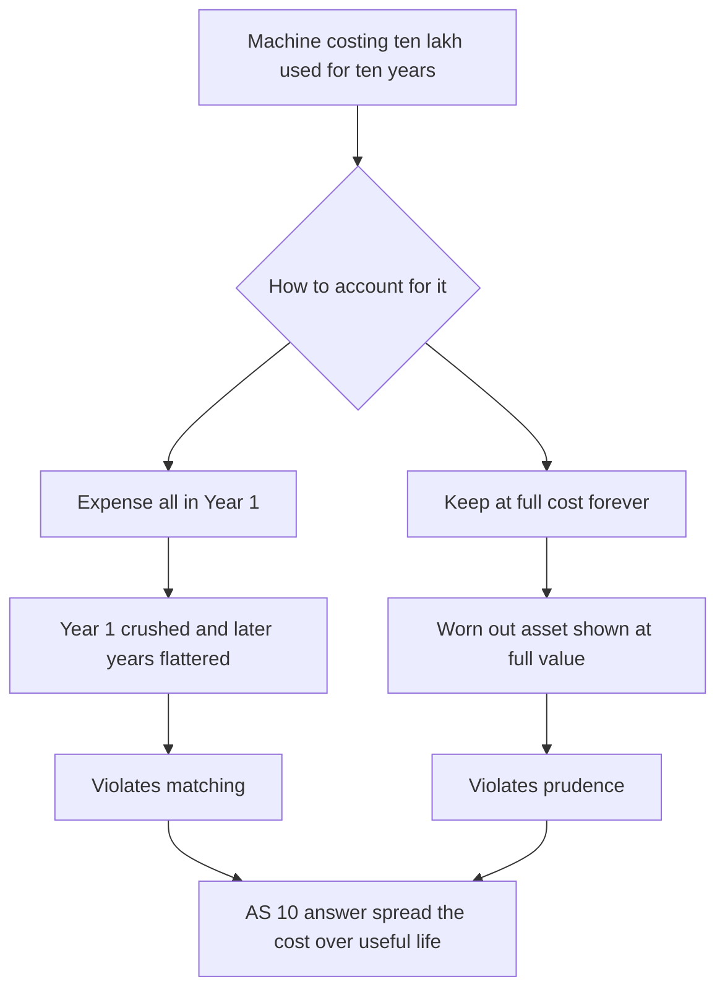
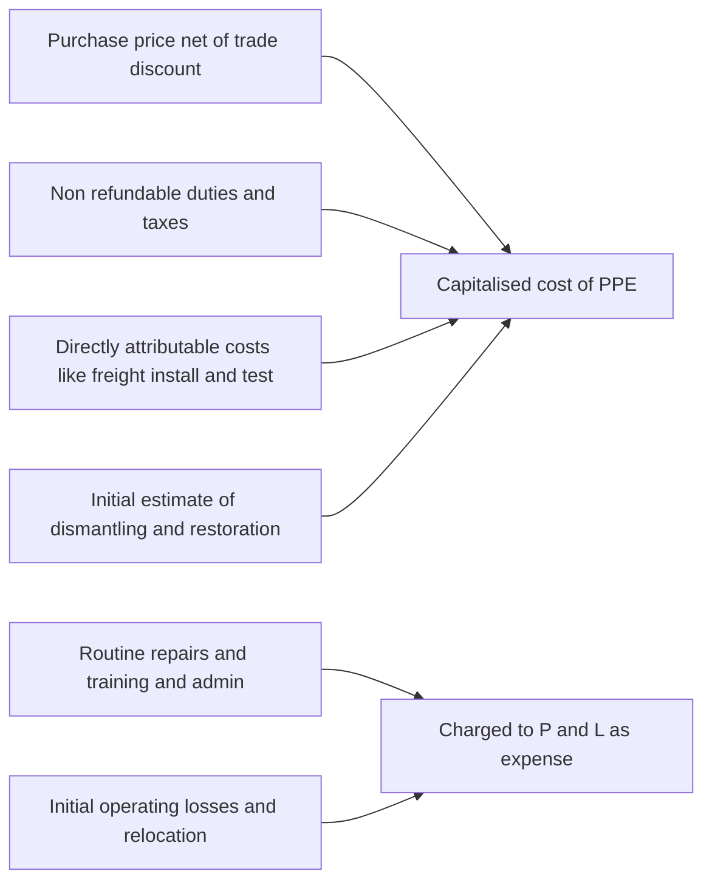
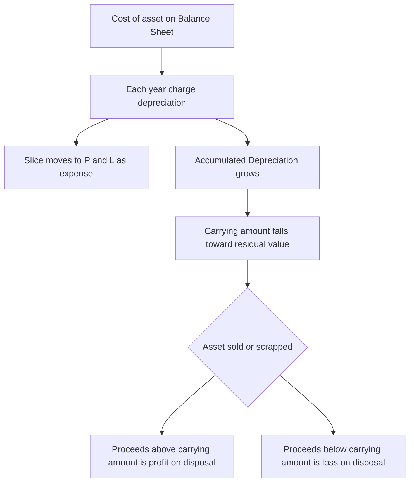
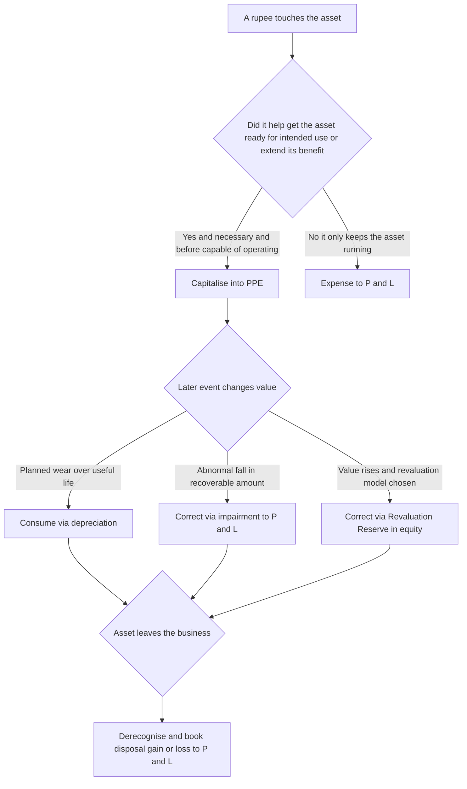
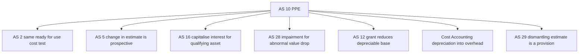

<!-- v2-deep -->

# Chapter 04 — AS 10: Property, Plant & Equipment (and why depreciation exists)

*This chapter proves that even a "computational" topic is really a concept. Depreciation confuses students precisely because they compute it before they understand what it is. We fix the order: idea first, formula second. No rule appears here before the problem it solves.*

---

## 1. The Problem

A company buys a machine for ₹10,00,000 that will be used for 10 years. Two naive approaches, both wrong:

- **"Expense the whole ₹10,00,000 in Year 1."** But the machine will help *earn* revenue for 10 years. Dumping its entire cost on Year 1 makes Year 1 look terrible and Years 2–10 look artificially great — even though the machine worked equally hard every year. That violates **accrual/matching** (Chapter 1): costs should sit in the same periods as the revenues they help produce.
- **"Never expense it; it is an asset."** But the machine is *wearing out*. After 10 years it is scrap. If you keep it on the books at ₹10,00,000 forever, you are pretending value that has physically evaporated still exists — overstating assets and profit. That violates **prudence** and **reliability**.

So there are really two problems knotted together:

1. **How do we spread a long-lived asset's cost over the years it serves?** (an income-statement matching problem)
2. **How do we show the asset shrinking on the Balance Sheet?** (a realistic-valuation problem)

And two sub-problems hide behind these: *what number do we even start with as "cost"?* and *what happens the day we finally sell or scrap the thing?* All four are answered by one standard — **AS 10, Property, Plant and Equipment**.

**A third, subtler problem the examiner loves.** The four questions above assume the asset stays the *same* asset from birth to death. Real assets are messier: prices are paid in instalments, a supplier throws in the machine "free" against another purchase, a major part is replaced halfway through, the government pays a grant toward the cost, or two assets are swapped without cash. Each of these forces you back to first principles — "what did I really sacrifice to get this asset ready, and how much of it have I consumed so far?" Every hard AS 10 question is just that one sentence applied to a twist. Hold onto it.

*Figure 1 — Both naive routes break a core principle so AS 10 charts a middle path.*

---

## 2. The Core Idea

> **Depreciation is not "loss in market value." It is the systematic spreading of an asset's cost over the years it is used** — matching the cost to the benefit.

Picture the machine as a **prepaid bucket of 10 years of usefulness.** You paid ₹10,00,000 up front for that bucket. Each year you "use up" one year's worth of usefulness, so each year you move a slice of the cost from the Balance Sheet (asset) into the P&L (expense). After 10 years the bucket is empty and the asset's book value has fallen to its scrap (residual) value.

The two problems solve together: the slice you expense each year (P&L) is the same slice by which the asset shrinks (Balance Sheet). **One mechanism, two jobs.**

**Key mental correction:** depreciation is a process of **allocation, not valuation.** It does *not* try to track the machine's resale price on any given day. It answers "how much of what I paid have I consumed?", not "what is it worth today?"

**Three words that unlock every sub-rule.** Nearly every clause of AS 10 is one of these three verbs applied to the asset:

- **Capitalise** — put a rupee *into* the asset (it helped create the ready-to-use asset, or it extends/enhances the asset).
- **Consume** — move a slice *out* of the asset into the P&L over time (depreciation).
- **Correct** — a one-off adjustment when reality diverges from estimate (impairment down, revaluation up/down, disposal gain/loss).

If you can classify any transaction into capitalise / consume / correct, you can answer it. The exam is testing whether you know which bucket a rupee belongs in.

---

## 3. Why it is built this way

### 3a. Why depreciation is charged even in a loss year, even if the asset's market price rose
Because depreciation is about **consuming the benefit you paid for**, not about market price. The machine helped you try to earn revenue this year regardless of whether you made a profit, and regardless of whether second-hand machine prices went up. The cost of that year's *use* still has to be recognised. Students find this counter-intuitive only because they wrongly think depreciation equals "fall in value." Drop that, and it makes sense.

**Push it one step further.** *Why not just skip depreciation in a loss year to avoid worsening the loss?* Because that would let a struggling firm flatter its results exactly when readers most need honesty — turning an accounting rule into a management dial. AS 10 removes the dial: the charge is driven by *consumption*, an economic fact, not by *how the P&L is shaping up*, a management wish. This is the same instinct as prudence: don't let the number that is convenient override the number that is true.

### 3b. Why we need three inputs: cost, useful life, residual value
To spread a cost fairly you must know:

- **Depreciable amount = Cost − Residual value.** You only spread what you will actually *consume*. If you will sell the scrap for ₹50,000 at the end, you never really "used up" that ₹50,000 — so you do not depreciate it.
- **Useful life** — over *how many years* (or units) will *this business* use it? It is the life *to you*, not the total physical life. A rental-car firm might use a car 3 years then sell it; its useful life is 3, even if the car could run 12.

Both residual value and useful life are **estimates** — judgements. That is fine (Chapter 1 allows judgement) as long as they are reasonable and revisited.

**A finer distinction the exam tests — residual value in real life is usually ignored, and here is the precise reason.** Residual value is the estimated amount you would get *today* if the asset were *already* as old and worn as it will be at the end of its life, net of disposal costs. For most plant and machinery this future scrap figure, discounted by the reality that prices and the asset both decay, is **immaterial**, so firms take it as nil. But residual value can be *material* — and must not be ignored — for assets like vehicles or aircraft with a strong second-hand market. Trap: students blindly write "residual = nil" even when the question hands them a scrap value. If the question gives a residual, use it.

**Useful life is capped by more than wear.** A machine that can physically run 15 years still has a shorter *useful* life if (i) the legal right to use it (a lease, a licence, a patent) expires sooner, (ii) technical or commercial **obsolescence** will retire it (a better model, a product line being discontinued), or (iii) the entity's own asset-management policy is to sell after N years. Useful life = the *shortest* of physical, technological, commercial and legal life. Examiner tweak: "the machine can run 12 years but the factory lease ends in 8" → useful life is 8.

### 3c. Why more than one *method* is allowed (SLM vs WDV)
Different assets *deliver* their benefit differently, so the pattern of expensing should match the pattern of benefit:

- **Straight Line Method (SLM):** equal depreciation each year. *Use when* the asset gives roughly **equal benefit every year** (e.g., a building, furniture). Logic: steady use, steady cost.
- **Written Down Value / Reducing Balance (WDV):** a fixed *percentage* on the *reducing* book value, so depreciation is high early and low later. *Use when* the asset is **most productive when new** and/or **repair costs rise as it ages** (e.g., machinery, vehicles). Logic: high benefit early, high cost early; and as repairs climb later, the falling depreciation keeps the *total* yearly cost (depreciation plus repairs) more even.
- **Units of Production Method:** depreciation based on **actual output/usage** (e.g., a mine or a machine rated for a fixed number of units). *Use when* wear tracks usage, not time.

So the method is not arbitrary — it is chosen to **mirror how the asset actually gives up its usefulness.** That is the matching principle picking the right shape. AS 10 explicitly says the method should reflect the pattern of expected consumption of economic benefits.

**Why the WDV rate is what it is (and why the balance never hits residual by formula).** WDV solves depreciation backwards: pick a rate *r* such that after *n* years the balance lands on residual. The theoretical rate is `r = 1 − (Residual / Cost)^(1/n)`. This formula **explodes if residual is zero** (you would need a 100% rate), which is the mathematical reason WDV cannot be used with a nil residual and why firms using WDV must assume some notional scrap. In practice ICAI questions *give* you the rate, so you rarely compute *r* — but understanding it explains why, in Example 1, the WDV balance only *approaches* residual and never lands exactly on it, whereas SLM lands dead on. Do not "adjust" a WDV schedule to force it onto residual unless the question says the asset is sold/scrapped in the final year.

**A revenue-based method is banned.** A method that depreciates based on *revenue generated* by the asset is **not permitted** — revenue is driven by selling price and volume (many factors unrelated to the asset's consumption), so it fails the "reflect consumption of benefits" test. Examiner trap: an option offering "depreciate in proportion to sales" is always wrong.

### 3d. Why "component" thinking and why revaluation is optional
- **Componentisation:** if an item has a major part with a *different* life and a cost significant to the total (say an aircraft engine lasting 5 years inside a body lasting 15), AS 10 requires you to depreciate them **separately.** *Why?* Lumping them uses one wrong life for both and mis-states expense. Match each part to its own consumption.
- **Cost vs Revaluation model:** AS 10 lets you carry PPE either at **cost less accumulated depreciation and impairment** or at a **revalued amount.** *Why offer revaluation?* For assets like land and buildings whose value genuinely changes a lot, historical cost can become misleading. But revaluation must be done for the whole *class* and kept up to date with sufficient regularity — otherwise it becomes cherry-picking (revalue only what went up). The revaluation surplus goes to a **Revaluation Reserve** under Other Equity, not to profit, because it is **unrealised** (prudence: you have not sold it, so it is not profit).

**The flip side of componentisation — the replacement/overhaul rule.** Because a major component is a *separate depreciable piece*, when you replace it you (i) **derecognise** the carrying amount of the *old* component (even if it was never separately invoiced — you estimate it from the replacement cost) and (ii) **capitalise** the new one. This is the logical partner to the depreciation split: you cannot capitalise a replacement engine while the "used up" old engine still sits inside the asset's book value, or you would double-count. Likewise, the cost of a **major inspection/overhaul** that is a *condition of continuing to operate* the asset is capitalised (and any remaining carrying amount of the previous inspection is derecognised), because that inspection buys a fresh chunk of future benefit. Routine servicing is *not* — it merely maintains the benefit already paid for.

### 3e. What goes into "cost" (same logic as AS 2)
Cost = **purchase price** (net of trade discounts and rebates) + **import duties and non-refundable taxes** + **all costs directly attributable to bringing the asset to the location and condition necessary for its intended use** (site preparation, initial delivery and handling, installation and assembly, professional fees, testing net of sale proceeds of items produced during testing) + the **initial estimate of dismantling, removal and site restoration** costs where the entity has a present obligation. Same "get it ready to use" test as inventory.

Costs *after* it is ready to run — normal repairs, staff training, opening-a-new-facility costs, administration and general overheads, initial operating losses — are **period expenses**, not part of the asset, because they do not create the asset, they just keep it running. **Borrowing costs** are added only where AS 16 permits (a qualifying asset). If payment is **deferred beyond normal credit terms**, cost is the cash price equivalent; the extra is interest expense over the credit period.

**Why "directly attributable" has a hard boundary — the two tests.** A cost enters PPE only if it passes *both*: (1) it is **necessary** to get *this* asset to *its* working condition and location, and (2) it stops the moment the asset is **capable** of operating as management intended. Consequences the examiner drills:
- Costs incurred **after** the asset is ready but **before** it reaches planned capacity or is actually used (e.g., it sits idle waiting for demand) are **expensed** — capability, not actual use, is the cut-off.
- **Abnormal costs** — wasted material, idle labour during a strike, rectifying installation errors — are expensed even though they happened during construction, because they were not *necessary*; an efficient firm would not have incurred them.
- **Relocating or reorganising** an asset already in use is expensed (it does not create the asset).
- **Incidental income** earned during construction from *unrelated* activity (e.g., using the building site as a car park) is *not* deducted from cost — it goes to P&L. Only proceeds from **testing output** (items produced while testing whether the asset works) are netted against cost, and even that is changing toward P&L treatment in the newer literature — *verify current ICAI material / AY* on the testing-income point.

**Self-constructed assets.** Cost follows the same principle, using the same rules as inventory (AS 2): direct materials, direct labour and directly attributable overheads to build the asset — but **internal profit is eliminated** (you cannot profit from yourself) and **abnormal wastage is excluded**. If a firm makes an asset it also sells, the PPE cost is the *production cost*, not the *selling price*.

**Deferred-payment and exchange twists.**
- **Deferred payment:** if you buy on terms longer than normal credit, capitalise only the **cash price equivalent**; the excess is interest, expensed over the credit period (or capitalised under AS 16 if the asset qualifies). Trap: capitalising the full instalment total inflates the asset and hides interest.
- **Exchange of assets (barter):** an asset acquired in exchange for another is recorded at the **fair value of the asset given up** (or of the asset received, if that is clearer), *unless* the exchange **lacks commercial substance** or fair value is not reliably measurable — in which case it is recorded at the **carrying amount of the asset given up** (no gain/loss). "Commercial substance" means the exchange genuinely changes your future cash flows.

*Figure 2 — The "ready for intended use" test sorts every rupee into asset or expense.*

### 3f. Why derecognition (sale/scrap) produces a gain or loss
The day you dispose of the asset, you compare **sale proceeds with carrying amount** (cost less accumulated depreciation). Any difference is a **profit or loss on disposal** in the P&L — *not* revenue. Why? Because the asset was never held for resale; the gain is simply a correction showing your depreciation estimate did not perfectly predict the final value. And any balance sitting in the Revaluation Reserve for that asset is transferred **directly to retained earnings**, never routed through profit.

**Why revaluation surplus bypasses the P&L even on disposal.** When you finally sell a revalued asset, the gain that had been sitting in the Revaluation Reserve is now *realised* — but it is still moved **straight to retained earnings, not through profit for the year.** Reason: the increase was already recognised (in equity) when you revalued; routing it through this year's P&L would double-count it as income. The only figure that hits P&L on disposal is `proceeds − carrying amount`. This is a classic two-mark trap.

### 3g. Why depreciation and impairment are different tools (and must not be confused)
Depreciation answers "how much of the cost have I *planned* to consume by now?" — it is smooth, predictable, driven by the *original* estimates. Impairment (AS 28) answers "has something gone *wrong* so that the asset can no longer recover even its remaining book value?" — it is a *sudden, event-driven correction* when the recoverable amount drops below carrying amount (a fire, a technology shift, a collapse in demand). You still depreciate an impaired asset — but now over its *revised* carrying amount and life. The exam link: a value fall from *ordinary ageing* is depreciation; a value fall from an *abnormal event* is impairment. Both reduce carrying amount, but only impairment is triggered by external bad news.

---

## 4. Full Technical Content (RMPD lens with exact provisions)

**Scope note.** AS 10 (revised) covers Property, Plant and Equipment: tangible items **held for use** in production, supply, rental to others, or administration, expected to be used for **more than one period.** It excludes inventory (AS 2), biological assets, and assets held for sale. **Note on bearer assets / bearer plants** — living plants used to grow produce over many periods (e.g., a tea bush, a rubber tree) are within AS 10's PPE net; the *produce* growing on them is not. *Verify current ICAI material / AY* for the exact bearer-plant wording in your syllabus edition.

### Recognition
Capitalise an item as PPE when **both** conditions hold: it is probable that **future economic benefits** associated with the item will flow to the entity, **and** its cost can be **measured reliably.** Spare parts and servicing equipment are usually inventory (expensed on use), but **major spare parts and stand-by equipment** qualify as PPE if the entity expects to use them for more than one period.

**Safety and environmental assets.** Items acquired for **safety or environmental reasons** (e.g., a mandated effluent-treatment plant) qualify as PPE *even though they generate no direct future economic benefit on their own* — because they enable the entity to keep operating the *other* assets, and without them those benefits could not flow at all. This is a favourite MCQ: such assets *are* capitalised.

**Subsequent costs.** Day-to-day servicing (repairs and maintenance) is expensed. Capitalise later spending **only if** it meets the recognition test — e.g., replacement of a major component (the old component's carrying amount is derecognised), or a major inspection/overhaul that is a condition of continuing use.

### Measurement
- **Initially at cost** (per 3e).
- **Subsequently** choose, per **class** of asset, either:
  - **Cost model:** cost − accumulated depreciation − accumulated impairment losses.
  - **Revaluation model:** fair value at revaluation date − subsequent accumulated depreciation − subsequent impairment.

**Revaluation accounting (exact treatment):**
- An **increase** on revaluation is credited to **Revaluation Reserve** (Other Equity). But if it reverses a decrease previously charged to P&L for the same asset, credit P&L to that extent first.
- A **decrease** is charged to **P&L.** But if a Revaluation Reserve exists for that same asset, debit the reserve first, then P&L for any excess.
- On revaluation, the accumulated depreciation to date is either **restated proportionately** with the gross carrying amount or **eliminated** against the gross carrying amount (net figure restated to fair value). Both are permitted; the net result on carrying amount is identical.
- The revaluation surplus may optionally be transferred to retained earnings **as the asset is used** — the *extra* depreciation caused by revaluing (the difference between depreciation on revalued amount and depreciation on original cost) can be moved from Revaluation Reserve to retained earnings each year. This transfer is *never* routed through the P&L.

### Depreciation
- **Depreciable amount = Cost (or revalued amount) − Residual value**, allocated on a **systematic basis over useful life.**
- Depreciation begins when the asset is **available for use** (in the location and condition for intended use) and continues until it is derecognised — it does **not** stop merely because the asset is idle, though it may stop under a usage-based method when there is no production.
- **Land** normally has an **unlimited useful life and is not depreciated** (a building on it is). If land itself has a limited life (e.g., a quarry) or restoration obligation, that portion is depreciated.
- **Methods:** SLM, WDV (reducing balance), or units of production — chosen to reflect the pattern of consumption.
  - **SLM:** (Cost − Residual) ÷ Useful life → same amount yearly.
  - **WDV:** fixed % × opening carrying amount → falling amount yearly.
- **Review** residual value, useful life and method **at least at each financial year-end.** If expectations differ from previous estimates, the change is a **change in accounting estimate** under **AS 5** and is accounted for **prospectively** (current and future periods) — never by restating the past.
- A **change of method** is *also* now treated as a change in estimate (prospective), reflecting the corrected consumption pattern. *Contrast with old AS 6*, where a method change was applied **retrospectively** by recomputing depreciation from acquisition and adjusting the difference — a common trap if you studied older material. Under revised AS 10 it is **prospective**.
- **Depreciation continues on a revalued or impaired asset**, just on the revised base over the remaining life.
- **Fully depreciated but still in use:** once carrying amount reaches residual (or nil), you **stop** charging depreciation — you cannot depreciate below residual. If the asset is still working, that simply means the original life estimate was too short; you keep it on the books at residual until disposal (and, ideally, revise the estimate going forward).

### Presentation
Shown under **Non-current Assets → Property, Plant and Equipment** on the Balance Sheet (Schedule III), at cost or revalued amount **less accumulated depreciation and impairment.** Depreciation is an **expense in the Statement of Profit and Loss** (or capitalised into another asset, e.g., inventory, where appropriate — this is why factory-machine depreciation becomes part of inventory cost, not a direct P&L line).

### Disclosure
For each class: measurement bases, depreciation methods, useful lives or rates, gross carrying amount and accumulated depreciation at beginning and end, and a **reconciliation of movements** (additions, disposals, revaluations, impairments, depreciation). Plus restrictions on title, assets pledged as security, capital commitments, and — if revalued — the effective date, whether an independent valuer was involved, and the revaluation surplus. *Why?* So a reader can judge how aggressively or conservatively the company depreciates (AS 1 logic).

### The core journal entries
1. **Charge depreciation:** *Depreciation A/c Dr → To Accumulated Depreciation A/c.* (Moves a slice of cost into expense; shrinks the asset.)
2. **Close to P&L:** *Profit and Loss A/c Dr → To Depreciation A/c.* (The slice lands in this year's profit calculation.)
3. **On disposal** (cost model), route through an **Asset Disposal A/c:**
   - *Asset Disposal A/c Dr (cost) → To Asset A/c*
   - *Accumulated Depreciation A/c Dr → To Asset Disposal A/c*
   - *Bank A/c Dr (proceeds) → To Asset Disposal A/c*
   - Balancing figure = **profit** (credit) or **loss** (debit) to P&L.

*Note on two book-keeping systems.* The entries above use the **provision (accumulated depreciation) method**, where the asset stays at gross cost and a separate "Accumulated Depreciation" account grows. Some questions use the **direct method**, crediting depreciation *straight to the Asset A/c* so the asset is carried at net book value with no separate provision account. Both give the *same* carrying amount and the same disposal gain/loss — do not let a switch of book-keeping style confuse you about the economics.

If you understand the "prepaid bucket," these entries are obvious, not memorised.

*Figure 3 — Life cycle of a PPE item from capitalisation through depreciation to disposal.*

*Figure 5 — Every rupee is either capitalised consumed or corrected then finally derecognised.*

---

## 5. Worked Examples (each reconciles)

### Example 1 — SLM and WDV on the same machine, and they reconcile to residual
*Machine cost ₹10,00,000; useful life 10 years; residual (scrap) value ₹1,00,000.*

**Depreciable amount** = 10,00,000 − 1,00,000 = **₹9,00,000** (spread only what you consume).

**SLM:** 9,00,000 ÷ 10 = **₹90,000 every year.**

| Year | Opening | Depreciation | Closing (carrying amount) |
|---|---|---|---|
| 1 | 10,00,000 | 90,000 | 9,10,000 |
| 2 | 9,10,000 | 90,000 | 8,20,000 |
| … | … | … | … |
| 10 | 1,90,000 | 90,000 | **1,00,000** |

*Reconciliation:* total depreciation = 10 × 90,000 = ₹9,00,000; closing carrying amount = 10,00,000 − 9,00,000 = **₹1,00,000 = residual.** Bucket empty. ✔

**WDV at 20%:**

| Year | Opening | Depreciation (20%) | Closing |
|---|---|---|---|
| 1 | 10,00,000 | 2,00,000 | 8,00,000 |
| 2 | 8,00,000 | 1,60,000 | 6,40,000 |
| 3 | 6,40,000 | 1,28,000 | 5,12,000 |

*Observation:* WDV front-loads (₹2,00,000 → ₹1,60,000 → ₹1,28,000) while SLM is flat at ₹90,000. **Same bucket, two pouring speeds**, each chosen to match how the machine gives up usefulness. (Under WDV the rate is set so the balance approaches — but by formula never exactly equals — residual; SLM lands exactly on it.)

### Example 2 — Building the capitalised cost, then depreciating it
A firm buys equipment. List price ₹8,00,000; trade discount 5%; GST ₹1,44,000 (fully refundable/creditable); freight ₹20,000; installation ₹30,000; test run ₹10,000 (sale of test-run output ₹4,000); staff training ₹15,000; first-year AMC ₹12,000. Useful life 8 years, residual ₹50,000, SLM.

**Cost build-up:**

| Item | ₹ | In cost? |
|---|---|---|
| List price | 8,00,000 | Yes |
| Less trade discount 5% | (40,000) | Reduces cost |
| GST (refundable) | — | No, recoverable |
| Freight | 20,000 | Yes, directly attributable |
| Installation | 30,000 | Yes |
| Test run 10,000 less output 4,000 | 6,000 | Yes, net testing cost |
| Staff training | — | No, period expense |
| AMC first year | — | No, routine repair |
| **Capitalised cost** | **8,16,000** | |

**Annual depreciation (SLM)** = (8,16,000 − 50,000) ÷ 8 = 7,66,000 ÷ 8 = **₹95,750.**

*Reconciliation:* after 8 years, accumulated depreciation = 8 × 95,750 = ₹7,66,000; carrying amount = 8,16,000 − 7,66,000 = **₹50,000 = residual.** ✔ Training (₹15,000) and AMC (₹12,000) correctly hit the P&L, not the asset.

### Example 3 — Change in useful life is a change in estimate (AS 5), applied prospectively
Machine cost ₹5,00,000 on 1 Apr 2021; original useful life 10 years; residual nil; SLM. Annual depreciation = ₹50,000.

On 1 Apr 2024 (after 3 years) management revises the **remaining** useful life to **4 years** (total life now 7). No restatement of the past.

- Depreciation charged Years 1–3 = 3 × 50,000 = ₹1,50,000.
- **Carrying amount on 1 Apr 2024** = 5,00,000 − 1,50,000 = ₹3,50,000.
- Spread this over the **remaining 4 years**: 3,50,000 ÷ 4 = **₹87,500 per year** from 2024-25 onward.

*Reconciliation:* new charges = 4 × 87,500 = ₹3,50,000; carrying amount at end = 3,50,000 − 3,50,000 = **nil = residual.** ✔ We never rewrote Years 1–3 — that is the whole point of "prospective."

### Example 4 — Disposal produces a profit/loss, not revenue
Take the machine from Example 3. Instead of running it to the end, the firm **sells it on 1 Apr 2024 for ₹3,80,000.**

- Carrying amount on that date = ₹3,50,000 (from above).
- Proceeds ₹3,80,000 − carrying amount ₹3,50,000 = **₹30,000 profit on disposal.**

**Disposal entries:**
- Asset Disposal A/c Dr 5,00,000 → To Machine A/c 5,00,000
- Accumulated Depreciation A/c Dr 1,50,000 → To Asset Disposal A/c 1,50,000
- Bank A/c Dr 3,80,000 → To Asset Disposal A/c 3,80,000
- Asset Disposal A/c Dr 30,000 → To Profit and Loss A/c 30,000 (balancing figure)

*Reconciliation:* Disposal A/c debits 5,00,000 + 30,000 = 5,30,000; credits 1,50,000 + 3,80,000 = 5,30,000. Balanced. ✔ The ₹30,000 is a *disposal gain* (the depreciation estimate was slightly conservative), **not sales revenue.**

### Example 5 — Part-year depreciation and a mid-year disposal (the timing trap)
*This is where marks are lost most often: depreciation is charged for the period the asset is actually held, not a full year by default.*

A firm (year-end 31 March) buys Machine A for ₹6,00,000 on **1 July 2023**, residual nil, useful life 5 years, SLM. On **1 October 2024** it sells Machine A for ₹4,20,000.

**Full-year SLM charge** = 6,00,000 ÷ 5 = ₹1,20,000 per year.

- **2023-24:** held 1 Jul 2023 → 31 Mar 2024 = **9 months.** Depreciation = 1,20,000 × 9/12 = **₹90,000.** Carrying amount 31 Mar 2024 = 6,00,000 − 90,000 = ₹5,10,000.
- **2024-25 up to sale:** held 1 Apr 2024 → 1 Oct 2024 = **6 months.** Depreciation = 1,20,000 × 6/12 = **₹60,000.** Carrying amount at sale = 5,10,000 − 60,000 = ₹4,50,000.
- **Disposal:** proceeds ₹4,20,000 − carrying amount ₹4,50,000 = **₹30,000 loss on disposal.**

*Reconciliation via Machine A/c logic:* cost 6,00,000; total depreciation to date 90,000 + 60,000 = 1,50,000; carrying amount 4,50,000; sold for 4,20,000 → loss 30,000. Everything ties. ✔

*Examiner tweaks to watch:* (a) some questions instruct "charge full year's depreciation in the year of purchase and none in the year of sale" (a policy assumption) — then use 1,20,000 for 2023-24 and nil in 2024-25; read the policy line. (b) Under **WDV**, part-year works the same way but on the *reducing* balance — apply the rate then time-apportion.

### Example 6 — Revaluation upward, then a later downward revaluation (the reversal rule)
Land carried at cost **₹40,00,000** (land, so no depreciation to muddy it). The firm adopts the revaluation model.

**Step 1 — 31 Mar 2024, fair value rises to ₹52,00,000.**
- Increase = 52,00,000 − 40,00,000 = ₹12,00,000.
- No prior decrease existed → entire increase to **Revaluation Reserve.**
- Entry: *Land A/c Dr 12,00,000 → To Revaluation Reserve 12,00,000.*
- Carrying amount now ₹52,00,000; Revaluation Reserve ₹12,00,000.

**Step 2 — 31 Mar 2025, fair value falls to ₹36,00,000.**
- Decrease = 52,00,000 − 36,00,000 = ₹16,00,000.
- Rule: a decrease is debited to the Revaluation Reserve **first** (to the extent a surplus exists for this same asset), then to P&L for the excess.
- Reserve available = ₹12,00,000 → debit reserve ₹12,00,000; remaining ₹4,00,000 → **P&L (expense).**
- Entry: *Revaluation Reserve Dr 12,00,000; Profit and Loss A/c Dr 4,00,000 → To Land A/c 16,00,000.*
- Carrying amount now ₹36,00,000; Revaluation Reserve nil.

*Reconciliation:* cost was ₹40,00,000; asset is now below cost at ₹36,00,000; the ₹4,00,000 fall *below original cost* correctly hit the P&L, while the earlier gain-then-loss *above cost* (₹12,00,000 up, ₹12,00,000 down) netted through the reserve and never touched profit. ✔

*The mirror-image trap:* if instead the asset had first *fallen below cost* (loss to P&L), and *later rose*, the subsequent increase is credited to **P&L first** to the extent of the earlier loss, and only the excess goes to the Revaluation Reserve. The principle is symmetric: **the P&L is made whole for what it previously bore before equity gets anything, and vice versa.**

### Example 7 — Change of method (SLM to WDV) is now prospective, not retrospective
Machine cost ₹8,00,000 on 1 Apr 2022; SLM; useful life 8 years; residual nil → ₹1,00,000 p.a. On 1 Apr 2025 the firm switches to **WDV at 25%** to better match consumption. Remaining life 5 years.

- Depreciation under SLM, Years 1–3 (2022-25) = 3 × 1,00,000 = ₹3,00,000.
- **Carrying amount 1 Apr 2025** = 8,00,000 − 3,00,000 = ₹5,00,000. **Leave the past alone** (revised AS 10).
- Apply WDV 25% prospectively on ₹5,00,000:
  - 2025-26: 25% × 5,00,000 = ₹1,25,000 → CA 3,75,000
  - 2026-27: 25% × 3,75,000 = ₹93,750 → CA 2,81,250
  - 2027-28: 25% × 2,81,250 = ₹70,312.50 → CA 2,10,937.50 … and so on.

*Reconciliation of the concept:* no "catch-up" adjustment is computed, unlike the **old AS 6** treatment, where you would have recomputed WDV from 2022 and dumped the difference into the current year. The two-mark exam point: under **revised AS 10 a method change is a change in estimate → prospective.** ✔

---

## 6. Presentation & Disclosure (how it appears in the statements)

**Balance Sheet (Schedule III extract):**

| Non-current Assets | ₹ |
|---|---|
| Property, Plant and Equipment (at cost less accumulated depreciation) | X |

Supported by a **PPE schedule / fixed-asset register** giving, per class:

| Class | Gross block opening | Additions | Disposals | Gross block closing | Acc. dep. opening | Dep. for year | On disposals | Acc. dep. closing | Net block closing |
|---|---|---|---|---|---|---|---|---|---|

*How to read this schedule (exam skill):* **Net block closing = Gross block closing − Acc. dep. closing.** A common data-interpretation question gives you every column but one and asks you to back-solve — e.g., "additions" is the plug that makes gross block opening + additions − disposals tie to gross block closing. Treat the schedule as two linked T-accounts (gross cost, and accumulated depreciation) and the missing figure falls out.

**Statement of Profit and Loss:** "Depreciation and amortisation expense" as a separate line; profit/loss on disposal within Other Income / Other Expenses.

**Notes must disclose:** measurement bases, methods, useful lives/rates, the movement reconciliation above, revaluation details (date, valuer, surplus) if applicable, assets pledged as security, and contractual capital commitments. The revaluation surplus sits in **Other Equity → Revaluation Reserve**, never in the P&L.

---

## 7. Connections

- **Accrual/matching (Ch 1)** is the reason depreciation exists at all.
- **Prudence (Ch 1)** is why revaluation gains go to a reserve, not profit, and why you do not overstate the asset.
- **"Cost to get ready for use" (Ch 3, AS 2)** is the *same* capitalisation test — inventory and PPE share it.
- **Change in useful life / residual / method = change in estimate → AS 5** (prospective). A favourite exam link.
- **AS 16 Borrowing Costs:** interest is capitalised into PPE only for a *qualifying* asset during construction.
- **Impairment (AS 28):** depreciation handles *normal* consumption; impairment handles a *sudden abnormal* drop in recoverable amount. Different triggers, complementary standards — both reduce carrying amount.
- **AS 12 Government Grants:** a grant related to a depreciable asset reduces its cost or is deferred, affecting the depreciation base.
- **AS 4 / events after the balance sheet:** a disposal or major impairment occurring *after* year-end but revealing a condition existing *at* year-end may need adjustment or disclosure — worth a cross-reference.
- **Provisions (AS 29):** the *dismantling/restoration* estimate capitalised into PPE cost is the mirror of a **provision** recognised under AS 29; the two standards meet at that line item.
- **Companies Act / Schedule II:** for *company* accounts, useful lives and residuals are guided by **Schedule II of the Companies Act 2013** (which prescribes indicative lives), while AS 10 governs the *accounting principle*. Do not confuse the tax-driven rates of the Income-tax Act (block-of-assets WDV) with book depreciation — they are computed independently. *Verify current Schedule II lives / AY.*
- **Cost Accounting subject:** depreciation of factory machines flows into **production overhead / conversion cost** — linking back to AS 2's inventory valuation.

*Figure 4 — AS 10 sits in a web of standards that share its capitalisation and consumption logic.*

---

## 8. Traps & confusions

- **"Depreciation = fall in market value." Wrong** — it is *allocation of cost over use*. This single misconception causes most depreciation errors. Market price is irrelevant to the annual charge (impairment/revaluation handle value separately).
- **Depreciating the residual value — wrong.** You spread only Cost − Residual.
- **Ignoring a residual value the question gives — wrong.** Nil residual is a common *default*, not a rule; if a scrap value is stated, subtract it.
- **Forgetting to depreciate in loss years — wrong.** Use consumed the benefit regardless of profit.
- **Charging a full year's depreciation on a mid-year purchase without a policy line — wrong.** Time-apportion for the period held unless the question states a full-year convention (Example 5).
- **Depreciating land — usually wrong.** Land generally has unlimited life; the building on it is depreciated.
- **Treating a change in useful life or method as a past error — wrong.** It is a change in *estimate* → adjust future years only (prospective), never restate prior years. And a **method change is now prospective too** (old AS 6 said retrospective — do not use the old rule).
- **Capitalising routine repairs, training, or initial operating losses — wrong.** Only spending meeting the recognition test (e.g., an improving replacement) is capitalised; upkeep is a period expense.
- **Capitalising costs incurred after the asset is capable of operating — wrong.** The cut-off is *capability to operate*, not actual use; idle-period costs after readiness are expensed.
- **Capitalising abnormal wastage or rectification of installation errors — wrong.** Only *normal, necessary* costs enter the asset.
- **Netting unrelated incidental income against cost — wrong.** Only test-run output proceeds are netted; car-park income during construction goes to P&L.
- **Adding refundable GST/CENVAT to cost — wrong.** Only *non-refundable* taxes and duties enter cost.
- **Capitalising the full deferred-payment instalment total — wrong.** Only the cash-price equivalent; the excess is interest.
- **Recording an exchange at book value when it has commercial substance and fair value is known — wrong.** Use fair value of the asset given up; recognise the gain/loss.
- **Routing revaluation surplus or disposal gain through revenue — wrong.** Surplus goes to Revaluation Reserve (equity); disposal gain is a separate P&L line, not turnover. On disposal, realised surplus moves to *retained earnings*, not P&L.
- **On a downward revaluation, hitting P&L before using the existing Revaluation Reserve — wrong.** Debit the reserve first (same asset), then P&L for the excess (Example 6). The reverse order applies to reversals.
- **Revaluing one asset in a class and not others — wrong.** Revaluation is by **whole class**, kept current, to stop cherry-picking gains.
- **Stopping depreciation because the asset is temporarily idle — wrong** under time-based methods; depreciation continues until derecognition.
- **Depreciating below residual because the asset is still in use — wrong.** Stop at residual; the working life simply outran the estimate.
- **Mixing up book depreciation with Income-tax block-of-assets depreciation — wrong.** They are computed on different bases for different purposes.

---

## 9. First-principles recap

- Depreciation exists to satisfy **matching** (spread an asset's cost across the years it earns) and **prudence** (do not carry a wearing-out asset at full cost).
- Every rupee is **capitalised, consumed, or corrected** — classify it and the treatment follows.
- It is **allocation of cost, not tracking of market value** — charged every year of use, profit or loss, price up or down.
- Spread only the **depreciable amount = Cost − Residual value**, over the **useful life to this business** (the shortest of physical, technological, commercial and legal life).
- **Method mirrors the benefit pattern:** SLM for steady-use assets; WDV for front-loaded/rising-repair assets; units-of-production for usage-driven wear; a *revenue-based* method is banned.
- **Cost** = everything to bring the asset *ready for its intended use* (net of trade discount and refundable taxes), capped at the point it is *capable* of operating; later routine costs are period expenses; only *improvements/replacements* meeting the recognition test are capitalised; abnormal costs are expensed.
- Changes in life/residual/method are **changes in estimate → prospective** (AS 5); revaluation gains sit in a **Revaluation Reserve** because they are unrealised (reserve absorbs later falls first); disposal yields a **profit/loss**, not revenue; and time-apportion depreciation for part-years.

---

## 10. Quick-Revision Sheet

| Item | One-line memory |
|---|---|
| What depreciation *is* | Systematic **allocation** of cost over useful life — not market value |
| Why it exists | Matching (P&L) + prudence (Balance Sheet), solved by one mechanism |
| Three verbs | Every rupee is **capitalised, consumed, or corrected** |
| Depreciable amount | **Cost − Residual value** |
| Useful life | Shortest of physical, technological, commercial, legal life |
| Cost includes | Purchase price (net of trade discount) + non-refundable duties + directly attributable costs + dismantling estimate |
| Cost excludes | Refundable taxes, training, admin, initial operating losses, routine repairs, abnormal wastage, post-readiness idle costs |
| Cut-off for cost | When asset is **capable** of operating as intended (not when first used) |
| Deferred payment | Capitalise cash-price equivalent; excess = interest |
| Exchange of assets | Fair value of asset given up, unless no commercial substance → carrying amount |
| SLM | (Cost − Residual) ÷ Life; flat charge; lands exactly on residual |
| WDV | Fixed % × opening carrying amount; front-loaded; approaches residual; needs non-nil residual |
| Units of production | Depreciation per unit × units produced |
| Banned method | Revenue-based depreciation |
| Part-year | Time-apportion for months held, unless a full-year policy is stated |
| Land | Not depreciated (unlimited life) unless quarry/restoration |
| Start / stop | Starts when **available for use**; continues while idle; stops at derecognition or residual |
| Review | Life, residual, method reviewed **each year-end** |
| Change in estimate | AS 5 — **prospective**, never restate past (method change too) |
| Revaluation surplus | To **Revaluation Reserve** (equity), unrealised; realised → retained earnings, never P&L |
| Revaluation decrease | To reserve first (same asset), then P&L for excess |
| Disposal | Proceeds − carrying amount = **profit/loss** (not revenue) |
| Depreciation entry | Depreciation A/c Dr → To Accumulated Depreciation A/c |
| Impairment vs depreciation | Depreciation = planned wear; impairment (AS 28) = abnormal event |
| Complementary standards | AS 2 (cost test), AS 5 (estimate), AS 16 (interest), AS 28 (impairment), AS 12 (grant), AS 29 (dismantling) |
