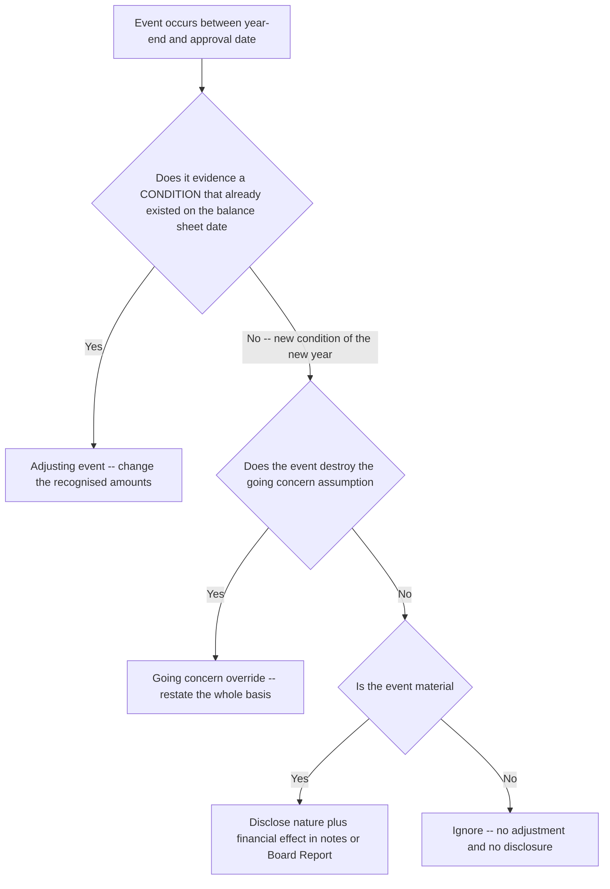
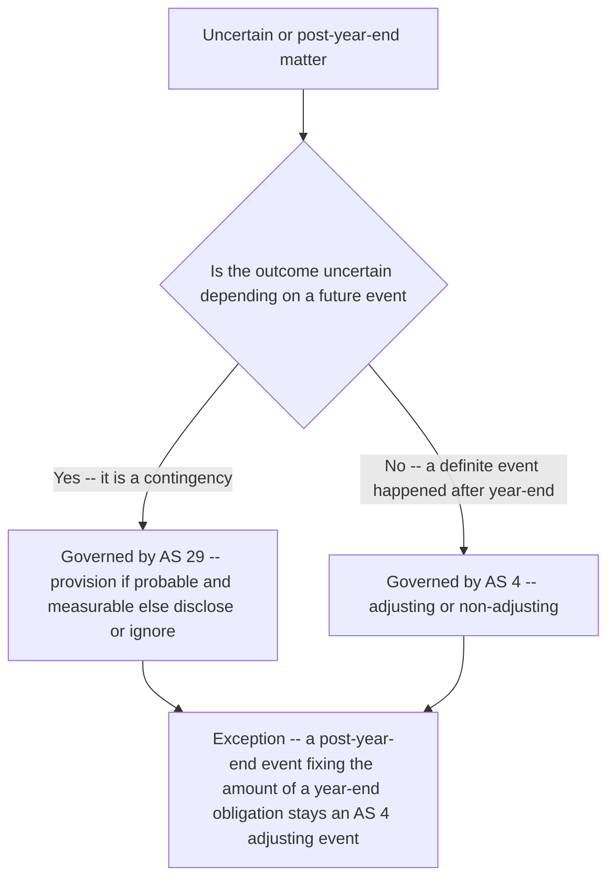

<!-- v2-deep -->

# Chapter 06 — AS 4: Contingencies & Events After the Balance Sheet Date

## 1. The Problem — the real business situation that created the need

Imagine you are the CFO of *Meridian Textiles Ltd.* Your financial year closes on **31 March 2026**. But the accounts are not magically finished at midnight on 31 March. Someone has to total the ledgers, reconcile the bank, count inventory, get the auditors in, prepare the statements, and then the **Board of Directors** meets — say on **12 June 2026** — to formally *approve* the accounts and sign them off before they go to shareholders.

So there is a **gap**, a limbo of about 10 weeks, between the *date the balance sheet is dated* (31 March 2026) and the *date the accounts are approved* (12 June 2026). During that gap, the world does not stand still. Things happen:

- On **20 April 2026**, a customer who owed you ₹40 lakh files for insolvency. He was already in deep trouble on 31 March — you just find out officially now.
- On **5 May 2026**, a fire destroys your Surat warehouse holding ₹2 crore of finished goods.
- On **28 May 2026**, the Board recommends a dividend of ₹3 per share for the year that just ended.
- On **1 June 2026**, a court delivers judgment in a two-year-old lawsuit against you: you must pay ₹75 lakh damages.

Here is the tension. The financial statements are **dated 31 March 2026** and they claim to show a "true and fair view" of the company *as at that date*. But you are *sitting here in June with information you did not have in March.* 

**Which of these June facts should change the 31 March numbers, and which should merely be mentioned?** And separately: some obligations on 31 March were not certain at all — a lawsuit not yet decided, a guarantee you gave a subsidiary. These are **contingencies** — things that *might* become liabilities depending on a future event. How do you report a maybe-liability?

AS 4 exists to answer exactly these two questions. It is a small standard, but it governs a moment every company faces every single year — the moment between "year-end" and "signature."

**Why this even needs a *standard*.** Left to instinct, two managers would answer differently: an optimist would ignore the April insolvency ("it happened in the new year"), a pessimist would write down the burnt warehouse to zero. Both would produce a balance sheet that no longer means the same thing across companies. Accounting standards exist to make the number on the page *comparable* — so that "trade receivables ₹76,00,000" means the same disciplined thing whether it appears in Meridian's accounts or a rival's. AS 4 is the rule that keeps the post-year-end window from becoming a place where each company invents its own truth.

## 2. The Core Idea — the single underlying principle, plain language + analogy

There is **one** unifying principle behind the whole standard, and if you hold it, you never have to memorize a single rule:

> **The balance sheet must tell the truth about conditions that existed on the balance sheet date. Later information is used only to reveal that truth more accurately — not to rewrite history for things that genuinely happened later.**

Think of it like a **photograph taken at 31 March, developed on 12 June.** 

When you develop the photo, you might realise the picture was blurry in one spot — and the developing process lets you *sharpen* it. That is legitimate: the subject was there all along; you are just seeing it better. That is an **adjusting event** — new evidence about a condition that already existed on 31 March.

But you cannot **paste a new person into the photograph** just because they walked into the room in May. They weren't there when the shutter clicked. Pasting them in would make the photo a lie. That is a **non-adjusting event** — a genuinely *new* condition that arose after 31 March. You don't touch the picture; at most you write a caption underneath explaining what happened afterwards.

So the entire test reduces to one question about every post-year-end event:

**"Does this event give me better evidence about something that was ALREADY the case on 31 March? Or does it tell me about a NEW thing that arose only afterwards?"**

- Better evidence of an old condition → **adjust the numbers** (sharpen the photo).
- A new condition arising later → **don't adjust; disclose if material** (write a caption).

Contingencies are the same idea seen from the other side: on 31 March a condition already existed (a pending lawsuit, a guarantee), but its *outcome* depends on a future event. So you ask — how likely, and can I measure it?

**A sharper way to phrase the test.** Weak students ask *"when did the event happen?"* — and get trapped, because every post-year-end event by definition *happens* after year-end. Strong students ask *"when did the underlying condition arise?"* The **event** (the insolvency filing, the court judgment, the auction sale) is always in April–June; that tells you nothing. What matters is whether the **condition** the event reveals (the debtor's ruined finances, the pre-existing obligation, the low realisable value) was already true on 31 March. Separate the *event* from the *condition* it evidences, and the whole chapter becomes mechanical.

*Figure 2.1 — the one decision the whole standard turns on*



*Every question in this chapter is a walk down this single tree.*

## 3. Why it's built this way — the logic behind each rule; what breaks without it

Let's pressure-test the principle so you understand *why* it must be this way.

**Why not just ignore everything after 31 March?** Because you'd be knowingly publishing a false statement. If on 31 March a debtor already owed you ₹40 lakh and was *already* insolvent (his business had collapsed in February, you just get the court confirmation in April), then carrying that debtor at full value is simply *wrong as at 31 March.* The insolvency filing in April didn't *create* the loss — it *confirmed* a loss that already existed. To ignore it is to overstate assets on a date when they were genuinely impaired. The whole point of letting the accounts stay open until approval is to catch exactly this kind of clarifying evidence.

**Why not adjust for everything, including the May fire?** Because that would be *equally* false, in the opposite direction. On 31 March, that ₹2 crore of inventory in Surat was **real, intact, and worth ₹2 crore.** The balance sheet correctly stated the company's position *as at that date*. The fire on 5 May is a **new event of the new year** — it belongs to FY 2026-27. If you wrote down the inventory as at 31 March, you would be reporting a loss in the wrong period and making the 31 March balance sheet *understate* the assets that genuinely existed then. The March photo was accurate; the fire is a May event.

So the adjusting/non-adjusting split is not an arbitrary rule — it is **forced** by the demand that the balance sheet be true *as at its own date.* Break it either way and you publish a falsehood.

**The deeper reason: matching and periodicity.** Beneath the "true as at its date" idea sits the **periodicity assumption** — we chop a continuous business into discrete years so we can report. Once you accept periodicity, every gain and loss has a *home year* determined by *when its cause arose*, not when the paperwork lands. The fire's cause (the ignition) is a May event, so its loss belongs to FY 26-27; forcing it into FY 25-26 would mismatch the loss against the wrong year's revenues. The debtor's ruin is a February/March event, so its loss belongs to FY 25-26. Adjusting vs non-adjusting is nothing more than **putting each loss in its correct home year.**

**But there's a crucial exception — and it too follows from logic, not rote.** What if the May fire is so devastating that the company can no longer continue as a going concern? Now the problem is different. The *entire basis* of preparing the accounts — the assumption that the business will keep operating and its assets are worth their operating values — has collapsed. You cannot present a "business as usual" balance sheet for an entity that is about to die. So **any post-balance-sheet event that undermines the going concern assumption forces you to adjust** — not because the event relates to 31 March conditions, but because the *foundation on which the whole statement rests* is gone. Truth demands you tell the reader the company is no longer a going concern.

**Why does going concern override periodicity?** Because going concern is not one line item — it is the *measurement convention* under which *every* asset is valued. Fixed assets sit at cost less depreciation only because we assume they'll be used, not sold in a hurry. Inventory sits at cost only because we assume orderly sale. Once the enterprise will wind up, *all* of those valuations are wrong simultaneously. So this isn't really "adjusting one event into the old year" — it's admitting the whole statement was built on a now-false premise and rebuilding it. That is why it trumps the ordinary rule.

**Why disclose non-adjusting events at all, if you don't adjust?** Because a reader making decisions in June deserves to know that the ₹2 crore warehouse is gone. The *numbers* stay as at 31 March (that's honest), but a *note* warns the reader that the picture has changed materially since. This respects both truths: the balance-sheet-date truth (numbers) and the reader's need for current information (disclosure).

**Why treat contingencies with a "probability" lens?** A contingency is a condition existing on 31 March whose outcome is *uncertain*. If you booked every possible lawsuit as a liability, balance sheets would be swamped with speculative losses and become useless (and you'd be violating prudence in reverse — creating hidden reserves). If you ignored all of them, real looming losses would be hidden. So the standard grades them by likelihood: if a loss is *probable and measurable*, it has effectively crystallised enough to be a real liability — book it. If it's only *possible*, warn the reader in a note. If it's *remote*, ignore it. This is just prudence applied with proportion.

**Why the asymmetry — losses recognised, gains not?** The same prudence that says "don't overstate assets" says "don't overstate income." A probable *loss* is booked because failing to would flatter the accounts; a probable *gain* is **not** booked because booking it would flatter the accounts. Conservatism is deliberately one-sided: it would rather understate than overstate net worth. This is why a "we'll probably win the lawsuit" line never produces income, but a "we'll probably lose" line does produce an expense.

Now, the historical wrinkle you **must** know for the exam: contingencies were *originally* inside AS 4. When **AS 29 (Provisions, Contingent Liabilities and Contingent Assets)** was issued, it took over the entire subject of contingencies. So today, **the "contingencies" portions of AS 4 stand withdrawn and are dealt with by AS 29.** AS 4 now effectively governs only **events occurring after the balance sheet date** — plus one contingency-related survivor: the requirement to adjust assets and liabilities for events after the balance sheet date that provide evidence about *conditions* existing at year-end. We'll map this handover precisely in Section 4 and Section 7.

## 4. Full Technical Content — every provision, through the RMPD lens

### 4.1 Scope and key definitions

AS 4 deals with the treatment in financial statements of **(a) contingencies** and **(b) events occurring after the balance sheet date.** However, following AS 29, all matters relating to **contingencies** (contingent losses/liabilities and contingent gains/assets) are now governed by **AS 29**, *except* to the extent AS 29 itself doesn't cover them. For the exam, remember the clean division:

- **AS 4** → events occurring after the balance sheet date (adjusting / non-adjusting), proposed dividends, going concern.
- **AS 29** → provisions, contingent liabilities, contingent assets.

**Definitions to know cold:**

| Term | Definition (conceptual) |
|---|---|
| **Events occurring after the balance sheet date** | Significant events, both **favourable and unfavourable**, that occur between the **balance sheet date** and the **date on which the financial statements are approved by the approving authority** (Board of Directors for a company; corresponding authority for other entities). |
| **Contingency** (as originally defined) | A condition or situation, the ultimate outcome of which — gain or loss — will be known or determined only on the occurrence, or non-occurrence, of one or more uncertain future events. *(Now under AS 29.)* |
| **Approving authority** | Board of Directors for a company; the corresponding approving body for other entities. |

**Two dates that anchor everything:**
1. **Balance sheet date** — e.g. 31 March 2026 (the date the photo is dated).
2. **Date of approval** — e.g. 12 June 2026 (the date the Board signs off; the window closes here). Events *after* approval are **outside** AS 4's scope entirely.

**Fine distinction — "approval" vs "adoption".** The window closes at **Board approval** of the accounts (when the Board signs the financial statements), *not* at their later **adoption by shareholders at the AGM**. A common exam stem gives you a Board-approval date *and* an AGM date to see whether you pick the right one. Rule: the AS 4 window is **balance sheet date → Board approval date.** The AGM is irrelevant to the window (it matters only for the *dividend* recognition, Section 4.5).

**Both directions count.** The definition says events "favourable *and* unfavourable." Students instinctively hunt for losses, but a favourable event (e.g. a post-year-end court win confirming the *amount* of a receivable that was doubtful at year-end, or the recovery of an asset previously written off) is equally within scope. Adjusting works both ways: it can *increase* an asset or *reduce* a liability where the evidence relates to a year-end condition.

### 4.2 The two types of events (the heart of AS 4)

**Type A — Adjusting events.** Events providing **additional evidence of conditions that existed at the balance sheet date.** You must **adjust** assets and liabilities (i.e., change the recognised amounts in the financial statements).

*Recognition rule:* Adjust the numbers.

Classic examples:
- **Insolvency of a debtor** after year-end, where the debtor's financial condition on the balance sheet date already justified doubting recovery → write down / write off the receivable as at year-end.
- **Sale of inventory after year-end below cost**, giving evidence of net realisable value at the balance sheet date → apply the write-down to that inventory as at year-end (links to AS 2).
- **Settlement of a court case after year-end** that confirms a **present obligation existed at the balance sheet date** → adjust the liability to the settled amount.
- **Discovery of fraud or error** showing the statements were incorrect → adjust.
- **Property valuation / final determination of purchase or sale price** of assets bought/sold before year-end.

**Type B — Non-adjusting events.** Events concerning **conditions that arose after the balance sheet date.** You do **not** adjust the numbers; you **disclose** them if material.

*Recognition rule:* Do NOT adjust. Disclose in the Report of the Approving Authority (Directors' Report / notes) if material.

Classic examples:
- **Fire, flood, natural calamity** destroying assets after year-end.
- **Major purchase or disposal of a business / assets** after year-end.
- **Change in market value of investments** after year-end (a new-year condition).
- **Loss of assets** due to a new event after year-end.
- **Strikes, litigation started fresh** after year-end.

**The discipline test** you apply to every event: *"Was the condition already present on the balance sheet date, or did it arise afterwards?"* Present already → adjust. Arose after → disclose.

**Two grey-zone principles the examiner exploits:**

*(i) Same fact pattern, opposite treatment, depending on trigger date.* "Debtor became insolvent" is adjusting or non-adjusting purely on whether the debtor's collapse pre-dated year-end. The words are identical; only the timeline differs. Whenever a stem is silent on *when* the debtor's finances deteriorated, that silence is the whole question — state your assumption explicitly and answer conditionally.

*(ii) Falling market values of investments are generally NON-adjusting.* A slump in share prices *after* year-end reflects new-year market conditions, not a year-end condition — so it is not adjusted (for a company carrying long-term investments at cost, a *temporary* decline isn't recognised anyway). **But** if the post-year-end fall is *evidence* that a decline already existing at year-end was **other than temporary** (a permanent diminution under AS 13), that is an adjusting event. So "share price fell after year-end" defaults to non-adjusting *unless* it reveals a permanent, pre-existing impairment.

### 4.3 The going concern override

There is one situation where a **non-adjusting-type** event *must nevertheless be adjusted*: when an event after the balance sheet date indicates that the **going concern assumption is no longer appropriate** for the whole enterprise (or a material part of it). 

*Recognition rule:* If going concern is destroyed, **change the fundamental basis** of accounting — restate assets at realisable values, reclassify, and do NOT prepare on a going concern basis. This overrides the "don't adjust new events" rule because the very foundation of the statements is affected.

Example: A catastrophic post-year-end event (loss of the entire business, collapse of the sole customer/market) means the company will wind up. Even though the event is "new," you cannot present going-concern accounts.

**What "change the basis" actually means in the answer sheet:**
1. Restate fixed assets and other long-term assets from carrying amount to **net realisable / break-up value**.
2. **Reclassify** non-current items as current (nothing is "long-term" for an entity about to wind up).
3. **Provide** for costs that will crystallise on winding up (retrenchment/redundancy, penalty on early lease termination, warranty run-off, legal and liquidation costs).
4. **Disclose prominently** that the accounts are prepared on a non-going-concern (realisable/break-up) basis, the reasons, and the effect.

**Scope nuance:** the standard also covers where going concern fails for a *material part* of the enterprise (e.g. one dominant division shuts). You don't necessarily abandon going concern for the whole entity — you adjust for the part whose basis has changed. Read whether the stem kills the *whole* company or a *segment*.

### 4.4 Statutory / regulatory events — the "dividend and similar" adjustment rule

AS 4 also requires you to **adjust** for events occurring after the balance sheet date that, although they *don't* concern conditions at the balance sheet date, are of such significance that **non-disclosure would affect the ability of users to make proper evaluations and decisions** — where required by statute or regulation. The most examinable instance is **proposed dividend** (below).

### 4.5 Proposed dividend — the rule that changed (KNOW BOTH POSITIONS)

This is the single most tested point in the chapter, and the rule **changed**, so you must know the *current* position and *why*.

**The situation:** For FY 2025-26, the Board, at its meeting on 28 May 2026, *proposes/recommends* a dividend for the year that just ended. The dividend is declared/approved by shareholders only *later*, at the AGM. So on 31 March 2026, there is **no obligation** to pay the dividend — shareholders haven't approved it. It is a *proposal*, contingent on the AGM.

**Old position (pre-amendment):** Under the earlier version of AS 4, proposed dividend was **adjusted** — you created a provision for proposed dividend as a liability in the 31 March balance sheet and showed the appropriation in the P&L appropriation. This treated the recommended dividend as if it belonged to the year to which it relates.

**Current position (post-amendment, aligned with AS 4 as revised and the Companies Act framework / AS 29):** Since there is **no present obligation** on the balance sheet date (the AGM hasn't approved it), a **liability/provision is NOT recognised**. Proposed dividend is a **non-adjusting event** and is **disclosed in the notes** to the financial statements. It hits the accounts (as a reduction of retained earnings / as a liability) only in the period in which it is **approved** by shareholders.

> **Exam takeaway:** Under **current AS 4**, proposed dividend for the reporting year is **NOT provided for** as a liability at year-end; it is a **non-adjusting event, disclosed in notes.** If a question is set under the old regime or explicitly says "provide for proposed dividend," follow that instruction — but the default/current answer is *disclose, don't provide.* When in doubt, state the reasoning (no present obligation at year-end) and both treatments; the reasoning earns the marks.

*Why the change makes sense:* A liability exists only when there's a **present obligation** arising from a past event. On 31 March, the shareholders have not declared anything — the company can still change or withhold the dividend at the AGM. There is no obligation to transfer resources. Recognising a provision would violate the very definition of a liability. So the amended standard correctly reclassifies it as a disclosure.

**The interim-dividend contrast (examiner's favourite trap-within-a-trap).** An **interim dividend** *declared by the Board during the year* (or before year-end) is different — the Board has the power to declare it and, once declared, it *is* a present obligation. So an interim dividend already declared and paid/payable at year-end **is recognised** in that year. The "disclose, don't provide" rule applies to the **final/proposed dividend recommended after year-end**, not to interim dividends the Board already declared. Read carefully which one the stem gives you.

**Dividend on the *books* the other way — dividend income receivable.** Symmetrically, if the reporting company is a *shareholder* in another company, a dividend that the investee's Board *recommends* after year-end is likewise **not** income of the current year for the investor (no right to receive until declared at the investee's AGM). Don't accrue dividend income for a dividend merely proposed by the payer after year-end.

### 4.6 Events after approval / after issue

Events occurring **after** the date of approval are **outside AS 4.** If information about *material* events comes to light after approval but before issue, the auditors and management deal with it under auditing standards and company law — not AS 4. The AS 4 window is strictly **balance sheet date → approval date.**

**Practical corollary for problems:** always read the stem for *two* dates and place each event on the timeline. An event dated *after* the Board-approval date — even a catastrophic one — gets **no** AS 4 treatment in these accounts; it becomes a *next-year* event. Examiners plant an event a few days after approval precisely to see if you police the window's closing edge.

### 4.7 Contingencies — the AS 4 remnant and the AS 29 handover

Because the exam syllabus still links AS 4 to contingencies, here is the precise map:

- The **treatment and disclosure of contingent losses and contingent gains** — originally in AS 4 — now sits in **AS 29.** In short: a **contingent loss** becomes a **provision** (recognised liability) only if a loss is **probable** and can be **reliably estimated**; if only **possible** (or probable-but-unmeasurable), it is a **contingent liability** and only **disclosed**; if **remote**, nothing is done. **Contingent gains / contingent assets are NOT recognised** (prudence); they may be disclosed only when the inflow is **virtually certain / the realisation is reasonably certain** (in which case it's not really contingent anymore).
- What **survives in AS 4** is the linkage: *events after the balance sheet date that provide evidence about the amount of a contingency (a condition existing at year-end) are adjusting events* — e.g., a court decision after year-end on a suit pending at year-end confirms the amount of a present obligation, so you adjust.

We treat AS 29 fully in its own chapter; here, just hold the boundary line.

*Figure 4.1 — where each item now lives*



*The interlock lives at the litigation-settlement example -- AS 29 decides whether an obligation exists at year-end while AS 4 uses the after-date judgment to fix its amount.*

## 5. Worked Examples

### Example 1 (Easy) — Classifying five events

*Reejo Ltd.'s balance sheet date is 31 March 2026; the Board approves the accounts on 10 June 2026. Classify each event as Adjusting (A) or Non-adjusting (NA) and state the treatment.*

| # | Event (occurs between 1 Apr and 10 Jun 2026) | Reasoning — was the condition present on 31 Mar? | Class | Treatment |
|---|---|---|---|---|
| 1 | A debtor of ₹5,00,000, already in severe financial distress on 31 Mar, is declared insolvent on 2 May. | The impairment *existed* on 31 Mar; insolvency merely confirms it. | **A** | Write off/provide ₹5,00,000 in FY 25-26 accounts. |
| 2 | Warehouse stock worth ₹12,00,000 destroyed by flood on 20 Apr. | Stock was intact & worth ₹12 lakh on 31 Mar; flood is a *new* event. | **NA** | Don't adjust. Disclose in Directors' Report/notes (material). |
| 3 | Inventory costing ₹3,00,000 (held on 31 Mar) sold on 15 Apr for ₹2,10,000. | NRV at year-end was below cost — evidence of a 31-Mar condition. | **A** | Write inventory down to NRV (AS 2) → recognise ₹90,000 loss in FY 25-26. |
| 4 | A new lawsuit filed against the company on 25 Apr for an April incident. | Condition arose *after* year-end. | **NA** | Disclose if material; no adjustment. |
| 5 | Board recommends dividend of ₹8,00,000 on 28 May for FY 25-26. | No obligation existed on 31 Mar (AGM not held). | **NA** | **Do not provide**; disclose in notes (current AS 4). |

*Key learning:* events 1 and 3 look like they "happened in April/May," but the **condition** they reveal existed on 31 March — so they sharpen the photo. Events 2, 4, 5 are new conditions — captions only.

### Example 2 (Medium) — Debtor insolvency vs. debtor default; and the journal entries

*Sundar Ltd. (year-end 31 March 2026, approval 5 July 2026) has trade receivables of ₹80,00,000 on 31 March. Two developments occur:*

*(a) Customer P owed ₹6,00,000. On 31 March, P was solvent and paying normally. On 12 May 2026, P's factory burnt down, P became insolvent, and the ₹6,00,000 is now irrecoverable.*

*(b) Customer Q owed ₹4,00,000. Q had already defaulted and stopped operations in February 2026. On 20 April 2026, the court confirmed Q's liquidation with nil recovery.*

**Analysis.**

*(a) Customer P:* On 31 March, P was healthy — the receivable was genuinely good. The cause of loss (the fire) arose *after* year-end. This is a **non-adjusting event.** The ₹6,00,000 stays as a good receivable in the 31 March balance sheet; the loss belongs to FY 2026-27. Disclose in notes if material.

*(b) Customer Q:* On 31 March, Q had *already* collapsed (stopped operating in February). The condition (impairment) **existed on the balance sheet date**; the April court order is confirming evidence. This is an **adjusting event.** Write off ₹4,00,000 in the FY 2025-26 accounts.

**Journal entry for the adjusting event (Q), as at 31 March 2026:**

```
Bad Debts (or Provision for Doubtful Debts) A/c   Dr.   4,00,000
        To Sundry Debtors (Q) A/c                              4,00,000
(Being receivable from Q written off — insolvency
 confirmed after year-end but condition existed at 31 Mar 2026)

Profit & Loss A/c                                 Dr.   4,00,000
        To Bad Debts A/c                                       4,00,000
(Being bad debts charged to P&L of FY 2025-26)
```

**No entry for P** in FY 2025-26 — only a note. Net receivables in the 31 March 2026 balance sheet = ₹80,00,000 − ₹4,00,000 = **₹76,00,000**, with a disclosure that ₹6,00,000 from P became doubtful post-year-end due to a May fire.

*Trap defused:* Both are "customer went insolvent after year-end," yet one adjusts and one doesn't. The discriminator is **when the condition arose**, not when you found out.

### Example 3 (Exam-hard) — Multiple events, dividend, tax, litigation, going concern

*Vega Ltd. closes accounts on 31 March 2026; the Board approves them on 28 June 2026. As the accountant, decide the treatment of each and quantify the impact on the FY 2025-26 statements. Draft-stage figures: Profit before these items ₹50,00,000; trade receivables ₹90,00,000; inventory ₹30,00,000.*

1. On **15 April 2026**, a debtor owing **₹7,00,000** (who was disputing the bill but *solvent* on 31 March) formally agreed to a one-time settlement of **₹5,00,000**, paid immediately. The dispute over the amount existed on 31 March.
2. On **30 April 2026**, an **income-tax assessment** for AY 2024-25 was completed, raising an additional demand of **₹3,50,000** relating to that earlier year, now accepted by the company.
3. On **10 May 2026**, a **fire** destroyed a machine (WDV on 31 Mar: **₹9,00,000**); it was uninsured. Vega continues in business normally.
4. On **20 May 2026**, the Board **recommended a dividend of ₹6,00,000** for FY 2025-26.
5. A **lawsuit** pending on 31 March was **decided on 12 June 2026**: Vega must pay **₹4,00,000** damages (a present obligation existing at year-end).
6. On **25 June 2026**, Vega's **only major customer** (60% of revenue) permanently exited, and management concludes Vega **cannot continue** as a going concern.

**Item-by-item reasoning.**

**Item 1 — Adjusting.** The *condition* (a disputed receivable of uncertain realisable value) existed on 31 March; the settlement gives evidence of its true value at year-end. Adjust: write the receivable down from ₹7,00,000 to ₹5,00,000 → **loss ₹2,00,000** in FY 25-26.

**Item 2 — Adjusting.** The tax liability relates to an *earlier* year (a condition/obligation that existed before and at 31 March). The assessment finalises the amount. Provide **₹3,50,000** as a liability/expense in FY 25-26. *(If Vega had disputed and intended to appeal, it might instead be a contingent liability under AS 29 — but here it's accepted, so provide.)*

**Item 3 — Non-adjusting.** The machine was intact and worth ₹9,00,000 on 31 March; the fire is a new-year event and Vega remains a going concern. **No adjustment** to FY 25-26. Disclose the ₹9,00,000 loss in the Directors' Report/notes (material). *(The loss will hit FY 26-27.)*

**Item 4 — Non-adjusting (current AS 4).** No obligation on 31 March. **Do not provide** the ₹6,00,000; **disclose** in notes. *(Under the old rule you'd have provided it — mention this to show command of the change.)*

**Item 5 — Adjusting.** A present obligation *existed* on 31 March (suit pending); the June judgment confirms the amount. Provide **₹4,00,000** as a liability/expense in FY 25-26.

**Item 6 — Adjusting via the going concern override.** Although the customer's exit is a *new* June event, it destroys the going concern assumption. Therefore the accounts must **NOT** be prepared on a going concern basis; assets are restated to realisable values and the fundamental basis is changed, with full disclosure. This overrides "don't adjust new events."

**Quantified effect on FY 2025-26 profit (before going-concern restatement):**

| Item | Adjust P&L? | Amount (₹) |
|---|---|---|
| Draft profit before items | — | 50,00,000 |
| 1. Debtor settlement loss | Yes (−) | (2,00,000) |
| 2. Additional tax (prior year) | Yes (−) | (3,50,000) |
| 3. Fire loss (machine) | **No** — non-adjusting | — |
| 4. Proposed dividend | **No** — non-adjusting | — |
| 5. Litigation damages | Yes (−) | (4,00,000) |
| **Adjusted profit (pre-going-concern)** | | **40,50,000** |

Then, because of **Item 6**, the going concern basis fails: Vega must **restate assets at net realisable values, reclassify long-term items as current, provide for winding-up costs, and disclose that the accounts are prepared on a non-going-concern (break-up/realisable) basis.** This can materially change every asset carrying amount — the decisive point the examiner is testing is that you **recognise the override** and don't just treat the customer loss as a mere note.

*Note on Item 3 vs Item 6 together:* absent Item 6, the fire is a pure note. But since going concern has independently collapsed, the whole balance sheet is restated anyway.

### Example 4 (Exam-hard) — The timeline stress test: events on both edges of the window

*Nimbus Ltd. has year-end 31 March 2026. The Board approves the accounts on **15 June 2026**. The AGM is scheduled for **10 August 2026**. Draft profit ₹28,00,000. Decide treatment.*

1. **8 April 2026** — a customer owing ₹2,00,000, in liquidation since January 2026, confirmed to pay nil.
2. **1 June 2026** — a warehouse fire destroys uninsured goods worth ₹5,00,000; Nimbus continues normally.
3. **20 June 2026** — Nimbus loses a labour tribunal case (dispute pending since 2025) and must pay ₹3,00,000.
4. **5 July 2026** — a debtor owing ₹1,50,000, solvent at year-end, becomes insolvent.

**Reasoning against the timeline.** The AS 4 window is **31 Mar 2026 → 15 Jun 2026 (Board approval)**. The August AGM is a decoy — it does *not* extend the window.

- **Item 1 (8 Apr):** inside window; condition (customer insolvent since January) existed at year-end → **adjusting.** Write off ₹2,00,000. Profit falls to ₹26,00,000.
- **Item 2 (1 Jun):** inside window; new-year condition, going concern intact → **non-adjusting.** Disclose ₹5,00,000; no profit effect.
- **Item 3 (20 Jun):** **outside** the window (after 15 Jun approval), *even though* it confirms a year-end obligation. AS 4 does **not** apply — it is a next-year event; no adjustment to FY 25-26. *(Had it fallen on or before 15 Jun it would have been an adjusting provision of ₹3,00,000.)*
- **Item 4 (5 Jul):** outside the window **and** a new condition anyway → no AS 4 treatment for FY 25-26.

**Adjusted profit:** ₹50 lakh? No — start ₹28,00,000, only Item 1 bites: **₹26,00,000.** Disclosure note for Item 2 only.

*Self-check:* only events (a) inside the window **and** (b) evidencing a year-end condition change the numbers. Item 3 is the sting — a textbook adjusting *type* that fails purely on timing. Item 4 fails on *both* tests. This is why you plot every date before touching a rupee.

### Example 5 (Medium-hard) — Inventory NRV, a rebate, and a permanent investment fall

*Corvid Ltd., year-end 31 March 2026, approval 30 June 2026. Resolve each with amounts.*

1. Finished goods costing **₹10,00,000** were on hand at 31 March. Between April and June, ₹6,00,000 (cost) of them were sold for ₹4,20,000 due to a market glut that already existed at year-end; the remaining ₹4,00,000 (cost) are expected to fetch only ₹3,10,000.
2. On **12 May 2026**, a supplier granted a **volume rebate of ₹80,000** relating to purchases *made during FY 2025-26*.
3. Long-term investment in listed shares carried at cost **₹5,00,000**. Market value was ₹4,90,000 on 31 March and fell to ₹2,00,000 by June because the investee's fraud (existing but undisclosed at year-end) surfaced in May — a permanent diminution.

**Reasoning and amounts.**

**Item 1 — Adjusting (AS 2 via AS 4).** The glut existed at year-end, so the post-year-end sales/estimates are *evidence of NRV at 31 March.* Write inventory down to lower of cost or NRV:
- Sold lot: NRV ₹4,20,000 vs cost ₹6,00,000 → write-down **₹1,80,000.**
- Held lot: NRV ₹3,10,000 vs cost ₹4,00,000 → write-down **₹90,000.**
- Total inventory write-down = **₹2,70,000**; inventory carried at ₹4,20,000 + ₹3,10,000 = **₹7,30,000** (vs ₹10,00,000 cost).

**Item 2 — Adjusting.** The rebate relates to FY 25-26 purchases — a condition/entitlement that existed at year-end; its confirmation in May fixes the amount. Reduce purchase cost / recognise ₹80,000 (income or COGS reduction) in FY 25-26.

**Item 3 — Adjusting (permanent diminution, AS 13 lens).** Ordinarily a post-year-end market fall is *non-adjusting.* But here the fall reveals a diminution that is **other than temporary** and rooted in a condition (the fraud) *existing at year-end.* Provide for the permanent diminution: write investment down from ₹5,00,000 toward realisable value → recognise the impairment (e.g. to ₹2,00,000, a **₹3,00,000** charge — quantum per management's best estimate; *verify the exact realisable figure the question gives*).

**Net effect on FY 25-26 profit:** −₹2,70,000 (inventory) + ₹80,000 (rebate) − ₹3,00,000 (investment) = **−₹4,90,000** against draft profit.

*Trap defused:* Item 3 is the discriminator — a market fall is *usually* non-adjusting, but "permanent diminution rooted in a year-end condition" flips it to adjusting. If the June fall had been an ordinary market swing with no year-end cause, it would have been a mere disclosure (or nothing, for a long-term investment carried at cost).

### Example 6 (Concept) — Contingent gain temptation and a guarantee

*Wren Ltd., year-end 31 March 2026, approval 20 June 2026.*

1. Wren is suing a competitor for patent infringement; on **1 June 2026** its lawyers opine Wren will **probably win ₹15,00,000** in damages.
2. Wren gave a **guarantee** for a subsidiary's ₹20,00,000 loan; at year-end the subsidiary is healthy and repaying on time.
3. On **5 May 2026**, the subsidiary in (2) defaulted because of a **new April crisis**, and the bank has invoked Wren's guarantee for ₹20,00,000.

**Reasoning.**

**Item 1 — do NOT recognise.** A *probable gain* is still a **contingent asset** — never booked (prudence, asymmetry). Even "probably win" is not enough; recognition needs realisation to be **virtually certain**, which a mere favourable legal opinion is not. At most, disclose. No income in FY 25-26.

**Item 2 — contingent liability, disclose only.** At year-end the guarantee is a possible obligation whose crystallisation depends on a future default; the subsidiary is healthy, so outflow is not probable → **AS 29 contingent liability, disclosed by way of note**, not provided.

**Item 3 — non-adjusting (and going concern for the sub, not Wren).** The default's cause is an **April crisis** — a *new* condition after year-end. So the guarantee's invocation is a **non-adjusting event** for FY 25-26 (the year-end condition was "healthy subsidiary"). Disclose the ₹20,00,000 potential outflow prominently as a material non-adjusting event; the expense hits FY 26-27. *(Had the subsidiary already been failing at 31 March, invocation would instead be adjusting — provide.)*

*Trap defused:* Students book Item 1 as income (wrong — contingent gains are never recognised) and adjust Item 3 into FY 25-26 (wrong — the triggering condition arose in April). Both errors come from ignoring *when the condition arose* and *the loss/gain asymmetry.*

## 6. Presentation & Disclosure formats

**Where AS 4 items appear:**

- **Adjusting events** flow **into the primary statements themselves** — the Balance Sheet and Statement of Profit and Loss carry the *adjusted* figures. There is no separate line called "adjusting events"; they are baked into receivables, inventory, provisions, tax, etc.
- **Non-adjusting events (material)** are disclosed in the **Report of the Approving Authority** (for a company, the **Board's/Directors' Report**) and/or **Notes to Accounts.** 

**Disclosure content for a material non-adjusting event (AS 4 requires):**
1. The **nature** of the event; and
2. An **estimate of its financial effect**, or a statement that **such an estimate cannot be made.**

*Illustrative note:*

> **Note X — Events occurring after the balance sheet date.** Subsequent to 31 March 2026, on 10 May 2026 a fire destroyed a machine at the Surat unit having a carrying value of ₹9,00,000 as at the balance sheet date, which was uninsured. The loss will be recognised in the financial statements for the year ending 31 March 2027. This event does not affect the going concern assumption.

*Illustrative proposed-dividend note:*

> **Note Y — Proposed dividend.** The Board of Directors, at its meeting held on 20 May 2026, has recommended a dividend of ₹6,00,000 (₹6 per equity share) for the year ended 31 March 2026, subject to approval of shareholders at the ensuing Annual General Meeting. In accordance with AS 4, this proposed dividend has not been recognised as a liability as at 31 March 2026 and will be recognised in the year of shareholders' approval.

**Going concern disclosure:** where the going concern assumption is inappropriate, the fact, the basis on which the statements have been prepared (e.g., realisable/break-up values), and the reasons are disclosed prominently.

**The "estimate cannot be made" escape valve — used honestly.** AS 4 deliberately lets you disclose *nature* plus a statement that an estimate can't be made. This is not a licence to be vague when you *can* estimate. If a fire destroyed goods whose carrying value you know, "financial effect ≈ ₹9,00,000" is expected; "cannot be estimated" would be a wrong answer. Reserve the escape valve for genuinely unquantifiable events (e.g. reputational fallout of a recall).

**Format discipline for answers.** In a subjective question, present each item as: *(i) classify* (adjusting / non-adjusting / outside window / contingency), *(ii) one-line reason* (condition existed at year-end? going concern? present obligation?), *(iii) treatment + amount* (adjust ₹__ / disclose / nothing). Markers award the *reason*, not just the label — a right label with no reason is a partial answer.

## 7. Connections — links across AS, chapters, and subjects

- **AS 29 (Provisions, Contingent Liabilities & Contingent Assets):** the **direct successor** for all "contingency" content once in AS 4. Master the handover: *outcome uncertain and depends on future events* → AS 29. But *an after-year-end event confirming the amount of a year-end obligation* → AS 4 adjusting event. They interlock at the litigation-settlement example.
- **AS 2 (Valuation of Inventories):** the "inventory sold below cost after year-end" example is an AS 4 adjusting event that operationalises AS 2's **cost or NRV, whichever is lower** — the after-date sale is evidence of NRV at year-end.
- **AS 13 (Accounting for Investments):** a post-year-end fall that reveals a **permanent (other than temporary) diminution** rooted in a year-end condition is an AS 4 adjusting event operationalising AS 13; an ordinary temporary market swing after year-end is non-adjusting (Example 5, Item 3).
- **AS 9 (Revenue Recognition) & bad debts:** debtor insolvency after year-end links to receivable measurement.
- **AS 5 (Net Profit/Loss, Prior Period Items, Changes in Accounting Policies):** a fraud/error discovered after year-end (AS 4 adjusting) may involve prior-period considerations under AS 5. Distinguish carefully: AS 4 adjusts the *current* year's draft accounts for a year-end condition; AS 5 governs a *prior-period item* once that prior year is already closed and reported.
- **AS 10 (PP&E):** post-year-end final determination of an asset's purchase/sale price is an adjusting event affecting the carrying amount.
- **Companies Act, 2013 & auditing:** the "approval by Board" date, Directors' Report disclosures, dividend declaration mechanics (AGM approval), and **SA 560 "Subsequent Events"** in *Auditing* are the twin of AS 4 — auditors test exactly this window. SA 560 even distinguishes events up to the audit report date from facts discovered *after* — mirroring AS 4's window edge. The dividend rule ties to the Act's dividend provisions.
- **Ind AS contrast:** **Ind AS 10 "Events after the Reporting Period"** mirrors AS 4 almost exactly (adjusting vs non-adjusting), and *also* treats proposed dividend as **non-adjusting/disclosure only** — so the amended AS 4 and Ind AS 10 now agree. Under Ind AS, contingencies live in **Ind AS 37.** One nuance to flag: Ind AS 10 formally defines the "date of authorisation for issue," conceptually the same window-closing date as AS 4's approval date.

## 8. Traps & Examiner Tricks

1. **The "when did you find out" decoy.** Examiners describe an event happening in April/May and dare you to call it non-adjusting. Always ask: *did the condition exist on 31 March?* Debtor insolvency, inventory NRV, court confirmation of a pending suit — these are **adjusting** even though "discovered" later.
2. **Two near-identical debtor cases** (like Example 2): one solvent-then-collapsed (NA), one already-collapsed (A). The examiner wants you to treat both the same. The discriminator is the **timing of the condition.**
3. **Proposed dividend — old vs new.** The classic trap. Under **current AS 4, do NOT provide; disclose.** If the question predates the amendment or explicitly instructs provisioning, follow it — but always state the *reason* (no present obligation at year-end). Writing "provide for proposed dividend" as a reflex loses marks now.
4. **Missing the going concern override.** A catastrophic new event is presented as "just a note," but if it kills going concern, you must **change the whole basis of preparation.** Students who mechanically apply "new event → non-adjusting" walk into this.
5. **Events after the approval date.** If the event occurs *after* the Board approves the accounts, AS 4 **does not apply.** Watch the two dates in the question stem — and don't be fooled by a *later AGM date* that tries to look like the window's edge (Example 4).
6. **Contingent gains.** Never recognise a contingent gain/asset (prudence). Only disclose when realisation is **virtually/reasonably certain** (AS 29). Examiners plant a "we expect to win a lawsuit" line to tempt you into booking income (Example 6, Item 1) — even "probably win" is not enough.
7. **Confusing "disclose" with "adjust."** Non-adjusting ≠ ignore. Material non-adjusting events **must be disclosed** with nature + financial effect (or a statement that it can't be estimated). Omitting disclosure is also wrong.
8. **Tax assessments.** An assessment finalised after year-end for a **prior/current** year is generally **adjusting** (obligation already existed) *if accepted*; if genuinely disputed with intent to appeal, it may be a **contingent liability** (AS 29) — read the facts.
9. **Materiality filter.** Only **material** non-adjusting events need disclosure. Trivial post-year-end events are ignored — but adjusting events are adjusted regardless (subject to materiality of the statements).
10. **Interim vs proposed dividend.** An **interim dividend already declared by the Board** is a real obligation and is recognised; only the **final/proposed dividend recommended after year-end** gets the "disclose, don't provide" treatment. Swapping the two loses marks (Section 4.5).
11. **Falling investment values.** Default is **non-adjusting** (new-year market condition). It flips to **adjusting** only if the fall evidences a **permanent diminution rooted in a year-end condition** (Example 5, Item 3). Don't reflexively adjust every price drop.
12. **"Approval" vs "adoption/issue."** The window closes at **Board approval**, not shareholder adoption at the AGM and not the date of issue/filing. A stem offering all three dates is testing exactly this (Example 4).
13. **Going concern for a part vs the whole.** If only a material *segment* loses going concern, you restate *that part's* basis — you don't necessarily abandon going concern for the entire entity. Read the scope of the collapse.

## 9. First-Principles Recap

- The balance sheet must be **true as at its date**; later information only **sharpens** that truth, it doesn't rewrite history.
- The window that matters is **balance sheet date → date of approval by the Board** — *not* the AGM and *not* the issue date.
- **One test** decides everything: *did the condition already exist at year-end?* Yes → **adjust** (adjusting event). No → **don't adjust; disclose if material** (non-adjusting event).
- Separate the **event** (always after year-end) from the **condition** it evidences (the thing that decides the treatment).
- **Adjusting** = new evidence of an old condition (debtor already impaired, inventory NRV, court confirming a pending suit, permanent investment diminution, tax finalised, rebate on old purchases, fraud/error, final price of pre-year-end deals).
- **Non-adjusting** = a new condition of the new year (fire/flood after year-end, ordinary market value changes, fresh litigation, business bought/sold after year-end, guarantee invoked due to a new default).
- The **going concern override**: any post-year-end event that destroys going concern **forces adjustment of the whole basis** — because the foundation of the statements is gone. Losses/gains have a *home year* (periodicity); going concern override is the one case where the *measurement basis itself* changes.
- **Proposed dividend (current AS 4): NOT a liability at year-end** (no present obligation) → **disclose in notes**, recognise when shareholders approve. Interim dividend already declared *is* recognised.
- **Prudence asymmetry:** probable losses are recognised; probable gains are not.
- **Contingencies migrated to AS 29**; AS 4 keeps only the "adjust for evidence of year-end conditions" link. Contingent losses: provide if probable + measurable, else disclose; contingent gains: never recognise.
- Disclosure of material non-adjusting events = **nature + estimated financial effect** (or a statement it can't be estimated).

## 10. Quick-Revision Sheet

**Two anchor dates:** Balance sheet date → Date of approval (Board). Events outside this window: not AS 4. (AGM / issue date are decoys.)

| Situation | Condition existed at year-end? | Treatment |
|---|---|---|
| Debtor already insolvent before/at year-end, confirmed later | Yes | **Adjust** (write off) |
| Debtor solvent at year-end, collapses later | No | Non-adjusting → disclose |
| Inventory sold below cost after year-end | Yes (NRV) | **Adjust** (write down, AS 2) |
| Fire/flood destroying assets after year-end | No | Non-adjusting → disclose |
| Pending suit decided after year-end (within window) | Yes (present obligation) | **Adjust** (provide) |
| Pending suit decided *after approval date* | (outside window) | No AS 4 treatment — next year |
| Fresh suit filed after year-end | No | Non-adjusting → disclose |
| Ordinary fall in investment market value after year-end | No | Non-adjusting (or nil for LT-at-cost) |
| Permanent diminution rooted in year-end condition | Yes | **Adjust** (AS 13) |
| Tax assessment (prior/current yr) finalised & accepted | Yes | **Adjust** (provide) |
| Fraud/error discovered | Yes | **Adjust** |
| Proposed/final dividend for the year | No obligation at year-end | **Do NOT provide → disclose (notes)** |
| Interim dividend already declared by Board | Yes (obligation) | **Recognise** |
| Contingent gain / "we'll probably win" | — | **Never recognise**; disclose only if virtually certain |
| Event destroying going concern | (override) | **Adjust whole basis; non-going-concern** |

**Adjusting-event journal (debtor written off):**
```
P&L A/c                 Dr.
   To Bad Debts A/c
Bad Debts A/c           Dr.
   To Sundry Debtors A/c
```

**Proposed dividend (current):** No provision entry at year-end. Recognise on shareholder approval:
```
(On approval)  Retained Earnings / P&L Approp. A/c   Dr.
                    To Dividend Payable A/c
```

**Non-adjusting disclosure must state:** (1) nature of event; (2) estimate of financial effect, OR that no estimate can be made.

**Contingencies handover:** Contingencies → **AS 29**. Provide contingent loss if **probable + reliably estimable**; else disclose (possible) or ignore (remote). **Never recognise contingent gains.**

**Answer structure (per item):** classify → one-line reason (condition at year-end? / going concern? / present obligation?) → treatment + amount. The *reason* earns the marks.

**Ind AS map:** Events → Ind AS 10 (same logic, dividend also non-adjusting); Contingencies → Ind AS 37.

**One-line law:** *Adjust for the past made clearer; disclose the future arriving early; and if the going concern dies, change the whole photograph.*
