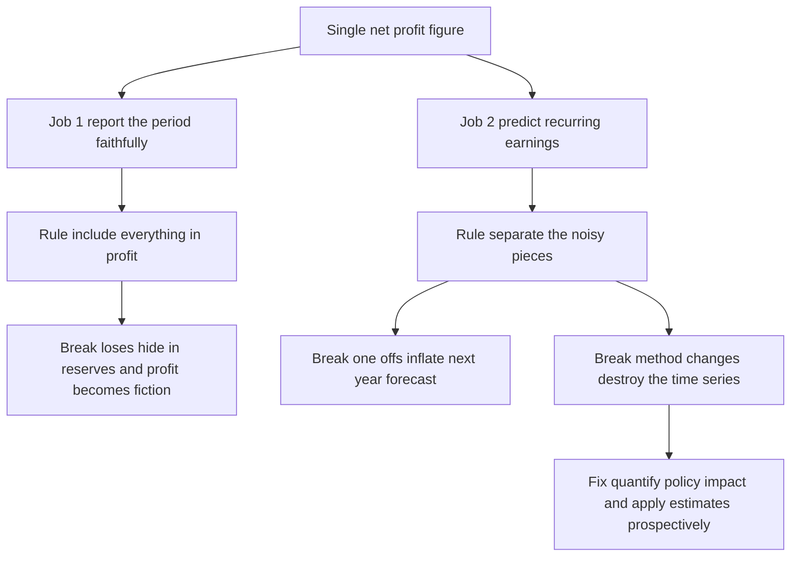
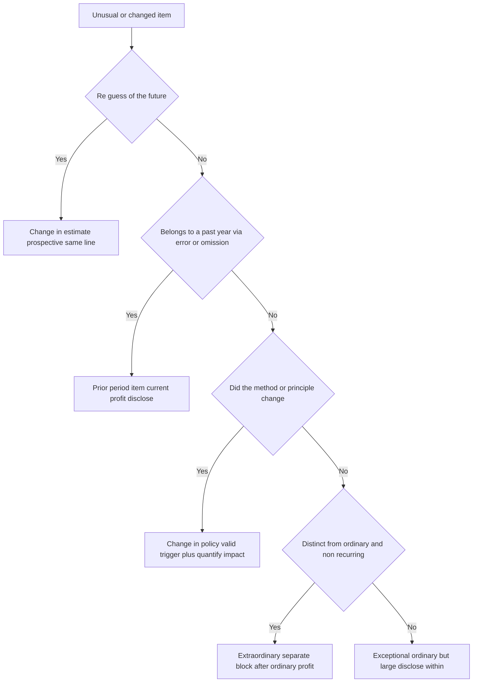

<!-- v2-deep -->

# Chapter 07 — AS 5: Net Profit/Loss for the Period, Prior Period Items & Changes in Accounting Policies

## 1. The Problem — a number that lies by telling the truth

Imagine you are an equity analyst. Every quarter you receive the Statement of Profit and Loss of a company you cover, and every quarter you do the same thing: you take this year's net profit, compare it to last year's, work out a growth rate, and extrapolate. Profit grew 18% last year, 16% this year, so you forecast ~17% next year and price the share on that.

Now suppose this year's profit of ₹120 crore includes:

- ₹40 crore of insurance proceeds from a factory that burned down (that fire will not repeat),
- a ₹15 crore gain because the company this year decided to value inventory using FIFO instead of weighted average (a *bookkeeping choice*, not a business event),
- and buried inside "other expenses" a ₹9 crore charge that actually belonged to *last year* — a supplier's bill for last year's repairs that got recorded only now.

Every rupee of that ₹120 crore is *real* cash-and-accrual accounting. The number is not fraudulent. And yet it is deeply misleading, because you were going to use it to *predict the future*, and none of those three items tell you anything about the future. The fire won't recur. The FIFO switch is a one-time re-labelling. The ₹9 crore was never about this year's performance at all.

This is the problem AS 5 exists to solve. A single bottom-line profit figure is asked to do two jobs at once:

1. **Report** what actually happened to the entity this period (a faithful total), and
2. **Predict** — serve as a base for estimating what *normally recurring* operations will earn next period.

Those two jobs pull in opposite directions. Job 1 says "put everything in — it's all real." Job 2 says "strip out the one-offs, the accounting-choice noise, and the stuff that belongs to other years, or you'll forecast garbage."

AS 5's genius is that it refuses to choose. It keeps *everything* in the net profit (nothing is hidden or taken to reserves), but forces the entity to **label and separate** the noisy components so a reader can mentally rebuild the "clean" recurring number. AS 5 is not about *what* goes into profit — it is about *how the pieces are shown* so the profit figure can serve both masters.

**A second, quieter problem AS 5 solves — comparability across time.** Even if a single year's profit were perfectly "clean," an analyst never looks at one year in isolation; he lines up a *time series*. The moment a company changes the ruler it measures with — switches depreciation method, switches inventory formula, revalues an asset class — this year's figure stops being on the same scale as last year's. A 16% "growth" might be pure ruler-change. AS 5's disclosure machinery (quantify the impact of a policy change, apply estimate changes prospectively in the same line) exists precisely to keep the *series* comparable, not just the single number honest. Hold both problems — **honesty of one number** and **comparability of the series** — in mind; every rule serves one or both.

## 2. The Core Idea — one number, honestly itemised

**The single principle: All items of income and expense recognised in a period are included in the determination of net profit or loss — but items whose *nature or size* would distort a reader's view of ordinary performance must be separately disclosed.**

Think of the Statement of Profit and Loss as a bank statement you hand to someone who wants to judge your salary. Your true balance-change is your true balance-change — you can't hide the ₹5 lakh your uncle gifted you. But if you *label* that ₹5 lakh "gift — one-time," the reader can see that your *recurring* monthly income is really ₹80,000, not ₹80,000 + a windfall. You didn't lie about the total; you just made the total *decomposable*.

AS 5 gives you three "labels" (categories that must be shown separately) and three "correction mechanisms" (how you handle things from the past or things that change). That's the whole standard. Everything else is detail hanging off these two skeletons:

**Labels for the current period's profit:**
- Profit from **ordinary activities** (the recurring engine),
- **Extraordinary items** (real, but outside the ordinary engine),
- Certain **ordinary items of exceptional size/nature** that still deserve separate disclosure.

**Correction mechanisms for the past and for change:**
- **Prior period items** (things that belong to earlier years, surfacing now),
- **Changes in accounting estimate** (the future was re-guessed — handle it going forward),
- **Changes in accounting policy** (the *method* changed — disclose it, and quantify the impact).

The mental model to carry through the whole chapter: **AS 5 sorts every unusual thing along two axes — WHEN does it belong (this period vs a past period vs the future) and WHY is it unusual (a real business event vs a change in how we measure).** Get those two axes right and every rule below becomes obvious rather than memorised.

**The two-axis grid, made concrete.** Place the two axes on a table and every AS 5 concept falls into a cell:

| | **Real business event** | **Measurement/method change** |
|---|---|---|
| **Belongs to a PAST period** | Prior period item (error/omission) | (policy changes are disclosed in current period under AS 5 — not restated back) |
| **Belongs to THIS period** | Ordinary / Exceptional / Extraordinary | Change in policy (disclose amount) |
| **Belongs to the FUTURE** | — | Change in estimate (prospective) |

Notice how the "measurement change" column is entirely about *how we measure*, and the "real event" column is entirely about *what happened*. That column boundary is the single most tested fault-line in the whole standard.

**Scope discipline — one sentence to memorise:** AS 5 governs *presentation and disclosure of profit or loss*; it does **not** dictate the *initial recognition or measurement* of any item — that is delegated to the specific standards (AS 9 for revenue, AS 2 for inventory, AS 10 for PPE, AS 13 for investments). AS 5 is the *editor* of the P&L, not the *author* of its numbers.

## 3. Why it's built this way — what breaks without each rule

Before the technical content, let's earn each rule by watching what goes wrong in its absence.

**Why include everything in net profit (the "no hiding in reserves" rule)?** Historically, managers loved to route embarrassing losses — a big write-off, a lawsuit settlement — *directly to reserves*, bypassing the P&L entirely. The bottom line stayed pretty; the loss quietly reduced equity. This is "reserve accounting," and it destroys the integrity of profit as a performance measure, because you could make any year look good by dumping the bad bits into the balance sheet. AS 5 slams this door: **net profit/loss for the period comprises (a) profit or loss from ordinary activities and (b) extraordinary items — and *all* items of income and expense are included in determining it.** If it's income or expense of the period, it goes *through* profit. No side exits.

**The one legitimate "side exit" — and why it isn't a contradiction.** Some items *are* taken directly to reserves — a revaluation surplus on PPE, a securities premium, certain items credited to a statutory reserve. Are these violations of AS 5? No, and the distinction is worth understanding first-principles: a revaluation surplus is **not an item of income of the period at all** — it is an unrealised, notional restatement of an asset's carrying amount, and AS 5 only governs items that *are* income or expense. AS 5's rule reads "all items of income and expense... are included"; if something is *not* income/expense by definition, it never entered AS 5's jurisdiction. The trap the examiner sets is dressing up a genuine *expense* (a real loss, a real write-off) as a "transfer to reserve" — *that* is the forbidden move.

**Why separate extraordinary items?** Because of the analyst story in Section 1. If the fire-insurance windfall is buried inside operating profit, next year's forecast inherits a ₹40 crore ghost. Separating it lets the reader compute "profit *before* extraordinary items" — the number that actually has predictive value.

**Why a *separate* category for prior period items rather than just fixing last year?** Two reasons. First, you cannot un-publish last year's audited accounts — they've been filed, distributed, relied upon. Second, if you silently absorbed last year's ₹9 crore repair bill into this year's ordinary expenses, this year's *ordinary* performance would look worse than it truly was, for a reason that has nothing to do with this year. So AS 5 says: put it in *this* year's profit (you have to — it's being recognised now), but *label* it "prior period item," so the reader knows to exclude it when judging *this* year's operations.

**Why is a change in *estimate* handled prospectively (going forward), while a change in *policy* demands full disclosure and impact quantification?** This is the subtlest and most examined distinction, so let's nail the logic. An estimate is an inherent, honest guess about the future — the useful life of a machine, the % of debtors who'll default, the warranty claims that will come. When new information arrives and you revise the guess, *nothing was wrong before*. You made the best estimate with the information you had; now you have better information. There was no error and no method-change. Reopening the past would punish an honest, unavoidable feature of accounting. So you simply carry the new estimate forward. A *policy*, by contrast, is a *choice of method* — FIFO vs weighted average, cost model vs revaluation. Changing it makes this year's numbers non-comparable with last year's for a reason the reader can't see. So AS 5 demands you *quantify and disclose* the impact, restoring the reader's ability to compare like with like.

**Why is an *error* different from both?** If last year you simply got it wrong — arithmetic mistake, misread contract, omitted a transaction — that's not an honest estimate and not a method-change. It's a prior period item (an error/omission surfacing now), disclosed separately so it doesn't contaminate this year's ordinary profit.

**Why does AS 5 default ambiguous cases to "estimate"?** Because the estimate route is the *less disruptive, less presumptuous* one. Calling something a policy change asserts "the old method was inferior and here is exactly how much it distorted the numbers" — a strong claim requiring quantification and inviting scrutiny of consistency. Calling something an estimate change asserts only "our forward-looking guess has been updated" — humbler, prospective, non-accusatory. When the facts genuinely don't tell you which it is, the standard picks the humbler, forward-only treatment so that entities don't manufacture "policy changes" to reshape reported profit. This is a *conservatism-of-claims* principle, and it's examinable.

Notice the elegant symmetry: **estimate change = no one was wrong, look forward. Error = someone was wrong, disclose the correction. Policy change = the ruler changed, disclose the impact.** Everything in AS 5's back half is these three cases.

The following diagram captures why each guardrail exists — read each arrow as "remove this rule and *that* failure appears":



*Figure 1 — the two jobs of a profit number and the failure each AS 5 rule prevents.*

## 4. Full Technical Content — the RMPD lens

AS 5 is primarily a **presentation and disclosure** standard. It does *not* tell you *whether* to recognise income/expense (that's the job of AS 9, AS 10, AS 2, etc.) or *how much* to measure it at. It tells you how to *classify and disclose* what other standards have already recognised. Keep that scope in mind — examiners love to test it (Section 8).

**RMPD = Recognition, Measurement, Presentation, Disclosure** — the four questions to interrogate any standard with. For AS 5 the weight is heavily on the last two: **P** and **D**. Recognition and Measurement of the *underlying* income/expense sit in other standards; AS 5 only decides *recognition of the label* (is this thing "extraordinary"? "prior period"?) and how it is *presented and disclosed*. Whenever an exam answer on AS 5 drifts into "should we recognise this revenue at all" you've left AS 5's lane.

### 4.1 The anatomy of net profit or loss

> **Net profit or loss for the period = Profit/loss from Ordinary Activities + Extraordinary items.**

Both components must be recognised in the Statement of Profit and Loss and disclosed on the face of the statement. This is the anti-reserve-accounting backbone.

**Ordinary activities** = any activities undertaken by an enterprise as part of its business, *and* such related activities in which the enterprise engages in furtherance of, incidental to, or arising from these activities. The word to feel is *"related / incidental / arising from."* A manufacturer's sale of goods is ordinary. So is the sale of a used delivery van, the writing-down of obsolete inventory, a foreign-exchange loss on a trade payable, a bad-debt write-off. These are *not* the core, but they *arise from* running the business. They are ordinary.

**The subtle width of "ordinary."** Students under-estimate how *wide* the ordinary category is. Almost everything is ordinary. Ordinary is the default; extraordinary is the rare exception that must actively *earn* its label by passing two tests. When in doubt, an item is ordinary. The mental posture should be "prove to me this is extraordinary," not "prove to me this is ordinary." This single default resolves a large fraction of exam classification items correctly.

### 4.2 Extraordinary items (Recognition of the label + Presentation)

**Definition:** Extraordinary items are income or expenses that arise from events or transactions that are (a) **clearly distinct from the ordinary activities** of the enterprise and (b) therefore **not expected to recur frequently or regularly.**

Both tests must be met: *distinct from ordinary* **and** *not expected to recur*. The recurrence test alone is not enough — an event can be rare yet still ordinary (a large but once-a-decade export order is rare, but selling goods is your ordinary business). Equally, the "distinct" test alone is not enough in spirit — but note the definition treats non-recurrence as *flowing from* distinctness ("...and *therefore* not expected to recur"). The primary gate is **distinctness from ordinary activities**; recurrence is its consequence.

**Presentation rule:** The **nature and amount** of each extraordinary item should be **separately disclosed** in the Statement of Profit and Loss in a manner that its **impact on current profit or loss can be perceived.** In practice this means you present "Profit before extraordinary items," then the extraordinary item, then "Net profit." The reader can lift the extraordinary line out and see the recurring base.

**Classic textbook examples of extraordinary items:**
- Loss of assets / claims from an earthquake, flood, or fire (a genuine natural catastrophe),
- Attachment or confiscation of property by a government (expropriation),
- The proceeds/loss on such events.

**Crucial caveat the examiner exploits:** whether an item is extraordinary depends on *the nature of the event in relation to the business of the enterprise.* An event ordinary for one entity may be extraordinary for another. Flood losses are extraordinary for most factories — but for an insurance company that *insures against floods*, flood-related payouts are its *ordinary* business. Always ask: "distinct from *this* entity's ordinary activities?"

**Finer distinctions the exam tests within "extraordinary":**
- **Net presentation.** An extraordinary event usually has *both* a loss and a related recovery. A factory fire destroys ₹50 lakh of stock (loss) and the insurer pays ₹35 lakh (recovery). AS 5's "impact perceivable" requirement is served by showing the *nature and amount* of the extraordinary item; the loss and the related insurance claim are both extraordinary and are disclosed so the *net* ₹15 lakh impact is visible. Do not net a genuinely *ordinary* recovery against an *extraordinary* loss.
- **Timing of the recovery.** If the fire is in FY26 but the insurance claim is only *admitted* in FY27, the loss is FY26's extraordinary item and the recovery is FY27's — and in FY27 the recovery is *still* extraordinary (it "arose from" the extraordinary event), not ordinary income. Some questions also raise AS 4 (events after the balance sheet date) if the claim is settled between year-end and approval of accounts.
- **"Distinct" is about the event, not the amount.** A huge ordinary loss (say a ₹100 crore bad debt from one customer's insolvency) is *not* extraordinary merely for being huge — bad debts arise from ordinary trading. Size pushes it toward *exceptional* disclosure (4.3), never toward extraordinary.

### 4.3 Exceptional items — ordinary in nature, but disclosed for size

Here is a category students constantly conflate with "extraordinary." AS 5 recognises that **certain items, though part of ordinary activities, are of such size, nature or incidence that their separate disclosure is needed to explain the performance of the enterprise.** These are *not* extraordinary — they arise from ordinary activities — but they're big or unusual enough that a reader should see them broken out. The standard requires their **nature and amount to be disclosed separately** (typically in the notes, or as a separate line within ordinary profit — often called "exceptional items" in practice).

The standard gives a specific, examinable list of circumstances that may give rise to such separate disclosure:

1. The **write-down of inventories** to net realisable value (and its reversal),
2. A **restructuring** of the activities of an enterprise and the **reversal of any provisions** for the costs of restructuring,
3. **Disposals of items of fixed assets** (profit/loss on sale of PPE),
4. **Disposals of long-term investments**,
5. **Legislative changes** having retrospective application,
6. **Litigation settlements**, and
7. Other **reversals of provisions.**

Memorise the *spirit*, not just the list: these are all things that happen *within* ordinary business but are lumpy, occasional, or large. They stay inside "profit from ordinary activities" (unlike extraordinary items, which are shown as a distinct block after ordinary profit), but their *nature and amount* are disclosed so performance is understood.

**A memory hook for the list of seven:** *"Write-downs, Restructuring, Fixed-asset sales, Investment sales, Law changes, Litigation, Reversals"* → **W-R-F-I-L-L-R**. Note that four of the seven (write-down reversal, restructuring-provision reversal, and "other reversals of provisions") are *reversals* — the standard is alert to the fact that reversing a previously recognised provision can inflate profit and must be shown so it isn't mistaken for operating out-performance.

**Where "exceptional" physically appears — a point of confusion.** AS 5 itself does not use the word "exceptional"; it speaks of items requiring separate disclosure due to size/nature/incidence. The label "Exceptional items" as a *line on the face of the P&L* comes from **Schedule III of the Companies Act 2013**, which operationalises AS 5's disclosure requirement into a named line item. So in an exam, "exceptional items" is the *Schedule III presentation* of AS 5's "separately disclosed ordinary items." Both are correct; know which framework the question is speaking in.

> **The one-line discriminator:** Extraordinary = *distinct from* ordinary activities → shown as a separate block *after* profit from ordinary activities. Exceptional = *part of* ordinary activities but big/unusual → disclosed separately *within* ordinary profit. Both get separate disclosure; only extraordinary sits outside the ordinary line.

### 4.4 Prior period items (Definition, Recognition, Presentation, Disclosure)

**Definition:** Prior period items are **income or expenses which arise in the current period as a result of errors or omissions in the preparation of the financial statements of one or more prior periods.**

Dissect this definition — the examiner tests every word:
- **"Errors or omissions"** — the trigger is a *mistake* (mathematical error, mistake in applying an accounting policy, oversight, misinterpretation of facts, or fraud) or an *omission* (something that should have been recorded but wasn't). It is **not** an estimate that later turned out different — that's a change in estimate, not a prior period item (this is the single most common trap; see 4.5).
- **"Arise in the current period"** — the item *surfaces* now, even though it *belongs* to a past period.
- **"Preparation of financial statements of prior periods"** — it relates to an earlier year's accounts.

**The "material" qualifier.** Prior period items are, in practice, the *material* errors/omissions — an immaterial slip is simply corrected in the current period's ordinary lines without the ceremony of separate prior-period disclosure. Materiality (an AS 1 concept) governs *whether the separate-disclosure machinery is triggered*, not whether the correction happens.

**Recognition & Presentation:** Prior period items are **included in the determination of net profit or loss for the current period.** (You *don't* restate/reopen last year's published accounts under AS 5 — contrast with Ind AS 8, which *does* require retrospective restatement; flag this contrast, Section 7.) But they must be **separately disclosed** in the Statement of Profit and Loss in a manner that their **impact on the current profit or loss can be perceived.**

Two acceptable presentation methods:
1. Show the prior period items **after determination of current net profit or loss**, as a distinct line (e.g., "Net profit before prior period items," then the prior period item, then "Net profit for the period"); or
2. Include them in the determination of net profit but **disclose the amount and nature separately** (often in the notes) so the reader can gauge their effect.

**A vital nuance — prior period items are NOT the same as extraordinary items, even though both sit "outside" ordinary performance.** A prior period item can itself be a perfectly *ordinary* transaction (an omitted ordinary sale, an under-charged ordinary depreciation). Its "outsideness" is a matter of *timing* (belongs to another year), not of *nature* (distinct from ordinary business). So an omitted ordinary sale is a prior period item, not an extraordinary item. Do not conflate the two axes.

**Watch the boundary — what is NOT a prior period item:**
- The **difference between an earlier estimate and the actual outcome** is *not* a prior period item (e.g., bad debts of ₹3 lakh provided last year, but ₹3.4 lakh actually written off this year — the extra ₹40,000 is not a prior period item; it's just this year's expense from a change in estimate).
- **Normal recurring adjustments** — e.g., income-tax adjustments finalised in the current year, or arrears of a wage revision agreed this year — depend on facts, but a routine settlement that reflects *this year's* negotiation is a current-period item, not a prior period item. Only genuine *errors/omissions* of past accounts qualify.
- **Retrospective wage/bonus awards** — subtle. If a wage settlement in FY26 grants arrears *for FY24–FY25 service*, is the arrears portion a prior period item? Under AS 5 the answer is generally **no** — the liability *crystallised* only on the FY26 settlement; there was no *error or omission* in FY24–FY25 accounts (the settlement did not yet exist). It is a current-period expense (though a company may voluntarily show it distinctly for clarity). The discriminator remains: was there an *error/omission* in the earlier accounts? If not, it isn't a prior period item, however "old" the underlying service is.
- **Additional tax demand for an earlier assessment year** finalised this year — again turns on whether the earlier provision was *erroneous* (prior period item) or merely a *reassessment/new information* event (current-period item). ICAI treats a genuine short-provision that was an error as a prior period item; a routine finalisation as current.

### 4.5 Changes in accounting estimates (the prospective machine)

**Why estimates exist:** Because business is uncertain, many financial-statement items *cannot* be measured with precision — they can only be *estimated*. Examples: useful life and residual value of a depreciable asset, the allowance for doubtful debts, the provision for warranty claims, obsolescence of inventory, fair value guesses. Estimation is not a weakness of accounting; it is unavoidable, and using estimates *does not undermine* reliability.

**The rule (Recognition/Measurement of the change):** An estimate may need revision when the circumstances on which it was based change, or as a result of new information or more experience. **The revision of an estimate, by its nature, does not bring the adjustment within the definitions of an extraordinary item or a prior period item.** The effect of a change in an accounting estimate is included in the determination of net profit or loss in:
- **the period of the change**, if the change affects that period only (e.g., a change in the estimate of bad debts affects only the current year); **or**
- **the period of the change and future periods**, if the change affects both (e.g., revising the useful life of an asset changes depreciation for the current *and* remaining years).

This is called **prospective application** — you never touch the past; you fold the new estimate into the current and future periods. *Why?* Because (Section 3) nothing was wrong before; the estimate was honest given what was known.

**"Current only" vs "current and future" — a distinction worth drilling.** Get this right because part-marks hinge on it:
- A **bad-debt** re-estimate, a **warranty** true-up, an **NRV** write-down — these consume themselves in the *current* period; there is no carry-forward. Current-period effect only.
- A **useful-life** revision, a **residual-value** revision, a **depreciation-method** change (AS 10 treats it as estimate) — these re-spread a *carrying amount* over *remaining years*, so they hit the current period *and every remaining future period*. Current-and-future effect.
The test: does the revised estimate merely reprice *this year's* consumption, or does it re-allocate a *balance* across time? The latter is always "current + future."

**Classification of the effect:** The effect of a change in estimate is included in the *same income/expense classification* as was previously used for the estimate. So a change in the estimate of depreciation flows through the same "depreciation" line; a change in bad-debt estimate flows through the same "provision for doubtful debts" line. This keeps the P&L comparable line-by-line. (Contrast: an *extraordinary* item gets its *own* line outside ordinary profit — the classification rules for estimates and for extraordinary items are opposite in spirit.)

**Disclosure:** The **nature and amount of a change in an accounting estimate which has a material effect** in the current period (or which is expected to have a material effect in subsequent periods) should be **disclosed.** If the amount is impracticable to quantify, disclose that fact.

**The grey-zone rule (memorise this — it's a favourite):** *Sometimes it is difficult to distinguish between a change in accounting policy and a change in an accounting estimate. In such cases, the change is treated as a change in an accounting estimate, with appropriate disclosure.* The default, when genuinely ambiguous, is **estimate** (prospective) — because policy changes carry the heavier restriction (see 4.6).

### 4.6 Changes in accounting policy (Definition, the three triggers, Disclosure)

**What is an accounting policy?** (From AS 1, the sister standard — see Section 7.) Accounting policies are the **specific accounting principles and the methods of applying those principles** adopted by an enterprise in preparing and presenting financial statements — e.g., the method of depreciation (SLM vs WDV), the cost formula for inventory (FIFO vs weighted average), the basis of valuing investments, treatment of goodwill.

**The core restriction — policies should be consistent:** A change in accounting policy should be made **only if**:
1. it is **required by statute**, or
2. it is **required for compliance with an Accounting Standard**, or
3. it is considered that the change would result in a **more appropriate presentation** of the financial statements of the enterprise.

You cannot change a policy on a whim; consistency (an AS 1 fundamental assumption) is the default, because comparability is precious.

**Reading the three triggers first-principles.** The first two are *involuntary* — the law or a standard forces your hand, so there is nothing to second-guess; you disclose the fact and the impact and move on. The third — "more appropriate presentation" — is *voluntary*, and this is where the examiner probes. "More appropriate" is a genuine bar: it means the new policy gives a *truer and fairer* view, not merely a *higher-profit* view. A switch justified by "it improves comparability with industry peers" or "it better reflects the pattern of economic benefits" can qualify; a switch whose only visible effect is to lift reported profit does not. If a question's facts show management picking the method that flatters the bottom line, treat the change as *not validly justified* and say so.

**What is NOT a change in accounting policy (examinable list):**
- The **adoption of a policy for events/transactions that differ in substance** from those previously occurring (a genuinely new kind of transaction — a new policy, not a *change*),
- The **adoption of a new policy for events/transactions that did not occur previously or were immaterial** (e.g., first-time depreciation policy for a new class of asset).

The unifying idea: a *change* in policy means applying a *different* treatment to the *same* kind of transaction. Applying a *first* treatment to a *new* or *previously-immaterial* transaction is not a "change" at all — there is no prior treatment to change from. This distinction saves marks: examiners describe a company adopting, say, a leasing policy for its first-ever lease and ask "is this a change in policy?" — the answer is **no**, it is the *initial adoption* of a policy.

**Disclosure — the heart of the rule:**
- **Any change in an accounting policy which has a material effect** should be **disclosed.** The **amount** by which any item in the financial statements is affected by the change should also be disclosed **to the extent ascertainable.** Where such amount is **not ascertainable**, wholly or in part, **the fact should be indicated.**
- If a change in policy **has no material effect in the current period but is reasonably expected to have a material effect in later periods**, the fact of the change should be **disclosed** in the current period (so future readers are pre-warned).

**Note on treatment under AS (vs Ind AS):** Under Indian AS 5, the effect of a change in policy is generally recognised in the *current* period's profit or loss with disclosure of the amount (there is no mandatory retrospective restatement of prior-year comparatives as under Ind AS 8). The examinable requirement is the *disclosure of the amount and the fact* — not a restatement.

### 4.7 The decision tree — how to classify anything AS 5 throws at you

```
An unusual/one-off/changed item appears. Ask, in order:

Q1. Is it income/expense of THIS period at all, or a re-guess of the FUTURE?
    → If it re-guesses the future (life, provision, NRV): CHANGE IN ESTIMATE
      → apply prospectively (current + future periods); disclose if material.

Q2. Does it BELONG to a prior period (arises now due to an ERROR or OMISSION)?
    → YES: PRIOR PERIOD ITEM
      → include in current profit, but disclose nature & amount separately.
    (Beware: estimate-vs-actual difference is NOT a prior period item.)

Q3. Did the METHOD/PRINCIPLE change (SLM↔WDV, FIFO↔WA, cost↔revaluation)?
    → YES: CHANGE IN ACCOUNTING POLICY
      → allowed only if statute / AS / more appropriate presentation;
        disclose the change AND the amount of impact (or state 'not ascertainable').

Q4. Is it a real event DISTINCT from ordinary activities & not expected to recur?
    → YES: EXTRAORDINARY ITEM → separate block after ordinary profit.
    → NO (part of ordinary activities but large/unusual): EXCEPTIONAL ITEM
      → disclose nature & amount within ordinary profit.

If genuinely torn between POLICY and ESTIMATE → treat as ESTIMATE.
```

The same logic as a flowchart — useful for spotting *why the question order matters* (estimate is tested first because it is the default catch-all for the future; extraordinary is tested last because ordinary is the default for real events):



*Figure 2 — the AS 5 classification cascade in the exact order you should ask the questions.*

## 5. Worked Examples

### Example 1 (easy) — Classifying five items

Rane Ltd, a car-components manufacturer, reports the following in the year ended 31 March 2026. Classify each per AS 5 and state the presentation.

| # | Item | ₹ |
|---|------|---|
| a | Loss of raw materials in a flood at the Chennai plant | 22,00,000 |
| b | Profit on sale of an old CNC machine | 4,50,000 |
| c | Write-down of obsolete inventory to NRV | 6,00,000 |
| d | Interest income on a fixed deposit of surplus cash | 1,20,000 |
| e | Bad debts written off | 3,00,000 |

**Reasoning:**
- **(a) Flood loss → Extraordinary item.** A flood is clearly distinct from making car components and not expected to recur regularly. Present as a separate block *after* "profit from ordinary activities," disclosing nature and amount so its impact is perceivable.
- **(b) Profit on sale of machine → Ordinary, but exceptional-type disclosure.** Selling a fixed asset *arises from* ordinary activities (it's on AS 5's list of items warranting separate disclosure due to nature/size). Not extraordinary. Disclose nature and amount separately *within* ordinary profit if material.
- **(c) Inventory write-down to NRV → Ordinary; separate disclosure.** Explicitly on the AS 5 list. Part of ordinary activities; disclose separately if size warrants.
- **(d) Interest on surplus-cash FD → Ordinary income.** Incidental to running the business; nothing unusual. No special disclosure.
- **(e) Bad debts → Ordinary expense.** Arises from ordinary trading. No extraordinary treatment.

**Takeaway:** Only the flood is *outside* ordinary activities. Everything else is ordinary — some (b, c) merely deserve *separate disclosure* for size/nature, which is a different thing from being extraordinary.

**Examiner tweak — "what if Rane Ltd were a flood-insurance company?"** Then item (a) would be its *ordinary* business (settling flood claims is the insurer's core activity), and the ₹22,00,000 would be an *ordinary* expense, not extraordinary. This single tweak flips the answer and is exactly how a 2-mark theory sub-part is set. Always classify relative to *this* entity's business.

### Example 2 (medium) — Change in estimate: revising useful life

Vega Ltd bought a machine on 1 April 2022 for ₹50,00,000, estimated life 10 years, nil residual value, straight-line. On 1 April 2025 (start of Year 4), based on new technical assessment, management concludes the *total* useful life is only 8 years (not 10). How is this handled, and what is the depreciation for FY 2025-26?

**Step 1 — Classify.** Useful life is an *estimate*. Revising it because of new technical information is a **change in accounting estimate**, not a policy change and not a prior period item. → **Prospective** treatment. We do *not* touch FY23, FY24, FY25 depreciation already charged.

**Step 2 — Depreciation already charged (Years 1–3, at old estimate).**
Annual SLM = 50,00,000 / 10 = ₹5,00,000.
Three years charged = 3 × 5,00,000 = ₹15,00,000.
Carrying amount on 1 April 2025 = 50,00,000 − 15,00,000 = **₹35,00,000.**

**Step 3 — Apply the new estimate prospectively.** Total life now 8 years; 3 already elapsed → **5 years remaining.** Spread the *current carrying amount* over the *remaining* life:
Revised annual depreciation = 35,00,000 / 5 = **₹7,00,000 per year** for FY26 through FY30.

**Step 4 — Presentation & disclosure.** The extra ₹2,00,000 (₹7,00,000 vs old ₹5,00,000) flows through the *same* depreciation line (same classification). If material, disclose the *nature and amount* of the change in estimate. No restatement of prior years.

**Self-check (does it fully depreciate?):** FY26–FY30 = 5 × 7,00,000 = ₹35,00,000 = the carrying amount at the date of change. Add the ₹15,00,000 already charged = ₹50,00,000 = original cost. The asset is exactly fully depreciated by the end of Year 8. ✓

**Why this is right:** In FY22–FY25 the 10-year estimate was the honest best guess. Nothing was "wrong," so we don't reopen the past — we simply depreciate the *remaining book value over the remaining life.*

**Examiner tweak — add a residual value.** Suppose at the same date management also revises residual value from nil to ₹2,00,000. Then the depreciable base going forward = carrying amount − revised residual = 35,00,000 − 2,00,000 = ₹33,00,000, spread over 5 years = **₹6,60,000 per year.** The formula (Section 10) is *(carrying amount − revised residual) ÷ remaining life* — never forget the residual term when the tweak inserts one.

**Examiner tweak — a downward-then-check trap.** If the revised *total* life had been shorter than years already elapsed (say revised total life = 2 years when 3 have passed), the asset is already over-depreciated by the *old* schedule; the correct response is to recognise the *remaining* carrying amount as an expense in the current period (remaining life is zero going forward). Watch for "revised life already exhausted" phrasing.

### Example 3 (medium-hard) — Prior period item vs change in estimate

In FY 2025-26, Meridian Ltd's accountant discovers three things. Classify each and state the P&L effect.

1. Sales invoice of ₹8,00,000 dated **March 2025** (last year) was **completely omitted** from FY 2024-25's books; it's being recorded now.
2. Depreciation in FY 2024-25 was computed as ₹12,00,000 but, due to a **formula error in the spreadsheet**, should have been ₹14,00,000 — a ₹2,00,000 under-charge.
3. A **provision for warranty** of ₹5,00,000 was made in FY 2024-25; actual warranty claims settled in FY26 came to ₹5,90,000.

**Item 1 — Omitted sales invoice → PRIOR PERIOD ITEM (income).** It's income that *belongs to* FY25 but arises now due to an **omission**. Recognise the ₹8,00,000 income in FY26's profit, but **disclose it separately** as a prior period item so FY26's *ordinary* performance isn't overstated by last year's sale.

**Item 2 — Depreciation formula error → PRIOR PERIOD ITEM (expense).** A ₹2,00,000 under-charge caused by an *error* in preparing FY25's statements. Charge the ₹2,00,000 additional depreciation in FY26, **disclosed separately** as a prior period item. (Note: it's an *error*, so prior period — contrast with Example 2, where the *same* line, depreciation, changed for a non-error reason and was an *estimate change*.)

**Item 3 — Warranty ₹5,00,000 estimated vs ₹5,90,000 actual → CHANGE IN ESTIMATE, not a prior period item.** The FY25 provision was an honest *estimate*; the ₹90,000 shortfall is simply the difference between estimate and outcome. Per AS 5, an estimate-vs-actual difference is **expressly not** a prior period item. The extra ₹90,000 is a *current-period* expense (change in estimate), flowing through the normal warranty/provision line — **no separate prior-period disclosure.**

**Net effect on FY26 reported net profit:** +8,00,000 (item 1 income) − 2,00,000 (item 2 expense) − 90,000 (item 3 expense) = **+₹5,10,000**, of which +₹6,00,000 is *prior period* (items 1 and 2, disclosed separately) and −₹90,000 is *ordinary current* (item 3). A well-drafted answer shows the reader can strip the ₹6,00,000 prior-period net out to see that *this year's ordinary* operations bore only the ₹90,000 warranty over-run.

**The lesson (this is the exam's favourite trap):** Items 2 and 3 both concern "last year's number turned out different this year," yet they are treated oppositely. The discriminator is **error vs estimate.** Item 2 was a *mistake* (formula error) → prior period item, disclosed. Item 3 was an honest *estimate* that missed → change in estimate, ordinary current expense. Always ask: *was someone wrong, or did the world simply differ from an honest guess?*

### Example 4 (exam-hard) — Change in policy with impact quantification

Kaveri Textiles has always valued inventory at **weighted-average cost**. From FY 2025-26 it switches to **FIFO**, believing FIFO gives a more appropriate presentation given rapidly rising cotton prices. Data:

- Closing inventory 31 Mar 2026 under weighted average = ₹40,00,000; under FIFO = ₹46,00,000.
- Opening inventory 1 Apr 2025 (i.e., FY25 closing) under weighted average = ₹30,00,000; had FIFO been used it would have been ₹33,00,000.
- Net profit for FY26 as computed *using weighted average* = ₹80,00,000.

**Step 1 — Classify.** Changing the *cost formula* for inventory (WA → FIFO) is a change in the **method of applying an accounting principle** = a **change in accounting policy.** It is permitted here because management believes it yields a *more appropriate presentation* (one of the three valid triggers). This must be *disclosed* along with the *amount of the impact.*

**Step 2 — Effect on current-year profit.** Profit is affected through both opening and closing inventory:
- Higher **closing** inventory raises profit: 46,00,000 − 40,00,000 = **+₹6,00,000.**
- Higher **opening** inventory *lowers* profit (higher opening stock = higher cost of goods sold): effect = −(33,00,000 − 30,00,000) = **−₹3,00,000.**

Net effect of the policy change on FY26 profit = +6,00,000 − 3,00,000 = **+₹3,00,000.**

**Step 3 — Restated profit and disclosure.**
Profit under FIFO ≈ 80,00,000 + 3,00,000 = **₹83,00,000.**

Disclosure in the notes should read, in substance:

> *"During the year, the company changed its method of valuing inventories from weighted-average cost to FIFO, as management considers FIFO to result in a more appropriate presentation. Consequent to this change, the net profit for the year is higher by ₹3,00,000."*

If any part of the impact were **not ascertainable**, the company would state that fact. Because the change has a material effect, disclosure is mandatory.

**Step 4 — Why not treat it prospectively like an estimate?** Because it is a *method* change, not a re-guess of the future. A method change makes this year's numbers non-comparable with last year's *unless the reader is told the rupee impact.* Hence: disclose the change **and quantify it.** (Contrast Example 2, an estimate change, where no impact-quantification of the *cumulative* past is required — only prospective application plus nature/amount disclosure of the current effect.)

**Why opening stock is netted (the intuition students miss):** Cost of goods sold = Opening + Purchases − Closing. FIFO raised *both* opening and closing. The higher closing *increases* profit (less cost expensed); the higher opening *decreases* profit (more cost expensed). Only the *net* re-measurement, ₹3,00,000, is the change's effect on *this year's* profit. A common wrong answer states "+₹6,00,000" by looking only at closing inventory — that ignores the opening-stock drag and is the single most-penalised error on this style of question.

### Example 5 (exam-hard) — Multiple items in one Statement of Profit and Loss

Ashwini Ltd (a pharmaceutical manufacturer) gives you, for FY 2025-26, a draft net profit of **₹1,50,00,000** *before* considering the following. Determine the correct net profit, split into "profit before extraordinary and prior period items" and the final figure, and state disclosures.

| # | Item | ₹ |
|---|------|---|
| i | Government confiscated a plot of land held by the company (expropriation), book value | 25,00,000 |
| ii | Profit on sale of a long-term investment | 9,00,000 |
| iii | Under-provision of FY25 electricity expense discovered — bill omitted last year | 4,00,000 |
| iv | Reversal of an FY24 warranty provision no longer required | 3,00,000 |
| v | Refund of excise duty relating to FY23, received now after a favourable tribunal ruling | 6,00,000 |

Assume the draft ₹1,50,00,000 already reflects ordinary operations but *none* of items (i)–(v).

**Classify first:**
- **(i) Expropriation loss ₹25,00,000 → EXTRAORDINARY** (distinct from ordinary pharma business, non-recurring). Shown as a block after ordinary profit.
- **(ii) Profit on sale of long-term investment ₹9,00,000 → ORDINARY, exceptional disclosure** (on the AS 5 list). Add to ordinary profit; disclose separately.
- **(iii) Omitted FY25 electricity bill ₹4,00,000 → PRIOR PERIOD ITEM (expense)** — an omission of a prior year. Deduct in current profit, disclose separately.
- **(iv) Reversal of FY24 warranty provision ₹3,00,000 → ORDINARY income, exceptional disclosure** ("reversal of provisions" is on the AS 5 list). Add to ordinary profit; disclose separately. It is *not* a prior period item — no error was made; the provision was a valid estimate now no longer needed.
- **(v) Excise refund ₹6,00,000 relating to FY23 → PRIOR PERIOD ITEM (income)?** Careful. The refund arises from a *favourable tribunal ruling now* — i.e., a *current-year event* (new information), not an *error/omission* in FY23's accounts. In FY23 the duty was correctly expensed under the then-existing law/assessment. So this is a **current-period ordinary income** (a recovery), *not* a prior period item. Many students wrongly tag it prior-period because it "relates to FY23." The discriminator: *was FY23 wrong?* No — hence not a prior period item.

**Build the statement:**

```
Draft profit from ordinary activities (before items below)      1,50,00,000
Add: Profit on sale of long-term investment (ii, exceptional)      9,00,000
Add: Reversal of warranty provision (iv, exceptional)              3,00,000
Add: Excise refund - current recovery (v, ordinary income)         6,00,000
--------------------------------------------------------------------------
Profit from ordinary activities before prior period items       1,68,00,000
Less: Prior period item - omitted electricity expense (iii)       (4,00,000)
--------------------------------------------------------------------------
Profit before extraordinary items                               1,64,00,000
Less: Extraordinary item - expropriation of land (i)             (25,00,000)
--------------------------------------------------------------------------
Net profit for the period                                       1,39,00,000
```

**Self-check:** 1,50,00,000 + 9 + 3 + 6 − 4 − 25 (all in lakh) = 1,39,00,000. ✓

**Disclosures:** (i) nature and amount of the extraordinary expropriation on the face; (ii) and (iv) nature and amount of the exceptional items separately (within ordinary profit); (iii) nature and amount of the prior period item separately, impact perceivable; (v) ordinary — separate disclosure only if size warrants.

**The trap cluster this question drills:** (iv) "reversal" tempts you toward prior-period (it isn't — no error); (v) "relates to an old year" tempts you toward prior-period (it isn't — no error, just new information). Both are resolved by the *single* prior-period test: **was an earlier year's statement erroneous or was something omitted?** Reversal-of-estimate and litigation-outcome are *current* events.

### Example 6 (exam-hard) — Depreciation method change: the AS 10 curveball

Deccan Ltd has depreciated its plant (cost ₹80,00,000 on 1 April 2021, life 8 years, nil residual) on **Straight-Line Method**. From 1 April 2025 it decides to switch to **Written-Down-Value at 25% p.a.**, considering WDV a more appropriate reflection of the asset's consumption pattern. Book value already reflects SLM to 31 March 2025. Show the treatment and FY26 depreciation.

**Step 1 — Classify. This is the curveball.** "Changing depreciation *method*" sounds like a change in *policy*. But under **revised AS 10**, a change in the *method* of depreciation is treated as a **change in accounting estimate**, applied **prospectively** — NOT as a change in policy, and NOT with retrospective recomputation. (Older texts and the pre-revision position called it a policy change requiring retrospective recomputation of the whole depreciation from inception; do not use that outdated treatment. Verify against current ICAI AS 10 material.)

**Step 2 — Carrying amount on 1 April 2025 (after 4 years of SLM).**
Annual SLM = 80,00,000 / 8 = ₹10,00,000. Four years = ₹40,00,000.
Carrying amount = 80,00,000 − 40,00,000 = **₹40,00,000.**

**Step 3 — Apply WDV prospectively on the carrying amount.**
FY26 depreciation = 25% × 40,00,000 = **₹10,00,000.**
(FY27 would be 25% × 30,00,000 = ₹7,50,000, and so on — WDV applied to the *reducing* balance going forward.)

**Step 4 — Presentation & disclosure.** No retrospective restatement; no prior-period entry; the change flows through the *depreciation* line. Disclose the *nature and amount* of the effect of the change in estimate if material.

**Why this matters for the exam:** The FIFO↔WA change (Example 4) is a **policy** change (quantify impact); the SLM↔WDV change is an **estimate** change (prospective, per AS 10). Two "method changes," two *opposite* treatments. The wiring is: *inventory cost formula = policy; depreciation method = estimate.* This single contrast is one of the highest-yield facts in the whole chapter.

**Examiner tweak — "compute the retrospective effect."** If a question (or an outdated question bank) asks for the *cumulative* recomputation-from-inception under WDV and a transfer of the difference, recognise that this reflects the *pre-revision* AS 10 stance. Under current AS 10 the answer is the prospective ₹10,00,000 above. If the question explicitly instructs the old method, state your awareness of the current position and then follow the instruction — flag the rate/position as "verify current ICAI material / AY."

## 6. Presentation & Disclosure formats

**On the face of the Statement of Profit and Loss** (illustrative structure AS 5 drives):

```
Revenue from operations                                     XXX
Other income                                                XXX
Total income                                                XXX
Expenses (materials, employee, finance, depreciation, ...)  XXX
------------------------------------------------------------
Profit before exceptional & extraordinary items and tax     XXX
Exceptional items (disclosed separately, ordinary in nature)(XX)   <- e.g. profit/loss on sale of PPE,
Profit before extraordinary items and tax                   XXX          inventory write-down, restructuring
Extraordinary items (nature & amount shown)                (XX)    <- e.g. flood/earthquake loss, expropriation
------------------------------------------------------------
Profit before tax                                           XXX
Tax expense                                                (XX)
------------------------------------------------------------
Profit for the period from ordinary + extraordinary         XXX
Prior period items (separately disclosed)                  (XX)    <- error/omission of prior years
------------------------------------------------------------
Net profit for the period                                   XXX
```

The essential idea: a reader can start from the bottom and *strip away* prior-period items, extraordinary items, and exceptional items to arrive at **profit from ordinary, recurring activities** — the predictive base.

**Where tax sits — a point examiners probe.** Note the order: exceptional and extraordinary items are shown *before* the tax line in the Schedule III layout, and tax is a single line. AS 5 itself (the standalone standard) speaks of disclosing extraordinary items "in a manner that the impact on current profit can be perceived," which historically included showing the *tax effect* of extraordinary items where relevant. In practice under Schedule III the pre-tax presentation above governs. If a question gives you a tax rate and an extraordinary item, compute profit *before* tax first, then apply tax — do not tax the extraordinary item in isolation unless the question demands the item's *net-of-tax* impact.

**Disclosure checklist (what notes must carry):**

| Situation | Mandatory disclosure |
|-----------|----------------------|
| Extraordinary item | Nature and amount, on the face of the P&L, so impact is perceivable |
| Exceptional (ordinary but large/unusual) item | Nature and amount, separately |
| Prior period item | Nature and amount, separately, in P&L (impact perceivable) |
| Change in accounting estimate | Nature and amount, if material this period or expected material later; if impracticable to quantify, state so |
| Change in accounting policy | The fact of change; the amount of impact (to the extent ascertainable); if not ascertainable, state the fact; if no current effect but expected material later, disclose the fact now |

**The four disclosure "escape hatches" — know each verbatim-ish:**
1. Estimate change, *amount impracticable to quantify* → **disclose the fact** (that it's impracticable).
2. Policy change, *amount not ascertainable* (wholly or partly) → **indicate the fact**.
3. Policy change, *no current effect but material later* → **disclose the fact of change now** (pre-warn).
4. Estimate change, *material effect expected in later periods* → **disclose** the expected future materiality.
Each hatch exists because AS 5 would rather force an *honest "we can't quantify this"* than let the entity stay silent. Silence is the thing the standard never permits.

**Note under Schedule III (Companies Act):** Schedule III presentation uses "Exceptional items" and "Extraordinary items" line items consistent with AS 5, and requires prior period items to be disclosed. (For companies on Ind AS, the "extraordinary items" concept is *removed* — see Section 7.)

## 7. Connections

- **AS 1 (Disclosure of Accounting Policies):** AS 1 defines *accounting policies* and enshrines **consistency** as a fundamental assumption; AS 5 supplies the *procedure* when that consistency is broken (change in policy) — the two are a matched pair. AS 1 says "be consistent and disclose your policies"; AS 5 says "if you must change, here's how to disclose the change and its impact." AS 1's other two fundamental assumptions — *going concern* and *accrual* — sit underneath AS 5 too: accrual is *why* an omitted prior-year invoice is a prior period item (it belonged to the year it accrued, not the year the cash moved).
- **AS 10 (Property, Plant & Equipment) / depreciation:** Useful life, residual value, and *method* of depreciation live at the AS 5 fault-line. Revising **life or residual value** = change in **estimate** (prospective — Example 2). Changing the **method** (SLM ↔ WDV) is now treated, under revised AS 10, as a **change in estimate** applied prospectively (Example 6) — a subtle point: even though "method" sounds like a policy, AS 10 specifically classifies a depreciation-method change as a change in *estimate*. Keep this exception in mind (many older texts called it a policy change; the current position aligns it with estimate).
- **AS 2 (Valuation of Inventories):** The cost formula (FIFO/weighted average) is a *policy*; switching it is a change in policy (Example 4). Inventory write-down to NRV is an *ordinary but separately-disclosed* item.
- **AS 4 (Contingencies & Events After the Balance Sheet Date):** Distinguish a *prior period item* (error/omission of an earlier year) from an *adjusting event after the balance sheet date* (new information about conditions existing at the year-end). Different standards, different mechanics. Worked linkage: an insurance claim for a pre-year-end fire that is *settled* between year-end and approval of accounts is an *adjusting event* (AS 4) affecting the *year that ended*, whereas the same claim recognised only much later, correcting an omission, would be a *prior period item* (AS 5).
- **AS 13 (Accounting for Investments):** Profit/loss on disposal of *long-term* investments is on AS 5's exceptional-disclosure list (Example 5, item ii).
- **AS 22 (Accounting for Taxes on Income):** Prior period tax adjustments and the tax effect of extraordinary items interact with AS 5's classification. A prior period *tax* item (e.g., short-provision that was an error) is disclosed as a prior period item; a routine reassessment is current.
- **Ind AS 8 contrast (very examinable):** Ind AS 8 (a) **abolishes the "extraordinary items" category** — nothing may be labelled extraordinary; (b) requires **retrospective restatement** of prior-period *errors* and of *changes in policy* (restate comparatives, adjust opening retained earnings) — *unlike* AS 5, which keeps them in the *current* period with disclosure. Changes in *estimate* remain **prospective** under both. If a question mentions Ind AS, switch to restatement thinking. A compact contrast table:

  | Item | AS 5 | Ind AS 8 |
  |---|---|---|
  | Extraordinary items | Separate category exists | Abolished — not permitted |
  | Prior period errors | Current period, disclose | Retrospective restatement of comparatives |
  | Change in policy | Current period, disclose amount | Retrospective (restate comparatives + opening RE) |
  | Change in estimate | Prospective | Prospective (same) |

- **Financial Management / Equity Research:** The whole "profit before extraordinary items" idea *is* the analyst's normalised/recurring earnings — AS 5 is the accounting embodiment of the FM concept of *sustainable earnings* used in valuation. When you value a share on a P/E of "normalised EPS," you are doing exactly what AS 5's separate-disclosure machinery enables.
- **Audit:** Auditors specifically test classification of extraordinary/exceptional/prior period items and the adequacy of policy-change disclosures — a favourite audit-report qualification area. An undisclosed policy change with a material profit impact is a textbook ground for a qualified opinion.

## 8. Traps & Examiner Tricks

1. **"Rare = extraordinary."** *False.* Both tests must hold: distinct from ordinary activities *and* not expected to recur. A once-a-decade bumper export order is rare but *ordinary*. Recurrence alone never makes something extraordinary.
2. **Entity-specific classification.** A flood loss is extraordinary for a factory but *ordinary* for a flood-insurer. Always classify *relative to the specific entity's business.*
3. **Estimate-vs-actual masquerading as a prior period item.** Bad debts provided ₹3,00,000, actual write-off ₹3,40,000 → the ₹40,000 is a **change in estimate** (current expense), **not** a prior period item. The examiner loves to phrase this as "prior year's provision fell short — is it a prior period item?" Answer: **No.**
4. **Depreciation-method change misclassified.** Under current AS 10, changing SLM↔WDV is a **change in estimate (prospective)**, *not* a change in policy — despite "method" sounding policy-like. Contrast: changing *inventory cost formula* (FIFO↔WA) *is* a policy change. Don't cross the wires.
5. **"Take the loss to reserves to protect profit."** Forbidden. All income/expense of the period goes *through* net profit. Any question that routes an operating loss straight to reserves is testing this — flag it as non-compliant. (But a genuine revaluation surplus, which is *not* income, legitimately goes to reserve — don't over-correct.)
6. **Confusing extraordinary with exceptional.** Profit on sale of fixed assets, inventory write-down, restructuring, litigation settlement = *ordinary but separately disclosed (exceptional)* — **not** extraordinary. Extraordinary is reserved for events *outside* ordinary activities (natural disaster, expropriation).
7. **Policy change without a valid trigger.** A change in policy is allowed *only* if required by statute, required by an AS, or for more appropriate presentation. A question where management switches methods "to boost profit" is an *invalid* change — flag it.
8. **Forgetting the "amount" in policy-change disclosure.** Disclosing merely *that* a policy changed is incomplete; you must disclose the **rupee impact to the extent ascertainable**, or state that it is not ascertainable. Students routinely lose marks by writing the narrative but omitting the quantification.
9. **Reopening prior years under AS (not Ind AS).** Under AS 5 you do **not** restate last year's published accounts for prior period items or policy changes — you take them through the *current* year with disclosure. Restatement is an *Ind AS 8* behaviour. Mixing the two loses marks.
10. **The ambiguous case default.** When you genuinely can't tell policy from estimate, AS 5 says treat it as a **change in estimate** (prospective) with disclosure. Don't default to policy.
11. **"Relates to an old year" ≠ prior period item.** A litigation win, tax refund, or reversal of an old provision that arises from a *current* event/new information is a *current-period* item even though the underlying transaction is old (Example 5, items iv and v). The prior-period test is *error/omission in the earlier accounts*, not *age of the underlying transaction*.
12. **Only-closing-inventory error in policy-change sums.** In a FIFO↔WA change, profit impact = Δclosing − Δopening. Answering with Δclosing alone (ignoring the opening-stock drag on COGS) is the classic numerical slip (Example 4).
13. **Prior period item mistaken for extraordinary.** An omitted *ordinary* sale/expense is a prior period item (timing), not extraordinary (nature). The two axes are independent; don't collapse them.
14. **Netting an ordinary recovery against an extraordinary loss (or vice versa).** Keep classification consistent between a loss event and its recovery. A recovery of an extraordinary loss is itself extraordinary; do not report it as ordinary income to smooth the operating line.
15. **First-time adoption called a "change."** Adopting a policy for a *new* class of transaction (or one previously immaterial) is *not* a change in policy — there is no prior treatment to change from. No change-disclosure is triggered.

## 9. First-Principles Recap

- A single profit figure must serve two masters — *report the period* and *predict the future* — so AS 5 keeps everything *in* profit but forces it to be *decomposable*. It also protects the *comparability of the time series*, not just the honesty of one number.
- **Nothing hides in reserves.** Net profit = ordinary-activity result + extraordinary items; all income/expense flows through it. The only "reserve exits" are items that are *not income/expense at all* (e.g., revaluation surplus).
- **Two axes classify everything:** *when* it belongs (past / present / future) and *why* it's unusual (real event / measurement change).
- **Extraordinary** = distinct from ordinary activities *and* not recurring → separate block after ordinary profit. Judge relative to *this* entity.
- **Exceptional** = ordinary in nature but large/unusual (asset sales, write-downs, restructuring, litigation, provision reversals) → separate disclosure *within* ordinary profit.
- **Prior period item** = an *error or omission* of a past year surfacing now → put in current profit, disclose separately. An estimate-vs-actual gap, a reversal of an old provision, and a litigation/refund outcome are *never* prior period items.
- **Change in estimate** = an honest re-guess of the future (life, provisions, NRV) → *prospective* (current only if it consumes itself; current + future if it re-spreads a balance), same line classification, no restatement. *Nothing was wrong before.*
- **Change in policy** = the *method/principle* changed → allowed only if statute / AS / more appropriate presentation; disclose the change **and** quantify the impact.
- **Error → disclose; Estimate → look forward; Policy → quantify the impact.** That triad is the entire back half of AS 5.
- When policy vs estimate is genuinely unclear, **treat as estimate.**
- Under AS 5 you *disclose in the current period*; under Ind AS 8 you *restate the past*. Estimates stay prospective under both.

## 10. Quick-Revision Sheet

**Net profit = Profit/loss from ordinary activities + Extraordinary items.** (All income/expense included; nothing to reserves.)

| Category | Test | Where shown | Disclose |
|----------|------|-------------|----------|
| **Ordinary** | Business + related/incidental/arising activities | Within operating result | Normal |
| **Exceptional** | Ordinary in nature but big/unusual (PPE sale, NRV write-down, restructuring, litigation, retrospective law change, provision reversal, LT investment sale) | *Within* ordinary profit, separate line | Nature + amount |
| **Extraordinary** | Distinct from ordinary *and* not expected to recur (flood, earthquake, fire, expropriation) | *Separate block after* ordinary profit | Nature + amount, impact perceivable |
| **Prior period item** | Income/expense from *error or omission* of a prior year, arising now | In current profit, separate line | Nature + amount, impact perceivable |

**Change mechanics:**

| Change type | Trigger | Treatment | Disclosure |
|-------------|---------|-----------|-----------|
| **Estimate** | New info / more experience (life, residual value, bad debts, warranty, NRV) | **Prospective** — current (+ future) periods; same classification | Nature + amount if material (or state impracticable) |
| **Policy** | Only if statute / AS / more appropriate presentation (SLM↔WDV is *estimate* per AS 10; FIFO↔WA is *policy*) | Current period + disclosure (no AS restatement) | Fact of change + **amount of impact** (or "not ascertainable"); pre-warn if future material |
| **Error/omission** | Mistake in a prior year | Prior period item — current profit | Nature + amount, separate |

**Golden discriminators:**
- Rare ≠ extraordinary (need *distinct from ordinary* too).
- Estimate-vs-actual gap = change in estimate, **not** prior period item.
- "Relates to an old year" but arose from a *current* event (reversal, refund, litigation) = **current** item, not prior period.
- Depreciation *method* change = **estimate** (prospective, per AS 10); inventory *cost formula* change = **policy**.
- Prior period item = *timing* axis; extraordinary = *nature* axis — never collapse them.
- Ambiguous policy/estimate → treat as **estimate**.
- Ind AS 8 contrast: **no** "extraordinary" category; errors & policy changes are **restated retrospectively**; estimates stay prospective.

**Depreciation-on-revised-life formula (Examples 2 & 6):**
Revised annual depreciation (SLM) = (Carrying amount at date of change − revised residual value) ÷ remaining useful life.
Under a method switch to WDV: apply the new rate to the *carrying amount at the date of change* prospectively.

**Policy-change profit impact (Example 4):**
Effect on profit = Δ closing inventory − Δ opening inventory (higher opening stock reduces profit via higher COGS).

**Multi-item build order (Example 5):**
Ordinary (incl. exceptional) → less prior period items → = profit before extraordinary → less extraordinary → **net profit.**
