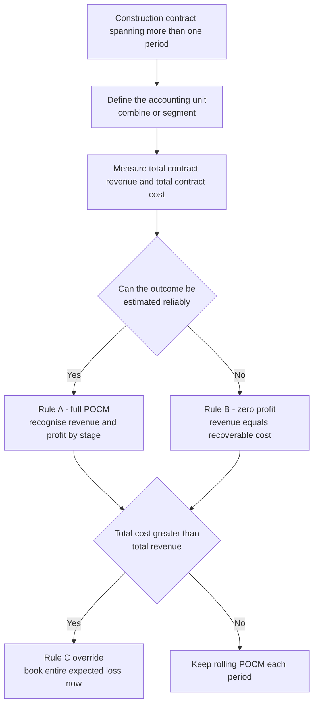
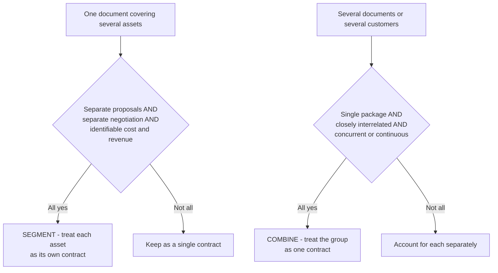

<!-- v2-deep -->

# Chapter 08 — AS 7: Construction Contracts

## 1. The Problem — when "sell it, then book it" stops working

Almost every accounting rule you have learned so far quietly assumes one thing: that a transaction happens *quickly*. A trader buys goods in April and sells them in May. A manufacturer produces a batch, ships it, invoices it, and recognises revenue — all inside days or weeks. Revenue recognition under AS 9 leans on a clean moment: the point at which the seller transfers the goods and the significant risks and rewards of ownership pass to the buyer. That single moment neatly separates "before" (inventory, an asset) from "after" (sale, revenue plus cost of goods sold). The whole engine of matching runs on that clean cut.

Now meet the business that breaks this engine.

A construction company signs a contract in June 2023 to build a highway bridge for the government. The price is fixed at Rs. 100 crore. The bridge will take **three and a half years** to build. During those 3.5 years the company will pour concrete, hire hundreds of workers, run equipment, pay subcontractors — spending, say, Rs. 80 crore of cost spread lumpily across the period. It will raise progress bills to the client every quarter and receive money in stages. And at some uncertain future date — maybe March 2027 — the bridge will finally be handed over.

Ask the AS 9 question: *when does the "sale" happen?* The naive answer is "on handover in 2027, when risks and rewards pass." But look at what that does to the financial statements:

| Year | Cost incurred | Revenue booked (handover method) | Profit shown |
|------|--------------|----------------------------------|--------------|
| 2023-24 | 25 cr | 0 | (loss-ish / nothing) |
| 2024-25 | 30 cr | 0 | nothing |
| 2025-26 | 20 cr | 0 | nothing |
| 2026-27 | 5 cr | 100 cr | +20 cr all at once |

For three years the company works furiously, employs thousands, and its Profit & Loss Account says it earned *nothing* — in fact it looks like it is bleeding, because it must somehow account for costs. Then in the final year a single Rs. 20 crore profit explodes into existence overnight. A reader of these accounts would completely misjudge the business. The company was equally productive in every year, yet the accounts show three years of apparent inactivity followed by one miraculous year.

This is the problem AS 7 exists to solve: **for contracts whose work straddles more than one accounting period, tying all the revenue to a single completion moment produces financial statements that lie about when the economic activity — and therefore the earning — actually happened.** The activity is continuous. The reporting is annual. AS 7 is the bridge between the two.

**A second, subtler distortion.** Beyond mis-timing profit, the handover method also mangles the *balance sheet*. During construction the contractor is sitting on a huge, growing "work-in-progress" asset carried at cost, with no offsetting revenue — so the balance sheet shows a bloated inventory and no earnings to explain it. Analysts computing return-on-capital, inventory-turnover, or interest-coverage ratios during those years would get numbers that are economically meaningless. POCM fixes both the P&L *and* the balance sheet: as work is done, the WIP is progressively converted into recognised cost-of-sales matched with recognised revenue, so the reader always sees a proportionate, honest picture.

**Why not just report cash?** A student sometimes wonders: why not recognise revenue when the client *pays* the progress bill? Because cash receipts follow the *contractual payment schedule*, which is a financing/credit arrangement negotiated between the parties — a client might pay 20% upfront as mobilisation advance before any work is done, or hold back 10% retention for a year after completion. Cash timing has *nothing* to do with when value is created. Tying revenue to cash would make the accounts a mirror of the billing calendar, not the construction site. AS 7 deliberately divorces revenue recognition from both handover *and* cash.

## 2. The Core Idea — earn as you build

The single principle behind the whole standard is this:

> **In a construction contract, the contractor earns its profit continuously, in proportion to the work it performs. So revenue and cost — and therefore profit — should be recognised in each period in proportion to how much of the contract has been completed by the end of that period.**

This is the **Percentage-of-Completion Method (POCM)**. Instead of asking "has the whole thing been delivered yet?", it asks "how far along are we, and what share of the total reward have we earned by getting this far?"

**Analogy.** Think of a long taxi ride with a fixed agreed fare of Rs. 1,000 for a 100-km trip. You would not say the driver earns Rs. 0 for the first 99 km and then suddenly earns Rs. 1,000 in the last kilometre when you reach the destination. Economically the driver earns roughly Rs. 10 per kilometre driven. At the 40-km mark, the driver has "earned" about Rs. 400 even though the ride isn't over and nobody has paid yet. AS 7 treats a construction contract exactly like that meter running: the meter (revenue) ticks up in step with distance covered (work done), not in one lump at the destination (handover).

The genius of POCM is that it makes the P&L honest *year by year*. A company that does 30% of a bridge this year reports 30% of the contract's revenue and 30% of its expected profit this year. The accounts now track reality: steady work produces steady earnings.

The rest of AS 7 is essentially the engineering needed to make this idea rigorous and safe: *how* do we measure "how far along," *when* are we allowed to use POCM at all, what goes into "cost" and "revenue," and — crucially — what do we do when the meter tells us we're heading for a loss.

**One vocabulary warning that trips students.** POCM does **not** mean "recognise the same profit percentage every year." It means recognise *cumulative* profit equal to (stage % × total expected profit), then back out what you already booked. If the stage jumps unevenly — 25% in Year 1, then 70% by Year 2 — the profit recognised in each year is uneven too, because construction activity itself is uneven. The *rate of earning per rupee of work* is smooth; the *rupees of work per year* is not. Keep those two ideas separate.

The high-level shape of the standard looks like this:


*The whole standard as one decision engine — units, then reliability, then the loss override.*

## 3. Why it's built this way — the logic behind each rule

Before listing provisions, let us reason our way to *why* each safeguard exists. If you understand these five tensions, you can reconstruct the whole standard from scratch.

**(a) Why match at all? — the accrual and matching principle.** The entire justification for POCM is matching. Costs are being incurred every year; if the matching principle means anything, the revenue those costs *produce* must be recognised in the same year. Deferring all revenue to the end while costs pile up would violate matching just as badly as recognising all revenue up front. POCM is simply matching applied to a multi-year activity.

**(b) Why not just recognise everything at the end (completed contract method)?** Because it destroys the informational value of interim accounts, as our bridge table showed. Note: unlike the old AS 7 (pre-2002) and unlike US practice, the *revised* Indian AS 7 does **not** permit the completed contract method as a policy choice. POCM is mandatory when its conditions are met. This is a deliberate ICAI decision: the completed-contract method was too easy to abuse for profit-smoothing.

**(c) Why demand "reliable estimation" before recognising profit?** POCM has a dangerous dependency: it recognises profit *before* the job is finished, based on an *estimate* of total cost and total revenue. If those estimates are garbage, the profit is fiction. So the standard builds a gate: you may only recognise profit under POCM when the outcome of the contract can be **estimated reliably**. If you cannot estimate reliably (typically very early in a contract, or a badly-defined one), the standard forces you into a cautious fallback: recognise revenue only to the extent of costs you're confident of recovering, and recognise *zero profit*. This is prudence protecting POCM from its own optimism.

**(d) Why recognise expected losses *immediately and in full*, but profits only *gradually*?** This is the most important asymmetry in the standard, and it comes straight from **prudence** (conservatism). A profit is only recognised as it is earned — piecemeal — because until the work is done you can't be sure of it. But the moment it becomes *probable* that total contract costs will exceed total contract revenue, the *entire* expected loss must be recognised at once — not spread over the remaining years. Why the asymmetry? Because a loss is a *known bad outcome*, and prudence says: never carry a known future loss forward pretending things are fine. Anticipate losses; don't anticipate gains. A contract heading for a Rs. 5 crore loss is, in substance, an onerous obligation *today*; the accounts must confess it *today*.

**(e) Why be so careful about what counts as "revenue" and "cost"?** Because the percentage you compute is a *ratio*, and both the numerator and denominator can be gamed or mis-measured. If you sneak general administrative overheads or unrelated selling costs into "contract cost," you inflate the cost base and distort the stage of completion. If you count a client's *proposed* variation that hasn't been agreed as "revenue," you book profit that may never materialise. So AS 7 carefully defines the boundary of the "contract" as an accounting unit — what's in, what's out, when two contracts combine, when one splits.

**(f) Why let estimates be revised *prospectively*, never retrospectively?** A five-year contract will have its cost forecast revised many times as design changes, prices move and productivity is learned. AS 7 treats every such revision as a **change in accounting estimate** under AS 5 — folded into the current and future periods, never as a correction of a prior year. The logic: the prior-year figure was the *best estimate available then* and was not an error, so restating it would wrongly imply the earlier accounts were wrong. Instead the current year simply recomputes cumulative amounts on fresh numbers and absorbs the whole catch-up. This keeps the reported history stable and audit-trail clean.

Keep these ideas in your pocket. Everything below is their detailed working-out.

## 4. Full Technical Content — through the RMPD lens

### 4.0 Scope and key definitions

**AS 7 (revised 2002) applies to accounting for construction contracts in the financial statements of contractors.** A **construction contract** is a contract specifically negotiated for the construction of an asset or a combination of assets that are closely interrelated or interdependent in terms of their design, technology and function or their ultimate purpose or use (e.g., a bridge, dam, ship, building, pipeline, tunnel, refinery). It also covers contracts for services *directly related* to construction (e.g., project managers, architects) and contracts for destruction/restoration of assets and environmental restoration following demolition.

Two contract pricing types, because they carry different risk and different estimation difficulty:

- **Fixed price contract** — the contractor agrees to a fixed contract price (or a fixed rate per unit of output), sometimes with escalation clauses. Risk of cost overrun sits with the contractor.
- **Cost plus contract** — the contractor is reimbursed for allowable/defined costs plus a percentage of those costs or a fixed fee. Risk of cost overrun largely sits with the customer.

This distinction matters because the *reliable estimation* gate (below) has **different conditions** for the two types.

**Hybrid contracts.** Real contracts are often mixed — e.g., cost-plus with a *guaranteed maximum price* (a cap), or fixed-price with *escalation clauses* linked to a steel-price index. AS 7 recognises that a contract may contain features of both types; you apply the *reliability conditions* of both fixed-price and cost-plus to such a hybrid. A "cost-plus with a ceiling" is dangerous precisely because it behaves like cost-plus until costs approach the ceiling, then behaves like fixed-price — and can flip into a loss-making contract (Rule C) the moment forecast cost breaches the cap.

**Who is a "contractor"?** AS 7 governs the *contractor's* books — the party doing the building for someone else. A real-estate developer building flats *on its own account* to sell is generally not applying AS 7 in the classic sense (that is a goods-type sale, historically under the Guidance Note on Real Estate / AS 9, and under Ind AS 115 in the Ind AS regime). The examinable trigger for AS 7 is: **an asset built to a customer's specification under a specifically negotiated contract.** If the customer can dictate design and structural changes to the work in progress, that is the fingerprint of a construction contract.

### 4.1 The accounting unit — combining and segmenting contracts

The percentage-of-completion ratio only makes sense if "the contract" is the right unit. AS 7 gives rules to draw that boundary correctly.

**Segmenting (split one contract into several).** When a single contract covers several assets, treat *each asset* as a separate construction contract when **all** of: (i) separate proposals were submitted for each asset, (ii) each asset was subject to separate negotiation and the contractor/customer could accept or reject the part relating to each asset, and (iii) the costs and revenues of each asset can be identified. — *Why:* if the "package" is really several independent jobs, blending them hides the true progress and profitability of each.

**Combining (treat several contracts as one).** A group of contracts (with one or several customers) is treated as a single contract when **all** of: (i) the group is negotiated as a single package, (ii) the contracts are so closely interrelated that they are, in effect, part of a single project with an overall profit margin, and (iii) the contracts are performed concurrently or in a continuous sequence. — *Why:* artificially splitting one economic project into many contracts could let a contractor front-load profit on the easy parts, or, worse, could *hide a loss* on one part behind profit on another.

**Additional asset / options.** Construction of an additional asset is treated as a *separate* contract when **either**: the asset differs significantly in design/technology/function from the original, **or** the price of the asset is negotiated without regard to the original contract price.

**Why the unit is load-bearing for the loss rule.** The most exam-relevant consequence of unit-of-account is Rule C: the expected-loss test is applied *per accounting unit*. If two jobs are correctly *combined* into one contract, a loss on one leg can be offset by profit on the other *within the single unit*, and only a net loss (if any) is provided. But if they are *separate* contracts, a loss on one must be provided in full *immediately*, with **no** offset against the other's profit. So a single combining/segmenting decision can change the reported profit dramatically. Examiners love hiding this: they give two "contracts" with the same customer, one profitable and one loss-making, and reward the student who first asks "should these be combined?"


*Getting the unit wrong silently corrupts both the stage percentage and the loss provision.*

### 4.2 Contract Revenue — Measurement (what goes in the numerator/total revenue)

Contract revenue is measured at the **fair value of consideration received or receivable**, and comprises:

1. **The initial amount of revenue agreed in the contract**, plus
2. **Variations, claims and incentive payments** — but only to the extent that (a) it is *probable* they will result in revenue, and (b) they are *capable of being reliably measured*.

The three add-ons deserve care because they are where estimation risk hides:

- **Variation** — an instruction by the customer to change the scope of work (e.g., extra floors, a design change). Included in contract revenue when it is *probable the customer will approve* it (and the amount), and it can be measured reliably. A variation can *reduce* revenue too (e.g., a de-scoping instruction).
- **Claim** — an amount the contractor seeks to *recover from the customer* as reimbursement for costs not included in the price (e.g., customer-caused delays, errors in specifications). Highly uncertain and often litigated, so included **only when negotiations have reached an advanced stage such that it is probable the customer will accept the claim, and the amount is reliably measurable.**
- **Incentive payment** — additional amounts paid if specified standards are met or exceeded (e.g., early completion bonus). Included when the contract is *sufficiently advanced* that meeting the standard is probable, and the amount is reliably measurable.

**Penalties and liquidated damages run the other way.** If the contract imposes a penalty for late completion or below-spec work, and it is probable the contractor will incur it, that *reduces* contract revenue. A frequent exam tweak: the contractor is *behind schedule* and a delay penalty of Rs. X is now probable — you must pull total contract revenue *down* by X before recomputing the stage-based revenue, which can even tip a profitable contract into Rule C territory.

Contract revenue is **updated every period** as events occur and estimates are revised — it can go up or down. Revisions are accounted for as **changes in accounting estimate** (AS 5) — prospectively, spread over the current and future periods, never as a prior-period restatement.

**The "probable + reliably measurable" double lock.** Note that variations, claims and incentives each need *both* conditions. A claim can be highly probable (the client caused a nine-month delay everyone acknowledges) yet still excluded because the *amount* is not yet reliably measurable pending an arbitration award. Prudence keeps such "probable but unquantified" upside out of revenue until it can be pinned to a number.

### 4.3 Contract Costs — Measurement (the cost base)

Contract costs comprise three buckets:

**(1) Costs directly related to the specific contract** — site labour and supervision, materials used, depreciation of plant/equipment used on the contract, cost of moving plant and materials to and from the site, hire of plant and equipment, design and technical assistance directly related to the contract, estimated rectification and warranty costs, and claims from third parties. *Directly attributable revenue* (e.g., sale of surplus materials, disposal of plant at contract end) may be *deducted* from these costs.

**(2) Costs attributable to contract activity in general that can be allocated to the contract** — e.g., insurance, cost of design and technical assistance not directly tied to one contract, and construction overheads. These are allocated on **systematic and rational methods applied consistently**, based on the **normal level of construction activity** (borrowing costs may be included where AS 16 is satisfied). The "normal level" phrase matters: you allocate fixed overheads on normal capacity, so that a slump year with idle capacity does not dump a disproportionate overhead into the few active contracts.

**(3) Costs specifically chargeable to the customer under the terms of the contract** — e.g., some general administration and development costs for which reimbursement is specified in the contract.

**Costs relate to the period from securing the contract to its final completion.** Costs that cannot be attributed to contract activity or allocated to a contract are excluded.

**Explicitly EXCLUDED from contract costs** (these are period costs, expensed as incurred, never in the ratio):
- General administration costs for which reimbursement is *not* specified in the contract,
- Selling costs,
- Research and development costs for which reimbursement is *not* specified,
- Depreciation of idle plant and equipment *not used* on the contract.

**Pre-contract (bid) costs** incurred in securing a contract are included in contract costs *if* they can be separately identified, measured reliably, and it is *probable the contract will be obtained*. If they were already expensed in an earlier period (when it wasn't yet probable), they are **not** reinstated. This is a one-way ratchet driven by prudence: once written off, always written off.

*Why this granularity matters:* the stage of completion is often measured as costs-incurred-to-date ÷ total-estimated-costs. Every rupee wrongly added to "cost incurred" pushes the apparent percentage up and pulls profit forward. The exclusions are prudence guarding the ratio's integrity.

**A subtle self-check on "reimbursable" costs.** Notice that the *same* rupee of general administration cost is treated in opposite ways depending on one clause: if the contract says the customer reimburses it, it is a contract cost (bucket 3) and enters the ratio; if not, it is a period cost, excluded. The economic activity is identical — what changes is *recoverability*, which is exactly what the standard cares about. That is not an arbitrary rule; it is prudence again: only costs that will be recovered through contract revenue belong in the contract.

### 4.4 Recognition — the central rules (the heart of the exam)

**Rule A — Reliable estimate → full POCM (revenue AND profit recognised by stage).**

When the outcome of a construction contract can be estimated reliably, **contract revenue and contract costs shall be recognised as revenue and expenses respectively by reference to the stage of completion of the contract activity at the reporting date.**

When can the outcome be estimated reliably? The conditions differ by contract type:

*Fixed price contract* — ALL of the following:
1. Total contract revenue can be measured reliably;
2. It is **probable** that the economic benefits associated with the contract will flow to the enterprise;
3. Both the contract costs to complete *and* the stage of completion at the reporting date can be measured reliably;
4. The contract costs attributable to the contract can be clearly identified and measured reliably, so that actual costs can be compared with prior estimates.

*Cost plus contract* — BOTH of the following:
1. It is **probable** that the economic benefits associated with the contract will flow to the enterprise;
2. The contract costs attributable to the contract, whether or not specifically reimbursable, can be clearly identified and measured reliably.

(Cost-plus has an easier gate because reliable revenue estimation is almost automatic — you're paid your costs plus a margin.)

**Rule B — Outcome NOT reliably estimable → the cautious fallback (zero-profit method).**

When the outcome cannot be estimated reliably (common in the early stages of a contract):
- **Revenue is recognised only to the extent of contract costs incurred of which recovery is probable**, and
- **Contract costs are recognised as an expense in the period in which they are incurred.**

Net effect: **no profit is recognised**, but no artificial loss either (revenue = recoverable cost). If some costs incurred are *not* probable of recovery, those are expensed immediately as a loss with no matching revenue. When the uncertainty later clears, the enterprise switches to Rule A **prospectively** — it does *not* go back and restate the zero-profit years.

**When recovery of even incurred cost is not probable.** AS 7 flags special situations where the contract's very enforceability is in doubt — e.g., a contract that may be void/unenforceable, one subject to pending litigation or legislation, a contract on property likely to be condemned/expropriated, a customer unable to meet its obligations, or a contractor unable to complete or meet its obligations. Here recovery of costs is *not* probable, so revenue is recognised at **nil** and *all* costs incurred are expensed. This is the harshest cell of the whole standard: zero revenue, full cost, full loss.

**Rule C — Expected loss → recognise the WHOLE loss immediately (the prudence override).**

> **When it is probable that total contract costs will exceed total contract revenue, the expected loss shall be recognised as an expense immediately.**

This applies **irrespective of**:
- whether work has commenced,
- the stage of completion, or
- the amount of profits expected on *other* contracts (each contract that is not combined stands alone).

The amount of loss recognised is the **full foreseeable loss = total estimated contract costs − total estimated contract revenue**, recognised *now*, even if only 20% of the work is done. Where POCM revenue has already been recognised, the immediate loss booking effectively creates a provision so that the cumulative P&L shows the entire expected loss.

**Rule C stacks on top of Rule A or Rule B.** A common misconception is that C is an *alternative* to A/B. It is not — it is an *override that sits on top*. Even a contract in its uncertain, zero-profit phase (Rule B) must recognise a full expected loss the moment total cost is seen to exceed total revenue. And a Rule-A contract that turns loss-making mid-life stops smoothly rolling profit and immediately provides the whole loss. Sequence in the exam: **always test C last, but let it win.**

### 4.5 Measuring the stage of completion

The stage of completion is the linchpin. AS 7 permits any method that reliably measures the work performed. Three families:

**(i) Cost-to-cost method (most common, most examined):**
$$\text{Stage \%} = \frac{\text{Contract costs incurred for work performed to date}}{\text{Estimated total contract costs}}$$

Critical refinement: only costs that **reflect work performed** count in the numerator. **Exclude** from costs-incurred-to-date:
- Costs of materials *delivered to site but not yet installed/used* (e.g., steel lying in the yard) — unless made specifically for the contract;
- **Advance payments to subcontractors** for work not yet performed.

*Why:* buying steel doesn't build the bridge; installing it does. Counting unused inputs would overstate progress.

**Numerator and denominator must be consistent.** A trap the standard implies: whatever you *exclude* from the numerator (costs to date) you must also *exclude* from the denominator's "already-done" component, and cost-to-complete estimates must be built on the same basis. If you leave un-installed steel out of the numerator, the *total estimated cost* still includes that steel's cost (it will be installed later). The ratio therefore self-corrects: as the steel gets installed, both its cost enters the numerator and progress advances. The single most common arithmetic slip is subtracting unused materials from the numerator but forgetting they were never a *work-performed* cost in the first place.

**(ii) Surveys of work performed** — a technical/physical survey certifying the proportion completed (the "work certified" idea familiar from Costing).

**(iii) Completion of a physical proportion** — e.g., 4 of 8 identical spans of a bridge erected = 50% (only valid when units are comparable and represent similar effort/value).

**Progress billings and advances received are NOT a measure of stage of completion** — they reflect the *payment schedule*, not the *work done*, and the two can diverge widely.

**Which method to choose?** AS 7 does not rank them; it demands the method *reliably measure work performed*. Cost-to-cost is favoured when costs map tightly to progress. But it *fails* where large costs are incurred that do *not* reflect proportional progress — e.g., a huge, early lump-sum payment for a custom turbine, or front-loaded mobilisation. In such cases the survey or physical-proportion method gives a truer picture, and blindly using cost-to-cost would overstate completion. Examiners test this by feeding a "cost incurred" figure that is inflated by unused materials, expecting you to strip it out before dividing.

### 4.6 The mechanics — how the numbers roll each year

For any period, cumulative amounts are computed first, then the current-period figure is the cumulative-to-date minus what was recognised in prior periods.

- **Cumulative revenue to recognise** = Stage % × Total contract revenue
- **Current-period revenue** = Cumulative revenue to date − Revenue recognised in prior periods
- **Current-period expense** = Stage % × Total estimated costs − Expenses recognised in prior periods (equivalently, actual costs of work performed in the period)
- **Current-period profit** = Current revenue − Current expense
- **Override:** if the contract is loss-making overall, ignore the smooth roll-forward and book the full expected loss immediately (Rule C).

**Why "cumulative minus prior" instead of a fresh yearly percentage?** Because estimates change. If you naively computed each year's revenue as "this year's incremental cost ÷ this year's total-cost estimate," a mid-life change in the total-cost forecast would never get reflected in the years already booked. The cumulative method automatically drags the entire history onto the *latest* estimate and dumps the whole correction into the current year — which is exactly the AS 5 "change in estimate, prospective" behaviour. The formula *is* the AS 5 treatment, mechanised.

### 4.7 Disclosure requirements

An enterprise must disclose:
1. The amount of **contract revenue recognised** in the period;
2. The **methods used to determine contract revenue** recognised;
3. The **methods used to determine the stage of completion** of contracts in progress.

For contracts **in progress** at the reporting date, disclose each of:
4. The aggregate amount of **costs incurred and recognised profits** (less **recognised losses**) up to the reporting date;
5. The amount of **advances received**;
6. The amount of **retentions** (amounts billed but not paid until conditions/defect-liability periods are satisfied).

And present as an asset/liability:
7. The **gross amount due FROM customers** for contract work — an **asset**;
8. The **gross amount due TO customers** for contract work — a **liability**.

Where:
- **Gross amount due from customers** = (Costs incurred + Recognised profits) − (Recognised losses + Progress billings), for all contracts where this is **positive**.
- **Gross amount due to customers** = the same expression for all contracts where it is **negative** (shown as a positive liability).

Also disclose contingencies (AS 29) relating to warranty costs, claims, penalties, or possible losses.

**Retentions vs advances — don't confuse them.** A *retention* is money the contractor has *earned and billed* but the customer withholds until a defect-liability period lapses (it is a receivable, an asset). An *advance* is money the customer paid *before* the corresponding work was done (it is, in substance, a liability/unearned amount until earned). They sit on opposite sides economically even though both are "cash-timing" items, and both are disclosed separately precisely so a reader can see how much of the reported receivable is conditionally held back.

## 5. Worked Examples

### Example 1 — Straightforward POCM (profitable), cost-to-cost

*Facts.* Rockfort Ltd takes a fixed-price contract for Rs. 120 lakh. Estimated total cost Rs. 90 lakh. At the end of Year 1, costs incurred = Rs. 36 lakh; the outcome can be estimated reliably. No progress billing complications. Compute revenue, expense and profit for Year 1.

**Step 1 — Confirm the gate.** Outcome reliably estimable → Rule A applies (recognise revenue *and* profit by stage). Also check Rule C: total cost 90 < total revenue 120, so the contract is profitable — no loss override.

**Step 2 — Stage of completion (cost-to-cost).**
$$\text{Stage \%} = \frac{36}{90} = 40\%$$

**Step 3 — Recognise revenue.** Cumulative revenue = 40% × 120 = **Rs. 48 lakh**. (Year 1, so all of it is current-period revenue.)

**Step 4 — Recognise expense.** = costs of work performed = **Rs. 36 lakh** (equivalently 40% × 90).

**Step 5 — Profit.** 48 − 36 = **Rs. 12 lakh** (which is 40% of the total expected profit of 30 lakh — sanity check passes).

**Journal entries (in lakh):**
```
Contract Account (WIP)              Dr   36
    To Bank / Payables                        36
    (contract costs incurred)

Contractee/Customer A/c             Dr   48
    To Contract Revenue (P&L)                  48
    (revenue recognised by stage)

Contract Revenue                    Dr   48
    To Contract Costs (P&L)                    36
    To Contract P&L (profit)                   12
    (matching; transfer to P&L)
```

### Example 2 — Multi-year roll-forward with a *revised* cost estimate

*Facts.* Sethu Constructions, fixed-price contract, contract price **Rs. 300 lakh**. Cost-to-cost method. Data:

| | End of Yr 1 | End of Yr 2 |
|---|---|---|
| Costs incurred to date | 60 | 168 |
| Estimated further costs to complete | 180 | 72 |
| Progress billings to date | 50 | 160 |

Outcome reliably estimable throughout. Compute revenue/expense/profit each year and the gross amount due from/to the customer.

**Year 1.**
- Total estimated cost = 60 + 180 = **240**. Total revenue 300 > 240 → profitable, Rule A.
- Stage = 60 / 240 = **25%**.
- Revenue (cumulative = current) = 25% × 300 = **75**.
- Expense = 25% × 240 = **60** (= actual cost to date).
- **Profit Yr 1 = 75 − 60 = 15.**
- Gross amount due from customer = (Costs 60 + Profit 15) − Billings 50 = 75 − 50 = **25 (asset)**.

**Year 2 — note total estimated cost has changed.**
- Total estimated cost now = 168 + 72 = **240** (still 240 here; if it had risen to say 260, we'd use 260). Total revenue 300 > 240 → still profitable.
- Stage = 168 / 240 = **70%**.
- Cumulative revenue = 70% × 300 = **210**. Current-year revenue = 210 − 75 (Yr 1) = **135**.
- Cumulative expense = 70% × 240 = 168. Current-year expense = 168 − 60 = **108** (= actual cost of Yr 2 work: 168 − 60).
- **Profit Yr 2 = 135 − 108 = 27.** (Cumulative profit = 15 + 27 = 42 = 70% × 60 total profit ✔)
- Gross amount due from customer = (Costs 168 + Profit 42) − Billings 160 = 210 − 160 = **50 (asset)**.

*Teaching point:* estimates are revised each year as *changes in estimate* (AS 5, prospective). The engine simply recomputes the cumulative figure on the *latest* estimates, then subtracts what was already booked — automatically catching up the effect of the revision in the current year.

### Example 3 — The loss override (Rule C), the exam's favourite trap

*Facts.* Girija Ltd, fixed-price contract price **Rs. 200 lakh**. At end of Year 1: costs incurred = **Rs. 90 lakh**; but a design problem means estimated further costs have ballooned so that **total estimated cost is now Rs. 230 lakh**. Outcome estimable. What do we recognise in Year 1?

**Step 1 — Check profitability.** Total estimated cost 230 > total revenue 200 → the contract will make a **loss of 30 lakh** overall. Rule C is triggered: the *entire* expected loss must hit Year 1 immediately.

**Step 2 — Compute stage and the POCM revenue.**
- Stage = 90 / 230 = **39.13%**.
- Revenue to recognise = 39.13% × 200 = **78.26 lakh**.

**Step 3 — Determine the expense so that the full 30 loss appears now.**
- Costs already incurred = 90.
- The cumulative P&L must show the whole loss of 30: Revenue 78.26 − Total expense recognised = −30 ⟹ Total expense = **108.26 lakh**.
- So beyond the 90 already incurred, we recognise a **provision for future losses of 108.26 − 90 = 18.26 lakh**.

**Step 4 — The numbers in the P&L (Year 1):**

| Item | Rs. lakh |
|------|---------|
| Contract revenue | 78.26 |
| Contract costs incurred | (90.00) |
| Provision for expected future loss | (18.26) |
| **Net loss recognised** | **(30.00)** |

**Journal entry for the extra provision (lakh):**
```
Contract P&L / Expected Loss        Dr   18.26
    To Provision for Foreseeable Loss         18.26
    (full expected loss of 30 recognised in Yr 1
     though only ~39% complete — prudence, Rule C)
```

*Teaching point:* a weaker student would stop at Step 2 and report a loss of only 90 − 78.26 = 11.74 lakh (the "by-stage" loss). AS 7 forbids that: once a loss is foreseeable, you cannot recognise it gradually — you must confess **all 30 now**. This asymmetry (gradual gains, immediate full losses) *is* the examinable insight.

### Example 4 — Outcome not reliably estimable (Rule B, zero-profit)

*Facts.* In the very first months of a Rs. 500 lakh contract, engineering uncertainties mean the total cost cannot yet be estimated reliably. Costs incurred to date = Rs. 40 lakh, of which Rs. 35 lakh is probable of recovery from the customer and Rs. 5 lakh (abortive design work) is *not* recoverable.

**Reasoning.** Rule B applies. Recognise revenue only to the extent of *recoverable* cost.
- **Revenue = 35 lakh** (recoverable costs).
- **Expense = 40 lakh** (all costs incurred are expensed).
- **Result = 35 − 40 = (5) loss** — i.e., zero profit, but the Rs. 5 lakh irrecoverable cost is written off immediately.

When the uncertainty later resolves, the company switches to Rule A and starts recognising profit by stage — prospectively, without restating Year 1.

### Example 5 — Rule A → Rule C transition across three years (the "profit already booked" complication)

*Facts.* Meghna Infra, fixed-price contract price **Rs. 400 lakh**, cost-to-cost. Data (Rs. lakh):

| | End Yr 1 | End Yr 2 |
|---|---|---|
| Costs incurred to date | 100 | 340 |
| Estimated further costs | 220 | 120 |
| Progress billings to date | 90 | 300 |

Reliably estimable throughout. In Year 1 all looked fine; in Year 2 a cost blowout is discovered. Compute each year.

**Year 1.**
- Total est. cost = 100 + 220 = **320**. Revenue 400 > 320 → profitable, Rule A.
- Stage = 100 / 320 = **31.25%**.
- Revenue = 31.25% × 400 = **125**. Expense = **100**. **Profit Yr 1 = 25.**

**Year 2 — recompute on the new estimate.**
- Total est. cost now = 340 + 120 = **460**. Revenue 400 < 460 → **loss-making! Expected loss = 460 − 400 = 60.** Rule C overrides.
- The cumulative P&L, across Yr 1 + Yr 2, must now show the *entire* 60 loss. But Year 1 already recognised a **+25 profit**.
- So Year 2 must reverse that 25 profit *and* book the 60 loss: **current-year hit = −(60) − (+25) = −85.** Year 2 P&L shows a loss of **85 lakh**. (Check: cumulative = +25 − 85 = −60 = full expected loss ✔)

**Presenting Year 2 numbers (one common ICAI-style layout):**
- Recognise cumulative revenue at stage: stage = 340 / 460 = 73.91%; cumulative revenue = 73.91% × 400 = **295.65**; Yr 2 revenue = 295.65 − 125 = **170.65**.
- Total expense to make cumulative profit = −60: cumulative expense = 295.65 + 60 = 355.65; Yr 2 expense = 355.65 − 100 = **255.65**.
- Yr 2 result = 170.65 − 255.65 = **(85)** ✔ — same answer, reconciled two ways.
- Of that 255.65 cumulative expense, actual costs incurred are 340; the difference 355.65 − 340 = **15.65 sits as a provision for foreseeable loss** on the balance sheet (the future-cost portion of the loss).

*Teaching point:* when a contract flips from profit to loss, the current year must *both* claw back previously recognised profit *and* front-load the entire remaining loss. Students routinely book only the incremental loss and forget to reverse Year 1's 25 — losing easy marks. Verify by the iron rule: **cumulative recognised profit/loss must equal (stage × total profit)** in profit years, and **= full expected loss** the instant the contract turns loss-making.

### Example 6 — Cost-to-cost with unused materials and a subcontractor advance (numerator hygiene)

*Facts.* Nirman Ltd, contract price **Rs. 600 lakh**, estimated total cost **Rs. 480 lakh**, reliably estimable. Amounts "spent" to date = Rs. 210 lakh, but this includes (a) Rs. 30 lakh of standard steel delivered to site *not yet used*, and (b) a Rs. 20 lakh *advance to a subcontractor* for work not yet performed. Compute stage, revenue and profit.

**Step 1 — Clean the numerator.** Cost reflecting *work performed* = 210 − 30 − 20 = **160 lakh**. (The steel and the advance are still contract assets, just not "work done".)

**Step 2 — Stage.** = 160 / 480 = **33.33%**.

**Step 3 — Revenue & profit.** Revenue = 33.33% × 600 = **200**. Expense recognised (work performed) = **160**. **Profit = 40** (= 33.33% × total profit 120 ✔).

**Contrast (the trap):** a careless student divides 210 / 480 = 43.75%, books revenue 262.5 and profit ~52.5 — overstating both by counting materials that have built nothing. The Rs. 50 lakh of unused steel + advance remains on the balance sheet as contract WIP/asset and will enter the stage calculation *only when consumed*.

## 6. Presentation & Disclosure formats

**In the Balance Sheet** (as required by AS 7, computed contract-by-contract):

```
Gross amount due FROM customers for contract work   (Asset)
  = Σ [ (Costs incurred + Recognised profits − Recognised losses) − Progress billings ]
        for contracts where the bracket is POSITIVE

Gross amount due TO customers for contract work      (Liability)
  = Σ [ Progress billings − (Costs incurred + Recognised profits − Recognised losses) ]
        for contracts where the bracket is NEGATIVE
```

Note: you compute the figure for **each contract separately** and then aggregate the positives into an asset and the negatives into a liability — you do **not** net one big number across all contracts.

**Illustrative "amount due from/to" working (single contract, Rs. lakh):**

| Component | Contract A | Contract B |
|---|---|---|
| Costs incurred to date | 168 | 90 |
| Recognised profits (less recognised losses) | +42 | −30 |
| Less: Progress billings | (160) | (70) |
| **Due from customer (asset)** | **50** | — |
| **Due to customer (liability)** | — | **10** |

**Reading the sign.** The bracket (costs + recognised profit − recognised loss) is essentially *cumulative revenue recognised plus the cost still sitting in WIP* — i.e., the value the contractor has *earned*. Progress billings is what it has *demanded in cash terms*. If earned > billed, the customer owes the contractor (asset, "under-billing"). If billed > earned, the contractor has over-billed and owes work (liability, "over-billing"). Framing it as *earned vs billed* makes the sign fall out naturally without memorising the formula.

**Notes to Accounts should carry:**
- Contract revenue recognised in the period;
- Method of determining contract revenue and the method(s) of determining stage of completion;
- For contracts in progress: aggregate costs incurred plus recognised profits less recognised losses; advances received; retentions;
- Contingencies (AS 29) — warranty provisions, penalties, disputed claims.

## 7. Connections

- **AS 9 (Revenue Recognition):** AS 9 *excludes* construction contracts from its scope precisely because AS 7 governs them. AS 7 is the special-case timing rule; AS 9 is the general rule. Both share the DNA of matching and the "probable inflow + reliable measurement" recognition test.
- **AS 5 (Net Profit/Loss, Prior Period Items, Changes in Estimates):** revisions to contract cost/revenue estimates are *changes in accounting estimates* → prospective treatment. This is why a revised estimate is "caught up" in the current year, never as a restatement.
- **AS 16 (Borrowing Costs):** interest on borrowings financing a qualifying construction asset can be included in contract costs when AS 16's capitalisation conditions are met.
- **AS 29 (Provisions, Contingent Liabilities & Assets):** the "expected loss recognised immediately" is essentially an onerous-contract provision; warranty and penalty exposures are disclosed as provisions/contingencies.
- **AS 10 / AS 2 boundary:** plant used on a contract is depreciated under AS 10 and that depreciation enters contract cost; but materials *not yet consumed* are closer in spirit to inventory and stay out of the stage ratio until used — the same "asset until consumed" instinct as AS 2.
- **AS 7 vs Ind AS 115:** under **Ind AS 115 (Revenue from Contracts with Customers)**, the old AS 7 "stage of completion" idea survives as the "**over time**" recognition model (with a "**progress towards complete satisfaction of a performance obligation**" measure) — but Ind AS 115 first tests *whether* revenue is recognised over time via three specific criteria (customer controls the asset as built / no alternative use + enforceable right to payment, etc.). Ind AS 115 also **does not permit a separate expected-loss rule inside the revenue standard** — onerous contract losses are handled under **Ind AS 37**. For CA Inter you apply **AS 7**; just know the Ind AS contrast exists.
- **Other CA subjects:** In **Costing**, contract costing computes work-certified, work-uncertified, and notional profit with the "1/3 or 2/3 × cash ratio" prudence formulas — the *same prudence instinct* as AS 7, expressed in a costing idiom. Note the difference the exam may probe: Costing's notional-profit rules are *rules of thumb* for prudence, whereas AS 7's POCM is a *measurement* of earned profit — Costing under-recognises early profit by convention, AS 7 recognises the true stage-based profit once the outcome is reliable. In **Audit**, POCM estimates are a classic area of management judgement and audit risk.

## 8. Traps & Examiner Tricks

1. **The loss-override trap (most common).** A contract is loss-making but the student recognises only the by-stage loss. Remember Rule C: **entire foreseeable loss immediately**, regardless of stage. Always check `total cost vs total revenue` *before* doing the stage arithmetic.

2. **Confusing progress billings / cash received with stage of completion.** Billings follow the *payment schedule*, not the work. Never compute stage % from amounts billed or received. They only feed the "amount due from/to customer" line.

3. **Materials at site / advances to subcontractors in the cost-to-cost numerator.** Steel delivered but not installed, and advances for unperformed subcontractor work, must be **excluded** from costs-to-date because they don't represent work performed. Including them overstates the percentage. (They remain contract costs on the balance sheet; they just don't count toward *stage*.)

4. **Including period costs in contract cost.** General admin (not reimbursable), selling costs, unallocated R&D, and depreciation of idle plant are **not** contract costs. Watch for these slipped into a cost list to inflate the ratio.

5. **Recognising unapproved variations/claims as revenue.** A *claim* enters revenue only when it's *probable the customer accepts* and it's reliably measurable — advanced negotiation stage. Booking a disputed claim early is a classic error.

6. **Forgetting to revise on new estimates.** When Year 2 gives a *new* total cost estimate, recompute the cumulative figure on the new estimate, then subtract prior-year recognised amounts. Students often keep using Year 1's percentage logic.

7. **Netting across contracts for the balance sheet.** The gross-due-from and gross-due-to are computed **per contract**; positives and negatives are aggregated separately, not netted into one number.

8. **Applying the completed-contract method.** The revised AS 7 does **not** allow it. If a question hints at "recognise all profit on completion," that's a distractor — POCM (or zero-profit fallback) is the only path.

9. **"No profit but is there a loss?" under Rule B.** Under the zero-profit method, revenue = *recoverable* cost. If some cost is *irrecoverable*, that portion is expensed with no matching revenue — producing a small loss even though the method is called "no profit."

10. **Forgetting to reverse prior-year profit when a contract turns loss-making.** As in Example 5, the current year must claw back profit already booked *and* front-load the full remaining loss. The check: cumulative recognised profit/loss must equal the full expected loss the instant the contract goes underwater.

11. **Missing a combine/segment decision.** Two "contracts" with one customer, one profitable and one loss-making — if they should be *combined*, the loss is offset within the unit; if *separate*, the loss is provided in full with no offset. Decide the unit *first*.

12. **Delay penalty / liquidated damages not deducted from revenue.** If a penalty becomes probable, total contract revenue falls — sometimes enough to flip the contract into Rule C. Update revenue before computing stage-based figures.

13. **Restating the zero-profit or prior years when uncertainty resolves or estimates change.** Both the Rule B → Rule A switch and every estimate revision are *prospective* (AS 5). Never reopen a prior year.

## 9. First-Principles Recap

- Long contracts straddle multiple years, so tying revenue to a single completion moment misrepresents *when* the economic activity happened. Matching demands we spread it.
- **Earn as you build:** recognise revenue, cost and profit in proportion to work performed — the Percentage-of-Completion Method.
- POCM recognises profit *before* completion, so it depends on *reliable estimates*; the standard gates it behind a reliability test (different conditions for fixed-price vs cost-plus).
- If you can't estimate reliably, fall back to **zero-profit**: revenue = recoverable costs, all costs expensed — cautious, no fictional profit. If even cost recovery isn't probable, revenue is nil and all costs are a loss.
- **Prudence asymmetry:** profits accrue gradually by stage, but a foreseeable **loss is recognised in full, immediately**, whatever the stage — and it overrides both Rule A and Rule B.
- The **stage of completion** must reflect *work performed* — cost-to-cost is common, but exclude unused materials and advances; never use billings or cash.
- Guard the ratio: **contract cost** and **contract revenue** have carefully drawn boundaries; period costs and unapproved claims stay out.
- Get the **accounting unit** right first (combine/segment) — it decides whether losses on one leg can be offset by profits on another.
- Balance sheet shows the **gross amount due from/to customers** (cost + recognised profit − recognised loss − billings), computed per contract — earned vs billed.
- Estimate revisions are **changes in estimate (AS 5)** — prospective; the current year absorbs the catch-up, including clawing back prior profit if the contract turns loss-making.
- AS 7 is AS 9's specialised sibling; under Ind AS it becomes the "over time" model of Ind AS 115, with losses moved to Ind AS 37.

## 10. Quick-Revision Sheet

**Decision flow each period:**
1. Fix the **unit** (combine/segment) and update total revenue (variations/claims/incentives up, penalties down) and total cost.
2. Is total estimated cost > total revenue? → **YES: book the WHOLE expected loss now (Rule C), overriding A/B; reverse any profit already booked.**
3. Else, can outcome be reliably estimated? → **YES: full POCM (Rule A).** **NO: zero-profit (Rule B).**

**Rule A — POCM (per period):**
- Stage % = Costs for work performed to date ÷ Total estimated costs
- Cumulative revenue = Stage % × Total contract revenue
- Current revenue = Cumulative revenue − revenue booked in prior periods
- Current expense = actual cost of work done in period (= Stage% × total cost − prior expense)
- Current profit = current revenue − current expense
- *Self-check:* cumulative profit must = Stage% × total expected profit.

**Rule B — Zero-profit:** Revenue = recoverable costs; Expense = all costs incurred; profit = 0 (irrecoverable cost → immediate loss). Recovery not probable at all → revenue nil, full cost expensed.

**Rule C — Loss:** Expected loss = Total est. cost − Total revenue, recognised **immediately and in full**, any stage; provide for the future-cost portion; reverse prior recognised profit. *Self-check:* cumulative P&L = full expected loss.

**Reliability gate:**
- *Fixed price:* revenue measurable + benefits probable + cost-to-complete & stage measurable + costs identifiable.
- *Cost plus:* benefits probable + costs identifiable & measurable.

**Stage of completion:** cost-to-cost / surveys / physical proportion. **Exclude** from cost-to-date: materials at site not used, advances to subcontractors. **Never** use billings or cash received. Keep numerator/denominator consistent.

**Contract revenue** = initial price + variations + claims + incentives (each only if probable + reliably measurable) − probable penalties.

**Contract cost** = direct + allocable general (on normal capacity) + specifically chargeable. **Exclude:** non-reimbursable admin, selling, unallocated R&D, idle-plant depreciation. Bid costs capitalised only if identifiable + probable to win; once expensed, never reinstated.

**Balance sheet (per contract, then aggregate):**
- Due FROM customer (asset) = (Costs + Recognised profit − Recognised loss) − Progress billings, if positive (earned > billed)
- Due TO customer (liability) = Progress billings − (Costs + Recognised profit − Recognised loss), if positive (billed > earned)

**Key journal entries:**
```
Contract WIP           Dr   To Bank/Payables        (costs incurred)
Customer A/c           Dr   To Contract Revenue      (revenue by stage)
Contract Revenue       Dr   To Costs / To P&L        (match, book profit)
Expected Loss          Dr   To Provision for Loss    (full foreseeable loss)
```

**Disclosures:** contract revenue recognised; methods for revenue & stage; costs+profits−losses to date; advances; retentions; amounts due from/to customers; AS 29 contingencies.
