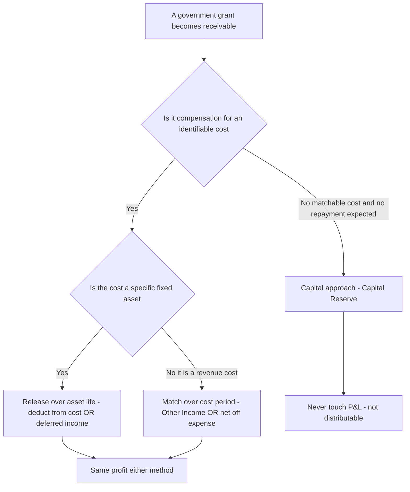
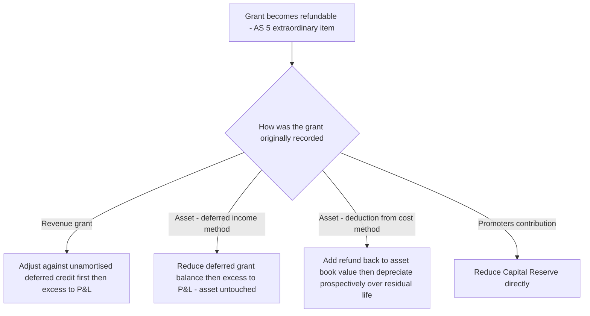

<!-- v2-deep -->

# Chapter 12 — AS 12: Accounting for Government Grants

## 1. The Problem

A State Industrial Development Corporation writes your company a cheque for Rs 2,00,000 "towards the cost of the new effluent-treatment plant." A different department reimburses Rs 60,000 of the wages you paid to apprentices under a skilling scheme. The Centre sanctions a Rs 25,00,000 investment subsidy just for setting up a factory in a backward district. And the local authority hands you a plot of land for a rupee.

Four cheques (or assets). One nagging question: **when, and how, does each of these hit your Profit & Loss statement?**

Naively you might say "it's free money, credit it all to income the day it arrives." But look what that does. The effluent plant will run for 10 years, quietly reducing your profits through depreciation every one of those years. If you dump the whole Rs 2,00,000 grant into *this* year's income, you have created a lopsided picture: a fat one-time profit spike now, followed by ten lean years carrying the full depreciation with no offsetting help. The grant was *given to subsidise a cost that is spread over ten years*, yet you recognised its benefit in one. That is a **matching failure** — the exact disease that accrual accounting exists to cure.

Now flip it. Suppose instead you say "grants are like a gift from the owners of the business, so park them permanently in reserves and never touch income." Then a subsidy that was explicitly meant to defray running expenses never reduces those expenses anywhere — your reported operating cost is overstated forever, and the whole point of the subsidy (making the operation viable) is invisible in the numbers.

So government grants force three genuinely hard decisions, and AS 12 exists to settle each one:

1. **Recognition / timing** — the moment you may book the grant at all, and the moment(s) its benefit reaches the P&L.
2. **Classification** — is this grant *income* (to be matched against costs) or *capital* (part of the owners' stake)?
3. **Presentation** — where on the face of the statements it sits (net against an asset? deferred income? other income? capital reserve?), and what happens when the government asks for it back.

The reason grants are their own little standard, and not just a footnote to AS 9 (Revenue) or AS 10 (PPE), is that a grant is a receipt **from a source other than the customer and other than the shareholder**, usually earned by *complying with conditions*. That awkward middle position is what makes the accounting non-obvious.

A fourth, quieter problem sits underneath all three: **substance over form.** Governments label their schemes carelessly — a "subsidy" may in substance be a specific-asset grant, a "capital incentive" may in substance be revenue support, and a "soft loan" may in substance be a grant. AS 12 forces you to look through the label to the *condition being rewarded* and the *cost being subsidised*. Almost every hard exam problem is really a disguised classification test: identify the true nature first, and the mechanics follow automatically.

## 2. The Core Idea (an analogy)

Think of a government grant as a **matching subsidy on a purchase**, exactly like a manufacturer's cashback offer.

You buy a Rs 10,00,000 machine and the maker gives you Rs 2,00,000 cashback because you also signed a 5-year service contract. Nobody sensibly treats that Rs 2,00,000 as a windfall "profit" the day it lands. Instinctively you feel two equivalent things: *either* "my machine really cost me Rs 8,00,000" *or* "I got Rs 2,00,000 of help that I'll enjoy over the 5 years I use the machine." Both are true, both give the same bottom line, and which story you tell is a **presentation choice**, not an economic one.

That is the entire spine of AS 12:

- **A grant is compensation for a cost.** Find the cost it subsidises, and release the grant to income *over the same period, in the same rhythm, as that cost hits the P&L.* This is the **income approach** and it is the default.
- **You may show the release two ways** — net it off against the cost (the "cashback reduces the price" story) or park it as *deferred income* and drip it into P&L (the "help I earn over time" story). Same profit, different picture.
- **One narrow exception:** some grants are not compensation for any particular cost at all — they are a promoter-style capital injection to get a project off the ground. Those genuinely belong in owners' funds, as a **capital reserve**, and never touch income. This is the residual **capital approach**.

Hold that image — *matching cashback on a purchase, with one special case where the cash is really equity* — and every rule in this chapter becomes a consequence rather than a fact to memorise.

**One sharpening of the analogy.** The cashback is only "earned" once you actually *keep* the contract you signed for. If you cancel the service contract, the maker claws the cashback back. This is why AS 12 never lets you book a grant on the strength of the cheque alone — the benefit is contingent on your *continued compliance*, and the whole refund machinery in Section 4.7 is just the clawback clause of the cashback made into accounting rules. Keep the clawback in mind and the refund rules stop looking arbitrary.

The single decision that drives everything downstream is one binary question, applied to each grant:


*The one binary question — is there a cost to match — sorts every grant into its home.*

## 3. Why It's Built This Way

### Why the income approach wins by default

There is a real philosophical fork here, and AS 12 argues its side rather than just asserting it. Two schools:

- **Capital approach:** a grant is a financing device from the government, akin to a shareholder contribution. It bypasses the P&L and sits in shareholders' funds.
- **Income approach:** a grant is earned income — you *did something* (built the plant, hired the apprentices, located in the backward area) to get it — so it belongs in the P&L, matched against the cost of that something.

AS 12 comes down firmly on the income side, and the reasoning is worth internalising because examiners test the *why*:

1. **A grant is not a shareholder transaction.** Shareholders contribute *as owners* and get ownership rights. Government gives a grant as a *policy instrument* and gets no equity. So calling it "capital" misdescribes the relationship.
2. **Grants are rarely gratuitous.** You *earn* them by complying with conditions and shouldering obligations. Earned inflows are income. Income should be matched with the expenses it relates to.
3. **Because income tax is computed on P&L, and grants often interact with tax, running them through income (over the right periods) keeps the picture coherent.**

### Why then keep a capital exception at all?

Because the income logic depends on there *being* an identifiable cost to match against. When a subsidy is handed over simply as *promoters' contribution* — a lump toward the total capital outlay of the whole undertaking, with no particular expense earmarked and no repayment expected — there is nothing to match it to over time. Forcing it through income would either (a) create an arbitrary profit spike, or (b) require an artificial amortisation schedule with no economic basis. So the standard concedes: *these* grants are, in substance, equity-like, and go to a **capital reserve** that is not available for dividend.

### Why the strict recognition trigger

The standard refuses to let you recognise a grant merely because a cheque arrived, or merely because a scheme was announced. Two conditions must **both** hold:

- **reasonable assurance the enterprise will comply** with the attached conditions, and
- **reasonable assurance the grant will be received.**

Why so cautious on both ends? Because a grant almost always comes with strings, and if you book the benefit and then breach a condition, you'll have to **refund** it — meaning you recognised income that reverses. Prudence says: don't book the upside until you're reasonably sure you'll keep it. And note the sharp corollary the standard spells out — *mere receipt of cash is not conclusive proof the conditions have been or will be met.* Cash can arrive and still be refundable.

### Why "reasonable assurance" and not "certainty" or "virtual certainty"

The threshold is deliberately calibrated. **Certainty** would be too high — you would end up deferring grants long past the point where the economic help is real, defeating the matching purpose. **Virtual certainty** (the AS 22 threshold for deferred tax assets) is also too high for the same reason. But mere *possibility* is too low — it would let managements book optimistic income on schemes they may never qualify for. "Reasonable assurance" sits in the middle: more likely than not, supported by evidence such as the sanction letter, the enterprise's track record of compliance, and the absence of any known impediment. This is the same evidential temperature as AS 9's "no significant uncertainty as to collectability." Learn where each threshold sits — examiners love to swap "reasonable assurance" for "virtual certainty" in the recognition line and see if you catch it.

### Why matching, not receipt, drives the timing

The deepest "why" is that a grant is economically a **negative expense**. If the government pays part of your training bill, your *true* cost of training is the net figure. An expense is recognised as the resource is consumed; therefore its offset — the grant — must be recognised on the *same clock*. Recognising the grant faster than the cost overstates current profit; slower, understates it. Matching is not a stylistic preference here; it is the only treatment that reports the enterprise's real cost of doing the subsidised activity. Every presentation rule in Section 4 is just a mechanical way of enforcing "same clock as the cost."

## 4. Full Technical Content (RMPD lens)

### 4.0 Scope and key definitions

**Government grants** = assistance by government in cash or kind to an enterprise for **past or future compliance with certain conditions**. "Government" means central/state government, government agencies, and similar bodies (local, national, international). Grants are sometimes called **subsidies, cash incentives, duty drawbacks, etc.** — the label does not change the accounting; the substance does.

AS 12 **excludes**:
- Forms of government assistance that **cannot reasonably have a value placed on them** (e.g., free technical/marketing advice, guarantees).
- Transactions with government that **cannot be distinguished from the normal trading transactions** of the enterprise (e.g., government is just a big customer buying at market price).
- Government participation in the **ownership** of the enterprise.

**Why these three carve-outs exist.** The first (unvaluable assistance) is a measurement problem — you cannot put a grant you cannot measure into the accounts, though you may still narrate it. The second (normal trading) is an identification problem — if the "benefit" is indistinguishable from an ordinary commercial deal, there is no grant to isolate. The third (ownership participation) is a classification problem — that is genuinely a capital contribution by government *as owner*, and it belongs to share capital accounting, not to AS 12. Each carve-out maps to one of R-M-P-D breaking down.

Also note: the *benefit* of a government loan at a below-market or nil interest rate is **not** quantified/recognised under AS 12 (that is an Ind AS 20 feature — flag this as a contrast, not an AS 12 rule). Under AS 12 a soft loan is simply a loan at its face value; you do not impute any grant element.

Two presentation-relevant sub-types you must classify a grant into:
- **Grants related to specific fixed assets** — primary condition is that the enterprise should purchase, construct or otherwise acquire such assets (secondary conditions may restrict the type/location/period of holding).
- **Grants related to revenue** — everything else that is compensation-for-cost but not tied to a specific fixed asset.
- Plus the special buckets: **promoters' contribution** grants, **non-monetary** grants, and **grants as compensation for expenses/losses already incurred**.

**Reading the "primary vs secondary condition" test.** The classification hinges on the *primary* condition. "Buy the machine" is a primary condition → asset grant. "Locate in district X" with no asset specified is not about buying a particular asset → likely promoters' contribution or revenue. A secondary condition ("having bought it, hold it 5 years") only restricts, it does not reclassify. Examiners plant a loud secondary condition to lure you into misclassifying — anchor on the primary one.

### 4.1 RECOGNITION — the gate

A government grant is **not recognised until there is reasonable assurance that**:
(a) the enterprise **will comply** with the conditions attached, **and**
(b) the grant **will be received.**

Receipt of a grant is **not itself conclusive** evidence that conditions have been or will be fulfilled. If there is a possibility the grant may have to be refunded, that is a **contingency** to be treated per AS 4 (Contingencies and Events Occurring After the Balance Sheet Date).

**The three recognition states.** It helps to see recognition as a small state machine:
1. *Announced / applied for, assurance not yet reasonable* → **nothing in the books**; at most a note.
2. *Reasonable assurance of compliance and receipt, but cash not yet in* → recognise as a **receivable** (Grant Receivable A/c) with the corresponding credit routed per its classification. Recognition does **not** wait for cash.
3. *Cash received but conditions still capable of breach* → recognise, but carry the *possibility of refund* as an **AS 4 contingency**; cash does not extinguish the strings.

The trap sits between states 1 and 2 (recognising too early on a mere announcement) and between 2 and 3 (assuming cash proves compliance). Both are graded.

### 4.2 MEASUREMENT

- **Monetary grants:** measured at the amount receivable/received.
- **Non-monetary grants at a concessional rate** (e.g., land or resources sold cheap): recorded at their **acquisition cost** (i.e., the concessional amount actually paid).
- **Non-monetary grants free of cost:** recorded at a **nominal value** (say, Re 1).

**Why free assets go in at nominal value, not fair value.** This is the single biggest AS 12 vs Ind AS divergence and it flows from AS 12's conservatism: recording a free asset at fair value would require booking a matching grant of the same fair value as income or reserve, inflating the balance sheet on both sides for an asset that cost nothing. AS 12 refuses to manufacture that number. Ind AS 20 (and Ind AS 16) *do* fair-value such assets; AS 12 does not. In an AS 12 answer, "free = Re 1" is not a simplification, it is the rule.

### 4.3 PRESENTATION — grants related to SPECIFIC FIXED ASSETS

Two methods are **both permitted** by AS 12 (a genuine accounting-policy choice — pick one and disclose it):

**Method I — Deduction from cost of the asset ("net" method).**
- Deduct the grant from the **gross book value** of the asset.
- The grant is thus recognised in P&L **automatically and over the asset's life, through a reduced depreciation charge.**
- **Special case:** if the grant equals the *whole cost* of the asset, the asset is shown in the balance sheet at a **nominal value.**

**Method II — Deferred income ("gross" method).**
- Keep the asset at full cost; carry the grant as **"Deferred Government Grant"** (a liability), and **credit it to P&L on a systematic, rational basis over the useful life of the asset** — normally **in proportion to depreciation** on the related asset.
- The unamortised balance of deferred grant is disclosed separately, ideally split into a **current portion** (next year's amortisation) and a **non-current portion.**

Both methods give the **same net effect on profit each year** (see Example 2). They differ only in *presentation* — Method I shrinks both the asset and the depreciation; Method II keeps them full-size and shows the grant as a separate credit.

**A subtlety on non-SLM depreciation.** "In proportion to depreciation" matters most under WDV. If the asset is depreciated on WDV, the grant under Method II must be amortised on the *same WDV pattern*, not straight-line — otherwise the two methods stop reconciling. Under Method I this happens automatically because the reduced base is itself depreciated on WDV. Example 6 works this so you never trip on it.

**A subtlety on partial-year and mid-life grants.** If a grant is sanctioned *after* the asset has been in use for some years, Method I adjusts the *remaining* book value and depreciates it prospectively over the *residual* life; Method II sets up deferred income and amortises it over the *residual* life. You do not restate past depreciation — grants received later are handled prospectively, mirroring a change in estimate.

### 4.4 PRESENTATION — grants related to REVENUE

Recognised in P&L **over the period necessary to match them with the related costs** they are intended to compensate. Two acceptable presentations:
- **(a)** shown as a **credit under "Other Income"**, or
- **(b)** **deducted from the related expense.**

Both give the same profit; (b) shows the operation's *net* cost, which is often more informative.

**When the "period" spans more than one year.** A revenue grant is not automatically all-in-this-year. If it subsidises a cost that itself straddles years — say a three-year interest-subsidy on a working-capital loan — the grant is spread across those same years. The matching test is "which costs does this compensate," not "when did the cheque arrive." If the cost is entirely in the current year (like this year's apprentice wages), the whole grant lands this year; if the cost is spread, the grant is spread with it.

### 4.5 Grants in the nature of PROMOTERS' CONTRIBUTION

Where a grant is given as **total (or partial) investment in the undertaking / contribution towards its total capital outlay**, with **no repayment ordinarily expected** and **no related cost to match** (e.g., a central/state investment subsidy for locating in a specified area), it is credited **directly to Capital Reserve** and treated as **part of shareholders' funds.**
- It is **not** routed through P&L.
- It is **not** available for distribution as dividend, nor for setting off losses.

**The three-part test for "promoters' contribution."** All three must hold, or it is not this bucket:
1. it is a contribution towards *total capital outlay* (not earmarked to a specific asset or expense);
2. *no repayment* is ordinarily expected; and
3. there is *no related cost* to match it against.
Miss any one and you fall back to the income approach. The classic examiner trap is a subsidy computed *as a percentage of the cost of a specific plant* — that percentage linkage means it *is* earmarked to an asset, so it is an asset grant, **not** promoters' contribution, even if the scheme is grandly titled "Capital Investment Subsidy."

### 4.6 Grants as COMPENSATION for expenses/losses already incurred, or for immediate financial support

When a grant becomes receivable **as compensation for expenses or losses already incurred in a previous accounting period**, or to give the enterprise **immediate financial support with no further related costs**, it is recognised in the **P&L of the period in which it becomes receivable**, and disclosed as an **extraordinary item** if its size/incidence warrants (AS 5).

**Why it is recognised now and not restated backwards.** The event that creates the *asset* (the receivable) is the grant becoming receivable, which happens now. The past loss was correctly reported in the past on the information then available; there was no grant asset to recognise then. So this is not a prior-period *error* to be restated — it is a new inflow recognised when it arises. This is precisely why AS 5 tags it as extraordinary rather than as a prior-period item.

### 4.7 REFUND of government grants (a favourite exam area)

A grant that becomes **refundable** (conditions breached) is treated as a **change in estimate → extraordinary item** under AS 5. The mechanics depend on the original classification:

- **Refund of a REVENUE grant:** apply it **first against any unamortised deferred credit** relating to that grant; any **excess (or the whole, if no deferred credit remains) is charged to P&L** immediately.

- **Refund of a grant related to a SPECIFIC FIXED ASSET:**
  - If originally taken as **deferred income (Method II):** **reduce the deferred income balance** by the amount refundable; any **excess over the deferred balance is charged immediately to P&L.**
  - If originally **deducted from the asset cost (Method I):** **increase the book value of the asset** by the amount refundable. Depreciation on the **revised book value is provided prospectively over the residual useful life.**

- **Refund of a grant treated as PROMOTERS' CONTRIBUTION:** **reduce the Capital Reserve** by the amount refundable.

**The unifying logic of the refund rules.** Every refund rule just *reverses the road the grant took in.* A grant that entered as deferred income leaves by shrinking deferred income (excess spills to P&L because there is not enough deferred balance left). A grant that entered by *reducing the asset* leaves by *restoring the asset* — and because depreciation is always prospective under Indian GAAP, you spread the restored amount over what life remains rather than reopening the past. A grant that entered equity (capital reserve) leaves equity. If you remember "reverse the entry road," you never need to memorise four separate rules.


*Refunds simply retrace the road the grant took into the books.*

### 4.8 DISCLOSURE

- The **accounting policy** adopted for grants, **including the methods of presentation** in the financial statements.
- The **nature and extent** of government grants recognised in the financial statements, **including grants of non-monetary assets** given at a concessional rate or free of cost.

**Why disclosure carries real weight here.** Because AS 12 permits *two* presentations for both asset grants and revenue grants, two otherwise-identical companies can show very different-looking asset bases and expense lines. The mandatory disclosure of the *method chosen* is what restores comparability — a reader can mentally re-gross a "net" balance sheet or vice versa only if the policy is stated. This is also why a change from Method I to Method II (or the reverse) is a change in accounting *policy* under AS 5, requiring justification and disclosure, not a free switch.

## 5. Worked Examples

### Example 1 — Revenue grant, both presentations (easy)

**Data.** During FY 2025-26, Vega Ltd incurs apprentice-training wages of Rs 2,00,000, all charged to P&L. Under a State skilling scheme it receives a reimbursement grant of Rs 60,000, and there is reasonable assurance all conditions are met.

**Reasoning.** The grant compensates a *revenue expense of this very year*, so the whole Rs 60,000 is recognised in FY 2025-26 (matching is automatic — the cost is fully in this period). Only the *presentation* differs.

**Method (a): "Other Income."**
- Training expense (P&L, debit): Rs 2,00,000
- Other income – government grant (P&L, credit): Rs 60,000
- **Net effect on profit: −Rs 1,40,000**

**Method (b): "Deduct from expense."**
- Training expense shown **net**: Rs 2,00,000 − Rs 60,000 = **Rs 1,40,000**
- **Net effect on profit: −Rs 1,40,000**

Journal (method b):
```
Bank A/c                        Dr   60,000
    To Training Expense A/c                 60,000
```
Both routes leave profit lower by exactly Rs 1,40,000. **Tie-out confirmed.** The choice is disclosure, not economics.

### Example 2 — Grant on a specific fixed asset: the two methods must reconcile (core)

**Data.** Orion Ltd buys a machine on 01-Apr-2025 for **Rs 10,00,000**. Useful life **5 years**, **SLM**, nil residual. It receives a government grant of **Rs 2,00,000** related to this machine; all conditions reasonably assured.

**Method I — deduct from cost.**
- Capitalised value = 10,00,000 − 2,00,000 = **Rs 8,00,000.**
- Annual depreciation = 8,00,000 ÷ 5 = **Rs 1,60,000.**

**Method II — deferred income.**
- Asset stays at 10,00,000; depreciation = 10,00,000 ÷ 5 = **Rs 2,00,000 p.a.**
- Grant amortised in proportion to depreciation = 2,00,000 ÷ 5 = **Rs 40,000 p.a.** credited to P&L.
- **Net charge to P&L = 2,00,000 − 40,000 = Rs 1,60,000** — *identical to Method I.*

**Balance sheet at 31-Mar-2026 (end of Year 1):**

| Item | Method I (net) | Method II (gross) |
|---|---:|---:|
| Machine – gross | 8,00,000 | 10,00,000 |
| Less: accumulated depreciation | (1,60,000) | (2,00,000) |
| Carrying amount of asset | 6,40,000 | 8,00,000 |
| Less: Deferred grant (2,00,000 − 40,000) | — | (1,60,000) |
| **Net position** | **6,40,000** | **6,40,000** |

**Both the annual P&L charge (1,60,000) and the net balance-sheet position (6,40,000) reconcile exactly.** That equality is *the* insight: the two methods are the same economics wearing different clothes.

Journal at inception, Method II:
```
Machine A/c                     Dr  10,00,000
    To Bank A/c                             10,00,000
Bank A/c                        Dr   2,00,000
    To Deferred Government Grant A/c         2,00,000
```
Each year, Method II:
```
Depreciation A/c                Dr   2,00,000
    To Machine A/c                          2,00,000
Deferred Government Grant A/c    Dr     40,000
    To P&L A/c (grant income)                 40,000
```

### Example 3 — Refund of the fixed-asset grant, both methods (exam-hard)

**Data.** Continue Example 2. At the **end of Year 2** (31-Mar-2027), Orion breaches a condition and must **refund the entire Rs 2,00,000** grant. Show the treatment and the revised depreciation for Year 3 onwards under **both** methods.

**Method I (was deducted from cost).**
- Carrying amount just before refund = 8,00,000 − (1,60,000 × 2) = 8,00,000 − 3,20,000 = **Rs 4,80,000.**
- Rule: *increase the book value by the amount refundable* → 4,80,000 + 2,00,000 = **Rs 6,80,000.**
- Residual life = 5 − 2 = **3 years.** Revised depreciation = 6,80,000 ÷ 3 = **Rs 2,26,667 p.a.** (prospective).
```
Machine A/c                     Dr   2,00,000
    To Bank A/c                             2,00,000
```
*(No cumulative catch-up of past depreciation is forced — the standard directs prospective depreciation on the revised book value.)*

**Method II (was deferred income).**
- Deferred grant balance after 2 years = 2,00,000 − (40,000 × 2) = **Rs 1,20,000.**
- Rule: reduce deferred income by the refund; charge any **excess** to P&L. Refund 2,00,000 > 1,20,000 balance → excess 80,000 to P&L.
```
Deferred Government Grant A/c    Dr   1,20,000
Profit & Loss A/c (extraordinary) Dr    80,000
    To Bank A/c                             2,00,000
```
- The **asset is unaffected** (it was always at full cost); depreciation continues at **Rs 2,00,000 p.a.** for the remaining 3 years.

**Cross-check on the "cost" of the refund.** Under Method II the immediate P&L hit is Rs 80,000 and future depreciation is unchanged. Under Method I there is no immediate P&L hit but depreciation rises by (2,26,667 − 1,60,000) = Rs 66,667 for each of 3 years = 2,00,000 total extra depreciation. Method II front-loads 80,000 now; Method I spreads 2,00,000 over 3 years. The difference is only *timing of recognition of the refunded benefit* — over the full life both absorb the lost grant. **Internally consistent.**

### Example 4 — Promoters' contribution, non-monetary grant, and a conditional land grant (mixed)

**Data.** Nova Ltd sets up a plant in a notified backward district in FY 2025-26 and records three items:
1. **Central investment subsidy Rs 25,00,000** — a lump sum for locating in the area; no specific asset earmarked, no repayment expected.
2. **Land** transferred by the State **free of cost**, fair value Rs 40,00,000, **conditional** on constructing and operating a factory building (cost Rs 60,00,000, useful life 30 years) for at least 15 years.
3. A stock of raw material bought from a government depot at a **concessional Rs 3,00,000** (open-market value Rs 5,00,000).

**Treatment.**

**(1) Investment subsidy — promoters' contribution.** No matchable cost, no repayment → **credit Capital Reserve Rs 25,00,000**; part of shareholders' funds, not distributable as dividend, never through P&L.
```
Bank A/c                        Dr  25,00,000
    To Capital Reserve A/c                 25,00,000
```

**(2) Free land with an obligation.** Land is a *non-depreciable* asset **but the grant carries an obligation** (build + run the factory). So it is **not** a straight capital-reserve credit; it is released to income **over the period the obligation-cost is charged — i.e., over the 30-year life of the building.** Being **free**, the land itself is recorded at a **nominal value (Re 1)** (non-monetary, free-of-cost rule). The *benefit* of the grant, to the extent it can be measured, is spread; in the common exam treatment the land is carried at nominal value and no separate grant income arises because the asset itself is nominal. If instead the standard's "credit over obligation period" is applied to a measured value, the annual credit would be fair value ÷ building life. **State your assumption.** (Cleanest AS 12 answer: land at nominal value; if a value is placed on it, amortise the grant over the 30-year building life at Rs 40,00,000 ÷ 30 = Rs 1,33,333 p.a.)

**(3) Concessional raw material — non-monetary at concessional rate.** Record the **asset at its acquisition cost = Rs 3,00,000** (the concessional price actually paid). No separate grant is booked; the "benefit" simply flows through a lower inventory cost.
```
Purchases / Inventory A/c       Dr   3,00,000
    To Bank A/c                            3,00,000
```

**Reconciliation of classification logic:** item 1 has *no* cost to match → capital reserve; item 2 has an *obligation* attached → spread over the obligation's cost period (or nominal value if free); item 3 is priced *within a trading transaction* → recorded at what was paid. Three different homes, one consistent principle: *match the grant to the cost it subsidises; where there is no such cost, treat it as capital.*

### Example 5 — Grant compensating a prior-period loss (short)

**Data.** In FY 2025-26 Sirius Ltd receives Rs 5,00,000 from the government as compensation for flood losses of Rs 5,00,000 already suffered and expensed in FY 2024-25. Reasonable assurance is only now established.

**Treatment.** This is a grant **as compensation for a loss already incurred**, giving immediate support with no future related cost. Recognise the **whole Rs 5,00,000 in the P&L of FY 2025-26** (the year it becomes receivable), disclosed as an **extraordinary item** per AS 5. You do **not** restate FY 2024-25.

### Example 6 — Asset grant under WDV depreciation, both methods reconcile (exam-hard)

**Data.** Lyra Ltd buys a machine on 01-Apr-2025 for **Rs 5,00,000**; **WDV** depreciation at **20%**; grant related to the asset **Rs 1,00,000**, conditions assured. Show Years 1 and 2 under both methods and prove they reconcile.

**Method I — deduct from cost.** Base = 5,00,000 − 1,00,000 = **Rs 4,00,000.**
- Year 1 dep = 20% × 4,00,000 = **80,000** → WDV 3,20,000.
- Year 2 dep = 20% × 3,20,000 = **64,000** → WDV 2,56,000.

**Method II — deferred income.** Asset at 5,00,000; deferred grant 1,00,000 amortised *in proportion to depreciation* (i.e., at the same 20% WDV pattern applied to the grant).
- Year 1 dep = 20% × 5,00,000 = **1,00,000**; grant credit = 20% × 1,00,000 = **20,000**; net P&L charge = 1,00,000 − 20,000 = **80,000.**
- Year 2 dep = 20% × 4,00,000 = **80,000**; grant credit = 20% × 80,000 = **16,000**; net P&L charge = 80,000 − 16,000 = **64,000.**

| | Method I net charge | Method II net charge |
|---|---:|---:|
| Year 1 | 80,000 | 80,000 |
| Year 2 | 64,000 | 64,000 |

**Reconciliation.** The net P&L charges match year by year (80,000; 64,000). Deferred grant balance end of Year 2 = 1,00,000 − 20,000 − 16,000 = **64,000**. Net asset position Method II = asset WDV (5,00,000 − 1,00,000 − 80,000 = 3,20,000) less deferred grant 64,000 = **2,56,000**, identical to Method I's WDV of 2,56,000. **The trap this defeats:** amortising the grant straight-line (1,00,000 ÷ 5 = 20,000 every year) under Method II would break the reconciliation from Year 2 onwards. The grant credit must ride the *same depreciation pattern* as the asset.

### Example 7 — Grant receivable at year-end but cash not yet received; and receipt does not prove compliance (conceptual + entries)

**Data.** Draco Ltd's application for a Rs 8,00,000 revenue subsidy (reimbursing this year's power costs) is sanctioned by letter dated 20-Mar-2026; the enterprise has met all conditions and has a clean compliance record; cash is expected in June 2026. Separately, in the prior year it had *received* Rs 3,00,000 cash for a scheme whose conditions it now, at 31-Mar-2026, is unlikely to meet (a real risk of refund has emerged).

**Treatment — the sanctioned-but-uncollected grant.** Recognition does **not** wait for cash. With reasonable assurance of both compliance and receipt, book it now:
```
Government Grant Receivable A/c   Dr   8,00,000
    To Power Expense A/c (or Other Income)      8,00,000
```
The receivable sits as a current asset at 31-Mar-2026.

**Treatment — the received-but-now-doubtful grant.** Cash in hand is **not conclusive.** Because a refund now appears probable, the earlier credit must be unwound / a liability recognised for the refundable amount, and the situation disclosed as an AS 4 contingency (or provided for if the refund is probable and estimable). The lesson the examiner is testing: *timing of recognition is governed by assurance, not by the direction of cash.* One grant is recognised though no cash has come; another is de-recognised though cash was already received.

## 6. Presentation & Disclosure Formats

**Balance sheet — asset grant, Method I (net):**
```
Fixed Assets
  Plant & Machinery (cost 10,00,000 less grant 2,00,000)   8,00,000
    Less: Accumulated depreciation                        (1,60,000)
                                                            6,40,000
```

**Balance sheet — asset grant, Method II (gross):**
```
Non-current liabilities
  Deferred Government Grant (unamortised)                   1,60,000
Fixed Assets
  Plant & Machinery (at cost)                             10,00,000
    Less: Accumulated depreciation                        (2,00,000)
                                                            8,00,000
```
*(Split the deferred grant into current portion — next year's amortisation — and non-current, if a Schedule III-style split is asked.)*

**Statement of P&L — revenue grant:**
- Method (a): under **Other Income → Government grants.**
- Method (b): the related expense line is shown **net of grant**, with the fact disclosed.

**Shareholders' funds — promoters' contribution grant:**
```
Reserves & Surplus
  Capital Reserve (government subsidy — promoters' contribution)   25,00,000
```

**P&L — refund of an asset grant (deferred method), extraordinary item:**
```
Extraordinary items
  Excess of grant refund over deferred credit balance        80,000
```

**Notes to accounts (mandatory disclosures):**
1. *Accounting policy*: "Government grants related to specific fixed assets are presented as a deduction from the gross value of the asset / as deferred income amortised over the asset's useful life. Revenue grants are recognised over the periods matching the related costs and are shown under Other Income / netted against the related expense. Grants in the nature of promoters' contribution are credited to Capital Reserve."
2. *Nature and extent* of grants recognised during the year, **including non-monetary grants** received free or at concessional rates.
3. *Contingency*: unfulfilled conditions / other contingencies attaching to recognised grants (per AS 4).

## 7. Connections

- **AS 5 (Net Profit/Loss, Prior Period & Changes in Estimates):** refund of a grant is a change in estimate; the P&L impact of refunds and prior-loss compensation grants is often an **extraordinary item.** AS 12 leans on AS 5 for that presentation. A *switch between Method I and Method II* is a change in accounting **policy** (not estimate) under AS 5, needing justification and disclosure.
- **AS 4 (Contingencies & Events after Balance Sheet Date):** the *possibility of refund* is a contingency to disclose while conditions remain unfulfilled.
- **AS 10 (Property, Plant & Equipment):** the deduction method directly reduces the *gross book value* / cost of the asset under AS 10; depreciation (AS 10's component) is computed on the reduced base. On refund, the "increase book value + depreciate prospectively over residual life" mechanic mirrors AS 10's change-in-estimate handling.
- **AS 9 (Revenue Recognition):** grants are deliberately *carved out* of AS 9 — they are not revenue from customers — which is precisely why a separate standard is needed. The recognition trigger (reasonable assurance) echoes AS 9's collectability logic.
- **AS 2 (Inventories):** a concessional non-monetary grant of raw material simply lowers inventory cost — it flows through AS 2 valuation, not through a separate grant credit.
- **AS 16 (Borrowing Costs):** a soft/interest-free government loan is carried at face value under AS 12, so there is no imputed-interest grant to offset against borrowing costs — a contrast worth stating when a question mixes a subsidised loan with a capitalised asset.
- **AS 22 (Taxes on Income):** whether a subsidy sits in capital reserve or flows through P&L changes book profit versus taxable profit, creating timing/permanent differences relevant to deferred tax.
- **Ind AS 20 (contrast):** Ind AS 20 does **not** permit the "credit to capital reserve for promoters' contribution" route, requires the *income approach only*, quantifies the benefit of *below-market government loans*, and fair-values *free non-monetary* assets. Know the four contrasts; do not import Ind AS 20 rules into an AS 12 answer.

## 8. Traps & Examiner Tricks

1. **"Cash received = recognise" — false.** The standard explicitly says receipt is *not conclusive.* If conditions aren't reasonably assured, the grant sits unrecognised (as a liability/contingency), not in income. Conversely, a sanctioned grant is recognised *before* cash arrives (Example 7).
2. **Forcing everything through capital reserve.** Only *promoters'-contribution*-type grants (and unconditional non-depreciable-asset grants) go to capital reserve. A grant that subsidises a specific asset or a specific expense must run through the income approach. Watch the direction of the trap and its reverse.
3. **Both fixed-asset methods give the same profit — say so.** A classic full-marks question asks you to *prove* Method I and Method II yield identical annual profit and identical net balance-sheet position. If you only show one method, you miss half the marks.
4. **Refund of asset grant — right mechanic for the right method.** Deferred-income method → knock down the deferred balance, excess to P&L. Deduction method → *add back to the asset* and depreciate **prospectively over the remaining life** (do *not* recompute past years). Swapping these is the single most common error.
5. **"Refund excess" only exists in Method II.** Because the deferred balance may be smaller than the refund, an excess can hit P&L. Under Method I there is no separate deferred balance, so there is no "excess to P&L" step — you simply reload the asset.
6. **Free non-monetary asset → nominal value, not fair value.** Recording free land at Rs 40,00,000 with a matching grant is wrong under AS 12 (that is Ind AS thinking). Free = nominal value; concessional = actual price paid.
7. **Non-depreciable asset grant hinges on "obligation or not."** No obligation → capital reserve. Obligation attached → spread over the period the obligation's cost is charged. Don't default land grants to capital reserve automatically.
8. **Prior-period loss compensation is recognised NOW, not restated.** Do not reopen last year's accounts; book it in the year it becomes receivable, as an extraordinary item.
9. **Promoters'-contribution reserve is not distributable.** If a sub-question asks whether it can fund dividends or set off losses — no. It is a capital reserve.
10. **Depreciation base under the deduction method.** Depreciation must be on the *net* (post-grant) cost. A frequent slip is charging depreciation on the gross cost while *also* deducting the grant — double counting the benefit.
11. **"Subsidy as a percentage of asset cost" is an asset grant, not promoters' contribution.** The percentage linkage earmarks it to the asset, defeating the "no related cost" limb of the promoters' test — regardless of the scheme's grand title. Read the *basis of computation*, not the name.
12. **Grant received mid-life is handled prospectively.** A grant sanctioned after the asset has run some years adjusts only the *remaining* book value / sets up deferred income over the *residual* life. Do not restate earlier depreciation.
13. **WDV grants must amortise on the WDV pattern (Method II).** Straight-lining the grant credit while depreciating the asset on WDV breaks the reconciliation. Match the grant's release to the *actual depreciation pattern* (Example 6).
14. **Soft loan ≠ grant under AS 12.** Do not impute an interest-benefit grant on a below-market government loan; that is Ind AS 20. Under AS 12 the loan sits at face value.
15. **Threshold word-swap.** The recognition test is *reasonable assurance*, not "virtual certainty" (AS 22) or "certainty." Examiners plant the wrong threshold in the question stem or answer to catch a rote reader.

## 9. First-Principles Recap

- A grant is **compensation for a cost**, earned by complying with conditions — so it is **income**, matched to the cost it subsidises (income approach), not a shareholder gift.
- **Recognise only on reasonable assurance of both compliance and receipt**; cash in hand is not conclusive proof, and a sanctioned grant is recognised even before cash arrives.
- **Grants for specific fixed assets** are released to income over the asset's life — either by **deducting from cost** (lower depreciation) or as **deferred income** (separate credit). **Same profit, same net position; different picture** — and the grant's release must follow the asset's *own* depreciation pattern.
- **Grants for revenue** are matched to the related expense over the same period — shown as **other income** or **netted against the expense** — spread across years if the cost is spread.
- The **only true capital-approach case** is a grant that is really **promoters' contribution** — no matchable cost, no repayment → **capital reserve**, never through P&L, not distributable.
- **Non-monetary grants:** free → **nominal value**; concessional → **acquisition cost actually paid.**
- **Non-depreciable-asset grants:** no obligation → capital reserve; obligation attached → spread over the obligation-cost period.
- **Refunds are extraordinary items** and simply *reverse the road in*: revenue grant → hit deferred credit first, excess to P&L; asset grant (deferred method) → reduce deferred balance, excess to P&L; asset grant (deduction method) → **add back to asset, depreciate prospectively**; promoters' grant → reduce capital reserve.

## 10. Quick-Revision Sheet

**Recognition gate:** reasonable assurance of (i) compliance with conditions AND (ii) receipt. Receipt ≠ conclusive; recognition ≠ waiting for cash. Threshold = *reasonable assurance* (not virtual certainty).

**Two approaches:** Income (default) vs Capital (only promoters'-contribution & unconditional non-depreciable grants).

**Specific fixed-asset grant — pick one, disclose it:**
- *Deduction method:* asset = cost − grant; depreciate the net; if grant = whole cost → asset at nominal value.
- *Deferred income method:* asset at full cost; carry "Deferred Grant"; credit to P&L **in proportion to depreciation** (SLM or WDV, matching the asset) over useful life.
- Both → identical annual profit and identical net balance-sheet figure.

**Revenue grant:** recognise over matching period (one year or spread) → Other Income *or* deduct from related expense.

**Promoters' contribution grant (all three: total-outlay, no repayment, no related cost):** → Capital Reserve; not through P&L; not distributable. A subsidy *as % of asset cost* is an asset grant, not this.

**Non-monetary grant:** free → nominal value; concessional → actual (acquisition) cost.

**Non-depreciable asset grant:** no obligation → capital reserve; with obligation → spread over the obligation-cost period (e.g., building life).

**Compensation for past loss / immediate support:** recognise fully in year receivable; extraordinary item (AS 5). Do not restate.

**Grant received mid-life:** prospective — adjust remaining book value / set deferred income over residual life; no restatement.

**Refund (all extraordinary items, AS 5 — reverse the road in):**
| Original grant | On refund |
|---|---|
| Revenue | Against unamortised deferred credit first; excess → P&L |
| Fixed asset – deferred income | Reduce deferred balance; excess → P&L; asset unchanged |
| Fixed asset – deduction | Increase asset book value by refund; depreciate **prospectively** over residual life |
| Promoters' contribution | Reduce Capital Reserve |

**Disclose:** accounting policy incl. presentation method; nature & extent of grants incl. non-monetary grants; refund/contingency (AS 4). Method I↔II switch = change in accounting *policy* (AS 5).

**Numbers to keep straight (Orion machine, SLM):** cost 10,00,000; grant 2,00,000; life 5; net method dep 1,60,000/yr; gross method dep 2,00,000 − grant 40,000 = 1,60,000/yr; both net position 6,40,000 after Yr 1. Refund at end Yr 2: deduction method → book value 4,80,000 + 2,00,000 = 6,80,000 ÷ 3 = 2,26,667/yr; deferred method → deferred bal 1,20,000 cancelled + 80,000 to P&L.

**Numbers to keep straight (Lyra machine, WDV 20%):** cost 5,00,000; grant 1,00,000; net charges Yr1 80,000, Yr2 64,000 under *both* methods; deferred bal end Yr2 = 64,000; net position 2,56,000 both ways — only if the grant is amortised on the WDV pattern, not straight-line.
