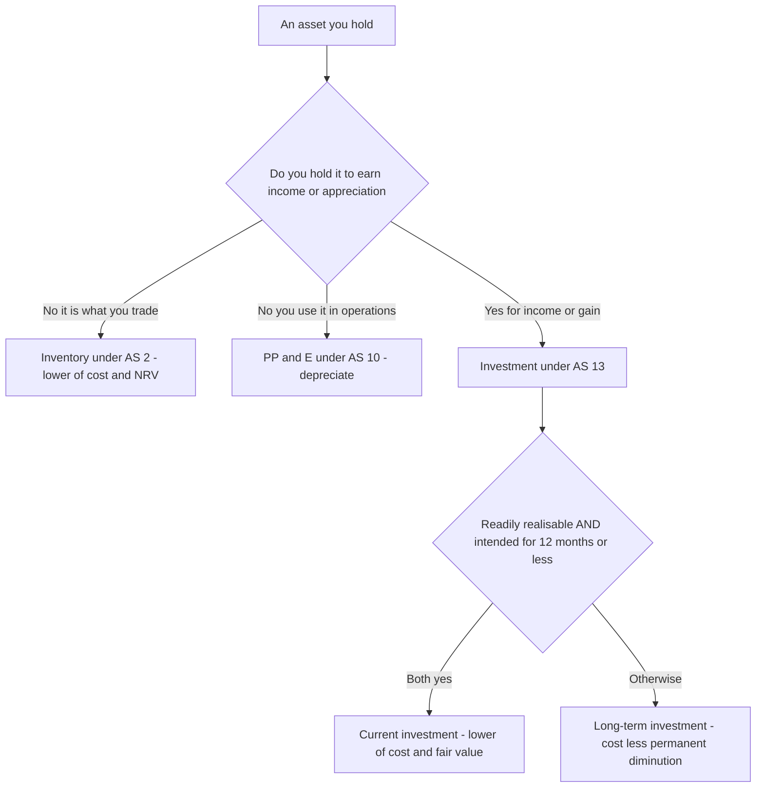
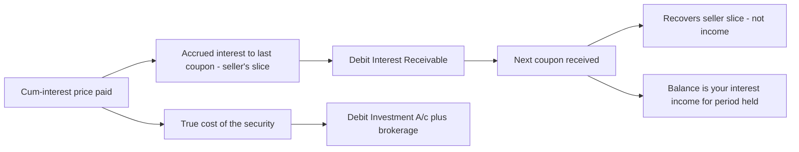
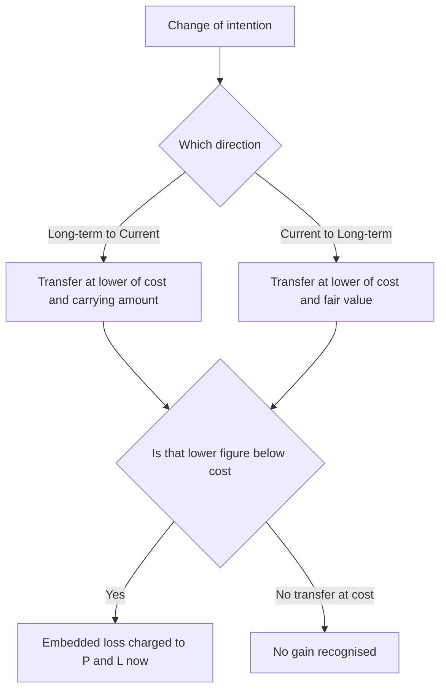

<!-- v2-deep -->

# Chapter 13 — AS 13: Accounting for Investments

## 1. The Problem

A company parks money in things that are neither its operating machinery nor its inventory. It buys shares of another company, government bonds, mutual fund units, debentures, sometimes a spare building it doesn't use but holds because property tends to appreciate. These are **investments** — assets held to earn income (interest, dividend, rent) or capital appreciation, not to be consumed in producing the goods the business actually sells.

Now the accounting question. You bought 1,000 shares of Reliance at Rs. 2,400 last March. On the balance-sheet date they trade at Rs. 2,050. What number do you show?

Three answers compete:

- **Rs. 24,00,000** (what you paid — historical cost). Clean, objective, but it hides a Rs. 3,50,000 hole. If you're a trading desk that will flip these next week, showing cost is a lie about your realisable wealth.
- **Rs. 20,50,000** (current market value). Honest about today, but if you're a long-term strategic holder who'll keep these for a decade, a temporary market dip that will reverse doesn't affect you — writing it down over-reacts and injects volatility into your P&L for nothing.
- Something in between, depending on *why* you hold it.

That last instinct is the whole of AS 13. The standard's core insight: **the right measurement depends on your holding intention, because intention determines whether a price change is real news or noise.** A second problem AS 13 solves: what exactly is "cost" when you buy an investment cum-interest, or when a bonus issue drops free shares into your lap and dilutes your average? And a third: when you sell, how do you compute the profit, and what if you only sell part of the holding?

There is also a fourth, quieter problem the standard settles that beginners miss: **the P&L is the *only* place price changes are allowed to land.** AS 13 is a pre-OCI, historical-cost standard. There is no "revaluation reserve" or "other comprehensive income" route for investments the way there is for Ind AS 109. Every write-down, every write-back, every disposal gain hits the Statement of Profit and Loss directly. Internalising that single routing rule prevents half the presentation mistakes students make — you never park an investment loss in a reserve under AS 13.

AS 13 is one of the most *reasoned* standards in the syllabus. Almost nothing in it is arbitrary. Let's build it from the ground up.

## 2. The Core Idea (analogy)

Think of two people who own gold.

**The jeweller** buys gold every morning and sells it by evening. For her, gold is *stock-in-trade dressed up as an investment*. If gold falls Rs. 500/gram overnight, that is a real loss to her wealth right now, because she is about to sell. She marks her holding to whatever she can get today, and she never inflates it above cost (prudence — don't book profit you haven't earned). Her rule: **lower of cost and fair value.**

**The grandmother** buys gold coins for her granddaughter's wedding fifteen years away. Daily gold prices are irrelevant to her — a dip this year will almost certainly recover before the wedding. She keeps the coins at what she paid and ignores the ticker. *But* — if the coin turns out to be fake, or gold is permanently demonetised as a store of value (a permanent, structural impairment), she must face reality and write it down. Her rule: **cost, less any provision for a diminution that is permanent, not just a passing dip.**

Same asset, gold. Two completely different accounting treatments — driven entirely by **holding horizon and intention**. The jeweller is a *current investment*; the grandmother is a *long-term investment*. That single split — and the two measurement rules that flow from it — is 70% of AS 13. Everything else (cost of purchase, cum-interest, bonus, disposal, reclassification) is detail hanging off this frame.

One more character sharpens the picture: **the pawnbroker who deals gold as his trade.** He is neither jeweller-investor nor grandmother-saver — gold *is his business's stock*. His gold never enters AS 13 at all; it is **inventory under AS 2** (lower of cost and net realisable value). Notice AS 2's rule ("lower of cost and NRV") looks almost identical to the current-investment rule ("lower of cost and fair value") — both are prudence in action — yet they live in different standards because the *reason for holding* differs. The moment you can place any holding into one of these three drawers — trading stock (AS 2), short-term investment (AS 13 current), long-term investment (AS 13 long-term) — you have already done most of the thinking.

*Same brick building, different accounting by intention — the AS 13 gold analogy extended*



## 3. Why It's Built This Way

Why does intention get to change the number? Because accounting's job is to report **relevant** information **prudently**, and relevance is defined by the decision the reader is making.

For a **current investment** (intended to be held short-term, readily realisable), the reader wants to know: *how much cash can this be turned into soon?* The near-future selling price is the relevant fact. So we use fair value — but only on the *downside*. We take **lower of cost and fair value**, not fair value outright, because of **conservatism/prudence**: an unrealised gain on something you haven't sold is a paper profit that could evaporate tomorrow, and AS 13 (a historical-cost-based standard) won't let you distribute paper profits as dividends. An unrealised *loss*, though, must be recognised because you're likely to actually crystallise it soon.

For a **long-term investment**, the reader wants to know: *is this strategic holding still sound?* Day-to-day price wobble is noise — you're not selling into it. So we hold at **cost** and deliberately *ignore* temporary ups and downs. We only intervene when the fall is **other-than-temporary** (also called permanent or structural) — a genuine erosion of the investment's underlying worth (investee going bust, technology obsolete, permanent loss of market). At that point ignoring it would overstate assets, so we provide.

Notice the asymmetry that runs through the whole standard: **losses that are likely to be real are recognised early; gains are recognised only when realised (on sale).** That is prudence, the spine of Indian AS accounting.

Why measure long-term at cost and not fair value like Ind AS 109 / IFRS 9 would? Because AS 13 is a **cost-based, prudence-first** framework built for reliability and for protecting creditors/dividend capacity, not for fair-value relevance. Ind AS later swung towards fair value with gains routed through OCI — but for your CA Inter AS paper, the world is cost-based, and that choice is *why* the long-term rule looks conservative.

**Why "lower of cost and fair value" and not just "fair value" for current investments — the deeper reason.** A trading-desk reader cares about realisable cash, so you might expect symmetric fair-value (mark up *and* down). AS 13 refuses the up-mark for two structural reasons. First, **realisation convention** — Indian GAAP recognises income only when it is realised or reasonably certain; an unsold quoted share's rise is neither. Second, **capital maintenance / dividend law** — if unrealised gains hit P&L, they inflate distributable profit, and a company could pay a dividend out of a paper gain that reverses next week, returning capital to shareholders at creditors' expense. "Lower of cost and FV" is therefore not laziness; it is the exact point where relevance (mark down likely losses) and prudence (don't book unrealised gains) are balanced. Ind AS 109 tolerates the up-mark only because it simultaneously *ring-fences* those gains in OCI or restricts their distributability — machinery AS 13 does not have.

**Why the "other-than-temporary" test and not a bright-line percentage?** ICAI deliberately avoids "provide if the fall exceeds X%." A 40% fall in a fundamentally sound cyclical stock during a market crash may be pure noise; a 15% fall in a company that has lost its only customer may be permanent. A mechanical threshold would force wrong answers in both directions. So the standard uses a **judgement test backed by indicators** (continuing investee losses, restricted distributions, sustained non-recovery, falling asset backing). The cost of this design is that it is examinable *as judgement* — the examiner gives you facts and asks you to conclude "temporary" or "other-than-temporary," and both the conclusion and the reasoning earn marks.

## 4. Full Technical Content (Recognition · Measurement · Presentation · Disclosure)

### 4.0 Scope — what AS 13 does and doesn't cover

AS 13 deals with accounting for investments and their disclosure. It **does not** deal with:
- Bases for recognising **interest, dividends and rentals** earned on investments (that's AS 9, Revenue Recognition).
- **Finance/operating leases** (AS 19).
- Investments of **retirement benefit plans and life insurance** enterprises.
- **Shares/debentures held as stock-in-trade** — these are inventory, not investments, so AS 2 governs them (a share-broker's trading stock).

That last carve-out matters: an asset is an "investment" under AS 13 only if held to earn income/appreciation, **not** if it's the thing you trade as your business.

**Read the scope as "AS 13 measures the *asset*, AS 9 measures the *income it throws off*."** This division is the most examined connection in the chapter. When a problem gives you a cum-interest bond, AS 13 tells you the *cost* of the bond and AS 9 tells you *how much interest* to recognise and when. Students who blur the two either capitalise interest into the asset (overstating the investment) or expense acquisition brokerage (understating it). Keep the two ledgers — Investment A/c and Interest A/c — mentally separate from the first line of every problem.

### 4.1 Recognition — the two classes

An **investment** = an asset held for earning income by way of dividends, interest, rentals, or for capital appreciation, or other benefits (e.g. strategic/trade advantage).

Two mutually exclusive buckets:

| | **Current investment** | **Long-term investment** |
|---|---|---|
| Definition | Readily realisable **and** intended to be held **≤ 12 months** from acquisition | Any investment **other than** a current investment (i.e. not intended for short-term realisation) |
| Test | Both conditions — marketable *and* short intent | Default bucket for everything else |

Two independent conditions must **both** be satisfied for "current": (a) *by nature* readily realisable, and (b) *by intention* held for not more than one year. A blue-chip share you intend to hold for 10 years is readily realisable but **not** current — because intention fails. An unlisted subsidiary's shares held for 3 months are intended short-term but arguably not readily realisable. Intention is king.

**Finer distinctions the exam probes:**

- **"Readily realisable" is about the *market*, not the *holder*.** It asks whether an active, liquid market exists so the asset can be sold quickly at a determinable price — quoted equity, government securities, liquid mutual-fund units qualify; shares of a private company generally do not.
- **"Intended to be held ≤ 12 months" is measured from the *reporting date*, not perpetually from acquisition.** A bond originally bought as long-term becomes current in the period in which its remaining intended holding drops to a year or less *and* management decides to realise it — which is exactly what triggers a reclassification (4.4).
- **The classification is made at each balance-sheet date, not frozen at purchase.** Intention is re-assessed every year; a change flips the bucket and forces a transfer at the lower value.
- **"Long-term" is the residual, not a positive category.** The standard never lists what a long-term investment *is*; it is simply "an investment other than a current investment." So when in doubt, if either currentness-condition fails, the holding is long-term by default.
- **Trade investments** (shares held to further business relationships, e.g. a stake in a key supplier) are a *sub-species of long-term investments*, disclosed separately in some formats but measured by the same long-term rule.

### 4.2 Measurement — cost of an investment (at acquisition)

**Cost = purchase price + directly attributable acquisition charges.**

Acquisition charges expressly included: **brokerage, fees and duties** (e.g. stamp duty, STT-type transaction charges). These are capitalised into cost, not expensed — because they are part of what it cost you to *get* the asset into your hands.

Three special situations change what "cost" is:

**(a) Acquired by issue of shares/other securities.** Cost = **fair value of the securities issued** (which is their issue price, i.e. market/agreed value), not necessarily face value.

**(b) Acquired in exchange for another asset.** Cost = **fair value of the asset given up**; if that isn't clearly determinable, use the **fair value of the investment acquired**. (Whichever is more clearly evident.) The gain or loss on the asset given up (its fair value minus its own carrying amount) is recognised in P&L at the same time — the exchange is treated as a disposal of the old asset plus an acquisition of the new investment, not a cost-neutral swap.

**(c) Cum-interest / cum-dividend purchase (the interest-embedded price problem).** When you buy an interest-bearing security *between* two interest dates, the quoted price often already includes the interest that has accrued since the last coupon. That accrued interest is **not** part of your investment's cost — it's a pre-paid recovery of interest that the seller earned and you'll collect at the next coupon. So:

> **Cost of investment = Cum-interest price − Interest accrued to date of purchase (that belongs to the seller).**

The accrued portion you paid is debited to **Interest Receivable / Interest** (not to Investment). When the next coupon arrives, only the part relating to *your* holding period is income; the rest just recovers what you advanced.

Same logic for **cum-dividend**: if you buy shares cum-dividend (price includes a declared but unpaid dividend), the dividend portion isn't cost of the share — when received it's reduced from cost / treated as recovery of capital (pre-acquisition dividend), not income. (Post-acquisition dividends are income under AS 9.)

**Ex-interest** purchase: the price excludes accrued interest, so you *additionally* pay accrued interest separately — that separate amount is interest, the quoted price is the cost.

**A cleaner mental model for cum vs ex.** In *both* cases the total cash you part with is the same for the same economics — the label only tells you *how the total splits* between "cost of security" and "accrued interest." Cum-interest: the accrued interest is *buried inside* the quoted price, so you *subtract* it out to reach cost. Ex-interest: the accrued interest is *added on top* of the quoted price, so the quoted price *is* the cost and the add-on is interest. Get this split wrong and both your asset value and your interest income are wrong — a double error the examiner loves.

*How the accrued-interest slice moves through the cum-interest lifecycle*



**(d) Right shares and bonus shares — the dilution problem.**

- **Bonus shares** cost you **nothing** (they're free, issued out of the company's reserves). So you add the *number* of shares but add **Rs. 0** to cost. Effect: your **average cost per share falls** — the same total cost is now spread over more shares. This is the classic exam trick for per-share cost after a subsequent partial sale.
- **Right shares** subscribed: added to cost at the **price actually paid** for them.
- **Right entitlement renounced (sold) rather than taken up:** the sale proceeds of the right are **capital receipt, not income**, and are generally credited to the P&L (as profit on sale of rights) — *however*, where the rights are sold **before the shares are acquired** in circumstances that the offer of rights results in reduction of the "cum-right" value of the original shares, the proceeds may need to be applied to reduce the carrying cost of the original holding. For CA Inter, the safe default the ICAI uses: **sale proceeds of rights renounced → credited to Profit & Loss**, unless the question specifically says the original investment was bought cum-right and the market value ex-right has fallen, in which case adjust cost. Flag and follow the question's framing.

**Why bonus shares dilute but don't destroy value — the first-principles point.** A bonus issue is a book entry inside the investee: it moves rupees from reserves to share capital and hands you more paper. Your *proportionate ownership is unchanged* and the company is no richer, so the market price per share typically falls in proportion (a 1:1 bonus roughly halves the price). Your total wealth is untouched; only the *unit* has been subdivided. That is exactly why accounting adds quantity but adds zero cost — anything else would fabricate value out of a mere subdivision. The same logic explains why you must re-spread the *original* total cost over the *new larger* count before costing any later sale.

**Why a rights renunciation can behave two ways.** A right is itself a valuable, tradeable thing — the right to buy shares below market. If you sell it, you have realised value. The question is *where that value came from*. Normally it is a windfall on top of an intact holding, so it is a P&L gain. But if the very existence of the rights offer has *drained value out of your existing shares* (the shares go "ex-rights" and drop), then part of what you sold was really a piece of your original investment's value leaking out — so the proceeds should reduce the carrying cost of the original holding instead of being booked as profit. ICAI's default in Inter problems is P&L; deviate only on an explicit cum-right-with-value-fall cue.

### 4.3 Measurement — carrying amount at each balance-sheet date

**Current investments: LOWER of cost and fair value.**

- *Fair value* = amount for which an asset could be exchanged between knowledgeable, willing parties in an arm's-length transaction. For quoted investments, **fair value = market value** (or net realisable value).
- The comparison can be made **investment-by-investment**, or **by category** of investments (e.g. all equity together, all bonds together) — but **not** on a total portfolio basis in a way that offsets a fall in one against a rise in another indiscriminately. The prudent, commonly-examined approach is **individual (scrip-by-scrip)** lower-of-cost-and-fair-value, which prevents a gain on Share A from masking a loss on Share B.
- The **reduction to fair value** (and any subsequent **increase back up to, but not above, cost**) is taken to the **Profit & Loss Statement**. Because it's "lower of cost and FV", the carrying value can rise on recovery but is **capped at original cost** — you never book unrealised gain above cost.

**Why scrip-wise (or at most category-wise) and never whole-portfolio.** The whole point of the lower-of rule is prudence — surface likely losses. Whole-portfolio netting defeats that: a Rs. 50,000 unrealised gain on Share A would silently absorb a Rs. 50,000 unrealised loss on Share B, so no write-down appears and the loss is hidden behind a gain you are not even allowed to book. Scrip-wise application forces each loser to be written down while each winner stays capped at cost — the asymmetry is preserved. Category-wise is a permitted, slightly less granular middle ground; whole-portfolio offset is not.

**Long-term investments: at COST, less provision for OTHER-THAN-TEMPORARY (permanent) diminution.**

- Carried at **cost**. Temporary fluctuations in market value are **ignored** — not provided for.
- When there is a **decline, other than temporary, in the value** of a long-term investment, the carrying amount is **reduced** to recognise it. The reduction is charged to the **Profit & Loss Statement**.
- Indicators of an "other-than-temporary" decline: the investee's continuing losses, restrictions on distributions, inability to trade, the investment's value not expected to recover, dividends not received, a fall in the investee's asset backing.
- The provision is made **investment-by-investment**.
- **Reversal:** if the reasons for the reduction **cease to exist** (value recovers and the impairment was other-than-temporary but has genuinely reversed), the provision written down earlier may be **written back**, re-crediting P&L — again capped so carrying amount doesn't exceed original cost.

Put crudely: current investments react to *every* fall (down to FV); long-term investments react only to *permanent* falls. That's the entire measurement story.

**A subtle asymmetry within the long-term rule.** For a long-term investment you provide only for the *permanent* part. If a long-term holding has fallen and part of the fall is judged temporary and part permanent, you provide only the permanent slice — you do **not** write it all the way down to current market value the way you would a current investment. Conversely, on reversal you write back only to the extent the *permanent* reason has genuinely ceased, and never above original cost. The market price is *evidence* about permanence, not the *target* carrying amount.

**"May be" versus "shall be" — a wording trap.** The reduction for an other-than-temporary decline is *required* (you *shall* provide once you conclude the decline is permanent). The *write-back* on reversal is *permitted* language ("may be reversed") but in practice, once the reason has demonstrably ceased, carrying a needless provision understates assets, so the reversal is made — capped at cost. Read the standard's mandatory-vs-permissive verbs carefully; examiners test whether you know provisioning for a permanent fall is not optional.

### 4.4 Reclassification (transfer between categories)

Intentions change. A long-term holding you now plan to sell within months becomes current; a current holding you decide to keep long-term becomes long-term. AS 13 must stop companies "gaming" the transfer to book or dodge a loss. Its rule pins the transfer value to the **lower** figure so no hidden gain sneaks through:

**Long-term → Current:** transfer at the **LOWER of cost and carrying amount** at the date of transfer.
- (Since a long-term investment is carried at cost less any permanent-diminution provision, its carrying amount ≤ cost. So effectively transfer at **carrying amount**.)

**Current → Long-term:** transfer at the **LOWER of cost and fair value** at the date of transfer.
- (If FV < cost, transfer at FV — you crystallise the current-investment loss on the way out; you don't carry it into the long-term bucket at inflated cost.)

The unifying principle: **transfer at the lower value so that any embedded loss is recognised now and no unrealised gain is created by the mere act of reclassifying.**

**Why the two directions use different "lower-of" pairs.** The pair always compares *cost* against *whatever measure the destination bucket cares about*, and picks the lower. A long-term investment's own carrying figure already embeds any permanent provision, so LT→Current compares cost with that carrying amount. A current investment's relevant measure is fair value, so Current→LT compares cost with fair value. In each case, if the "market-ish" figure is below cost, you transfer at that lower figure and the embedded loss lands in P&L; if it is above cost, you transfer at cost and the would-be gain is suppressed. Same anti-gaming logic, two mechanically different comparisons.

**The tempting trap the rule blocks.** Imagine a company sitting on a long-term investment that has *risen* to Rs. 12 lakh against a Rs. 10 lakh cost. If reclassification let it move at fair value, the firm could flip it to "current," book a Rs. 2 lakh unrealised gain, and inflate profit without selling anything. The "lower of cost and carrying amount / fair value" rule caps the transfer at cost, killing the manufactured gain. Reclassification is a valuation *checkpoint*, never a value-*creation* event.

*The lower-value rule on reclassification — losses surface, gains are suppressed*



### 4.5 Disposal (sale) of an investment

On disposal, **profit/loss = net sale proceeds − carrying amount.** This difference goes to the **Profit & Loss Statement**.

- "Net" proceeds = gross sale price **less** selling expenses (brokerage, duties on sale).
- If only **part** of a holding is sold, you need a **cost per unit** to determine the carrying amount of the portion sold. AS 13 permits **average carrying amount** (weighted average) — this is where bonus shares, right shares and cum/ex-interest cost adjustments all feed in. Compute the *average cost per share of the whole holding after all adjustments*, then multiply by units sold.
- If an investment's carrying amount was **different from cost** (e.g. a current investment written down to FV), the profit/loss on sale is computed against the **carrying amount**, and any earlier reduction already charged to P&L is effectively "reversed" through the gain/loss on sale — don't double count.

**Which cost formula, and why weighted average dominates in exams.** The standard permits an averaging basis; the ICAI's investment-account problems almost always use **weighted-average cost**, because bonus and rights layers make a clean FIFO lot-tracking awkward and because the investment ledger already carries a single running "amount" column. Unless a problem explicitly imposes FIFO, apply weighted average: after every bonus/rights adjustment, recompute the average cost per unit, and cost any sale at that current average. A reliable self-check: the *average cost of the units retained after a sale must equal the average cost immediately before the sale* (bonus/rights aside), because a partial sale removes units at the average and cannot shift the average of what remains.

**Disposal when the holding was previously written down.** Suppose a current investment cost Rs. 1,00,000, was written down to fair value Rs. 85,000 last year (Rs. 15,000 already charged to P&L), and now sells for Rs. 92,000 net. Profit on sale = 92,000 − **85,000 (carrying amount)** = Rs. 7,000, *not* 92,000 − 1,00,000. The earlier Rs. 15,000 loss and this year's Rs. 7,000 gain are both correct in their own years; measuring the disposal against carrying amount (not original cost) prevents double-counting the write-down.

### 4.6 Investment Property

An **investment property** = an investment in **land or buildings** that are **not intended to be occupied substantially for use by, or in the operations of, the investing enterprise** (i.e. not owner-occupied, not used in your own business).

- Under AS 13, an investment property is accounted for as a **long-term investment** → carried at **cost**, subject to provision for **other-than-temporary** diminution (i.e. it does **not** follow AS 10/PP&E depreciation-and-revaluation the way owner-occupied property does, though cost of any building may still be considered; the standard's treatment is the long-term-investment treatment).
- Contrast: property used in your own operations is **PP&E under AS 10**, depreciated. The distinguishing line is **use/occupation**, exactly like the gold analogy — same brick building, different accounting by intention.

**The examinable boundary cases:**
- **A building partly owner-occupied and partly let out.** If the portions can be sold (or leased) *separately*, split them — the let-out portion is investment property, the used portion is PP&E. If they cannot be separated and only an *insignificant* portion is held to earn rent, treat the whole as owner-occupied PP&E. The "significant portion" judgement is what makes it examinable.
- **Property held for undecided future use** (neither committed to own-use nor to letting) is generally treated as investment property until intention crystallises, because it is not currently occupied in operations.
- **Do not depreciate an AS 13 investment property.** This is the single sharpest AS 13-vs-Ind AS 40 contrast: under AS 13 it sits at cost (less permanent diminution) with *no systematic depreciation charge*, whereas Ind AS 40 would carry it at cost-with-depreciation or fair value. Applying AS 10 depreciation to an AS 13 investment property is a classic wrong answer.

### 4.7 Carrying amounts — summary table

| Category | At acquisition | At each B/S date | Fall in value | Rise in value |
|---|---|---|---|---|
| **Current** | Cost (incl. brokerage/duties) | **Lower of cost & fair value** | Recognise down to FV → P&L | Reverse **up to cost only** → P&L |
| **Long-term** | Cost | **Cost**, less provision for permanent diminution | Provide only if **other-than-temporary** → P&L | Write back if reason ceases, **up to cost** → P&L |

## 5. Worked Examples

### Example 1 — Cost with brokerage; year-end carrying (current vs long-term)

On 1 April 2025, X Ltd buys 2,000 equity shares of A Ltd at Rs. 150 each and pays brokerage @ 1% plus stamp duty Rs. 300.

Cost of investment:
- Purchase price = 2,000 × 150 = Rs. 3,00,000
- Brokerage @ 1% = 3,000
- Stamp duty = 300
- **Total cost = Rs. 3,03,300**

On 31 March 2026 the shares trade at Rs. 140 (fair value = 2,000 × 140 = Rs. 2,80,000).

**Case A — held as a current investment:** carry at lower of cost (3,03,300) and FV (2,80,000) = **Rs. 2,80,000**. Charge the Rs. 23,300 fall to P&L.

**Case B — held as a long-term investment, and the fall is judged temporary** (A Ltd is fundamentally sound; price dip is a market wobble): carry at **cost Rs. 3,03,300**. **No provision.** The Rs. 23,300 dip is ignored.

**Case B2 — long-term, but A Ltd has posted three years of losses and the decline is other-than-temporary:** provide Rs. 23,300, carry at Rs. 2,80,000.

*Lesson: identical facts, three different carrying values — the driver is classification + permanence, never the raw price.*

### Example 2 — Cum-interest purchase (the accrued-interest split)

On **1 August 2025**, Y Ltd buys 12% Government Bonds of face value Rs. 5,00,000 at a **cum-interest price of Rs. 5,18,000**, plus brokerage 0.5%. Interest is payable **half-yearly on 30 June and 31 December**. Financial year ends 31 March 2026.

Step 1 — **strip out accrued interest** included in the cum-interest price. Last coupon was 30 June 2025; purchase is 1 August 2025 → **1 month** of interest has accrued (July) that belongs to the seller.
- Interest for 1 month = 5,00,000 × 12% × (1/12) = **Rs. 5,000**.

Step 2 — **cost of the investment** (before brokerage) = cum-interest price − accrued interest = 5,18,000 − 5,000 = Rs. 5,13,000.

Step 3 — add **brokerage** (a cost of acquisition). Brokerage 0.5% on the price paid. ICAI convention: brokerage on the *quoted/cum price* actually transacted. Take 0.5% × 5,18,000 = Rs. 2,590, capitalised to cost.
- **Cost of investment = 5,13,000 + 2,590 = Rs. 5,15,590.**
- Amount debited to **Interest A/c (accrued) = Rs. 5,000.**
- Total cash paid = 5,18,000 + 2,590 = Rs. 5,20,590. (Check: 5,15,590 + 5,000 = 5,20,590 ✓.)

Step 4 — **coupon on 31 December 2025:** half-year interest = 5,00,000 × 12% × 6/12 = **Rs. 30,000** received.
- Of this, Rs. 5,000 recovers the accrued interest you advanced (the July slice for June–Dec period that seller had earned), Rs. 25,000 is your income (Aug–Dec, 5 months). Journal: Bank Dr 30,000; to Interest 30,000 — but Rs. 5,000 offsets the earlier debit, leaving **net interest income Rs. 25,000** for the period held.

Step 5 — **accrued interest at 31 March 2026** (year-end): from 1 January to 31 March = 3 months = 5,00,000 × 12% × 3/12 = **Rs. 7,500**, shown as interest receivable and credited to income for the year.

Interest recognised in P&L for FY25-26 = 25,000 (to Dec) + 7,500 (Jan–Mar accrued) = **Rs. 32,500**, which equals interest for exactly 8 months (Aug–Mar) on Rs. 5,00,000 at 12%: 5,00,000 × 12% × 8/12 = Rs. 40,000... let's re-check. Aug 1 to Mar 31 = 8 months. 8/12 × 60,000 = Rs. 40,000. 

Reconcile: the July slice (Rs. 5,000) was the seller's; you paid it and recovered it in December, so it is *not* your income. Your income = holding period Aug–Mar. December coupon gave you Aug–Dec (5 months = 25,000); year-end accrual gives Jan–Mar (3 months = 7,500). 5 + 3 = 8 months = Rs. 32,500. 

Wait — 8 months at 12% on 5,00,000 = 40,000, but 25,000 + 7,500 = 32,500. The gap is because Aug–Dec is **5 months (25,000)** and Jan–Mar is **3 months (7,500)** = 8 months, so 8/12 × 60,000 must equal 40,000, yet 25,000+7,500 = 32,500. The error: Aug–Dec is 5 months → 5/12 × 60,000 = 25,000 ✓; Jan–Mar is 3 months → 3/12 × 60,000 = 15,000, **not 7,500**. Recompute Step 5: 5,00,000 × 12% × 3/12 = 60,000 × 3/12 = **Rs. 15,000**. Correcting: accrued at year-end = **Rs. 15,000**.

Corrected interest in P&L = 25,000 + 15,000 = **Rs. 40,000** = 8 months at 12% on Rs. 5,00,000 ✓. Reconciles perfectly.

*Lesson (and a live demonstration of self-checking): always tie the total interest recognised back to holding-period × rate × face. If it doesn't match, a slice is misallocated. Cost of the bond stays Rs. 5,15,590 throughout; interest is tracked separately.*

### Example 3 — Bonus + rights + partial sale (average cost)

Z Ltd's dealings in equity shares of P Ltd (held as a **long-term** investment):

1. **1 April 2024:** bought **10,000 shares** @ Rs. 100 each; brokerage 1%.
2. **1 October 2024:** P Ltd made a **bonus issue 1:5** (1 free share for every 5 held).
3. **1 January 2025:** P Ltd made a **rights issue 1:4 at Rs. 60** (1 right share for every 4 held, price Rs. 60). Z Ltd **subscribed to 60% of its entitlement** and **sold the remaining 40% rights** in the market at Rs. 15 per right.
4. **1 March 2025:** sold **3,000 shares** @ Rs. 90 each; brokerage 1%.

**Step 1 — initial cost (1 Apr 2024):**
- 10,000 × 100 = 10,00,000; brokerage 1% = 10,000 → **cost Rs. 10,10,000 for 10,000 shares.**

**Step 2 — bonus (1 Oct 2024), 1:5 on 10,000 = 2,000 bonus shares, cost Rs. 0.**
- Holding now = **12,000 shares**, total cost still **Rs. 10,10,000** (bonus is free).

**Step 3 — rights (1 Jan 2025), 1:4 on 12,000 = 3,000 rights shares entitlement at Rs. 60.**
- Subscribed 60% = 1,800 shares × Rs. 60 = **Rs. 1,08,000 added to cost.**
- Renounced (sold) 40% = 1,200 rights sold @ Rs. 15 = Rs. 18,000. As a **long-term** holding where the question doesn't state a cum-right value fall, ICAI default: **sale of rights renounced is credited to P&L** (profit Rs. 18,000), **not** deducted from cost.
- Holding now = 12,000 + 1,800 = **13,800 shares**; total cost = 10,10,000 + 1,08,000 = **Rs. 11,18,000.**

**Step 4 — average cost per share before sale:**
- 11,18,000 ÷ 13,800 = **Rs. 81.014 per share** (Rs. 81.01).

**Step 5 — sale of 3,000 shares (1 Mar 2025) @ Rs. 90, brokerage 1%:**
- Gross proceeds = 3,000 × 90 = 2,70,000; brokerage 1% = 2,700 → **net proceeds Rs. 2,67,300.**
- Carrying amount of 3,000 shares sold = 3,000 × 81.014 = **Rs. 2,43,043** (≈).
- **Profit on sale = 2,67,300 − 2,43,043 = Rs. 24,257** → to P&L.

**Step 6 — closing holding:**
- Shares left = 13,800 − 3,000 = **10,800 shares.**
- Cost carried = 11,18,000 − 2,43,043 = **Rs. 8,74,957.**
- Check average retained: 8,74,957 ÷ 10,800 = Rs. 81.014 ✓ (same average — consistent).

**Total gain to P&L from the whole episode this year** = rights-renunciation profit 18,000 + sale profit 24,257 = **Rs. 42,257** (ignoring any year-end diminution, and assuming no permanent decline).

*Lesson: bonus shares silently drag the average cost down (from Rs. 101 to Rs. 84.17 after bonus: 10,10,000/12,000), rights nudge it back up, and only the fully-adjusted average may be used to cost a partial disposal. This layered adjustment is the single most examined AS 13 computation.*

### Example 4 — Reclassification at the lower value

Q Ltd holds shares of R Ltd, originally acquired as a **long-term** investment at **cost Rs. 8,00,000**. Due to a permanent decline recognised earlier, carrying amount = **Rs. 6,50,000**. On 31 March 2026 management decides to sell them shortly → reclassify to **current**.

Rule (Long-term → Current): transfer at **lower of cost (8,00,000) and carrying amount (6,50,000)** = **Rs. 6,50,000.** No new gain/loss on transfer (the loss was already taken).

Now the reverse: T Ltd holds shares as a **current** investment, cost **Rs. 5,00,000**, fair value on transfer date **Rs. 4,60,000**. It reclassifies to **long-term**.

Rule (Current → Long-term): transfer at **lower of cost (5,00,000) and fair value (4,60,000)** = **Rs. 4,60,000.** The Rs. 40,000 embedded loss is recognised on transfer (charged to P&L) — you don't smuggle it into the long-term bucket at Rs. 5,00,000.

*Lesson: "lower value on transfer" is the anti-gaming device — every reclassification recognises embedded losses and forbids embedded gains.*

### Example 5 — Cum-dividend purchase and pre- vs post-acquisition dividend

On **1 September 2025**, M Ltd buys 4,000 equity shares of N Ltd (long-term) at a **cum-dividend price of Rs. 78 per share**, brokerage 1%. On 20 August 2025 (before purchase) N Ltd had **declared a dividend of Rs. 6 per share** for the year ended 31 March 2025, which M Ltd receives on 15 October 2025. On 10 April 2026 N Ltd declares a further dividend of Rs. 5 per share for the year ended 31 March 2026.

**Step 1 — strip the declared dividend out of the cum-dividend cost.** The Rs. 6 relates to a period *before* M Ltd owned the shares — it is a **pre-acquisition dividend**, a recovery of capital, not income.
- Cum-dividend price = 4,000 × 78 = Rs. 3,12,000.
- Dividend embedded = 4,000 × 6 = Rs. 24,000.
- Ex-dividend cost of shares = 3,12,000 − 24,000 = Rs. 2,88,000.

**Step 2 — add brokerage** (1% of cum price transacted, ICAI convention) = 1% × 3,12,000 = Rs. 3,120, capitalised.
- **Cost of investment = 2,88,000 + 3,120 = Rs. 2,91,120.**

**Step 3 — receipt of the Rs. 24,000 dividend on 15 Oct 2025.** Because it is pre-acquisition, credit it against the **investment cost**, not to income:
- Cost after dividend received = 2,91,120 − 24,000 = **Rs. 2,67,120.**
- (Some presentations leave cost at ex-dividend Rs. 2,88,000 and never route the dividend through cost again — the key is that the Rs. 24,000 is *not* income and is *not* double-counted. Either way, income from this dividend = **nil**.)

**Step 4 — the 10 April 2026 dividend of Rs. 5** relates to the year ended 31 March 2026, a period during which M Ltd *held* the shares → **post-acquisition dividend = income** under AS 9, recognised when the right to receive is established (declaration).
- Dividend income = 4,000 × 5 = **Rs. 20,000** to P&L (in the year the right is established).

*Lesson: the cum-dividend split mirrors the cum-interest split — carve the pre-acquisition slice out of cost as a capital recovery, and only post-acquisition distributions are income. Reconcile: total cash out at purchase = 3,12,000 + 3,120 = 3,15,120 = cost 2,91,120 + pre-acq dividend receivable 24,000 ✓.*

### Example 6 — Current investment write-down and reversal (scrip-wise), then partial sale

R Ltd holds three **current** investments at 31 March 2026:

| Scrip | Cost (Rs.) | Fair value 31-Mar-26 (Rs.) |
|---|---|---|
| Alpha | 2,00,000 | 1,70,000 |
| Beta | 1,50,000 | 1,80,000 |
| Gamma | 1,00,000 | 90,000 |

**Step 1 — carrying amount, scrip-wise lower of cost and FV:**
- Alpha: lower(2,00,000, 1,70,000) = **1,70,000** (write down 30,000).
- Beta: lower(1,50,000, 1,80,000) = **1,50,000** (gain of 30,000 **ignored** — capped at cost).
- Gamma: lower(1,00,000, 90,000) = **90,000** (write down 10,000).
- **Total carrying = 1,70,000 + 1,50,000 + 90,000 = Rs. 4,10,000.** Charge to P&L = 30,000 + 10,000 = **Rs. 40,000.**

**Trap check:** whole-portfolio approach would net Beta's Rs. 30,000 gain against the Rs. 40,000 of losses and show only a Rs. 10,000 write-down (or carry at total cost 4,50,000 vs total FV 4,40,000 = write down only 10,000). That is **wrong** — it hides Alpha's and Gamma's losses behind Beta's forbidden gain. Scrip-wise gives the prudent Rs. 40,000.

**Step 2 — one year later (31 March 2027), Alpha recovers.** Its fair value rises to Rs. 2,20,000; cost is still Rs. 2,00,000; last year's carrying = Rs. 1,70,000.
- New carrying = lower(cost 2,00,000, FV 2,20,000) = **Rs. 2,00,000.**
- Write-back to P&L = 2,00,000 − 1,70,000 = **Rs. 30,000** (reversing last year's write-down). The extra Rs. 20,000 that FV exceeds cost is **not** recognised — carrying is capped at original cost.

**Step 3 — R Ltd sells all of Gamma on 5 April 2027 for Rs. 96,000 net.** Gamma's carrying amount was Rs. 90,000.
- Profit on sale = 96,000 − **90,000 (carrying)** = **Rs. 6,000** to P&L (not 96,000 − 1,00,000; the Rs. 10,000 write-down was already charged last year — no double count).

*Lesson: three separate mechanics in one problem — (i) scrip-wise lower-of on the way down, (ii) reversal capped at cost on the way up, (iii) disposal measured against carrying amount, not original cost.*

## 6. Presentation & Disclosure Formats

**Balance sheet classification (Schedule III):** investments appear as **Non-current investments** (long-term) and **Current investments**, each split into quoted and unquoted, with aggregate market value of quoted investments shown.

**AS 13 required disclosures:**
1. **Accounting policies** for determining the **carrying amount** of investments.
2. **Classification** into current and long-term (as required by the applicable statute/Schedule III).
3. **Amounts included in P&L** for: interest, dividends (showing separately dividends from subsidiaries) and rentals on investments (showing current vs long-term separately); and **profits/losses on disposal** of current investments and changes in their carrying amount, and profits/losses on disposal of long-term investments and changes in carrying amount.
4. **Aggregate amount of quoted and unquoted investments**, and the **aggregate market value of quoted investments** (so the reader can see the gap between carried cost and market for long-term quoted holdings).
5. **Significant restrictions** on the right of ownership, realisability of investments, or the remittance of income and proceeds of disposal.
6. Any **other disclosures** required by the relevant statute.

**Why disclosure 4 (market value of quoted investments) is the pressure-release valve.** Long-term quoted investments sit at cost, so a reader cannot see how far market value has drifted below (or above) that cost when the drift is judged *temporary* and no provision is made. Disclosure 4 forces the market value into the notes anyway — the balance sheet stays prudent (cost), but the reader is not kept in the dark about a large unrecognised gap. This is the standard's way of reconciling reliability (cost on the face) with relevance (market in the notes).

**Illustrative note format:**

```
Note X — Investments                         Long-term      Current
                                             (Rs.)          (Rs.)
Quoted equity shares                         ...            ...
Unquoted equity shares                       ...            ...
Government securities / bonds                ...            ...
Investment property (land/buildings)         ...            —
Less: Provision for diminution (permanent)   (...)          —
                                             --------       --------
Carrying amount                              XXX            XXX
Aggregate market value of quoted investments XXX            XXX
```

**Investment Account (ledger) format — the exam's workhorse.** Numerical AS 13 problems are usually solved in a three-money-column investment account, which keeps the *capital* column (cost) and the *income* column (interest/dividend) side by side so the two never contaminate each other:

```
                    Investment in 12% Bonds Account
Date   Particulars      Nominal  Interest  Cost || Date  Particulars   Nominal  Interest  Cost
                        (Face)   (Income)  (Cap)||
--------------------------------------------------||-----------------------------------------------
       To Bank          5,00,000  5,000  5,15,590|| By Bank (coupon)      —      30,000     —
       (purchase)                                || By Bank (sale) ...
       To P&L (accrued)     —     ...      —     || By Balance c/d   ...    ...      ...
```
The **Nominal** column tracks face value (drives interest computation), the **Interest** column isolates accrued/received interest (feeds P&L via AS 9), and the **Cost** column is the AS 13 carrying amount. Cum-interest, ex-interest, bonus (Nominal up, Cost unchanged), rights (both up) and disposal all post cleanly across these three columns — and the closing Cost balance is what appears on the balance sheet.

## 7. Connections

- **AS 9 (Revenue Recognition):** AS 13 explicitly *doesn't* cover *when* interest/dividend/rent is recognised — AS 9 does. Dividend income is recognised when the **right to receive is established**; interest on a **time-proportion** basis. Pre-acquisition dividends reduce cost (capital recovery); post-acquisition dividends are income — a direct link to the cum-dividend cost rule.
- **AS 2 (Inventories):** shares/securities held as **stock-in-trade** by a dealer are inventory, valued at lower of cost and NRV under AS 2, **outside** AS 13.
- **AS 10 (Property, Plant & Equipment):** owner-occupied property = PP&E (depreciated). Investment property (not owner-occupied) = long-term investment under AS 13. The fork is *use*.
- **AS 28 (Impairment):** long-term investments' "other-than-temporary diminution" is AS 13's own impairment mechanism; AS 28 governs impairment of most *other* assets. Don't apply AS 28's value-in-use recoverable-amount machinery to AS 13 investments.
- **AS 21/23/27 (Consolidation, Associates, JVs):** investments in subsidiaries/associates/JVs are still shown at cost under AS 13 in the **separate** financial statements, but consolidated/equity-accounted in group accounts. Disclosure of dividends from subsidiaries separately (point 3 above) links here.
- **AS 11 (Foreign Exchange):** a foreign-currency investment classified as long-term (a non-monetary item carried at cost) is translated at the **exchange rate on the date of transaction** and *not* restated at the closing rate — so exchange fluctuations do not touch its carrying amount, reinforcing the cost model. A monetary investment (e.g. a foreign-currency bond receivable stream) follows AS 11's closing-rate restatement instead. Knowing which investments are monetary vs non-monetary is where AS 13 and AS 11 intersect.
- **AS 4 (Events after the Balance Sheet Date):** a decline in an investment's value *after* the year-end can be an adjusting event if it provides evidence of a condition that *existed at* the balance-sheet date (helping judge whether a diminution was other-than-temporary). A pure post-year-end market crash is usually non-adjusting. This is how AS 4 feeds the "temporary vs permanent" judgement.
- **Ind AS 109 / Ind AS 40:** the fair-value-through-P&L/OCI world and separate Investment Property standard — the *contrast* that explains why AS 13 looks conservative.
- **Company law / dividend rules:** because AS 13 won't let unrealised gains hit P&L, distributable profits stay prudent — a creditor-protection linkage.

## 8. Traps & Examiner Tricks

1. **Classifying by asset type instead of intention.** "Equity share = current" is wrong. A 10-year strategic equity stake is **long-term**. Always read the *intention/holding period*.
2. **Applying "lower of cost and FV" to long-term investments.** A very common error. Long-term is **cost less permanent-diminution provision** — temporary falls are *ignored*. Marking a long-term holding down for an ordinary market dip loses marks.
3. **Ignoring the cum-interest split.** Booking the whole cum-interest price as investment cost overstates the asset and understates interest. Always carve out accrued interest to the last coupon date.
4. **Adding bonus shares at cost.** Bonus shares are **free** — add quantity, add zero rupees. Forgetting this leaves the average cost per share too high and mis-states disposal profit.
5. **Treating renounced-rights proceeds as reducing cost when the question wants P&L (or vice-versa).** Default: profit to P&L. Only adjust cost when the question flags a cum-right purchase with an ex-right value fall. Read the framing.
6. **Reclassifying at cost or at the higher value.** Transfers are always at the **LOWER** figure (LT→Cur: lower of cost & carrying amount; Cur→LT: lower of cost & FV). Choosing the higher value smuggles in a gain — wrong.
7. **Pre- vs post-acquisition dividend.** Dividend out of pre-acquisition profits = **reduce cost** (capital recovery), not income. Post-acquisition = income. Cum-dividend purchases hide this.
8. **Netting selling expenses.** Profit on disposal uses **net** proceeds (after brokerage/duty on sale). Forgetting sale-side brokerage overstates profit.
9. **Portfolio netting for current investments.** Don't offset a gain on one scrip against a loss on another to avoid a write-down. Prudent approach is scrip-by-scrip (or category), not whole-portfolio offset.
10. **Investment property depreciated like PP&E.** Under AS 13 it's a long-term investment (cost less permanent diminution), not AS 10 depreciation. (This is a known AS 13 vs Ind AS 40 contrast trap.)
11. **Writing back beyond cost.** Any reversal of a write-down (current recovery or long-term reason ceasing) is capped at **original cost** — never book above cost.
12. **Measuring disposal profit against original cost after a prior write-down.** Once a current investment has been written down to FV, disposal profit is measured against the **carrying amount**, not original cost — otherwise you double-count the earlier loss. (See Example 6, Step 3.)
13. **Brokerage on the *net/ex* figure instead of the transacted price.** Acquisition brokerage is a percentage of the *price actually transacted* (typically the cum/quoted price), then capitalised — students sometimes compute it on the ex-interest cost and understate cost. Follow the question's stated base; the ICAI convention is the transacted price.
14. **Forgetting to recompute the average after *each* corporate action.** Bonus, then rights, then sale must be processed **in date order**, recomputing the running average after each event. Applying a sale against a pre-bonus average (or a pre-rights average) gives the wrong disposal profit.
15. **Treating a foreign long-term investment's exchange movement as a value change.** A non-monetary foreign investment stays at the transaction-date rate (AS 11) — do not restate it at closing rate and do not confuse the FX effect with an AS 13 diminution.
16. **Confusing "declared but not received" timing for dividends.** Post-acquisition dividend income is recognised when the **right to receive is established** (usually declaration), under AS 9 — not when cash arrives. Only the *pre- vs post-acquisition* character decides income vs cost-reduction, not the receipt date.

## 9. First-Principles Recap

- Investments are held to **earn income or appreciation**, not to be consumed in operations — that's what separates them from PP&E and inventory.
- The **measurement rule follows the holding intention**, because intention decides whether a price move is real news (current) or noise (long-term).
- **Current = lower of cost and fair value** — prudence recognises likely-real losses early but never books unrealised gains above cost.
- **Long-term = cost, less provision only for other-than-temporary diminution** — temporary wobble is deliberately ignored; only permanent erosion is recognised.
- **Cost = price + brokerage + duties**; and it must **exclude accrued interest** (cum-interest) and **pre-acquisition dividends** (cum-dividend), which are capital/interest recoveries, not asset cost.
- **Bonus shares are free** (lower the average), **rights** add cost at the price paid, **renounced rights** usually give a P&L gain — the fully-adjusted **average cost** governs any partial disposal.
- **Reclassify at the lower value** so embedded losses surface and embedded gains can't.
- **Disposal profit = net proceeds − carrying amount**, to P&L — measured against carrying amount, never against a stale original cost after a write-down.
- **Investment property** = non-owner-occupied land/buildings, treated as a **long-term investment** (cost, no depreciation).
- **Asset vs income are two ledgers:** AS 13 values the asset; AS 9 recognises the income it throws off; keep the Investment and Interest/Dividend accounts separate.
- The spine throughout is **prudence/asymmetry**: recognise probable losses now, gains only on realisation.

## 10. Quick-Revision Sheet

| Item | Rule |
|---|---|
| **Definition** | Asset held for income (dividend/interest/rent) or capital appreciation; not stock-in-trade, not owner-occupied property |
| **Current investment** | Readily realisable **and** intended to hold ≤ 12 months (both conditions) |
| **Long-term investment** | Everything else (residual/default) |
| **Reassessed** | Classification re-tested at **each** balance-sheet date, not frozen at purchase |
| **Cost** | Price + brokerage + fees + duties |
| **Acquired by securities issued** | Cost = fair value of securities issued |
| **Acquired by asset exchange** | Cost = FV of asset given up (else FV of investment acquired); gain/loss on old asset to P&L |
| **Cum-interest buy** | Cost = cum price − accrued interest to last coupon; accrued → Interest A/c |
| **Ex-interest buy** | Quoted price = cost; accrued interest paid *on top* → Interest A/c |
| **Cum-dividend buy** | Pre-acquisition dividend received → reduce cost (not income) |
| **Bonus shares** | Add quantity, add Rs. 0 → average cost falls |
| **Rights subscribed** | Add at price paid |
| **Rights renounced (sold)** | Proceeds → P&L (default); reduce cost only if cum-right value falls |
| **Current — year-end** | **Lower of cost and fair value** (scrip-wise, never whole-portfolio net); changes → P&L; cap at cost |
| **Long-term — year-end** | **Cost**, less provision for **other-than-temporary** diminution → P&L; temporary falls ignored |
| **Reversal cap** | Never write back above **original cost** |
| **LT → Current transfer** | **Lower of cost and carrying amount** |
| **Current → LT transfer** | **Lower of cost and fair value** |
| **Disposal** | Profit/loss = **net proceeds − carrying amount** → P&L; use **average** cost for partial sale |
| **Partial sale after prior write-down** | Measure against **carrying amount**, not original cost |
| **Investment property** | Non-owner-occupied land/building → **long-term investment** (cost, **no depreciation**) |
| **Foreign long-term investment** | Non-monetary → transaction-date rate (AS 11); no closing-rate restatement |
| **Key disclosures** | Policy; classification; income (interest/div/rent, current vs LT, subsidiary div separately); disposal P&L; aggregate quoted/unquoted; **market value of quoted**; restrictions |
| **Golden thread** | Prudence — losses (if likely real) now, gains only on realisation |

*If unsure of any exact numeric threshold or a specific rights-renunciation treatment in a given problem, teach the principle and confirm the current position in the latest ICAI study material / applicable AY — but the classification-drives-measurement logic above is the durable core of AS 13.*
