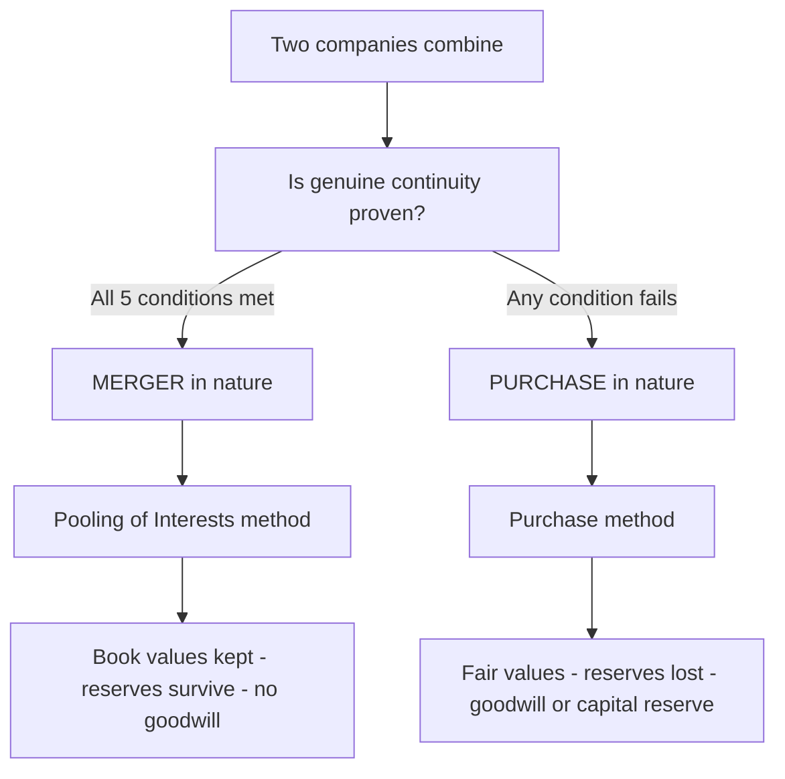
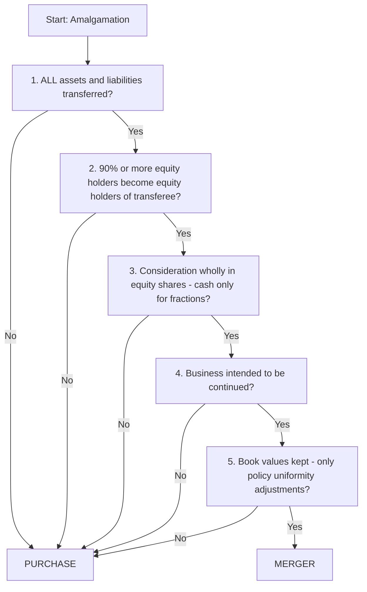
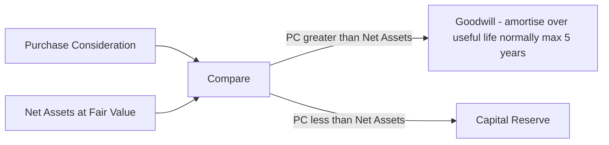
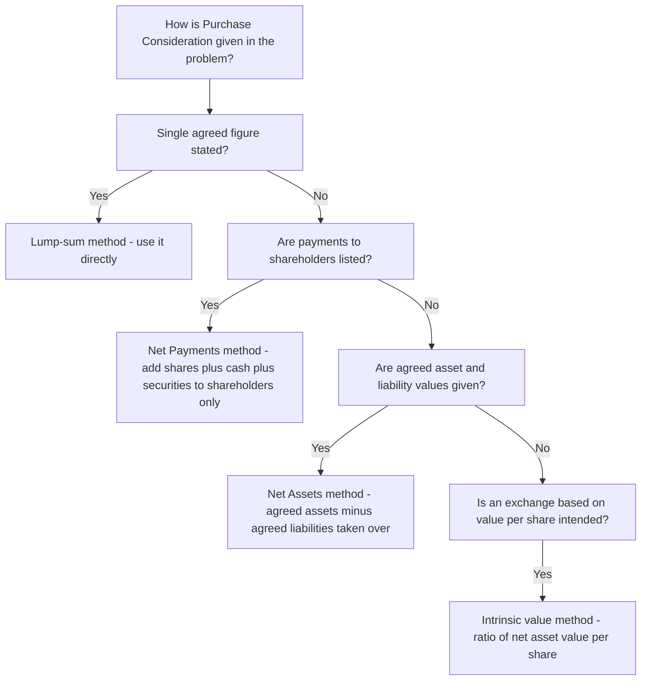

<!-- v2-deep -->

# Chapter 14 — AS 14: Accounting for Amalgamations

## 1. The Problem

Two companies decide to become one. Maybe a strong company is swallowing a weak one; maybe two equals are combining to fight a bigger rival; maybe a family group is collapsing three sister companies into a single legal shell to save costs. Whatever the story, at some instant the assets, liabilities, reserves, and shareholders of one company (the **transferor**) vanish from the map and reappear inside another company (the **transferee**).

Now put on your accountant's hat and ask the awkward question: **at what numbers do those assets and liabilities land inside the transferee's books?**

You have two candidate answers, and they lead to wildly different financial statements:

- **Answer A — carry them at the transferor's old book values.** Land shown at ₹10 lakh in the transferor stays ₹10 lakh in the transferee, even though it is "really" worth ₹90 lakh today. Nothing is revalued. The two companies' balance sheets are simply stacked on top of each other.
- **Answer B — record them at fair value / at what the transferee actually paid.** The transferee handed over shares or cash worth, say, ₹150 lakh to acquire a business whose net book value was only ₹100 lakh. So the assets come in at revalued amounts, and the ₹50 lakh premium becomes **goodwill**.

Here is why this is not a trivia question. The choice controls:

- Whether **hidden gains get recognised** (revaluation) or stay buried (book value).
- Whether **goodwill** appears on the balance sheet (and later drags down profits through amortisation).
- What happens to the transferor's **reserves** — do the old General Reserve, Statutory Reserve, and even the Profit & Loss balance survive intact into the new entity, or do they get wiped out and replaced by a single fresh figure?
- Whether shareholders who were "owners" yesterday are treated as **continuing owners** today, or as people who **sold out** to a buyer.

If every company were free to pick Answer A or Answer B at will, a struggling group could manufacture profits, hide goodwill, or resurrect reserves to pay dividends they never earned. So we need a **rule that decides which answer applies, and when** — and, crucially, a rule whose trigger cannot be gamed. That rule is **AS 14, Accounting for Amalgamations.**

A subtle extra wrinkle that the exam loves: the *same* combination can be a merger or a purchase depending on facts the parties choose — how they pay, whether they revalue, whether they keep all assets. AS 14 does not ask "what did you call it in the scheme?"; it asks "what did you actually *do*?" The method is a **consequence** of the deal's mechanics, not a **label** the drafters attach. Grasping that inversion (facts → method, never label → method) is the single most valuable thing in this chapter.

## 2. The Core Idea (analogy)

Think of two ways two people can start living in one house.

**The marriage of equals (a true merger).** Two people pool everything — bank accounts, furniture, debts, memories. Nobody "bought out" the other. The combined household simply lists everything each partner brought at the price it was originally recorded at. Old savings jars keep their labels: "holiday fund", "emergency fund". Nothing is repriced; nothing is created out of thin air. This is the **pooling of interests** method — you *add the two books together, line by line, at existing values.*

**The acquisition (a purchase).** One person buys the other's entire estate for an agreed price and moves it into their house. Now the buyer records each item at *what it was worth on the day of purchase*, and if they paid more than the fair value of the stuff received, the extra is "the price of the relationship" — **goodwill**. The seller's private savings jars are gone; they were cashed out. This is the **purchase method** — *revalue what you bought, and book goodwill or capital reserve on the difference.*

AS 14 says: **the accounting must match the economic reality.** If the combination is genuinely a marriage of equals — the businesses continue, the owners continue, nothing is really being *bought* — use pooling. If in substance one entity is *acquiring* another, use purchase. The genius (and the exam trap) of AS 14 is that it does not let you *declare* which one it is. It gives you **five hard conditions**; meet all five and it *is* a merger; fail even one and it *is* a purchase. The label follows the facts.

Push the analogy one step further, because the exam pushes it too. In the marriage, the couple's **combined reserves** — the labelled savings jars — matter, because they are still the couple's own money; they carry forward. In the purchase, the buyer does not care what the seller *called* their savings; the buyer simply paid a lump sum, and whatever the seller had internally saved is irrelevant to the buyer's books. That is exactly why **reserves survive under pooling but die under purchase**: in one case the money is still the same people's; in the other it has been cashed out and replaced by a single agreed price. Memorising this "whose money is it now?" test lets you reason out the reserve treatment even if you forget the formal rule.

## 3. Why It's Built This Way

Why not let management choose the method? Because the method is worth real money, and unconstrained choice invites abuse. Pooling lets you keep distributable reserves alive and avoids goodwill amortisation (flattering future profit); purchase lets you step up asset values and recognise goodwill (useful in other situations). A free choice is a licence to shape earnings.

So AS 14 anchors the choice in a single economic idea: **has ownership and the business genuinely continued, or has one entity effectively been sold?**

- If the **same shareholders** end up owning the **same combined business**, run substantially the **same way**, nothing was really bought or sold. It is a change of legal wrapper only. Recognising goodwill or revaluing assets would be inventing gains where no transaction with an outsider occurred. Hence **pooling** — preserve everything at book value, preserve the reserves, because economically nothing changed hands.
- If the transferor's shareholders are **cashed out**, or the assets are **repriced**, or the business is **not continued** — then a genuine *acquisition* happened. An acquirer paid a price; that price is evidence of fair value; the difference over net assets acquired is genuinely goodwill. Hence **purchase**.

The five conditions are simply the **observable fingerprints** of "true continuity." Each condition rules out one specific way the combination could really be a disguised sale. Meet them all and continuity is proven beyond doubt. That is why AS 14 is built as a *test*, not a *choice* — it converts a fuzzy economic question ("is this really a merger?") into five checkable yes/no facts.

**Why exactly five, and why "all-or-nothing"?** Each condition closes one escape hatch, and the hatches are independent — closing four still leaves the fifth open for abuse. If AS 14 accepted "four out of five," a company could, say, meet everything except book values (condition 5) and quietly step up its land — smuggling a revaluation gain into what it *calls* a merger. The conjunctive "AND" (all five) is what makes the test tamper-proof. There is deliberately no scoring, no "substantially a merger", no auditor judgement to lean on: the standard trades away flexibility to buy **objectivity**. That design choice is itself examinable — you may be asked *why* a single failed condition forces purchase treatment, and the answer is "because any single open hatch reintroduces the manipulation the standard exists to prevent."

**Why does the *nature* drive the *method*, rather than the reverse?** A weaker standard could let firms pick pooling and then reverse-engineer the facts. AS 14 blocks this by making the *facts* (how you paid, what you transferred, whether you revalued) the primary observable, and the method a mechanical output. You cannot choose pooling and then pay cash; the moment you pay cash you have *chosen purchase*, whatever the scheme document says.


*The entire standard in one picture: the nature of the amalgamation dictates the method, and the method dictates the numbers.*

## 4. Full Technical Content (RMPD lens)

### 4.1 Scope and key definitions

**AS 14 applies to amalgamations** — including those in the nature of *mergers* — and to the resulting treatment of goodwill/reserves in the transferee's financial statements. It applies to companies (it uses the language of the Companies Act). It does **not** deal with:

- Acquisition of shares where the acquired company **continues its separate legal existence** (that is a parent-subsidiary situation → consolidation, not amalgamation).
- Absorption/reconstruction is covered in substance, but note the standard's own vocabulary below.

**A vocabulary map examiners assume you already know (these are commercial terms, not extra AS 14 definitions):**

- **Amalgamation (generic)** — two or more companies combine; at least one is wound up and its business vests in another. Under AS 14 this splits into merger-type and purchase-type.
- **Absorption** — an *existing* company takes over one or more existing companies; no new company is formed (e.g. B Ltd absorbs A Ltd). Accounting-wise, absorption is just an amalgamation and follows AS 14's two-method logic.
- **External reconstruction** — a *new* company is floated specifically to take over a loss-making existing company (whose accumulated losses are then written off); this is an amalgamation **in the nature of purchase** by design.
- **Internal reconstruction** — the company reorganises its own capital/reserves *without* any new legal entity; **outside the scope of AS 14** (governed by capital-reduction provisions instead). Do not confuse the two "reconstructions".

**Definitions you must state exactly (examiners test the wording):**

| Term | AS 14 meaning |
|---|---|
| **Amalgamation** | An amalgamation pursuant to the provisions of the Companies Act or any other applicable statute. |
| **Transferor company** | The company which is amalgamated *into* another company (the one that ceases to exist). |
| **Transferee company** | The company *into which* the transferor is amalgamated (the surviving/new company). |
| **Reserve** | The portion of earnings, receipts, or other surplus **not** intended to meet any liability, contingency, commitment, or diminution in value of assets. |
| **Consideration** | The **aggregate of shares and other securities issued and payment made in cash or other assets** by the transferee to the shareholders of the transferor. |
| **Fair value** | The amount for which an asset could be exchanged between a knowledgeable, willing buyer and a knowledgeable, willing seller in an arm's length transaction. |

Two **critical nuances** in the *consideration* definition that examiners weaponise:

1. Consideration is what is paid to **shareholders**, **not** the payment to debenture-holders or the settlement of the transferor's liabilities. Discharging debentures or creditors is *not* part of purchase consideration.
2. Any **assets/liabilities taken over but not part of the deal price** (e.g. cash retained to pay off outsiders) are handled separately.

**A third nuance that trips up strong students:** the definition says consideration is what is paid *by the transferee to the shareholders*. If the transferee **already owns some shares** in the transferor (a pre-existing holding), no consideration is paid *to itself* for those — consideration covers only the shares held by *outside* shareholders. This inter-company holding wrinkle appears in absorption problems and is examined in Example 6.

### 4.2 The two categories — and the five conditions

AS 14 recognises exactly **two** types:

- **Amalgamation in the nature of merger** — a genuine pooling of two entities.
- **Amalgamation in the nature of purchase** — everything that is not a merger.

An amalgamation is **in the nature of merger** if and only if **ALL FIVE** of the following conditions are satisfied:

| # | Condition | Plain-English test | Which "disguised sale" it rules out |
|---|---|---|---|
| 1 | **All assets and liabilities** of the transferor become, after amalgamation, the assets and liabilities of the transferee. | Nothing is left behind or cherry-picked. | Rules out "buy only the good bits" — an acquirer picks assets; a merger takes everything. |
| 2 | **Shareholders holding ≥ 90% of the face value of equity shares** of the transferor (other than shares already held by the transferee or its subsidiaries/nominees) become **equity shareholders of the transferee**. | The old owners overwhelmingly become new owners. | Rules out owners being cashed out — proves ownership continuity. |
| 3 | The **consideration** to those equity shareholders is discharged **wholly by issue of equity shares** in the transferee (cash only for fractional shares). | Owners get shares, not money. | Rules out a purchase-for-cash — you can't "sell" if you only receive shares. |
| 4 | The **business** of the transferor is **intended to be carried on** by the transferee. | The business continues, not liquidated. | Rules out asset-stripping / winding down. |
| 5 | **No adjustment** is intended to the **book values** of the assets and liabilities of the transferor, except to achieve **uniformity of accounting policies**. | Values are carried as-is (only policy alignment allowed). | Rules out revaluation — a purchaser steps values up; a merger keeps them. |

**If even one condition fails, the amalgamation is in the nature of PURCHASE.** There is no third category, no "mostly merger."

**Reading each condition like the examiner does:**

- **Condition 2 — the "90%" is subtle three ways.** (a) It is measured on **face (nominal) value** of equity shares, not market value and not number of shareholders — a single 92%-holder passing is a *yes* even if 500 tiny holders dissent. (b) It **excludes shares already held by the transferee or its subsidiaries/nominees** from *both* numerator and the base, because the transferee cannot "become its own new shareholder." (c) It concerns **equity** shares only — preference shareholders are irrelevant to this count.
- **Condition 3 — "cash only for fractional shares."** A merger allows a tiny cash payment purely to avoid issuing fractional shares (e.g. an exchange ratio of 3 shares for 7 leaves stubs). Any cash paid to buy out *whole* holdings — dissenters, a class of shareholders — instantly breaks condition 3.
- **Condition 4 — "intended to be carried on."** Note the word *intended*. It is a stated intention at the date of amalgamation; a later, genuinely unforeseen discontinuance does not retrospectively convert a merger into a purchase.
- **Condition 5 — "except uniformity of accounting policies."** This is the *only* permitted book-value adjustment under a merger, and even then the adjustment is routed **through reserves**, never through profit or through goodwill. Example: transferor carried inventory on FIFO, transferee on weighted-average — aligning the two is allowed and the difference hits reserves.


*A single failed gate drops you into PURCHASE. All five must be YES for MERGER.*

### 4.3 Method 1 — Pooling of Interests (used ONLY for a merger)

**Recognition & Measurement.** The transferee records the transferor's assets, liabilities, and **reserves** at their **existing carrying amounts (book values)**. The two balance sheets are combined as if the businesses had always been one.

Key mechanics:

- **Assets and liabilities** — carried at book value (adjust only for uniform accounting policies; such adjustment goes through reserves).
- **Reserves survive.** *All* reserves of the transferor — General Reserve, Capital Reserve, Statutory Reserves (e.g. Development Rebate Reserve, Investment Allowance Reserve, Export Profit Reserve), and the **Profit & Loss (surplus)** balance — appear in the transferee's balance sheet, retaining their **identity and character**. Statutory reserves keep their statutory status (no special "Amalgamation Adjustment" gymnastics — that device belongs to the purchase method).
- **No goodwill and no capital reserve arise** from the amalgamation itself.
- **The balancing figure goes to reserves.** The difference between (a) the amount recorded as **share capital issued** (plus any cash consideration) and (b) the **share capital of the transferor** is adjusted **in reserves** — it is *not* goodwill. If consideration exceeds transferor's capital, reserves are reduced; if less, reserves increase.

Why book value? Because in a genuine merger nothing was bought from an outsider, so there is no market price to justify writing values up, and no premium to call goodwill.

**The precise pooling adjustment (state it this way in the exam).** The amount to be adjusted in reserves equals:

> Reserve adjustment = (Equity **share capital issued** + cash paid for fractions) − (Equity **share capital of the transferor** taken over).

If that number is **positive** (you issued *more* capital than the transferor's capital), reserves are **reduced** by it. If **negative**, reserves are **increased**. Conceptually, total combined net assets are fixed at book value; if you crystallise more of that into "share capital", less remains as "reserves", and vice versa. The combined figure never changes — pooling only reshuffles the *labels* between capital and reserves, and never creates or destroys value.

**Order of hitting reserves.** When the adjustment reduces reserves, ICAI practice is to first debit any **Capital Reserve / free reserves** and then revenue reserves; statutory reserves are *not* touched (they must survive by law). In most exam problems a single "General Reserve" line absorbs the adjustment — but if the transferor has capital vs revenue reserves and the point is being tested, reduce the free reserves and preserve statutory ones.

### 4.4 Method 2 — Purchase Method (used for a purchase)

**Recognition & Measurement.** The transferee records the assets and liabilities acquired either at their **existing carrying amounts**, or — more commonly and more correctly — at **fair values** as at the date of amalgamation. It records *only the assets and liabilities acquired*, not the reserves.

Key mechanics:

- **Reserves do NOT carry over.** The transferor's General Reserve and P&L balance are **not** brought in — the shareholders "sold" their business, so their accumulated reserves are extinguished. **Exception — statutory reserves:** where a statutory reserve must be maintained for a period (e.g. Investment Allowance Reserve, Development Allowance Reserve), it is retained by *debiting* a fictitious asset **"Amalgamation Adjustment Reserve"** (shown on the assets side / as a negative reserve) and crediting the statutory reserve — so the legal requirement survives without the reserve being distributable. When the statutory need lapses, both are reversed.

> Note: Per the Companies Act 2013 Schedule III / the revised AS 14, the debit is now titled **"Amalgamation Adjustment Reserve"** and presented **under Reserves and Surplus as a negative figure** (older texts show it as a miscellaneous asset). Confirm the exact presentation label required in your ICAI study material.

- **Goodwill or Capital Reserve arises.** Compare the **purchase consideration** with the **net assets acquired at fair value** (fair value of assets minus fair value of liabilities taken over):

| Situation | Result |
|---|---|
| Consideration **>** net assets acquired | Excess = **Goodwill** (asset) |
| Consideration **<** net assets acquired | Deficit = **Capital Reserve** |

- **Goodwill amortisation.** Goodwill arising on amalgamation should be **amortised over its useful life; normally this should not exceed 5 years unless a longer period can be justified.** (AS 14 sets the 5-year presumption; contrast with AS 26 which applies to purchased goodwill generally.)

**Why goodwill is amortised (not left standing) and why "normally 5 years".** Goodwill on amalgamation reflects things like the transferor's assembled workforce, customer relationships and reputation — assets that *fade* unless continually renewed by fresh spending, which itself is expensed. Leaving purchased goodwill on the books forever would let a firm claim a wasting benefit as if permanent. AS 14 therefore mandates systematic write-off and, because the *specific* goodwill acquired in a merger dissipates quickly as it blends into the acquirer's own operations, presumes a short **5-year** horizon unless a longer useful life can be positively justified. Compare AS 26's general upper limit of **10 years** for other intangibles/goodwill — quoting the wrong ceiling in an AS 14 answer loses marks.

**One more purchase-method subtlety — where the *revaluation difference* goes.** When you step assets up to fair value under purchase, that step-up does **not** create a revaluation reserve or a profit in the transferee's books; it is simply the value at which the asset is *initially recognised*. The whole effect of fair-valuing is absorbed inside the single goodwill/capital-reserve balancing figure. There is no separate "revaluation gain" line.


*Purchase method: the balancing difference is goodwill or capital reserve — never a hit to General Reserve.*

### 4.5 Calculating Purchase Consideration

Consideration = **shares + securities + cash/other assets given to the transferor's SHAREHOLDERS**. There are two common approaches examiners expect you to distinguish:

| Method | How it works | When used |
|---|---|---|
| **Net Assets method** | PC = Agreed value of assets **taken over** − Agreed value of liabilities **taken over**. (Only items *taken over* at *agreed* values; ignore items not assumed.) | When the problem gives asset/liability agreed values but not a direct share exchange figure. |
| **Net Payments method** | PC = Total of all payments (in shares, cash, other securities) made to shareholders, at the values agreed. | When the problem lists what is paid to shareholders. Do **not** include payments to debenture-holders/creditors. |

Two further methods you should be able to name and use, because ICAI problems slip them in:

- **Lump-sum method** — the scheme simply states a single agreed consideration figure (e.g. "H Ltd will pay ₹25,00,000"). Nothing to compute; use it directly.
- **Intrinsic-value (share-exchange-ratio) method** — the consideration is expressed as a *ratio* of shares derived from the **intrinsic (net-asset) value per share** of each company. Exchange ratio = (intrinsic value per share of transferor) ÷ (intrinsic value per share of transferee). Multiply by the transferor's number of shares to get the number of transferee shares issued, then value them. This is examined in Example 5.

**A recurring point of confusion — Net Assets method for PC vs. "net assets acquired" for goodwill.** They look identical but serve different masters and can use *different* values:

- **PC by Net Assets method** uses the values **agreed for the shareholders** — sometimes a negotiated figure that ignores certain items.
- **Net assets acquired** (the goodwill comparison base) uses the **fair values actually recorded** for assets and liabilities taken over.

When the "agreed values" and the "recorded fair values" coincide *and* all assets/liabilities are taken over, the two computations give the same number and **no goodwill/capital reserve arises** — a neat internal check. When the problem deliberately makes them differ, goodwill or capital reserve emerges. Recognising *which* number you are computing at each step prevents the classic circular error.

**Traps in the computation:**

- **Do not** include payments to debenture-holders or the taking-over of creditors in PC — those are liabilities settled, not consideration to owners.
- Under the **net assets method**, "assets taken over" excludes **fictitious assets** (e.g. preliminary expenses, discount on issue, debit balance of P&L) and excludes assets *not* taken over; existing "goodwill" in transferor's books is only included if specifically taken over.
- Shares issued by the transferee are recorded at their **agreed value / issue price** (which may include a securities premium).
- **Preference shareholders' consideration** is included in PC only if the preference shareholders are being settled *as owners* under the scheme (they usually are) — but keep their consideration separate from equity for testing condition 3, which concerns *equity* only.


*Pick the PC method from what the question hands you — never mix the inputs of two methods.*

### 4.6 Journal entries (in the transferee's books)

Under the **purchase method** (fair values):

```
1. Business Purchase A/c            Dr.
        To Liquidator of Transferor Co.        (Purchase Consideration)

2. Assets A/c (individual, at fair value)   Dr.
   Goodwill A/c (balancing, if any)         Dr.
        To Liabilities A/c (individual, at fair value)
        To Business Purchase A/c
        To Capital Reserve A/c (balancing, if any)

3. Liquidator of Transferor Co.     Dr.
        To Equity Share Capital A/c
        To Securities Premium A/c (if shares issued at premium)
        To Bank A/c (cash component)

4. (Settlement of debentures / liabilities not part of PC, expenses of amalgamation, etc.)
```

Under **pooling of interests**, the entries are conceptually similar but assets, liabilities **and reserves** are recorded at **book value**, and the balancing difference goes to **reserves** (not goodwill/capital reserve):

```
1. Business Purchase A/c            Dr.  (= consideration, wholly in equity shares)
        To Liquidator of Transferor Co.

2. Assets A/c (individual, at BOOK value)     Dr.
        To Liabilities A/c (individual, at BOOK value)
        To Reserves A/c (individual - General, Statutory, P&L - at BOOK value)
        To Business Purchase A/c
   (Any balancing difference is ADJUSTED IN RESERVES - debit or credit reserves - never goodwill.)

3. Liquidator of Transferor Co.     Dr.
        To Equity Share Capital A/c
        To Bank A/c (cash for fractions only)
```

**Entries in the transferor's / vendor company's books (Realisation route)** are sometimes asked too. In brief: open a **Realisation A/c**, transfer assets (Dr Realisation, Cr Assets at book value) and liabilities (Dr Liabilities, Cr Realisation); credit Realisation with the **purchase consideration receivable** (Dr Transferee Co.); record receipt of consideration (Dr Shares/Bank, Cr Transferee Co.); and distribute among shareholders after closing the Realisation profit/loss to shareholders. The exam more often asks the **transferee's** books, but know the transferor side exists.

### 4.7 Special items and finer distinctions

- **Statutory reserves** — carried over via *Amalgamation Adjustment Reserve* under the purchase method (explained above); carried over *naturally* under pooling.
- **Amalgamation expenses** — costs of effecting the amalgamation (legal, stamp, professional fees, etc.) incurred by the transferee are **charged to the P&L / expensed**, not capitalised into goodwill and not added to the cost of the acquisition.
- **Consideration held in suspense / contingent consideration.** If part of the consideration depends on a future event (e.g. extra shares if profits reach a target), AS 14 requires the *additional* consideration to be recognised when the contingency is resolved and payment is probable and reasonably estimable, adjusting goodwill/capital reserve accordingly.
- **Inter-company owings (mutual debts).** If the transferee owed the transferor (or vice versa) before amalgamation, after the combination the debt is owed by the company to itself and **cancels out** — eliminate the inter-company debtor against the inter-company creditor. Forgetting this double-counts assets and liabilities in the post-amalgamation balance sheet.
- **Unrealised profit in stock.** If one company sold goods to the other at a profit and some remain unsold at the date of amalgamation, the **unrealised profit** loaded into that stock should be eliminated (reduce stock and reduce reserves/goodwill appropriately) so the combined entity does not carry inflated inventory.
- **Cross / mutual shareholdings.** If the transferee already holds shares in the transferor, consideration is paid only for the **outside** shareholders' shares; the transferee's own holding is cancelled against the corresponding share capital taken over (this can change the goodwill/capital-reserve figure). See Example 6.
- **Dissenting shareholders bought out for cash.** The moment *whole* holdings (not fractions) are settled in cash, condition 3 fails and the deal becomes a **purchase** — even if 96% took shares.
- **Preference shares.** Preference shareholders are usually discharged by issuing preference shares (or cash) in the transferee; this forms part of purchase consideration but is *excluded* from the equity-share tests in conditions 2 and 3.
- **Debentures.** The transferor's debenture-holders are creditors, not owners; they are typically satisfied by issuing new debentures in the transferee. This settlement is **outside** purchase consideration and does not enter the goodwill computation as "consideration" — though the debentures taken over *are* a liability reducing net assets acquired.

## 5. Worked Examples

### Example 1 — Classify the amalgamation (easy)

*A Ltd amalgamates into B Ltd. All assets and liabilities of A are taken over. 96% of A's equity shareholders receive equity shares of B; the remaining 4% (dissenting) are paid cash. B intends to continue A's business and carries A's assets at their old book values.*

**Test each condition:**

| Condition | Met? | Reason |
|---|---|---|
| 1 All A&L transferred | Yes | "All assets and liabilities taken over." |
| 2 ≥90% equity holders become equity holders | Yes | 96% ≥ 90%. |
| 3 Consideration wholly in equity shares | **No** | The 4% dissenters are paid **cash** — this is *not* payment for fractional shares, it is buying out real shareholders. |
| 4 Business continued | Yes | Stated. |
| 5 Book values retained | Yes | Stated. |

**Conclusion:** Condition 3 fails → **amalgamation in the nature of PURCHASE** → **purchase method**. 

*Teaching point:* condition 2 counts *how many* become shareholders (90% is fine); condition 3 asks *how the rest are paid*. Paying cash to the 4% (beyond fractions) breaks condition 3 even though condition 2 passes. This "90% vs 100%" split is the single most common misread.

### Example 2 — Pooling of interests, reserves survive (moderate)

*P Ltd and Q Ltd merge (all five conditions met) to form the continuing entity P Ltd. Summarised book values of Q Ltd:*

| Q Ltd | ₹ |
|---|---|
| Equity Share Capital (₹10 each) | 5,00,000 |
| General Reserve | 2,00,000 |
| Profit & Loss (surplus) | 1,00,000 |
| Sundry Liabilities | 3,00,000 |
| **Total** | **11,00,000** |
| Sundry Assets | 11,00,000 |

*P Ltd issues 55,000 equity shares of ₹10 each (i.e. ₹5,50,000) to Q's shareholders.*

**Because it is a merger → pooling → book values, reserves survive.**

Step 1 — Record Q's assets and liabilities at **book value**: Assets ₹11,00,000; Liabilities ₹3,00,000; net assets ₹8,00,000.

Step 2 — Reserves carried over: General Reserve ₹2,00,000 and P&L ₹1,00,000 appear in P's balance sheet, retaining identity.

Step 3 — Balancing adjustment in **reserves**:

| Item | ₹ |
|---|---|
| Share capital **issued** by P | 5,50,000 |
| Less: Share capital of Q | 5,00,000 |
| Excess of capital issued over capital of transferor | 50,000 |

Under pooling, this ₹50,000 excess is **adjusted against reserves** (reduces reserves), *not* recorded as goodwill. So the reserves brought in (₹3,00,000) are reduced by ₹50,000.

Step 4 — Reconcile:

| Credits recorded | ₹ | Debits recorded | ₹ |
|---|---|---|---|
| Liabilities | 3,00,000 | Assets | 11,00,000 |
| Equity Share Capital issued | 5,50,000 | | |
| General Reserve | 2,00,000 | | |
| P&L | 1,00,000 | | |
| *less* adjustment to reserves | (50,000) | | |
| **Total** | **11,00,000** | **Total** | **11,00,000** |

Books balance. **No goodwill appears**, and Q's reserves live on inside P (net of the ₹50,000 capital adjustment). Exactly the "marriage of equals" outcome.

*Examiner tweak — "what if P had issued only 45,000 shares (₹4,50,000)?"* Then capital issued (₹4,50,000) is *less* than Q's capital (₹5,00,000) by ₹50,000, so reserves would **increase** by ₹50,000 (to ₹3,50,000). Same mechanics, opposite sign — proof that pooling only relabels between capital and reserves, never touching total net assets of ₹8,00,000.

### Example 3 — Purchase method with goodwill AND capital reserve contrast (exam-hard)

*S Ltd is amalgamated into H Ltd. The amalgamation is in the nature of purchase. Book values and agreed (fair) values of S Ltd:*

| S Ltd | Book ₹ | Fair value ₹ |
|---|---|---|
| Land & Building | 4,00,000 | 6,00,000 |
| Plant & Machinery | 3,00,000 | 2,50,000 |
| Inventory | 2,00,000 | 1,80,000 |
| Debtors | 1,50,000 | 1,50,000 |
| Preliminary Expenses (fictitious) | 50,000 | — |
| **Total assets** | **11,00,000** | **11,80,000** (excl. fictitious) |
| Creditors | 2,00,000 | 2,00,000 |
| 10% Debentures | 1,00,000 | 1,00,000 |
| Equity Share Capital (₹10) | 5,00,000 | |
| Reserves | 3,00,000 | |

*H Ltd agrees to take over all assets (except preliminary expenses) and all liabilities. Purchase consideration: H issues 60,000 equity shares of ₹10 each at ₹12 per share to S's shareholders. Debentures of S are discharged by H issuing 12% debentures of equal amount.*

**Step 1 — Purchase Consideration (to shareholders only).**
PC = 60,000 shares × ₹12 = **₹7,20,000** (recorded as ₹6,00,000 share capital + ₹1,20,000 securities premium).
*Note:* the debenture discharge (₹1,00,000 via new debentures) is **NOT** part of PC — debenture-holders are not shareholders.

**Step 2 — Net assets acquired at fair value.**

| Assets taken over (fair value) | ₹ |
|---|---|
| Land & Building | 6,00,000 |
| Plant & Machinery | 2,50,000 |
| Inventory | 1,80,000 |
| Debtors | 1,50,000 |
| **Total assets** | **11,80,000** |
| *Preliminary expenses (fictitious) — excluded* | — |

| Liabilities taken over (fair value) | ₹ |
|---|---|
| Creditors | 2,00,000 |
| 10% Debentures | 1,00,000 |
| **Total liabilities** | **3,00,000** |

Net assets acquired = 11,80,000 − 3,00,000 = **₹8,80,000**.

**Step 3 — Goodwill or Capital Reserve.**

| | ₹ |
|---|---|
| Purchase Consideration | 7,20,000 |
| Net assets acquired (fair value) | 8,80,000 |
| PC **<** Net assets → **Capital Reserve** | **1,60,000** |

Since H paid ₹7,20,000 for net assets worth ₹8,80,000, it got a bargain → **Capital Reserve ₹1,60,000**. *No goodwill.*

**Step 4 — Journal entries in H Ltd's books.**

```
(1) Business Purchase A/c                 Dr. 7,20,000
        To Liquidator of S Ltd                     7,20,000

(2) Land & Building A/c                    Dr. 6,00,000
    Plant & Machinery A/c                  Dr. 2,50,000
    Inventory A/c                          Dr. 1,80,000
    Debtors A/c                            Dr. 1,50,000
        To Creditors A/c                           2,00,000
        To 10% Debentures A/c                       1,00,000
        To Business Purchase A/c                    7,20,000
        To Capital Reserve A/c                      1,60,000

(3) Liquidator of S Ltd                    Dr. 7,20,000
        To Equity Share Capital A/c                6,00,000
        To Securities Premium A/c                  1,20,000

(4) 10% Debentures A/c                     Dr. 1,00,000
        To 12% Debentures A/c                      1,00,000
```

**Step 5 — Reconcile entry (2):**

| Debits | ₹ | Credits | ₹ |
|---|---|---|---|
| Assets | 11,80,000 | Creditors | 2,00,000 |
| | | Debentures | 1,00,000 |
| | | Business Purchase | 7,20,000 |
| | | Capital Reserve | 1,60,000 |
| **Total** | **11,80,000** | **Total** | **11,80,000** |

Balances perfectly.

**Now flip one number to see goodwill.** Suppose instead PC were 90,000 shares × ₹12 = ₹10,80,000. Then PC ₹10,80,000 − net assets ₹8,80,000 = **Goodwill ₹2,00,000** (asset), to be **amortised over its useful life, normally not exceeding 5 years** → roughly ₹40,000 p.a. This shows the *single comparison* that decides goodwill vs capital reserve.

**Contrast with pooling:** had this been a *merger*, H would have (a) recorded assets at **book value** (Land ₹4,00,000, not ₹6,00,000), (b) brought in S's **Reserves ₹3,00,000**, (c) recognised **no goodwill/capital reserve**, and (d) pushed the capital difference through reserves. Same deal, radically different balance sheet — which is precisely why AS 14 forbids you from choosing.

### Example 4 — Statutory reserve under purchase + Amalgamation Adjustment Reserve (exam-hard)

*T Ltd is amalgamated into U Ltd in the nature of purchase. Among T's reserves is an* **Investment Allowance Reserve of ₹80,000** *that must, by statute, be maintained for a further 3 years. The scheme requires U Ltd to continue this statutory reserve. U Ltd computes goodwill of ₹5,00,000 on the amalgamation (unrelated to the statutory reserve).*

**The problem:** under purchase, T's reserves normally vanish. But the law forces the Investment Allowance Reserve to survive for 3 more years. How do you keep a reserve alive without inventing free reserves that could be distributed as dividend?

**The device — Amalgamation Adjustment Reserve.** U Ltd records:

```
Amalgamation Adjustment Reserve A/c   Dr. 80,000
        To Investment Allowance Reserve A/c        80,000
```

- The **Investment Allowance Reserve (credit)** now appears under Reserves and Surplus, satisfying the statute.
- The **Amalgamation Adjustment Reserve (debit)** is shown as a **negative figure under Reserves and Surplus** (older texts: a fictitious asset). It *offsets* the statutory reserve, so **net distributable reserves are unchanged** — you have not created any real, dividend-able surplus. The two lines net to zero economically; only the *label* keeps the statutory reserve legally present.

**When the statutory period lapses** (after 3 years), reverse the entry:

```
Investment Allowance Reserve A/c      Dr. 80,000
        To Amalgamation Adjustment Reserve A/c     80,000
```

Both disappear together. 

*Teaching point / trap:* the Amalgamation Adjustment Reserve arises **only** under the **purchase** method and **only** for **statutory** reserves that must be maintained. It never appears in pooling (there, all reserves survive naturally, including statutory ones, with no offset). Writing "Amalgamation Adjustment Reserve" in a pooling answer, or using it for an ordinary General Reserve, is wrong. Note also it is **independent of goodwill** — the ₹5,00,000 goodwill and the ₹80,000 device are two separate mechanics in the same problem.

### Example 5 — Purchase consideration by intrinsic-value / exchange-ratio method (exam-hard)

*V Ltd (transferee) absorbs W Ltd. Consideration is to be discharged wholly in equity shares of V Ltd, based on the intrinsic (net asset) value per share of each company. Data:*

| | V Ltd | W Ltd |
|---|---|---|
| Net assets (for valuation) | ₹48,00,000 | ₹18,00,000 |
| Number of equity shares | 2,00,000 | 1,00,000 |

**Step 1 — Intrinsic value per share.**
- V Ltd: ₹48,00,000 ÷ 2,00,000 = **₹24 per share**.
- W Ltd: ₹18,00,000 ÷ 1,00,000 = **₹18 per share**.

**Step 2 — Exchange ratio.**
Shares of V per share of W = intrinsic value of W ÷ intrinsic value of V = 18 ÷ 24 = **3 : 4** (i.e. 3 shares of V for every 4 shares of W).

**Step 3 — Number of V shares issued.**
W has 1,00,000 shares × (3/4) = **75,000 equity shares of V Ltd**.

**Step 4 — Value of purchase consideration.**
75,000 shares × intrinsic value ₹24 = **₹18,00,000**.

**Self-check:** PC (₹18,00,000) exactly equals W's net asset value used for valuation (₹18,00,000). This is expected — when consideration is set *by* net-asset value and issued *at* net-asset value, PC equals net assets and (in a purchase) **no goodwill or capital reserve arises**. If V's shares had a face value of ₹10, the ₹18,00,000 splits into Share Capital ₹7,50,000 (75,000 × ₹10) and Securities Premium ₹10,50,000 (75,000 × ₹14). 

*Examiner tweak:* if the exchange ratio produced fractions (say 1,00,000 × 3/7), the leftover fractional entitlements would be settled in **cash** — and because that cash is *only for fractions*, condition 3 is **not** breached; the deal can still be a merger.

### Example 6 — Absorption with pre-existing (mutual) shareholding (exam-hard)

*X Ltd absorbs Y Ltd (purchase method). Before the amalgamation, X Ltd already holds 20% of Y Ltd's equity shares, which it bought earlier for ₹1,50,000 (shown as Investment in X's books). Y Ltd's equity capital is 1,00,000 shares of ₹10 each; net assets of Y at fair value are ₹14,00,000. X will issue its own ₹10 shares at ₹15 to the* **outside** *(80%) shareholders of Y, in the ratio of 1 X-share for every 2 Y-shares.*

**Step 1 — Shares held by outsiders.**
Outsiders hold 80% × 1,00,000 = **80,000 Y shares**. X's own 20,000 shares are *not* paid consideration (X can't pay itself).

**Step 2 — Purchase consideration (to outside shareholders only).**
X issues 1 share per 2 Y-shares: 80,000 ÷ 2 = **40,000 X shares × ₹15 = ₹6,00,000** (Share Capital ₹4,00,000 + Securities Premium ₹2,00,000).

**Step 3 — Goodwill / Capital Reserve.** Here you must account for *both* the consideration paid **and** the investment cancelled:

| | ₹ |
|---|---|
| Purchase consideration (to outsiders) | 6,00,000 |
| Add: Cost of X's existing 20% investment in Y (cancelled) | 1,50,000 |
| **Total "cost" of acquiring Y's net assets** | **7,50,000** |
| Less: Net assets of Y acquired (fair value) | 14,00,000 |
| **Capital Reserve** (cost < net assets) | **6,50,000** |

**Why add the investment?** X is acquiring 100% of Y's net assets (₹14,00,000). It pays for 80% with new shares (₹6,00,000) and had already paid for 20% earlier (the ₹1,50,000 investment, now cancelled against the shares it represents). The *total* outlay for the whole business is ₹7,50,000; comparing that to ₹14,00,000 net assets gives the balancing **Capital Reserve of ₹6,50,000**.

**Journal (key entries in X's books):**

```
(1) Business Purchase A/c                 Dr. 6,00,000
        To Liquidator of Y Ltd                     6,00,000

(2) Sundry Assets A/c (fair value)        Dr. 14,00,000
        To Sundry Liabilities A/c                   (as per Y)
        To Business Purchase A/c                    6,00,000
        To Investment in Y Ltd A/c                  1,50,000
        To Capital Reserve A/c                      6,50,000
   (net assets 14,00,000 shown gross of liabilities; here Y's net assets are 14,00,000 after liabilities)

(3) Liquidator of Y Ltd                    Dr. 6,00,000
        To Equity Share Capital A/c                4,00,000
        To Securities Premium A/c                  2,00,000
```

*Teaching point / trap:* the pre-existing 20% holding is the classic exam curveball. Two errors to avoid — (a) paying consideration on 100% of Y's shares (double-counting the 20% X already owned), and (b) forgetting to **cancel the Investment** (₹1,50,000) inside the goodwill/capital-reserve computation. Get both right and the "cost of acquisition" is *new consideration + carrying value of old investment*.

## 6. Presentation & Disclosure

**Disclosures for ALL amalgamations (first financial statements after amalgamation):**

- Names and general nature of business of the amalgamating companies.
- **Effective date** of amalgamation for accounting purposes.
- The **method of accounting** used (pooling / purchase).
- Particulars of the **scheme** sanctioned under the statute.

**Additional disclosures — POOLING (merger):**

- Description and **number of shares issued**, plus the percentage of each company's equity shares exchanged to effect the amalgamation.
- The amount of any **difference between the consideration and the value of net identifiable assets acquired**, and the treatment thereof (i.e. adjustment to reserves).

**Additional disclosures — PURCHASE:**

- **Consideration** for the amalgamation and a description of its components (shares, cash, other securities).
- The amount of any **goodwill or capital reserve** arising and the accounting treatment (period of amortisation of goodwill).

**Balance sheet presentation notes:**

- Under Schedule III (Companies Act 2013), goodwill appears under **Non-current assets → Intangible assets**; capital reserve and other reserves under **Reserves and Surplus**.
- **Amalgamation Adjustment Reserve** (statutory reserve device under purchase method) is presented under **Reserves and Surplus as a negative amount**. *(Confirm exact label/placement in current ICAI material — older texts show it on the assets side.)*
- **Disclosure of a scheme differing from AS 14:** if the statutory scheme sanctioned by the Court/Tribunal prescribes a treatment **different** from AS 14, that treatment is followed, but the **fact, the deviation, and the financial effect** must be disclosed.

**Two timing/continuity disclosures examiners like to probe:**

- **Amalgamation after the balance sheet date but before approval of the accounts.** If an amalgamation is effected after the reporting date but before the financial statements are approved, AS 14 requires **disclosure** (it is a non-adjusting post-balance-sheet type event) but the amalgamation is *not* incorporated into those statements — you disclose so users are not misled, without pre-empting next year's books.
- **Change of method / non-fulfilment of conditions later.** If conditions initially assumed to be met are later found unmet, or the treatment departs from the standard, the effect and reasons must be disclosed. Consistency of method is not a free choice; it follows the facts.

## 7. Connections

| Connects to | How |
|---|---|
| **AS 10 / Fixed assets** | Purchase method records PPE at fair value; pooling keeps book value. Revaluation logic overlaps. |
| **AS 26 Intangible Assets** | Governs purchased goodwill generally (amortise, upper limit normally 10 years); AS 14 carves out amalgamation goodwill with its own **5-year** presumption. Quoting AS 26's 10-year ceiling in an AS 14 answer is a classic error. |
| **AS 4 Contingencies & Events After the Balance Sheet Date** | An amalgamation occurring after the reporting date is a non-adjusting event requiring disclosure — the two standards interlock on timing. |
| **AS 21 Consolidated Financial Statements** | If the acquired company **keeps separate existence**, it's a subsidiary → consolidation (AS 21), *not* amalgamation (AS 14). Know the boundary. |
| **Companies Act 2013 (ss. 230–232)** | The legal machinery for schemes of amalgamation/merger that AS 14 accounts for; Tribunal (NCLT) sanction. |
| **Internal vs External Reconstruction** | External reconstruction = a new company takes over an old one (an amalgamation in nature of purchase); internal reconstruction stays within one company and is **outside AS 14**. |
| **Ind AS 103 Business Combinations** | The Ind AS successor. **Contrast:** Ind AS 103 abolishes pooling entirely — *all* business combinations use the **acquisition method** at fair value (except common-control combinations, which use a pooling-like approach). Ind AS 103 also does **not** amortise goodwill (annual impairment testing instead), unlike AS 14's amortisation. AS 14's merger/purchase duality is unique to Indian GAAP. |

## 8. Traps & Examiner Tricks

1. **"90% became shareholders, so it's a merger."** No — condition 2 (≥90% *become* holders) is necessary but not sufficient. Condition 3 still requires the consideration to be **wholly equity shares** (cash only for fractions). Paying cash to a minority breaks condition 3 → purchase. *(Example 1.)*
2. **Counting debenture discharge or creditor settlement in purchase consideration.** PC is **only** what goes to **equity (and, where applicable, preference) shareholders as owners**. Excluding debenture/creditor settlement is worth easy marks; including it is the classic wrong answer.
3. **Including fictitious assets in net assets.** Preliminary expenses, discount on issue, debit balance of P&L are **not** real assets — exclude them when computing net assets taken over (unless the problem explicitly takes them over, which real deals don't).
4. **Bringing reserves into a purchase.** Under purchase, the transferor's General Reserve and P&L **vanish** — do not add them. Only *statutory* reserves survive, via the **Amalgamation Adjustment Reserve**.
5. **Recording goodwill under pooling.** Pooling *never* produces goodwill or capital reserve. The capital difference is adjusted **through reserves**. Writing "Goodwill" in a merger answer is an immediate red flag.
6. **Wrong direction of goodwill vs capital reserve.** PC **>** net assets → **Goodwill**; PC **<** net assets → **Capital Reserve**. Students routinely flip this under time pressure. Anchor it: *paying more than you get = goodwill*.
7. **Fair value vs book value mix-up.** Purchase = fair value; pooling = book value. Using fair values in a merger (or book values in a purchase) corrupts every subsequent number.
8. **Amortisation period.** Goodwill on amalgamation: amortise over useful life, **normally not exceeding 5 years**. Quoting "10 years" (AS 26's general ceiling) here is wrong for the AS 14 presumption.
9. **Securities premium.** When shares are issued **above par** as consideration, split the credit into Share Capital (face) + Securities Premium (excess). Forgetting the premium unbalances the entry.
10. **Scheme overrides AS 14.** If a court/NCLT scheme mandates a treatment contrary to AS 14, you **follow the scheme** but **disclose** the deviation and its effect. Blindly applying AS 14 against an explicit scheme is wrong.
11. **Forgetting inter-company balances and unrealised profit.** If the two companies traded with each other, cancel mutual debtors/creditors and strip unrealised profit from unsold stock **before** presenting the combined balance sheet. Skipping this double-counts assets/liabilities and overstates inventory.
12. **Pre-existing shareholding not cancelled.** When the transferee already owns shares in the transferor, pay consideration only to *outside* shareholders **and** cancel the existing investment inside the goodwill/capital-reserve working. Missing either half distorts the balancing figure. *(Example 6.)*
13. **Amalgamation expenses capitalised.** Legal/stamp/professional costs of the amalgamation are **expensed**, never added to goodwill or asset cost.
14. **Amalgamation Adjustment Reserve used in pooling or for non-statutory reserves.** It is exclusively a **purchase-method** device for **statutory** reserves that must be maintained; using it anywhere else is wrong.
15. **Confusing "PC by Net Assets method" with "net assets acquired for goodwill".** They can use different value sets (agreed-for-shareholders vs recorded-fair-value). Track which one each step needs. *(Section 4.5.)*

## 9. First-Principles Recap

- When two companies combine, the core question is **at what values** the transferor's assets, liabilities and reserves enter the transferee — and the answer must reflect **economic reality**, not managerial convenience.
- Two realities exist: a **genuine merger** (owners and business continue → nothing was truly bought) and a **purchase** (one entity is effectively acquired for a price).
- AS 14 refuses to let you *choose*; it makes you *test*. **All five conditions met → merger; any one fails → purchase.** The conjunctive "AND" is what makes the test tamper-proof — every condition closes one manipulation hatch.
- The five conditions are just the **fingerprints of true continuity**: everything transferred, ≥90% (by face value) owners continue as equity owners, paid wholly in equity, business continued, book values untouched.
- **Merger → pooling of interests:** add books at **book value**, **reserves survive** with their identity, **no goodwill**, capital difference adjusted in **reserves** (only relabels capital vs reserves; total net assets unchanged).
- **Purchase → purchase method:** record acquired net assets at **fair value**, **reserves do not carry over** (except statutory ones via the Amalgamation Adjustment Reserve), and the balancing figure is **goodwill (PC > net assets)** or **capital reserve (PC < net assets)**.
- **Purchase consideration** is what is paid **to shareholders only** — never debenture-holders or creditors — computed by lump-sum, net-payments, net-assets, or intrinsic-value (exchange-ratio) methods, and excludes fictitious assets from net-asset computations.
- **Goodwill on amalgamation** is amortised over useful life, **normally not exceeding 5 years**; amalgamation **expenses are written off**, not capitalised.
- **Special adjustments:** cancel inter-company balances, strip unrealised profit in stock, and cancel any pre-existing investment of the transferee in the transferor.
- Boundary rule: if the transferor **keeps separate existence**, it's **consolidation (AS 21)**, not amalgamation.
- A **statutory scheme** can override AS 14 — then follow the scheme and **disclose** the deviation and its financial effect.

## 10. Quick-Revision Sheet

**Two types:** Merger (pooling) | Purchase (purchase method). No third option.

**Five merger conditions (ALL required):**
1. All assets & liabilities transferred.
2. ≥ 90% (face value) of equity holders become equity holders of transferee.
3. Consideration **wholly in equity shares** (cash only for fractions).
4. Business intended to continue.
5. Book values retained (only policy-uniformity adjustments, routed through reserves).
→ Any fail = **Purchase**.

**Pooling method:** Book value • Reserves survive (incl. P&L & statutory, naturally) • No goodwill/capital reserve • Capital difference → **reserves** (relabel only).

**Purchase method:** Fair value • Reserves lost (statutory via **Amalgamation Adjustment Reserve**, shown as negative reserve) • Balancing figure:

| PC vs Net Assets (fair value) | Result |
|---|---|
| PC > Net Assets | **Goodwill** (amortise, normally ≤ 5 yrs) |
| PC < Net Assets | **Capital Reserve** |

**Purchase Consideration** = shares + securities + cash to **shareholders only**. Methods: lump-sum, net payments, net assets, intrinsic-value/exchange-ratio. Exclude: debenture discharge, creditor settlement, fictitious assets.

**Net assets acquired** = Fair value of assets taken over − Fair value of liabilities taken over (exclude fictitious assets).

**Pre-existing holding:** pay only outside shareholders; add cancelled investment to cost; compare with net assets.

**Key entry (purchase):** Business Purchase Dr → Liquidator; Assets + Goodwill Dr → Liabilities + Business Purchase + Capital Reserve; Liquidator Dr → Share Capital + Securities Premium + Bank.

**Special adjustments:** cancel inter-company debtor/creditor; remove unrealised profit in unsold stock.

**Amalgamation expenses:** expensed. **Scheme contrary to AS 14:** follow scheme, disclose deviation + effect. **Amalgamation after B/S date:** disclose only (non-adjusting).

**Disclosures (all):** names/nature, effective date, method, scheme particulars. **Purchase adds:** consideration components, goodwill/capital reserve + amortisation. **Pooling adds:** shares issued & % exchanged, difference & its reserve treatment.

**Boundary:** transferor survives separately → AS 21 consolidation, not AS 14. Internal reconstruction → outside AS 14.
