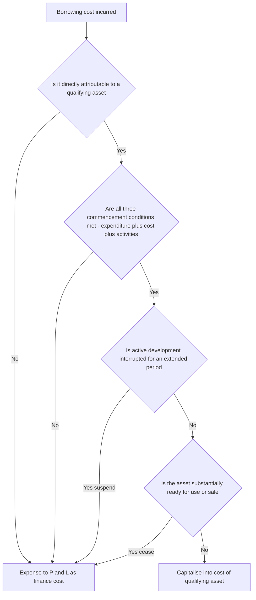
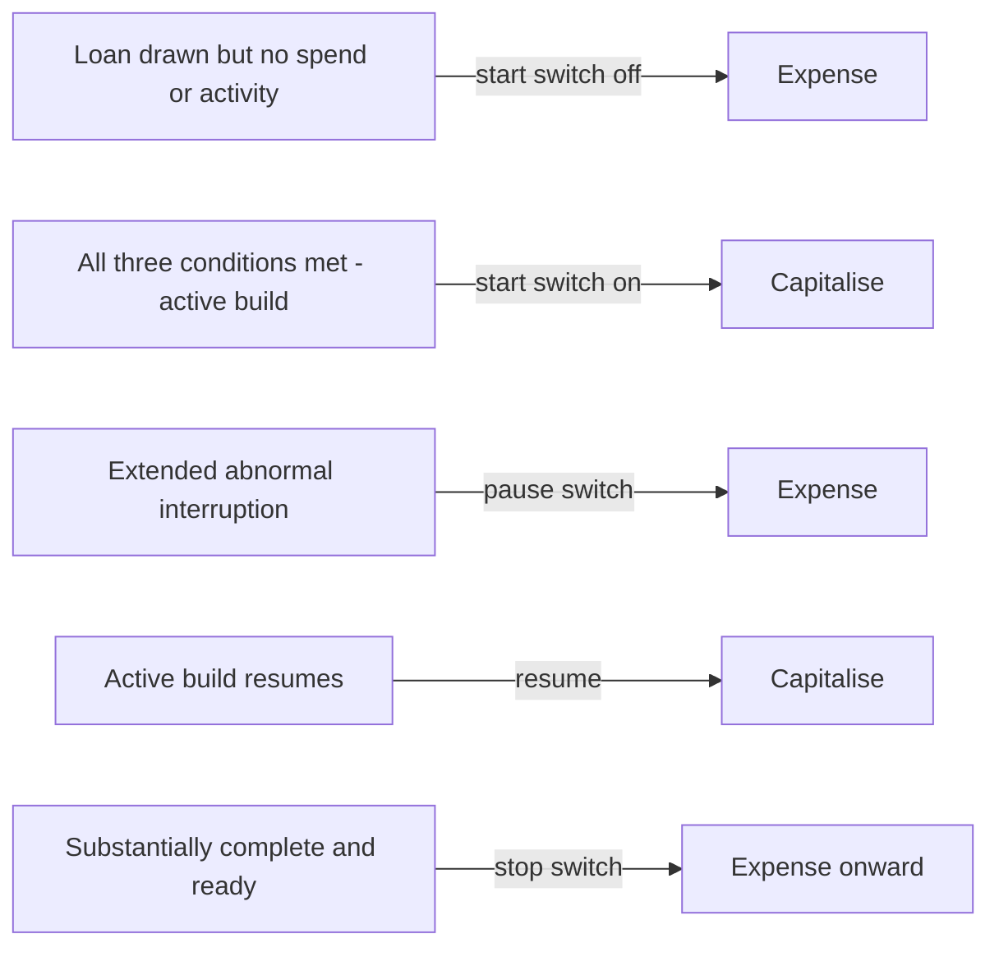

<!-- v2-deep -->

# Chapter 16 — AS 16: Borrowing Costs

## 1. The Problem

You run a company. You borrow ₹10 crore at 10% per annum. What do you do with the ₹1 crore of interest you pay each year?

The instinctive answer — the one every first-year accounting student gives — is: "Interest is a financing expense. Charge it to the Profit & Loss Account as it accrues." And 95% of the time, that is exactly right. Interest on a cash-credit limit, interest on a term loan taken to buy shares, interest on a working-capital loan — all of it hits the P&L as an expense of the period.

But now consider a specific, awkward situation. You are a real-estate developer. You borrow that ₹10 crore specifically to construct a shopping mall. The mall takes **three years** to build. During those three years the mall earns you **nothing** — it is a hole in the ground, then a skeleton of steel, then a half-finished structure. You are paying ₹1 crore of interest every year, but there is no revenue to set it against.

If you follow the naïve rule — "expense all interest" — you get an accounting picture that lies to the reader:

- **Years 1, 2, 3 (construction):** Huge losses. ₹1 crore interest each year, no revenue. Three years of red ink.
- **Year 4 onwards (mall operating):** The mall throws off rent. But the interest that *made the mall exist* has already vanished into prior years' P&L. The operating years look artificially profitable because they carry no cost of the capital that built the asset.

Something is deeply wrong. The interest during construction is not a cost of *running the business this year* — there was no business running. It is a cost of **getting the mall ready**. It is as much a part of the mall's cost as the cement, the steel, and the architect's fee. If you had *rented* an already-built mall you'd pay rent as an expense; but because you *built* one, and building takes time, and money has a time-cost, the interest during that build is baked into what the mall cost you.

The problem AS 16 solves is a single, precise question:

> **When is interest a cost of an *asset* (to be capitalised and depreciated over the asset's life), and when is it a cost of the *period* (to be expensed immediately)?**

Get this wrong in either direction and you mislead:
- **Expense everything** → construction-phase losses overstated, later profits overstated, the balance-sheet value of the asset understated.
- **Capitalise everything** → companies would dump *all* their interest into asset values, inflate the balance sheet, hide financing costs, and defer losses indefinitely. (This is exactly the kind of abuse the standard must fence in.)

AS 16 draws the line — narrowly, with tight conditions — so that only interest that *genuinely* belongs to a slow-to-build asset gets capitalised, and everything else is expensed.

**Why does the direction of the error matter so much for exams?** Because the same rupee of interest lands in two different statements depending on the answer. Capitalise it and it swells the *balance sheet* (asset) this year and dribbles into the P&L as depreciation over 20-30 years. Expense it and it hits the *P&L in full* this year. So the capitalise/expense decision is simultaneously a profit decision and an asset-valuation decision. That double effect is why examiners love the topic — a single misclassification corrupts *two* figures, and every downstream ratio (EPS, return on assets, interest-coverage) with them. Keep that dual-statement lens on throughout: every AS 16 question is secretly asking "which statement does this rupee live in, and for how long?"

---

## 2. The Core Idea (Analogy)

Think of building a house versus buying a ready house.

**Buy a ready house:** You pay ₹1 crore. That ₹1 crore is the cost of the asset. Simple.

**Build a house:** You pay for land, bricks, cement, labour, the architect. Everyone agrees these go into the cost of the house — you *capitalise* them. Now, you funded the build with a loan, and the build took two years. For two years your money was *locked up* in an incomplete house, and that locked-up money had a cost — the interest. During those two years, the interest was not buying you shelter (you couldn't live in a half-built house), it was **the price of time** — the price of the money being tied up while the house came into existence.

The analogy that unlocks AS 16: **interest during construction is just another building material.** Like cement, it is consumed in the process of bringing the asset into existence. Cement you can see; the "cost of tied-up money over time" you cannot see — but it is just as real a cost of getting the asset ready. So it deserves the same treatment: capitalise it into the asset, then let it flow to P&L slowly, as depreciation, *matched against the revenue the finished asset earns*.

This is the **matching principle** wearing a specialised hat. The whole of accrual accounting is one idea — match costs to the revenues they produce. Interest that produces *this year's* revenue → expense it this year. Interest that produces a *future asset's* revenue → park it in the asset and release it as depreciation across the years that asset earns.

But — and this is the crucial second half of the idea — the "building material" treatment only makes sense when **building genuinely takes substantial time.** If you buy inventory that you'll sell next week, there is no meaningful "construction period," no long lock-up of money to attribute. So AS 16 restricts capitalisation to a special class of asset — a **qualifying asset** — one that *necessarily takes a substantial period of time to get ready*. No substantial time, no capitalisation. That single gate keeps the concept honest.

**Push the analogy one notch further — and see where it breaks.** Cement, once poured, stays in the wall forever. Interest is different: the *same asset* can be accumulating "interest-cement" in some months and not others. When the building site sleeps (a strike), no interest-cement is being laid even though the loan clock ticks — that idle interest is not building anything, so it is expensed. When the building wakes (is ready to use), the pouring stops for good — later interest is just the cost of financing a *completed* asset you happen to own. So unlike physical cement, interest-capitalisation has a **start switch, a pause switch, and a stop switch**, all governed by whether money is actively being converted into asset-progress at that moment. Hold this "three-switch" refinement of the cement analogy; Parts 3-5 are simply the rules for each switch.

**A second sharpening — the avoidable-cost lens.** Ask: "If I had *not* spent money on this asset, would this interest still have been incurred?" For a specific loan raised only to build the mall — no, the loan would never have been taken, so the interest is *avoidable* and belongs to the asset. For your general overdraft that funds everything — the interest exists regardless of the mall, but by tying up funds in the mall you *forced* the general pool to stay borrowed longer, so a *representative slice* of it is avoidable. This "would it have been avoided?" question is the same idea as "is it a building material?" — just phrased as a counterfactual. Both routes deliver the identical answer; use whichever the exam wording invites.

---

## 3. Why It's Built This Way

Every design choice in AS 16 falls out of one tension: **matching says "capitalise the time-cost of building," but prudence and comparability say "don't let companies inflate assets with interest."** The standard resolves this by capitalising only where matching truly demands it, and expensing everywhere else. Let's walk the logic behind each rule *before* we state it formally.

**Why only "qualifying assets"?** Because capitalisation is justified only when there is a real, extended lock-up of funds. An asset that is ready immediately (bought off the shelf) has no construction period to attribute interest to. So the standard confines capitalisation to assets that "necessarily take a substantial period of time to get ready for their intended use or sale." No substantial period → the interest is just a normal period financing cost → expense it.

**Why must expenditure, borrowing costs, AND activities all be underway before you start capitalising?** Because capitalised interest is supposed to represent the cost of *money tied up in an asset that is actively being built*. If you've borrowed but haven't spent anything on the asset, no money is tied up in the asset yet — nothing to capitalise. If you've spent but activities to prepare the asset have stopped, the asset isn't progressing toward readiness — so interest is not "buying" progress, it's just idle carrying cost. All three conditions ensure interest is only capitalised while money is genuinely being converted into asset-progress.

**Why suspend during interruptions?** Same logic. If construction stops for six months (say a labour strike, or the developer runs out of design approvals), the money is still borrowed and interest still accrues — but the asset is *not getting any closer to readiness*. Interest during that dead time is a cost of *idleness*, not of *building*. Matching says: an idle asset's carrying cost is a period expense, so suspend capitalisation.

**Why stop (cease) when the asset is ready?** Because once the asset can be used, it is complete — there is no more "getting ready." Any interest after that point is the cost of *financing a finished asset you happen to own*, which is a normal period cost. Continuing to capitalise would keep inflating the asset beyond its true acquisition cost.

**Why the "specific vs general borrowing" split and the capitalisation rate?** Because interest must be attributed *fairly* to the asset. If you borrowed money *specifically* to build the mall, tracing is easy — that loan's actual interest is the asset's interest. But if you funded the mall out of your general pool of borrowings (a mix of loans taken for many purposes), there is no single loan to point to. So the standard invents a **weighted-average capitalisation rate** — a fair, representative "cost of a rupee borrowed" for the general pool — and applies it to the money spent on the asset. It's the accountant's honest approximation of "what did the money tied up in this asset cost, given it came from the common pot?"

**Why deduct income earned on temporarily parked specific-borrowing funds?** Because for specific borrowings, you capitalise the *actual* cost of that borrowing. Suppose you borrowed ₹10 crore for the mall but only need ₹6 crore this quarter; you park the idle ₹4 crore in a fixed deposit and earn interest. The *net* cost of the specific borrowing to you is (interest paid − interest earned on the temporary investment). Capitalising the gross interest would overstate the true cost. So the income is netted off. (Note carefully — this netting is a feature of *specific* borrowings only, and it flows from the "actual cost" measurement basis. We'll see the contrast with general borrowings shortly.)

**Why is the netting rule NOT extended to general borrowings?** This is the deep "why" behind the most-tested asymmetry. For a *specific* loan you capitalise its *own actual* interest, so its *own* deposit income is a genuine reduction in that same loan's net cost — netting keeps you honest. But for *general* borrowings you never capitalise any actual loan's interest at all — you apply a *notional* weighted-average rate to *asset expenditure*. The deposit income arises from surplus *cash*, which is a treasury/investment decision quite separate from the notional attribution to the asset. Mixing the two would be comparing apples (a notional rate on asset spend) with oranges (real income on real cash). So AS 16 keeps them apart: general-pool investment income simply goes to the P&L as income. The asymmetry is not an arbitrary quirk — it is forced by the fact that specific borrowings are measured at *actual* cost while general borrowings are measured by *formula*.

**Why the ceiling that capitalised cost can't exceed actual borrowing cost?** A guardrail against the general-rate mechanism accidentally capitalising more interest than the enterprise actually incurred. You can't capitalise a cost you never bore.

**Why measure against a *weighted-average* expenditure rather than closing spend?** Because interest is a cost of money *for the time it is tied up*. Money spent on the last day of the year was tied up for one day, not a year — capitalising a full year's rate on it would pretend it financed the whole period. Weighting each rupee by the fraction of the period it was actually locked in the asset is simply the time-value idea applied consistently. Using the closing balance silently assumes every rupee was invested from day one — which is why examiners plant an uneven spend pattern to catch the shortcut.

Every rule is the matching principle, sharpened by anti-abuse guardrails. Hold that in your head and you will *derive* the standard rather than memorise it.

The whole decision architecture collapses into one flow:

*Figure 3.1 — Every rupee of borrowing cost falls through the same five gates to reach either the asset or the P&L*

---

## 4. Full Technical Content (Recognition · Measurement · Presentation · Disclosure)

### 4.0 What counts as a "borrowing cost"?

Borrowing costs are **interest and other costs incurred by an enterprise in connection with the borrowing of funds.** Per AS 16, they may include:

- Interest and commitment charges on bank borrowings and other short-term and long-term borrowings.
- Amortisation of **discounts or premiums** relating to borrowings (e.g., debentures issued at a discount — the discount is an extra cost of borrowing, spread over the term).
- Amortisation of **ancillary costs** incurred in arranging borrowings (processing fees, legal costs of raising the loan).
- Finance charges in respect of **assets acquired under finance leases** or other similar arrangements.
- **Exchange differences** arising from foreign currency borrowings **to the extent that they are regarded as an adjustment to interest costs.**

> The exchange-difference point is a classic exam trap. Only the portion of forex loss that is *in substance an adjustment to interest cost* (broadly, the amount by which the forex loss does not exceed the interest you'd have paid on an equivalent local-currency loan) is treated as a borrowing cost under AS 16. The rest of the forex difference is governed by **AS 11**. Don't blindly capitalise the whole forex loss.

**What is NOT a borrowing cost (the exam-relevant exclusions).** Dividends on equity or preference shares are *not* borrowing costs — they are appropriations of profit, not a cost of borrowed funds (equity is not a "borrowing"). Similarly, the *actual* (realised) exchange difference beyond the interest-adjustment cap is a forex item under AS 11, not AS 16. And the *notional* cost of own funds (imputed interest on equity used to build the asset) is never a borrowing cost — AS 16 only touches costs of *borrowed* funds. Examiners test the equity-dividend point by handing you a mixed capital structure and hoping you sweep preference dividend into the "general pool" — do not.

**The forex-as-interest cap, made concrete.** Suppose a firm borrows USD equivalent to ₹100 lakh; interest paid on it (say 3%) is ₹3 lakh, and during the year the rupee weakened so the forex loss on the principal is ₹9 lakh. Had it borrowed the same ₹100 lakh in rupees, it would have paid, say, 10% = ₹10 lakh interest. The *notional saving* by borrowing in dollars is (₹10 lakh − ₹3 lakh) = ₹7 lakh. AS 16 treats forex loss as a borrowing cost only *up to* that ₹7 lakh benchmark. So of the ₹9 lakh forex loss, ₹7 lakh is treated as a borrowing cost (and, if the asset qualifies, is eligible for capitalisation along with the ₹3 lakh interest), and the remaining ₹2 lakh is a plain exchange loss under AS 11. (Treat the exact benchmark mechanics as guidance — verify the precise wording in current ICAI material for your AY.)

### 4.1 Recognition — the fundamental rule

There are exactly two possible fates for a borrowing cost:

1. **Borrowing costs that are directly attributable to the acquisition, construction or production of a *qualifying asset*** are **capitalised** as part of the cost of that asset.
2. **All other borrowing costs** are **recognised as an expense** in the period in which they are incurred.

"Directly attributable" means: costs that would have been *avoided* if the expenditure on the qualifying asset had not been made. This "avoidable cost" test is the operational heart of recognition — if the asset didn't exist, would this interest have been incurred? If yes-it-would-still-exist, it's not attributable.

**A subtlety on "directly attributable" and capitalisation without change to P&L totals.** Capitalisation is only about *where* the cost sits, never about *creating* or *destroying* cost. The enterprise still incurred the full interest; capitalisation merely relocates part of it from this year's expense to an asset that will be expensed later as depreciation. So in any AS 16 sum, the *total* actual borrowing cost is a fixed number, and your entire job is to split that fixed total into a "capitalised" slice and an "expensed" slice. If your capitalised + expensed does not tie back to the actual interest incurred, you have made an arithmetic error. Build every answer to reconcile to that control total — it is the single most reliable self-check in the topic.

#### What is a Qualifying Asset?

> A **qualifying asset** is an asset that **necessarily takes a substantial period of time to get ready for its intended use or sale.**

Two phrases carry all the weight:

- **"Necessarily takes a substantial period of time"** — the delay must be *inherent* to getting the asset ready, not caused by inefficiency. As a working rule, "substantial period" is *ordinarily* taken as **more than twelve months**, unless a shorter period can be justified based on facts and circumstances (confirm the current guidance in ICAI material; the 12-month rule of thumb comes from the standard's guidance, not an absolute legal line).
- **"Get ready for its intended use or sale"** — an asset already ready when acquired is *not* qualifying.

Examples that typically qualify: manufacturing plants under construction, power-generation facilities, ships, large buildings/malls, and inventories that require a long period to bring to a saleable condition (e.g., aged whisky, wine, cheese; a long-gestation real-estate project held as stock-in-trade).

Examples that **do NOT** qualify:
- Assets ready for use/sale when acquired (buy a ready machine → no capitalisation).
- **Inventories routinely manufactured or otherwise produced in large quantities on a repetitive basis** over a short period (they don't *necessarily* take substantial time).
- Assets ready for their intended use or sale in a short period even if held for a long time before that.
- Investments and other financial assets.

**Finer distinction — "necessarily" vs "actually."** The test is whether the asset *by its nature* requires substantial time, not whether *this particular firm* happened to take long. If a machine that normally installs in a month took your firm fourteen months because of your own mismanagement, it is *not* a qualifying asset — the extra time was avoidable inefficiency, not an inherent feature. Conversely, a hydro-electric dam that is *inherently* multi-year qualifies even if an unusually efficient contractor finishes early. Examiners phrase this as "the delay was due to labour unrest and poor planning" to bait you into wrongly treating an ordinary asset as qualifying.

**Finer distinction — land.** Land itself, held with no development, is *not* being "got ready," so interest on it is expensed. But land under *active site development* that is a necessary step for a qualifying structure can enter the capitalisation stream once activities begin. Same plot, two answers, depending on whether change-to-condition activity is underway.

**Finer distinction — assets ready in parts vs the whole.** An asset can be a qualifying asset overall yet have components that come "ready" at different times; the readiness test is applied to the *unit that can be independently used* (developed further in cessation, Part 4.5).

### 4.2 Measurement — how much to capitalise

#### Case A — Specific borrowings (funds borrowed specifically to obtain a qualifying asset)

> **Amount to capitalise = Actual borrowing costs incurred on that borrowing during the period, LESS any income earned on the temporary investment of those borrowings.**

The logic (from Part 3): you capitalise the *actual, net* cost of the dedicated loan. Idle borrowed funds parked in deposits earn income; that income reduces the net cost of borrowing, so it is deducted from the amount capitalised.

#### Case B — General borrowings (a qualifying asset funded from the general borrowing pool)

You cannot trace a specific loan, so you apply a **capitalisation rate** to the expenditure on the asset:

> **Amount to capitalise = Capitalisation Rate × Expenditure on the qualifying asset (funded from general borrowings)**
>
> **Capitalisation Rate = the weighted-average rate of borrowing costs applicable to the general pool of borrowings** (i.e., total general borrowing costs for the period ÷ weighted-average general borrowings outstanding during the period), excluding borrowings made specifically for a qualifying asset.

- The "expenditure on the asset" for this purpose is generally the **weighted-average carrying amount** of the asset during the period (including previously capitalised borrowing costs), less any progress payments/grants received.
- **Note the asymmetry:** for *general* borrowings, income on temporary investment is **NOT** deducted from the amount capitalised (the standard's netting rule is written specifically for funds *borrowed specifically*). Such investment income is simply recognised as income in the P&L. This asymmetry is a heavily-tested point.

#### Case C — The mixed case (part specific, part general)

The exam favourite that neither pure case covers: a qualifying asset costing more than its dedicated loan, so the excess spend is funded from the general pool. Handle it in two independent streams and add:

1. On the portion covered by the **specific** loan → capitalise that loan's *actual* interest (less temp-investment income on it).
2. On the *excess* expenditure over the specific loan → apply the **general** capitalisation rate.

Do **not** blend the two rates into one. Each stream keeps its own rule (netting applies only to the specific stream; the ceiling applies to the general stream). We work this in Example 5.

#### The ceiling (the guardrail)

> **The amount of borrowing costs capitalised during a period must NOT exceed the amount of borrowing costs actually incurred during that period.**

The weighted-average-rate mechanism is an estimate; this cap ensures the estimate never lets you capitalise interest you didn't actually pay. In the mixed case, the ceiling is tested on the *general* stream against the *general* pool's actual cost; the specific stream is already at actual cost by construction, so it self-satisfies.

### 4.3 Recognition — WHEN to START capitalising (Commencement)

Capitalisation begins **only when ALL three of the following conditions are met**:

1. **Expenditure** on the qualifying asset is being incurred; **and**
2. **Borrowing costs** are being incurred; **and**
3. **Activities** that are necessary to prepare the asset for its intended use or sale are **in progress.**

Point 3 is broader than physical construction — it includes technical and administrative work *before* physical construction, such as obtaining permits and approvals. But it *excludes* merely **holding an asset when no production or development that changes its condition is taking place** (e.g., holding land with no development activity earns no capitalisation, even though you're paying interest on the land loan).

**"Expenditure" means real outflow of resources.** For the general-borrowing computation, expenditure on the asset is reduced by any progress payments received and grants received (AS 12) — because to that extent the firm's *own* borrowed money is not tied up. The commencement date is the *latest* of the three conditions being satisfied; interest before that latest date is expensed. Examiners routinely stagger the three: loan drawn 1 April, first payment to contractor 1 June, approvals (activity) only from 1 July → capitalisation starts 1 July, and April-June interest is expensed.

### 4.4 Recognition — SUSPENSION of capitalisation

> Capitalisation of borrowing costs is **suspended during extended periods in which active development is interrupted.**

- Suspend when active development stops for an *extended period* (e.g., a prolonged strike, a stoppage awaiting fresh approvals).
- **Do NOT suspend** for:
  - Temporary delays that are a **necessary part** of getting the asset ready (e.g., high water levels delaying bridge construction, if such delays are common in the region), or
  - Short interruptions, or periods when substantial **technical and administrative work** is being carried on.

During suspension, the ongoing interest is expensed to P&L (it's a cost of idleness, not of building).

**The decision test for suspension.** Ask two questions: (a) Is the interruption *extended*? and (b) Is it *abnormal* — i.e., not an inherent step in preparing this kind of asset? Only "yes to both" triggers suspension. A wine that must age for three years is not "interrupted" during ageing — ageing *is* the activity that gets it ready, so no suspension. A bridge whose work pauses every monsoon *in a region where that is normal and expected* is not suspended — the pause is a necessary part of the build. But a bridge project frozen for eight months because the government withdrew clearances is suspended. The wording "temporary and expected" vs "extended and abnormal" is the exact hinge examiners test.

### 4.5 Recognition — CESSATION of capitalisation

> Capitalisation **ceases when substantially all the activities necessary to prepare the qualifying asset for its intended use or sale are complete.**

Key refinements:
- Cessation is triggered by **physical completion**, even if routine administrative work (minor finishing touches, decoration to the purchaser's specification) continues.
- **Part completion:** when an asset is completed **in parts** and each part is *capable of being used while construction continues on other parts*, capitalisation **ceases for that part** when it is substantially complete. (E.g., a business park with several buildings — each finished building stops capitalising while others continue.) But if the asset must be completed *in its entirety* before any part can be used (e.g., a steel mill involving sequential process stages across the whole plant), capitalisation ceases only when the *whole* asset is ready.

**The "capable of use" test, not the "actually used" test.** Cessation is triggered when the asset is *ready* for its intended use, regardless of whether the firm has actually begun using or selling it. A completed factory that sits idle because the market is weak has still ceased qualifying — interest from the ready-date onward is expensed even though no production has started. Do not wait for commercial operations to *commence*; wait for the asset to be *capable* of operating. This is a favourite trap: "the plant was ready on 1 January but production began only on 1 April" — capitalisation ceases 1 January, and January-March interest is expensed.

The lifecycle of capitalisation across a project year looks like this:

*Figure 4.1 — The same asset moves between capitalise and expense as the start, pause, and stop switches flip through the year*

### 4.6 Presentation & Disclosure (summary; formats in Part 6)

The financial statements must **disclose**:
1. The **accounting policy** adopted for borrowing costs; and
2. The **amount of borrowing costs capitalised** during the period.

Capitalised borrowing costs are presented as **part of the cost of the relevant fixed asset / inventory** (not shown separately on the face of the balance sheet), and thereafter depreciated/expensed as part of that asset. Expensed borrowing costs appear as **finance costs** in the Statement of Profit and Loss.

---

## 5. Worked Examples

### Example 1 — The gateway concept: capitalise vs expense (easy)

**Facts.** Alpha Ltd takes two loans on 1 April 2025:
- Loan A: ₹50,00,000 at 12% p.a., specifically to construct a factory building expected to take 18 months.
- Loan B: ₹20,00,000 at 10% p.a., to purchase a delivery van (ready for use on delivery, received 5 April 2025).

Compute the borrowing cost to be capitalised and expensed for the year ended 31 March 2026.

**Reasoning.**
- The **factory** takes 18 months (> 12 months) to get ready → **qualifying asset**. Loan A is a *specific* borrowing directly attributable to it.
- The **van** is ready for use immediately → **not** a qualifying asset. Interest on Loan B cannot be capitalised.

**Computation.**
- Loan A interest for the year = 50,00,000 × 12% = **₹6,00,000** → *capitalise* to factory (construction ongoing all year, all three commencement conditions met).
- Loan B interest for the year = 20,00,000 × 10% = ₹2,00,000 → *expense* (finance cost in P&L).

**Answer.** Capitalise ₹6,00,000 into the factory; expense ₹2,00,000. The factory's cost carries ₹6,00,000 of interest, which will be depreciated over the building's life — matched to the revenue the factory eventually earns.

---

### Example 2 — Specific borrowing with temporary investment income (medium)

**Facts.** Beta Ltd borrows ₹80,00,000 on 1 April 2025 at 9% p.a., specifically to construct a qualifying asset (a bespoke processing plant, 2-year build). Construction commenced immediately. During the year, ₹60,00,000 was spent on construction; the surplus funds not yet needed were temporarily invested in a bank deposit and earned interest income of ₹1,80,000. Compute the amount to be capitalised for the year ended 31 March 2026.

**Reasoning.** This is a **specific** borrowing → measurement basis is *actual borrowing cost less income on temporary investment of those borrowings.* The plant qualifies (2-year build), and all commencement conditions are met, so we capitalise the *net* cost.

**Computation.**

| Item | ₹ |
|---|---|
| Actual interest on specific borrowing (80,00,000 × 9%) | 7,20,000 |
| Less: Income on temporary investment of the borrowed funds | (1,80,000) |
| **Borrowing cost to be capitalised** | **5,40,000** |

**Answer.** ₹5,40,000 is capitalised into the cost of the plant. The ₹1,80,000 income is *not* recognised separately as income in the P&L — it has already been netted off against the interest, exactly because the standard tells us to capitalise the *net actual cost* of a specific borrowing.

*Check the logic:* Beta really only "lost" ₹5,40,000 of financing value to the asset this year (paid 7,20,000, got back 1,80,000). Capitalising the gross 7,20,000 would overstate the plant. Ties out.

---

### Example 3 — General borrowings, capitalisation rate, and the ceiling (exam-hard)

**Facts.** Gamma Ltd is constructing a qualifying asset — a new integrated warehouse (3-year project). It has **no specific borrowing**; it funds construction from its **general pool** of borrowings, which throughout the year ended 31 March 2026 comprised:

| Borrowing | Amount outstanding all year (₹) | Rate | Interest for year (₹) |
|---|---|---|---|
| 11% Term Loan | 1,00,00,000 | 11% | 11,00,000 |
| 13% Debentures | 60,00,000 | 13% | 7,80,000 |
| 9% Bank Loan | 40,00,000 | 9% | 3,60,000 |
| **Total** | **2,00,00,000** | | **22,40,000** |

Expenditure on the warehouse was incurred evenly. Opening WIP (1 April 2025) was ₹90,00,000; a further ₹60,00,000 was spent evenly during the year, so closing WIP before interest was ₹1,50,00,000. Compute the borrowing cost to be capitalised for the year.

**Step 1 — Capitalisation rate (weighted-average rate of the general pool).**

Since all borrowings were outstanding for the full year, the weighted-average is simply total interest ÷ total borrowings:

Capitalisation rate = 22,40,000 ÷ 2,00,00,000 = **11.2%**

*(Sense-check by weighting the rates: (100/200)×11% + (60/200)×13% + (40/200)×9% = 5.5% + 3.9% + 1.8% = 11.2%. Matches.)*

**Step 2 — Expenditure to which the rate is applied (weighted-average carrying amount).**

Opening WIP ₹90,00,000 was tied up all year; the additional ₹60,00,000 was spent evenly, so on average half of it (₹30,00,000) was tied up during the year.

Weighted-average expenditure = 90,00,000 + (60,00,000 × ½) = 90,00,000 + 30,00,000 = **₹1,20,00,000**

**Step 3 — Borrowing cost per the rate.**

= 11.2% × 1,20,00,000 = **₹13,44,000**

**Step 4 — Apply the ceiling.**

Actual total borrowing cost incurred during the year = ₹22,40,000.
Capitalised amount (₹13,44,000) does **not** exceed actual (₹22,40,000). ✔ Ceiling satisfied.

**Step 5 — Split.**

| Item | ₹ |
|---|---|
| Borrowing cost capitalised (into warehouse WIP) | 13,44,000 |
| Borrowing cost expensed (22,40,000 − 13,44,000) | 8,96,000 |
| **Total actual borrowing cost** | **22,40,000** |

**Answer.** Capitalise ₹13,44,000; expense ₹8,96,000. Note: no temporary-investment income is netted here, because these are **general** borrowings — any deposit income would be shown as income in the P&L, *not* deducted from the capitalised amount. Everything reconciles to the ₹22,40,000 actually incurred.

**What if the examiner tweaks it —** *tiny general pool, huge asset spend?* Suppose the same warehouse spend gave a weighted-average expenditure of ₹2,10,00,000 while the general pool stayed at ₹2,00,00,000 (rate 11.2%). Then rate × expenditure = 11.2% × 2,10,00,000 = ₹23,52,000 — but actual interest incurred is only ₹22,40,000. **The ceiling bites:** you cap the capitalised amount at ₹22,40,000 and expense **nil**. You can never capitalise the extra ₹1,12,000 you never paid. This is the exact scenario where Trap 6 turns from theory into marks.

---

### Example 4 — Suspension and cessation with dates (exam-hard, timing focus)

**Facts.** Delta Ltd borrows ₹1,20,00,000 specifically at 10% p.a. on 1 April 2025 to build a qualifying asset. Timeline:
- 1 Apr 2025: borrowing taken, construction begins.
- 1 Jul 2025 – 30 Sep 2025 (3 months): construction **halted** due to a prolonged, unusual labour strike (an extended interruption, not a normal part of construction).
- 1 Oct 2025: construction resumes.
- 31 Jan 2026: construction **substantially complete**; asset ready for intended use.
- Remaining Feb–Mar 2026: only minor decorative work to the user's specification.

Assume interest accrues evenly. Compute capitalised vs expensed borrowing cost for the year ended 31 March 2026.

**Reasoning — map each month to a rule.**
- Monthly interest = 1,20,00,000 × 10% × 1/12 = **₹1,00,000 per month.**
- **Apr–Jun (3 months):** active construction → capitalise.
- **Jul–Sep (3 months):** extended interruption → **suspend** capitalisation → expense.
- **Oct 2025–Jan 2026 (4 months):** active construction → capitalise.
- **31 Jan 2026:** substantially complete → **cease** capitalisation. The Feb–Mar decorative work is minor/administrative and does *not* extend capitalisation.
- **Feb–Mar (2 months):** asset ready → expense (normal finance cost).

**Computation.**

| Period | Months | Treatment | ₹ |
|---|---|---|---|
| Apr–Jun 2025 | 3 | Capitalise | 3,00,000 |
| Jul–Sep 2025 | 3 | Expense (suspension) | 3,00,000 |
| Oct 2025–Jan 2026 | 4 | Capitalise | 4,00,000 |
| Feb–Mar 2026 | 2 | Expense (after cessation) | 2,00,000 |
| **Total** | **12** | | **12,00,000** |

**Answer.**
- Capitalised = 3,00,000 + 4,00,000 = **₹7,00,000**
- Expensed = 3,00,000 + 2,00,000 = **₹5,00,000**
- Total = ₹12,00,000 = full-year interest (1,20,00,000 × 10%). ✔ Reconciles.

*Trap avoided:* a careless student capitalises the whole ₹12,00,000, or forgets to stop at 31 Jan and capitalises Feb–Mar. Both wrong. The months mapped one-to-one to the commencement/suspension/cessation rules.

**What if the examiner tweaks it —** *the strike is a "normal, expected" monsoon-type pause?* If the July-September stoppage were an *inherent, expected* part of building this asset in this location (not abnormal), you would **not** suspend — those three months' ₹3,00,000 would be *capitalised*, lifting the capitalised total to ₹10,00,000 and cutting the expense to ₹2,00,000. Same dates, opposite treatment, purely because "extended abnormal" flipped to "necessary part of the build." Read the *nature* of the delay, never just its length.

---

### Example 5 — The mixed case: specific loan plus general pool for one asset (exam-hard)

**Facts.** Epsilon Ltd builds a qualifying plant during the year ended 31 March 2026. Total expenditure incurred *evenly* through the year brings the weighted-average expenditure on the plant to **₹1,50,00,000**. It raised a **specific** loan of ₹80,00,000 at 8% on 1 April 2025 for this plant (no temporary investment; all drawn and used). The balance of the spend was met from the **general pool**, whose borrowings and costs for the year were:

| General borrowing | Amount (₹) | Interest (₹) |
|---|---|---|
| 12% Loan | 90,00,000 | 10,80,000 |
| 10% Loan | 60,00,000 | 6,00,000 |
| **Total** | **1,50,00,000** | **16,80,000** |

Compute the borrowing cost capitalised into the plant.

**Step 1 — Specific stream.** Specific loan ₹80,00,000 at 8% for the full year = **₹6,40,000**, capitalised in full (no temp-investment income to net).

**Step 2 — General stream: how much expenditure is funded generally?**
Weighted-average expenditure on the plant = ₹1,50,00,000; of this, the specific loan covered ₹80,00,000. So the *excess* funded from the general pool = 1,50,00,000 − 80,00,000 = **₹70,00,000**.

**Step 3 — General capitalisation rate.**
= 16,80,000 ÷ 1,50,00,000 = **11.2%**.
*(Sense-check: (90/150)×12% + (60/150)×10% = 7.2% + 4.0% = 11.2%. Matches.)*

**Step 4 — General stream capitalised.**
= 11.2% × 70,00,000 = **₹7,84,000**.

**Step 5 — Ceiling on the general stream.**
General actual interest = ₹16,80,000; capitalised general amount ₹7,84,000 ≤ ₹16,80,000. ✔ Fine.

**Step 6 — Total capitalised and expensed.**

| Stream | Capitalised (₹) |
|---|---|
| Specific | 6,40,000 |
| General | 7,84,000 |
| **Total capitalised into plant** | **14,24,000** |

Total actual interest incurred in the year = 6,40,000 (specific) + 16,80,000 (general) = ₹23,20,000.
Expensed = 23,20,000 − 14,24,000 = **₹8,96,000**.

**Answer.** Capitalise ₹14,24,000; expense ₹8,96,000; total ₹23,20,000 reconciles. **Trap avoided:** a student who blends everything into one pool would apply 11.2% (or worse, a re-computed blended rate) to the whole ₹1,50,00,000 and lose the specific loan's *actual* 8% treatment. Keep the two streams surgically separate.

---

### Example 6 — Staggered commencement conditions (medium-hard, start-date focus)

**Facts.** Zeta Ltd draws a specific loan of ₹60,00,000 at 10% on 1 April 2025 for a qualifying asset. But: the first payment to the contractor (expenditure) is made only on 1 August 2025, and preparatory activities (site clearance, approvals) begin on 1 July 2025. The asset is still under construction at 31 March 2026 with no interruption. Compute capitalised vs expensed interest.

**Reasoning.** Capitalisation starts only when **all three** conditions coexist. Trace the *latest*:
- Borrowing cost incurred: 1 Apr 2025.
- Activities in progress: 1 Jul 2025.
- Expenditure incurred: 1 Aug 2025.
The last to be satisfied is **expenditure on 1 August**. So capitalisation commences 1 August 2025. April–July interest is expensed.

**Computation.** Monthly interest = 60,00,000 × 10% × 1/12 = ₹50,000.
- Apr–Jul (4 months): before commencement → expense = 4 × 50,000 = **₹2,00,000**.
- Aug–Mar (8 months): capitalise = 8 × 50,000 = **₹4,00,000**.

**Answer.** Capitalise ₹4,00,000; expense ₹2,00,000; total ₹6,00,000 = full-year interest. ✔ **Trap avoided:** starting the clock at loan drawdown (1 April) rather than the latest-of-three (1 August) would wrongly capitalise an extra ₹2,00,000.

---

## 6. Presentation & Disclosure Formats

### 6.1 On the face of the financials

Capitalised borrowing costs are **never a separate line** on the balance sheet — they are subsumed into the carrying amount of the asset:

- **Fixed asset under construction** → included in **Capital Work-in-Progress**, then in the fixed asset's gross block on completion (Note on PPE under Schedule III).
- **Qualifying inventory** → included in the cost of **Inventories** (Note on Inventories).

Expensed borrowing costs appear in the **Statement of Profit and Loss** under **Finance Costs**.

### 6.2 Illustrative Notes to Accounts

**Note X — Significant Accounting Policy: Borrowing Costs**
> "Borrowing costs directly attributable to the acquisition, construction or production of a qualifying asset — an asset that necessarily takes a substantial period of time to get ready for its intended use or sale — are capitalised as part of the cost of that asset. Income earned on the temporary investment of funds borrowed specifically for a qualifying asset is deducted from the borrowing costs eligible for capitalisation. All other borrowing costs are recognised as an expense in the period in which they are incurred."

**Note Y — Disclosure of amount capitalised**
> "Borrowing costs capitalised during the year amounted to ₹13,44,000 (Previous Year: ₹—), included in Capital Work-in-Progress."

**Finance Costs (extract from Statement of P&L)**

| Particulars | Current Year (₹) |
|---|---|
| Interest expense (net of amount capitalised) | 8,96,000 |
| Other borrowing costs | — |
| **Total Finance Costs** | **8,96,000** |

### 6.3 The journal entries (frequently examined in theory-plus-entry questions)

For a qualifying asset funded by a specific loan, the entries flow as:

| Event | Entry |
|---|---|
| Interest accrues on borrowing | Interest Expense A/c Dr; To Interest Payable / Bank A/c |
| Portion eligible for capitalisation | Capital Work-in-Progress A/c Dr; To Interest Expense A/c (transfer of the capitalised slice out of expense) |
| Temporary-investment income (specific loan) | Bank A/c Dr; To Interest Expense A/c (reduces the net cost, i.e., netted against capitalisation) |
| On completion | Fixed Asset A/c Dr; To Capital Work-in-Progress A/c |

The net effect: only the *expensed* slice of interest remains in the P&L; the capitalised slice sits in CWIP and later in the asset's gross block. Presenting the entries this way makes the "relocation, not creation, of cost" idea (Part 4.1) visible on the ledger.

---

## 7. Connections

- **AS 10 (Property, Plant & Equipment):** AS 10 lists the components of the *cost* of a PPE item; AS 16 is the rule that decides *how much interest* goes into that cost during construction. Capitalisation stops (AS 16) when the asset is ready → depreciation starts (AS 10). They interlock at the moment of "ready for use."
- **AS 2 (Inventories):** For qualifying inventories (long-maturing stock), AS 16 borrowing costs can form part of inventory cost. But AS 2's own rule normally *excludes* interest from inventory cost — the exception is precisely the AS 16 qualifying-asset case.
- **AS 11 (Foreign Exchange):** The exchange-difference overlap. Only the interest-adjustment portion of forex differences is an AS 16 borrowing cost; the balance is AS 11 territory.
- **AS 12 (Government Grants):** Progress payments and grants received against the asset *reduce* the expenditure base to which the capitalisation rate is applied.
- **AS 19 (Leases):** Finance charges on assets under finance leases are borrowing costs and can be capitalised if the leased asset is a qualifying asset.
- **AS 26 (Intangibles) / AS 28 (Impairment):** An intangible under long development can be a qualifying asset; and capitalised interest, once in the asset, is subject to AS 28 impairment testing along with the rest of the carrying amount. Note the interlock with AS 28: capitalising interest *raises* the carrying amount, which can *trigger* an impairment test if the asset's recoverable amount is lower — you cannot capitalise your way past economic reality.
- **AS 7 (Construction Contracts):** For a contractor, borrowing costs attributable to a construction contract can be part of contract costs — another route by which AS 16 feeds a different standard's cost pool.
- **Ind AS 23** (contrast, not examinable as AS): broadly similar, but Ind AS 23 has a specific rule that *general*-borrowing temporary investment income treatment and the definition of borrowing costs use the *effective interest method*; and there are nuances on foreign-currency and derivative components. Under Indian AS 16 the netting of temporary-investment income is confined to *specific* borrowings — remember the AS position for the exam.
- **Financial Management (MBA link):** This is the accounting cousin of *cost of capital* and *interest during construction (IDC)* in project appraisal / capital budgeting. IDC in a project cash-flow model is the same economic quantity AS 16 capitalises.

---

## 8. Traps & Examiner Tricks

1. **Netting income — specific vs general.** The single most-tested trap. Deduct temporary-investment income from capitalised interest **only for specific borrowings**. For general borrowings, investment income is credited to P&L and does *not* reduce the capitalised amount.

2. **"Substantial period of time."** An asset held for a long time is *not* automatically a qualifying asset — it must *necessarily take* substantial time to *get ready*. Land held for appreciation, or ready-made goods stored long, do not qualify. Also, routinely mass-produced inventories (short cycle, repetitive) never qualify even if lots of them are made.

3. **Forgetting the three commencement conditions.** Examiners give you a loan taken on Day 1 but expenditure/activity starting three months later. Capitalisation starts only when **all three** (expenditure + borrowing cost + activities) are running — so the first three months' interest is expensed. (See Example 6.)

4. **Suspension: which delays count.** Only *extended, abnormal* interruptions suspend capitalisation. Delays that are a *necessary part* of the build (monsoon flooding for a bridge, ageing period for wine) do **not** cause suspension. Examiners deliberately blur "the plant sat idle awaiting a routine curing period" (no suspension) vs "a six-month strike" (suspend).

5. **Cessation timing.** Capitalisation stops at **substantial physical completion**, not when the last decorative/administrative touch is done. Also watch **part-completion**: each usable part stops capitalising when *it* is ready. And remember the **"capable of use, not actually used"** rule — a ready-but-idle plant has ceased qualifying.

6. **The ceiling.** With the general-borrowing rate method, always test that capitalised ≤ actual borrowing cost incurred. Rare in easy sums, but a favourite in tricky ones where the rate × expenditure would overshoot (see Example 3's tweak).

7. **Weighted-average expenditure, not closing balance.** For general borrowings, apply the rate to the *weighted-average* carrying amount of the asset during the period (pro-rate mid-year spend), and *include previously capitalised interest* in that base. Using the closing balance overstates capitalisation.

8. **Exchange differences.** Never capitalise the *whole* forex loss as a borrowing cost — only the portion treated as an adjustment to interest cost; the rest follows AS 11.

9. **Wrong asset gets the interest.** Interest on a loan taken to *buy an already-ready asset* is always expensed — no matter how big the loan. The trigger is the *asset's* nature (qualifying?), not the loan's size.

10. **"Directly attributable = avoidable."** If the interest would have been incurred anyway even without the asset expenditure, it is not directly attributable. Use the avoidable-cost test when a problem is ambiguous.

11. **Mixing specific and general rates.** In the mixed case (asset spend > specific loan), keep two streams: actual interest on the specific portion, capitalisation rate on the excess. Do not blend into one rate (see Example 5).

12. **Dividends and own-fund interest.** Preference/equity dividends are *not* borrowing costs; imputed interest on the firm's own equity used in construction is *not* capitalised. Only costs of *borrowed* funds count. Examiners slip a preference dividend into a "borrowing pool" table to test this.

13. **"Necessarily" vs "actually" long.** A normally-quick asset delayed by the firm's own inefficiency is *not* a qualifying asset. The substantial period must be inherent to the asset, not a product of mismanagement.

14. **Reconciliation control-check.** Always confirm capitalised + expensed = total actual borrowing cost incurred. If it doesn't tie, you have an error — most often a month mis-mapped or the ceiling forgotten.

---

## 9. First-Principles Recap

- Interest is *usually* a period expense — but when money is tied up for a long time building an asset, that interest is a **cost of the asset**, like cement, and belongs in its carrying amount (matching principle).
- Capitalisation *relocates* cost, it never creates or destroys it — so capitalised + expensed must always equal the total actual borrowing cost incurred. Make every answer reconcile to that control total.
- The gate is the **qualifying asset**: it must *necessarily take a substantial period of time* (ordinarily > 12 months) to get ready for use or sale. No substantial period → expense. "Necessarily," not merely "actually," long.
- Capitalise only what is **directly attributable** — the interest that would have been *avoided* had the asset expenditure not been made.
- **Specific borrowing:** capitalise **actual** interest **minus** income on temporary investment of those funds.
- **General borrowing:** capitalise **capitalisation rate (weighted-average) × weighted-average expenditure**; do **not** net investment income; never exceed **actual** borrowing cost incurred (the ceiling).
- **Mixed case:** run the specific and general streams separately and add; each keeps its own rule.
- **Start** capitalising only when all three hold: expenditure incurred **+** borrowing cost incurred **+** preparatory activities in progress (use the *latest* of the three dates).
- **Suspend** during extended, abnormal interruptions (interest becomes a cost of idleness → P&L); don't suspend for delays that are a necessary part of the build.
- **Cease** at substantial physical completion (capable of use, not actually used); part-by-part if parts are independently usable.
- Present capitalised cost *inside* the asset (CWIP / inventory), not as a separate line; **disclose the accounting policy and the amount capitalised**.
- Watch the overlaps: AS 10 (cost & depreciation handoff), AS 2 (inventory cost exception), AS 11 (forex portion), AS 12 (grants reduce the base), AS 28 (impairment on the swollen carrying amount).

---

## 10. Quick-Revision Sheet

**Definition — Qualifying Asset:** asset that *necessarily takes a substantial period of time* (ordinarily > 12 months) to get ready for intended use/sale. NOT: ready-on-acquisition assets; routinely mass-produced inventories; assets ready in a short period; investments/financial assets; assets delayed only by the firm's own inefficiency.

**Recognition rule:**
- Directly attributable to qualifying asset → **Capitalise**.
- All other borrowing costs → **Expense**.

**Borrowing costs include:** interest & commitment charges; amortisation of discount/premium; amortisation of ancillary borrowing costs; finance-lease finance charges; forex differences *to the extent an interest adjustment*.
**Borrowing costs EXCLUDE:** equity/preference dividends; imputed interest on own funds; forex loss beyond the interest-adjustment cap (→ AS 11).

**Measurement:**
| | Specific borrowing | General borrowing |
|---|---|---|
| Amount | Actual interest − temp-investment income | Cap. rate × wtd-avg expenditure |
| Cap. rate | n/a | Wtd-avg rate of general pool |
| Temp-investment income | **Deduct** from capitalised | **Do NOT deduct** (→ P&L income) |
| Ceiling | — | Capitalised ≤ actual borrowing cost incurred |
| Mixed case | Specific loan → actual; excess spend → general rate; add the two |

**START (all three, take the latest date):** (1) expenditure incurred + (2) borrowing costs incurred + (3) activities to prepare asset in progress.

**SUSPEND:** during *extended + abnormal* interruption of active development → expense. Do NOT suspend for delays that are a necessary part of getting ready, or when substantial technical/admin work continues.

**CEASE:** when substantially all activities to get the asset ready are complete (physical completion, capable of use not actually used; ignore minor admin/decorative work). Part-completion → cease per usable part.

**Disclosure:** (1) accounting policy for borrowing costs; (2) amount of borrowing costs capitalised in the period.

**Key formulae:**
- Capitalisation rate = Total general borrowing costs ÷ Weighted-average general borrowings.
- General capitalised = Rate × Weighted-average expenditure on asset (incl. prior capitalised interest, net of grants/progress payments), capped at actual borrowing cost.
- Specific capitalised = Actual interest − Temporary investment income.
- Control check: Capitalised + Expensed = Total actual borrowing cost incurred.

**One-line memory hook:** *Interest is cement only for slow-built assets — start when all three engines run, pause when the site sleeps, stop when the asset wakes; net income for specific loans, rate-and-cap for general ones, and always tie the total back to what you actually paid.*
