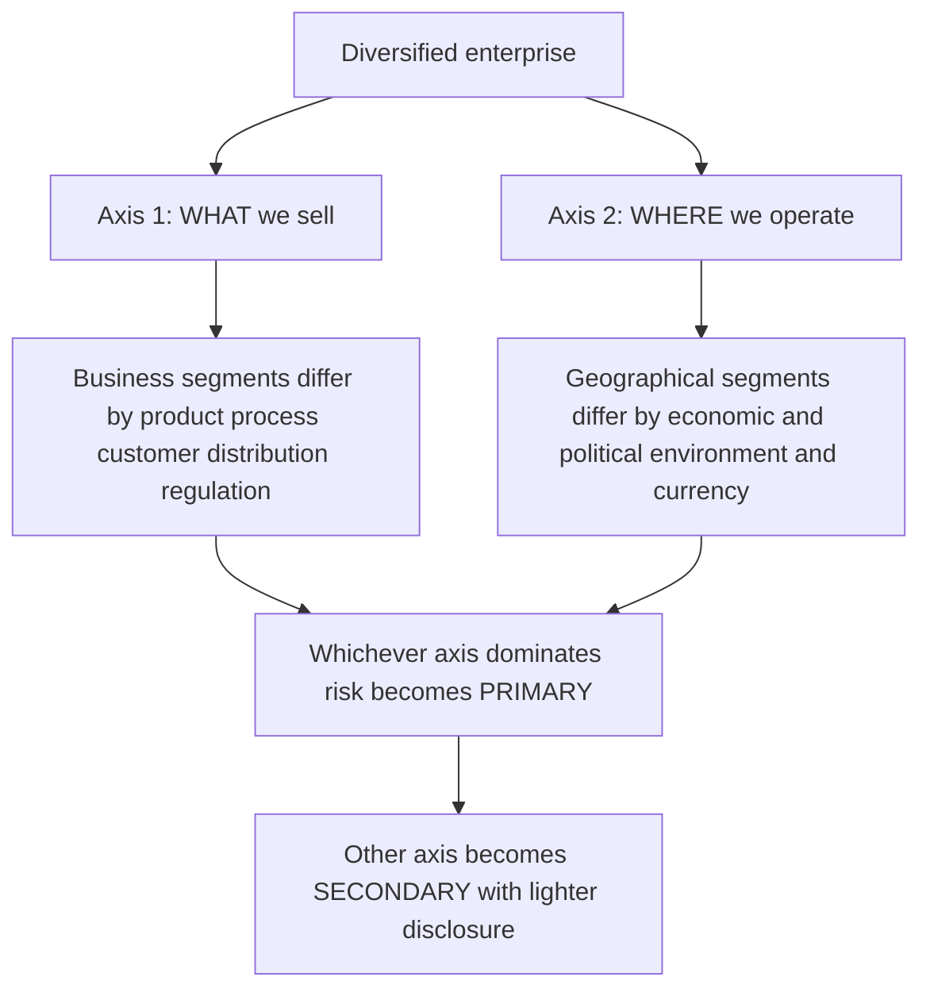
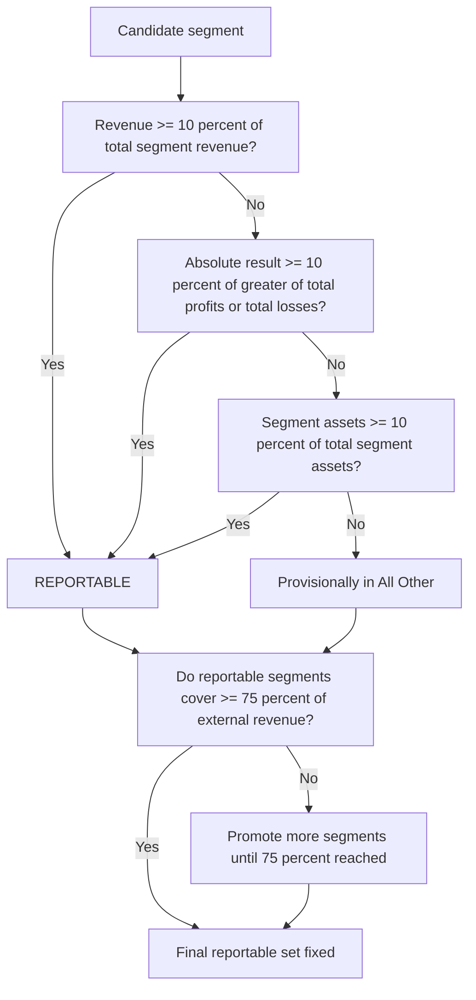
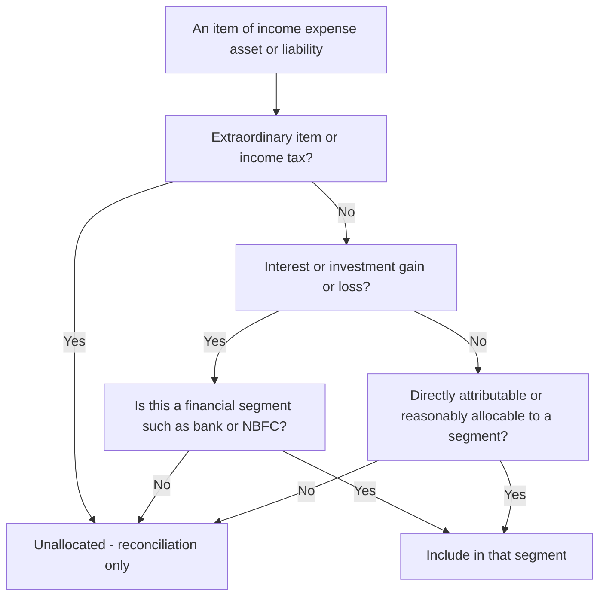

<!-- v2-deep -->

# Chapter 17 — AS 17: Segment Reporting

## 1. The Problem

Imagine you are an investor. In front of you sits the annual report of **Zenith Ltd.**, and the Statement of Profit & Loss tells you exactly one thing that matters:

> Net Profit for the year: ₹120 crore.

You feel informed. You are not.

Because "Zenith Ltd." is not one business. It is five businesses wearing one legal coat:

- A **steel plant** that earns thick margins when construction booms and bleeds when it busts.
- A **software services** arm that earns dollars from US clients.
- A **pharma** division under constant price-control threat from the Indian government.
- A **retail** chain fighting Amazon on razor-thin margins.
- A tiny **insurance broking** experiment that is losing money.

The single number ₹120 crore is a *blender smoothie*. Steel's ₹200 cr profit, software's ₹60 cr, pharma's ₹40 cr, retail's ₹(-150) cr disaster, and insurance's ₹(-30) cr all got poured in and pureed. You taste "profit". You cannot taste the poison.

Now ask the questions that actually decide whether you buy the share:

1. **Where is the money really coming from?** If 90% of profit is steel, this is a *cyclical steel bet*, not a diversified conglomerate. Your risk is a construction downturn, not "general business".
2. **What is dying?** Retail lost ₹150 cr. If you only see net ₹120 cr, you never learn that a ₹150 cr hole is being plugged by steel. Next year steel turns, and the whole thing collapses.
3. **What currency and country risk am I holding?** Software earns USD; a rupee appreciation guts it. The consolidated number hides that entirely.
4. **Where are the assets tied up?** Maybe retail *consumes* 40% of the company's capital while producing losses — a capital-allocation crime invisible in the aggregate.

This is the core problem AS 17 exists to solve:

> **A single consolidated figure mathematically averages away exactly the information a user needs to assess risk and return: the fact that a diversified enterprise is a bundle of businesses with different profitabilities, growth rates, and risk exposures.**

Aggregation is not neutral. It actively *destroys* dispersion information. And in finance, **dispersion (risk) is half the story** — the CAPM-trained part of your brain already knows that a portfolio's expected return means nothing without its variance and its covariance structure. AS 17 forces the company to *disaggregate the smoothie back into its ingredients* so users can price the risk of each.

**Push the point one level deeper — why aggregation is *irreversible*.** Once ₹200, ₹60, ₹40, (₹150) and (₹30) are added into ₹120, no outsider can ever recover the five inputs from the one output. Addition is a *many-to-one* function: infinitely many sets of segment profits collapse to the same ₹120 crore. A user cannot un-blend a smoothie by staring at it. Therefore the disaggregation **must come from the company**, at the point *before* the addition happened — which is precisely why AS 17 places the obligation on the preparer (who still holds the un-added numbers), not on the analyst. This is the informational asymmetry the standard closes: management can see the parts; without disclosure, the market can see only the sum.

**And why the market punishes the sum.** Empirically and theoretically, opaque conglomerates trade at a **conglomerate discount** — the whole is valued at *less* than the sum of its parts — because investors price *uncertainty about the mix* as extra risk. Segment reporting is, in effect, the company's tool to *earn back* that discount by proving the mix. A firm that hides its segments is asking the market to assume the worst about the hidden ones; a firm that discloses lets each part be valued on its own merits. AS 17 is thus not just an investor-protection rule — it is the mechanism by which an honest, well-run diversified firm can be *fairly* priced.

---

## 2. The Core Idea (Analogy)

Think of a company's financial statements as a **medical report**, and the consolidated P&L as a **single "you are healthy" verdict** printed on the front page.

A doctor who only tells you "your overall health score is 82/100" is useless. You need the **panel**: cholesterol, blood sugar, liver enzymes, kidney function, blood pressure. Why? Because a person can have an 82 average while their kidneys are failing — one organ can be in crisis while strong organs mask it in the average.

AS 17 is the standard that says: **"Print the full blood panel, not just the overall score."** Each *segment* is an organ. The standard tells you:

- **Which organs to test separately** (identifying segments — business vs geography).
- **When an organ is big enough to deserve its own line** (the 10% quantitative thresholds).
- **When you've tested enough of the body** (the 75% coverage test).
- **What readings to report for each organ** (segment revenue, result, assets, liabilities, and other disclosures).

And crucially — like a blood panel — it does **not** require reporting *every* microscopic reading. Testing every single capillary would drown the doctor in noise. So AS 17 sets *materiality thresholds*: only organs above a size matter; the rest get bundled into "all other". That balance — **enough detail to see risk, not so much that it becomes noise** — is the entire design tension of the standard.

Second analogy for the finance brain: AS 17 is **portfolio look-through**. When you hold a mutual fund, you demand the *holdings disclosure* — the top positions, sector weights, geographic split — not just the NAV. A conglomerate *is* an internally-managed portfolio of business units. Segment reporting is the mandatory holdings disclosure for that portfolio.

**Third analogy — the org chart is the map.** The reason AS 17 does not let a company invent *convenient* segments for the report is the same reason a doctor uses the body's *actual* organ boundaries, not lines drawn to flatter the patient. AS 17 says: look at how management has *already* cut the business into divisions for its own internal control — that internal cut is the honest map of where the risks live, because management drew it to *run* the company, not to *present* it. You report along the seams the business already has, not seams you carve for cosmetics. When the reporting boundary equals the *managing* boundary, manipulation becomes visible — a firm that reports differently from how it manages is signalling something.

---

## 3. Why It's Built This Way

Every design choice in AS 17 traces back to one user need: **help an outsider evaluate a diversified enterprise's risk and return the way an insider already can.** Let's derive the structure from first principles.

**Why two dimensions — business AND geography?**
Risk in a diversified firm runs along two independent axes:
- *What you sell* (a product's demand cycle, competition, technology, regulation) → **business segment risk**.
- *Where you sell / operate* (currency, country political risk, local demand, trade policy) → **geographical segment risk**.

Steel and software differ by *product*. Selling steel in India vs. exporting to Europe differs by *geography*. These are orthogonal risks. A single classification cannot capture both, so AS 17 mandates **both** — one as **primary**, one as **secondary**.

**Why primary vs. secondary — why not report both fully?**
Because full detail on both axes would create a combinatorial explosion (5 businesses × 4 regions = 20 cells, each with revenue/result/assets/liabilities). That is noise, not signal. So AS 17 says: pick the axis along which **your risks and returns are *predominantly* driven** — that becomes **primary** and gets *full* disclosure. The other axis gets **secondary** (lighter) disclosure. The company doesn't choose arbitrarily; the *dominant source of risk* — evidenced by how management actually organises and reports internally — decides.

This is the **"management approach lite"**: AS 17 leans on the company's *internal organisational structure and internal reporting system* to identify segments, because the way management *runs* the business is the best evidence of where the real risks lie. (Full contrast with Ind AS 108's pure "management approach" comes in Connections.)

**Why 10% thresholds?**
A pure "report everything" rule buries signal in trivia (the ₹2 lakh insurance experiment does not move an investor's decision). A "report only what management feels like" rule invites hiding the ugly division. So AS 17 sets an **objective, bright-line size test**: a segment matters if it is **≥10%** of the relevant total (revenue, result, or assets). Ten percent is the conventional materiality anchor — big enough to matter, small enough to catch anything genuinely significant.

**Why the 75% test on top of the 10% test?**
The 10% test could, in a very fragmented company, leave you with reportable segments covering only, say, 55% of revenue — the other 45% scattered across many sub-10% segments. That means nearly half the company is still an opaque blob. So AS 17 adds a **coverage floor**: the reportable segments together must capture **≥75% of external revenue**. If they don't, you *keep promoting* smaller segments until they do. This guarantees the user always sees the *majority* of the enterprise disaggregated.

The genius is the pairing: **10% ensures no big segment hides; 75% ensures the disclosed segments cover most of the company.** One is a floor on segment *size*, the other a floor on total *coverage*.

**Why three tests joined by OR — why not one test, or AND?**
A single test would have a blind spot. Revenue alone misses a *small-sales, huge-loss* division (the exact thing an investor most needs to see). Result alone misses a *break-even but capital-devouring* division that ties up 30% of assets earning nothing. Assets alone misses a *fee-light, asset-light but high-margin* division. Each dimension of risk — **top-line exposure (revenue), profitability swing (result), capital tied up (assets)** — can independently make a segment material. So AS 17 asks all three and joins them with **OR**: a segment that is significant on *any* dimension must be shown. **AND** logic would be perverse — it would require a segment to be big on all three simultaneously, letting single-dimension monsters slip through. The whole spirit of the standard is *catch the significant thing on whichever axis it is significant*.

**Why is segment *result* an operating figure — why strip out interest and tax?**
Interest expense is a function of the enterprise's *financing* decisions (how much debt the whole company chose to raise), not of a segment's *operating* quality. Two identical steel plants, one debt-funded and one equity-funded, have identical operating performance but different post-interest profit. To let a user compare a segment against peers and across firms, AS 17 measures the segment on its **operating** merits and quarantines financing and statutory items (interest, income tax) into the reconciliation. Tax is likewise an enterprise-level, jurisdiction-driven computation that cannot be sensibly split by product line. The point is comparability: an *operating* result is the clean signal of a segment's business risk and return.

**Why the symmetry rule (exclude the asset if you excluded the income)?**
This is a ratio-integrity safeguard. Users compute segment ratios — return on segment assets, for instance. If interest *income* is excluded from a non-financial segment's result but the interest-bearing *investment* stays in its assets, the denominator carries an asset whose earnings were stripped from the numerator, producing a nonsense ratio. So AS 17 enforces **matched exclusion**: whatever generates the excluded income/expense is also excluded from the related asset/liability. Numerator and denominator must describe the *same* activity.

**Why lean on internal reporting rather than let management design segments freshly?**
Two reasons. First, *reliability*: the internal structure already exists and is used to make real decisions and allocate real capital, so it is battle-tested, not a report-day fabrication. Second, *cost*: the company already produces internal segment numbers for its Board, so reusing them is cheap. AS 17 harvests information that management already has — it does not force a parallel, artificial segmentation. The rule "if internal structure is based on neither products nor geography, drop to the next lower level" exists so that a deliberately *unhelpful* top structure cannot be used to dodge disclosure.

**Why force restatement of comparatives when a new segment appears?**
A time series is only informative if each period is measured the same way. If a segment becomes reportable this year and last year's figures are *not* restated to show it, the user sees an artificial jump and cannot tell growth from reclassification. Restatement preserves **like-for-like comparability** — the whole reason multi-year statements exist. The "impracticable" escape hatch exists only because sometimes the historical data was never captured at that granularity.

---

## 4. Full Technical Content (RMPD Lens)

We'll dissect AS 17 through the exam's favourite lens: **R**ecognition (what is a segment / when is it reportable), **M**easurement (how to compute segment figures), **P**resentation, and **D**isclosure. But first, the vocabulary — each term is defined *because a computation depends on it*.

### 4.1 Scope

AS 17 applies to enterprises whose **equity or debt securities are listed** (or in the process of listing) on a recognised stock exchange, and to **all other commercial, industrial and business enterprises whose turnover exceeds the threshold** prescribed for Level I / SMC classification. Under the current ICAI/ Companies (Accounting Standards) Rules framework, AS 17 is **not applicable to Level II, III, IV (Non-company SMEs)** and to **SMCs** — i.e., segment reporting is essentially a **listed-and-large-company** discipline. *(Confirm the exact turnover/borrowing thresholds for your attempt in current ICAI material, as the SMC/Level definitions are periodically revised.)*

Rationale: segment detail matters most where there is a wide, arm's-length body of external users — public shareholders and lenders — who cannot phone the CFO. A small private company's owner already knows the segments.

**Consolidated-vs-standalone nuance.** When an enterprise presents **both** consolidated and separate (standalone) financial statements, AS 17 segment information need be presented **only on the basis of the consolidated financial statements** — the group is the reporting entity being disaggregated, so duplicating segment disclosure in the standalone set is not required. Keep this in mind when a question hands you a *parent plus subsidiaries* fact pattern.

### 4.2 The two kinds of segment

A **business segment** is a *distinguishable component* of an enterprise engaged in providing an **individual product or service or a group of related products/services** that is subject to **risks and returns that are different** from those of other business segments.

Factors to judge "different risks and returns" for a business segment:
- nature of the products/services;
- nature of the production processes;
- type or class of customers;
- methods of distribution;
- nature of the regulatory environment (e.g., banking, insurance, public utilities).

A **geographical segment** is a distinguishable component providing products/services **within a particular economic environment** subject to risks/returns different from components operating in other economic environments.

Factors for a geographical segment:
- similarity of economic and political conditions;
- relationships between operations in different areas;
- proximity of operations;
- special risks (e.g., currency);
- exchange control regulations;
- underlying currency risks.

A geographical segment may be based on either **location of assets** (where production happens) or **location of customers** (where sales go) — the choice depends on which better reflects the risk, and drives some secondary disclosures below.

**Finer distinction the exam tests — a "segment" is defined by *risk*, not by *legal or reporting convenience*.** Two products made in the same factory, sold to the same customers, through the same channel, under the same regulator, are the *same* business segment even if the company gives them different brand names — because they share risks and returns. Conversely, one product line sold under wildly different regulatory regimes in two countries can be two *geographical* segments. Always test **risk-and-return similarity**, not surface labels. A dominant single-product enterprise with only incidental other activities may legitimately conclude it has a **single reportable business segment** — in which case it still states that fact and gives the geographical secondary information.

*The two orthogonal risk axes and how one becomes primary.*

### 4.3 Identifying segments — the internal-organisation rule

Segments are **not** invented for the annual report. AS 17 says the **internal organisational and management structure** and the **internal financial reporting system** to the Board/CEO are *normally* the basis for identifying segments — because that structure already reflects the dominant source and nature of the enterprise's risks. Only if internal structure is based on *neither* products nor geography does the enterprise look at the *next lower level* of internal segmentation.

**Aggregating internal units into a reportable segment.** The internal structure may be finer than what risk-and-return similarity warrants — e.g., management runs "flat steel" and "long steel" as separate profit centres, but both share process, customers and regulation. AS 17 permits grouping *closely similar* components into a single business (or geographical) segment where they have similar risks and returns. The test for grouping is the same risk-and-return factor list; you do not multiply segments merely because internal cost centres multiply.

### 4.4 Primary vs. secondary — the decision rule

| Dominant source of risk/return | Primary format | Secondary format |
|---|---|---|
| Products and services | **Business** segments | Geographical segments |
| Geographical areas | **Geographical** segments | Business segments |
| Roughly matrix / balanced | Business segments (default) | Geographical segments |

If internal reporting is matrix-based (both matter equally), **business segments** are taken as primary and **geographical** as secondary (this is the AS 17 default tie-break).

**How to *read the evidence* of dominance in an exam problem.** The examiner rarely says "business is primary" outright. Infer it from the fact pattern:
- If the narrative stresses *different products with different margins, technologies, regulators* → business dominates → **business primary**.
- If it stresses *currency exposure, country political risk, export vs domestic, exchange controls* → geography dominates → **geography primary**.
- If it says management's internal reports go to the Board *by division (product)* → business primary; *by region* → geography primary.
- If it explicitly says both matter equally / a matrix organisation → **business primary by default**.

### 4.5 Recognition — WHICH segments are *reportable*? (the heart of the exam)

Identify candidate segments, then apply the **quantitative thresholds**. A segment is **reportable** if it passes **any one** of three 10% tests:

**Test 1 — Revenue (the 10% revenue test):**
Its **segment revenue** (external sales + inter-segment sales) is **≥ 10% of total revenue** (external + internal) of **all segments**.

**Test 2 — Result (the 10% result test):**
Its **segment result** (profit or loss) is **≥ 10%** of the **greater, in absolute amount, of:**
- (a) the combined result of **all segments in profit**, and
- (b) the combined result of **all segments in loss**.

*(Take the larger of the two absolute totals as the base; compare each segment's absolute result to 10% of that base.)*

**Test 3 — Assets (the 10% assets test):**
Its **segment assets** are **≥ 10% of total assets** of all segments.

Pass **any one** → reportable.

**The 75% coverage test (the top-up rule):**
After the 10% tests, add up the **external revenue** of all reportable segments. If this is **< 75% of total enterprise external revenue**, **designate additional segments as reportable** (even if they fail all three 10% tests) until the **≥75%** coverage is reached.

**Voluntary reporting & the "all other" bucket:**
Management *may* designate an internally-important segment as reportable even if below thresholds. Segments not reportable are aggregated into an **unallocated / "all other segments"** reconciling item.

**The 10% floor for *continuing* to report (comparability rule):**
- If a segment was reportable last year and management judges it **of continuing significance**, it is reported **this year even if it now fails all 10% tests** (so users get a stable time series).
- If a segment **becomes** reportable this year, **prior-period comparatives** are **restated** to show it separately, even if it failed last year — unless impracticable.

**Two edge cases the RMPD-Recognition step must handle:**
1. *A segment with negative (loss) result and small revenue.* It can still be reportable via the **result** test (absolute loss ≥ 10% of the larger profit/loss base) or the **assets** test. Never conclude "it's a loss-maker so it's immaterial" — losses are exactly what the standard hunts.
2. *A segment that exists only to supply others (no external sales).* Its **inter-segment revenue** still enters the revenue-test numerator and denominator, so it can be reportable. But note it contributes **zero** to the 75% *external*-revenue coverage test — a purely internal segment can be reportable yet do nothing to satisfy the 75% floor.

*The full reportability engine: three 10% tests (OR logic) followed by the 75% coverage top-up.*

### 4.6 Measurement — the building-block definitions

Segment figures are built from the **same accounting policies** used for the enterprise financial statements. Key definitions:

**Segment Revenue** = revenue **directly attributable** to a segment + revenue **reasonably allocable** to it, including **inter-segment transfers**. It **EXCLUDES**:
- extraordinary items;
- interest or dividend income (unless the segment is *financial* in nature, e.g., a bank/NBFC);
- gains on sale of investments or on extinguishment of debt (unless financial segment).

**Segment Expense** = expense **directly attributable** + expense **reasonably allocable**, including inter-segment expense. It **EXCLUDES**:
- extraordinary items;
- interest expense (unless financial segment);
- losses on sale of investments / debt extinguishment (unless financial);
- **income tax expense**;
- **general administrative / head-office expenses** and other enterprise-level expenses **that cannot be reasonably allocated** to a segment.

**Segment Result** = Segment Revenue − Segment Expense (before adjusting for minority interest). This is an **operating** result — interest and tax are deliberately kept out because they are financing/statutory items, not measures of a segment's *operating* risk and return.

**Segment Assets** = operating assets used by the segment (directly attributable + reasonably allocable). **Excludes** income-tax assets. If segment result includes interest/dividend income (financial segment), segment assets include the related receivables/investments. Assets are stated **net of related allowances/provisions** reported as direct offsets (e.g., debtors net of doubtful-debt provision).

**Segment Liabilities** = operating liabilities (directly attributable + reasonably allocable). **Excludes** income-tax liabilities and **borrowings/interest-bearing liabilities** (unless financial segment) — because interest is excluded from segment result, the debt that generates it is excluded from segment liabilities too. *Consistency:* whatever you exclude from **result**, you exclude the matching item from **assets/liabilities**.

**Inter-segment transfers** are measured on the **basis the enterprise actually uses** to price them internally (e.g., cost, cost-plus, market price), and that basis is **disclosed**. Inter-segment revenue is **eliminated** in arriving at enterprise totals.

Assets/liabilities/revenue/expense **jointly used** by segments are allocated only if a **reasonable basis** exists; otherwise they stay **unallocated** and appear only as reconciling items.

**The "reasonably allocable" judgement — where marks are won and lost.** The dividing line between a *segment* item and an *unallocated* reconciling item is the phrase **"reasonable basis of allocation."** A shared factory's depreciation split by floor-space used is reasonable → segment expense. The Chairman's salary or the group audit fee has **no** reasonable driver that maps it to steel-vs-software → unallocated. The exam tests whether you keep genuinely enterprise-level costs *out* of segments; do not "helpfully" spread head-office cost across segments on a revenue ratio unless the problem supplies a basis. Symmetry again: an item you cannot reasonably allocate to a segment's *result* also cannot sit in that segment's *assets/liabilities*.

**What "same accounting policies" forbids.** You may not, for segment reporting, switch a segment to a different depreciation method, a different inventory formula, or a different revenue-recognition point than the enterprise uses. If two segments genuinely need different policies (rare), the enterprise-level policy still governs the segment numbers so they reconcile. (This is a sharp AS 17 vs Ind AS 108 difference — Ind AS 108 reports segments *as the CODM sees them*, even on non-GAAP measures.)

*Decision path for whether an item enters a segment or stays unallocated in the reconciliation.*

---

## 5. Worked Examples

### Example 1 — The 10% tests, clean case (easy)

**Diversicorp Ltd.** has four business segments. Figures (₹ lakh):

| Segment | External revenue | Inter-segment revenue | Total revenue | Result (P/L) | Assets |
|---|---|---|---|---|---|
| Steel | 900 | 100 | 1,000 | 240 | 1,100 |
| Software | 500 | 0 | 500 | 150 | 300 |
| Pharma | 250 | 50 | 300 | 60 | 400 |
| Retail | 150 | 0 | 150 | (90) | 200 |
| **Total** | **1,800** | **150** | **1,950** | **360** | **2,000** |

**Step 1 — Revenue test (10% of total revenue ₹1,950 = ₹195):**
- Steel 1,000 ≥ 195 → PASS
- Software 500 ≥ 195 → PASS
- Pharma 300 ≥ 195 → PASS
- Retail 150 < 195 → fail

**Step 2 — Result test.** First split results into profits and losses:
- Total **profits** = 240 + 150 + 60 = **450**
- Total **losses** = |−90| = **90**
- Greater absolute base = **450**; 10% = **45**.
- Steel 240 ≥ 45 → PASS; Software 150 ≥ 45 → PASS; Pharma 60 ≥ 45 → PASS; **Retail |90| ≥ 45 → PASS** (the loss-maker qualifies on result even though it failed revenue!).

**Step 3 — Assets test (10% of ₹2,000 = ₹200):**
- Steel 1,100 → PASS; Software 300 → PASS; Pharma 400 → PASS; Retail 200 ≥ 200 → PASS.

**Step 4 — Reportable set:** all four pass at least one test → **all four are reportable.**

**Step 5 — 75% coverage check:** external revenue of reportable segments = 1,800 = 100% ≥ 75%. Satisfied.

*Teaching point:* Retail failed the revenue test but was caught by **both** the result test (loss ≥ 10% of the profit base) and the assets test. This is exactly why AS 17 uses **OR logic across three tests** — a loss-making or capital-heavy division must not escape disclosure just because its *sales* are small.

---

### Example 2 — The 75% top-up rule bites (exam-medium)

**Fragmento Ltd.** has six business segments; all external sales (no inter-segment), ₹ crore:

| Segment | External revenue | Result | Assets |
|---|---|---|---|
| A | 400 | 60 | 500 |
| B | 250 | 40 | 300 |
| C | 120 | 18 | 150 |
| D | 90 | 12 | 110 |
| E | 80 | 10 | 100 |
| F | 60 | 8 | 90 |
| **Total** | **1,000** | **148** | **1,250** |

**Step 1 — Revenue test (10% of 1,000 = 100):** A(400)✔, B(250)✔, C(120)✔; D(90)✘, E(80)✘, F(60)✘.

**Step 2 — Result test.** All results are profits ⇒ base = total profits = 148; 10% = 14.8.
- A 60✔, B 40✔, C 18✔, D 12✘, E 10✘, F 8✘.

**Step 3 — Assets test (10% of 1,250 = 125):** A 500✔, B 300✔, C 150✔; D 110✘, E 100✘, F 90✘.

**Step 4 — Provisional reportable set:** A, B, C.

**Step 5 — 75% coverage test.**
- External revenue of A+B+C = 400+250+120 = **770**.
- 75% of total external revenue (1,000) = **750**.
- 770 ≥ 750 → **coverage already satisfied.** No top-up needed. Reportable = A, B, C; D+E+F (230) go into **"All other segments"**.

Now change one number to force the top-up. Suppose C's revenue were only **70** (and total revenue 950). Redo:

- 75% of 950 = **712.5**.
- Reportable after 10% tests (assume now A, B only cover 400+250 = **650**).
- 650 < 712.5 → **must promote** the next largest segment. Promote **D (90)** → cumulative 740 ≥ 712.5. Satisfied.
- So D becomes reportable **even though it fails all three 10% tests**, purely to reach 75% coverage.

*Teaching point:* The 75% rule is a **coverage backstop**. When the 10% tests leave too much of the company hidden, you *promote* the largest remaining segments — biggest first — until three-quarters of external revenue is on the table.

---

### Example 3 — A financial segment, result base with losses, and full reconciliation (exam-hard)

**Omnibus Ltd.** (listed) runs four business segments. Business is product-driven ⇒ **business = primary**. Data (₹ lakh):

| Segment | External sales | Inter-seg sales | Interest income | Result | Assets | Liabilities |
|---|---|---|---|---|---|---|
| Manufacturing | 1,200 | 200 | — | 300 | 1,600 | 400 |
| Trading | 600 | 0 | — | 40 | 500 | 250 |
| **NBFC (financial)** | 300 | 0 | 150 | 120 | 900 | 700 |
| Consulting | 100 | 50 | — | (260) | 200 | 120 |

Head-office: unallocated corporate expenses ₹50; interest expense (enterprise borrowings) ₹90; income tax ₹60; unallocated corporate assets ₹300; unallocated corporate liabilities (incl. borrowings) ₹800.

**Note on the NBFC:** because it is a *financial* segment, its **interest income (₹150) is part of its segment revenue** and its lending assets are part of segment assets — the "exclude interest" rule is reversed for financial segments.

**Step 1 — Compute total segment revenue.**
- Manufacturing: 1,200 + 200 = 1,400
- Trading: 600
- NBFC: 300 external + 150 interest income = 450
- Consulting: 100 + 50 = 150
- **Total segment revenue = 1,400 + 600 + 450 + 150 = 2,600.**

**Revenue test (10% = 260):** Manufacturing 1,400✔, Trading 600✔, NBFC 450✔, Consulting 150✘.

**Step 2 — Result test.** Split:
- Profits: Manufacturing 300 + Trading 40 + NBFC 120 = **460**.
- Losses: Consulting |−260| = **260**.
- Greater absolute base = **460**; 10% = **46**.
- Manufacturing 300✔, Trading 40 (< 46)✘, NBFC 120✔, **Consulting 260 ≥ 46 ✔** (huge loss-maker caught).

Note Trading **fails** the result test (40 < 46) but already **passed** revenue — still reportable. Consulting **fails** revenue but **passes** result.

**Step 3 — Assets test (total segment assets = 1,600+500+900+200 = 3,200; 10% = 320):**
Manufacturing 1,600✔, Trading 500✔, NBFC 900✔, Consulting 200✘.

**Step 4 — Reportable set:** Manufacturing, Trading, NBFC (multiple tests), Consulting (result test) → **all four reportable.**

**Step 5 — 75% coverage:** external revenue of reportable = 1,200+600+300+100 = 2,200 = 100% ≥ 75%. ✔

**Step 6 — Reconciliation to enterprise figures.**

*Revenue reconciliation:*

| Item | ₹ lakh |
|---|---|
| Total segment revenue | 2,600 |
| Less: inter-segment eliminations (200 + 50) | (250) |
| **Enterprise revenue (external, incl. NBFC interest income)** | **2,350** |

*Result → Profit before tax reconciliation:*

| Item | ₹ lakh |
|---|---|
| Total segment result (300 + 40 + 120 − 260) | 200 |
| Less: unallocated corporate expenses | (50) |
| Less: interest expense (enterprise borrowings, non-financial) | (90) |
| **Profit before tax** | **60** |
| Less: income tax | (60) |
| **Profit after tax** | **0** |

*Assets reconciliation:*

| Item | ₹ lakh |
|---|---|
| Total segment assets (1,600+500+900+200) | 3,200 |
| Add: unallocated corporate assets | 300 |
| **Enterprise total assets** | **3,500** |

*Liabilities reconciliation:*

| Item | ₹ lakh |
|---|---|
| Total segment liabilities (400+250+700+120) | 1,470 |
| Add: unallocated corporate liabilities (incl. borrowings) | 800 |
| **Enterprise total liabilities** | **2,270** |

**Everything ties.** Segment result of ₹200 lakh becomes a PBT of only ₹60 lakh *after* the items AS 17 deliberately keeps out of segments — unallocated head-office cost and enterprise interest — proving *why* the standard requires the reconciliation: a user must be able to walk from the sum of segment results back to the audited bottom line.

*Teaching points bundled here:* (1) financial-segment interest is **inside** its revenue/assets; (2) a loss-making segment is caught by the **result** test off the *larger* profit/loss base; (3) interest, tax and unallocated corporate cost live **only in the reconciliation**, never in a segment.

---

### Example 4 — When losses exceed profits, the base flips (exam-medium, the trap made explicit)

**Turnaround Ltd.** has five business segments. This year several divisions are deep in loss. Results only (₹ lakh); assume every segment clears the assets test independently so we isolate the *result* test:

| Segment | Result (P/L) |
|---|---|
| P | 60 |
| Q | 30 |
| R | (140) |
| S | (90) |
| T | (10) |
| **Net** | **(150)** |

**Step 1 — Split into profit total and loss total (absolute):**
- Σ profits = 60 + 30 = **90**
- Σ losses (absolute) = 140 + 90 + 10 = **240**

**Step 2 — Pick the *greater absolute* base.** 240 > 90 ⇒ **base = 240** (the loss total), 10% = **24**.

**Step 3 — Compare each segment's absolute result to 24:**
- P |60| ≥ 24 → PASS
- Q |30| ≥ 24 → PASS
- R |140| ≥ 24 → PASS
- S |90| ≥ 24 → PASS
- T |10| < 24 → **fail** (on result)

**Contrast — what a careless student gets.** If you wrongly used **Σ profits (90)** as the base, 10% = 9, and then **T (10) would falsely PASS**. If you wrongly used the **net result (150)**, 10% = 15, and T (10) fails but for the wrong reason, and you would misclassify borderline segments in other problems. The *correct* base here is the **loss** total (240) because losses dominate in absolute size.

*Self-check:* the base must always be the **larger of the two piles**, ignoring signs. Net result is **never** the base. Here the loss pile (240) wins, so T's small ₹10 loss is immaterial on the result test — though T could still be dragged in by the assets test or the 75% top-up. *Teaching point:* the direction of the flip (profits vs losses) changes which small segments survive; read the sign of the aggregate before you compute.

---

### Example 5 — Geography primary, secondary business disclosure, and location-of-assets vs location-of-customers (exam-hard)

**Globe Exports Ltd.** manufactures entirely in India but sells worldwide; management runs the company **by region** because currency and country risk dominate ⇒ **geography = primary, business = secondary.** External revenue is classified by **customer location**; assets by **asset location**. (₹ crore):

| Geographical segment (by customer) | External revenue | Segment assets (by location of assets) |
|---|---|---|
| India | 300 | 900 |
| Europe | 450 | 150 |
| North America | 200 | 40 |
| Rest of World | 50 | 10 |
| **Total** | **1,000** | **1,100** |

Notice the mismatch: Europe is the **biggest market** (₹450 cr sales) but holds **few assets** (₹150 cr) because *production sits in India* (₹900 cr of assets). This divergence is the whole reason AS 17 asks for revenue by **customer** location *and* assets by **asset** location.

**Step 1 — Secondary disclosure by geography-of-customer for revenue (≥10% of ₹1,000 = ₹100):**
- India 300✔, Europe 450✔, North America 200✔, Rest of World 50✘ (below 10%, folded into "other").

**Step 2 — Assets by location of assets (≥10% of ₹1,100 = ₹110):**
- India 900✔, Europe 150✔; North America 40✘, Rest of World 10✘.

**Interpretation for the user.** Demand risk lives in **Europe** (₹450 cr of sales exposed to European recession and to EUR/INR); operational and asset risk lives in **India** (₹900 cr of plant exposed to Indian policy, labour, power). A single "geography" number would have masked the fact that *the company earns abroad but bets its capital at home* — a classic exporter's currency-and-country risk profile. Because customer geography (revenue) and asset geography diverge, AS 17 requires **both** cuts.

**Step 3 — Business (secondary) disclosure.** Suppose Globe has two product lines with external revenue and assets:

| Business segment | External revenue | Assets |
|---|---|---|
| Textiles | 700 | 800 |
| Leather goods | 300 | 300 |
| **Total** | **1,000** | **1,100** |

Both exceed 10% of the respective totals, so under the **secondary business** format Globe discloses, for each: **external revenue**, **segment assets**, and **cost of acquiring segment fixed assets** — but *not* the full primary set (no segment result, no liabilities, no reconciliations on the secondary axis).

*Teaching point:* Under geography-primary, the **primary** full disclosures (result, liabilities, reconciliations, capital additions, depreciation) are given **by region**; the **business** axis gets only the lighter secondary trio (external revenue, assets, capital additions), each subject to its own ≥10% filter. Do not accidentally give segment *result* by the secondary axis — a very common over-disclosure error.

---

### Example 6 — Comparative restatement when a new segment crosses the threshold (concept-application)

**Grow Ltd.** reported three business segments last year: Alpha, Beta, Gamma. A fourth activity, **Delta**, was a start-up bundled inside "All other segments" last year (revenue then ₹40 cr, well below 10%). This year Delta's revenue is ₹260 cr and it clears the 10% revenue test, so Delta becomes **reportable** for the first time.

**Required treatment:**
1. **This year:** disclose Delta as a separate reportable segment with the full primary set.
2. **Prior year comparatives:** **restate** last year's segment note to carve Delta *out* of "All other" and show it as its own column with last year's ₹40 cr and related result/assets — **even though Delta was not reportable last year** — so the two years are comparable. The *only* exception is if the historical Delta data cannot be reassembled (**impracticable**), which must then be disclosed.
3. **Reverse situation:** had Delta instead *fallen* from reportable to below 10% but management still regarded it as **of continuing significance**, Grow would keep reporting Delta separately this year, to avoid a jarring disappearance in the time series.

*Self-check / teaching point:* Reportability is judged **each year on current figures**, but *comparability* over time is protected by two asymmetric rules — **restate the past** when something newly qualifies, and **optionally retain** something that just dropped out. Both exist so a reader can compare like with like across years rather than chase reclassifications.

---

## 6. Presentation & Disclosure Formats

### 6.1 Primary segment disclosures (FULL set)

For **each reportable segment** under the primary format, disclose:

1. **Segment revenue**, split into **external** and **inter-segment**.
2. **Segment result.**
3. **Total carrying amount of segment assets.**
4. **Total segment liabilities.**
5. **Cost incurred to acquire segment fixed assets** (tangible + intangible capital additions) during the period.
6. **Depreciation and amortisation** included in segment result.
7. **Total non-cash expenses** other than depreciation/amortisation included in segment expense (e.g., provisions).

And the four **reconciliations** (the "glue" that ties segments to the face of the financials):
- Segment **revenue** → enterprise revenue;
- Segment **result** → enterprise profit/loss (before tax);
- Segment **assets** → enterprise assets;
- Segment **liabilities** → enterprise liabilities.

### 6.2 Secondary segment disclosures (LIGHTER set)

**If business is primary (geography secondary), disclose by geographical segment:**
- Segment **revenue from external customers** by customer location (for each geo segment ≥10% of enterprise external revenue);
- Segment **assets** by asset location (for each geo segment whose assets ≥10% of total assets);
- **Cost of acquiring segment fixed assets** by asset location.

**If geography is primary (business secondary), disclose by business segment:**
- **External revenue** for each business segment ≥10% of enterprise external revenue;
- **Segment assets** for each business segment ≥10% of total assets;
- **Cost of acquiring fixed assets** for those business segments.

**Extra geographical nuance:** if the *location of customers* differs materially from the *location of assets* (e.g., you manufacture in India but sell to Europe), disclose external revenue by **customer** location AND assets by **asset** location — because the two carry different risks (demand risk vs. operational/currency risk).

**Sharpen the asymmetry between primary and secondary.** The primary axis carries the **full** load (result, liabilities, reconciliations, capital additions, depreciation, non-cash expenses). The secondary axis carries only a **trimmed trio**: external revenue, segment assets, and cost to acquire fixed assets. There is **no** segment *result*, **no** segment *liabilities*, and **no** *reconciliation* required on the secondary axis. Memorise this split — examiners award marks for knowing what you *don't* disclose on the secondary axis just as much as for what you do.

### 6.3 Other mandatory disclosures

- **Basis of pricing inter-segment transfers** and any change in that basis.
- **Changes in accounting policies** for segment reporting (with restated priors and effect), separately from enterprise-level policy changes.
- **Types of products/services** in each business segment and **composition** of each geographical segment.
- **Reconciliation between secondary information and aggregate figures** is *not* required, but where the amounts don't obviously tie (e.g., "other" residuals), a clear presentation of the residual is expected so a reader is not left with an unexplained gap.

### 6.4 A specimen primary-format table (business primary)

| ₹ lakh | Manufacturing | Trading | NBFC | Consulting | Elimination / Unalloc. | Enterprise |
|---|---|---|---|---|---|---|
| External revenue | 1,200 | 600 | 450 | 100 | — | 2,350 |
| Inter-segment revenue | 200 | 0 | 0 | 50 | (250) | — |
| **Total revenue** | 1,400 | 600 | 450 | 150 | (250) | 2,350 |
| **Segment result** | 300 | 40 | 120 | (260) | (140)* | 60 (PBT) |
| Segment assets | 1,600 | 500 | 900 | 200 | 300 | 3,500 |
| Segment liabilities | 400 | 250 | 700 | 120 | 800 | 2,270 |
| Capital additions | … | … | … | … | | |
| Depreciation | … | … | … | … | | |

*\*Unallocated corporate expense (50) + enterprise interest (90). Tax (60) then reduces PBT 60 to PAT 0.*

### 6.5 The matrix-presentation option

Where **both** business and geographical segmentation carry significant risk, AS 17 *permits* (but does not mandate) an enterprise to present **full primary disclosures on both axes** — a "matrix presentation." This is a voluntary richer disclosure, chosen when management believes a single primary axis would understate the risk picture. If a company does *not* elect the matrix, it must still pick one primary axis and give the secondary axis its lighter trio. Recognise the matrix option so you don't mark a matrix-presenting company as non-compliant — presenting *more* than the minimum is always allowed.

---

## 7. Connections

- **AS 5 (Extraordinary & Prior-period items):** AS 17 explicitly **excludes extraordinary items** from segment revenue/expense — segment result is meant to reflect *ordinary operating* performance. The two standards share a vocabulary; know that "extraordinary" is defined in AS 5.
- **AS 3 (Cash Flow Statements):** AS 17 asks for segment *capital additions* and *depreciation* — components a sophisticated user maps to a rough per-segment cash-flow picture.
- **AS 21 / 23 / 27 (Consolidation):** Segment reporting is typically presented on **consolidated** financials where consolidated statements are prepared; the enterprise being disaggregated is the *group*. Inter-segment eliminations echo the consolidation-elimination mindset. Note the rule from 4.1: when both consolidated and standalone statements are issued, segment info is given only on the **consolidated** basis.
- **AS 28 (Impairment):** A segment is often close to a **cash-generating unit**; a loss-making reportable segment is a red flag prompting impairment testing of that segment's assets.
- **AS 24 (Discontinuing Operations):** A discontinuing operation is frequently an entire business/geographical segment; AS 24 disclosures dovetail with the segment already identified under AS 17.
- **AS 4 / AS 29 (Provisions):** The AS 17 "other non-cash expenses" disclosure (item 7 of the primary set) frequently captures provisions recognised under AS 29 — the standards interlock at the segment-expense line.
- **Ind AS 108 (Operating Segments) — the big contrast:** AS 17 uses a **risk-and-reward** approach with prescribed business/geography categories and *defined* segment revenue/result/assets. **Ind AS 108** uses the pure **management approach**: segments are whatever the **Chief Operating Decision Maker (CODM)** reviews, measured **as reported internally** (even on non-GAAP bases), with a reconciliation. Ind AS 108 also adds **entity-wide disclosures** (products, geographies, major customers ≥10% of revenue). Exam-critical: *AS 17 dictates the measurement; Ind AS 108 lets internal reporting dictate it.* Under Ind AS 108 there is *no* fixed primary/secondary split and *no* prescribed business-vs-geography duality — a frequent MCQ discriminator.
- **SEBI LODR / listing framework:** listed companies' segment disclosure in quarterly and annual results is anchored to the accounting-standard definition — the standard's segment identification flows straight into regulatory reporting, which is why getting reportability right has consequences beyond the annual accounts.
- **Finance-theory bridge:** Segment data is the raw material for **sum-of-the-parts (SOTP) valuation** — value each segment on its own multiple and add. Impossible without AS 17 disclosures. Your MBA-Finance instinct to un-bundle a conglomerate is *exactly* what the standard enables.

---

## 8. Traps & Examiner Tricks

1. **Result test base — the classic trap.** The base is the **greater (in absolute value) of total profits OR total losses**, *not* the net result and *not* always total profits. If losses exceed profits in absolute terms, the base is the **loss** total. Students who always use total profit will misidentify segments. Re-read Example 3's Step 2 and the full flip in Example 4.

2. **Inter-segment revenue is IN the revenue test but OUT of the 75% test.** The 10% **revenue** test uses **total revenue (external + inter-segment)**. The **75% coverage** test uses **external revenue only**. Mixing these bases is the single most common numerical error.

3. **"Passes one test ⇒ reportable" (OR, not AND).** A segment needs to clear **only one** of the three 10% tests. Examiners plant a segment that fails two tests but scrapes the third — it is still reportable.

4. **The loss-maker that "hides" in revenue.** A small-revenue but big-loss division (like Retail/Consulting above) fails the revenue test but is caught by the **result** test. Watch for it — the exam loves it because it's the whole point of the standard.

5. **Interest and tax inside a segment.** Never put **interest expense** or **income tax** into segment result *for a non-financial segment* — they belong in the **reconciliation**. Reverse for a **financial** segment (bank/NBFC): interest **income** is part of its revenue.

6. **Consistency of exclusion.** If you exclude interest from **result**, exclude the interest-bearing **borrowings** from segment **liabilities**; if you exclude tax from result, exclude tax **assets/liabilities**. Examiners test whether asset/liability and result exclusions are *symmetric*.

7. **Vertically-integrated segments with no external sales.** A segment selling *only* to other segments still counts — its **inter-segment revenue** goes into the revenue test. But remember it adds **zero** to the 75% external-revenue coverage. (Ind AS 108 treats internal-only components differently, but AS 17 counts internal transfers for the revenue test.)

8. **Comparability rules.** A newly-reportable segment forces **restatement of comparatives**; a segment that *was* significant but slips below 10% may still be reported if of *continuing significance*. Don't drop it mechanically.

9. **Unallocated ≠ a segment.** Head-office assets, corporate expenses, tax, and enterprise borrowings are **reconciling items**, never a "reportable segment". Presenting them as a segment column labelled "Corporate" is fine *as a reconciliation column*, not as a segment.

10. **Same accounting policies.** Segment figures must use the **same policies** as the main statements. An examiner may give a segment measured on a different basis to see if you (wrongly) accept it — under AS 17 you don't (this is where Ind AS 108 differs).

11. **10% assets test uses total *segment* assets**, i.e., the sum of segment assets — not enterprise total assets *including* unallocated corporate assets. Using the wrong denominator shifts the threshold.

12. **Secondary axis over-disclosure.** Do **not** report segment *result*, *liabilities*, or *reconciliations* on the secondary axis — only external revenue, assets, and cost of fixed-asset additions, each with its own ≥10% filter. Giving the full primary set on both axes (unless the company elected the matrix presentation) is an over-disclosure error.

13. **"Reasonably allocable" vs unallocated.** Don't spread genuine head-office cost (Chairman's pay, group audit fee) across segments on a revenue ratio unless the problem supplies a reasonable basis. If it can't be reasonably allocated, it stays **unallocated** — and its related asset stays out too (symmetry).

14. **Revenue-test threshold uses total of *all* segments including inter-segment.** The denominator is the combined revenue of *all* segments (external + inter-segment), not enterprise external revenue. Using enterprise external revenue as the denominator understates the base and can wrongly promote small segments.

15. **≥ vs >.** The tests are **"10% or more"** and **"75% or more."** A segment sitting *exactly* at 10% (or coverage sitting exactly at 75%) **qualifies / is satisfied** — it is inclusive. Don't reject a bang-on-10% segment.

16. **Single-segment enterprise still discloses.** A dominantly single-product firm concludes it has one business segment — it must still *state* that and give the geographical secondary information. "One segment" is not "no disclosure."

---

## 9. First-Principles Recap

- A single consolidated profit figure **averages away risk dispersion** — the very information a diversified enterprise's investors and lenders need. Segment reporting exists to **un-blend** it. Addition is irreversible, so the disaggregation must come from the preparer who still holds the parts.
- Risk runs on two orthogonal axes: **what you sell** (business) and **where you operate** (geography). AS 17 reports **both**, one **primary** (full detail), one **secondary** (lighter), chosen by the **dominant source of risk**, evidenced by internal organisation.
- A candidate segment is **reportable** if it clears **any one** of three **10% tests** — **revenue**, **result** (off the *larger* of total profits/total losses, absolute), or **assets** — with **OR** logic so loss-makers and asset-heavy units can't hide. Three tests exist because significance can arrive on any one of three independent dimensions.
- The **75% external-revenue coverage** test is a backstop: keep promoting segments (largest first) until reportable segments cover ≥75% of external revenue, guaranteeing the user sees most of the company.
- Thresholds exist to balance **signal vs. noise**: 10% ensures nothing big hides; 75% ensures broad coverage; below that, detail is trivia bundled into **"all other"**.
- **Segment result is an operating measure**: interest, income tax, extraordinary items and unallocated corporate costs are deliberately **excluded** and pushed into the **reconciliation** (financial segments excepted for interest) — so segments are comparable regardless of financing and tax structure.
- **Exclusion is symmetric**: whatever is out of result (interest/tax) is out of the matching assets/liabilities, protecting the integrity of segment ratios.
- Four **reconciliations** (revenue, result, assets, liabilities) are mandatory on the **primary** axis — they prove the disaggregated parts still sum to the audited whole. The secondary axis carries only a trimmed trio and no reconciliation.
- Segment figures use the **same accounting policies** as the enterprise; **inter-segment transfers** are priced on the internal basis and **disclosed** and **eliminated**.
- **Comparability** is protected: newly-reportable segments trigger **restated comparatives**; formerly-significant segments may still be shown.

---

## 10. Quick-Revision Sheet

**Scope:** Listed enterprises + large (Level I / non-SMC) entities. Not for SMCs / small entities. Segment info only on **consolidated** basis when both consolidated and standalone are issued. *(Confirm current thresholds.)*

**Two segment types:**
- **Business** = related products/services, distinct risk (product, process, customer, distribution, regulation).
- **Geographical** = distinct economic environment (economics, politics, currency, exchange controls); may be by **location of assets** or **location of customers**.

**Primary vs secondary:** dominant risk axis = **primary** (full disclosure); other = **secondary** (lighter). Matrix ⇒ **business primary** (default). Optional full **matrix presentation** allowed.

**Reportability — clear ANY ONE 10% test (≥, inclusive):**
| Test | Base | Threshold |
|---|---|---|
| Revenue | Total revenue of all segments (external + inter-segment) | ≥10% |
| Result | Greater (absolute) of Σ profits or Σ losses | ≥10% |
| Assets | Total segment assets | ≥10% |

**Then 75% test:** Σ external revenue of reportable segments must be **≥75%** of enterprise external revenue; else promote more (largest first). Internal-only segments add nothing here.

**Segment Result excludes:** extraordinary items, interest, income tax, unallocated corporate/HO expense, investment gains — *unless a financial segment* (then interest income/expense included).

**Symmetry:** exclude interest from result ⇒ exclude borrowings from segment liabilities; exclude tax from result ⇒ exclude tax assets/liabilities; can't reasonably allocate a cost ⇒ can't allocate its asset either.

**Primary disclosures (per reportable segment):** revenue (external + inter-segment) • result • assets • liabilities • capital additions • depreciation/amortisation • other non-cash expenses • **4 reconciliations**.

**Secondary disclosures (lighter, no result/liabilities/reconciliation):** external revenue + assets + capital additions by the *other* axis, each ≥10%; disclose customer-location revenue vs asset-location assets if they diverge.

**Other:** inter-segment pricing basis • policy changes (restate priors) • composition/products of each segment.

**Comparability:** new reportable segment ⇒ **restate comparatives** (unless impracticable); formerly significant segment ⇒ may continue.

**One-line memory hook:** *"Un-blend the smoothie — 10% (any of three, OR) to catch the big or the ugly, 75% to cover the body, and reconcile back to the whole; interest and tax live only in the reconciliation."*
