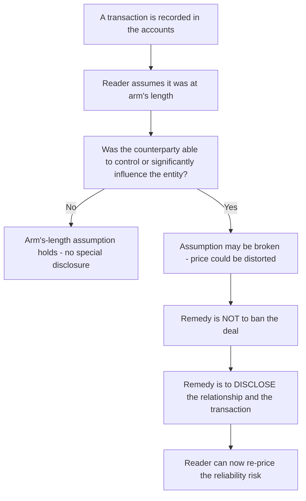
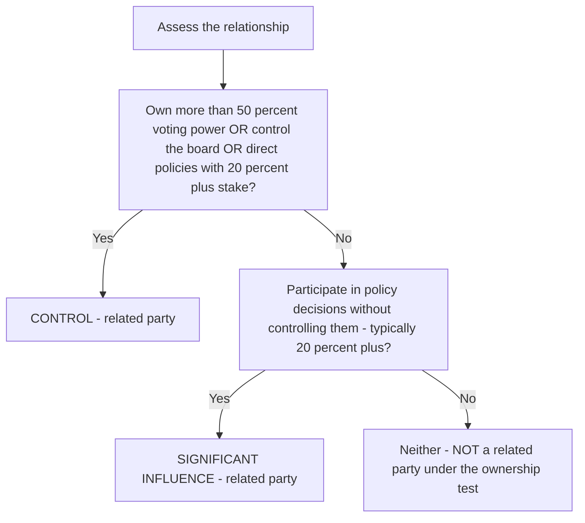
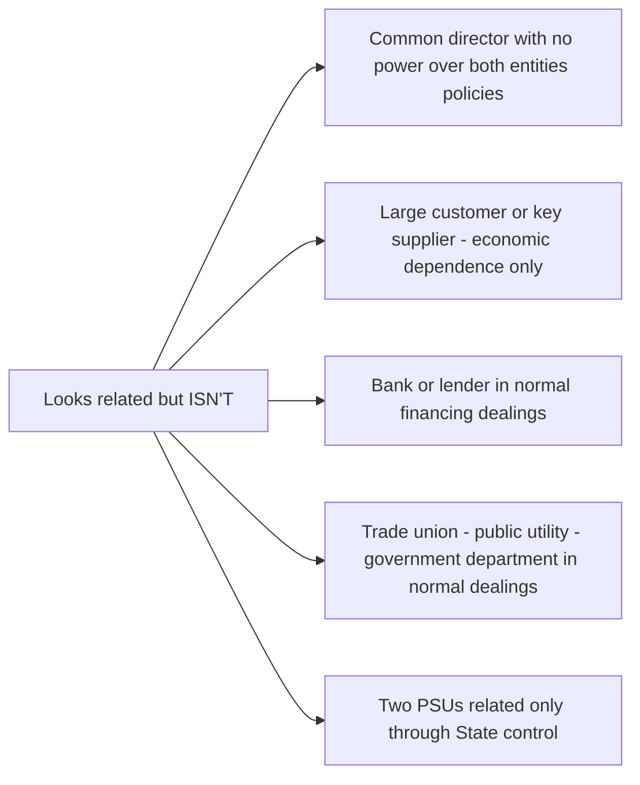
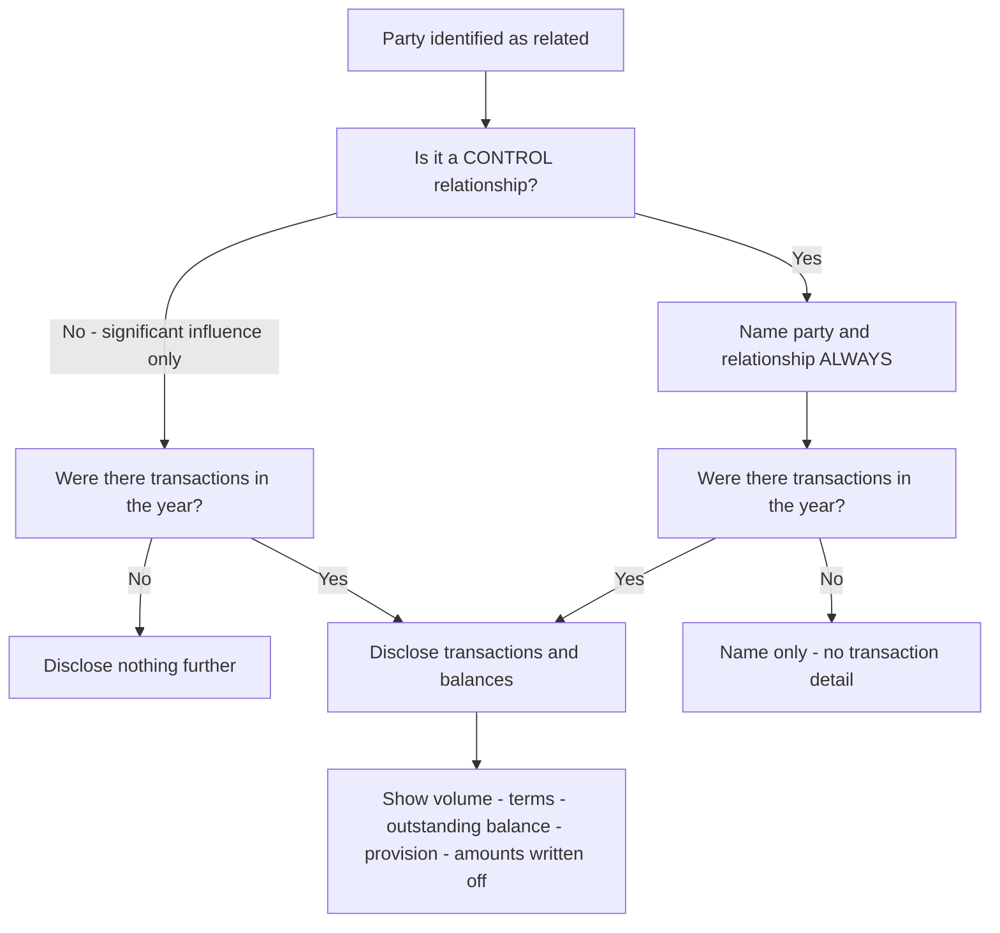

<!-- v2-deep -->

# Chapter 18 — AS 18: Related Party Disclosures

## 1. The Problem

Open any set of financial statements and read the numbers as a stranger. You assume — because you *must* assume — that every rupee of revenue, every purchase, every loan on that balance sheet was struck between two independent parties, each pushing for its own advantage. That single hidden assumption is the load-bearing beam of the whole edifice. Accountants call it the **arm's-length assumption**: the price is what it is because a willing seller and a willing buyer, neither controlling the other, haggled and met in the middle.

Now break the assumption. Suppose a company sells its entire output to another company owned by the same promoter, at a price the promoter dictates on both sides of the table. Suppose a company "lends" ₹50 crore to the managing director's private firm at zero interest, or buys raw material from the chairman's wife's proprietorship at 40% above market. Suppose a loss-making subsidiary is propped up by the parent buying its goods at inflated prices to keep the subsidiary's bankers happy.

Every one of these is a *legal* transaction. None of it is fraud in the criminal sense. Yet each one quietly poisons the numbers. The revenue is real cash but the *margin* is a fiction — it exists only because a related company was willing to overpay. The profit is engineered, not earned. And the reader, trusting the arm's-length assumption, values the company as if that profit were repeatable against the open market. It is not.

Here is the sharp edge of the problem: **you cannot detect this from the face of the accounts.** A ₹100 crore sale to an outsider and a ₹100 crore sale to a promoter's company look *identical* in the Profit & Loss Statement. The line item "Revenue from Operations — ₹100 crore" carries no flag. The distortion is invisible precisely because the accounting is technically correct. Debit cash, credit sales — flawless double entry, wholly misleading picture.

So the reliability of financial statements — one of the four qualitative characteristics the Framework demands (relevance, reliability, comparability, understandability) — springs a leak. Not because a number is wrong, but because a *relationship* behind the number is undisclosed. AS 18 exists to plug exactly this leak.

**The three distinct harms a related party can inflict.** It sharpens the exam answer to name *how* a related relationship damages the accounts, not just *that* it does:

1. **Price distortion** — the transaction happened, but at a non-market price (over-invoiced purchase, under-priced sale, interest-free loan). Reported profit is mis-stated.
2. **Existence-without-substance / round-tripping** — a transaction is manufactured purely to inflate turnover or window-dress ratios (e.g., sell to a related party near year-end, buy it back in April). The *volume* is fake.
3. **The relationship itself, even with no transaction** — a parent's mere existence changes the subsidiary's borrowing capacity, supplier terms, strategic freedom and going-concern profile. There is nothing to price, yet the reader is still exposed.

AS 18 is deliberately wide enough to catch all three. This is why — as we will see — a *controlling* relationship must be disclosed **even when not a single transaction occurred**: harm (3) needs no transaction to exist.

## 2. The Core Idea (Analogy)

Think of a boxing match with published odds. Bettors price the odds assuming the two fighters are strangers trying to knock each other out. Now imagine the two boxers are brothers, and one has quietly agreed to take a dive in round three. The *fight still happens*. Punches are still thrown. But the outcome is no longer an honest contest — and anyone betting on the published odds is being fleeced by information they don't have.

The boxing commission has two ways to respond. Option A: **ban brothers from ever fighting each other.** Clean, but absurd — sometimes the two best fighters genuinely *are* related, and a real contest between them would be the match of the century. Banning it destroys value. Option B: **force disclosure.** Announce loudly before the bell: "These two are brothers." Now the bettors know. They can discount the odds, demand better terms, or walk away. The fight proceeds; the information asymmetry is cured.

AS 18 is Option B for financial statements. It does **not prohibit** related party transactions — companies deal with subsidiaries, associates and promoters for a hundred legitimate, efficient reasons (shared logistics, group treasury, captive supply). Prohibition would be economic vandalism. Instead, the standard forces the company to *ring a bell*: "Reader, be warned — the following relationships exist, and the following transactions happened between us and people who are not at arm's length. Now price that in yourself."

The remedy is **transparency, not restriction.** That is the single most important idea in this entire chapter, and it is why the standard is titled *Disclosures*, not *Restrictions* or *Prohibitions*.

**Why disclosure beats the two obvious alternatives.** Sharpen the intuition by rejecting the rivals to disclosure:

- *Why not simply prohibit?* Already answered — it destroys legitimate group efficiency. A ban is a blunt instrument aimed at a problem that is only *sometimes* present.
- *Why not force restatement to arm's-length prices?* Because the accountant has no reliable, objective market price for most related transactions (what *is* the "market" royalty for a promoter's brand, or the arm's-length rate for a bespoke inter-company service?). Forcing a re-measurement would substitute the auditor's guess for the recorded number — trading a *disclosed* distortion for an *invented* one. Disclosure keeps the real number and adds the warning label. **The reader, not the accountant, re-prices the risk** — because only the reader knows what use they are putting the accounts to.

That last line is the philosophical heart of AS 18: it respects the *division of labour* between preparer (who reports facts and relationships) and user (who forms judgements).

## 3. Why It's Built This Way

Why disclosure rather than prohibition, and why draw the boundary of "related party" exactly where AS 18 draws it? Three design pressures shaped the standard.

**First, prohibition is both impossible and undesirable.** A parent *must* transact with its subsidiary — that's the point of having a subsidiary. You cannot ban the group from functioning. And many related-party dealings are genuinely efficient. The accounting profession's job is not to run the business but to make the business *reportable*. So the standard targets the information gap, not the transaction.

**Second, the danger is not the transaction itself but the *possibility* that it was not at arm's length.** Note the subtlety: AS 18 requires disclosure of related party transactions **whether or not a price was charged, and whether or not the price was actually distorted.** Why disclose even a fair-priced transaction? Because the reader has no independent way to verify fairness, and because the *relationship itself* can affect the entity's financial position even with no transaction at all — a parent's mere existence can change a subsidiary's borrowing capacity, its supplier terms, its strategic freedom. The relationship is the risk; the transaction is merely its most visible symptom.

**Third, the boundary must be drawn around *the ability to influence*, not around family sentiment or legal form.** The whole theory is: a party is "related" if it *could* have caused the arm's-length assumption to fail — through **control** (it can dictate) or **significant influence** (it can materially sway) over the reporting entity's financial and operating decisions. This is why two companies aren't related just because they trade a lot with each other, or share a banker, or operate in the same market. Volume of dealing is not influence. AS 18 hunts for *power over decisions*, because only power can bend a price.

**The "ability" test, not the "exercise" test.** Read the definition again with a magnifying glass: a party is related if it has the *ability* to control or significantly influence — **not** only if it actually *exercised* that ability. A 90%-owned dormant subsidiary with which the parent never traded is still a related party, because the *ability* is present. This is deliberate: waiting for the power to be *used* would let a company conceal a relationship simply by not transacting until the very last day of the year. Capturing *ability* also plugs harm (3) from §1 — the latent power that shapes the entity even in stillness.

**The "at any time during the period" rule.** Relationship is tested *across the whole reporting period*, not just at the balance-sheet date. A subsidiary sold off in October is still a related party for the April–October transactions of that year, and must be disclosed even though it is a stranger by 31 March. Examiners love the party who "was" related but is not on the closing date — the transactions while related are disclosable.

This is why AS 18 is structured as: (a) a precise **definition of who is related** (the power test), followed by (b) a list of **exclusions** (parties who look related but lack decision-power over the entity), followed by (c) a **disclosure regime** (what to reveal so the reader can re-price the risk). Reasoning first, rule second — the standard itself is built on the logic we just walked through.

*The logical spine of AS 18: influence creates risk, and disclosure — not prohibition — cures it.*

## 4. Full Technical Content (Recognition · Measurement · Presentation · Disclosure)

AS 18 is a **pure disclosure standard**. It does not tell you how to *measure* or *record* a transaction — you record a sale to a subsidiary exactly as you'd record any sale (AS 9 governs recognition). What AS 18 governs is *identifying* related parties and *disclosing* the relationship and dealings. So the "RMPD" lens here collapses mostly into **Identify** and **Disclose**, with no special recognition/measurement rules. That itself is an exam-worthy point: **AS 18 changes what you say, not what you book.**

### 4.1 Scope — when the standard applies

AS 18 applies in the financial statements of **each reporting enterprise** and also in **consolidated financial statements**. It deals with related party *relationships and transactions* where:

- one party **controls** another, or
- one party has **significant influence** over another, or
- the parties are under **common control**, etc.

**Exemptions from disclosure (important):**
- **Intra-group transactions eliminated on consolidation** need not be disclosed in the *consolidated* financial statements (they've already been cancelled out — no distortion survives).
- **State-controlled enterprises** need not disclose transactions with *other* state-controlled enterprises. (Rationale: if government control were enough to make two PSUs "related," half the economy would be related to the other half — the disclosure would be voluminous and meaningless.)
- **Confidentiality overriding statutes:** where disclosure would conflict with a duty of confidence imposed by statute or a regulator, AS 18 disclosure is not required (e.g., certain banking confidentiality). This is a narrow carve-out — statute, not mere contractual secrecy.

**A "state-controlled enterprise" defined.** For this exemption an enterprise is state-controlled if the **Central or State Government** controls it (within the AS 18 meaning of control). The relief is *reciprocal and narrow*: PSU-A need not disclose dealings with PSU-B **solely because both are government-controlled**. But if PSU-A *also* has an ordinary related relationship with PSU-B — say PSU-A holds 80% of PSU-B — then PSU-B is a *subsidiary* and the exemption does **not** apply; normal disclosure is required. The relief only removes the "related-merely-through-the-State" tie, not any independent tie.

**What "not required to disclose" does *not* mean.** These are exemptions from *disclosure*, not from the *relationship existing*. In an identification question ("is X related to Y?") the answer can still be "yes, related" while disclosure is separately excused. Keep *identification* and *disclosure* as two distinct steps.

### 4.2 The definition of "Related Party"

> **Parties are considered related if at any time during the reporting period one party has the ability to *control* the other party or *exercise significant influence* over the other party in making financial and/or operating decisions.**

Two power-words to define precisely.

**Control** means **any one** of:
1. **Ownership**, directly or indirectly, of **more than one-half (>50%) of the voting power** of an enterprise; **OR**
2. **Control of the composition of the board of directors** (of a company) or of the governing body (of any other enterprise) — i.e., the power to appoint/remove the majority of directors; **OR**
3. A **substantial interest in voting power** *combined with* the **power to direct**, by statute or agreement, the financial and/or operating policies of the enterprise.

Note point 3: **substantial interest** is defined as holding, directly or indirectly, **20% or more of the voting power**. But 20%+ *alone* is not control — it must be coupled with the *power to direct policies*. Hold this distinction; examiners love it.

**"Voting power," not "shareholding."** Control is measured on *voting* power, not on the raw equity/paid-up capital figure. A company can hold 60% of the *total* share capital yet, because half of that is non-voting preference capital, hold well under 50% of the *votes* — and therefore not have control under limb 1. Conversely, differential-voting-right (DVR) shares can hand control with a minority of the economic stake. Always convert the question's numbers into **votes** before applying the >50% / 20% tests.

**"Directly or indirectly" — the chain rule.** Indirect holdings count. If H holds 100% of S1 and S1 holds 60% of S2, then H *indirectly* controls S2 (through S1). The classic trap: examiners give a *diluted* chain — H holds 80% of S1, S1 holds 55% of S2 — and ask if H controls S2. Answer: **yes**. Control is not multiplied down the chain like an economic interest (80% × 55% = 44% is the *economic* stake, which is irrelevant to *control*). What matters is that at *each link* there is control (>50%), so control passes all the way down. Do **not** multiply the percentages to test control.

**Significant influence** means **participation in the financial and/or operating policy decisions of an enterprise, but NOT control** of those policies. It's a seat at the table and a real say, short of the power to dictate.

- Significant influence may arise from **share ownership, statute, or agreement.**
- The **presumption** (rebuttable): holding, directly or through subsidiaries, **20% or more of the voting power** is presumed to give significant influence — *unless* it can be clearly demonstrated otherwise. Conversely, **below 20%** is presumed *not* to give significant influence unless clearly demonstrated.
- Influence can also come via **representation on the board, participation in policy-making, material inter-company transactions, interchange of managerial personnel, or dependence on technical information.** (Substance over the 20% arithmetic.)

**The associates-only-count-direct wrinkle for significant influence.** For the *significant influence* presumption, AS 18 counts voting power held **directly or through subsidiaries** — an interest held through an *associate* (not a subsidiary) is a subtler question and is judged on substance. Do not blindly add up every layer; check whether each intermediate holding is itself a *subsidiary*.

*The two power-tests: control dictates policy; significant influence merely sways it. Either makes a party related.*

### 4.3 The categories of related parties (the "who")

AS 18 lists the relationships that qualify. Learn them as *situations*, not as a list:

| # | Category | Plain meaning | Example |
|---|----------|---------------|---------|
| (a) | **Enterprises that control, are controlled by, or are under common control with, the reporting enterprise** | Holding companies, subsidiaries, and fellow subsidiaries | H Ltd owns S1 and S2 — H, S1, S2 are all related to each other |
| (b) | **Associates and Joint Ventures** of the reporting enterprise; and the **investing party / venturer** of which the reporting enterprise is an associate or JV | Parties with *significant influence* either way | A Ltd holds 30% of B Ltd — A and B are related |
| (c) | **Individuals** owning (directly/indirectly) an interest in voting power that gives **control or significant influence**, and **relatives** of any such individual | Promoter-individuals and their close family | Mr X owns 60% of P Ltd — Mr X and his relatives are related to P |
| (d) | **Key Management Personnel (KMP)** and their **relatives** | Those with authority and responsibility for planning, directing, controlling the entity's activities | MD, whole-time directors, CEO — and their relatives |
| (e) | **Enterprises over which any person in (c) or (d), or their relatives, can exercise significant influence** | The "back-door" firms — companies controlled by the promoter's family or by KMP | The MD's wife's proprietorship; a firm where the promoter's son is a partner |

**Key Management Personnel (KMP)** = persons who have the *authority and responsibility* for planning, directing and controlling the activities of the reporting enterprise. Note: it's about **authority**, not job title. A non-executive director with no authority may not be KMP; a powerful executive who isn't on the board may be.

**Relative** (of an individual) = **the spouse, son, daughter, brother, sister, father and mother** who may be expected to influence, or be influenced by, that individual in dealings with the reporting enterprise. **Memorise this list exactly — it is closed.** (Note what's *absent*: nephews, in-laws, grandparents, cousins are **not** relatives for AS 18. Compare this with the wider list under the Companies Act — AS 18 has its own narrower definition and it governs here.)

**Two finer distinctions in category (b) — associate vs fellow-associate.** Category (b) makes an entity's *own* associates and JVs related, and makes the *investor/venturer* related. It does **not** automatically make two associates of the *same* investor related to *each other*. If Invest Ltd holds 30% of A1 and 30% of A2, then A1 and A2 are each related to Invest Ltd, but A1 and A2 are **not** related to one another (neither controls nor significantly influences the other). This is the associate-side twin of the "fellow-subsidiary" question — and the answers differ: **fellow subsidiaries ARE related to each other (common control); fellow associates are NOT.** The difference is that *common control* is an explicit limb of category (a), whereas *common significant influence* is not a limb of category (b).

**Category (e) is the anti-avoidance net.** Without it, a promoter would simply route every distortive deal through a private firm he controls and claim "the firm is not mentioned in AS 18." Category (e) closes that door: any enterprise over which a controlling individual, a KMP, or *their relatives* can exercise significant influence is dragged in. Note the asymmetry the standard uses — category (e) is triggered by *significant influence* (a lower bar), deliberately casting a wide net around the promoter/KMP family's business empire.

### 4.4 Who is NOT a related party (the exclusions)

This is where marks are won, because it's counter-intuitive. The following are **NOT related parties merely by virtue of these dealings** (AS 18 explicitly says so):

1. **Two companies simply because they have a director in common** — *unless* that director is able to affect the policies of *both* in their mutual dealings. (A common director with no such power = not related.)
2. **A single customer, supplier, franchiser, distributor, or general agent** with whom the entity does a **significant volume of business**, merely by that economic dependence. (Big customer ≠ related party. Dependence is not influence.)
3. **Providers of finance (e.g., lenders/banks), trade unions, public utilities, and government departments/agencies** in the course of their **normal dealings** with the enterprise — even though they may circumscribe freedom of action or participate in decisions. (Your banker constrains you but is not related.)

**Why economic dependence is deliberately excluded.** A monopsony buyer taking 90% of your output has enormous *bargaining leverage* — so why isn't it "influence"? Because AS 18 targets power over the entity's *own governance decisions* (who sits on its board, what policies it adopts), not power *across the negotiating table* of a single deal. Bargaining leverage is priced by ordinary commercial forces and is symmetric — you can walk away, renegotiate, find another buyer. Governance control cannot be walked away from. The standard draws the line at *internal decision power*, and economic dependence, however severe, sits on the wrong side of that line. (The examiner's favourite dressing: "Company sells 80% of production to one buyer for the last five years." Still not related.)

**The "normal dealings" qualifier on financiers.** The lender exclusion holds *in the course of normal dealings*. If a bank steps *beyond* normal lending — e.g., it takes 55% of the voting equity in a debt-restructuring, or contractually acquires the right to appoint the majority of the board — it is no longer a mere financier; it now has **control** and becomes related. The exclusion protects the *ordinary* creditor relationship, not a creditor who has crossed into governance.

*The exclusion set: economic dependence, common directorships without power, and normal financing/regulatory dealings do not create a related-party relationship.*

### 4.5 What must be disclosed

Disclosure has two layers. **Layer 1** is about the *relationship*; **Layer 2** is about the *transactions*.

**Layer 1 — Relationships where CONTROL exists:**
Where control exists, the **name of the related party and the nature of the relationship** must be disclosed **irrespective of whether there have been any transactions** between them. This is crucial: even with *zero* transactions, a controlling relationship must be named. (Why? Because the *existence* of control itself affects the entity — its strategic freedom, borrowing capacity, going concern. The relationship is material even when dormant.)

**A critical asymmetry — control vs significant influence.** The "name it even with no transactions" rule applies **only to control relationships**, not to significant-influence ones. An *associate* (significant influence, not control) needs to be disclosed **only if there were transactions** with it during the year. So:

| Relationship | Transactions occurred? | Disclose name & relationship? |
|---|---|---|
| Control (holding/subsidiary) | No | **Yes** — still name it |
| Control (holding/subsidiary) | Yes | Yes |
| Significant influence (associate/JV) | No | **No** — nothing to disclose |
| Significant influence (associate/JV) | Yes | Yes |

This asymmetry is a top-tier exam distinction. Reason: *control* changes the entity's whole existence (going concern, strategy) even when dormant; mere *influence* only matters through the deals it may have coloured, so no deal → nothing to warn about.

**Layer 2 — Where transactions have occurred**, the reporting enterprise discloses:
1. The **name of the transacting related party**;
2. A **description of the relationship**;
3. A **description of the nature of transactions**;
4. **Volume of the transactions** — either as an amount or as an appropriate proportion;
5. **Any other elements** of the transactions necessary for understanding (e.g., pricing policy);
6. **Amounts or appropriate proportions of outstanding items** (balances) at the balance sheet date, and **provisions for doubtful debts** due from related parties at that date;
7. **Amounts written off or written back** in the period in respect of debts due from or to related parties.

**Aggregation:** Items of a **similar nature may be disclosed in aggregate by type of related party**, *except* where separate disclosure is necessary to understand the effects of related party transactions on the financial statements. So you can group "Sales of goods to subsidiaries — ₹X" rather than list every invoice — but you cannot bury a distortive individual transaction inside an aggregate if that hides its effect.

**Names by category:** disclosure is typically given **category-wise** (holding company, subsidiaries, associates, KMP, relatives, enterprises controlled by KMP/relatives), with the **name of each related party** and the nature of relationship.

### 4.6 Illustrative list of transaction *types* to disclose

Purchase/sale of goods; purchase/sale of fixed assets; rendering/receiving of services; agency arrangements; leasing/hire-purchase; transfer of research & development; licence agreements; finance (including loans and equity contributions in cash or in kind); guarantees and collaterals; **management contracts including for deputation of employees**; and **remuneration/managerial payments to KMP**. If it moved value between the entity and a related party, it's disclosable.

### 4.7 What is a "related party transaction" — and one thing that is *not*

A **related party transaction** is a *transfer of resources or obligations* between related parties, **whether or not a price is charged**. Two exam-critical consequences:

- **Free transfers count.** A gift of an asset, an interest-free loan, a guarantee given for no fee, a service rendered gratis — all are related party transactions even though no consideration flowed, because a *resource or obligation* moved. The absence of a price is itself the reddest of flags and must be disclosed (point 5, "other elements").
- **Not everything about a KMP is a related party transaction.** This is where remuneration bites: managerial remuneration paid to KMP for *their services as management* **is** disclosable. But a dividend paid to a director-shareholder *in their capacity as an ordinary shareholder on the same terms as everyone else* is generally not treated as a distinct related-party dealing needing separate flagging (it is a pro-rata distribution to all shareholders, not a bilateral bargain). Watch the *capacity* in which the party transacts.

## 5. Worked Examples

### Example 1 — Identify the related parties (easy → building the reflex)

**Facts.** H Ltd holds 70% of S Ltd and 25% of A Ltd. Mr P owns 55% of H Ltd. Mrs P (Mr P's wife) runs a proprietary firm, "PMart," which sells packaging to S Ltd. B Ltd is S Ltd's largest customer, buying 40% of S Ltd's output. C Bank has lent S Ltd ₹20 crore. Mr K is the Managing Director of S Ltd.

**Required.** For S Ltd's financial statements, list who is a related party and who is not, with reasons.

**Solution.**

| Party | Related to S Ltd? | Reason |
|-------|-------------------|--------|
| H Ltd | **Yes** | Holds 70% (>50%) voting power → **control**. Category (a). |
| Mr P | **Yes** | Controls H (55%), which controls S → controls S indirectly. Category (c). |
| Mrs P | **Yes** | **Relative** (spouse) of Mr P, who controls S. Category (c). |
| PMart | **Yes** | Enterprise over which Mrs P (a relative of controlling individual) exercises significant influence/control. Category (e). |
| A Ltd | **No** (to S) | H holds 25% of A → A is H's **associate**, related to *H*. But S and A are *not* related to each other merely as fellow investees — S neither controls nor significantly influences A, nor vice versa. **Not related to S.** *(Watch: A is related to H; the question asks about S.)* |
| B Ltd | **No** | Merely a large customer (40% of output). **Economic dependence is not influence** — explicit AS 18 exclusion. |
| C Bank | **No** | Provider of finance in normal dealings — explicit exclusion. |
| Mr K | **Yes** | Managing Director = **KMP** of S Ltd. Category (d). His relatives too. |

**Reconciliation of reasoning:** every "Yes" traces to *control* or *significant influence* over S (directly or through a chain); every "No" fails the power test (dependence, normal financing) or the wrong-entity trap (A Ltd).

### Example 2 — The 20% presumption and its rebuttal

**Facts.** X Ltd acquires 22% of the equity voting shares of Y Ltd. However, a shareholders' agreement bars X from board representation, and all of Y's policy decisions require approval of Z Ltd, which holds 60%. In a separate case, W Ltd holds only 18% of V Ltd but, by agreement, appoints 3 of V's 5 directors.

**Required.** Is X related to Y? Is W related to V?

**Solution.**

*X and Y:* The 20%+ holding (22%) *presumes* significant influence. But AS 18 says the presumption is **rebuttable** — if it can be **clearly demonstrated** that influence does not exist, the party is not related. Here X has *no* board seat and *no* participation in policy (Z controls with 60%). The presumption is **rebutted**. **X is NOT a related party of Y** — provided the absence of influence is clearly demonstrable (document it).

*W and V:* Only 18% — *below* 20%, so ownership *presumes no* significant influence. **But** W appoints 3 of 5 directors → it **controls the composition of the board** → that is **control** under limb 2 of the control definition, *regardless of the 18%*. **W IS a related party (indeed controls V).**

**Lesson that reconciles both:** the percentage is a *presumption*, never the answer. Substance — actual power over policy or the board — overrides the arithmetic in *both* directions.

### Example 3 — Full disclosure note (exam-hard, with computation)

**Facts (year ended 31 March 2026).** P Ltd's group and transactions:
- P Ltd holds 80% of Sub Ltd (subsidiary) and 30% of Asso Ltd (associate).
- Mr M is Managing Director (KMP); remuneration paid ₹48,00,000.
- During the year P Ltd: sold goods to Sub Ltd ₹6,00,00,000; purchased goods from Asso Ltd ₹1,50,00,000; gave an interest-free loan to Sub Ltd ₹2,00,00,000 (outstanding at year-end ₹2,00,00,000); received rent from Mr M's proprietary firm "M-Estates" ₹12,00,000.
- Trade receivable from Sub Ltd at 31 March 2026: ₹90,00,000, against which a provision for doubtful debts of ₹10,00,000 was created. ₹5,00,000 of an old debt due from Asso Ltd was **written off**.

**Required.** Draft the related party disclosure note.

**Solution — Step 1: classify the parties.**

| Related party | Category | Basis |
|---------------|----------|-------|
| Sub Ltd | Subsidiary (a) | 80% control |
| Asso Ltd | Associate (b) | 30% significant influence |
| Mr M | KMP (d) | Managing Director |
| M-Estates | Enterprise controlled by KMP (e) | Mr M's proprietary firm |

**Step 2: map each transaction to a party and confirm arithmetic** (all figures in ₹):

| Transaction | Party | Amount | Type |
|-------------|-------|-------:|------|
| Sale of goods | Sub Ltd | 6,00,00,000 | Revenue |
| Purchase of goods | Asso Ltd | 1,50,00,000 | Purchase |
| Interest-free loan given | Sub Ltd | 2,00,00,000 | Finance |
| Rent received | M-Estates | 12,00,000 | Services/Income |
| Remuneration | Mr M | 48,00,000 | Managerial payment |

**Step 3: the disclosure note.**

> **Note — Related Party Disclosures (AS 18) — Year ended 31 March 2026**
>
> **(A) Names of related parties and nature of relationship**
> - Subsidiary: **Sub Ltd** (80% held)
> - Associate: **Asso Ltd** (30% held)
> - Key Management Personnel: **Mr M**, Managing Director
> - Enterprise over which KMP has significant influence: **M-Estates** (proprietary firm of Mr M)
>
> *(The controlling relationship with Sub Ltd is disclosed irrespective of transactions.)*
>
> **(B) Transactions during the year and balances outstanding**

| Nature of transaction | Subsidiary (Sub Ltd) | Associate (Asso Ltd) | KMP (Mr M) | Enterprise controlled by KMP (M-Estates) |
|---|---:|---:|---:|---:|
| Sale of goods | 6,00,00,000 | — | — | — |
| Purchase of goods | — | 1,50,00,000 | — | — |
| Loan given (interest-free) | 2,00,00,000 | — | — | — |
| Rent received | — | — | — | 12,00,000 |
| Managerial remuneration | — | — | 48,00,000 | — |
| **Outstanding receivable at 31 Mar 2026** | 90,00,000 | — | — | — |
| **Loan outstanding at 31 Mar 2026** | 2,00,00,000 | — | — | — |
| **Provision for doubtful debts (year-end)** | 10,00,000 | — | — | — |
| **Amounts written off during year** | — | 5,00,000 | — | — |

> **(C) Other elements:** The loan to Sub Ltd is interest-free and repayable on demand. *(Disclosing the pricing/terms is required where necessary for understanding — here, "interest-free" is exactly the kind of non-arm's-length term the reader must know.)*

**Reconciliation check:** every transaction in Step 2 appears once in the note; the outstanding receivable (₹90,00,000), its provision (₹10,00,000), the loan balance (₹2,00,00,000), and the write-off (₹5,00,000) are each separately shown as the standard requires (points 6 and 7 of §4.5). Nothing is aggregated across *types* of party. The note is complete.

### Example 4 — Common director, and the "related for part of the year" tweak (medium → exam-hard)

**Facts.** Consider four independent situations for the year ended 31 March 2026.
1. Mr D is a director of both L Ltd and M Ltd. He is a non-executive director in each and has no power to affect the policies of either in their mutual dealings. L Ltd sold goods worth ₹80 lakh to M Ltd during the year.
2. G Ltd held 90% of T Ltd until **30 September 2025**, on which date it sold its entire stake to an unrelated buyer. Between April and September, G Ltd purchased goods worth ₹3 crore from T Ltd.
3. R Ltd holds 45% of the *equity* of Q Ltd, but Q Ltd's capital also includes voting preference shares such that R Ltd's *voting* power is only 35%. No board control, no policy-direction agreement.
4. E Ltd owns 60% of F Ltd. F Ltd owns 55% of J Ltd. Are E and J related?

**Required.** Decide the related-party status in each situation, with the governing principle.

**Solution.**

1. **L and M are NOT related.** A common director does *not* create a related relationship unless that director can affect *both* companies' policies in their mutual dealings. Mr D cannot. The ₹80 lakh sale is an arm's-length transaction between unrelated parties — **no AS 18 disclosure**. *(If the facts changed so that Mr D could direct both companies' policies, the answer flips and the sale becomes disclosable.)*

2. **G and T WERE related for April–September**, because relationship is tested "*at any time during the reporting period*." Even though they are strangers on the 31 March closing date, G Ltd **must disclose** the ₹3 crore of purchases made while T was its subsidiary, describing the relationship and noting it subsisted up to 30 September 2025. The trap answer — "not related, since not a subsidiary at year-end, so no disclosure" — is **wrong**.

3. **R and Q are NOT related on the ownership test.** Control and significant influence run on *voting* power (35%, here coupled with no board/policy power), not on the 45% *equity* figure. 35% voting *would* raise the 20%+ significant-influence presumption — so unless R can *clearly demonstrate* it does not participate in Q's policy decisions, R is in fact **related to Q via significant influence**. *(Note the sub-trap: the 45% equity is a distractor; but 35% voting still clears the 20% presumption, so absent rebuttal the honest answer is "related — significant influence." Only affirmative proof of no influence rebuts it.)*

4. **E and J ARE related.** E controls F (60%); F controls J (55%); control passes down the chain, so E *indirectly controls* J. Do **not** multiply 60% × 55% = 33% — that is the *economic* interest and is irrelevant to the *control* question. At each link control exceeds 50%, so E controls J. **Related, category (a).**

**Reconciliation:** (1) tests the "common director needs power over both" exclusion; (2) tests "at any time during the period"; (3) separates *voting* power from *equity* and re-applies the rebuttable presumption; (4) tests the chain rule. All four turn on the same axiom — *ability to control/influence decisions*, judged on substance.

### Example 5 — KMP remuneration, capacity, and the "no-transaction control" rule (exam-hard)

**Facts (year ended 31 March 2026).** N Ltd:
- is a **100% subsidiary** of Ultimate Ltd. During the year there were **no transactions** between N Ltd and Ultimate Ltd.
- paid its Managing Director, Ms K (KMP), remuneration of ₹60 lakh and paid a **dividend of ₹4 lakh** to Ms K on the 40,000 equity shares she holds as an ordinary shareholder (same ₹10 per share dividend paid to *all* shareholders).
- reimbursed ₹2 lakh of travel expenses to Ms K's **brother**, who is on the payroll as a regional sales officer with no managerial authority.
- has a **fellow subsidiary**, Cousin Ltd (also 100% held by Ultimate Ltd), with whom N Ltd exchanged goods worth ₹7 crore.

**Required.** State, with reasons, what AS 18 requires N Ltd to disclose.

**Solution.**

- **Ultimate Ltd (holding company):** a **control** relationship. Even though **no transactions occurred**, N Ltd must **name Ultimate Ltd and the nature of the relationship** (Layer 1 rule — control relationships are disclosed irrespective of transactions). *This is the whole point of the "no-transaction" facts.*
- **Cousin Ltd (fellow subsidiary):** related under category (a) (**common control**). The ₹7 crore of goods exchanged must be disclosed (nature, volume, balances). *Contrast Example 1's fellow associates, which are NOT related — fellow **subsidiaries** are.*
- **Ms K's remuneration (₹60 lakh):** a related party transaction with **KMP** in her *management* capacity — **disclose** as managerial remuneration.
- **Ms K's dividend (₹4 lakh):** received in her *ordinary shareholder* capacity, on identical terms as all shareholders. This is a pro-rata distribution, not a bilateral bargain that could be off-market; it is generally **not** singled out as a distinct AS 18 dealing. *(Watch the capacity — same fact pattern, different capacity, different treatment.)*
- **Brother's ₹2 lakh reimbursement:** Ms K's brother **is a relative** of KMP (brother is on the closed list). A transaction *with a relative of KMP* falls in category (d) and is, in principle, **disclosable** as a transaction with a relative of KMP — the fact that he is also an employee does not launder the relationship. *(Trap: candidates often ignore this because "he's just a junior employee." The relationship, not the seniority, governs.)*

**Reconciliation:** two independent axioms carry this question — (i) *control relationships are named even with zero transactions* (Ultimate Ltd), and (ii) *the party's capacity/relationship governs disclosability* (dividend vs remuneration; brother-as-relative). Fellow-subsidiary status (common control) catches Cousin Ltd.

## 6. Presentation & Disclosure Formats

AS 18 disclosures are given as a **note to the financial statements**, typically in two blocks: **(A) names and relationships** (category-wise), and **(B) a transactions-and-balances matrix** (parties across the top, transaction types down the side), followed by **(C) narrative on terms/pricing** where needed.

**Standard column headings** (category-wise, per the Schedule III / ICAI practice):

| Recommended disclosure columns |
|--------------------------------|
| Holding Company |
| Subsidiaries |
| Fellow Subsidiaries |
| Associates / Joint Ventures |
| Key Management Personnel (KMP) |
| Relatives of KMP |
| Enterprises controlled by KMP / relatives |

**Row items (transaction types)** to present as applicable: Sales, Purchases, Rendering of services, Receiving of services, Rent paid/received, Interest paid/received, Loans given/taken, Guarantees given, Dividend paid/received, Remuneration to KMP, and — as balance-sheet-date items — Amounts receivable, Amounts payable, Provision for doubtful debts, Amounts written off/back.

**Non-negotiable presentation rules:**
- **Control relationships are named even if no transactions occurred.**
- Disclose **outstanding balances AND the related provision** for doubtful debts separately.
- **Similar items aggregated by type of related party** — but never so as to hide a materially distortive individual transaction.
- Present the **comparative previous-year figures** (general requirement of financial statements).

*Disclosure decision tree: control relationships are always named; transaction detail is driven by whether dealings actually occurred.*

## 7. Connections

AS 18 does not live alone. Its map:

| Standard / Law | Relationship to AS 18 |
|---|---|
| **AS 21 (Consolidated Financial Statements)** | Uses the same **control** concept (>50% voting power / control of board). Intra-group transactions eliminated on consolidation need not be disclosed under AS 18 in CFS. |
| **AS 23 (Investments in Associates)** | Shares the **significant influence** concept (20% presumption). An associate identified under AS 23 is a related party under AS 18. |
| **AS 27 (Interests in Joint Ventures)** | Joint ventures and venturers are related parties under AS 18 category (b). |
| **AS 9 (Revenue Recognition)** | AS 18 does *not* change how a sale to a related party is recognised or measured — AS 9 still governs the number; AS 18 governs the *disclosure* of it. |
| **AS 24 / AS 4 etc.** | AS 18 disclosure interacts with other note disclosures but adds a *relationship* dimension others lack. |
| **Companies Act 2013 — Sec 188 & Sec 2(76)** | Statutory related-party regime: Sec 188 *regulates* (board/shareholder approval for certain RPTs). Note the **definitions differ** — the Act's "related party" and "relative" lists are **wider** than AS 18's. For *accounting disclosure*, AS 18's definitions govern; for *approval/compliance*, the Act governs. Don't conflate them. |
| **SEBI LODR (listed entities)** | Adds its own RPT disclosure and approval thresholds on top of AS 18. |

The through-line: **control** and **significant influence** are the shared vocabulary of AS 18, 21, 23 and 27 — learn them once, deploy them four times.

**AS 18 (accounting) vs Ind AS 24 (its Ind AS counterpart) — a note of caution.** In the Ind AS world the corresponding standard is **Ind AS 24**, which is *broader*: it brings in **post-employment benefit plans** for the entity's employees, **close members of family** (a wider family net than AS 18's closed 7-item list), and it requires KMP compensation to be **broken down by category** (short-term, post-employment, other long-term, termination, share-based). For **CA Intermediate Accounting**, examine under **AS 18** unless the paper explicitly says Ind AS. Do not import Ind AS 24's wider family definitions or its compensation breakup into an AS 18 answer. *(Verify the exact syllabus coverage against current ICAI material for your attempt.)*

**Why the Companies Act list is wider — and why that is fine.** The Act regulates *governance and approvals* (a political/anti-abuse tool), so it deliberately over-includes (HUF members, in-laws, holding/subsidiary companies by definition). AS 18 regulates *decision-usefulness of accounts*, so it targets only parties whose *influence* could distort the numbers. Different purposes → different (and correct) definitions. An exam answer that says "AS 18 relative includes son-in-law because the Companies Act does" is **wrong** — the purpose dictates the definition.

## 8. Traps & Examiner Tricks

1. **"Large customer/supplier = related party."** **FALSE.** Economic dependence is explicitly excluded. The trap dangles "70% of sales to one customer" hoping you'll call them related. You don't — unless there's actual control/influence.
2. **Wrong-entity trap.** H holds 25% of A; the question asks about *S* (a sibling subsidiary). A is related to *H*, **not to S**. Always ask "related to *which* reporting entity?"
3. **Common director ≠ related.** Two firms sharing a director are related **only if** that director can affect *both* firms' policies in their mutual dealings. A plain common directorship is *not* enough.
4. **The 20% is a presumption, not a rule.** Above 20% can be rebutted (no influence demonstrable); below 20% can still be related (board control, agreement). Substance beats arithmetic **both ways**.
5. **"No transactions, so nothing to disclose."** **WRONG for control relationships** — a controlling relationship (holding/subsidiary) must be **named even with zero transactions**. (But *right* for significant-influence-only relationships — see §4.5 asymmetry table.)
6. **Relative list is closed and narrow.** Spouse, son, daughter, brother, sister, father, mother — that's it for AS 18. Nephew, mother-in-law, cousin, grandparent are **not** relatives here. Don't import the Companies Act's wider list into an AS 18 answer.
7. **State-controlled enterprises** need not disclose transactions with *other* state-controlled enterprises — but *must* disclose transactions with their *own* subsidiaries/associates/KMP.
8. **AS 18 is disclosure-only.** It never asks you to *not book* a transaction or to *restate* a price to arm's length. If an exam answer "adjusts" the sale price, it's wrong — you *disclose*, you don't *re-measure*.
9. **KMP is about authority, not title.** A titular director with no authority may not be KMP; a powerful non-board executive may be. Read for *authority and responsibility*.
10. **Provision and write-off are separate line items.** Disclosing the outstanding balance is not enough — the provision for doubtful debts on related-party dues and amounts written off/back are *independently* required (§4.5 points 6–7).
11. **Confidentiality carve-out is statutory, not contractual.** Only a *statute/regulator*-imposed confidentiality overrides AS 18 — a private "we agreed to keep it secret" does not.
12. **"At any time during the period."** A subsidiary sold mid-year, or an associate acquired mid-year, is related for the part of the year the relationship subsisted — transactions in that window are disclosable even though the party is a stranger on the balance-sheet date.
13. **Voting power ≠ equity/share capital.** All the tests (>50%, 20%) run on *voting* power. A 60% equity holder with only non-voting preference in the mix may hold <50% votes and *not* control; watch for DVR and preference-share distractors.
14. **Chain control — do NOT multiply.** H→S1 (80%), S1→S2 (55%): H controls S2. The 80% × 55% = 44% product is the *economic* interest, irrelevant to *control*. Multiply only when the question asks for the *proportionate/economic* stake, never to decide control.
15. **Fellow subsidiaries ARE related; fellow associates are NOT.** Common *control* is an express category (a) limb; common *significant influence* is not. Two subsidiaries of the same parent are related to each other; two associates of the same investor are not.
16. **Capacity matters for KMP.** Remuneration to a director *as management* is disclosable; a dividend to that same person *as an ordinary shareholder on equal terms* generally is not a distinct RPT. Read the *capacity* in which the party dealt.
17. **Free/interest-free transfers still count.** A related party transaction needs a transfer of resources/obligations "whether or not a price is charged." Gifts, interest-free loans, cost-free guarantees are all disclosable — and their *terms* are exactly what must be flagged.

## 9. First-Principles Recap

- Financial statements silently assume every transaction is at **arm's length**; that assumption is what makes reported profit *meaningful*.
- A **related party** can break that assumption because it has **power** — *control* or *significant influence* — over the entity's financial/operating decisions. Power can bend a price; volume of dealing cannot.
- The test is **ability**, not exercise, and it is applied at **any time during the period** — latent, dormant, or expired-mid-year power still counts.
- **Control** = >50% voting power, **or** control of the board, **or** 20%+ stake with power to direct policy. **Significant influence** = a real say short of control (20% presumption, rebuttable). Everything runs on **voting power**, and control passes down a chain of >50% links *without multiplying*.
- The related-party universe: holding/subsidiary/fellow-subsidiary, associates/JVs, controlling individuals + their relatives, KMP + relatives, and enterprises controlled by any of them (category (e), the anti-avoidance net).
- **NOT related** (despite appearances): large customers/suppliers (dependence ≠ influence), plain common directors, banks/lenders/unions/utilities/government in normal dealings, other state enterprises, and fellow *associates* of a common investor.
- The remedy for the reliability threat is **disclosure, not prohibition** — ring the bell, let the reader re-price the risk. AS 18 changes what you *say*, never what you *book*. The preparer reports relationships; the *user* re-prices them.
- **Control relationships must be named even if no transaction occurred**, because the relationship itself is material — but *significant-influence-only* relationships are disclosed only when there were transactions.
- For transactions: disclose the party, relationship, nature, volume, terms, **outstanding balances, provisions, and write-offs** — aggregated by type of party but never to hide a distortion. Free/interest-free transfers count, and their terms are the point.
- The **20% is a presumption**; substance (actual board/policy power) overrides it in both directions.
- AS 18's **relative** list is closed and narrower than the Companies Act's (and than Ind AS 24's) — use the right definition for the right purpose.

## 10. Quick-Revision Sheet

**Purpose:** Cure the reliability leak created when the arm's-length assumption may not hold. **Remedy = disclosure, not prohibition.** Disclosure-only standard (no recognition/measurement rules).

**Related if (at any time in the period):** one party can **control** or **significantly influence** the other's financial/operating decisions. Test is **ability, not exercise**; runs on **voting power**.

| Test | Threshold |
|---|---|
| Control | >50% voting power **OR** control of board **OR** 20%+ **and** power to direct policy |
| Substantial interest | 20%+ voting power |
| Significant influence | Participation in policy w/o control; **20%+ presumed** (rebuttable) |

**Chain control:** >50% at each link passes control all the way down — **do not multiply the percentages** (that's the economic stake, not control).

**Related party categories:** (a) holding/subsidiaries/fellow-subsidiaries; (b) associates & JVs (both ways); (c) controlling individuals + **relatives**; (d) **KMP** + relatives; (e) enterprises controlled by (c)/(d).

**Relative (closed list):** spouse, son, daughter, brother, sister, father, mother.

**NOT related:** large customer/supplier (dependence); common director w/o power over both; banks/lenders/unions/utilities/government in normal dealings; two state-controlled enterprises inter se; **fellow associates** of a common investor.

**Disclosure asymmetry:**

| Relationship | No transactions | With transactions |
|---|---|---|
| **Control** | Name it anyway | Full disclosure |
| **Significant influence** | Disclose nothing | Full disclosure |

**Must disclose (when transacted):** name of party · relationship · nature of transaction · volume · other terms (e.g., pricing/interest-free) · **outstanding balances** · **provision for doubtful debts** · **amounts written off/back**. Aggregate by *type of party* unless separate disclosure needed to show the effect.

**"Transaction" =** transfer of resources/obligations **whether or not a price is charged** (gifts, interest-free loans, free guarantees count).

**Exemptions:** intra-group eliminated in CFS; state-controlled enterprises inter se; statutory-confidentiality override.

**Top traps:** big customer ≠ related · 20% is a *presumption* (works both ways) · voting power ≠ equity · chain control isn't multiplied · fellow subsidiaries related but fellow associates not · control relationship disclosed even with zero transactions · "at any time in the period" catches mid-year exits · AS 18 relative list ≠ Companies Act / Ind AS 24 list · disclose, never re-measure the price · provision & write-off are separate line items · capacity matters (remuneration vs dividend).

**Sister standards:** control ↔ AS 21; significant influence ↔ AS 23; JV ↔ AS 27; Ind AS counterpart ↔ Ind AS 24 (wider); statutory RPT approval ↔ Companies Act Sec 188 (wider definitions — don't conflate).
