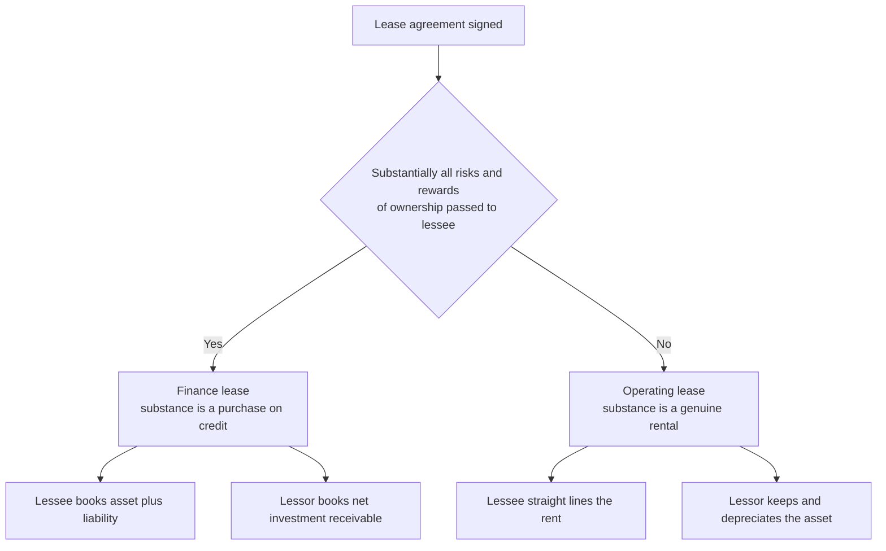
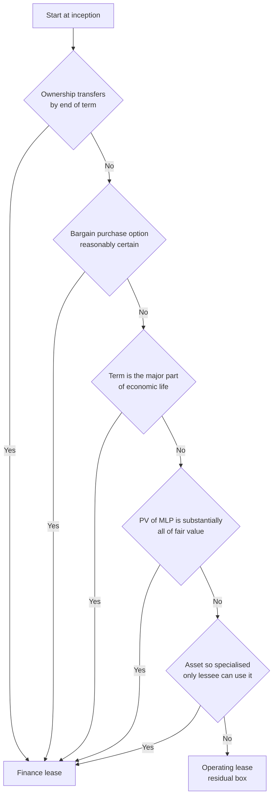

<!-- v2-deep -->

# Chapter 19 — AS 19: Leases

## 1. The Problem

A hospital needs a CT scanner worth ₹2.5 crore. It has two ways to get it:

1. **Borrow** ₹2.5 crore from a bank, buy the scanner, and repay the loan in instalments.
2. **Lease** the scanner from a finance company for 5 years, paying a fixed rental every year, at the end of which the scanner is practically worn out and the hospital walks away.

Look closely. In case 1, the hospital shows an **asset** (₹2.5 cr scanner) and a **liability** (₹2.5 cr loan) on its balance sheet. In case 2 — economically almost identical — a naive accountant would show *nothing on the balance sheet*, just a rent expense each year. Same machine, same money outflow, same "I control this scanner for its whole life," but two completely different balance sheets.

That gap is a gift to anyone who wants to hide debt. If leasing lets you keep a ₹2.5 cr obligation *off* the balance sheet, then every leverage ratio, every debt-covenant test, every return-on-assets number becomes a lie. A company could lease its entire factory and appear to own nothing and owe nothing, while in reality being bolted to years of unavoidable payments.

Now flip it. Consider a company that leases out a photocopier for 3 months to a customer, and takes it back after. Should *that* show up as the customer's asset? Obviously not — the customer is just renting for a short slice of the machine's life. So the problem is not "leases are debt." The problem is: **some leases are financing in disguise, and some are genuine rentals, and the accounting must tell them apart and treat each honestly.** AS 19 exists to draw that line and to tell both the lessee and the lessor how to account once the line is drawn.

**Why this is a *standard* and not just common sense.** Left to their own judgement, two honest accountants would classify the same lease differently, and a dishonest one would always choose the treatment that flatters his numbers. A standard removes that discretion: it fixes *when* you decide (inception), *what* you look at (risks and rewards, not title), and *how* you record each of the four possible situations (lessee/lessor × finance/operating). AS 19 is best read as a decision procedure, not a set of definitions to memorise.

## 2. The Core Idea — Rent vs Buy-on-EMI

Think of two students and a laptop.

- **Rohan** rents a laptop from a shop for the week of his exams for ₹500/day. He uses it, returns it, and never thinks about it again. The shop still owns the laptop, still worries about it becoming obsolete, still gets it back with plenty of life left. This is a **true rental** — an **operating lease**.

- **Meera** walks into the same shop and says, "Give me the laptop for 4 years — its whole useful life — and at the end I'll buy it for ₹100." She pays ₹2,000/month. She chose the specs, she'll upgrade the RAM, she bears the loss if it's stolen, and after 4 years the machine is hers for a token amount. The shop is really just *financing her purchase* and collecting interest. This is a **finance lease** — a **buy-on-EMI dressed as a rental.**

The single idea powering all of AS 19 is **substance over form**. The *legal form* of both transactions is "a lease." But the *economic substance* differs: Rohan is renting; Meera is buying with borrowed money. AS 19 says: ignore the label on the contract, ask "who really bears the **risks and rewards** of owning this asset?" — and account for what is actually happening. If substantially all the risks (obsolescence, damage, idle capacity) and rewards (use for the whole life, gain on residual value) have passed to the user, it is a finance lease and the user must put the asset and the loan on its books. Otherwise it is an operating lease and it stays with the owner.

**What exactly are the "risks" and "rewards"?** Making this concrete prevents hand-waving in the exam. *Risks* of ownership include: losses from idle capacity, technological obsolescence, and variation in returns because of changed economic conditions — i.e. all the ways the asset can disappoint you. *Rewards* include: the expectation of profitable operation over the asset's economic life, and any gain from appreciation in value or realisation of a residual value at the end. Classification asks: over the lease, who feels these? If it is the lessee, the substance is a purchase.

Everything else in this chapter — the classification tests, the amortisation tables, the straight-lining — is just this one idea, made operational.

*Figure 1 — the one decision that drives everything.*

## 3. Why It's Built This Way

**Why "risks and rewards" and not "who holds legal title"?** Because title is exactly the thing a clever contract can manipulate. If the standard said "asset sits with the legal owner," every financier would keep bare legal title, hand over everything else, and keep the debt hidden forever. By anchoring on risks and rewards — economic reality — AS 19 makes the classification robust to contract engineering. Title *may* transfer or not; that alone never decides.

**Why put the asset AND a liability on the lessee's books for a finance lease?** Because that is the truthful picture. The lessee controls an asset for essentially its whole life and cannot escape a stream of payments. Recording only "rent expense" would understate both assets and liabilities and flatter every ratio. Recording both restores comparability between the "borrow-and-buy" hospital and the "finance-lease" hospital — as it must, since they are economically the same.

**Why record the asset and the liability at the *same* amount at inception?** Because at day one you have neither paid interest nor used up any of the asset — you have simply swapped a promise to pay for the right to use. The obligation you take on (PV of what you must pay) and the resource you receive (value of the asset) are, in substance, two sides of one bargain struck at arm's length, so they start equal. They then *diverge* over time: the liability unwinds by the interest method while the asset depreciates on a straight-line (or other) basis — two independent clocks. That divergence is exactly why the P&L charge is front-loaded (Trap 2).

**Why split each rental into interest + principal?** Once you accept that a finance lease is a loan, the rental is nothing but an EMI. An EMI is part interest on the outstanding balance and part repayment of the borrowed amount. Treating the whole rental as expense would (a) overstate expense early, (b) never reduce the liability, and (c) hide the true cost of borrowing. Splitting it gives a genuine interest expense and a shrinking liability — the honest anatomy of a loan.

**Why a *constant rate* on the balance, and not equal interest each year?** Interest is the price of money you still owe. As you repay principal, you owe less, so you should be charged less interest — just like a home loan. A constant *rate* applied to a shrinking *balance* produces falling interest, which is the truthful cost of the finance actually outstanding in each period. Straight-lining the interest would pretend you owe the same amount all the way through, which is false the moment you make your first repayment.

**Why take the *lower* of fair value and PV of MLP?** Two prudence guards in one rule. You must never carry an asset above what it is actually worth (fair value), and you must never record an obligation above the present value of what you have genuinely committed to pay (PV of MLP). Whichever is lower binds first. In practice they are usually close; when they differ it is because the discount rate you used (incremental borrowing rate) differs from the lessor's implicit rate.

**Why straight-line an operating lease even when the cash rent is uneven?** Because in a true rental you are paying for the *benefit of using* the asset, and you get roughly equal benefit each period. If a landlord front-loads or back-loads the cash (₹1 lakh rising to ₹1.8 lakh) purely for commercial convenience, the *economic* cost of use is steady. Matching (the accrual principle) demands the expense track the benefit, not the cash timing.

**Why does AS 19 exclude land?** Land normally has an **indefinite (unlimited) economic life**. Two of the classification tests — "lease term covers the major part of the useful life" and "PV of payments covers substantially all fair value" — collapse when life is infinite: no finite lease term is a "major part" of infinity, and the residual value of land at the end is huge, so the payments rarely cover "substantially all" of fair value. Land would almost always classify as an operating lease, and the tests would give misleading signals, so AS 19 simply carves it out. (This is a genuine conceptual difference from Ind AS 116 — see §7.)

## 4. Full Technical Content (Recognition · Measurement · Presentation · Disclosure)

### 4.1 Scope — what AS 19 does NOT cover

AS 19 applies to accounting for all leases **except**:

- **Lease agreements to use land** (indefinite life — see §3);
- Lease agreements to **explore for or use natural resources** (oil, gas, timber, metals, mineral rights);
- **Licensing agreements** for items such as motion picture films, video recordings, plays, manuscripts, patents and copyrights.

A lease is defined as an agreement whereby the lessor conveys to the lessee, **in return for a payment or series of payments, the right to use an asset for an agreed period of time.**

**A few defined terms you must not blur (exam vocabulary):**

- **Inception of the lease** — the *earlier* of the date of the lease agreement and the date of a commitment by the parties to the principal provisions. **Classification is fixed here.**
- **Lease term** — the *non-cancellable* period for which the lessee has agreed to take the asset, **plus** any further periods for which the lessee has the option to continue, *when at inception it is reasonably certain the lessee will exercise the option.* A bargain renewal counts inside the term.
- **Economic life** — either the period over which the asset is expected to be economically usable (by one or more users) or the number of production units expected to be obtained. This is an *asset* concept.
- **Useful life** — the *estimated remaining period, from the beginning of the lease term, over which the lessee expects to consume the economic benefits.* This is a *lessee* concept and is **not** shortened by expected renewals. Note the deliberate distinction: economic life belongs to the asset; useful life is measured over the lease term for depreciation.
- **A non-cancellable lease** — cancellable only on a remote contingency, with the lessor's permission, on entering a new lease for the same/equivalent asset, or on payment of such an additional amount that continuation is reasonably certain at inception. Ordinary "penalty to break" clauses do **not** make a lease cancellable for AS 19 purposes.

### 4.2 The classification test — finance or operating?

**Definition.** A **finance lease** transfers **substantially all the risks and rewards** incident to ownership of an asset. Title may or may not eventually be transferred. An **operating lease** is *any lease that is not a finance lease.* (There are only these two boxes — the classification is residual.)

**When is it done?** Classification is made at the **inception of the lease** (the date of the lease agreement / earlier commitment), and it is **not revised** later unless the lessee and lessor agree to *change the terms* (a modification), in which case it is treated as a new lease. A mere change in *estimates* (e.g. of the asset's economic life or residual value) or a change in *circumstances* (e.g. default by the lessee) does **not** trigger reclassification.

**Situations that would *normally* lead to a finance lease** (any one, individually or in combination, may be conclusive):

| # | Indicator | Why it signals a finance lease |
|---|-----------|-------------------------------|
| (a) | The lease **transfers ownership** to the lessee by the end of the lease term | If you end up owning it, you always bore ownership risk/reward |
| (b) | The lessee has a **bargain purchase option** — the right to buy at a price expected to be *sufficiently lower than fair value* — so that at inception it is *reasonably certain* the option will be exercised | You will certainly become owner; substance = purchase |
| (c) | The **lease term is for the major part of the economic life** of the asset, even if title is not transferred | You consume the asset's whole useful life |
| (d) | At inception, the **present value of minimum lease payments (MLP) is at least substantially all of the fair value** of the leased asset | You pay for essentially the whole asset — it's a purchase on credit |
| (e) | The asset is of a **specialised nature** such that only the lessee can use it without major modifications | Only you can use it; the lessor bears no real residual risk |

**Supporting (weaker) indicators:** the lessee bears the lessor's losses if the lease is cancelled; gains/losses from fluctuations in the fair value of the residual accrue to the lessee; the lessee can renew for a **secondary period at a rent substantially below market** (bargain renewal).

Note that AS 19 gives **no rigid numeric bright-lines** (it does *not* say "75% of life" or "90% of fair value" — those are US GAAP). The words are "major part" and "substantially all," applied with judgement. In exams, a purchase option well below expected fair value, a term equal to the asset's life, or PV of MLP ≈ fair value are the clinching facts.

**How to handle conflicting indicators.** The indicators are *not* a scorecard you tally. Any single one may be conclusive, and they must be weighed for whether *substance* has passed. If, say, PV of MLP is only 70% of fair value (test d weak) but the asset is highly specialised (test e strong) and reverts after covering the major part of its life (test c strong), it is still a finance lease. Conversely, one weak indicator in isolation does not force finance treatment. Examiners love a fact-pattern where the "obvious" test fails but another clinches it — always run all five.

*Figure 2 — the five-gate classification screen.*

### 4.3 Key measurement building blocks

**Minimum Lease Payments (MLP).** The payments over the lease term that the lessee is (or can be) required to make, **excluding** contingent rent, and excluding costs for services and taxes paid by and reimbursed to the lessor. **Plus:**

- **In the lessee's case:** any **residual value guaranteed** by the lessee or by a party related to the lessee.
- **In the lessor's case:** any residual value guaranteed to the lessor by the lessee, by a party related to the lessee, **or by an independent third party** financially capable of meeting the guarantee.
- If there is a **bargain purchase option**, MLP = the minimum payments over the term up to the exercise date **plus the exercise price** of that option.

Notice the **asymmetry** in the residual value: a third-party guarantee counts for the *lessor* (it makes his cash inflow certain) but never for the *lessee* (the lessee has not promised anything). This single asymmetry is a favourite exam hook — the lessee's MLP and the lessor's MLP for the *same* lease can legitimately differ.

**Contingent rent** (e.g. rent linked to future sales or a future interest-rate index) is *excluded* from MLP because it is not fixed/determinable at inception; it is expensed/recognised in the period it arises. The logic: MLP must be knowable at inception to compute a present value, and something that depends on future turnover simply is not.

**Interest rate implicit in the lease.** The discount rate that, at inception, makes the **aggregate present value of (MLP + unguaranteed residual value) equal to the fair value of the leased asset** (net of grants/tax credits to the lessor). This is the lessor's true rate of return. If the lessee cannot practicably determine it, the lessee uses its **incremental borrowing rate** (the rate it would pay to borrow similar funds). Note that the implicit rate is defined using the *whole* fair value including the unguaranteed residual — so the lessor's discounting always recovers his full outlay, whereas the lessee, who ignores any residual he has not guaranteed, may arrive at a slightly different PV. This is another structural reason lessee and lessor numbers differ.

**Gross investment / Net investment / Unearned finance income** (lessor's toolkit):

- **Gross investment** = MLP receivable by the lessor **+ any unguaranteed residual value** accruing to the lessor.
- **Net investment** = Gross investment discounted at the interest rate implicit in the lease = (at inception) the **fair value of the asset** + initial direct costs.
- **Unearned finance income** = Gross investment − Net investment. This is the total interest the lessor will earn, released to income over the term.

**Initial direct costs** — incremental costs directly attributable to negotiating and arranging a lease (commissions, legal fees). *Lessee* (finance lease): added to the recognised asset. *Lessor* (finance lease, non-manufacturer): included in the net investment, reducing income recognised over the term. *Manufacturer/dealer lessor:* expensed at inception (they are a cost of "selling", not of financing). *Operating lease lessor:* added to the carrying amount of the asset and expensed over the term on the same basis as lease income.

### 4.4 Accounting — the four cells

#### (A) LESSEE — Finance lease

**Recognition & initial measurement.** Recognise an **asset and a liability** at an amount equal to the **lower of (i) the fair value of the leased asset and (ii) the present value of the minimum lease payments**, each computed at inception. (We take the *lower* on prudence: never record an asset above its fair value, and never above what you actually agreed to pay for.) The discount rate is the implicit rate, or the incremental borrowing rate if the implicit rate is impracticable. **Initial direct costs** of the lessee (legal fees, negotiation costs) are **added to the asset**.

**Subsequent measurement — split the rental.** Apportion each lease payment between **finance charge (interest)** and **reduction of the outstanding liability**. The finance charge is allocated so as to produce a **constant periodic rate of interest on the remaining balance** of the liability (the actuarial / amortised-cost method).

**Depreciation.** The asset is depreciated under AS 10 (PPE)/AS 6 like any owned asset. The **period**:
- If there is **reasonable certainty** the lessee will obtain ownership by the end of the term (test a or b) → depreciate over the **useful life** of the asset.
- Otherwise → depreciate over the **shorter of the lease term and the useful life.** (You mustn't spread cost beyond the period you'll actually use it.)

**Key subtlety:** finance charge and depreciation are **two separate expenses** computed independently. They will *not* equal the annual rental, and the P&L charge in early years usually **exceeds** the rental (front-loaded, because interest is high when the balance is high).

#### (B) LESSEE — Operating lease

**Recognition.** Lease payments are recognised as an **expense in the P&L on a straight-line basis over the lease term**, unless another systematic basis is more representative of the time pattern of the user's benefit. No asset/liability for the leased item goes on the balance sheet; any difference between cash paid and straight-lined expense sits as a **prepaid/accrued lease (lease equalisation)** balance.

#### (C) LESSOR — Finance lease

**Recognition.** The lessor **derecognises the asset** and instead recognises a **receivable ("net investment in the lease")** equal to the net investment (= fair value + initial direct costs). Finance **income** is recognised over the lease term on a pattern reflecting a **constant periodic rate of return on the net investment.** Each receipt reduces both principal (net investment) and recognises interest income.

**Manufacturer/dealer lessor** (e.g. an equipment maker leasing its own product): recognises **two profits** — (i) a normal *selling profit/loss* at inception (sale price = fair value, or PV of MLP at a market rate if lower, less cost) as if it made an outright sale, and (ii) *finance income* over the term. If artificially low rates are quoted, selling profit is restricted to that at a commercial rate. Initial direct costs are expensed at inception (not deferred).

#### (D) LESSOR — Operating lease

**Recognition.** The lessor **keeps the asset on its balance sheet**, presents it according to its nature (PPE), and **depreciates it** on its normal policy (AS 10). Lease **income** is recognised in the P&L on a **straight-line basis** over the term (unless another systematic basis is more representative). Initial direct costs are either deferred and allocated over the term or expensed as incurred.

**The mirror-image sanity check.** For any one lease, lessee and lessor treatments are reflections: a finance lease puts the asset off the lessor's books and onto the lessee's; the lessee's *interest expense* is (broadly) the lessor's *finance income*; the lessee's *liability* mirrors the lessor's *net investment*. They are not always numerically identical (different discount rate, residual asymmetry), but if you ever find the lessee treating something as finance while the lessor treats the *same* lease as operating, re-examine — usually one side has been mis-analysed.

### 4.5 Sale and leaseback (in full)

A seller sells an asset and immediately leases it back, remaining the physical user. Whether any **profit or loss on sale** is recognised now or deferred turns entirely on what kind of leaseback results:

- **Leaseback is a finance lease:** the "sale" is really a financing — the seller-lessee never truly parted with the asset's risks and rewards, it merely raised money against it. Any **excess of sale proceeds over carrying amount is deferred and amortised** over the lease term in proportion to depreciation — **not** recognised immediately as profit. Recognising it now would book a "gain" on something you still control.

- **Leaseback is an operating lease:**
  - If the transaction is **established at fair value**, recognise profit or loss **immediately** — it is a genuine disposal followed by a genuine rental.
  - If sale price is **above fair value**, the excess of sale price over fair value is *not* real profit (it is a disguised prepayment of future rent, which will be higher) — **defer and amortise** that excess over the period of expected use.
  - If sale price is **below fair value**, recognise the profit/loss **immediately**, *except* where the loss is **compensated by future lease payments at below-market rent** — then defer the loss and amortise it over the period of use.
  - If the **carrying amount exceeds fair value** at the time of the transaction (an impairment situation), that shortfall (carrying amount − fair value) must be **written down to fair value immediately** as a loss, regardless of the leaseback type.

**Compact rule to memorise:** *finance leaseback → always defer the gain.* *Operating leaseback → recognise now, but strip out any part of the price that is above fair value (defer that) and watch for below-fair-value losses that are really rent subsidies (defer those).* Any genuine impairment (CA > FV) is written off at once.

## 5. Worked Examples

### Example 1 — Operating lease with escalating rent (straight-lining) *(easy)*

Zeta Ltd takes office space on a **5-year non-cancellable operating lease**. Rent is deliberately back-loaded: ₹1,00,000, ₹1,20,000, ₹1,40,000, ₹1,60,000, ₹1,80,000 for Years 1–5. Show the P&L charge and the balance-sheet effect each year.

**Reasoning.** This is a true rental (short relative to the building's life, no purchase option). Under §4.4(B) the *benefit of occupying* the office is steady, so the expense must be **straight-lined**, regardless of the uneven cash.

**Step 1 — Total and average.** Total rent = 1,00,000+1,20,000+1,40,000+1,60,000+1,80,000 = **₹7,00,000.** Straight-line charge = 7,00,000 ÷ 5 = **₹1,40,000 per year.**

**Step 2 — Difference goes to a lease-equalisation account.**

| Year | P&L expense (SL) | Cash rent paid | Difference (Cr = liability) | Cumulative equalisation liability |
|------|-----------------:|---------------:|----------------------------:|----------------------------------:|
| 1 | 1,40,000 | 1,00,000 | +40,000 | 40,000 |
| 2 | 1,40,000 | 1,20,000 | +20,000 | 60,000 |
| 3 | 1,40,000 | 1,40,000 | 0 | 60,000 |
| 4 | 1,40,000 | 1,60,000 | −20,000 | 40,000 |
| 5 | 1,40,000 | 1,80,000 | −40,000 | 0 |

**Journal (Year 1):** Rent A/c Dr 1,40,000 / To Bank 1,00,000 / To Lease Equalisation (liability) 40,000. Over the 5 years the equalisation account fills up and then empties back to **zero** — it perfectly reverses. Total expense = total cash = ₹7,00,000. Tie-out confirmed.

**Examiner tweak — a genuine escalation clause.** AS 19 does *not* require straight-lining where the increases are structured to compensate the lessor for *expected general inflation*. If the question says the steps track a published inflation index, the straight-lining exception applies and you charge the **actual rent each year** (no equalisation account). Read the reason for the escalation before you smooth. In a plain "back-loaded for convenience" question (as above), you smooth.

### Example 2 — Finance lease in the books of the LESSEE (the core computation) *(exam-standard)*

On 1 April 2025, Vertex Ltd leases a machine. Terms: **3 annual payments of ₹1,00,000 each, payable at the end of each year.** The machine's **fair value is ₹2,50,000.** Vertex cannot determine the implicit rate; its **incremental borrowing rate is 10% p.a.** There is no purchase option and ownership does not transfer; the machine's useful life is 3 years. Show classification, initial recognition, the amortisation schedule, depreciation, and journal entries.

**Step 1 — Classify.** PV of MLP = 1,00,000 × PVIFA(10%, 3) = 1,00,000 × 2.48685 = **₹2,48,685.** This is **~99.5% of fair value (₹2,50,000)** — "substantially all" of fair value (test d). Also the term (3 yrs) = the whole useful life (test c). → **Finance lease.**

**Step 2 — Initial recognition (§4.4A).** Record at the **lower of** FV (₹2,50,000) and PV of MLP (₹2,48,685) = **₹2,48,685.**

*Entry (1 Apr 2025):* Machinery A/c Dr 2,48,685 / To Lease Liability A/c 2,48,685.

**Step 3 — Split each rental (constant-rate amortisation).**

| Year | Opening liability | Interest @10% | Rental paid | Principal repaid | Closing liability |
|------|------------------:|--------------:|------------:|-----------------:|------------------:|
| 1 | 2,48,685 | 24,869 | 1,00,000 | 75,131 | 1,73,554 |
| 2 | 1,73,554 | 17,355 | 1,00,000 | 82,645 | 90,909 |
| 3 | 90,909 | 9,091 | 1,00,000 | 90,909 | 0 |
| **Total** | | **51,315** | **3,00,000** | **2,48,685** | |

**Tie-out:** total interest 51,315 = total rentals 3,00,000 − principal 2,48,685. Liability closes at exactly **0**. (Figures rounded to the rupee; ₹1 rounding is absorbed in the last period.)

**Step 4 — Depreciation.** No ownership transfer and no bargain option, so depreciate over the **shorter of lease term (3) and useful life (3) = 3 years.** Straight-line = 2,48,685 ÷ 3 = **₹82,895 per year.**

**Step 5 — Journal entries (Year 1):**
- Interest A/c Dr 24,869 / To Lease Liability 24,869
- Lease Liability Dr 1,00,000 / To Bank 1,00,000
- Depreciation Dr 82,895 / To Machinery 82,895

**Step 6 — What hits the P&L each year?** (interest + depreciation)

| Year | Interest | Depreciation | Total P&L charge | (Rental for comparison) |
|------|---------:|-------------:|-----------------:|------------------------:|
| 1 | 24,869 | 82,895 | **1,07,764** | 1,00,000 |
| 2 | 17,355 | 82,895 | **1,00,250** | 1,00,000 |
| 3 | 9,091 | 82,895 | **91,986** | 1,00,000 |
| **Total** | 51,315 | 2,48,685 | **3,00,000** | 3,00,000 |

**Insight:** total 3-year charge (₹3,00,000) equals total rentals — but the finance-lease method is **front-loaded** (₹1,07,764 in Year 1 vs a flat ₹1,00,000 rent). That front-loading is *the* signature of finance-lease accounting and a favourite exam discussion point.

**Examiner tweak — rentals payable in ADVANCE.** Suppose the same three ₹1,00,000 rentals are payable **at the *start* of each year** (annuity-due). Now: (i) PV of MLP = 1,00,000 × PVIFA-due(10%,3) = 1,00,000 × 2.73554 = **₹2,73,554**, which *exceeds* fair value ₹2,50,000, so you record at the **lower = FV ₹2,50,000** (see how the "lower of" rule now bites the *other* way). (ii) The first payment on day 0 carries **no interest** — it is all principal. The amortisation becomes: opening 2,50,000; **Year 0 pay 1,00,000 → balance 1,50,000; interest 15,000 → 1,65,000; Year 1 pay 1,00,000 → 65,000; interest 6,500 → 71,500; Year 2 pay ... ** — the key marks are for zeroing interest on the day-0 payment and using the annuity-due factor. Misreading advance vs arrears silently corrupts every figure.

### Example 3 — Finance lease in the books of the LESSOR (with an unguaranteed residual value) *(exam-hard)*

Orbit Finance leases equipment to a customer on 1 April 2025. Terms: **3 annual payments of ₹90,000 at each year-end.** At the end of the term the equipment reverts to Orbit; its estimated **residual value is ₹20,000, which is NOT guaranteed** by anyone. The **interest rate implicit in the lease is 10%.** Show gross investment, net investment, unearned finance income, and the income-recognition schedule.

**Step 1 — Gross investment (§4.3).** = MLP receivable + unguaranteed residual value.
- MLP receivable = 90,000 × 3 = 2,70,000 (the residual is *not* guaranteed, so it is **not** part of MLP, but it *is* part of gross investment as it accrues to the lessor).
- Gross investment = 2,70,000 + 20,000 = **₹2,90,000.**

**Step 2 — Net investment** = PV of gross investment at 10%.
- PV of rentals = 90,000 × PVIFA(10%,3) = 90,000 × 2.48685 = 2,23,817.
- PV of residual = 20,000 × PVIF(10%,3) = 20,000 × 0.75131 = 15,026.
- Net investment = 2,23,817 + 15,026 = **₹2,38,843** (this equals the fair value the lessor is financing).

**Step 3 — Unearned finance income** = Gross − Net = 2,90,000 − 2,38,843 = **₹51,157.**

**Step 4 — Recognise income at a constant rate on the net investment.**

| Year | Opening net investment | Finance income @10% | Receipt | Closing net investment |
|------|-----------------------:|--------------------:|--------:|-----------------------:|
| 1 | 2,38,843 | 23,884 | 90,000 | 1,72,727 |
| 2 | 1,72,727 | 17,273 | 90,000 | 1,00,000 |
| 3 | 1,00,000 | 10,000 | 90,000 | **20,000** |
| **Total** | | **51,157** | 2,70,000 | |

**Tie-out (two independent checks):** (i) total finance income 23,884+17,273+10,000 = **51,157** = the unearned finance income computed in Step 3. (ii) The closing balance after Year 3 is exactly **₹20,000 — the unguaranteed residual value** — which Orbit recovers when it takes the equipment back and sells it. Both reconcile.

*Entry at inception:* Lease Receivable (Net Investment) A/c Dr 2,38,843 / To Equipment A/c 2,38,843 (asset derecognised). *Each year:* Bank Dr 90,000 / To Lease Receivable (principal portion) / To Finance Income (interest portion).

**Examiner tweak — make the residual GUARANTEED.** If the ₹20,000 residual were **guaranteed by the lessee**, it would enter **MLP** (now 2,70,000 + 20,000 = 2,90,000) — but the gross investment stays **₹2,90,000** and the net investment stays **₹2,38,843**, so *every figure in the schedule is identical.* What changes is only the classification/disclosure of that ₹20,000 (now a guaranteed receivable inside MLP, not an unguaranteed residual) — and the *lessee's* MLP and PV would now include it too. Watch which party's guarantee you were given.

### Example 4 — Manufacturer/dealer lessor with two profits *(exam-hard)*

Bharat Machines manufactures a printing press that **costs it ₹8,00,000** to make and normally **sells for ₹10,00,000** (its fair value). Instead of selling, it leases the press on a finance lease: **5 annual year-end rentals of ₹2,63,797**, implicit rate **10%**, no residual value, term = full useful life. Show the profit Bharat recognises at inception and the finance income over the term.

**Step 1 — Confirm it is a finance lease + a dealer situation.** Term = full life and PV of MLP will equal fair value (below). Bharat is the *manufacturer*, so §4.4(C) manufacturer/dealer rules apply — **two profits.**

**Step 2 — Selling profit at inception.** Sales value = fair value = PV of MLP at the **market** rate. Check: 2,63,797 × PVIFA(10%,5) = 2,63,797 × 3.79079 ≈ **₹10,00,000.** Good.
- Selling profit = Sales value − Cost = 10,00,000 − 8,00,000 = **₹2,00,000**, recognised **immediately** as a normal sale.

*Entry:* Lease Receivable (Net Investment) Dr 10,00,000 / To Sales 10,00,000; and Cost of Goods Sold Dr 8,00,000 / To Inventory 8,00,000. (Net effect: ₹2,00,000 selling profit today.)

**Step 3 — Finance income over 5 years** at 10% on the declining net investment:

| Year | Opening | Income @10% | Receipt | Closing |
|------|--------:|------------:|--------:|--------:|
| 1 | 10,00,000 | 1,00,000 | 2,63,797 | 8,36,203 |
| 2 | 8,36,203 | 83,620 | 2,63,797 | 6,56,026 |
| 3 | 6,56,026 | 65,603 | 2,63,797 | 4,57,832 |
| 4 | 4,57,832 | 45,783 | 2,63,797 | 2,39,818 |
| 5 | 2,39,818 | 23,982 | 2,63,800* | 0 |
| **Total** | | **3,18,988** | 13,18,985 | |

*(\*Year-5 receipt rounded by ₹3 to zero the balance.)*

**Tie-out:** total finance income ≈ ₹3,18,985 = total receipts 13,18,985 − sales value 10,00,000. So Bharat earns **₹2,00,000 selling profit today + ₹3,18,985 interest over 5 years**, cleanly separated. **Trap:** if Bharat had quoted an *artificially low* rate (say 4%) to push the sale, the selling profit must be **recomputed using a commercial rate**, which *reduces* the day-one profit and shifts value into finance income — never let a subsidised rate inflate the upfront gain.

### Example 5 — Sale and leaseback resulting in a finance lease *(exam-hard)*

Nova Ltd owns a machine with **carrying amount ₹6,00,000**. On 1 April 2025 it **sells it to a leasing company for ₹8,00,000** and immediately **leases it back on a finance lease** for the machine's remaining life of 4 years. Show the treatment of the ₹2,00,000 "profit."

**Reasoning.** Because the leaseback is a **finance lease**, Nova never really surrendered the risks and rewards — it has simply borrowed ₹8,00,000 against its own machine. Recognising a ₹2,00,000 gain now would be booking profit on an asset you still control. So under §4.5, the excess of sale price over carrying amount is **deferred and amortised** over the lease term (here, 4 years, in proportion to depreciation).

**Step 1 — Book the sale and the deferral.**
- Bank Dr 8,00,000 / To Machine (carrying) 6,00,000 / To Deferred Income (S&LB) 2,00,000.
- Simultaneously re-recognise the leased-back asset and lease liability at ₹8,00,000 (the finance-lease values) — Nova continues to depreciate the asset.

**Step 2 — Amortise the deferred gain.** Over 4 years, straight-line = 2,00,000 ÷ 4 = **₹50,000 per year** credited to P&L (offsetting the higher depreciation that results from the stepped-up ₹8,00,000 carrying value). 

*Each year:* Deferred Income Dr 50,000 / To P&L 50,000.

**Tie-out:** by the end of Year 4 the deferred income account is fully released (4 × 50,000 = 2,00,000) → **zero balance**. The gain reaches the P&L gradually, matched against the extra depreciation, so the leaseback shows no artificial upfront profit — exactly the intent of the standard.

**Contrast (one line):** had the leaseback been an **operating** lease *at fair value* (say sale at ₹8,00,000 = fair value), the entire ₹2,00,000 would be recognised as profit **immediately** — a genuine disposal followed by a genuine rental. Same cash, opposite timing, purely because the leaseback type differs.

### Example 6 — Classification judgement (the PV test as a decider) *(short)*

A lessee leases an asset (fair value ₹10,00,000) for 5 years; PV of MLP at the implicit rate = ₹9,40,000; the asset's useful life is 6 years; no purchase option. Finance or operating?

**Reasoning.** PV of MLP is **94% of fair value** — "substantially all" (test d). Term (5 yrs) is the **major part** of the 6-year life (test c). Two indicators both point the same way. → **Finance lease**, even though there is no purchase option and title never transfers. This shows that *title is irrelevant* — substance decides.

## 6. Presentation & Disclosure Formats

### Lessee — Finance lease
- Assets acquired under finance lease are shown **separately** (or disclosed) within PPE; **net carrying amount** at the balance-sheet date, by class.
- A **reconciliation of total minimum lease payments to their present value**, split by maturity: **not later than 1 year / later than 1 year and not later than 5 years / later than 5 years.**
- Contingent rents recognised in the P&L.
- Total future **minimum sublease payments** expected under non-cancellable subleases.
- A **general description of significant leasing arrangements** (basis of contingent rent, renewal/purchase options and escalation clauses, restrictions imposed such as those on dividends, further leasing, additional debt).

### Lessee — Operating lease
- Total of **future minimum lease payments** under **non-cancellable** operating leases for the three maturity bands (≤1 yr / 1–5 yrs / >5 yrs).
- Total future minimum sublease payments expected under non-cancellable subleases.
- **Lease payments recognised in the P&L** (with separate amounts for minimum lease payments, contingent rents and sublease payments).
- General description of significant leasing arrangements.

### Lessor — Finance lease
- **Reconciliation of gross investment to the present value of MLP receivable** at the three maturity bands.
- **Unearned finance income.**
- **Unguaranteed residual values** accruing to the lessor.
- Accumulated provision for uncollectible MLP receivable; contingent rents recognised; general description of significant leasing arrangements.

### Lessor — Operating lease
- Future minimum lease payments under non-cancellable operating leases in aggregate and for the three maturity bands.
- Total contingent rents recognised in income.
- The gross carrying amount, accumulated depreciation and depreciation for the period of assets leased out; general description of leasing arrangements.

**Why the three maturity bands (≤1 / 1–5 / >5)?** They convert a lease commitment into a crude *liquidity ladder*, so a reader can see how much cash the arrangement will swallow next year versus over the medium and long term — the same reason the balance sheet splits current from non-current. The recurring exam ask is simply: given a schedule of rentals, slot each into the correct band (for the *lessor finance* case, band the **gross investment** and separately its **present value**; for operating leases and the lessee finance case, band the **minimum lease payments**).

## 7. Connections

- **AS 10 / AS 6 (Depreciation):** the leased asset in a finance lease is depreciated exactly like an owned asset — the depreciation *period* rule (useful life vs shorter of term/life) is the only twist.
- **AS 16 (Borrowing Costs):** the finance charge in a finance lease **is** a borrowing cost; if the leased asset is a qualifying asset, the interest may be eligible for capitalisation.
- **AS 26 / AS 13:** licensing agreements (films, patents, copyrights) and investment property are carved out of AS 19 and handled under their own standards.
- **AS 5:** classification is fixed at inception; a later change of terms is a *new lease*, not a change in estimate.
- **AS 28 (Impairment):** a finance-lease asset on the lessee's books, and an asset leased out under an operating lease by the lessor, are both tested for impairment like any other asset — the leased status does not exempt them.
- **AS 29 (Provisions):** onerous lease commitments and guarantees of residual value interact with provisioning.
- **AS 22 (Deferred Tax):** finance-lease accounting (interest + depreciation) usually differs from the tax treatment of lease rentals, creating **timing differences** and therefore deferred tax — a common integration point in a full-question.
- **Financial-analysis / MBA lens:** finance leases are exactly why analysts "capitalise operating leases" when comparing firms — AS 19 already forces this for finance leases, restoring comparability of leverage and ROA between borrow-and-buy and lease.
- **Ind AS 116 (contrast):** Ind AS 116 abolishes the lessee's finance/operating distinction and uses a **single model** — the lessee recognises a **right-of-use asset** and a **lease liability** for *almost all* leases (only short-term ≤12 months and low-value leases are exempt). So under Ind AS, even the "operating lease" office in Example 1 would go on the balance sheet as a ROU asset + liability. Ind AS 116 **also covers land** (no blanket land exclusion). The **lessor** side of Ind AS 116, however, still keeps the finance/operating split, much like AS 19. Know this contrast; AS 19's two-model approach is what CA Intermediate is tested on.

## 8. Traps & Examiner Tricks

1. **"Lower of" is one-directional.** The lessee records at the **lower** of fair value and PV of MLP. Students who blindly use PV (or blindly use fair value) lose marks when the two differ. In Example 2 the lower was PV (₹2,48,685), *not* fair value (₹2,50,000); in the advance-payment tweak it flipped to fair value.
2. **Rental ≠ P&L expense in a finance lease.** The rental is split; the P&L gets *interest + depreciation*, which is **front-loaded** and does not equal the cash rental in any single year (Example 2, Step 6). A very common error is to charge the whole rental to P&L.
3. **Guaranteed vs unguaranteed residual value.** A **guaranteed** residual is part of **MLP** (for the guaranteeing party). An **unguaranteed** residual is **excluded from MLP** but **included in the lessor's gross investment.** A third-party guarantee counts for the *lessor* but never for the *lessee*. Mixing these up breaks the whole lessor computation (Example 3).
4. **Payments in advance vs in arrears.** If rentals are payable **at the beginning** of the year, the first payment carries **no interest** (it's paid at time 0) and the PV/annuity factor is the *annuity-due* factor. Read the timing carefully — it silently changes every number (Example 2 tweak).
5. **Contingent rent is never in MLP.** Rent linked to future sales/turnover or a floating index is *excluded* from MLP and expensed/recognised when it accrues.
6. **Title transfer is neither necessary nor sufficient.** A lease can be a finance lease *without* title ever transferring (Example 6). Conversely, don't assume "no purchase option ⇒ operating lease."
7. **Depreciation period trap.** Depreciate over **useful life** only if ownership transfer is *reasonably certain*; otherwise over the **shorter** of term and life. Using useful life when the asset reverts to the lessor overstates the asset and understates early depreciation.
8. **Land.** If a question bundles "land and building," remember AS 19 **excludes land**; the building element is assessed on its own. Don't classify the land component.
9. **Sale and leaseback profit.** If the leaseback is a **finance** lease, do **not** book the gain on sale immediately — **defer and amortise** it (Example 5). Immediate recognition is the classic wrong answer.
10. **Classification date.** Classify at **inception** and don't re-classify for later market movements — only a change of *terms* triggers re-assessment. A change of *estimate* or lessee *default* does not reclassify.
11. **Manufacturer/dealer artificially low rate.** A dealer-lessor's upfront selling profit must be computed at a **commercial** interest rate; a subsidised quoted rate cannot be used to pump up day-one profit (Example 4). Also: initial direct costs of a dealer are **expensed at inception**, not deferred.
12. **Two different MLPs for one lease.** Because a third-party residual guarantee, and any unguaranteed residual, are treated asymmetrically, the *lessee's* MLP/PV and the *lessor's* MLP/net investment for the **same** lease can legitimately differ. Compute each from that party's perspective; don't assume symmetry.
13. **Lease term includes bargain renewals.** If a renewal option is priced so low that exercise is reasonably certain at inception, that secondary period is *inside* the lease term — which can swing the "major part of economic life" test to finance.
14. **Initial direct costs land in different places.** Lessee (finance) → add to asset; lessor (finance, non-dealer) → inside net investment; dealer → expense now; lessor (operating) → capitalise and spread over the term. Placing them wrongly is an easy mark to lose.

## 9. First-Principles Recap

- A lease can be a genuine rental or a purchase-on-credit in disguise; honest accounting must tell them apart — that is the entire job of AS 19.
- The dividing test is **substance over form**: who bears **substantially all the risks and rewards** of ownership? Legal title is a red herring.
- Five indicators operationalise the test (ownership transfer, bargain purchase option, term = major part of life, PV of MLP ≈ fair value, specialised asset). No rigid % bright-lines under AS 19; weigh them for substance rather than tallying them.
- A finance lease is a loan, so the lessee puts an **asset and a liability** on the books at the **lower of fair value and PV of MLP** (same amount at inception, then diverging), and splits each rental into **interest (constant rate on the balance) + principal.**
- The finance-lease asset is depreciated like any owned asset — over useful life if ownership is reasonably certain, else over the shorter of term and life; interest and depreciation are computed **independently**, which is why the P&L charge is front-loaded.
- An operating lease stays off the lessee's balance sheet; the rent is **straight-lined** because the benefit of use is steady even when cash is uneven (unless the escalation merely tracks expected inflation).
- The lessor mirrors this: for a finance lease it replaces the asset with a **net-investment receivable** and earns finance income at a **constant rate**; for an operating lease it keeps and **depreciates** the asset and straight-lines the income. A manufacturer/dealer lessor books **two profits** — selling profit now (at a commercial rate) + finance income over the term.
- **MLP** excludes contingent rent; a **guaranteed** residual is inside MLP, an **unguaranteed** residual is outside MLP but inside the lessor's **gross investment**; third-party guarantees count only for the lessor.
- **Sale and leaseback:** finance leaseback defers and amortises any gain; operating leaseback at fair value recognises it now, with special rules for above/below fair-value pricing and for carrying amount above fair value.
- AS 19 **excludes land** (indefinite life makes the tests meaningless) — a real conceptual difference from **Ind AS 116**, which uses a **single on-balance-sheet model** for lessees and covers land.
- Every number ties out: total P&L charge over the term equals total cash rentals; the lessor's total finance income equals its unearned finance income; the liability/net-investment amortises to zero (or to the residual).

## 10. Quick-Revision Sheet

**Engine:** Substance over form → who bears the risks & rewards of ownership? Finance lease = yes; Operating lease = everything else (residual box). Classify at **inception**; don't revise unless *terms* change (estimate/default changes don't).

**Finance-lease indicators (any may clinch):** (a) ownership transfers, (b) bargain purchase option, (c) term = major part of life, (d) PV of MLP ≈ substantially all of fair value, (e) specialised asset. Weaker: lessee bears cancellation loss, residual gains/losses accrue to lessee, bargain renewal. *No fixed % thresholds in AS 19.*

**MLP =** fixed payments over term (ex-contingent rent, ex-service/tax) **+** guaranteed residual value **+** bargain-purchase exercise price. Contingent rent → excluded. *Lessor also adds independent third-party residual guarantee; lessee never does.*

**Discount rate:** interest rate implicit in lease (equates PV of MLP + unguaranteed residual to FV); else lessee's incremental borrowing rate.

| | **Finance lease** | **Operating lease** |
|---|---|---|
| **Lessee** | Asset + liability at **lower of FV / PV of MLP**; split rental into interest (constant rate) + principal; depreciate (useful life if ownership certain, else shorter of term/life); IDC → add to asset | No asset; rent **straight-lined** over term; difference → lease equalisation |
| **Lessor** | Derecognise asset; book **net-investment receivable**; finance income at **constant rate**; dealer → also selling profit at commercial rate, IDC expensed now | Keep & **depreciate** asset; income **straight-lined**; IDC capitalised & spread |

**Lessor formulae:** Gross investment = MLP receivable + unguaranteed residual. Net investment = PV of gross investment at implicit rate = FV + initial direct costs. Unearned finance income = Gross − Net.

**Amortisation each period:** Interest = opening balance × rate; Principal/recovery = payment − interest; Closing = opening − principal (lessee) / opening + income − receipt (lessor, closes at residual).

**Advance vs arrears:** advance (annuity-due) → day-0 payment has **zero** interest, use the due factor; arrears → ordinary annuity factor.

**Excluded from AS 19:** land, natural-resource leases, licensing of films/patents/copyrights.

**Sale & leaseback:** finance leaseback → **defer & amortise** any excess of sale price over carrying amount. Operating at fair value → recognise profit **now**; above FV → defer the above-FV excess; below FV with subsidised rents → defer the loss; carrying amount > FV → write down to FV now.

**Ind AS 116 contrast:** lessee **single model** — ROU asset + lease liability for nearly all leases (short-term & low-value exempt); covers land. Lessor split retained.

**Golden checks:** total P&L (interest + dep) over term = total rentals; lessor total finance income = unearned finance income; balance amortises to 0 (lessee) or to residual (lessor); a finance lease for one party is a finance lease for the other.
