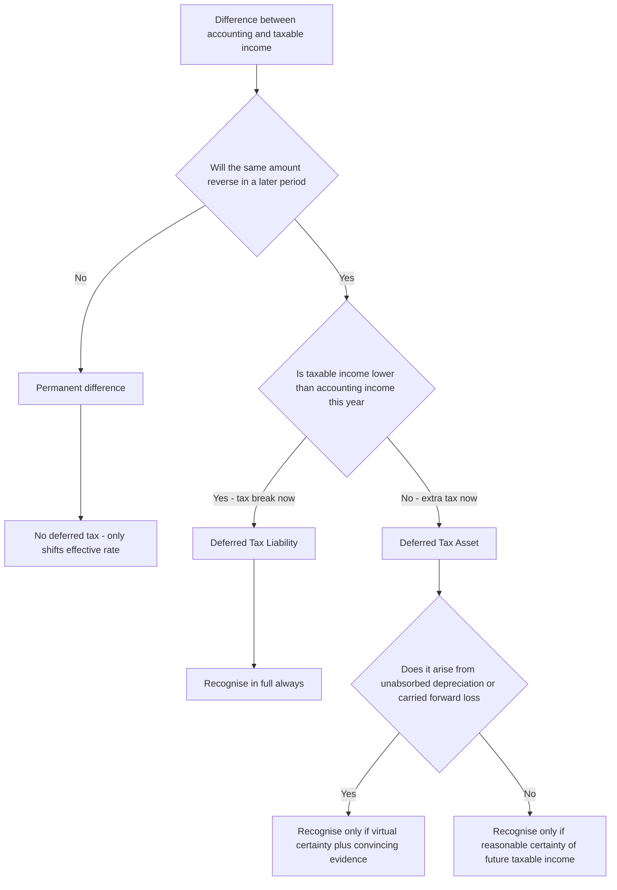

<!-- v2-deep -->

# Chapter 22 — AS 22: Accounting for Taxes on Income

## 1. The Problem

Here is a small, honest company. In its very first year it earns a real economic profit. Its Profit & Loss Account, prepared under the Companies Act and the accounting standards, shows a **Profit Before Tax of ₹10,00,000**. Any sensible reader — a shareholder, a banker, an analyst — expects the tax line just below it to be roughly 25% of that, say ₹2,50,000, leaving a clean after-tax profit.

But the tax the company actually pays to the government is **not** computed on ₹10,00,000. The Income-tax Act does not care what the accountant thinks profit is. It has its own rulebook. It allows a different (usually faster) rate of depreciation, it disallows certain expenses the accountant fully charged, it taxes some receipts the accountant hasn't recognised yet, and it refuses to allow some provisions until they are actually paid. So the **taxable income** might be, say, ₹6,00,000, and the tax literally paid is ₹1,50,000.

Now watch what happens if the accountant does the naive thing — records tax as "whatever the return says we owe":

```
Profit Before Tax        10,00,000
Less: Current Tax (paid)  1,50,000
Profit After Tax          8,50,000   → effective tax rate = 15%
```

An effective tax rate of 15% when the statutory rate is 25%? A reader would conclude this company is astonishingly tax-efficient. But it is an **illusion**. The company didn't escape the tax — it merely **postponed** it. Those faster depreciation deductions it grabbed this year are deductions it will *not* have available in later years. In some future year the same accounting profit of ₹10,00,000 will attract a tax bill *higher* than 25%, and the reader in that year will wrongly conclude the company suddenly became tax-inefficient.

So the naive method produces two lies for the price of one: it **overstates** profit today and **understates** profit tomorrow, and it makes the tax expense lurch around unpredictably even when the underlying business is perfectly stable. The tax charge no longer bears any honest relationship to the profit shown right above it.

**The problem AS 22 exists to solve:** the tax *expense* reported in the P&L must relate to the *accounting profit* it sits beneath — not to the accident of what the tax return happened to demand in cash this year. When the tax book and the accounting book disagree, we need a disciplined way to recognise the tax effect of an item **in the same period the item itself is recognised in the accounts.**

**Why this is not a trivial rounding matter.** The gap between accounting and taxable income is frequently *larger* than the accounting profit itself in the early life of a capital-intensive company. A manufacturer that has just installed a ₹100 crore plant will show heavy book profit but near-zero taxable income for years because tax WDV depreciation front-loads the deduction. Without AS 22, such a company would report an effective tax rate near zero for a decade, then a punishing rate afterwards — the exact opposite of the smooth, faithful picture that financial statements are supposed to give. AS 22 is therefore not cosmetic; for asset-heavy businesses it is the difference between a truthful and a grossly misleading tax line.

## 2. The Core Idea (an analogy)

Think of two people keeping records of the same shared expense: **the Accountant** and **the Taxman**. They are both looking at the same real business, but they use different calendars for *when* things count.

Imagine you and a flatmate split a ₹1,20,000 annual internet bill. You (the Accountant) spread it evenly — ₹10,000 a month — because that's how you consume it. Your flatmate (the Taxman) insists on recognising the whole ₹1,20,000 in the month it was paid. Over the full year you both agree the cost is ₹1,20,000. You do **not** disagree on the *total*; you disagree only on the **timing**.

Because the total eventually matches, the gap between you in any given month is a **temporary imbalance** — a running tab that must, by arithmetic necessity, unwind to zero. If in month one your flatmate counted ₹1,20,000 and you counted ₹10,000, your flatmate is "ahead" by ₹1,10,000; over the next eleven months you catch up ₹10,000 at a time until you're square.

Deferred tax is exactly this running tab, but for **tax**. When the Taxman lets the company deduct something *sooner* than the Accountant expensed it, the company pays *less* tax now — but it has effectively *borrowed* that saving from the future. AS 22 says: record that borrowing as a **liability** (a Deferred Tax Liability), because it will have to be "repaid" as extra tax later. Conversely, when the company pays *more* tax now than its accounting profit warrants (because the Taxman was slower to allow a deduction), the company has effectively **prepaid** tax — record it as an **asset** (a Deferred Tax Asset), a future tax saving already earned.

The single governing insight: **only timing differences create deferred tax, because only timing differences reverse.** If you and your flatmate simply *never agree* on an item — say he refuses forever to count a ₹5,000 party expense as "internet" — that gap never closes. There's nothing temporary about it, nothing to accrue, nothing to unwind. That kind of permanent disagreement gets no deferred tax at all.

**Pushing the analogy one level further — the "IOU" test.** The reason a DTL is a genuine liability and not just a bookkeeping curiosity is that it behaves like a written IOU. Ask: *if the business froze today and simply ran the assets to the end of their lives, would extra tax fall due purely because of past timing?* For a DTL the answer is yes — the reversing years will hand the Taxman more than the accounting profit warrants, and that extra is owed regardless of any new activity. For a DTA the mirror holds: past timing has left a future tax *refund* embedded in the assets, but — crucially — you can only collect that refund if there are future *taxable profits* to collect it against. That asymmetry (a DTL collects itself; a DTA needs future profit to collect) is the seed of the entire certainty-test machinery in Section 4.3.

## 3. Why It's Built This Way

Everything in AS 22 falls out of one principle you already know from the Framework: **the matching principle** — and its close cousin, **accrual accounting**.

Accrual says: recognise the financial *effect* of a transaction in the period the transaction occurs, not when cash moves. We already apply this to sales (recognise revenue when earned, not when collected) and to expenses (recognise when incurred, not when paid). Tax is simply *another expense caused by earning profit*. If the profit is recognised this year, the **tax consequence of that profit is an expense of this year**, regardless of when the cash actually leaves for the government.

So AS 22 reframes tax. There are two components:

- **Current tax** = the amount actually payable on this year's *taxable income* per the Income-tax Act. This is a fact; it comes straight off the return.
- **Deferred tax** = the tax effect of *timing differences* — the adjustment that pulls the total tax expense back into line with the accounting profit.

`Tax Expense = Current Tax + Deferred Tax`

Why not just report current tax and be done? Because current tax alone violates matching. The deferred tax component is the "correcting entry" that says: *of the tax the return demands, some belongs to other years; and of the tax the return didn't demand this year, some genuinely belongs to this year.* Deferred tax carries the tax effect back to the period whose profit caused it.

Why the **Balance Sheet approach to the label** but a **timing-difference (P&L) approach to the computation**? AS 22 (unlike Ind AS 12, which uses temporary differences based on carrying-amount-vs-tax-base) computes deferred tax on **timing differences** — differences between accounting income and taxable income *for a period* that **originate in one period and are capable of reversal in one or more subsequent periods**. That "capable of reversal" phrase is the whole engine. It is what distinguishes a timing difference from a permanent one, and it is why the resulting balance is a genuine asset or liability: an obligation/benefit that will crystallise as cash tax in the future.

One more design choice worth understanding: **prudence**. A Deferred Tax *Liability* is always recognised — you never get to ignore a future tax you'll owe (conservatism demands you never understate liabilities). But a Deferred Tax *Asset* is a *future benefit*, and future benefits are only worth recording if you're genuinely going to be able to use them. You can only use a future tax deduction if you have future *taxable profits* to set it against. So DTA recognition is gated by a realism test — **reasonable certainty**, tightened to **virtual certainty** in the riskiest case (carried-forward losses). This asymmetry isn't arbitrary; it's prudence applied consistently.

**Two methods, one number — and why AS 22 picks the older one.** There are historically two ways to attack deferred tax. The **deferral method** freezes the tax effect at the *original* rate and never re-touches it — it treats deferred tax as a suspense figure, not a real asset/liability. The **liability method** treats the balance as a genuine future obligation/claim and therefore *re-measures* it whenever the tax rate changes. AS 22 uses the **liability method** conceptually (hence Section 4.4's rate-change re-measurement rule) but computes the differences using the **income-statement / timing-difference** lens rather than the balance-sheet / temporary-difference lens of Ind AS 12. Knowing this reconciles two things students find contradictory: "AS 22 is P&L-based" and "AS 22 still re-measures balances on a rate change." The first describes *how you find the difference*; the second follows from the liability *character* of the resulting balance.

**Why deferred tax is never allowed to touch equity directly under AS 22.** Under Ind AS 12, deferred tax on an item that itself went to Other Comprehensive Income or directly to reserves (e.g., a revaluation surplus) is also routed to OCI/reserves — "backwards tracing." AS 22 has no OCI and its scheme routes the *periodic* movement of deferred tax through the **P&L**, with the sole exception being the **one-time transition adjustment** on first adoption, which goes to revenue reserves. Keep this clean: in AS-land, ongoing deferred tax = P&L; opening transition = reserves; there is no third route.

## 4. Full Technical Content (Recognition, Measurement, Presentation, Disclosure)

### 4.1 The two kinds of differences

Accounting income (profit as per P&L) and taxable income (profit as per the tax return) differ for two structurally different reasons:

**Permanent differences** — items that enter one computation but **never** enter the other. They originate in a period and **do not reverse**. Examples:
- Expenses permanently *disallowed* under the Income-tax Act (e.g., income-tax penalties, a portion of donations not eligible under Sec. 80G, expenditure disallowed under Sec. 40A, certain CSR spends).
- Income *exempt* from tax that is nonetheless in the P&L (e.g., agricultural income, certain exempt dividends, tax-free interest).
- Income taxed but never in accounting profit, or vice versa, with no future crossover.

Because they never reverse, permanent differences get **no deferred tax**. They simply make the effective tax rate differ from the nominal rate, forever.

**Timing differences** — items included in *both* computations but in *different periods*. They **originate** in one period and **reverse** in later periods. These, and only these, generate deferred tax. Classic examples:
- **Depreciation** (the flagship — see 4.5).
- Expenses allowed for tax only on **actual payment** (Sec. 43B items: bonus, PF, gratuity, interest to banks, statutory dues) — booked now for accounts, deductible later when paid.
- **Provisions** (e.g., provision for doubtful debts, warranty) charged in accounts now, allowed for tax only when the loss actually occurs.
- Certain incomes taxed on receipt but recognised in accounts on accrual (or vice versa).
- **Unabsorbed depreciation and carried-forward business losses** — a deduction available for accounts' matching but usable for tax only against future profits.

> Quick test: *"Will this gap eventually close on its own?"* Yes → timing → deferred tax. No → permanent → ignore for deferred tax.

**The subtle third category the examiner exploits — items that are *neither* a difference nor create deferred tax.** Not everything that makes the tax bill move is a difference at all. If an income is *never* in the P&L *and* is *never* taxed, there is simply no difference to account for. Likewise, a change in a *permanent* item does not become a timing item just because it recurs every year (a penalty paid every single year is still a fresh permanent difference each year, never a reversing one). Students sometimes see a recurring item and assume it must "even out," but *recurring* is not the same as *reversing*: reversal means the *same rupee* that was added back later gets deducted (or vice versa). A penalty added back in Year 1 is never later deducted; next year's penalty is a brand-new add-back.

**A cleaner formal definition to carry into the exam.** A *timing difference* is one where the item hits accounting income and taxable income in **different periods but for the same aggregate amount over time**. A *permanent difference* is one where the item hits **only one** of the two computations, ever. Anchor everything to "does the *same amount* eventually appear on the other side?" — if yes, timing; if no, permanent.

### 4.2 Recognition — DTL vs DTA

Break every timing difference into which way it points **on the P&L this year**:

**Deferred Tax Liability (DTL)** arises when **taxable income is *lower* than accounting income** today (you deduct more/recognise less for tax now), meaning you'll pay **more** tax in the future when it reverses.
- Trigger phrasing: *"tax depreciation > book depreciation"*, *"expense allowed for tax now but booked later"*, *"income booked later but taxed... no—"*. Cleanest anchor: **you got a tax break now that you must give back later.**
- **DTL is recognised in full, always.** No certainty test. Prudence forbids understating a known future obligation.

**Deferred Tax Asset (DTA)** arises when **taxable income is *higher* than accounting income** today (you pay more tax now than the accounting profit warrants), meaning you'll pay **less** tax in the future when it reverses.
- Trigger phrasing: *"book depreciation > tax depreciation"*, *"provision for doubtful debts disallowed now, allowed later"*, *"43B expense booked now, paid/allowed later"*, *"carried-forward loss"*.
- **DTA recognition is *conditional*** (see 4.3).

**The one reliable mechanical rule — origination vs reversal.** Beginners try to memorise a table of situations; it is far safer to compute the timing difference as a signed number and track its *cumulative* balance. In any year:
- If the **cumulative** timing difference (Tax deduction − Book expense, aggregated) is such that you have deducted *more* for tax than for books to date → cumulative **DTL**.
- If you have deducted *less* for tax than for books to date → cumulative **DTA**.
- The **P&L charge/credit for the year is the *movement* in that cumulative balance × tax rate**, not the year's isolated difference viewed in a vacuum. This distinction matters the instant a balance flips from DTL to DTA mid-life (rare in exams but a favourite trap in comprehensive problems).

The whole recognition logic can be seen as a single decision flow:



*The full AS 22 recognition decision, from raw difference to the certainty gate on a DTA.*

### 4.3 The certainty tests for DTA (the heart of the standard)

A DTA is only useful if the company will have **future taxable income** against which to actually realise the reversing deduction. AS 22 therefore imposes two tiers:

**Tier 1 — Reasonable certainty (the general rule).**
For timing differences *other than* those from unabsorbed depreciation / carried-forward losses, a DTA is recognised only to the extent there is **reasonable certainty** that **sufficient future taxable income** will be available to realise it. "Reasonable certainty" is judged on convincing evidence — existing profitable operations, firm order books, a track record of profits.

**Tier 2 — Virtual certainty (the strict rule).**
Where a DTA arises from **unabsorbed depreciation or carry-forward of losses under tax laws**, it is recognised **only to the extent there is *virtual certainty* supported by convincing evidence** that sufficient future taxable income will be available.
- *Why stricter?* If a company already has unabsorbed depreciation/losses, that is itself evidence it has been *loss-making*. Betting on future profits to absorb those losses is inherently riskier, so the bar is raised. "Virtual certainty" is stronger than reasonable certainty — it is more than a mere forecast; it needs almost-assured, concrete evidence (e.g., a signed, binding long-term contract that guarantees profits). A general expectation of a turnaround is **not** virtual certainty.

**What actually counts as "convincing evidence" (and what does not).** This is where marks are won or lost in theory questions. Convincing evidence is objective and largely outside management's discretion:
- A signed, non-cancellable, long-term sales contract with a creditworthy customer at a margin that assures taxable profits.
- Firm, binding order books extending well beyond the reversal period.
- Existing, demonstrably profitable operations whose profits already exceed the reversing amount (this alone usually clears *reasonable* certainty but must be strong and durable to clear *virtual* certainty for losses).

What is **not** convincing evidence: an internal budget or projection prepared by management; a general economic upturn; "the industry is recovering"; a hoped-for but unsigned contract; cost-cutting plans not yet executed. The theme: virtual certainty must rest on something a sceptical auditor could verify independently, not on optimism.

**A finer point — restriction to the *lower* of the two.** When a DTA arises from a carried-forward loss (Tier 2) *and* separately from ordinary timing differences (Tier 1), you do not lump them. Test each on its own tier. It is entirely possible to recognise the Tier-1 provision DTA (reasonable certainty met) while *not* recognising the Tier-2 loss DTA (virtual certainty not met) in the same set of accounts — Example 3 Case A shows this.

**Prudence review each year:** The carrying amount of a DTA must be **reviewed at each balance sheet date** and **written down** to the extent it is no longer reasonably/virtually certain of realisation. If circumstances later improve, the write-down is **reversed** (to the extent it becomes reasonably/virtually certain again). The reverse also holds: a DTA that was *never recognised* in an earlier year because certainty was absent **is recognised** in the later year that certainty first arrives — you do not need to have booked it originally to book it now.

### 4.4 Measurement

- Deferred tax is measured using the **tax rates and tax laws that have been *enacted or substantively enacted* by the balance sheet date.** You use the rate expected to apply *when the timing difference reverses*, but AS 22 practically restricts you to rates already enacted/substantively enacted — you do **not** anticipate future rate changes that aren't yet law.
- If different rates apply to different income slabs, use the **average rate** expected to apply.
- Deferred tax assets and liabilities are **NOT discounted** to present value. (Even though they are future cash flows, AS 22 explicitly prohibits discounting — it would require detailed scheduling of reversals, deemed impractical.)
- **Rate change:** if the tax rate changes, existing DTA/DTL balances are **re-measured at the new rate**, and the effect goes to the P&L (deferred tax expense/income) in the period of change.
- **MAT (Minimum Alternate Tax):** MAT credit is **not** a deferred tax item under AS 22. It is dealt with separately (as per the Guidance Note) and shown as "MAT Credit Entitlement", an asset — do not confuse it with DTA.

**Which rate — normal rate or the rate on the specific income?** Deferred tax is normally measured at the **regular** enacted corporate rate expected on ordinary income, *not* at MAT rate and *not* at special concessional rates unless the reversing item is specifically taxed at that special rate. If a company has opted into a concessional regime (for example a lower slab available under the Act — *verify the exact current section and rate against the latest ICAI material / applicable AY*), the deferred tax on ordinary timing differences is measured at that opted rate, because that is the rate at which reversals will actually be taxed. The governing idea: **use the rate that will actually apply to the reversing rupee.**

**Surcharge and cess are part of "the rate."** The effective rate for measurement includes applicable surcharge and health-and-education cess, because that is what will genuinely be paid on the reversal. Exam problems usually hand you a single blended rate to keep arithmetic clean; if they give you base rate plus surcharge plus cess, blend them first, then apply.

**Timing of a rate change matters to the point of measurement.** Only rates *enacted or substantively enacted by the balance sheet date* are used. A rate change announced in a Budget *after* year-end but before the accounts are signed is generally **not** substantively enacted as at the balance sheet date and so is **not** used to re-measure — instead it may be a disclosable non-adjusting event. (Confirm the enactment timeline in the problem; examiners plant the date deliberately.)

### 4.5 Why depreciation is *the* classic timing difference

Depreciation is the textbook case because it's guaranteed to reverse. Consider an asset costing ₹1,00,000:
- **Accounting** depreciates it, say, straight-line over its useful life.
- **Tax** depreciates it under the **Written Down Value (WDV) block-of-assets** method at rates prescribed by the Income-tax Rules, typically **front-loaded** (more depreciation early).

The crucial fact: **both methods eventually write off the *same total* — the cost of the asset (less any residual/scrap).** Tax can only ever allow you ₹1,00,000 of depreciation over the asset's life; so can accounting. They differ only in the *pattern*. In early years tax depreciation > book depreciation (DTL originates). In later years book depreciation > tax depreciation (DTL reverses). By the end, the cumulative difference is **zero**. That guaranteed reversal to zero is precisely what makes it a timing difference and precisely why it generates deferred tax. It is the cleanest illustration of the whole standard.

**The one place the "sum to the same total" logic can break — and why it still stays a timing difference.** Under the tax block-of-assets method an individual asset is never separately written down to zero; it dissolves into the block, and depreciation continues on the block's WDV. Also, book residual value may differ from any tax scrap notion. So the two totals can, in principle, differ by the residual amount. In CA Inter problems this is neutralised by assuming (i) no residual value, or (ii) that the block closes and the balance is fully allowed, so the totals reconcile exactly — as Example 2 does explicitly. Understand the real-world nuance, but in the exam *make the reconciliation total tie out*; if it doesn't, re-read the residual/scrap assumption in the question.

**Revaluation trap.** If an asset is *revalued upward* in the books, the *extra* book depreciation on the revalued portion has no matching tax deduction (tax runs on original cost/WDV). Under AS 22's timing-difference view this incremental book depreciation is treated as giving rise to a timing difference in the usual way (book depreciation exceeds tax depreciation on that slice), but note this is a classic point of *contrast* with Ind AS 12, which handles revaluation deferred tax through the revaluation surplus. For CA Inter, apply AS 22 mechanics unless told otherwise.

### 4.6 Presentation & measurement summary (formats in Part 6)

- DTA and DTL are **offset and presented as a single net figure** if (a) there is a legally enforceable right to set off, and (b) they relate to taxes levied by the **same governing tax law** (in practice, income tax — so they are almost always netted for a single enterprise).
- The **net** DTA or DTL is shown as a **non-current** item (Balance Sheet, Schedule III: under "Non-current Assets" or "Non-current Liabilities"). It is **never** classified as current.
- Deferred tax **cannot** be netted against **current tax** (advance tax / provision for tax) — those are separate line items.

**Consolidation subtlety.** In consolidated financial statements, DTA of one subsidiary and DTL of another are **not** netted, because they are separate taxable entities without a legally enforceable right of set-off across them. Offset is tested at the *enterprise* level, not the *group* level. A single standalone company nets to one figure; a group may show both a net DTA and a net DTL on the face of the consolidated balance sheet.

## 5. Worked Examples

### Example 1 — The simplest single timing difference (why the tax charge must be normalised)

**Data.** In Year 1, Alpha Ltd has Profit Before Tax (accounting) = ₹5,00,000. The only difference between books and tax is depreciation: book depreciation ₹40,000, tax depreciation ₹1,00,000. Tax rate 25%.

**Step 1 — Compute taxable income and current tax.**
Start from accounting profit, add back book depreciation, deduct tax depreciation:
```
Accounting profit           5,00,000
Add: Book depreciation         40,000
Less: Tax depreciation       (1,00,000)
Taxable income               4,40,000
Current tax @25%             1,10,000
```

**Step 2 — Identify the timing difference and its direction.**
Tax depreciation (₹1,00,000) > book depreciation (₹40,000) by **₹60,000**. Taxable income is *lower* than accounting income this year → a tax break taken now that reverses later → **DTL**.

**Step 3 — Compute deferred tax.**
DTL = 25% × ₹60,000 = **₹15,000** (a deferred tax *charge* this year).

**Step 4 — Total tax expense and the P&L.**
```
Profit Before Tax                 5,00,000
Less: Current tax     1,10,000
      Deferred tax       15,000
Total tax expense                (1,25,000)
Profit After Tax                  3,75,000
```
**Reconciliation check:** total tax expense ₹1,25,000 ÷ PBT ₹5,00,000 = **exactly 25%.** The deferred tax entry did its job — the effective rate now equals the statutory rate. Without it, the charge would have been ₹1,10,000 (22%), an illusion.

**Journal entries.**
```
Profit & Loss A/c            Dr   1,10,000
   To Provision for Tax (Current)      1,10,000

Profit & Loss A/c            Dr     15,000
   To Deferred Tax Liability            15,000
```

### Example 2 — Reversal, plus a permanent difference (full life-cycle)

**Data.** Beta Ltd buys a machine for ₹2,00,000 with no residual value.
- **Accounting:** straight-line over 4 years → ₹50,000 per year.
- **Tax (WDV block):** 40% → Yr1 ₹80,000; Yr2 ₹48,000; Yr3 ₹28,800; Yr4 ₹17,280... (WDV never fully zeroes, but the *block* is written off — for this illustration assume the asset's block closes at end of Yr4 and the remaining ₹25,920 is allowed in Yr4, so total tax depreciation over 4 years = ₹2,00,000).
  - Yr1 ₹80,000; Yr2 ₹48,000; Yr3 ₹28,800; Yr4 ₹43,200 (₹17,280 + closing balance ₹25,920). Total = ₹2,00,000. ✔
- Accounting PBT before any of this is a steady **₹3,00,000** each year (already after charging book depreciation). Each year there is also a **permanent** disallowance: a ₹20,000 income-tax penalty is included in that ₹3,00,000 as an expense but is never tax-deductible.
- Tax rate 25% throughout.

**Timing difference each year = Tax dep − Book dep:**
```
Year   Tax dep   Book dep   Timing diff (orig +/rev −)   Cumulative
 1      80,000    50,000        +30,000  (DTL orig)         30,000
 2      48,000    50,000         −2,000  (DTL rev)          28,000
 3      28,800    50,000        −21,200  (DTL rev)           6,800
 4      43,200    50,000         −6,800  (DTL rev)               0
Total  2,00,000  2,00,000            0                          0
```
The cumulative difference returns to **zero** — timing differences always do. Total tax dep = total book dep = ₹2,00,000. ✔

**Deferred tax movement (25% of the timing difference), and the closing DTL balance:**
```
Year   DT charge/(credit)   Closing DTL (25% × cumulative)
 1        +7,500                 7,500
 2          −500                 7,000
 3        −5,300                 1,700
 4        −1,700                     0
```

**Current tax each year** (start from PBT ₹3,00,000; add back the ₹20,000 permanent penalty because it's non-deductible; add back book dep ₹50,000; deduct tax dep):
```
Year 1: 3,00,000 + 20,000 + 50,000 − 80,000 = 2,90,000 → tax @25% = 72,500
Year 2: 3,00,000 + 20,000 + 50,000 − 48,000 = 3,22,000 → tax @25% = 80,500
Year 3: 3,00,000 + 20,000 + 50,000 − 28,800 = 3,41,200 → tax @25% = 85,300
Year 4: 3,00,000 + 20,000 + 50,000 − 43,200 = 3,26,800 → tax @25% = 81,700
```

**Total tax expense each year = Current + Deferred, and the effective-rate check:**
```
Year   Current   Deferred   Total tax   PBT      Effective
 1     72,500     +7,500     80,000     3,00,000   26.67%
 2     80,500       −500     80,000     3,00,000   26.67%
 3     85,300     −5,300     80,000     3,00,000   26.67%
 4     81,700     −1,700     80,000     3,00,000   26.67%
```

**The two lessons in one table:**
1. **The timing difference is fully neutralised** — total tax expense is a perfectly flat ₹80,000 every year even though *current* tax swung from ₹72,500 to ₹85,300. Deferred tax absorbed the volatility. That is matching in action.
2. **The permanent difference is NOT neutralised** — the effective rate is 26.67%, not 25%, in *every* year. That extra 1.67% is the tax cost of the non-deductible ₹20,000 penalty (25% × ₹20,000 = ₹5,000 extra tax on ₹3,00,000 PBT = 1.67%). Because it never reverses, no deferred tax is created for it, and it permanently lifts the effective rate. Exactly the intended behaviour.

**Year-1 journal:**
```
P&L A/c              Dr   72,500
   To Provision for Tax          72,500
P&L A/c              Dr    7,500
   To Deferred Tax Liability      7,500
```
**Year-3 journal (DTL reversing):**
```
P&L A/c              Dr   85,300
   To Provision for Tax          85,300
Deferred Tax Liability Dr   5,300
   To P&L A/c                     5,300
```

### Example 3 — DTA, the virtual-certainty gate, and later write-down (exam-hard)

**Data.** Gamma Ltd, a start-up, in Year 1 makes an **accounting loss** and a **tax loss**:
- Accounting Loss Before Tax = ₹(8,00,000).
- Included in that loss: a **provision for doubtful debts of ₹1,00,000** (disallowed for tax now; allowable later when the debt is actually written off) — a timing difference.
- Also included: unabsorbed **business loss** (tax) of ₹7,00,000 available to carry forward.
- Tax rate 25%.

Break the ₹8,00,000 accounting loss into its tax components:
```
Accounting loss                       (8,00,000)
Add back: provision for doubtful debts   1,00,000   (disallowed now)
Tax loss (carried forward)            (7,00,000)
```
So there are **two** potential deferred tax assets:
- **DTA on the provision (timing difference, Tier 1):** 25% × ₹1,00,000 = ₹25,000 — recognise only if **reasonably certain** of future taxable income.
- **DTA on the carried-forward loss (Tier 2):** 25% × ₹7,00,000 = ₹1,75,000 — recognise only if **virtually certain**, backed by convincing evidence.

**Case A — no convincing evidence.** Gamma is a new company with no order book and no track record. It is **not** virtually certain of future profits, and arguably not even reasonably certain.
- The carried-forward loss DTA (₹1,75,000): **not recognised** (fails virtual certainty).
- The provision DTA (₹25,000): **not recognised** if reasonable certainty also fails.
- Result: **no DTA recognised**; the P&L shows the ₹8,00,000 loss with **no** deferred tax credit. Prudent — you don't create an asset you may never use.

**Case B — a binding contract exists.** Suppose in Year 1 Gamma signs a firm, non-cancellable 5-year supply contract with a blue-chip customer that, on any reasonable estimate, guarantees taxable profits far exceeding ₹8,00,000. This is *convincing evidence* → **virtual certainty** is met.
- Recognise DTA on carried-forward loss: **₹1,75,000.**
- Recognise DTA on provision: **₹25,000** (reasonable certainty is comfortably satisfied since virtual certainty is).
- Total DTA = **₹2,00,000.**

**Journal (Case B, Year 1):**
```
Deferred Tax Asset      Dr   2,00,000
   To P&L A/c                        2,00,000
```
The loss shown in the P&L is thereby reduced by the future tax saving now certain to be realised:
```
Loss Before Tax                     (8,00,000)
Add: Deferred tax income (DTA)        2,00,000
Loss After Tax                      (6,00,000)
```

**Year 2 — reversal and a write-down twist.** In Year 2 Gamma earns taxable income of ₹4,00,000 (before set-off) and sets off ₹4,00,000 of the carried-forward loss. The used-up loss's DTA reverses: 25% × ₹4,00,000 = ₹1,00,000 DTA reversed (this becomes part of current-year tax mechanics — the loss shields current tax, and the DTA unwinds).
```
P&L A/c                 Dr   1,00,000
   To Deferred Tax Asset             1,00,000
```
Remaining carried-forward-loss DTA = ₹1,75,000 − ₹1,00,000 = ₹75,000 (on the ₹3,00,000 loss still to be used).

Now suppose at the **end of Year 2** the blue-chip contract is cancelled and Gamma's outlook collapses; it is **no longer virtually certain** the remaining ₹3,00,000 loss will be used. AS 22 requires a **review and write-down**:
```
P&L A/c                 Dr     75,000
   To Deferred Tax Asset             75,000
```
The ₹75,000 DTA is written off to the P&L. (If the outlook recovers in a later year and virtual certainty returns, this write-down is reversed.)

**Reconciliation of the DTA account across the two years:**
```
Recognised (Yr1)                     2,00,000
Less: reversed on loss set-off (Yr2)  1,00,000
Less: written down (Yr2)                75,000
Closing DTA (end Yr2)                    25,000   ← only the provision DTA remains
```
The ₹25,000 that survives is the provision-for-doubtful-debts DTA — a Tier-1 asset that (assume) still passes reasonable certainty. Every rupee is accounted for. ✔

### Example 4 — A rate change mid-life (re-measurement of the whole balance)

**Data.** Delta Ltd carried a **DTL of ₹3,00,000** at the end of Year 3, built up at a tax rate of **30%** (so it represents a cumulative timing difference of ₹10,00,000). During Year 4 the enacted tax rate is reduced to **25%**, effective for Year 4 onward. Also in Year 4, a *fresh* originating timing difference of ₹2,00,000 arises (tax depreciation again exceeds book depreciation).

**Step 1 — Re-measure the opening balance at the new rate.**
The existing cumulative timing difference of ₹10,00,000 will now reverse at 25%, not 30%.
```
DTL required on opening difference at new rate: 25% × 10,00,000 = 2,50,000
DTL currently carried (at old 30%):                              3,00,000
Re-measurement CREDIT to P&L:                                     (50,000)
```
The ₹50,000 is a deferred tax *income* in Year 4 — the future obligation shrank because the rate fell. Note: it hits **Year 4's P&L in full**, not spread over future reversals. This is the single most common rate-change error.

**Step 2 — Add the current-year originating difference at the new rate.**
```
Fresh DTL on Year-4 difference: 25% × 2,00,000 = 50,000  (charge to P&L)
```

**Step 3 — Net deferred tax in Year 4's P&L and the closing balance.**
```
Re-measurement credit                 (50,000)
Current-year originating charge         50,000
Net deferred tax in Year-4 P&L               0
```
```
Closing DTL = opening re-measured + fresh
            = 2,50,000 + 50,000 = 3,00,000
Check: cumulative timing diff (10,00,000 + 2,00,000) × 25% = 12,00,000 × 25% = 3,00,000 ✔
```
The closing DTL of ₹3,00,000 ties exactly to 25% of the total cumulative timing difference — proof the re-measurement was done on the *whole* balance, not just the new layer. **The trap the examiner sets:** applying 25% only to the new ₹2,00,000 while leaving the old balance at 30% — that would wrongly report a closing DTL of ₹3,50,000 and miss the ₹50,000 credit entirely.

### Example 5 — Section 43B item and a provision reversing (a pure-DTA timing difference without depreciation)

**Data.** Epsilon Ltd, Year 1: Profit Before Tax (accounting) = ₹6,00,000. Two book-vs-tax differences, no depreciation difference:
- A **provision for warranty of ₹80,000** is charged in the accounts (allowed for tax only when warranty claims are actually paid).
- **Bonus of ₹1,20,000** is provided in the accounts but remains *unpaid* at year-end and past the due date for filing — so it is **disallowed now under Sec. 43B**, deductible in the year of actual payment.
- Tax rate 25%. Assume reasonable certainty of future taxable income is satisfied (company is comfortably profitable).

**Step 1 — Current tax.** Both items are booked now but disallowed now → add both back:
```
Accounting profit                 6,00,000
Add: Warranty provision              80,000
Add: Unpaid bonus (43B)            1,20,000
Taxable income                    8,00,000
Current tax @25%                  2,00,000
```

**Step 2 — Direction of the timing differences.** For *both* items, taxable income (₹8,00,000) is **higher** than accounting income (₹6,00,000) today → tax overpaid now, recoverable when these become deductible → **DTA**.
```
Total timing difference = 80,000 + 1,20,000 = 2,00,000
DTA = 25% × 2,00,000 = 50,000  (deferred tax income — a CREDIT to P&L)
```

**Step 3 — P&L and reconciliation.**
```
Profit Before Tax                          6,00,000
Less: Current tax        2,00,000
Add:  Deferred tax (DTA)   (50,000)
Net tax expense                           (1,50,000)
Profit After Tax                           4,50,000
```
**Reconciliation:** net tax ₹1,50,000 ÷ PBT ₹6,00,000 = **25%** exactly. No permanent difference here, so the effective rate must equal the statutory rate — and it does. The DTA of ₹50,000 pulled the effective charge down from the ₹2,00,000 (33.3%) that current tax alone would have wrongly implied.

**Step 4 — The reversal year (proof it unwinds).** Suppose in Year 2 the bonus is paid (₹1,20,000 now deductible) and warranty claims of ₹80,000 are met (now deductible), with the same ₹6,00,000 accounting PBT and no new differences:
```
Taxable income = 6,00,000 − 1,20,000 − 80,000 = 4,00,000
Current tax @25% = 1,00,000
Deferred tax: DTA of 50,000 now REVERSES → charge (debit) to P&L of 50,000
Net tax expense = 1,00,000 + 50,000 = 1,50,000 → ÷ 6,00,000 = 25% ✔
```
```
Reversal journal (Year 2):
P&L A/c              Dr   50,000
   To Deferred Tax Asset      50,000
```
The DTA that was created in Year 1 is fully consumed in Year 2; total tax expense stays a flat ₹1,50,000 across both years even though current tax swung from ₹2,00,000 to ₹1,00,000. Deferred tax again did the smoothing. ✔

**Journal (Year 1):**
```
P&L A/c              Dr   2,00,000
   To Provision for Tax        2,00,000
Deferred Tax Asset   Dr     50,000
   To P&L A/c                    50,000
```

## 6. Presentation & Disclosure Formats

**Balance Sheet (Schedule III, Companies Act):**
- Net **Deferred Tax Liability** → under **Non-current Liabilities** as "Deferred tax liabilities (net)".
- Net **Deferred Tax Asset** → under **Non-current Assets** as "Deferred tax assets (net)".
- A single enterprise (one tax jurisdiction) presents **one net figure**, never both, and never as current.
- Current tax items (Provision for tax, Advance tax/TDS) are shown **separately** and are **not** offset against deferred tax.

**Profit & Loss Statement:**
```
Profit before tax                                  XXX
Tax expense:
   Current tax                          XXX
   Deferred tax                         XXX          XXX
Profit / (Loss) for the period                     XXX
```

**Disclosure in Notes (as required by AS 22):**
- The **break-up of major components** of the deferred tax balance — i.e., the DTA/DTL arising from each type of timing difference (depreciation, provision for doubtful debts, 43B items, carried-forward losses, etc.), shown separately.
- The **nature of the evidence** supporting recognition of a DTA where the enterprise has **unabsorbed depreciation or carry-forward losses** (i.e., disclose the basis for virtual certainty). This is a mandatory, heavily-tested disclosure — recognising such a DTA without stating the convincing evidence is a reporting failure.

**Illustrative component-breakup note (the format examiners reward):**
```
Deferred tax liabilities:
   On timing difference from depreciation            XXX
Deferred tax assets:
   On provision for doubtful debts                   (XX)
   On Sec. 43B items (bonus, PF, gratuity)           (XX)
   On carried-forward business loss                  (XX)
Deferred tax liability / (asset) - net              XXX / (XX)
```
Presenting a single net number *without* this breakup is a common reason answers lose disclosure marks even when the arithmetic is perfect.

**Transition / first-time adoption note:** on first applying AS 22, the deferred tax balance accumulated up to that date is adjusted against **revenue reserves** (opening reserves), not routed through the current year's P&L — because it relates to prior periods' timing differences. Only the *movement in the deferred tax balance during the current year* goes through the current year's P&L.

## 7. Connections

- **AS 6 / AS 10 (Depreciation & PPE):** the choice of book depreciation method/rate directly creates the flagship timing difference against tax WDV depreciation. Change a depreciation policy and you change the deferred tax.
- **AS 5 (Prior period & changes in estimates):** a change in tax rate or a DTA write-down is accounted for in the **current** period's P&L (a change in estimate), not restated as a prior-period item.
- **AS 4 / provisions and AS 29:** provisions (warranty, doubtful debts) recognised now but tax-deductible only on crystallisation are the second-most-common timing difference after depreciation.
- **AS 26 (Intangibles) & AS 16 (Borrowing costs):** capitalisation policies that differ from tax treatment spawn timing differences too.
- **AS 21 / AS 23 / AS 27 (Consolidation):** deferred tax of separate group entities is **not** cross-netted (see 4.6); a group can show both a net DTA and a net DTL.
- **AS 22 + book profit for MAT:** while MAT credit is outside AS 22, the *deferred tax charge/credit* is one of the reconciling items between accounting profit and MAT "book profit" workings — keep the two computations in separate columns so they don't contaminate each other.
- **Ind AS 12 (contrast):** Ind AS uses the **balance-sheet liability method on *temporary* differences** (carrying amount vs tax base), which captures more items (e.g., revaluations, fair-value adjustments) than AS 22's **income-statement method on *timing* differences**. For CA Inter, apply **AS 22 (timing differences)** unless the question explicitly asks for Ind AS. Also, Ind AS 12 has **no "virtual certainty"** concept — it uses "probable" for DTA recognition. (Neither standard discounts.) Don't cross-contaminate the two.
- **MAT credit (Guidance Note):** shown as "MAT Credit Entitlement", **outside** AS 22 deferred tax. A frequent trap.
- **Company Law / audit:** the AS-22 disclosures feed directly into the audit checklist and the "true and fair" opinion.

## 8. Traps & Examiner Tricks

1. **Treating a permanent difference as timing.** Penalties, exempt agricultural income, disallowed donations, CSR spend — these **never** create deferred tax. If asked for deferred tax, first strip out permanents; compute deferred tax only on items that **reverse**. Examiners love burying a penalty inside the P&L to see if you (wrongly) defer it.
2. **Getting the DTA/DTL direction backwards.** Anchor phrase: *tax depreciation > book depreciation → pay less tax now → **DTL**.* If book > tax → **DTA**. Write the timing difference as (Tax − Book); positive = DTL, negative = DTA. Don't guess.
3. **Recognising a DTA on carried-forward losses without virtual certainty.** The single most common examiner ambush. If the company is loss-making with no convincing evidence (binding contracts, assured profits), you **must not** recognise the DTA. A vague "management is optimistic" is **not** virtual certainty. State the reason explicitly.
4. **Confusing "reasonable" and "virtual" certainty.** Reasonable certainty → ordinary timing differences. Virtual certainty (stricter, convincing evidence) → **unabsorbed depreciation and carried-forward losses only.** Applying the wrong threshold loses marks even if the number is right.
5. **Discounting deferred tax.** AS 22 **prohibits** discounting. Never present-value a DTA/DTL. (Ind AS 12 also prohibits it — this one's consistent, but students still try.)
6. **Netting deferred tax against current tax / current classification.** Deferred tax is **non-current** and is offset only within itself (DTA vs DTL of the same jurisdiction), **never** against advance tax or provision for tax.
7. **Forgetting to re-measure on a rate change.** If the rate changes from 30% to 25%, the *entire existing* DTA/DTL is re-computed at 25% and the difference hits the current P&L. Students often apply the new rate only to the new year's movement. (See Example 4 — the ₹50,000 credit is on the *whole opening balance*.)
8. **Ignoring the annual DTA review.** A recognised DTA must be reviewed each year and **written down** if realisation is no longer certain (Example 3, Case B, Year 2). Conversely a previously unrecognised DTA can be recognised once certainty arrives.
9. **MAT credit mislabelled as DTA.** MAT credit entitlement is *not* deferred tax. Keep it out of the AS 22 workings.
10. **Sign errors in the P&L.** A DTL movement is a **debit** to P&L (increases tax expense); a DTA recognition is a **credit** to P&L (reduces tax expense). Reversals flip the sign. Always sanity-check with the effective-rate reconciliation — if permanents = 0, your total tax ÷ PBT must equal the statutory rate.
11. **Confusing "recurring" with "reversing."** A penalty of ₹20,000 charged every year *looks* stable but is a *fresh permanent difference* each year — it never reverses, so still no deferred tax (Example 2). Don't defer something just because it repeats.
12. **Cross-netting a group's DTA and DTL.** Different taxable entities in a consolidation have no legally enforceable right of set-off; present both a net DTA and a net DTL if they arise in different entities. Only a *single* enterprise nets to one figure.
13. **Applying the wrong rate to the reversal.** Measure deferred tax at the rate expected when the item *reverses* (using enacted/substantively-enacted rates), including surcharge and cess — not necessarily the current-year headline rate, and never the MAT rate for ordinary timing differences.
14. **Using a post-balance-sheet rate change to re-measure.** A rate change enacted *after* the balance sheet date is generally a non-adjusting event — don't re-measure with it; disclose it. Check the enactment date given in the problem.
15. **Booking a DTA on a loss you never recognised and then "forgetting" the earlier non-recognition.** If a DTA was correctly *not* recognised in Year 1 (no certainty), and certainty arrives in Year 2, you recognise it *in Year 2* through Year 2's P&L — you do not restate Year 1.

## 9. First-Principles Recap

- Accounting profit and taxable income diverge because two different rulebooks time the same items differently; the naive "tax = cash paid" approach breaks the matching principle and makes reported profit and tax rates lie.
- Tax is an expense *caused by earning profit*; by accrual, its effect must be recognised in the period the profit is recognised → `Tax Expense = Current Tax + Deferred Tax`.
- Differences are either **permanent** (never reverse → no deferred tax, they permanently shift the effective rate) or **timing** (originate now, reverse later → the *only* source of deferred tax). The acid test is "does the *same amount* eventually appear on the other side?" — not "does it recur?"
- **DTL** = tax break enjoyed now, repayable later (taxable income < accounting income today). Recognised **in full, always** (prudence never lets you hide a future liability).
- **DTA** = tax overpaid now, recoverable later (taxable income > accounting income today). Recognised only under **reasonable certainty** of future taxable income — tightened to **virtual certainty with convincing evidence** for unabsorbed depreciation and carried-forward losses (because a loss history makes future profits doubtful).
- Depreciation is the flagship timing difference precisely because book and tax depreciation must sum to the *same total* over the asset's life, guaranteeing the difference reverses to zero.
- Measure at **enacted / substantively enacted** rates (average rate across slabs, inclusive of surcharge/cess); **never discount**; **re-measure the whole existing balance** when the rate changes, with the effect hitting the current P&L.
- Present the **net** DTA or DTL as a single **non-current** figure per *enterprise*; never net against current tax; never cross-net separate group entities; disclose the component break-up and the evidence for any loss-based DTA.
- **Review** the DTA every balance-sheet date; write it down when certainty fades, reverse the write-down when it returns; recognise a previously-unrecognised DTA in the year certainty first arrives.
- Sanity check every answer: if there are no permanent differences, total tax expense ÷ profit before tax must equal the statutory rate — that's deferred tax doing its job.

The whole life-cycle of a single timing difference:


*A timing difference is born, sits on the balance sheet, and dies at zero — deferred tax mirrors it at every step.*

## 10. Quick-Revision Sheet

**Equation:** `Tax Expense = Current Tax + Deferred Tax`

**Difference test:** *Does the same amount eventually appear on the other side?* Yes = **timing** (defer it). No = **permanent** (ignore). Recurring ≠ reversing.

**Direction (write timing diff as Tax − Book):**
| Situation | Taxable income today | Future tax | Balance |
|---|---|---|---|
| Tax dep > Book dep; 43B exp allowed now | Lower | Higher | **DTL** |
| Book dep > Tax dep; provisions disallowed now; c/f losses | Higher | Lower | **DTA** |

**Recognition rule:**
- **DTL → always, in full.**
- **DTA → reasonable certainty** (ordinary) / **virtual certainty + convincing evidence** (unabsorbed dep & c/f losses). Test each layer on its own tier.

**Convincing evidence = yes:** signed binding long-term contracts, firm order books, durable existing profits. **= no:** management budgets, "industry recovering," unsigned deals, optimism.

**Measurement:** enacted/substantively-enacted rate; include surcharge + cess; average rate for slabs; use the rate expected at *reversal*; **NO discounting**; re-measure *all* existing balances on rate change (effect → current P&L).

**Presentation:** net figure, **non-current**, per *enterprise*; offset DTA vs DTL only (same jurisdiction); never against current tax; don't cross-net group entities.

**Disclosure:** components of DTA/DTL by type; evidence for DTA on unabsorbed depreciation / carried-forward losses.

**Housekeeping:** review DTA each year → write down / reverse; recognise previously-unrecognised DTA when certainty arrives; transition adjustment → revenue reserves; MAT credit ≠ deferred tax.

**Signs in P&L:** create/increase DTL → Dr P&L (more tax expense); create/increase DTA → Cr P&L (less tax expense); reversals flip.

**Master check:** no permanent differences ⇒ (Current + Deferred) ÷ PBT = statutory rate. If it doesn't, find your error.
