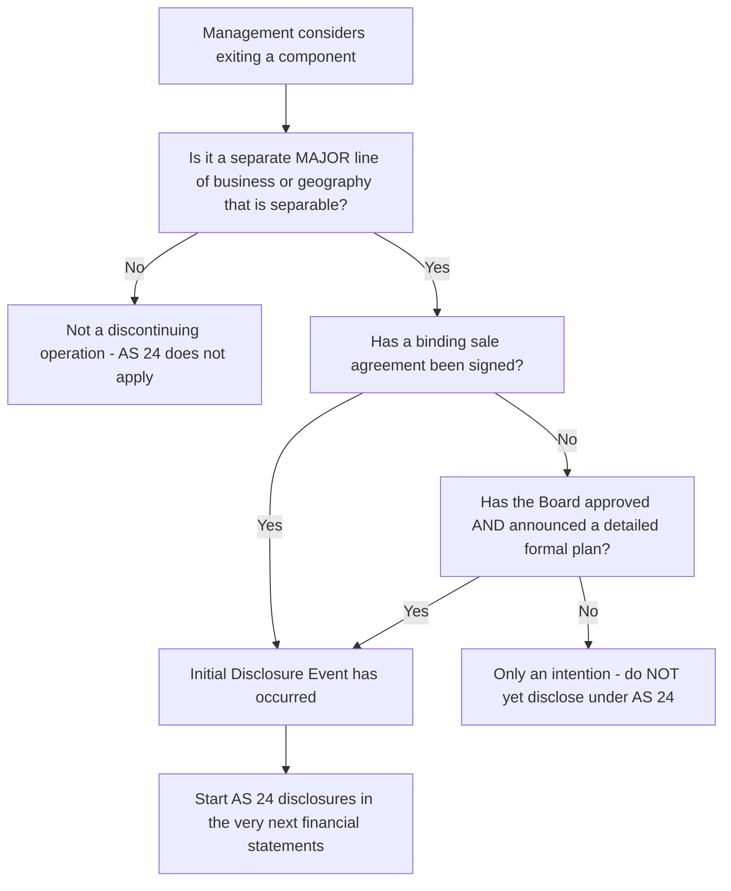
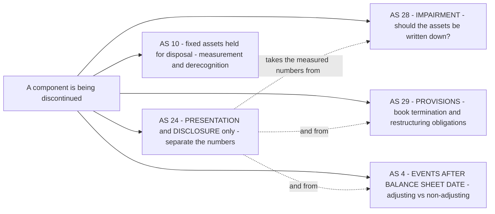
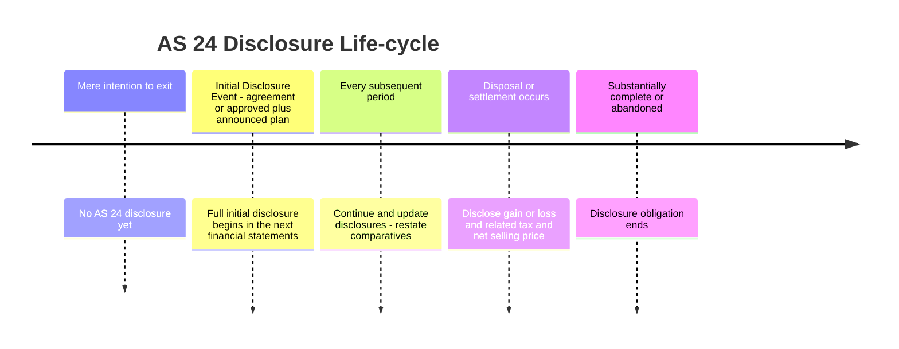

# Chapter 24 — AS 24: Discontinuing Operations

## 1. The Problem

You are an analyst. On your desk sits the annual report of **Sterling Industries Ltd.** The consolidated numbers look healthy: revenue ₹1,200 crore, profit ₹90 crore, both up nicely on last year. You build your forecast, recommend a "Buy," and move on.

Six months later the company announces it has **sold off its entire textile division** — a division that, it now emerges, contributed ₹400 crore of that revenue and ₹35 crore of that profit. Your forecast is worthless. The ₹90 crore of profit you extrapolated forward was, in reality, only ₹55 crore of *continuing* profit plus ₹35 crore from a business that no longer exists.

Here is the uncomfortable question: **could you have known?** The information was inside the company all along. The board had approved the sale. A binding agreement was signed *before* the balance sheet date. The textile division had its own factories, its own customers, its own cash flows that were perfectly identifiable. Yet the income statement blended everything into one undifferentiated lump of "revenue" and "profit," and the notes said nothing.

This is the problem AS 24 exists to solve. When a company **shuts down or sells off a major, self-contained chunk of its business**, the historical numbers become a trap. A single line of "total profit" hides a fundamental split:

- **Continuing operations** — the part of the business that will still be there next year, generating the cash flows that actually matter for valuation.
- **Discontinuing operations** — the part that is on its way out, whose profits, revenues and cash flows are one-time-only and must be stripped out before you forecast anything.

Three groups of users get hurt when this split is hidden:

1. **Investors and analysts** cannot assess the *sustainable, recurring* earning power of the enterprise. They over-value a company that is about to lose a chunk of its profit engine (or under-value one about to shed a loss-making drain).
2. **Lenders** cannot judge whether the cash flows that service their debt are the ongoing ones or the vanishing ones.
3. **Everyone** loses the ability to compare this year to next year on a **like-for-like** basis, because next year's income statement will silently omit whatever was sold.

Notice what the problem is *not*. The problem is **not** that the company measured its assets wrongly, or booked the sale at the wrong price. Those are questions for other standards (AS 10, AS 28, AS 4). The problem here is purely one of **communication and transparency**: the right numbers exist, but they are not *disclosed separately* and not *disclosed early enough* to be useful. Keep that distinction burning in your mind — it is the single most examined idea in this chapter, and we will return to it repeatedly.

---

## 2. The Core Idea (analogy)

Think of a company's income statement as a **hospital patient's vital-signs monitor**.

Imagine a patient is scheduled for the amputation of a limb. The surgeon has decided, the consent form is signed, the operation is booked for next week. Now suppose the monitor keeps reporting a *single blended* "total body activity" reading — combining the healthy torso with the limb that is about to be removed. The reading looks stable. But it is **misleading**, because next week a large, identifiable part of that "total" will simply be gone. Any doctor planning post-operative care needs the monitor to show two separate traces *right now*: **"body that will remain"** and **"limb that is leaving."**

AS 24 is the rule that forces the monitor to split the trace. It says: the moment the decision to amputate becomes real and committed (the "initial disclosure event"), you must start reporting the leaving part **separately** — its revenue, its profit, its assets, its cash flows — so that the reader can mentally perform the subtraction and see the *body that will remain* on its own.

Crucially — and this is where the analogy earns its keep — **AS 24 does not perform the surgery, and it does not change the patient's weight.** It does not tell you to write the limb down, or revalue it, or book a loss on removal. It is a **labelling and separation** standard, not a **treatment** standard. Whether the leaving part needs to be written down to a lower value is decided by *other* doctors (impairment under AS 28, provisions under AS 29, events after the balance sheet date under AS 4). AS 24's entire job is to make sure the two traces are drawn separately and drawn early.

That is the whole chapter in one image. Everything below is detail hung on this frame: *when* the split must start, *what* qualifies as a "limb" big enough to matter, *what* exactly you must show for it, and *how* to present it.

---

## 3. Why It's Built This Way

Once you accept that the goal is **separation for forecasting**, almost every design choice in AS 24 becomes something you can *derive* rather than memorize. Let us reason through the four big design decisions.

**Design decision 1 — Why only "major" components, not any small closure?**
If AS 24 forced separate disclosure of *every* product line or shop a company ever closed, the notes would drown in trivia and the signal would be lost in noise. The whole point is to flag changes big enough to move a user's *forecast*. So the standard sets a **materiality-of-structure** threshold: the thing leaving must be a genuinely **distinguishable, major line of business or geographical area** — something whose operations, assets and cash flows can be *separated out* both operationally and for financial-reporting purposes. A tea company closing one of its forty retail kiosks is noise. A tea company exiting its entire coffee business is signal. Only the signal gets AS 24 treatment.

**Design decision 2 — Why disclose *early*, at a "decision + commitment" point, rather than waiting for the sale to complete?**
A user's forecasting error is largest in the *gap* between "the company has committed to leave" and "the company has actually left." If disclosure waited until the disposal was legally complete, users would forecast blindly through exactly the period when management already knows the future has changed. So AS 24 pins disclosure to the **earlier** of two committing events (the "initial disclosure event," defined below): either a **binding sale agreement** or a **board-approved detailed formal plan** that has been announced. The logic is: disclose as soon as the intention becomes *irreversible enough to be reliable*, but not so early that every idle boardroom musing triggers a note. A mere *intention* or *possibility* is not enough — that would flood users with false alarms about disposals that never happen.

**Design decision 3 — Why is it a DISCLOSURE standard and not a MEASUREMENT standard?**
This is the deepest design choice and the examiners' favourite. AS 24 deliberately **does not** create any new rule for *how much* to write down the discontinuing assets or *how much* liability to book. Why? Because those questions are already answered elsewhere and answering them *again* here would create conflict and double-counting:

- Should the discontinuing assets be written down? → That is **impairment**, governed by **AS 28**.
- Should a provision be made for termination/restructuring costs? → Governed by **AS 29** (Provisions), which requires a present obligation.
- If the plan is finalized *after* the balance sheet date, does it adjust the accounts? → Governed by **AS 4** (events after the balance sheet date).

AS 24 sits *on top* of these. It says: "Whatever those standards tell you to measure, take those numbers — and now **present them separately** for the discontinuing part." It adds transparency, not new arithmetic. This is why a common exam one-liner is: *"AS 24 does not establish any recognition or measurement principles; it is concerned only with presentation and disclosure."* Understand *why* (to avoid conflicting with AS 28/29/4) and you never need to memorize it.

**Design decision 4 — Why keep showing it in the notes right up to completion, and even a bit after?**
Because the user needs to track the *unwinding*. A committed disposal is a moving story: cash comes in from the sale, gains or losses crystallize, the pre-tax profit shrinks period by period. Users forecasting the "body that remains" need to watch the limb detach cleanly. So the disclosures **continue in every set of financial statements until the discontinuance is substantially complete**, and the standard even requires an *update* disclosure of significant changes in amounts or timing along the way.

---

## 4. Full Technical Content

Now the exact provisions, wrapped in the reasoning above. This section is your complete rulebook — if you internalise it you can answer any AS 24 exam question.

### 4.1 What qualifies as a "Discontinuing Operation"

A **discontinuing operation** is a *component* of an enterprise that satisfies **all** of the following, tied together by a single triggering plan or agreement:

**(a) The enterprise, pursuant to a single plan, is:**
- (i) **disposing of the component substantially in its entirety** — e.g. selling the business unit in a single transaction, by demerger or spin-off, or
- (ii) **disposing of it piecemeal** — selling off the assets and settling the liabilities individually, or
- (iii) **terminating it through abandonment** — simply closing it down.

**(b) The component represents a *separate major line of business or geographical area* of operations.** ("Major" is the materiality gate — reason from Design decision 1.)

**(c) The component can be *distinguished operationally and for financial reporting purposes*.** In practice this means its assets, liabilities, revenues (mostly to external customers) and the *majority* of its operating expenses can be **directly attributed** to it. This is the "self-contained limb" test — if you cannot cleanly carve out its numbers, you cannot report it separately, so it does not qualify.

**What does NOT qualify (reason from the "major + separable" gates):**

| Not a discontinuing operation | Why not |
|---|---|
| Gradually or evolutionary phasing out a product line or class of service | Not a *sudden, distinguishable* major discontinuance; ordinary evolution |
| Discontinuing several products within an ongoing line of business | The *line of business* continues; only some products stop |
| Shifting some production or marketing activities for a line from one location to another | The line continues; just relocated |
| Closing a facility to achieve productivity or cost savings | The business continues; it is a restructuring/efficiency move, not an exit |
| Selling a subsidiary whose activities are *similar* to the parent/other subsidiaries | Fails the "separate *major* line / geography" test — the enterprise stays in the same business |

Note the recurring logic: if the enterprise **stays in substantially the same business**, there is nothing for the user to strip out of the forecast, so AS 24 does not apply. AS 24 fires only when a *distinct chapter* of the business is closing.

### 4.2 The Initial Disclosure Event — the trigger and its timing

Disclosure under AS 24 starts at the **initial disclosure event**, defined as the **earlier** of the following two:

1. The enterprise has entered into a **binding sale agreement** for substantially all of the assets attributable to the discontinuing operation; **or**
2. The enterprise's **board of directors (or similar governing body)** has both **(a) approved a detailed, formal plan** for the discontinuance **and (b) made an announcement of the plan.**

*Figure 1 — The two-gate test: first confirm the component qualifies, then confirm a committing event has occurred. Both must be satisfied before AS 24 disclosure begins.*

The **detailed formal plan** in route 2 is expected to identify, at minimum: the *major assets* to be disposed of, the *expected method* of disposal, the *period expected to complete* the disposal, the *principal locations* affected, the *location, function and approximate number of employees* to be compensated for termination, and the *estimated proceeds or salvage*.

Why "earlier of"? Because either event, on its own, makes the exit **committed and reliable enough** to report. A binding agreement is objectively committing. A board-approved *and announced* plan is committing because the announcement creates a valid expectation among affected parties (employees, customers) that the enterprise will follow through — the same "public commitment" logic that AS 29 uses for restructuring provisions.

**A pure intention is not a trigger.** If the board is merely "exploring options," nothing is disclosed under AS 24. Disclosure of mere possibilities would defeat the purpose (Design decision 2).

### 4.3 What must be disclosed — the initial disclosure

In the financial statements covering the period in which the **initial disclosure event** occurs, the enterprise must disclose the following for the discontinuing operation:

| # | Item to disclose | Why the user needs it |
|---|---|---|
| 1 | A **description** of the discontinuing operation | To know *what* is leaving |
| 2 | The **business or geographical segment(s)** in which it is reported under AS 17 | Links AS 24 story to segment reporting |
| 3 | The **date and nature** of the initial disclosure event | To know *when* commitment happened and *how* (agreement vs plan) |
| 4 | The **date or period** in which the discontinuance is *expected to complete*, if known | To time the forecast — when does the limb fully detach |
| 5 | The **carrying amounts, as at the balance sheet date, of the total assets and total liabilities** to be disposed of | To size the balance-sheet impact of the exit |
| 6 | The amounts of **revenue, expenses, and pre-tax profit or loss from ordinary activities** attributable to the discontinuing operation, and the related **income tax expense** | The core split — recurring vs vanishing performance |
| 7 | The amounts of **net cash flows** attributable to **operating, investing and financing** activities of the discontinuing operation | To strip the vanishing cash flows out of the forecast |

Items 6 and 7 are the heart of it: they are exactly the "second trace on the monitor." The remaining items give context (what, where, when, how big).

### 4.4 Other disclosures — as events unfold

**On disposal / settlement (recognition of gain or loss):**
When the enterprise disposes of assets or settles liabilities attributable to the discontinuing operation, or enters into binding agreements to do so, it must disclose:
- (a) any **gain or loss recognised on the disposal** of assets or settlement of liabilities, **and the related income tax expense**; and
- (b) the **net selling price (or range)** of net assets for which the enterprise has entered into binding sale agreement(s), the **expected timing** of receipt of cash, and the **carrying amount** of those net assets.

**Continuing (updating) disclosures:**
The disclosures in 4.3 and above must be **presented in the financial statements for every period** from the initial disclosure event **until the discontinuance is substantially complete** (i.e. the plan is substantially completed or abandoned), even though the actual sale may occur in a later period. Additionally, if there is a **significant change** in the amount or timing of cash flows relating to the assets/liabilities, or in the events that were expected, the enterprise must disclose the **nature and reason** for the change with an **updated description**.

**Where to put the disclosures — face vs notes:**
- The amounts required in **4.3 item 6** (pre-tax profit/loss from ordinary activities of the discontinuing operation, and the related tax) **should be shown on the *face* of the statement of profit and loss.**
- All **other AS 24 disclosures** may be presented **either on the face or in the notes** to the financial statements. Almost always they go in the notes.

**Restatement of prior periods:**
Comparative information for prior periods presented in financial statements *after* the initial disclosure event should be **restated** to segregate the continuing and discontinuing assets, liabilities, income, expenses and cash flows — so the reader gets like-for-like comparability across years.

### 4.5 When the plan is finalized AFTER the balance sheet date

Suppose the board approves and announces the plan (or a binding agreement is signed) **after** the balance sheet date but **before** the financial statements are approved. Does it hit *this* year's accounts?

Reason from AS 4 (events after the balance sheet date). The initial disclosure event *after* the reporting date is a **non-adjusting event** — it does not change the *measured* figures of the year just ended (the condition did not exist at the balance sheet date). But because it is material, AS 24 requires the relevant **disclosures** to be made under AS 4's non-adjusting-event disclosure requirement (nature of the event and, where possible, an estimate of its financial effect). Again notice: **disclosure, not measurement**.

### 4.6 Interaction with measurement standards (the boundary)

*Figure 2 — AS 24 is the presentation layer. It never measures; it borrows measured amounts from AS 28, AS 29, AS 4 and AS 10 and simply displays them separately for the discontinuing operation.*

---

## 5. Worked Examples

### Example 1 — Does it even qualify? (Easy: applying the definition)

**Facts.** For each situation below, state whether AS 24 applies. **Alpha Foods Ltd.** operates a packaged-snacks business and a separate dairy business.

(a) Alpha decides to stop making one flavour of potato chips within its snacks range.
(b) Alpha relocates its snacks factory from Pune to Nashik for cheaper power.
(c) Alpha signs a binding agreement to sell its entire dairy business (separate plants, separate distribution, separate customer base) to a rival.
(d) Alpha's board is "actively evaluating" whether to exit dairy but has taken no decision.

**Solution — reason from the two gates (Figure 1).**

| Case | Separate major line/geography & separable? | Committing event? | AS 24 applies? |
|---|---|---|---|
| (a) | No — snacks *line continues*, only one product stops | — | **No** (evolutionary product change) |
| (b) | No — snacks line continues, merely relocated | — | **No** (relocation) |
| (c) | Yes — dairy is a distinguishable major line | Yes — binding sale agreement | **Yes** |
| (d) | Yes — dairy would qualify structurally | **No** — mere intention, no approved+announced plan, no agreement | **No** (not yet) |

**Teaching point:** (a) and (b) fail the *structure* gate; (d) passes structure but fails the *commitment* gate. Only (c) clears both. In (d), the day the board **approves and announces** a detailed formal plan, AS 24 will start applying — not a day earlier.

---

### Example 2 — The initial disclosure (Medium: building the note and the split)

**Facts.** **Meridian Ltd.** has two divisions: **Chemicals** (continuing) and **Textiles** (to be discontinued). On **15 January 2026**, Meridian's board approved and publicly announced a detailed formal plan to sell the entire Textiles division; completion is expected by **30 September 2026**. The financial year ends **31 March 2026**. Extracted figures for the year ended 31 March 2026:

| ₹ in lakh | Chemicals (Continuing) | Textiles (Discontinuing) | Total |
|---|---|---|---|
| Revenue | 8,000 | 3,000 | 11,000 |
| Operating expenses | 6,200 | 2,650 | 8,850 |
| Pre-tax profit from ordinary activities | 1,800 | 350 | 2,150 |
| Income tax @ 30% | 540 | 105 | 645 |
| Post-tax profit | 1,260 | 245 | 1,505 |

Balance sheet items attributable to Textiles at 31 March 2026: total assets ₹2,400 lakh, total liabilities ₹900 lakh. Net cash flows attributable to Textiles during the year: operating ₹300 lakh, investing (₹120) lakh, financing (₹80) lakh.

**Required.** (i) Identify the initial disclosure event and its date. (ii) Prepare the AS 24 disclosure. (iii) Confirm the split reconciles to the total.

**Solution.**

**(i) Initial disclosure event.** The board **approved and announced** a detailed formal plan on **15 January 2026** — that is the initial disclosure event (route 2). No binding agreement was signed earlier, so this is the *earliest* committing event. It falls **within** the year ended 31 March 2026, so full AS 24 disclosure is required in these financial statements.

**(ii) AS 24 disclosure (extract):**

> *Discontinuing operation — Textiles Division.* On 15 January 2026 the Board approved and announced a detailed formal plan to dispose of the Textiles Division, a separate major line of business reported within the Textiles segment under AS 17. Disposal is expected to complete by 30 September 2026.
>
> | Textiles Division (₹ lakh) | Amount |
> |---|---|
> | Revenue | 3,000 |
> | Expenses | 2,650 |
> | **Pre-tax profit from ordinary activities** *(face of P&L)* | **350** |
> | Income tax expense | 105 |
> | Post-tax profit | 245 |
> | Carrying amount of total assets to be disposed of | 2,400 |
> | Carrying amount of total liabilities to be disposed of | 900 |
> | Net operating cash flow | 300 |
> | Net investing cash flow | (120) |
> | Net financing cash flow | (80) |

**(iii) Reconciliation.** Continuing pre-tax profit ₹1,800 + Discontinuing pre-tax profit ₹350 = **₹2,150 total** ✓. Post-tax ₹1,260 + ₹245 = **₹1,505 total** ✓. Assets and liabilities disclosed (₹2,400 / ₹900) are *carved out of* the group totals, not added on top — so no double counting.

**Analyst payoff:** a user now knows the *sustainable* pre-tax profit is **₹1,800 lakh** (Chemicals), not ₹2,150 lakh. Next year's forecast should drop the ₹350 lakh Textiles contribution once disposal completes.

---

### Example 3 — Gain on disposal, tax, and the boundary with AS 28/AS 4 (Exam-hard)

**Facts.** Continuing from **Meridian Ltd.** In the **next** year, ended **31 March 2027**:

- Textiles operated for the first half-year (April–September 2026) before disposal, earning pre-tax profit from ordinary activities of ₹160 lakh (tax @ 30%).
- On **30 September 2026**, Meridian completed the sale of Textiles' net assets. Carrying amount of net assets at disposal date was ₹1,500 lakh; net selling price received was ₹1,750 lakh.
- Separately, at **31 March 2027** the Chemicals division showed indications that one of its plants was impaired; the recoverable amount was ₹90 lakh below carrying amount.

**Required.** (i) Compute the gain on disposal and its tax. (ii) State how each item is presented, and (iii) explain precisely which standard governs each measurement — testing the "disclosure not measurement" boundary.

**Solution.**

**(i) Gain on disposal of Textiles net assets.**

| ₹ lakh | Amount |
|---|---|
| Net selling price received | 1,750 |
| Less: Carrying amount of net assets disposed | (1,500) |
| **Pre-tax gain on disposal** | **250** |
| Income tax on gain @ 30% | 75 |
| **Post-tax gain on disposal** | **175** |

**(ii) Presentation in FY 2026-27 (reason from Section 4.4):**

- Textiles is **still a discontinuing operation** in FY 2026-27 until the discontinuance is *substantially complete*, so AS 24 disclosures continue.
- The **pre-tax profit from Textiles' half-year of ordinary activities (₹160 lakh) and its tax (₹48 lakh)** are shown on the **face of the P&L**, split from continuing operations.
- The **gain on disposal ₹250 lakh and related tax ₹75 lakh** are **disclosed** (item (a) of the "on disposal" disclosures), separately from the ordinary-activities result — you must not blend the operating result with the one-off disposal gain.
- The prior-year (FY 2025-26) comparatives are **restated** to keep Textiles segregated, preserving comparability.

**(iii) Which standard measures what — the crucial boundary:**

| Item | Governing standard | Not AS 24 because… |
|---|---|---|
| Gain of ₹250 lakh (selling price − carrying amount) | **AS 10 / general derecognition** measures the gain; **AS 24 only *displays* it separately** | AS 24 sets no rule for *how much* gain — it takes the measured number and presents it |
| Tax of ₹75 lakh on the gain | **AS 22 (Taxes on Income)** | AS 24 does not compute tax |
| ₹90 lakh impairment on the **Chemicals** plant | **AS 28 (Impairment)** — and it belongs to **continuing** operations, so it is *not* an AS 24 item at all | AS 24 concerns the *discontinuing* component only |
| Had the plan been approved *after* 31 Mar but before accounts signed | **AS 4** — non-adjusting event, disclose only | AS 24 defers the adjusting/non-adjusting question to AS 4 |

**Teaching point:** the examiner's trap is to see the word "discontinuing" and try to *measure* something under AS 24. AS 24 measures **nothing**. Every rupee above is measured by AS 10 / AS 22 / AS 28 / AS 4; AS 24's only contribution is the *layout* — pushing the discontinuing numbers into their own column and the disposal gain into its own line.

**Reconciliation check:** FY 2026-27 total pre-tax profit = Chemicals result (after the ₹90 lakh impairment) + Textiles half-year ₹160 + disposal gain ₹250. Each block is separately visible, and they sum to the reported total — the reader can rebuild the whole from the parts. ✓

---

## 6. Presentation & Disclosure Formats

### 6.1 Face of the Statement of Profit and Loss (illustrative)

Only the **pre-tax profit/loss from ordinary activities of the discontinuing operation and its related tax** are mandatory on the face; the columnar split below is a common, user-friendly way to present it.

| ₹ lakh | Continuing operations | Discontinuing operation | Total enterprise |
|---|---|---|---|
| Revenue | 8,000 | 3,000 | 11,000 |
| Expenses | (6,200) | (2,650) | (8,850) |
| **Profit before tax from ordinary activities** | **1,800** | **350** | **2,150** |
| Income tax expense | (540) | (105) | (645) |
| **Profit after tax** | **1,260** | **245** | **1,505** |
| *Add (memo): gain on disposal, net of tax* | — | *175* | *175* |

*The mandatory face items are the bold "Profit before tax from ordinary activities" of the discontinuing column and its tax. The disposal gain is disclosed separately, not merged into the ordinary result.*

### 6.2 Notes — the initial disclosure block (template)

> **Note X — Discontinuing Operation**
> 1. **Description:** [name and nature of the operation being discontinued].
> 2. **Segment (AS 17):** reported within the [___] business / geographical segment.
> 3. **Initial disclosure event:** [binding sale agreement dated __ / Board approval and announcement of formal plan dated __].
> 4. **Expected completion:** [date or period], if known.
> 5. **Carrying amounts at balance sheet date:** total assets ₹__ ; total liabilities ₹__ to be disposed of.
> 6. **Results from ordinary activities:** revenue ₹__ ; expenses ₹__ ; pre-tax profit/(loss) ₹__ ; income tax ₹__.
> 7. **Net cash flows:** operating ₹__ ; investing ₹__ ; financing ₹__.
> 8. **On disposal (if applicable):** gain/(loss) on disposal ₹__ and related tax ₹__ ; net selling price of net assets under binding agreement ₹__ ; expected timing of cash receipt [__] ; carrying amount of those net assets ₹__.
> 9. **Updates:** [nature and reason for any significant change in amount or timing of cash flows since last reported].

### 6.3 Timeline of disclosure obligation

*Figure 3 — The obligation switches on at the initial disclosure event and stays on, updating each period, until the discontinuance is substantially complete or the plan is abandoned.*

---

## 7. Connections

AS 24 is a hub standard — it deliberately leans on many others. Seeing the web is how you keep the boundary straight.

- **AS 17 (Segment Reporting):** A discontinuing operation is almost always a *segment or part of a segment*. AS 24 requires you to *name the segment* in which the operation is reported. Conceptually AS 17 tells the user *how the business is structured*; AS 24 tells them *which structural piece is leaving*. They are complementary lenses.
- **AS 28 (Impairment of Assets):** When a component is being discontinued, its assets are prime candidates for impairment. AS 28 does the *write-down measurement*; AS 24 merely presents the resulting numbers separately. Exam link: "Does AS 24 require the discontinuing assets to be written down?" → **No; AS 28 does.**
- **AS 29 (Provisions, Contingent Liabilities and Contingent Assets):** Termination benefits, onerous contracts and restructuring provisions tied to the exit are recognised and measured under AS 29. The "board approved and *announced* a plan" trigger in AS 24 mirrors AS 29's "public commitment creates a constructive obligation" logic — same commitment philosophy, different purpose (AS 24 discloses, AS 29 provides).
- **AS 4 (Contingencies and Events After the Balance Sheet Date):** Decides whether a post-year-end initial disclosure event adjusts the accounts (no — non-adjusting) or is merely disclosed. AS 24 hands this timing question to AS 4.
- **AS 5 (Net Profit/Loss for the Period, Prior Period Items and Changes in Accounting Policies):** The discontinuing operation's results are part of *ordinary activities*, not extraordinary items. AS 24 refines *how* the ordinary result is presented (split out), but does not reclassify it as extraordinary.
- **AS 22 (Taxes on Income):** Every AS 24 profit/gain figure is disclosed *with its related tax*. The tax is measured by AS 22; AS 24 insists it be shown alongside so the user sees the *after-tax* picture of what is leaving.
- **Ind AS bridge (context, not examinable here):** Under Ind AS, this territory is covered by **Ind AS 105 — Non-current Assets Held for Sale and Discontinued Operations**, which — unlike AS 24 — *does* add measurement rules (lower of carrying amount and fair value less costs to sell, cessation of depreciation, separate held-for-sale classification on the balance sheet). Knowing this contrast crystallizes AS 24's identity: **AS 24 = disclosure only; Ind AS 105 = disclosure *plus* measurement.**

---

## 8. Traps & Examiner Tricks

1. **"AS 24 tells you to write down / provide for something."** ✗ It never does. It is presentation and disclosure only. This is the single most-tested trap — if a question asks you to *measure* an impairment or provision, cite AS 28 / AS 29, not AS 24.

2. **Triggering on a mere intention.** A board that is "considering," "evaluating" or "exploring" an exit has **not** hit the initial disclosure event. Disclosure begins only at a **binding sale agreement** *or* a **board-approved AND announced detailed formal plan** — whichever is **earlier**. Watch for questions where the plan is approved but *not yet announced* (route 2 needs both).

3. **Confusing "restructuring / cost-cutting closure" with a discontinuing operation.** Closing a plant for efficiency, relocating production, or dropping a few products while the line continues are **not** discontinuing operations. The enterprise must be exiting a **separate major line of business or geographical area**.

4. **Selling a *similar* subsidiary.** If the disposed subsidiary does substantially the *same* business as the rest of the group, the enterprise has not exited a distinct line — it does **not** qualify. Examiners love this because "we sold a subsidiary" *sounds* like a discontinuance.

5. **Forgetting the "earlier of."** If both a binding agreement (say, March) and an earlier board-approved-and-announced plan (say, January) exist, the initial disclosure event is the **earlier** one (January). Students often default to the agreement date.

6. **Blending the disposal gain into the operating result.** The pre-tax profit/loss from *ordinary activities* of the discontinuing operation and the *gain/loss on disposal* are **separate disclosures**. Do not net or merge them.

7. **Putting everything in the notes.** The **pre-tax profit/loss from ordinary activities of the discontinuing operation and its related tax must appear on the FACE** of the statement of profit and loss. Only the *other* items may sit in the notes.

8. **Stopping disclosure at year of decision.** Disclosures **continue every period until substantially complete/abandoned**, with **updates** for significant changes in amount/timing, and **comparatives are restated**. A one-and-done note is wrong.

9. **Post-balance-sheet plan treated as adjusting.** An initial disclosure event *after* the balance sheet date is a **non-adjusting** event under AS 4 — **disclose only**, do not restate the closed year's measured numbers.

10. **Ignoring related tax.** Every required profit/gain figure must be shown **with its income tax**. Dropping the tax line loses marks.

---

## 9. First-Principles Recap

Strip AS 24 to its skeleton and rebuild it from the single problem:

- **The problem:** a blended income statement hides a major chunk of business that is about to disappear, wrecking any forecast of *sustainable* earning power. → *We need separation.*
- **The fix:** report the leaving chunk **separately** — its revenue, expenses, pre-tax result, tax and cash flows — so users can subtract the vanishing part and see the *continuing* business alone. → *That is disclosure, not measurement.*
- **How big must the chunk be?** A **separate major line of business or geographical area** that is **operationally and financially separable**. Small closures, relocations, product tweaks and same-business subsidiary sales do **not** count. → *Materiality of structure.*
- **When do we start telling?** At the **initial disclosure event** — the **earlier** of a **binding sale agreement** or a **board-approved *and announced* detailed formal plan**. Not on mere intention. → *Commitment must be reliable but early.*
- **How long do we keep telling?** **Every period until substantially complete or abandoned**, updating for significant changes and restating comparatives. → *Track the unwinding.*
- **Who does the actual measuring?** **AS 28** (impairment), **AS 29** (provisions), **AS 4** (event timing), **AS 22** (tax), **AS 10** (asset derecognition). AS 24 only **borrows and displays**. → *Disclosure standard, full stop.*

If you can re-derive every rule from "separate the vanishing part so users can forecast the continuing part," you never need to memorize the standard — you can *reconstruct* it.

---

## 10. Quick-Revision Sheet

**Nature of AS 24:** Presentation & **disclosure** standard only. **No recognition or measurement rules.**

**Qualifies as discontinuing operation — ALL of:**
1. Disposal (whole / piecemeal / abandonment) under a **single plan**;
2. **Separate major line of business or geographical area**;
3. **Distinguishable operationally and for financial reporting** (assets, liabilities, revenue, most expenses directly attributable).

**Does NOT qualify:** evolutionary phase-out of a product line; dropping some products in a continuing line; relocating production/marketing; closing a facility for cost savings; selling a **similar-business** subsidiary.

**Initial Disclosure Event = EARLIER of:**
- (a) **Binding sale agreement** for substantially all attributable assets; or
- (b) Board **approves AND announces** a **detailed formal plan**.
*(Mere intention ≠ trigger.)*

**Initial disclosure (what to show):** description; AS 17 segment; date & nature of event; expected completion date; carrying amount of total **assets & liabilities** to be disposed; **revenue, expenses, pre-tax profit & tax** from ordinary activities; **net cash flows** — operating / investing / financing.

**On disposal:** **gain/loss on disposal + related tax**; net selling price of net assets under binding agreement; expected timing of cash; carrying amount of those net assets.

**Face vs notes:** **Pre-tax profit/loss from ordinary activities of the discontinuing operation + its tax → FACE of P&L.** Everything else → face or **notes**.

**Ongoing:** disclose **every period until substantially complete/abandoned**; **update** significant changes in amount/timing; **restate** comparatives.

**After balance sheet date event:** **AS 4** — non-adjusting → **disclose only**.

**Boundary map:** AS 24 = *display separately*. Impairment → **AS 28**; provisions/termination costs → **AS 29**; event timing → **AS 4**; tax → **AS 22**; asset derecognition/gain → **AS 10**.

**Ind AS contrast:** **Ind AS 105** adds measurement (held-for-sale at lower of carrying amount and fair value less costs to sell, stop depreciation); **AS 24 does not**.

**One-line exam mantra:** *AS 24 separates the vanishing part of the business from the continuing part — it discloses, it does not measure.*
