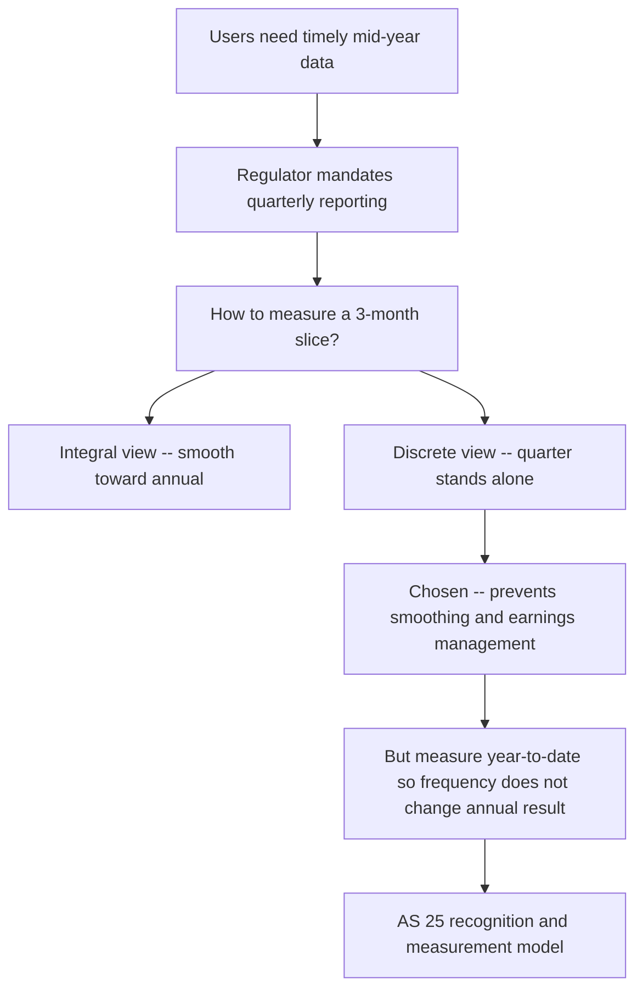
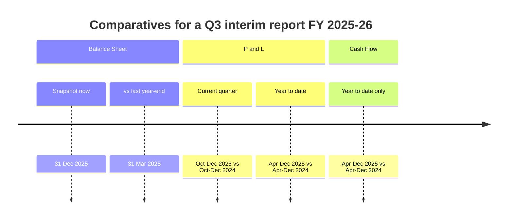
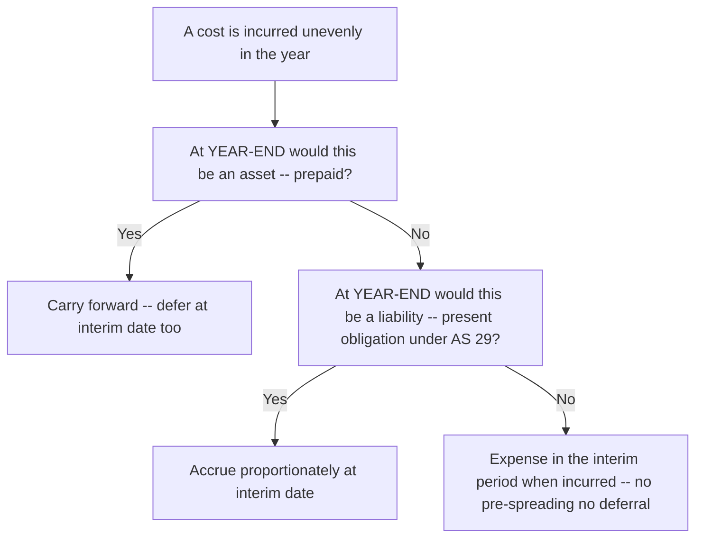
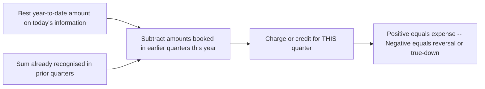
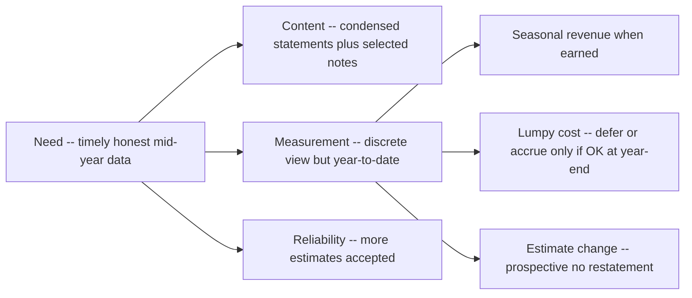

<!-- v2-deep -->

# Chapter 25 — AS 25: Interim Financial Reporting

## 1. The Problem

Imagine you are a lender, an equity analyst, or a regulator watching a listed company. The company publishes a full, audited set of financial statements **once a year** — say for the year ended 31 March. Now put yourself in July. The last picture you have of this business is four months old. In those four months, interest rates may have moved, a factory may have flooded, a competitor may have launched a product, the company may have raised or lost a huge contract. Yet the numbers you are staring at describe a world that no longer exists.

Annual reporting has a **staleness problem**. Financial statements are useful only if they are *timely*, and once-a-year is not timely enough for capital markets that price securities every second. The regulator's answer (SEBI's Listing Regulations) is to force listed companies to publish **quarterly** results. That solves timeliness — but immediately creates three brand-new accounting problems:

1. **The chopping problem.** A year is a natural accounting period — you buy assets, consume them, sell goods, and close the books. A *quarter* is an artificial slice. How do you cut a continuous business into three-month pieces without distorting each piece? Costs and revenues do not fall neatly into calendar quarters.

2. **The seasonality problem.** A woollen-garment maker earns almost nothing in the June and September quarters and makes its entire profit in December–March. A crackers manufacturer sells everything around Diwali. If you report a naked June-quarter loss, is that a "loss" — or just the shape of the year? Should you *smooth* it out so every quarter looks similar?

3. **The lumpy-cost problem.** Some costs hit once a year — a bonus declared in Q4, an advertising blitz in Q2, a major repair, property tax paid annually, staff welfare at year-end. Do you dump the whole cost into the quarter it is paid, or spread it across quarters?

There is also a **content problem**. A full annual report is a heavy document — full balance sheet, full P&L, cash flow, dozens of note-schedules, directors' report. Must a company reproduce *all* of that four times a year? That would be enormously costly and would drown the reader. So what is the *minimum* a useful interim report must contain?

And finally there is a **reliability-vs-speed problem**. A three-month deadline is not enough time to do everything you do at year-end — a full physical stock count, a full actuarial valuation of gratuity, a full tax computation with every deduction confirmed. So a fourth question lurks underneath: *how rough is the enterprise allowed to be* in exchange for being fast? A number that is perfect but arrives in September for the June quarter is worthless; a number that is 98% right and arrives in July is gold. AS 25 has to license that trade-off without licensing sloppiness.

AS 25 exists to answer exactly these questions: **what** an interim report must contain, and **how** you measure the numbers in it — especially seasonal revenue and lumpy costs — while explicitly permitting *greater use of estimates*.

> **One-line framing:** AS 25 is the rulebook for slicing a year into pieces without lying about any piece.

---

## 2. The Core Idea (analogy)

Think of a **film versus a photograph**.

The annual financial statements are a *photograph* taken at year-end plus a summary of the whole film. An interim report is a **still frame pulled from the middle of the film**. The central design question is: *what does that middle frame mean on its own?*

There are two philosophies for how to treat a mid-film frame:

- **The "integral" view — the frame belongs to the whole film.** Under this view, each quarter is just a *part* of the annual whole. The purpose of a quarter's numbers is to *predict* and *build toward* the annual figure. So you are allowed to smooth, defer, and anticipate: if you know a big annual cost is coming, you accrue a slice of it each quarter; if a quarter is seasonally strong, you may defer some profit to help the weak quarters. The quarter is a *forecasting instrument*.

- **The "discrete" view — the frame is its own photograph.** Under this view, each interim period is a **standalone reporting period**. You apply the *same* recognition and measurement rules you would apply if that quarter were a mini-year. A cost is recognised when it meets the definition of an expense in that period — not spread just because it is "annual" in flavour. Revenue is recognised when earned — even if that makes the quarter look lumpy. The quarter tells the truth about itself, warts and all.

**AS 25 chooses the discrete view for recognition and measurement** — with one crucial, sensible exception baked into how you *compute* the numbers (the "year-to-date" mechanism, explained in Part 4). The reason for choosing discrete is the theme of this whole chapter: *smoothing hides information*. If a June-quarter loss is real, the market deserves to see it. Papering over seasonality would defeat the entire purpose of interim reporting, which was **timely, honest information**.

**A cleaner way to say it:** AS 25 is *discrete for recognition* (does this item belong to this period at all?) but *integral for the arithmetic* (measure cumulatively so four slices always re-add to the year). Students who blur these two halves are the ones who either (a) start smoothing revenue — wrongly integral on recognition — or (b) refuse to true-up a tax rate change in a later quarter — wrongly discrete on the arithmetic. Keep the two halves in separate boxes in your head.

Hold onto this single sentence: **treat each interim period basically as if it were a small, independent accounting period — recognise costs and revenues by the same rules as an annual period — but measure cumulatively from the start of the year.**

---

## 3. Why It's Built This Way

Let's earn each of AS 25's big design choices from first principles, so nothing needs memorising.

**Why discrete, not integral?**
The whole reason SEBI forced quarterly reporting was that annual data is stale and users want the *real* mid-year situation. If the accounting standard then let managers *smooth* the quarters to look uniform, users would be back to a fiction — a manufactured picture rather than the truth. Smoothing also hands management a dangerous lever: "defer profit from a good quarter, release it in a bad quarter" is precisely how earnings management and fraud begin. So the standard's spine is: **the quarter must not deliberately anticipate future events or defer present ones just to look smooth.** A cost that *is* an expense of Q1 stays in Q1. Revenue earned in Q3 stays in Q3.

**Why then a "year-to-date" measurement, which sounds integral?**
Here is the subtlety students trip on. AS 25 says the *frequency* of reporting should not change the *annual* result. If you measured each quarter in complete isolation and simply added four quarters, you could get an annual figure different from what you'd get by measuring the year as one period — because of how estimates and thresholds work. To prevent that, AS 25 measures things **cumulatively (year-to-date)** and treats the interim period as *part of the annual period for the limited purpose of not letting quarterly slicing change the annual total*. This is not smoothing; it is *consistency*. The classic consequence: if an estimate made in Q1 turns out wrong, you don't restate Q1 — you correct it in a *later* quarter's year-to-date figure. The annual number stays honest; the quarter carries the change when knowledge improves.

**Why does the year-to-date mechanism actually change anything — a concrete "why".**
Consider a tax rate that depends on cumulative profit crossing a slab, or a bonus that only triggers once annual sales cross a target. Quarter-by-quarter in isolation, you might never cross the threshold in any single quarter and book nothing; measured year-to-date, the cumulative figure crosses the threshold and forces recognition. The year-to-date lens is what makes interim numbers *converge* on the correct annual answer instead of drifting. This is the mechanical reason AS 25 mandates cumulative measurement — it is the only way to guarantee that "four quarters" and "one year" reconcile when thresholds, slabs, and averages are involved.

**Why a *minimum* set of components, not the full annual report?**
Cost and timeliness. Forcing a full audited annual report four times a year would be so slow and expensive that it would destroy timeliness — the very thing interim reporting exists to deliver. So AS 25 asks only for **condensed** statements plus **selected explanatory notes** — enough for a reader who *already has* the latest annual report to understand *what changed*. Interim reports are built to be read *alongside* the last annual report, not instead of it.

**Why keep *every heading* even when condensing?**
Because a reader compares the interim line against the same line in the last annual report. If a condensed statement silently dropped "Finance costs" or "Employee benefits expense," the reader could not tell whether the line went to zero or just vanished from the page — a dangerous ambiguity. Condensing is therefore defined as *removing sub-detail within a heading*, never *removing a heading*. The heading is the reader's anchor to the annual document.

**Why lean so heavily on estimates?**
A three-month deadline is brutal. You cannot do a full physical stock count, full actuarial valuation, or full tax computation every quarter. So AS 25 openly accepts **greater use of estimates** in interim periods than in annual accounts — while insisting the information remains *reliable and relevant*. This is an honest trade-off: a slightly rougher number delivered on time beats a perfect number delivered too late. The corollary — often missed — is that a *change* in one of those rougher estimates is expected and normal, so AS 25 needs a clean rule for absorbing it (prospective, no restatement) rather than treating every revision as an error.

*Figure 1 — The chain of reasoning from the staleness problem to AS 25's discrete, year-to-date model.*

---

## 4. Full Technical Content

This is the part you must know cold for the exam. Every rule below is tied back to the reasoning above.

### 4.1 Objective and Scope

**Objective.** AS 25 prescribes the *minimum content* of an interim financial report and the *recognition and measurement principles* for complete or condensed financial statements for an interim period. Timely and reliable interim reporting improves the ability of investors, creditors, and others to understand an enterprise's capacity to generate earnings and cash flows and its financial condition.

**Scope — a critical exam point.** AS 25 **does not mandate which enterprises must publish interim reports, how frequently, or how soon after period-end.** That is the job of a *statute or a regulator* (e.g., SEBI Listing Regulations, or an RBI/other regulator). **AS 25 only says: IF an enterprise is required or elects to prepare an interim financial report, THEN it should comply with AS 25.** 

There is one nuance in the ICAI text worth stating precisely: if an enterprise's interim report is *described as complying with Accounting Standards*, it must comply with **all** AS 25 requirements. A presentation of only *some* interim information (not claiming full compliance) triggers a specific disclosure (see 4.7). Confirm the exact wording in current ICAI material, but the principle — "AS 25 governs *how*, not *whether*" — is the reliably tested point.

**Interim period** = a reporting period *shorter than a full financial year* (typically a quarter or half-year).
**Interim financial report** = a financial report containing either a *complete* set of financial statements (as per AS 1) or a *set of condensed* financial statements for an interim period.

**Applicability nuance (level of the standard).** AS 25's *measurement and recognition* principles are the mandatory core. However, the ICAI's clarification is important for the exam: if a statute or regulator requires only *some* interim data, or requires interim data in a form that differs from AS 25, the **recognition and measurement principles of AS 25 still apply to that data** even though the *presentation/minimum-components* rules may be over-ridden by the regulator's format. In short: a regulator can dictate the *shape* of the report, but the *measurement* of every number in it is governed by AS 25. This "measurement follows AS 25 even if presentation follows SEBI" point is a favourite discriminator question.

### 4.2 Minimum Components of an Interim Financial Report

AS 25 permits an enterprise to publish **either** a complete set **or** a condensed set. In practice, listed companies publish **condensed**. The minimum condensed components are:

| # | Component | Minimum form required |
|---|-----------|----------------------|
| (a) | Condensed **Balance Sheet** | Each heading and sub-heading that was in the most recent *annual* balance sheet, plus selected notes |
| (b) | Condensed **Statement of Profit and Loss** | Each heading and sub-heading from the most recent annual P&L, plus selected notes |
| (c) | Condensed **Cash Flow Statement** | Each *major* heading/sub-heading from the most recent annual cash flow statement, plus selected notes |
| (d) | **Selected explanatory notes** | The notes listed in 4.6 below |

**Minimum line items rule:** a condensed statement must include, at minimum, **each of the headings and sub-headings** that were included in the *most recent annual* financial statements, **plus the selected explanatory notes**. **Additional line items are included if their omission would make the condensed statement misleading.** (You compress the detail, but you cannot drop a whole heading that was in the annual accounts.)

**Earnings per share (EPS):** basic and diluted EPS must be presented **on the face** of the Statement of Profit and Loss (complete or condensed) for the interim period. (AS 25 requires EPS presentation where AS 20 applies to the enterprise.)

**Consolidation:** If the enterprise's *annual* statements were consolidated, the interim report should be prepared on a **consolidated** basis. Presenting standalone alongside is optional/consistent with the annual set, but AS 25 does not *require* separate standalone interim statements in addition.

**"Complete set" vs "condensed set" — what the choice actually costs.** If an enterprise elects to publish a *complete* set at interim date, it must meet the *full* AS 1 form and content (every schedule, every note) — it has voluntarily raised its own bar. If it publishes a *condensed* set, it gets the lighter AS 25 minimum. There is no half-way house: you cannot call something a "complete set" and then omit AS 1 items. This matters because the disclosure obligations, and the reader's expectations, ratchet up the moment the word "complete" is used.

### 4.3 The Periods for Which Interim Statements Are Presented (Comparatives)

This is a favourite exam trap because each statement follows a *different* comparative pattern. Learn the logic, not the grid: **balance sheet is a snapshot (a point in time), so it compares to the last year-end; the flow statements (P&L, cash flow) accumulate over time, so they show both the current period and cumulative year-to-date, each against the corresponding period last year.**

| Statement | Current period columns | Comparative columns |
|-----------|-----------------------|---------------------|
| **Balance Sheet** | As at end of current interim period | As at the immediately preceding **annual** balance sheet date (year-end) |
| **Statement of P&L** | (i) Current interim period **and** (ii) Cumulative **year-to-date** | Comparable interim period **and** comparable year-to-date of the *preceding* financial year |
| **Cash Flow Statement** | Cumulative **year-to-date** for current year | Comparable **year-to-date** of the preceding financial year |

*Worked illustration of the columns — a Q3 (Oct–Dec) report for FY 2025-26:*

- **Balance sheet:** 31 Dec 2025 vs **31 Mar 2025** (last year-end).
- **P&L:** three months Oct–Dec 2025 **and** nine months Apr–Dec 2025 — each shown against Oct–Dec 2024 and Apr–Dec 2024.
- **Cash flow:** nine months Apr–Dec 2025 vs nine months Apr–Dec 2024.

**Why the balance sheet is the odd one out.** A balance sheet is a *stock* concept — a still photo of what you own and owe at one instant. Comparing "what I own on 31 Dec 2025" against "what I owned on 31 Dec 2024" tells the reader almost nothing useful, because the more relevant question is "how has my position moved since the last *audited* line in the sand?" — i.e., the last year-end. The P&L and cash flow are *flow* concepts — they measure activity *over* a stretch — so the natural comparison is against the same stretch last year. Get this stock-vs-flow distinction and you never have to memorise the grid.

**The half-year (H1) special case.** For a half-yearly report, the "current interim period" and the "year-to-date" period *coincide* (both are Apr–Sep). So the P&L legitimately shows a single Apr–Sep column against prior-year Apr–Sep, and the second (year-to-date) column collapses into the first. This is *not* an error — it is only from Q2/Q3 onward, when the discrete quarter and the cumulative period diverge, that you see two distinct P&L columns. Examiners sometimes give H1 facts and expect you to *not* invent a redundant column.

*Figure 2 — Each statement's comparative period; the balance sheet compares to the last year-end, the flow statements accumulate year-to-date.*

### 4.4 Recognition and Measurement — the Heart of AS 25

**Rule 1 — Same accounting policies as annual.** An enterprise applies the **same accounting policies** in its interim statements as in its annual statements, *except* for policy changes made after the last annual statements that will be reflected in the next annual statements. The reason: consistency, and because the frequency of reporting must not change measurement.

**Rule 2 — Frequency of reporting must not affect annual results (the discrete anchor).** Measurements for interim purposes are made on a **year-to-date basis**, so that the frequency of reporting does not affect the measurement of *annual* results. Consequence: **each interim period stands on its own**, but is measured cumulatively.

**Rule 3 — Revenues that arrive seasonally, cyclically, or occasionally are NOT anticipated or deferred.** Such revenue is recognised **when it occurs** — you do not smooth it into other quarters. If a company earns dividend income, or a woollen-maker earns its winter sales, that revenue belongs to the period earned. *Anticipating* future seasonal revenue (booking it early) or *deferring* current seasonal revenue (pushing it to weak quarters) is prohibited — it would be exactly the smoothing that defeats interim reporting.

**Rule 4 — Costs incurred unevenly during the year are anticipated or deferred ONLY IF it would be appropriate to anticipate or defer that cost at the *year-end*.** This is the master test for lumpy costs. Ask: *at annual year-end, would this cost be an asset (deferred) or a liability (accrued in advance)?* 
- If a cost would qualify as an **asset/prepayment** at year-end (e.g., prepaid insurance) → you may carry it forward at interim date too.
- If it would qualify as a **liability/accrual** at year-end (e.g., accrued bonus that meets AS 29 recognition) → you accrue it at interim date too.
- If at year-end it would simply be an **expense when incurred** (no asset, no present obligation earlier) → then at interim date you also expense it *when incurred* — you cannot pre-spread it across quarters just because you *expect* to incur it, and you cannot defer it just because you already paid it.

**Rule 5 — Greater use of estimates.** Interim measurement may rely on estimates to a greater extent than annual measurement, but the information must remain **reliable and relevant**. Typical interim shortcuts the standard tolerates: estimating inventory by the *gross-margin method* rather than a full count; estimating provisions from prior patterns; using an *estimated average annual effective tax rate* instead of a full year-end tax computation; obtaining actuarial input for pensions on a proportionate rather than full-valuation basis.

**Rule 6 — Change in estimate in a later interim period.** If an estimate reported in an earlier interim period **changes** in a later interim period **of the same year**, the change is accounted for in that *later* period — **you do NOT restate the earlier interim period**. Its nature and amount are disclosed. (This flows directly from AS 5's "change in estimate = prospective".)

**Rule 7 — The "no netting across the year-boundary" corollary.** Because each *annual* period is measured independently, an estimate that was correct at the *previous year-end* and later proves wrong is a current-year event — it is *not* pushed back into the prior year's interim periods. Interim reporting never reaches backwards across 31 March. The year-to-date engine resets to zero every 1 April.

### 4.5 Applying the Principles — the Standard's Own Examples (know these)

These are drawn from the illustrative guidance in AS 25 and are extremely commonly tested. Reason each one, don't memorise.

| Item | Interim treatment | Why (first principle) |
|------|-------------------|-----------------------|
| **Employee benefit — payroll tax / insurance paid by employer that is assessed on an annual basis** | Accrue on an **estimated average annual effective rate** basis across interim periods | The obligation builds continuously with employment; at year-end you'd have a liability, so accrue proportionately |
| **Year-end / annual bonus** | Accrue over the year **only if** there is a *present legal or constructive obligation* and a *reliable estimate* (AS 29 test); otherwise recognise when the obligation arises | Anticipate only what would be a liability at year-end |
| **Major planned periodic maintenance / overhaul expected later in the year** | Do **NOT** accrue in earlier interim periods | No present obligation exists yet at interim date; a plan to spend is not a liability — same as at year-end |
| **Volume rebates / discounts to customers, contractually anticipated** | Accrue **if** it is probable they will be earned (a present obligation) | Would be a liability at year-end, so accrue proportionately |
| **Intangible costs / advertising / start-up / training** | Expense as incurred; **do not defer** as an asset merely because future benefit is expected | AS 26 forbids deferral at year-end, so forbidden at interim date too |
| **Depreciation** | Based only on assets **owned during that interim period**; do not include depreciation on assets to be acquired later | Discrete: only actual events of the period count |
| **Foreign exchange / provisions / impairment** | Apply the same AS (AS 11, AS 29, AS 28) at the interim date using conditions then existing | Discrete measurement on the same policies |
| **Inventory valuation** | Same principles (AS 2) — lower of cost and NRV — but may use estimates/interim gross-margin methods for cost | Same policy; estimates permitted for practicality |
| **Contractual/volume-based purchase price concessions from suppliers** | Anticipate if it is probable they have been earned (mirror of the customer-rebate logic) | A receivable/reduction that would exist at year-end |
| **Levies/fees triggered by an annual threshold (e.g., a market-share or turnover-based levy)** | Recognise proportionately as the year-to-date figure builds toward the trigger, if crossing is probable | Year-to-date engine forces recognition as the threshold approaches |

**A finer distinction the exam tests — "cost that is measured on an annual basis" vs "cost that just happens to be paid annually."** Property tax and employer payroll levies *accrue with time/employment* — they are economically annual, so they are spread. A one-off advertising campaign or an overhaul is *not* economically continuous — it is a discrete future event, so it is *not* spread. The test is never "is it paid once a year?" but "does the obligation/benefit accrue continuously, so that at year-end I'd have an accrual or a prepayment?" Two costs both "paid annually" can therefore be treated oppositely.

### 4.6 Selected Explanatory Notes (the required disclosures)

Because the interim report is read *alongside* the last annual report, the notes focus on **what changed and what is new**, not on repeating unchanged policies. AS 25 requires, at minimum, in the *notes to the interim statements* (year-to-date basis, unless immaterial):

1. A statement that the **same accounting policies** are followed as in the most recent annual statements, or, if changed, a description of the nature and effect of the change.
2. Explanatory comments about the **seasonality or cyclicality** of interim operations.
3. Nature and amount of items affecting assets, liabilities, equity, net income, or cash flows that are **unusual** because of their nature, size, or incidence.
4. Nature and amount of **changes in estimates** of amounts reported in prior interim periods of the *current* year, or in prior financial years, if material to the current interim period.
5. **Issuances, buy-backs, repayments, and restructuring** of debt, equity, and potential equity shares.
6. **Dividends** — aggregate or per share — separately for equity and other shares.
7. **Segment information** (segment revenue, segment result) — required where the enterprise is subject to AS 17 (segment reporting) in its annual statements.
8. **Material events subsequent** to the end of the interim period not reflected in the interim statements.
9. The effect of **changes in the composition** of the enterprise during the interim period — business combinations, acquisition/disposal of subsidiaries and long-term investments, restructurings, discontinuing operations.
10. Material changes in **contingent liabilities** since the last annual balance sheet date.

**The organising logic of this list (so you can reconstruct it).** Every item is either (i) a *policy/consistency* signal (item 1), (ii) a *why-does-this-quarter-look-odd* explainer (items 2, 3), (iii) a *your-old-numbers-moved* alert (item 4), (iv) a *capital-structure/ownership changed* alert (items 5, 6, 9), or (v) a *forward-looking risk* alert (items 8, 10), plus (vi) the *segment* drill-down (item 7). If you forget the list, ask "what would a reader holding last year's annual report need to be *told* to update their picture?" and the ten items fall out.

### 4.7 Compliance Statement and "Complete vs Condensed"

- If the interim report is **described as complying with Accounting Standards**, it must comply with **all** requirements of every applicable standard, and this fact should be disclosed. A report that does not comply with *all* applicable standards should not claim full compliance.
- If an enterprise prepares and presents a **complete** set of financial statements in its interim report, the *form and content* must conform to AS 1's requirements for a complete set.
- If it prepares a **condensed** set, the form and content follow AS 25's minimum-components rule (4.2).

### 4.8 Materiality

Materiality for interim reporting is assessed **in relation to the interim period's financial data — not the annual data.** Interim measurements may rely more on estimates, but items must not be misclassified or omitted if that would mislead a reader of the *interim* period. The reasoning: judging materiality against the whole year would let large interim-period distortions hide inside a big annual number.

**Worked intuition.** Suppose a company expects Rs 400 crore annual profit and Rs 10 crore of profit in a weak Q1. A Rs 3 crore error is 0.75% of annual profit — trivially "immaterial" if you judge against the year — but it is **30%** of Q1's reported profit, and to a reader of the Q1 report it is enormous. AS 25's rule forces you to judge against the Rs 10 crore, not the Rs 400 crore, precisely so the Q1 reader is protected.

*Figure 3 — The master decision test for lumpy costs: anticipate or defer only if you could at year-end.*

### 4.9 The Year-to-Date Engine as a Formula

Every year-to-date measurement in AS 25 collapses to one relationship:

> **Amount recognised in the current interim period = (Best year-to-date measure at this interim date) − (Sum of amounts already recognised in prior interim periods of the same year).**

This single formula drives the tax computation (4.5, Example 3), the true-up of a changed estimate (Rule 6), and threshold-based accruals (levies, rebates). If you internalise it, you never have to remember a special rule for any of them — you compute the fresh year-to-date figure on today's best information, then subtract what you have already booked, and the difference (positive or negative) is this quarter's charge. A *negative* difference is legitimate: if the year-to-date best estimate falls, this quarter can show a *credit/reversal* — which is exactly how a rate cut or a reversed provision lands.

*Figure 5 — The single year-to-date engine behind interim tax, estimate changes, and threshold accruals.*

---

## 5. Worked Examples

### Example 1 (Easy) — Seasonal revenue is NOT smoothed

**Facts.** Himalaya Woollens Ltd manufactures sweaters. Its sales are highly seasonal. For FY 2025-26 the quarterly sales actually earned are: Q1 (Apr–Jun) Rs 20 lakh; Q2 (Jul–Sep) Rs 30 lakh; Q3 (Oct–Dec) Rs 150 lakh; Q4 (Jan–Mar) Rs 200 lakh. The finance manager proposes to report Rs 100 lakh of revenue in *each* quarter "so the results look stable and comparable."

**Required.** How should each quarter's revenue be reported under AS 25?

**Solution.** Under **Rule 3**, revenues received seasonally or cyclically are recognised **when they occur** and must **not be anticipated or deferred**. Smoothing to Rs 100 lakh a quarter would be exactly the prohibited deferral/anticipation. Therefore report the actual amounts:

| Quarter | Reported revenue (Rs lakh) | Year-to-date revenue (Rs lakh) |
|---------|---------------------------|-------------------------------|
| Q1 | 20 | 20 |
| Q2 | 30 | 50 |
| Q3 | 150 | 200 |
| Q4 | 200 | 400 |

**Reconciliation.** Sum of quarters = 20 + 30 + 150 + 200 = **Rs 400 lakh = the annual figure.** ✔
**Required note:** the company must include an **explanatory comment on the seasonality** of its operations (disclosure item 2), so a reader understands the lumpy Q1/Q2 numbers are normal, not distress.

---

### Example 2 (Medium) — Uneven costs: which to spread, which not

**Facts.** For the quarter ended 30 June 2025 (Q1 of FY 2025-26), Deccan Manufacturing Ltd is finalising its interim results. Consider the following costs relating to the *full year*:

1. **Property tax** of Rs 12 lakh for the year, payable/assessed annually.
2. **Annual advertising campaign** planned for the festive Q3; estimated Rs 40 lakh — nothing spent yet in Q1.
3. **Staff annual bonus** of Rs 24 lakh — there is a long-standing, contractually enforceable bonus scheme; management can reliably estimate it.
4. **Major plant overhaul** scheduled for December 2025, estimated Rs 30 lakh — not yet incurred.
5. **Insurance premium** of Rs 8 lakh paid on 1 April 2025 covering the full year.

**Required.** Determine the amount (if any) of each item to charge to the Q1 interim P&L, applying **Rule 4** (anticipate/defer only if appropriate at year-end).

**Solution — apply the master test item by item:**

| Item | At year-end, asset or liability? | Q1 treatment | Q1 charge (Rs lakh) |
|------|----------------------------------|--------------|---------------------|
| 1. Property tax Rs 12L | It's a cost accruing evenly with the passage of time; at year-end the full year's tax is an expense — accrue ratably | Accrue 3/12 | **3** |
| 2. Advertising Rs 40L (Q3) | Not yet incurred; no obligation at Q1; AS 26 → expense when incurred, cannot defer as asset, cannot pre-accrue | Nothing in Q1 | **0** |
| 3. Bonus Rs 24L | Present legal/constructive obligation + reliable estimate (AS 29) → a liability builds over the year | Accrue 3/12 | **6** |
| 4. Overhaul Rs 30L (Dec) | No present obligation at Q1 (a plan is not a liability); would not be accrued early at year-end | Nothing in Q1 | **0** |
| 5. Insurance Rs 8L paid 1 Apr | Prepaid at year-end for unexpired portion → an asset; expense the expired 3 months | Charge 3/12 | **2** |

**Q1 interim charge total = 3 + 0 + 6 + 0 + 2 = Rs 11 lakh.**

**Full-year reconciliation check (that frequency didn't change annual result):** over four quarters, property tax 12, bonus 24, insurance 8 are each fully expensed; advertising 40 hits when incurred (Q3); overhaul 30 hits when incurred (Q3). Annual total across these items = 12 + 40 + 24 + 30 + 8 = **Rs 114 lakh**, identical to what a once-a-year accounting would record. ✔ Interim slicing changed *timing within the year*, not the annual total.

**Teaching point:** items 2 and 4 are the traps. Both are large, both are "expected", both are tempting to pre-spread across quarters for smoothness — but neither is a liability or asset at year-end before it is incurred, so **zero** in Q1.

**Examiner tweak — "what if the bonus were purely discretionary?"** If item 3 were a *discretionary* bonus with no legal or constructive obligation and no established past practice, there is no present obligation building over the year (fails the AS 29 gate). Then Q1 accrual = **zero**, and the whole Rs 24 lakh is recognised only when the obligation actually arises (e.g., when the board declares it in Q4). The single fact "enforceable scheme vs discretionary" flips the answer from Rs 6 lakh to nil — watch for it.

**Examiner tweak — "what if the overhaul is a legal safety inspection the company is bound to perform by December?"** Even a *legally required* future overhaul is generally **not** accrued in advance under AS 29 (there is no present obligation until the work is done, and the enterprise could in principle avoid it by, say, selling the asset). So the answer stays **zero** in Q1 — a legal *requirement to act in future* is not the same as a *present obligation*. This mirrors the classic AS 29 decommissioning/inspection reasoning and is a deliberate trap.

---

### Example 3 (Exam-hard) — Estimate change across interim periods + effective annual tax rate

**Facts.** Konkan Chemicals Ltd reports quarterly. Two issues arise in FY 2025-26.

**(A) Income tax — effective annual rate.** The company's pre-tax profit is earned unevenly: Q1 Rs 100 lakh, Q2 Rs 100 lakh, Q3 Rs 300 lakh, Q4 Rs 100 lakh (annual = Rs 600 lakh). At the *start* of the year, the *estimated weighted-average annual effective tax rate* — after considering an expected R&D deduction and a slab structure — is **25%**. AS 25/AS 22 require interim tax to be accrued using the **estimated average annual effective tax rate** applied to year-to-date pre-tax profit.

**(B) Change in estimate.** At the end of Q3, a change in tax law removes part of the expected R&D benefit, and the best estimate of the annual effective rate is revised **upward to 30%**. 

**Required.** Compute the tax expense to be reported in each quarter, showing how the estimate change is absorbed *without restating* earlier quarters.

**Solution.**

*Principle.* Interim tax = (estimated annual effective rate × **year-to-date** pre-tax profit) − tax already recognised in prior interim periods of the year. A change in the estimated rate is a **change in estimate** (Rule 6): apply it to the *year-to-date* figure in the quarter of change and **prospectively** — earlier quarters are **not** restated.

*Quarters 1 and 2 — rate 25%:*

| Quarter | YTD pre-tax (Rs L) | YTD tax at rate (Rs L) | Less prior tax (Rs L) | Tax this quarter (Rs L) |
|---------|--------------------|------------------------|-----------------------|-------------------------|
| Q1 | 100 | 100 × 25% = 25 | 0 | **25** |
| Q2 | 200 | 200 × 25% = 50 | 25 | **25** |

*Quarter 3 — rate revised to 30%, applied to YTD:*

| Quarter | YTD pre-tax (Rs L) | YTD tax at NEW rate (Rs L) | Less prior tax (Rs L) | Tax this quarter (Rs L) |
|---------|--------------------|----------------------------|-----------------------|-------------------------|
| Q3 | 500 | 500 × 30% = 150 | 25 + 25 = 50 | **100** |

Notice Q3's tax of Rs 100 lakh contains (i) 30% on Q3's own Rs 300 lakh = Rs 90 lakh, **plus** (ii) the catch-up of the rate change on the first two quarters: (30% − 25%) × Rs 200 lakh = Rs 10 lakh. The Rs 10 lakh "true-up" lands in **Q3**, not by reopening Q1 and Q2. ✔

*Quarter 4 — rate stays 30%:*

| Quarter | YTD pre-tax (Rs L) | YTD tax at rate (Rs L) | Less prior tax (Rs L) | Tax this quarter (Rs L) |
|---------|--------------------|------------------------|-----------------------|-------------------------|
| Q4 | 600 | 600 × 30% = 180 | 50 + 100 = 150 | **30** |

**Reconciliation.** Sum of quarterly tax = 25 + 25 + 100 + 30 = **Rs 180 lakh**, which equals 30% × Rs 600 lakh, the correct *annual* tax on the final best estimate. ✔ The annual result is right; the estimate change was absorbed in Q3 without restating any earlier interim period.

**Required disclosure:** the *nature and amount* of the change in estimate (revised effective rate 25% → 30%, effect Rs 10 lakh catch-up plus higher Q3–Q4 charge) must be disclosed in the Q3 notes (disclosure item 4).

**Examiner tweak — "what if the rate had fallen to 20% at Q3 instead of rising?"** Run the same engine: Q3 YTD tax = 500 × 20% = Rs 100 lakh; less prior 50 = **Rs 50 lakh** charge in Q3. This still contains a true-down: 20% on Q3's own 300 = Rs 60 lakh expense, *minus* the (25% − 20%) × 200 = Rs 10 lakh credit for over-provision in Q1–Q2, netting to Rs 50 lakh. The single formula (Figure 5) handles a rate cut, a rate rise, and even a swing that turns a quarter's tax line into a net *credit* — no separate rule needed.

---

### Example 4 (Short, conceptual) — What must a condensed Q2 report contain?

**Facts.** A listed company (annual accounts are consolidated, and it reports segments under AS 17) wants to publish the *minimum* half-yearly (H1) report.

**Answer.** It must include: (a) condensed **consolidated** balance sheet at 30 Sep vs 31 Mar; (b) condensed P&L for the quarter Jul–Sep *and* the half-year Apr–Sep, each vs the prior year's corresponding periods, with **basic and diluted EPS on the face**; (c) condensed cash flow for the half-year Apr–Sep vs prior-year Apr–Sep; (d) **selected explanatory notes** including a policies statement, seasonality comment, unusual items, changes in estimates, share/debt movements, dividends, **segment revenue and result**, subsequent events, changes in enterprise composition, and material contingent-liability changes. Each condensed statement must retain **every heading/sub-heading** present in the last annual statements.

---

### Example 5 (Exam-hard) — Interim inventory write-down and its later reversal

**Facts.** Sahyadri Steel Ltd reports quarterly. It holds inventory whose cost is Rs 500 lakh. Net realisable value (NRV) moves with steel prices:
- End of Q1 (30 Jun 2025): NRV crashes to Rs 440 lakh (a temporary price slump).
- End of Q2 (30 Sep 2025): steel prices recover; NRV rises back to Rs 480 lakh.
- End of Q3 (31 Dec 2025): prices recover fully; NRV is Rs 520 lakh (above cost).

**Required.** What inventory value and what P&L charge/credit appears each quarter, and does the Q1 write-down get reversed?

**Solution.** AS 25 applies the *same* standard (AS 2) at each interim date, on conditions then existing, using the year-to-date engine (Figure 5). Inventory is always carried at **lower of cost and NRV**.

| Quarter-end | Cost (Rs L) | NRV (Rs L) | Carrying value = lower (Rs L) | Cumulative write-down held (Rs L) | P&L this quarter (Rs L) |
|-------------|-------------|------------|-------------------------------|-----------------------------------|-------------------------|
| Q1 | 500 | 440 | 440 | 60 | **60 charge** |
| Q2 | 500 | 480 | 480 | 20 | **40 credit (reversal)** |
| Q3 | 500 | 520 | 500 (capped at cost) | 0 | **20 credit (reversal)** |

**Working.** Each quarter's P&L = change in the cumulative write-down. Q1: build write-down 0 → 60, so Rs 60 charge. Q2: write-down 60 → 20, so Rs 40 *credit*. Q3: 20 → 0, so Rs 20 credit; note NRV of 520 is above cost, so carrying value is capped at cost Rs 500 (you never write inventory *up* above cost). Net over three quarters = 60 − 40 − 20 = **0**, i.e., inventory is back at cost and no net loss remains. ✔

**Why the reversal is allowed here.** For inventory, AS 2 itself permits reversing a *previous* write-down when the circumstances that caused it no longer exist — so at year-end you would carry inventory at the recovered lower-of-cost-and-NRV, and the interim treatment simply mirrors that. This is the **key contrast** flagged in Trap 11: an inventory write-down *may* be reversed within the year, but you must **not** assume the same for every interim loss.

**Contrast the trap — impairment of goodwill / an intangible under AS 28.** AS 28 generally *prohibits reversal of an impairment loss on goodwill*. So if Sahyadri had instead recognised a *goodwill* impairment in Q1 and conditions improved by Q3, it would **not** reverse it — because at year-end AS 28 would forbid the reversal, and interim treatment must match what year-end would do. Two superficially identical "recognise a loss then it recovers" fact patterns therefore diverge entirely depending on *which* underlying standard governs — the discrete-view logic ("do what year-end would do") is what tells them apart.

---

### Example 6 (Medium) — Threshold-triggered volume rebate via the year-to-date engine

**Facts.** Malabar Traders Ltd sells to a large distributor under a contract: if the distributor's *annual* purchases exceed Rs 1,000 lakh, it earns a **5% rebate on all purchases for the year**. Quarterly purchases in FY 2025-26: Q1 Rs 200L, Q2 Rs 300L, Q3 Rs 350L, Q4 Rs 250L (annual Rs 1,100L). At each quarter-end management assesses whether crossing the Rs 1,000L threshold is *probable*.
- Q1: annual purchases now expected around Rs 900L — crossing **not** probable.
- Q2 onward: revised forecast Rs 1,100L — crossing **probable**.

**Required.** What rebate provision (a reduction of revenue) is recognised each quarter?

**Solution.** The rebate becomes a present obligation only when it is *probable* the threshold will be crossed; then it accrues on *all* year-to-date qualifying purchases. Apply Figure 5: YTD provision on today's best estimate, minus what's already booked.

| Quarter | Crossing probable? | YTD purchases (Rs L) | YTD rebate provision at 5% (Rs L) | Less prior (Rs L) | Rebate this quarter (Rs L) |
|---------|--------------------|-----------------------|------------------------------------|-------------------|-----------------------------|
| Q1 | No | 200 | 0 | 0 | **0** |
| Q2 | Yes | 500 | 25 | 0 | **25** |
| Q3 | Yes | 850 | 42.5 | 25 | **17.5** |
| Q4 | Yes | 1,100 | 55 | 42.5 | **12.5** |

**Reconciliation.** Total rebate = 0 + 25 + 17.5 + 12.5 = **Rs 55 lakh = 5% × Rs 1,100 lakh** annual purchases. ✔ Note the Q2 charge of Rs 25 lakh includes a "catch-up" on Q1's Rs 200 lakh (5% × 200 = Rs 10 lakh) because once crossing is probable the rebate applies to *all* year-to-date purchases — the catch-up lands in Q2, **not** by restating Q1. This is the customer-rebate mirror of the tax true-up in Example 3, run through the identical engine.

**Examiner tweak — "what if at Q4 purchases finished at Rs 950L, below the threshold?"** Then no rebate is earned at all; the year-to-date provision collapses to zero, and Q4 shows a **reversal** of the Rs 42.5 lakh previously provided (a Rs 42.5 lakh credit to revenue). The engine self-corrects — you never restate Q2/Q3, you true-up in Q4.

---

## 6. Presentation & Disclosure Formats

### 6.1 Illustrative face of a Condensed Statement of Profit and Loss (quarterly)

*(Format follows Schedule III headings, condensed; figures illustrative.)*

| Particulars | 3 months ended 31 Dec 2025 | 9 months ended 31 Dec 2025 | 3 months ended 31 Dec 2024 | 9 months ended 31 Dec 2024 | Year ended 31 Mar 2025 (audited) |
|-------------|---------------------------|----------------------------|----------------------------|----------------------------|----------------------------------|
| Revenue from operations | | | | | |
| Other income | | | | | |
| **Total income** | | | | | |
| Cost of materials consumed | | | | | |
| Changes in inventories | | | | | |
| Employee benefits expense | | | | | |
| Finance costs | | | | | |
| Depreciation and amortisation | | | | | |
| Other expenses | | | | | |
| **Total expenses** | | | | | |
| **Profit before tax** | | | | | |
| Tax expense (at est. annual effective rate) | | | | | |
| **Profit for the period** | | | | | |
| **Basic EPS (Rs)** | | | | | |
| **Diluted EPS (Rs)** | | | | | |

*The current-quarter and year-to-date columns are the AS 25 requirement; the audited full-year column is commonly shown by convention/SEBI practice.*

### 6.2 Illustrative Condensed Balance Sheet columns

| Particulars | As at 31 Dec 2025 (unaudited) | As at 31 Mar 2025 (audited) |
|-------------|-------------------------------|------------------------------|
| EQUITY AND LIABILITIES … (each Schedule III heading, condensed) | | |
| ASSETS … (each Schedule III heading, condensed) | | |

### 6.3 The selected-notes checklist (present all that apply)

Policies statement/change · Seasonality comment · Unusual items · Changes in estimates · Debt & equity issuances/buy-backs/repayments · Dividends (equity & other, per share) · Segment revenue & result (if AS 17 applies) · Material subsequent events · Changes in composition of the enterprise · Material changes in contingent liabilities · Compliance statement (if claiming full AS compliance).

### 6.4 A note on the "balancing quarter" (Q4) figure

AS 25 does not require a *separate* fourth-quarter report, because the annual audited accounts cover the full year. In practice a "Q4 figure" is derived as **audited annual − nine-month year-to-date (Q1–Q3)**. A common real-world (and exam) consequence: if estimates used in the first three quarters were rough, the *difference* between the earlier estimate and the final audited number all lands in the derived Q4 figure, sometimes making Q4 look unusually large or volatile — this is the "balancing quarter" effect. It is a natural product of the year-to-date engine (Figure 5) meeting the audited annual total, not an error.

---

## 7. Connections

AS 25 is a *host* standard — it does not replace measurement rules, it borrows them. Knowing which standard it plugs into is heavily tested.

| Connected standard | How AS 25 uses it |
|--------------------|-------------------|
| **AS 1 (Disclosure of Accounting Policies)** | Defines a "complete set" of statements; the policies-consistency requirement flows from here |
| **AS 5 (Net Profit/Loss, Prior Period, Changes in Estimates)** | The "change in estimate is prospective, no restatement" rule for interim periods is AS 5's principle applied within a year |
| **AS 2 (Inventories)** | Interim stock at lower of cost and NRV; estimates/gross-margin methods permitted for interim cost; write-down *reversible* within the year (Example 5) |
| **AS 20 (EPS)** | Basic & diluted EPS on the face of the interim P&L |
| **AS 17 (Segment Reporting)** | Segment revenue & result required in interim notes if AS 17 applies annually |
| **AS 22 (Taxes on Income)** | Interim tax uses the estimated **weighted-average annual effective tax rate** on YTD profit |
| **AS 26 (Intangibles)** | Advertising/start-up/training expensed, never deferred — at interim date exactly as at year-end |
| **AS 28 (Impairment)** | Impairment tested at interim date on conditions then existing; goodwill impairment **not** reversed (contrast AS 2) |
| **AS 29 (Provisions, Contingent Liabilities)** | The "present obligation + reliable estimate" gate for accruing lumpy costs (bonus, rebates) at interim date |
| **AS 4 (Events after Balance Sheet Date)** | "Material subsequent events" disclosure in interim notes mirrors this logic |
| **SEBI LODR Regulations** | The *external* trigger that actually *requires* quarterly reporting — AS 25 supplies the *how* |

**Big-picture placement:** AS 25 sits at the intersection of *timeliness* (a regulatory demand) and *faithful representation* (an accounting demand). Its entire personality is the refusal to trade the second for the first — you get the news faster, but you still get the truth.

**The two-way relationship with AS 5 worth stating explicitly.** AS 5 gives AS 25 its *estimate-change = prospective* engine, but AS 25 sharpens AS 5 in return: within a year, a *change in estimate* is absorbed in the later interim period's year-to-date figure (never restating an earlier quarter), whereas a *prior-period error* still follows AS 5's separate route. Distinguishing "estimate change" from "error" is exactly the discrimination the examiner probes — Example 3 is a change in estimate (revised rate), not an error, so no restatement.

---

## 8. Traps & Examiner Tricks

1. **"AS 25 requires companies to prepare quarterly results." — FALSE.** AS 25 does *not* mandate *who*, *how often*, or *how soon*. That is a statute/regulator's job (SEBI). AS 25 only governs *content and measurement* once you *do* prepare an interim report. This is the single most-tested scope point.

2. **Smoothing seasonal revenue.** The tempting "report equal revenue each quarter for comparability" is *prohibited*. Seasonal/cyclical revenue is recognised *when earned*; disclose seasonality instead of hiding it.

3. **Pre-spreading a future lumpy cost.** A planned Q3 advertising blitz or a December overhaul must **not** be accrued in Q1/Q2. Test: *would it be a liability at year-end before being incurred?* No → zero until incurred. Students wrongly "provide 1/4 each quarter."

4. **Deferring a cost already paid.** Conversely, a one-time cost incurred in Q1 that is *not* a prepaid asset at year-end (e.g., a training program) must be **fully charged in Q1**, not spread forward for smoothness.

5. **Restating an earlier quarter for an estimate change.** WRONG. Changes in estimate hit the *later* interim period's year-to-date figure **prospectively**; earlier quarters are never reopened (Example 3). Disclose nature and amount.

6. **Wrong comparative periods.** The classic slip: putting a *year-to-date* comparative on the balance sheet, or forgetting the *two* P&L columns (current quarter *and* YTD). Balance sheet → vs last **year-end**; P&L → current period *and* YTD, each vs prior-year corresponding periods; cash flow → YTD only.

7. **Forgetting EPS on the face.** Basic *and* diluted EPS must appear on the face of the interim P&L, not just in notes.

8. **"Condensed" ≠ "drop headings."** A condensed statement must still carry **every heading and sub-heading** from the last annual statements; you compress *detail*, you don't delete a whole line item.

9. **Materiality judged against the year.** Interim materiality is judged against the **interim period's** data, not the annual figures — otherwise big quarterly distortions vanish inside the annual total.

10. **Tax at a flat statutory rate.** Interim tax is *not* simply "current-quarter profit × statutory rate." It is the **estimated weighted-average annual effective rate** (reflecting expected deductions, slabs, credits) applied to **year-to-date** profit, less tax already booked.

11. **Impairment/inventory write-down reversals — the split.** An **inventory** write-down *may* be reversed within the year if NRV recovers (Example 5, AS 2). A **goodwill impairment** may **not** be reversed (AS 28). Do not treat all "loss then recovery" fact patterns alike — check the underlying standard, because interim treatment simply mirrors what year-end would do.

12. **Standalone vs consolidated.** If annual accounts are consolidated, the interim report should be on a **consolidated** basis — candidates often default to standalone.

13. **"Paid annually" ≠ "spread it."** Property tax accrues with time → spread; a one-off overhaul paid annually does *not* accrue continuously → do not spread. The test is *how the obligation/benefit accrues*, not the payment schedule (see 4.5).

14. **Discretionary vs contractual bonus.** A contractual/constructive bonus is accrued proportionately; a purely discretionary one with no obligation is recognised only when declared. One word in the question flips the number (Example 2 tweak).

15. **The derived Q4 / balancing-quarter volatility.** Q4 is annual audited minus nine-month YTD; rough first-three-quarter estimates dump their correction into Q4. Recognise this as a normal artefact, not a fresh transaction (6.4).

16. **"Regulator format over-rides measurement." — FALSE.** A regulator can dictate the *presentation/shape*, but **AS 25's recognition and measurement still govern every number** in that presentation (4.1).

---

## 9. First-Principles Recap

Rebuild the whole standard from one need and three consequences:

- **The need:** annual data is *stale*; capital markets need *timely* mid-year information. So regulators force quarterly reporting. (Timeliness.)
- **Consequence 1 — Content:** reproducing the full annual report four times a year would destroy timeliness and cost. So AS 25 asks only for a **condensed** balance sheet, P&L, and cash flow **plus selected notes**, read *alongside* the last annual report. Keep every heading; compress the detail; put EPS on the face.
- **Consequence 2 — Measurement philosophy:** if quarters could be *smoothed*, users would be back to fiction and managers would gain an earnings-management lever. So AS 25 chooses the **discrete view** — each quarter tells the truth about itself — *but measures year-to-date* so the reporting frequency never changes the annual result. Seasonal revenue is recognised when earned; a lumpy cost is anticipated or deferred **only if** you could do so at **year-end**; estimate changes are absorbed **prospectively** in later quarters.
- **Consequence 3 — Reliability trade-off:** three-month deadlines force **greater use of estimates**; that is accepted, provided the numbers stay reliable and relevant, and provided the notes explain *seasonality, unusual items, estimate changes, and what's new*.

If you can derive "don't smooth, but measure year-to-date, and anticipate/defer a cost only if you could at year-end" from the single idea *timely information must still be honest information*, you own AS 25.

**The single formula that ties it together.** Every messy interim question — tax, rebates, thresholds, changed estimates — is just: *this quarter = (best year-to-date figure today) − (already booked in earlier quarters)*. Positive means a charge, negative means a reversal, and the four quarters always re-add to the honest annual total. Memorise the formula, not the special cases.

*Figure 4 — AS 25 on one page: one need, three consequences.*

---

## 10. Quick-Revision Sheet

**Scope.** AS 25 governs *content + recognition/measurement* of interim reports. It does **NOT** mandate who prepares, how often, or how soon — that's the regulator (SEBI). If you claim AS compliance, comply with *all* standards. A regulator may fix the *format*, but AS 25 still governs *measurement*.

**Interim period** = period shorter than a full year (usually a quarter/half-year).

**Minimum components (condensed):** (a) Balance Sheet (b) Statement of P&L (c) Cash Flow Statement (d) Selected explanatory notes. Keep every annual heading/sub-heading; add lines if omission misleads. **Basic & diluted EPS on the face.** Consolidated if annual is consolidated.

**Comparatives:**
- Balance Sheet → current interim date **vs last year-end**.
- P&L → **current period AND year-to-date**, each vs prior-year corresponding periods.
- Cash Flow → **year-to-date** vs prior-year YTD.
- (H1 report: current quarter and YTD coincide → one P&L column.)

**Recognition & measurement:**
- Same accounting policies as annual.
- **Year-to-date** measurement so frequency doesn't change annual result (discrete view).
- **Seasonal/cyclical revenue → recognise when earned; never anticipate or defer.**
- **Uneven cost → anticipate/defer only if you could at YEAR-END** (asset/prepaid or AS 29 liability); else expense when incurred. Test the *accrual pattern*, not the payment schedule.
- Depreciation only on assets owned in the period.
- **Interim tax = estimated weighted-average ANNUAL effective rate × YTD pre-tax profit − prior-period tax.**
- **Change in estimate → prospective in the later interim period; NEVER restate an earlier quarter.**
- Inventory write-down reversible within the year (AS 2); goodwill impairment NOT reversible (AS 28).
- Greater use of estimates permitted (must stay reliable & relevant).
- **Materiality judged against interim data, not annual.**

**The one engine:** *this quarter's charge = best YTD amount today − amount already booked earlier this year* (positive = expense, negative = reversal). Drives tax, rebates, thresholds, estimate changes.

**Selected notes:** policies statement/change · seasonality · unusual items · estimate changes · share & debt movements · dividends · segment revenue & result (if AS 17) · subsequent events · changes in composition · material contingent-liability changes.

**Top traps:** don't smooth seasonal revenue · don't pre-spread a future lumpy cost · don't defer a paid one-off · don't restate earlier quarters for estimate changes · balance sheet compares to year-end (not YTD) · EPS on the face · "condensed" keeps all headings · discretionary bonus ≠ contractual · Q4 is a derived balancing figure.

**The one sentence:** *Treat each interim period as a standalone period measured year-to-date — recognise costs and revenues by the same rules as at year-end — so the reader gets the news faster without getting a smoothed-over fiction.*
