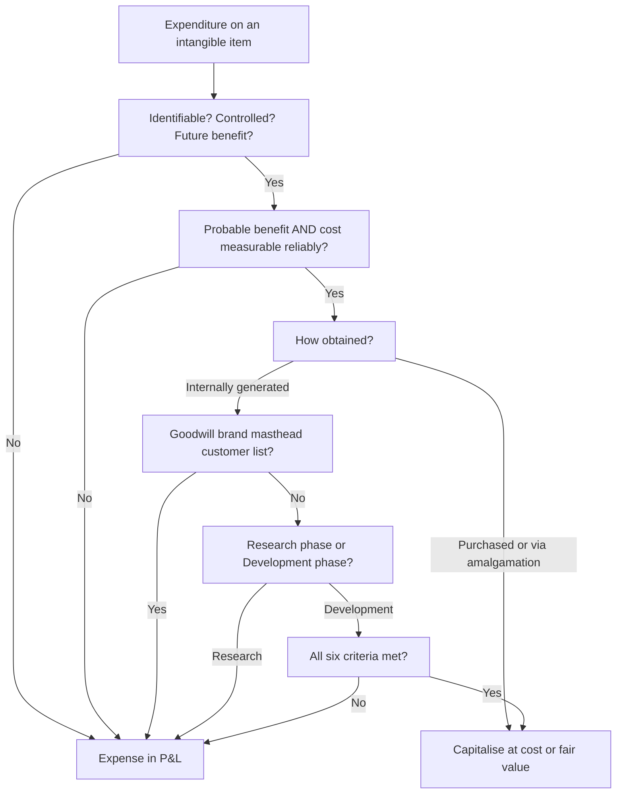
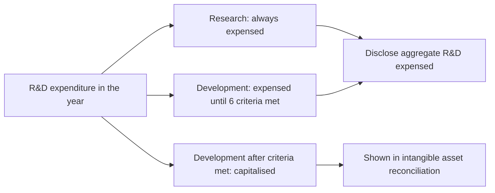

# Chapter 26 — AS 26: Intangible Assets

## 1. The Problem

Walk through a modern company's balance sheet and you hit a wall. A pharma firm spent ₹40 crore over three years developing a new drug molecule. A consumer-goods company spent ₹200 crore building the "brand equity" that lets it charge a premium. A software house paid ₹5 crore to buy a competitor's customer database. A startup acquired a rival and paid ₹80 crore *more* than the fair value of the rival's identifiable net assets — pure "goodwill."

None of these things can be dropped on your foot. There is no factory shed, no machine, no inventory in a godown. Yet every one of them is expected to generate cash for years. So the accountant faces three genuinely hard questions:

1. **Is it even an asset?** A machine's future benefit is obvious — it stamps out parts. But a research project might produce a Nobel Prize or nothing at all. How do you know a *benefit* exists before it arrives?
2. **If it is an asset, what number goes on the balance sheet?** With a machine you paid an invoice. With an internally-built brand, cost is smeared across decades of advertising, salaries, packaging — impossible to isolate cleanly. Do you capitalise ₹200 crore of ad spend as "Brand"?
3. **How long does it last, and how do you spread its cost?** A patent legally dies in 20 years. A brand might last forever — or collapse in one scandal. A machine has a physical wearing-out you can see; an intangible's decline is invisible until it's too late.

If accountants were free to answer these however they liked, two abuses would follow instantly. **Abuse A: profit inflation.** A loss-making firm capitalises all its advertising as "Brand ₹200 cr," turning a loss into a profit and parking the spend on the balance sheet forever. **Abuse B: fictitious net worth.** A company "values" its own reputation at ₹500 cr, books it as an asset, and props up a hollow balance sheet to fool lenders.

AS 26 exists to answer these three questions **conservatively and consistently**, so that an intangible on the balance sheet means something real, and the temptation to inflate profits or net worth is closed off.

## 2. The Core Idea (analogy)

Think of AS 26 as a **strict immigration officer at the balance-sheet border**. Physical assets (AS 10) walk through easily — the officer can see them. Intangibles are invisible travellers claiming they belong. The officer applies a two-stage gate:

**Stage 1 — Do you even qualify as a person (an "intangible asset")?** You must prove three things about yourself: you are **Identifiable** (separable or arising from legal rights — not just a blur), you are under my country's **Control** (the entity can get the benefits and fence others out), and you will contribute to the **economy** (future economic benefits). Fail any one — you're not an intangible asset at all. You get *expensed* on the spot.

**Stage 2 — Even if you qualify, can I trust your paperwork (recognition)?** Two more tests: it is **probable** the benefits will actually flow, AND your **cost can be measured reliably**. Only then do you get a residence permit — a place on the balance sheet.

The genius — and the strictness — is in *how* the officer treats home-grown travellers. If you *bought* the traveller (separate acquisition, or as part of a business you acquired), your cost paperwork is trustworthy — an arm's-length price was paid. But if you *grew the traveller yourself in your backyard* (internally generated goodwill, brands, mastheads), the officer says: "Your cost is hopelessly mixed up with running your whole business, and I can't tell you apart from your general reputation. Denied. Expense it." That single suspicion — *you can't reliably separate the cost of a self-grown intangible from the cost of running the business* — is the engine behind AS 26's most famous prohibitions.

## 3. Why It's Built This Way

Every seemingly arbitrary rule in AS 26 is a defence against one of the two abuses above.

- **Why demand "identifiability"?** To stop firms bundling random spending into a vague "asset." If you can't point to something *separable* or backed by a *legal right*, you're really just describing goodwill — the unidentifiable residue. Goodwill gets its own separate, stricter treatment precisely because it fails identifiability.

- **Why demand "control"?** Because an asset is a resource *you* can exploit and *deny to others*. A trained, skilled workforce clearly produces future benefits — but staff can resign tomorrow and walk to a rival. No control → no asset. Same logic kills "customer loyalty" or "market share" as balance-sheet items unless locked by legal rights.

- **Why expense research but capitalise development?** This is the heart of the standard. In the **research** phase you are still asking "will this even work?" — you cannot demonstrate a probable future benefit, so prudence forces expensing. In the **development** phase, if you can prove technical feasibility, intention and ability to complete, a market or use, adequate resources, *and* measure the cost — the benefit has become probable and the cost isolable. Now, and only now, capitalisation is honest.

- **Why forbid internally generated goodwill and brands?** Because their "cost" cannot be distinguished from the cost of developing the business as a whole, and their "value" is not a reliably measurable cost. Allowing them would open the door wide to Abuse B (fictitious net worth). *Purchased* goodwill is different — someone paid a real, verifiable price for it.

- **Why cap useful life and force amortisation?** An intangible that "never expires" is where profit-parking hides. AS 26 uses a **rebuttable presumption that useful life does not exceed 10 years** — forcing the cost back through the P&L on a disciplined schedule, and forcing management to justify any longer life with evidence and annual review.

Notice the through-line: **reliability of cost + probability of benefit**, enforced with **prudence**. That is the whole philosophy.

## 4. Full Technical Content (RMPD Lens)

### 4.0 Scope — what AS 26 does and does not cover

AS 26 applies to *all* intangible assets **except** those covered by other standards:
- Intangibles held for sale in the ordinary course of business (AS 2 — inventories).
- Deferred tax assets (AS 22), leases (AS 19), goodwill arising on amalgamation (AS 14) and on consolidation (AS 21) — though AS 26 principles inform their treatment.
- Financial assets, and rights under insurance/mineral/oil-gas exploration contracts.
- Expenditure on discount/premium on debentures, share issue expenses.

**Definition.** An **intangible asset** is an *identifiable, non-monetary asset, without physical substance, held for use* in the production or supply of goods or services, for rental to others, or for administrative purposes.

Key phrase: *non-monetary* (excludes cash and receivables) and *without physical substance*. When an asset has **both** tangible and intangible elements (e.g., software), judge by which element is **more significant**. Operating-system software essential to a computer's functioning is treated as *part of the hardware* (AS 10). Application software is generally an intangible (AS 26).

### 4.1 The three definitional tests (Stage 1)

An item is an intangible asset only if it is:

| Test | Meaning | Fails when… |
|------|---------|-------------|
| **Identifiability** | Separable (can be sold, licensed, rented on its own) OR arises from contractual/legal rights | It's an unidentifiable lump → that's goodwill, not an intangible asset |
| **Control** | Entity can obtain future benefits AND restrict others' access, usually via legal rights | Skilled staff (can resign), customer loyalty, market share — no legal control |
| **Future economic benefits** | Revenue from sale/use, or cost savings | Purely speculative research with no demonstrable benefit |

### 4.2 Recognition (Stage 2)

Recognise an intangible asset **if, and only if**:
(a) it is **probable** that the expected future economic benefits attributable to the asset will flow to the enterprise; **and**
(b) the **cost** of the asset can be **measured reliably**.

Management assesses probability using **reasonable and supportable assumptions** over the asset's useful life, giving greater weight to external evidence.

### 4.3 Measurement at recognition — initial cost

Measure initially at **cost**. Cost depends on how the asset was obtained.

**(a) Separate acquisition (purchased).** Cost = purchase price + import duties + non-refundable taxes + **directly attributable** expenditure to prepare it for use (e.g., professional fees, testing). Trade discounts and rebates are deducted. **Excluded**: general administration/overheads, costs after the asset is capable of operating, initial operating losses.

**(b) Acquisition as part of an amalgamation (AS 14).** An intangible of the acquired entity is recognised at **fair value** if it meets the recognition criteria; if fair value can't be measured reliably, it is subsumed into **goodwill**.

**(c) Acquisition by government grant** (e.g., landing rights, licences given free/nominal). May be recorded at a nominal value or at acquisition cost (per AS 12 treatment) plus directly attributable expenditure.

**(d) Exchange of assets.** Cost = **fair value** of the asset given up (like AS 10 barter logic).

**(e) Internally generated intangible assets.** The hard case — covered next.

### 4.4 Internally generated intangibles — the research/development divide

**Two absolute prohibitions:**
- **Internally generated GOODWILL is NEVER recognised** — it is not an identifiable resource controlled by the enterprise that can be measured reliably at cost.
- **Internally generated brands, mastheads, publishing titles, customer lists and items similar in substance** are **NEVER recognised** — expenditure on them cannot be distinguished from the cost of developing the business as a whole.

For all other internally generated intangibles, split the generation into two phases:

**Research phase** — *original and planned investigation undertaken with the prospect of gaining new scientific or technical knowledge and understanding.* Examples: activities to obtain new knowledge; search for alternatives for materials/processes; formulation/design/evaluation of alternatives.
→ **No intangible is recognised. All research expenditure is EXPENSED when incurred.** Rationale: in research you cannot demonstrate a probable future benefit.

**Development phase** — *application of research findings to a plan or design for production of new/substantially improved materials, devices, products, processes or systems before commercial production.*
→ An intangible is recognised **only if the enterprise can demonstrate ALL SIX conditions** (mnemonic **PIRATE**, but understand it, don't memorise it):

| # | Condition | Plain meaning |
|---|-----------|---------------|
| 1 | **Technical feasibility** of completing so it will be available for use/sale | "We can actually finish it." |
| 2 | **Intention** to complete and use or sell it | "We mean to see it through." |
| 3 | **Ability** to use or sell it | "We are capable of using/selling it." |
| 4 | **How it generates probable future economic benefits** (existence of a market or usefulness) | "There's a market or internal use." |
| 5 | **Availability of adequate resources** (technical, financial) to complete | "We have the money and skills to finish." |
| 6 | **Ability to measure the expenditure reliably** | "We can track the cost." |

If even one fails → expense it. If all six are met → capitalise development cost **from the date all conditions are first met** (prospectively).

**Cost of an internally generated intangible** = sum of expenditure from the date the six criteria are met until it is ready for intended use: materials and services consumed; salaries/wages of personnel directly engaged; directly attributable overheads (e.g., depreciation of equipment used, amortisation of patents used); reasonable allocation of costs to bring it to condition for use. **Excludes**: selling/administrative/general overheads, identified inefficiencies and initial operating losses, and training costs.

**Critical prudence rule — no reinstatement.** Expenditure on an intangible item that was **initially expensed** (because criteria weren't yet met, or it was research) **CANNOT later be capitalised** — even if the criteria are subsequently satisfied. Once expensed, always expensed for that spend.

### 4.5 Subsequent expenditure

Add subsequent expenditure to the carrying amount **only if** it is probable it will enable the asset to generate benefits **in excess of its originally assessed standard of performance**, and it can be measured and attributed reliably. Otherwise expense it. (For most intangibles, subsequent expenditure rarely meets this and is expensed.)

### 4.6 Measurement after recognition — the cost model only

AS 26 permits **only the cost model**: 
**Carrying amount = Cost − Accumulated amortisation − Accumulated impairment losses.**
(Unlike Ind AS 38, AS 26 does **not** allow a revaluation model.)

### 4.7 Amortisation and useful life

**Depreciable amount** = cost − residual value. **Residual value is presumed to be ZERO** unless (a) a third party has committed to buy the asset at end of useful life, or (b) there is an active market and residual value can be determined by reference to it and it is probable such a market will exist at end of useful life.

**Amortisation period.** The depreciable amount is allocated on a **systematic basis over the best estimate of useful life.** There is a **rebuttable presumption that the useful life will NOT exceed 10 years** from the date the asset is available for use. This is the exam's favourite number.

- The presumption can be **rebutted** (life > 10 years) only with **persuasive evidence** (e.g., a legal right for a longer definite period). If rebutted, the enterprise must (i) amortise over the longer best-estimate life, (ii) estimate the recoverable amount **at least annually** to test for impairment, and (iii) disclose the reasons.
- Where a **legal right** governs (e.g., a licence for 15 years), useful life shall **not exceed** the legal-right period, but may be **shorter** if the entity expects to use it for less. If the right is **renewable** and renewal is virtually certain, the renewal period is included.

**Amortisation method.** Reflect the pattern of benefit consumption; if the pattern cannot be determined reliably, use the **straight-line method (SLM)**. Amortisation is charged to the P&L (unless another standard permits inclusion in the carrying amount of another asset). Amortisation **begins when the asset is available for use.**

**Review.** The amortisation **period** and **method** must be reviewed **at least at each financial year-end**. If the expected useful life is significantly different from previous estimates, change the period; if the expected pattern of benefits has changed, change the method. Both are changes in **accounting estimates** (AS 5) — accounted for **prospectively**, adjusting the amortisation charge for the current and future periods.

### 4.8 Impairment link (to AS 28)

An intangible's carrying amount may exceed what it can actually recover. At each balance-sheet date, assess whether there is any indication of impairment; if so, estimate **recoverable amount** (higher of net selling price and value in use) per **AS 28**, and write down the excess as an impairment loss.

**Mandatory annual impairment test** — even with no indication — is required for:
- an intangible **not yet available for use**, and
- an intangible **amortised over a period exceeding 10 years** (the rebutted-presumption case).

This annual test is the safety-valve for the two riskiest categories.

### 4.9 Retirements and disposals

**Derecognise** an intangible on disposal or when **no future economic benefits** are expected from its use/disposal. Gain/loss = **net disposal proceeds − carrying amount**, recognised as **income or expense in the P&L** (not as revenue).

### 4.10 Quick decision logic


*Every path that fails a reliability or probability test lands in "Expense in P&L" — that is AS 26's default bias.*

## 5. Worked Examples

### Example 1 — Separate acquisition (easy): building the cost of a purchased licence

Nova Ltd buys a 10-year software licence. Details:
- Quoted price ₹50,00,000; negotiated trade discount 10%.
- Non-refundable levy (tax) ₹2,00,000; refundable GST ₹8,10,000.
- Consultant fees to configure and test for intended use ₹1,50,000.
- Staff training on the software ₹90,000.
- Advertising to announce the new capability ₹60,000.

**Step 1 — Purchase price net of discount.** 50,00,000 − 10% = **45,00,000**.
**Step 2 — Add non-refundable levy.** +2,00,000. (Refundable GST is recoverable → excluded.)
**Step 3 — Add directly attributable cost to make it ready.** Consultant configuration/testing +1,50,000.
**Step 4 — Exclude non-qualifying items.** Training ₹90,000 and advertising ₹60,000 are **expensed** (not cost of the asset).

| Component | ₹ | In cost? |
|-----------|----:|:--------:|
| Price after 10% discount | 45,00,000 | Yes |
| Non-refundable levy | 2,00,000 | Yes |
| Refundable GST | 8,10,000 | No (recoverable) |
| Consultant configuration/testing | 1,50,000 | Yes |
| Training | 90,000 | No (expense) |
| Advertising | 60,000 | No (expense) |
| **Capitalised cost** | **48,50,000** | |

**Answer:** Capitalise **₹48,50,000**. Amortise over useful life ≤ legal right of 10 years, SLM, residual value nil → **₹4,85,000 per year**.

### Example 2 — Research vs development (exam-standard): when does capitalisation start?

Zephyr Pharma incurs the following during FY on Project "Helix":

| Activity | Timing | Amount (₹) |
|----------|--------|-----------:|
| Screening chemical alternatives, lab investigation | Apr–Sep | 30,00,000 |
| Design & testing of pre-production prototype (technical feasibility established 1 Oct) | Oct–Dec | 18,00,000 |
| Directly attributable overheads Oct–Dec | Oct–Dec | 4,00,000 |
| Selling and general admin overheads Oct–Dec | Oct–Dec | 3,00,000 |
| Staff training to run the new process | Dec | 1,50,000 |
| Initial operating loss after launch | Jan–Mar | 5,00,000 |

On **1 October**, all six development criteria (technical feasibility, intention, ability, market, resources, reliable measurement) were first demonstrated. Determine the intangible asset cost and the amount expensed.

**Step 1 — Classify the phases.** Apr–Sep screening/investigation = **research** → expense ₹30,00,000. Also, before 1 Oct nothing can be capitalised.
**Step 2 — Development from 1 Oct.** Prototype design & testing ₹18,00,000 + directly attributable overheads ₹4,00,000 = **capitalisable**.
**Step 3 — Strip out exclusions even in development phase.** Selling/general admin ₹3,00,000, training ₹1,50,000, and the initial operating loss ₹5,00,000 are **all expensed** — explicitly excluded from cost.

| Item | Treatment | ₹ |
|------|-----------|----:|
| Research (Apr–Sep) | Expense | 30,00,000 |
| Prototype design & testing (from 1 Oct) | Capitalise | 18,00,000 |
| Directly attributable overheads (from 1 Oct) | Capitalise | 4,00,000 |
| Selling & general admin | Expense | 3,00,000 |
| Training | Expense | 1,50,000 |
| Initial operating loss | Expense | 5,00,000 |

**Capitalised intangible = 18,00,000 + 4,00,000 = ₹22,00,000.**
**Total expensed = 30,00,000 + 3,00,000 + 1,50,000 + 5,00,000 = ₹39,50,000.**

**Reconciliation:** Total spend = 30 + 18 + 4 + 3 + 1.5 + 5 = ₹61,50,000 = Capitalised ₹22,00,000 + Expensed ₹39,50,000. ✔

**Trap check:** If the examiner adds "research spend of the first half was ₹30,00,000, later the project succeeded — can we now capitalise it?" — **NO.** Expenditure once recognised as expense (research, or pre-criteria) can never be reinstated as an asset.

### Example 3 — Amortisation, change in estimate, and impairment (hard, reconciling)

Orion Ltd capitalised a patent on **1 April 2021** at cost **₹60,00,000**, useful life estimated **10 years**, SLM, residual value nil.

On **1 April 2024** (start of year 4), due to a superior competing technology, Orion revises the remaining useful life to **only 3 more years**. At **31 March 2025**, indicators of impairment exist; recoverable amount (per AS 28) is **₹18,00,000**.

**Step 1 — Amortisation for first 3 years (FY22, FY23, FY24).**
Annual = 60,00,000 / 10 = ₹6,00,000. Three years = ₹18,00,000.
Carrying amount on 1 Apr 2024 = 60,00,000 − 18,00,000 = **₹42,00,000**.

**Step 2 — Change in estimate (AS 5, prospective).** Remaining life now 3 years. New annual amortisation = 42,00,000 / 3 = **₹14,00,000** per year. Do **not** restate prior years.

**Step 3 — Amortisation for FY25 (year to 31 Mar 2025).** Charge ₹14,00,000.
Carrying amount before impairment test = 42,00,000 − 14,00,000 = **₹28,00,000**.

**Step 4 — Impairment test at 31 Mar 2025 (AS 28).** Recoverable amount = ₹18,00,000 < carrying ₹28,00,000.
**Impairment loss = 28,00,000 − 18,00,000 = ₹10,00,000** → charge to P&L.
Carrying amount after impairment = **₹18,00,000**.

**Step 5 — Going forward.** From FY26, amortise the new carrying amount ₹18,00,000 over the remaining 2 years = **₹9,00,000 per year** (revised base after impairment).

| Date | Event | Charge (₹) | Carrying amount (₹) |
|------|-------|----------:|--------------------:|
| 1 Apr 2021 | Capitalised | — | 60,00,000 |
| FY22–FY24 | Amortise 3 × 6,00,000 | 18,00,000 | 42,00,000 |
| FY25 | Amortise (revised) | 14,00,000 | 28,00,000 |
| 31 Mar 2025 | Impairment | 10,00,000 | 18,00,000 |

**Journal entries FY25:**
```
Amortisation A/c            Dr  14,00,000
   To Patent A/c                            14,00,000
(Amortisation on revised remaining life)

Impairment Loss A/c        Dr  10,00,000
   To Patent A/c                            10,00,000
(Patent written down to recoverable amount per AS 28)

Profit & Loss A/c          Dr  24,00,000
   To Amortisation A/c                      14,00,000
   To Impairment Loss A/c                   10,00,000
```
**Reconciliation:** Cost 60,00,000 − total charges to 31 Mar 2025 (18 + 14 + 10 = 42,00,000) = 18,00,000 = carrying amount. ✔

## 6. Presentation & Disclosure

### Balance sheet presentation
Intangible assets appear under **non-current assets → "Intangible Assets"** (with a separate line for **Intangible Assets under Development** for those not yet ready), shown net of accumulated amortisation and impairment. Goodwill (purchased) is shown separately.

### Disclosure — for each CLASS of intangible asset
Distinguish **internally generated** from **others**, and disclose:
- **Useful life or amortisation rate** used.
- **Amortisation method** used.
- **Gross carrying amount** and **accumulated amortisation (plus accumulated impairment)** at beginning and end.
- The **line item of the P&L** in which amortisation is included.
- A **reconciliation** of carrying amount at beginning and end showing: additions (indicating internally generated separately), retirements/disposals, impairment losses recognised/reversed (per AS 28), amortisation for the period, other changes.

### Additional required disclosures
- If an intangible is amortised over **more than 10 years**, the **reasons** the presumption was rebutted and the factors supporting the longer life.
- Description, carrying amount and remaining amortisation period of any **individually material** intangible.
- Existence and carrying amounts of intangibles whose **title is restricted** or that are **pledged as security**.
- Amount of **commitments** for the acquisition of intangibles.
- **Aggregate R&D expenditure** recognised as an **expense** during the period.


*The R&D expense disclosure captures everything that hit the P&L; only post-criteria development appears as an asset.*

## 7. Connections

- **AS 28 (Impairment of Assets):** AS 26 hands off the "is the carrying amount recoverable?" question to AS 28. The mandatory annual test for not-yet-ready and >10-year-life intangibles is the tightest coupling between the two.
- **AS 10 (Property, Plant & Equipment):** Same cost-building philosophy (directly attributable cost in, general overheads out). The tangible/intangible split for combined items (software vs hardware) is decided by which element dominates.
- **AS 14 (Amalgamations) & AS 21 (Consolidation):** Goodwill arising there is *purchased* — recognised — unlike internally generated goodwill which AS 26 forbids. Fair value of acquired intangibles gets recognised; the unmeasurable residue becomes goodwill.
- **AS 5 (Net Profit/Prior Period/Changes in Estimates):** Revisions to useful life, amortisation method and residual value are **changes in estimate — prospective**, never restatement.
- **AS 2 (Inventories):** Intangibles held for sale in ordinary course are inventory, not AS 26.
- **AS 12 (Government Grants):** Intangibles obtained via grant (licences, quotas) borrow AS 12 measurement.
- **Ind AS 38 contrast:** Ind AS 38 permits a **revaluation model** (active market) and treats intangibles with **indefinite** useful lives (no amortisation, only annual impairment). **AS 26 allows neither** — cost model only, and the 10-year rebuttable presumption governs. This is a classic "state the difference" exam point.

## 8. Traps & Examiner Tricks

1. **"Once expensed, always expensed."** Research spend or pre-criteria development spend that was written off **cannot be reinstated** as an asset even if the project later succeeds. Examiners love giving a project that becomes viable *after* early spending — the trap is capitalising the early spend.
2. **Internally generated brand valued at ₹X.** Any "value" placed on a self-created brand, masthead, customer list or goodwill is a **red herring — never recognise.** Only *purchased* versions qualify.
3. **The 10-year presumption is rebuttable, not a hard cap.** With persuasive evidence (e.g., a 20-year legal right), you amortise over the longer life — but you then owe an **annual impairment test** and disclosure of reasons. Don't say "maximum 10 years, full stop."
4. **Residual value default is ZERO.** Students carry over AS 10 habits and assume a scrap value. For intangibles, residual value is nil unless a committed buyer or active market exists.
5. **Training and advertising are always expensed.** Even when they clearly build capability/brand, AS 26 refuses capitalisation. A favourite distractor line in cost-computation problems.
6. **Change in useful life = prospective (AS 5).** Do not restate opening balances. Spread the *current* carrying amount over the *revised remaining* life.
7. **Refundable taxes (GST/CENVAT) are excluded from cost; only non-refundable duties/levies go in.** Watch the wording.
8. **Amortisation starts when the asset is available for use**, not when it's first put to actual use, and not when purchased if configuration is still pending.
9. **No revaluation model under AS 26.** If a question offers to "revalue the patent upward to market," that's Ind AS 38 thinking — reject it under Indian AS.
10. **Impairment and amortisation both hit FY of change.** In multi-event problems, amortise for the year *first* (on revised life), *then* test impairment on the reduced carrying amount — order matters for the final number.
11. **Gain/loss on disposal is not "revenue."** It is other income/expense — netting proceeds against carrying amount.

## 9. First-Principles Recap

- Intangibles are hard because benefit is **uncertain** and cost is **hard to isolate**; AS 26 answers with **prudence + reliability**.
- An item is an intangible asset only if **Identifiable + Controlled + Future benefit**; recognise only if **probable benefit + cost reliably measurable**.
- **Purchased** intangibles pass the reliability test (an arm's-length price exists); **self-grown** goodwill/brands/mastheads/customer lists **never** get recognised because their cost can't be separated from the business.
- **Research is expensed** (you can't yet prove benefit); **development is capitalised only when all six criteria are met**, and only from that date forward.
- **Once expensed, never reinstated** — the anti-abuse keystone.
- Measure after recognition at **cost less amortisation less impairment** — **no revaluation** under AS 26.
- **Residual value is presumed zero**; amortise systematically (SLM if pattern unknown) over useful life with a **rebuttable 10-year presumption**.
- Review **period and method annually**; changes are **prospective** (AS 5).
- The riskiest intangibles (not-yet-ready, life > 10 years) get a **mandatory annual impairment test** under **AS 28**.
- Every doubtful case defaults to **expense** — that bias *is* the standard.

## 10. Quick-Revision Sheet

| Topic | Rule |
|-------|------|
| Definition | Identifiable, non-monetary, no physical substance, held for use |
| Stage 1 tests | Identifiability • Control • Future economic benefit |
| Recognition | Probable benefit **AND** cost reliably measurable |
| Initial measurement | **Cost** (purchase price + duties + directly attributable); exclude admin OH, training, advertising, initial losses, refundable taxes |
| Amalgamation | At **fair value** if criteria met; else subsumed in goodwill |
| Exchange | Fair value of asset given up |
| Internally generated goodwill | **Never** recognise |
| Internally generated brands/mastheads/titles/customer lists | **Never** recognise |
| Research phase | **Expense** always |
| Development phase | Capitalise only if **all 6** criteria met (feasibility, intention, ability, market/use, resources, reliable cost), from that date |
| Reinstatement | Once expensed → **never** capitalise later |
| Subsequent measurement | Cost − accumulated amortisation − accumulated impairment (**cost model only, no revaluation**) |
| Residual value | Presumed **NIL** (exceptions: committed buyer / active market) |
| Useful life | Rebuttable presumption **≤ 10 years**; capped by legal right; include renewal if virtually certain |
| Method | Pattern of benefits; if unknown → **SLM** |
| Amortisation starts | When asset is **available for use** |
| Review of life/method | **At least each year-end**; change = **prospective (AS 5)** |
| Mandatory annual impairment test | If (a) not yet available for use, or (b) life > 10 years — per **AS 28** |
| Disposal | Derecognise; gain/loss = proceeds − carrying amount → P&L (not revenue) |
| Disclosure highlights | Life/rate, method, gross & accumulated amounts, reconciliation, reasons if > 10 yrs, aggregate R&D expensed |
| Ind AS 38 contrast | Ind AS allows revaluation + indefinite life; AS 26 does **not** |
