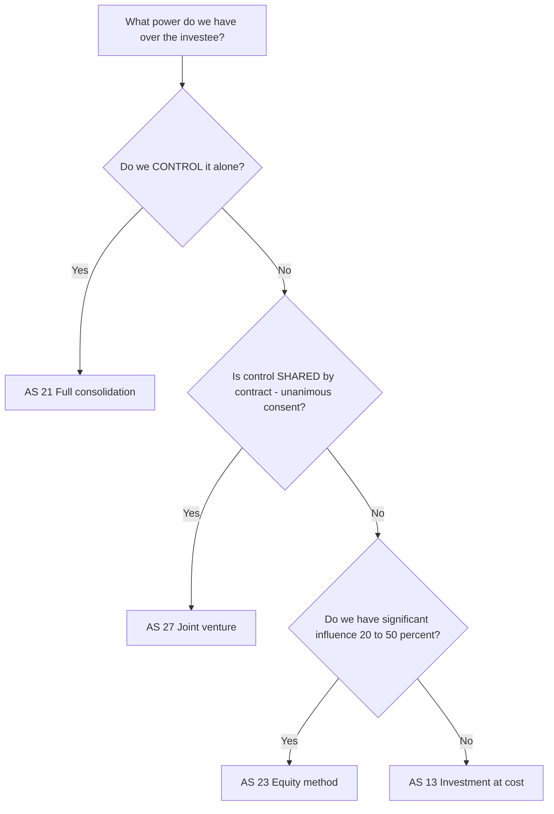
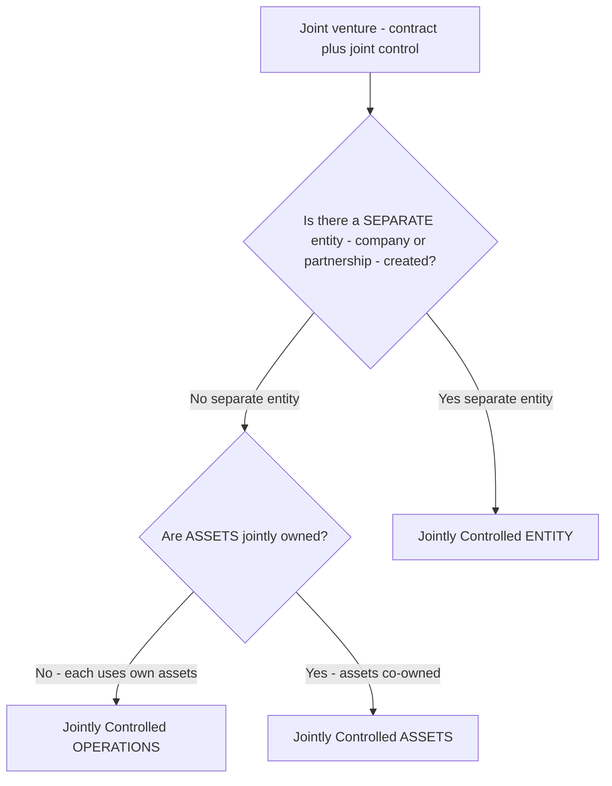
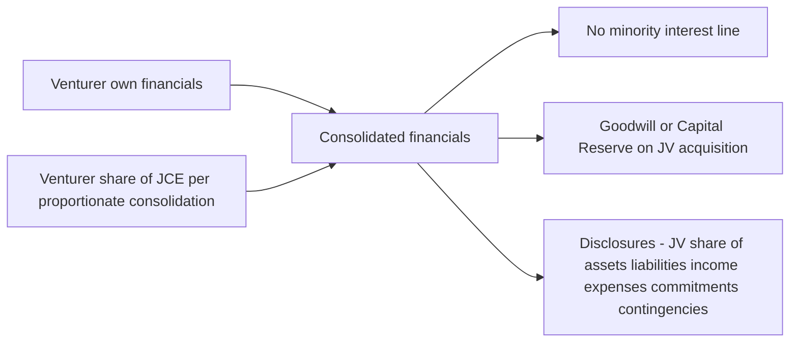

# Chapter 27 — AS 27: Financial Reporting of Interests in Joint Ventures

## 1. The Problem

Two companies, **Alpha Ltd** and **Beta Ltd**, want to build a highway. Neither wants to fund the whole ₹1,000 crore project alone, and neither wants the other to boss it around. So they sign a contract: they create **Highway Co**, each puts in ₹200 crore of equity for 50% of the shares, and — this is the crucial clause — **every major decision (budget, tolls, borrowing, appointing the CEO) needs the consent of BOTH.** No single partner can push a decision through. No single partner can block operations *and* run them alone either. They are handcuffed together.

Now the year ends and Alpha Ltd has to prepare its accounts. Its accountant asks a deceptively simple question:

> "How much of Highway Co do I show, and *how*?"

Look at the three tools already sitting in the ICAI toolbox and watch each one fail:

- **AS 13 (Investments) — treat it as a mere investment at cost.** This would show Alpha's stake as a single frozen line: "Investment in Highway Co — ₹200 crore." But that is a lie of omission. Alpha isn't a passive shareholder who bought some listed shares hoping the price rises. Alpha *co-runs* the highway. It signs off on the toll rates. It shares in operating decisions. Reducing that to a dead ₹200 crore number hides the entire economic substance.

- **AS 21 (Consolidation) — treat it as a subsidiary and consolidate 100%, then show a minority interest.** But AS 21 rests on one word: **control**. A parent consolidates a subsidiary because it *controls* it — it can, alone, direct the subsidiary's financial and operating policies. Alpha does **not** control Highway Co. It shares control. If Alpha consolidated 100% of Highway Co's assets and revenues, its balance sheet would scream "I own and command a ₹1,000 crore highway" — when in truth it commands nothing without Beta's yes. That overstates Alpha's reach.

- **AS 23 (Associates) — treat it as an associate and use the equity method.** AS 23 is for **significant influence** — the power to *participate in* (not control, not jointly control) decisions, typically a 20%–50% shareholding where you get a board seat and a voice but others decide. Highway Co is more than that. Alpha doesn't merely *influence* — it holds a **contractual veto**. Nothing happens without it. Equity method would collapse Alpha's whole interest into a single "share of net profit" line, again hiding the gross assets and liabilities Alpha is contractually on the hook for.

So we have an entity that is:
- **more than an investment** (Alpha actively co-manages it),
- **less than a subsidiary** (Alpha cannot control it alone),
- **more than an associate** (Alpha has a veto, not mere influence).

It falls in a gap between AS 13, AS 21 and AS 23. That gap has a name — **joint control** — and it needs its own accounting standard. That standard is **AS 27**.

*The whole chapter is the answer to: "When two or more parties are contractually handcuffed together to run something, how does each one report its slice — honestly, without overstating (subsidiary) or understating (investment)?"*

---

## 2. The Core Idea (analogy)

Picture three friends — you, Ravi, and Meera — who jointly own a food truck. The contract you signed says: **the truck cannot move, can't change its menu, and can't spend on repairs unless all three of you agree.** That unanimous-consent clause is the beating heart of everything that follows. Hold onto it.

Now, "how do you report your share of the truck" depends entirely on *how the arrangement is physically structured* — and there are three flavours:

- **Flavour 1 — You each cook on the same truck (Jointly Controlled Operations).** No separate company. Ravi brings the dosa batter and his own tawa, you bring the drinks and your own fridge, Meera brings her own generator. You use your *own* assets, incur your *own* costs, and split the combined revenue per the contract. There is no shared "truck entity" — just three people pooling effort. **You simply keep reporting your own tawa, your own drinks, your own share of revenue in your own books.** Nothing exotic.

- **Flavour 2 — You jointly own the truck itself but not a company (Jointly Controlled Assets).** The three of you bought the physical truck together, 1/3 each, but never formed a company. The truck is a shared *asset*, not a separate legal *person*. So each of you shows **one-third of the truck** as your own asset, one-third of the diesel bill as your expense, and your share of the takings. Again — directly into your own books, your share of the physical thing.

- **Flavour 3 — You formed "TruckCo Pvt Ltd" (Jointly Controlled Entity).** Now there IS a separate legal person that owns the truck, hires staff, has its own bank account and its own balance sheet. This is the hard case, because TruckCo has its own complete set of accounts and you can't just "show your tawa." You need a rule to pull TruckCo's numbers into yours. The rule AS 27 gives is **proportionate consolidation**: take TruckCo's balance sheet and P&L, and add in **your line-by-line share** — 1/3 of its cash, 1/3 of its truck, 1/3 of its loan, 1/3 of its revenue, 1/3 of its wages — merged into your own totals.

The single unifying instinct across all three flavours: **"Report what is truly YOURS — no more, no less."** Not zero (that's the investment lie). Not the whole thing with a minority-interest patch (that's the subsidiary overstatement). Your slice. That is the entire philosophy of AS 27.

---

## 3. Why It's Built This Way

Why does AS 27 insist on **proportionate consolidation** for a jointly controlled entity, instead of the simpler equity method (one net line) that AS 23 uses for associates?

Because **the accounting must mirror the economic reality of the handcuff.** Let's reason it out.

When you have *significant influence* (associate), you have a voice but others decide. Your economic exposure is genuinely just to the *net outcome* — your share of what's left after the entity pays its own creditors. You don't co-sign the entity's operating decisions. So collapsing everything to "my share of net worth / net profit" (equity method) faithfully represents a mostly-passive, net exposure. That's AS 23.

When you have **joint control**, the story changes. You *contractually participate* in incurring the liabilities and deploying the assets. You veto the borrowing. You veto the capex. Economically you are far closer to *directly holding a fraction of each asset and each liability* than to holding a net residual claim. If AS 27 let you hide all of that inside one net line, a reader would never see that you're on the hook for your share of a ₹600 crore loan, or that ₹300 crore of gross assets are being deployed under your co-authority. **Proportionate consolidation forces the gross exposure into the open**, line by line — which is exactly right for someone who co-controls those lines.

And why *not* full consolidation (AS 21) with a minority interest? Because full consolidation says "these are *my* assets and I've let a minority ride along." That is a **control** statement. In a joint venture there is *no* minority — there are equals, each with a veto. Nobody is "the parent." Showing 100% + minority interest would falsely crown one venturer as the controller. Proportionate consolidation refuses to crown anyone; each venturer independently reports only its own share. Symmetry of control demands symmetry of reporting.

So the design is not arbitrary — it's a direct translation of the power structure:

| Power over the entity | Standard | Reporting method | What the reader sees |
|---|---|---|---|
| Control (alone) | AS 21 | Full consolidation + minority interest | 100% of assets/liabilities, minority carved out |
| Joint control (shared veto) | AS 27 | **Proportionate consolidation** | Your line-by-line share of each item |
| Significant influence | AS 23 | Equity method | One net line (share of net worth/profit) |
| None (passive) | AS 13 | Cost / fair value | A frozen investment figure |

*Notice the ladder: as your power falls from control → joint control → influence → nothing, your reporting "reaches into" the investee less and less — from every line, to your share of every line, to one net line, to a dead number. AS 27 sits on the second rung.*

*Figure 1 — The power ladder. AS 27 is triggered only by contractually shared control, distinguishing it cleanly from AS 21, AS 23 and AS 13.*

---

## 4. Full Technical Content

### 4.1 Scope and the two defining tests

AS 27 applies to accounting for **interests in joint ventures** and the reporting of joint venture assets, liabilities, income and expenses in the financial statements of **venturers and investors**, regardless of the structures or forms under which the joint venture activities take place.

A **joint venture** is defined by two cumulative tests. BOTH must be present:

1. **A contractual arrangement** — there must be a binding agreement (usually written; can be evidenced by minutes/articles) between two or more parties.
2. **Joint control** — that contract must establish that control over the economic activity is *shared*, such that **no single party can control the activity unilaterally**, and **strategic financial and operating decisions require the consent of ALL the venturers sharing control** (unanimous consent).

> **The contractual-arrangement test is what separates a joint venture from an associate.** An associate can arise purely from shareholding (AS 23). A joint venture *cannot exist without a contract*. If there is no contract establishing joint control, AS 27 does not apply — even if two parties happen to hold 50% each.

Key definitions:

- **Control** = the power to govern the financial and operating policies of an economic activity so as to obtain benefits from it. (Same definition as AS 21 — deliberately, so the standards interlock.)
- **Joint control** = the *contractually agreed sharing* of control.
- **Venturer** = a party to a joint venture that **has** joint control.
- **Investor (in a JV)** = a party that has an interest but does **NOT** have joint control. (This distinction matters hugely — see 4.6.)
- **Proportionate consolidation** = a method whereby the venturer's share of each asset, liability, income and expense of the jointly controlled entity is combined line-by-line with similar items in the venturer's financial statements, OR reported as separate line items.

### 4.2 The three types of joint venture

AS 27 recognises three forms. Correctly classifying the form dictates the accounting.

*Figure 2 — Classifying a joint venture. The presence of a separate legal entity is the fork that leads to proportionate consolidation.*

#### (A) Jointly Controlled Operations

No separate entity, no jointly-owned pool of assets. Each venturer uses its **own** assets (PPE, inventories) and incurs its **own** expenses and liabilities, raising its own finance. Revenue from the joint product and jointly-incurred expenses are shared per contract.

**Accounting (in the venturer's own separate financial statements — no consolidation step needed):**
- The assets it controls and liabilities it incurs.
- The expenses it incurs and its **share of the income** from the joint venture.

Because these items are already in the venturer's own books, **no adjustment or consolidation is required** — this treatment is the same in both separate and consolidated financial statements.

#### (B) Jointly Controlled Assets

Venturers **jointly own** one or more assets contributed to / acquired for the JV (e.g., a shared oil pipeline, a jointly-owned property), but no separate entity is formed. Each venturer takes a share of the output and bears an agreed share of expenses.

**Accounting (again in own separate financial statements, no consolidation step):** Each venturer recognises:
- Its **share of the jointly controlled assets**, classified by nature (not as an investment).
- Any **liabilities it has incurred** (e.g., its own financing).
- Its **share of jointly-incurred liabilities**.
- Any **income from sale/use of its share of output**, plus its share of JV expenses.
- Any **expenses it incurs** in respect of its interest.

Same treatment in separate and consolidated statements.

#### (C) Jointly Controlled Entity

A joint venture that involves the establishment of a **separate entity** — a company, partnership or other entity — in which each venturer has an interest. The entity operates like any other enterprise, owns assets, incurs liabilities and keeps its own books. **This is the only form requiring proportionate consolidation.**

### 4.3 Accounting for a Jointly Controlled Entity — the two-tier rule

This is the examinable core. There are **two different sets of financial statements** and the treatment differs:

| Financial statements | Treatment of interest in JCE |
|---|---|
| **Consolidated Financial Statements (CFS)** of the venturer | **Proportionate consolidation** (AS 27 main rule) |
| **Separate Financial Statements** of the venturer (its own standalone books) | As an **investment under AS 13** (at cost, less impairment) — NOT proportionate consolidation |

> **Critical exam distinction:** Proportionate consolidation is a **consolidation** technique. It appears only in the venturer's **consolidated** financial statements. In the venturer's own **separate** financial statements, the interest in a jointly controlled entity is simply an investment carried per AS 13. Many students wrongly proportionately-consolidate into standalone books — that is wrong.

**If the venturer has no subsidiaries** and therefore does not prepare CFS at all: it still applies proportionate consolidation to present the JV interest, unless it is exempt (see 4.5). (Under Indian practice, a venturer that has *only* a JV interest and no subsidiary/associate prepares CFS applying AS 27's proportionate consolidation to that interest.)

### 4.4 Mechanics of Proportionate Consolidation

Proportionate consolidation borrows the *procedures* of AS 21 but applies them to the venturer's **share only**.

**Step-by-step:**

1. Take the JCE's balance sheet and P&L.
2. Multiply **every** asset, liability, income and expense line by the venturer's **share %**.
3. **Eliminate the "Investment in JV"** carrying amount in the venturer's books against the venturer's **share of the JV's equity** (share capital + reserves) at acquisition — exactly like the cost-of-control elimination in AS 21.
4. The difference on that elimination is **Goodwill** (if cost > share of net assets) or **Capital Reserve** (if share of net assets > cost).
5. **Combine** the venturer's share of each JCE line with the venturer's own corresponding line — either merged into the same line item, or shown as separate line items (both permitted by AS 27).
6. Post-acquisition, the venturer's share of the JCE's post-acquisition reserves is added to consolidated reserves.
7. **Eliminate unrealised profits** on transactions between venturer and JCE (see 4.7) to the extent of the venturer's interest.
8. **No minority interest** ever arises — you only ever brought in your own share, so there is nothing left over to attribute to others. *(This is the visible signature that distinguishes proportionate consolidation from full consolidation.)*

Two presentation formats are allowed (AS 27 permits either):
- **Line-by-line combination:** e.g., venturer's own inventory ₹50 + share of JCE inventory ₹12 = Inventory ₹62.
- **Separate line items:** show "Share of JCE inventory ₹12" as its own line under a JV heading.

### 4.5 When proportionate consolidation is NOT applied (exceptions)

A venturer does **not** use proportionate consolidation, and instead accounts for the interest **as an investment under AS 13**, when:

1. The interest is **acquired and held exclusively with a view to its subsequent disposal in the near future** (i.e., a temporary interest); or
2. The JCE operates under **severe long-term restrictions** that significantly impair its ability to transfer funds to the venturer.

From the date the venturer **loses joint control**, it must **cease** proportionate consolidation. If significant influence remains → AS 23 (equity method); if it becomes a subsidiary → AS 21; if only an investment remains → AS 13.

### 4.6 Interest of an INVESTOR (party without joint control)

A party that holds an interest in a joint venture but does **not** share control is an **investor**, not a venturer. An investor accounts for its interest:
- Under **AS 13** (as an investment) in general; **or**
- If it has **significant influence**, under **AS 23** (equity method).

So the same jointly controlled entity can appear differently in different parties' books: the two venturers proportionately consolidate; a third small shareholder (no joint control) treats it as a mere AS 13 investment or an AS 23 associate.

### 4.7 Transactions between a venturer and the joint venture

The guiding principle: **you cannot make a profit selling to yourself.** Since a venturer owns a share of the JCE, transactions between them are partly transactions "with itself," and the corresponding profit must be eliminated to the extent of the venturer's interest.

- **Venturer SELLS/contributes an asset TO the JV (downstream):** The venturer recognises only the portion of gain/loss attributable to the interests of the **other** venturers. It **defers/eliminates its own share** of the profit until the JV resells the asset to a third party. **BUT** if the transaction evidences a **loss** representing a decline in NRV or an impairment, the venturer recognises the **full loss immediately** (prudence — losses are never deferred).
- **Venturer BUYS an asset FROM the JV (upstream):** The venturer does **not** recognise its share of the JV's profit on that transaction **until it resells** the asset onward to a third party. Again, a **loss** signalling impairment/NRV decline is recognised in **full immediately**.

### 4.8 Other technical points

- **Contributions in kind:** When a venturer contributes a non-monetary asset to a JCE in exchange for its interest, gain/loss recognition follows the same "own-share elimination" logic above.
- **Reporting dates & policies:** As in AS 21, use uniform accounting policies; if reporting dates differ, adjust for significant transactions between the dates (difference generally not more than 6 months).
- **Impairment:** After proportionate consolidation (or AS 13 treatment), test the interest / goodwill for impairment per AS 28.
- **Manager/operator of a JV:** A venturer who *also* acts as manager/operator recognises the management fee as income per AS 9.

---

## 5. Worked Examples

### Example 1 — Jointly Controlled Operations (easy warm-up)

**Facts:** Alpha Ltd and Beta Ltd agree to jointly manufacture and sell a specialised valve. Per contract, Alpha does the casting using its own machinery and Beta does the finishing using its own; each raises its own finance; the sale revenue is split **60:40** (Alpha:Beta). During the year: total joint revenue ₹100 lakh. Alpha's own casting costs ₹30 lakh; Beta's own finishing costs ₹25 lakh. Alpha's casting machine (its own asset) has WDV ₹80 lakh.

**Required:** What does Alpha recognise?

**Solution:**
This is a **jointly controlled operation** — no separate entity, each uses own assets. Alpha simply records, in its **own** books (no consolidation):

| Item | Amount (₹ lakh) | Reasoning |
|---|---|---|
| Casting machine (asset) | 80 | Its own asset — already on its books |
| Casting cost (expense) | 30 | Expense it incurred |
| Share of joint revenue (income) | 60 | 60% × ₹100 lakh per contract |

Alpha does **not** record Beta's ₹25 lakh finishing cost or Beta's machine — those are Beta's. Alpha's contribution to profit = 60 − 30 = **₹30 lakh** from the JV. No goodwill, no consolidation, no minority interest. *(Reconciles: total revenue 100 split 60/40; each venturer books its own costs and its own revenue share.)*

---

### Example 2 — Jointly Controlled Entity: full proportionate consolidation (exam-standard)

**Facts:** On 1 April 2025, **P Ltd** (which has a subsidiary and prepares CFS) and **Q Ltd** each acquired **50%** of the equity of **JV Ltd**, a jointly controlled entity, by contract requiring unanimous consent. P Ltd paid **₹30 lakh** for its 50% stake. On acquisition, JV Ltd's equity was: Share Capital ₹40 lakh, Reserves ₹10 lakh (total net assets ₹50 lakh).

At 31 March 2026, JV Ltd's summarised Balance Sheet and P&L were:

| JV Ltd Balance Sheet (₹ lakh) | Amount |  | JV Ltd P&L (₹ lakh) | Amount |
|---|---|---|---|---|
| Share Capital | 40 |  | Revenue | 120 |
| Reserves (opening 10 + profit 20) | 30 |  | Operating expenses | (100) |
| Trade Payables | 30 |  | **Profit for year** | **20** |
| **Total Equity + Liabilities** | **100** |  |  |  |
| Fixed Assets | 55 |  |  |  |
| Inventory | 25 |  |  |  |
| Cash | 20 |  |  |  |
| **Total Assets** | **100** |  |  |  |

**Required:** Show P Ltd's proportionate consolidation of JV Ltd (P's 50% share), and compute goodwill/capital reserve.

**Solution:**

**Step 1 — Goodwill on acquisition (cost-of-control elimination):**

| | ₹ lakh |
|---|---|
| Cost of investment (paid by P) | 30 |
| Less: P's share of JV's equity at acquisition = 50% × ₹50 lakh net assets | (25) |
| **Goodwill** | **5** |

Since cost ₹30 > share of net assets ₹25, the ₹5 lakh difference is **Goodwill**.

**Step 2 — Take P's 50% share of each line (proportionate consolidation):**

| JV Ltd line | 100% (₹ lakh) | P's 50% share (₹ lakh) |
|---|---|---|
| Fixed Assets | 55 | 27.5 |
| Inventory | 25 | 12.5 |
| Cash | 20 | 10.0 |
| Trade Payables | 30 | 15.0 |
| Revenue | 120 | 60.0 |
| Operating expenses | 100 | 50.0 |

**Step 3 — Post-acquisition reserves attributable to P:**
JV's reserves rose from ₹10 lakh (acquisition) to ₹30 lakh (year-end) = **₹20 lakh post-acquisition profit** (which equals the year's profit here). P's share = 50% × 20 = **₹10 lakh**, added to P's consolidated reserves.

**Step 4 — Verify the elimination balances.**
P brings in its share of JV's *assets net of liabilities* plus goodwill; the "Investment ₹30 lakh" line in P's books disappears, replaced by real assets/liabilities + goodwill:

| P's consolidated pickup from JV (₹ lakh) | Amount |
|---|---|
| Share of Fixed Assets | 27.5 |
| Share of Inventory | 12.5 |
| Share of Cash | 10.0 |
| Less: Share of Trade Payables | (15.0) |
| = Share of net assets at year-end (50% × ₹70 lakh) | 35.0 |
| Add: Goodwill | 5.0 |
| **Total brought into P's CFS** | **40.0** |

Reconciliation check: This ₹40 lakh replaces the ₹30 lakh investment. The ₹10 lakh uplift = **P's share of post-acquisition profit (₹10 lakh)** — which is precisely what flows to consolidated reserves. ✓ Everything ties.

**Note the signature:** there is **no minority interest** anywhere. P brought in only its own 50%; nothing is left to attribute to anyone else. Q Ltd independently does the identical exercise in *its* books.

---

### Example 3 — Jointly Controlled Entity with an inter-company (downstream) unrealised profit (exam-hard)

**Facts:** **X Ltd** holds a **40%** interest (joint control by contract) in **JVE Ltd**. During the year, X Ltd **sold inventory to JVE Ltd** for ₹50 lakh; the goods cost X Ltd ₹40 lakh (so X booked ₹10 lakh profit). At year-end, JVE Ltd **still holds the entire lot unsold**. Separately, JVE Ltd's year-end summarised numbers (100%) are: Fixed Assets ₹200 lakh, Inventory ₹90 lakh (which *includes* the ₹50 lakh bought from X), Cash ₹30 lakh, Payables ₹120 lakh, Share Capital ₹150 lakh, Reserves ₹50 lakh. X's cost of the JVE investment was ₹80 lakh; JVE's net assets at acquisition were ₹180 lakh.

**Required:** (a) unrealised profit to eliminate; (b) goodwill/capital reserve; (c) X's 40% share of key lines after adjustment.

**Solution:**

**(a) Unrealised profit elimination (downstream sale, goods still with JV):**
X sold to the JV at a ₹10 lakh profit; the goods are **unsold** at year-end, so the profit is unrealised. X must eliminate profit **to the extent of its own interest (40%)**, because it effectively "sold to itself" to that extent:

Unrealised profit to eliminate = 40% × ₹10 lakh = **₹4 lakh.**

The other 60% (₹6 lakh) relates to the other venturers' interests and **is** recognised (they are genuine third parties to X). This elimination reduces X's consolidated profit/reserves by ₹4 lakh AND reduces the carrying value of the JV inventory X brings in by ₹4 lakh.

*(If instead this had been a loss signalling an NRV decline, the FULL loss would be recognised immediately — but here it's a profit, so only the 40% own-share is deferred.)*

**(b) Goodwill on acquisition:**

| | ₹ lakh |
|---|---|
| Cost of investment | 80 |
| Less: 40% × ₹180 lakh (net assets at acquisition) | (72) |
| **Goodwill** | **8** |

**(c) X's 40% share of year-end lines, with the unrealised-profit adjustment on inventory:**

| JVE line | 100% (₹ lakh) | X's 40% (₹ lakh) | Adjustment | Final in X's CFS (₹ lakh) |
|---|---|---|---|---|
| Fixed Assets | 200 | 80.0 | — | 80.0 |
| Inventory | 90 | 36.0 | − 4.0 unrealised profit | **32.0** |
| Cash | 30 | 12.0 | — | 12.0 |
| Trade Payables | 120 | 48.0 | — | 48.0 |
| Goodwill | — | — | — | 8.0 |

**Reconciliation of X's net pickup:**

| ₹ lakh | Amount |
|---|---|
| Share of net assets 40% × (200+90+30−120) = 40% × 200 | 80.0 |
| Less: unrealised profit eliminated | (4.0) |
| Add: goodwill | 8.0 |
| **Net carried into X's CFS** | **84.0** |

Post-acquisition reserves check: JVE reserves rose from (180−150)=₹30 lakh at acquisition to ₹50 lakh now = ₹20 lakh post-acq; X's share 40% = ₹8 lakh to consolidated reserves, **then reduced by ₹4 lakh** unrealised profit = net ₹4 lakh uplift to reserves from JVE. ✓ Consistent (cost 80 + net reserve movement 4 = 84). Everything reconciles.

---

## 6. Presentation & Disclosure

### 6.1 Balance sheet / P&L presentation
Under proportionate consolidation, the venturer's share of each JCE item is either **merged line-by-line** with its own items or shown as **separate line items** under each head. **No minority interest** line appears (unlike AS 21). Goodwill/Capital Reserve arising is disclosed like any consolidation goodwill.

### 6.2 Disclosures required by AS 27

A venturer must disclose:

1. **Aggregate amounts** of each of the following related to its interests in jointly controlled entities, shown **separately** — current assets, long-term assets, current liabilities, long-term liabilities, income, expenses. *(So that even after merging, the JV magnitude is visible.)*
2. A **list and description of interests** in significant joint ventures and the **proportion of ownership interest** held in jointly controlled entities.
3. The **aggregate of contingent liabilities** (separately from other contingent liabilities), namely:
   - contingent liabilities the venturer has incurred in relation to its JV interests and its share of those incurred jointly with other venturers;
   - its share of the JV's own contingent liabilities;
   - contingent liabilities arising because the venturer is contingently liable for the liabilities of the **other** venturers.
4. The **aggregate of capital commitments** of the venturer relating to its JV interests and its share of the JV's capital commitments.
5. The venturer must indicate the **basis of reporting** its interests (i.e., that proportionate consolidation is used).

### 6.3 Format skeleton (illustrative)

*Figure 3 — What lands in the venturer's consolidated financial statements: own numbers + proportionate JV share, with mandated separate disclosure of the JV magnitude.*

---

## 7. Connections

- **AS 21 (Consolidated Financial Statements):** AS 27 *borrows AS 21's consolidation procedures* (cost-of-control elimination, goodwill, uniform policies, unrealised profit elimination) but applies them to the **share** and produces **no minority interest**. If a venturer's joint control *escalates* to full control, it moves from AS 27 → AS 21.
- **AS 23 (Investments in Associates in CFS):** The sibling standard for the rung *below* joint control. Equity method (one net line) vs proportionate consolidation (line-by-line share). If joint control *degrades* to mere significant influence, the venturer moves AS 27 → AS 23.
- **AS 13 (Accounting for Investments):** The fallback both for the venturer's **separate** financial statements (JCE interest = investment) and for a party without joint control, and for the "held for disposal / severe restrictions" exceptions.
- **AS 28 (Impairment of Assets):** Applied to test the goodwill and the JV interest for impairment.
- **AS 10 (PPE) / AS 2 (Inventories) / AS 9 (Revenue):** Govern the underlying assets, inventories and the recognition of the venturer's share of revenue and any manager's fee.
- **Ind AS bridge (awareness):** Globally/Ind AS 111 has *abolished* proportionate consolidation for joint ventures (equity method only) and re-frames the concepts as "joint operations" vs "joint ventures." **But for CA Intermediate under AS, proportionate consolidation for jointly controlled entities remains the examinable rule.** *(Confirm the exact treatment expected in current ICAI material.)*

---

## 8. Traps & Examiner Tricks

1. **Proportionate consolidation in the WRONG statements.** Students proportionately-consolidate into the venturer's **standalone** books. Wrong — standalone = AS 13 investment; proportionate consolidation is a **CFS-only** technique.
2. **Inventing a minority interest.** Proportionate consolidation brings in *only your share*, so there is **nothing** left to attribute to a minority. Writing a "Minority Interest" line for a JCE is an instant red flag that you confused AS 27 with AS 21.
3. **Confusing "investor" with "venturer".** A 50% holder with **no** unanimous-consent contract is *not* a venturer — could be an associate (AS 23) or investment (AS 13). Joint control comes from the **contract**, not merely the percentage. Conversely, a party can jointly control with **less** than 50% if the contract grants a veto.
4. **Percentage misread.** Joint control does **not** require equal shares. Three venturers can be 50/30/20 and all share joint control if the contract demands unanimity. Don't assume 50:50.
5. **Deferring a loss.** On downstream/upstream transactions, unrealised **profit** is eliminated to the extent of interest, but a **loss** evidencing NRV decline/impairment is recognised in **FULL immediately** (prudence). Examiners love flipping a profit into a loss to test this.
6. **Upstream vs downstream direction.** Downstream (venturer → JV) defers the venturer's share of *its own* profit; upstream (JV → venturer) defers the venturer's share of the *JV's* profit until onward resale. Track the direction.
7. **Forgetting the exceptions.** "Held for disposal in near future" or "severe long-term restrictions on transferring funds" → drop proportionate consolidation, use **AS 13** cost. Missed easily.
8. **Goodwill vs Capital Reserve sign.** Cost > share of net assets → **Goodwill**; share of net assets > cost → **Capital Reserve**. Compute on the **share**, not 100%.
9. **Jointly controlled operations/assets need NO consolidation.** For types (A) and (B), the items are already in the venturer's own books — no cost-of-control elimination, no goodwill. Only the **entity** (type C) triggers proportionate consolidation. Students over-engineer types A and B.
10. **Ceasing proportionate consolidation.** From the date joint control is **lost**, stop; reclassify to AS 21 / AS 23 / AS 13 as appropriate. Continuing to proportionately consolidate after control changes is an error.

---

## 9. First-Principles Recap

Start from one sentence and rebuild the whole standard:

> **"Report exactly what is contractually yours — because control is shared, not owned alone and not merely influenced."**

- The **problem** was a gap: an entity you co-run is *more than an investment* (so AS 13 understates) yet *less than a subsidiary* (so AS 21 overstates) and *more than an associate* (so AS 23 hides your gross exposure). → therefore a distinct concept: **joint control**, born only from a **contract** demanding **unanimous consent**.
- Because power over the entity is *shared line-by-line*, the honest report is your **share, line-by-line** → **proportionate consolidation** (only for a jointly controlled *entity*).
- Because there is **no controller**, there is **no minority interest** — the visible fingerprint of AS 27 vs AS 21.
- Because you partly transact with yourself, **unrealised profit** on JV dealings is eliminated to the extent of your interest — but **losses** are taken in full (prudence).
- Because standalone books aren't consolidated, the JCE interest there is just an **AS 13 investment**.
- If control **rises** to full → AS 21; if it **falls** to influence → AS 23; if it **vanishes** → AS 13. AS 27 owns exactly the middle rung.

Everything else — goodwill on the share, disclosures of your slice, the three types — falls out of that one sentence.

---

## 10. Quick-Revision Sheet

**Trigger (both needed):** (1) a **contract** + (2) **joint control** = shared control where **no one controls alone** and **strategic decisions need unanimous consent.**

**Venturer** = has joint control. **Investor** = interest but NO joint control (→ AS 13 or AS 23).

**Three types & treatment:**

| Type | Separate entity? | Treatment |
|---|---|---|
| Jointly Controlled **Operations** | No | Own assets/liabilities/expenses + **share of income** in own books. No consolidation. |
| Jointly Controlled **Assets** | No | **Share of assets** (by nature) + own & share of liabilities + share of output/income. No consolidation. |
| Jointly Controlled **Entity (JCE)** | Yes | **Proportionate consolidation** in CFS; **AS 13 investment** in separate FS. |

**Proportionate consolidation mechanics:**
- Take **your % of every** asset, liability, income, expense.
- Eliminate **Investment** vs **your share of equity at acquisition** → excess = **Goodwill**; shortfall = **Capital Reserve**.
- **NO minority interest** (signature of AS 27).
- Post-acq reserves: add **your share**.
- **Unrealised profit** on venturer↔JV deals: eliminate to extent of **your interest**; **losses** (NRV/impairment) → **full, immediately**.

**Direction of inter-co profit:**
- **Downstream** (venturer → JV): defer venturer's share of its own profit till JV resells.
- **Upstream** (JV → venturer): defer venturer's share of JV's profit till venturer resells.

**Exceptions → use AS 13 (not proportionate consolidation):**
- Interest held **for disposal in near future**, or
- JCE under **severe long-term fund-transfer restrictions**.
- Also: on **loss of joint control**, cease and move to AS 21 / AS 23 / AS 13.

**Standard-selection ladder:** Control → AS 21 (full + MI). **Joint control → AS 27 (proportionate, no MI).** Significant influence → AS 23 (equity, one line). None → AS 13 (cost).

**Key disclosures:** aggregate JV current/long-term assets & liabilities, income, expenses (shown separately); list + % of significant JVs; JV-related contingent liabilities and capital commitments; basis of reporting.

**Goodwill/CR rule:** Cost > share of net assets → Goodwill; Cost < share → Capital Reserve — always computed on **your share**.

*One-line memory hook:* **"Your slice, line by line — no minority, because nobody's the boss."**
