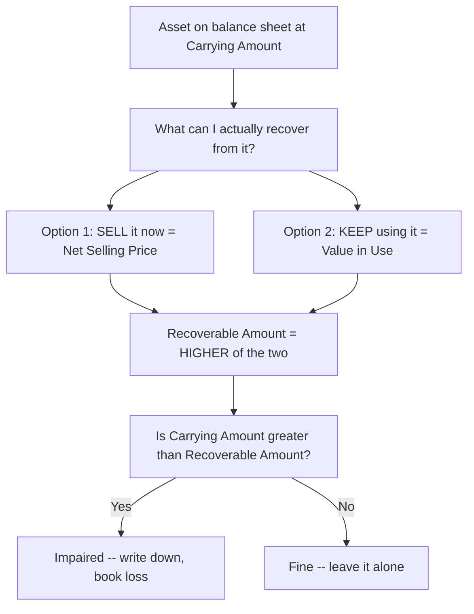
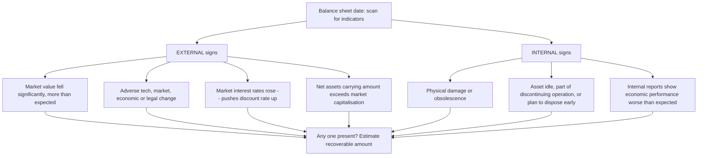
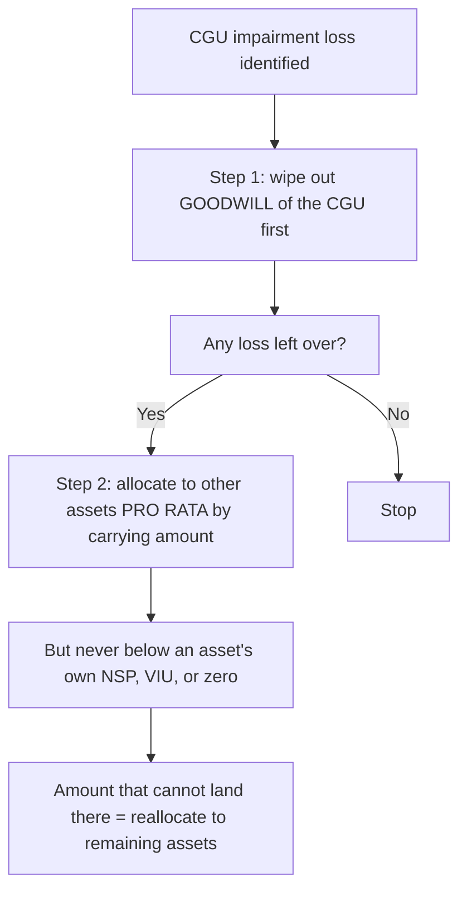
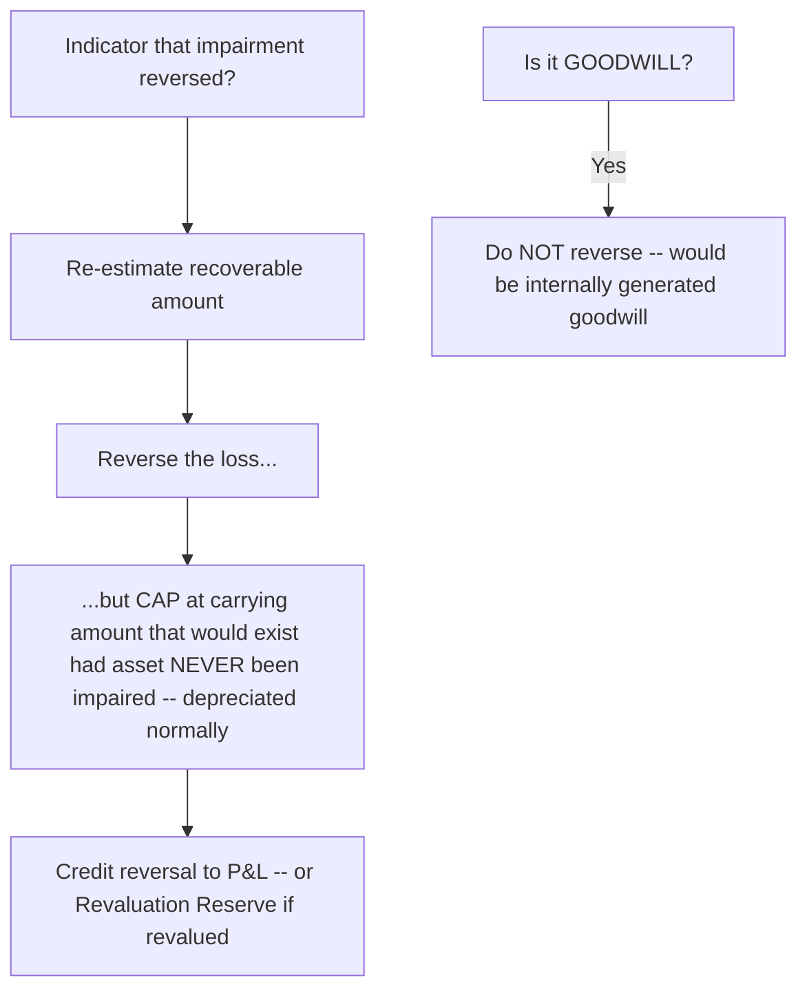
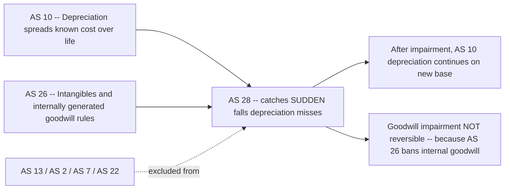

# Chapter 28 — AS 28: Impairment of Assets

## 1. The Problem

You already know how the balance sheet handles a machine. You bought it for ₹10,00,000, you expect it to last 10 years, so you write off ₹1,00,000 a year through depreciation (AS 10). After 4 years its book value — its *carrying amount* — sits at ₹6,00,000. Clean, orderly, predictable.

Now watch what depreciation *cannot* see.

**Scenario A — the technology dies overnight.** Your machine makes a specific automotive part. In year 4, the manufacturer redesigns the car and the part is discontinued. Nobody wants what this machine produces. It can generate almost no future cash. Yet the depreciation schedule cheerfully insists the asset is worth ₹6,00,000, and will keep insisting so for six more years. Depreciation spreads cost over time on a *pre-set formula*. It has no eyes. It does not know the world changed.

**Scenario B — the market collapses.** You have a plot of land (never depreciated) bought for ₹50,00,000. A new law bans commercial construction in that zone. Land like yours now sells for ₹15,00,000. The balance sheet still shows ₹50,00,000.

**Scenario C — the plant is damaged.** A flood corrodes a production line. It still runs, but at 40% capacity and with constant breakdowns. Its remaining cash-earning power has been gutted, but depreciation marches on unchanged.

Here is the accounting crime hiding in all three: **the balance sheet is overstating an asset.** An asset, by definition, is a resource expected to give *future economic benefits*. If those benefits have silently shrunk below the carrying amount, then the number on the balance sheet is a lie — it promises benefits the asset can no longer deliver. Investors relying on that number are misled. Profits of past years were overstated (we under-charged expense). The **prudence** concept — do not overstate assets, do not anticipate profit — is being violated.

Depreciation answers the question *"how do I spread a known cost over useful life?"* It was never built to answer *"has this asset suddenly lost value beyond the normal wear I already planned for?"* That second question needs its own machinery. That machinery is **AS 28 — Impairment of Assets**.

The one-sentence problem AS 28 exists to solve: **How do we detect, measure, and record a sudden or unexpected fall in an asset's value that ordinary depreciation would never catch — so that no asset is ever carried at more than the cash it can actually generate?**

## 2. The Core Idea (Analogy)

Think of an asset as an **investment that must justify its shelf-value by what you can still get out of it.**

Imagine you own a second-hand delivery van, recorded in your personal ledger at ₹3,00,000. A friend asks, "Is it really worth three lakh?" You'd sanity-check two escape routes:

1. **Sell it.** What would a buyer pay you today, minus the cost of advertising and paperwork? Say ₹2,20,000. Call this its **net selling price**.
2. **Keep using it.** How much cash will it earn me over its remaining life — deliveries, fees — brought back to today's value? Say ₹2,60,000. Call this its **value in use**.

A rational owner does whichever is better. You would *not* sell for ₹2,20,000 when keeping it is worth ₹2,60,000 to you. So the van is really worth **₹2,60,000 — the higher of the two** — because that is the most you can *recover* from it. This "best of your two options" figure is the **recoverable amount**.

Now compare: ledger says ₹3,00,000, but you can only recover ₹2,60,000. The van is **impaired by ₹40,000**. Honesty demands you write it down to ₹2,60,000 and book a ₹40,000 loss.

That is the *entire* logic of AS 28 in one picture. An asset must never be carried above what a rational owner could recover from it, and recoverable amount is the **higher of what you'd get by selling and what you'd get by using** — because that is what a sensible owner would actually do.

*Every impairment test is just this rational-owner sanity check: never carry an asset above the best of sell-or-use.*

## 3. Why It's Built This Way

Three design choices in AS 28 look arbitrary until you see the problem each one closes.

**Why "higher of" and not "lower of"?** This is the question that trips everyone, because inventory (AS 2) uses *lower of* cost and net realisable value, and students blur the two. The difference is about *what you are measuring and why*.

- Inventory is held **to sell**. Its whole purpose is one exit route — the market. So its economic value can't exceed what the market gives you; lower-of is prudent there.
- A fixed asset is held **to be used**, and *selling is only a fallback*. The owner controls the decision. A rational owner will pick the route — sell or use — that yields **more**. Recoverable amount must reflect the *best available* outcome, because that is genuinely what the asset can recover for the entity. If we forced "lower of," we'd write assets down below what the owner can truly get, which *understates* assets and *overstates* the impairment loss — itself a distortion. Accounting wants faithful representation, not maximum pessimism.

The subtlety: prudence says "don't *overstate*." It does **not** say "understate as hard as you can." Recoverable amount = higher of the two escape routes is the *most* the asset is worth to the entity, and we cap the balance sheet at that. That is exactly enough prudence and no more.

**Why an "indicator" trigger instead of testing every asset every year?** Testing recoverable amount is expensive — you'd have to estimate future cash flows, discount rates, market prices for every machine annually. That's disproportionate. So AS 28 says: at each balance sheet date, just *scan for warning signs* (indicators). Only if a red flag appears do you run the full test. It's a cheap smoke-detector triggering an expensive fire-brigade only when needed. (Ind AS 36 forces an annual test for goodwill and indefinite-life intangibles; ICAI AS 28 does **not** — under AS 26 goodwill/intangibles are amortised, so the pure indicator approach suffices. Flag this contrast; it's an examiner favourite.)

**Why the Cash Generating Unit concept?** Value in use needs *future cash flows from the asset*. But many assets don't earn cash on their own. A conveyor belt inside a factory earns nothing by itself — the *whole factory* earns cash. You cannot isolate "the belt's revenue." So AS 28 says: when an individual asset can't generate independent cash inflows, group it with the smallest cluster of assets that *can*, test *that* cluster's recoverable amount, and allocate any impairment back down. That smallest independent cash-earning cluster is the **Cash Generating Unit (CGU)**. It exists purely because value-in-use is meaningless for an asset that doesn't independently earn.

**Why allow reversal?** Depreciation is a one-way ratchet, but impairment is a *judgement about current conditions*. If the condition that caused the write-down reverses — the banned zone is re-opened, the discontinued part comes back into demand — then continuing to carry the asset at the depressed value would *understate* it. So AS 28 permits reversal (with one big exception, goodwill), because the whole point is to keep carrying amount *truthful*, not to punish the asset permanently.

## 4. Full Technical Content (Recognition, Measurement, Presentation, Disclosure)

### 4.1 Scope — where AS 28 applies and where it doesn't

AS 28 applies to **all assets** *except* those covered by other standards' own valuation rules, because it would be double-regulation. Carved out:

| Excluded asset | Governed instead by |
|---|---|
| Inventories | AS 2 |
| Assets from construction contracts | AS 7 |
| Financial assets / investments | AS 13 |
| Deferred tax assets | AS 22 |

So AS 28 mainly bites on **fixed assets (AS 10), intangible assets (AS 26), and goodwill.**

### 4.2 The master rule (Recognition principle)

> An asset is **impaired** when its **carrying amount exceeds its recoverable amount**. The excess is the **impairment loss**, recognised immediately.

$$\text{Impairment Loss} = \text{Carrying Amount} - \text{Recoverable Amount} \quad (\text{only if positive})$$

- **Carrying amount** = cost (or revalued amount) less accumulated depreciation and any earlier accumulated impairment.
- **Recoverable amount** = **higher of** (a) Net Selling Price and (b) Value in Use.

Practical shortcut the standard itself allows: you don't always need *both* figures. If **either** NSP or VIU already exceeds carrying amount, the asset is not impaired — stop, no need to compute the other. You only need both when the first one you compute is *below* carrying amount.

### 4.3 Net Selling Price (NSP)

$$\text{NSP} = \text{Fair value from sale (arm's length)} - \text{Direct costs of disposal}$$

Costs of disposal = legal costs, stamp duty, removal costs, direct incremental selling costs. **Exclude** finance costs, income-tax, and any cost already recognised as a liability. Best evidence = a binding sale agreement price; next best = market price in an active market; failing both, best estimate from recent transactions.

### 4.4 Value in Use (VIU)

VIU = the present value of the future cash flows expected from **continuing use** of the asset plus its **residual value on eventual disposal**, discounted at a pre-tax rate.

$$\text{VIU} = \sum_{t=1}^{n} \frac{\text{CF}_t}{(1+r)^t} + \frac{\text{Residual/Disposal value}}{(1+r)^n}$$

Two ingredients, each with rules:

**(a) Estimating future cash flows** — base on reasonable, supportable assumptions and the *most recent* management budgets/forecasts (AS 28 guidance: projections generally not beyond **5 years** unless a longer period is justified; beyond that, extrapolate with a steady or declining growth rate). Include:
- cash *inflows* from continuing use;
- cash *outflows* necessarily incurred to generate those inflows (including day-to-day servicing);
- net disposal proceeds at end of life.

**Exclude** (critical — heavily examined):
- cash flows from **future restructuring** not yet committed;
- cash flows from **improving/enhancing** the asset's performance (test it in its *current* condition);
- cash inflows/outflows from **financing activities**;
- **income tax** receipts or payments.

**(b) The discount rate** — a **pre-tax** rate reflecting current market assessments of the time value of money and the risks specific to the asset. It must *not* double-count risks already baked into the cash-flow estimates.

### 4.5 Indicators of impairment (the annual scan)

At each balance sheet date, assess whether **any indicator** exists. If none, no formal estimate of recoverable amount is required (except where another rule mandates it). Indicators are grouped as **External** and **Internal**.

*If even one flag is up, you must estimate recoverable amount; if all are clear, you may skip the expensive test.*

**External indicators**
1. Asset's market value has declined significantly more than expected from normal use/passage of time.
2. Significant adverse changes (technological, market, economic, legal) in the entity's environment or the market the asset serves.
3. Market interest rates / rates of return have increased, likely raising the discount rate and cutting VIU.
4. The carrying amount of the entity's net assets exceeds its market capitalisation.

**Internal indicators**
5. Evidence of physical damage or obsolescence.
6. Significant adverse changes in the extent/manner an asset is used — idle, part of an operation being discontinued/restructured, or plan to dispose before the earlier-expected date.
7. Internal reporting indicates the asset's economic performance is, or will be, worse than expected.

Even if **no** indicator exists, if an indicator triggered a *revised remaining useful life, depreciation method, or residual value* last time, those may still need updating — the scan has side-benefits.

### 4.6 Accounting for the impairment loss (the entry)

**Asset carried at cost (most common):**

| Particulars | Dr (₹) | Cr (₹) |
|---|---|---|
| Impairment Loss A/c ....... Dr | XXX | |
| &nbsp;&nbsp;&nbsp;To Accumulated Impairment / Asset A/c | | XXX |
| *(Impairment loss charged to Statement of P&L)* | | |

Then: **Impairment Loss A/c** is transferred to the **Statement of Profit and Loss** (it is an expense of the period).

**Asset carried at revalued amount (AS 10 revaluation model):** the impairment loss is treated as a **revaluation decrease** — first debited against any existing **Revaluation Reserve** for *that same asset* (to the extent available), and only the excess hits P&L.

**After impairment, adjust depreciation:** depreciation for *future* periods is recalculated on the **revised carrying amount** (recoverable amount) less residual value, spread over the **remaining useful life**. Impairment resets the depreciation base going forward.

### 4.7 Cash Generating Units (CGUs) — mechanics

**Definition:** the *smallest identifiable group of assets* that generates cash inflows **largely independent** of the cash inflows from other assets or groups.

**When to use:** when an individual asset's recoverable amount can't be estimated because it doesn't generate independent cash inflows and its VIU can't be assessed alone. Then estimate recoverable amount for the *CGU* it belongs to.

**Allocating a CGU impairment loss — the strict order:**
1. **First**, reduce the carrying amount of any **goodwill** allocated to the CGU (goodwill is the softest, riskiest asset — it absorbs the first blow).
2. **Then**, reduce the **other assets** of the CGU **pro rata** on the basis of their carrying amounts.

**Floor rule (a crucial limit):** in reducing individual assets, you must **not** write any single asset below the *highest* of: its own net selling price (if determinable), its own value in use (if determinable), and **zero**. Any impairment that "can't land" because of this floor is **reallocated pro rata to the other assets** of the CGU.

*Goodwill takes the first hit; the rest is shared pro rata, with a hard floor protecting each identifiable asset's own recoverable value.*

### 4.8 Reversal of an impairment loss

At each balance sheet date, assess whether there is any indication that a **previously recognised impairment loss no longer exists or has decreased.** If so, re-estimate recoverable amount and **reverse** — but with a strict ceiling and one prohibition.

**The ceiling (the golden limit):** the increased carrying amount after reversal must **not exceed** the carrying amount that *would have been determined (net of depreciation) had no impairment loss been recognised in prior years.* In other words, you can climb back up only to the "would-have-been-if-never-impaired" line — never higher. Any excess would be a revaluation, not a reversal.

**Recognition of reversal:**
- Asset at cost → reversal is credited to the **Statement of P&L** (as income).
- Asset at revalued amount → reversal treated as a **revaluation increase** (credited to Revaluation Reserve), except to the extent it reverses a prior decrease that was charged to P&L.

**After reversal, adjust depreciation** for future periods on the new (higher) carrying amount, less residual, over remaining life.

**The prohibition:** an impairment loss recognised for **GOODWILL is NOT reversed** in a subsequent period — *unless* the loss was caused by a specific external event of an exceptional nature not expected to recur, and later external events reverse it (an extremely narrow window; treat goodwill reversal as effectively banned for exam problems). Reason: any later increase in goodwill's recoverable amount is almost certainly *internally generated goodwill*, which AS 26 forbids recognising.

*Reversal restores truth up to the never-impaired line, and no further; goodwill impairment is a one-way door.*

## 5. Worked Examples

### Example 1 — The basic sanity check (easy)

A machine has a carrying amount of ₹8,00,000. Due to a new competing technology (external indicator), the entity estimates:
- Net selling price = ₹5,50,000
- Value in use = ₹6,20,000

**Step 1 — Recoverable amount = higher of NSP and VIU** = higher of ₹5,50,000 and ₹6,20,000 = **₹6,20,000**.

**Step 2 — Compare with carrying amount:** ₹8,00,000 > ₹6,20,000 → impaired.

**Step 3 — Impairment loss** = ₹8,00,000 − ₹6,20,000 = **₹1,80,000**.

**Entry:**
| Particulars | Dr (₹) | Cr (₹) |
|---|---|---|
| Impairment Loss A/c ..... Dr | 1,80,000 | |
| &nbsp;&nbsp;To Machinery A/c | | 1,80,000 |

Impairment Loss ₹1,80,000 transferred to P&L. New carrying amount = ₹6,20,000. Note the trap: a careless student picks VIU because it's "the one you keep using it at" or picks NSP as "conservative." The rule is mechanical — **higher of the two**, here VIU.

### Example 2 — Computing Value in Use, then depreciation reset (medium)

On 1 April 2025, a plant has carrying amount ₹20,00,000, remaining useful life 4 years, nil residual value, straight-line depreciation. A flood damages it (internal indicator). Estimated net cash inflows from continued use: ₹6,00,000 per year for 4 years. Disposal value after 4 years: ₹1,00,000. Appropriate pre-tax discount rate: 10%. Net selling price now: ₹15,00,000.

**Step 1 — Value in Use** (PV of 4 annual inflows + PV of disposal). Discount factors at 10%: Yr1 0.909, Yr2 0.826, Yr3 0.751, Yr4 0.683.

| Year | Cash flow (₹) | DF @10% | PV (₹) |
|---|---|---|---|
| 1 | 6,00,000 | 0.909 | 5,45,400 |
| 2 | 6,00,000 | 0.826 | 4,95,600 |
| 3 | 6,00,000 | 0.751 | 4,50,600 |
| 4 | 6,00,000 | 0.683 | 4,09,800 |
| 4 (disposal) | 1,00,000 | 0.683 | 68,300 |
| **Total VIU** | | | **19,69,700** |

**Step 2 — Recoverable amount** = higher of NSP ₹15,00,000 and VIU ₹19,69,700 = **₹19,69,700**.

**Step 3 — Impairment loss** = carrying ₹20,00,000 − recoverable ₹19,69,700 = **₹30,300**.

**Entry:** Impairment Loss A/c Dr ₹30,300 / To Plant A/c ₹30,300 → charged to P&L. New carrying amount = **₹19,69,700**.

**Step 4 — Depreciation for future years** resets on the new base: ₹19,69,700 ÷ 4 remaining years = **₹4,92,425 per year** (instead of the old ₹5,00,000). This is the reconciling payoff — impairment lowers both the asset and all subsequent depreciation.

*Self-check: had NSP been, say, ₹19,90,000 (above VIU), recoverable amount would have been ₹19,90,000, and impairment only ₹10,000 — proving the "higher of" rule protects the asset from over-writedown.*

### Example 3 — Cash Generating Unit with goodwill and the floor (exam-hard)

A CGU (a small factory) comprises: Goodwill ₹2,00,000, Building ₹6,00,000, Plant ₹4,00,000, Fittings ₹2,00,000 — total carrying amount **₹14,00,000**. After an adverse market change, the CGU's recoverable amount is estimated at **₹9,00,000**. Additional info: the Building's own net selling price is reliably ₹5,20,000 (so it cannot be written below that).

**Step 1 — Total impairment loss for the CGU** = ₹14,00,000 − ₹9,00,000 = **₹5,00,000**.

**Step 2 — Allocate to goodwill first.** Goodwill ₹2,00,000 fully written off. Remaining loss to allocate = ₹5,00,000 − ₹2,00,000 = **₹3,00,000**.

**Step 3 — Allocate ₹3,00,000 pro rata across other assets by carrying amount** (Building 6,00,000 : Plant 4,00,000 : Fittings 2,00,000 = total 12,00,000).

| Asset | Carrying (₹) | Pro-rata share of ₹3,00,000 | Provisional new carrying (₹) |
|---|---|---|---|
| Building | 6,00,000 | 3,00,000 × 6/12 = 1,50,000 | 4,50,000 |
| Plant | 4,00,000 | 3,00,000 × 4/12 = 1,00,000 | 3,00,000 |
| Fittings | 2,00,000 | 3,00,000 × 2/12 = 50,000 | 1,50,000 |
| **Total** | **12,00,000** | **3,00,000** | **9,00,000** |

**Step 4 — Apply the floor rule.** Building must not fall below its own NSP ₹5,20,000. Provisional ₹4,50,000 is *below* that floor — not allowed. So Building is written only down to **₹5,20,000** (a reduction of ₹80,000, not ₹1,50,000). The **un-absorbed** ₹70,000 (1,50,000 − 80,000) must be **reallocated to Plant and Fittings pro rata** (their carryings 4,00,000 : 2,00,000 = 4:2).

| Asset | Extra ₹70,000 reallocated | Final reduction | Final carrying (₹) |
|---|---|---|---|
| Plant | 70,000 × 4/6 = 46,667 | 1,00,000 + 46,667 = 1,46,667 | 2,53,333 |
| Fittings | 70,000 × 2/6 = 23,333 | 50,000 + 23,333 = 73,333 | 1,26,667 |
| Building | — | 80,000 | 5,20,000 |

**Step 5 — Reconcile.** Final carryings: Goodwill 0 + Building 5,20,000 + Plant 2,53,333 + Fittings 1,26,667 = **₹9,00,000** ✔ (equals recoverable amount; total loss ₹5,00,000 fully absorbed: 2,00,000 + 80,000 + 1,46,667 + 23,333... let me total the identifiable reductions: Building 80,000 + Plant 1,46,667 + Fittings 73,333 = 3,00,000, plus goodwill 2,00,000 = **₹5,00,000** ✔). Assumes Plant and Fittings have no binding floor (their own NSP/VIU below these figures). Everything ties.

### Example 4 — Reversal capped at the "never-impaired" line (medium-hard)

Continue a simpler asset. On 1 April 2023, a machine (cost ₹10,00,000, life 10 years, SLM, nil residual) had carrying amount after 2 years' depreciation of ₹8,00,000. On 31 March 2024 (end of year 3... let's fix the timeline): after year 3 depreciation ₹1,00,000, carrying would normally be ₹7,00,000, but an impairment brought recoverable amount to **₹5,60,000**, so an impairment loss of ₹1,40,000 was booked.

Remaining life at that point = 7 years. New depreciation = ₹5,60,000 ÷ 7 = **₹80,000/year**.

Two years later (after 2 more years), carrying amount = ₹5,60,000 − (2 × ₹80,000) = **₹4,00,000**. Now the adverse condition reverses (market recovers). Re-estimated recoverable amount = **₹6,50,000**.

**Step 1 — What is the ceiling?** Carrying amount had there been **no** impairment: original ₹7,00,000 (at the impairment date) would have depreciated at the *original* ₹1,00,000/year for 2 more years → ₹7,00,000 − ₹2,00,000 = **₹5,00,000**.

**Step 2 — Reverse, but cap at ₹5,00,000.** Recoverable ₹6,50,000 exceeds the ceiling, so we can raise carrying amount only to **₹5,00,000**, not ₹6,50,000.

**Step 3 — Reversal amount** = ₹5,00,000 − ₹4,00,000 = **₹1,00,000**, credited to P&L as income.

**Entry:** Machinery A/c Dr ₹1,00,000 / To Reversal of Impairment Loss (P&L) ₹1,00,000.

**Step 4 — Depreciation going forward** on ₹5,00,000 over remaining life. This is the whole discipline of reversal: restore up to where normal depreciation would have left you, and *not one rupee more* — otherwise you'd be revaluing upward, which AS 28 reversal is not.

## 6. Presentation & Disclosure

**Where it appears:** an impairment loss is an **expense in the Statement of Profit and Loss** (reversal is income). If the asset was carried at revalued amount, the loss/reversal goes through the **Revaluation Reserve** to the extent that reserve holds a balance for that asset, and only the remainder through P&L.

**Balance sheet / notes — for each class of assets, disclose:**
- the amount of **impairment losses recognised** in P&L during the period, and the line item(s) of the P&L in which they are included;
- the amount of **reversals** of impairment losses recognised in P&L during the period, and the line item(s);
- impairment losses / reversals recognised **directly in revaluation surplus** during the period.

**If an individual impairment loss (or reversal) is material, additionally disclose:**
- the **events and circumstances** that led to it;
- the **amount** recognised or reversed;
- for an **individual asset**: its nature and the reportable segment it belongs to;
- for a **CGU**: a description of the unit, the amount by class of asset (and by segment), and if the CGU's composition changed, that fact;
- whether recoverable amount is **net selling price or value in use**; if NSP, the basis of determining it; if VIU, the **discount rate** used.

**Segment disclosure (for entities applying AS 17):** impairment losses and reversals recognised during the period, by reportable segment.

The presentation logic mirrors the substance: a *sudden loss of value* deserves visibility, so the standard forces you to explain *why* it happened, *how much*, and *which method* revealed it — no burying it inside depreciation.

## 7. Connections

*AS 28 is the safety net stretched under AS 10 and AS 26; its no-reversal-of-goodwill rule is a direct consequence of AS 26.*

- **AS 10 (Property, Plant & Equipment):** AS 10 gives carrying amount via depreciation; AS 28 tests whether that carrying amount is still supportable and, if not, writes it down — after which AS 10 depreciation resumes on the *revised* base. They are partners: AS 10 handles the *planned* decline, AS 28 the *unplanned* one. Revaluation under AS 10 also dictates *where* an impairment lands (reserve vs P&L).
- **AS 26 (Intangible Assets):** AS 26 forbids recognising internally generated goodwill and requires intangibles to be amortised; AS 28 tests those same intangibles for impairment. The prohibition on **reversing goodwill impairment** flows straight from AS 26 — any recovery in goodwill value is deemed *internally generated* and thus non-recognisable.
- **AS 2 (Inventories):** deliberately excluded — but the *lower of cost and NRV* rule there is the perfect contrast to AS 28's *higher of NSP and VIU*, and examiners exploit the confusion.
- **AS 4 / provisions:** future restructuring cash flows are excluded from VIU until a provision is actually committed — links to obligation-recognition logic.
- **AS 22 (Deferred Tax):** an impairment loss changes the difference between book and tax carrying values, potentially creating/altering a **deferred tax asset or liability** — even though DTAs themselves are outside AS 28's scope.

## 8. Traps & Examiner Tricks

1. **"Higher of" vs "lower of" swap.** The single most common error: applying inventory's *lower of cost and NRV* to fixed assets. AS 28 recoverable amount is **HIGHER** of NSP and VIU. Anchor it: a fixed asset is *used*, so the owner takes the better of sell-or-use.
2. **Picking the wrong one of NSP/VIU without comparing.** Always compute (or at least reason about) both, take the higher, *then* compare to carrying amount. Students often stop at VIU.
3. **Forgetting the shortcut waste.** Conversely, if the first figure you compute already exceeds carrying amount, the asset is not impaired — no need to compute the second. Don't burn exam time computing VIU when NSP already clears carrying amount.
4. **Including forbidden cash flows in VIU.** Future *restructuring* not yet committed, *enhancement/improvement* cash flows, *financing* flows, and *income tax* are all **excluded**. Test the asset in its *present condition*. A favourite: examiner slips in "cash flows after planned upgrade" — strip them out.
5. **Using a post-tax discount rate.** VIU uses a **pre-tax** rate. Mixing post-tax rate with pre-tax cash flows is a classic setup.
6. **Not resetting depreciation after impairment (or reversal).** The revised carrying amount must be depreciated over *remaining* useful life. Forgetting this loses easy marks.
7. **CGU allocation order.** Goodwill **first** (fully), then other assets **pro rata** by carrying amount — never the reverse, never equally.
8. **Ignoring the floor in CGU allocation.** An individual asset can't be written below its own NSP / VIU / zero; the un-absorbed amount reallocates to the others. High-difficulty questions hinge on this.
9. **Breaching the reversal ceiling.** Reversal is capped at the *depreciated historical carrying amount had no impairment occurred*. Writing back to full recoverable amount when that exceeds the ceiling is wrong.
10. **Reversing goodwill impairment.** Goodwill impairment is **not** reversed (treat as absolute for exams). Any "recovery" would be internally generated goodwill, banned by AS 26.
11. **Revaluation routing.** For a revalued asset, impairment first hits the **Revaluation Reserve** of *that* asset, then P&L; reversal is credited to reserve except to reverse a prior P&L charge. Don't dump everything straight to P&L.
12. **Annual test confusion (AS vs Ind AS).** Under **ICAI AS 28** there is *no* mandatory annual impairment test for goodwill — only the indicator-based test. The annual test is an **Ind AS 36** feature. State the correct one for the paper you're sitting.

## 9. First-Principles Recap

- An asset promises *future economic benefits*; if those benefits silently fall below its carrying amount, the balance sheet lies — depreciation, being a fixed formula, cannot detect this. AS 28 is the detector.
- The master rule: **carrying amount must never exceed recoverable amount**; the excess is an impairment loss recognised immediately.
- **Recoverable amount = higher of net selling price and value in use** — because a rational owner takes the better of selling or continuing to use, and prudence means "don't overstate," *not* "understate maximally."
- Testing is **indicator-driven** (external + internal red flags) — a cheap annual scan that triggers the expensive recoverable-amount estimate only when warranted.
- **Value in use** = PV of future cash flows *in the asset's current condition*, at a **pre-tax** rate, excluding restructuring, enhancement, financing, and tax flows.
- When an asset can't earn cash alone, test its **Cash Generating Unit** — the smallest independently cash-earning group — and allocate impairment: **goodwill first, then pro rata**, with a floor protecting each asset's own recoverable value.
- After impairment, **depreciation resets** on the new carrying amount over remaining life.
- Impairment is **reversible** (conditions permitting), but only up to the **never-impaired depreciated carrying amount** — never beyond.
- **Goodwill impairment is not reversed**, because any later increase is internally generated goodwill, which AS 26 forbids.
- Impairment loss is a **P&L expense** (or a revaluation decrease for revalued assets); material impairments demand disclosure of cause, amount, method, and segment.

## 10. Quick-Revision Sheet

| Item | Rule |
|---|---|
| **Core test** | Impaired if Carrying Amount > Recoverable Amount; loss = the excess |
| **Recoverable Amount** | HIGHER of Net Selling Price and Value in Use |
| **Net Selling Price** | Fair sale value − direct disposal costs (exclude finance & tax) |
| **Value in Use** | PV of future cash flows (current condition) + disposal value; **pre-tax** rate |
| **VIU exclusions** | Future restructuring (uncommitted), enhancements, financing, income tax |
| **Forecast horizon** | Generally ≤ 5 yrs budgets, then extrapolate steady/declining growth |
| **When to test** | On any External or Internal **indicator** at B/S date |
| **External indicators** | Market value fall, adverse tech/market/legal change, ↑ interest rates, net assets > market cap |
| **Internal indicators** | Physical damage/obsolescence, asset idle/discontinuing, poor internal performance |
| **Loss entry** | Impairment Loss A/c Dr / To Asset (or Accum. Impairment); to P&L |
| **Revalued asset** | Loss → Revaluation Reserve first, then P&L |
| **Post-impairment** | Recompute depreciation on new base ÷ remaining life |
| **CGU** | Smallest group with largely independent cash inflows |
| **CGU allocation** | (1) Goodwill fully, (2) other assets pro rata by carrying amount |
| **CGU floor** | No asset below its own NSP / VIU / zero; excess reallocates pro rata |
| **Reversal ceiling** | Up to carrying amount had **no** impairment ever occurred (depreciated) |
| **Reversal entry** | Asset A/c Dr / To Reversal (P&L income) [or Reval. Reserve if revalued] |
| **Goodwill reversal** | **Not permitted** (internally generated goodwill barred by AS 26) |
| **Scope-out** | AS 2 inventory, AS 7 contracts, AS 13 investments, AS 22 DTA |
| **AS vs Ind AS** | AS 28: indicator test only. Ind AS 36: **annual** test for goodwill/indefinite intangibles |

**Golden mnemonic chain:** *Indicator → Recoverable = Higher(NSP, VIU) → compare → write down to recoverable → reset depreciation → reverse later only up to never-impaired line → but never reverse goodwill.*
