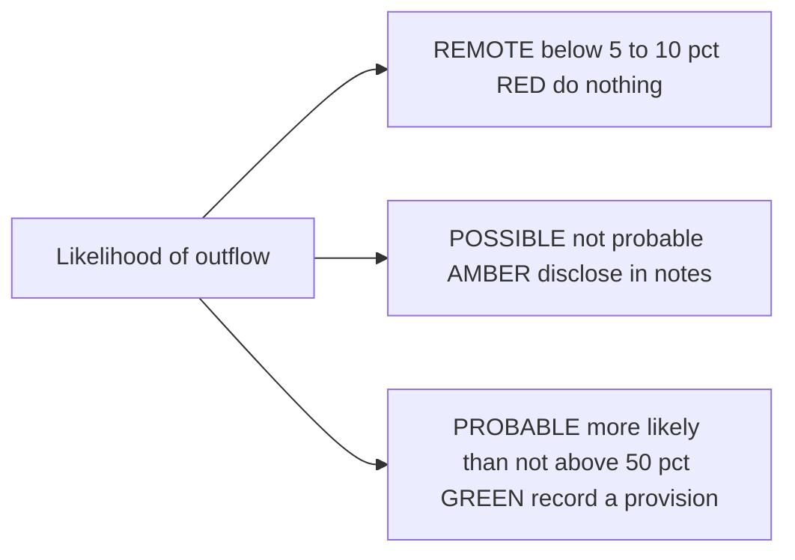
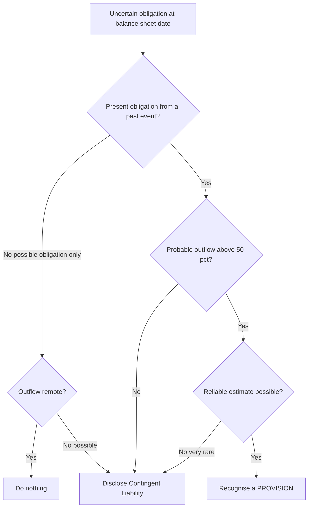
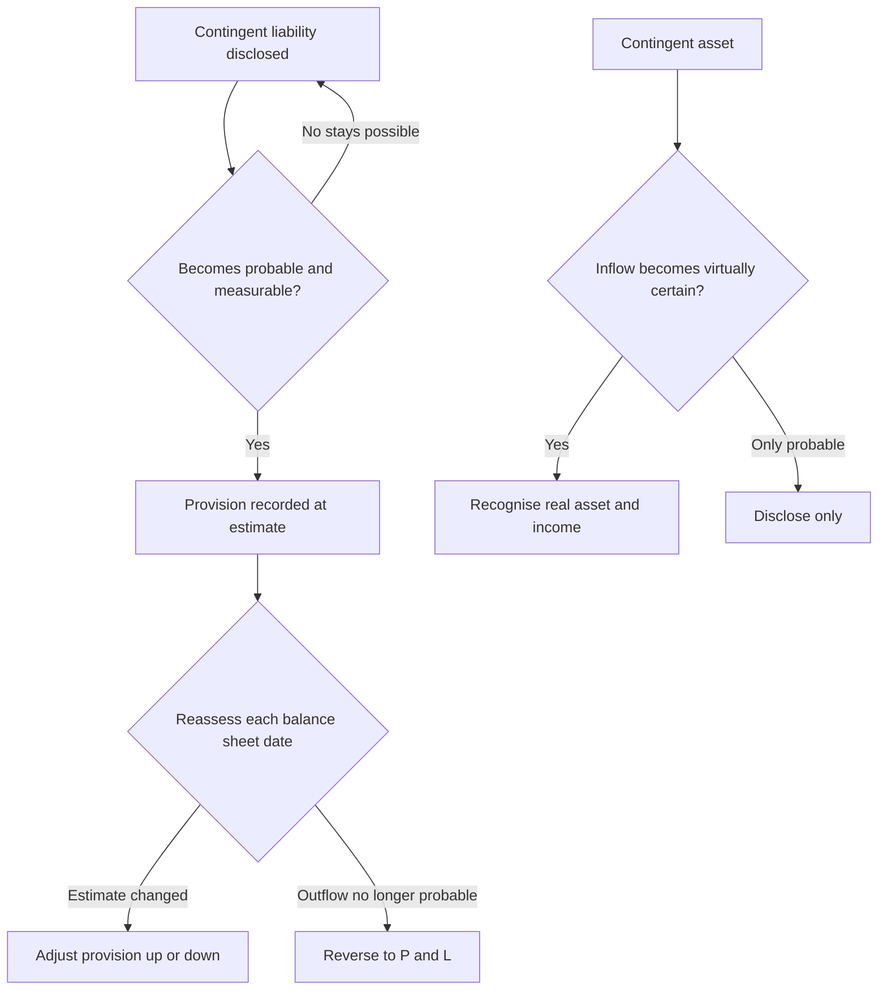

<!-- v2-deep -->

# Chapter 29 — AS 29: Provisions, Contingent Liabilities & Contingent Assets

## 1. The Problem

You are the accountant for *Meridian Motors Ltd.* It is 31 March. You must close the books. Three uncomfortable situations land on your desk on the same afternoon:

1. **The warranty.** You sold 40,000 cars this year, each with a 2-year free-repair warranty. Not one has failed yet. But from a decade of history you *know* roughly 3% will come back for repairs costing an average of ₹8,000. There is no bill, no claim, no invoice — nothing has "happened" in the strict legal sense. Yet a cost is coming. Do you record it now, or wait until customers actually turn up next year?

2. **The lawsuit.** A pedestrian is suing you for ₹50 lakh, alleging a brake defect. Your lawyers say: "We think we'll win — maybe 30% chance we lose." Nothing is settled. Do you sit an expense on the books for a case you expect to *win*? Do you ignore it entirely? Do you whisper about it in a footnote?

3. **The counter-claim.** *You* are suing a supplier for ₹20 lakh for delivering defective steel. Your lawyers are confident — 80% chance you win. That's an incoming gain. Can you book it as income now and cheer up the profit figure?

Notice what all three share: **uncertainty about whether the money will move, when it will move, and how much will move.** Ordinary liabilities — a creditor you owe ₹5 lakh, payable on 15 April — have none of this fog. You know the amount, the timing, the counterparty. AS 29 governs the foggy ones.

Here is the deeper problem. Two opposite temptations pull at every accountant facing fog:

- **Over-caution (secret reserves).** "Let me provide for everything that *might* go wrong — the lawsuit, a possible tax demand, a maybe-recession. Better safe than sorry." This crashes profit artificially, builds hidden cushions, and lets management smooth earnings by releasing those cushions in bad years. Prudence, weaponised, becomes fraud.

- **Over-optimism (hidden losses).** "Nothing's certain yet, so I'll record nothing. Clean books, happy shareholders." This hides real, foreseeable losses until they explode, ambushing investors.

**AS 29 exists to draw a hard, defensible boundary line through the fog** — so that prudence has *limits* and optimism has *limits*, and everyone applies the same test. It answers exactly three questions:

- When must I **record** (recognise) a liability whose timing or amount is uncertain? → *Provision*
- When must I merely **disclose** it in a note? → *Contingent liability*
- When may I record or disclose a possible **gain**? → *Contingent asset* (spoiler: almost never)

That is this chapter.

**A fourth silent question the standard also answers: what is NOT a provision at all?** Half of AS 29's exam value is negative — knowing what falls *outside* it. A "provision for depreciation" or "provision for doubtful debts" is an *asset valuation adjustment*, not a liability, so AS 29 never touches it. An accrual for goods received but not yet invoiced is a liability of only *slightly* uncertain amount — it is a **creditor/accrual**, not an AS 29 provision, because there is *little* estimation. AS 29 provisions are the narrow band where a **genuine liability** exists but the amount or timing needs a **substantial** estimate. Keep this frame: liability yes/no first, then certain/uncertain, then *how* uncertain. Most wrong answers come from misplacing an item at the very first fork.

---

## 2. The Core Idea (Analogy)

Think of AS 29 as a **traffic light for uncertain obligations**, driven by a single dial: *how likely is the outflow of money?*

Imagine a probability dial running from 0% to 100%. AS 29 slices it into three zones:

*The single dial — probability of outflow — decides whether you ignore, disclose, or book.*

- **Green light (Probable, "more likely than not", > 50%)** → *Go ahead and record it.* Book a **provision**: debit an expense, credit a liability. The obligation is real enough to hit profit now.
- **Amber light (Possible but not probable)** → *Slow down and warn.* You don't touch the profit, but you must **disclose a contingent liability** in the notes so readers see the danger.
- **Red light (Remote)** → *Stop; say nothing.* Ignore it entirely — cluttering statements with far-fetched risks is itself misleading.

Now the crucial asymmetry, which is the soul of prudence: **the traffic light is wired differently for money going OUT versus money coming IN.**

- For **losses/obligations** (money out), even a *probable* outflow gets recorded. The bar to recognise a loss is low — you anticipate losses.
- For **gains** (money in, "contingent assets"), the light stays RED until the gain is *virtually certain* (~100%). You never record a gain on hope; you don't even disclose it unless it's *probable*, and you only recognise it when it's practically in the bank.

The analogy that locks it in: **AS 29 is a pessimist's accountant.** It leans forward to catch every foreseeable loss, and leans back, arms crossed, refusing to believe in any gain until the cheque has practically cleared. Prudence = *anticipate losses, never anticipate profits* — and AS 29 is that maxim turned into a rulebook with numeric thresholds.

**Two dials, not one — the deeper picture.** The traffic-light dial (probability) is only the *first* dial. There is a hidden *second* dial: **does a present obligation even exist?** A single-word swap in a question — from "the outflow is possible" to "it is unclear whether an obligation exists" — moves you to a *different* branch of the tree even though both feel like "amber". The four vocabulary words the examiner rotates map onto the probability dial like this:

| Word | Rough probability | Outflow item → | Inflow item → |
|---|---|---|---|
| **Remote** | < ~5–10% | Ignore (no note) | Ignore |
| **Possible** | not probable, but not remote | Contingent liability (disclose) | Ignore |
| **Probable** | > 50% ("more likely than not") | Provision (record) | Contingent asset (disclose in Board report) |
| **Virtually certain** | ~100% | (already an ordinary liability) | Recognise the asset |

Read that table left-to-right for a loss and right-to-left for a gain and you have *the entire recognition logic of AS 29 on one line each*. The exam is almost always testing whether you can place the examiner's chosen adjective on the correct rung of this ladder.

---

## 3. Why It's Built This Way

Why not just let each accountant use judgement? Because judgement without structure produces exactly the two abuses from Part 1. Let's reason out *why each design choice exists.*

**Why require a "present obligation from a past event"?**
Before AS 29, companies booked provisions for *future* operating losses, planned restructurings, or general "business risks" — things that hadn't obligated them yet. A provision for next year's expected trading loss is not a liability; it's a bet on the future. The "past event" gate blocks this. You can only provide for a burden you're *already saddled with* as of the balance-sheet date — a car already sold (warranty), a law already broken (penalty), damage already done. **This single gate kills the "provisions as profit-smoothing tool" abuse.** No past event → no obligation → no provision, however gloomy the future looks.

**Why the "probable" threshold rather than "possible"?**
If *any* possible outflow triggered a provision, every lawsuit, every disputed tax notice, every remote what-if would crash the P&L. Financial statements would become a horror catalogue of maybes, and profit would be meaningless. The 50% line is a **materiality-of-belief filter**: only obligations more likely to happen than not deserve to *reduce reported profit*. The rest get demoted to disclosure (a warning without a number in the accounts) or silence.

**Why disclose contingent liabilities at all instead of ignoring them?**
Because "possible" is not "negligible". A user deciding whether to invest deserves to know a ₹50 lakh suit is pending even if you'll probably win. Recording it would overstate losses (violating fair presentation the other way); ignoring it would hide a real risk. **Disclosure is the honest middle path** — transparency without distorting the numbers.

**Why never recognise contingent assets, and disclose only if probable?**
This is pure prudence and the anti-symmetry is deliberate. Recognising a hoped-for gain (winning a lawsuit) would let management inflate profit on optimism — the very manipulation prudence forbids. So the standard is asymmetric *on purpose*: it tolerates the risk of understating assets (conservative error) but not overstating them (dangerous error). A gain enters the books only when *virtually certain* — at which point it isn't really "contingent" any more, it's an ordinary receivable.

**Why measure at "best estimate" and discount long-dated ones?**
Because a made-up round number invites manipulation, and ₹1 crore payable in 5 years is genuinely worth less today than ₹1 crore payable tomorrow. Best-estimate measurement (Part 4) ties the number to evidence, and discounting (where the effect is material) ties it to economic reality.

**Why insist a provision be *used only* for its original purpose?**
Because the alternative silently launders errors. Suppose you over-provided ₹10 lakh for warranties and, separately, incurred a ₹6 lakh legal loss you never provided for. If you were allowed to charge the legal loss *against the warranty provision*, two lies would cancel on the face of the accounts: the warranty over-provision would never be exposed, and the unprovided legal loss would never hit the P&L as its own line. **Ring-fencing each provision to its own event forces every mis-estimate into daylight** — the excess warranty provision must be *reversed* (visibly), and the legal loss must be *expensed* (visibly). This is why AS 29's "use only for original purpose" rule is really an anti-concealment rule.

**Why does a "reliable estimate" almost never fail as a gate?**
AS 29 states that except in *extremely rare* cases an entity can determine a range of possible outcomes and so make an estimate reliable enough to use. The gate exists as a theoretical safety valve — if truly no reliable estimate is possible, the item drops to a *contingent liability* (disclose) rather than a provision. But examiners rarely let you escape a provision by claiming "can't estimate"; if history or a range exists, you must estimate. Treat "cannot be reliably measured" as a red flag that you may be *dodging* a provision you should book.

So every rule in AS 29 traces back to one design goal: **let real losses through, keep fake losses and fake gains out, and warn about the in-between.** The mechanics in Part 4 are just this philosophy made operational.

---

## 4. Full Technical Content (RMPD Lens)

AS 29 is *Accounting Standard 29 — Provisions, Contingent Liabilities and Contingent Assets.* We'll go through **R**ecognition, **M**easurement, **P**resentation, **D**isclosure — but first, definitions, because AS 29 is a standard where the definitions *are* the exam.

### 4.0 Core definitions (know these verbatim in substance)

| Term | Definition (AS 29 sense) |
|---|---|
| **Liability** | A present obligation arising from past events, settlement of which is expected to result in an outflow of resources embodying economic benefits. |
| **Provision** | A liability which can be measured only by using a **substantial degree of estimation** (i.e., of *uncertain timing or amount*). |
| **Obligating event** | A past event that creates an obligation leaving the entity **no realistic alternative** to settling it. |
| **Present obligation** | An obligation that exists at the balance-sheet date on the evidence available (on balance, more likely than not that a present obligation exists). |
| **Contingent liability** | (a) A **possible** obligation arising from past events whose existence will be confirmed only by uncertain future events not wholly in the entity's control; **OR** (b) a **present** obligation that is **not recognised** because either an outflow is **not probable**, or the amount **cannot be reliably measured**. |
| **Contingent asset** | A **possible asset** arising from past events whose existence will be confirmed only by uncertain future events not wholly within the entity's control. |
| **Present value / discounting** | Provisions are discounted to present value where the time value of money is material. |

Two definitional subtleties that examiners love:

- A **provision is a liability** (it sits on the balance sheet, it hits profit). A **contingent liability is NOT a liability** in the accounting sense — it is *never* recognised; it only lives in the notes. Do not confuse "provision" (recorded) with "contingent liability" (disclosed).
- The word "obligation" covers **legal** obligations (contract, statute, law) *and* **constructive** obligations. A **constructive obligation** arises where, by an established pattern of past practice or published policy, the entity has created a **valid expectation in others** that it will discharge the obligation (e.g., a retailer with a well-known "full refund, no questions" policy even where not legally bound).

**A third subtlety — the two limbs of "contingent liability" are genuinely different animals.** Limb (a) is a *possible* obligation — we are not even sure the obligation exists. Limb (b) is a *present* obligation we *are* sure exists but which we still cannot book, because the outflow is not probable **or** we cannot measure it. Both end up in the same place (a note), but the reasoning differs, and the examiner can ask you *which* limb applies. A pending lawsuit where you'll probably win = limb (a) (possible obligation). A confirmed guarantee you've given for a subsidiary's loan, where default is possible but not probable = limb (b) (present obligation, outflow not probable).

**Scope exclusions — what AS 29 does NOT govern.** AS 29 does not apply to provisions/liabilities covered by *other* standards or by their own contractual measurement, including: financial instruments carried at fair value; executory contracts (contracts where *neither* party has performed, or both have performed equally) unless the contract is *onerous*; items covered by another AS (e.g., taxes on income — AS 22; retirement benefits — AS 15; construction-contract foreseeable losses — AS 7; leases — the leases standard). Knowing the scope-out list prevents you from mis-applying AS 29 to, say, a deferred-tax or gratuity provision.

**Executory contract — a key negative concept.** An executory contract is one under which obligations are *equally unperformed* on both sides (you've ordered goods; supplier hasn't delivered; you haven't paid). AS 29 says: **no provision for an ordinary executory contract** — because you'd get value for value. It becomes provisionable *only* when it turns **onerous** (see 4.2). This is the doctrinal root of "no provision for future purchases / future operating costs".

### 4.1 RECOGNITION — the three-part gate for a Provision

A provision **shall be recognised** when, and only when, **ALL three** conditions are met:

1. An entity has a **present obligation** (legal or constructive) as a result of a **past (obligating) event**;
2. It is **probable** (more likely than not, i.e., > 50%) that an **outflow** of resources embodying economic benefits will be required to settle the obligation; and
3. A **reliable estimate** can be made of the amount of the obligation.

If **all three** hold → **recognise a provision** (Dr Expense / Cr Provision).
If any fails → it may be a **contingent liability** (disclose) or nothing (remote → ignore).

*The full AS 29 decision tree: three green lights are needed to book a provision; failing any one drops you to disclosure or silence.*

**The "no realistic alternative" test for a present obligation.** An obligating event exists only if settling is not genuinely avoidable. Key consequence: **future conduct you can still change is NOT an obligating event.**

- You can *avoid* a future cost by changing your future actions → **no obligation** → no provision. Example: expected costs of re-training staff to comply with a *new* law next year — you could (in theory) restructure to avoid it; it's a future operating cost, not a present obligation.
- You are *committed by a past act* → obligation exists. Example: you already sold the warranted car; you cannot now un-sell it, so the warranty obligation is present.

**The subtle case of "obligation only if the law is enacted".** A common exam twist: at year-end a *draft* law will require fitting smoke filters to your factory, but it is **only virtually certain to be enacted** *after* year-end. Test: is there a **present** obligation at the balance-sheet date? For the *fitting cost* — **no**, because you can avoid it by selling/closing the factory; it is future conduct. For a *fine for operating without the filter* — you'd only be obligated once you've operated *after* the law is in force, so again no present obligation at year-end. Result: **no provision** either way; at most a contingent-liability narrative if enactment is likely. The lesson: a *new law* by itself rarely creates a *present* obligation for future compliance costs — the obligating event is your *own future operation*, which you can still avoid.

**Present obligation vs possible obligation.** Where it is unclear whether a present obligation exists, you take account of all evidence (including experts). If, on balance, a present obligation **probably** exists at the reporting date → provide. If it only **possibly** exists → contingent liability.

### 4.2 Specific recognition rules AS 29 spells out

These are the classic exam scenarios. Reason through each:

| Situation | Treatment under AS 29 | Reasoning |
|---|---|---|
| **Future operating losses** | **No provision.** | No past obligating event; future losses can be avoided by future action (e.g., exiting the business). They also indicate possible asset impairment — test that instead. |
| **Onerous contract** (unavoidable costs of meeting > benefits expected) | Recognise a provision for the **least net cost of exiting** (lower of cost to fulfil vs penalty to cancel). | Here a *past* contract binds you; the loss is unavoidable → present obligation exists. (Note: AS 29 in India addresses onerous contracts; confirm precise wording in ICAI material, but the principle is examinable.) |
| **Restructuring** (sale/closure of a business line, relocation, reorganisation) | Provision only if there is a **detailed formal plan** AND a **valid expectation raised** in those affected (announcement/started implementation) *before* the balance-sheet date → constructive obligation. Provide only for **direct** expenditures necessarily entailed by restructuring, NOT costs of ongoing activities (retraining/relocating continuing staff, marketing, new-system investment, future operating losses). | A mere Board decision alone is *not* enough — the entity can still reverse it, so no obligation. Announcement creates the constructive obligation. |
| **Warranties** | Provision **required** (past sale = obligating event; outflow probable across the population; estimable from history). | Classic provision. |
| **Reimbursements** (e.g., insurance / indemnity you expect to recover) | Recognise the reimbursement as a **separate asset ONLY when virtually certain** it will be received; the asset must **not exceed** the provision. In the P&L, expense may be presented **net** of the reimbursement. | Prudence: the recovery is a contingent asset until virtually certain; you can't net a hoped-for recovery against a real liability. |
| **Repairs/maintenance of own assets, future refurbishment** | **No provision** (unless a legal/constructive obligation to a third party exists). | You could sell the asset instead of refurbishing — no present obligation to anyone. |
| **Decommissioning / site restoration** (legal duty to dismantle & restore) | Provision **required**, at **present value**; the cost is **capitalised into the asset** (AS 10) and the discount **unwinds** as finance cost. | Past act of building/operating creates the legal obligation; long-dated so discount. |
| **Refunds under a stated policy** (published "money-back" guarantee) | Provision **required** — the published policy creates a **constructive** obligation even without legal compulsion. | Valid expectation raised in customers. |
| **Guarantee given for a third party's borrowing** | Usually a **contingent liability** (disclose) while default is only possible; becomes a **provision** if the third party's default becomes probable. | Obligation is present but outflow not probable → limb (b). |
| **Contingent asset** | **Never recognised.** Disclosed (in the *approving authority's report / Board report*, not typically the notes) **only if inflow is probable**. When inflow becomes **virtually certain**, it ceases to be contingent and the **asset is recognised**. | Anti-symmetry / prudence. |

**Onerous contract — the measurement rule spelt out.** A contract is onerous when the *unavoidable* costs of meeting the obligations under it **exceed** the economic benefits expected to be received. The provision is the **lower of** (a) the cost of *fulfilling* the contract and (b) any *compensation/penalty* arising from *failing* to fulfil it — because a rational entity would choose the cheaper escape route, and that "least net cost of exit" is the true unavoidable burden. Before recognising a separate onerous-contract provision, any **impairment loss on assets dedicated to that contract** is recognised first (you don't double-count).

*Mini-illustration:* Meridian has a non-cancellable lease on a vacated showroom: 3 years left at ₹5,00,000/year = ₹15,00,000 to fulfil. It can sub-let for ₹2,00,000/year (₹6,00,000), or buy out the lease today for a ₹9,00,000 penalty. Net cost to fulfil = 15,00,000 − 6,00,000 = ₹9,00,000; penalty to exit = ₹9,00,000. Least net cost = **₹9,00,000** → provide that (discount if material). If instead the buy-out were ₹7,00,000, you'd provide **₹7,00,000** (cheaper to exit).

### 4.3 MEASUREMENT — how much to provide

**Rule: the amount recognised is the BEST ESTIMATE of the expenditure required to settle the present obligation at the balance-sheet date** — i.e., the amount you'd rationally pay to settle it (or transfer it) then.

How to arrive at the best estimate:

1. **Large population of items (many similar obligations)** → use **"expected value"**: weight each possible outcome by its probability. This is the warranty case.
   *E.g., if 75% of goods need no repair, 20% need minor repair (₹1,000), 5% need major (₹4,000): expected cost per unit = 0.75×0 + 0.20×1,000 + 0.05×4,000 = ₹400 per unit.*
2. **Single obligation (one lawsuit, one dispute)** → the best estimate is generally the **individual most likely outcome**, but adjust for other possible outcomes if they're materially higher/lower. (You don't take "expected value" of a single event the way you would a population; but if outcomes cluster above/below the most likely one, lean that way.)

**The single-obligation nuance examiners exploit.** "Most likely outcome" is the *starting* point, not an unbreakable rule. If the most likely outcome is ₹0 (probably win) but there is a *material* chance of a large loss, the best estimate is *not* automatically ₹0 — but note that if losing is only *possible* (not probable), the whole item fails the recognition gate and becomes a *contingent liability* instead. Conversely, if there are several possible loss amounts *all* of which would occur *if* you lose (say the court will award somewhere between ₹20L and ₹40L), and losing is probable, lean toward the amount that best reflects the range — often a mid or most-likely figure — not merely the smallest. Read whether the uncertainty is about *whether* you pay (→ probability gate) or *how much* you pay given that you pay (→ estimate within the provision).

Further measurement rules:

- **Risks and uncertainties** must be taken into account to reach the best estimate — but prudence does **not** justify creating **excessive** provisions or deliberately overstating liabilities.
- **Future events** that may affect the amount (e.g., expected technological change reducing future clean-up cost) are reflected **where there is sufficient objective evidence** they will occur. But *anticipated new legislation* is reflected only when **virtually certain to be enacted** (a high bar, because political processes are uncertain).
- **Do NOT** take **expected disposal gains on assets** into account when measuring a provision, even if the disposal is closely linked to the event giving rise to the provision (that gain is recognised separately when the disposal occurs).
- **Discounting:** where the effect of the time value of money is **material**, the provision is the **present value** of the expenditures expected to settle the obligation. Use a **pre-tax discount rate** reflecting current market assessments of the time value of money and risks specific to the liability (risks already adjusted in cash flows are not double-counted). Long-dated obligations (decommissioning, long-tail claims) are the typical candidates.
- **Gross, before tax.** Provisions are measured **before tax**; the tax consequences (and any deferred tax) are dealt with under AS 22, not here. Do not net a tax effect into the provision.
- **Reimbursements** — as above: separate asset only if virtually certain, capped at the provision amount.

**Best estimate — who decides?** The estimate is management's judgement, *supplemented* by experience of similar transactions and, where necessary, reports from independent experts (lawyers, engineers). Evidence includes **events after the balance-sheet date** that shed light on conditions existing at year-end (links to AS 4 adjusting events).

**Review and reversal (a recognition-timing rule that bites every year):**
- Provisions must be **reviewed at each balance-sheet date** and **adjusted** to reflect the current best estimate.
- If it is **no longer probable** that an outflow will be required, the provision is **reversed** (written back to P&L).
- A provision is **used only for the expenditure for which it was originally recognised.** You cannot set actual costs of event B against a provision raised for event A — that would hide the fact that provision A was excessive and expense B was incurred.
- Where discounting is used, the carrying amount **increases each period** to reflect the passage of time (unwinding of the discount); this increase is recognised as a **finance/borrowing cost**.

### 4.4 The standard journal entries

| Event | Entry |
|---|---|
| Creating a provision | **Dr** Expense (P&L, e.g., Warranty Expense) / **Cr** Provision (Balance Sheet liability) |
| Actual expenditure incurred later | **Dr** Provision / **Cr** Bank (or Creditors) — up to the provision amount |
| Excess actual cost over provision | **Dr** Expense / **Cr** Bank for the excess |
| Provision no longer needed (reversal) | **Dr** Provision / **Cr** Expense or Other Income (write-back) |
| Reimbursement virtually certain | **Dr** Reimbursement Receivable (asset, ≤ provision) / **Cr** Expense (or Other Income) |
| Unwinding of discount (each year) | **Dr** Finance Cost / **Cr** Provision |
| Decommissioning provision capitalised | **Dr** Asset / PPE / **Cr** Provision (then depreciate the asset, unwind the provision) |
| Contingent liability | **NO ENTRY** — note disclosure only |
| Contingent asset (virtually certain) | **Dr** Asset / **Cr** Income — now it's a real asset, not contingent |

### 4.5 The master comparison

| Feature | Provision | Contingent Liability | Contingent Asset |
|---|---|---|---|
| Is it a liability/asset? | Yes (present obligation) | No (possible OR unmeasurable/improbable present obligation) | No (possible asset) |
| Probability of flow | Probable (> 50%) outflow | Possible (not probable) OR probable but not reliably measurable | — |
| **Recognised in accounts?** | **Yes — recorded** | **No** | **No** |
| **Disclosed in notes?** | Yes (movement table) | **Yes** (unless outflow remote) | Only if inflow **probable** |
| When it becomes certain | Already recorded; adjust estimate | If it becomes probable + measurable → becomes a **provision** | If **virtually certain** → recognise as an **asset** |
| Direction | Outflow (loss) | Outflow (loss) | Inflow (gain) |

*Items migrate between buckets as probability changes — a contingent liability can graduate into a provision; a contingent asset into a real asset.*

### 4.6 Provision vs Accrual vs Reserve — the three-way confusion

Exam scripts routinely blur these. Pin them down:

| Concept | What it is | Estimation | On which side | AS 29? |
|---|---|---|---|---|
| **Provision** | A liability of *uncertain timing or amount* | **Substantial** estimation | Liability (charge against profit) | **Yes** |
| **Accrual / liability** | A liability where amount is known or only *slightly* estimated (e.g., wages payable, invoice awaited) | Little/none | Liability (charge against profit) | No (ordinary liability) |
| **Reserve** | An **appropriation of profit** (retained for a purpose), NOT a liability | N/A | Equity / reserves | No |

The load-bearing distinction: a **provision is a charge against profit** (it reduces profit whether or not profits exist), whereas a **reserve is an appropriation of profit** (you can only appropriate what you've earned). A "provision" that is really discretionary earnings-retention is a *reserve* mislabelled — and a reserve dressed as a provision is a classic secret-reserve manipulation AS 29 is designed to stop.

---

## 5. Worked Examples

### Example 1 — Warranty provision (easy; the archetype)

**Facts.** Meridian Motors sells 40,000 cars in FY 2025-26, each with a 2-year warranty. History shows: 75% need no repair; 20% need minor repairs at ₹1,000 each; 5% need major repairs at ₹4,000 each. What provision, and what entry, at 31 March 2026?

**Step 1 — Recognition test (all three?).**
- Present obligation from past event? **Yes** — the sale is the obligating event; the warranty is a legal obligation.
- Probable outflow? **Yes** — across 40,000 cars, some will certainly be repaired (probability assessed for the *population as a whole*, not each car).
- Reliable estimate? **Yes** — from history.
→ **Recognise a provision.**

**Step 2 — Measurement (large population → expected value).**
Expected cost per car = (0.75 × ₹0) + (0.20 × ₹1,000) + (0.05 × ₹4,000)
= 0 + ₹200 + ₹200 = **₹400 per car.**

**Step 3 — Total provision** = 40,000 × ₹400 = **₹1,60,00,000 (₹1.60 crore).**

**Step 4 — Entry.**
Dr Warranty Expense ₹1,60,00,000
   Cr Provision for Warranty ₹1,60,00,000

**Reconciliation check.** ₹200 + ₹200 = ₹400; ×40,000 = ₹1.60 cr. ✓ In FY 2026-27, if actual repair spend is ₹1.45 cr, you Dr Provision ₹1.45 cr / Cr Bank ₹1.45 cr, leaving ₹0.15 cr; reassess the tail and reverse any genuine excess to P&L.

**Examiner tweak — "what if the warranty is 2 years and it's the first year"?** The population estimate already spans the *full* 2-year warranty life per car sold this year, so you provide the whole expected cost now (past event = the sale). You do **not** split it "half this year, half next" — the obligating event (sale) has fully occurred. If, however, the question gives *separate* failure rates for year-1 vs year-2 of cover, sum both into the single provision recognised at the sale date.

---

### Example 2 — The lawsuit vs the counter-claim (medium; provision vs contingent liability vs contingent asset in one shot)

**Facts at 31 March 2026.**
(a) A customer sues Meridian for ₹50,00,000 (brake-defect injury). Lawyers: **probable Meridian will lose**, best estimate of payout ₹30,00,000.
(b) A second, separate suit claims ₹10,00,000; lawyers say Meridian will **probably win** (loss only *possible*, ~30%).
(c) Meridian is *suing* a steel supplier for ₹20,00,000; lawyers: **80% chance of winning** (probable but not virtually certain).

**Analysis.**

| Item | Present obligation? | Probability | Treatment | Amount |
|---|---|---|---|---|
| (a) Injury suit | Yes (past event: sale of defective car; on balance a present obligation exists) | Probable loss (> 50%) | **Provision** — record | ₹30,00,000 (best estimate for a *single* obligation = most likely outcome) |
| (b) Second suit | Possible only | Not probable | **Contingent liability** — disclose in notes | Disclose ₹10,00,000 exposure; no accounting entry |
| (c) Counter-claim (asset side) | This is a possible **asset** | Inflow probable (80%) but NOT virtually certain | **Contingent asset** — do **not** recognise; disclose (in Board's report) since inflow is probable | Disclose; ₹0 in the accounts |

**Entry (only item a):**
Dr Legal Claims Expense ₹30,00,000
   Cr Provision for Legal Claim ₹30,00,000

**Why not net the ₹20 lakh counter-claim against the ₹30 lakh provision?** Because gains and losses aren't offset, and a contingent asset (even at 80%) cannot be recognised. If Meridian *wins* the counter-claim next year and it becomes virtually certain, *then* it books a ₹20 lakh asset. The provision for (a) stays gross at ₹30 lakh. **Reconciliation:** accounts show a ₹30 lakh liability and ₹30 lakh expense; the notes carry ₹10 lakh (b) and the ₹20 lakh probable inflow (c). Nothing double-counted. ✓

**Examiner tweak — "what if item (b) becomes probable after year-end but before the accounts are approved"?** If a *court verdict or new evidence after 31 March* shows the obligation *existed at* 31 March and loss is now probable, that is an **adjusting event (AS 4)** — you must convert (b) from a contingent-liability note into a **provision** in the 2025-26 accounts. If instead a *new* event *after* year-end causes the loss (a fresh incident in April), it's **non-adjusting** — disclose only. The trigger word is *when did the condition arise* — at or before year-end (adjust) versus after (don't).

---

### Example 3 — Decommissioning with discounting + reimbursement (exam-hard; full reconciliation)

**Facts.** On 1 April 2025, Meridian commissions an oil-storage facility. Law requires it to dismantle and restore the site at the end of its **5-year** life. Estimated restoration cost at that future date = **₹80,00,000**. A pre-tax discount rate of **8%** is appropriate. Meridian also holds an **insurance indemnity**; recovery of ₹20,00,000 is assessed as **virtually certain** at year-end 31 March 2026. Show the numbers for years 1 and 2.

**Step 1 — Recognition.** Legal obligation (statute) created by the *past* act of building/operating the facility → present obligation. Outflow probable, estimable → **provision** required. Because settlement is 5 years away and the effect is material, **discount to present value.**

**Step 2 — Initial provision (1 April 2025) = PV of ₹80,00,000 in 5 years at 8%.**
Discount factor = 1 / (1.08)^5. (1.08)^5 = 1.46933.
PV = 80,00,000 / 1.46933 = **₹54,44,839** (≈ ₹54,44,840).

Under AS 29 the decommissioning cost is typically capitalised into the asset's cost (the restoration is a cost of having the asset):
Dr Oil Facility (PPE) ₹54,44,839
   Cr Provision for Decommissioning ₹54,44,839

**Step 3 — Reimbursement (virtually certain).** Recognise a separate asset, capped at the provision (₹20 lakh < ₹54.45 lakh, so fine):
Dr Reimbursement Receivable ₹20,00,000
   Cr P&L (Other Income / reduction of expense) ₹20,00,000

**Step 4 — Unwinding of discount, Year 1 (to 31 March 2026).** The provision grows toward the ₹80 lakh future figure as time passes:
Interest = 8% × ₹54,44,839 = **₹4,35,587.**
Dr Finance Cost ₹4,35,587
   Cr Provision for Decommissioning ₹4,35,587
Provision at 31 Mar 2026 = 54,44,839 + 4,35,587 = **₹58,80,426.**

**Check:** this equals PV of ₹80,00,000 over the *remaining* 4 years: 80,00,000 / (1.08)^4 = 80,00,000 / 1.36049 = ₹58,80,426. ✓

**Step 5 — Unwinding, Year 2 (to 31 March 2027).**
Interest = 8% × ₹58,80,426 = **₹4,70,434.**
Provision at 31 Mar 2027 = 58,80,426 + 4,70,434 = **₹63,50,860.**
**Check:** 80,00,000 / (1.08)^3 = 80,00,000 / 1.259712 = ₹63,50,860. ✓

**Full reconciliation of the provision over its life:**

| Date | Opening | + Interest (8%) | Closing | = PV of ₹80L over remaining yrs |
|---|---:|---:|---:|---:|
| 1 Apr 2025 | — | — | 54,44,839 | 80L / 1.08^5 ✓ |
| 31 Mar 2026 | 54,44,839 | 4,35,587 | 58,80,426 | 80L / 1.08^4 ✓ |
| 31 Mar 2027 | 58,80,426 | 4,70,434 | 63,50,860 | 80L / 1.08^3 ✓ |
| 31 Mar 2028 | 63,50,860 | 5,08,069 | 68,58,929 | 80L / 1.08^2 ✓ |
| 31 Mar 2029 | 68,58,929 | 5,48,714 | 74,07,643 | 80L / 1.08^1 ✓ |
| 31 Mar 2030 | 74,07,643 | 5,92,357* | **80,00,000** | 80L / 1.08^0 ✓ |

*Final year rounded to hit the ₹80,00,000 settlement amount exactly (rounding differences of a few rupees absorbed).

At the end of Year 5 the provision is exactly ₹80,00,000, the actual restoration is carried out, and:
Dr Provision ₹80,00,000 / Cr Bank ₹80,00,000 (± any variance to P&L). The insurance recovery of ₹20,00,000 is collected against the receivable. **Everything reconciles to the real cash outflow.** ✓

**Examiner tweak — the estimate changes mid-life.** Suppose on 31 Mar 2027 environmental engineers revise the *future* restoration cost from ₹80,00,000 to ₹90,00,000. You **re-measure** the provision to the PV of the *new* estimate over the *remaining* 3 years: 90,00,000 / 1.08^3 = 90,00,000 / 1.259712 = ₹71,44,718. The provision jumps from ₹63,50,860 to ₹71,44,718 — an increase of ₹7,93,858. Because the provision was **capitalised into the asset**, the change in estimate is **added to the asset's carrying amount** (and depreciated over remaining life), *not* dumped straight to P&L. (Only the *unwinding* portion goes to finance cost; the *estimate change* rides with the asset.) This is the AS 10 / AS 29 interface and a favourite trap.

---

### Example 4 — Restructuring provision (exam-hard; separating provisionable from non-provisionable costs)

**Facts.** On 15 March 2026 Meridian's Board approves closing its Pune plant. On **28 March 2026** it publicly announces the closure and writes to affected staff and customers (valid expectation raised before year-end). Estimated costs to be incurred in 2026-27:
- Statutory redundancy/severance to retrenched Pune staff: ₹90,00,000
- Lease termination penalty on the Pune premises: ₹25,00,000
- **Retraining and relocating** staff who will *continue* in the Nagpur plant: ₹40,00,000
- **Marketing** to build the new consolidated brand: ₹15,00,000
- Expected **operating losses** of the Pune plant for April–June 2026 until final shutdown: ₹20,00,000
- New IT system for the merged operations: ₹30,00,000

What provision at 31 March 2026?

**Step 1 — Is there an obligation?** Board decision alone (15 Mar) = **not enough**. But the **public announcement + letters (28 Mar)** raised a valid expectation → **constructive obligation exists at 31 Mar 2026.** So a restructuring provision *is* required.

**Step 2 — Include only DIRECT costs necessarily entailed by the restructuring AND not associated with ongoing activities.**

| Cost | Provide? | Reason |
|---|---|---|
| Severance ₹90,00,000 | **Yes** | Direct, unavoidable consequence of the closure |
| Lease termination penalty ₹25,00,000 | **Yes** | Direct cost of exiting |
| Retraining/relocating *continuing* staff ₹40,00,000 | **No** | Relates to *ongoing/future* activities |
| Marketing ₹15,00,000 | **No** | Ongoing activity / future benefit |
| Future operating losses ₹20,00,000 | **No** | Future operating losses are never provided |
| New IT system ₹30,00,000 | **No** | Investment in future conduct |

**Step 3 — Provision** = 90,00,000 + 25,00,000 = **₹1,15,00,000.**
Dr Restructuring Expense ₹1,15,00,000 / Cr Restructuring Provision ₹1,15,00,000.

**Reconciliation of logic.** Total costs floated = ₹2,20,00,000; provisionable = only ₹1,15,00,000 (52%). The ₹1,05,00,000 excluded is either future operating cost or investment in *continuing* operations, which the entity could still avoid — hence no present obligation. ✓

**Examiner tweak — "what if the announcement happened on 5 April 2026 instead of 28 March"?** Then **no constructive obligation existed at 31 March 2026** — only a Board decision, which the entity could still reverse. Result: **no provision** in 2025-26; disclose as a **non-adjusting event after the balance-sheet date (AS 4)** if material. The single date change flips the entire answer — always check *when the valid expectation was raised* relative to year-end.

---

### Example 5 — Provision movement table + reversal (medium; the disclosure mechanics as a numerical)

**Facts.** Meridian's Warranty Provision:
- Opening balance 1 Apr 2025: ₹1,20,00,000
- Additional provision for FY26 sales: ₹1,60,00,000 (from Example 1)
- Actual warranty spend during FY26 (against pre-existing and current claims): ₹1,30,00,000
- On review at 31 Mar 2026, ₹15,00,000 of the *old* provision relates to models now proven reliable — no longer probable any outflow. No discounting.

**Build the movement table (this is the AS 29 disclosure):**

| Warranty Provision movement | ₹ |
|---|---:|
| Opening (1 Apr 2025) | 1,20,00,000 |
| Add: additional provision made | 1,60,00,000 |
| Less: amounts used (actual spend) | (1,30,00,000) |
| Less: unused amounts reversed | (15,00,000) |
| **Closing (31 Mar 2026)** | **1,35,00,000** |

**Journal entries during the year:**
- Additional provision: Dr Warranty Expense 1,60,00,000 / Cr Provision 1,60,00,000
- Spend: Dr Provision 1,30,00,000 / Cr Bank 1,30,00,000
- Reversal: Dr Provision 15,00,000 / Cr Warranty Expense (or Other Income) 15,00,000

**Reconciliation.** 1,20,00,000 + 1,60,00,000 − 1,30,00,000 − 15,00,000 = **₹1,35,00,000.** ✓
Net P&L charge for warranties this year = 1,60,00,000 additional − 15,00,000 reversal = **₹1,45,00,000** expense. The reversal correctly *reduces* the current-year charge and exposes the earlier over-provision — exactly the transparency the "review each year" rule enforces.

**Examiner tweak — "can the ₹15,00,000 excess be used to absorb an unrelated ₹15,00,000 legal claim that arose this year"?** **No.** A warranty provision is used *only* for warranty expenditure. The excess must be **reversed** through the warranty line, and the legal claim (if it meets the gate) gets **its own** provision and expense. Netting them would hide both the over-provision and the new loss.

---

## 6. Presentation & Disclosure Formats

### 6.1 Balance sheet presentation
Provisions appear on the **liabilities** side under **"Provisions"** (split into current and non-current per Schedule III). They are *not* netted against related assets. A virtually-certain **reimbursement** is shown as a **separate asset**, not deducted from the provision on the balance sheet (though in the P&L the expense *may* be shown net of the reimbursement).

### 6.2 Disclosure for each class of PROVISION (the movement table)

For each class of provision, disclose:

| Provision movement (each class) | ₹ |
|---|---:|
| Carrying amount at **beginning** of period | X |
| **Additional** provisions made in the period | X |
| Increase from **passage of time / discount rate change** (where discounted) | X |
| Amounts **used** (charged against the provision) during the period | (X) |
| **Unused** amounts **reversed** during the period | (X) |
| Carrying amount at **end** of period | X |

Plus, for each class, a **brief description** of: the nature of the obligation and expected timing of outflow; the **uncertainties** about amount/timing; and the amount of any expected **reimbursement** (stating the asset recognised). *(Comparatives are not required for these movement tables under AS 29.)*

### 6.3 Disclosure for CONTINGENT LIABILITIES
For each class (unless the possibility of outflow is **remote** → no disclosure), give a **brief description** of the nature, and where practicable:
- an **estimate** of the financial effect (measured as for a provision — best estimate);
- an indication of the **uncertainties** relating to amount or timing; and
- the possibility of any **reimbursement**.

Where a provision and a contingent liability arise from the *same* set of circumstances, disclose the linkage.

### 6.4 Disclosure for CONTINGENT ASSETS
- **Not recognised** in the financial statements.
- Where an inflow is **probable**, disclose a **brief description** and, where practicable, an **estimate of the financial effect** — this disclosure is made in the report of the **approving authority (e.g., Board of Directors' report)**, not usually the notes to accounts.
- If inflow is only **possible/remote** → **no disclosure.**

### 6.5 Rare "seriously prejudicial" exemption
In **extremely rare** cases, disclosing some/all information about a dispute could **seriously prejudice** the entity's position in the litigation. Then it need not disclose the detail, but **must disclose the general nature of the dispute, the fact that the information has not been disclosed, and the reason why.**

### 6.6 The disclosure asymmetry, on one line
Notice the deliberate mirror of prudence *inside the disclosure rules themselves*: a **loss** must be disclosed once it is merely **possible** (non-remote), but a **gain** need not be disclosed until it is **probable** — a full rung higher. Same asymmetry as recognition, one notch lower on the ladder. If you can recite "possible loss = disclose; probable gain = disclose; virtually-certain gain = recognise", you have Part 6 in nine words.

---

## 7. Connections

- **AS 4 — Contingencies and Events Occurring After the Balance Sheet Date.** Historically AS 4 covered "contingencies"; when AS 29 came in, those provisions of AS 4 were **withdrawn** and moved here. AS 4 now deals mainly with *adjusting vs non-adjusting events after the balance-sheet date* — which interacts with AS 29: a post-year-end court verdict may be an *adjusting event* giving evidence that a present obligation existed at year-end, converting a contingent liability into a provision (see Example 2 tweak). Also note the AS 4 exception: **proposed dividends** are *not* provided for at year-end (declared after) — a reminder that not every expected outflow is an AS 29 provision.
- **AS 10 — Property, Plant & Equipment.** Decommissioning/restoration provisions are **capitalised into the cost of the asset** (Example 3), then depreciated. AS 29 measures the liability; AS 10 houses the asset side, and **changes in the estimate** ride with the asset, not straight to P&L (Example 3 tweak).
- **AS 16 — Borrowing Costs.** The **unwinding of the discount** on a provision is a finance cost — conceptually a borrowing cost of carrying the liability.
- **AS 28 — Impairment of Assets.** "Future operating losses" are *not* provided for; instead they signal you should test the related assets for **impairment** under AS 28. The two standards patrol adjacent borders. For an onerous contract, impair dedicated assets *first*, then provide the residual.
- **AS 7 / AS 9.** Onerous *construction* contracts and expected losses interact with AS 7 (foreseeable losses recognised immediately) and revenue timing under AS 9.
- **AS 22 — Taxes on Income.** Provisions are measured **pre-tax**; the tax effect of the underlying item is a separate AS 22 matter. Don't fold a tax adjustment into an AS 29 provision.
- **Ind AS 37** is the converged version. Broadly similar; key differences to flag for the exam: Ind AS 37 uses "**more likely than not**" identically, but its **restructuring and constructive-obligation** guidance is more elaborate, and Ind AS mandates discounting more assertively. AS 29 is the ICAI (Indian GAAP) standard you're examined on here.
- **Schedule III, Companies Act 2013** governs the current/non-current split and the face presentation of provisions and contingent liabilities ("Contingent liabilities and commitments" note).

---

## 8. Traps & Examiner Tricks

1. **"Provision" ≠ provision for depreciation / doubtful debts.** AS 29 explicitly **excludes** provisions that are *adjustments to the carrying amount of assets* — depreciation, impairment, doubtful debts. Those reduce an asset; AS 29 provisions are **liabilities**. If a question says "provision for doubtful debts," AS 29 does **not** apply.

2. **Future operating losses — the perennial trap.** A company expecting to lose ₹X next year wants to provide now. **No.** No past obligating event. Answer: no provision; consider impairment (AS 28).

3. **Board decision to restructure ≠ obligation.** A Board *resolving* to close a plant creates **no** provision. Only a **detailed plan + announcement/valid expectation** before year-end creates a constructive obligation. And even then, provide only for **direct** restructuring costs — **not** retraining, relocation of *continuing* staff, or future operating losses. (Example 4.)

4. **Netting the reimbursement into the provision on the balance sheet.** The insurance recovery is a **separate asset** (only if virtually certain, capped at the provision). Students wrongly show the provision *net*. Balance sheet = gross; P&L *may* be net.

5. **Recognising the contingent asset because it's "probable" (80%).** Probable inflow = **disclose only**. Recognition needs **virtually certain**. Booking income at 80% is the classic prudence violation.

6. **Contingent liability that is remote.** If the possibility of outflow is **remote**, you disclose **nothing** — not even a note. Students over-disclose. Conversely, don't forget that a *possible* (non-remote) one **must** be disclosed.

7. **Single obligation measured by expected value.** For **one** lawsuit, the best estimate is the **most likely outcome**, not a probability-weighted average of "win = 0" and "lose = ₹50L". Expected value is for **large populations** (warranties). Mixing these up gives a wrong number.

8. **Forgetting to discount / forgetting to unwind.** Long-dated provisions must be at **present value** when material, and the discount **unwinds** each year as a finance cost. Examiners award the unwinding marks separately.

9. **Using a provision for the wrong expenditure.** A provision raised for warranty claims cannot be raided to absorb, say, a legal settlement. Each provision is used **only** for its original purpose — otherwise an over-provision is hidden. (Example 5 tweak.)

10. **"Probable" mislabelled.** AS 29 defines probable as **more likely than not (> 50%)**. Some students import a higher "highly probable" bar. Keep it at 50%+.

11. **Deducting expected asset-disposal profits from a provision.** Explicitly forbidden — gains on expected disposals are ignored in measuring the provision even if the disposal is linked to the same event.

12. **Constructive obligation ignored.** A published "we always refund" policy can create an obligation even with **no legal** duty. Don't insist on a contract.

13. **New law = automatic provision.** A *draft* or *expected* law does **not** create a present obligation for future compliance costs — the obligating event is usually your *own future operation*, which you can avoid. Provide only when the obligation (e.g., a fine for past conduct) already bites, and reflect anticipated legislation in *measurement* only when **virtually certain to be enacted**. (See 4.1.)

14. **Executory contract treated as onerous.** An ordinary purchase order or lease at market terms is executory → **no provision**. It becomes provisionable **only** when *onerous* (unavoidable cost > benefit). Don't provide for every unfavourable-looking commitment.

15. **Change in a capitalised provision's estimate dumped to P&L.** For a *decommissioning* provision capitalised into an asset, a later change in the *future cost* estimate adjusts the **asset's carrying amount**, not P&L (only the unwinding hits finance cost). (Example 3 tweak.)

16. **Provision vs reserve.** A "provision" that is really a discretionary appropriation of profit is a **reserve** (equity), and vice-versa. A provision is a *charge* against profit (made regardless of profits); a reserve is an *appropriation* (only out of profits). Mislabelling one as the other is a secret-reserve red flag.

17. **Disclosing a contingent asset in the notes to accounts.** Probable contingent assets are disclosed in the **approving authority's / Board's report**, not (typically) the notes to the financial statements. Small placement point, easy mark.

18. **Provision measured net of tax.** Provisions are **pre-tax**. Do not build in a tax saving.

---

## 9. First-Principles Recap

- Accounting for uncertain obligations must have **boundaries**: unbounded prudence builds secret reserves (fraud); unbounded optimism hides real losses (fraud). AS 29 draws the line.
- The whole standard runs on **one dial — probability of outflow** — sliced into **remote (ignore) / possible (disclose) / probable (record)**, with a *second* dial (does a present obligation even exist?) sitting behind it.
- A **provision** is recognised only when **all three** gates open: **present obligation from a past event + probable outflow (>50%) + reliable estimate.** Miss any one → contingent liability or nothing.
- The **"no realistic alternative / past event"** gate is what blocks provisions for **future** operating losses, planned refurbishments, mere Board intentions, ordinary executory contracts, and future compliance with not-yet-binding laws — you can only provide for burdens you already carry.
- A **contingent liability is never recorded** — it lives in the notes (unless remote). It can **graduate** into a provision when it becomes probable and measurable.
- **Prudence is asymmetric on purpose:** losses are anticipated (provide when probable); gains are not (a **contingent asset** is never recognised, disclosed only if **probable**, and recognised only when **virtually certain**).
- **Measurement = best estimate:** *expected value* for large populations (warranties), *most likely outcome* for single obligations; discount to **present value** when time value is material and **unwind** the discount as finance cost; measure **pre-tax**; ignore expected asset-disposal gains.
- **Reimbursements** are a separate asset (only if **virtually certain**, capped at the provision); never net them into the provision on the balance sheet.
- **Review every year:** adjust to current best estimate; **reverse** if outflow is no longer probable; **use** each provision **only** for its original purpose — the anti-concealment rule.
- **Provision ≠ accrual ≠ reserve:** a provision is a *charge* against profit for an *uncertain* liability; an accrual is a near-certain liability; a reserve is an *appropriation* of profit (equity).
- Disclosure is the honest middle ground — a **movement table** for provisions, a **narrative + estimate** for contingent liabilities, and **Board-report disclosure** for probable contingent assets.

---

## 10. Quick-Revision Sheet

**RECOGNITION — Provision needs ALL 3:**
1. Present obligation (legal or constructive) from a **past** event
2. **Probable** outflow (> 50%, "more likely than not")
3. **Reliable estimate**

**THE TRAFFIC LIGHT (outflow):**
- Probable (>50%) → **Provision (record)**
- Possible (not probable) → **Contingent liability (disclose, unless remote)**
- Remote → **Nothing**

**CONTINGENT ASSET (inflow):**
- Virtually certain (~100%) → **Recognise** (it's now a real asset)
- Probable → **Disclose** (Board's report)
- Possible/remote → **Nothing**

**THRESHOLD LADDER (memorise):** Remote < Possible < **Probable (>50%)** < **Virtually certain (~100%)**.
Loss: disclose at *possible*, record at *probable*. Gain: disclose at *probable*, record at *virtually certain*. (Gain is always one rung stricter.)

**MEASUREMENT:**
- Large population → **Expected value** (probability-weighted)
- Single obligation → **Most likely outcome**
- Material time value → **Present value** (pre-tax rate); **unwind** each year → Finance cost
- Measure **pre-tax**; ignore expected asset-disposal gains; don't create excessive provisions

**REIMBURSEMENT:** separate asset only if **virtually certain**, capped at provision; P&L may be net, B/S is gross.

**NO PROVISION FOR:** future operating losses; repairs/refurbishment of own assets; mere Board decision to restructure; ordinary executory contracts; future compliance with not-yet-binding law; depreciation/doubtful debts (outside AS 29).
**PROVISION REQUIRED FOR:** warranties; onerous contracts (lower of fulfil vs exit cost); decommissioning/restoration (at PV, capitalised); refunds under a published policy; announced restructuring (direct costs only).
**RESTRUCTURING PROVISION:** needs detailed plan **+** announcement/valid expectation before year-end; only **direct** costs (not retraining/relocation of continuing staff, not marketing, not new systems, not future operating losses).

**PROVISION vs ACCRUAL vs RESERVE:** provision = uncertain liability, charge against profit (AS 29); accrual = near-certain liability; reserve = appropriation of profit (equity, not AS 29).

**KEY ENTRIES:**
- Create: Dr Expense / Cr Provision
- Spend: Dr Provision / Cr Bank
- Reverse: Dr Provision / Cr Income
- Unwind: Dr Finance Cost / Cr Provision
- Decommissioning capitalised: Dr Asset / Cr Provision
- Reimbursement: Dr Receivable / Cr Expense (≤ provision)
- Contingent liability: **no entry**; Contingent asset (virtually certain): Dr Asset / Cr Income

**REVIEW each balance-sheet date:** adjust to best estimate; reverse if no longer probable; use only for original purpose. Change in a *capitalised* provision's estimate → adjust the **asset**, not P&L.

**DISCLOSURE:** Provision → movement table (open + additions + unwinding − used − reversed = close) + nature/timing/uncertainties. Contingent liability → nature + estimate + uncertainties + reimbursement (skip if remote). Contingent asset → Board report if probable. Rare "seriously prejudicial" carve-out → disclose general nature + fact/reason for non-disclosure.

**AS 4 LINK:** post-year-end evidence of a condition existing at year-end = **adjusting event** → can convert a contingent liability into a provision.
