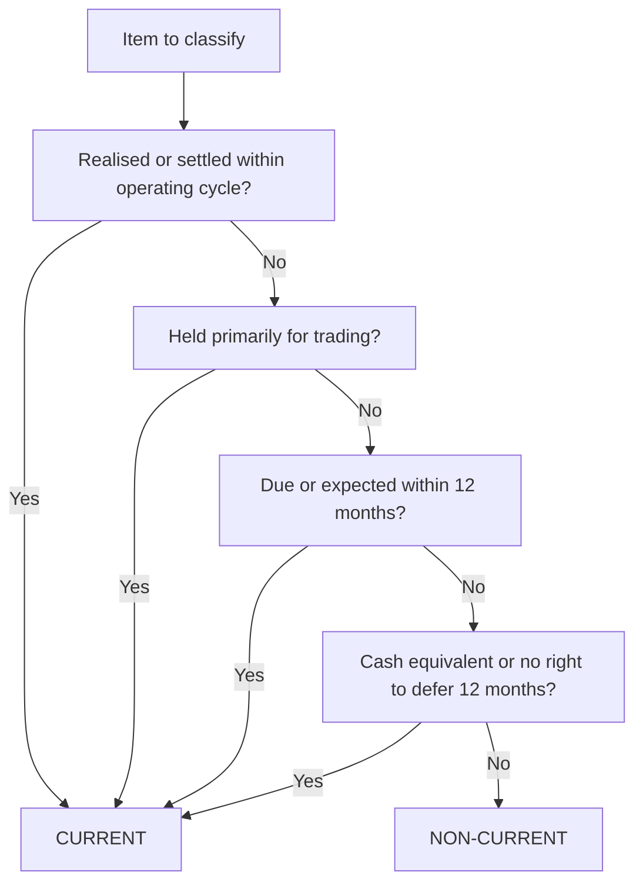
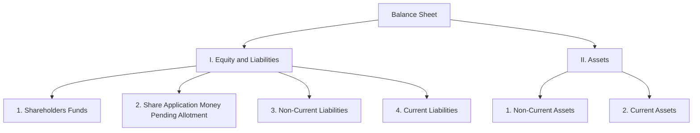
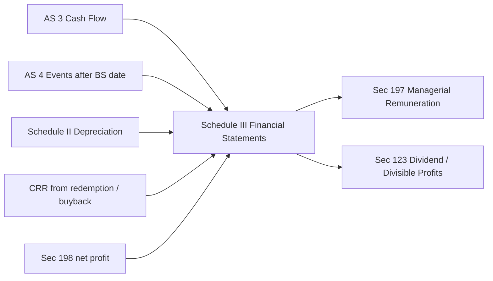

# Chapter 30 — Financial Statements of Companies (Schedule III)

## 1. The Problem

Imagine you are an investor deciding where to park ₹10 lakh. You pull the annual accounts of three companies. The first lists "Money owed to us" in one place. The second calls the same thing "Sundry Debtors" and buries it between fixed assets and cash. The third splits it into "Amounts due within a year" and "Long-term dues" but puts long-term dues *above* the buildings. Now try to answer one simple question across all three: *How much cash is likely to come in within the next 12 months?* You cannot. Not because the information is hidden, but because each company has arranged the same facts in a different order, under different names, with different groupings.

This is the core problem. A sole proprietor or a partnership can arrange its Balance Sheet however it likes — the only readers are the owners and maybe a banker who will ask questions directly. But a **company** is different. Its shareholders may number in the thousands, most of whom will never meet the directors. Its creditors, lenders, tax authorities, regulators, and potential acquirers all read the same document from a distance, with no ability to phone up and ask "what did you mean by this line?" The financial statements are the *only* channel of communication, and that channel must carry the same meaning to every reader.

If every company invented its own layout, three things break:

1. **Comparability dies.** You cannot compare Company A with Company B, nor Company A this year with Company A last year, if the shape of the statement keeps shifting.
2. **Completeness cannot be checked.** A reader has no way of knowing whether a company *omitted* something (say, contingent liabilities) if there is no standard checklist of what must appear.
3. **Manipulation becomes easy.** A company wanting to look liquid could quietly reclassify a long-term loan as "other liabilities" and shuffle it out of sight.

So the law steps in and says: *there will be one prescribed skeleton, and every company will hang its numbers on that skeleton.* That skeleton is **Schedule III to the Companies Act, 2013**. This chapter is about understanding *why* the skeleton has the exact bones it has, and then how to actually take a raw trial balance and drape a real company's figures over it — correctly, completely, and in a way that would pass an exam and an audit.

## 2. The Core Idea (Analogy)

Think of Schedule III as a **standardised shipping manifest**.

When cargo crosses international borders, every container is accompanied by a manifest with fixed columns in a fixed order: contents, weight, origin, destination, hazard class. A customs officer in Mumbai, Rotterdam, and Singapore can each read the *same form* and instantly find the *same fact* in the *same box*. Nobody has to learn a new form at each port. The manifest does not tell the shipper *what* to ship — that is the business's choice — it only tells them *how to describe* what they shipped so that any reader anywhere can decode it.

Schedule III is exactly this manifest for a company's financial position. It does not tell the company how much to earn or what assets to buy. It tells the company: *whatever your facts are, describe them in this order, under these headings, with this split between "will settle within a year" and "will settle later."* The genius of the manifest is the **current vs non-current split** — it is the customs officer's single most important sorting rule, because it answers the question every reader cares about most: *what is coming and going in the near term versus locked up for the long haul?*

Keep this analogy in your head for the whole chapter. Every time a rule feels arbitrary, ask: *what would a customs officer at a distant port need, in a fixed box, to trust this cargo without a phone call?*

## 3. Why It's Built This Way

Schedule III did not fall from the sky. Its structure is the answer to a sequence of "what does the distant reader need?" questions.

**Why a vertical format and not the old horizontal T-account?** The older Companies Act, 1956 permitted a horizontal Balance Sheet (liabilities on the left, assets on the right). Schedule III mandates the **vertical form** only. A vertical statement reads top-to-bottom like a narrative — sources of funds first (what the company owes to owners and outsiders), then application of funds (what it did with that money). It also allows a clean single column of previous-year figures right alongside, which the horizontal form handles clumsily.

**Why the "current vs non-current" classification instead of "fixed vs floating"?** The old law sorted assets into "fixed" and "current" using a vague notion of permanence. Schedule III replaces this with a **time-based test aligned to the operating cycle**. The distant reader's real question is about *timing of cash*: which assets will turn into cash within the next operating cycle, and which liabilities must be paid in that window? Sorting by time directly answers the solvency and liquidity question, which permanence never did cleanly.

**Why must the Notes carry so much?** Schedule III keeps the face of the Balance Sheet and P&L short — a handful of line items — and pushes all the detail into **Notes to Accounts**. This is deliberate. The face gives the customs officer the headline; the notes are the detailed packing list inside. A reader who only wants the big picture reads the face; a reader who wants to verify reads the notes. This separation of *summary* from *detail* is the second structural genius after the current/non-current split.

**Why does an Accounting Standard override Schedule III?** Schedule III itself contains a "General Instruction" stating that if a disclosure requirement of the **Companies Act or an Accounting Standard** is different from Schedule III, the Act/AS prevails, and Schedule III's requirements are *in addition*. The logic: Schedule III is a presentation template, but the *substance* of recognition and measurement lives in the Accounting Standards. Form must yield to substance. This is why, for example, AS 3 (Cash Flow) and AS 18 (Related Party) disclosures sit alongside Schedule III without conflict.

With the "why" established, we now install the actual bones.

## 4. Full Technical Content

### 4.1 What Schedule III covers and what "financial statements" means

Under **Section 2(40) of the Companies Act, 2013**, "financial statements" include:

- a **Balance Sheet** as at the end of the financial year;
- a **Statement of Profit and Loss** for the financial year;
- a **Cash Flow Statement** for the financial year (not required for a **One Person Company, small company, dormant company**, or a private company that qualifies as a startup);
- a **Statement of Changes in Equity**, if applicable (this is an Ind AS concept; under AS-based Schedule III Division I it is not a separate statement); and
- any explanatory notes.

**Section 129** requires financial statements to give a **true and fair view**, comply with the notified Accounting Standards, and be in the **form provided in Schedule III**. For CA Intermediate (AS regime, non-Ind-AS companies) the relevant part is **Division I of Schedule III**.

**Section 128** requires books of account to be kept on an accrual basis and the double-entry system. **Section 130/131** deal with re-opening and voluntary revision — out of scope here but worth knowing they exist.

### 4.2 The operating cycle — the master key

Everything in the Balance Sheet classification hinges on one definition.

> **Operating cycle** = the time between the acquisition of assets for processing and their realisation into cash or cash equivalents. Where the cycle cannot be identified, it is **assumed to be 12 months**.

An asset is **current** if it satisfies *any one* of these:

1. it is expected to be realised in, or is intended for sale or consumption in, the company's **normal operating cycle**; or
2. it is held **primarily for the purpose of trading**; or
3. it is expected to be realised **within 12 months** after the reporting date; or
4. it is **cash or cash equivalent** (unless restricted from being exchanged or used to settle a liability for at least 12 months after the reporting date).

**All other assets are non-current.**

A liability is **current** if *any one* holds:

1. it is expected to be settled in the **normal operating cycle**; or
2. it is held **primarily for trading**; or
3. it is due to be settled **within 12 months** after the reporting date; or
4. the company **does not have an unconditional right to defer settlement** for at least 12 months after the reporting date.

**All other liabilities are non-current.**


*Figure 1 — The single decision tree that classifies every asset and liability; satisfying any one branch makes the item current.*

### 4.3 Structure of the Balance Sheet (Division I)

The Balance Sheet has two grand totals that must be equal: **Total Equity and Liabilities = Total Assets**. Its skeleton, in mandatory order, is below. The number in brackets is the **Note number** where detail lives.

**I. EQUITY AND LIABILITIES**

1. **Shareholders' Funds**
   - (a) Share Capital
   - (b) Reserves and Surplus
   - (c) Money received against share warrants
2. **Share Application Money Pending Allotment**
3. **Non-Current Liabilities**
   - (a) Long-term Borrowings
   - (b) Deferred Tax Liabilities (Net)
   - (c) Other Long-term Liabilities
   - (d) Long-term Provisions
4. **Current Liabilities**
   - (a) Short-term Borrowings
   - (b) Trade Payables *(with sub-split: total dues of micro & small enterprises; and others)*
   - (c) Other Current Liabilities
   - (d) Short-term Provisions

**II. ASSETS**

1. **Non-Current Assets**
   - (a) Property, Plant and Equipment and Intangible Assets
     - (i) Property, Plant and Equipment (Tangible Assets)
     - (ii) Intangible Assets
     - (iii) Capital Work-in-Progress
     - (iv) Intangible Assets under Development
   - (b) Non-Current Investments
   - (c) Deferred Tax Assets (Net)
   - (d) Long-term Loans and Advances
   - (e) Other Non-Current Assets
2. **Current Assets**
   - (a) Current Investments
   - (b) Inventories
   - (c) Trade Receivables
   - (d) Cash and Cash Equivalents
   - (e) Short-term Loans and Advances
   - (f) Other Current Assets


*Figure 2 — The two grand divisions and their four/two major heads; the two grand totals must reconcile.*

### 4.4 Contents of key heads (the detail you must know)

**Share Capital note** must disclose, for each class:
- Number and amount of shares **authorised**, **issued**, **subscribed and fully paid**, and **subscribed but not fully paid**;
- par value per share;
- a **reconciliation** of the number of shares outstanding at the beginning and end of the year;
- rights, preferences and restrictions attaching to each class;
- shares held by each **shareholder holding more than 5%**;
- shares reserved for issue under options;
- for the last **5 years**: shares allotted for consideration other than cash, bonus shares, and shares bought back;
- **Calls unpaid** (showing separately amounts from directors and officers) shown as a deduction; **forfeited shares** amount shown separately.

**Reserves and Surplus** — classified as: Capital Reserve; Capital Redemption Reserve; Securities Premium; Debenture Redemption Reserve; Revaluation Reserve; Share Options Outstanding; Other Reserves (specify nature); and **Surplus** i.e. the balance in the Statement of Profit and Loss (showing allocations and appropriations such as dividend, transfer to reserves). A **debit balance of Surplus** (accumulated losses) is shown as a **negative figure under this head**, even if it makes Reserves and Surplus negative.

**Long-term Borrowings** — bonds/debentures, term loans (from banks / others), deferred payment liabilities, deposits, loans from related parties, long-term maturities of finance lease obligations. Must state **secured vs unsecured**, nature of security, terms of redemption/repayment, and **period and amount of any continuing default** in repayment of principal or interest as on the Balance Sheet date.

**Trade Payables / Trade Receivables** — a payable/receivable is "trade" only if it arises from the **purchase/sale of goods or services in the normal course of business**. Amounts due on any other account (e.g. sale of a fixed asset) are **not** trade and go under "Other" heads.

**Trade Receivables** must further disclose: aggregate **outstanding for more than six months** from the date they became due (separately), and be sub-classified as **secured/considered good**, **unsecured/considered good**, and **doubtful**, with the allowance for bad and doubtful debts shown. Receivables from directors/related parties disclosed separately.

**Cash and Cash Equivalents** — balances with banks; cheques/drafts on hand; cash on hand; others. Earmarked balances (e.g. unpaid dividend), balances held as **margin money or security** against borrowings, and **bank deposits with more than 12 months maturity** must each be disclosed separately.

**A critical current-vs-non-current carve-out:** the **current maturities of long-term debt** (the portion of a term loan repayable within 12 months) are shown under **Other Current Liabilities**, NOT under Short-term Borrowings and NOT under Long-term Borrowings. This trips up most students.

### 4.5 Structure of the Statement of Profit and Loss

The P&L is strictly vertical and arrives at profit through a fixed sequence:

| Line | Item |
|------|------|
| I | Revenue from Operations |
| II | Other Income |
| III | **Total Income (I + II)** |
| IV | Expenses: Cost of materials consumed; Purchases of stock-in-trade; Changes in inventories of finished goods, WIP and stock-in-trade; Employee benefits expense; Finance costs; Depreciation and amortisation expense; Other expenses |
| V | **Total Expenses** |
| VI | **Profit before exceptional and extraordinary items and tax (III − V)** |
| VII | Exceptional items |
| VIII | Profit before extraordinary items and tax (VI − VII) |
| IX | Extraordinary items |
| X | **Profit before tax (VIII − IX)** |
| XI | Tax expense: (1) Current tax (2) Deferred tax |
| XII | **Profit for the period from continuing operations (X − XI)** |
| XIII–XV | Profit/loss from discontinuing operations, its tax, and net |
| XVI | **Profit for the period** |
| XVII | Earnings per equity share: (1) Basic (2) Diluted |

Note the **"Changes in inventories"** line: it is computed as **Opening stock − Closing stock** of finished goods/WIP/stock-in-trade. A positive figure (stock fell) is an expense; a negative figure (stock rose) reduces expense. There is **no separate "opening stock" and "closing stock"** the way a proprietor's Trading Account shows them — Schedule III nets them into one line.

**Revenue from Operations** for a company **other than a finance company** = sale of products + sale of services + other operating revenues, **less** excise duty (historically). Broken up in the notes.

**Additional information required in notes to P&L** includes: value of imports on CIF basis (raw materials, components, capital goods); expenditure in foreign currency; earnings in foreign exchange; **auditor's remuneration** (as auditor, for taxation, for company law matters, for other services, reimbursements); and consumption of imported vs indigenous raw materials/stores with percentages.

### 4.6 Managerial Remuneration (Section 197) and Divisible Profits

Once profit is computed, two governance questions arise, and both are examinable:

**(a) How much can be paid to managers/directors?**

**Section 197** caps total managerial remuneration payable by a **public company** to its directors (including MD, WTD and manager) in any financial year at **11% of the net profits** of that year, computed under **Section 198**. Within that ceiling:

| Situation | Maximum remuneration |
|-----------|----------------------|
| Overall (all directors together) | 11% of net profits |
| One managing/whole-time director or manager | 5% of net profits |
| More than one such director | 10% of net profits (together) |
| Directors who are neither MD nor WTD — if there is a MD/WTD | 1% of net profits |
| Directors who are neither MD nor WTD — if there is no MD/WTD | 3% of net profits |

If profits are **inadequate or there is a loss**, remuneration may be paid per the limits in **Schedule V** (based on effective capital) — otherwise it requires shareholder approval. (Post the 2018 amendment, remuneration exceeding these limits requires only a **special resolution** of shareholders, not Central Government approval.)

**Net profit under Section 198** is a specially computed figure — it is *not* simply the P&L profit. The mechanics (know the direction of each adjustment):

- **Start** with profit as per P&L, then
- **Add back** (credit) items wrongly credited or to be excluded, and expenses allowed to be added back;
- **Do NOT credit** (i.e. exclude from income): profit on sale of undertaking/investments (capital nature), premium on shares/debentures, profit on forfeiture of shares, profit of a capital nature including profit on sale of fixed assets *above original cost*;
- **Deduct** (allow as expenses): usual working charges, directors' remuneration, bad debts written off, depreciation as per Section 123, etc.;
- **Do NOT deduct**: income tax, voluntary compensation/damages, capital losses, and — importantly — **the managerial remuneration itself is not deducted before applying the percentage** (the percentage is applied on profit *before* charging such remuneration).

A frequently-tested subtlety: **profit on sale of a fixed asset** is included in Section 198 profit only to the extent of the **write-back of depreciation / up to original cost**; any excess over original cost (a genuine capital profit) is **excluded**.

**(b) Out of what can dividend be paid? (Divisible profits)**

Dividend can be declared out of:
1. **profits of the current year** (after providing depreciation per Schedule II);
2. **accumulated past profits** transferred to reserves; or
3. **money provided by Central/State Government** for dividend under a guarantee.

Key guardrails under **Section 123**:
- Depreciation must be provided **before** declaring dividend.
- A company **may** (voluntarily — it is no longer mandatory since 2014) transfer a percentage of profits to reserves before dividend.
- Dividend out of **past reserves** in a year of inadequate profit is governed by the **Companies (Declaration and Payment of Dividend) Rules** — the rate cannot exceed the **average of the last three years' rates**, the amount drawn cannot exceed **1/10th (10%) of paid-up capital plus free reserves**, and the balance of reserves after withdrawal must not fall below **15% of paid-up share capital**.
- **Unpaid/unclaimed dividend** must be transferred to a **separate Unpaid Dividend Account within 7 days** after the 30-day payment window; amounts unclaimed for **7 years** go to the **Investor Education and Protection Fund (IEPF)**.

### 4.7 The workflow: from trial balance to Schedule III statements


*Figure 3 — The preparation pipeline; every adjustment has a dual effect that must land in two places.*

The discipline that avoids errors: **every adjustment hits two places** (a P&L effect and a Balance Sheet effect, or two Balance Sheet effects). Closing stock appears once as a deduction in "Changes in inventories" (P&L) and once as Inventories (current asset). Outstanding salary appears once as an expense addition and once as "Other Current Liabilities." Miss one leg and the grand totals will not reconcile — which is precisely the built-in check.

## 5. Worked Examples

### Example 1 — Warm-up: classify these items

Classify each into its Schedule III main head and sub-head, and mark current (C) or non-current (NC).

| Item | Head / Sub-head | C/NC |
|------|-----------------|------|
| Securities Premium | Shareholders' Funds → Reserves and Surplus | — |
| Provision for tax | Current Liabilities → Short-term Provisions | C |
| 10% Debentures redeemable after 5 years | Non-Current Liabilities → Long-term Borrowings | NC |
| Term loan instalment due next year | Current Liabilities → Other Current Liabilities (current maturities of long-term debt) | C |
| Loose tools | Current Assets → Inventories | C |
| Goodwill | Non-Current Assets → Intangible Assets | NC |
| Bank overdraft | Current Liabilities → Short-term Borrowings | C |
| Unclaimed dividend | Current Liabilities → Other Current Liabilities | C |
| Calls-in-arrears | Deduction from Subscribed Capital (Share Capital note) | — |
| Prepaid insurance | Current Assets → Other Current Assets | C |
| Advance to supplier for raw material | Current Assets → Short-term Loans and Advances | C |
| Debit balance of Statement of P&L | Reserves and Surplus (shown as negative Surplus) | — |

**Teaching point:** the term-loan instalment and the debentures come from the *same* kind of borrowing, yet split across current and non-current. That split is the whole point of Schedule III — it answers "what must I pay within a year?"

### Example 2 — Building a simple Balance Sheet from adjusted balances

Sunrise Ltd (authorised capital 1,00,000 equity shares of ₹10 each) has these balances after all adjustments (₹):

| Debit balances | ₹ | Credit balances | ₹ |
|---|---|---|---|
| Land & Building | 6,00,000 | Equity Share Capital (60,000 shares of ₹10) | 6,00,000 |
| Plant & Machinery | 3,00,000 | General Reserve | 1,50,000 |
| Inventories | 1,80,000 | Surplus (P&L balance) | 1,90,000 |
| Trade Receivables | 1,40,000 | 12% Debentures (redeemable 2032) | 2,00,000 |
| Cash & Bank | 70,000 | Trade Payables | 1,20,000 |
| Short-term Loans & Advances | 40,000 | Provision for Tax | 40,000 |
| | | Outstanding Expenses | 30,000 |
| **Total** | **13,30,000** | **Total** | **13,30,000** |

**Balance Sheet of Sunrise Ltd as at 31 March 2026**

| Particulars | Note | ₹ |
|---|---|---|
| **I. EQUITY AND LIABILITIES** | | |
| 1. Shareholders' Funds | | |
| (a) Share Capital | 1 | 6,00,000 |
| (b) Reserves and Surplus | 2 | 3,40,000 |
| 2. Non-Current Liabilities | | |
| (a) Long-term Borrowings | 3 | 2,00,000 |
| 3. Current Liabilities | | |
| (a) Trade Payables | | 1,20,000 |
| (b) Other Current Liabilities | 4 | 30,000 |
| (c) Short-term Provisions | 5 | 40,000 |
| **Total** | | **13,30,000** |
| **II. ASSETS** | | |
| 1. Non-Current Assets | | |
| (a) Property, Plant and Equipment | 6 | 9,00,000 |
| 2. Current Assets | | |
| (a) Inventories | | 1,80,000 |
| (b) Trade Receivables | | 1,40,000 |
| (c) Cash and Cash Equivalents | | 70,000 |
| (d) Short-term Loans and Advances | | 40,000 |
| **Total** | | **13,30,000** |

Note 2 (Reserves and Surplus) = General Reserve 1,50,000 + Surplus 1,90,000 = **3,40,000**. Note 6 (PPE) = Land & Building 6,00,000 + Plant & Machinery 3,00,000 = **9,00,000**. Both sides total **₹13,30,000** — reconciled.

**Teaching point:** because these opening balances are already *adjusted real accounts only* (no nominal/revenue/expense ledgers left to close), the Balance Sheet total equals the trial balance total. That is a special case. The moment a trial balance still contains nominal accounts (Example 3), those collapse into a single Surplus figure and the Balance Sheet total will differ from the TB total — so never force the Balance Sheet to the TB total; let the classified structure produce its own total and check it balances.

### Example 3 — Exam-hard: full preparation from trial balance with adjustments

**Trial Balance of Meridian Ltd as at 31 March 2026** (Authorised capital: 2,00,000 equity shares of ₹10 each)

| Particulars | Dr (₹) | Cr (₹) |
|---|---|---|
| Equity Share Capital (1,50,000 shares of ₹10, fully paid) | | 15,00,000 |
| 10% Debentures (redeemable 2030) | | 5,00,000 |
| General Reserve | | 2,00,000 |
| Surplus (opening credit balance) | | 1,10,000 |
| Securities Premium | | 1,50,000 |
| Land & Building (cost) | 12,00,000 | |
| Plant & Machinery (cost) | 8,00,000 | |
| Accumulated Depreciation (1 Apr 2025) | | 3,00,000 |
| Furniture | 1,20,000 | |
| Purchases | 18,00,000 | |
| Sales | | 32,00,000 |
| Opening Inventory | 2,60,000 | |
| Wages | 3,40,000 | |
| Salaries | 2,20,000 | |
| Trade Receivables | 4,80,000 | |
| Trade Payables | | 3,10,000 |
| Cash & Bank | 9,60,000 | |
| Interest on Debentures (paid, half year) | 25,000 | |
| Rent | 90,000 | |
| Provision for Doubtful Debts (opening) | | 20,000 |
| Bank Loan (repayable 2028) | | 2,00,000 |
| Advance Tax paid | 1,00,000 | |
| Bills Receivable | 55,000 | |
| Miscellaneous Expenses | 40,000 | |
| **Total** | **64,90,000** | **64,90,000** |

**Adjustments:**
1. Closing inventory ₹3,80,000.
2. Depreciate Land & Building at 5% and Plant & Machinery at 10% on cost. Furniture at 10%.
3. Provide the remaining half-year's interest on 10% Debentures (₹25,000 outstanding).
4. Write off bad debts ₹30,000; maintain Provision for Doubtful Debts at 5% of Trade Receivables (after bad-debt write-off).
5. Outstanding wages ₹20,000; prepaid rent ₹15,000.
6. Provide for tax ₹1,60,000.
7. The Board proposes a dividend of 8% on equity capital. (Proposed dividend, per AS 4 revised, is a **non-adjusting event** and is **disclosed in notes**, not provided as a liability. Advance tax remains an asset; tax provision is a separate liability.)

---

**Step A — Work out the adjustment effects.**

*Depreciation for the year:*
- Land & Building: 5% × 12,00,000 = 60,000
- Plant & Machinery: 10% × 8,00,000 = 80,000
- Furniture: 10% × 1,20,000 = 12,000
- **Total depreciation = 1,52,000**
- Accumulated depreciation carried forward = 3,00,000 (opening) + 1,52,000 = **4,52,000**

*Debenture interest:* 10% × 5,00,000 = 50,000 for the year; 25,000 paid, so **25,000 outstanding** (finance cost 50,000 total; outstanding shown as Other Current Liability).

*Bad debts / provision:*
- Trade Receivables 4,80,000 − bad debts 30,000 = **4,50,000** net receivable.
- Provision required = 5% × 4,50,000 = **22,500**.
- Opening provision 20,000 → charge to P&L = bad debts 30,000 + (22,500 − 20,000 increase) = 30,000 + 2,500 = **32,500**.

*Wages:* 3,40,000 + outstanding 20,000 = **3,60,000**; outstanding wages 20,000 is Other Current Liability.

*Rent:* 90,000 − prepaid 15,000 = **75,000** expense; prepaid 15,000 is Other Current Asset.

*Changes in inventories:* Opening 2,60,000 − Closing 3,80,000 = **(1,20,000)** — a negative expense (stock rose), reducing total expenses. Closing inventory 3,80,000 is a current asset.

---

**Step B — Statement of Profit and Loss for the year ended 31 March 2026**

| Particulars | Note | ₹ |
|---|---|---|
| I. Revenue from Operations | | 32,00,000 |
| II. Other Income | | — |
| **III. Total Income** | | **32,00,000** |
| IV. Expenses: | | |
| Purchases of Stock-in-Trade | | 18,00,000 |
| Changes in Inventories | 8 | (1,20,000) |
| Employee Benefits Expense (Wages 3,60,000 + Salaries 2,20,000) | 9 | 5,80,000 |
| Finance Costs (Debenture interest) | 10 | 50,000 |
| Depreciation and Amortisation | | 1,52,000 |
| Other Expenses | 11 | 1,47,500 |
| **V. Total Expenses** | | **26,09,500** |
| **VI. Profit before Tax (III − V)** | | **5,90,500** |
| VII. Tax Expense — Current tax | | 1,60,000 |
| **VIII. Profit for the period** | | **4,30,500** |

*Note 11 (Other Expenses):* Rent 75,000 + Bad debts and provision 32,500 + Miscellaneous 40,000 = **1,47,500** (wages and salaries sit in Employee Benefits, not here).

**Cross-check of Total Expenses:** Purchases 18,00,000 + Changes in inventories (1,20,000) + Employee benefits 5,80,000 + Finance cost 50,000 + Depreciation 1,52,000 + Other expenses 1,47,500 = **26,09,500**. Profit before tax = 32,00,000 − 26,09,500 = **5,90,500**; less current tax 1,60,000 = **Profit for the period 4,30,500**.

*Independent check (Trading-style):* Gross profit = Sales 32,00,000 − COGS (Opening 2,60,000 + Purchases 18,00,000 − Closing 3,80,000 = 16,80,000) = 15,20,000. Less other expenses (Wages 3,60,000 + Salaries 2,20,000 + Interest 50,000 + Depreciation 1,52,000 + Rent 75,000 + Bad debts/provision 32,500 + Misc 40,000 = 9,29,500) = PBT 5,90,500. Same figure — the profit is confirmed.

---

**Step C — Surplus roll-forward**

| Surplus (Statement of P&L) | ₹ |
|---|---|
| Opening balance | 1,10,000 |
| Add: Profit for the period | 4,30,500 |
| **Closing balance (before appropriations)** | **5,40,500** |

Proposed dividend (8% × 15,00,000 = 1,20,000) is **not** deducted here — under revised AS 4 it is a non-adjusting event, disclosed in notes only. So closing Surplus carried to Balance Sheet = **₹5,40,500**.

---

**Step D — Balance Sheet of Meridian Ltd as at 31 March 2026**

| Particulars | Note | ₹ |
|---|---|---|
| **I. EQUITY AND LIABILITIES** | | |
| 1. Shareholders' Funds | | |
| (a) Share Capital | 1 | 15,00,000 |
| (b) Reserves and Surplus | 2 | 8,90,500 |
| 2. Non-Current Liabilities | | |
| (a) Long-term Borrowings | 3 | 7,00,000 |
| 3. Current Liabilities | | |
| (a) Trade Payables | | 3,10,000 |
| (b) Other Current Liabilities | 4 | 45,000 |
| (c) Short-term Provisions | 5 | 1,60,000 |
| **Total** | | **36,05,500** |
| **II. ASSETS** | | |
| 1. Non-Current Assets | | |
| (a) Property, Plant and Equipment | 6 | 16,68,000 |
| 2. Current Assets | | |
| (a) Inventories | | 3,80,000 |
| (b) Trade Receivables | 7 | 4,27,500 |
| (c) Cash and Cash Equivalents | | 9,60,000 |
| (d) Short-term Loans and Advances (Advance tax) | | 1,00,000 |
| (e) Other Current Assets (Bills Receivable 55,000 + Prepaid rent 15,000) | | 70,000 |
| **Total** | | **36,05,500** |

**Both grand totals = ₹36,05,500 — the Balance Sheet reconciles.** Two verification habits made this safe: (i) the *same* Profit for the period (₹4,30,500) that appears on the P&L is the figure added to Surplus below; and (ii) every adjustment landed on the sheet with both legs (e.g. depreciation reduced PPE and hit the P&L; outstanding wages became a current liability and raised the expense). If your two totals ever differ, do not plug a Suspense figure — re-check each note total and each adjustment's second leg.

**Supporting notes:**

- *Note 1 — Share Capital:* Authorised 2,00,000 equity shares of ₹10 = 20,00,000; Issued, subscribed and fully paid 1,50,000 shares of ₹10 = **15,00,000**.
- *Note 2 — Reserves and Surplus:* General Reserve 2,00,000 + Securities Premium 1,50,000 + Surplus (opening 1,10,000 + profit 4,30,500) 5,40,500 = **8,90,500**.
- *Note 3 — Long-term Borrowings:* 10% Debentures 5,00,000 (secured) + Bank Loan 2,00,000 = **7,00,000**.
- *Note 4 — Other Current Liabilities:* Outstanding debenture interest 25,000 + Outstanding wages 20,000 = **45,000**.
- *Note 5 — Short-term Provisions:* Provision for tax **1,60,000**.
- *Note 6 — PPE:* Gross 21,20,000 (L&B 12,00,000 + P&M 8,00,000 + Furniture 1,20,000) − Accumulated depreciation 4,52,000 = **16,68,000**.
- *Note 7 — Trade Receivables:* Gross 4,80,000 − bad debts 30,000 − provision 22,500 = **4,27,500** (all considered good, unsecured; none over six months).

**Disclosure (not provided as liability):** The Board has proposed dividend @ 8% on equity capital = ₹1,20,000, subject to member approval — disclosed under "proposed dividend" per revised AS 4; not recognised as a liability at year end.

**Teaching point — the self-check is the whole discipline.** When your two totals do not agree in the exam hall, run this drill: (1) verify each note total, (2) confirm the *same* profit flows into Surplus, (3) confirm every adjustment's *second leg* is on the sheet, (4) if it still fails, a source figure is mis-stated. Never plug the difference into "Suspense" in a company Balance Sheet.

## 6. Presentation & Disclosure Formats

**Rounding-off (Schedule III General Instruction):** where turnover is **less than ₹100 crore**, figures may be rounded to the nearest **hundreds, thousands, lakhs or millions**; where turnover is **₹100 crore or more**, to the nearest **lakhs, millions or crores**. The **same unit** must be used throughout.

**Comparatives:** every line item must show the **corresponding figure for the immediately preceding reporting period**, including in the notes. A new Schedule III addition requires that if a company changes the presentation, the previous year is reclassified with an explanation.

**Cross-referencing:** each line on the face of the Balance Sheet / P&L carries a **note number**; the note repeats the head, gives the current and previous year figures, and its total ties exactly to the face.

**Skeleton Notes format (illustrative):**

```
Note 2 — Reserves and Surplus                As at 31.03.26   As at 31.03.25
  Capital Redemption Reserve                       xxx            xxx
  Securities Premium                               xxx            xxx
  General Reserve
    Opening balance                                xxx
    Add: transfer from surplus                     xxx            xxx
  Surplus (Statement of Profit and Loss)
    Opening balance                                xxx
    Add: Profit for the period                     xxx
    Less: Appropriations (dividend, transfers)    (xxx)           xxx
  Total                                            ===            ===
```

**Additional mandated disclosures (a checklist):**
- **Contingent liabilities and commitments** (to the extent not provided for): claims against the company not acknowledged as debts; guarantees; other money for which the company is contingently liable; estimated capital commitments; other commitments — **disclosed in notes, not on the face**.
- **Dividends proposed** (post AS 4 revision) — disclosed, not provided.
- **Arrears of fixed cumulative dividends** on preference shares.
- **Value of imports (CIF), foreign currency expenditure and earnings.**
- **Auditor's remuneration** split by service.
- **Related party disclosures** (AS 18), **segment disclosures** (AS 17), **leases** (AS 19), **EPS** (AS 20) — driven by the respective Accounting Standard but presented within these financial statements.

## 7. Connections

Schedule III is the terminal where almost every other Advanced Accounting topic arrives:

- **AS 4 (Events after the Balance Sheet date)** decides that **proposed dividend is not a liability** — directly changing what appears under Short-term Provisions.
- **AS 3 (Cash Flow Statement)** is the third mandatory statement for non-small companies; its closing cash ties to "Cash and Cash Equivalents."
- **Schedule II (Depreciation)** feeds the depreciation line and accumulated depreciation in PPE.
- **Redemption of Preference Shares / Buy-back** create **Capital Redemption Reserve**, shown under Reserves and Surplus.
- **Debentures** and their **Debenture Redemption Reserve** sit in borrowings and reserves respectively; current maturities move to Other Current Liabilities.
- **Bonus issue** and **rights issue** change Share Capital and Securities Premium and require the 5-year disclosure in the Share Capital note.
- **Section 198 net profit** links the P&L to **managerial remuneration** and to **divisible profits / dividend** decisions.
- **Amalgamation and internal reconstruction** ultimately present the merged entity's position in this very format.


*Figure 4 — Schedule III as the convergence point of standards and provisions, and the launchpad for remuneration and dividend decisions.*

## 8. Traps & Examiner Tricks

1. **Current maturities of long-term debt** go to **Other Current Liabilities**, never to Short-term Borrowings or Long-term Borrowings. Examiners love a term loan with an instalment due next year.
2. **Proposed dividend** — post revised AS 4, do **not** create a provision; **disclose** in notes. Old textbooks (and habit) will tempt you to deduct it from Surplus and show it as a current liability. Wrong under current law.
3. **Calls-in-arrears** are a **deduction from Subscribed Capital**, not an asset. **Calls-in-advance** are a liability (Other Current Liabilities), not capital.
4. **Debit balance of Surplus (accumulated loss)** is shown as a **negative figure under Reserves and Surplus** — never as an asset ("Miscellaneous Expenditure not written off" was the old, now-abolished treatment).
5. **Trade vs non-trade:** amount receivable on **sale of a fixed asset** is NOT a Trade Receivable; it is "Other Current/Non-Current Assets." Same for a payable on purchase of machinery.
6. **Loose tools, stores and spares, packing material** are **Inventories**, not PPE.
7. **Provision for tax vs Advance tax / TDS** — do not net them unless the question says a right of set-off exists; show provision under Short-term Provisions and advance tax under Short-term Loans and Advances.
8. **Section 198 profit ≠ P&L profit.** Do not apply the 11%/5% remuneration cap on the reported net profit; recompute per Section 198 (exclude capital profits, add back the remuneration itself before applying the percentage).
9. **Profit on sale of fixed asset** enters Section 198 only up to **original cost** (i.e. depreciation write-back); the capital-profit excess is excluded.
10. **Bank overdraft / cash credit** = Short-term Borrowings (current), even though it may roll over for years — because there is no unconditional right to defer.
11. **Securities Premium** can only be used for the purposes in **Section 52** (bonus shares, writing off preliminary expenses / share issue expenses, premium on redemption of debentures/preference shares, buy-back). It is **not a free reserve** available for dividend.
12. **Rounding:** using two different units in the same set of statements is a presentation error; the threshold turns on turnover (₹100 crore).
13. **Same profit both sides:** the number added to Surplus on the Balance Sheet must be exactly the "Profit for the period" on the P&L. A mismatch is the number-one cause of a non-balancing sheet.

## 9. First-Principles Recap

Strip everything away and rebuild it from the single problem: *thousands of distant readers must extract the same facts from every company with no ability to ask questions.* From that one constraint, the entire chapter follows by necessity:

- Because readers are distant and many → a **prescribed, uniform format** (Schedule III) so the same fact lives in the same box everywhere.
- Because the deepest question is *timing of cash* → a **current vs non-current** split governed by the **operating cycle / 12-month** test.
- Because a headline and the fine print serve different readers → a **short face** plus **detailed Notes**.
- Because substance beats form → **Accounting Standards and the Act override** the template where they differ.
- Because managers and owners draw money out of the company → **Section 197** caps remuneration (on **Section 198** profit) and **Section 123** governs the **divisible profit** available for dividend, with reserves and depreciation as gatekeepers.
- Because every transaction has two effects → the statements **self-check**: the two grand totals must reconcile, and the profit must be identical on both statements.

If you remember only the constraint and the two-legged self-check, you can reconstruct every rule rather than recall it.

## 10. Quick-Revision Sheet

**Statements (Sec 2(40)):** Balance Sheet + Statement of P&L + Cash Flow (except OPC/small/dormant) + notes. True and fair view (Sec 129), Schedule III Division I form (AS regime).

**Balance Sheet order — Equity & Liabilities:** Shareholders' Funds (Share Capital; Reserves & Surplus; Warrants) → Share Application Money Pending Allotment → Non-Current Liabilities (Long-term Borrowings; DTL net; Other LT Liab; LT Provisions) → Current Liabilities (Short-term Borrowings; Trade Payables; Other Current Liab; Short-term Provisions).

**Balance Sheet order — Assets:** Non-Current (PPE & Intangibles incl. CWIP; Non-Current Investments; DTA net; LT Loans & Advances; Other NCA) → Current (Current Investments; Inventories; Trade Receivables; Cash & Cash Equivalents; ST Loans & Advances; Other CA).

**Current test (any one):** within operating cycle / held for trading / due within 12 months / cash equivalent (assets) or no unconditional right to defer 12 months (liabilities). Operating cycle unknown → **12 months**.

**P&L sequence:** Revenue from Operations + Other Income = Total Income; less Expenses (Materials consumed; Purchases; **Changes in inventories = Opening − Closing**; Employee benefits; Finance costs; Depreciation; Other) = PBT before exceptional/extraordinary; ± exceptional/extraordinary → PBT; less tax (current + deferred) → Profit for the period; then EPS.

**Key placements:** current maturities of LT debt → **Other Current Liabilities**; calls-in-arrears → deduct from capital; calls-in-advance → OCL; accumulated loss → negative Surplus; loose tools → Inventories; unclaimed dividend → OCL; bank OD → Short-term Borrowings.

**Managerial remuneration (Sec 197, public co.):** overall **11%**; one MD/WTD **5%**; more than one **10%**; other directors **1%** (with MD) / **3%** (without). On **Section 198** profit (exclude capital profits; add back remuneration itself; profit on sale of asset only up to original cost). Excess → **special resolution**; inadequate profit → **Schedule V**.

**Dividend (Sec 123):** out of current profit (after depreciation) / accumulated reserves / govt money. Inadequate-profit dividend from reserves: rate ≤ 3-yr average; draw ≤ **10% of paid-up + free reserves**; residual reserve ≥ **15% of paid-up capital**. Unpaid dividend → separate account in **7 days**; unclaimed **7 years** → **IEPF**. Proposed dividend → **disclose only** (AS 4).

**Disclosures to never forget:** contingent liabilities & commitments; shareholders holding >5%; 5-year history of bonus/other-than-cash/buy-back shares; receivables > 6 months; default in loan repayment; auditor's remuneration; CIF imports and foreign currency dealings; rounding-off (₹100 crore threshold); comparatives for every line.

**Golden self-check:** the profit added to Surplus (Balance Sheet) = Profit for the period (P&L); every adjustment has two legs; the two grand totals **must** be equal — no Suspense in a company Balance Sheet.
