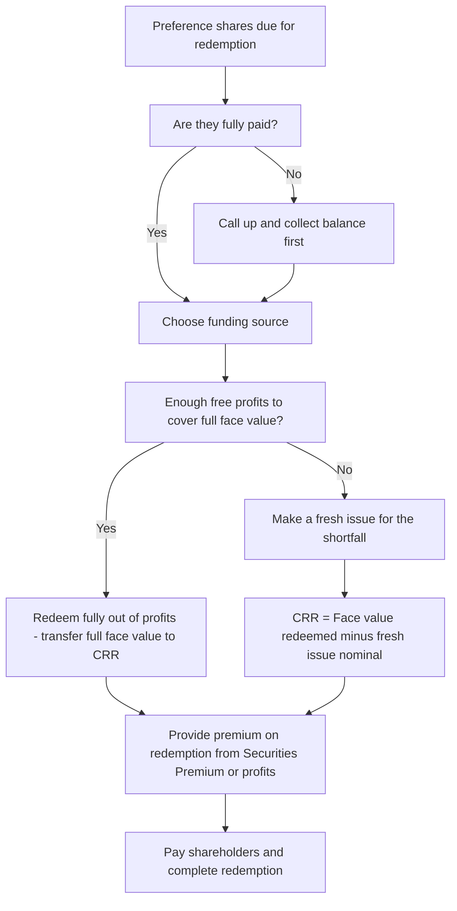
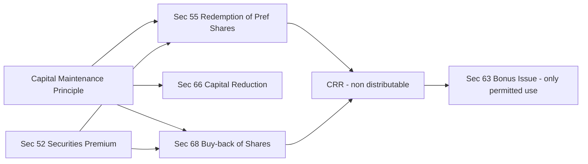

# Chapter 31 — Redemption of Preference Shares

## 1. The Problem

A company issued 10,000 preference shares of ₹100 each some years ago to raise ₹10,00,000. Preference shares are a strange animal: they behave like debt (fixed dividend, first claim on repayment) but they legally sit inside **share capital**. Now the promised redemption date has arrived and the company wants to pay these shareholders back their ₹10,00,000 and send them on their way.

Here is the tension. A creditor who lent the company money can be repaid freely — that is what a loan is. But **share capital is not a loan**. Share capital is the permanent buffer that stands between the company and its creditors. Trade creditors, bankers, and debenture-holders extended credit partly *because* they could see ₹10,00,000 of capital that shareholders had locked in and could not simply walk away with. That locked-in capital is the creditors' security cushion.

If the company is now allowed to hand ₹10,00,000 of that cushion back to preference shareholders, the creditors' security silently shrinks. Total assets fall by ₹10,00,000 (cash goes out), and the buffer protecting creditors evaporates. The preference shareholders — who ranked *above* equity shareholders — get out whole, while the company's remaining creditors are left with a thinner safety net than they bargained for.

So the real problem is not "how do we cut a cheque." The problem is: **how do we let preference shareholders exit without secretly picking the creditors' pockets?** The law's answer is a beautifully engineered piece of accounting machinery. This chapter is about understanding that machine so well that you can rebuild it from scratch in the exam, rather than memorising a list of conditions you don't understand.

## 2. The Core Idea (analogy)

Think of a company's balance sheet as a **dam**. On one side is the reservoir of assets. The dam wall has a marked line called "**capital**" — a legal minimum water level below which the company is not allowed to release water to shareholders. Creditors camp downstream trusting that the water will never fall below that line without their consent.

Preference shareholders are like a group of people who put water *into* the reservoir and now want their water back. If we just open a gate and let their water flow out, the reservoir level drops below the capital line — the creditors' guarantee is broken.

The law's trick is the **lock-and-refill rule**:

- You may release the preference shareholders' water **only if** you *either* (a) simultaneously pour in **new water** from a fresh share issue, *or* (b) release water that is genuinely **surplus** — profits available for dividend, i.e. water sitting *above* the capital line that could legally have been drained away as dividend anyway.
- And crucially, if you drain surplus (profit) water, you must **build the dam wall higher by the same amount** so the marked "capital" line rises to compensate. That wall-raising is the **Capital Redemption Reserve (CRR)**.

The CRR is the heart of the whole scheme. It is a paper wall built out of profits that says: "We took ₹10,00,000 of redeemable capital off the books, but we have replaced it with ₹10,00,000 of an equally undistributable reserve." The creditors' cushion is preserved to the last rupee. Nothing left the protected zone on a net basis — capital was *substituted*, not *reduced*.

## 3. Why It's Built This Way

Every design choice in Section 55 falls out of the single principle of **capital maintenance**: *the capital contributed by members must be maintained intact for the protection of creditors and may not be returned to members except through legally supervised procedures.*

Normally, returning capital to shareholders requires the heavy machinery of a **capital reduction** (Section 66) — a Tribunal-supervised process with creditor objections, or a court-supervised **buy-back** regime (Section 68). Those exist precisely because giving capital back to members is dangerous.

Redemption of preference shares is a **standing, pre-authorised exception** to this. The legislature said: "We will let you redeem preference shares *without* going to the Tribunal, *provided* you follow a self-enforcing recipe that automatically keeps the creditors' cushion intact." Section 55 *is* that recipe. Understand it as "capital reduction made safe enough to do without a court" and every rule becomes obvious:

- **Redeem only fully paid shares** → you can't return capital that was never fully contributed; a partly-paid share still owes the company money.
- **Redeem only out of profits or a fresh issue** → the two sources are the only two ways to redeem *without* net-shrinking the capital cushion. Fresh issue literally refills. Profits are, by definition, the distributable surplus above the capital line.
- **Create CRR when redeeming out of profits** → this is the "raise the wall" step that converts distributable profit into non-distributable reserve, plugging the exact hole the redemption created.
- **CRR can be used only for bonus shares** → once you have converted profit into a capital-like reserve to protect creditors, you must not let it leak back out as dividend. The only permitted exit is turning it into fully paid bonus *shares* — which keeps it locked inside capital forever.

This is why the topic is conceptually elegant rather than arbitrary. It is a closed accounting loop designed so that `Capital + Non-distributable reserves` never falls, no matter how the redemption is financed.

## 4. Full Technical Content

### 4.1 What may be redeemed and the ban on irredeemable preference shares

Under **Section 55(1) of the Companies Act, 2013**, a company limited by shares **cannot issue irredeemable preference shares** (i.e., preference shares that are never repayable). Under **Section 55(2)**, a company may issue redeemable preference shares that are **liable to be redeemed within a period not exceeding 20 years** from the date of issue.

- **Exception (infrastructure projects):** A company engaged in setting up and dealing with infrastructural projects may issue preference shares redeemable **beyond 20 years but not exceeding 30 years**, subject to redemption of a minimum 10% of such shares per year from the 21st year onwards (on a proportionate basis) at the option of the shareholders. *(Confirm the exact 10%/proportionate wording in current ICAI material, as rules are periodically updated.)*
- Redeemable preference shares may be redeemed at **par** or at a **premium**.

### 4.2 The three conditions of Section 55(2)

Redemption is subject to the following mandatory conditions:

| # | Condition | Reason (first principles) |
|---|-----------|---------------------------|
| 1 | **Only fully paid-up** preference shares may be redeemed. | You cannot return capital not yet fully contributed. |
| 2 | Redemption must be **out of profits available for dividend**, **or out of the proceeds of a fresh issue** of shares made *for the purposes of redemption*. | These are the only two funding sources that keep the capital cushion intact. |
| 3 | Where redeemed **out of profits**, a sum equal to the **nominal (face) value** of shares redeemed must be transferred to the **Capital Redemption Reserve (CRR)**. | Substitutes the vanished capital with an equal undistributable reserve. |

### 4.3 The Capital Redemption Reserve (CRR)

**Amount to transfer to CRR = Nominal value of preference shares redeemed − Nominal value of fresh equity/preference shares issued for the purpose of redemption.**

In words: CRR plugs *only the part of the face value that was NOT refilled by a fresh issue*. If the entire redemption is financed by a fresh issue of equal face value, CRR is nil (the wall was refilled directly). If none is financed by fresh issue, CRR equals the full face value redeemed.

- CRR is created by transferring from **free reserves / distributable profits** (e.g., General Reserve, Surplus in Statement of P&L, Dividend Equalisation Reserve).
- **Securities Premium** and **Capital Reserve** are *not* free profits available for dividend and therefore **cannot** be used to create CRR.
- **Use of CRR:** By **Section 55(4)** read with **Section 63**, CRR may be used **only** for issuing **fully paid bonus shares** to members. It is treated as paid-up share capital for this purpose. It cannot be used to pay dividends, write off losses, or write off expenses.

The CRR is, in effect, a statutory quarantine: profits that could have been paid out as dividend are permanently locked into a capital-equivalent reserve, so the redemption does not net-reduce the protected fund.

### 4.4 Premium payable on redemption

If shares are redeemed at a premium, that premium must be **provided for** (found) before redemption. The premium is **not** part of the CRR computation (CRR only covers *nominal* value). Sources for premium on redemption:

- **Securities Premium Account** (permitted by Section 52 for this purpose), and/or
- **Profit & Loss Account / free reserves.**

**Order/preference in practice:** Companies typically use Securities Premium first (as it is otherwise restricted-use), then free profits. However, note the important distinction between this topic and debentures. For **preference shares**, the Companies Act 2013 permits Securities Premium to be applied towards premium on redemption of preference shares under Section 52(2)(d)... *(Note: Section 52(2)(d) references premium on redemption of preference shares/debentures — confirm the exact clause wording in current ICAI study material, as there has been examiner debate on whether premium on redemption of preference shares must come only from profits for certain company types.)*

For the CA Intermediate exam, the standard treatment is: **Premium on redemption of preference shares can be met out of Securities Premium Account and/or Profit & Loss (free reserves).**

### 4.5 The minimum fresh issue calculation

This is the single most tested computation. The exam asks: *"What is the minimum amount of fresh shares the company must issue to carry out the redemption?"*

You need fresh issue when **profits available for redemption are insufficient** to fully back the redemption. The logic is a resource-balancing exercise.

**Step 1 — Identify the total funds needed at face value = Nominal value of preference shares to be redeemed.**

**Step 2 — Identify profits *available* for creating CRR** (free reserves + P&L surplus that management is willing/able to use). Note: money earmarked for premium on redemption reduces the profit pool if premium is met from profits.

**Step 3 — The governing identity:**

> **Nominal value redeemed = Fresh issue (nominal) + CRR (from profits)**

Because CRR is capped by the profits actually available:

> **Minimum fresh issue (nominal) = Nominal value redeemed − Profits available for CRR**

**Step 4 — Adjust for issue price.** If fresh shares are issued at a premium, the *nominal* value drives the CRR/redemption identity, but the *cash raised* = nominal + premium. If issued at a premium, you need fewer shares to raise a given amount of cash — but for the face-value substitution identity, always work with **nominal** value first, then convert to number of shares / cash as asked.

**Cash-sufficiency cross-check:** The company must also have enough *cash* to actually pay the redemption amount (face + premium). Sometimes the binding constraint is cash, not the CRR identity. Always verify the bank balance can absorb: `Cash out = Redemption amount (face + premium)` and `Cash in = Fresh issue proceeds (nominal + premium on new issue)`.

### 4.6 Complete set of journal entries

Below is the master template. Not every entry appears in every problem — pick the ones the facts require.

**(a) If any preference shares are not yet fully called/paid — make them fully paid first** (only fully paid shares are redeemable):

```
Preference Share Final Call A/c        Dr.
   To Preference Share Capital A/c
Bank A/c                               Dr.
   To Preference Share Final Call A/c
```

**(b) Fresh issue of shares for the purpose of redemption:**

At par:
```
Bank A/c                               Dr.   [nominal]
   To Equity/Preference Share Capital A/c    [nominal]
```

At premium:
```
Bank A/c                               Dr.   [nominal + premium]
   To Equity/Preference Share Capital A/c    [nominal]
   To Securities Premium A/c                 [premium]
```

**(c) Amount due to preference shareholders becomes payable** (transfer capital + premium on redemption to a shareholders' liability account):

```
Redeemable Preference Share Capital A/c   Dr.   [face value]
Premium on Redemption of Pref. Shares A/c Dr.   [premium payable]
   To Preference Shareholders A/c                [face + premium]
```

**(d) Provide for the premium on redemption** (source it from Securities Premium / free reserves):

```
Securities Premium A/c                 Dr.   [up to available]
Profit & Loss A/c (or General Reserve) Dr.   [balance]
   To Premium on Redemption of Pref. Shares A/c
```

**(e) Pay the preference shareholders:**

```
Preference Shareholders A/c            Dr.
   To Bank A/c
```

**(f) Transfer to CRR the nominal value redeemed but NOT covered by a fresh issue:**

```
General Reserve A/c / Profit & Loss A/c   Dr.
   To Capital Redemption Reserve A/c
```
Amount = Nominal value redeemed − Nominal value of fresh issue made for redemption.

**(g) Later — using CRR for bonus shares (if asked):**

```
Capital Redemption Reserve A/c         Dr.
   To Bonus to Shareholders A/c
Bonus to Shareholders A/c              Dr.
   To Equity Share Capital A/c
```

### 4.7 Decision flow


*Figure 1 — The redemption decision tree: fully-paid gate, then the profit-versus-fresh-issue funding choice that drives the CRR amount.*

## 5. Worked Examples

### Example 1 — Redemption fully out of profits, at par (the base case)

**Facts.** Sunrise Ltd. has 20,000 8% Redeemable Preference Shares of ₹100 each, fully paid, due for redemption at par. The company has a General Reserve of ₹30,00,000 and adequate cash. No fresh issue is made.

**Reasoning.** Redemption amount = 20,000 × ₹100 = ₹20,00,000. Since no fresh shares are issued, the *entire* nominal value must be substituted by CRR to keep the capital cushion intact. Profits available (₹30,00,000) exceed ₹20,00,000, so full redemption out of profits is possible.

CRR required = ₹20,00,000 − ₹0 (fresh issue) = **₹20,00,000.**

**Journal entries.**

```
1. Redeemable Preference Share Capital A/c   Dr.  20,00,000
      To Preference Shareholders A/c                  20,00,000

2. Preference Shareholders A/c               Dr.  20,00,000
      To Bank A/c                                      20,00,000

3. General Reserve A/c                       Dr.  20,00,000
      To Capital Redemption Reserve A/c               20,00,000
```

**Reconciliation.** Before: Pref Capital ₹20,00,000 + General Reserve ₹30,00,000 = ₹50,00,000 in the "protected + reserves" block. After: Pref Capital ₹0 + General Reserve ₹10,00,000 + CRR ₹20,00,000 = ₹30,00,000. The drop of ₹20,00,000 exactly equals the cash paid out (₹20,00,000) — assets fell by the same amount, so the accounting equation holds. Critically, the *undistributable* fund (Capital + CRR) went from ₹20,00,000 (capital) to ₹20,00,000 (CRR): **creditors' cushion unchanged.** General Reserve fell only because distributable profit was converted, not because protection was lost.

### Example 2 — Partly out of fresh issue, at par (minimum fresh issue)

**Facts.** Meridian Ltd. wishes to redeem its 30,000 9% Redeemable Preference Shares of ₹100 each at par. The company's free reserves available for redemption are: General Reserve ₹12,00,000 and Surplus in Statement of P&L ₹6,00,000. It wants to keep a minimum General Reserve of ₹2,00,000 after redemption for operational comfort. Any shortfall is to be met by a fresh issue of equity shares of ₹10 each at par. Determine the minimum fresh issue and pass entries.

**Step 1 — Redemption amount (face).** 30,000 × ₹100 = ₹30,00,000.

**Step 2 — Profits usable for CRR.**
- General Reserve available for use = ₹12,00,000 − ₹2,00,000 (retained) = ₹10,00,000.
- P&L Surplus usable = ₹6,00,000.
- Total profits usable = ₹16,00,000.

**Step 3 — Minimum fresh issue (nominal).**
> Minimum fresh issue = Face value redeemed − Profits available for CRR
> = ₹30,00,000 − ₹16,00,000 = **₹14,00,000.**

Number of equity shares = ₹14,00,000 / ₹10 = **1,40,000 shares.**

**Step 4 — CRR.** CRR = Face redeemed − Fresh issue nominal = ₹30,00,000 − ₹14,00,000 = ₹16,00,000 (exactly the profits transferred). ✔

**Journal entries.**

```
1. Bank A/c                               Dr.  14,00,000
      To Equity Share Capital A/c                 14,00,000
   (Fresh issue of 1,40,000 equity shares of Rs.10 at par for redemption)

2. Redeemable Preference Share Capital A/c Dr.  30,00,000
      To Preference Shareholders A/c              30,00,000

3. Preference Shareholders A/c            Dr.  30,00,000
      To Bank A/c                                 30,00,000

4. General Reserve A/c                    Dr.  10,00,000
   Profit & Loss A/c (Surplus)            Dr.   6,00,000
      To Capital Redemption Reserve A/c           16,00,000
```

**Reconciliation of the substitution identity:**

| Component | Amount (₹) |
|-----------|-----------:|
| Face value redeemed | 30,00,000 |
| Less: Fresh issue (nominal) | (14,00,000) |
| = CRR to be created | 16,00,000 |
| CRR actually created (10,00,000 + 6,00,000) | 16,00,000 ✔ |

**Undistributable fund check.** Before: Pref Capital ₹30,00,000. After: Equity Capital (new) ₹14,00,000 + CRR ₹16,00,000 = ₹30,00,000. The protected block is fully preserved — the fresh issue refilled ₹14,00,000 directly and CRR quarantined the other ₹16,00,000. **Cash check:** cash in ₹14,00,000, cash out ₹30,00,000, net cash outflow ₹16,00,000 — funded from existing cash, matching the ₹16,00,000 of profits that were "spent" on redemption rather than dividend.

### Example 3 — Fresh issue at a premium + redemption at a premium (exam-hard, full reconciliation)

**Facts.** Zenith Ltd.'s Balance Sheet (extract) as on 31 March 2026:

| Equity & Liabilities | ₹ |
|---|---:|
| Equity Share Capital (shares of ₹10) | 40,00,000 |
| 10% Redeemable Preference Share Capital (2,00,000 shares of ₹10 each), fully paid | 20,00,000 |
| Securities Premium | 3,00,000 |
| General Reserve | 8,00,000 |
| Surplus in Statement of P&L | 5,00,000 |
| Bank | 25,00,000 |

The preference shares are redeemable at a **premium of 10%**. To finance the redemption the company issues the *minimum necessary* number of equity shares of ₹10 each at a **premium of 25%**, such that after redemption the General Reserve and P&L Surplus are used to the maximum (i.e., issue the minimum fresh shares needed). Pass journal entries and show the reconciliation.

**Step 1 — Amounts.**
- Face value of preference shares redeemed = ₹20,00,000.
- Premium on redemption = 10% × ₹20,00,000 = ₹2,00,000.
- Total cash payable to preference shareholders = ₹22,00,000.

**Step 2 — Fund the premium on redemption first.** Premium on redemption is met from Securities Premium first, then profits. Securities Premium available = ₹3,00,000, which fully covers the ₹2,00,000 premium. So use Securities Premium ₹2,00,000; no profit needed for the premium. (Securities Premium remaining = ₹1,00,000.)

*Note on CRR — the premium does NOT enter the CRR/fresh-issue identity, which is purely about nominal ₹20,00,000.*

**Step 3 — Minimum fresh issue (nominal).** Profits available for CRR = General Reserve ₹8,00,000 + P&L Surplus ₹5,00,000 = ₹13,00,000 (Securities Premium cannot be used for CRR).

> Minimum fresh issue (nominal) = ₹20,00,000 − ₹13,00,000 = **₹7,00,000.**

Number of new equity shares = ₹7,00,000 / ₹10 = **70,000 shares**, issued at ₹12.50 each (₹10 + 25%).
- Cash raised = 70,000 × ₹12.50 = ₹8,75,000, of which nominal ₹7,00,000 and Securities Premium ₹1,75,000.

**Step 4 — CRR.** CRR = ₹20,00,000 − ₹7,00,000 (fresh nominal) = ₹13,00,000 = full profits available. ✔

**Step 5 — Cash check.**
- Cash before = ₹25,00,000; + fresh issue ₹8,75,000 = ₹33,75,000.
- Pay preference shareholders ₹22,00,000 → Bank after = ₹11,75,000. Positive, so cash is sufficient. ✔

**Journal entries.**

```
1. Bank A/c                                Dr.   8,75,000
      To Equity Share Capital A/c                    7,00,000
      To Securities Premium A/c                      1,75,000
   (Issue of 70,000 equity shares of Rs.10 at Rs.12.50 for redemption)

2. 10% Redeemable Preference Share Capital A/c Dr. 20,00,000
   Premium on Redemption of Pref. Shares A/c    Dr.  2,00,000
      To Preference Shareholders A/c                22,00,000

3. Securities Premium A/c                  Dr.   2,00,000
      To Premium on Redemption of Pref. Shares A/c   2,00,000
   (Premium on redemption met out of Securities Premium)

4. Preference Shareholders A/c             Dr.  22,00,000
      To Bank A/c                                   22,00,000

5. General Reserve A/c                     Dr.   8,00,000
   Profit & Loss A/c (Surplus)             Dr.   5,00,000
      To Capital Redemption Reserve A/c             13,00,000
```

**Post-redemption reconciliation of key balances:**

| Account | Before (₹) | Movement (₹) | After (₹) |
|---|---:|---:|---:|
| Equity Share Capital | 40,00,000 | +7,00,000 | 47,00,000 |
| 10% Redeemable Pref. Capital | 20,00,000 | −20,00,000 | 0 |
| Securities Premium | 3,00,000 | +1,75,000 − 2,00,000 | 2,75,000 |
| General Reserve | 8,00,000 | −8,00,000 | 0 |
| Surplus in P&L | 5,00,000 | −5,00,000 | 0 |
| Capital Redemption Reserve | 0 | +13,00,000 | 13,00,000 |
| Bank | 25,00,000 | +8,75,000 − 22,00,000 | 11,75,000 |

**Undistributable-fund proof.** Before, the protected block = Equity ₹40,00,000 + Pref ₹20,00,000 = ₹60,00,000 of share capital. After = Equity ₹47,00,000 + CRR ₹13,00,000 = ₹60,00,000. Capital + CRR is exactly preserved: the ₹20,00,000 of redeemed preference capital was replaced by ₹7,00,000 fresh equity + ₹13,00,000 CRR. **The creditors' cushion did not move by a single rupee** — which is the entire point of Section 55.

## 6. Presentation & Disclosure Formats

### 6.1 Balance Sheet (Schedule III, Division I) presentation

Under **"Shareholders' Funds → Reserves and Surplus"**, the CRR is shown as a distinct line item:

```
Reserves and Surplus
   Capital Reserve                         xxx
   Capital Redemption Reserve              xxx   <-- created on redemption
   Securities Premium                      xxx
   General Reserve                         xxx
   Surplus (Statement of Profit and Loss)  xxx
                                          -----
   Total                                   xxx
```

- Redeemable preference shares are presented under **"Share Capital"** while outstanding; once redeemed they disappear from Share Capital.
- **Premium on Redemption of Preference Shares**, until paid, is a liability (part of amount payable to preference shareholders) — typically shown under "Other Current Liabilities."

### 6.2 Notes / disclosure requirements

- Terms of redemption of any outstanding redeemable preference shares, **including the earliest date of redemption**, must be disclosed (Schedule III requirement for share capital notes).
- Movement in CRR (opening, additions, utilisation for bonus, closing) is shown in the Reserves and Surplus note.
- If redemption was funded by a fresh issue, the fresh issue is disclosed in the Share Capital reconciliation note (shares issued during the year).

## 7. Connections


*Figure 2 — Redemption of preference shares is one of three capital-maintenance-preserving routes to return capital; all three converge on the CRR/bonus machinery.*

- **Buy-back of shares (Section 68):** Uses the *same* CRR logic. When shares are bought back out of free reserves or securities premium, an amount equal to the nominal value bought back is transferred to CRR — identical creditor-protection reasoning. Redemption of preference shares is the conceptual parent of buy-back.
- **Bonus issue (Section 63):** The *only* permitted use of CRR. Studying the two together shows the closed loop: profit → CRR → bonus capital, never back to dividend.
- **Securities Premium (Section 52):** The permitted uses of securities premium (bonus, premium on redemption, buy-back expenses, preliminary expenses, share issue expenses) overlap directly with this topic — it funds premium on redemption but *cannot* fund CRR.
- **Redemption of debentures:** Structurally similar (DRR — Debenture Redemption Reserve), but debentures are *debt*, so the reasoning differs: DRR is about ensuring cash is set aside to repay a loan, whereas CRR is about substituting for lost *capital*. Do not confuse CRR (capital substitution) with DRR (debt repayment cushion).
- **Capital reduction (Section 66):** The "hard" route that redemption avoids. Redemption = pre-authorised, self-policing capital reduction.

## 8. Traps & Examiner Tricks

1. **CRR on nominal value only — never on premium.** The single most common error. CRR = face value redeemed − fresh issue face value. The premium on redemption is dealt with *separately* (via Securities Premium / profits). Never inflate CRR by the premium.

2. **Securities Premium cannot create CRR.** Students transfer Securities Premium to CRR — wrong. CRR must come from *distributable* profits (free reserves / P&L). Securities Premium is not a profit available for dividend. (It *can* fund premium on redemption, though.)

3. **"Fresh issue for the purpose of redemption."** Only shares issued *specifically to finance the redemption* reduce the CRR requirement. If the company issued shares last year for expansion, those do **not** count — the full face value must go to CRR. Watch for date/purpose clues.

4. **Minimum fresh issue vs. cash sufficiency.** The CRR identity gives the *minimum* fresh issue for the capital rule, but the problem may separately demand a minimum bank balance be maintained. Then the binding constraint becomes cash, and you may need to issue *more* shares (or issue at a premium) than the pure CRR identity suggests. Always run the bank-balance cross-check.

5. **Issue price vs. nominal value in the identity.** When fresh shares are issued at a premium, students plug the *cash raised* into the CRR identity. Wrong — the identity uses **nominal value**. The premium on the new issue goes to Securities Premium, not into the redemption/CRR substitution.

6. **Only fully-paid shares.** If the problem gives partly-paid preference shares, you must first call up and collect the balance (entries) before redeeming. A common trick is to slip in "₹80 paid on ₹100 shares."

7. **CRR misuse.** CRR can be used *only* for fully paid bonus shares. Any question implying CRR was used to pay dividend / write off losses / fund expenses describes an illegal act — flag it.

8. **Provision for premium "before" redemption.** Premium on redemption must be arranged/provided before the shares are redeemed. Sequencing in the journal matters: provide premium (entry d) before/at the point of paying shareholders.

9. **Availability vs. willingness of profits.** A question may say "the company wishes to retain ₹X of General Reserve." That retained amount is *not available* for CRR, which increases the minimum fresh issue. Read constraints carefully.

10. **Bonus shares reduce future redemption flexibility.** If CRR is later capitalised as bonus shares, it is gone — a later part of the same question cannot re-use it. Track balances across sub-parts.

## 9. First-Principles Recap

Strip everything away and one sentence remains: **capital must be maintained for creditors, so when redeemable preference capital leaves the company it must be replaced — rupee for rupee of face value — either by fresh share capital coming in, or by locking away an equal amount of profit as a Capital Redemption Reserve.**

Everything else is a corollary:
- *Why only fully-paid?* You can't return what wasn't fully put in.
- *Why only profits or fresh issue?* They are the only two sources that don't net-shrink the cushion.
- *Why CRR = face − fresh issue?* Because fresh issue already refilled that part; CRR plugs the rest.
- *Why can't Securities Premium make CRR?* CRR must come from something that could otherwise have gone out as dividend, so that quarantining it actually costs the shareholders their distributable surplus. Premium was never distributable.
- *Why is premium on redemption separate?* It is an *extra* payment, not part of the capital being substituted, so it is funded but never enters the CRR identity.
- *Why can CRR only become bonus shares?* Because letting it back out as dividend would undo the whole protection.

If you can derive the three Section 55 conditions from the capital-maintenance principle alone — without looking them up — you own this topic.

## 10. Quick-Revision Sheet

**Governing law:** Section 55, Companies Act 2013 (no irredeemable pref shares; redeem within 20 years; 30 years for infrastructure cos.).

**Three conditions (Sec 55(2)):**
1. Only **fully paid** shares redeemable.
2. Redeem out of **profits available for dividend** or **proceeds of a fresh issue** made for redemption.
3. Redeem out of profits ⇒ transfer **nominal value** to **CRR**.

**Master identity:**
> Nominal value redeemed = Fresh issue (nominal) + CRR
> ⇒ **CRR = Nominal redeemed − Fresh issue nominal**
> ⇒ **Minimum fresh issue = Nominal redeemed − Profits available for CRR**

**CRR facts:**
- Source: free reserves / P&L surplus **only** (NOT Securities Premium, NOT Capital Reserve).
- Use: **only** fully paid **bonus shares** (Sec 55(4) + Sec 63). Treated as paid-up capital.
- Amount = nominal value only; **premium excluded**.

**Premium on redemption:**
- Fund from **Securities Premium** first, then **free reserves / P&L**.
- Provided *before* redemption; never part of CRR.

**Core journal entries:**

| Purpose | Entry |
|---|---|
| Fresh issue (at premium) | Bank Dr.; To Share Capital, To Securities Premium |
| Amount due | Redeemable Pref Cap Dr., Premium on Redemption Dr.; To Pref Shareholders |
| Provide premium | Securities Premium / P&L Dr.; To Premium on Redemption |
| Pay off | Pref Shareholders Dr.; To Bank |
| Create CRR | General Reserve / P&L Dr.; To CRR |
| Bonus (later) | CRR Dr.; To Bonus to Shareholders; then To Equity Share Capital |

**Checklist for any problem:**
1. Are pref shares fully paid? If not, call up first.
2. Redemption amount = face; premium = separate.
3. Profits available for CRR (after any retention constraint)?
4. Minimum fresh issue = face − available profits.
5. CRR = face − fresh issue nominal.
6. Fund premium from Securities Premium then profits.
7. Cash cross-check: Bank after = Bank before + issue proceeds − (face + premium) ≥ any required minimum.
8. Prove: Capital + CRR after = Capital before (cushion preserved).

**One-line memory hook:** *"Refill with new capital or wall-up with CRR — face value for face value — and premium is a side payment, not part of the wall."*
