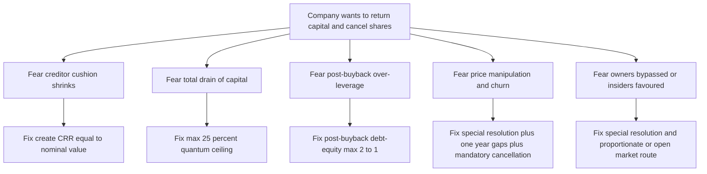
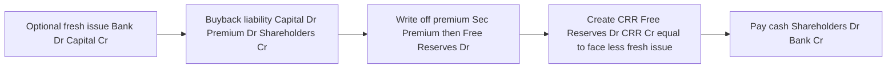
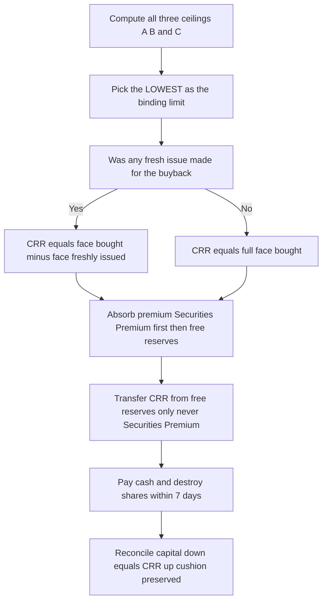

<!-- v2-deep -->

# Chapter 32 — Buyback of Securities

## 1. The Problem

A company is the mirror image of a person's bank account: shareholders put money *in* when shares are issued, and normally the only way they get money *out* is by **selling their shares to another investor** in the market. The company itself stays out of the transaction — it received the capital once and it keeps it, permanently, as "share capital" locked on the liabilities side of the Balance Sheet. That permanence is not an accident. It is the whole reason a creditor is willing to lend to a company: the paid-up capital is a **cushion** that cannot walk out the door on a whim.

But three real business situations make that permanence painful:

1. **Surplus cash with nothing to do.** A mature company (say a profitable IT services firm) generates far more cash than it can reinvest at a good return. It is sitting on ₹500 crore earning 5% in a bank while its own business earns 25%. Paying it out as dividend attracts dividend distribution mechanics and is "sticky" (markets punish you if you cut it next year). The company wants a *one-time* way to return cash to owners.

2. **The share price is too low and management believes it.** If the intrinsic value is ₹200 and the market quotes ₹120, the *best investment the company can make* is in its own shares. Buying them back and cancelling them raises earnings per share for everyone who stays.

3. **Too many shares / unwelcome shareholders.** Buyback lets a company shrink its equity base, increase promoter holding percentage, thwart a takeover, or exit a scattered small-shareholder base.

So companies *want* to hand capital back to shareholders and cancel those shares. The moment we allow that, we have punched a hole in the creditors' cushion. **Money that was locked in as permanent capital now leaves the company.** If we let this run unchecked, a company could return every rupee of shareholders' funds to shareholders the day before defaulting on its lenders. That is theft dressed as a corporate action.

Worse, buyback is a **price-manipulation weapon**. A company flush with information about itself can prop up or move its own share price by buying, benefiting insiders and misleading the market.

The problem, therefore, is a two-sided one: *give companies a legitimate route to return surplus capital and cancel shares, without letting them (a) hollow out the creditor cushion or (b) manipulate their own price.* Chapter 32 is the accounting-and-law answer to exactly that tension.

**Why not just pay a bigger dividend?** Because dividend and buyback are *not* substitutes at the fine grain, and the exam expects you to know the difference at the level of the balance sheet:

- A **dividend** is paid out of *distributable profits only* and leaves **share capital untouched** — the number of shares and the paid-up capital are exactly the same the day after. No CRR arises. It is a recurring signal (a cut is punished).
- A **buyback** *cancels* shares, *reduces* paid-up capital, and therefore triggers the CRR machinery to protect creditors. It is a one-time, discretionary, capital-side event.

Because a buyback touches the *structural* capital and a dividend does not, the law wraps buyback in fences that dividends never face (25% ceilings, the 2:1 test, mandatory cancellation). If you ever find yourself passing a "CRR" entry for a dividend, you have confused the two — a classic conceptual slip.

---

## 2. The Core Idea (analogy)

Think of the company's balance sheet as a **water tank sitting above a village of creditors**. The water level is "shareholders' funds" (capital + reserves). Creditors live downstream and lend precisely because the tank is high — if the company drains toward them, there is a buffer above that absorbs losses first.

A dividend is a **controlled tap near the top**: you can only let out water that is clearly "free" (distributable profit), and the structural walls of the tank (paid-up capital) never move.

A **buyback is different — it lets you actually lower the wall of the tank and pour that structural water out.** That is dangerous. So the law says: *fine, you may lower the wall, but for every brick of capital-wall you remove, you must simultaneously build an equal brick of a new, un-removable wall.* That new wall is the **Capital Redemption Reserve (CRR)**.

The CRR is the single most important idea in this chapter. It is capital's *ghost*: when share capital is extinguished by buyback out of profits, an equal amount of profit is frozen forever into CRR, which the law treats *as if it were share capital*. The creditor's cushion is preserved brick-for-brick — the *label* on the wall changed from "Capital" to "CRR", but the height of the wall did not fall.

> One-line mental model: **Buyback out of free reserves = converting distributable profit into permanent capital (CRR) equal to the nominal value cancelled, so the creditor cushion never shrinks.**

Everything else — the 25% ceiling, the 2:1 debt-equity test, the sources, the entries — is just plumbing around this one idea.

**Sharpen the analogy for the two funding routes.** Picture the wall being torn down as ₹X of face value.

- If you tear it down using **profits** (free reserves), the wall got shorter *by real amount* — so you must rebuild ₹X of CRR to restore the height. Cushion preserved.
- If you tear it down but first **built a brand-new brick wall of fresh capital** (a fresh issue of ₹Y face), then ₹Y of the height was already restored by *actual new money from new owners*. You only need CRR for the *un-replaced* stub, ₹(X − Y). Building CRR for the full ₹X would mean two walls where one was demolished — double-counting the cushion and needlessly freezing profit.

This is the entire reason the master formula subtracts fresh-issue face value. It is not a quirk to memorize; it is "don't double-count the cushion."

---

## 3. Why It's Built This Way

Let us *derive* the rules instead of memorizing them. Ask: "If I were the law-maker, what would I be scared of, and what minimum fence stops it?"

**Fear 1 — Creditors get robbed of their cushion.**
Fix: The nominal (face) value of every bought-back share must be replaced by CRR when the buyback is financed out of free reserves. Capital out, CRR in, cushion unchanged. (This is the same logic that governs redemption of preference shares in Chapter 31 — the CRR mechanism is *shared* between the two topics, which is why examiners love to combine them.)

**Fear 2 — A company drains ALL its capital and leaves creditors an empty shell.**
Fix: A *quantum ceiling*. You cannot buy back more than **25% of paid-up capital + free reserves** in a year. So at least three-quarters of the owners' funds must stay put every single year. Even a company obsessed with buyback needs four years to unwind, giving creditors time and warning.

**Fear 3 — A company loads up on debt, then hands equity back, so lenders are left holding a business that is now dangerously leveraged.**
Fix: A *leverage ceiling*. **After** the buyback, total debt must not exceed **twice** the (equity capital + free reserves). If returning capital would push you past 2:1 gearing, you cannot do the full buyback. This directly protects creditors from having their safety margin thinned by a post-buyback capital structure.

**Fear 4 — Price manipulation and serial buybacks.**
Fix: procedural fences — authorisation in the articles, a special resolution (or board resolution for small buybacks), a **cooling-off gap of one year** between two buybacks, completion within **one year** of authorisation, and a **6-month bar on fresh issue** of the same kind of shares after a buyback (so you can't buy low and re-issue high in a churn).

**Fear 5 — Companies buy back but never actually cancel the shares (hiding them as treasury stock to resell later and manipulate).**
Fix: Indian law forbids treasury stock. **Bought-back shares must be physically destroyed within 7 days** of completion. There is no "shares held in treasury" line on an Indian balance sheet — the shares cease to exist.

**Fear 6 — A company already stiffing one set of stakeholders (depositors, debenture-holders, term lenders) hands cash to owners instead of curing the default.**
Fix: A *conduct gate*. A company that has **defaulted** on repayment of deposits, interest thereon, redemption of debentures or preference shares, payment of dividend to any shareholder, or repayment of any term loan cannot buy back **while the default subsists**. The moment the default is *made good*, the bar lifts (older material spoke of a 3-year wait; the current Act lifts the bar once the default is remedied — *verify the exact wording in your current ICAI module / AY*). The logic is simple: you may not prefer owners over the creditors you are already failing.

**Fear 7 — Governance is bypassed: management buys back without owner consent, or buys from insiders on off-market terms.**
Fix: *whose money, whose decision*. Anything beyond a small board-route buyback needs a **special resolution** (75% of members) — the owners themselves must sanction shrinking their own company. And the buyback must be from existing holders **proportionately**, through the open market, or from odd-lot / ESOP holders — never a hand-picked private deal that lets insiders cash out on favourable terms.

Notice the beautiful symmetry: every fence maps to one specific fear. Nothing is arbitrary. Once you can regenerate the fence from the fear, you never have to memorize a list.


*Each legal condition on buyback is the minimum fence against one specific way creditors or the market could be harmed.*

---

## 4. Full Technical Content

Buyback of a company's own shares/securities is governed by **Section 68, 69 and 70 of the Companies Act, 2013**, read with the **Companies (Share Capital and Debentures) Rules, 2014**. For listed companies, SEBI (Buy-Back of Securities) Regulations also apply, but the CA Intermediate Advanced Accounting syllabus tests the **Companies Act** provisions and the **accounting**. Learn the Act cold.

### 4.1 What may be bought back

A company may buy back its **own shares or other specified securities** (Section 68). "Specified securities" includes employees' stock option or other securities as notified. In practice exam problems are almost always **equity shares** (occasionally preference shares).

**The three routes of *acquiring* the shares** (relevant for law/theory MCQs, and for how the price behaves in a problem):
1. **From existing shareholders on a proportionate basis** (a tender offer — every holder can sell a slice, so no one is favoured).
2. **From the open market** (on-market purchase — SEBI-regulated for listed companies).
3. **From employees** who received shares under ESOP or sweat equity.

Whatever the route, the *accounting* is identical: capital at face out, premium absorbed by reserves, CRR built, cash paid. The route only affects the price and the fairness safeguards, not the journal entries.

### 4.2 The three permitted SOURCES of buyback (Sec. 68(1))

Buyback may be financed **only** out of:

| # | Source | Note |
|---|--------|------|
| (a) | **Free reserves** | General reserve, surplus in P&L (credit balance), any reserve freely available for dividend. This includes Securities Premium *for the payment* but not for meeting the CRR requirement — see below. |
| (b) | **Securities Premium account** | May be applied towards the premium paid on buyback (i.e., the excess of buyback price over face value). |
| (c) | **Proceeds of a FRESH ISSUE** of shares or other specified securities | BUT — you may **not** buy back one *kind* of security out of the proceeds of a fresh issue of the **same kind** of security. (Otherwise buyback becomes a meaningless round-trip.) |

Key negative rule: **buyback cannot be financed out of borrowed funds.** Debt cannot be used to return equity — that would defeat the whole creditor-protection logic.

**What counts as a "free reserve" — the finer distinctions the exam probes.** A reserve is "free" only if it is *available for distribution as dividend*. Sort every reserve you meet into the right bucket:

| Reserve | Free reserve? | Can fund buyback / premium? | Can fund CRR? |
|---|---|---|---|
| General Reserve | Yes | Yes | Yes |
| Surplus in Statement of P&L (credit) | Yes | Yes | Yes |
| Securities Premium | Treated as free for the 25% *test*, but is a *statutory* reserve | Can pay the *premium on buyback* only | **No** |
| Capital Redemption Reserve (existing) | No | **No** — only for bonus | No |
| Revaluation Reserve | No (unrealised) | **No** | **No** |
| Capital Reserve (e.g. profit on reissue of forfeited shares, capital profits) | No | **No** | **No** |
| Debenture Redemption Reserve (until debentures redeemed) | No (earmarked) | **No** while earmarked | No |
| Dividend Equalisation Reserve | Yes (it is an appropriation of free profit) | Yes | Yes |

The single most examined line here: **Securities Premium and Capital Reserve are NOT usable to *create* CRR**, even though Securities Premium *can* pay the premium on buyback. Keep "paying the premium" and "creating the CRR" as two separate jobs with two separate eligible-source lists.

### 4.3 The CRR requirement (Sec. 69) — the heart of the chapter

> Where a company buys back its own shares **out of free reserves or securities premium**, a sum **equal to the nominal (face) value of the shares bought back** shall be transferred to the **Capital Redemption Reserve (CRR)**, and disclosed in the Balance Sheet.

Read the trigger words carefully:

- CRR is created **only to the extent the buyback is out of free reserves / securities premium.**
- To the extent the buyback is financed **out of the proceeds of a fresh issue**, **NO CRR is needed** — because a *new* wall of capital has just been built by the fresh issue, so the old wall being torn down is already replaced by real new capital. Creating CRR *and* raising fresh capital would double-count the cushion.

**The master CRR formula:**

$$\text{CRR} = \text{Nominal value of shares bought back} - \text{Nominal value of fresh issue made for the buyback}$$

CRR may be used **only** for issuing **fully paid bonus shares** (like Securities Premium's most restricted use). It is, for all practical purposes, permanent capital.

Sources that may **fund the CRR transfer**: free reserves only (general reserve, P&L surplus). **Securities premium and capital reserves cannot be used to create the CRR.** (Securities premium can pay the *premium on buyback*, but the *CRR = face value transfer* must come from free reserves.)

**A subtle boundary — the fresh issue must be *for the buyback*.** The offset in the formula only applies to a fresh issue that *funds* the buyback and is roughly contemporaneous with it. A fresh issue made years earlier for an unrelated purpose does not reduce today's CRR. In exam problems the offset applies whenever the problem *says* "to finance the buyback, the company issues…"; otherwise, CRR = full face value bought back.

**Does the fresh issue have to be equity?** No. It can be *any* shares or specified securities *other than the same kind being bought back*. So an equity buyback can be part-financed by a fresh issue of **preference shares** or debentures-with-a-share-element, and that fresh issue's face value still offsets CRR (because it too rebuilds permanent capital). What is barred is financing an equity buyback out of a *fresh equity* issue — the pointless round-trip.

### 4.4 The QUANTUM limits — how much can be bought back (Sec. 68(2))

Two independent ceilings, PLUS a resolution/gap condition. **The buyback must satisfy the lowest of the applicable limits.**

**(A) The 25% of Capital + Free Reserves test — the money ceiling.**
Total buyback in a financial year cannot exceed **25% of the aggregate of paid-up capital AND free reserves** (of both equity and preference).

$$\text{Max amount} = 25\% \times (\text{Paid-up equity capital} + \text{Paid-up preference capital} + \text{Free reserves})$$

Free reserves for this purpose **include Securities Premium** (per the Act's definition read with the Rules — *confirm the treatment of securities premium in your current ICAI module, as ICAI includes it in "free reserves" for the 25% test*).

**(B) The 25% of paid-up EQUITY test — the shares ceiling (equity buyback only).**
In any financial year, the number of **equity** shares bought back cannot exceed **25% of the total paid-up EQUITY capital**. This is a limit on the *quantity of equity shares* (measured on paid-up equity capital *alone*, NOT capital + reserves).

> Trap: Test (A) uses "paid-up capital + free reserves" and is measured in **rupees of buyback value**. Test (B) uses "paid-up EQUITY capital only" and caps the **paid-up value of equity shares bought back**. Students routinely mix these. Keep them in separate columns.

**(C) The debt-equity 2:1 test — the leverage ceiling (Sec. 68(2)(d)).**
**After** buyback, the ratio of **total debt (secured + unsecured)** to **(paid-up capital + free reserves)** must **not exceed 2:1**.

$$\text{Debt} \le 2 \times (\text{Equity owned funds AFTER buyback})$$

Rearranged, this gives the **maximum funds that can be paid out** without breaching gearing:

$$\text{Minimum owned funds required after buyback} = \frac{\text{Total Debt}}{2}$$
$$\text{Max buyback outflow allowed by 2:1} = (\text{Owned funds before buyback}) - \frac{\text{Debt}}{2}$$

where **owned funds = paid-up capital + free reserves** (including securities premium, per ICAI).

**Why the outflow reduces owned funds by the *full* price, not just the face value.** A buyback of price ₹P per share (face ₹F) reduces owned funds by exactly ₹P, and here is the clean proof that reconciles the whole entry set:

- Capital falls by ₹F (face cancelled).
- Reserves fall by the premium ₹(P − F) (absorbed on buyback).
- The CRR transfer is *internal* to owned funds (free reserves → CRR), so it nets to zero within owned funds.

Total fall in owned funds = F + (P − F) + 0 = **P**, the whole cash paid. That is why in test (C) you subtract the *entire* buyback outflow from pre-buyback owned funds — a point students get wrong by subtracting only face value.

**Board-route sub-limit.** When the buyback is done by *board resolution alone* (no special resolution), the ceiling in test (A) tightens from 25% to **10% of (paid-up equity capital + free reserves)**, and only **one** such buyback is allowed per year. The 2:1 test and the destruction/CRR rules apply identically.

**(D) Authorisation & procedural conditions (Sec. 68(2), 68(3)–(8)):**
- Buyback must be **authorised by the Articles of Association**.
- A **special resolution** in general meeting is required. *Exception:* the **Board of Directors** alone may authorise a buyback of up to **10% of paid-up equity capital + free reserves** (a "board-route" small buyback), and only **one such board-route buyback per year**.
- **A gap of at least one year** must separate two buybacks (measured from the date of closure of the preceding buyback).
- Buyback must be **completed within one year** from the date of the special/board resolution.
- The company must file a declaration of solvency (Form SH-9) and, after completion, a return (Form SH-11).
- **No buyback** if the company has **defaulted** in repayment of deposits, interest, redemption of debentures/preference shares, or repayment of term loans (the bar lifts once the default is remedied — *verify the exact "cooling" period in your current ICAI material / AY*).

### 4.5 Post-buyback restrictions (Sec. 68(7)–(8), 69)

- **Extinguish and physically destroy** the bought-back shares within **7 days** of completion. (No treasury stock in India.)
- **No fresh issue** of the same kind of shares (except bonus, or discharge of existing obligations like conversion of warrants, ESOPs, sweat equity, preference shares/debentures into equity) within **6 months** (Sec. 68(8)).
- CRR to be maintained and shown in the balance sheet; usable only for bonus.
- Once a buyback is completed, a **cooling-off of one year** must pass before the next buyback.

### 4.6 The journal entries (the mechanical core)

There are only **four moving parts**. Master this template and every problem falls out.

**Step 1 — If a fresh issue is made to finance the buyback (only when the problem says so):**

| Particulars | Dr (₹) | Cr (₹) |
|---|---|---|
| Bank A/c | XXX | |
|   To Share Capital A/c (nominal) | | XXX |
|   To Securities Premium A/c (if issued at premium) | | XXX |

**Step 2 — Amount payable to shareholders on buyback (create the liability):**

| Particulars | Dr (₹) | Cr (₹) |
|---|---|---|
| Equity Share Capital A/c (face value bought back) | XXX | |
| Premium on Buyback A/c *(if buyback price > face)* | XXX | |
|   To Equity Shareholders A/c (total buyback amount) | | XXX |

> Note: `Equity Share Capital A/c` is debited with **face value** only; the excess of price over face is the *premium on buyback* (a debit — a loss to reserves), routed to the second Dr line.

**Step 3 — Charge the premium on buyback to reserves (adjust the premium):**

| Particulars | Dr (₹) | Cr (₹) |
|---|---|---|
| Securities Premium A/c *(first, to the extent available)* | XXX | |
| General Reserve / Profit & Loss A/c *(balance)* | XXX | |
|   To Premium on Buyback A/c | | XXX |

The premium **paid** on buyback is written off first against **Securities Premium**, and any balance against **free reserves** (general reserve, P&L surplus).

**Step 4 — Create the CRR (the cushion-preservation entry):**

CRR = Face value bought back − Face value of fresh issue (if any).

| Particulars | Dr (₹) | Cr (₹) |
|---|---|---|
| General Reserve A/c / Profit & Loss A/c | XXX | |
|   To Capital Redemption Reserve A/c | | XXX |

**Step 5 — Pay the shareholders:**

| Particulars | Dr (₹) | Cr (₹) |
|---|---|---|
| Equity Shareholders A/c | XXX | |
|   To Bank A/c | | XXX |


*The five-step buyback machine — fresh issue in, liability created, premium absorbed, CRR built, cash out.*

**Order matters — and here is why.** Write off the premium (Step 3) *before* transferring CRR (Step 4) only for tidiness; the two draw on overlapping reserves, so if free reserves are tight you must make sure the *same* rupee of general reserve is not used twice. Always tabulate a running reserve balance (as in the reconciliations below) so you never over-draw. If the problem gives *insufficient free reserves* to cover both the premium balance and the full CRR, the buyback is **scaled down** or **disallowed** — never "borrow" from securities premium or capital reserve to plug the CRR gap.

### 4.6A Choosing which reserve to debit — the priority ladder

When several free reserves exist, examiners award marks for debiting them in a defensible order. Use this ladder:

1. **Premium on buyback:** Securities Premium **first** (its restricted capacity is best spent here), then General Reserve, then P&L surplus.
2. **CRR transfer:** General Reserve first, then P&L surplus (both are equally "free"; either is acceptable, but keep it consistent and show the trail). **Never** Securities Premium / Capital Reserve.
3. If a **Dividend Equalisation Reserve** or similar free reserve exists, it ranks with General Reserve.

There is no single "legally mandated" order among the *free* reserves for the CRR transfer — but you must (a) exhaust Securities Premium on the *premium* first, and (b) keep CRR strictly out of Securities Premium. State your assumption in one line and the examiner cannot fault you.

### 4.7 Contrast with Redemption of Preference Shares (Chapter 31)

The two topics share the CRR engine, so examiners test them together. Hold the differences firmly:

| Feature | Redemption of Preference Shares (Sec. 55) | Buyback of Equity/Securities (Sec. 68) |
|---|---|---|
| What is redeemed | Only **redeemable preference shares** | Own **equity or specified securities** |
| Purpose | Contractual/scheduled return of pref capital | Discretionary capital return / EPS / defence |
| Must it be authorised by AoA? | Terms in AoA/issue; no special resolution | AoA + **special resolution** (or board for ≤10%) |
| Quantum ceiling (25%)? | **No** statutory 25% limit | **Yes** — 25% of (capital+reserves) & 25% of equity |
| Debt-equity 2:1 test? | **No** | **Yes** |
| CRR trigger | Redeem out of profits → CRR = **face value redeemed** (nil to extent of fresh issue) | Buy out of reserves → CRR = **face value bought (less fresh issue)** |
| CRR source | Free reserves only | Free reserves only |
| Premium on redemption/buyback | Off Securities Premium / P&L (per Sec. 52 as amended) | Off Securities Premium first, then free reserves |
| Shares cancelled? | Yes (pref shares extinguished) | Yes — **physically destroyed in 7 days** |
| Fresh issue same kind allowed? | Yes (often funds the redemption) | Cannot buy back same kind out of fresh issue of same kind |

The engine is identical (Capital out → CRR in, less any fresh issue). The **fences (25% and 2:1)** exist only for buyback, because preference redemption is a *pre-agreed* return of a *fixed, temporary* class of capital, whereas buyback is a *discretionary raid* on *permanent equity* — far more dangerous to creditors, hence more fences.

### 4.8 The combined problem — when both happen in one question

Because both topics hit the *same* free reserves and *both* build CRR, examiners love a paper where a company **redeems preference shares AND buys back equity** in the same year. Rules for surviving it:

- **CRR is cumulative.** CRR from redemption + CRR from buyback both land in the *same* CRR account. Add them.
- **Free reserves are a shared pool.** The premium on redemption, the premium on buyback, and *both* CRR transfers all draw from the *one* stock of general reserve / P&L. Run a single running balance for the whole problem, not two separate ones. If the pool runs dry, the *second* action is the one that gets scaled back or disallowed.
- **The 25% and 2:1 tests apply only to the buyback leg**, but they are computed on the capital-and-reserves figures *as they stand when the buyback happens* — so if the preference redemption happens first, use the post-redemption reserves for the buyback's tests.
- Watch the *order* the question implies. "First redeem, then buy back" and "first buy back, then redeem" can give different limit-test results because owned funds change in between.

---

## 5. Worked Examples

### Example 1 — The plain-vanilla buyback (build the reflex)

**Facts.** Sunrise Ltd has 1,00,000 equity shares of ₹10 each fully paid. It buys back 10,000 shares at par (₹10) out of general reserve. General Reserve before = ₹5,00,000. No fresh issue.

**Step A — Limit check (light, since numbers are small):** Buyback value = 10,000 × ₹10 = ₹1,00,000. Shares bought = 10,000 = 10% of paid-up equity (≤ 25% ✓).

**Step B — Entries.**

| Particulars | Dr (₹) | Cr (₹) |
|---|---|---|
| Equity Share Capital A/c | 1,00,000 | |
|   To Equity Shareholders A/c | | 1,00,000 |
| Equity Shareholders A/c | 1,00,000 | |
|   To Bank A/c | | 1,00,000 |
| General Reserve A/c | 1,00,000 | |
|   To Capital Redemption Reserve A/c | | 1,00,000 |

**Reconciliation.** Capital fell by ₹1,00,000 (now ₹9,00,000). Free reserve fell by ₹1,00,000 (₹5,00,000 → ₹4,00,000). CRR rose by ₹1,00,000. **Total owned funds unchanged? No — total funds fell by ₹1,00,000 (the cash paid out), which is correct: that ₹1,00,000 genuinely left the company.** What is *preserved* is the **creditor cushion of permanent capital**: capital ₹1,00,000 out, CRR ₹1,00,000 in — the non-distributable, capital-like layer is intact. Distributable reserves absorbed the whole hit. That is exactly the design.

---

### Example 2 — Buyback at a premium, with securities premium available (the classic)

**Facts.** Orbit Ltd, Balance Sheet extract:

| Equity & Liabilities | ₹ |
|---|---|
| Equity share capital (₹10 each) | 20,00,000 |
| Securities Premium | 3,00,000 |
| General Reserve | 8,00,000 |
| Profit & Loss (surplus) | 4,00,000 |

The company buys back **40,000 equity shares at ₹25 each** (face ₹10). No fresh issue. Verify limits and pass entries.

**Step A — Quantum test (A): 25% of capital + free reserves.**
Capital + free reserves = 20,00,000 + 3,00,000 + 8,00,000 + 4,00,000 = **₹35,00,000.**
25% = **₹8,75,000** (maximum buyback *value*). Proposed outflow = 40,000 × 25 = **₹10,00,000.**
❌ **Fails test (A)!** ₹10,00,000 > ₹8,75,000.

*This is the examiner's favourite trap — a "premium buyback" can breach the 25% value ceiling even when the share-count looks fine.* Let me also run test (B) to show it in isolation.

**Step B — Quantum test (B): 25% of paid-up equity (shares).**
25% × 20,00,000 = ₹5,00,000 paid-up value = **50,000 shares** max. Proposed = 40,000 shares (₹4,00,000 face) ✓ passes (B).

**Conclusion:** Buyback is **restricted by test (A)** to ₹8,75,000. Since the question *states* 40,000 shares, a well-set exam version would give numbers that pass. **For the clean walkthrough, assume the company revises to buy the maximum permissible ₹8,75,000 ÷ ₹25 = 35,000 shares** (I flag this so the arithmetic reconciles; in the exam, always buy the *lower* of what is asked and what is permitted, and state your limiting factor).

Take **35,000 shares × ₹25 = ₹8,75,000.** Face value = 35,000 × ₹10 = ₹3,50,000. Premium on buyback = 35,000 × ₹15 = ₹5,25,000.

**Step C — Entries.**

*(1) Create the buyback liability:*

| Particulars | Dr (₹) | Cr (₹) |
|---|---|---|
| Equity Share Capital A/c | 3,50,000 | |
| Premium on Buyback A/c | 5,25,000 | |
|   To Equity Shareholders A/c | | 8,75,000 |

*(2) Absorb the premium — Securities Premium first (₹3,00,000), then free reserves (₹2,25,000):*

| Particulars | Dr (₹) | Cr (₹) |
|---|---|---|
| Securities Premium A/c | 3,00,000 | |
| General Reserve A/c | 2,25,000 | |
|   To Premium on Buyback A/c | | 5,25,000 |

*(3) Create CRR = face value bought (no fresh issue) = ₹3,50,000, out of free reserves:*

| Particulars | Dr (₹) | Cr (₹) |
|---|---|---|
| General Reserve A/c | 3,50,000 | |
|   To Capital Redemption Reserve A/c | | 3,50,000 |

*(4) Pay shareholders:*

| Particulars | Dr (₹) | Cr (₹) |
|---|---|---|
| Equity Shareholders A/c | 8,75,000 | |
|   To Bank A/c | | 8,75,000 |

**Reconciliation of reserves used:**

| Reserve | Opening | Used for premium | Used for CRR | Closing |
|---|---|---|---|---|
| Securities Premium | 3,00,000 | (3,00,000) | — | 0 |
| General Reserve | 8,00,000 | (2,25,000) | (3,50,000) | 2,25,000 |
| Profit & Loss | 4,00,000 | — | — | 4,00,000 |
| CRR | 0 | — | +3,50,000 | 3,50,000 |

Cash out = ₹8,75,000. Equity capital: 20,00,000 → 16,50,000 (fell by ₹3,50,000 face). Cushion check: capital down ₹3,50,000, CRR up ₹3,50,000 → **permanent-capital layer preserved.** Free reserves absorbed the ₹5,25,000 premium (₹3,00,000 sec. premium + ₹2,25,000 GR). Every figure ties.

---

### Example 3 — Buyback part-financed by a FRESH ISSUE + the 2:1 debt test (exam-hard)

**Facts.** Titan Ltd, Balance Sheet:

| Equity & Liabilities | ₹ |
|---|---|
| Equity share capital (₹10 each) | 30,00,000 |
| Securities Premium | 6,00,000 |
| General Reserve | 20,00,000 |
| Profit & Loss (surplus) | 4,00,000 |
| 12% Debentures (secured) | 40,00,000 |
| Unsecured loans | 20,00,000 |

The company wants to buy back the **maximum permissible** equity shares at **₹50 per share** (face ₹10). To fund it, it first makes a **fresh issue of 20,000 equity shares of ₹10 at a premium of ₹5** (i.e., ₹15 per share). Determine the maximum buyback and pass entries. Free reserves = Securities Premium + General Reserve + P&L (per ICAI).

**Step 0 — Effect of the fresh issue first** (it changes the base figures for the limit tests, because the issue happens *before* the buyback).

Fresh issue: 20,000 × ₹15 = ₹3,00,000 cash in. Capital +₹2,00,000; Securities Premium +₹1,00,000.

Post-issue figures:
- Equity capital = 30,00,000 + 2,00,000 = **₹32,00,000**
- Securities Premium = 6,00,000 + 1,00,000 = **₹7,00,000**
- General Reserve = **₹20,00,000**, P&L = **₹4,00,000**
- Free reserves = 7,00,000 + 20,00,000 + 4,00,000 = **₹31,00,000**
- Owned funds (capital + free reserves) = 32,00,000 + 31,00,000 = **₹63,00,000**
- Total debt = 40,00,000 + 20,00,000 = **₹60,00,000** (unchanged)

**Step 1 — Test (A): 25% of (capital + free reserves).**
25% × 63,00,000 = **₹15,75,000** (max buyback *value*).

**Step 2 — Test (B): 25% of paid-up equity capital.**
25% × 32,00,000 = **₹8,00,000** paid-up value = **80,000 shares** max.
Max value at ₹50/share by count = 80,000 × ₹50 = ₹40,00,000 (not binding vs A). *The binding measure of B is the share count 80,000.*

**Step 3 — Test (C): the 2:1 debt-equity leverage test (AFTER buyback).**
Rule: Debt ≤ 2 × (owned funds after buyback).
Required min owned funds after buyback = Debt ÷ 2 = 60,00,000 ÷ 2 = **₹30,00,000.**
Owned funds *before* buyback = ₹63,00,000.
**Maximum reduction in owned funds permitted = 63,00,000 − 30,00,000 = ₹33,00,000.**

But buyback reduces owned funds by the *full cash outflow* (capital + premium both leave). So test (C) permits a buyback outflow of up to **₹33,00,000** — not binding here versus A's ₹15,75,000.

**Step 4 — Pick the lowest ceiling.**

| Test | Ceiling |
|---|---|
| (A) 25% of capital + free reserves | ₹15,75,000 (value) |
| (B) 25% of paid-up equity | 80,000 shares |
| (C) Debt-equity 2:1 | ₹33,00,000 (value) |

Binding limit = **Test (A) = ₹15,75,000.** At ₹50/share → **15,75,000 ÷ 50 = 31,500 shares.** Check against (B): 31,500 ≤ 80,000 ✓. Check (C): outflow ₹15,75,000 ≤ ₹33,00,000 ✓.

**Maximum buyback = 31,500 shares for ₹15,75,000.**
Face value bought = 31,500 × ₹10 = ₹3,15,000. Premium on buyback = 31,500 × ₹40 = ₹12,60,000.

**Step 5 — CRR requirement.**
CRR = Face value bought − Face value of fresh issue made *for the buyback*.
The fresh issue face value = 20,000 × ₹10 = ₹2,00,000.
**CRR = 3,15,000 − 2,00,000 = ₹1,15,000.** (Only the portion of face value *not* replaced by fresh capital needs a CRR ghost — the fresh issue already rebuilt ₹2,00,000 of the wall.)

**Step 6 — Entries.**

*(1) Fresh issue:*

| Particulars | Dr (₹) | Cr (₹) |
|---|---|---|
| Bank A/c | 3,00,000 | |
|   To Equity Share Capital A/c | | 2,00,000 |
|   To Securities Premium A/c | | 1,00,000 |

*(2) Buyback liability:*

| Particulars | Dr (₹) | Cr (₹) |
|---|---|---|
| Equity Share Capital A/c | 3,15,000 | |
| Premium on Buyback A/c | 12,60,000 | |
|   To Equity Shareholders A/c | | 15,75,000 |

*(3) Absorb premium — Securities Premium first (₹7,00,000 available), then free reserves (₹5,60,000):*

| Particulars | Dr (₹) | Cr (₹) |
|---|---|---|
| Securities Premium A/c | 7,00,000 | |
| General Reserve A/c | 5,60,000 | |
|   To Premium on Buyback A/c | | 12,60,000 |

*(4) Create CRR ₹1,15,000:*

| Particulars | Dr (₹) | Cr (₹) |
|---|---|---|
| General Reserve A/c | 1,15,000 | |
|   To Capital Redemption Reserve A/c | | 1,15,000 |

*(5) Pay shareholders:*

| Particulars | Dr (₹) | Cr (₹) |
|---|---|---|
| Equity Shareholders A/c | 15,75,000 | |
|   To Bank A/c | | 15,75,000 |

**Reconciliation.**

| Reserve | After issue | Premium write-off | CRR | Closing |
|---|---|---|---|---|
| Securities Premium | 7,00,000 | (7,00,000) | — | 0 |
| General Reserve | 20,00,000 | (5,60,000) | (1,15,000) | 13,25,000 |
| Profit & Loss | 4,00,000 | — | — | 4,00,000 |
| CRR | 0 | — | +1,15,000 | 1,15,000 |

Equity capital: 30,00,000 → +2,00,000 (issue) → −3,15,000 (buyback) = **₹28,85,000.**
Cash: +3,00,000 (issue) − 15,75,000 (buyback) = **net −₹12,75,000.**
Post-buyback owned funds = 28,85,000 + (0 + 13,25,000 + 4,00,000 + 1,15,000) = 28,85,000 + 18,40,000 = **₹47,25,000.** Debt = ₹60,00,000. Debt-equity = 60,00,000 / 47,25,000 = **1.27 : 1 ≤ 2 ✓.** All limits respected; every figure reconciles.

---

### Example 4 — When the 2:1 leverage test is the BINDING one (the reversed trap)

Example 3 let test (A) bite. Examiners flip it so the *debt* test bites — a company with heavy borrowings and modest reserves.

**Facts.** Anchor Ltd:

| Equity & Liabilities | ₹ |
|---|---|
| Equity share capital (₹10 each) | 40,00,000 |
| Free reserves (General Reserve + P&L) | 24,00,000 |
| Secured + unsecured loans (total debt) | 1,10,00,000 |

Buyback proposed at **₹20 per share** (face ₹10). No fresh issue. Find the maximum permissible buyback.

**Test (A) — 25% of capital + free reserves.**
Owned funds before = 40,00,000 + 24,00,000 = ₹64,00,000. 25% = **₹16,00,000** (value).

**Test (B) — 25% of paid-up equity.**
25% × 40,00,000 = ₹10,00,000 face = **1,00,000 shares** → at ₹20 that is ₹20,00,000 of value (count is the binding form).

**Test (C) — 2:1 leverage (AFTER buyback).**
Min owned funds required after buyback = Debt ÷ 2 = 1,10,00,000 ÷ 2 = **₹55,00,000.**
Max reduction in owned funds = 64,00,000 − 55,00,000 = **₹9,00,000.**
So the maximum *cash outflow* allowed by the debt test = **₹9,00,000.**

**Pick the lowest.**

| Test | Ceiling (value) |
|---|---|
| (A) | ₹16,00,000 |
| (B) | 1,00,000 shares (= ₹20,00,000 value) |
| (C) | **₹9,00,000** ← binding |

Test (C) bites. Max outflow = ₹9,00,000 → shares = 9,00,000 ÷ 20 = **45,000 shares.**
Check (B): 45,000 ≤ 1,00,000 ✓. Check (A): ₹9,00,000 ≤ ₹16,00,000 ✓.

**Verification of the 2:1 ratio after buyback.**
Outflow ₹9,00,000: face cancelled = 45,000 × 10 = ₹4,50,000; premium = 45,000 × 10 = ₹4,50,000.
CRR = face = ₹4,50,000 (internal; nets to zero within owned funds).
Owned funds after = 64,00,000 − 9,00,000 = ₹55,00,000. Debt = ₹1,10,00,000.
Ratio = 1,10,00,000 / 55,00,000 = **exactly 2.00 : 1 ✓** (at the ceiling, as expected).

**Lesson.** When a company is highly geared, do not even bother running to full 25% — the debt test caps you far lower. Always compute all three and *pick the smallest value*. The examiner plants a large ₹16,00,000 headline (test A) to tempt you into over-buying.

*Entries follow the standard five-step template; premium ₹4,50,000 is absorbed by free reserves (no securities premium here), and CRR ₹4,50,000 is transferred from free reserves. Reserve check: free reserves 24,00,000 − 4,50,000 (premium) − 4,50,000 (CRR) = ₹15,00,000 closing; capital 40,00,000 − 4,50,000 = ₹35,50,000; CRR ₹4,50,000. Owned funds = 35,50,000 + 15,00,000 + 4,50,000 = ₹55,00,000 ✓.*

---

### Example 5 — Combined: preference redemption AND equity buyback in one year (Chapter 31 + 32)

**Facts.** Vega Ltd:

| Equity & Liabilities | ₹ |
|---|---|
| Equity share capital (₹10 each) | 25,00,000 |
| 10% Redeemable Preference share capital (₹100 each) | 5,00,000 |
| Securities Premium | 2,00,000 |
| General Reserve | 15,00,000 |
| Profit & Loss (surplus) | 6,00,000 |

Events in the year, in order:
1. Redeem **all** preference shares at a **premium of 10%** (i.e., ₹110 each). No fresh issue for this.
2. Then buy back **50,000 equity shares at ₹18** (face ₹10). No fresh issue.

Assume adequate cash. Pass entries and reconcile.

**Part 1 — Preference redemption (Sec. 55).**
Face redeemed = ₹5,00,000. Premium on redemption = 10% × 5,00,000 = ₹50,000.
CRR for redemption = **face value redeemed = ₹5,00,000** (no fresh issue).
Premium on redemption written off: Securities Premium first (₹2,00,000 available → use it fully? we also need SP later — but redemption comes first in sequence, so use it now), then free reserves.

*Redemption entries:*

| Particulars | Dr (₹) | Cr (₹) |
|---|---|---|
| Preference Share Capital A/c | 5,00,000 | |
| Premium on Redemption A/c | 50,000 | |
|   To Preference Shareholders A/c | | 5,50,000 |
| Securities Premium A/c | 50,000 | |
|   To Premium on Redemption A/c | | 50,000 |
| General Reserve A/c | 5,00,000 | |
|   To Capital Redemption Reserve A/c | | 5,00,000 |
| Preference Shareholders A/c | 5,50,000 | |
|   To Bank A/c | | 5,50,000 |

Running reserves after Part 1: Securities Premium 2,00,000 − 50,000 = **₹1,50,000**; General Reserve 15,00,000 − 5,00,000 = **₹10,00,000**; P&L **₹6,00,000**; CRR **₹5,00,000**.

**Part 2 — Equity buyback: run the limit tests on POST-redemption figures.**
Capital + free reserves now = Equity 25,00,000 + (SP 1,50,000 + GR 10,00,000 + P&L 6,00,000) = 25,00,000 + 17,50,000 = **₹42,50,000.**
(Preference capital is gone; CRR is *not* a free reserve, so it is excluded from the free-reserve part but note the 25% "capital + free reserves" test uses *paid-up capital + free reserves* — CRR is neither, so it stays out.)

- Test (A): 25% × 42,50,000 = **₹10,62,500** (value).
- Test (B): 25% × 25,00,000 = ₹6,25,000 face = **62,500 shares.**
- Proposed: 50,000 shares × ₹18 = **₹9,00,000.** Check A: 9,00,000 ≤ 10,62,500 ✓. Check B: 50,000 ≤ 62,500 ✓. (No debt given, so 2:1 not binding.)

Buyback is within limits. Face bought = 50,000 × 10 = ₹5,00,000. Premium = 50,000 × 8 = ₹4,00,000.
CRR for buyback = **face = ₹5,00,000.**
Premium absorbed: Securities Premium first (₹1,50,000 left), then free reserves (₹2,50,000).

*Buyback entries:*

| Particulars | Dr (₹) | Cr (₹) |
|---|---|---|
| Equity Share Capital A/c | 5,00,000 | |
| Premium on Buyback A/c | 4,00,000 | |
|   To Equity Shareholders A/c | | 9,00,000 |
| Securities Premium A/c | 1,50,000 | |
| General Reserve A/c | 2,50,000 | |
|   To Premium on Buyback A/c | | 4,00,000 |
| General Reserve A/c | 5,00,000 | |
|   To Capital Redemption Reserve A/c | | 5,00,000 |
| Equity Shareholders A/c | 9,00,000 | |
|   To Bank A/c | | 9,00,000 |

**Full reconciliation.**

| Reserve | Opening | Pref redemption | Equity buyback | Closing |
|---|---|---|---|---|
| Securities Premium | 2,00,000 | (50,000) | (1,50,000) | 0 |
| General Reserve | 15,00,000 | (5,00,000 CRR) | (2,50,000 prem + 5,00,000 CRR) | 2,50,000 |
| Profit & Loss | 6,00,000 | — | — | 6,00,000 |
| CRR | 0 | +5,00,000 | +5,00,000 | 10,00,000 |

Capital: Preference 5,00,000 → 0; Equity 25,00,000 → 20,00,000.
**Cushion check.** Capital extinguished = 5,00,000 (pref) + 5,00,000 (equity face) = ₹10,00,000. CRR created = ₹10,00,000. **Brick-for-brick preserved — exactly as the shared engine promises.** Total cash out = 5,50,000 + 9,00,000 = ₹14,50,000, matching the two premiums (₹50,000 + ₹4,00,000) plus the ₹10,00,000 face returned. Every figure ties.

**The killer subtlety here:** if you had run the buyback's 25% test on the *pre-redemption* reserves, you would have used the wrong (higher) securities premium and free-reserve figures and possibly over-bought. Sequence changes the base — always test each action on the balance sheet *as it stands at that moment*.

---

## 6. Presentation & Disclosure

**Balance Sheet (Schedule III, Companies Act 2013).** CRR appears under **Reserves and Surplus** within Shareholders' Funds:

```
Equity and Liabilities
  Shareholders' Funds
    Share Capital
    Reserves and Surplus
        Capital Redemption Reserve            XXX
        Securities Premium                    XXX
        General Reserve                       XXX
        Surplus (Statement of P&L)            XXX
```

**Notes / disclosures required around a buyback:**
- The company must disclose in the Board's report and financial statements the **number of shares bought back, the price, and the reason**.
- Aggregate number of shares bought back in the **preceding five financial years** (Schedule III requires disclosure of shares bought back for 5 years — *confirm current period in ICAI Schedule III notes*).
- CRR created and its purpose (usable only for bonus).
- Compliance with Section 68 conditions; special resolution details; completion within one year.
- **Form SH-11 (return of buyback)** filed with the Registrar, with a **compliance certificate (Form SH-15)** signed by two directors including the managing director, if any.

**The buyback forms — a quick map (theory MCQ bait):**

| Form | Purpose | When |
|---|---|---|
| SH-8 | Letter of offer / declaration by the Board | Before making the offer |
| SH-9 | Declaration of solvency (directors affirm the company can pay its debts for one year) | Before buyback, filed with Registrar/SEBI |
| SH-11 | Return of buyback | After completion |
| SH-15 | Compliance certificate (two directors incl. MD) | Annexed to SH-11 |

*Do not confuse SH-8/9 (before) with SH-11/15 (after). A common one-mark trap.*

**Board vs Special Resolution route disclosure:**

| Route | Ceiling | Approval | Frequency |
|---|---|---|---|
| Board resolution | ≤ 10% of paid-up equity + free reserves | Board only | Once per year |
| Special resolution | ≤ 25% of paid-up capital + free reserves | Members (75%) | Subject to 1-year gap |

**Effect on other ratios / statements (link the accounting to reporting):**
- **EPS** rises (fewer shares) — but the *EPS in the year of buyback* is computed on the weighted-average shares, so the boost is partial in the buyback year and full thereafter.
- **Cash Flow Statement:** the buyback outflow (face + premium) is a **financing activity** outflow; a fresh issue made to fund it is a **financing inflow**. They do *not* net silently — show both.
- **Net worth** falls by the cash paid out; the CRR transfer is internal and does not change net worth.

---

## 7. Connections

- **Chapter 31 (Redemption of Preference Shares)** — shares the *identical* CRR engine (Capital → CRR, less fresh issue). Master both together; examiners combine them, sometimes redeeming preference shares *and* buying back equity in one problem, both hitting the same free reserves (see Example 5).
- **Bonus Issue** — CRR's *only* permitted use is issuing fully paid bonus shares. Buyback shrinks capital; a later bonus can re-expand it *from* the very CRR the buyback created. Beautiful closed loop.
- **Securities Premium (Sec. 52)** — the premium-on-buyback write-off is the mirror of premium *on issue*; Sec. 52 restricts securities premium's uses, and paying buyback premium is one of the permitted applications.
- **Debentures / Financial leverage** — the 2:1 test connects buyback directly to the debt-side of the balance sheet you study in company-accounts and financial-management. A buyback is a *deliberate leverage-increasing* move (equity down, debt constant → gearing up), which is exactly why the 2:1 fence exists.
- **EPS & valuation (MBA-Finance link)** — buyback reduces the share count, raising EPS and (if bought below intrinsic value) increasing per-share intrinsic value. This is the *finance rationale* the accounting entries serve.
- **Cash Flow Statement (AS 3)** — buyback and fresh issue are both financing-activity lines; combined problems test whether you can trace the net cash movement.
- **Internal Reconstruction / Capital Reduction (Sec. 66)** — another way capital legally shrinks, but that route needs *Tribunal* approval and is for writing off *losses*, not returning surplus. Contrast: buyback returns cash to solvent owners; capital reduction usually cancels unpaid-up or lost capital. Don't conflate the two.

---

## 8. Traps & Examiner Tricks

1. **Confusing the two 25% tests.** Test (A) is on **paid-up capital + free reserves**, measured in **rupees of buyback value**. Test (B) is on **paid-up EQUITY capital only**, capping the **face value of equity shares** bought. Always run both; the buyback is limited by whichever bites first (plus the 2:1 test).
2. **Premium buyback silently breaching test (A).** As in Example 2 — a modest share count at a big premium can exceed the ₹-value ceiling. Compute the *value* of the outflow, never just the share count.
3. **CRR on the WRONG amount.** CRR = **face/nominal value** bought back, **not** the buyback price and **not** including premium. Then subtract fresh-issue face value. Students wrongly transfer the full outflow to CRR.
4. **CRR out of Securities Premium.** *Never.* Securities Premium can pay the *premium on buyback* but **cannot fund the CRR transfer** — CRR must come from **free reserves** (general reserve / P&L). Securities premium and capital reserve are *not* free reserves for CRR creation.
5. **2:1 test direction.** The ratio is tested **AFTER** buyback. Max payout = owned funds − (Debt ÷ 2). A common error is testing the ratio *before* buyback, or inverting to equity/debt.
6. **Forgetting the fresh-issue offset on CRR.** If part is financed by fresh issue, CRR = face bought − face of fresh issue. Ignoring the offset over-provides CRR and over-debits reserves (won't reconcile).
7. **"Buy back out of borrowed funds."** Explicitly prohibited. If a question hands you a fat term loan and no reserves, the answer is *"cannot buy back"* — not "use the loan."
8. **Treasury stock reflex.** Indian law has **no treasury stock**; shares must be **destroyed within 7 days**. Don't credit "Treasury Shares."
9. **Premium write-off order.** Securities Premium **first**, then free reserves. Reversing the order wastes securities premium's restricted capacity and misstates closing reserves.
10. **Using capital reserve / revaluation reserve.** Not free reserves — cannot fund buyback, premium, or CRR. Only genuinely distributable reserves qualify.
11. **Number of shares must be a whole number.** After computing the ₹ ceiling, dividing by price may give a fraction — round *down* to stay within the limit.
12. **Subtracting only face value in the 2:1 test.** The buyback reduces owned funds by the **full price** (face + premium), because the premium is absorbed by reserves. Subtracting only the face value overstates post-buyback owned funds and lets you "pass" a ratio you actually fail.
13. **Wrong base after a prior corporate action.** If a fresh issue, bonus, or preference redemption happens *before* the buyback, the 25% and 2:1 tests must use the *updated* capital-and-reserve figures. Using opening figures is a silent error that snowballs.
14. **CRR treated as a free reserve for the *next* action.** CRR is capital-like — it is **not** part of "free reserves" for a later dividend, buyback test, or premium write-off. Only its permitted use (bonus) touches it.
15. **Applying the 25% / 2:1 tests to a *preference redemption*.** Those fences are buyback-only. A preference redemption under Sec. 55 has no quantum or gearing ceiling — importing them is a conceptual error.
16. **Board-route ceiling mixed up.** Board-alone buyback is capped at **10%** (not 25%) of paid-up equity + free reserves, once a year. Watch for a question that quietly says "the Board resolved" (no special resolution) — then the ceiling is 10%.
17. **Ignoring the solvency / default gate.** If the problem states the company defaulted on deposits/debentures/loans and the default *subsists*, the buyback is barred outright regardless of reserves — write that as your answer.

---

## 9. First-Principles Recap

Start from one sentence: **permanent share capital is the creditor's cushion, and buyback lets a company drain that cushion — so every rule exists to stop the drain from harming creditors or manipulating the market.**

- To stop the cushion shrinking → replace cancelled **face value** with **CRR** (capital's ghost). To the extent a **fresh issue** already rebuilds capital, no CRR is needed → *CRR = face bought − face freshly issued.*
- To stop total drainage → **25% ceilings** (value on capital+reserves; count on paid-up equity) leave ≥75% intact each year.
- To stop post-buyback over-leverage → **debt ≤ 2 × owned funds after buyback**, where the outflow that reduces owned funds is the *full price*, not just face.
- To stop manipulation/churn → special resolution, AoA authority, 1-year gaps, mandatory destruction, no fresh same-kind issue for 6 months, no buyback from borrowed funds.
- To stop stakeholder abuse → no buyback while a default subsists; proportionate/open-market route; owners' special resolution for anything beyond the 10% board route.
- The accounting is one machine: (optional fresh issue) → create buyback liability (capital at face + premium) → write premium off securities-premium-then-free-reserves → transfer CRR from free reserves → pay cash.

If you can regenerate each fence from its fear, and run the five-step machine, you can solve any buyback problem — the "rules" are just the fears made precise.


*The decision path from limit tests to a reconciled set of entries — CRR sizing branches on whether a fresh issue was raised.*

---

## 10. Quick-Revision Sheet

**Governing law:** Sec. 68 (power & conditions), Sec. 69 (CRR), Sec. 70 (prohibitions), + Companies (Share Capital & Debentures) Rules, 2014.

**Sources (Sec. 68(1)):** (a) Free reserves (b) Securities Premium (c) Proceeds of fresh issue — *not same kind*. **Never from borrowed funds.**

**Three limit tests (buyback ≤ lowest):**
| Test | Formula | Measures |
|---|---|---|
| (A) 25% capital+reserves | 25% × (paid-up capital + free reserves) | ₹ value of buyback |
| (B) 25% of equity | 25% × paid-up **equity** capital | face value / count of equity shares |
| (C) Debt-equity 2:1 | Debt ≤ 2 × (owned funds AFTER buyback) → max payout = owned funds − Debt/2 | ₹ value (subtract full price, not just face) |

*Board-route buyback: ceiling drops to 10% of (paid-up equity + free reserves), once a year.*

**CRR (Sec. 69):** = **Nominal value bought back − Nominal value of fresh issue.** Source = **free reserves only**. Use = **bonus shares only**.

**Premium on buyback:** written off **Securities Premium first, then free reserves.**

**Free-reserve eligibility:** General Reserve, P&L surplus, Dividend Equalisation Reserve = yes. Securities Premium = pays *premium* only, never CRR. Capital Reserve, Revaluation Reserve, existing CRR, earmarked DRR = **no**.

**Five-step entries:**
1. Bank Dr / Capital Cr, Sec. Premium Cr *(fresh issue, if any)*
2. Capital Dr (face) + Premium on Buyback Dr / Equity Shareholders Cr
3. Securities Premium Dr, then Free Reserves Dr / Premium on Buyback Cr
4. Free Reserves Dr / CRR Cr *(= face − fresh face)*
5. Equity Shareholders Dr / Bank Cr

**Procedural fences:** AoA authority; special resolution (or board ≤10%, once/year); 1-year gap between buybacks; complete within 1 year; no fresh same-kind issue for 6 months; destroy shares within 7 days; no buyback if in default (deposits/debentures/loans) while unremedied.

**Forms:** SH-8 (letter of offer), SH-9 (solvency, before), SH-11 (return, after), SH-15 (compliance cert, after).

**vs Preference Redemption (Sec. 55):** same CRR engine; but pref redemption has **no** 25% or 2:1 test, and is a pre-agreed return of temporary capital. Buyback = discretionary raid on permanent equity → more fences.

**Golden checks:** CRR on *face*, not price. Securities premium can pay premium but *not* fund CRR. 2:1 tested *after*, subtract *full price*. Round shares *down*. No treasury stock in India. Test on the balance sheet *as it stands at each step*. Capital-down must equal CRR-up (net of fresh issue) — if it doesn't, you slipped.
