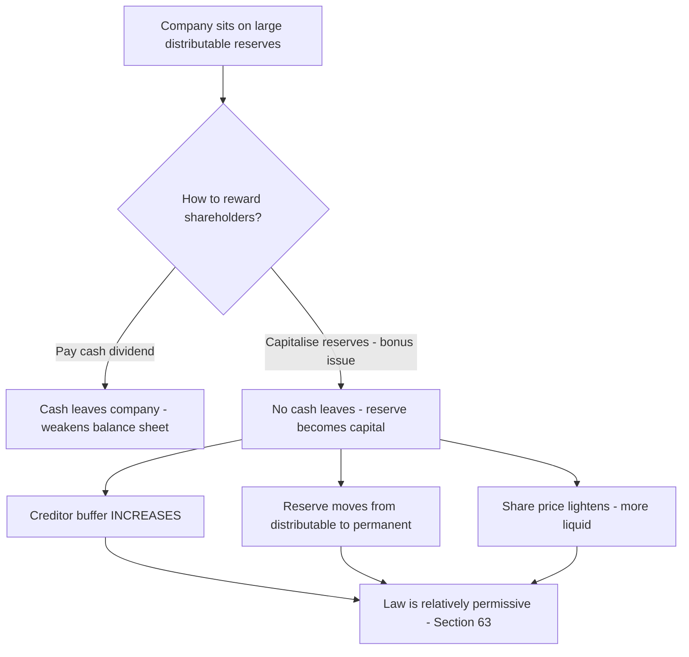
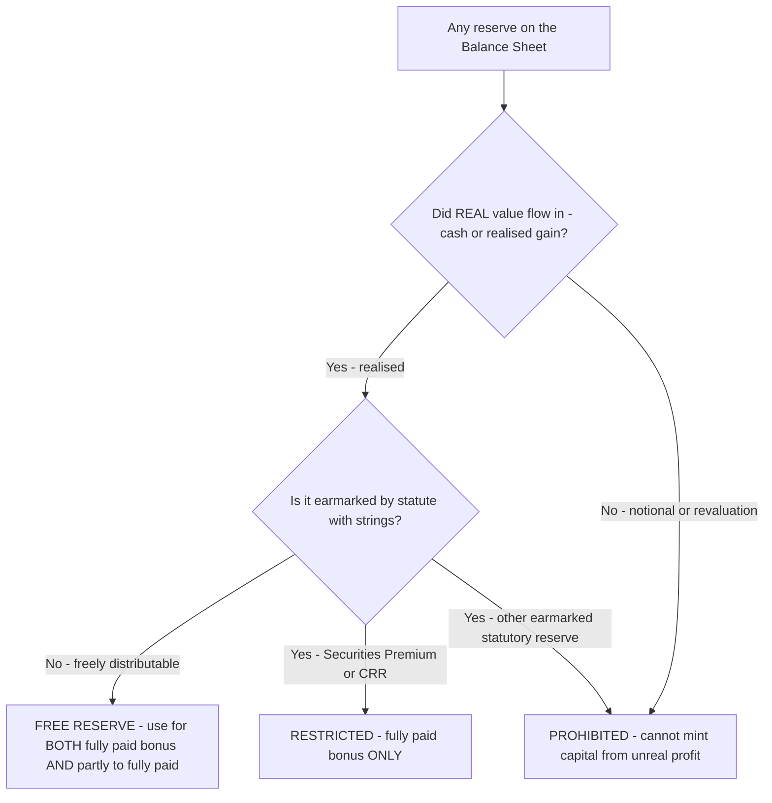
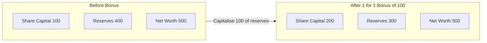
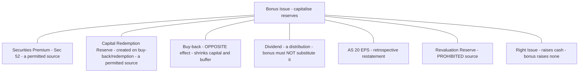

<!-- v2-deep -->

# Chapter 33 — Bonus Issue

## 1. The Problem

Picture a company that has been trading profitably for a decade. On its Balance Sheet sits a mountain of accumulated profit — say ₹40 crore in the General Reserve, plus another ₹15 crore in Securities Premium — against a paid-up share capital of only ₹10 crore. Legally, every rupee of that reserve *belongs* to the shareholders. It is their money, parked inside the company.

But this creates three uncomfortable problems.

**Problem 1 — The reserves are "trapped" and invisible.** A shareholder holding 1,000 shares of face value ₹10 owns ₹10,000 of *capital*, but her real claim is far larger once you add her slice of the reserves. The share certificate, however, still says ₹10,000. The value has piled up in a line item most retail investors never read. There is a mismatch between the *nominal* capital and the *real* capital employed in the business.

**Problem 2 — The share price becomes "heavy".** Years of retained profit push the market price to, say, ₹4,000 per share. That sounds great, but a ₹4,000 share is illiquid — small investors cannot buy a round lot, trading volumes thin out, and the stock looks intimidating. The company wants a *lighter*, more marketable price without doing anything drastic.

**Problem 3 — Rewarding shareholders drains cash.** The obvious way to hand accumulated profit back is a fat cash dividend. But cash is the lifeblood the company needs for its new factory. Paying out ₹40 crore of dividend would reward loyalty while simultaneously starving expansion. The board wants to say "thank you, you are richer" *without one rupee leaving the bank account.*

There is a fourth, quieter tension worth naming, because the examiner sometimes probes it. **Problem 4 — Perpetual under-capitalisation distorts every ratio.** With capital of ₹10 crore doing the work of ₹65 crore, the *return on equity capital* looks absurdly high, the debt-to-equity ratio (measured on paid-up capital) looks alarming to a naive lender, and dividend *per share* looks unsustainably fat relative to face value. None of this reflects reality; it is an artefact of leaving decades of profit sitting outside capital. A bonus issue re-bases these optics onto an honest capital figure.

Is there a mechanism that (a) makes the trapped reserves visible and permanent, (b) lightens the share price, (c) rewards shareholders — all without any cash outflow, and (d) re-aligns the capital base with the true scale of the business? Yes. It is the **bonus issue**.

## 2. The Core Idea (analogy)

> **A bonus issue is like slicing the same pizza into more pieces — then stamping "PERMANENT, DO NOT REFUND" on the extra slices.**

Imagine a pizza representing the total value of the company. Ten friends (shareholders) own it. Right now the pizza is cut into 10 large slices — one each. A bonus issue re-cuts the *same* pizza into 20 slices and gives each friend two slices instead of one. Nobody's share of the pizza has changed — everyone still owns one-tenth. No new pizza (cash) arrived. The pizza is exactly as big as before.

So what actually happened? Two subtle but real things:

1. **The slices are now smaller and more tradeable.** A friend who wants to sell "half his stake" can now hand over one slice instead of sawing a big slice in half. The price *per slice* falls proportionately (roughly halves), which is exactly the liquidity benefit the company wanted.

2. **A portion of "spendable" value got welded into the crust.** Here is the crucial accounting twist. Before the bonus, the reserves were *distributable* — they could have been paid out as dividend. After capitalisation, that same amount is now *share capital*, and share capital is the one thing a company can almost never hand back to shareholders (except through a painful, court/tribunal-supervised capital reduction). So the bonus issue takes soft, distributable reserve and **hardens it into permanent capital.** The friends got extra slices, but those slices are stamped "you can never ask for this back in cash."

This is why the technical name is **capitalisation of reserves** — you are converting reserve into capital. "Bonus" is almost a misnomer; nobody is richer by a rupee. What changes is the *form* (reserve → capital), the *permanence* (distributable → locked), and the *packaging* (fewer heavy shares → more light shares).

The one thing that genuinely improves is the **signal.** By voluntarily locking away distributable profit, the board is publicly betting that future earnings will be strong enough that it never needed that cushion. A bonus issue is management saying "we are so confident, we will permanently convert our rainy-day fund into capital." That confidence signal is the real economic content.

**Pushing the analogy one step further (why the price does not exactly halve).** Real markets do not adjust with mechanical perfection. The theoretical *ex-bonus price* after a 1:1 bonus is (old price ÷ 2). If ₹4,000 becomes ₹2,010 rather than ₹2,000, the extra ₹10 is the market pricing in the *signal* — the confidence content — not any change in the pizza's size. In an exam you always assume the mechanical adjustment (price divides by the total-shares multiple); the residual is real-world noise. This is worth internalising because a conceptual MCQ may ask "does shareholder wealth change on a bonus?" — the textbook answer is **no**, wealth is invariant, even though live markets show a small announcement bump.

**A second analogy for the "form vs substance" point — the fixed-deposit re-labelling.** Suppose you have ₹1,00,000 in a savings account you can withdraw any day (distributable reserve) and you move it into a 10-year locked FD you cannot break (share capital). Your *net worth* is unchanged — still ₹1,00,000. What changed is only *access*: you have voluntarily surrendered the ability to spend it. A bonus issue is precisely this re-labelling, done at the company level, on the shareholders' collective behalf. Nobody got richer; everybody got *less liquid at the entity level* and, in exchange, the balance sheet became sturdier.

## 3. Why It's Built This Way

Every rule around bonus issues flows from one tension: **protecting creditors and market integrity, while letting companies reward shareholders bloodlessly.** Let us derive the rules rather than memorise them.

**Why capital can't easily be returned (and why that matters here).** Company law treats paid-up capital as the creditors' buffer — the cushion that must be maintained before profits can be paid out. This is the "capital maintenance" doctrine. When you capitalise a reserve into share capital, you are *increasing* that creditor buffer and *shrinking* the pool available for dividends. Creditors love this; it makes the company safer. That is precisely why the law is comparatively relaxed about bonus issues — a bonus issue strengthens the balance sheet's protective layer. Contrast this with a *buy-back* or *capital reduction*, which shrinks the buffer and therefore triggers heavy court/tribunal scrutiny.

**Why capitalisation is (practically) irreversible — the one-way ratchet.** Once a reserve becomes share capital, undoing it means a formal capital reduction under Section 66 (NCLT-supervised) or a buy-back under Section 68 — both slow, costly and creditor-protective. This irreversibility is not an accident; it is *the point*. If a board could re-classify capital back into distributable reserve at will, the "permanence" signal would be worthless and the creditor buffer illusory. The one-way ratchet is what gives the bonus its economic meaning. Understanding this also explains why the examiner treats "can a bonus be reversed / withdrawn?" as a trick: for a listed company SEBI expressly says an *announced* bonus cannot be withdrawn, and even privately, un-capitalising is not a casual reversing entry — it is a statutory capital reduction.

**Why only *certain* reserves qualify.** If a bonus issue moves value from the "distributable" box to the "permanent capital" box, then logically you can only use reserves that were *available for distribution in the first place*, OR statutory reserves the law explicitly earmarks for this purpose. You cannot capitalise a reserve that represents an *unrealised* gain or a *notional* accounting adjustment, because that would be conjuring permanent capital out of profit that never actually materialised in cash or realised value. This single principle explains the entire "permitted vs prohibited sources" list you will meet in Part 4.

**Deeper: the "realisation" test behind the permitted-source list.** Ask of any reserve one question: *did real value actually flow into the company (cash or an equivalent realised gain), or is this just an upward re-marking of something the company still holds?* Securities Premium — cash came in over face value. CRR — it was carved out of *realised* profits when preference shares were redeemed or shares bought back. General Reserve and P&L surplus — realised trading profit. All pass. Revaluation Reserve — no cash, just a valuer's opinion that the building is worth more; the company still owns the same building. Fails. Fair-value gains on investments still held — same story, notional. Fails. If you can apply the realisation test, you never need the list.

**Why the "no bonus in lieu of dividend" rule exists.** Suppose a company is contractually or by expectation obliged to pay a dividend, but is short of cash. Tempting trick: declare a *bonus issue* and tell shareholders "here, shares instead of your dividend cheque." The law forbids this. Why? Because a dividend is a *distribution* — value leaving the company — whereas a bonus is *capitalisation* — value being locked *in*. Dressing up a locked-in capitalisation as if it discharged a distribution obligation would deceive shareholders about what they actually received. So Section 63 bars issuing bonus shares *in lieu of dividend*. Note the subtle distinction the examiner may test: a company **may** declare a bonus *and separately* declare a cash dividend in the same year — what it may **not** do is offer the bonus *as a substitute for* a dividend it is expected to pay. "Alongside" is fine; "instead of" is barred.

**Why "no partly-paid shares" for the bonus.** The mechanism must be clean and complete. If bonus shares were issued partly paid, the company would later have to *call* the balance from shareholders — i.e., demand cash — which defeats the entire "no cash outflow, gift to shareholders" premise and creates a liability trap for members. Hence bonus shares must be issued **fully paid.** (There is a related, separate use of reserves: converting *existing* partly-paid shares into fully-paid ones by applying reserves — we will see the law treats these two situations differently.)

**Why Securities Premium and CRR are ring-fenced to *fully-paid* bonus only.** These are *statutory* reserves — the law created them for narrow purposes and Section 52 / Section 55 spell out an exhaustive menu of permitted uses. "Issuing fully paid bonus shares" is on the menu; "paying up the unpaid portion of existing shares" is not. Why the asymmetry? Because making partly-paid shares fully paid is economically a *substitute for calling cash from members* — it is closer to financing the members' obligation than to a clean capitalisation — and the legislature chose to reserve that softer use for genuinely free (distributable) profit only. You do not have to love the logic; you have to remember that free reserves are the *general-purpose* tool and Securities Premium / CRR are the *restricted* tool.

**Why SEBI adds extra rules for listed companies.** For a private company, a bonus issue is a family matter. For a *listed* company, thousands of public investors and an orderly market are involved, so SEBI (ICDR) Regulations bolt on timing and completion deadlines to prevent manipulation and half-finished issues. The Companies Act provides the skeleton; SEBI adds the market-conduct muscles. The animating fear is a specific abuse: a promoter announcing a glamorous bonus to pump the price, then quietly abandoning or dragging it out. Hard deadlines and the "cannot be withdrawn once announced" rule kill that game.


*Figure 1 — The economic logic: a bonus issue strengthens the balance sheet, which is why the law permits it comparatively freely.*


*Figure 2 — The realisation test as a decision tree: run any reserve through it and the permitted-source rules fall out automatically.*

## 4. Full Technical Content

### 4.1 The governing law

Bonus issues are governed by **Section 63 of the Companies Act, 2013** (read with Rule 14 of the Companies (Share Capital and Debentures) Rules, 2014). For **listed** companies, the **SEBI (Issue of Capital and Disclosure Requirements) Regulations, 2018 — Chapter XI (Regulations 293–295)** apply additionally.

*A quick map of the neighbouring sections you should be able to name:* **Sec 52** (Securities Premium — how it is created and the closed list of uses, one of which is a fully-paid bonus); **Sec 55** (redemption of preference shares — creates CRR); **Sec 68/69** (buy-back — creates CRR); **Sec 61/64** (alteration and notice of alteration of authorised/share capital); **Sec 66** (capital reduction — the painful reverse of capitalisation); **AS 20** (EPS restatement). Section 63 does not live in isolation; every one of these can appear in the same problem.

### 4.2 Section 63(1) — the permitted sources

A company may capitalise its profits or reserves for the purpose of issuing fully paid-up bonus shares out of:

| # | Permitted source | Why it qualifies |
|---|------------------|------------------|
| (a) | **Free reserves** | Genuinely distributable accumulated profit; e.g., General Reserve, credit balance of Statement of P&L |
| (b) | **Securities Premium Account** | A statutory reserve; Section 52 expressly lists "issuing fully paid bonus shares" as a permitted use |
| (c) | **Capital Redemption Reserve (CRR)** | A statutory reserve created on buy-back / redemption of preference shares; law permits its use *only* for fully paid bonus shares |

**"Free reserves" defined** — Section 2(43): reserves available for distribution as dividend as per the latest audited Balance Sheet, **but excluding**:
- Any amount representing **unrealised gains, notional gains or revaluation of assets** (whether shown as a reserve or by crediting to P&L); and
- Any change in the carrying amount of an asset/liability recognised in equity (including surplus on measuring at fair value).

**Read the definition twice — the sting is in the tail.** The exclusion applies "whether shown as a reserve OR by crediting to the statement of profit and loss." That means even if a fair-value gain has been routed *through* P&L and now sits inside the "Surplus in Statement of P&L" line, that slice is **still not a free reserve** and **still cannot** be capitalised. So a P&L surplus of, say, ₹4,00,000 that includes ₹1,00,000 of unrealised fair-value gain gives you only ₹3,00,000 of genuinely free reserve. This is a favourite advanced trap (see Part 8, Trap 10).

### 4.3 Section 63(2) — the conditions (the six gatekeepers)

A bonus issue is valid only if **ALL** of the following are satisfied:

1. **Authorised by Articles** — the Articles of Association must authorise the bonus issue. (If not, alter the Articles first.)
2. **Recommended by the Board, then authorised in general meeting** — the Board recommends and members approve.
3. **No default on debt-servicing** — the company has not defaulted in payment of interest or principal in respect of **fixed deposits** or **debt securities** issued by it.
4. **No default on statutory dues to employees** — no default in payment of **statutory dues of employees**, such as contribution to **provident fund, gratuity and bonus**.
5. **Partly-paid shares made fully paid** — any partly paid-up shares outstanding on the date of allotment are **made fully paid-up** (before or as part of the process).
6. **Compliance with prescribed conditions** — such other conditions as may be prescribed (Rule 14).

**Two conditions people mis-state, so lock them precisely.** (i) Condition 3 is about **fixed deposits and debt securities** — it does *not* say "any loan"; a default on an ordinary bank term-loan is not, on the bare wording of Sec 63(2), one of the listed bars (though other law may bite). Quote the two categories exactly. (ii) Condition 5 does **not** mean "you cannot have partly-paid shares." It means partly-paid shares must be **squared up to fully paid on or before the date of allotment** of the bonus. The company can *use* the same bonus mechanism (free reserves) to do that squaring-up — which is exactly the two-part problem you meet in Example 3.

**Once recommended, can the Board un-recommend?** Under the Act, a recommendation can lapse if members reject it, but Rule 14 provides that a company which has **once announced** the decision of its Board recommending a bonus issue **shall not subsequently withdraw** it. So the "no withdrawal" idea is not only a SEBI rule for listed companies — Rule 14 embeds a version of it for all companies once the board decision is announced. Cite Rule 14 for the general "no withdrawal" and SEBI ICDR for the listed-company timelines.

### 4.4 Section 63(3) — the two hard prohibitions

- The bonus shares **shall NOT be issued in lieu of dividend.**
- (Implicit throughout) bonus shares must be issued **fully paid-up** — never partly paid.

### 4.5 Sources that are NOT permitted for a bonus issue

This is heavily examined. Learn *why* each is barred (from Part 3's principle: no notional/unrealised amounts, no non-distributable adjustments).

| Reserve / balance | Bonus? | Reason |
|-------------------|:------:|--------|
| **Revaluation Reserve** | ✗ No | Represents an *unrealised* upward revaluation of assets — no real profit; excluded from "free reserves" by Sec 2(43) |
| **Capital Reserve arising from revaluation or without cash realisation** | ✗ No | Not a realised, distributable profit |
| Capital Reserve that is a **realised cash profit** (e.g., profit on sale of asset actually received in cash) | ✓ Possible* | If genuinely realised in cash and free — treat as free reserve. *ICAI's conservative default is to treat "Capital Reserve" as NOT available unless realised in cash; state your assumption in the exam |
| **Securities Premium** | ✓ Yes | Statutory permitted use (Sec 52) |
| **Capital Redemption Reserve (CRR)** | ✓ Yes | Only for fully paid bonus |
| **Dividend Equalisation Reserve / General Reserve / P&L surplus** | ✓ Yes | Free reserves |
| **Investment Allowance Reserve / statutory reserves with strings** | ✗ Usually No | Not freely distributable; earmarked |
| **Profit prior to incorporation** | ✗ No | A capital profit, not a distributable trading profit — not a free reserve |
| **Debenture Redemption Reserve (DRR) — while debentures are outstanding** | ✗ No | Earmarked to protect debenture-holders until redemption; freed to General Reserve only after redemption, and only then capitalisable |
| **Share Forfeiture / Shares Forfeited A/c** | ✗ No | Not a free reserve; awaits reissue — a capital-nature balance, not distributable profit |

> **Securities Premium & CRR — the golden restriction:** these two may be used **ONLY** to issue **fully paid** bonus shares. They can **NOT** be used to convert *existing partly-paid shares into fully-paid* ones. Free reserves, by contrast, can be used for *both* purposes.

**Why DRR and "profit prior to incorporation" are worth remembering.** Both are realised in a cash sense, yet both are barred — proving the test is not *only* "was it realised" but also "is it *freely distributable / not earmarked*." DRR is legally ring-fenced for debenture-holders while the debentures live; capital profit earned before the company was even incorporated is treated as capital, not as dividend-able trading profit. The examiner uses these to test whether you understand *both* limbs of the free-reserve idea (realised **and** unencumbered), not just the revaluation headline.

### 4.6 The two distinct transactions students confuse

| | **Transaction A: Fully-paid bonus** | **Transaction B: Making partly-paid shares fully-paid** |
|---|---|---|
| What happens | *New* shares issued free, fully paid | *Existing* partly-paid shares converted to fully-paid using reserves (a bonus applied to the uncalled/unpaid amount) |
| Sources allowed | Free reserves, Securities Premium, CRR | **ONLY free reserves** (NOT premium, NOT CRR) |
| Governed strictly by Sec 63? | Yes — this is *the* bonus issue | Technically a separate application of reserves; Sec 63 focuses on fully-paid bonus. Exam usually asks Transaction A. |
| Number of shares | **Increases** | **Unchanged** (same shares, now fully paid) |
| Authorised-capital impact | May breach ceiling (new shares) | Usually none for *issued* capital count, but paid-up capital rises to face value |

> **⚠ Verify against the current ICAI Advanced Accounting module (contested position).** The Transaction B route — capitalising *free reserves* to convert *existing partly-paid* shares into fully-paid ones (used in Worked Example 3(a)) — was expressly permitted under the **Companies Act, 1956** (old Table A). Under **Section 63 of the Companies Act, 2013**, a bonus issue can only produce **fully paid-up new shares**, and the 2013 Act does **not** carry forward an explicit route to capitalise reserves to convert partly-paid shares into fully-paid ones. Several current ICAI-aligned readings treat this conversion as **no longer available** under the 2013 Act. Treat Example 3(a) as illustrating the *mechanics* only; confirm the current statutory position (and whether the examiner expects it at all) in the latest ICAI material before relying on it in an answer.

### 4.7 SEBI ICDR (listed companies only) — extra conditions

- Bonus issue **only out of free reserves, securities premium (collected in cash), or CRR** — Securities premium collected **in kind** (e.g., on a non-cash amalgamation) cannot be used.
- **No bonus in lieu of dividend** (mirrors Sec 63).
- Bonus must be made within **stipulated time**: where **no shareholders' approval is required** (Articles already provide, board resolution suffices), complete within **15 days** of board approval; where **shareholders' approval IS required**, complete within **2 months** of the board meeting that approved it. Once announced, a bonus issue **cannot be withdrawn.**
- Company must not have defaulted on deposits/debt-securities and must have effected the conversion of any outstanding convertible instruments' entitlement.
- **A bonus can only be made if the company has NOT issued any shares/convertibles with an outstanding conversion right, UNLESS a reservation of bonus is simultaneously made for those holders** on the same terms — so that convertible-holders are not diluted by the bonus. (This is the "protect the convertible-holder" limb, and it is why Reg 295 talks about outstanding convertibles.)
- **No bonus purely out of reserves created by revaluation of fixed assets** — SEBI states this expressly, mirroring the Act's exclusion of revaluation reserve.

> **Why "premium collected in kind" is barred but "premium collected in cash" is fine.** When shares are issued for a non-cash consideration (say, in an amalgamation, against a business taken over), the "premium" recorded is not backed by cash that entered — it is an accounting figure sitting opposite goodwill or net assets absorbed. SEBI treats such non-cash premium as too soft to harden into capital. Cash premium is real money that came in and is fair game. This is a listed-company refinement layered on top of the Act's realisation logic.

### 4.8 The journal entries

There are two steps. Step 1 *declares* the bonus (moves reserve to a bridge account). Step 2 *applies* it (issues shares / makes them fully paid).

**Step 1 — Appropriate the reserves (debit reserves, credit "Bonus to Shareholders"):**

```
General Reserve A/c                 Dr.
Securities Premium A/c              Dr.
Capital Redemption Reserve A/c      Dr.
Profit & Loss A/c (surplus)         Dr.
      To Bonus to Shareholders A/c
(Being various reserves capitalised for bonus issue as per members' resolution dated __)
```

**Step 2A — Issue of *fully paid* bonus shares:**

```
Bonus to Shareholders A/c           Dr.
      To Equity Share Capital A/c
(Being bonus shares of ₹__ each issued fully paid)
```

**Step 2B — If instead making *existing partly-paid* shares fully paid** (only free reserves usable, and this needs a prior *call*):

```
(i) Make the final call:
Equity Share Final Call A/c         Dr.
      To Equity Share Capital A/c
(Being final call due on partly-paid shares)

(ii) Apply the bonus to satisfy the call (no cash from members):
Bonus to Shareholders A/c           Dr.
      To Equity Share Final Call A/c
(Being call money adjusted against bonus out of free reserves)
```

> **Note:** "Bonus to Shareholders A/c" is a temporary bridge/suspense account that opens and closes within the transaction — it never survives on the Balance Sheet.

**On presentation of the entries — the "single compound entry" shortcut.** Many exam solutions collapse Step 1 and Step 2A into a single line — *Reserves A/c Dr., To Equity Share Capital A/c* — omitting the bridge account. This is acceptable for the answer and saves time, but if the question says "pass journal entries **through the Bonus to Shareholders account**," you must show both steps and the bridge account explicitly, or you lose the presentation marks. Read the instruction; default to the two-step version because it is never wrong and demonstrates you understand the "declare then apply" logic.

**A subtlety on which account to debit when premium is used for the call.** In Transaction B (partly → fully paid), you may debit **only free reserves** into the Bonus to Shareholders A/c — never Securities Premium or CRR. So the compound-entry temptation is dangerous here: if you carelessly write "Securities Premium A/c Dr., To Equity Share Final Call A/c," you have broken the golden restriction. Keeping the bridge account visible forces you to consciously pick a *lawful* source.

### 4.9 Effect on the Balance Sheet

- **Total shareholders' funds / net worth: UNCHANGED.** (Reserve down, capital up, by exactly the same amount.)
- **Paid-up share capital: INCREASES** by (number of bonus shares × face value).
- **Reserves: DECREASE** by the same total amount.
- If the post-bonus capital would exceed **authorised capital**, the authorised capital must be **increased first** (alter the Capital clause of the Memorandum, Sec 61/64, and pay the fee) before allotment.
- **EPS falls** (same earnings ÷ more shares); **market price adjusts down** proportionately; **book value per share falls** — but *nobody's total wealth changes.*

**What happens to ratios and per-share numbers — a fuller ledger of effects:**

| Metric | Direction after bonus | Why |
|---|---|---|
| Net worth / total shareholders' funds | **Unchanged** | Internal reclassification only |
| Paid-up equity capital | **Up** | New fully-paid shares issued |
| Reserves (in total) | **Down** by same amount | Capitalised |
| Number of shares | **Up** | New shares |
| EPS | **Down** | Same profit ÷ more shares |
| Book value per share | **Down** | Same net worth ÷ more shares |
| Market price per share | **Down** (≈ proportionate) | Same market cap ÷ more shares |
| Total market value of a holder's stake | **Unchanged** (theory) | More shares × lower price |
| Debt-to-equity (on total equity) | **Unchanged** | Equity total same |
| Return on equity (on net worth) | **Unchanged** | Numerator and denominator both unchanged |
| Dividend *per share* (if same total payout) | **Down** | Payout ÷ more shares |
| Future dividend *outflow* (if same *rate* on face value maintained) | **Up** | More capital carrying the rate — a real future cost |

**The one genuine cash consequence — future dividends.** Capitalising reserves permanently enlarges the capital base. If the company has a habit (or policy) of paying dividend at a stable *percentage of face value*, then post-bonus it must service dividends on a larger capital, meaning **larger future cash dividend outflows**. This is the hidden cost of a bonus and a sophisticated exam/interview point: a bonus is "free" today but raises the recurring dividend burden tomorrow. A prudent board bonuses only when confident future earnings can carry the heavier dividend.


*Figure 3 — Net worth is invariant; only the split between capital and reserves shifts.*

## 5. Worked Examples

### Example 1 — The plain-vanilla bonus (easy)

**Facts.** Sunrise Ltd has 10,00,000 equity shares of ₹10 each, fully paid (Share Capital ₹1,00,00,000). Reserves: General Reserve ₹80,00,000. The company declares a bonus of **1 share for every 2 held**, using General Reserve. Authorised capital is ₹2,00,00,000. Pass entries and show the effect.

**Step 1 — Number of bonus shares.**
Bonus shares = 10,00,000 × (1/2) = **5,00,000 shares.**
Bonus amount = 5,00,000 × ₹10 = **₹50,00,000.**

**Step 2 — Check authorised capital.**
New paid-up capital = ₹1,00,00,000 + ₹50,00,000 = ₹1,50,00,000 < ₹2,00,00,000 authorised. **OK, no increase needed.**

**Step 3 — Check General Reserve is sufficient.**
₹80,00,000 available ≥ ₹50,00,000 required. **OK.**

**Step 4 — Journal entries.**

```
General Reserve A/c                Dr.   50,00,000
      To Bonus to Shareholders A/c            50,00,000
(Being GR capitalised for 1:2 bonus)

Bonus to Shareholders A/c          Dr.   50,00,000
      To Equity Share Capital A/c             50,00,000
(Being 5,00,000 bonus shares of ₹10 each issued fully paid)
```

**Step 5 — Effect (reconciliation).**

| Item | Before | Change | After |
|------|-------:|-------:|------:|
| Equity Share Capital | 1,00,00,000 | +50,00,000 | 1,50,00,000 |
| General Reserve | 80,00,000 | −50,00,000 | 30,00,000 |
| **Net worth** | **1,80,00,000** | **0** | **1,80,00,000** |

Net worth unchanged. ✓ Self-verified.

### Example 2 — Multiple sources, priority of use, and premium issue (medium)

**Facts.** Vayu Ltd's Balance Sheet (extract):

| Equity & Reserves | ₹ |
|---|---:|
| Equity Share Capital (2,00,000 shares of ₹10, fully paid) | 20,00,000 |
| Securities Premium | 3,00,000 |
| Capital Redemption Reserve | 2,00,000 |
| General Reserve | 6,00,000 |
| Surplus in Statement of P&L | 4,00,000 |
| Revaluation Reserve | 5,00,000 |

The company resolves to issue bonus shares in the ratio **2:5** (2 bonus for every 5 held), fully paid at par. Company policy: **use statutory reserves (Securities Premium, CRR) first, then free reserves.** Authorised capital ₹30,00,000. Pass entries.

**Step 1 — Bonus shares.**
= 2,00,000 × (2/5) = **80,000 shares** → amount = 80,000 × ₹10 = **₹8,00,000.**

**Step 2 — Authorised capital check.**
New capital = 20,00,000 + 8,00,000 = 28,00,000 < 30,00,000. **OK.**

**Step 3 — Identify usable sources (trap check).**
- Revaluation Reserve ₹5,00,000 → **NOT usable** (unrealised). Exclude.
- Usable pool: Securities Premium 3,00,000 + CRR 2,00,000 + General Reserve 6,00,000 + P&L 4,00,000 = **₹15,00,000** ≥ ₹8,00,000 required. **OK.**

**Step 4 — Apply the priority (statutory first).**

| Source | Applied (₹) | Running total |
|--------|-----------:|--------------:|
| Securities Premium | 3,00,000 | 3,00,000 |
| Capital Redemption Reserve | 2,00,000 | 5,00,000 |
| General Reserve | 3,00,000 | 8,00,000 |
| **Total** | **8,00,000** | — |

(P&L surplus and remaining ₹3,00,000 of GR left untouched.)

**Step 5 — Entries.**

```
Securities Premium A/c              Dr.   3,00,000
Capital Redemption Reserve A/c      Dr.   2,00,000
General Reserve A/c                 Dr.   3,00,000
      To Bonus to Shareholders A/c            8,00,000
(Being reserves capitalised, statutory reserves used first)

Bonus to Shareholders A/c           Dr.   8,00,000
      To Equity Share Capital A/c             8,00,000
(Being 80,000 bonus shares of ₹10 each issued fully paid)
```

**Step 6 — Reconciliation.**

| Item | Before | After |
|------|-------:|------:|
| Equity Share Capital | 20,00,000 | 28,00,000 |
| Securities Premium | 3,00,000 | 0 |
| CRR | 2,00,000 | 0 |
| General Reserve | 6,00,000 | 3,00,000 |
| P&L surplus | 4,00,000 | 4,00,000 |
| Revaluation Reserve | 5,00,000 | 5,00,000 |
| **Net worth** | **40,00,000** | **40,00,000** |

Net worth invariant, Revaluation Reserve untouched. ✓

> **Note on why Securities Premium/CRR first is a *policy*, not a legal mandate:** the law lets you use any permitted source. But since Securities Premium and CRR are *restricted* reserves (they can only ever be used for a fully-paid bonus, redemption, etc.), a prudent company "spends" the restricted reserves first and preserves flexible free reserves. Exam problems often state the order; follow it. If silent, using free reserves is also acceptable — state your assumption.

### Example 3 — Partly-paid shares, making them fully paid, PLUS a fresh bonus (exam-hard)

**Facts.** Meghdoot Ltd:

| | ₹ |
|---|---:|
| 3,00,000 equity shares of ₹10 each, **₹8 called and paid up** | 24,00,000 |
| Securities Premium | 5,00,000 |
| Capital Redemption Reserve | 4,00,000 |
| General Reserve | 20,00,000 |
| Surplus in Statement of P&L | 6,00,000 |
| Revaluation Reserve | 3,00,000 |

The Board resolves, and members approve, to:
- **(a)** Make the existing partly-paid shares **fully paid** (i.e., call and pay the unpaid ₹2 per share) by utilising reserves; and
- **(b)** Issue **fully-paid bonus shares in the ratio 1:3** (1 new share for every 3 held).

Authorised capital is ₹40,00,000. Apply the correct sources and pass all entries. (Company policy: for the fresh fully-paid bonus, use Securities Premium and CRR first; free reserves for the rest.)

**Step 0 — The critical rule check.**
- **(a) Making partly-paid shares fully paid** → the unpaid ₹2 × 3,00,000 = **₹6,00,000** must come from **FREE RESERVES ONLY.** Securities Premium and CRR are **barred** for this purpose. Use General Reserve / P&L.
- **(b) Fresh fully-paid bonus** → Securities Premium and CRR **are** allowed. Use policy order.
- Revaluation Reserve ₹3,00,000 → **excluded** throughout (unrealised).

**Step 1 — Part (a): amount to make shares fully paid.**
Unpaid per share = ₹10 − ₹8 = ₹2. Shares = 3,00,000.
Amount = 3,00,000 × ₹2 = **₹6,00,000**, sourced from **General Reserve** (a free reserve).

Entries for (a):

```
Equity Share Final Call A/c         Dr.   6,00,000
      To Equity Share Capital A/c             6,00,000
(Being final call of ₹2 per share due on 3,00,000 shares)

General Reserve A/c                 Dr.   6,00,000
      To Bonus to Shareholders A/c            6,00,000
(Being free reserve capitalised to pay the final call)

Bonus to Shareholders A/c           Dr.   6,00,000
      To Equity Share Final Call A/c          6,00,000
(Being final call satisfied out of bonus - no cash from members)
```

After (a): all 3,00,000 shares are **fully paid ₹10.** Paid-up capital = ₹24,00,000 + ₹6,00,000 = **₹30,00,000.**

**Step 2 — Part (b): fresh bonus shares.**
Base for 1:3 = the **3,00,000 shares now held** → bonus shares = 3,00,000 × (1/3) = **1,00,000 shares.**
Bonus amount = 1,00,000 × ₹10 = **₹10,00,000.**

**Step 3 — Authorised capital check.**
Capital after (a) and (b) = 30,00,000 + 10,00,000 = **₹40,00,000** = authorised ₹40,00,000. **Exactly at the ceiling — OK** (no increase required, but zero headroom — worth a note).

**Step 4 — Sources for (b), applying policy (statutory first).**
Remaining reserves after (a): Securities Premium 5,00,000; CRR 4,00,000; General Reserve 20,00,000 − 6,00,000 = 14,00,000; P&L 6,00,000. Need ₹10,00,000.

| Source | Applied (₹) |
|--------|-----------:|
| Securities Premium | 5,00,000 |
| Capital Redemption Reserve | 4,00,000 |
| General Reserve | 1,00,000 |
| **Total** | **10,00,000** |

Entries for (b):

```
Securities Premium A/c              Dr.   5,00,000
Capital Redemption Reserve A/c      Dr.   4,00,000
General Reserve A/c                 Dr.   1,00,000
      To Bonus to Shareholders A/c           10,00,000
(Being reserves capitalised for 1:3 fully paid bonus)

Bonus to Shareholders A/c           Dr.  10,00,000
      To Equity Share Capital A/c            10,00,000
(Being 1,00,000 bonus shares of ₹10 each issued fully paid)
```

**Step 5 — Full reconciliation.**

| Item | Before | After (a) | After (b) |
|------|-------:|----------:|----------:|
| Equity Share Capital | 24,00,000 | 30,00,000 | 40,00,000 |
| Securities Premium | 5,00,000 | 5,00,000 | 0 |
| CRR | 4,00,000 | 4,00,000 | 0 |
| General Reserve | 20,00,000 | 14,00,000 | 13,00,000 |
| P&L surplus | 6,00,000 | 6,00,000 | 6,00,000 |
| Revaluation Reserve | 3,00,000 | 3,00,000 | 3,00,000 |
| **Net worth** | **62,00,000** | **62,00,000** | **62,00,000** |

Net worth is ₹62,00,000 throughout. ✓ Every rupee traced. Revaluation Reserve never touched. Securities Premium/CRR used only for the fully-paid bonus, never for the call. ✓ Self-verified.

### Example 4 — Authorised-capital breach, forcing a prior increase (exam-hard)

**Facts.** Ganga Ltd:

| | ₹ |
|---|---:|
| **Authorised capital** (5,00,000 equity shares of ₹10) | 50,00,000 |
| Issued & paid-up: 4,50,000 equity shares of ₹10, fully paid | 45,00,000 |
| Securities Premium | 8,00,000 |
| General Reserve | 40,00,000 |
| Surplus in Statement of P&L | 12,00,000 |

The company declares a bonus of **1:2** (1 for every 2 held), fully paid. Show what must happen and pass entries.

**Step 1 — Bonus shares & amount.**
= 4,50,000 × (1/2) = **2,25,000 shares** → amount = 2,25,000 × ₹10 = **₹22,50,000.**

**Step 2 — Authorised-capital check (the crux).**
Post-bonus issued capital = 45,00,000 + 22,50,000 = **₹67,50,000.**
Authorised capital is only **₹50,00,000** → **BREACHED by ₹17,50,000.**
Post-bonus shares = 4,50,000 + 2,25,000 = 6,75,000 shares of ₹10 = 67,50,000, needing authorised of at least ₹67,50,000. The company must **first increase authorised capital** to (say) ₹70,00,000 by altering the Capital clause of the Memorandum under **Sec 61 (ordinary resolution)**, filing **Form SH-7** with the Registrar under **Sec 64** and paying the incremental fee/stamp duty. Only *after* this can allotment proceed.

*(Increasing authorised capital does not by itself touch any ledger of issued capital or reserves — it merely raises the ceiling. There is no journal entry to "net worth"; the only cash effect is the government fee/stamp duty, expensed. So authorised capital is a **limit**, not a balance in the double-entry sense.)*

**Step 3 — Source check.**
Usable = Securities Premium 8,00,000 + General Reserve 40,00,000 + P&L 12,00,000 = 60,00,000 ≥ 22,50,000. **OK.** Policy silent → use Securities Premium first (prudent), then General Reserve.

**Step 4 — Entries (after authorised capital increased).**

```
Securities Premium A/c              Dr.   8,00,000
General Reserve A/c                 Dr.  14,50,000
      To Bonus to Shareholders A/c           22,50,000
(Being reserves capitalised for 1:2 bonus, premium used first)

Bonus to Shareholders A/c           Dr.  22,50,000
      To Equity Share Capital A/c            22,50,000
(Being 2,25,000 bonus shares of ₹10 each issued fully paid)
```

**Step 5 — Reconciliation.**

| Item | Before | After |
|------|-------:|------:|
| Equity Share Capital | 45,00,000 | 67,50,000 |
| Securities Premium | 8,00,000 | 0 |
| General Reserve | 40,00,000 | 25,50,000 |
| P&L surplus | 12,00,000 | 12,00,000 |
| **Net worth** | **105,00,000** | **105,00,000** |

Net worth ₹1,05,00,000 unchanged. ✓ **Key learning:** the authorised-capital increase is a *procedural pre-condition*, not an accounting entry to net worth — students who "credit" authorised capital as if it were real money have misunderstood it. The examiner rewards the student who (i) spots the breach, (ii) names Sec 61/64 and Form SH-7, and (iii) does *not* invent a journal entry for the increase.

### Example 5 — The "impure P&L surplus" and revaluation-laced problem (exam-hard, trap-heavy)

**Facts.** Kaveri Ltd:

| | ₹ |
|---|---:|
| Equity Share Capital (5,00,000 shares of ₹10, fully paid) | 50,00,000 |
| Securities Premium (₹6,00,000 in cash; ₹2,00,000 arose on a non-cash amalgamation) | 8,00,000 |
| Capital Redemption Reserve | 3,00,000 |
| General Reserve | 15,00,000 |
| Surplus in Statement of P&L (includes ₹4,00,000 unrealised fair-value gain on investments still held) | 10,00,000 |
| Revaluation Reserve | 7,00,000 |

Kaveri is a **listed** company. It proposes a bonus of **1:5**, fully paid. Determine the maximum lawful sources and pass entries.

**Step 1 — Bonus shares & amount.**
= 5,00,000 × (1/5) = **1,00,000 shares** → amount = **₹10,00,000.**

**Step 2 — Scrub each source (this is the whole point).**
- **Revaluation Reserve ₹7,00,000** → excluded (unrealised). ✗
- **P&L surplus ₹10,00,000** → strip the ₹4,00,000 unrealised fair-value gain (Sec 2(43) excludes it "even if credited to P&L"). Usable P&L = **₹6,00,000.** ✓ (partial)
- **Securities Premium**: for a **listed** company, premium **collected in cash** only. Cash premium = ₹6,00,000 usable; the ₹2,00,000 arising on non-cash amalgamation is **barred** (SEBI). Usable premium = **₹6,00,000.** ✓ (partial)
- **CRR ₹3,00,000** → fully usable. ✓
- **General Reserve ₹15,00,000** → fully usable. ✓

Lawful pool = 6,00,000 (premium-cash) + 3,00,000 (CRR) + 15,00,000 (GR) + 6,00,000 (P&L clean) = **₹30,00,000** ≥ ₹10,00,000 needed. **OK.**

**Step 3 — Choose sources (statutory/restricted first, prudent).**
Use Securities Premium (cash) ₹6,00,000, then CRR ₹3,00,000, then General Reserve ₹1,00,000 = ₹10,00,000.

**Step 4 — Entries.**

```
Securities Premium A/c              Dr.   6,00,000
Capital Redemption Reserve A/c      Dr.   3,00,000
General Reserve A/c                 Dr.   1,00,000
      To Bonus to Shareholders A/c           10,00,000
(Being lawful reserves capitalised for 1:5 bonus - only cash premium used)

Bonus to Shareholders A/c           Dr.  10,00,000
      To Equity Share Capital A/c            10,00,000
(Being 1,00,000 bonus shares of ₹10 each issued fully paid)
```

**Step 5 — Reconciliation & the lesson.**

| Item | Before | After |
|------|-------:|------:|
| Equity Share Capital | 50,00,000 | 60,00,000 |
| Securities Premium | 8,00,000 | 2,00,000 |
| CRR | 3,00,000 | 0 |
| General Reserve | 15,00,000 | 14,00,000 |
| P&L surplus | 10,00,000 | 10,00,000 |
| Revaluation Reserve | 7,00,000 | 7,00,000 |
| **Net worth** | **93,00,000** | **93,00,000** |

Net worth ₹93,00,000 unchanged. ✓ Note the residue: ₹2,00,000 of *non-cash* premium survives in the Securities Premium line (we could not touch it), the whole P&L surplus is intact (we did not *need* the clean ₹6,00,000, and we could never have used the ₹4,00,000 impure slice anyway), and Revaluation Reserve is pristine. **The examiner's target here is discrimination *within* a single reserve line** — cash vs non-cash premium, realised vs unrealised P&L. A student who used the full ₹8,00,000 premium or the full ₹10,00,000 P&L would have acted unlawfully even though the *totals* would still "balance." Balancing is necessary but not sufficient; *lawfulness of each source* is the real test.

## 6. Presentation & Disclosure

**In the Notes to Accounts / Board's Report (Schedule III, Companies Act 2013):**

- Under **"Share Capital"** notes, disclose the **reconciliation of the number of shares** outstanding at the beginning and end of the period — bonus shares issued during the year are shown as a separate line in this movement.
- Disclose, for the period of **five years** immediately preceding the reporting date, the **aggregate number of bonus shares** issued **without payment being received in cash** (a specific Schedule III requirement).
- **"Reserves and Surplus"** note must show each reserve's movement — the *reduction* on account of capitalisation for the bonus.
- The **Board's Report** discloses the bonus recommendation and the members' resolution.

**EPS (AS 20):** Bonus shares are treated as if they existed **at the beginning of the earliest period reported** — i.e., the weighted average number of shares is **restated retrospectively** for all periods presented, and prior-period EPS is **restated**. This is because no resources flowed in; the increase in shares is purely a re-slicing, so comparability demands prior EPS be re-computed on the enlarged share base.

**Worked EPS restatement (so the rule is concrete).** Suppose a company earned ₹20,00,000 in FY24-25 with 2,00,000 shares → EPS = ₹10. In FY25-26 it earns ₹24,00,000 and issues a 1:1 bonus during the year (shares become 4,00,000). Because a bonus carries *no* new resources, AS 20 says treat the bonus shares as outstanding for **all** periods presented — even retrospectively.
- Current-year EPS = 24,00,000 ÷ 4,00,000 = **₹6.**
- Prior-year EPS is **restated**: 20,00,000 ÷ (2,00,000 × 2) = **₹5** (not the originally reported ₹10).
Without restatement, EPS would appear to crash from ₹10 to ₹6 (misleading); after restatement it reads ₹5 → ₹6, showing the *true* underlying growth. This retrospective, no-time-apportionment treatment is exactly what distinguishes a bonus from a *rights-at-market* or cash issue (which are time-apportioned because resources did flow in). Expect a one-mark MCQ on "is the bonus time-apportioned in the weighted average? — No, it is deemed to exist from the start."

**Authorised capital:** if increased to accommodate the bonus, disclose the enhanced authorised capital and the alteration of the Capital clause (Sec 61), the filing of Form SH-7 (Sec 64) and the fee paid.

**Contrast with a rights/bonus element inside a rights issue.** AS 20 also handles a rights issue that contains a *bonus element* (rights priced below market), splitting it into a bonus-like part (retrospective) and a fair-value part. That is a rights-issue nuance, flagged here only so you do not confuse the pure-bonus rule (fully retrospective) with the mixed rights case. Verify the exact adjustment-factor mechanics in current ICAI AS 20 material if a rights-with-bonus-element sum appears.

## 7. Connections


*Figure 4 — Bonus issue's web of connections across the syllabus.*

- **Securities Premium (Sec 52):** one of the few permitted uses of premium is a fully-paid bonus — the topics are two sides of one coin.
- **Capital Redemption Reserve:** you *create* CRR when you buy back shares or redeem preference shares out of profits; you may later *consume* it via a fully-paid bonus. Learn them together.
- **Buy-back of shares (Sec 68):** the mirror image. Buy-back *returns* capital and *reduces* the creditor buffer (hence tightly regulated); bonus *locks in* capital and *increases* the buffer (hence lighter regulation). A neat compare-and-contrast the examiner loves.
- **Dividend:** a bonus is emphatically *not* a dividend — no distribution, no cash, and it cannot be issued *in lieu of* dividend.
- **Rights issue:** both increase the number of shares, but a rights issue *brings in cash* at a (usually discounted) price, whereas a bonus brings in nothing and is free.
- **AS 20 (EPS):** retrospective adjustment of the share count.
- **Redemption of preference shares / debentures:** these create the CRR/reserves that later fuel bonuses.
- **Capital reduction (Sec 66):** the true statutory reverse of a bonus. If a bonus *hardens* reserve into capital, a Sec 66 reduction *softens* capital back — but only under NCLT supervision. Knowing this pairing lets you answer "can a bonus be reversed?" correctly (only via Sec 66 or a Sec 68 buy-back, never a casual reversing entry).
- **Stock split vs bonus:** a *stock split* also multiplies shares and lightens the price, but it merely *sub-divides* the face value (₹10 share → two ₹5 shares) with **no capitalisation of reserves** — capital and reserves both unchanged. A bonus *increases* capital and *reduces* reserves. The examiner contrasts these: same effect on share count and price, opposite effect on the capital/reserve split.

**Quick comparison table — the four "share-count-changing" events:**

| Event | Cash in? | Reserves change? | Capital change? | Net worth change? | Share count |
|---|:---:|:---:|:---:|:---:|:---:|
| **Bonus issue** | No | ↓ | ↑ | None | ↑ |
| **Rights issue** | Yes | ↑ (premium, if any) | ↑ | ↑ | ↑ |
| **Stock split** | No | None | None (face value sub-divided) | None | ↑ |
| **Buy-back** | Cash out | ↓ (and CRR created) | ↓ | ↓ | ↓ |

## 8. Traps & Examiner Tricks

1. **Revaluation Reserve trap.** The single most common trick: the problem lists a fat Revaluation Reserve, hoping you use it. You **cannot** — it is unrealised. Cross it out on sight.
2. **Capital Reserve ambiguity.** A "Capital Reserve" is usable *only if it is a realised cash profit*. If the problem says it arose on revaluation, or is silent about realisation, the safe ICAI approach is to treat it as **not available** — and *state your assumption* explicitly.
3. **Securities Premium / CRR for partly-paid conversion.** Examiners plant partly-paid shares and hope you use Securities Premium or CRR to make them fully paid. **Forbidden.** Only **free reserves** may make partly-paid shares fully-paid. Securities Premium and CRR are for **fully-paid bonus only.**
4. **Authorised capital ceiling.** Always check whether post-bonus paid-up capital breaches authorised capital. If it does, you must **first increase authorised capital** (Sec 61, file Form SH-7 under Sec 64) — mention the alteration and the fee. Forgetting this loses marks. And do **not** pass a journal entry crediting authorised capital as if it were money (Example 4).
5. **The base for the ratio.** After you make partly-paid shares fully paid (or issue an earlier tranche), a subsequent bonus ratio applies to the **updated** number of shares — read the sequence carefully. In Example 3, the 1:3 applied to 3,00,000, not to any inflated figure.
6. **"Bonus in lieu of dividend."** If a problem hints the company is short of cash and wants to give shares *instead of* declaring the dividend it promised — flag it as **prohibited by Sec 63(3).** But note: declaring a bonus *and* a separate cash dividend in the same year is perfectly legal — only *substitution* is barred.
7. **Partly-paid bonus shares.** Bonus shares themselves must be **fully paid.** Never issue them partly paid.
8. **Default conditions.** If the problem mentions the company defaulted on fixed deposits, debt securities, or statutory employee dues (PF/gratuity/bonus), the bonus is **not permitted** until the default is cured — Sec 63(2). Watch the exact wording: the bar is **FDs and debt securities**, not any bank loan.
9. **Net worth "gotcha".** A conceptual MCQ may ask "what happens to net worth / reserves+capital total?" Answer: **unchanged.** Only the internal split shifts. Anyone who says net worth rises has missed the whole idea.
10. **Free reserves definition — the impure-P&L slice.** "Free reserves" **excludes** unrealised/notional/fair-value gains and revaluation surplus — even if such gains sit inside the P&L surplus line. Don't blindly use the entire P&L balance if part of it is a fair-value gain (Example 5). This is the single most sophisticated trap in the topic.
11. **Priority of sources when silent.** If the problem doesn't specify an order, either order is defensible; but a prudent answer exhausts the *restricted* reserves (Securities Premium, CRR) first. State your assumption.
12. **Listed-company timelines.** For a listed company, watch the SEBI completion windows — **15 days** (no shareholder approval needed) or **2 months** (approval needed) — and that a bonus, once announced, **cannot be withdrawn.**
13. **Non-cash Securities Premium (listed).** For a listed company, only premium **collected in cash** may be capitalised; premium arising on a non-cash amalgamation is barred by SEBI (Example 5). For an unlisted company the Act does not draw this cash/non-cash line for premium — so the answer can differ by listing status. Read whether the company is listed.
14. **DRR / profit-prior-to-incorporation / forfeited-shares balance.** These look like usable reserves but are **not free reserves** (earmarked or capital-nature). Do not capitalise them for a bonus.
15. **"Increase authorised capital" is not a journal entry.** Raising the ceiling is a procedural step (resolution + SH-7 + fee), affecting only the cash-fee expense — not a double-entry credit to any capital account. Students routinely lose marks by inventing an entry.
16. **Bonus vs stock split confusion.** If the question sub-divides face value with no reserve movement, it is a **split**, not a bonus — capital and reserves are both unchanged. Don't force a "reserves down, capital up" entry onto a split.

## 9. First-Principles Recap

Strip everything away and here is the skeleton you can rebuild the whole topic from:

- A company's reserves **belong to shareholders** but sit *trapped and distributable* inside the firm.
- The board wants to **reward shareholders without paying cash** and **lighten the share price.** The tool is to **capitalise reserves** — convert reserve into share capital — and hand out the resulting shares free.
- Because this **increases permanent capital and the creditor buffer**, the law (Sec 63) is comparatively permissive: authorised by Articles, approved by Board + members, no defaults on debt/deposits/employee dues, partly-paid shares squared up first.
- You may only capitalise **genuinely distributable or statutorily earmarked reserves** — **free reserves, securities premium, CRR.** You may **never** use **unrealised/notional** amounts (revaluation reserve) — because you cannot mint permanent capital from profit that was never real. Apply the **realisation-plus-unencumbered test** to any reserve and the permitted list regenerates itself.
- **Securities Premium and CRR are restricted:** fully-paid bonus **only** — they cannot make partly-paid shares fully paid. **Free reserves** can do **both.**
- Bonus shares must be **fully paid** and must **never be issued in lieu of dividend** (a capitalisation is not a distribution) — though a bonus *alongside* a dividend is fine.
- The accounting is a single movement: **debit reserves, credit share capital** (via a bridge "Bonus to Shareholders" account). **Net worth never changes** — reserve down, capital up, equal and opposite.
- Capitalisation is a **one-way ratchet**: undoing it needs a Sec 66 reduction or Sec 68 buy-back — which is *why* the signal (and the creditor comfort) is credible.
- Everything else — EPS retrospective restatement, disclosure of five-year bonus history, authorised-capital check, SEBI timelines, cash-vs-non-cash premium — follows from these truths.

If you can derive the permitted-source list from "no permanent capital out of unreal profit," and derive the "no bonus in lieu of dividend" rule from "capitalisation ≠ distribution," you never have to memorise anything.

## 10. Quick-Revision Sheet

| Topic | Key point |
|---|---|
| **Governing law** | Sec 63, Companies Act 2013 + Rule 14; SEBI ICDR Ch. XI (listed) |
| **What it is** | Capitalisation of reserves into fully-paid bonus shares — no cash |
| **Permitted sources** | (a) Free reserves (b) Securities Premium (c) CRR |
| **Prohibited sources** | Revaluation Reserve; unrealised/notional/fair-value gains; capital reserve not realised in cash; earmarked statutory reserves; DRR (until redemption); profit prior to incorporation; forfeited-shares balance |
| **Restricted-use reserves** | Securities Premium & CRR → **fully-paid bonus ONLY** (not for partly-paid conversion) |
| **Free reserves** | Usable for both fully-paid bonus AND making partly-paid shares fully paid |
| **Sec 63(2) conditions** | Authorised by Articles; Board + members approval; no default on FDs/debt securities; no default on employee PF/gratuity/bonus; partly-paid shares made fully paid; other prescribed conditions |
| **Sec 63(3) prohibitions** | Not in lieu of dividend; must be fully paid |
| **Free reserves — Sec 2(43)** | Distributable per latest audited BS; **excludes** unrealised/notional gains & revaluation — *even if credited to P&L* |
| **No withdrawal** | Rule 14 (once board decision announced) + SEBI (once announced, listed) |
| **Entry — declare** | Reserves A/c Dr. → To Bonus to Shareholders A/c |
| **Entry — issue** | Bonus to Shareholders A/c Dr. → To Equity Share Capital A/c |
| **Entry — partly→fully paid** | Final Call A/c Dr. → To Capital; then Bonus to SH A/c Dr. → To Final Call A/c (**free reserves only**) |
| **Effect on net worth** | **NIL** (reserve ↓, capital ↑, equal) |
| **Effect — capital** | ↑ by bonus shares × face value |
| **Authorised capital** | Increase first (Sec 61, Form SH-7 under Sec 64) if post-bonus capital exceeds it — procedural, **not** a journal entry |
| **EPS (AS 20)** | Restate retrospectively — bonus deemed to exist from earliest period; **no** time-apportionment |
| **Disclosure** | Share reconciliation; 5-yr aggregate bonus issued without cash; reserve movement |
| **SEBI timeline (listed)** | 15 days (no member approval needed) / 2 months (approval needed); once announced, cannot be withdrawn |
| **Listed extra** | Only **cash** securities premium; no revaluation reserve; protect outstanding convertible-holders |
| **Hidden cost** | Larger capital → larger future dividend outflow if rate on face value maintained |
| **vs Stock split** | Split sub-divides face value, no reserve/capital change; bonus capitalises reserves |
| **#1 exam trap** | Never use Revaluation Reserve; never use Sec Premium/CRR to make partly-paid shares fully paid; strip impure fair-value gains out of P&L surplus |

**Bonus share count formula:** Bonus shares = Existing shares × (bonus ratio numerator ÷ denominator).
**Bonus amount:** Bonus shares × face value.
**Golden self-check:** *Total reserves + total capital before = after.* If not, you made an error.
