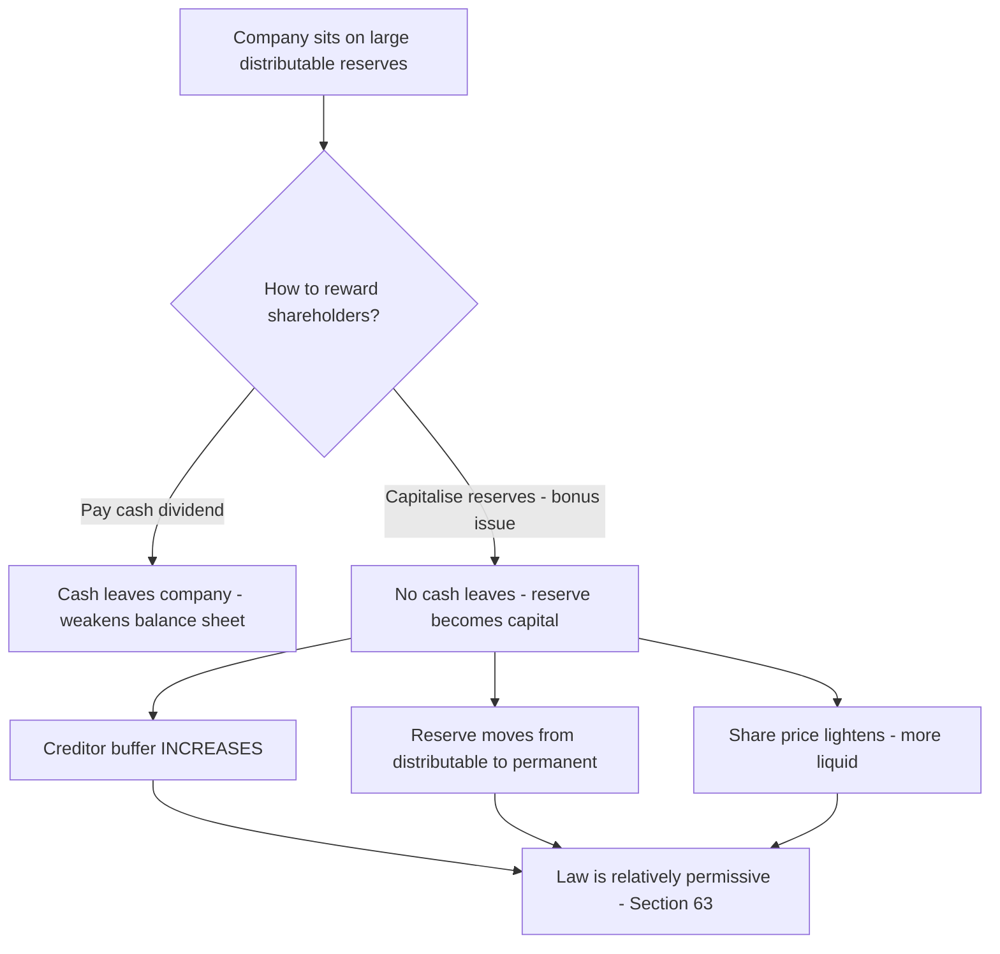
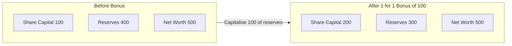
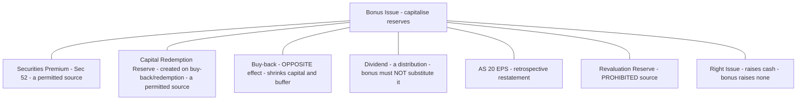

# Chapter 33 — Bonus Issue

## 1. The Problem

Picture a company that has been trading profitably for a decade. On its Balance Sheet sits a mountain of accumulated profit — say ₹40 crore in the General Reserve, plus another ₹15 crore in Securities Premium — against a paid-up share capital of only ₹10 crore. Legally, every rupee of that reserve *belongs* to the shareholders. It is their money, parked inside the company.

But this creates three uncomfortable problems.

**Problem 1 — The reserves are "trapped" and invisible.** A shareholder holding 1,000 shares of face value ₹10 owns ₹10,000 of *capital*, but her real claim is far larger once you add her slice of the reserves. The share certificate, however, still says ₹10,000. The value has piled up in a line item most retail investors never read. There is a mismatch between the *nominal* capital and the *real* capital employed in the business.

**Problem 2 — The share price becomes "heavy".** Years of retained profit push the market price to, say, ₹4,000 per share. That sounds great, but a ₹4,000 share is illiquid — small investors cannot buy a round lot, trading volumes thin out, and the stock looks intimidating. The company wants a *lighter*, more marketable price without doing anything drastic.

**Problem 3 — Rewarding shareholders drains cash.** The obvious way to hand accumulated profit back is a fat cash dividend. But cash is the lifeblood the company needs for its new factory. Paying out ₹40 crore of dividend would reward loyalty while simultaneously starving expansion. The board wants to say "thank you, you are richer" *without one rupee leaving the bank account.*

Is there a mechanism that (a) makes the trapped reserves visible and permanent, (b) lightens the share price, and (c) rewards shareholders — all without any cash outflow? Yes. It is the **bonus issue**.

## 2. The Core Idea (analogy)

> **A bonus issue is like slicing the same pizza into more pieces — then stamping "PERMANENT, DO NOT REFUND" on the extra slices.**

Imagine a pizza representing the total value of the company. Ten friends (shareholders) own it. Right now the pizza is cut into 10 large slices — one each. A bonus issue re-cuts the *same* pizza into 20 slices and gives each friend two slices instead of one. Nobody's share of the pizza has changed — everyone still owns one-tenth. No new pizza (cash) arrived. The pizza is exactly as big as before.

So what actually happened? Two subtle but real things:

1. **The slices are now smaller and more tradeable.** A friend who wants to sell "half his stake" can now hand over one slice instead of sawing a big slice in half. The price *per slice* falls proportionately (roughly halves), which is exactly the liquidity benefit the company wanted.

2. **A portion of "spendable" value got welded into the crust.** Here is the crucial accounting twist. Before the bonus, the reserves were *distributable* — they could have been paid out as dividend. After capitalisation, that same amount is now *share capital*, and share capital is the one thing a company can almost never hand back to shareholders (except through a painful, court/tribunal-supervised capital reduction). So the bonus issue takes soft, distributable reserve and **hardens it into permanent capital.** The friends got extra slices, but those slices are stamped "you can never ask for this back in cash."

This is why the technical name is **capitalisation of reserves** — you are converting reserve into capital. "Bonus" is almost a misnomer; nobody is richer by a rupee. What changes is the *form* (reserve → capital), the *permanence* (distributable → locked), and the *packaging* (fewer heavy shares → more light shares).

The one thing that genuinely improves is the **signal.** By voluntarily locking away distributable profit, the board is publicly betting that future earnings will be strong enough that it never needed that cushion. A bonus issue is management saying "we are so confident, we will permanently convert our rainy-day fund into capital." That confidence signal is the real economic content.

## 3. Why It's Built This Way

Every rule around bonus issues flows from one tension: **protecting creditors and market integrity, while letting companies reward shareholders bloodlessly.** Let us derive the rules rather than memorise them.

**Why capital can't easily be returned (and why that matters here).** Company law treats paid-up capital as the creditors' buffer — the cushion that must be maintained before profits can be paid out. This is the "capital maintenance" doctrine. When you capitalise a reserve into share capital, you are *increasing* that creditor buffer and *shrinking* the pool available for dividends. Creditors love this; it makes the company safer. That is precisely why the law is comparatively relaxed about bonus issues — a bonus issue strengthens the balance sheet's protective layer. Contrast this with a *buy-back* or *capital reduction*, which shrinks the buffer and therefore triggers heavy court/tribunal scrutiny.

**Why only *certain* reserves qualify.** If a bonus issue moves value from the "distributable" box to the "permanent capital" box, then logically you can only use reserves that were *available for distribution in the first place*, OR statutory reserves the law explicitly earmarks for this purpose. You cannot capitalise a reserve that represents an *unrealised* gain or a *notional* accounting adjustment, because that would be conjuring permanent capital out of profit that never actually materialised in cash or realised value. This single principle explains the entire "permitted vs prohibited sources" list you will meet in Part 4.

**Why the "no bonus in lieu of dividend" rule exists.** Suppose a company is contractually or by expectation obliged to pay a dividend, but is short of cash. Tempting trick: declare a *bonus issue* and tell shareholders "here, shares instead of your dividend cheque." The law forbids this. Why? Because a dividend is a *distribution* — value leaving the company — whereas a bonus is *capitalisation* — value being locked *in*. Dressing up a locked-in capitalisation as if it discharged a distribution obligation would deceive shareholders about what they actually received. So Section 63 bars issuing bonus shares *in lieu of dividend*.

**Why "no partly-paid shares" for the bonus.** The mechanism must be clean and complete. If bonus shares were issued partly paid, the company would later have to *call* the balance from shareholders — i.e., demand cash — which defeats the entire "no cash outflow, gift to shareholders" premise and creates a liability trap for members. Hence bonus shares must be issued **fully paid.** (There is a related, separate use of reserves: converting *existing* partly-paid shares into fully-paid ones by applying reserves — we will see the law treats these two situations differently.)

**Why SEBI adds extra rules for listed companies.** For a private company, a bonus issue is a family matter. For a *listed* company, thousands of public investors and an orderly market are involved, so SEBI (ICDR) Regulations bolt on timing and completion deadlines to prevent manipulation and half-finished issues. The Companies Act provides the skeleton; SEBI adds the market-conduct muscles.


*Figure 1 — The economic logic: a bonus issue strengthens the balance sheet, which is why the law permits it comparatively freely.*

## 4. Full Technical Content

### 4.1 The governing law

Bonus issues are governed by **Section 63 of the Companies Act, 2013** (read with Rule 14 of the Companies (Share Capital and Debentures) Rules, 2014). For **listed** companies, the **SEBI (Issue of Capital and Disclosure Requirements) Regulations, 2018 — Chapter XI (Regulations 293–295)** apply additionally.

### 4.2 Section 63(1) — the permitted sources

A company may capitalise its profits or reserves for the purpose of issuing fully paid-up bonus shares out of:

| # | Permitted source | Why it qualifies |
|---|------------------|------------------|
| (a) | **Free reserves** | Genuinely distributable accumulated profit; e.g., General Reserve, credit balance of Statement of P&L |
| (b) | **Securities Premium Account** | A statutory reserve; Section 52 expressly lists "issuing fully paid bonus shares" as a permitted use |
| (c) | **Capital Redemption Reserve (CRR)** | A statutory reserve created on buy-back / redemption of preference shares; law permits its use *only* for fully paid bonus shares |

**"Free reserves" defined** — Section 2(43): reserves available for distribution as dividend as per the latest audited Balance Sheet, **but excluding**:
- Any amount representing **unrealised gains, notional gains or revaluation of assets** (whether shown as a reserve or by crediting to P&L); and
- Any change in the carrying amount of an asset/liability recognised in equity (including surplus on measuring at fair value).

### 4.3 Section 63(2) — the conditions (the six gatekeepers)

A bonus issue is valid only if **ALL** of the following are satisfied:

1. **Authorised by Articles** — the Articles of Association must authorise the bonus issue. (If not, alter the Articles first.)
2. **Recommended by the Board, then authorised in general meeting** — the Board recommends and members approve.
3. **No default on debt-servicing** — the company has not defaulted in payment of interest or principal in respect of **fixed deposits** or **debt securities** issued by it.
4. **No default on statutory dues to employees** — no default in payment of **statutory dues of employees**, such as contribution to **provident fund, gratuity and bonus**.
5. **Partly-paid shares made fully paid** — any partly paid-up shares outstanding on the date of allotment are **made fully paid-up** (before or as part of the process).
6. **Compliance with prescribed conditions** — such other conditions as may be prescribed (Rule 14).

### 4.4 Section 63(3) — the two hard prohibitions

- The bonus shares **shall NOT be issued in lieu of dividend.**
- (Implicit throughout) bonus shares must be issued **fully paid-up** — never partly paid.

### 4.5 Sources that are NOT permitted for a bonus issue

This is heavily examined. Learn *why* each is barred (from Part 3's principle: no notional/unrealised amounts, no non-distributable adjustments).

| Reserve / balance | Bonus? | Reason |
|-------------------|:------:|--------|
| **Revaluation Reserve** | ✗ No | Represents an *unrealised* upward revaluation of assets — no real profit; excluded from "free reserves" by Sec 2(43) |
| **Capital Reserve arising from revaluation or without cash realisation** | ✗ No | Not a realised, distributable profit |
| Capital Reserve that is a **realised cash profit** (e.g., profit on sale of asset actually received in cash) | ✓ Possible* | If genuinely realised in cash and free — treat as free reserve. *ICAI's conservative default is to treat "Capital Reserve" as NOT available unless realised in cash; state your assumption in the exam |
| **Securities Premium** | ✓ Yes | Statutory permitted use (Sec 52) |
| **Capital Redemption Reserve (CRR)** | ✓ Yes | Only for fully paid bonus |
| **Dividend Equalisation Reserve / General Reserve / P&L surplus** | ✓ Yes | Free reserves |
| **Investment Allowance Reserve / statutory reserves with strings** | ✗ Usually No | Not freely distributable; earmarked |

> **Securities Premium & CRR — the golden restriction:** these two may be used **ONLY** to issue **fully paid** bonus shares. They can **NOT** be used to convert *existing partly-paid shares into fully-paid* ones. Free reserves, by contrast, can be used for *both* purposes.

### 4.6 The two distinct transactions students confuse

| | **Transaction A: Fully-paid bonus** | **Transaction B: Making partly-paid shares fully-paid** |
|---|---|---|
| What happens | *New* shares issued free, fully paid | *Existing* partly-paid shares converted to fully-paid using reserves (a bonus applied to the uncalled/unpaid amount) |
| Sources allowed | Free reserves, Securities Premium, CRR | **ONLY free reserves** (NOT premium, NOT CRR) |
| Governed strictly by Sec 63? | Yes — this is *the* bonus issue | Technically a separate application of reserves; Sec 63 focuses on fully-paid bonus. Exam usually asks Transaction A. |

### 4.7 SEBI ICDR (listed companies only) — extra conditions

- Bonus issue **only out of free reserves, securities premium (collected in cash), or CRR** — Securities premium collected **in kind** (e.g., on a non-cash amalgamation) cannot be used.
- **No bonus in lieu of dividend** (mirrors Sec 63).
- Bonus must be made within **stipulated time**: where **no shareholders' approval is required** (Articles already provide, board resolution suffices), complete within **15 days** of board approval; where **shareholders' approval IS required**, complete within **2 months** of the board meeting that approved it. Once announced, a bonus issue **cannot be withdrawn.**
- Company must not have defaulted on deposits/debt-securities and must have effected the conversion of any outstanding convertible instruments' entitlement.

### 4.8 The journal entries

There are two steps. Step 1 *declares* the bonus (moves reserve to a bridge account). Step 2 *applies* it (issues shares / makes them fully paid).

**Step 1 — Appropriate the reserves (debit reserves, credit "Bonus to Shareholders"):**

```
General Reserve A/c                 Dr.
Securities Premium A/c              Dr.
Capital Redemption Reserve A/c      Dr.
Profit & Loss A/c (surplus)         Dr.
      To Bonus to Shareholders A/c
(Being various reserves capitalised for bonus issue as per members' resolution dated __)
```

**Step 2A — Issue of *fully paid* bonus shares:**

```
Bonus to Shareholders A/c           Dr.
      To Equity Share Capital A/c
(Being bonus shares of ₹__ each issued fully paid)
```

**Step 2B — If instead making *existing partly-paid* shares fully paid** (only free reserves usable, and this needs a prior *call*):

```
(i) Make the final call:
Equity Share Final Call A/c         Dr.
      To Equity Share Capital A/c
(Being final call due on partly-paid shares)

(ii) Apply the bonus to satisfy the call (no cash from members):
Bonus to Shareholders A/c           Dr.
      To Equity Share Final Call A/c
(Being call money adjusted against bonus out of free reserves)
```

> **Note:** "Bonus to Shareholders A/c" is a temporary bridge/suspense account that opens and closes within the transaction — it never survives on the Balance Sheet.

### 4.9 Effect on the Balance Sheet

- **Total shareholders' funds / net worth: UNCHANGED.** (Reserve down, capital up, by exactly the same amount.)
- **Paid-up share capital: INCREASES** by (number of bonus shares × face value).
- **Reserves: DECREASE** by the same total amount.
- If the post-bonus capital would exceed **authorised capital**, the authorised capital must be **increased first** (alter the Capital clause of the Memorandum, Sec 61/64, and pay the fee) before allotment.
- **EPS falls** (same earnings ÷ more shares); **market price adjusts down** proportionately; **book value per share falls** — but *nobody's total wealth changes.*


*Figure 2 — Net worth is invariant; only the split between capital and reserves shifts.*

## 5. Worked Examples

### Example 1 — The plain-vanilla bonus (easy)

**Facts.** Sunrise Ltd has 10,00,000 equity shares of ₹10 each, fully paid (Share Capital ₹1,00,00,000). Reserves: General Reserve ₹80,00,000. The company declares a bonus of **1 share for every 2 held**, using General Reserve. Authorised capital is ₹2,00,00,000. Pass entries and show the effect.

**Step 1 — Number of bonus shares.**
Bonus shares = 10,00,000 × (1/2) = **5,00,000 shares.**
Bonus amount = 5,00,000 × ₹10 = **₹50,00,000.**

**Step 2 — Check authorised capital.**
New paid-up capital = ₹1,00,00,000 + ₹50,00,000 = ₹1,50,00,000 < ₹2,00,00,000 authorised. **OK, no increase needed.**

**Step 3 — Check General Reserve is sufficient.**
₹80,00,000 available ≥ ₹50,00,000 required. **OK.**

**Step 4 — Journal entries.**

```
General Reserve A/c                Dr.   50,00,000
      To Bonus to Shareholders A/c            50,00,000
(Being GR capitalised for 1:2 bonus)

Bonus to Shareholders A/c          Dr.   50,00,000
      To Equity Share Capital A/c             50,00,000
(Being 5,00,000 bonus shares of ₹10 each issued fully paid)
```

**Step 5 — Effect (reconciliation).**

| Item | Before | Change | After |
|------|-------:|-------:|------:|
| Equity Share Capital | 1,00,00,000 | +50,00,000 | 1,50,00,000 |
| General Reserve | 80,00,000 | −50,00,000 | 30,00,000 |
| **Net worth** | **1,80,00,000** | **0** | **1,80,00,000** |

Net worth unchanged. ✓ Self-verified.

### Example 2 — Multiple sources, priority of use, and premium issue (medium)

**Facts.** Vayu Ltd's Balance Sheet (extract):

| Equity & Reserves | ₹ |
|---|---:|
| Equity Share Capital (2,00,000 shares of ₹10, fully paid) | 20,00,000 |
| Securities Premium | 3,00,000 |
| Capital Redemption Reserve | 2,00,000 |
| General Reserve | 6,00,000 |
| Surplus in Statement of P&L | 4,00,000 |
| Revaluation Reserve | 5,00,000 |

The company resolves to issue bonus shares in the ratio **2:5** (2 bonus for every 5 held), fully paid at par. Company policy: **use statutory reserves (Securities Premium, CRR) first, then free reserves.** Authorised capital ₹30,00,000. Pass entries.

**Step 1 — Bonus shares.**
= 2,00,000 × (2/5) = **80,000 shares** → amount = 80,000 × ₹10 = **₹8,00,000.**

**Step 2 — Authorised capital check.**
New capital = 20,00,000 + 8,00,000 = 28,00,000 < 30,00,000. **OK.**

**Step 3 — Identify usable sources (trap check).**
- Revaluation Reserve ₹5,00,000 → **NOT usable** (unrealised). Exclude.
- Usable pool: Securities Premium 3,00,000 + CRR 2,00,000 + General Reserve 6,00,000 + P&L 4,00,000 = **₹15,00,000** ≥ ₹8,00,000 required. **OK.**

**Step 4 — Apply the priority (statutory first).**

| Source | Applied (₹) | Running total |
|--------|-----------:|--------------:|
| Securities Premium | 3,00,000 | 3,00,000 |
| Capital Redemption Reserve | 2,00,000 | 5,00,000 |
| General Reserve | 3,00,000 | 8,00,000 |
| **Total** | **8,00,000** | — |

(P&L surplus and remaining ₹3,00,000 of GR left untouched.)

**Step 5 — Entries.**

```
Securities Premium A/c              Dr.   3,00,000
Capital Redemption Reserve A/c      Dr.   2,00,000
General Reserve A/c                 Dr.   3,00,000
      To Bonus to Shareholders A/c            8,00,000
(Being reserves capitalised, statutory reserves used first)

Bonus to Shareholders A/c           Dr.   8,00,000
      To Equity Share Capital A/c             8,00,000
(Being 80,000 bonus shares of ₹10 each issued fully paid)
```

**Step 6 — Reconciliation.**

| Item | Before | After |
|------|-------:|------:|
| Equity Share Capital | 20,00,000 | 28,00,000 |
| Securities Premium | 3,00,000 | 0 |
| CRR | 2,00,000 | 0 |
| General Reserve | 6,00,000 | 3,00,000 |
| P&L surplus | 4,00,000 | 4,00,000 |
| Revaluation Reserve | 5,00,000 | 5,00,000 |
| **Net worth** | **40,00,000** | **40,00,000** |

Net worth invariant, Revaluation Reserve untouched. ✓

> **Note on why Securities Premium/CRR first is a *policy*, not a legal mandate:** the law lets you use any permitted source. But since Securities Premium and CRR are *restricted* reserves (they can only ever be used for a fully-paid bonus, redemption, etc.), a prudent company "spends" the restricted reserves first and preserves flexible free reserves. Exam problems often state the order; follow it. If silent, using free reserves is also acceptable — state your assumption.

### Example 3 — Partly-paid shares, making them fully paid, PLUS a fresh bonus (exam-hard)

**Facts.** Meghdoot Ltd:

| | ₹ |
|---|---:|
| 3,00,000 equity shares of ₹10 each, **₹8 called and paid up** | 24,00,000 |
| Securities Premium | 5,00,000 |
| Capital Redemption Reserve | 4,00,000 |
| General Reserve | 20,00,000 |
| Surplus in Statement of P&L | 6,00,000 |
| Revaluation Reserve | 3,00,000 |

The Board resolves, and members approve, to:
- **(a)** Make the existing partly-paid shares **fully paid** (i.e., call and pay the unpaid ₹2 per share) by utilising reserves; and
- **(b)** Issue **fully-paid bonus shares in the ratio 1:3** (1 new share for every 3 held).

Authorised capital is ₹40,00,000. Apply the correct sources and pass all entries. (Company policy: for the fresh fully-paid bonus, use Securities Premium and CRR first; free reserves for the rest.)

**Step 0 — The critical rule check.**
- **(a) Making partly-paid shares fully paid** → the unpaid ₹2 × 3,00,000 = **₹6,00,000** must come from **FREE RESERVES ONLY.** Securities Premium and CRR are **barred** for this purpose. Use General Reserve / P&L.
- **(b) Fresh fully-paid bonus** → Securities Premium and CRR **are** allowed. Use policy order.
- Revaluation Reserve ₹3,00,000 → **excluded** throughout (unrealised).

**Step 1 — Part (a): amount to make shares fully paid.**
Unpaid per share = ₹10 − ₹8 = ₹2. Shares = 3,00,000.
Amount = 3,00,000 × ₹2 = **₹6,00,000**, sourced from **General Reserve** (a free reserve).

Entries for (a):

```
Equity Share Final Call A/c         Dr.   6,00,000
      To Equity Share Capital A/c             6,00,000
(Being final call of ₹2 per share due on 3,00,000 shares)

General Reserve A/c                 Dr.   6,00,000
      To Bonus to Shareholders A/c            6,00,000
(Being free reserve capitalised to pay the final call)

Bonus to Shareholders A/c           Dr.   6,00,000
      To Equity Share Final Call A/c          6,00,000
(Being final call satisfied out of bonus - no cash from members)
```

After (a): all 3,00,000 shares are **fully paid ₹10.** Paid-up capital = ₹24,00,000 + ₹6,00,000 = **₹30,00,000.**

**Step 2 — Part (b): fresh bonus shares.**
Base for 1:3 = the **3,00,000 shares now held** → bonus shares = 3,00,000 × (1/3) = **1,00,000 shares.**
Bonus amount = 1,00,000 × ₹10 = **₹10,00,000.**

**Step 3 — Authorised capital check.**
Capital after (a) and (b) = 30,00,000 + 10,00,000 = **₹40,00,000** = authorised ₹40,00,000. **Exactly at the ceiling — OK** (no increase required, but zero headroom — worth a note).

**Step 4 — Sources for (b), applying policy (statutory first).**
Remaining reserves after (a): Securities Premium 5,00,000; CRR 4,00,000; General Reserve 20,00,000 − 6,00,000 = 14,00,000; P&L 6,00,000. Need ₹10,00,000.

| Source | Applied (₹) |
|--------|-----------:|
| Securities Premium | 5,00,000 |
| Capital Redemption Reserve | 4,00,000 |
| General Reserve | 1,00,000 |
| **Total** | **10,00,000** |

Entries for (b):

```
Securities Premium A/c              Dr.   5,00,000
Capital Redemption Reserve A/c      Dr.   4,00,000
General Reserve A/c                 Dr.   1,00,000
      To Bonus to Shareholders A/c           10,00,000
(Being reserves capitalised for 1:3 fully paid bonus)

Bonus to Shareholders A/c           Dr.  10,00,000
      To Equity Share Capital A/c            10,00,000
(Being 1,00,000 bonus shares of ₹10 each issued fully paid)
```

**Step 5 — Full reconciliation.**

| Item | Before | After (a) | After (b) |
|------|-------:|----------:|----------:|
| Equity Share Capital | 24,00,000 | 30,00,000 | 40,00,000 |
| Securities Premium | 5,00,000 | 5,00,000 | 0 |
| CRR | 4,00,000 | 4,00,000 | 0 |
| General Reserve | 20,00,000 | 14,00,000 | 13,00,000 |
| P&L surplus | 6,00,000 | 6,00,000 | 6,00,000 |
| Revaluation Reserve | 3,00,000 | 3,00,000 | 3,00,000 |
| **Net worth** | **62,00,000** | **62,00,000** | **62,00,000** |

Net worth is ₹62,00,000 throughout. ✓ Every rupee traced. Revaluation Reserve never touched. Securities Premium/CRR used only for the fully-paid bonus, never for the call. ✓ Self-verified.

## 6. Presentation & Disclosure

**In the Notes to Accounts / Board's Report (Schedule III, Companies Act 2013):**

- Under **"Share Capital"** notes, disclose the **reconciliation of the number of shares** outstanding at the beginning and end of the period — bonus shares issued during the year are shown as a separate line in this movement.
- Disclose, for the period of **five years** immediately preceding the reporting date, the **aggregate number of bonus shares** issued **without payment being received in cash** (a specific Schedule III requirement).
- **"Reserves and Surplus"** note must show each reserve's movement — the *reduction* on account of capitalisation for the bonus.
- The **Board's Report** discloses the bonus recommendation and the members' resolution.

**EPS (AS 20):** Bonus shares are treated as if they existed **at the beginning of the earliest period reported** — i.e., the weighted average number of shares is **restated retrospectively** for all periods presented, and prior-period EPS is **restated**. This is because no resources flowed in; the increase in shares is purely a re-slicing, so comparability demands prior EPS be re-computed on the enlarged share base.

**Authorised capital:** if increased to accommodate the bonus, disclose the enhanced authorised capital and the alteration of the Capital clause (Sec 61).

## 7. Connections


*Figure 3 — Bonus issue's web of connections across the syllabus.*

- **Securities Premium (Sec 52):** one of the few permitted uses of premium is a fully-paid bonus — the topics are two sides of one coin.
- **Capital Redemption Reserve:** you *create* CRR when you buy back shares or redeem preference shares out of profits; you may later *consume* it via a fully-paid bonus. Learn them together.
- **Buy-back of shares (Sec 68):** the mirror image. Buy-back *returns* capital and *reduces* the creditor buffer (hence tightly regulated); bonus *locks in* capital and *increases* the buffer (hence lighter regulation). A neat compare-and-contrast the examiner loves.
- **Dividend:** a bonus is emphatically *not* a dividend — no distribution, no cash, and it cannot be issued *in lieu of* dividend.
- **Rights issue:** both increase the number of shares, but a rights issue *brings in cash* at a (usually discounted) price, whereas a bonus brings in nothing and is free.
- **AS 20 (EPS):** retrospective adjustment of the share count.
- **Redemption of preference shares / debentures:** these create the CRR/reserves that later fuel bonuses.

## 8. Traps & Examiner Tricks

1. **Revaluation Reserve trap.** The single most common trick: the problem lists a fat Revaluation Reserve, hoping you use it. You **cannot** — it is unrealised. Cross it out on sight.
2. **Capital Reserve ambiguity.** A "Capital Reserve" is usable *only if it is a realised cash profit*. If the problem says it arose on revaluation, or is silent about realisation, the safe ICAI approach is to treat it as **not available** — and *state your assumption* explicitly.
3. **Securities Premium / CRR for partly-paid conversion.** Examiners plant partly-paid shares and hope you use Securities Premium or CRR to make them fully paid. **Forbidden.** Only **free reserves** may make partly-paid shares fully-paid. Securities Premium and CRR are for **fully-paid bonus only.**
4. **Authorised capital ceiling.** Always check whether post-bonus paid-up capital breaches authorised capital. If it does, you must **first increase authorised capital** (Sec 61) — mention the alteration and the fee. Forgetting this loses marks.
5. **The base for the ratio.** After you make partly-paid shares fully paid (or issue an earlier tranche), a subsequent bonus ratio applies to the **updated** number of shares — read the sequence carefully. In Example 3, the 1:3 applied to 3,00,000, not to any inflated figure.
6. **"Bonus in lieu of dividend."** If a problem hints the company is short of cash and wants to give shares *instead of* declaring the dividend it promised — flag it as **prohibited by Sec 63(3).**
7. **Partly-paid bonus shares.** Bonus shares themselves must be **fully paid.** Never issue them partly paid.
8. **Default conditions.** If the problem mentions the company defaulted on fixed deposits, debt securities, or statutory employee dues (PF/gratuity/bonus), the bonus is **not permitted** until the default is cured — Sec 63(2).
9. **Net worth "gotcha".** A conceptual MCQ may ask "what happens to net worth / reserves+capital total?" Answer: **unchanged.** Only the internal split shifts. Anyone who says net worth rises has missed the whole idea.
10. **Free reserves definition.** "Free reserves" **excludes** unrealised/notional/fair-value gains and revaluation surplus — even if such gains sit in the P&L surplus line. Don't blindly use the entire P&L balance if part of it is a fair-value gain.
11. **Priority of sources when silent.** If the problem doesn't specify an order, either order is defensible; but a prudent answer exhausts the *restricted* reserves (Securities Premium, CRR) first. State your assumption.
12. **Listed-company timelines.** For a listed company, watch the SEBI completion windows — **15 days** (no shareholder approval needed) or **2 months** (approval needed) — and that a bonus, once announced, **cannot be withdrawn.**

## 9. First-Principles Recap

Strip everything away and here is the skeleton you can rebuild the whole topic from:

- A company's reserves **belong to shareholders** but sit *trapped and distributable* inside the firm.
- The board wants to **reward shareholders without paying cash** and **lighten the share price.** The tool is to **capitalise reserves** — convert reserve into share capital — and hand out the resulting shares free.
- Because this **increases permanent capital and the creditor buffer**, the law (Sec 63) is comparatively permissive: authorised by Articles, approved by Board + members, no defaults on debt/deposits/employee dues, partly-paid shares squared up first.
- You may only capitalise **genuinely distributable or statutorily earmarked reserves** — **free reserves, securities premium, CRR.** You may **never** use **unrealised/notional** amounts (revaluation reserve) — because you cannot mint permanent capital from profit that was never real.
- **Securities Premium and CRR are restricted:** fully-paid bonus **only** — they cannot make partly-paid shares fully paid. **Free reserves** can do **both.**
- Bonus shares must be **fully paid** and must **never be issued in lieu of dividend** (a capitalisation is not a distribution).
- The accounting is a single movement: **debit reserves, credit share capital** (via a bridge "Bonus to Shareholders" account). **Net worth never changes** — reserve down, capital up, equal and opposite.
- Everything else — EPS restatement, disclosure of five-year bonus history, authorised-capital check, SEBI timelines — follows from these truths.

If you can derive the permitted-source list from "no permanent capital out of unreal profit," and derive the "no bonus in lieu of dividend" rule from "capitalisation ≠ distribution," you never have to memorise anything.

## 10. Quick-Revision Sheet

| Topic | Key point |
|---|---|
| **Governing law** | Sec 63, Companies Act 2013 + Rule 14; SEBI ICDR Ch. XI (listed) |
| **What it is** | Capitalisation of reserves into fully-paid bonus shares — no cash |
| **Permitted sources** | (a) Free reserves (b) Securities Premium (c) CRR |
| **Prohibited sources** | Revaluation Reserve; unrealised/notional/fair-value gains; capital reserve not realised in cash; earmarked statutory reserves |
| **Restricted-use reserves** | Securities Premium & CRR → **fully-paid bonus ONLY** (not for partly-paid conversion) |
| **Free reserves** | Usable for both fully-paid bonus AND making partly-paid shares fully paid |
| **Sec 63(2) conditions** | Authorised by Articles; Board + members approval; no default on FDs/debt securities; no default on employee PF/gratuity/bonus; partly-paid shares made fully paid; other prescribed conditions |
| **Sec 63(3) prohibitions** | Not in lieu of dividend; must be fully paid |
| **Free reserves — Sec 2(43)** | Distributable per latest audited BS; **excludes** unrealised/notional gains & revaluation |
| **Entry — declare** | Reserves A/c Dr. → To Bonus to Shareholders A/c |
| **Entry — issue** | Bonus to Shareholders A/c Dr. → To Equity Share Capital A/c |
| **Entry — partly→fully paid** | Final Call A/c Dr. → To Capital; then Bonus to SH A/c Dr. → To Final Call A/c |
| **Effect on net worth** | **NIL** (reserve ↓, capital ↑, equal) |
| **Effect — capital** | ↑ by bonus shares × face value |
| **Authorised capital** | Increase first (Sec 61) if post-bonus capital exceeds it |
| **EPS (AS 20)** | Restate retrospectively — bonus deemed to exist from earliest period |
| **Disclosure** | Share reconciliation; 5-yr aggregate bonus issued without cash; reserve movement |
| **SEBI timeline (listed)** | 15 days (no member approval needed) / 2 months (approval needed); once announced, cannot be withdrawn |
| **#1 exam trap** | Never use Revaluation Reserve; never use Sec Premium/CRR to make partly-paid shares fully paid |

**Bonus share count formula:** Bonus shares = Existing shares × (bonus ratio numerator ÷ denominator).
**Bonus amount:** Bonus shares × face value.
**Golden self-check:** *Total reserves + total capital before = after.* If not, you made an error.
