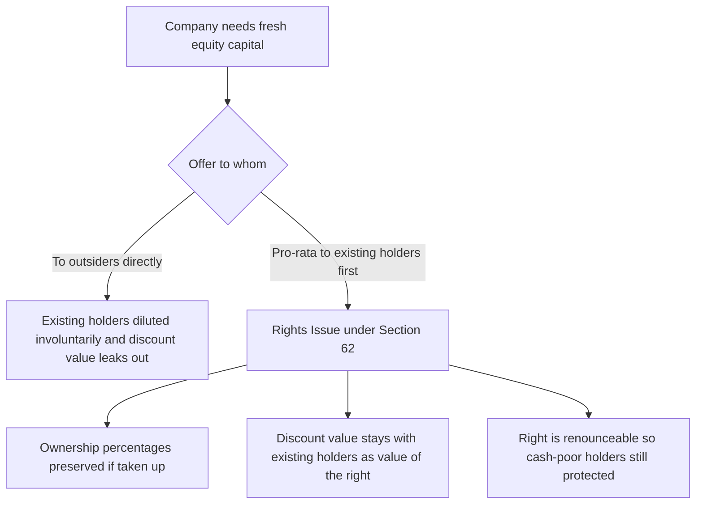
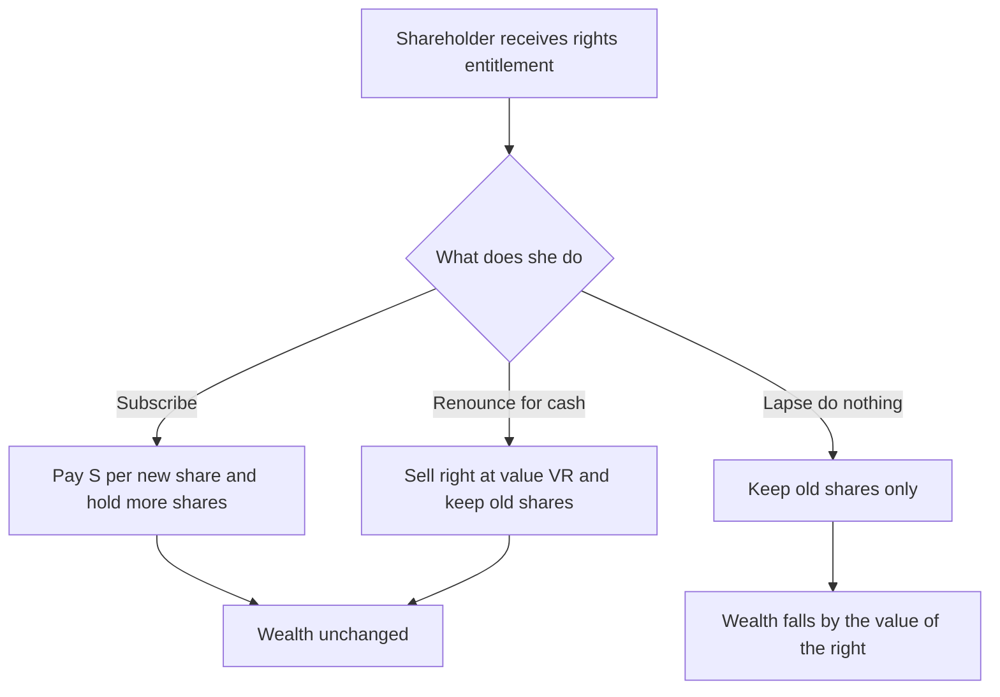

<!-- v2-deep -->

# Chapter 34 — Rights Issue

## 1. The Problem

Imagine you own 10% of a company. Not on paper as a vague feeling — you literally own 10,000 shares out of 1,00,000 issued. That 10% is not just a claim on 10% of the dividends. It is 10% of the *voting power*, 10% of the reserves that have been built up out of retained profits, and a 10% say in who sits on the board. You paid for that slice, and it is yours.

Now the company needs fresh money. It wants to raise ₹50,00,000 by issuing 50,000 new shares. Suppose it simply sells those 50,000 shares to a large outside investor. What just happened to you?

The total share count jumped from 1,00,000 to 1,50,000. You still hold your 10,000 shares — nobody took them — but 10,000 out of 1,50,000 is now only **6.67%**. Your voting power fell by a third. If the company had ₹40,00,000 of accumulated reserves that you had a moral and economic claim on, your share of those reserves silently shrank too. And the outside investor, who arrived only today, now controls a chunk of the profits *you* helped generate in prior years.

You have been **diluted** — and worse, you were diluted *involuntarily*. You did nothing wrong. You simply held your shares while the company handed ownership to a stranger.

This is the core problem: **when a company issues new equity, whoever is left out loses proportional ownership, control, and their claim on retained wealth — without consent and without compensation.** A share is a fractional ownership right; the moment new fractions are minted, every existing fraction becomes a smaller piece of the pie unless the existing owners get to keep pace.

There is a second, subtler problem hiding underneath. New shares are almost always offered at a **discount** to the current market price (to make sure the issue is fully taken up). If a share trades at ₹200 and the company offers new shares at ₹120, that ₹80 gap is real value being created and handed to whoever gets the new shares. If outsiders get them, that value walks out the door. Existing shareholders paid for the company reaching ₹200; why should someone else pocket the discount?

There is even a **third** layer, the one students rarely articulate. Dilution is not a single thing — it is three distinct dilutions bundled together, and separating them is how examiners test whether you *understand* the problem:

- **Ownership / voting dilution** — your percentage of the vote falls (10% → 6.67% above). This is a *control* loss and cannot be undone by any dividend.
- **Wealth / value dilution** — the market value of your holding drops because the discount hands value to newcomers. This is the loss the *value of the right* is engineered to neutralise.
- **Earnings-per-share (EPS) dilution** — the same profit is now divided over more shares, so reported EPS falls even if the business is unchanged. This one is *unavoidable* by any mechanism (more shares always means lower EPS on the same profit); the rights issue does not promise to protect EPS, only proportional wealth and control.

Keep these three separate. The rights issue fully cures the first two *for a subscriber*; it partially cures them for a renouncer (control still slips a little in absolute terms if others come in, but wealth is preserved); and it does nothing about the third by design. A question that says "prove the shareholder suffers no dilution" is really asking you to prove **wealth** neutrality — not EPS neutrality, which is impossible.

The **rights issue** is the mechanism company law and finance jointly built to solve the first two problems at once.

## 2. The Core Idea

Here is the analogy. Think of a housing cooperative society with 100 members, each owning one flat, and the society jointly owns the land, the compound wall, the water tank, and a healthy reserve fund. The society decides to construct 50 new flats and needs money.

If it sells those 50 new flats to outsiders, the existing 100 members are suddenly a minority in *their own society*. The reserve fund they built, the shared land — all now split 150 ways instead of 100.

A fair society says instead: **"Before we let any outsider in, every existing member gets the first right to buy the new flats in proportion to what they already own."** A member with 1 flat out of 100 (1%) gets offered 1% of the 50 new flats. If everyone takes up their offer, the ownership percentages stay *exactly* the same — everyone still owns the same fraction. Nobody is diluted. The society raises its money, and control stays with the people who already own it.

That "first right, in proportion, before anyone outside" is the **right** in a rights issue. A rights issue is not a favour to shareholders — it is the *default fairness rule* baked into the very idea of proportional ownership. The new shares are offered **to existing equity shareholders, pro-rata to their current holding, before any outsider is approached.**

The word "right" is precise: it is an *entitlement*, not an obligation. You may take it, or you may sell it, or you may let it lapse. But the choice — and any value attached to it — belongs to you, because the dilution being prevented is *your* dilution.

One sharpening worth carrying into the exam: the right is often called a **pre-emptive right**. "Pre-emptive" means *ahead of everyone else in time* — you get to pre-empt outsiders. This is the same pre-emption idea that appears in a private company's articles (restrictions on transfer of shares) and in shareholders' agreements ("right of first refusal"). The rights issue is simply the *company-law statutory version* of pre-emption applied to the issue of *new* shares, whereas a transfer pre-emption applies to *existing* shares changing hands. Do not confuse the two: Section 62(1)(a) governs new issues; transfer pre-emption governs secondary sales.

## 3. Why It's Built This Way

Why does the law force this, rather than trusting management to be fair?

**Because management's incentives are not always aligned with existing shareholders.** A promoter-manager who wants to increase his own stake, reward a friendly investor, or entrench control has every reason to place fresh shares selectively with allies at a discount. Left unchecked, "issue new shares to whoever we like at whatever price we like" is one of the most powerful tools for expropriating minority shareholders ever invented. So the law makes the pro-rata offer the **default that must be followed** unless shareholders themselves vote to waive it.

**Why pro-rata specifically?** Because proportionality is the only allocation that leaves every shareholder exactly where they started. Any other split changes relative power. Pro-rata is the unique "do no harm" distribution. Mathematically: if every holder is offered new shares equal to (their holding ÷ total holding) × new shares issued, then *after* the issue each holder's new fraction = (old holding + their allotment) ÷ (old total + new total) simplifies back to exactly (old holding ÷ old total). Proportionality is a *fixed point* of the dilution operation — the only distribution that maps every percentage back to itself. That is not an accident of finance; it is arithmetic.

**Why offer at a discount at all, if the point is fairness?** Two reasons. First, to guarantee take-up: if the offer price were above market, nobody would subscribe (why pay ₹210 through the rights when you can buy at ₹200 in the market?), and the issue would fail. The price must be *below* market to be attractive. Second — and this is the beautiful part — **when the offer is pro-rata, the discount does not actually transfer wealth away from anyone.** The value of the discount reappears as the "value of the right." Every shareholder either captures it by subscribing, or captures it by selling the right. The discount is money moving from your right hand to your left hand. We will prove this arithmetically in Section 5, and it is the single most important idea in the chapter.

**Why make the right renounceable?** Because a shareholder who cannot afford to subscribe should not be forced to choose between finding cash and being diluted for free. If the right has value, that value should be realisable in cash by *selling* the right to someone who will subscribe. Renunciation converts "use it or lose it" into "use it or sell it," which is what makes the anti-dilution protection genuinely fair to cash-constrained holders.

**Why doesn't the law simply mandate the "fair" issue price and remove the discount?** Because there *is* no single observable fair price — market prices move minute to minute, and a rights issue takes weeks to complete. If the law fixed a price and the market fell below it before the offer closed, the whole issue would collapse (nobody subscribes above market). The discount is a *buffer* against price movement during the offer window. And because pro-rata neutralises the discount anyway, the law can afford to be silent on price for route (a) — the mechanism, not the price, does the protecting. Contrast route (c), where there is no pro-rata mechanism to protect anyone, so the law *must* import an external safeguard: a registered valuer's report. The presence or absence of a valuation requirement is therefore a direct signal of whether the mechanism itself is self-protecting.

So the architecture — pro-rata, at a discount, renounceable, waivable only by shareholder vote — is not a random bundle of rules. Each piece plugs a specific hole in the fairness of raising equity.


*Figure 1 — Why the rights route is the default fair path for raising equity.*

## 4. Full Technical Content

### 4.1 The governing law — Section 62 of the Companies Act 2013

Section 62(1) is the statutory home of the rights issue. It applies **whenever a company having a share capital proposes to increase its subscribed capital by the issue of further shares.** The section channels such further shares into three routes:

| Route | Section | To whom | Approval needed |
|---|---|---|---|
| Rights issue | 62(1)(a) | Existing equity shareholders, pro-rata to holdings | Board resolution |
| Employee stock options (ESOP) | 62(1)(b) | Employees under a scheme | Special resolution (ordinary resolution for private companies) |
| Preferential / private placement to any persons | 62(1)(c) | Anyone the company chooses | Special resolution + valuation by registered valuer |

The default is (a) — the rights issue. To go to outsiders under (c) and bypass existing shareholders, the company must pass a **special resolution** (75% majority), i.e. the shareholders themselves must vote to give up their pre-emptive right. This is the statutory expression of "waivable only by the owners."

**A crucial scope point (the "further shares" trigger).** Section 62 bites only on an increase in *subscribed* capital by issue of *further* shares — and only for a **company having a share capital**. Two consequences students miss:

- **Timing.** Section 62 does **not** apply to the shares a company issues at incorporation or up to the point of its first allotment against the initial subscribers; those are the promoters' subscribed shares, not "further" shares. The pre-emptive machinery kicks in only for *subsequent* issues.
- **Conversion of loans/debentures into shares.** Section 62(3) carves out an exception: where a company has taken a loan and the *terms of the loan* (approved by special resolution *before* the loan was raised) give an option to convert the loan/debentures into shares, that conversion is **not** subject to the pro-rata rights procedure. The logic is first-principles: the shareholders already consented, in advance, by special resolution, so the pre-emptive protection was knowingly waived at the outset.

**Private companies.** Section 62 applies to private companies too, but a private company can, by its **articles or by the terms of the offer**, modify some operational features — for instance the ICAI-examinable point that a private company may dispense with or vary the renunciation facility. Always read the articles in a private-company problem.

### 4.2 The mandatory features of a Section 62(1)(a) rights offer

The offer must satisfy every one of these conditions:

1. **Pro-rata entitlement** — offered to existing equity shareholders in proportion to the paid-up capital on their shares as on a specified record date.
2. **Letter of offer** — a formal offer document stating the number of shares offered and the terms.
3. **Minimum offer period** — the offer must stay open for **not less than 15 days and not more than 30 days** from the date of the offer. (For listed companies, SEBI ICDR norms govern the timeline separately, but the Act's 15–30 day window is the base rule.) If not accepted within the period, it is **deemed to have been declined.**
4. **Right of renunciation** — unless the articles provide otherwise, the offer **includes a right to renounce** the shares in favour of any other person. The letter of offer must say so [Section 62(1)(a)(ii)].
5. **Disposal of non-accepted shares** — Section 62(1)(a)(iii): if a shareholder declines or does not respond, the Board may dispose of the unsubscribed shares "in such manner **which is not disadvantageous to the shareholders and the company.**" This lets the Board place the leftover shares but bars them from doing so on sweetheart terms.

**A finer distinction on notice.** The 15–30 day clock and the offer must be communicated by a *notice* (the letter of offer). The proviso allows the notice period to be **shortened if not less than 90% of the members** of the class have given their consent in writing or electronically. So "the offer was open only 12 days" is *not automatically* a violation — check whether ≥90% consent shortened it. This is a favourite examiner trap: they slip in the 90% consent fact and see if you still cry "illegal."

**Deemed decline is a default, not a penalty.** If a member neither accepts nor renounces within the window, the entitlement lapses ("deemed to have been declined") and flows into the unsubscribed pool disposed under (a)(iii). Nothing is confiscated wrongfully — the member simply chose not to act. Tie this back to Section 1's three dilutions: the lapser suffers *wealth* dilution equal to the value of the right, which is the whole reason renunciation exists.

### 4.3 The pricing question — why below market

The **issue price** (also called the subscription price or rights price) is set by the Board, typically well below the current market price to ensure the issue is fully subscribed. Unlike route (c), a rights issue under (a) does **not** require a registered valuer's report, precisely because the pro-rata mechanism protects everyone regardless of price — the discount is neutralised by the value of the right (proved below).

Key vocabulary:

- **Cum-rights price (M):** the market price of a share *before* it goes ex-rights — i.e. while the share still carries the right attached.
- **Issue / subscription price (S):** the price at which new rights shares are offered. Always S < M for the offer to be attractive.
- **Rights ratio (N : 1 style):** the proportion, e.g. "1 new share for every 4 held."
- **Theoretical Ex-Rights Price (TERP):** the price a share *should* trade at once the rights have been detached and the new shares issued.
- **Value of the Right (VR):** the value attached to the entitlement itself, per existing share held.

**How deep can the discount go?** In principle S can be anything strictly below M — even far below, right down towards face value. A *deeper* discount does **not** hurt shareholders; it merely makes VR larger and TERP lower, shifting more value into the "right" and less into the residual share, but leaving total wealth untouched. This is worth internalising because examiners love a "60% discount, surely someone loses" scare. The only hard floor is the law: shares cannot be issued **below par (face value)** except under the strict Section 53 prohibition on issue at a discount (with the narrow Section 54 sweat-equity exception). So a rights issue can be at par or at any premium, but **never below face value.** If a problem sets S below face value, the correct answer is "impermissible under Section 53," not a TERP calculation.

### 4.4 Theoretical Ex-Rights Price (TERP) — the master formula

The whole market value of the company after the issue is the *old value plus the new money*. TERP is simply that total, averaged over the *new, larger* number of shares.

For a rights ratio of **"n new shares for every N old shares held"** at issue price **S**, with cum-rights price **M**:

$$
\text{TERP} = \frac{(N \times M) + (n \times S)}{N + n}
$$

Read it as: take a bundle of N existing shares (worth N × M) plus the n new shares you subscribe (costing n × S). The bundle's total value divided by the total number of shares (N + n) is the per-share value afterwards.

**Why TERP is a weighted average, and why that matters.** TERP is nothing more than the *weighted average of the old price and the issue price*, weights being the counts N and n. It therefore always lies **strictly between S and M** (S < TERP < M) whenever S < M. Two instant sanity checks fall out of this:

- If your computed TERP is *above* M or *below* S, you have made an arithmetic error — stop and recheck.
- The heavier the rights ratio (larger n relative to N, i.e. more new shares per old share), the closer TERP is pulled *towards* S, so the bigger the price drop and the bigger VR. A 1-for-1 issue at a deep discount moves TERP a long way; a 1-for-20 issue barely moves it.

**Alternative but identical framing (total-value method).** For a whole company: TERP = (Market cap before + Cash raised) ÷ (Total shares after). Use this when a problem gives you aggregate figures (total market cap, total money raised) rather than a per-share ratio. It is the *same* formula, un-normalised. Always keep one method as a cross-check on the other.

### 4.5 Value of the Right (VR) — two equivalent formulas

**Formula A (from the price drop).** When a share goes ex-rights, its price falls from M to TERP. That entire fall is not a loss — it is value that has moved *out of the share and into the right*. Therefore:

$$
\text{Value of one right (per old share)} = M - \text{TERP}
$$

**Formula B (the direct discount-sharing formula).** The value of the right per *new* share equals the discount spread over the bundle:

$$
\text{VR per new share} = \frac{N \times (M - S)}{N + n} = M - \text{TERP}
$$

Wait — read Formula B carefully, because the labels trip students. The expression N(M − S)/(N + n) as written actually equals (M − TERP) × (N/n)... let us be precise and avoid the classic mislabelling:

- **VR per OLD share held** = M − TERP. *(This is the drop on each share you already own.)*
- **VR per NEW share subscribed** = M − TERP scaled up by N/n, and also equals (M − S) − (M − TERP) reasoning aside, the clean closed form is:

$$
\text{VR per new share} = \frac{N}{n}\,(M - \text{TERP}) = \frac{N(M-S)}{N+n}
$$

The safe, exam-proof rule: **compute TERP first, then VR per old share = M − TERP, then scale by N/n if the question wants "per right/new share."** The reconciliation identity to memorise is:

$$
\text{VR per old share} = \frac{n}{N} \times \text{VR per new share}
$$

The intuition: the total discount captured is (M − S) on each new share; that value is shared across the whole post-issue bundle, and each existing share ends up holding its slice of it.


*Figure 2 — The chain from cum-rights price to value of the right.*

### 4.6 The accounting entries

A rights issue is, mechanically, just an issue of shares — usually at a premium (issue price above face value). The accounting is ordinary share-issue accounting; there is no special "rights" ledger complexity. Assume face value ₹10 and rights price ₹120 (so premium ₹110).

**(a) On receipt of application and allotment money** (rights issues are commonly made payable in full on application, or in application + allotment; assume full amount on application here):

| Particulars | Dr (₹) | Cr (₹) |
|---|---|---|
| Bank A/c | XXX | |
| &nbsp;&nbsp;To Equity Share Application & Allotment A/c | | XXX |
*(Being application money received on rights shares at ₹120 each)*

**(b) On allotment — transferring to capital and securities premium:**

| Particulars | Dr (₹) | Cr (₹) |
|---|---|---|
| Equity Share Application & Allotment A/c | XXX | |
| &nbsp;&nbsp;To Equity Share Capital A/c (face value ₹10) | | XXX |
| &nbsp;&nbsp;To Securities Premium A/c (premium ₹110) | | XXX |
*(Being rights shares allotted; face value to capital, excess to securities premium under Section 52)*

Note two things:

- The **premium goes to Securities Premium A/c** under Section 52 and can be used only for the restricted purposes there (issuing bonus shares, writing off preliminary expenses, premium on redemption, buy-back expenses). It is **not** a free reserve.
- There is **no entry for the "value of the right" itself.** The value of the right is a *market* phenomenon that lives outside the company's books. The company records only the cash it receives (S per share). Renunciation between shareholders is a private transaction that never touches the company's ledgers — the company simply allots to whoever presents the accepted letter of offer.

**(c) If the issue is at par** (rare, but possible), there is simply no Securities Premium line; the whole amount is share capital.

**(d) If the money is called in instalments.** Rights issues *can* be structured like an ordinary issue with application, allotment, and call stages. Then you run the full sequence — Share Application A/c, Share Allotment A/c, Share First Call A/c, etc. — with premium conventionally credited at the *allotment* stage (unless the terms say otherwise). If any allottee fails to pay a call, the usual **calls-in-arrears / forfeiture** machinery applies exactly as in a fresh public issue; there is nothing rights-specific about it. Recognise that a "rights issue with calls-in-arrears" question is really a shares-accounting question wearing a rights costume.

**(e) Rights issue expenses.** Costs of making the issue (legal, printing, registrar fees) are *not* netted against Securities Premium in the way share *discount* used to be; under the current framework issue expenses are generally charged to the Statement of Profit and Loss (or, where permitted, adjusted per the applicable standard). Do not casually debit Securities Premium for general issue expenses — Section 52 lists the *only* permitted debits, and "issue expenses of a rights issue" is not one of them (only certain premium-on-redemption and buy-back/preliminary items are). Verify against current ICAI material for the precise treatment expected in your attempt.

### 4.7 Renunciation — the mechanics

When a shareholder does not want to subscribe but the right has value, she **renounces** the entitlement in favour of another person, usually for cash. The company's letter of offer contains a renunciation form. Flow:

- **Original shareholder** signs the renunciation portion, naming the renouncee (or, for listed shares, sells the "rights entitlement" through the market during the rights trading period).
- **Renouncee** submits the form with the application money.
- **Company** allots the shares directly to the renouncee.

The original shareholder receives cash equal to (roughly) the value of the right and thereby avoids being diluted "for free" — she has monetised her protection. The renouncee pays (issue price + price of the right) and ends up paying about the fair post-issue value.

**Partial renunciation and cherry-picking.** A shareholder need not treat the entitlement as all-or-nothing. She may **subscribe to part, renounce part, and lapse the rest** — three different destinations for one entitlement. This is what makes "compute the shareholder's net position" problems fiddly: you must track each slice separately (subscribed slice → cash out + shares in; renounced slice → cash in; lapsed slice → pure loss of that slice's VR). Example 5 below drills exactly this.

**"Renunciation in favour of a nominee" vs market sale.** For an unlisted company there is no rights-trading market, so renunciation is a private assignment of the letter of offer to a named person at a privately negotiated price (which may or may not equal theoretical VR). For a listed company, SEBI's framework makes the *Rights Entitlement (RE)* itself a tradable, dematerialised instrument that trades on the exchange for a defined window — so VR becomes an actual observable market price. In exams, unless told otherwise, use *theoretical* VR.

### 4.8 Fully vs partly paid, and the record date

Entitlement is based on holdings **as on the record date**. Shares bought "cum-rights" (before the record/ex date) carry the right; shares bought "ex-rights" (on or after) do not. This is why market prices visibly step down on the ex-rights date — the right has detached.

**Partly-paid shares.** Section 62(1)(a) speaks of proportion to the **paid-up** capital, but in practice entitlement is generally reckoned on the *number* of shares held on the record date; where shares are partly paid the offer document specifies the basis. For clean CA-Inter numericals the shares are almost always fully paid — but if a problem hands you partly-paid shares, read the terms carefully rather than assuming.

**Record date is a cut-off, not a payment date.** The record date fixes *who* is entitled; it is not when money moves. Between the record date and the close of the offer, the *right* lives separately from the share. On listed markets this creates the visible "ex-rights" price step. In an exam, the phrase "cum-rights market price" is your signal that the quoted M already includes the value of the right and is the correct input to the TERP formula — see Trap 4.

## 5. Worked Examples

### Example 1 — The clean base case (everyone subscribes)

**Facts.** Sunrise Ltd has 4,00,000 equity shares of ₹10 each, currently trading at ₹50 (cum-rights). It makes a rights issue of **1 new share for every 4 held**, at an issue price of ₹30.

**Step 1 — How many new shares?**
4,00,000 ÷ 4 = **1,00,000 new shares.** Money raised = 1,00,000 × ₹30 = **₹30,00,000.**

**Step 2 — TERP.** Here N = 4, n = 1, M = 50, S = 30.

$$
\text{TERP} = \frac{(4 \times 50) + (1 \times 30)}{4 + 1} = \frac{200 + 30}{5} = \frac{230}{5} = ₹46
$$

**Step 3 — Value of the right (Formula A).**
VR = M − TERP = 50 − 46 = **₹4 per existing share held.**

**Step 4 — Cross-check with Formula B.**
VR per new share = N(M − S)/(N + n) = 4(50 − 30)/5 = 80/5 = **₹16 per new share.** Since 1 new share arises from 4 old shares, the value per *old* share = 16 ÷ 4 = **₹4.** ✔ Reconciles with Step 3.

**Step 5 — Prove no shareholder is worse off.** Take a holder of 4 shares (the natural bundle).
- Before: 4 shares × ₹50 = ₹200 of value, no extra cash spent.
- Subscribes to 1 new share: pays ₹30. Now holds 5 shares.
- After: 5 shares × ₹46 (TERP) = ₹230. But she spent ₹30 cash. Net wealth = ₹230 − ₹30 = **₹200.** ✔ Identical to before. She is exactly as wealthy; she has simply converted ₹30 of cash into ₹30 of share value. **Zero dilution, zero wealth transfer.**

**Journal entries** (face value ₹10, premium ₹20, full amount on application):

| Particulars | Dr (₹) | Cr (₹) |
|---|---|---|
| Bank A/c | 30,00,000 | |
| &nbsp;&nbsp;To Equity Share Application & Allotment A/c | | 30,00,000 |
| Equity Share Application & Allotment A/c | 30,00,000 | |
| &nbsp;&nbsp;To Equity Share Capital A/c (1,00,000 × ₹10) | | 10,00,000 |
| &nbsp;&nbsp;To Securities Premium A/c (1,00,000 × ₹20) | | 20,00,000 |

### Example 2 — Renunciation, proving the seller is protected

**Facts.** Same Sunrise Ltd rights issue as Example 1 (1-for-4 at ₹30; M = ₹50; TERP = ₹46; VR = ₹4 per old share). Mr. Rao holds **400 shares** but has no cash to subscribe. He **renounces** his entitlement.

**Step 1 — Rao's entitlement.** 400 ÷ 4 = **100 new shares.**

**Step 2 — Value of Rao's rights.** VR is ₹4 per *old* share held, and Rao holds 400 → total right value = 400 × ₹4 = **₹1,600.** (Equivalently ₹16 per new share × 100 new shares = ₹1,600. ✔)

**Step 3 — Rao sells the rights for ₹1,600** to Ms. Iyer, then walks away.

**Step 4 — Is Rao made whole?**
- Before: 400 shares × ₹50 = ₹20,000.
- After: he keeps 400 shares, now worth ₹46 each (they went ex-rights) = 400 × ₹46 = ₹18,400. Plus the ₹1,600 cash from selling rights.
- Total = 18,400 + 1,600 = **₹20,000.** ✔ Rao is exactly as wealthy as before, despite not subscribing. **The renunciation captured his anti-dilution value in cash.** This is the whole point of renounceability.

**Step 5 — Does Iyer overpay?**
- Iyer pays ₹1,600 for the rights + 100 × ₹30 issue price = 1,600 + 3,000 = ₹4,600 total.
- She receives 100 shares now worth ₹46 each = ₹4,600. ✔ She paid fair value. Nobody wins or loses at the expense of another — the discount was shared, not gifted.

**Company's books:** identical to Example 1 for these 100 shares — the company receives ₹30 × 100 = ₹3,000 and allots to Iyer. **The ₹1,600 never touches the company;** it is a private matter between Rao and Iyer.

### Example 3 — Exam-hard: multiple prior issues, weighted price, and the "cum-rights price must be derived" twist

**Facts.** Meridian Ltd's share currently trades at ₹120. The company announces a rights issue of **2 new shares for every 5 held** at an issue price of ₹75. Separately, an investor asks: *if I currently hold 500 shares, and I take up my full rights, what is (a) the value of the right, (b) my post-issue holding value, and (c) my position if I instead sell all rights at the theoretical value?*

**Step 1 — TERP.** N = 5, n = 2, M = 120, S = 75.

$$
\text{TERP} = \frac{(5 \times 120) + (2 \times 75)}{5 + 2} = \frac{600 + 150}{7} = \frac{750}{7} = ₹107.142857 \approx ₹107.14
$$

**Step 2 — Value of the right.**
- Per old share (Formula A): VR = M − TERP = 120 − 107.142857 = **₹12.857143 ≈ ₹12.86.**
- Cross-check (Formula B): VR per new share = N(M − S)/(N + n) = 5(120 − 75)/7 = 225/7 = ₹32.142857 per new share. Per old share = (2 new ÷ 5 old) × 32.142857 = 0.4 × 32.142857 = **₹12.857143.** ✔ Reconciles exactly.

**Step 3 — The investor's entitlement.** Holds 500 shares → new shares = 500 × (2/5) = **200 new shares.** Cost to subscribe = 200 × ₹75 = **₹15,000.**

**Step 4(a) — Value of the right for this investor.** 500 old shares × ₹12.857143 = **₹6,428.57** (≈ 200 new × ₹32.14 = ₹6,428.57 ✔).

**Step 4(b) — If she subscribes fully.**
- After: total shares = 500 + 200 = 700, each worth ₹107.142857 → 700 × 107.142857 = **₹75,000.**
- Cash spent = ₹15,000.
- Net wealth = 75,000 − 15,000 = **₹60,000.**
- Compare "before": 500 × ₹120 = **₹60,000.** ✔ Identical — no dilution.

**Step 4(c) — If she instead sells all rights at theoretical value.**
- Keeps 500 shares, now ex-rights at ₹107.142857 → 500 × 107.142857 = ₹53,571.43.
- Plus cash from selling rights = ₹6,428.57.
- Total = 53,571.43 + 6,428.57 = **₹60,000.** ✔ Exactly the same wealth again.

**The punchline:** subscribe or sell, the investor's wealth is ₹60,000 either way — *equal to her starting wealth*. The rights issue is wealth-neutral by construction. The only way she loses is the **third option: doing nothing (letting the right lapse).** Then she keeps 500 shares at ₹107.14 = ₹53,571 and gets no cash — a real loss of ₹6,429. That is the trap examiners love (see Section 8).

**Journal entries for the whole issue** (suppose Meridian has 10,00,000 shares before; face value ₹10, so premium = ₹75 − ₹10 = ₹65):

Total new shares = 10,00,000 × (2/5) = 4,00,000. Money raised = 4,00,000 × ₹75 = ₹3,00,00,000.

| Particulars | Dr (₹) | Cr (₹) |
|---|---|---|
| Bank A/c | 3,00,00,000 | |
| &nbsp;&nbsp;To Equity Share Application & Allotment A/c | | 3,00,00,000 |
| Equity Share Application & Allotment A/c | 3,00,00,000 | |
| &nbsp;&nbsp;To Equity Share Capital A/c (4,00,000 × ₹10) | | 40,00,000 |
| &nbsp;&nbsp;To Securities Premium A/c (4,00,000 × ₹65) | | 2,60,00,000 |

### Example 4 — Bonus + rights combined (a common exam layering)

**Facts.** Trishul Ltd has 6,00,000 equity shares of ₹10 (fully paid), Securities Premium ₹8,00,000, and General Reserve ₹40,00,000. It first makes a **bonus issue of 1 for 6**, then a **rights issue of 1 for 7** (post-bonus base) at ₹25 per share. Show the entries.

**Step 1 — Bonus issue (1 for 6).** Bonus shares = 6,00,000 ÷ 6 = **1,00,000 shares** × ₹10 = ₹10,00,000 capitalised. Bonus is met first from Securities Premium (₹8,00,000), balance from General Reserve (₹2,00,000).

| Particulars | Dr (₹) | Cr (₹) |
|---|---|---|
| Securities Premium A/c | 8,00,000 | |
| General Reserve A/c | 2,00,000 | |
| &nbsp;&nbsp;To Bonus to Shareholders A/c | | 10,00,000 |
| Bonus to Shareholders A/c | 10,00,000 | |
| &nbsp;&nbsp;To Equity Share Capital A/c | | 10,00,000 |

Post-bonus shares = 6,00,000 + 1,00,000 = **7,00,000.**

**Step 2 — Rights issue (1 for 7) at ₹25.** New shares = 7,00,000 ÷ 7 = **1,00,000** × ₹25 = ₹25,00,000; premium = ₹15 each.

| Particulars | Dr (₹) | Cr (₹) |
|---|---|---|
| Bank A/c | 25,00,000 | |
| &nbsp;&nbsp;To Equity Share Application & Allotment A/c | | 25,00,000 |
| Equity Share Application & Allotment A/c | 25,00,000 | |
| &nbsp;&nbsp;To Equity Share Capital A/c (1,00,000 × ₹10) | | 10,00,000 |
| &nbsp;&nbsp;To Securities Premium A/c (1,00,000 × ₹15) | | 15,00,000 |

**Reconciliation of Securities Premium:** opening ₹8,00,000 − ₹8,00,000 (bonus) + ₹15,00,000 (rights) = **₹15,00,000 closing.** ✔ Final share capital = 7,00,000 + 1,00,000 = 8,00,000 shares × ₹10 = ₹80,00,000. ✔

### Example 5 — Split decision: subscribe part, renounce part, lapse part

**Facts.** Back to Sunrise Ltd (1-for-4 at ₹30; M = ₹50; TERP = ₹46; VR = ₹4 per old share, ₹16 per new share). Mrs. Bose holds **800 shares**, so her entitlement is 800 ÷ 4 = **200 new shares.** She decides to **subscribe to 100**, **renounce 60** (selling those rights at theoretical value), and **let 40 lapse**. Compute her final wealth and confirm the exact size of the loss she causes herself by lapsing.

**Step 1 — Slice the entitlement.**
- Subscribe: 100 new shares → pay 100 × ₹30 = ₹3,000 cash out; receive 100 shares.
- Renounce: 60 new shares → sell those rights at VR per new share ₹16 → cash in = 60 × ₹16 = ₹960.
- Lapse: 40 new shares → nothing done; the VR on these evaporates. VR forgone = 40 × ₹16 = **₹640.**

**Step 2 — Her share position after the issue.** She keeps her 800 old shares (now ex-rights) + 100 subscribed = **900 shares**, each worth TERP ₹46 → 900 × ₹46 = **₹41,400.**

**Step 3 — Net wealth.**
- Value of shares held: ₹41,400
- Plus cash from renunciation: ₹960
- Less cash paid to subscribe: (₹3,000)
- **Net wealth = 41,400 + 960 − 3,000 = ₹39,360.**

**Step 4 — Benchmark: what would full wealth-neutrality have given?**
- Before the issue: 800 × ₹50 = ₹40,000, plus she would have needed cash only for what she chose to subscribe.
- The wealth-neutral outcome (subscribe or sell *all* 200) is exactly ₹40,000 of value in the "shares + rights-cash − subscription-cash" sense. Her actual ₹39,360 is short by **₹640** — *precisely the VR she threw away on the 40 lapsed rights.* ✔

**Reconciliation:** 40,000 − 39,360 = 640 = 40 lapsed new-share rights × ₹16. The loss is neither more nor less than the value of the abandoned rights — proving again that the *only* leak is lapsing, and it is surgically equal to the VR forgone. Subscribing and renouncing are both wealth-neutral; only the lapsed slice bleeds.

### Example 6 — Deriving the issue price when the examiner gives you TERP or VR instead

**Facts.** Cygnus Ltd's cum-rights market price is ₹90. It plans a rights issue of **1 for 3**. The board wants the theoretical ex-rights price to settle at exactly **₹80**. At what issue price S must the rights shares be offered? Then find VR and verify.

**Step 1 — Invert the TERP formula.** N = 3, n = 1, M = 90, TERP target = 80.

$$
\text{TERP} = \frac{N M + n S}{N + n} \;\Rightarrow\; 80 = \frac{3(90) + 1(S)}{4} = \frac{270 + S}{4}
$$

So 270 + S = 320 → **S = ₹50.** The rights must be priced at ₹50.

**Step 2 — Sense-check S lies between... nothing to check on the low side except face value.** S = ₹50 is below M = ₹90 (good, attractive) and, assuming face value ₹10, comfortably above par (legal). TERP ₹80 indeed sits strictly between S ₹50 and M ₹90. ✔

**Step 3 — VR.** Per old share = M − TERP = 90 − 80 = **₹10.** Per new share = (N/n) × 10 = (3/1) × 10 = ₹30, and independently N(M − S)/(N+n) = 3(90 − 50)/4 = 120/4 = **₹30.** ✔ Both routes agree.

**Step 4 — Full-bundle wealth proof (holder of 3 shares).** Before: 3 × ₹90 = ₹270. Subscribe 1 at ₹50 → hold 4 shares × ₹80 = ₹320, less ₹50 cash = **₹270.** ✔ Wealth-neutral, confirming the derived price is internally consistent.

**The lesson:** the TERP formula is a *single equation in five quantities* (M, S, N, n, TERP). Given any four, solve for the fifth. Examiners rotate which one they hide — most often S or M — and a student who only knows the "forward" direction freezes. Always be ready to run it backwards.

## 6. Presentation & Disclosure

**Balance Sheet (Schedule III, Companies Act 2013):**

- Equity share capital appears under **Equity and Liabilities → Shareholders' Funds → Share Capital**. The **Notes to Share Capital** must show a **reconciliation of the number of shares outstanding at the beginning and end of the year**, which naturally reveals the rights shares issued during the year.
- **Securities Premium** appears under **Reserves and Surplus**. Its movement (addition from the rights premium; any utilisation) is shown in the Reserves note.
- Any **rights shares issued but money not yet fully called/received** would show calls-in-arrears logic, but rights issues are usually fully paid on application.

**Cash Flow Statement (AS 3):** cash received from a rights issue is a **Financing Activity** inflow — "Proceeds from issue of share capital." Note: proceeds are the **cash actually received (S × number of shares)**, i.e. face value plus premium — the "value of the right" is never a cash flow of the company.

**Disclosures typically expected:**
- Terms of the rights issue (ratio, price, record date).
- Utilisation of proceeds (especially for listed companies under SEBI ICDR — monitoring of use of proceeds where the issue size crosses the prescribed threshold).
- Movement in Securities Premium in the reserves note.
- For listed entities, the SEBI ICDR-mandated rights issue disclosures (letter of offer contents) sit outside the financial statements but are examinable as "regulatory framework."

**A presentation subtlety examiners probe: what the reconciliation note must reveal.** The shares-outstanding reconciliation is not a courtesy — it is a mandated Schedule III disclosure and it must separately identify shares issued *for cash*, *pursuant to bonus*, and otherwise. A rights issue lands in the "issued for cash" bucket; a bonus lands in "bonus" — so in an Example-4-style layered problem your reconciliation note has *two distinct movement lines*, not one lump. Merging them is a disclosure error even when the closing count is right. Also disclose, per Schedule III, the **rights, preferences and restrictions** attaching to each class of share — unchanged by a rights issue, but the class count changes and the note must foot to the new totals.

## 7. Connections

**To Bonus Issue (next-door topic):** A bonus issue also gives shares to existing holders pro-rata, but **free** (capitalising reserves, no cash in). A rights issue brings **cash in** at a discounted price. Both preserve proportional ownership; only the rights issue raises money. Example 4 shows how examiners layer them. Contrast the entries: bonus *debits reserves*; rights *credits Bank and Securities Premium.* A subtle bridge: a bonus issue can be modelled as a rights issue with **S = 0** (issue price zero). Plug S = 0 into TERP and you get the pure dilution of price with no cash — which is exactly what a bonus does. This is a lovely first-principles unification: bonus and rights are the *same operation* on a spectrum of issue price, from S = 0 (bonus) up to S = M (a non-event that changes nothing).

**To Securities Premium (Section 52):** The premium on rights shares swells the Securities Premium A/c, a **capital reserve of restricted use** — usable only for bonus shares, writing off preliminary expenses, premium on redemption of preference shares/debentures, and buy-back expenses. It is never available for dividend.

**To ESOP and Preferential Allotment (Section 62(1)(b) and (c)):** the two alternative routes for further issue. A rights issue is the default; the others need special resolutions because they *break* pro-rata fairness — connecting straight back to Section 3's reasoning. The registered-valuer requirement on route (c) exists *because* the self-protecting pro-rata mechanism is absent — a direct illustration of Section 3's "presence of a valuation rule signals absence of a mechanism" logic.

**To Buy-Back (Section 68):** the mirror image. Buy-back *shrinks* the share count and returns cash; a rights issue *expands* it and takes cash in. Both must respect proportional fairness among shareholders. Note the symmetry in the reserves: a rights premium *feeds* Securities Premium, while a buy-back can *consume* free reserves/premium (with the Capital Redemption Reserve created to protect capital) — opposite directions on the same reserve architecture.

**To Underwriting:** a rights issue may be **underwritten** so that if shareholders under-subscribe, the underwriter takes up the shortfall (for a commission). This is how the "unsubscribed shares" of 62(1)(a)(iii) get mopped up in a listed issue without leaving the company short of funds. Underwriting commission accounting connects this chapter to the shares-issue and underwriting topics.

**To finance theory (your MBA side):** TERP and value of the right are the same objects as in the Modigliani-Miller world where issuing shares at a fair-adjusted price is wealth-neutral. The "discount" in a rights issue is a **red herring** for valuation — it changes the share *price* but not shareholder *wealth*, exactly as MM would predict. The same weighted-average logic reappears whenever you dilute a per-unit quantity by adding units at a different price — think of it as the accounting cousin of a weighted-average cost of inventory.

## 8. Traps & Examiner Tricks

1. **"The rights issue is at a discount, so shareholders lose."** False. The discount is recaptured in the value of the right. Wealth is neutral (Examples 1–3, 5, 6). Stating a "loss" equal to the price drop is the classic wrong answer.

2. **Confusing value of the right per *old* share vs per *new* share.** Formula A (M − TERP) gives per-**old**-share. Scaling by N/n gives per-**new**-share. They differ by the ratio n/N. Always state your basis. In Example 3, ₹12.86 (per old) vs ₹32.14 (per new) — both correct, different denominators. Safe habit: compute TERP → VR per old share = M − TERP → scale only if asked.

3. **Letting the right lapse = real loss.** The *only* way a shareholder loses is by neither subscribing nor selling. Then they eat the full price drop with no offsetting cash. Example 5 pins the loss to *exactly* the VR of the lapsed slice (₹640). Examiners test whether you spot that "do nothing" is the losing move — and whether you can size the loss precisely.

4. **Cum-rights vs ex-rights price in the formula.** M must be the **cum-rights** (pre-issue) market price. Plugging an ex-rights price gives nonsense. If a problem gives the ex-rights price, do not feed it into the TERP formula as M.

5. **Premium routing.** The excess of issue price over face value goes to **Securities Premium (Sec 52)** — not to General Reserve, not to P&L. Crediting it wrongly is an easy mark to lose. Equally, do **not** debit Securities Premium for ordinary rights-issue *expenses* — that is not a permitted Section 52 use.

6. **Special resolution myth.** A rights issue under 62(1)(a) needs only a **Board resolution.** The **special resolution** is for going *outside* the pro-rata route (preferential/private placement under 62(1)(c)), or for the loan-conversion terms under 62(3). Students often over-apply the special-resolution requirement.

7. **Offer period.** Section 62(1)(a): **15 to 30 days**; non-acceptance within the period is **deemed declined.** Watch for "the offer was kept open 10 days" — that *may* still be valid if **≥90% of members consented** to the shorter period (the notice-shortening proviso). Don't reflexively call it illegal; check the consent fact.

8. **The value-of-right does not appear in the company's books.** Any entry purporting to record the "value of the right" in the issuing company's ledger is wrong. Renunciation cash flows between shareholders, off the company's books.

9. **Fractional entitlements.** If the ratio produces fractions (e.g. 3-for-7 on 500 shares → 214.28…), the company typically rounds/aggregates fractional entitlements and disposes of them under 62(1)(a)(iii). Don't allot fractional shares, and don't silently round up an individual's entitlement — the fractions are pooled and dealt with at the company level.

10. **Bonus-then-rights ordering.** When both occur, apply bonus first (it enlarges the base on which the rights ratio operates) unless the problem states otherwise. Getting the base wrong cascades into every later number (Example 4). Conversely, if the problem explicitly says rights first then bonus, follow *that* order — the sequence is a fact given, not something you choose.

11. **Issue below face value.** A rights issue can be at par or any premium but **never below face value** (Section 53). If S given is below par, the answer is "not permissible," not a TERP number. Don't mechanically crunch an illegal price.

12. **TERP must lie strictly between S and M.** If your TERP comes out above M or below S, it is arithmetically impossible — you have swapped N and n, or misused the ratio. Use this as a five-second self-check on every computation.

13. **Solving the formula backwards.** When the examiner supplies TERP (or VR) and hides S (or M), rearrange the single TERP equation and solve for the unknown (Example 6). Students who memorised only the forward formula lose the whole question.

## 9. First-Principles Recap

Start from a single sentence: **a share is a fractional ownership claim, and minting new fractions shrinks every existing fraction unless owners keep pace.** Everything else follows by pure reasoning:

- To stop involuntary dilution, offer new shares **first to existing holders, pro-rata** — the unique distribution that preserves every percentage (it is the *fixed point* of the dilution operation). (→ the rights issue.)
- To guarantee take-up, price **below market** — but under pro-rata this transfers no wealth, because the discount reappears as the **value of the right.** (→ TERP and VR are just arithmetic of averaging old value plus new money over more shares; TERP is a weighted average, so it always sits between S and M.)
- To protect holders who cannot pay, make the right **renounceable** — so the protection is realisable in cash. (→ renunciation leaves the non-subscriber exactly as wealthy; only *lapsing* loses money, and the loss equals exactly the VR abandoned.)
- To stop management abusing selective issues, make pro-rata the **legal default**, waivable only by the owners' **special resolution.** Where the pro-rata mechanism is *absent* (route c), the law imports a **registered-valuer** safeguard instead — the mechanism and the valuation requirement are substitutes. (→ Section 62.)
- The accounting is *ordinary* share-issue accounting: **Bank Dr; Capital and Securities Premium Cr** — because the company only ever records the cash it receives. The value of the right lives in the market, not the ledger.
- Bonus and rights are the *same operation* at different issue prices: S = 0 is a bonus, S = M is a non-event, and every rights issue lives on the spectrum between.

If you can regenerate Section 62's structure, the TERP formula, and the wealth-neutrality proof from that opening sentence, you have understood — not memorised — the rights issue.


*Figure 3 — The three doors a shareholder can walk through and where each leads.*

## 10. Quick-Revision Sheet

**Law:** Section 62(1)(a), Companies Act 2013. Default route for further issue. **Board resolution** suffices. Offer open **15–30 days** (shorter only with **≥90% members' consent**); non-acceptance = deemed declined. **Renunciation right** included unless articles say otherwise. Unsubscribed shares disposed by Board in a manner **not disadvantageous** [62(1)(a)(iii)]. Bypassing pro-rata (preferential/private placement under 62(1)(c)) needs **special resolution + registered valuer.** Loan-to-share conversion pre-approved by special resolution is exempt [62(3)]. Never below face value [Sec 53].

**Formulas** (ratio = n new for every N old; M = cum-rights price; S = issue price):

| Quantity | Formula |
|---|---|
| New shares | (Existing shares) × n / N |
| Money raised | New shares × S |
| TERP | (N·M + n·S) / (N + n) — always lies strictly between S and M |
| Value of right (per old share) | M − TERP |
| Value of right (per new share) | (N/n) × (M − TERP) = N·(M − S) / (N + n) |
| Link | VR per old share = (n/N) × VR per new share |
| Backward solve | Given any four of {M, S, N, n, TERP}, solve the TERP equation for the fifth |

**Wealth check (should always hold):** post-issue wealth = pre-issue wealth, whether the holder **subscribes** or **sells rights**. Only **lapsing** the right loses money (loss = value of right on the lapsed portion). Split decisions add up slice by slice (Example 5).

**Entries** (face value F, issue price S, premium = S − F):

```
Bank A/c ................................. Dr   (Shares × S)
   To Equity Share Application & Allotment A/c
Equity Share Application & Allotment A/c . Dr   (Shares × S)
   To Equity Share Capital A/c                  (Shares × F)
   To Securities Premium A/c                    (Shares × (S − F))
```

**Premium:** to **Securities Premium A/c (Sec 52)** — restricted use only; issue expenses NOT chargeable here.
**Cash flow:** Financing inflow = Shares × S (cash received; value of right is NOT a company cash flow).
**Renunciation:** private cash between shareholders; company just allots to the renouncee — **no entry for the right.**
**Disclosure:** shares reconciliation note separates "issued for cash" (rights) from "bonus"; two movement lines in a layered problem.

**Three-second sanity numbers (1-for-4 at ₹30, M = ₹50):** TERP = ₹46; VR = ₹4/old share = ₹16/new share; a 4-share holder is worth ₹200 before and after. If you can reproduce these instantly, the topic is yours.
