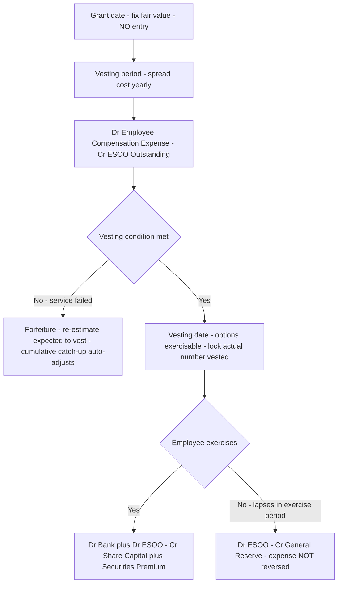
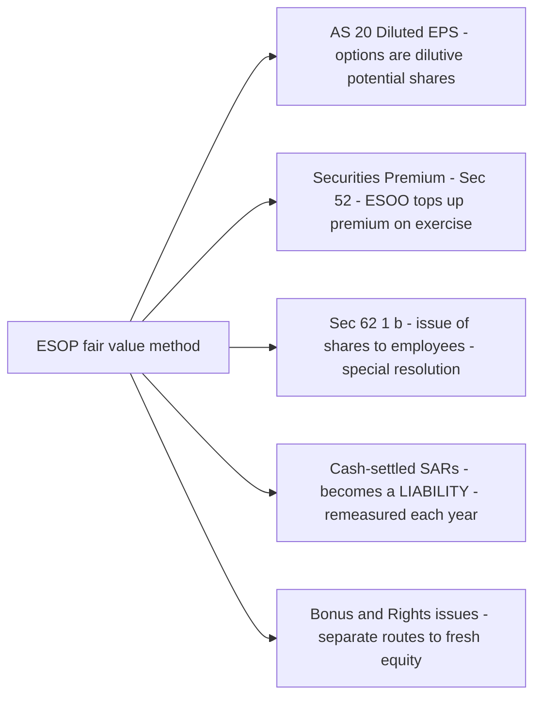

# Chapter 35 — Employee Stock Option Plans (ESOP)

## 1. The Problem

A young company has a brilliant engineer it desperately wants to keep. The engineer is worth, say, ₹40 lakh a year to a rival. But the company is a start-up burning cash — it cannot afford ₹40 lakh in salary. It has almost nothing *except* one thing that is genuinely valuable and costs no cash today: **its own equity shares.**

So the company makes an offer that looks like magic:

> "Stay with us for four years. At the end, you may buy 10,000 of our shares at ₹100 each — the price they trade at *today*. If we succeed and the shares are worth ₹500 by then, you pocket ₹40 lakh of upside. If we fail, you simply don't buy. You risk nothing but your time."

This is an **Employee Stock Option (ESO)**, and the scheme granting many such options is an **Employee Stock Option Plan (ESOP)**. It solves three business problems at once:

1. **Cash conservation** — pay talent without spending cash.
2. **Alignment** — the employee now *thinks like an owner*; the harder they work to lift the share price, the richer they get.
3. **Retention** — the options only pay off if the employee *stays* until they "vest" (become exercisable). Leave early and you forfeit them. This is the "golden handcuff."

Now the **accounting** problem appears, and it is subtle. When the engineer eventually buys 10,000 shares for ₹100 that are worth ₹500, the company received only ₹100 per share for something worth ₹500. It effectively handed over ₹400 of value per share **as compensation for services** — yet no cash ever left the bank. There is no invoice, no salary slip, no cheque.

Question: **Is this a cost? And if so, when and how much do we record?**

The naïve answer — "no cash moved, so no expense" — is dangerously wrong. If a company could pay its entire workforce in options and report *zero* employee cost, its profit would be a fiction. Two identical companies, one paying cash salaries and one paying option "salaries," would show wildly different profits despite consuming the same labour. Accounting exists precisely to prevent that lie. **The cost of services is a cost whether you pay in cash or in shares.** The whole chapter is about measuring and timing that non-cash cost.

> The governing literature in India is the ICAI **Guidance Note on Accounting for Employee Share-based Payments** (revised), read with the SEBI (Share Based Employee Benefits and Sweat Equity) Regulations, 2021 for listed companies, and the disclosure requirements of the Companies Act, 2013. Throughout this chapter we follow the **fair value method**, which the Guidance Note recommends and which the exam expects unless a question explicitly says "intrinsic value method."

---

## 2. The Core Idea — A Signing Bonus Paid in IOUs

Picture the company hiring the engineer with a plain-language contract:

> "We owe you a bonus. But instead of cash, we'll pay it as the *right to buy our shares cheaply later*. That right has value the day we grant it — even though you can't use it yet."

The single most important mental shift is this: **an option has value the moment it is granted, not just when it is exercised.** A lottery ticket with a real chance of winning is worth something *before* the draw — you would pay for it. Likewise, the right to buy a ₹100 share at ₹100 four years from now is worth money today, because the share *might* rise to ₹500. That "might" has a price, and financial mathematics (the Black-Scholes-Merton model) can compute it.

So the company is buying four years of the engineer's services and paying with a bundle of these valuable rights. Treat it like any other purchase of services:

- **Measure** what you gave up = the fair value of the options granted.
- **Spread** that cost across the period you receive the benefit = the four vesting years.
- **Record** it as an expense (Employee Compensation Expense) each year, with the matching credit going into equity (a reserve), because you are effectively issuing equity in slow motion.

**Analogy — the gym membership prepaid by the gym itself.** Imagine you pay a personal trainer not in cash but by promising them a 4-year membership to your gym, usable only if they train you the whole time. The membership has a market value today. You'd book that value as the cost of training, spread over the 4 years you receive training. ESOP accounting is exactly this, with "membership" replaced by "share options" and "training" replaced by "employment services."

The credit side deserves a moment. When you record salary in cash, you credit Bank. Here nothing leaves the bank, so what do you credit? You credit a **Stock Options Outstanding Account** (an equity item) — a running tally of equity value you have promised but not yet formally issued. It is a way-station: it sits in equity, waiting for the day the employee exercises and it converts into actual share capital and securities premium.

---

## 3. Why It's Built This Way

Every design choice in ESOP accounting answers a specific objection. Let's walk the reasoning so no rule feels arbitrary.

**Why recognise any expense at all?** Because the *matching principle* and *substance over form* demand it. The company consumes labour; labour has a cost; the fact that the cost is settled in equity rather than cash changes the *funding*, not the *existence*, of the cost. Ignoring it would let firms flatter profits simply by changing the currency of pay.

**Why fair value at grant, not the actual gain at exercise?** Two reasons. First, *reliability of timing*: the transaction the company is accounting for is "we hired services in exchange for options." That bargain is struck at grant date; that is when the price is set. Second, *the employee's later gain is not the company's expanding cost*. Once granted, if the share rockets to ₹5,000, the company's *cost of hiring* did not change — it always was "the options we handed over." The extra gain belongs to the employee-as-owner, exactly as it would for any other shareholder. So we lock the measurement at grant date and do not chase the market afterward (this is called "grant-date measurement, no true-up for market movements").

**Why spread over the vesting period rather than expense it all at grant?** Because the options are *conditional on continued service*. The company is buying four years of work; it receives that work year by year; so it recognises the cost year by year. Booking the whole cost on day one would violate matching — you'd charge Year 1 with the cost of services you haven't yet received in Years 2, 3, 4.

**Why is the credit in equity, not a liability?** Because the obligation will be settled by *delivering the company's own shares*, not by paying cash or other assets. An obligation settled in your own equity is, by definition, an equity instrument — not a liability. (If instead the company promised to pay *cash* equal to the share gain — a "cash-settled" plan like Stock Appreciation Rights — then it *would* be a liability, and remeasured every year. We cover that briefly in Connections.)

**Why must we adjust for employees who leave (forfeiture) but NOT for share-price falls?** Here is the elegant asymmetry that trips up every student:

- **Service/employment conditions** (stay 4 years) and **non-market vesting conditions** (achieve a sales target) affect *how many options ultimately vest*. If people leave, fewer options were "earned," so less cost was genuinely incurred. We therefore **estimate and re-estimate** the number expected to vest, and true-up.
- **Market conditions** (share price reaching ₹500) and **general share-price movements** are already baked into the fair value at grant (the Black-Scholes model prices in probabilities). To adjust again would be double-counting. So we **do not** revise the cost for market performance — win or lose, the grant-date fair value stands.

Hold onto that asymmetry; Section 8 shows how examiners weaponise it.

---

## 4. Full Technical Content

### 4.1 The vocabulary (learn these precisely — questions hinge on them)

| Term | Meaning |
|---|---|
| **Grant date** | The date the company and employee agree the ESOP terms; the date fair value is measured. |
| **Vesting** | The process by which the employee earns the *unconditional right* to exercise. |
| **Vesting period** | Time between grant date and vesting date over which conditions must be satisfied. Cost is spread over this. |
| **Vesting conditions** | Conditions to be met to earn the option: **service conditions** (stay employed) and **performance conditions** (market or non-market). |
| **Exercise date** | The date the employee actually buys the shares. |
| **Exercise price** | The (usually concessional) price the employee pays per share. |
| **Exercise period** | The window after vesting during which options may be exercised. |
| **Fair value (of option)** | Market-based value of the option at grant, typically from Black-Scholes-Merton. |
| **Intrinsic value** | Market price of share *minus* exercise price, at a measurement date. (Time value ignored.) |
| **Vesting date** | Date on which options vest and become exercisable. |
| **Lapse / expire** | Vested options not exercised within the exercise period; they die. |
| **Forfeiture** | Options lost because a vesting condition (e.g., service) was NOT met. |

### 4.2 Fair value vs Intrinsic value — the two measurement bases

**Intrinsic value = Market price of share − Exercise price** (floored at zero; never negative).
It captures only the "in-the-money" amount, ignoring the *time value* — the worth of the *chance* the share rises further before expiry.

**Fair value** = intrinsic value **+** time value. It is the full economic worth of the option, reflecting volatility, time to expiry, risk-free rate, and dividends. In an exam, fair value is *given* to you (you are not asked to run Black-Scholes).

**Illustration.** Share trades at ₹120; exercise price ₹100; option fair value (given) ₹35.
- Intrinsic value = 120 − 100 = **₹25**
- Time value = 35 − 25 = **₹10**
- Fair value = **₹35**

If the share were at ₹90 (below exercise price), intrinsic value = max(90−100, 0) = **₹0**, yet the fair value could still be, say, ₹8 — because the share *might* climb above ₹100 before expiry. This is why fair value is the truer cost: it never claims a valuable option is worth nothing.

**Which method does the Guidance Note prefer?** The **fair value method**. The intrinsic value method is *permitted* but if used, the enterprise must disclose the impact on profit and EPS *as if* fair value had been used. For the exam: use fair value unless told otherwise.

> Note on totals: whichever base you use, the **total cost recognised** over the life equals `(number of options that vest) × (value per option at grant under the chosen base)`. Intrinsic value simply gives a smaller per-option figure (it drops time value).

### 4.3 The measurement and spreading rule

**Total expected compensation cost** (fair value method)
= Number of options **expected to vest** × Fair value per option at grant date.

**Cost recognised each year** is spread over the vesting period, but computed *cumulatively* so that re-estimates of headcount flow through cleanly:

$$\text{Cumulative expense to date} = \text{Total expected cost (current estimate)} \times \frac{\text{Vesting years elapsed}}{\text{Total vesting years}}$$

$$\text{Expense for the year} = \text{Cumulative expense to date} - \text{Cumulative expense recognised in prior years}$$

This cumulative-catch-up mechanism is the engine of the whole subject. Because "Total expected cost" uses the *latest* estimate of how many options will vest, any change in expected forfeitures is corrected automatically in the current year — you never restate prior years.

At the **vesting date**, "expected to vest" becomes "actually vested" — you switch from estimate to fact, and the cumulative figure locks to the real number that vested.

### 4.4 The accounting entries — the full lifecycle

Let `FV` = fair value per option at grant; the credit account is **Employee Stock Options Outstanding A/c** (ESOO), an equity item shown under Reserves & Surplus (or as a separate line in Shareholders' Funds).

**(A) At grant date** — *no entry.* (Grant merely fixes measurement; no service consumed yet.)

**(B) During the vesting period (each year)** — recognise the year's slice:

```
Employee Compensation Expense A/c        Dr.   [year's expense]
    To Employee Stock Options Outstanding A/c   [year's expense]
```
At year-end the expense is closed to the Statement of Profit and Loss:
```
Profit and Loss A/c                      Dr.
    To Employee Compensation Expense A/c
```
(The ESOO account accumulates in equity across the vesting years.)

**(C) On exercise** — employee pays exercise price; company issues shares. Suppose `N` options exercised, exercise price `EP`, face value `FV_share`, and each option carried grant-date fair value `FV`:

```
Bank A/c                                  Dr.   [N × EP]
Employee Stock Options Outstanding A/c    Dr.   [N × FV]
    To Equity Share Capital A/c                 [N × FV_share]
    To Securities Premium A/c                   [balancing figure]
```
The credit to ESOO is *reversed* (debited) because the promised equity is now becoming real. Cash comes in at exercise price; the accumulated ESOO tops it up; together they land in share capital (at face value) and securities premium (the rest). **Securities premium here therefore includes both the ordinary premium the employee paid AND the compensation value routed through ESOO.**

**(D) On forfeiture (service condition failed before vesting).** No true-up entry is needed as a separate event *during* vesting — because the annual cumulative formula already uses the revised "expected to vest," the reduced headcount is absorbed automatically. If an employee forfeits *after some expense was booked on an over-estimate*, the current-year entry can even be a **reversal** (a credit to Employee Compensation Expense) to pull cumulative cost down to the corrected figure.

**(E) On lapse/expiry (options vested but NOT exercised within exercise period).** The employee earned them (so the *expense stays* — services were genuinely received) but chose not to buy. The balance sitting in ESOO for those options is transferred to a **General Reserve** (a within-equity transfer; it is **not** written back to profit):

```
Employee Stock Options Outstanding A/c    Dr.   [lapsed options × FV]
    To General Reserve A/c                       [lapsed options × FV]
```
**Key principle:** expense recognised for *vested* options is never reversed through P&L, even if the options later lapse unexercised. The service was received; the cost was real. Only the *equity classification* moves (ESOO → General Reserve).

### 4.5 Lifecycle flowchart


*Figure 35.1 — The full ESOP lifecycle from grant to exercise or lapse, showing where each journal entry sits.*

---

## 5. Worked Examples

### Example 1 — The clean baseline (no forfeitures)

**Facts.** On 1 April 2023, ABC Ltd grants **500 options** to an employee, vesting after **2 years** of service, exercisable within the next year. Exercise price ₹40; face value ₹10. Fair value per option at grant = **₹15**. Assume the employee stays and exercises all 500 options at the end.

**Step 1 — Total expected cost.** 500 × ₹15 = **₹7,500**.

**Step 2 — Spread over 2-year vesting.**

| Year | Cumulative cost = 7,500 × (yr/2) | Prior cumulative | Expense this year |
|---|---|---|---|
| 2023-24 | 7,500 × 1/2 = 3,750 | 0 | **3,750** |
| 2024-25 | 7,500 × 2/2 = 7,500 | 3,750 | **3,750** |

**Step 3 — Entries each vesting year:**
```
Employee Compensation Expense A/c   Dr.  3,750
    To ESOO Outstanding A/c              3,750
```
**Step 4 — On exercise** (500 × ₹40 = ₹20,000 cash in; ESOO holds 500 × ₹15 = ₹7,500):
```
Bank A/c                             Dr. 20,000
ESOO Outstanding A/c                 Dr.  7,500
    To Equity Share Capital (500×10)      5,000
    To Securities Premium (bal.)         22,500
```
**Reconciliation.** Debits 27,500 = Credits 27,500. Securities premium of ₹22,500 = the cash premium (500 × (40−10) = 15,000) + the compensation routed through ESOO (7,500). ✓ Total expense hit to P&L over two years = ₹7,500 = grant-date value of vested options. ✓

---

### Example 2 — Forfeitures and the cumulative catch-up (exam-standard)

**Facts.** On 1 April 2023, XYZ Ltd grants **100 options each to 500 employees** (total 50,000 options), vesting after **3 years** of service. Fair value per option at grant = **₹20**. Exercise price ₹60; face value ₹10. Estimated forfeitures (employees expected to leave):

- End of Year 1: company estimates **20%** of employees will leave over the 3 years.
- End of Year 2: revises the estimate to **25%** total.
- End of Year 3 (actual): **28%** actually left; the rest vest.

**Step 1 — Recompute total expected cost each year using the latest estimate.**

| At end of | Employees expected to stay | Options expected to vest | FV | Total expected cost |
|---|---|---|---|---|
| Year 1 | 500 × 80% = 400 | 40,000 | ₹20 | ₹8,00,000 |
| Year 2 | 500 × 75% = 375 | 37,500 | ₹20 | ₹7,50,000 |
| Year 3 (actual) | 500 × 72% = 360 | 36,000 | ₹20 | ₹7,20,000 |

**Step 2 — Cumulative cost = total expected × (elapsed years / 3), then subtract prior.**

| Year | Cumulative = Total × yr/3 | Prior cumulative | Expense this year |
|---|---|---|---|
| Year 1 | 8,00,000 × 1/3 = 2,66,667 | 0 | **2,66,667** |
| Year 2 | 7,50,000 × 2/3 = 5,00,000 | 2,66,667 | **2,33,333** |
| Year 3 | 7,20,000 × 3/3 = 7,20,000 | 5,00,000 | **2,20,000** |

**Step 3 — Journal entry each year (same form):**
```
Employee Compensation Expense A/c   Dr.  [2,66,667 / 2,33,333 / 2,20,000]
    To ESOO Outstanding A/c              [same]
```
**Reconciliation.** Total expense = 2,66,667 + 2,33,333 + 2,20,000 = **₹7,20,000** = 36,000 options actually vested × ₹20. ✓ Notice how Year 2's charge *fell* to ₹2,33,333 (not ₹2,66,667) because the revised higher-forfeiture estimate pulled the cumulative figure down — the catch-up happened automatically, with **no restatement of Year 1**. This is the whole point of the cumulative method.

**Step 4 — Suppose in Year 4, 34,000 options are exercised** (paying ₹60 each) and the remaining **2,000 vested options lapse** unexercised.

Exercise (34,000 options; ESOO per option ₹20):
```
Bank A/c (34,000 × 60)              Dr. 20,40,000
ESOO Outstanding A/c (34,000×20)    Dr.    6,80,000
    To Equity Share Capital (34,000×10)     3,40,000
    To Securities Premium (bal.)           23,80,000
```
Debits 27,20,000 = Credits 27,20,000. ✓

Lapse (2,000 vested options never exercised; ESOO 2,000 × ₹20 = ₹40,000):
```
ESOO Outstanding A/c               Dr.  40,000
    To General Reserve A/c              40,000
```
**Reconciliation of the ESOO account.** Built up to 7,20,000 over vesting → 6,80,000 removed on exercise → 40,000 removed on lapse → **nil balance.** ✓ The lapse's ₹40,000 went to General Reserve — **the compensation expense of ₹7,20,000 was never touched**, because the 2,000 employees *did serve* and *did earn* their options; they merely declined to buy.

---

### Example 3 — Graded vesting and a mid-stream re-estimate (hard)

**Facts.** On 1 April 2023, PQR Ltd grants **1,200 options** to a senior executive, vesting **in three equal annual tranches** (graded vesting): 400 vest after Year 1, 400 after Year 2, 400 after Year 3 — each tranche conditional on serving up to its vesting date. Fair value per option at grant = ₹18. The executive serves all three years and exercises everything. Exercise price ₹50; face value ₹10.

**The subtlety.** With graded vesting each *tranche* has its own vesting period, so the cost is *front-loaded*: the first tranche is earned over 1 year, the second over 2 years, the third over 3 years.

**Step 1 — Cost per tranche** = 400 × ₹18 = ₹7,200 each (total ₹21,600).

**Step 2 — Allocate each tranche over its own vesting period.**

| Tranche | Vesting yrs | Per-year charge | Yr 1 | Yr 2 | Yr 3 |
|---|---|---|---|---|---|
| Vests end Yr1 | 1 | 7,200 | 7,200 | — | — |
| Vests end Yr2 | 2 | 3,600 | 3,600 | 3,600 | — |
| Vests end Yr3 | 3 | 2,400 | 2,400 | 2,400 | 2,400 |
| **Total expense** | | | **13,200** | **6,000** | **2,400** |

**Reconciliation.** 13,200 + 6,000 + 2,400 = **₹21,600** = 1,200 × ₹18. ✓ Note the deliberate front-loading — Year 1 bears ₹13,200 because it carries a full tranche plus slices of the others. Examiners love graded vesting precisely because the straight-line student wrongly books ₹7,200 per year.

**Step 3 — Entries** each year (Dr Employee Compensation Expense, Cr ESOO for 13,200 / 6,000 / 2,400).

**Step 4 — On exercise of all 1,200** (1,200 × ₹50 = 60,000 cash; ESOO 1,200 × ₹18 = 21,600):
```
Bank A/c                            Dr. 60,000
ESOO Outstanding A/c                Dr. 21,600
    To Equity Share Capital (1,200×10)  12,000
    To Securities Premium (bal.)        69,600
```
Debits 81,600 = Credits 81,600. ✓ Securities premium 69,600 = cash premium 1,200×(50−10)=48,000 + ESOO 21,600. ✓

---

### Example 4 — Intrinsic value method contrast (short)

Reuse Example 1 (500 options, 2-year vest, exercise price ₹40). Suppose the share's market price at grant is ₹48, and the company elects the **intrinsic value method**.

- Intrinsic value per option = 48 − 40 = **₹8** (vs fair value ₹15).
- Total cost = 500 × ₹8 = **₹4,000**, spread ₹2,000 / ₹2,000 over two years.

The mechanics are identical; only the per-option value shrinks (time value of ₹7 is dropped). Because it under-states cost, the company must **disclose** the profit and EPS impact *as if* fair value (₹15) had been used. This is why the fair value method is preferred and is the exam default.

---

## 6. Presentation & Disclosure

**Balance Sheet.** The **Employee Stock Options Outstanding Account** appears within **Shareholders' Funds** under *Reserves and Surplus* (often shown net of any "Deferred Employee Compensation Expense" if that gross presentation is used). It is an equity item, never a liability, for equity-settled plans.

**Statement of Profit and Loss.** The annual **Employee Compensation Expense** is charged under *Employee Benefits Expense*, reducing profit like any salary.

**Disclosures required (Guidance Note + SEBI for listed cos.):**
- Description of each ESOP: terms, vesting requirements, exercise price, exercise period, maximum term.
- Number and weighted-average exercise price of options: outstanding at start, granted, forfeited, exercised, expired, outstanding and exercisable at end.
- The **method** used (fair value or intrinsic) and, if intrinsic value is used, the **pro-forma net profit and EPS** as if fair value had been applied.
- The valuation model and key assumptions (share price, exercise price, expected volatility, option life, risk-free rate, expected dividends) — for options priced by Black-Scholes.
- Weighted-average fair value of options granted during the year.
- **Diluted EPS** must reflect the potential shares from outstanding options (AS 20 — options are dilutive potential equity shares).

**Companies Act, 2013 linkage.** Section 62(1)(b) permits a company to issue further shares to employees under an ESOP by a **special resolution** (for listed companies, subject to SEBI Regulations; private companies follow Rule 12 of the Companies (Share Capital and Debentures) Rules, 2014, which allows an ordinary resolution). The Board's Report must disclose ESOP details.

---

## 7. Connections


*Figure 35.2 — How ESOP accounting connects to EPS, share capital law, and its cash-settled cousin.*

- **AS 20 (EPS):** outstanding options are *dilutive potential equity shares*; diluted EPS uses the treasury-stock-style adjustment. An ESOP question often carries an EPS sub-part.
- **Securities Premium (Sec 52):** the credit that lands in premium on exercise blends the employee's cash premium and the routed compensation. Its uses remain restricted by Sec 52(2).
- **Section 62(1)(b):** the corporate-law gateway that authorises issuing these shares.
- **Cash-settled plans (SARs — Stock Appreciation Rights):** the mirror image. The company pays *cash* equal to the share appreciation, so the credit is a **liability**, and — unlike equity-settled plans — it is **remeasured to fair value at every reporting date until settlement**, with changes hitting P&L. Contrast this sharply with the equity-settled "measure once at grant, never true-up for price" rule.
- **Sweat Equity Shares (Sec 54):** a related but distinct instrument — shares issued to employees/directors for know-how or value additions, not via options.

---

## 8. Traps & Examiner Tricks

1. **Re-estimating for price movements.** The classic trap: the share price falls, and students reduce the expense. **Wrong.** Market movements are already inside the grant-date fair value; equity-settled cost is *never* trued-up for share price. Only *forfeitures* (service/non-market conditions) change the number of options and hence the cost.

2. **Reversing expense on lapse.** After vesting, options lapse unexercised and students credit P&L. **Wrong.** The service was rendered; the expense stays. Move ESOO to **General Reserve**, an equity-to-equity transfer only.

3. **Straight-lining graded vesting.** With tranches vesting in Years 1/2/3, the cost is **front-loaded** (Example 3), not equal each year. Booking equal amounts loses marks.

4. **Booking an entry at grant date.** No entry on grant — measurement date only. The first entry is at the *end of Year 1* of vesting.

5. **Forgetting the cumulative method.** Compute expense as *cumulative-to-date minus prior cumulative*, using the **latest** vesting estimate. Never restate prior years; let the catch-up self-correct in the current year.

6. **Wrong credit account / calling ESOO a liability.** For equity-settled ESOPs the credit is **equity** (ESOO Outstanding), never a liability. Only cash-settled SARs create a liability.

7. **Mis-splitting the exercise entry.** Cash = options × *exercise* price (not face, not FV). Share Capital = options × *face* value. Securities Premium = the **balancing figure**, and it *includes* the ESOO amount transferred in. A frequent arithmetic slip.

8. **Using intrinsic value without disclosure.** If a question forces intrinsic value, remember the mandatory pro-forma fair-value profit/EPS disclosure — worth easy marks.

9. **Confusing fair value with intrinsic value.** Fair value = intrinsic + time value. If a share is *below* exercise price, intrinsic value is **zero** but fair value is still positive.

---

## 9. First-Principles Recap

Strip everything away and the logic is a short chain:

1. Services consumed are a **cost**, regardless of whether cash or shares pay for them (substance over form).
2. The cost is measured by **what you gave up** — the **fair value of the options at grant date** (intrinsic value is a lesser, permitted alternative).
3. You receive the services **over the vesting period**, so you **spread** the cost over those years (matching), using a **cumulative** formula so re-estimates self-correct.
4. Because you'll settle by issuing **your own shares**, the credit sits in **equity** (ESOO Outstanding), not as a liability.
5. **Forfeitures** reduce options earned → reduce cost (true-up). **Share-price movements** are already priced in → **no** true-up.
6. On **exercise**, cash + accumulated ESOO convert into **Share Capital + Securities Premium**. On **lapse** of vested options, ESOO moves to **General Reserve** and the **expense stands**.

If you can reconstruct these six sentences, you can derive every entry and defeat every trap.

---

## 10. Quick-Revision Sheet

**Total cost** = Options *expected to vest* × Fair value per option at grant.

**Yearly expense** = [Total expected cost × (elapsed vesting years ÷ total vesting years)] − cumulative expense already booked.

**Key entries:**

| Event | Entry |
|---|---|
| Grant | No entry |
| Each vesting year | Dr Employee Compensation Expense; Cr ESOO Outstanding |
| Year-end close | Dr P&L; Cr Employee Compensation Expense |
| Exercise | Dr Bank (N×EP) + Dr ESOO (N×FV); Cr Share Capital (N×Face) + Cr Securities Premium (bal.) |
| Forfeiture (pre-vest) | Auto-adjusted via cumulative formula (may reverse prior over-accrual) |
| Lapse (vested, unexercised) | Dr ESOO; Cr General Reserve (expense NOT reversed) |

**Fair value vs Intrinsic:** FV = Intrinsic + Time value. Intrinsic = max(Market − Exercise, 0). Use FV by default; intrinsic requires pro-forma FV disclosure.

**The asymmetry:** true-up for **forfeitures** (service/non-market); **never** true-up for **share-price/market** movements.

**Classification:** Equity-settled → credit **equity**, measure once at grant. Cash-settled (SARs) → credit **liability**, remeasure every year.

**Presentation:** ESOO Outstanding under Reserves & Surplus (equity); Employee Compensation Expense under Employee Benefits in P&L; options are dilutive for **diluted EPS (AS 20)**.

**Law:** Sec 62(1)(b) (issue to employees, special resolution for listed); SEBI SBEB Regulations 2021 (listed); Rule 12 Share Capital Rules (unlisted).

**One-line memory hook:** *Price the promise at grant, spread it as they serve, park it in equity, adjust only for leavers — never for the share price — and when they buy, let cash and the parked value become capital and premium.*
