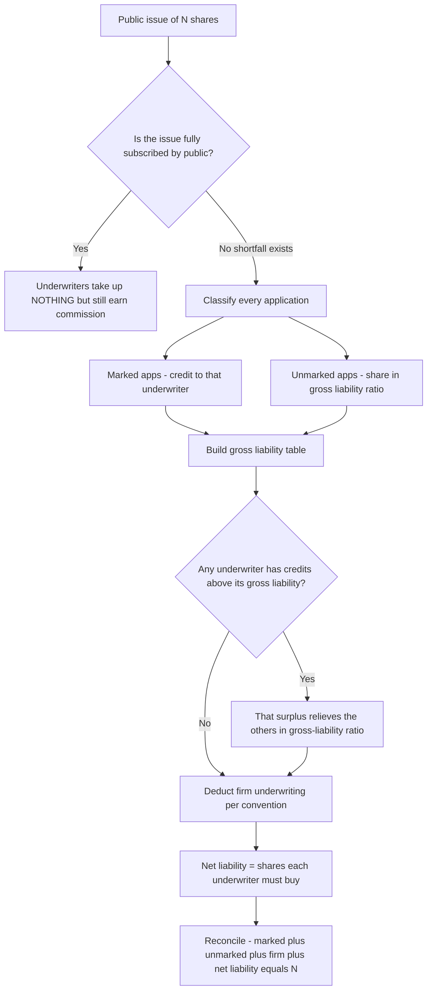
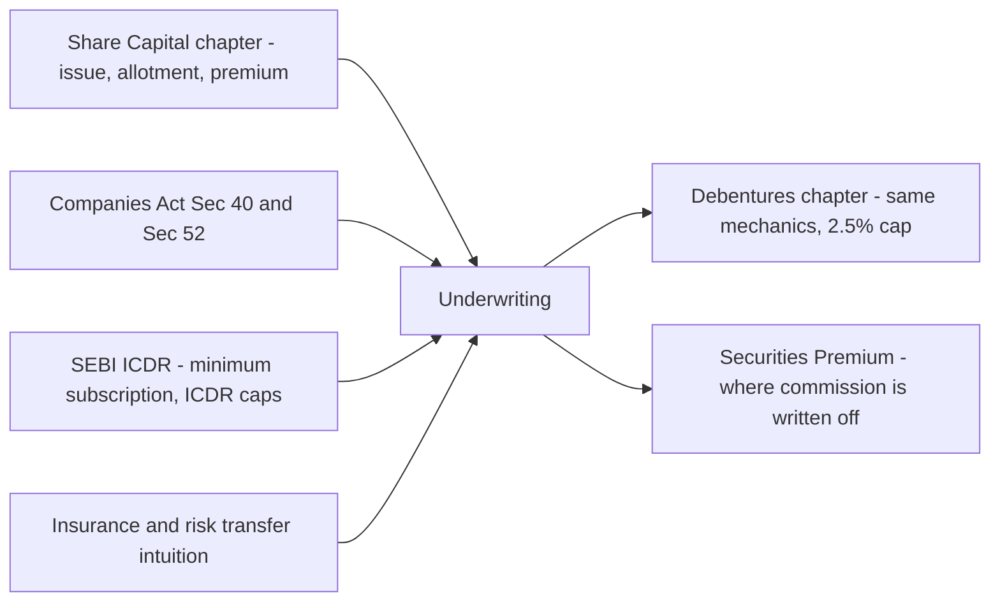

# Chapter 36 — Underwriting of Shares & Debentures

## 1. The Problem

Imagine you run **Ganga Cements Ltd.** You need ₹50 crore of fresh capital to build a new kiln. Your merchant banker says: "Issue 5 crore equity shares at ₹10 each to the public." You file the prospectus, print the forms, hire the bankers to the issue, book the ROC fees — and then you wait.

Here is the terror at the heart of every public issue: **you do not control whether the public shows up.**

Suppose the market turns sour the week your issue opens. A competitor announces a scandal, interest rates jump, monsoon fails. The public applies for only **3 crore shares**. You are now stuck with three brutal facts:

1. **You have already committed the money.** Contractors are booked, machinery ordered against that ₹50 crore. A ₹20 crore hole is not a rounding error — it can sink the project.
2. **Minimum subscription rules may void the entire issue.** Under the Companies Act, if you do not receive applications for at least the minimum subscription stated in the prospectus, you must **refund every rupee** — the whole issue collapses and you are back to zero, out the issue costs.
3. **You cannot plan.** A business that cannot say "on 1st August I will definitely have ₹50 crore" cannot sign a construction contract. Uncertainty destroys the ability to commit.

The core problem: **an issuing company bears 100% of the demand risk of a public issue, but has 0% ability to forecast or control that demand.** It is buying an expensive, irreversible thing (a construction project) with a funding source that may or may not materialise.

Now flip it around. There exist financial institutions, banks, and broking firms who are *close to the market*. They know the appetite. They have distribution networks — sub-brokers, HNI clients, mutual fund desks. To them, the demand is far less of a mystery, and even if a chunk goes unsold, they can hold the shares and offload them over the following months. They can bear a risk that would kill you.

**Underwriting** is the market's answer to this mismatch: a contract that moves the demand risk from the company (who cannot bear it) to a specialist (who can). This chapter is about how that contract works, how you compute exactly who owes how many shares when the public under-applies, and the accounting and legal rules wrapped around it.

---

## 2. The Core Idea — An Insurance Policy on Your Own Share Issue

Think of underwriting as **insurance against your public not showing up.**

You (the company) pay a **premium** — called the *underwriting commission* — to an insurer (the *underwriter*). In exchange, the underwriter promises: "If the public applies for fewer shares than the amount I guaranteed, **I will apply for and pay for the shortfall myself.**"

The analogy is exact, and it explains almost everything that follows:

| Insurance concept | Underwriting equivalent |
|---|---|
| The insured (buys protection) | The **company** issuing shares |
| The insurer (bears the risk) | The **underwriter** |
| Premium paid regardless of claim | **Underwriting commission** (paid even if fully subscribed) |
| The claim event | Public **under-subscribes** the issue |
| Payout | Underwriter **takes up the unsold shares** |
| Sum insured | The number of shares each underwriter **guarantees** |
| Co-insurance (several insurers share one big risk) | **Multiple underwriters**, each guaranteeing a portion |

Two consequences fall straight out of the analogy, and you should hold them in your head for the whole chapter:

- **Just like insurance premium, the commission is paid whether or not there is a claim.** If the issue is fully subscribed and the underwriter takes up *nothing*, they still keep their commission. That is what they were paid for — bearing the risk, not necessarily absorbing shares. Students who feel this is "unfair" have simply not understood that they were selling a *guarantee*, and a guarantee has value even when it is never called upon.
- **Just like co-insurance, when there are several underwriters we must fairly split the shortfall** in proportion to what each one guaranteed — but adjusted for the business each one actually *brought in*. That fairness computation (the "gross liability method") is the mathematical heart of the chapter.

---

## 3. Why It's Built This Way — The Reasoning Behind Every Rule

Before we hit the mechanics, let's derive *why* the machinery has the shape it does. If you understand these four design pressures, you will never need to memorise the rules — you will re-derive them.

**Design pressure 1 — The company needs certainty, so the guarantee must be firm and legally enforceable.** A vague "we'll try to sell your shares" is worthless. The underwriting agreement is therefore a firm contract: the underwriter *must* subscribe the shortfall. This is why the underwriter is treated almost like a stand-by applicant.

**Design pressure 2 — Underwriters must be compensated, but a desperate company must not be looted.** An issuer facing a collapsing issue would agree to *any* commission to save the project. Left unchecked, underwriters could extract 20–30% of the issue. So the law caps the commission (Companies Act + SEBI). The cap protects the company (and its existing shareholders) from paying away the capital it is trying to raise.

**Design pressure 3 — When several underwriters share the risk, credit must follow effort.** Suppose Underwriter A actually persuaded thousands of investors to apply, while Underwriter B did nothing and just collected commission. If the issue falls short, is it fair that they absorb the shortfall equally? No. The one who *brought in applications* should be given credit for them. This is the entire reason for the **marked vs unmarked** distinction — it is a system for attributing applications to the underwriter responsible for them, so the final shortfall lands on whoever *underperformed* their guarantee.

**Design pressure 4 — Some applications cannot be attributed to anyone, so we need a default rule.** A person who walks into a bank branch and applies directly, with no underwriter's stamp on the form, benefited the whole issue but no particular underwriter. These *unmarked* applications must be shared out — and there are two philosophies for doing so (share by gross guarantee vs. share by remaining guarantee). The chapter will show both.

Everything in Section 4 is a consequence of these four pressures. Keep asking, as we go: *which pressure does this rule serve?*

---

## 4. Full Technical Content

### 4.1 The vocabulary — precise definitions

**Underwriting** — A contract by which a person (the underwriter) agrees, for a commission, to take up the whole or a stipulated portion of shares or debentures offered to the public that is *not subscribed by the public*. It is a guarantee of minimum subscription to that extent.

**Underwriter** — The party giving the guarantee. Must generally hold a valid SEBI registration as a merchant banker / underwriter to underwrite a public issue.

**Sub-underwriting** — The underwriter, like a re-insurer, may pass on part of its risk to sub-underwriters. The company usually has no privity with sub-underwriters; that is a back-to-back arrangement between the main underwriter and its sub-underwriters. (Exam problems occasionally mention it but rarely compute it.)

**Underwriting commission** — The fee (premium) paid by the company to the underwriter for the guarantee, computed as a percentage of the **issue price** of the shares/debentures underwritten. Payable whether or not the underwriter is called upon to take up shares.

### 4.2 The three sub-problems and their terms

When the issue closes, applications arrive. To settle who owes what, we classify every application:

**Marked applications** — Application forms that bear the **stamp / code of a particular underwriter**, showing that *this* underwriter's effort brought that investor in. Marked applications are **credited to that specific underwriter** — they reduce that underwriter's liability, because they represent the underwriter delivering on its job of finding subscribers.

**Unmarked applications** — Forms with **no underwriter's stamp** — investors who applied directly (e.g., at a bank counter) with no attributable underwriter. Nobody's individual effort produced them, so they are shared among the underwriters (method depends on whether firm underwriting exists — see 4.5).

**Why the distinction exists (re-derive it):** The shortfall must ultimately fall on the underwriter who *failed to sell their allotted portion*. Marked applications measure each underwriter's actual selling performance. Without marking, a lazy underwriter and a diligent one would bear the shortfall identically — violating design pressure 3.

**Firm underwriting** — An arrangement where an underwriter agrees to **definitely buy a fixed number of shares, over and above their underwriting obligation**, as if they were an ordinary applicant — regardless of how the public responds. It is a firm *purchase*, not merely a guarantee. This signals confidence and gives the company a guaranteed floor of subscription. Firm-underwritten shares are treated as applications too, but the *treatment* (whom they credit) depends on the convention adopted — the two conventions are shown in 4.5.

**Complete vs Partial underwriting:**
- *Complete* — the **entire** issue is underwritten (possibly split among several underwriters). Any part not underwritten by named underwriters is deemed underwritten by the company itself ("the company is the underwriter for the balance").
- *Partial* — only a portion is underwritten; the **company itself bears the risk** on the un-underwritten portion, i.e., the company is treated as an underwriter for that slice.

### 4.3 The master computation — the Gross Liability Method

This is the standard ICAI method. Everything is measured **in number of shares** (or debentures). Build the following table, one column per underwriter (plus a column for the company if underwriting is partial).

| Step | Row | What it means |
|---|---|---|
| 1 | **Gross liability** | Total shares underwritten, split in the **agreed ratio**. This is each underwriter's guarantee. |
| 2 | **Less: Marked applications** | Deduct each underwriter's own marked applications (their delivered performance). |
| 3 | **Less: Unmarked applications** | Distribute unmarked apps in the **gross liability ratio** and deduct. |
| 4 | = **Balance (net)** | Provisional liability. |
| 5 | **Adjust surplus of any underwriter** | If any underwriter's credits exceed its gross liability, it shows a *negative* balance (surplus). Redistribute that surplus to the *others* in the ratio of **their gross liabilities** (excluding the surplus underwriter). |
| 6 | **Less: Firm underwriting** (see convention) | Deduct each underwriter's firm-underwritten shares. |
| 7 | = **Net liability** | Final shares each underwriter must take up. |

**The reconciliation check (always do this):**

> Total shares issued = Marked applications + Unmarked applications + Firm underwriting (if treated separately) + Net liability of all underwriters.

If both sides don't tie, you have an error. This is non-negotiable — the examiner rewards the reconciliation and it catches your mistakes for free.

**The unmarked-applications rule for shortfall (important nuance):** Marked applications include those brought by the underwriters. In many problems, *total marked applications + unmarked applications = total applications received from public*. The shares still to be found = shares issued − total applications from public. That total shortfall is what the underwriters collectively absorb; the table just *allocates* it fairly.

### 4.4 Handling surplus (Step 5) — the logic

An underwriter whose marked applications alone exceed its gross liability has *over-delivered*. It should not be forced to take shares; instead, its **surplus reduces others' burden**. But by how much for each? By the ratio of the *remaining* underwriters' gross liabilities — because that surplus is a windfall that should relieve the still-liable parties in proportion to *their* exposure. (One subtlety: strictly, some texts redistribute in the ratio of the remaining underwriters' *net* balances; ICAI's standard treatment uses gross liability ratio excluding the surplus party. Follow the gross-liability-ratio convention unless the question states otherwise — **flagged as a known area of textbook variation**.)

### 4.5 The two conventions for UNMARKED + FIRM underwriting

Two treatments exist. Read the question's wording; if silent, state your assumption.

**Convention A — Firm underwriting treated like MARKED applications (credited to the specific underwriter).**
- Unmarked applications = Total applications − Marked applications − Firm applications, distributed in gross-liability ratio.
- Firm shares are deducted from that *same* underwriter (like their own marked apps).

**Convention B — Firm underwriting treated like UNMARKED applications (benefit shared by all).**
- Firm-underwriting shares are pooled with unmarked and distributed among all underwriters in gross-liability ratio.
- This gives the "benefit" of firm underwriting to everyone.

**ICAI default (most common in exams):** unless the problem says "firm underwriting benefit to be given to individual underwriter," treat firm underwriting like the underwriter's *own marked* application (Convention A) — i.e., subtract each underwriter's firm shares from its own liability at the end, but **also add firm shares back when computing "total applications for allocating the plain shortfall."** Watch the exact wording. We demonstrate both in the worked examples.

### 4.6 Underwriting commission — the legal caps

The commission is the premium. The law (design pressure 2) caps it.

**Legal source:** Section 40(6) of the Companies Act 2013 read with the Companies (Prospectus and Allotment of Securities) Rules, 2014, Rule 13. Conditions to pay commission:
1. Payment of commission must be **authorised by the Articles of Association.**
2. The commission rate must **not exceed** the statutory maximum (below).
3. The commission and the underwriters' names must be **disclosed in the prospectus.**
4. A copy of the underwriting contract must be **delivered to the Registrar.**
5. The number of shares/debentures underwritten must be disclosed.

**Maximum rates (Rule 13):**

| Security | Maximum commission |
|---|---|
| **Shares** | **5%** of the **issue price** of the shares, **or** the rate authorised by the Articles, **whichever is less** |
| **Debentures** | **2.5%** of the **issue price** of the debentures, or the Articles' rate, whichever is less |

**Key computation rules for commission:**
- Commission is computed on the **issue price** (including premium), *not* face value, of the **shares underwritten** — meaning the shares comprised in the underwriting agreement, **whether or not** the underwriter had to take them up.
- **No commission is payable on shares/debentures NOT offered to the public** (e.g., promoters' quota, reserved firm allotments to the underwriter itself where SEBI so restricts). SEBI ICDR generally disallows commission on the portion the underwriter subscribes as a firm/reserved allotment or that is otherwise not offered to the public.
- Commission may be paid in **cash, or in fully paid shares/debentures, or a combination** — the Act permits it.

> **Formula:** Commission = Number of shares underwritten × Issue price per share × Rate%
> (Rate = min[Articles' rate, 5% for shares / 2.5% for debentures])

### 4.7 Journal entries

Let the underwriter be liable for *N* shares of face value ₹10 issued at ₹12 (₹2 premium), and commission be at rate *r*.

**(a) When the underwriter's liability is determined (they must take up N shares):**

```
Underwriters A/c                          Dr.   (N × issue price)
    To Share Capital A/c                             (N × face value)
    To Securities Premium A/c                        (N × premium)
(Being shares taken up by underwriters on their net liability)
```

**(b) For the underwriting commission due:**

```
Underwriting Commission A/c               Dr.   (commission amount)
    To Underwriters A/c
(Being commission payable to underwriters)
```

**(c) On settlement — net the two off and pay/receive the balance:**

```
Underwriters A/c                          Dr.   (net amount due from them)
    To Bank A/c
(Being net cash received from underwriters after adjusting commission)
```

If the commission exceeds nothing-taken-up (fully subscribed issue), the entry is simply:

```
Underwriting Commission A/c               Dr.
    To Bank A/c   (or To Underwriters A/c then Bank)
```

**Nature of the commission account:** Underwriting Commission is a **cost of raising capital**. It is *not* a revenue expense of the year. Under Schedule III it is typically written off against **Securities Premium** (Section 52 permits using the premium for writing off "commission paid on issue of shares/debentures") or shown as a "miscellaneous expenditure to the extent not written off" (older treatment). Modern practice: adjust against Securities Premium Account under Section 52(2)(c).

```
Securities Premium A/c                    Dr.
    To Underwriting Commission A/c
(Being underwriting commission written off against securities premium)
```

### 4.8 The decision flow


*Figure 1 — The full decision path from issue close to each underwriter's net liability.*

---

## 5. Worked Examples

### Example 1 — The simplest case: one underwriter, plain shortfall

**Problem.** Yamuna Ltd. issues 1,00,000 equity shares of ₹10 each at par, **fully underwritten** by Mr. Rao at a commission of 5%. The public applies for **72,000** shares. Compute Rao's liability and commission, and pass journal entries.

**Reasoning.** The whole issue is guaranteed by one person. Whatever the public does not take, Rao must take. There is no marking to worry about (only one underwriter), no unmarked split, no surplus.

| Item | Shares |
|---|---|
| Shares issued | 1,00,000 |
| Less: applied by public | 72,000 |
| **Shortfall = Rao's liability** | **28,000** |

**Commission** = shares *underwritten* (not shares taken up) × issue price × rate
= 1,00,000 × ₹10 × 5% = **₹50,000**.

Note the crucial point: commission is on **1,00,000** (the amount he underwrote), *not* 28,000. He sold the guarantee on the whole issue.

**Journal entries:**

```
Underwriters (Rao) A/c            Dr.   2,80,000
    To Equity Share Capital A/c            2,80,000
(28,000 shares of Rs 10 taken up by Rao)

Underwriting Commission A/c        Dr.     50,000
    To Underwriters (Rao) A/c                50,000
(Commission on 1,00,000 shares at 5%)

Bank A/c                           Dr.   2,30,000
    To Underwriters (Rao) A/c             2,30,000
(Net received from Rao: 2,80,000 - 50,000)
```

**Reconcile:** Public 72,000 + Rao 28,000 = 1,00,000. ✓

---

### Example 2 — Three underwriters, marked & unmarked, with a surplus

**Problem.** Ganga Ltd. issues **2,00,000** equity shares of ₹10 each at par, fully underwritten by **A, B, C in the ratio 5 : 3 : 2.** Marked applications received:

- A: 40,000  B: 20,000  C: 60,000
- **Unmarked applications: 30,000**

Total applications = 40,000 + 20,000 + 60,000 + 30,000 = **1,50,000** (issue under-subscribed by 50,000). Determine each underwriter's net liability. (Follow ICAI gross-liability method.)

**Step 1 — Gross liability** in 5:3:2 of 2,00,000:

| | A (5) | B (3) | C (2) | Total |
|---|---|---|---|---|
| Gross liability | 1,00,000 | 60,000 | 40,000 | 2,00,000 |

**Step 2 — Less marked applications** (each their own):

| | A | B | C | Total |
|---|---|---|---|---|
| Gross liability | 1,00,000 | 60,000 | 40,000 | 2,00,000 |
| Less marked | 40,000 | 20,000 | 60,000 | 1,20,000 |
| Balance | 60,000 | 40,000 | (20,000) | 80,000 |

Notice **C is negative (−20,000)** — C's marked applications (60,000) exceed C's gross liability (40,000). C has *over-delivered*: a surplus of 20,000.

**Step 3 — Less unmarked applications** (30,000) in gross-liability ratio 5:3:2:

- A: 30,000 × 5/10 = 15,000
- B: 30,000 × 3/10 = 9,000
- C: 30,000 × 2/10 = 6,000

| | A | B | C | Total |
|---|---|---|---|---|
| Balance b/f | 60,000 | 40,000 | (20,000) | 80,000 |
| Less unmarked | 15,000 | 9,000 | 6,000 | 30,000 |
| Balance | 45,000 | 31,000 | (26,000) | 50,000 |

C's surplus has grown to **26,000** (over-subscribed even after taking its share of unmarked).

**Step 4/5 — Redistribute C's surplus** to A and B in the ratio of *their* gross liabilities (5:3), because C cannot take negative shares:

- A: 26,000 × 5/8 = 16,250
- B: 26,000 × 3/8 = 9,750

| | A | B | C | Total |
|---|---|---|---|---|
| Balance b/f | 45,000 | 31,000 | (26,000) | 50,000 |
| Add C's surplus | 16,250 | 9,750 | (26,000) | 0 |
| **Net liability** | **61,250** | **40,750** | **0** | **1,02,000** |

Wait — let me check: 61,250 + 40,750 = **1,02,000**, but the shortfall is only 50,000. That is wrong. Let me recompute — surplus is *added* to A and B's liability (they take C's unsold burden), but I must add, and the total must equal the shortfall of 50,000. The error: when we "add C's surplus," C's own column should go to 0, and the *total* stays 50,000. Let me redo Step 4 correctly.

Balances before redistribution: A 45,000; B 31,000; C (26,000). Total = 45,000 + 31,000 − 26,000 = **50,000** ✓ (equals shortfall).

Redistributing C's −26,000 means A and B *absorb* it — but absorbing a surplus **reduces** nothing; C is negative meaning C would otherwise "receive" shares. The correct mechanic: set C to 0 and spread the 26,000 onto A and B, which **increases** A and B. But then total = 50,000 + 26,000... no.

Let me think cleanly. The three balances sum to the true shortfall, 50,000. C's balance is −26,000, which is meaningless (you can't take negative shares). We zero out C and **reallocate C's −26,000 across A and B**, i.e., A and B each take *more*. New total must still be 50,000 because we are only *moving* the negative, not deleting it:

- A: 45,000 + (26,000 × 5/8) = 45,000 + 16,250 = 61,250
- B: 31,000 + (26,000 × 3/8) = 31,000 + 9,750 = 40,750
- C: 0
- Total = 61,250 + 40,750 + 0 = **1,02,000** ❌

The sum jumped to 1,02,000 because I *added* 26,000 instead of it netting. The flaw: adding C's negative should **subtract** from the pool, not add. Reallocating a −26,000 means A and B receive −? No. Let me use signed arithmetic strictly.

Moving C's balance to zero: we transfer +26,000 out of C (bringing C from −26,000 to 0) and that same +26,000 must be **added to A and B** to keep the algebraic total unchanged. Total was 50,000; if I add 26,000 to A+B and add 26,000 to C (to zero it from −26,000), total changes by +26,000+26,000. That's the bug — I'm double counting.

Correct principle: **the algebraic total is invariant.** Total = 50,000. Zeroing C changes C by +26,000, so to keep total at 50,000, A+B combined must change by **−26,000**. So A and B's liabilities *decrease*:

- A: 45,000 − 16,250 = 28,750
- B: 31,000 − 9,750 = 21,250
- C: 0
- Total = 28,750 + 21,250 + 0 = **50,000** ✓✓

**That** is the reconciliation. C over-delivered, so A and B's burdens *fall*. This makes intuitive sense: C brought in extra subscribers, relieving everyone.

**Final table (corrected):**

| | A | B | C | Total |
|---|---|---|---|---|
| Gross liability | 1,00,000 | 60,000 | 40,000 | 2,00,000 |
| Less marked | 40,000 | 20,000 | 60,000 | 1,20,000 |
| Less unmarked (5:3:2) | 15,000 | 9,000 | 6,000 | 30,000 |
| Balance | 45,000 | 31,000 | (26,000) | 50,000 |
| C's surplus reallocated (5:3) | (16,250) | (9,750) | 26,000 | 0 |
| **Net liability** | **28,750** | **21,250** | **0** | **50,000** |

**Reconcile the whole issue:** Marked 1,20,000 + Unmarked 30,000 + Net liability 50,000 = **2,00,000** ✓ = shares issued.

*(Lesson embedded: the surplus of an over-performing underwriter **reduces** the others. If your total after redistribution doesn't equal the original shortfall, you have added where you should have subtracted — the reconciliation line is your safety net.)*

---

### Example 3 — Exam-hard: partial underwriting + firm underwriting + commission + entries

**Problem.** Kaveri Ltd. issues **5,00,000** equity shares of ₹10 each **at a premium of ₹2** (issue price ₹12). The issue is underwritten as follows (the company retains the balance itself):

- **P** underwrites 2,00,000 shares
- **Q** underwrites 1,50,000 shares
- **R** underwrites 1,00,000 shares
- (Balance 50,000 — **not underwritten**, so the company bears it.)

**Firm underwriting:** P 20,000 shares, Q 15,000 shares, R 10,000 shares.

Marked applications (excluding firm) received from public:
- P: 1,10,000  Q: 90,000  R: 40,000
- **Unmarked applications: 60,000**

**Firm underwriting is to be treated as MARKED** applications of the respective underwriters (Convention A). Commission: 5% on shares underwritten (Articles authorise 5%). Compute net liability of P, Q, R and the company, the commission payable, and pass journal entries for P.

**Step 0 — Total shares to place & total applications.**

Total applications from public (excl. firm) = 1,10,000 + 90,000 + 40,000 + 60,000 = 3,00,000.
Firm applications = 20,000 + 15,000 + 10,000 = 45,000.
Total subscription secured = 3,00,000 + 45,000 = 3,45,000.
Shortfall the underwriters+company must absorb (beyond firm) = 5,00,000 − 3,45,000 = 1,55,000. (We'll verify via the table.)

**Step 1 — Gross liability.** Since it's partial underwriting, the **company is an underwriter** for its 50,000. Ratio of gross liabilities:
P 2,00,000 : Q 1,50,000 : R 1,00,000 : Company 50,000 = **4 : 3 : 2 : 1** (total 10 parts, 5,00,000 shares).

| | P (4) | Q (3) | R (2) | Co. (1) | Total |
|---|---|---|---|---|---|
| Gross liability | 2,00,000 | 1,50,000 | 1,00,000 | 50,000 | 5,00,000 |

**Step 2 — Less marked applications** (each their own):

| | P | Q | R | Co. | Total |
|---|---|---|---|---|---|
| Gross liability | 2,00,000 | 1,50,000 | 1,00,000 | 50,000 | 5,00,000 |
| Less marked | 1,10,000 | 90,000 | 40,000 | 0 | 2,40,000 |
| Balance | 90,000 | 60,000 | 60,000 | 50,000 | 2,60,000 |

*(The company gets no marked applications — it did no selling; unmarked will be shared to it though.)*

**Step 3 — Less unmarked (60,000) in gross ratio 4:3:2:1:**

- P: 60,000 × 4/10 = 24,000
- Q: 60,000 × 3/10 = 18,000
- R: 60,000 × 2/10 = 12,000
- Co.: 60,000 × 1/10 = 6,000

| | P | Q | R | Co. | Total |
|---|---|---|---|---|---|
| Balance b/f | 90,000 | 60,000 | 60,000 | 50,000 | 2,60,000 |
| Less unmarked | 24,000 | 18,000 | 12,000 | 6,000 | 60,000 |
| Balance | 66,000 | 42,000 | 48,000 | 44,000 | 2,00,000 |

No underwriter is negative — **no surplus to redistribute.** Good.

**Step 4 — Less firm underwriting** (Convention A: credited to own account):

| | P | Q | R | Co. | Total |
|---|---|---|---|---|---|
| Balance b/f | 66,000 | 42,000 | 48,000 | 44,000 | 2,00,000 |
| Less firm | 20,000 | 15,000 | 10,000 | 0 | 45,000 |
| **Net liability** | **46,000** | **27,000** | **38,000** | **44,000** | **1,55,000** |

**Reconcile:** Marked 2,40,000 + Unmarked 60,000 + Firm 45,000 + Net liability 1,55,000 = **5,00,000** ✓ = shares issued. And net liability total 1,55,000 matches Step 0's independent shortfall. ✓✓

**Total shares each underwriter finally takes up** (net liability **+** their own firm shares, since firm shares are shares they definitely buy):

| | Net liability | + Firm | **Total taken up** |
|---|---|---|---|
| P | 46,000 | 20,000 | **66,000** |
| Q | 27,000 | 15,000 | **42,000** |
| R | 38,000 | 10,000 | **48,000** |
| Co. | 44,000 | 0 | **44,000** |

**Commission** (on shares *underwritten* at 5% of issue price ₹12). The company earns **no** commission on its own 50,000 (you cannot pay yourself commission), and no commission on firm shares that are not offered to the public? — In the standard treatment commission is on the amount underwritten by each *external* underwriter:

- P: 2,00,000 × ₹12 × 5% = ₹1,20,000
- Q: 1,50,000 × ₹12 × 5% = ₹90,000
- R: 1,00,000 × ₹12 × 5% = ₹60,000
- Company: nil
- **Total commission = ₹2,70,000**

*(If the question instructs that firm-underwritten shares carry no commission, deduct P's 20,000 etc. from the underwritten quantity before applying 5%. Here we follow the common assumption that commission is on the full amount underwritten. **Flag: read the question's wording on this.**)*

**Journal entries for P** (net liability 46,000 + firm 20,000 = 66,000 shares taken up at ₹12; commission ₹1,20,000):

```
Underwriter P A/c                 Dr.   7,92,000
    To Equity Share Capital A/c            6,60,000
    To Securities Premium A/c              1,32,000
(66,000 shares of Rs 10 at Rs 2 premium taken up by P)

Underwriting Commission A/c        Dr.   1,20,000
    To Underwriter P A/c                   1,20,000
(Commission on 2,00,000 shares underwritten at 5% of Rs 12)

Bank A/c                           Dr.   6,72,000
    To Underwriter P A/c                   6,72,000
(Net cash from P: 7,92,000 - 1,20,000)

Securities Premium A/c             Dr.   1,20,000
    To Underwriting Commission A/c         1,20,000
(P's commission written off against securities premium)
```

*Check P's share money: 66,000 × ₹12 = ₹7,92,000 = ₹6,60,000 capital + ₹1,32,000 premium ✓. Net cash 7,92,000 − 1,20,000 = 6,72,000 ✓.*

---

### Example 4 (mini) — Convention B: firm underwriting treated as unmarked

Take the *same* Kaveri data but the question says: **"firm underwriting benefit to be shared by all underwriters"** (Convention B). Now the 45,000 firm shares are **pooled with the 60,000 unmarked = 1,05,000** and distributed in gross ratio 4:3:2:1; but each underwriter still *definitely takes* its own firm shares. The effect: the credit for firm shares is spread, changing net liabilities.

Distribute 1,05,000 in 4:3:2:1:
- P: 42,000  Q: 31,500  R: 21,000  Co.: 10,500 (total 1,05,000 ✓)

| | P | Q | R | Co. | Total |
|---|---|---|---|---|---|
| Gross liability | 2,00,000 | 1,50,000 | 1,00,000 | 50,000 | 5,00,000 |
| Less marked | 1,10,000 | 90,000 | 40,000 | 0 | 2,40,000 |
| Less unmarked+firm (4:3:2:1) | 42,000 | 31,500 | 21,000 | 10,500 | 1,05,000 |
| Net liability | 48,000 | 28,500 | 39,000 | 39,500 | 1,55,000 |

Then each still separately subscribes its own firm shares (P 20,000 etc.). **Reconcile:** Marked 2,40,000 + (Unmarked+Firm) 1,05,000 + Net liability 1,55,000 = 5,00,000 ✓. Note the net liabilities differ from Convention A — *the convention materially changes the answer, so always identify which one the question wants.*

---

## 6. Presentation & Disclosure

**In the financial statements (Schedule III, Companies Act 2013):**

- **Underwriting commission** is not shown as a P&L expense in the ordinary course; it is a cost of raising capital. Preferred treatment: **written off against the Securities Premium Account** under Section 52(2)(c) (which expressly permits using the premium for "writing off the commission paid or discount allowed on any issue of shares or debentures of the company"). If not so adjusted, it appears as **"Other Non-Current Assets → Miscellaneous expenditure to the extent not written off"** (older practice, now discouraged).
- **Shares taken up by underwriters** simply become part of **Share Capital** (Equity) on the Balance Sheet — there is nothing special about a share once allotted; the identity of the applicant is irrelevant to presentation.
- Any **securities premium** received on underwriter shares is credited to **Securities Premium** under Equity → Reserves & Surplus.

**In the prospectus (before issue):** names of underwriters, number of shares/debentures each has underwritten, the commission rate, and a statement that in the opinion of the directors the underwriters have sufficient resources to meet their obligations, must be disclosed (Section 40, SEBI ICDR).

**With the Registrar:** the underwriting agreement copy must be filed.

**Notes to accounts** should disclose the underwriting commission paid and the manner of its write-off.

---

## 7. Connections


*Figure 2 — Where underwriting sits in the syllabus web.*

- **Company Accounts — Issue of Shares:** underwriting is the risk-management wrapper around a normal share issue. The allotment entries are identical; underwriting only decides *who* the residual applicant is.
- **Debentures:** identical liability mechanics; only the commission cap changes (2.5%) and the credit is to Debentures A/c rather than Share Capital.
- **Securities Premium (Sec 52):** the destination account for writing off the commission — links directly to the "permitted uses of premium" list.
- **Minimum subscription & SEBI ICDR:** underwriting exists partly to *guarantee* the 90% minimum subscription SEBI requires, tying back to why the whole apparatus matters.
- **Redemption/Buyback later:** shares taken up by underwriters are ordinary shares and flow into all later capital transactions.

---

## 8. Traps & Examiner Tricks

1. **Commission is on shares UNDERWRITTEN, not shares TAKEN UP.** The single most common error. Even if the underwriter absorbs nothing, commission is on their full guaranteed quantity. (Example 1: ₹50,000 on 1,00,000, not on 28,000.)

2. **Commission is on ISSUE PRICE (incl. premium), not face value.** If shares are ₹10 + ₹2 premium, use ₹12. Debentures: use issue price too.

3. **Company earns no commission on its own portion** (partial underwriting) and none on shares **not offered to the public.** You cannot pay commission to yourself.

4. **The surplus of an over-performing underwriter REDUCES others' liability — you SUBTRACT, not add.** Watch the sign (the whole drama of Example 2). Always verify: after redistribution, total net liability must still equal the original shortfall.

5. **Marked vs unmarked — read carefully whether "total applications" already includes marked.** Sometimes the question gives total applications and marked separately; unmarked = total − marked. Sometimes it gives all three. Don't double count.

6. **Firm underwriting convention (A vs B) changes the numbers.** If the question says "benefit of firm underwriting to individual underwriter," use Convention A (treat like own marked). If "benefit to all," use Convention B (pool with unmarked). If silent, state your assumption — ICAI usually means Convention A.

7. **Firm shares are ALWAYS taken up by the underwriter**, in addition to net liability. Don't forget to add them back when reporting "total shares subscribed by each underwriter."

8. **Redistribution ratio for surplus = gross liability ratio of the REMAINING underwriters** (exclude the surplus party). A frequent slip is redistributing including the surplus underwriter.

9. **"Fully underwritten" vs "partly."** If partly underwritten, remember to insert the **company as an underwriter** for the balance in the gross-liability table, or your totals won't reconcile.

10. **Reconciliation is free marks and free error-detection.** Always finish with: Marked + Unmarked + Firm + Net liability = Shares issued. If it doesn't tie, you made a sign or ratio error — fix it before moving on.

11. **Number of shares, not rupees, in the liability table.** Convert to rupees only for commission and journal entries. Mixing units mid-table is a classic self-inflicted wound.

---

## 9. First-Principles Recap

Start from the single fact that a company cannot control whether the public subscribes its issue, yet has already committed the money. That risk must go *somewhere*. It goes to a specialist — the underwriter — who, being close to the market and able to hold unsold stock, can bear it. That transfer is a **contract of guarantee**, priced like **insurance**: a commission paid *whether or not* the guarantee is called.

When multiple underwriters co-insure, fairness demands that the residual shortfall land on whoever *under-sold their portion*. To measure selling performance we **mark** applications to the underwriter who produced them. Applications nobody produced (**unmarked**) are shared in proportion to each underwriter's guarantee (gross liability). An underwriter who over-sold shows a **surplus**, which mathematically *relieves* the others (subtract, in the remaining parties' gross-liability ratio). **Firm underwriting** is a separate, unconditional purchase layered on top, credited either to the individual (Convention A) or shared (Convention B).

The law caps the premium — **5% for shares, 2.5% for debentures**, computed on **issue price of shares underwritten** — to stop a desperate company from paying away the very capital it raises (Section 40(6), Rule 13). The commission is a cost of raising capital, written off against **Securities Premium** (Section 52). Every problem closes with one invariant: **Marked + Unmarked + Firm + Net liability = Shares issued.** If that holds, you are right; if not, you have a sign or ratio error. Nothing here needs memorising — it all falls out of "move the risk to who can bear it, and split the leftover fairly by effort."

---

## 10. Quick-Revision Sheet

**Purpose:** transfer demand-risk of a public issue from company → underwriter, for a commission (insurance premium analogy).

**Commission caps (Sec 40(6) + Rule 13, Companies Rules 2014):**
| Security | Max rate | Base |
|---|---|---|
| Shares | 5% (or Articles' rate, lower) | Issue price (incl. premium) of shares **underwritten** |
| Debentures | 2.5% (or Articles' rate, lower) | Issue price of debentures underwritten |

- Commission on shares **underwritten**, NOT taken up. On issue price, NOT face value. None on company's own / not-offered-to-public portion.
- Payable in cash or fully-paid shares/debentures. Written off vs Securities Premium (Sec 52(2)(c)).

**Conditions to pay commission:** authorised by Articles; within cap; disclosed in prospectus; agreement filed with ROC; number underwritten disclosed.

**Liability table (in NUMBER of shares):**
1. Gross liability (agreed ratio; add company if partial).
2. − Marked applications (own).
3. − Unmarked applications (gross-liability ratio).
4. = Balance. If any negative → **surplus**.
5. Surplus of over-performer → subtract from others in *their* gross-liability ratio; surplus party → 0.
6. − Firm underwriting (Convention A: own; Convention B: pool with unmarked).
7. = **Net liability.** Then **+ own firm shares = total taken up.**

**Golden reconciliation:** Marked + Unmarked + Firm + Net liability = Shares issued.

**Key journal entries:**
```
Underwriter A/c        Dr. (shares × issue price)
    To Share Capital A/c        (× face value)
    To Securities Premium A/c   (× premium)

Underwriting Commission A/c   Dr.
    To Underwriter A/c

Bank A/c   Dr. (net)
    To Underwriter A/c

Securities Premium A/c   Dr.
    To Underwriting Commission A/c   (write-off)
```

**Conventions:** firm underwriting benefit to individual = treat like marked (A); to all = pool with unmarked (B). If silent, assume A and state it.

**Top traps:** commission on underwritten-not-taken; on issue price; surplus SUBTRACTS from others; add company as underwriter if partial; reconcile at the end; work in shares not rupees.
