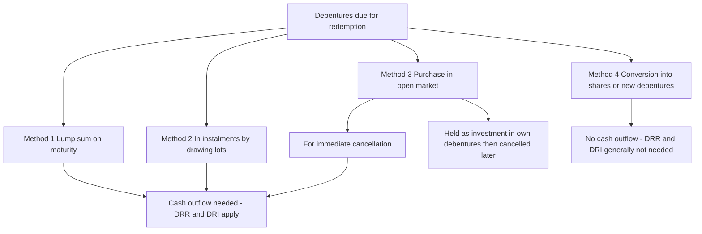
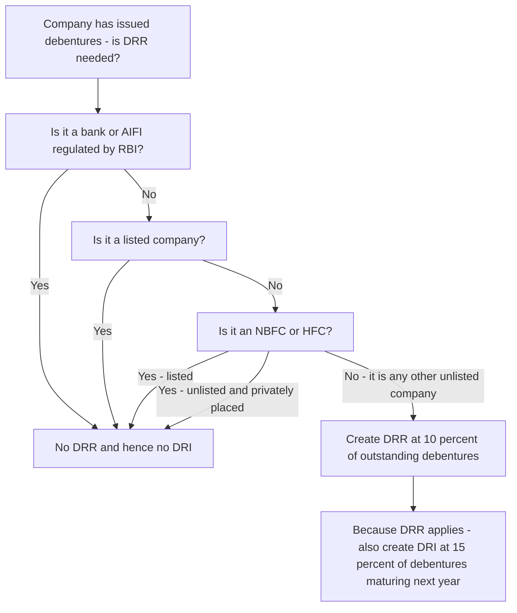
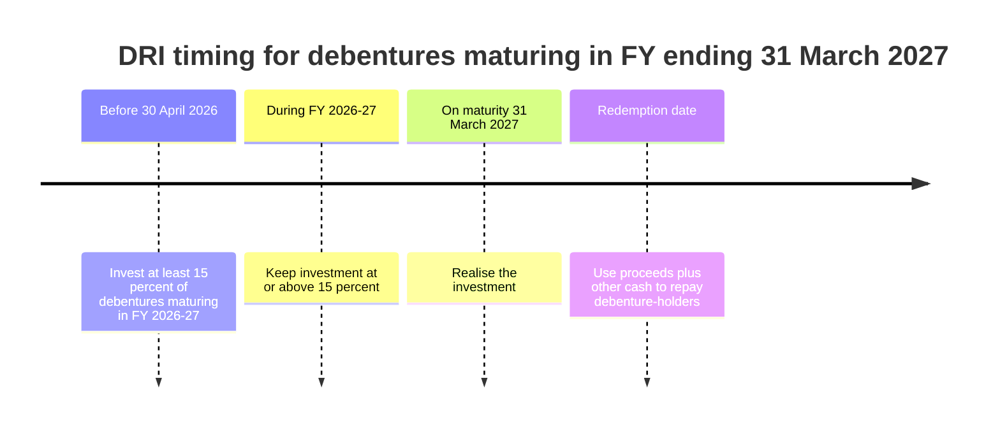
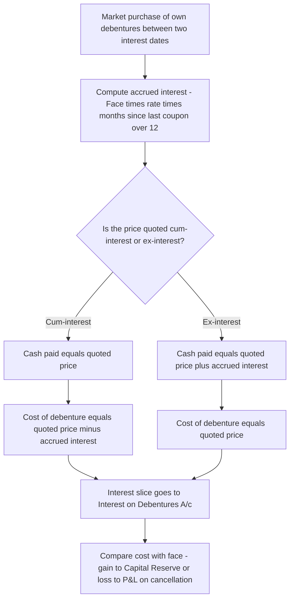

<!-- v2-deep -->

# Chapter 37 — Redemption of Debentures

## 1. The Problem

Three years ago Neptune Ltd needed ₹10,00,000 to build a new plant. It did not want to dilute the owners, so instead of issuing shares it *borrowed* the money from the public in small, tradeable slices: **10,000 debentures of ₹100 each, 12% interest, redeemable at the end of 5 years**. Ten thousand ordinary savers each parted with ₹100 on a written promise: *"We will pay you 12% every year, and on maturity we will hand back your ₹100."*

A debenture is nothing more than a **loan cut into standardised, transferable pieces**. And that is exactly where the danger lies. When a bank lends you money, the bank is one powerful, watchful creditor with lawyers. But Neptune's ₹10,00,000 is owed to ten thousand scattered individuals — a schoolteacher in Pune, a retiree in Chennai — none of whom can individually police the company. They have no seat on the board, no vote, no way of knowing whether Neptune is quietly frittering away the cash that is supposed to repay them on maturity.

Here is the concrete failure mode. Suppose Neptune earns handsome profits over five years and cheerfully pays all of it out as **dividend** to its equity shareholders. On the maturity date it turns its pockets inside out and finds there is no cash left to redeem the debentures. The equity shareholders have walked off with the profits; the debenture-holders are left holding worthless paper. The very people who *lent first and rank ahead of shareholders* end up worse off than the owners.

So the problem is not "how do we pass the redemption entries." The problem is: **how do we stop a company from distributing away the profits that its debenture-holders are silently relying on for repayment, so that when the maturity date arrives the money is actually there?** And a second, mechanical problem sits alongside it: **when the company buys back its own debentures in the stock market on a random date, how much of the price is repayment of the loan and how much is interest?** This chapter builds both machines from first principles.

A third, quieter problem hides underneath the first two. Redemption is not one event but a *timeline* — profits must be fenced **before** the money leaves, cash must be stockpiled **before** the redemption year opens, and the fence must come down **only after** the last holder is paid. Get the sequence wrong — release the reserve too early, invest the cash too late — and the protection collapses even though every individual entry looks correct. Much of the exam difficulty is really about placing each entry on the **right date**, not about the arithmetic.

## 2. The Core Idea (analogy)

Think of debenture redemption as a **layaway plan run in reverse**.

When you buy a fridge on layaway, *you* promise the shop to set aside a little money each month so that on delivery day the full price is ready. The company's promise to its debenture-holders is the mirror image: the company borrowed the cash up front and must now discipline *itself* to have the repayment ready on maturity day.

Left to its own devices, a company will not save. Every rupee of profit is tempting to pay out as dividend today. So the law installs a **forced piggy-bank with two locks**:

- **Lock 1 — the paper lock (Debenture Redemption Reserve, DRR):** Before the company is allowed to redeem, it must *quarantine a slice of its profits* by moving them from "free profit I could pay as dividend" into a reserve I am **forbidden to distribute**. This does not create cash; it creates a *legal fence* around retained earnings so the profit cannot leak out as dividend. It guarantees the profits stay *inside* the company.
- **Lock 2 — the cash lock (Debenture Redemption Investment, DRI):** A fence around profits is useless if the *cash* itself has been sunk into illiquid plant. So the law also forces the company, shortly before maturity, to physically park a slice of real money in safe, liquid outside investments — bank deposits, government securities — earmarked for redemption. This is the actual coins in the piggy-bank.

The **sinking fund method** you will meet later is simply the *voluntary, gold-plated* version of Lock 2: instead of parking cash only at the end, the company sets aside a fixed sum *every year*, lets it earn interest, and lets that interest snowball so that the fund grows to exactly the redemption amount on maturity day. It is the fridge-layaway done properly, month by month.

Keep this picture: **DRR fences the profit; DRI (or the sinking fund) stockpiles the cash.** Nearly every rule in this chapter is one of those two locks, or a rule about *how* the company hands the money back.

One sharpening of the analogy is worth burning in, because the exam loves to punish the fuzzy version. The **fence (DRR)** and the **stockpile (DRI)** are measured on *different bases*, in *different units*, at *different times*. DRR is a slice of **profit** (an equity appropriation, no cash moves) sized on the **outstanding** debentures and built up **before** redemption. DRI is a slice of **cash** (a real bank outflow into securities) sized on only the debentures **maturing this coming year** and parked **by 30 April**. A student who thinks "reserve and investment are just two entries for the same amount" will mis-size at least one of them on every problem. They are two locks on the same box — not two keys to the same lock.

## 3. Why It's Built This Way

The governing principle is **protection of creditors through anti-avoidance of the dividend rules**. A company can legally pay dividends only out of profits. But nothing in the dividend law, by itself, stops a company from paying out *every* rupee of profit and leaving nothing for debenture repayment. Debenture-holders rank *above* shareholders on winding up, yet in a going concern the shareholders control the dividend tap. Without intervention, the junior claimants (shareholders) could drain the company ahead of the senior claimants (debenture-holders). That inversion of priority is precisely what the law refuses to allow.

Section 71(4) of the Companies Act 2013 therefore forces a **DRR out of profits**. Read it as: *"You may not treat all your profit as freely distributable while you still owe debenture-holders. A portion must be trapped as a reserve until they are paid."* The reserve is created by an appropriation of profit — a transfer within equity — so it reduces the profits *available for dividend* by exactly that amount. That is the whole point: the dividend tap is throttled to the extent of the DRR.

But a reserve is only a bookkeeping fence. A company could comply with the DRR requirement on paper while having ploughed all its actual cash into a factory. So Rule 18(7) of the Companies (Share Capital and Debentures) Rules 2014 bolts on the **DRI**: physical liquid investment of a defined percentage of the debentures *maturing that year*, made before the year begins. Fence plus stockpile.

Two further design choices follow naturally:

- **Why is DRR released only *after* redemption, and only to General Reserve (not back to P&L for dividend)?** Because the fence must stay up until the debenture-holders are actually paid. The moment they are paid, the fence has done its job — but letting the trapped profit flow straight back out as dividend would be unseemly, so it is moved to General Reserve (a free reserve, but the transfer keeps it as a reserve rather than instantly distributable "profit for the year").
- **Why are banks, financial institutions and listed companies exempted from DRR?** Because they are *already* heavily regulated and monitored — a bank has RBI on its back, a listed company has SEBI and continuous disclosure. The scattered-helpless-creditor problem that DRR solves barely exists for them, so the law does not duplicate the protection. DRR is aimed squarely at the entity where the danger is greatest: the **unlisted company** answerable to no continuous regulator.

Push the "why" one layer deeper on two points the examiner probes:

- **Why is DRR sized on *outstanding* debentures but DRI on only the *maturing* slice?** Because the two locks answer two different fears. The reserve guards against the *whole* debt being silently drained by dividends over the borrowing's life, so it must scale with the whole outstanding liability. The cash stockpile only has to be *ready for this year's repayment* — locking up 15% cash against debentures that will not mature for another four years would needlessly starve the business of working capital. The law fences broadly but stockpiles just-in-time.
- **Why does cancellation *profit* go to Capital Reserve, but cancellation *loss* to the P&L?** Buying back your own debt below face value is a windfall from the debt market, not a trading gain earned by operations — it is *capital* in nature and, being unrealised in the normal trading sense and not distributable, it is fenced in Capital Reserve. A loss, however, is a real cash cost the company chose to incur, so prudence (the conservatism convention) says recognise it immediately against revenue profits. The asymmetry is the conservatism convention in action: defer the gain, book the loss.

Every rule below is one of these ideas made concrete.

## 4. Full Technical Content

### 4.1 What "redemption" means and the four methods

**Redemption** = discharging the debenture liability, i.e. repaying the borrowed money (and cancelling the debentures). The terms of redemption — date, whether at par or premium — are fixed in the original debenture trust deed. The company may repay in one of four ways:


*Figure 1 — The four redemption routes and whether they consume cash.*

1. **Lump sum (bullet) redemption** — the entire amount is repaid on a single maturity date fixed in advance. Simplest; needs the largest one-time cash pile, so the savings discipline matters most here.
2. **Redemption in instalments (by drawing lots / "drawings")** — a fixed number of debentures is redeemed each year. Which specific debentures are redeemed is decided by a lottery ("drawing by lot") so it is fair. Spreads the cash outflow.
3. **Purchase in the open market** — instead of waiting for maturity, the company buys its own debentures on the stock exchange, usually when they trade *below* face value, and cancels them. This is cheaper (buy a ₹100 debenture for ₹96 and extinguish a ₹100 liability → ₹4 gain) and is the source of the **cum-interest / ex-interest** complication.
4. **Conversion** — the debenture-holder is given equity shares (or fresh debentures) instead of cash, per a pre-agreed ratio. No cash leaves the company, so the creditor-protection machinery is largely unnecessary.

**Sources of funds for redemption — the "three-way choice" the examiner loves to name-check.** Textbooks classify redemption not only by *method* but by *where the money comes from*:

- **Redemption out of profits** — the company earns and retains enough profit and creates a DRR equal (in the older 100% school) to the debentures being redeemed, so that an amount equal to the redemption is permanently withheld from dividend. This is the "conservative" route.
- **Redemption out of capital** — the company redeems without setting aside profits (or setting aside less than 100%), so redemption is effectively financed from the company's capital/loan resources. This is what the statutory *minimum* DRR (10%, or nil for exempt companies) now permits — the law no longer forces a 100% profit set-aside.
- **Redemption partly out of profits and partly out of capital** — the middle path that the current 10% DRR actually produces: 10% fenced from profit, 90% funded from other resources.

Read older ICAI illustrations with this lens: when a problem says "redeem out of profits," it wants a DRR appropriation equal to the redemption amount; when it says "out of capital," it wants only the *statutory minimum* DRR (or nil). The *entries to the debenture-holders are identical either way* — the only difference is the size of the DRR appropriation.

### 4.2 Debenture Redemption Reserve (DRR) — Section 71(4) + Rule 18(7)(b)

**The rule:** A company that issues debentures must create a DRR out of *profits available for dividend*, and amounts credited to it must not be used except for the redemption of debentures.

**Who is exempt / how much (post the Companies (Share Capital and Debentures) Amendment Rules, 2019, effective 16 August 2019):**

| Category of company | DRR requirement |
|---|---|
| All-India Financial Institutions regulated by RBI; Banking companies | **No DRR** (public issue or private placement) |
| Listed NBFCs (registered with RBI u/s 45-IA) and listed HFCs (registered with NHB) | **No DRR** (public issue or private placement) |
| Other listed companies | **No DRR** (public issue or private placement) |
| Unlisted NBFCs and unlisted HFCs | **No DRR** for privately placed debentures |
| **Other unlisted companies** | **DRR = 10%** of the outstanding value of debentures |

> Historical note for older questions: before the 2019 amendment the DRR figure was **25%** of the value of the debentures to be redeemed (and several of the above categories that are now fully exempt then had a 25% requirement). If an exam problem is dated pre-2019 or explicitly says "25%", use 25%. For current questions use **10%** and the exemptions above. Flag which regime you are applying in your answer. *(Rates/exemptions can be amended — verify against current ICAI study material for your attempt's applicable AY.)*

DRR is created by appropriating profit: it *reduces divisible profits*, it does **not** create cash, and it is built up **before** redemption begins.

**Finer distinctions the exam tests on DRR:**

- **Base = "outstanding value of debentures," not the face value originally issued.** If part of the issue was already converted or already redeemed in an earlier year, the 10% is on what still stands outstanding. Watch for problems where some debentures were converted into shares — those drop out of the base.
- **"Value" means the amount at which the liability stands, i.e. face value.** DRR is *not* computed on the premium-inclusive redemption amount; the premium on redemption is dealt with separately as a liability from issue.
- **DRR is a one-time adequacy test, not an annual re-computation** (unlike the CRR-style intuition some students import). The company builds the reserve up to the required level before redemption and holds it; it does not top it up every year on a shrinking base unless the problem specifically models instalment redemption.
- **Timing:** the reserve must exist *before* the company begins to redeem. In an instalment problem the safe convention is to create the full required DRR before the first instalment and release it only after the last.


*Figure 2 — Decision path for whether DRR and therefore DRI apply.*

### 4.3 Debenture Redemption Investment (DRI) — Rule 18(7)(c)

**The rule:** Every company **required to create a DRR** must, on or before **30th April** of each year, **invest or deposit a sum of not less than 15% of the amount of its debentures maturing during the year ending on the 31st March of the next year**, in one or more of the specified liquid instruments.

Read carefully:
- The **base** is the debentures *maturing in the coming financial year*, not the total outstanding.
- The **15%** must be in place *by 30 April*, i.e. within one month of the financial year in which redemption falls.
- The invested amount **must not fall below 15%** of the debentures maturing during the year until redemption is complete.
- Only companies that must create DRR must also make the DRI. If DRR is not required (e.g. a listed company), DRI is not required either.

**Permitted forms of DRI (specified instruments):** deposits with a scheduled bank (free from charge/lien); unencumbered securities of the Central or State Government; unencumbered securities listed in section 20(a)–(d) of the Indian Trusts Act 1882; unencumbered bonds of another listed company. (Note: for banking companies the deposit route only.)


*Figure 3 — The DRI must be funded before the redemption year opens and held until redemption.*

**Subtleties worth a mark:**

- **The 15% is a floor, not a cap.** A prudent company (or an exam that says "invested the required amount") parks *exactly* 15%; nothing stops it investing more, but the statutory test is only breached if it dips below 15%.
- **The DRI is realised to help fund redemption, not held afterwards.** Once holders are paid, the investment has served its purpose and any residual is simply the company's free cash again.
- **DRI can earn interest.** Bank deposits and government securities yield interest; that interest is the company's income (credited to Statement of P&L), *not* added to the debenture-holders' entitlement. Do not confuse DRI interest income with the debenture *coupon* the company pays out.
- **"Deposit" vs "invest":** the Rule allows a bank *deposit* or an *investment* in specified securities; both count. A charge or lien on the instrument disqualifies it — it must be *unencumbered*, because an encumbered security is not truly available to repay holders.

### 4.4 The journal entries (the core toolkit)

Let the outstanding debentures be face value **F**, redeemable at a premium of **P%** (P may be zero).

**(a) Creating the DRR (before redemption, out of profits):**

```
Surplus in Statement of P&L (or General Reserve)   Dr   [DRR amount]
    To Debenture Redemption Reserve A/c
```

**(b) Providing the premium payable on redemption** (if debentures are redeemable at a premium — this is a *loss on redemption*, a known liability from the date of issue). The "Premium on Redemption of Debentures A/c" is a personal/liability account created at issue; here we simply confirm it is standing at the balance sheet date:

```
(At issue, memorised) 
Loss on Issue of Debentures A/c        Dr
    To Premium on Redemption of Debentures A/c
```

**(c) Making the DRI (on/before 30 April of the redemption year):**

```
Debenture Redemption Investment A/c    Dr   [15% of debentures maturing]
    To Bank A/c
```

**(d) On maturity — realise the investment (with any interest earned):**

```
Bank A/c                               Dr
    To Debenture Redemption Investment A/c
    To Interest on DRI / Bank A/c (interest received)   [if any]
```

**(e) Amount due to debenture-holders:**

```
12% Debentures A/c                     Dr   [F, face value]
Premium on Redemption of Debentures A/c Dr  [F × P%, if redeemable at premium]
    To Debenture-holders A/c                [F × (1 + P%)]
```

**(f) Payment:**

```
Debenture-holders A/c                  Dr
    To Bank A/c
```

**(g) After redemption is complete — release the DRR (it has done its job):**

```
Debenture Redemption Reserve A/c       Dr
    To General Reserve A/c
```

> Note the discipline: DRR is *created out of profit before* redemption and *transferred to General Reserve after* redemption — never back to the P&L for dividend.

**Two entries students routinely leave out (each a soft mark):**

- **The final coupon interest at redemption.** On the maturity date the company also owes the *last* period's interest. `Interest on Debentures A/c Dr → Debenture-holders A/c (or Bank)`. Redemption of principal and payment of the final interest are two different obligations settled on the same day; a clean answer shows both.
- **Realising DRI interest income before redemption.** If the DRI earned interest during the year, that interest is the company's income (`Bank Dr → Interest on Investment A/c`), and it *adds to the cash available* for redemption — but it does not reduce the amount owed to holders.

### 4.5 Purchase in the open market: cum-interest vs ex-interest

When a company buys its own debentures between two interest dates, the seller is entitled to interest that has *accrued* since the last interest payment. The market quotes the price in one of two ways, and you must split price from interest correctly, because **the debenture liability is only extinguished at face value; the interest portion is a finance cost, not repayment of principal.**

| Quotation | What the quoted price includes | Cost of the *investment/debenture* | Accrued interest treatment |
|---|---|---|---|
| **Cum-interest** ("with interest") | Price **includes** accrued interest | **= Quoted price − Accrued interest** | Accrued interest is *carved out* of the price and debited to Interest A/c |
| **Ex-interest** ("without interest") | Price **excludes** accrued interest | **= Quoted price** | Accrued interest is paid *on top of* the price, debited to Interest A/c |

**Accrued interest** = Face value of debentures bought × coupon rate × (months since last interest date ÷ 12).

- **Cum-interest total cash paid** = Quoted price. Of that, the interest slice goes to Interest A/c and the remainder is the true cost of the debentures.
- **Ex-interest total cash paid** = Quoted price + accrued interest. The quoted price is the true cost of the debentures; the added interest goes to Interest A/c.


*Figure 4 — Splitting a market purchase into cost of debt versus accrued interest.*

**On cancelling own debentures bought in the market:**
```
12% Debentures A/c        Dr   [Face value]
    To Own Debentures / Bank A/c   [Cost of debentures]
    To Profit on Cancellation of Debentures A/c   [balancing figure, if cost < face]
```
Profit on cancellation is a **capital profit → Capital Reserve**. A loss (cost > face) is charged to the Statement of Profit and Loss.

**Held-as-investment variant (own debentures not immediately cancelled).** Sometimes the company buys its debentures cheaply but does *not* cancel them at once — it holds them as "Investment in Own Debentures." While held:
- The investment sits on the asset side at cost.
- On subsequent interest dates the company would notionally "pay itself" interest — in practice, interest on own debentures held is *not* an income (you cannot earn interest from yourself); the coupon on those debentures is simply not paid out. Exam answers usually credit the interest on own debentures to the Statement of P&L to offset the full interest expense charged on the whole issue, so the *net* interest expensed equals interest on debentures held by outsiders.
- When later cancelled, `12% Debentures Dr (face) → Investment in Own Debentures (cost)` with the difference to **Capital Reserve** (profit) or **P&L** (loss), exactly as in the immediate-cancellation case.

The distinction the examiner tests: *"purchased for immediate cancellation"* → straight to `12% Debentures A/c`; *"purchased as investment / to be held"* → route through `Investment in Own Debentures A/c` first.

**What if the company buys *above* par (at a premium)?** If a ₹100 debenture is bought for ₹103, the cost (₹103) exceeds face (₹100) → a **₹3 loss on cancellation → Statement of P&L**, never Capital Reserve. This happens when the market rate has fallen below the coupon, so the debenture trades above par. Same split logic for interest; only the sign of the difference flips, and losses cannot be parked in Capital Reserve.

### 4.6 Sinking Fund (Debenture Redemption Fund) method

A voluntary, systematic way to guarantee the cash is there. The company sets aside a **fixed annual sum**, invests it outside the business, and **reinvests the interest earned** so the fund compounds up to the redemption amount on maturity.

The fixed annual set-aside is found from the **sinking fund factor** (from annuity tables): 

> Annual appropriation = Amount required on maturity × Sinking Fund Factor(n years, r%)

where the factor is `r / [(1+r)^n − 1]`.

Two parallel accounts run:
- **Debenture Redemption Fund A/c** (a reserve, appropriation of profit) — grows by the annual appropriation *plus* the interest earned on investments each year.
- **Debenture Redemption Fund Investment (DRFI) A/c** — the actual securities bought with the set-aside cash and reinvested interest.

On maturity the investments are sold and the debentures redeemed; the accumulated Fund is then transferred to General Reserve.

**Timing conventions that trip students up:**

- **No investment is made in the *last* year at the end.** In the final year the fund is needed *immediately* to redeem, so the last annual appropriation and the final interest are *not* reinvested in fresh securities — the investments are instead sold. In the standard table the Year-*n* closing simply equals the redemption amount; you do not buy securities you would sell the same day.
- **Interest is earned on the *opening* investment balance**, i.e. the securities held at the *start* of the year, not the closing balance. First-year interest is therefore zero (no securities were held at the start).
- **If investments are sold at a profit or loss on maturity**, that difference is routed *through* the Sinking Fund A/c (it is part of the fund's performance), then the fund is transferred to General Reserve. A sale profit is a capital-natured item like any own-debenture cancellation gain.
- **DRR/DRI still apply on top for a company that is required to create them.** The sinking fund is a *funding* mechanism; it does not by itself discharge the statutory 10% DRR / 15% DRI obligation, though a fully-funded liquid sinking fund effectively satisfies the cash-stockpile purpose.

## 5. Worked Examples

### Example 1 — Lump sum redemption at par by an unlisted company (DRR + DRI, full cycle)

**Facts.** Meridian Ltd (an *unlisted* manufacturing company) has **₹20,00,000 of 12% Debentures of ₹100 each**, redeemable at par on **31 March 2027**. Interest is paid on 31 March each year. The company has ample profits. Show the DRR, DRI, and redemption entries. (Apply current rules: DRR 10%, DRI 15%.)

**Step 1 — DRR required?** Unlisted company, not a bank/NBFC/HFC → **DRR of 10%** of outstanding debentures = 10% × ₹20,00,000 = **₹2,00,000**. Create it out of profits before redemption (say during FY 2025-26).

```
31 Mar 2026  Surplus in Statement of P&L A/c   Dr   2,00,000
                 To Debenture Redemption Reserve A/c        2,00,000
```

**Step 2 — DRI.** Debentures maturing in FY 2026-27 = ₹20,00,000. DRI = 15% × ₹20,00,000 = **₹3,00,000**, to be invested on/before **30 April 2026**.

```
30 Apr 2026  Debenture Redemption Investment A/c   Dr   3,00,000
                 To Bank A/c                                  3,00,000
```

**Step 3 — Realise investment on maturity** (assume no interest on DRI for simplicity):

```
31 Mar 2027  Bank A/c                              Dr   3,00,000
                 To Debenture Redemption Investment A/c       3,00,000
```

**Step 4 — Amount due and paid** (at par, so no premium):

```
31 Mar 2027  12% Debentures A/c                    Dr  20,00,000
                 To Debenture-holders A/c                    20,00,000

31 Mar 2027  Debenture-holders A/c                 Dr  20,00,000
                 To Bank A/c                                 20,00,000
```

**Step 5 — Release DRR after redemption:**

```
31 Mar 2027  Debenture Redemption Reserve A/c      Dr   2,00,000
                 To General Reserve A/c                       2,00,000
```

**Reconciliation.** Cash paid to holders ₹20,00,000; part-funded by realising the ₹3,00,000 DRI (which was itself carved out of the company's cash a year earlier), the rest from general cash. The ₹2,00,000 profit that was fenced as DRR now sits, un-distributed, in General Reserve. Debenture liability is nil. ✓

**Examiner tweak — "what if Meridian were *listed*?"** Then **no DRR and no DRI**: Steps 1, 2, 3 and 5 all vanish. Only Step 4 (due + pay ₹20,00,000) survives. The entire "reserve + investment" apparatus is switched off by the single fact of being listed — a favourite one-mark distinction.

### Example 2 — Redemption at a premium, in annual instalments by drawing lots

**Facts.** Cygnus Ltd (unlisted) issued **₹15,00,000 of 10% Debentures of ₹100** at par, **redeemable at a premium of 5%** in **three equal annual instalments** of ₹5,00,000 face value each, by drawing lots, starting 31 March 2026. Show the redemption entries for the **first instalment** (ignore DRI mechanics; focus on premium and drawings).

**Step 1 — Premium on redemption.** Each instalment repays ₹5,00,000 face at 5% premium → premium = ₹25,000; total payable = **₹5,25,000**.

**Step 2 — Amount due on first drawing:**

```
31 Mar 2026  10% Debentures A/c                       Dr  5,00,000
             Premium on Redemption of Debentures A/c   Dr    25,000
                 To Debenture-holders A/c                       5,25,000
```

**Step 3 — Payment:**

```
31 Mar 2026  Debenture-holders A/c                    Dr  5,25,000
                 To Bank A/c                                    5,25,000
```

**Step 4 — DRR (created before redemption began).** DRR of 10% on the *total issue* ₹15,00,000 = ₹1,50,000 was created up front. As redemption progresses over the three years the company keeps the DRR intact until the *last* instalment is redeemed, then transfers the whole ₹1,50,000 to General Reserve. (Common exam convention: release DRR only when the *entire* liability is discharged.)

**Reconciliation.** Over three years, 3 × ₹5,25,000 = ₹15,75,000 leaves the bank: ₹15,00,000 clears the debenture liability and ₹75,000 clears the accumulated premium-on-redemption liability. Both accounts close to nil. ✓

**Examiner tweak — DRI on an instalment issue.** DRI would be 15% of the debentures *maturing in each coming year* — i.e. 15% × ₹5,00,000 = ₹75,000 in place by 30 April before *each* instalment year, realised and used each year. The base is the *maturing slice*, not the whole ₹15,00,000, so DRI is funded three times in slices, not once in a lump — a classic trap that tests whether you know the DRI base.

### Example 3 — Purchase in the open market: cum-interest AND ex-interest, with cancellation

**Facts.** Orion Ltd has **12% Debentures of ₹100** outstanding. Interest is payable half-yearly on **30 September and 31 March**. On **1 August 2026** the company purchases in the open market **1,000 of its own debentures for immediate cancellation**. Show the treatment if the price is (a) **₹98 cum-interest**, and (b) **₹98 ex-interest**.

**Common step — accrued interest.** Last interest date = 31 March 2026. From 1 April to 1 August 2026 = **4 months** accrued.
Accrued interest = Face × rate × 4/12 = ₹1,00,000 × 12% × 4/12 = **₹4,000**.

---

**Case (a) — ₹98 cum-interest.**

Total cash paid = 1,000 × ₹98 = **₹98,000** (this *includes* the ₹4,000 interest).
Cost of debentures = ₹98,000 − ₹4,000 = **₹94,000**.

*Purchase:*
```
1 Aug 2026  Own Debentures A/c              Dr  94,000
            Interest on Debentures A/c      Dr   4,000
                To Bank A/c                          98,000
```

*Cancellation* (face ₹1,00,000 vs cost ₹94,000 → capital profit ₹6,000):
```
1 Aug 2026  12% Debentures A/c              Dr 1,00,000
                To Own Debentures A/c                 94,000
                To Profit on Cancellation of Debentures A/c  6,000

            Profit on Cancellation of Debentures A/c  Dr  6,000
                To Capital Reserve A/c                        6,000
```

---

**Case (b) — ₹98 ex-interest.**

Cost of debentures = quoted price = 1,000 × ₹98 = **₹98,000**.
Accrued interest paid *in addition* = **₹4,000**.
Total cash paid = ₹98,000 + ₹4,000 = **₹1,02,000**.

*Purchase:*
```
1 Aug 2026  Own Debentures A/c              Dr  98,000
            Interest on Debentures A/c      Dr   4,000
                To Bank A/c                         1,02,000
```

*Cancellation* (face ₹1,00,000 vs cost ₹98,000 → capital profit ₹2,000):
```
1 Aug 2026  12% Debentures A/c              Dr 1,00,000
                To Own Debentures A/c                 98,000
                To Profit on Cancellation of Debentures A/c  2,000

            Profit on Cancellation of Debentures A/c  Dr  2,000
                To Capital Reserve A/c                        2,000
```

**Reconciliation & lesson.** In both cases the ₹4,000 interest is the *same* (it is a genuine finance cost owed for four months) and lands in the Interest A/c. What differs is the **cost of the debenture** and hence the capital profit: cum-interest buries the interest *inside* ₹98, so the true cost is only ₹94; ex-interest adds interest *on top*, so the true cost is the full ₹98. Get the split wrong and both the Capital Reserve and the interest expense are misstated. ✓

### Example 4 — Sinking Fund (Debenture Redemption Fund) method

**Facts.** Vega Ltd must redeem **₹4,00,000 of debentures at par at the end of 3 years**. It decides to build a sinking fund earning **10% p.a.**, reinvesting interest annually. The sinking fund factor for 3 years at 10% is **0.302115**. Prepare the Debenture Redemption Fund / Investment schedule.

**Step 1 — Annual appropriation** = ₹4,00,000 × 0.302115 = **₹1,20,846** (rounded).

**Step 2 — Build the fund table.** Interest is earned on the *opening* investment balance each year and reinvested; the appropriation is added at year-end.

| Year | Opening investment | Interest at 10% (reinvested) | Annual appropriation | Closing fund / investment |
|---|---|---|---|---|
| 1 | 0 | 0 | 1,20,846 | 1,20,846 |
| 2 | 1,20,846 | 12,085 | 1,20,846 | 2,53,777 |
| 3 | 2,53,777 | 25,377 | 1,20,846 | **4,00,000** |

(Year-3 closing = 2,53,777 + 25,377 + 1,20,846 = 4,00,000; a ₹0–1 difference is rounding of the factor, adjusted in the final appropriation.)

**Step 3 — Representative entries.**

*Each year — appropriation:*
```
Surplus in Statement of P&L A/c         Dr   1,20,846
    To Debenture Redemption Fund A/c              1,20,846

Debenture Redemption Fund Investment A/c Dr   1,20,846
    To Bank A/c                                   1,20,846
```
*Years 2 and 3 — interest earned and reinvested (Year 2 shown):*
```
Bank A/c                                 Dr   12,085
    To Interest on DRF Investment A/c            12,085

Interest on DRF Investment A/c           Dr   12,085
    To Debenture Redemption Fund A/c             12,085

Debenture Redemption Fund Investment A/c Dr   12,085
    To Bank A/c                                   12,085
```
*End of Year 3 — sell investments and redeem:*
```
Bank A/c                                 Dr  4,00,000
    To Debenture Redemption Fund Investment A/c  4,00,000

Debentures A/c                           Dr  4,00,000
    To Debenture-holders A/c                     4,00,000
Debenture-holders A/c                    Dr  4,00,000
    To Bank A/c                                   4,00,000

Debenture Redemption Fund A/c            Dr  4,00,000
    To General Reserve A/c                       4,00,000
```

**Reconciliation.** Total appropriated from profit over 3 years = 3 × ₹1,20,846 = ₹3,62,538. Interest reinvested = ₹12,085 + ₹25,377 = ₹37,462. Sum = ₹4,00,000 — exactly the redemption amount. The compounding interest is what lets the company set aside *less* than ₹4,00,000 of its own profit. ✓ (Under the current Rules, a company still required to create DRR would additionally maintain the statutory 15% DRI; the sinking fund above is the voluntary funding mechanism and, when fully funded in liquid securities, effectively subsumes it.)

### Example 5 — Own debentures purchased as *investment*, held, then cancelled later

**Facts.** Sirius Ltd has **12% Debentures of ₹100** outstanding, interest payable 31 March annually. On **1 October 2026** it buys **2,000 of its own debentures at ₹96 (ex-interest) as an investment** (not for immediate cancellation). On **31 March 2027** it (i) receives/accounts interest, then (ii) cancels the held debentures. Show the entries.

**Step 1 — Purchase as investment (ex-interest, 6 months accrued 1 Apr–1 Oct).**
Accrued interest = ₹2,00,000 × 12% × 6/12 = **₹12,000**. Cost of investment = 2,000 × ₹96 = **₹1,92,000**. Cash paid = ₹1,92,000 + ₹12,000 = **₹2,04,000**.
```
1 Oct 2026  Investment in Own Debentures A/c   Dr  1,92,000
            Interest on Debentures A/c         Dr    12,000
                To Bank A/c                              2,04,000
```

**Step 2 — 31 March 2027, interest for the year on the whole issue.** The company charges interest for the full year on all debentures, but interest on the *own* debentures held (for the 6 months held, ₹2,00,000 × 12% × 6/12 = ₹12,000) is not truly paid out — it is credited back as income on own debentures. Net cash interest goes only to outside holders. (Exam convention: `Interest on Debentures A/c Dr → Bank (outsiders)` and `Bank/Interest receivable Dr → Interest on Own Debentures A/c` for the internal portion, the latter closed to P&L.)

**Step 3 — Cancellation on 31 March 2027.** Face ₹2,00,000 vs cost ₹1,92,000 → **capital profit ₹8,000**.
```
31 Mar 2027  12% Debentures A/c            Dr  2,00,000
                 To Investment in Own Debentures A/c    1,92,000
                 To Capital Reserve A/c                     8,000
```

**Reconciliation & lesson.** The *only* structural difference from immediate cancellation is that the cost first parks in **Investment in Own Debentures** and interest on the held debentures is neutralised while held. The ₹8,000 bargain gain still ends in **Capital Reserve**. If the question had said "for immediate cancellation," you would have debited 12% Debentures directly on 1 October and skipped the investment account entirely. ✓

### Example 6 — Redemption "out of capital" vs "out of profits" (same holders, different DRR)

**Facts.** Two identical unlisted companies each have **₹10,00,000 of 12% Debentures** redeemable at par. Company A redeems **out of profits** (management chooses a conservative 100% profit set-aside as an internal policy); Company B redeems using only the **statutory minimum** DRR. Contrast the DRR entries. (Both apply current 10% statutory floor.)

**Company B (statutory minimum only):** DRR = 10% × ₹10,00,000 = **₹1,00,000**.
```
Surplus in Statement of P&L A/c   Dr  1,00,000
    To Debenture Redemption Reserve A/c   1,00,000
```
Redemption entries are the plain `Debentures Dr ₹10,00,000 → holders → Bank`. Effectively ₹1,00,000 financed from fenced profit, ₹9,00,000 from other resources ("partly out of capital").

**Company A (voluntary 100% out of profits):** it *chooses* to fence the whole ₹10,00,000 (policy exceeds the statutory floor).
```
Surplus in Statement of P&L A/c   Dr 10,00,000
    To Debenture Redemption Reserve A/c  10,00,000
```

**Lesson & self-check.** The **cash paid to holders is identical (₹10,00,000)** in both; the *only* difference is the size of the DRR appropriation and hence how much profit is withheld from dividend. Statutorily, only the 10% floor is *required*; anything above is a management/board conservatism choice. In an exam, apply the **10% floor** unless the problem explicitly says "redeem fully out of profits" or "create DRR equal to debentures redeemed." After redemption, whatever DRR was created is transferred to General Reserve. ✓

## 6. Presentation & Disclosure (Schedule III, Companies Act 2013)

**Balance Sheet (Equity & Liabilities):**

| Item | Head | Sub-head |
|---|---|---|
| Debentures (redeemable after 12 months) | Non-current Liabilities | **Long-term Borrowings** |
| Debentures redeemable **within 12 months** | Current Liabilities | **Other Current Liabilities** (current maturities of long-term debt) |
| Debenture Redemption Reserve | Equity | **Reserves and Surplus** |
| Debenture Redemption Fund / Sinking Fund | Equity | **Reserves and Surplus** |
| Premium on Redemption of Debentures | Non-current / Current Liabilities | **Other Long-term / Current Liabilities** (a provision-like liability) |

**Assets side:**

| Item | Head | Sub-head |
|---|---|---|
| Debenture Redemption Investment / DRF Investment | Current Assets (if maturing within a year) or Non-current | **Current / Non-current Investments** |

**Notes / disclosures to make:**
- Terms of redemption: date(s), whether at par or premium, instalment pattern, drawing-by-lot mechanism.
- Nature and security of the debentures (secured/unsecured, charge details).
- Amount and basis of DRR created (state the % and the regime applied).
- DRI: amount invested and that it is ≥15% of debentures maturing in the year.
- Interest accrued and due / accrued but not due on debentures.
- Profit on cancellation credited to **Capital Reserve**.

**Presentation nuances that carry marks:**
- **Current-maturity reclassification.** As a redemption date crosses into the next 12 months, the debentures move from *Long-term Borrowings* to *Other Current Liabilities (current maturities)*. Examiners test this in balance-sheet questions dated shortly before maturity — the debenture is a current liability that year even though it was issued as long-term debt.
- **DRR and DRF both sit inside Reserves and Surplus**, but they are *distinct line items*; do not merge them, and note that Capital Reserve (from cancellation gains) is a *third*, separate reserve line.
- **Interest accrued but not due** on debentures at the balance-sheet date is disclosed under Other Current Liabilities (it is owed but the coupon date has not yet arrived) — distinct from *interest accrued and due* (coupon date passed, still unpaid).

## 7. Connections

- **Chapter on Issue of Debentures.** Redemption is the back-end of what issue set up. The *Premium on Redemption of Debentures* liability and the corresponding *Loss on Issue of Debentures* are created **at issue** and simply discharged here — you cannot correctly redeem at a premium without understanding how that premium was booked on day one.
- **Chapter 31 — Redemption of Preference Shares.** Same creditor-protection philosophy, mirror-image mechanics. Preference-share redemption protects creditors with the **Capital Redemption Reserve (CRR)** because shares are *capital*; debenture redemption protects debenture-holders with **DRR** because debentures are *debt*. CRR is mandatory-to-preserve-capital; DRR is a savings-discipline reserve released after use. Contrast, don't conflate.
- **Chapter 32 — Buy-back of Securities.** Open-market purchase of own debentures is conceptually a "buy-back of debt," and like share buy-back it can generate a capital profit — but debentures are debt, so cancellation profit goes to **Capital Reserve**, and there is no CRR/Section 68 machinery.
- **AS 16 Borrowing Costs.** Debenture interest (the coupon) and amortised issue costs are borrowing costs; the cum/ex-interest split in this chapter is where interest expense is correctly *timed*.
- **Company Financial Statements (Schedule III).** Where every account above finally lands.
- **Provisions vs Reserves (conceptual).** DRR is a *reserve* (an appropriation of profit, not a charge against it); the premium on redemption is a *liability/provision* recognised at issue. Distinguishing a charge from an appropriation is the same distinction that runs through depreciation, provisions and reserves — DRR is on the appropriation side of that line.

## 8. Traps & Examiner Tricks

1. **Applying the wrong DRR %.** Post-16-Aug-2019 the figure is **10%** (of outstanding debentures) and *only for unlisted non-exempt companies*; pre-2019 it was **25%**. Listed companies, banks, NBFCs/HFCs (as specified) need **no DRR**. Read the company's status and the date. State which regime you applied.
2. **DRI base confusion.** DRI is 15% of the debentures **maturing during the coming year**, *not* 15% of total outstanding, and *not* 15% of the DRR. And DRI is a **cash investment**; DRR is a **profit appropriation** — they are different animals of different amounts.
3. **Forgetting that DRR needs actual profits.** DRR is created out of *profits available for dividend*. If the question says profits are inadequate, you flag it — you cannot conjure a DRR from thin air (though the statutory obligation may then force reliance on the DRI cash mechanism).
4. **Cum vs ex-interest inversion.** The single most common slip. **Cum-interest: subtract** accrued interest from the quoted price to get cost. **Ex-interest: add** accrued interest to the quoted price to get cash paid (cost = quoted price). Mixing these misstates both interest expense and cancellation profit.
5. **Counting accrued interest from the wrong date.** Always count from the **last interest payment date** to the purchase date, not from the start of the financial year and not to the next coupon date. On a *half-yearly* coupon, the last date might be 30 September, not the year-start.
6. **Routing cancellation profit to P&L.** Profit on cancellation of own debentures is a **capital profit → Capital Reserve**, never to the Statement of Profit and Loss. A *loss* on cancellation, however, goes to P&L.
7. **Releasing DRR to P&L / for dividend.** After redemption, DRR is transferred to **General Reserve**, not back to the Statement of Profit and Loss and never distributed as dividend before redemption.
8. **Ignoring interest reinvestment in the sinking fund.** In the sinking fund table, interest is earned on the *opening investment balance* and must be added to the fund and reinvested. Forgetting it makes the fund fall short of the redemption amount.
9. **Premium on redemption treated as an expense of the redemption year.** It is a liability recognised **at issue** (against Loss on Issue of Debentures); at redemption you merely *pay it off*, you don't create a fresh expense.
10. **Own-debentures held as investment vs cancelled.** If bought "for immediate cancellation," debit 12% Debentures directly. If bought to *hold* as an investment, they sit in "Investment in Own Debentures" and interest continues to be a notional item until later cancellation — read which the question wants.
11. **Sizing DRR on the premium-inclusive amount.** DRR is 10% of the **face/outstanding value**, not 10% of (face + premium on redemption). The premium is handled separately as a liability from issue; do not inflate the DRR by it.
12. **Buying own debentures *above* par and expecting a Capital Reserve.** A purchase at cost > face produces a **loss → P&L**. Capital Reserve only ever *receives* gains; it never absorbs a cancellation loss.
13. **Investing DRI on the wrong date.** The 15% must be in place **on or before 30 April** of the redemption financial year — not on the maturity date, not at year-end. An answer that funds the DRI on the redemption day itself has missed the statutory timing.
14. **Forgetting the final coupon interest at redemption.** Principal repayment and the last interest instalment are separate obligations settled together on the maturity date; omitting the interest entry loses an easy mark.
15. **Netting DRI interest income against the amount due to holders.** Interest earned on the DRI is the *company's* income; it enlarges the cash pool but does **not** reduce what debenture-holders are owed.

## 9. First-Principles Recap

Start from the danger: a debenture is a loan owed to thousands of helpless, scattered lenders who rank above shareholders but cannot police the company. Left free, a company could pay all profits away as dividend and have nothing left to repay them. Everything else is the cure:

- **Fence the profit** so it can't leak out as dividend → **DRR** (Section 71(4); 10% for unlisted non-exempt companies; nil for regulated/listed entities that are already watched).
- **Stockpile the cash** so the money physically exists → **DRI** (Rule 18(7); 15% of debentures maturing in the year, in place by 30 April, in liquid securities).
- **The gold-plated voluntary version** of stockpiling, done year by year with compounding interest → **sinking fund**.
- **When you finally repay,** discharge the debenture at face value and any pre-booked premium; if you bought in the market, carve interest out of (cum) or add it onto (ex) the price, and send any bargain gain to **Capital Reserve** (but a loss to P&L).
- **Once holders are paid,** the fence has served its purpose → release **DRR to General Reserve**.

If you can re-derive DRR and DRI from "protect the helpless senior lender from the dividend tap," you never have to memorise a single number in isolation. And if you can re-derive the cum/ex split from "the liability dies at face value, everything else on top is time-value interest," you never invert the two cases.

The deepest unifying idea: **redemption is a timeline, and each rule pins one event to one date** — fence *before* you pay, stockpile *before* the year opens, book the final coupon *on* the maturity day, release the fence *after* the last holder is paid. Master the sequence and the entries fall out of it.

## 10. Quick-Revision Sheet

**Four methods:** Lump sum · Instalments (drawing lots) · Open-market purchase · Conversion.
**Three sources:** Out of profits · Out of capital · Partly both.

**DRR (Sec 71(4) + Rule 18(7)(b), post-2019):**
- Out of profits available for dividend; before redemption.
- **10%** of outstanding debentures — for **unlisted, non-exempt** companies.
- **Nil** for banks, AIFIs, NBFCs/HFCs (as specified), all listed companies.
- (Pre-2019: 25%.) Release to **General Reserve** *after* redemption. *(Verify rates against current ICAI material / AY.)*

**DRI (Rule 18(7)(c)):**
- Only if DRR is required.
- **≥15%** of debentures **maturing in the coming FY**, invested by **30 April**, held in liquid specified (unencumbered) securities until redemption.
- Interest earned = company's income; enlarges cash pool, does not reduce holders' dues.

**Cum vs ex-interest (accrued interest = Face × rate × months-since-last-coupon ÷ 12):**

| | Quoted price includes interest? | Cost of debenture | Total cash |
|---|---|---|---|
| Cum-interest | Yes | Price − accrued | Price |
| Ex-interest | No | Price | Price + accrued |

**Cancellation profit** (Face − Cost, if positive) → **Capital Reserve**. Loss (Cost > Face) → P&L.

**Held as investment vs immediate cancellation:** hold → route via *Investment in Own Debentures*; immediate → debit *12% Debentures* directly.

**Redemption at premium:** premium is a liability from issue; DRR is on **face value only**.
`Debentures A/c Dr (face) + Premium on Redemption A/c Dr (premium) → Debenture-holders A/c`.

**Sinking fund:** Annual set-aside = Redemption amount × SF factor `r/[(1+r)^n − 1]`; interest on *opening* investment each year, reinvested (Year-1 interest = 0, no reinvestment in final year); on maturity sell investments, redeem, transfer fund to General Reserve.

**Key entries at a glance:**
- Create DRR: `Surplus in P&L Dr → DRR`
- Make DRI: `DRI Dr → Bank`
- Realise DRI: `Bank Dr → DRI`
- Amount due: `Debentures Dr (+Premium on Redemption Dr) → Debenture-holders`
- Final coupon: `Interest on Debentures Dr → Debenture-holders / Bank`
- Pay: `Debenture-holders Dr → Bank`
- Release DRR: `DRR Dr → General Reserve`
- Cancel own (bargain): `Debentures Dr (face) → Own Debentures (cost) + Capital Reserve`

**Presentation:** Debentures → Long-term Borrowings (or Current maturities within 12 months); DRR / DRF → Reserves & Surplus; DRI → Investments; Premium on Redemption → Other Liabilities; cancellation profit → Capital Reserve.
