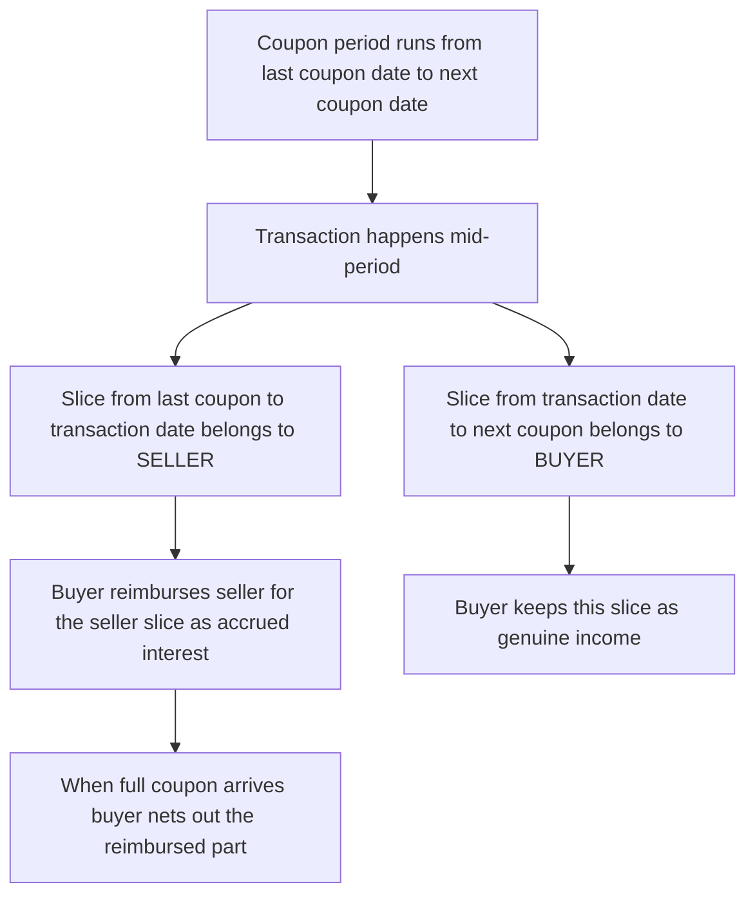
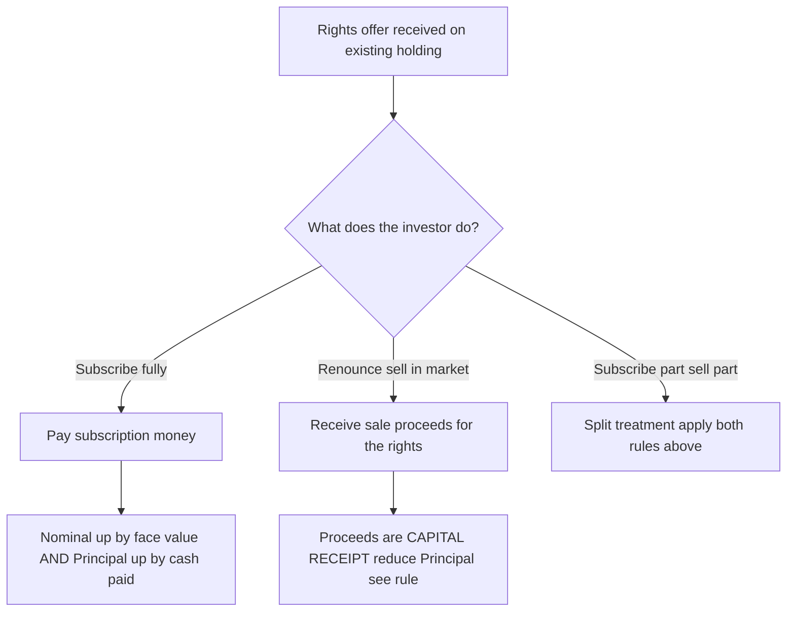
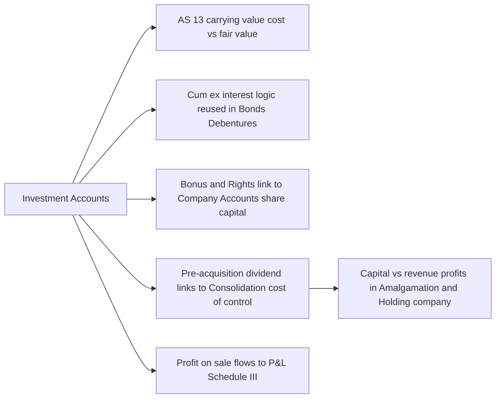

# Chapter 38 — Investment Accounts

## 1. The Problem

You are the accountant for **Meridian Textiles Ltd.** On 1 April, the treasury manager walks in with a printout. Over the last year the company parked its surplus cash in three places:

- **₹5,00,000** face value of **9% Government of India bonds**, bought at various dates.
- **20,000 equity shares of Sundaram Ltd.**, bought partly in January, topped up in March, with a **1:2 bonus** declared in between.
- A **rights issue** on those Sundaram shares that the company partly took up and partly renounced (sold) in the market.

The manager asks four questions that sound simple and turn out not to be:

1. "When I bought the 9% bonds on **1 August at ₹104** 'cum-interest', and interest is paid half-yearly on 30 June and 31 December — **how much did I actually pay for the bond itself**, and how much was just me pre-paying the seller for interest that had already accrued to him?"
2. "The bonus shares came in **free**. My holding jumped from 10,000 to 15,000 shares but I paid nothing. **What is the cost per share now?** Did I make a profit?"
3. "I sold 6,000 shares in February. **Which cost do I match against the sale** — the January price, the March price, or some blend? And how much profit do I book?"
4. "At year-end I still hold bonds and shares. **What figure goes on the Balance Sheet**, and where do the interest, dividends and capital gains show up in the P&L?"

If you try to answer these using a single ordinary ledger account — one column of debits, one of credits — you fail immediately. A normal account can track **money in and money out**, but here three completely different things are flowing through the *same* asset simultaneously:

- The **face value** (nominal value) of the securities you hold — which changes when you buy, sell, or receive bonus units.
- The **income** the security throws off — interest on bonds, dividends on shares — some of which belongs to the *seller*, not you.
- The **capital** you have tied up — the real cost, from which you must one day compute gain or loss.

Mix these three into one column and the account becomes meaningless. You cannot tell profit from income, cost from accrued interest, or units held from rupees invested. **The investment account is the special-purpose ledger built to keep these three streams surgically separate.**

That is the problem this chapter solves. By the end you will be able to take any messy set of investment transactions — cum-interest buys, ex-interest sells, bonus, rights, part-sales — and produce a clean, self-reconciling account that tells you, at a glance, *what you hold, what it cost, what it earned, and what you gained.*

---

## 2. The Core Idea — A Three-Lane Highway

Picture a highway with **three lanes**, and every investment transaction is a vehicle that must travel in the correct lane.

- **Lane 1 — Nominal (Face Value):** This lane counts *units*, not money. It tracks the **face value** of securities on hand. Buy ₹1,00,000 face value of bonds → this lane goes up by ₹1,00,000, regardless of whether you paid ₹96,000 or ₹1,04,000. Bonus shares arrive → this lane grows even though no cash moved. Think of it as the **odometer of "how much stock do I hold."**

- **Lane 2 — Interest / Income:** This lane is a *pass-through toll booth* for income. When you buy a bond cum-interest, part of your payment is really the seller's accrued interest — it goes into this lane as a debit (you paid it) and is washed out when the coupon actually arrives. Interest received, interest accrued at year-end, dividend on the *pre-acquisition* period — all pass through this lane. **Lane 2 ultimately feeds the P&L as income.**

- **Lane 3 — Principal (Capital / Cost):** This is the **real money you have invested** in the asset itself. It is the purchase price *stripped of* any accrued interest. When you sell, you compare sale proceeds (net of accrued interest) against this lane to compute **capital profit or loss.** The closing balance of Lane 3 is your **carrying cost**, which flows to the Balance Sheet.

The genius of the format is that the **Nominal and Principal lanes are ordinary "cost-columns" that balance by carrying a closing balance forward**, while the **Interest lane is an income column that is closed off to the P&L each year.**

> **Analogy lock-in:** Buying a cow that is about to give milk. The *cow* is the principal (capital). The *milk already in her udder that the previous owner fed her to produce* is accrued interest you're reimbursing (interest lane). The *number of cows* is the nominal lane. If you later sell the cow, your profit is sale price of the cow minus what you paid *for the cow* — never confused with the milk money.

---

## 3. Why It's Built This Way

Three design forces explain every quirk of the investment account.

**Force 1 — Income must never be confused with capital gain.** Under Indian tax and accounting logic, *interest and dividend* are **revenue** (they hit the P&L as income and are taxed as such), while *profit on sale of investment* is a **capital** item. If your ledger blended a ₹4,500 accrued-interest payment into the cost of the bond, you would (a) overstate the asset, (b) understate income when the coupon arrives, and (c) mis-state capital gain on eventual sale. The separate Interest column is the firewall.

**Force 2 — The seller's interest is not your income.** A bond accrues interest every single day. When you buy it *between* two coupon dates, the price usually **includes** the interest that has silently accrued since the last coupon. That accrued slice belongs to the **seller** — he held the bond while it earned. You are merely fronting it to him; you will recover it when the *full* coupon lands in your account. So it cannot be part of your cost, and it cannot be your income — it is a temporary receivable that the Interest column parks and then clears.

**Force 3 — "Units held" and "rupees invested" move independently.** A bonus issue adds units (Nominal ↑) but adds **zero** cost (Principal unchanged). A rights issue *taken up* adds both. A rights issue *sold* adds cash but no units. Because these two dimensions genuinely diverge, they *need* two separate columns — Nominal and Principal — or you could never compute a sensible "average cost per unit" after a bonus.

**Why AS 13 sits behind all this.** For CA Intermediate, the governing standard is **AS 13 — Accounting for Investments.** Its core rules that shape the account:

- **Cost of investment** includes purchase price **plus** acquisition charges such as **brokerage, fees, and stamp duty** (AS 13). These are capital, so they go in the **Principal** column.
- **Interest/dividend accrued at the time of purchase is NOT part of cost** — it is treated separately (this is precisely the Interest column).
- **Right shares:** if subscribed, cost of rights = subscription paid → added to Principal. If rights are **renounced (sold)**, the proceeds are... (we develop the exact rule in §4).
- **Carrying amount:** **Current investments** at **lower of cost and fair value**; **Long-term investments** at **cost**, less any provision for *other-than-temporary* diminution.

The columnar format is simply AS 13's logic rendered as a ledger.

---

## 4. Full Technical Content

### 4.1 The Columnar (Three-Column) Investment Account

Each *type* of investment (e.g., "9% Government Bonds", "Equity Shares of Sundaram Ltd.") gets **its own account**. The standard format has **six money columns** — three on each side — plus a date and particulars column:

| | | Debit side (Dr) | | | | Credit side (Cr) | |
|---|---|---|---|---|---|---|---|
| Date | Particulars | **Nominal** | **Interest / Income** | **Principal / Capital** | Date · Particulars | **Nominal** · **Interest** · **Principal** | |

In practice it is drawn as one wide table:

| Date | Particulars | Nominal (₹) | Interest (₹) | Principal (₹) | Date | Particulars | Nominal (₹) | Interest (₹) | Principal (₹) |
|---|---|---|---|---|---|---|---|---|---|---|
| | To Balance b/d | ... | | ... | | By Bank (interest) | | ... | |
| | To Bank (purchase) | ... | ... | ... | | By Bank (sale) | ... | ... | ... |
| | To P&L (profit on sale) | | | ... | | By P&L (loss on sale) | | | ... |
| | To P&L (interest income) | | ... | | | By Balance c/d | ... | | ... |

**What each column means and how it behaves:**

| Column | Measures | Balancing behaviour | Where the balance goes |
|---|---|---|---|
| **Nominal** | Face value of holdings | Closing balance c/d = face value still held | Memorandum only — reconciles units |
| **Interest** | Income earned/accrued & accrued interest paid | **Closed to P&L** each year (net) | P&L as *interest/dividend income* |
| **Principal** | Actual capital cost | Closing balance c/d = **carrying cost** | Balance Sheet as *Investments* |

> **Key discipline:** Interest is recorded on the Interest column **on the date it accrues or is received**, never in the Principal column. Cost items (brokerage, price) go **only** in Principal. Face value goes **only** in Nominal.

### 4.2 Cost of Investment (AS 13)

$$\text{Cost of Investment} = \text{Purchase Price} + \text{Brokerage} + \text{Stamp Duty} + \text{Other acquisition charges}$$

- For a **cum-interest** purchase, the "Purchase Price" that enters the **Principal** column is the **quoted (cum-interest) price plus charges, MINUS accrued interest**.
- For an **ex-interest** purchase, accrued interest is **added on top** of the quoted price to arrive at total cash paid; the quoted price + charges is the Principal, and the accrued interest goes to the **Interest** column.

### 4.3 Cum-interest vs Ex-interest — the Central Skill

A bond's **coupon** accrues continuously. Between coupon dates, the market quotes it two ways:

- **Cum-interest ("with interest"):** The quoted price **includes** the accrued interest since the last coupon. The buyer pays it and will collect the whole next coupon. So the buyer must *carve out* the accrued interest from the price to find the true capital cost.

- **Ex-interest ("without interest"):** The quoted price is the **clean capital price only**. The buyer must **add** accrued interest on top and pay it separately to the seller.

**Accrued interest formula** (for buying or selling between coupon dates):

$$\text{Accrued Interest} = \text{Face Value} \times \text{Annual Coupon Rate} \times \frac{\text{Months since last coupon date to transaction date}}{12}$$

The apportionment logic — **who gets which slice of the coupon:**


*Figure 1 — The coupon is split at the transaction date; the buyer pre-pays the seller's slice and recovers it inside the next full coupon.*

**The clean vs dirty price relationship:**

| Quote type | Cash paid by buyer | Goes to Principal | Goes to Interest (Dr) |
|---|---|---|---|
| **Cum-interest** | Quoted price + brokerage | (Quoted price + brokerage) − Accrued interest | Accrued interest |
| **Ex-interest** | Quoted price + brokerage + Accrued interest | Quoted price + brokerage | Accrued interest |

> **Memory hook — "Cum: Carve out. Ex: Extra on."** Cum-interest price already has interest inside → carve it OUT to Principal's benefit. Ex-interest price is clean → add interest EXTRA on top.

**On a sale**, the mirror applies:
- **Cum-interest sale:** proceeds include accrued interest → carve it out; Principal-side sale value = proceeds − accrued interest; the carved slice is credited to **Interest**.
- **Ex-interest sale:** buyer pays you accrued interest **on top** → Principal-side sale value = quoted proceeds; the extra accrued goes to **Interest**.

### 4.4 Interest on Fixed-Income Securities at Year-End

At the reporting date, interest that has **accrued but not yet received** is brought in:
- **Dr Interest column** (To P&L — interest income) with the accrued portion,
- and carried as **accrued interest c/d** or shown as income for the year.

At year-start it is reversed / opening accrued interest is brought down.

The Interest column is then **totalled and the net closed to P&L** as *Interest on Investments*.

### 4.5 Bonus Shares

A **bonus issue** capitalises the company's reserves and hands existing shareholders **free** additional shares.

- **Nominal column:** increases by the face value of bonus shares received.
- **Principal column:** **NO entry** — bonus shares cost nothing.
- **Effect:** total cost is now spread over **more** shares → **average cost per share falls**. No profit is recognised on receipt (AS 13 — bonus received is not income).

$$\text{New average cost/share} = \frac{\text{Existing Principal (total cost)}}{\text{Existing shares} + \text{Bonus shares}}$$

### 4.6 Rights Shares

A **rights issue** offers existing shareholders the right to buy **new** shares, usually below market price, in proportion to holdings. The shareholder has **three choices**:


*Figure 2 — Three ways to treat a rights entitlement, each hitting the columns differently.*

**Rules (AS 13 / ICAI treatment):**

1. **Rights subscribed (taken up):** Cost of rights shares = subscription money paid → **Dr Nominal** (face value) and **Dr Principal** (cash paid).

2. **Rights renounced (sold) — the nuanced rule:**
   - If the investment was bought **ex-right** (i.e., cum-right, and the right is sold), and selling the rights results in the *market price falling below cost*, the sale proceeds of rights are **first used to reduce the carrying cost** of the original investment.
   - In the **normal / general case** for CA Inter, when shares were acquired on a **cum-right basis** and rights are sold, **the sale proceeds of the rights renounced are credited to the Principal column** (treated as a **capital receipt reducing cost**) — *unless* the problem states they are taken to P&L.
   - **Simplified ICAI exam convention** (state your assumption): *Sale of rights entitlement is a capital receipt → reduce Principal (cost of investment).* If the shares were **quoted ex-right** at the time (already acquired earlier and no longer carrying the right at cost), the proceeds are taken to **P&L as profit**.

> **Exam-safe rule to memorise:** *Right shares subscribed → add to cost (Principal). Right shares sold → reduce cost (credit Principal), because you are selling a slice of a capital asset. Only take to P&L if the question explicitly says the sale of rights is treated as income.*

### 4.7 Sale of Investments — Profit or Loss

On sale, the **cost of units sold** must be removed from the Principal column. The cost matched depends on the flow assumption; **CA Inter uses either specific identification (if lots are identified) or, most commonly, average cost / FIFO as stated.** Default when nothing is said: **average cost** (weighted).

$$\text{Cost of units sold} = \text{Face value sold} \times \frac{\text{Total Principal balance}}{\text{Total Nominal balance}}$$

(for shares, use per-share average cost × shares sold).

$$\text{Profit / (Loss) on sale} = \text{Sale value in Principal column} - \text{Cost of units sold}$$

- **Profit:** Credit... wait — profit **increases** the Principal-side credit; it is recorded as **"To P&L (profit on sale)" on the Debit side Principal column** so that the sale credit + nothing else balances... The clean way to think: put **sale proceeds (Principal portion) on the credit side**, put **cost being relieved is the balancing figure**, and **profit is plugged to make sale value = cost + profit.** Practically:

| Situation | Journal / column effect |
|---|---|
| **Profit on sale** | Dr Bank (proceeds); Cr Investment (Principal, at cost); Cr P&L (profit) → in the account, **profit appears on Dr side Principal** "To P&L A/c" |
| **Loss on sale** | Dr Bank (proceeds); Dr P&L (loss); Cr Investment (Principal, at cost) → **loss appears on Cr side Principal** "By P&L A/c" |

> Why profit sits on the debit side of the Principal column: the **credit side** carries the **sale proceeds (Principal part)**. For the account to balance against the **cost** removed, if proceeds > cost you must **add** the profit on the **debit side** so that *Debit total (cost + profit) = Credit total (proceeds)*. Conversely a loss is a credit-side entry.

### 4.8 Journal Entries — The Full Set

**Purchase (ex-interest):**
```
Investment A/c (Principal)      Dr   [price + brokerage]
Interest A/c                    Dr   [accrued interest]
    To Bank A/c                        [total cash]
```

**Purchase (cum-interest):**
```
Investment A/c (Principal)      Dr   [cum price + brokerage − accrued int]
Interest A/c                    Dr   [accrued interest]
    To Bank A/c                        [cum price + brokerage]
```

**Interest received:**
```
Bank A/c                        Dr
    To Interest A/c
```

**Sale (ex-interest, at profit):**
```
Bank A/c                        Dr   [proceeds + accrued int]
    To Investment A/c (Principal)     [cost of units sold]
    To Interest A/c                   [accrued interest]
    To Profit & Loss A/c              [profit]
```

**Bonus shares:** *No journal entry for money* — only Nominal column increased (memorandum). (Some texts pass no entry at all; the account simply shows "To Bonus" in Nominal.)

**Rights subscribed:**
```
Investment A/c (Principal)      Dr   [subscription paid]
    To Bank A/c
```
(Nominal column also increased by face value.)

**Rights renounced (sold, capital receipt):**
```
Bank A/c                        Dr   [rights sale proceeds]
    To Investment A/c (Principal)     [reduces cost]
```

**Year-end interest accrual:**
```
Interest A/c (accrued)          Dr
    To Profit & Loss A/c
```

**Closing balance to B/S:** Principal balance c/d = carrying amount; for **current investments**, if fair value < cost, write down to fair value:
```
Profit & Loss A/c               Dr
    To Investment A/c                 [reduction to fair value]
```

---

## 5. Worked Examples

### Example 1 — Ex-interest and Cum-interest Purchase (Building the Interest Split)

**Facts.** Nirmal Ltd. deals in **12% Government Bonds** (interest payable **30 June** and **31 December**). Transactions:

- **1 April 2025:** Opening balance ₹2,00,000 face value, cost ₹1,96,000.
- **1 May 2025:** Bought ₹1,00,000 face value at **₹98 cum-interest**, brokerage 1%.
- **1 September 2025:** Bought ₹60,000 face value at **₹97 ex-interest**, brokerage 1%.
- Interest received on 30 June and 31 December as due.
- Year-end: 31 December 2025 (assume for simplicity). Face value held to be carried forward.

**Step 1 — Coupon rate is 12% p.a., so 1% per month per ₹100 face.**

**Step 2 — 1 May cum-interest purchase.**
- Last coupon: 31 Dec 2024. Accrued to 1 May = **4 months** (Jan–Apr).
- Accrued interest = ₹1,00,000 × 12% × 4/12 = **₹4,000**.
- Cum price + brokerage = (₹1,00,000 × 98/100) + 1% brokerage = ₹98,000 + ₹980 = **₹98,980** cash paid.
- Principal = ₹98,980 − ₹4,000 accrued = **₹94,980**.
- Interest column (Dr) = **₹4,000**.

**Step 3 — 1 September ex-interest purchase.**
- Last coupon: 30 June 2025. Accrued to 1 Sep = **2 months** (Jul, Aug).
- Accrued interest = ₹60,000 × 12% × 2/12 = **₹1,200**.
- Ex price + brokerage = (₹60,000 × 97/100) + 1% = ₹58,200 + ₹582 = **₹58,782** → Principal = **₹58,782**.
- Cash paid = ₹58,782 + ₹1,200 = ₹59,982. Interest column (Dr) = **₹1,200**.

**Step 4 — Interest receipts.**
- **30 June 2025:** On face value held then = ₹3,00,000 (₹2,00,000 opening + ₹1,00,000 from 1 May). Half-yearly coupon = ₹3,00,000 × 12% × 6/12 = **₹18,000**. Interest column (Cr).
- **31 Dec 2025:** On face value held = ₹3,60,000 (added ₹60,000 on 1 Sep). Half-yearly = ₹3,60,000 × 6% = **₹21,600**. Interest column (Cr).

**Step 5 — Interest column reconciliation.**

| Interest column | Dr (₹) | Cr (₹) |
|---|---|---|
| Accrued paid on 1 May purchase | 4,000 | |
| Accrued paid on 1 Sep purchase | 1,200 | |
| Received 30 June | | 18,000 |
| Received 31 December | | 21,600 |
| **Balance = Interest income to P&L** | **34,400** | |
| Totals | 39,600 | 39,600 |

**Interest transferred to P&L = ₹34,400** (credit balance → income).

**Step 6 — Principal & Nominal at close (no sales, so no profit).**

| | Nominal (₹) | Principal (₹) |
|---|---|---|
| Opening | 2,00,000 | 1,96,000 |
| 1 May purchase | 1,00,000 | 94,980 |
| 1 Sep purchase | 60,000 | 58,782 |
| **Closing c/d** | **3,60,000** | **3,49,762** |

**Balance Sheet:** Investments in 12% Govt Bonds at cost **₹3,49,762** (long-term, at cost). **P&L:** Interest income **₹34,400**. Fully reconciled.

---

### Example 2 — Bonus and Rights on Equity Shares

**Facts.** Kaveri Ltd. holds shares of **Sundaram Ltd.** (face value ₹10 each):

- **1 April 2025:** Opening 10,000 shares, cost ₹1,50,000 (₹15/share).
- **1 June 2025:** Sundaram declares a **bonus of 1 share for every 2 held.**
- **1 August 2025:** Sundaram makes a **rights issue of 1 share for every 3 held, at ₹12 per share.** Kaveri **subscribes to 60%** of its rights and **sells the remaining 40%** rights in the market at **₹5 per right.** (Assume proceeds of rights sold reduce cost — capital receipt.)
- No shares sold during the year.

**Step 1 — Bonus on 1 June.**
- Holding before bonus = 10,000. Bonus = 10,000 × 1/2 = **5,000 shares**, **free**.
- Nominal ↑ by 5,000 × ₹10 = ₹50,000; **Principal unchanged**.
- Holding now = **15,000 shares**, cost still **₹1,50,000** → avg cost = **₹10/share**.

**Step 2 — Rights on 1 August.**
- Rights entitlement = 15,000 × 1/3 = **5,000 rights shares** offered at ₹12.
- **Subscribed 60%:** 5,000 × 60% = **3,000 shares** taken up.
  - Cash paid = 3,000 × ₹12 = **₹36,000** → **Principal ↑ ₹36,000**; Nominal ↑ 3,000 × ₹10 = ₹30,000.
- **Sold 40%:** 5,000 × 40% = **2,000 rights** renounced at ₹5 each = **₹10,000** proceeds.
  - Capital receipt → **Principal reduced by ₹10,000** (credit Principal). No effect on Nominal (those shares were never taken into holding).

**Step 3 — Reconcile the share account.**

| Event | Shares held | Nominal (₹) | Principal (₹) |
|---|---|---|---|
| Opening | 10,000 | 1,00,000 | 1,50,000 |
| Bonus (1 Jun) | +5,000 | +50,000 | 0 |
| Rights subscribed (1 Aug) | +3,000 | +30,000 | +36,000 |
| Rights sold (1 Aug) | 0 | 0 | −10,000 |
| **Closing** | **18,000** | **1,80,000** | **1,76,000** |

**Average cost per share now = ₹1,76,000 / 18,000 = ₹9.78** (approx).

**Balance Sheet:** Investment in Sundaram Ltd. **₹1,76,000** (18,000 shares). Notice how **bonus** dragged average cost from ₹15 → ₹10, and **selling rights** further reduced carrying cost. **No profit hit P&L** because we treated rights sale as a capital receipt (per stated assumption).

> **Variation flag:** Had the problem said "profit on sale of rights is credited to P&L," then ₹10,000 would go to **P&L income** and Principal would stay at ₹1,86,000. Always read the instruction. If shares were **already quoted ex-right** (rights not attached to the cost of the original lot), the ₹10,000 is P&L profit.

---

### Example 3 — Full Exam-Hard Problem (Purchase, Bonus, Sale with Profit, Cum-interest Sale)

**Facts.** Ganga Investments Ltd. — **10% Debentures of Yamuna Ltd.** (face ₹100 each; interest payable half-yearly **31 March** and **30 September**). Books close **31 March 2026.**

- **1 April 2025:** Opening ₹4,00,000 face value; book cost ₹3,92,000. (Interest to 31 Mar already received — no opening accrued interest.)
- **1 July 2025:** Purchased ₹2,00,000 face value at **₹96 cum-interest**; brokerage 1%.
- **1 October 2025:** **Bonus debentures... (not applicable to debentures)** — instead: **Sold ₹1,50,000 face value at ₹101 cum-interest**; brokerage 1%.
- **1 January 2026:** Purchased ₹1,00,000 face value at **₹98 ex-interest**; brokerage 1%.
- Interest received on due dates. Use **average cost** for the sale. Long-term investment (carry at cost).

**Step 0 — Coupon = 10% p.a. = ₹5 per ₹100 half-yearly; ₹0.8333 per ₹100 per month.**

**Step 1 — 1 July cum-interest purchase.**
- Last coupon 31 Mar 2025 → accrued to 1 Jul = **3 months**. Accrued = ₹2,00,000 × 10% × 3/12 = **₹5,000**.
- Cum price + brokerage = ₹2,00,000 × 96% = ₹1,92,000 + 1% (₹1,920) = **₹1,93,920** cash.
- Principal = ₹1,93,920 − ₹5,000 = **₹1,88,920**. Interest (Dr) = ₹5,000.
- Running: Nominal = ₹6,00,000; Principal = ₹3,92,000 + ₹1,88,920 = **₹5,80,920.**

**Step 2 — 30 September 2025 interest received.**
- Face held = ₹6,00,000. Half-yearly = ₹6,00,000 × 5% = **₹30,000**. Interest (Cr).

**Step 3 — 1 October sale, cum-interest, ₹1,50,000 face at ₹101.**
- Last coupon 30 Sep 2025 → accrued to 1 Oct = **0 months** (sale one day after coupon; treat accrued ≈ ₹0). *If the exam intends exactly the coupon date, accrued interest = 0.*

  (For rigour: from 30 Sep to 1 Oct is negligible; standard exam treatment = **0 accrued** when sale is on/at coupon date. We proceed with 0.)
- Cum proceeds = ₹1,50,000 × 101% = ₹1,51,500 − brokerage 1% (₹1,515) = **₹1,49,985** net cash.
- Accrued interest in proceeds = ₹0 → Principal-side sale value = **₹1,49,985**.

**Cost of debentures sold (average cost):**
- Avg cost ratio = Principal / Nominal = ₹5,80,920 / ₹6,00,000 = **0.9682 per ₹1 face** (i.e., ₹96.82 per ₹100).
- Cost of ₹1,50,000 face sold = ₹1,50,000 × 0.9682 = **₹1,45,230.**
- **Profit on sale = ₹1,49,985 − ₹1,45,230 = ₹4,755** → to P&L (appears **Dr side, Principal**, "To P&L").

Let me verify the average: ₹5,80,920 / ₹6,00,000 = 0.96820. × ₹1,50,000 = ₹1,45,230. ✔

**Running after sale:**
- Nominal = ₹6,00,000 − ₹1,50,000 = **₹4,50,000.**
- Principal = ₹5,80,920 − ₹1,45,230 (cost removed) = **₹4,35,690.**

**Step 4 — 1 January 2026 ex-interest purchase ₹1,00,000 face at ₹98.**
- Last coupon 30 Sep 2025 → accrued to 1 Jan = **3 months**. Accrued = ₹1,00,000 × 10% × 3/12 = **₹2,500**.
- Ex price + brokerage = ₹1,00,000 × 98% = ₹98,000 + 1% (₹980) = **₹98,980** → Principal.
- Interest (Dr) = ₹2,500. Cash = ₹98,980 + ₹2,500 = ₹1,01,480.
- Running: Nominal = **₹5,50,000**; Principal = ₹4,35,690 + ₹98,980 = **₹5,34,670.**

**Step 5 — 31 March 2026 interest received.**
- Face held = ₹5,50,000. Half-yearly = ₹5,50,000 × 5% = **₹27,500.** Interest (Cr).
- (No accrued interest to carry, since 31 March is a coupon date and all is received.)

**Step 6 — Interest column reconciliation.**

| Interest column | Dr (₹) | Cr (₹) |
|---|---|---|
| Accrued paid 1 Jul purchase | 5,000 | |
| Received 30 Sep | | 30,000 |
| Accrued paid 1 Jan purchase | 2,500 | |
| Received 31 Mar | | 27,500 |
| **To P&L (income)** | **50,000** | |
| Totals | 57,500 | 57,500 |

**Interest income to P&L = ₹50,000.**

**Step 7 — Full Investment Account.**

| Date | Particulars | Nominal (₹) | Interest (₹) | Principal (₹) | | Date | Particulars | Nominal (₹) | Interest (₹) | Principal (₹) |
|---|---|---|---|---|---|---|---|---|---|---|
| 1-Apr-25 | To Balance b/d | 4,00,000 | — | 3,92,000 | | 30-Sep-25 | By Bank (interest) | | 30,000 | |
| 1-Jul-25 | To Bank (purchase) | 2,00,000 | 5,000 | 1,88,920 | | 1-Oct-25 | By Bank (sale) | 1,50,000 | — | 1,49,985 |
| 1-Oct-25 | To P&L (profit on sale) | | | 4,755 | | 31-Mar-26 | By Bank (interest) | | 27,500 | |
| 1-Jan-26 | To Bank (purchase) | 1,00,000 | 2,500 | 98,980 | | 31-Mar-26 | By Balance c/d | 5,50,000 | — | 5,34,670 |
| 31-Mar-26 | To P&L (interest income) | | 50,000 | | | | | | | |
| | **Total** | **7,00,000** | **57,500** | **6,84,655** | | | **Total** | **7,00,000** | **57,500** | **6,84,655** |

**Cross-check the Principal column:**
- Debit total = 3,92,000 + 1,88,920 + 4,755 + 98,980 = **₹6,84,655.**
- Credit total = 1,49,985 (sale) + 5,34,670 (c/d) = **₹6,84,655.** ✔
- Nominal both sides = ₹7,00,000. ✔
- Interest both sides = ₹57,500. ✔

**Reported figures:**
- **Balance Sheet — Investments (10% Yamuna Debentures):** ₹5,34,670 (face ₹5,50,000).
- **P&L — Interest on investments:** ₹50,000; **Profit on sale of investments:** ₹4,755.

Everything reconciles to the rupee.

---

## 6. Presentation & Disclosure

**Balance Sheet (Schedule III, Companies Act 2013):** Investments appear under **Non-current Investments** (long-term) or **Current Investments** depending on intent to hold.

**Carrying value (AS 13):**

| Class | Measured at | Diminution treatment |
|---|---|---|
| **Long-term investments** | **Cost** | Reduce only for **other-than-temporary** decline; charge to P&L |
| **Current investments** | **Lower of cost and fair value** | Any write-down to fair value charged to P&L |

**Disclosures required (AS 13):**
- Accounting policy for determining carrying amount.
- Classification into current and long-term.
- Amounts included in P&L for **interest, dividends** (gross, with TDS shown), and **profits/losses on disposal** and **changes in carrying amount** of current investments.
- Significant restrictions on the right of ownership/realisability.
- The aggregate amount of quoted and unquoted investments, and market value of quoted investments.

**P&L presentation:**
- **Interest/dividend income** → "Other Income."
- **Profit on sale of investments** → "Other Income" (or Exceptional if material).
- **Loss on sale / write-down** → expense.

> **Dividend nuance (AS 13):** Dividend received out of **pre-acquisition profits** is **not income** — it is a **recovery of cost** (credit Principal), because you effectively bought that dividend inside the price. Only **post-acquisition** dividends are income (credit Interest/Income column → P&L). This mirrors the accrued-interest logic exactly.

---

## 7. Connections


*Figure 3 — Investment accounting is a hub connecting AS 13, company accounts, and consolidation.*

- **Pre-acquisition vs post-acquisition** is the *same principle* used in **Consolidated Financial Statements** (holding company): pre-acquisition profits/dividends are capital, post are revenue. Master it here and consolidation becomes intuitive.
- **Cum-interest / ex-interest** apportionment reappears whenever a fixed-income instrument changes hands mid-period.
- **Bonus and rights** connect to **share capital accounting** on the *issuer* side (Chapter on Company Accounts / ESOP / bonus issue under Sec 63).
- **Lower of cost and fair value** foreshadows **impairment** concepts.

---

## 8. Traps & Examiner Tricks

| # | Trap | The catch | Fix |
|---|---|---|---|
| 1 | **Adding accrued interest to cost** | Cum-interest price already contains interest; students dump the whole cash into Principal | Always *carve out* accrued interest → Interest column; Principal = clean price |
| 2 | **Cum vs Ex direction reversed** | Adding interest for cum, subtracting for ex (backwards) | "Cum = Carve out (subtract), Ex = Extra on (add)" |
| 3 | **Bonus added to Principal** | Booking a cost for free shares → overstated asset | Bonus: Nominal only, **zero** Principal |
| 4 | **Recognising profit on bonus** | Treating free shares as income | No income; only average cost falls |
| 5 | **Rights sold → wrong side** | Taking rights-sale proceeds straight to P&L when they should reduce cost | Default: capital receipt → credit Principal. Only P&L if question says so or shares quoted ex-right |
| 6 | **Wrong cost matched on sale** | Using latest cost instead of average (or vice versa) | Use the stated basis; default = weighted average cost |
| 7 | **Interest computed on wrong face value** | Using face held *after* a mid-period trade for the *whole* half-year | Compute coupon on face value **held during that period**; split if holdings changed |
| 8 | **Forgetting brokerage** | Brokerage is part of **cost** (Principal), not expense | Add brokerage to Principal on buy; **deduct** from proceeds on sale |
| 9 | **Pre-acquisition dividend as income** | Booking pre-acquisition dividend to P&L | It reduces cost (credit Principal) |
| 10 | **Sale on coupon date** | Adding phantom accrued interest for 0 months | If sale is on the coupon date, accrued = 0 |
| 11 | **Profit on debit, loss on credit — confusion** | Putting profit on the wrong side | Profit "To P&L" = **Dr side** Principal; Loss "By P&L" = **Cr side** Principal |
| 12 | **Current vs long-term carrying** | Carrying current investment at cost when FV is lower | Current: lower of cost & FV; write down to P&L |

> **Signature examiner move:** A **cum-interest purchase** on one date, a **coupon receipt** on another, and an **ex-interest sale** on a third — forcing you to apportion interest three times *and* compute average cost for the sale. Example 3 is exactly this shape. If you can do Example 3, you can do any variant.

---

## 9. First-Principles Recap

Reason it out, don't memorise:

1. **Why three columns?** Because an investment carries three independent facts — *how many units (Nominal), how much income (Interest), how much capital (Principal)* — and blending them destroys information. Three facts → three columns.

2. **Why carve out accrued interest?** Because a bond earns interest for whoever holds it each day. The slice earned *before* you bought belongs to the seller; you reimburse it and recover it in the next coupon. It was never your cost and never your income — so it lives in the pass-through Interest column.

3. **Why does cum add-inside and ex add-outside?** "Cum" = the price already *includes* interest (so subtract to find the true capital); "ex" = the price *excludes* it (so add it on to find total cash). Same underlying interest; different quoting convention.

4. **Why do bonus shares not change Principal?** Because you paid nothing. Cost is fixed; only the unit count rises → average cost falls. Recognising profit would be inventing income from thin air.

5. **Why can selling rights reduce cost?** The right is a sliver of your capital asset (the market value of your holding drops when it goes ex-right). Selling that sliver returns capital — a capital receipt reducing cost — not income, unless the asset is already valued ex-right.

6. **Why average cost on sale?** Because after bonuses, rights and multiple lots, no single "purchase price" applies; the fair matched cost is the pooled average (unless specific lots are identified).

7. **Why close Interest to P&L but carry Principal to B/S?** Interest is *revenue* — it belongs to the period's income. Principal is the *asset* still owned — it belongs on the Balance Sheet at cost (AS 13).

Everything else — the entries, the columns, the reconciliation — falls out of these seven truths.

---

## 10. Quick-Revision Sheet

**Three columns:** Nominal (face value, memorandum) · Interest (income + accrued, → P&L) · Principal (cost, → Balance Sheet).

**Cost (AS 13) = Price + Brokerage + Stamp duty + charges.** Accrued interest is **NOT** cost.

**Cum-interest buy:** Principal = (Quoted × face + brokerage) − Accrued; Interest Dr = Accrued.
**Ex-interest buy:** Principal = Quoted × face + brokerage; pay Accrued extra; Interest Dr = Accrued.
**Memory:** *Cum = Carve out; Ex = Extra on.*

**Accrued Interest = Face × Rate × (months since last coupon / 12).**

**Bonus:** Nominal ↑, Principal 0, no income. New avg cost = Old cost ÷ (old + bonus units).

**Rights subscribed:** Nominal ↑, Principal ↑ (cash paid).
**Rights sold (renounced):** Capital receipt → **credit Principal (reduce cost)**. To P&L only if stated / shares quoted ex-right.

**Sale:** Cost of units = Face sold × (Principal ÷ Nominal) [or avg cost/share × shares].
Profit = Sale (Principal part) − Cost. **Profit → Dr side "To P&L"; Loss → Cr side "By P&L".**
On sale, **deduct** brokerage from proceeds; carve out accrued interest to Interest column.

**Interest column:** total both sides; **net balance → P&L** as interest income.

**Carrying value:** Long-term = **cost** (less permanent diminution); Current = **lower of cost & fair value**.

**Dividend:** Pre-acquisition → reduce cost (Principal); Post-acquisition → income (P&L).

**Reconciliation checks:** Nominal Dr total = Cr total; Interest Dr = Cr; Principal Dr = Cr (with c/d & profit/loss plugged). If all three balance, you're done.

**Presentation:** Schedule III — Non-current / Current Investments; disclose policy, interest, dividends, profits on disposal, quoted market value (AS 13).
