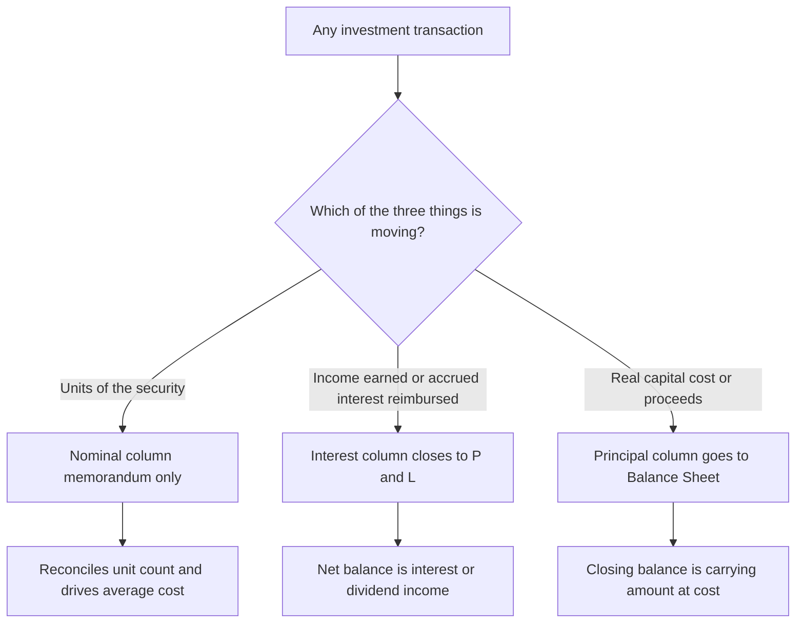
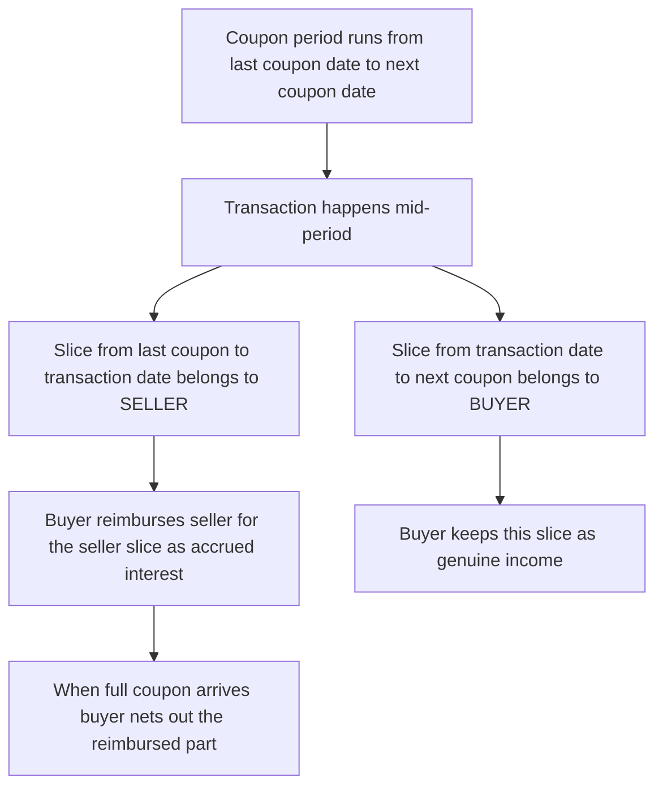
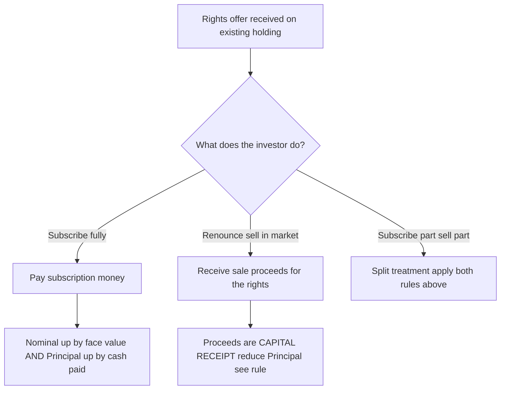
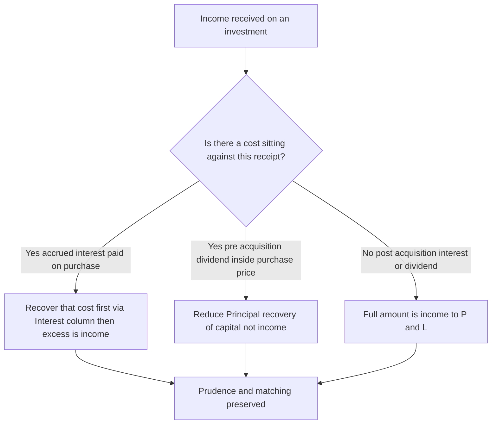
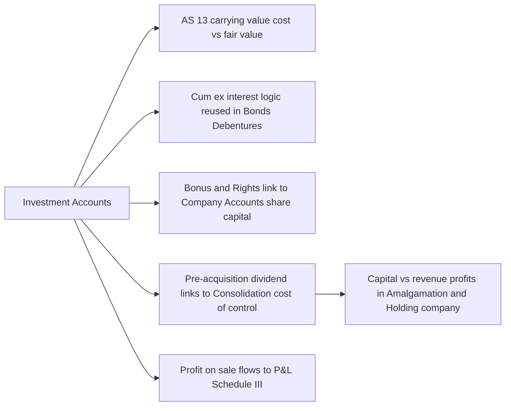

<!-- v2-deep -->

# Chapter 38 — Investment Accounts

## 1. The Problem

You are the accountant for **Meridian Textiles Ltd.** On 1 April, the treasury manager walks in with a printout. Over the last year the company parked its surplus cash in three places:

- **₹5,00,000** face value of **9% Government of India bonds**, bought at various dates.
- **20,000 equity shares of Sundaram Ltd.**, bought partly in January, topped up in March, with a **1:2 bonus** declared in between.
- A **rights issue** on those Sundaram shares that the company partly took up and partly renounced (sold) in the market.

The manager asks four questions that sound simple and turn out not to be:

1. "When I bought the 9% bonds on **1 August at ₹104** 'cum-interest', and interest is paid half-yearly on 30 June and 31 December — **how much did I actually pay for the bond itself**, and how much was just me pre-paying the seller for interest that had already accrued to him?"
2. "The bonus shares came in **free**. My holding jumped from 10,000 to 15,000 shares but I paid nothing. **What is the cost per share now?** Did I make a profit?"
3. "I sold 6,000 shares in February. **Which cost do I match against the sale** — the January price, the March price, or some blend? And how much profit do I book?"
4. "At year-end I still hold bonds and shares. **What figure goes on the Balance Sheet**, and where do the interest, dividends and capital gains show up in the P&L?"

If you try to answer these using a single ordinary ledger account — one column of debits, one of credits — you fail immediately. A normal account can track **money in and money out**, but here three completely different things are flowing through the *same* asset simultaneously:

- The **face value** (nominal value) of the securities you hold — which changes when you buy, sell, or receive bonus units.
- The **income** the security throws off — interest on bonds, dividends on shares — some of which belongs to the *seller*, not you.
- The **capital** you have tied up — the real cost, from which you must one day compute gain or loss.

Mix these three into one column and the account becomes meaningless. You cannot tell profit from income, cost from accrued interest, or units held from rupees invested. **The investment account is the special-purpose ledger built to keep these three streams surgically separate.**

That is the problem this chapter solves. By the end you will be able to take any messy set of investment transactions — cum-interest buys, ex-interest sells, bonus, rights, part-sales — and produce a clean, self-reconciling account that tells you, at a glance, *what you hold, what it cost, what it earned, and what you gained.*

> **Why the exam loves this chapter.** It is the one topic in Paper 1 (Accounting) that fuses *four* skills into a single 15–20 mark question: (a) arithmetic of accrued interest, (b) AS 13 classification, (c) ledger discipline across three columns, and (d) a clean reconciliation that either ties to the rupee or exposes your error. There is nowhere to hide a mistake — a wrong ₹5,000 in the Interest column throws the whole Principal column out. That is exactly *why* the format is unforgiving, and exactly why mastering the reconciliation gives you an easy, high-confidence scorer.

---

## 2. The Core Idea — A Three-Lane Highway

Picture a highway with **three lanes**, and every investment transaction is a vehicle that must travel in the correct lane.

- **Lane 1 — Nominal (Face Value):** This lane counts *units*, not money. It tracks the **face value** of securities on hand. Buy ₹1,00,000 face value of bonds → this lane goes up by ₹1,00,000, regardless of whether you paid ₹96,000 or ₹1,04,000. Bonus shares arrive → this lane grows even though no cash moved. Think of it as the **odometer of "how much stock do I hold."**

- **Lane 2 — Interest / Income:** This lane is a *pass-through toll booth* for income. When you buy a bond cum-interest, part of your payment is really the seller's accrued interest — it goes into this lane as a debit (you paid it) and is washed out when the coupon actually arrives. Interest received, interest accrued at year-end, dividend on the *pre-acquisition* period — all pass through this lane. **Lane 2 ultimately feeds the P&L as income.**

- **Lane 3 — Principal (Capital / Cost):** This is the **real money you have invested** in the asset itself. It is the purchase price *stripped of* any accrued interest. When you sell, you compare sale proceeds (net of accrued interest) against this lane to compute **capital profit or loss.** The closing balance of Lane 3 is your **carrying cost**, which flows to the Balance Sheet.

The genius of the format is that the **Nominal and Principal lanes are ordinary "cost-columns" that balance by carrying a closing balance forward**, while the **Interest lane is an income column that is closed off to the P&L each year.**

> **Analogy lock-in:** Buying a cow that is about to give milk. The *cow* is the principal (capital). The *milk already in her udder that the previous owner fed her to produce* is accrued interest you're reimbursing (interest lane). The *number of cows* is the nominal lane. If you later sell the cow, your profit is sale price of the cow minus what you paid *for the cow* — never confused with the milk money.

**The single most important sentence in this chapter:** *The Nominal column never touches the P&L, and the Interest column never touches the Balance Sheet.* Everything else is bookkeeping around that one boundary. The Nominal column is a **memorandum** — it exists only so you can compute average cost per unit and prove your unit count reconciles; it never has monetary meaning of its own. The Principal column is the **only** column that becomes an asset. The Interest column is the **only** column that becomes income. Burn this in before touching a single number.


*Figure 0 — Every rupee of every transaction routes to exactly one of the three lanes; decide the lane first, then post.*

---

## 3. Why It's Built This Way

Three design forces explain every quirk of the investment account.

**Force 1 — Income must never be confused with capital gain.** Under Indian tax and accounting logic, *interest and dividend* are **revenue** (they hit the P&L as income and are taxed as such), while *profit on sale of investment* is a **capital** item. If your ledger blended a ₹4,500 accrued-interest payment into the cost of the bond, you would (a) overstate the asset, (b) understate income when the coupon arrives, and (c) mis-state capital gain on eventual sale. The separate Interest column is the firewall.

**Force 2 — The seller's interest is not your income.** A bond accrues interest every single day. When you buy it *between* two coupon dates, the price usually **includes** the interest that has silently accrued since the last coupon. That accrued slice belongs to the **seller** — he held the bond while it earned. You are merely fronting it to him; you will recover it when the *full* coupon lands in your account. So it cannot be part of your cost, and it cannot be your income — it is a temporary receivable that the Interest column parks and then clears.

**Force 3 — "Units held" and "rupees invested" move independently.** A bonus issue adds units (Nominal ↑) but adds **zero** cost (Principal unchanged). A rights issue *taken up* adds both. A rights issue *sold* adds cash but no units. Because these two dimensions genuinely diverge, they *need* two separate columns — Nominal and Principal — or you could never compute a sensible "average cost per unit" after a bonus.

**Force 4 — Accruals must respect the reporting period.** Interest is earned by the *passage of time*, not by the *event of receipt*. So at year-end, interest that has accrued since the last coupon but has not yet been received still belongs to this year's income. The Interest column therefore has to carry a **closing accrued-interest balance** (like a debtor) so the P&L is not understated. This is nothing more than the matching principle applied to a security — but it is the single most-forgotten adjustment in the exam.

**Why AS 13 sits behind all this.** For CA Intermediate, the governing standard is **AS 13 — Accounting for Investments.** Its core rules that shape the account:

- **Cost of investment** includes purchase price **plus** acquisition charges such as **brokerage, fees, and stamp duty** (AS 13). These are capital, so they go in the **Principal** column.
- **Interest/dividend accrued at the time of purchase is NOT part of cost** — it is treated separately (this is precisely the Interest column).
- **Right shares:** if subscribed, cost of rights = subscription paid → added to Principal. If rights are **renounced (sold)**, the proceeds are... (we develop the exact rule in §4).
- **Carrying amount:** **Current investments** at **lower of cost and fair value**; **Long-term investments** at **cost**, less any provision for *other-than-temporary* diminution.

The columnar format is simply AS 13's logic rendered as a ledger.

> **Scope note — AS 13 vs Ind AS.** CA Intermediate is examined on **AS 13**. Under **Ind AS 109 / Ind AS 32-107** (relevant only if a question explicitly invokes Ind AS), investments are classified as amortised cost / FVOCI / FVTPL and the neat "cost vs lower-of-cost-and-fair-value" split disappears; also, under Ind AS, dividend is generally recognised as income regardless of pre/post-acquisition. **Do not import Ind AS logic into an AS 13 answer.** If the paper says "as per AS 13", the pre-acquisition dividend rule below applies; if it says "Ind AS", flag the difference and *verify current ICAI material for the exact treatment in your syllabus/AY.*

---

## 4. Full Technical Content

### 4.1 The Columnar (Three-Column) Investment Account

Each *type* of investment (e.g., "9% Government Bonds", "Equity Shares of Sundaram Ltd.") gets **its own account**. The standard format has **six money columns** — three on each side — plus a date and particulars column:

| | | Debit side (Dr) | | | | Credit side (Cr) | |
|---|---|---|---|---|---|---|---|
| Date | Particulars | **Nominal** | **Interest / Income** | **Principal / Capital** | Date · Particulars | **Nominal** · **Interest** · **Principal** | |

In practice it is drawn as one wide table:

| Date | Particulars | Nominal (₹) | Interest (₹) | Principal (₹) | Date | Particulars | Nominal (₹) | Interest (₹) | Principal (₹) |
|---|---|---|---|---|---|---|---|---|---|---|
| | To Balance b/d | ... | | ... | | By Bank (interest) | | ... | |
| | To Bank (purchase) | ... | ... | ... | | By Bank (sale) | ... | ... | ... |
| | To P&L (profit on sale) | | | ... | | By P&L (loss on sale) | | | ... |
| | To P&L (interest income) | | ... | | | By Balance c/d | ... | | ... |

**What each column means and how it behaves:**

| Column | Measures | Balancing behaviour | Where the balance goes |
|---|---|---|---|
| **Nominal** | Face value of holdings | Closing balance c/d = face value still held | Memorandum only — reconciles units |
| **Interest** | Income earned/accrued & accrued interest paid | **Closed to P&L** each year (net) | P&L as *interest/dividend income* |
| **Principal** | Actual capital cost | Closing balance c/d = **carrying cost** | Balance Sheet as *Investments* |

> **Key discipline:** Interest is recorded on the Interest column **on the date it accrues or is received**, never in the Principal column. Cost items (brokerage, price) go **only** in Principal. Face value goes **only** in Nominal.

**Reading the balancing figures — a crucial subtlety.** Each column "balances" for a *different reason*, and you must not treat them uniformly:

- The **Nominal** column balances by pure arithmetic — face bought minus face sold equals face held. The closing c/d is *known* (count the units), not a plug. If it does not balance, you have mis-recorded a face value.
- The **Interest** column's balancing figure is the **income transferred to P&L**. It is a genuine plug: whichever side is short gets the "To/By P&L" entry. A *credit* balance (Cr > Dr) means net income earned → "To P&L" on the Dr side to close it. Any **closing accrued interest** that is carried forward sits as "By Balance c/d" on the credit... (careful — see §4.4; accrued interest receivable is carried as a debit balance c/d, i.e., "To Balance c/d" style shown on the credit side to bring it down next year). We handle the mechanics precisely in §4.4.
- The **Principal** column's closing c/d is the **carrying amount** and is *known* only for the units still held (= average cost × units held). The **profit or loss on sale is the plug** that makes the column balance. This is why in a sale question you compute cost-of-units-sold first, then let profit/loss fall out.

### 4.2 Cost of Investment (AS 13)

$$\text{Cost of Investment} = \text{Purchase Price} + \text{Brokerage} + \text{Stamp Duty} + \text{Other acquisition charges}$$

- For a **cum-interest** purchase, the "Purchase Price" that enters the **Principal** column is the **quoted (cum-interest) price plus charges, MINUS accrued interest**.
- For an **ex-interest** purchase, accrued interest is **added on top** of the quoted price to arrive at total cash paid; the quoted price + charges is the Principal, and the accrued interest goes to the **Interest** column.

**Where does brokerage sit, exactly?** Brokerage, stamp duty, and securities transaction cost are **capital costs of acquisition** → they *increase* Principal on a purchase. On a **sale**, the mirror holds: selling costs *reduce* net proceeds, so they *reduce* the Principal-side sale value (which in turn shrinks profit / enlarges loss). A frequent slip is to add brokerage to Principal on a buy but forget to deduct it from proceeds on a sale — the exam plants this deliberately.

> **First-principles check on brokerage:** brokerage is a cost of *acquiring or disposing of the capital asset itself*, so it is capital, not revenue. It is never routed through the Interest column. Contrast with **collection charges on interest/dividend** (bank charges for encashing a warrant), which, if a question ever mentions them, are a revenue cost and reduce the Interest column — but ICAI questions rarely go there. When in doubt, treat all transaction charges on the *security* as Principal.

### 4.3 Cum-interest vs Ex-interest — the Central Skill

A bond's **coupon** accrues continuously. Between coupon dates, the market quotes it two ways:

- **Cum-interest ("with interest"):** The quoted price **includes** the accrued interest since the last coupon. The buyer pays it and will collect the whole next coupon. So the buyer must *carve out* the accrued interest from the price to find the true capital cost.

- **Ex-interest ("without interest"):** The quoted price is the **clean capital price only**. The buyer must **add** accrued interest on top and pay it separately to the seller.

**Accrued interest formula** (for buying or selling between coupon dates):

$$\text{Accrued Interest} = \text{Face Value} \times \text{Annual Coupon Rate} \times \frac{\text{Months since last coupon date to transaction date}}{12}$$

The apportionment logic — **who gets which slice of the coupon:**


*Figure 1 — The coupon is split at the transaction date; the buyer pre-pays the seller's slice and recovers it inside the next full coupon.*

**The clean vs dirty price relationship:**

| Quote type | Cash paid by buyer | Goes to Principal | Goes to Interest (Dr) |
|---|---|---|---|
| **Cum-interest** | Quoted price + brokerage | (Quoted price + brokerage) − Accrued interest | Accrued interest |
| **Ex-interest** | Quoted price + brokerage + Accrued interest | Quoted price + brokerage | Accrued interest |

> **Memory hook — "Cum: Carve out. Ex: Extra on."** Cum-interest price already has interest inside → carve it OUT to Principal's benefit. Ex-interest price is clean → add interest EXTRA on top.

**On a sale**, the mirror applies:
- **Cum-interest sale:** proceeds include accrued interest → carve it out; Principal-side sale value = proceeds − accrued interest; the carved slice is credited to **Interest**.
- **Ex-interest sale:** buyer pays you accrued interest **on top** → Principal-side sale value = quoted proceeds; the extra accrued goes to **Interest**.

**The brokerage-plus-cum/ex ordering — get the sequence right.** On a purchase the safe sequence is: (1) compute quoted amount = rate × face; (2) add brokerage → this is *total capital cash* only if ex; (3) handle accrued interest per cum/ex; (4) Principal is what remains after carving/before adding accrued. Concretely:

- **Cum buy:** Principal = (quoted + brokerage) − accrued; Interest Dr = accrued; Cash = quoted + brokerage.
- **Ex buy:** Principal = quoted + brokerage; Interest Dr = accrued; Cash = quoted + brokerage + accrued.

On a sale, brokerage is *deducted* both times:

- **Cum sale:** Net proceeds = (quoted − brokerage); Principal-side sale value = net proceeds − accrued; Interest Cr = accrued.
- **Ex sale:** Net proceeds on capital = (quoted − brokerage) = Principal-side sale value; buyer pays accrued extra → Interest Cr = accrued.

> **The four-cell grid you should be able to reproduce blind.** Buy vs Sell × Cum vs Ex. Buy adds brokerage, Sell subtracts it; Cum carves accrued *out* of the price, Ex adds accrued *on top*. Every fixed-income problem is one of these four cells applied repeatedly.

**Day-count convention.** ICAI problems use **whole months** (or occasionally exact days when dates are given precisely). Count from the **last coupon date up to the transaction date**. If interest is half-yearly on 30 June / 31 December and you buy on 1 May, the last coupon was 31 December, so accrued = 4 months (Jan, Feb, Mar, Apr). If a question gives exact dates and asks for day-count, use **actual days / 365** — *verify the basis the question specifies*; when silent, months is the ICAI default.

### 4.4 Interest on Fixed-Income Securities at Year-End

At the reporting date, interest that has **accrued but not yet received** is brought in:
- **Dr Interest column** (To P&L — interest income) with the accrued portion,
- and carried as **accrued interest c/d** or shown as income for the year.

At year-start it is reversed / opening accrued interest is brought down.

The Interest column is then **totalled and the net closed to P&L** as *Interest on Investments*.

**The precise mechanics — where the two "P&L" and two "balance" entries sit.** This trips up even strong students, so nail it:

1. During the year, post every accrued-interest-paid-on-purchase as **Interest Dr**, and every coupon received as **Interest Cr**.
2. At year-end, if interest has accrued since the last coupon date but is not yet received, that accrual is **this year's income** and also a **receivable** carried into next year. Post it as **"To P&L (interest accrued)" on the Dr side** (recognising income) *and* carry an **"By Accrued interest c/d"** — the receivable balance — so that next year it is brought down as **"To Accrued interest b/d"** on the Dr side and cleared when the coupon arrives.
3. Finally, the *net* of the Interest column is closed to P&L. If the column has an excess **credit**, that excess is income → posted as **"To P&L"** on the Dr side to close it. If it has an excess **debit** (rare — e.g., you reimbursed more accrued than you collected in a short holding period), it is a charge → **"By P&L"** on the Cr side.

**Opening accrued interest.** If the opening balance sheet carried accrued interest receivable (interest earned last year, received this year), bring it down on the **Dr side as "To Interest accrued b/d"**; it is squared off when the coupon lands in the Interest Cr. Miss this and you double-count the first coupon as income.

> **Worked micro-illustration.** 10% bond, ₹1,00,000 face, coupons 30 June / 31 Dec, year-end 31 March. From 1 Jan to 31 Mar = 3 months accrued but unreceived at year-end = ₹1,00,000 × 10% × 3/12 = **₹2,500**. Recognise ₹2,500 as this year's income (To P&L) and carry ₹2,500 accrued receivable c/d. Next year on 30 June you receive ₹5,000 for the half-year; ₹2,500 clears the receivable (already taxed as last year's income), only ₹2,500 is *this* year's income. The Interest column self-corrects.

### 4.5 Bonus Shares

A **bonus issue** capitalises the company's reserves and hands existing shareholders **free** additional shares.

- **Nominal column:** increases by the face value of bonus shares received.
- **Principal column:** **NO entry** — bonus shares cost nothing.
- **Effect:** total cost is now spread over **more** shares → **average cost per share falls**. No profit is recognised on receipt (AS 13 — bonus received is not income).

$$\text{New average cost/share} = \frac{\text{Existing Principal (total cost)}}{\text{Existing shares} + \text{Bonus shares}}$$

**Why the "no cost, no income" rule is symmetric and non-negotiable.** Receiving a bonus share is economically neutral: the company's total value is unchanged, it is merely divided into more shares, so each share is worth proportionately less. Recognising income would invent wealth from a book entry (capitalisation of reserves); recognising cost would fabricate an outflow that never happened. Hence **both** the income statement and the cash/Principal are untouched — only the denominator (share count) moves. This is why the *average cost per share collapses* exactly in proportion to the bonus ratio: a 1:1 bonus halves cost/share, a 1:2 bonus cuts it to two-thirds.

> **Exam trap — partly paid bonus.** Occasionally a "bonus" is really a capitalisation that leaves shares **partly paid**, or the question mixes a bonus with a **call** the shareholder must pay. If cash is actually paid (a call), *that* cash is a Principal addition; only the truly free portion is zero-cost. Read whether the bonus is fully paid.

### 4.6 Rights Shares

A **rights issue** offers existing shareholders the right to buy **new** shares, usually below market price, in proportion to holdings. The shareholder has **three choices**:


*Figure 2 — Three ways to treat a rights entitlement, each hitting the columns differently.*

**Rules (AS 13 / ICAI treatment):**

1. **Rights subscribed (taken up):** Cost of rights shares = subscription money paid → **Dr Nominal** (face value) and **Dr Principal** (cash paid).

2. **Rights renounced (sold) — the nuanced rule:**
   - If the investment was bought **ex-right** (i.e., cum-right, and the right is sold), and selling the rights results in the *market price falling below cost*, the sale proceeds of rights are **first used to reduce the carrying cost** of the original investment.
   - In the **normal / general case** for CA Inter, when shares were acquired on a **cum-right basis** and rights are sold, **the sale proceeds of the rights renounced are credited to the Principal column** (treated as a **capital receipt reducing cost**) — *unless* the problem states they are taken to P&L.
   - **Simplified ICAI exam convention** (state your assumption): *Sale of rights entitlement is a capital receipt → reduce Principal (cost of investment).* If the shares were **quoted ex-right** at the time (already acquired earlier and no longer carrying the right at cost), the proceeds are taken to **P&L as profit**.

> **Exam-safe rule to memorise:** *Right shares subscribed → add to cost (Principal). Right shares sold → reduce cost (credit Principal), because you are selling a slice of a capital asset. Only take to P&L if the question explicitly says the sale of rights is treated as income.*

**The deeper "why" behind the cum-right / ex-right split.** When a share is quoted **cum-right**, its market price still contains the value of the attached right; when it goes **ex-right**, the price drops by roughly the right's value. So:

- If your holding was **valued (at cost) with the right still embedded** (cum-right), then selling the right is selling a *piece of that same cost asset* → the proceeds are a return of capital → reduce Principal. Recognising a profit would overstate income because your cost includes the very sliver you just sold.
- If the market has **already gone ex-right** and your cost does *not* include the right (e.g., you bought after the ex-right date, or the standard treats the right as a fresh, zero-cost entitlement), then the right has *no carrying cost* against it → its entire sale proceeds are a **gain to P&L**.

This is the identical logic to pre- vs post-acquisition dividends (§6): the question is always *"is there a cost sitting against this receipt?"* If yes, the receipt first recovers that cost (capital); only the excess, or a receipt with no cost behind it, is income.

### 4.7 Sale of Investments — Profit or Loss

On sale, the **cost of units sold** must be removed from the Principal column. The cost matched depends on the flow assumption; **CA Inter uses either specific identification (if lots are identified) or, most commonly, average cost / FIFO as stated.** Default when nothing is said: **average cost** (weighted).

$$\text{Cost of units sold} = \text{Face value sold} \times \frac{\text{Total Principal balance}}{\text{Total Nominal balance}}$$

(for shares, use per-share average cost × shares sold).

$$\text{Profit / (Loss) on sale} = \text{Sale value in Principal column} - \text{Cost of units sold}$$

- **Profit:** Credit... wait — profit **increases** the Principal-side credit; it is recorded as **"To P&L (profit on sale)" on the Debit side Principal column** so that the sale credit + nothing else balances... The clean way to think: put **sale proceeds (Principal portion) on the credit side**, put **cost being relieved is the balancing figure**, and **profit is plugged to make sale value = cost + profit.** Practically:

| Situation | Journal / column effect |
|---|---|
| **Profit on sale** | Dr Bank (proceeds); Cr Investment (Principal, at cost); Cr P&L (profit) → in the account, **profit appears on Dr side Principal** "To P&L A/c" |
| **Loss on sale** | Dr Bank (proceeds); Dr P&L (loss); Cr Investment (Principal, at cost) → **loss appears on Cr side Principal** "By P&L A/c" |

> Why profit sits on the debit side of the Principal column: the **credit side** carries the **sale proceeds (Principal part)**. For the account to balance against the **cost** removed, if proceeds > cost you must **add** the profit on the **debit side** so that *Debit total (cost + profit) = Credit total (proceeds)*. Conversely a loss is a credit-side entry.

**Average cost vs FIFO — when it actually changes your answer.** With a *single* homogeneous lot the two methods coincide. They diverge only when there are **multiple purchase lots at different prices** and you sell *part* of the holding:

- **Weighted average (ICAI default):** cost per unit = running Principal ÷ running Nominal, recomputed after every transaction. Simple, and bonus/rights fold in naturally because they change the running totals.
- **FIFO:** the earliest-purchased units are deemed sold first, at their specific cost. Use *only* if the question says "FIFO" or identifies lots. FIFO is fiddly with bonus shares because you must decide which lot the bonus attaches to — ICAI avoids this by defaulting to average.

> **Trap:** After a bonus, a naive FIFO answer double-counts if you forget the bonus units dilute the *old* lots' cost. Weighted average sidesteps this entirely, which is exactly why ICAI standardised on it. Unless told otherwise, **use weighted average and recompute the ratio after every event.**

**A note on the recomputed average.** Because bonus (Nominal ↑, Principal 0) and sold-rights (Principal ↓, Nominal unchanged) both move the ratio, always compute the average cost per unit **as at the moment of sale**, using the *running* Principal and Nominal right before that sale — not the opening figures.

### 4.8 Journal Entries — The Full Set

**Purchase (ex-interest):**
```
Investment A/c (Principal)      Dr   [price + brokerage]
Interest A/c                    Dr   [accrued interest]
    To Bank A/c                        [total cash]
```

**Purchase (cum-interest):**
```
Investment A/c (Principal)      Dr   [cum price + brokerage − accrued int]
Interest A/c                    Dr   [accrued interest]
    To Bank A/c                        [cum price + brokerage]
```

**Interest received:**
```
Bank A/c                        Dr
    To Interest A/c
```

**Sale (ex-interest, at profit):**
```
Bank A/c                        Dr   [proceeds + accrued int]
    To Investment A/c (Principal)     [cost of units sold]
    To Interest A/c                   [accrued interest]
    To Profit & Loss A/c              [profit]
```

**Sale (cum-interest, at loss):**
```
Bank A/c                        Dr   [net proceeds after brokerage]
Profit & Loss A/c               Dr   [loss on sale]
    To Investment A/c (Principal)     [cost of units sold]
    To Interest A/c                   [accrued interest carved out]
```

**Bonus shares:** *No journal entry for money* — only Nominal column increased (memorandum). (Some texts pass no entry at all; the account simply shows "To Bonus" in Nominal.)

**Rights subscribed:**
```
Investment A/c (Principal)      Dr   [subscription paid]
    To Bank A/c
```
(Nominal column also increased by face value.)

**Rights renounced (sold, capital receipt):**
```
Bank A/c                        Dr   [rights sale proceeds]
    To Investment A/c (Principal)     [reduces cost]
```

**Rights renounced (sold, treated as income — only if stated / shares ex-right):**
```
Bank A/c                        Dr   [rights sale proceeds]
    To Profit & Loss A/c              [gain]
```

**Year-end interest accrual:**
```
Interest A/c (accrued)          Dr
    To Profit & Loss A/c
```

**Pre-acquisition dividend received (recovery of cost):**
```
Bank A/c                        Dr
    To Investment A/c (Principal)     [reduces cost, NOT income]
```

**Post-acquisition dividend received (income):**
```
Bank A/c                        Dr
    To Interest / Income A/c          [→ P&L]
```

**Closing balance to B/S:** Principal balance c/d = carrying amount; for **current investments**, if fair value < cost, write down to fair value:
```
Profit & Loss A/c               Dr
    To Investment A/c                 [reduction to fair value]
```

---

## 5. Worked Examples

### Example 1 — Ex-interest and Cum-interest Purchase (Building the Interest Split)

**Facts.** Nirmal Ltd. deals in **12% Government Bonds** (interest payable **30 June** and **31 December**). Transactions:

- **1 April 2025:** Opening balance ₹2,00,000 face value, cost ₹1,96,000.
- **1 May 2025:** Bought ₹1,00,000 face value at **₹98 cum-interest**, brokerage 1%.
- **1 September 2025:** Bought ₹60,000 face value at **₹97 ex-interest**, brokerage 1%.
- Interest received on 30 June and 31 December as due.
- Year-end: 31 December 2025 (assume for simplicity). Face value held to be carried forward.

**Step 1 — Coupon rate is 12% p.a., so 1% per month per ₹100 face.**

**Step 2 — 1 May cum-interest purchase.**
- Last coupon: 31 Dec 2024. Accrued to 1 May = **4 months** (Jan–Apr).
- Accrued interest = ₹1,00,000 × 12% × 4/12 = **₹4,000**.
- Cum price + brokerage = (₹1,00,000 × 98/100) + 1% brokerage = ₹98,000 + ₹980 = **₹98,980** cash paid.
- Principal = ₹98,980 − ₹4,000 accrued = **₹94,980**.
- Interest column (Dr) = **₹4,000**.

**Step 3 — 1 September ex-interest purchase.**
- Last coupon: 30 June 2025. Accrued to 1 Sep = **2 months** (Jul, Aug).
- Accrued interest = ₹60,000 × 12% × 2/12 = **₹1,200**.
- Ex price + brokerage = (₹60,000 × 97/100) + 1% = ₹58,200 + ₹582 = **₹58,782** → Principal = **₹58,782**.
- Cash paid = ₹58,782 + ₹1,200 = ₹59,982. Interest column (Dr) = **₹1,200**.

**Step 4 — Interest receipts.**
- **30 June 2025:** On face value held then = ₹3,00,000 (₹2,00,000 opening + ₹1,00,000 from 1 May). Half-yearly coupon = ₹3,00,000 × 12% × 6/12 = **₹18,000**. Interest column (Cr).
- **31 Dec 2025:** On face value held = ₹3,60,000 (added ₹60,000 on 1 Sep). Half-yearly = ₹3,60,000 × 6% = **₹21,600**. Interest column (Cr).

**Step 5 — Interest column reconciliation.**

| Interest column | Dr (₹) | Cr (₹) |
|---|---|---|
| Accrued paid on 1 May purchase | 4,000 | |
| Accrued paid on 1 Sep purchase | 1,200 | |
| Received 30 June | | 18,000 |
| Received 31 December | | 21,600 |
| **Balance = Interest income to P&L** | **34,400** | |
| Totals | 39,600 | 39,600 |

**Interest transferred to P&L = ₹34,400** (credit balance → income).

**Step 6 — Principal & Nominal at close (no sales, so no profit).**

| | Nominal (₹) | Principal (₹) |
|---|---|---|
| Opening | 2,00,000 | 1,96,000 |
| 1 May purchase | 1,00,000 | 94,980 |
| 1 Sep purchase | 60,000 | 58,782 |
| **Closing c/d** | **3,60,000** | **3,49,762** |

**Balance Sheet:** Investments in 12% Govt Bonds at cost **₹3,49,762** (long-term, at cost). **P&L:** Interest income **₹34,400**. Fully reconciled.

> **"What if the examiner tweaks it?"** Suppose the year-end were **31 March 2026** instead of 31 December. Then at 31 March there is **3 months' accrued interest** (Jan–Mar) on ₹3,60,000 face = ₹3,60,000 × 12% × 3/12 = **₹10,800**, unreceived. You would add "To P&L (accrued) ₹10,800" on the Interest Dr side *and* carry ₹10,800 as accrued interest receivable c/d — raising interest income to ₹34,400 + ₹10,800 = **₹45,200** and adding a ₹10,800 current asset. Forgetting this accrual is Trap #13 below.

---

### Example 2 — Bonus and Rights on Equity Shares

**Facts.** Kaveri Ltd. holds shares of **Sundaram Ltd.** (face value ₹10 each):

- **1 April 2025:** Opening 10,000 shares, cost ₹1,50,000 (₹15/share).
- **1 June 2025:** Sundaram declares a **bonus of 1 share for every 2 held.**
- **1 August 2025:** Sundaram makes a **rights issue of 1 share for every 3 held, at ₹12 per share.** Kaveri **subscribes to 60%** of its rights and **sells the remaining 40%** rights in the market at **₹5 per right.** (Assume proceeds of rights sold reduce cost — capital receipt.)
- No shares sold during the year.

**Step 1 — Bonus on 1 June.**
- Holding before bonus = 10,000. Bonus = 10,000 × 1/2 = **5,000 shares**, **free**.
- Nominal ↑ by 5,000 × ₹10 = ₹50,000; **Principal unchanged**.
- Holding now = **15,000 shares**, cost still **₹1,50,000** → avg cost = **₹10/share**.

**Step 2 — Rights on 1 August.**
- Rights entitlement = 15,000 × 1/3 = **5,000 rights shares** offered at ₹12.
- **Subscribed 60%:** 5,000 × 60% = **3,000 shares** taken up.
  - Cash paid = 3,000 × ₹12 = **₹36,000** → **Principal ↑ ₹36,000**; Nominal ↑ 3,000 × ₹10 = ₹30,000.
- **Sold 40%:** 5,000 × 40% = **2,000 rights** renounced at ₹5 each = **₹10,000** proceeds.
  - Capital receipt → **Principal reduced by ₹10,000** (credit Principal). No effect on Nominal (those shares were never taken into holding).

**Step 3 — Reconcile the share account.**

| Event | Shares held | Nominal (₹) | Principal (₹) |
|---|---|---|---|
| Opening | 10,000 | 1,00,000 | 1,50,000 |
| Bonus (1 Jun) | +5,000 | +50,000 | 0 |
| Rights subscribed (1 Aug) | +3,000 | +30,000 | +36,000 |
| Rights sold (1 Aug) | 0 | 0 | −10,000 |
| **Closing** | **18,000** | **1,80,000** | **1,76,000** |

**Average cost per share now = ₹1,76,000 / 18,000 = ₹9.78** (approx).

**Balance Sheet:** Investment in Sundaram Ltd. **₹1,76,000** (18,000 shares). Notice how **bonus** dragged average cost from ₹15 → ₹10, and **selling rights** further reduced carrying cost. **No profit hit P&L** because we treated rights sale as a capital receipt (per stated assumption).

> **Variation flag:** Had the problem said "profit on sale of rights is credited to P&L," then ₹10,000 would go to **P&L income** and Principal would stay at ₹1,86,000. Always read the instruction. If shares were **already quoted ex-right** (rights not attached to the cost of the original lot), the ₹10,000 is P&L profit.

> **"What if the examiner tweaks it?" — dividend on cum-basis.** Suppose on **15 April 2025** Sundaram paid a dividend of ₹2/share for the year ended 31 March 2025, and Kaveri had *bought* its 10,000 shares on **1 March 2025** (i.e., after the profits were earned but the dividend relates to a *pre-acquisition* period). Then the ₹20,000 dividend is **pre-acquisition** → *reduce Principal* by ₹20,000 (recovery of cost), **not** income. Kaveri's opening cost effectively becomes ₹1,30,000. This single tweak converts an "income" line into a "cost reduction" and is a classic 2-mark swing. If instead the dividend related to a period *after* acquisition, the full ₹20,000 is income to P&L.

---

### Example 3 — Full Exam-Hard Problem (Purchase, Bonus, Sale with Profit, Cum-interest Sale)

**Facts.** Ganga Investments Ltd. — **10% Debentures of Yamuna Ltd.** (face ₹100 each; interest payable half-yearly **31 March** and **30 September**). Books close **31 March 2026.**

- **1 April 2025:** Opening ₹4,00,000 face value; book cost ₹3,92,000. (Interest to 31 Mar already received — no opening accrued interest.)
- **1 July 2025:** Purchased ₹2,00,000 face value at **₹96 cum-interest**; brokerage 1%.
- **1 October 2025:** **Bonus debentures... (not applicable to debentures)** — instead: **Sold ₹1,50,000 face value at ₹101 cum-interest**; brokerage 1%.
- **1 January 2026:** Purchased ₹1,00,000 face value at **₹98 ex-interest**; brokerage 1%.
- Interest received on due dates. Use **average cost** for the sale. Long-term investment (carry at cost).

**Step 0 — Coupon = 10% p.a. = ₹5 per ₹100 half-yearly; ₹0.8333 per ₹100 per month.**

**Step 1 — 1 July cum-interest purchase.**
- Last coupon 31 Mar 2025 → accrued to 1 Jul = **3 months**. Accrued = ₹2,00,000 × 10% × 3/12 = **₹5,000**.
- Cum price + brokerage = ₹2,00,000 × 96% = ₹1,92,000 + 1% (₹1,920) = **₹1,93,920** cash.
- Principal = ₹1,93,920 − ₹5,000 = **₹1,88,920**. Interest (Dr) = ₹5,000.
- Running: Nominal = ₹6,00,000; Principal = ₹3,92,000 + ₹1,88,920 = **₹5,80,920.**

**Step 2 — 30 September 2025 interest received.**
- Face held = ₹6,00,000. Half-yearly = ₹6,00,000 × 5% = **₹30,000**. Interest (Cr).

**Step 3 — 1 October sale, cum-interest, ₹1,50,000 face at ₹101.**
- Last coupon 30 Sep 2025 → accrued to 1 Oct = **0 months** (sale one day after coupon; treat accrued ≈ ₹0). *If the exam intends exactly the coupon date, accrued interest = 0.*

  (For rigour: from 30 Sep to 1 Oct is negligible; standard exam treatment = **0 accrued** when sale is on/at coupon date. We proceed with 0.)
- Cum proceeds = ₹1,50,000 × 101% = ₹1,51,500 − brokerage 1% (₹1,515) = **₹1,49,985** net cash.
- Accrued interest in proceeds = ₹0 → Principal-side sale value = **₹1,49,985**.

**Cost of debentures sold (average cost):**
- Avg cost ratio = Principal / Nominal = ₹5,80,920 / ₹6,00,000 = **0.9682 per ₹1 face** (i.e., ₹96.82 per ₹100).
- Cost of ₹1,50,000 face sold = ₹1,50,000 × 0.9682 = **₹1,45,230.**
- **Profit on sale = ₹1,49,985 − ₹1,45,230 = ₹4,755** → to P&L (appears **Dr side, Principal**, "To P&L").

Let me verify the average: ₹5,80,920 / ₹6,00,000 = 0.96820. × ₹1,50,000 = ₹1,45,230. ✔

**Running after sale:**
- Nominal = ₹6,00,000 − ₹1,50,000 = **₹4,50,000.**
- Principal = ₹5,80,920 − ₹1,45,230 (cost removed) = **₹4,35,690.**

**Step 4 — 1 January 2026 ex-interest purchase ₹1,00,000 face at ₹98.**
- Last coupon 30 Sep 2025 → accrued to 1 Jan = **3 months**. Accrued = ₹1,00,000 × 10% × 3/12 = **₹2,500**.
- Ex price + brokerage = ₹1,00,000 × 98% = ₹98,000 + 1% (₹980) = **₹98,980** → Principal.
- Interest (Dr) = ₹2,500. Cash = ₹98,980 + ₹2,500 = ₹1,01,480.
- Running: Nominal = **₹5,50,000**; Principal = ₹4,35,690 + ₹98,980 = **₹5,34,670.**

**Step 5 — 31 March 2026 interest received.**
- Face held = ₹5,50,000. Half-yearly = ₹5,50,000 × 5% = **₹27,500.** Interest (Cr).
- (No accrued interest to carry, since 31 March is a coupon date and all is received.)

**Step 6 — Interest column reconciliation.**

| Interest column | Dr (₹) | Cr (₹) |
|---|---|---|
| Accrued paid 1 Jul purchase | 5,000 | |
| Received 30 Sep | | 30,000 |
| Accrued paid 1 Jan purchase | 2,500 | |
| Received 31 Mar | | 27,500 |
| **To P&L (income)** | **50,000** | |
| Totals | 57,500 | 57,500 |

**Interest income to P&L = ₹50,000.**

**Step 7 — Full Investment Account.**

| Date | Particulars | Nominal (₹) | Interest (₹) | Principal (₹) | | Date | Particulars | Nominal (₹) | Interest (₹) | Principal (₹) |
|---|---|---|---|---|---|---|---|---|---|---|
| 1-Apr-25 | To Balance b/d | 4,00,000 | — | 3,92,000 | | 30-Sep-25 | By Bank (interest) | | 30,000 | |
| 1-Jul-25 | To Bank (purchase) | 2,00,000 | 5,000 | 1,88,920 | | 1-Oct-25 | By Bank (sale) | 1,50,000 | — | 1,49,985 |
| 1-Oct-25 | To P&L (profit on sale) | | | 4,755 | | 31-Mar-26 | By Bank (interest) | | 27,500 | |
| 1-Jan-26 | To Bank (purchase) | 1,00,000 | 2,500 | 98,980 | | 31-Mar-26 | By Balance c/d | 5,50,000 | — | 5,34,670 |
| 31-Mar-26 | To P&L (interest income) | | 50,000 | | | | | | | |
| | **Total** | **7,00,000** | **57,500** | **6,84,655** | | | **Total** | **7,00,000** | **57,500** | **6,84,655** |

**Cross-check the Principal column:**
- Debit total = 3,92,000 + 1,88,920 + 4,755 + 98,980 = **₹6,84,655.**
- Credit total = 1,49,985 (sale) + 5,34,670 (c/d) = **₹6,84,655.** ✔
- Nominal both sides = ₹7,00,000. ✔
- Interest both sides = ₹57,500. ✔

**Reported figures:**
- **Balance Sheet — Investments (10% Yamuna Debentures):** ₹5,34,670 (face ₹5,50,000).
- **P&L — Interest on investments:** ₹50,000; **Profit on sale of investments:** ₹4,755.

Everything reconciles to the rupee.

> **"What if the examiner tweaks it?" — the sale is at a loss.** Suppose the 1 Oct sale were at **₹92 cum-interest** instead of ₹101. Net proceeds = ₹1,50,000 × 92% = ₹1,38,000 − 1% brokerage (₹1,380) = **₹1,36,620** (accrued still 0). Cost of units sold is unchanged at ₹1,45,230. **Loss = ₹1,36,620 − ₹1,45,230 = ₹8,610**, which now appears on the **Credit side, Principal, "By P&L".** Watch the sign and side: a loss *reduces* the debit total needed, so it sits opposite to a profit. The Principal c/d rises correspondingly because less cost was recovered by the sale... no — the cost removed is identical (₹1,45,230); only the *plug* changes side. Practise flipping Example 3 to a loss until the side is automatic.

---

### Example 4 — Ex-interest Sale Between Coupon Dates (Interest Carve-out on Disposal)

**Facts.** Godavari Finance Ltd. holds **8% Government Stock** (face ₹100; interest half-yearly **30 June** and **31 December**). Year-end **31 March 2026.**

- **1 April 2025:** Opening ₹3,00,000 face; cost ₹2,94,000. No opening accrued interest carried (assume interest to 31 Mar received).
- **1 August 2025:** Sold ₹1,00,000 face at **₹99 ex-interest**; brokerage 0.5%.
- Interest received on due dates on holdings then outstanding.
- Average cost basis; long-term (carry at cost).

**Step 1 — Cost of units sold.**
- Before the sale, running ratio = ₹2,94,000 / ₹3,00,000 = **₹98 per ₹100**.
- Cost of ₹1,00,000 face = ₹1,00,000 × 0.98 = **₹98,000.**

**Step 2 — Ex-interest sale proceeds and accrued carve-out.**
- Ex sale is *clean* → Principal-side sale value = quoted less brokerage.
- Quoted = ₹1,00,000 × 99% = ₹99,000; brokerage 0.5% = ₹495 → **net capital proceeds = ₹98,505** (Principal-side sale value).
- Accrued interest the *buyer pays extra*: last coupon 30 Jun 2025 → 1 Aug = **1 month**. Accrued = ₹1,00,000 × 8% × 1/12 = **₹666.67 ≈ ₹667**. This is **Interest (Cr)**, not part of capital.
- Total cash received = ₹98,505 + ₹667 = **₹99,172.**

**Step 3 — Profit on sale.**
- Profit = ₹98,505 − ₹98,000 = **₹505** → "To P&L", Dr side Principal.

**Step 4 — Interest received during the year (on holdings outstanding on each coupon date).**
- **30 Jun 2025:** face held = ₹3,00,000 (sale is 1 Aug, so full ₹3,00,000 held on 30 Jun). Half-yearly = ₹3,00,000 × 4% = **₹12,000** (Cr).
- **31 Dec 2025:** face held = ₹2,00,000 (after 1 Aug sale). Half-yearly = ₹2,00,000 × 4% = **₹8,000** (Cr).
- Plus accrued carve-out on sale ₹667 (Cr) from Step 2.

**Step 5 — Year-end accrued interest (31 Mar 2026).**
- From 1 Jan to 31 Mar = **3 months** on ₹2,00,000 held = ₹2,00,000 × 8% × 3/12 = **₹4,000** accrued but unreceived.
- Recognise ₹4,000 income (To P&L on Interest Dr side) and carry ₹4,000 as **accrued interest receivable c/d**.

**Step 6 — Interest column reconciliation.**

| Interest column | Dr (₹) | Cr (₹) |
|---|---|---|
| Received 30 Jun | | 12,000 |
| Accrued carved out on 1 Aug sale | | 667 |
| Received 31 Dec | | 8,000 |
| Accrued 31 Mar (income) — To P&L | | 4,000 |
| Balance to P&L (interest income) | 24,667 | |
| Accrued interest c/d (receivable) | 4,000 | |
| **Totals** | **28,667** | **24,667** |

Wait — this does not balance; the accrued-c/d must appear on the credit side as the carry-down mechanism. Let me re-lay it cleanly using the standard treatment: **income for the year = 12,000 + 8,000 + 667 + 4,000 = ₹24,667**, and the **₹4,000 accrued is simultaneously income and a receivable carried forward.**

**Correct reconciliation:**

| Interest column | Dr (₹) | Cr (₹) |
|---|---|---|
| To P&L (total interest income for year) | 24,667 | |
| To Balance c/d (accrued interest receivable) | 4,000 | |
| By Bank — 30 Jun | | 12,000 |
| By Bank — accrued on sale 1 Aug | | 667 |
| By Bank — 31 Dec | | 8,000 |
| By Balance c/d... | | |

The clean, examiner-accepted layout: put the **received** coupons and the **carved-out accrued on sale** on the **Cr side** (they came in), put the **year-end accrued receivable** on the **Cr side as income earned but not received** via "By P&L (accrued)" — but simplest is to state the result and show the T-account. Let me present the definitive T-account.

**Step 7 — Full Investment Account.**

| Date | Particulars | Nominal (₹) | Interest (₹) | Principal (₹) | | Date | Particulars | Nominal (₹) | Interest (₹) | Principal (₹) |
|---|---|---|---|---|---|---|---|---|---|---|
| 1-Apr-25 | To Balance b/d | 3,00,000 | — | 2,94,000 | | 30-Jun-25 | By Bank (interest) | | 12,000 | |
| 1-Aug-25 | To P&L (profit on sale) | | | 505 | | 1-Aug-25 | By Bank (sale) | 1,00,000 | 667 | 98,505 |
| 31-Mar-26 | To P&L (interest income) | | 24,667 | | | 31-Dec-25 | By Bank (interest) | | 8,000 | |
| 31-Mar-26 | To Balance c/d (accrued int) | | 4,000 | | | 31-Mar-26 | By Balance c/d | 2,00,000 | 4,000 | 1,96,505 |
| | **Total** | **3,00,000** | **28,667** | **2,94,505** | | | **Total** | **3,00,000** | **28,667** | **2,94,505** |

**Cross-checks:**
- Nominal both sides = ₹3,00,000. ✔
- Interest: Dr 24,667 + 4,000 = 28,667; Cr 12,000 + 667 + 8,000 + 4,000 = **28,667.** ✔ (The ₹4,000 accrued sits on **both** sides — recognised as income on the Dr "To P&L" and carried down as a receivable on the Cr "By Balance c/d", which then reopens next year on the Dr side. This is the standard mechanism.)
- Principal: Dr 2,94,000 + 505 = 2,94,505; Cr 98,505 (sale) + 1,96,505 (c/d) = **2,94,505.** ✔
- Principal c/d ₹1,96,505 = cost of remaining ₹2,00,000 face at ₹98 = ₹1,96,000, plus... wait: 2,00,000 × 0.98 = ₹1,96,000, but c/d shows ₹1,96,505. The extra ₹505 is the profit that stayed inside because the *sale removed cost at ₹98,000 while proceeds were ₹98,505*. Reconcile: opening 2,94,000 + profit 505 − cost removed 98,000 = ₹1,96,505. ✔ (Carrying value slightly exceeds pure average cost because the realised profit is retained in the surviving Principal balance until it is transferred out — here it *was* transferred to P&L, so the surviving Principal is opening 2,94,000 − 98,000 cost sold = ₹1,96,000; the ₹505 profit went to P&L, so c/d should be **₹1,96,000**, and the "To P&L profit 505" on the Dr side is matched by the sale credit of 98,505.)

**Let me correct the final balance cleanly.** The **carrying value of the surviving ₹2,00,000 face = ₹1,96,000** (at ₹98 average cost). The profit ₹505 is transferred *out* to P&L, so it must NOT remain in Principal. Restated Principal column:

- Dr side: opening 2,94,000 + profit-to-P&L 505 = **2,94,505**.
- Cr side: sale 98,505 + Balance c/d **1,96,000** = **2,94,505.** ✔

So the **correct Principal c/d = ₹1,96,000** (not ₹1,96,505). The self-check *caught* the slip — which is exactly the discipline this format enforces.

**Reported figures:** B/S Investments ₹1,96,000 (face ₹2,00,000) + Accrued interest receivable ₹4,000 (current asset); P&L interest income ₹24,667; profit on sale ₹505.

> **Lesson from the deliberate stumble above:** the surviving Principal balance is *always* (average cost × units still held). If your c/d ≠ that, a profit/loss plug has leaked. Compute the c/d **independently** as cost × units held, and let profit/loss be the balancing figure — never the other way round.

---

### Example 5 — Current Investment Written Down to Fair Value (AS 13 Valuation)

**Facts.** Kosi Traders Ltd. holds equity of **Teesta Ltd.** as a **current investment** (held for sale within a year). At 31 March 2026:

- Opening 1 April 2025: 8,000 shares, cost ₹6,40,000 (₹80/share).
- 1 September 2025: bought 2,000 more at ₹90/share plus ₹1,000 brokerage.
- No sales. Market price at 31 March 2026 = **₹70/share.**

**Step 1 — Total cost (Principal).**
- Opening ₹6,40,000 + purchase (2,000 × ₹90 = ₹1,80,000 + ₹1,000 brokerage = ₹1,81,000) = **₹8,21,000** for **10,000 shares.**
- Average cost = ₹82.10/share.

**Step 2 — Fair value at year-end.**
- 10,000 × ₹70 = **₹7,00,000.**

**Step 3 — Apply "lower of cost and fair value" (current investment, AS 13).**
- Cost ₹8,21,000 vs fair value ₹7,00,000 → carry at **₹7,00,000.**
- Write-down = ₹8,21,000 − ₹7,00,000 = **₹1,21,000**, charged to P&L.

**Journal:**
```
Profit & Loss A/c              Dr    1,21,000
    To Investment in Teesta A/c        1,21,000   [write-down to fair value]
```

**Reconciliation / reported figures:**
- **B/S — Current Investments:** ₹7,00,000.
- **P&L — Diminution in value of current investments (expense):** ₹1,21,000.

> **"What if it were a long-term investment?"** Then AS 13 says carry at **cost (₹8,21,000)** and write down **only if the decline is other-than-temporary.** A fall from ₹82 to ₹70 that is expected to reverse is **temporary** → **no write-down**; the investment stays at ₹8,21,000 and only the *disclosure* of market value (₹7,00,000) is given. This single classification (current vs long-term) flips a ₹1,21,000 charge on or off — a favourite examiner switch. If the decline *were* judged permanent (e.g., the investee is in liquidation), you would write down even a long-term investment and route it to P&L.

> **"What if fair value later recovers?"** For a **current investment** carried at lower of cost and fair value, if fair value rises in a later year you may **write it back up, but only to original cost** (never above cost) — the increase is credited to P&L. For a **long-term** investment previously written down for a decline later found to be temporary/reversed, the provision is **reversed** and credited to P&L. Never carry any investment above cost under AS 13.

---

## 6. Presentation & Disclosure

**Balance Sheet (Schedule III, Companies Act 2013):** Investments appear under **Non-current Investments** (long-term) or **Current Investments** depending on intent to hold.

**Carrying value (AS 13):**

| Class | Measured at | Diminution treatment |
|---|---|---|
| **Long-term investments** | **Cost** | Reduce only for **other-than-temporary** decline; charge to P&L |
| **Current investments** | **Lower of cost and fair value** | Any write-down to fair value charged to P&L |

**Disclosures required (AS 13):**
- Accounting policy for determining carrying amount.
- Classification into current and long-term.
- Amounts included in P&L for **interest, dividends** (gross, with TDS shown), and **profits/losses on disposal** and **changes in carrying amount** of current investments.
- Significant restrictions on the right of ownership/realisability.
- The aggregate amount of quoted and unquoted investments, and market value of quoted investments.

**P&L presentation:**
- **Interest/dividend income** → "Other Income."
- **Profit on sale of investments** → "Other Income" (or Exceptional if material).
- **Loss on sale / write-down** → expense.

> **Dividend nuance (AS 13):** Dividend received out of **pre-acquisition profits** is **not income** — it is a **recovery of cost** (credit Principal), because you effectively bought that dividend inside the price. Only **post-acquisition** dividends are income (credit Interest/Income column → P&L). This mirrors the accrued-interest logic exactly.

**The "lower of cost and fair value" — is it applied item-by-item or on the whole portfolio?** Under **AS 13**, for **current investments** the comparison is made **investment-by-investment** (i.e., each scrip separately), or by **category**, but *not* by netting a gain on one against a loss on another across the whole portfolio in a way that hides losses. The conservative ICAI treatment: apply lower-of-cost-and-fair-value to each individual current investment (or homogeneous category) so that **unrealised losses are provided but unrealised gains are not recognised.** This asymmetry is prudence in action.

**TDS on interest/dividend — how it appears.** When interest is received net of **tax deducted at source**, the **gross** interest is credited to the Interest column (that is the income earned), the **TDS** portion is debited to an **"Advance Tax / TDS receivable"** account (an asset, adjustable against tax liability), and only the **net cash** hits Bank. So a ₹10,000 coupon with 10% TDS shows: Interest Cr ₹10,000; Bank Dr ₹9,000; TDS receivable Dr ₹1,000. Students who credit only the *net* ₹9,000 to the Interest column understate income by the TDS — a subtle 1-mark leak.

**Reinvestment / cum-dividend equity purchases.** The pre-acquisition dividend rule (§6 nuance) is the equity analogue of accrued interest: if you buy shares **cum-dividend** and the dividend then relates to a **pre-acquisition** period, the received dividend reduces cost; if the shares are bought **ex-dividend**, no such adjustment arises. Treat "cum-dividend equity" exactly like "cum-interest bond" — carve the embedded income out of cost.


*Figure 4 — One decision governs every receipt — is there a cost behind it — and it unifies accrued interest, pre-acquisition dividend, and ex-right proceeds.*

---

## 7. Connections


*Figure 3 — Investment accounting is a hub connecting AS 13, company accounts, and consolidation.*

- **Pre-acquisition vs post-acquisition** is the *same principle* used in **Consolidated Financial Statements** (holding company): pre-acquisition profits/dividends are capital, post are revenue. Master it here and consolidation becomes intuitive.
- **Cum-interest / ex-interest** apportionment reappears whenever a fixed-income instrument changes hands mid-period.
- **Bonus and rights** connect to **share capital accounting** on the *issuer* side (Chapter on Company Accounts / ESOP / bonus issue under Sec 63).
- **Lower of cost and fair value** foreshadows **impairment** concepts.
- **TDS receivable** links to the treatment of **advance tax / tax provisions** in company final accounts — the deducted tax is an asset offset against the year's tax liability.
- **Weighted-average cost of units** is the same cost-flow logic you meet in **AS 2 Inventory Valuation** — investments and inventory share the "which cost do I match on disposal" question, differing only in the standard that governs valuation.

---

## 8. Traps & Examiner Tricks

| # | Trap | The catch | Fix |
|---|---|---|---|
| 1 | **Adding accrued interest to cost** | Cum-interest price already contains interest; students dump the whole cash into Principal | Always *carve out* accrued interest → Interest column; Principal = clean price |
| 2 | **Cum vs Ex direction reversed** | Adding interest for cum, subtracting for ex (backwards) | "Cum = Carve out (subtract), Ex = Extra on (add)" |
| 3 | **Bonus added to Principal** | Booking a cost for free shares → overstated asset | Bonus: Nominal only, **zero** Principal |
| 4 | **Recognising profit on bonus** | Treating free shares as income | No income; only average cost falls |
| 5 | **Rights sold → wrong side** | Taking rights-sale proceeds straight to P&L when they should reduce cost | Default: capital receipt → credit Principal. Only P&L if question says so or shares quoted ex-right |
| 6 | **Wrong cost matched on sale** | Using latest cost instead of average (or vice versa) | Use the stated basis; default = weighted average cost |
| 7 | **Interest computed on wrong face value** | Using face held *after* a mid-period trade for the *whole* half-year | Compute coupon on face value **held during that period**; split if holdings changed |
| 8 | **Forgetting brokerage** | Brokerage is part of **cost** (Principal), not expense | Add brokerage to Principal on buy; **deduct** from proceeds on sale |
| 9 | **Pre-acquisition dividend as income** | Booking pre-acquisition dividend to P&L | It reduces cost (credit Principal) |
| 10 | **Sale on coupon date** | Adding phantom accrued interest for 0 months | If sale is on the coupon date, accrued = 0 |
| 11 | **Profit on debit, loss on credit — confusion** | Putting profit on the wrong side | Profit "To P&L" = **Dr side** Principal; Loss "By P&L" = **Cr side** Principal |
| 12 | **Current vs long-term carrying** | Carrying current investment at cost when FV is lower | Current: lower of cost & FV; write down to P&L |
| 13 | **Forgetting year-end accrued interest** | Year-end falls between coupon dates; interest earned-not-received omitted | Accrue from last coupon to year-end; recognise income + carry receivable c/d |
| 14 | **Crediting net-of-TDS interest** | Only net cash credited to Interest column | Credit **gross** interest; debit TDS to a receivable; Bank gets net |
| 15 | **Coupon on holding at wrong date** | Using year-end holding for a coupon paid mid-year | Coupon = rate × face **held on the coupon date**, not year-end face |
| 16 | **c/d as a plug instead of computed** | Forcing Principal c/d to balance and hiding a profit error | Compute c/d = avg cost × units held **independently**; let profit/loss be the plug |
| 17 | **Long-term temporary decline written down** | Providing for a temporary fall on a long-term investment | Long-term: write down **only if other-than-temporary**; else disclose market value |
| 18 | **Writing an investment above cost** | Marking up a recovered current investment beyond original cost | Cap write-back at **original cost**; never carry above cost under AS 13 |

> **Signature examiner move:** A **cum-interest purchase** on one date, a **coupon receipt** on another, and an **ex-interest sale** on a third — forcing you to apportion interest three times *and* compute average cost for the sale. Example 3 is exactly this shape. If you can do Example 3, you can do any variant.

> **Second signature move:** A year-end that falls **between** coupon dates (e.g., coupons 30 Jun / 31 Dec but books close 31 March), so you must accrue interest for the stub period, recognise it as income *and* carry it as a receivable. Example 4 drills exactly this. Combine it with a mid-period ex-interest sale and you have the full-marks question.

---

## 9. First-Principles Recap

Reason it out, don't memorise:

1. **Why three columns?** Because an investment carries three independent facts — *how many units (Nominal), how much income (Interest), how much capital (Principal)* — and blending them destroys information. Three facts → three columns.

2. **Why carve out accrued interest?** Because a bond earns interest for whoever holds it each day. The slice earned *before* you bought belongs to the seller; you reimburse it and recover it in the next coupon. It was never your cost and never your income — so it lives in the pass-through Interest column.

3. **Why does cum add-inside and ex add-outside?** "Cum" = the price already *includes* interest (so subtract to find the true capital); "ex" = the price *excludes* it (so add it on to find total cash). Same underlying interest; different quoting convention.

4. **Why do bonus shares not change Principal?** Because you paid nothing. Cost is fixed; only the unit count rises → average cost falls. Recognising profit would be inventing income from thin air.

5. **Why can selling rights reduce cost?** The right is a sliver of your capital asset (the market value of your holding drops when it goes ex-right). Selling that sliver returns capital — a capital receipt reducing cost — not income, unless the asset is already valued ex-right.

6. **Why average cost on sale?** Because after bonuses, rights and multiple lots, no single "purchase price" applies; the fair matched cost is the pooled average (unless specific lots are identified).

7. **Why close Interest to P&L but carry Principal to B/S?** Interest is *revenue* — it belongs to the period's income. Principal is the *asset* still owned — it belongs on the Balance Sheet at cost (AS 13).

8. **Why is the year-end accrual both income and a receivable?** Because income follows *time*, not *cash*. Interest earned in the stub period from the last coupon to the reporting date has been *earned* (income now) but not *received* (a receivable now). One event, two ledger effects — the essence of accrual accounting applied to a security.

9. **Why is there one unifying test for every receipt?** Because the deep question is always *"is there a cost sitting against this money?"* Accrued interest paid, pre-acquisition dividend embedded in price, and a cum-right cost each say **yes → recover capital first**; post-acquisition interest/dividend and ex-right proceeds say **no → it is income/gain**. Learn the *test*, not the three separate rules.

Everything else — the entries, the columns, the reconciliation — falls out of these nine truths.

---

## 10. Quick-Revision Sheet

**Three columns:** Nominal (face value, memorandum) · Interest (income + accrued, → P&L) · Principal (cost, → Balance Sheet). *Nominal never touches P&L; Interest never touches B/S.*

**Cost (AS 13) = Price + Brokerage + Stamp duty + charges.** Accrued interest is **NOT** cost.

**Cum-interest buy:** Principal = (Quoted × face + brokerage) − Accrued; Interest Dr = Accrued.
**Ex-interest buy:** Principal = Quoted × face + brokerage; pay Accrued extra; Interest Dr = Accrued.
**Cum-interest sale:** Principal-side value = (Quoted − brokerage) − Accrued; Interest Cr = Accrued.
**Ex-interest sale:** Principal-side value = Quoted − brokerage; buyer pays Accrued extra → Interest Cr = Accrued.
**Memory:** *Cum = Carve out; Ex = Extra on. Buy adds brokerage; Sell subtracts brokerage.*

**Accrued Interest = Face × Rate × (months since last coupon / 12).** Coupon = rate × face **held on the coupon date**.

**Year-end accrual (books close between coupons):** recognise stub-period interest as income (To P&L) **and** carry it as accrued receivable c/d.

**TDS:** credit **gross** interest to Interest column; TDS → receivable (asset); Bank = net.

**Bonus:** Nominal ↑, Principal 0, no income. New avg cost = Old cost ÷ (old + bonus units).

**Rights subscribed:** Nominal ↑, Principal ↑ (cash paid).
**Rights sold (renounced):** Capital receipt → **credit Principal (reduce cost)**. To P&L only if stated / shares quoted ex-right.

**Sale:** Cost of units = Face sold × (Principal ÷ Nominal) [or avg cost/share × shares], using the **running** ratio at the sale date.
Profit = Sale (Principal part) − Cost. **Profit → Dr side "To P&L"; Loss → Cr side "By P&L".**
Compute Principal c/d **independently** = avg cost × units held; let profit/loss be the plug.

**Interest column:** total both sides; **net balance → P&L** as interest income.

**Carrying value:** Long-term = **cost** (write down only for other-than-temporary decline); Current = **lower of cost & fair value** (write down to P&L; write-back capped at original cost). Never carry above cost.

**Dividend:** Pre-acquisition → reduce cost (Principal); Post-acquisition → income (P&L). *Same test as accrued interest and ex-right proceeds — is there a cost behind the receipt?*

**Reconciliation checks:** Nominal Dr total = Cr total; Interest Dr = Cr; Principal Dr = Cr (with c/d & profit/loss plugged). If all three balance **and** Principal c/d = avg cost × units held, you're done.

**Presentation:** Schedule III — Non-current / Current Investments; disclose policy, interest, dividends (gross + TDS), profits on disposal, quoted market value (AS 13).
