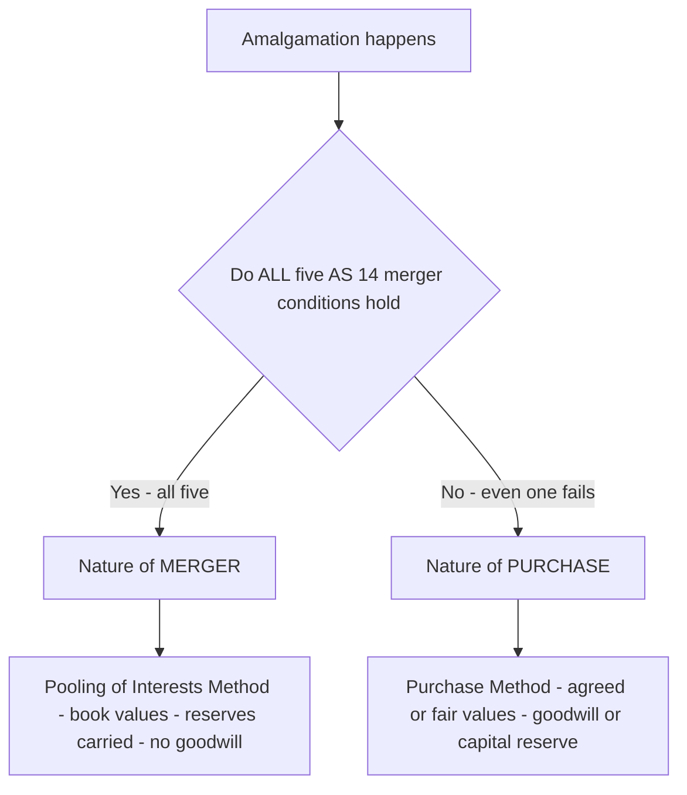
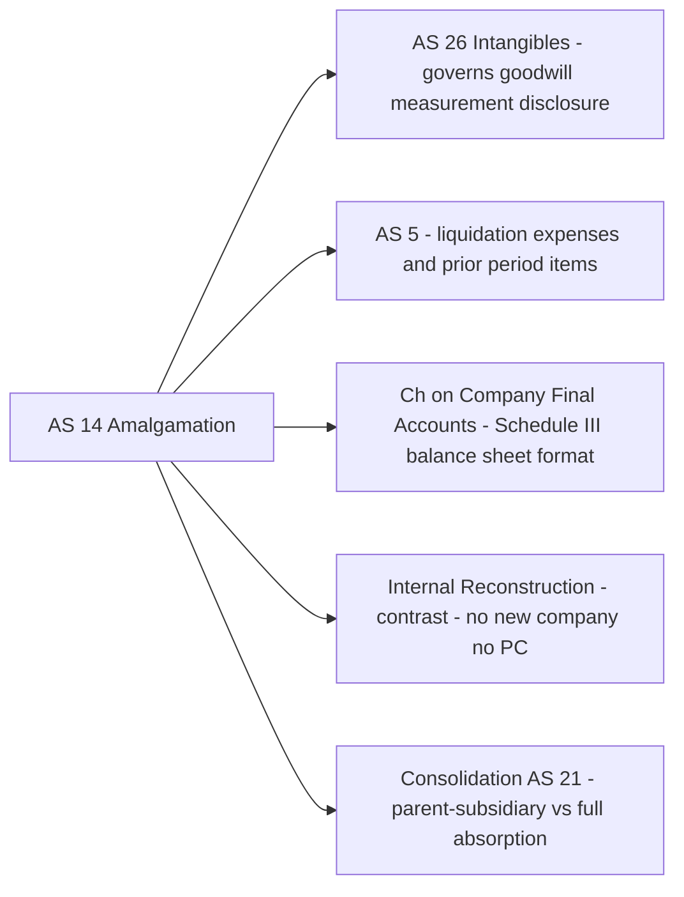

# Chapter 39 — Amalgamation, Absorption & External Reconstruction

## 1. The Problem

Two companies decide their futures are better together. Maybe *Alpha Steel Ltd* and *Beta Steel Ltd* are bleeding each other dry competing for the same customers. Maybe *Alpha* wants *Beta's* factory and *Beta's* promoters want to cash out. Maybe a sick company, *Gamma Ltd*, has such a mangled balance sheet — accumulated losses of ₹40 lakh sitting as a fictitious asset — that no bank will lend to it, and the only clean fix is to kill the old company and float a brand-new one in its place.

In every one of these stories the same brutal accounting problem appears:

> **One company's entire existence — every asset, every liability, every rupee of reserves, every shareholder — has to be picked up and folded into another set of books. What number do we pay? What form does the payment take? And once the dust settles, does the surviving balance sheet still *balance*?**

This is not like buying a single machine, where you debit an asset and credit the bank. Here you are absorbing a *whole organism*: its inventory, its debtors, its bank overdraft, its debenture-holders, its share capital, its profit-and-loss deficit. The transferor company then dies — it is struck off, liquidated, ceases to exist. The transferee company (or a new company) must show, on Day 1 of the combined life, a balance sheet that is complete and correct.

Get the *purchase consideration* wrong and you either overpay (and park the excess as fictitious goodwill) or you understate the payment (and conjure a fake capital reserve). Choose the *wrong method* of accounting and you either wrongly wipe out the transferor's history or wrongly revalue everything. Miss a single liability the transferee agreed to take over and your balance sheet won't tie.

That is the machine this chapter builds — piece by piece, each rule only appearing after the pain that forced it into existence.

---

## 2. The Core Idea (an analogy)

Think of a company as a **household moving into another household**.

When two families merge, there are really only two honest ways to do it:

**Way 1 — "We're one family now, nothing changes."** You carry every book, every chair, every debt at *exactly* the value each family recorded before. Grandma's clock that was on the old family's books at ₹100 stays at ₹100. Even the reserves — the family's accumulated savings and its shared memories — carry across untouched. Nobody "pays" anybody; the two just pool everything. This is a **merger** (AS 14 calls it the **Pooling of Interests Method**).

**Way 2 — "I am buying your household from you."** Here one family is genuinely *purchasing* the other. You don't care what the seller's books said Grandma's clock was worth; you agree a *fresh price today* for each item, you hand over an agreed total payment (cash, or shares in your family trust, or IOUs), and if you paid more than the net worth of what you got, the extra is "goodwill" — the premium for the seller's reputation and customer relationships. If you struck a bargain and paid *less* than net worth, you booked a **capital reserve** (a capital profit). This is a **purchase** (AS 14's **Purchase Method**).

The single most important intuition for the whole chapter:

> **The method is not a choice you make for convenience. It is *dictated* by the substance of the deal.** If the combination is a genuine uniting of two equal continuing groups (merger), you pool at book value. If it is one entity buying out another (purchase), you fair-value and recognise goodwill/capital reserve. AS 14 gives you a five-part test to tell which is which — and if even one condition fails, it is a purchase.

Everything else — net assets vs net payments, the discharge of consideration, the journal entries in two sets of books — is machinery hanging off this one fork in the road.

---

## 3. Why It's Built This Way

### Three words that get confused constantly

Exam papers use three labels. They are legally distinct but *accounted for identically*, which is why AS 14 lumps them together under one word: **amalgamation**.

| Term | What physically happens | Who survives |
|---|---|---|
| **Amalgamation** | Two (or more) companies wind up; a **new company** is formed to take over all of them | A brand-new company (e.g. A Ltd + B Ltd → AB Ltd) |
| **Absorption** | An **existing** company takes over another existing company, which is wound up | An old, existing company (B Ltd absorbed into A Ltd) |
| **External Reconstruction** | A company with a battered balance sheet winds up, and a **new company** — usually with the same shareholders and business — takes it over to start clean | A new company replacing the old one-for-one |

AS 14 defines **amalgamation** to cover all of these (any winding-up-and-transfer under the Companies Act's amalgamation provisions). So the accounting toolkit is *one* toolkit. Don't let the three names scare you: **absorption is just amalgamation where the buyer already exists; external reconstruction is amalgamation where the seller's shareholders essentially re-emerge as the buyer's shareholders.**

> **Terminology (used throughout):** the company that is wound up / taken over is the **Transferor Company** (older texts say *vendor company*). The company that takes over / survives is the **Transferee Company** (older texts say *purchasing company*).

### Why two methods, and why the substance test

Accounting's job is to *represent reality*, not to flatter it. Two realities exist:

- **A true merger** is not a purchase — no one is richer or poorer the morning after; two continuing ownership groups have simply combined. If you *revalued* everything and booked goodwill, you would be inventing profits and assets that no transaction created. So the honest treatment is: **carry everything at old book values, carry the reserves across, recognise no goodwill.** That is Pooling of Interests.

- **A genuine acquisition** *is* a purchase — the transferee has spent real consideration to acquire a bundle of net assets. The honest treatment is to record what you acquired at the *fair value you agreed to pay for it*, and if you paid a premium, admit it as goodwill. That is the Purchase Method.

Because the two treatments give wildly different balance sheets, AS 14 refuses to let companies *pick* the flattering one. It hard-codes **five conditions**. Meet **all five** → it is genuinely a merger → you *must* pool. Miss **any one** → it is a purchase → you *must* use the Purchase Method.


*Figure 1 — The single fork that governs the entire chapter: substance decides the method.*

---

## 4. Full Technical Content

### 4.1 The AS 14 five-condition merger test

An amalgamation is **in the nature of merger** only if **all** of the following are satisfied:

1. **All assets and liabilities** of the transferor become, after amalgamation, the assets and liabilities of the transferee. (Nothing is left behind.)
2. **Shareholders holding not less than 90%** of the face value of the equity shares of the transferor (other than shares already held by the transferee or its subsidiaries/nominees) **become equity shareholders** of the transferee.
3. The **consideration** to those equity shareholders is discharged **wholly by the issue of equity shares** of the transferee — *except* that cash may be paid for **fractional shares**.
4. The **business** of the transferor is **intended to be carried on** by the transferee after amalgamation.
5. **No adjustment** is intended to be made to the **book values** of the assets and liabilities of the transferor when incorporated into the transferee's books — *except* to ensure **uniformity of accounting policies**.

Fail even one → **purchase**. (A cash component beyond fractional shares alone kills condition 3, for instance.)

### 4.2 Purchase Consideration (the number everyone fights over)

**AS 14 definition:** Purchase consideration is *"the aggregate of the shares and other securities issued and the payment made in the form of cash or other assets by the transferee company to the shareholders of the transferor company."*

Burn this into memory — it contains the chapter's most punished trap:

> **Purchase consideration is what the transferee pays to the *SHAREHOLDERS* of the transferor. It is NOT the total of assets taken over. Any amount the transferee agrees to pay to *debenture-holders, creditors, or to meet liquidation/winding-up expenses* is NOT part of purchase consideration — those are settled separately.**

There are two methods to *compute* PC.

#### (a) Net Assets Method

PC = (Agreed value of **assets taken over**) − (Agreed value of **liabilities taken over**).

Use when the problem gives you the *revalued figures of assets and liabilities* that the transferee assumes, and the deal is framed as "buy the net assets."

```
PC (Net Assets) = Σ Agreed value of assets taken over
                − Σ Agreed value of liabilities taken over
```

Cautions:
- Take **only assets actually taken over** at their **agreed (revaluation) values**. If some asset (say, a fictitious asset like preliminary expenses or the debit balance of P&L) is *not* taken over, exclude it.
- Goodwill *given in the problem* as an asset taken over is included; goodwill you *compute later* is not.
- Deduct **only liabilities actually taken over**, at agreed values. A **liability not assumed** by the transferee (e.g. a disputed claim retained) is excluded.
- **Do not deduct** accumulated reserves or the P&L credit balance — those are not liabilities; they belong to shareholders.

#### (b) Net Payments Method

PC = the **total of all payments the transferee makes to the transferor's shareholders**, in whatever form — cash + equity shares + preference shares + debentures issued *to shareholders*.

```
PC (Net Payments) = Cash paid to shareholders
                  + Equity shares issued to shareholders (at issue value)
                  + Preference shares issued to shareholders
                  + Any other securities/assets given to shareholders
```

Cautions:
- Include **only what goes to shareholders**. Payments made to discharge debentures or creditors, and amounts to cover realisation/liquidation expenses, are **excluded** from PC (even though the transferee pays them).
- Value the shares issued at their **issue price** (face value **plus securities premium**), not merely face value — because that is the value the shareholders receive.
- Ignore the individual asset/liability values entirely under this method; you simply add up the payments.

> **Which method?** Read the question. If it lists revalued assets and liabilities assumed → **Net Assets**. If it lists what each class of shareholder *receives* (so many shares, so much cash) → **Net Payments**. If both are computable and give different answers, use the one the *deal terms* describe; the examiner usually makes it unambiguous.

### 4.3 Goodwill or Capital Reserve (Purchase Method only)

Once PC is fixed and the net assets are recorded at agreed values in the transferee's books:

```
Goodwill / Capital Reserve = Purchase Consideration
                           − Net Assets taken over (at agreed values)

If PC > Net assets  → GOODWILL (Dr)         [we overpaid → intangible premium]
If PC < Net assets  → CAPITAL RESERVE (Cr)  [we underpaid → capital profit]
```

Under **Pooling (merger)** there is *no* goodwill/capital reserve of this kind; instead, the difference between the PC and the transferor's share capital is adjusted in **reserves** (see 4.6).

### 4.4 Discharge of Purchase Consideration

"Discharge" = *how* the transferee actually hands over the agreed PC. The PC number is fixed; discharge is the settlement mechanics — cash, equity shares (often at a premium), preference shares, debentures. When shares are issued **above par**, the excess goes to **Securities Premium**. Total value discharged **must equal PC** exactly, or your entry won't balance.

### 4.5 Books of the Transferor Company (the company being wound up)

The transferor opens a **Realisation Account** — the account that captures the profit or loss on winding up. Standard sequence of entries:

| # | Transaction | Journal Entry |
|---|---|---|
| 1 | Transfer **all assets** (at **book value**) to Realisation | Realisation A/c Dr; To individual Asset A/cs |
| 2 | Transfer **liabilities taken over** to Realisation | Liability A/cs Dr; To Realisation A/c |
| 3 | **PC due** from transferee | Transferee Co. (Business Purchase) A/c Dr; To Realisation A/c |
| 4 | **Receipt** of PC | Cash/Bank/Shares/Debentures Dr; To Transferee Co. A/c |
| 5 | **Realisation expenses** (if borne by transferor) | Realisation A/c Dr; To Bank |
| 6 | **Assets not taken over**, sold | Bank A/c Dr; To Realisation A/c |
| 7 | **Liabilities not taken over**, settled | Realisation A/c Dr; To Bank (or profit/loss to Realisation) |
| 8 | **Accumulated reserves/P&L (Cr)** to shareholders | Reserves/P&L A/c Dr; To Equity Shareholders A/c |
| 9 | Transfer **share capital** to shareholders | Share Capital A/c Dr; To Equity Shareholders A/c |
| 10 | **Realisation profit/loss** to shareholders | Realisation A/c Dr; To Equity Shareholders (profit) — or reverse (loss) |
| 11 | **Preference shareholders** paid off | Pref. Shareholders A/c Dr; To Bank/Shares |
| 12 | **Final distribution** to equity shareholders | Equity Shareholders A/c Dr; To Cash/Shares in Transferee |

At the end **every account in the transferor's books closes to zero.** That is your self-check.

### 4.6 Books of the Transferee Company (the survivor)

**Common step — record the purchase (Business Purchase A/c):**

```
Business Purchase A/c ......... Dr   (with PC)
    To Liquidator of Transferor Co. A/c
```

Then bring in assets and liabilities. **Here the two methods diverge:**

**Purchase Method:**
| Entry | Detail |
|---|---|
| Incorporate assets & liabilities | Assets Dr (agreed values); Goodwill Dr (if any); To Liabilities (agreed values); To Business Purchase A/c; To Capital Reserve (if any) |
| Discharge PC | Liquidator of Transferor A/c Dr; To Equity Share Capital; To Securities Premium; To Cash etc. |
| Statutory reserves (if to be kept) | Amalgamation Adjustment Reserve Dr; To Statutory Reserve |
| Liquidation/formation expenses | expenses A/c Dr; To Bank |

**Pooling (Merger) Method:**
| Entry | Detail |
|---|---|
| Incorporate assets, liabilities **and reserves** at **book value** | Assets Dr; To Liabilities; To Reserves; To Business Purchase A/c |
| Difference (PC vs share capital) | adjusted **in reserves** — see rule below |

> **Pooling reserve rule (AS 14):** The difference between the amount recorded as **share capital issued** (plus any cash consideration) and the amount of **share capital of the transferor** is adjusted in **reserves**. If PC (in shares) exceeds transferor's capital, reduce reserves; if less, increase reserves. **No goodwill is created.** The transferor's identity of reserves (general reserve, etc.) is preserved as far as possible.

### 4.7 Treatment of specific items (both methods)

- **Statutory reserves** (e.g. reserves required by law): under Purchase Method they are recorded via an **Amalgamation Adjustment Reserve** (shown on the asset side under "Miscellaneous Expenditure"/other) so the statutory reserve survives; it is reversed when the statutory requirement lapses. Under Pooling, statutory reserves carry over naturally.
- **Goodwill arising on amalgamation** (Purchase Method) should be **amortised** over its useful life — AS 14 presumes it does not exceed **5 years** unless a longer life is justified.
- **Inter-company owings** (transferee already owed money to/by transferor): eliminate on combination.
- **Inter-company unrealised profit** on stock: eliminate from stock value.
- **Shares already held** by transferee in transferor: reduce PC by the shares that would otherwise have gone to it (only the *other* shareholders are paid).

---

## 5. Worked Examples

### Example 1 — Warm-up: computing PC both ways, and goodwill

*Beta Ltd is absorbed by Alpha Ltd. Beta's balance sheet:*

| Liabilities | ₹ | Assets | ₹ |
|---|---:|---|---:|
| Equity share capital (₹10 each) | 5,00,000 | Goodwill | 40,000 |
| General reserve | 1,00,000 | Land & Building | 3,00,000 |
| Profit & Loss A/c | 60,000 | Plant & Machinery | 2,50,000 |
| 12% Debentures | 2,00,000 | Stock | 1,40,000 |
| Creditors | 90,000 | Debtors | 1,60,000 |
| | | Bank | 60,000 |
| **Total** | **9,50,000** | **Total** | **9,50,000** |

*Alpha agrees to take over all assets and all liabilities. Agreed values: Goodwill nil (Alpha will assess its own), Land & Building ₹3,80,000, Plant ₹2,30,000, Stock ₹1,30,000, Debtors ₹1,50,000, Bank ₹60,000. Debentures ₹2,00,000 and Creditors ₹90,000 taken over at book value. Alpha discharges the purchase consideration by issuing 60,000 equity shares of ₹10 each at ₹12 per share.*

**Step 1 — PC by Net Payments (what shareholders receive):**
60,000 shares × ₹12 = **₹7,20,000**. (Shareholders get shares only; debentures/creditors are separate.)

**Step 2 — PC by Net Assets (cross-check the deal, *not* to compute PC here):**

| Assets taken over (agreed) | ₹ |
|---|---:|
| Land & Building | 3,80,000 |
| Plant & Machinery | 2,30,000 |
| Stock | 1,30,000 |
| Debtors | 1,50,000 |
| Bank | 60,000 |
| **Total assets** | **9,50,000** |
| *Less:* Debentures | (2,00,000) |
| *Less:* Creditors | (90,000) |
| **Net assets** | **6,60,000** |

**Step 3 — Method (AS 14 test):** Consideration is wholly equity shares, business continues, all assets/liabilities taken over — *but the values are being adjusted* (Land up, Plant down, etc.), which **breaks condition 5**. Also goodwill dropped. So this is a **purchase**, not merger.

**Step 4 — Goodwill / Capital Reserve:**
```
PC                    = 7,20,000
Net assets taken over = 6,60,000
Goodwill (PC > NA)    =   60,000  →  Goodwill Dr ₹60,000
```

**Alpha's incorporation entry:**

| Particulars | Dr (₹) | Cr (₹) |
|---|---:|---:|
| Goodwill A/c | 60,000 | |
| Land & Building A/c | 3,80,000 | |
| Plant & Machinery A/c | 2,30,000 | |
| Stock A/c | 1,30,000 | |
| Debtors A/c | 1,50,000 | |
| Bank A/c | 60,000 | |
| &nbsp;&nbsp;To 12% Debentures A/c | | 2,00,000 |
| &nbsp;&nbsp;To Creditors A/c | | 90,000 |
| &nbsp;&nbsp;To Business Purchase A/c | | 7,20,000 |

**Discharge entry:**

| Particulars | Dr (₹) | Cr (₹) |
|---|---:|---:|
| Business Purchase A/c | 7,20,000 | |
| &nbsp;&nbsp;To Equity Share Capital (60,000 × ₹10) | | 6,00,000 |
| &nbsp;&nbsp;To Securities Premium (60,000 × ₹2) | | 1,20,000 |

*Self-check:* Dr side of incorporation = 60,000+3,80,000+2,30,000+1,30,000+1,50,000+60,000 = ₹10,10,000. Cr side = 2,00,000+90,000+7,20,000 = ₹10,10,000. Balanced.

---

### Example 2 — Merger (Pooling) vs Purchase on the *same* facts

This example shows how the **same deal**, accounted two ways, produces two different balance sheets — and why the AS 14 test matters.

*P Ltd will amalgamate into Q Ltd (a new/existing transferee). P Ltd's summarised balance sheet:*

| Liabilities | ₹ | Assets | ₹ |
|---|---:|---|---:|
| Equity capital (₹10 each) | 8,00,000 | Sundry fixed assets | 9,00,000 |
| General reserve | 2,00,000 | Stock | 2,40,000 |
| Profit & Loss A/c | 1,00,000 | Debtors | 1,60,000 |
| Creditors | 2,00,000 | Bank | 20,000 |
| **Total** | **13,00,000** | **Total** | **13,00,000** |

*Q Ltd issues 80,000 equity shares of ₹10 each at par to P Ltd's shareholders and takes over all assets and liabilities.*

#### Case A — Amalgamation in the nature of MERGER (Pooling)

Check AS 14: all assets/liabilities taken over ✓; ≥90% shareholders become equity shareholders ✓; consideration wholly in equity shares ✓; business continued ✓; **book values unchanged** ✓. **All five met → Pooling.**

- PC = 80,000 × ₹10 = **₹8,00,000** (all equity, at par).
- Record assets, liabilities **and reserves** at **book value**.
- Difference between PC (₹8,00,000 in shares) and P's share capital (₹8,00,000) = **nil**, so reserves carry over untouched.

**Q Ltd entries (Pooling):**

| Particulars | Dr (₹) | Cr (₹) |
|---|---:|---:|
| Business Purchase A/c | 8,00,000 | |
| &nbsp;&nbsp;To Liquidator of P Ltd A/c | | 8,00,000 |
| Sundry Fixed Assets A/c | 9,00,000 | |
| Stock A/c | 2,40,000 | |
| Debtors A/c | 1,60,000 | |
| Bank A/c | 20,000 | |
| &nbsp;&nbsp;To Creditors A/c | | 2,00,000 |
| &nbsp;&nbsp;To General Reserve A/c | | 2,00,000 |
| &nbsp;&nbsp;To Profit & Loss A/c | | 1,00,000 |
| &nbsp;&nbsp;To Business Purchase A/c | | 8,00,000 |
| Liquidator of P Ltd A/c | 8,00,000 | |
| &nbsp;&nbsp;To Equity Share Capital A/c | | 8,00,000 |

*Reserves preserved:* Q Ltd's balance sheet now shows General Reserve ₹2,00,000 and P&L ₹1,00,000 **carried across** — the merger keeps history alive. **No goodwill.**

#### Case B — Same numbers, but Q pays 80,000 shares at ₹12 (premium) and revalues fixed assets to ₹9,80,000 → PURCHASE

Now condition 5 is broken (assets revalued) → **Purchase Method**.

- PC = 80,000 × ₹12 = **₹9,60,000**.
- Net assets (agreed): Fixed assets 9,80,000 + Stock 2,40,000 + Debtors 1,60,000 + Bank 20,000 − Creditors 2,00,000 = **₹12,00,000**... wait, recompute: 9,80,000+2,40,000+1,60,000+20,000 = 14,00,000; less 2,00,000 = **₹12,00,000**.
- Goodwill/Capital Reserve = PC − Net assets = 9,60,000 − 12,00,000 = **(2,40,000)** → **Capital Reserve ₹2,40,000** (Q paid *less* than net worth — a bargain purchase).

**Q Ltd entries (Purchase):**

| Particulars | Dr (₹) | Cr (₹) |
|---|---:|---:|
| Sundry Fixed Assets A/c | 9,80,000 | |
| Stock A/c | 2,40,000 | |
| Debtors A/c | 1,60,000 | |
| Bank A/c | 20,000 | |
| &nbsp;&nbsp;To Creditors A/c | | 2,00,000 |
| &nbsp;&nbsp;To Business Purchase A/c | | 9,60,000 |
| &nbsp;&nbsp;To Capital Reserve A/c | | 2,40,000 |
| Business Purchase A/c | 9,60,000 | |
| &nbsp;&nbsp;To Equity Share Capital A/c | | 8,00,000 |
| &nbsp;&nbsp;To Securities Premium A/c | | 1,60,000 |

*Note the contrast:* under Purchase, **P's reserves DO NOT carry over** — instead a Capital Reserve of ₹2,40,000 appears, reflecting the bargain. Under Pooling, the reserves survived. Same companies, different substance, different balance sheet. **This is the heart of the chapter.**

---

### Example 3 — Full exam-hard problem: build the new Balance Sheet

*A Ltd and B Ltd agree to amalgamate; a new company AB Ltd is formed to take over both. Balance sheets as at 31 March 2026:*

| Liabilities | A Ltd (₹) | B Ltd (₹) | Assets | A Ltd (₹) | B Ltd (₹) |
|---|---:|---:|---|---:|---:|
| Equity capital (₹10 each) | 20,00,000 | 12,00,000 | Goodwill | — | 1,00,000 |
| 10% Pref. capital (₹100) | 5,00,000 | 3,00,000 | Land & Building | 12,00,000 | 7,00,000 |
| General reserve | 4,00,000 | 2,00,000 | Plant & Machinery | 9,00,000 | 6,00,000 |
| Profit & Loss A/c | 2,00,000 | 1,00,000 | Furniture | 1,50,000 | 80,000 |
| 12% Debentures | 6,00,000 | 4,00,000 | Stock | 6,50,000 | 4,20,000 |
| Sundry creditors | 3,00,000 | 2,00,000 | Sundry debtors | 5,00,000 | 3,80,000 |
| | | | Cash at bank | 6,00,000 | 2,20,000 |
| **Total** | **40,00,000** | **24,00,000** | **Total** | **40,00,000** | **24,00,000** |

**Terms of amalgamation:**
1. AB Ltd takes over **all assets and liabilities** of both companies.
2. Assets revalued: A Ltd — Land & Building ₹15,00,000, Plant ₹8,00,000; B Ltd — Land & Building ₹9,00,000, Plant ₹5,00,000, Goodwill of B to be treated as nil. All other assets at book value. Stock and debtors at book value.
3. **Equity shareholders** of A and B receive equity shares of ₹10 each in AB Ltd at par: A's shareholders get **2,40,000 shares**; B's shareholders get **1,50,000 shares**.
4. **Preference shareholders** of both companies are issued 10% preference shares of ₹100 each in AB Ltd of equal amount.
5. **Debenture-holders** of both companies are issued 12% debentures in AB Ltd of equal amount.
6. Liquidation expenses ₹40,000 (A) and ₹25,000 (B) are met by AB Ltd.

Because assets are being **revalued**, condition 5 fails → **Purchase Method** for both.

---

#### Step 1 — Purchase Consideration (Net Payments — only what goes to *shareholders*)

**A Ltd:**
| Payment to shareholders | ₹ |
|---|---:|
| Equity shares: 2,40,000 × ₹10 | 24,00,000 |
| 10% Preference shares (equal to ₹5,00,000) | 5,00,000 |
| **PC — A Ltd** | **29,00,000** |

**B Ltd:**
| Payment to shareholders | ₹ |
|---|---:|
| Equity shares: 1,50,000 × ₹10 | 15,00,000 |
| 10% Preference shares (equal to ₹3,00,000) | 3,00,000 |
| **PC — B Ltd** | **18,00,000** |

> **Trap avoided:** Debentures issued to debenture-holders (₹6,00,000 + ₹4,00,000) and liquidation expenses are **NOT** in PC. They are obligations settled separately.

#### Step 2 — Net assets taken over (agreed values), and Goodwill/Capital Reserve

**A Ltd net assets:**
| Item | ₹ |
|---|---:|
| Land & Building | 15,00,000 |
| Plant & Machinery | 8,00,000 |
| Furniture | 1,50,000 |
| Stock | 6,50,000 |
| Debtors | 5,00,000 |
| Cash at bank | 6,00,000 |
| **Total assets** | **42,00,000** |
| *Less:* 12% Debentures | (6,00,000) |
| *Less:* Creditors | (3,00,000) |
| **Net assets — A** | **33,00,000** |

PC (A) ₹29,00,000 − Net assets ₹33,00,000 = **Capital Reserve ₹4,00,000** (bargain).

**B Ltd net assets:**
| Item | ₹ |
|---|---:|
| Land & Building | 9,00,000 |
| Plant & Machinery | 5,00,000 |
| Furniture | 80,000 |
| Stock | 4,20,000 |
| Debtors | 3,80,000 |
| Cash at bank | 2,20,000 |
| **Total assets** (Goodwill nil) | **25,00,000** |
| *Less:* 12% Debentures | (4,00,000) |
| *Less:* Creditors | (2,00,000) |
| **Net assets — B** | **19,00,000** |

PC (B) ₹18,00,000 − Net assets ₹19,00,000 = **Capital Reserve ₹1,00,000** (bargain).

**Total Capital Reserve = ₹4,00,000 + ₹1,00,000 = ₹5,00,000.**

*(No goodwill arises — both are bargain purchases. If one had been a premium purchase you would show Goodwill for that one and Capital Reserve for the other; AS 14 does **not** allow netting goodwill of one transferor against capital reserve of another — show both, though many exam solutions present the net if from a single transferor.)*

#### Step 3 — Journal entries in AB Ltd's books (Purchase Method)

**(i) Record purchase consideration due:**

| Particulars | Dr (₹) | Cr (₹) |
|---|---:|---:|
| Business Purchase A/c | 47,00,000 | |
| &nbsp;&nbsp;To Liquidator of A Ltd A/c | | 29,00,000 |
| &nbsp;&nbsp;To Liquidator of B Ltd A/c | | 18,00,000 |

**(ii) Incorporate A Ltd's assets & liabilities:**

| Particulars | Dr (₹) | Cr (₹) |
|---|---:|---:|
| Land & Building A/c | 15,00,000 | |
| Plant & Machinery A/c | 8,00,000 | |
| Furniture A/c | 1,50,000 | |
| Stock A/c | 6,50,000 | |
| Sundry Debtors A/c | 5,00,000 | |
| Cash at Bank A/c | 6,00,000 | |
| &nbsp;&nbsp;To 12% Debentures A/c | | 6,00,000 |
| &nbsp;&nbsp;To Sundry Creditors A/c | | 3,00,000 |
| &nbsp;&nbsp;To Business Purchase A/c | | 29,00,000 |
| &nbsp;&nbsp;To Capital Reserve A/c | | 4,00,000 |

**(iii) Incorporate B Ltd's assets & liabilities:**

| Particulars | Dr (₹) | Cr (₹) |
|---|---:|---:|
| Land & Building A/c | 9,00,000 | |
| Plant & Machinery A/c | 5,00,000 | |
| Furniture A/c | 80,000 | |
| Stock A/c | 4,20,000 | |
| Sundry Debtors A/c | 3,80,000 | |
| Cash at Bank A/c | 2,20,000 | |
| &nbsp;&nbsp;To 12% Debentures A/c | | 4,00,000 |
| &nbsp;&nbsp;To Sundry Creditors A/c | | 2,00,000 |
| &nbsp;&nbsp;To Business Purchase A/c | | 18,00,000 |
| &nbsp;&nbsp;To Capital Reserve A/c | | 1,00,000 |

**(iv) Discharge of PC:**

| Particulars | Dr (₹) | Cr (₹) |
|---|---:|---:|
| Liquidator of A Ltd A/c | 29,00,000 | |
| &nbsp;&nbsp;To Equity Share Capital A/c | | 24,00,000 |
| &nbsp;&nbsp;To 10% Preference Share Capital A/c | | 5,00,000 |
| Liquidator of B Ltd A/c | 18,00,000 | |
| &nbsp;&nbsp;To Equity Share Capital A/c | | 15,00,000 |
| &nbsp;&nbsp;To 10% Preference Share Capital A/c | | 3,00,000 |

**(v) Liquidation expenses met by AB Ltd** (borne by transferee → treated as expense/added to cost; here charge to Capital Reserve or Goodwill per policy — commonly to Capital Reserve if available, else P&L. We charge to Capital Reserve as it is a cost of acquisition):

| Particulars | Dr (₹) | Cr (₹) |
|---|---:|---:|
| Capital Reserve A/c (40,000 + 25,000) | 65,000 | |
| &nbsp;&nbsp;To Bank A/c | | 65,000 |

*(Note: treatment of liquidation expenses varies by exam convention — some charge to P&L. The safe disclosure is to state the assumption. Adjusting Capital Reserve keeps it as an acquisition-related cost.)*

Capital Reserve after expenses = ₹5,00,000 − ₹65,000 = **₹4,35,000**.

#### Step 4 — Build AB Ltd's Balance Sheet (post-amalgamation)

First aggregate the figures.

**Assets:**
| Asset | A (₹) | B (₹) | Total (₹) |
|---|---:|---:|---:|
| Land & Building | 15,00,000 | 9,00,000 | 24,00,000 |
| Plant & Machinery | 8,00,000 | 5,00,000 | 13,00,000 |
| Furniture | 1,50,000 | 80,000 | 2,30,000 |
| Stock | 6,50,000 | 4,20,000 | 10,70,000 |
| Debtors | 5,00,000 | 3,80,000 | 8,80,000 |
| Cash at bank | 6,00,000 | 2,20,000 | 8,20,000 |

Cash reduces by ₹65,000 (expenses) → **8,20,000 − 65,000 = ₹7,55,000**.

**Equity & liabilities:**
- Equity share capital: 24,00,000 + 15,00,000 = **₹39,00,000** (3,90,000 shares of ₹10)
- 10% Preference capital: 5,00,000 + 3,00,000 = **₹8,00,000**
- Capital Reserve: **₹4,35,000**
- 12% Debentures: 6,00,000 + 4,00,000 = **₹10,00,000**
- Sundry creditors: 3,00,000 + 2,00,000 = **₹5,00,000**

**Balance Sheet of AB Ltd as at 1 April 2026 (Schedule III format):**

| Particulars | ₹ |
|---|---:|
| **I. EQUITY AND LIABILITIES** | |
| **(1) Shareholders' funds** | |
| &nbsp;&nbsp;(a) Share capital | |
| &nbsp;&nbsp;&nbsp;&nbsp;— Equity (3,90,000 × ₹10) | 39,00,000 |
| &nbsp;&nbsp;&nbsp;&nbsp;— 10% Preference (8,000 × ₹100) | 8,00,000 |
| &nbsp;&nbsp;(b) Reserves & Surplus — Capital Reserve | 4,35,000 |
| **(2) Non-current liabilities** | |
| &nbsp;&nbsp;12% Debentures | 10,00,000 |
| **(3) Current liabilities** | |
| &nbsp;&nbsp;Trade payables (Sundry creditors) | 5,00,000 |
| **Total** | **66,35,000** |
| **II. ASSETS** | |
| **(1) Non-current assets — Property, Plant & Equipment** | |
| &nbsp;&nbsp;Land & Building | 24,00,000 |
| &nbsp;&nbsp;Plant & Machinery | 13,00,000 |
| &nbsp;&nbsp;Furniture | 2,30,000 |
| **(2) Current assets** | |
| &nbsp;&nbsp;Inventories (Stock) | 10,70,000 |
| &nbsp;&nbsp;Trade receivables (Debtors) | 8,80,000 |
| &nbsp;&nbsp;Cash & cash equivalents | 7,55,000 |
| **Total** | **66,35,000** |

**Self-verification — does it balance?**
- Total EQ & Liab = 39,00,000 + 8,00,000 + 4,35,000 + 10,00,000 + 5,00,000 = **₹66,35,000** ✓
- Total Assets = 24,00,000 + 13,00,000 + 2,30,000 + 10,70,000 + 8,80,000 + 7,55,000 = **₹66,35,000** ✓

**Balanced.** Notice there is **no goodwill** (both bargain purchases), P&L and General Reserve of the transferors have **vanished** (Purchase Method does not carry reserves), and the entire premium/discount logic surfaced as **Capital Reserve**.

---

## 6. Presentation Formats

### 6.1 Realisation Account (transferor) — standard skeleton

| Dr | ₹ | Cr | ₹ |
|---|---:|---|---:|
| To Sundry Assets (book value, each listed) | XXX | By Liabilities taken over (book value) | XXX |
| To Bank (liabilities not taken over, paid) | XXX | By Transferee Co. A/c (Purchase Consideration) | XXX |
| To Bank (realisation expenses) | XXX | By Bank (assets not taken over, sold) | XXX |
| To Equity Shareholders A/c (profit — bal. fig.) | XXX | By Equity Shareholders A/c (loss — bal. fig.) | XXX |
| **Total** | **XXX** | **Total** | **XXX** |

### 6.2 Equity Shareholders' Account (transferor) — closes the books

| Dr | ₹ | Cr | ₹ |
|---|---:|---|---:|
| To Realisation A/c (loss, if any) | XXX | By Equity Share Capital | XXX |
| To Shares in Transferee Co. | XXX | By General Reserve | XXX |
| To Bank (cash portion) | XXX | By Profit & Loss A/c | XXX |
| | | By Realisation A/c (profit, if any) | XXX |
| **Total** | **XXX** | **Total** | **XXX** |

### 6.3 PC computation — always show the chosen method explicitly

State clearly: *"Purchase Consideration (Net Payments Method)"* or *"(Net Assets Method)"* as a labelled working note. Examiners award method-identification marks.

### 6.4 Post-amalgamation Balance Sheet — Schedule III (Division I) headings

Use the heads shown in Example 3: Shareholders' funds → Non-current liabilities → Current liabilities; Non-current assets (PPE, Intangibles incl. Goodwill) → Current assets. **Amalgamation Adjustment Reserve** (for statutory reserves under Purchase Method) appears under "Other Equity" as a negative/contra or under Other Assets per the statute — disclose it.

---

## 7. Connections


*Figure 2 — Where amalgamation sits in the syllabus web.*

- **Internal vs External Reconstruction:** *Internal* reconstruction (capital reduction under the Companies Act) keeps the **same company** alive and just rearranges its capital — **no PC, no new company, no Realisation Account.** *External* reconstruction winds up the old company and floats a new one — **full amalgamation machinery applies.** Don't confuse them.
- **Consolidation (AS 21):** In a merger/absorption the transferor *ceases to exist* and there is **one** set of books. In consolidation the subsidiary *survives* as a separate legal entity and you prepare *consolidated* statements — different beast.
- **Goodwill amortisation (AS 14 / AS 26):** Goodwill on amalgamation is amortised (presumed ≤5 years) — links forward to impairment thinking.
- **Purchase consideration discharge** reuses your **Securities Premium** and **share issue** mechanics from company accounts.

---

## 8. Traps & Examiner Tricks

1. **PC ≠ net assets total.** The number-one error. PC is *only what goes to shareholders*. Payments to debenture-holders and creditors are **excluded**. If the question says "AB takes over debentures by issuing its own debentures," those debentures are **not** PC.
2. **Reserves under Purchase vs Pooling.** Under **Purchase**, transferor's General Reserve and P&L **do NOT carry over** — they are subsumed into the goodwill/capital-reserve calculation. Under **Pooling**, they **do** carry over. Students routinely carry reserves in a purchase — wrong.
3. **The "one condition fails → purchase" rule.** Any cash beyond fractional shares, any revaluation, any shareholder-percentage shortfall below 90% flips it to purchase. Read all five conditions; a single breach decides it.
4. **Goodwill vs Capital Reserve direction.** PC **greater** than net assets = **Goodwill** (you overpaid). PC **less** = **Capital Reserve**. Reversing these is an instant zero.
5. **Shares issued at a premium.** Value shares at **issue price** in PC (Net Payments), and route the premium to **Securities Premium** on discharge. Using face value understates PC.
6. **Assets/liabilities NOT taken over.** Fictitious assets (preliminary expenses, discount on debentures, debit P&L) and any excluded liability must be **left out** of net assets. In the transferor's books they are dealt with through the Equity Shareholders' / Realisation Account, not passed to the transferee.
7. **Goodwill already in transferor's books.** Treat per the terms — often revalued to nil. Don't blindly carry the old goodwill *and* create fresh goodwill (double counting).
8. **Statutory reserves.** Under Purchase Method they must be preserved via an **Amalgamation Adjustment Reserve** — a favourite disclosure question.
9. **Liquidation expenses borne by transferee.** State your assumption (charge to P&L or adjust Capital Reserve/Goodwill). Not part of PC either way.
10. **Inter-company items.** If the two companies owed each other money or held each other's stock (with unrealised profit), **eliminate** on combination or the balance sheet inflates.
11. **Preference shareholders paid at a premium/discount.** The premium/discount affects PC (Net Payments) — include the *actual value* they receive, not par.
12. **"Purchase consideration" silence on method.** If the question gives revalued assets/liabilities and says nothing about payments, use **Net Assets**. If it details what each shareholder class receives, use **Net Payments**. Never average the two.

---

## 9. First-Principles Recap

Strip it to bedrock and rebuild:

1. **A company can be absorbed whole into another (or into a brand-new company).** The absorbed company dies; its assets, liabilities, and shareholders must land correctly in the survivor's books.
2. **Two economic realities exist.** A *true merger* (nobody bought anybody — just pool at book value, keep reserves, no goodwill) versus a *purchase* (one bought the other — fair-value the net assets, recognise goodwill or capital reserve).
3. **AS 14's five conditions are the truth-detector.** All five → merger → Pooling. Any breach → purchase → Purchase Method. You don't get to choose.
4. **Purchase Consideration is what the transferee pays the transferor's *shareholders*** — nothing more. Compute it by **Net Assets** (assets minus liabilities taken over, at agreed values) or **Net Payments** (sum of everything given to shareholders). Debenture-holders and creditors are settled outside PC.
5. **Goodwill = PC − Net assets** if positive; a negative gives **Capital Reserve** (Purchase Method only). Pooling adjusts the share-capital difference in reserves instead.
6. **Transferor's books close via a Realisation Account**; every account zeroes out. **Transferee's books open via a Business Purchase Account**; assets/liabilities come in, PC is discharged in shares/cash/debentures, and the new balance sheet must **balance to the rupee**.
7. **Self-check is non-negotiable:** total assets = total equity + liabilities. If it doesn't tie, you dropped a liability, mis-valued an asset, or mis-computed PC.

Everything memorisable in this chapter is downstream of these seven ideas.

---

## 10. Quick-Revision Sheet

**AS 14 — two methods**
| | Merger (Pooling) | Purchase |
|---|---|---|
| Trigger | ALL 5 conditions met | ANY condition fails |
| Asset/liab values | **Book value** | **Agreed/fair value** |
| Reserves of transferor | **Carried over** | **NOT carried over** |
| Goodwill / Cap. Reserve | None (adjust in reserves) | Goodwill if PC>NA; Cap. Res. if PC<NA |
| Diff. adjusted | In reserves (PC vs share cap) | As goodwill / capital reserve |

**Five merger conditions (all required):** (1) all assets & liabilities transferred; (2) ≥90% equity shareholders become transferee's equity shareholders; (3) consideration wholly equity shares (cash only for fractions); (4) business continued; (5) book values unchanged except for policy uniformity.

**Purchase Consideration = payment to SHAREHOLDERS only.**
- **Net Assets Method:** Agreed value of assets taken over − Agreed value of liabilities taken over.
- **Net Payments Method:** Cash + Equity shares (at issue value) + Pref. shares + other securities given to shareholders.
- **Exclude** always: payments to debenture-holders, creditors, liquidation expenses.

**Goodwill / Capital Reserve (Purchase):**
```
PC − Net assets(agreed):  positive → Goodwill ;  negative → Capital Reserve
```

**Key journals**
- Transferee: `Business Purchase A/c Dr / To Liquidator of Transferor` → then bring in assets & liabilities (with Goodwill/Cap. Res.) → then `Liquidator A/c Dr / To Share Capital, Securities Premium, Cash`.
- Transferor: assets → Realisation (book value); liabilities → Realisation; PC due `Transferee A/c Dr/To Realisation`; reserves → Equity Shareholders; Realisation profit/loss → Equity Shareholders; final settlement closes all accounts to zero.

**Three names, one toolkit:** Amalgamation (→ new co.), Absorption (→ existing co.), External Reconstruction (→ new co. replacing a battered one).

**Do-not-confuse:** External reconstruction = new company + PC + Realisation. **Internal** reconstruction = same company, capital reduction, **no PC**.

**Balance-sheet checks:** Assets total = Equity + Liabilities total. Reserves carried only under Pooling. Goodwill/Cap. Reserve only under Purchase. Securities Premium on shares issued above par. Statutory reserves preserved via **Amalgamation Adjustment Reserve** under Purchase Method. Amortise goodwill (presumed ≤ 5 years).
