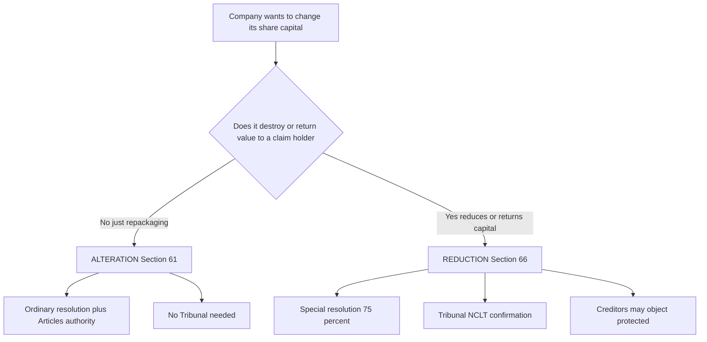
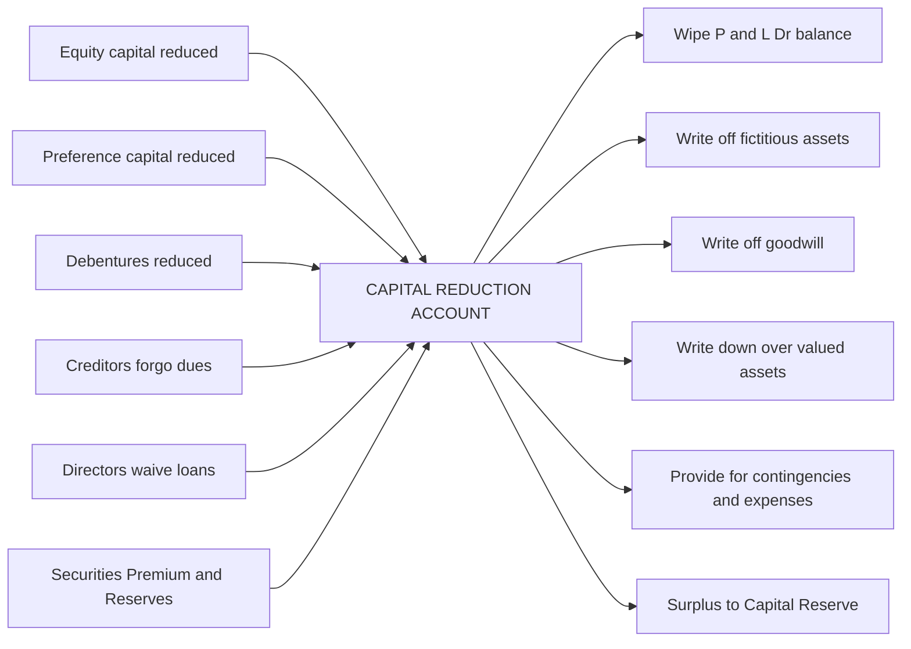
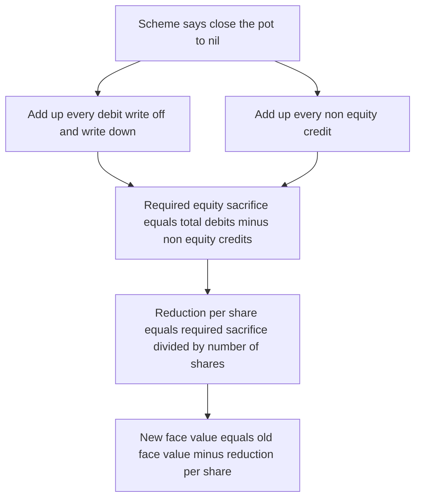
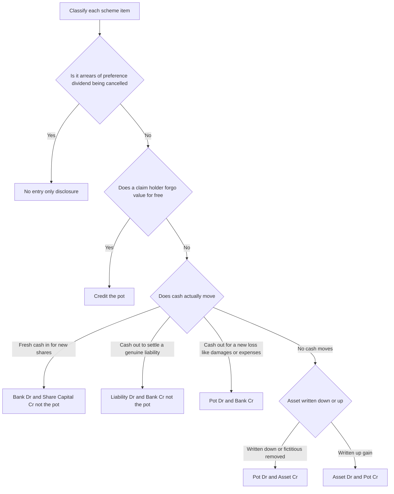
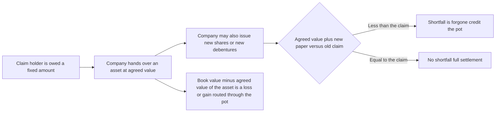

<!-- v2-deep -->

# Chapter 40 — Internal Reconstruction

## 1. The Problem

Imagine a company, **Rustbelt Engineering Ltd**, that had a great decade in the 2010s. It raised ₹10,00,000 by issuing 1,00,000 equity shares of ₹10 each, bought machinery, built a brand. Then came a brutal stretch: three recessions, a technology it bet on that never took off, a big customer that defaulted. The Profit & Loss Account, instead of showing accumulated profits on the liabilities side, now shows a **debit balance of ₹6,00,000** — accumulated *losses*.

Look at what that does to the Balance Sheet:

| Liabilities | ₹ | Assets | ₹ |
|---|---|---|---|
| Share Capital (1,00,000 × ₹10) | 10,00,000 | Machinery | 7,00,000 |
| 10% Debentures | 3,00,000 | Stock | 2,00,000 |
| Creditors | 2,00,000 | Debtors | 1,00,000 |
| | | Bank | 2,00,000 |
| | | Profit & Loss A/c (Dr.) | 3,00,000 |
| **Total** | **15,00,000** | **Total** | **15,00,000** |

That ₹3,00,000 sitting on the **assets side** is not an asset. It is a hole. It is money the shareholders put in that has evaporated. The machinery shown at ₹7,00,000 is probably worth ₹4,50,000 in reality — obsolete plant nobody would pay book value for. The stock includes ₹40,000 of unsellable items. The debtors include ₹30,000 that will never pay.

Now the company faces a wall of related problems:

1. **It cannot pay a dividend.** Under the law, dividends come only out of profits. As long as that ₹3,00,000 debit balance exists, every rupee of *future* profit first goes to fill the old hole before a single paisa can be distributed. A shareholder who buys in today is effectively paying off losses that happened years ago. So nobody wants the share, and the price collapses.

2. **The Balance Sheet lies.** The share capital says "₹10,00,000 of value backs this company." The assets say otherwise. Anyone reading these accounts — a bank considering a loan, a supplier considering credit — is being shown fiction.

3. **The share is "over-capitalised."** The company earns, say, ₹80,000 a year. On a capital base of ₹10,00,000 that is an 8% return that *looks* mediocre and is actually worse because the capital base itself is inflated. The face value ₹10 share might have a real worth of ₹4.

4. **Debentureholders and creditors are nervous.** The interest and repayments are getting harder to service. If they push, the company goes to liquidation — and in liquidation everyone typically recovers *less* than if the business kept running.

The obvious "solution" is liquidation: wind up, sell the assets, pay whoever you can, close the doors. But that destroys the *going concern* — the brand, the trained workforce, the customer relationships, the order book — all of which are worth far more alive than dead. **Everyone loses in a liquidation.**

So the real problem is this: **How do we surgically fix a broken balance sheet — wipe out the accumulated losses, write the assets down to honest values, give the shareholders a realistic (smaller) capital figure — WITHOUT killing the company and WITHOUT bringing in a brand-new owner?**

That surgery is called **Internal Reconstruction**.

**A finer statement of the goal.** Reconstruction is not merely "reduce capital." It is *re-align the two sides of the equation to reality simultaneously*: on the assets side, strike out everything that is fictitious or over-stated; on the claims side, shrink the claims of those who agree to bear the pain, in a negotiated order of priority (equity first, then preference, then lenders and creditors). The exam almost always frames the scheme as a **negotiated compromise** already agreed among the parties and (where Section 66 applies) sanctioned by the Tribunal — your job is to *record* it, not to design it. Recognising this saves time: you never have to argue whether a sacrifice is "fair," only where each rupee lands.

---

## 2. The Core Idea (Analogy)

Think of a company as a person carrying a mortgage.

You bought a house for ₹1 crore with your savings (equity) plus a bank loan. The house's market value has crashed to ₹60 lakh, but your loan and your original "I paid ₹1 crore" story haven't changed. On paper you look wealthy; in reality you're underwater. You can't sell, can't refinance, can't move — the paper value paralyses you.

**Internal reconstruction is a debt-and-equity "haircut" agreed among everyone with a stake in you, so that the paper matches reality and life can restart.**

- You (the shareholder) accept that your ₹1 crore of equity is really worth ₹40 lakh. You *voluntarily mark down your own claim*. This releases value.
- The bank (creditor/debentureholder), rather than force a sale that recovers ₹60 lakh and destroys your earning power, agrees to convert part of its loan to a smaller claim, or accept partial repayment, because a *living you* servicing a realistic loan is worth more than a *bankrupt you*.
- Everyone signs, and the newly-honest balance sheet is the fresh start.

Crucially — and this is the word that names the whole chapter — **the person does not change**. It is the *same you*, same job, same house, just with the numbers rewritten. Contrast this with **external reconstruction** (next chapter's cousin, amalgamation), where a *new* legal person (a new company) is formed to take over the old one. Here there is **no new company** — the reorganisation happens *inside* the existing entity. Hence **internal**.

**Why the order of sacrifice matters (equity bleeds first).** In the analogy the *owner* accepts the deepest cut before the lender is asked to. That is not politeness; it mirrors the law of priority on winding up. If the business were liquidated tomorrow, creditors and debentureholders would be paid *before* shareholders see anything. So in a reconstruction it would be unjust — and the Tribunal would refuse to sanction it — to slash a creditor's claim while leaving equity untouched. Equity, being last in the queue, must absorb loss first; preference next; secured lenders and creditors only to the extent still necessary. When you read a scheme, sanity-check it against this hierarchy: if the equity sacrifice looks tiny relative to a big creditor haircut, re-read — you have probably misallocated a figure.

The single most important sentence in this chapter:

> **The sacrifices made by shareholders, debentureholders and creditors are collected into ONE pot — the Capital Reduction / Reconstruction Account — and that pot is then used to pay for writing off the accumulated losses and the overvaluation of assets.**

Every entry you will ever write in a reconstruction problem is either **pouring a sacrifice INTO that pot** or **spending the pot ON a loss**. If you hold that one image, you cannot get lost.

---

## 3. Why It's Built This Way

### Why the law demands protection when capital is reduced

Reducing share capital sounds like an internal family matter — the shareholders own the company, if they want to say their shares are worth less, who cares? But there is an outside party who very much cares: **the creditors**.

Share capital, in company law, is a **buffer for creditors**. The whole bargain of limited liability is: "Shareholders' personal assets are safe; in exchange, the capital they put into the company stays locked in as a cushion. Creditors get paid before shareholders ever take money out." The stated share capital is a *promise to creditors* that this much value was contributed and won't be casually handed back.

If a company could freely reduce capital, it could do this: reduce capital from ₹10,00,000 to ₹4,00,000 and **pay ₹6,00,000 back to shareholders**, leaving creditors with a hollowed-out shell. That is theft from creditors dressed up as accounting.

So the law (**Section 66 of the Companies Act, 2013**) says: capital reduction that returns capital or reduces liability on shares is a serious act requiring:
- a **special resolution** (75% of shareholders must agree — the majority can't rob the minority silently), and
- **confirmation by the Tribunal (NCLT)**, which must protect creditors (creditors get to object; the company must secure or settle their claims).

But — and this is the elegant part — **when the reduction merely writes off losses that are already gone** (no cash goes out, no asset leaves), the creditors' cushion isn't being *removed*; it was *already destroyed by the losses*. The reduction just makes the paper admit it. In such cases the Tribunal process is lighter and creditor consent is a formality, because nobody is being harmed. This is why *loss-write-off reconstructions* (the vast majority of exam problems) are relatively clean.

### Why "alteration of capital" is different and easy

Section 66 (reduction) is heavy because it *destroys* claims. But some capital changes don't destroy anything — they just *rearrange*. Splitting one ₹10 share into ten ₹1 shares, or bundling ten ₹10 shares into one ₹100 share, changes the *packaging* but not the *total*. Consolidating, sub-dividing, converting shares into stock, cancelling *unissued* shares — none of these touch a creditor's cushion. So the law (**Section 61**) lets a company do them with just an **ordinary resolution** (if the Articles authorise) and **no Tribunal**. Cheap and fast. We'll see the boundary carefully in Part 4.

### Why we invented the Capital Reduction Account

When shareholders agree to reduce ₹10 shares to ₹4 shares, ₹6 per share is "released." Where does it go? It can't vanish into thin air — double entry doesn't allow that. It must land somewhere. We *could* dump each sacrifice straight against each loss, but with a dozen sacrifices and a dozen write-offs that becomes an unauditable tangle.

So accountants created a **clearing account** — the **Capital Reduction Account** (also called **Reconstruction Account** or **Capital Reorganisation Account**). Every sacrifice is *credited* to it (value flowing in); every write-off is *debited* to it (value flowing out). At the end it should ideally be **zero** — every rupee sacrificed exactly consumed by a loss written off. If a *credit balance* remains (sacrifices exceeded losses), that surplus is a **capital reserve** (it arose from a capital transaction, not trading, so it can't be a distributable profit). This account is the mechanical heart of the whole chapter.

### Why the surplus is a *Capital* Reserve and not distributable profit

Students often ask: if the pot has a leftover credit, why can't the company just pay it out as dividend? Because the surplus did not arise from *earning* anything — no goods were sold, no service rendered. It arose because shareholders and lenders *gave up* claims. Distributing it would let shareholders take back, as "dividend," the very value the scheme said was destroyed — re-opening the fiction the reconstruction was meant to close, and short-changing creditors again. So the surplus is quarantined as **Capital Reserve**: usable to absorb *future* capital losses, to issue **fully paid bonus shares** (a permitted use of a reserve created by such schemes, unless the scheme forbids it), or to write down assets, but **never for cash dividend**. This "capital receipt cannot become distributable income" logic is the same principle behind securities premium and profit prior to incorporation.

### Why an upward revaluation is *allowed* to help absorb losses

It looks like a violation of prudence to write an asset *up* (recognise a gain) and use that gain to wipe losses. Two things justify it inside a sanctioned scheme. First, the whole exercise is a **one-time re-statement to fair values**, not routine accounting — the scheme (and Tribunal) sanction bringing *all* assets to honest values, up as well as down. Second, the gain is not routed through the current Profit & Loss Account (which would inflate distributable profit); it is credited to the **Capital Reduction Account**, a capital account, so it can only offset *capital* losses and can never leak into dividend. The caveat for the exam: only revalue upward **to the extent the scheme explicitly states an agreed higher value** — never invent an upward revaluation to plug a shortfall.

### Why the phrase "lost or unrepresented by available assets" matters

Section 66's workhorse clause lets a company cancel paid-up capital that is "**lost or unrepresented by available assets**." The phrase is precise. "Lost" covers the accumulated P&L debit balance and fictitious assets (value spent and gone). "Unrepresented by available assets" covers **over-valuation** — capital that is notionally there on paper but not backed by a real asset of that value. Both are the *same disease* (paper claims exceeding real value) and both are cured the same way: reduce the paper claim, debit the pot for the shortfall. Knowing this phrase earns theory marks and tells you *what is legitimately written off* — you cannot use Section 66 to write off a genuinely valuable asset just to create a reserve.

---

## 4. Full Technical Content

### 4A. The two legal routes to change capital


*Figure 1 — The decision that determines whether the heavy or light legal machinery applies.*

#### Section 61 — Alteration of Share Capital (the light route)

A limited company with share capital, if authorised by its **Articles**, may by **ordinary resolution** in general meeting:

| Type of alteration | What it means | Total capital changes? |
|---|---|---|
| **Increase** | Issue fresh (authorised) capital | Yes, increases |
| **Consolidation** | Combine shares into larger denomination (10 shares of ₹10 → 1 share of ₹100). *If it changes voting %, needs Tribunal.* | No |
| **Sub-division** | Split shares into smaller denomination (1 share of ₹10 → 10 shares of ₹1) | No |
| **Conversion** into stock / stock back into shares | Fully-paid shares → stock (rarely tested now) | No |
| **Cancellation** of *unissued* shares (diminution) | Cancel shares never taken up | No (this is NOT a reduction under Sec 66) |

**Key trap:** cancellation of **un-issued** capital is *alteration* (Sec 61) — no Tribunal. Cancellation of **issued, paid-up** capital is *reduction* (Sec 66) — Tribunal required. The word "cancel" appears in both; the difference is whether real contributed value is being wiped.

**A finer point on sub-division and paid-up proportion.** When you sub-divide, the *proportion paid-up must remain the same*. If a ₹10 share with ₹8 paid is split into ten ₹1 shares, each ₹1 share must be ₹0.80 paid — you cannot use sub-division to conjure fully-paid shares from partly-paid ones. In reconstruction problems the shares are almost always fully paid, so this rarely bites, but it is a favourite one-liner theory point.

#### Section 66 — Reduction of Share Capital (the heavy route)

Subject to Tribunal confirmation and special resolution, a company may reduce capital in any way, in particular:

1. **Extinguish or reduce liability on unpaid capital.** (E.g., a ₹10 share with ₹6 called and ₹4 uncalled → make it a ₹6 share; the shareholder is released from the ₹4 future obligation.)
2. **Cancel paid-up capital that is lost or unrepresented by assets.** *This is the reconstruction workhorse* — writing off losses. E.g., ₹10 fully-paid share where ₹4 is lost → reduce to a ₹6 fully-paid share. No cash moves.
3. **Pay off paid-up capital surplus to the company's needs.** (Return cash to shareholders — genuine capital return. Rare in reconstruction, heavy creditor protection.)

Note that only route (3) — and, to a degree, route (1) where uncalled money is being written off — actually *touches* the creditors' cushion; route (2) merely admits a loss already suffered. That is why exam schemes lean almost entirely on route (2): it is the least legally fraught.

### 4B. The Reconstruction toolkit — every lever available

A reconstruction scheme is a *menu* of sacrifices, chosen and combined by negotiation. Learn each lever as: **who sacrifices → what the entry is → where the value lands (the pot).**

**Lever 1 — Reduction of equity share capital (the main sacrifice)**

Shareholders reduce the face value of their shares. Say 1,00,000 shares of ₹10 reduced to ₹4 each → ₹6 × 1,00,000 = ₹6,00,000 released into the pot.

```
Equity Share Capital A/c (₹10)      Dr.   10,00,000
   To Equity Share Capital A/c (₹4)              4,00,000
   To Capital Reduction A/c                       6,00,000
```
*(Often written directly as: Equity Share Capital A/c Dr. 6,00,000 / To Capital Reduction A/c 6,00,000 — the "old share cancelled, new share issued" is implicit.)*

**Lever 2 — Reduction of preference share capital**

Same mechanism for preference shares. Preference shareholders may also give up **arrears of dividend** (dividends unpaid because of losses). Arrears of preference dividend are **not a liability in the books** (dividends aren't a liability until declared) — they are a *contingent* claim disclosed by way of note. So *forgoing arrears* usually needs **no journal entry**; it is simply disclosed as no longer payable. (Watch this trap — see Part 8.)

*Sometimes the scheme sweetens the preference deal* — e.g., raise the dividend rate, or give preference holders a right to arrears in the form of fresh equity. If arrears are *satisfied by issuing shares*, that IS an entry (the contingent claim is being converted into real capital). Read whether arrears are "cancelled/waived" (no entry) or "satisfied/discharged by issue of shares" (entry).

**Lever 3 — Debentureholders' sacrifice**

Debentureholders may (a) reduce the rate of interest, (b) accept a reduction in the principal, or (c) convert debentures into equity/new debentures. A reduction in the debenture *principal* releases value into the pot:

```
10% Debentures A/c        Dr.   (amount reduced)
   To Capital Reduction A/c
```

Contrast with **accrued/outstanding debenture interest**, which — unlike preference-dividend arrears — *is* a real liability already booked (interest on debt accrues by contract, whether or not paid). So forgoing accrued debenture interest **is** a journal entry (Interest Accrued A/c Dr. → Capital Reduction A/c). This asymmetry between debenture interest (a debt) and preference dividend (not a debt until declared) is a classic distinguishing question.

**Lever 4 — Creditors' sacrifice**

Trade creditors may accept less than full settlement, or take shares/cash in part settlement.

```
Sundry Creditors A/c      Dr.   (amount forgiven)
   To Capital Reduction A/c
```

**Lever 5 — Directors / others forgoing loans**

Directors often waive loans they gave the company, or refund fees. Straight into the pot:

```
Directors' Loan A/c       Dr.
   To Capital Reduction A/c
```

**Lever 6 — Fresh cash brought in**

Reconstruction usually needs *new money* too (to pay contingent liabilities, reconstruction expenses, or fund working capital). Existing shareholders may subscribe to new shares, or preference shareholders may pay cash to gain priority. This is **not** a sacrifice into the pot — it is ordinary share issue / bank inflow.

```
Bank A/c                  Dr.
   To Equity Share Capital A/c   (or Preference Share Capital)
```

**Lever 7 — Utilising Securities Premium and Capital Reserve**

Any existing **Securities Premium** or **Capital Reserve** balances can also be applied to write off losses (a form of "found value"). They are transferred to the pot (or used directly).

**Lever 8 — Settlement of a claim by handing over an asset**

A debentureholder or creditor may agree to *take an asset* (an investment, a piece of land, part of the plant) in part or full settlement of their claim. Three things happen at once and each must be recorded: (i) the **asset leaves** the books at its **book value**; (ii) any **difference between book value and the agreed transfer value** is a loss or gain routed through the pot; (iii) any **shortfall of agreed value below the claim** is a sacrifice by the claimholder (credit the pot), while any excess would be paid out. Lever 8 is where weaker students lose marks; Example 5 drills it.

**Lever 9 — Conversion of a liability into shares or new securities**

A liability (creditors, a director's loan, old debentures) may be *converted* into equity or fresh debentures. The liability is debited; Share Capital / new Debentures is credited at nominal value. Only the *un-converted, forgone* portion (if any) hits the pot. Converting is **not** a sacrifice by itself — it swaps one claim for another.

### 4C. What the pot is spent on (the debits)

The credit side of the Capital Reduction Account is the sum of sacrifices. The **debit side** consumes it:

- Writing off the **debit balance of Profit & Loss Account** (accumulated losses).
- Writing off **fictitious assets**: Preliminary expenses, Discount on issue of shares/debentures, Underwriting commission, deferred advertising — assets with no realisable value.
- Writing off **Goodwill** (if it is to be eliminated).
- Writing down **over-valued tangible assets** to fair value (machinery, stock, debtors' provision, patents).
- Providing for **contingent liabilities that crystallise** (a pending lawsuit that must now be paid) and reconstruction **expenses**.
- Recognising the **loss on an asset handed to a claimholder** below book value (Lever 8).


*Figure 2 — Sacrifices flow IN as credits, write-offs flow OUT as debits; any leftover credit becomes Capital Reserve.*

### 4D. The golden checks

1. **The Capital Reduction Account must close** — either to nil or with a credit balance (→ Capital Reserve). A **debit balance is impossible/wrong**: it would mean losses exceeded the value everyone sacrificed, so the scheme as drafted doesn't work. If you get a debit balance, you have made an error (or the scheme is genuinely insufficient — re-read the problem).
2. **After all entries, the revised Balance Sheet MUST balance.** This is your self-verification. If it doesn't, a sacrifice or write-off is mis-posted.
3. **Cash only moves where cash is stated to move.** Reductions of face value, debenture principal, creditor haircuts — these are *book entries*, no bank movement. Only fresh issue, actual payment of a crystallised liability, and reconstruction expenses touch Bank.
4. **Bank can never go negative.** After all cash movements, tot up the Bank. If it is negative, either the scheme provides fresh cash you forgot to bring in first, or you have paid something that was meant to be a book entry. A negative bank is a red flag that a cash item is mis-classified.

### 4E. Order of solving (a reliable procedure)

1. Read the scheme; list every sacrifice (credits to pot) and every write-off/write-down (debits to pot).
2. Pass the **capital alteration** entries (sub-division/consolidation) first if any.
3. Pass each **sacrifice** entry (credit Capital Reduction).
4. Pass any **fresh cash** entry (Bank).
5. Pass each **write-off / write-down** entry (debit Capital Reduction).
6. Balance the **Capital Reduction Account**; transfer surplus to Capital Reserve.
7. Prepare the **revised Balance Sheet** (Schedule III format) and confirm it balances.

### 4F. Reverse-engineering the reduction (the "close the pot to nil" device)

A very common exam twist gives you *every* write-off and *every* other sacrifice, then says: *"Equity shares are to be reduced by such an amount that the Capital Reduction Account is exactly closed"* (or "so that no capital reserve arises"). You must **work backwards** to find the required reduction per share. The logic is pure arithmetic on the pot:

> **Required equity sacrifice = (Total debits to the pot) − (All non-equity credits to the pot)**
>
> **Reduction per share = Required equity sacrifice ÷ Number of equity shares**

Because the pot must close to nil, total credits (equity sacrifice + everything else) must equal total debits. Solve for the one unknown — the equity sacrifice. If the resulting per-share figure isn't a clean number, re-check your debits and credits; examiners engineer clean numbers. Example 4 walks this through end-to-end.


*Figure 3 — Solving for the unknown reduction when the scheme demands the pot close to nil.*

### 4G. How to classify any scheme item in seconds

Every line of a scheme is exactly one of five things. This decision tree is worth internalising — it converts a wordy scheme into journal entries mechanically.


*Figure 4 — A single item is always a pot credit a pot debit a pure cash entry or no entry.*

### 4H. Surrender of shares — an alternative mechanism

Instead of *reducing the face value* of every share, some schemes ask shareholders to **surrender a portion of their shares** to the company, which then **re-issues** those surrendered shares to creditors or debentureholders in satisfaction of their claims, and **cancels** whatever remains unissued. Mechanically:

- Shareholders surrender, say, 30% of holdings → **Share Capital A/c Dr. / To Shares Surrendered A/c** (a temporary holding account).
- Surrendered shares re-issued to a creditor in settlement → **Shares Surrendered A/c Dr. / To relevant Creditor/Liability A/c** (the liability is discharged by giving shares).
- Any surrendered shares left over and cancelled → **Shares Surrendered A/c Dr. / To Capital Reduction A/c** (this cancelled bit is the genuine reduction).

Notice the *net* effect is the same family of ideas — a portion of equity is ultimately extinguished and lands in the pot — but the presentation differs. Surrender is less common at Inter level than face-value reduction; recognise it so a worded question doesn't throw you.

### 4I. Tricky individual items — quick rulings

| Item in the scheme | Correct treatment |
|---|---|
| **Arrears of preference dividend** cancelled/waived | No entry; disclosure only (not a liability until declared). |
| Arrears **satisfied by issue of shares** | Entry: create the shares (Share Capital credited); the "cost" is met by the parties, not the pot, unless the scheme says forgone. |
| **Accrued debenture interest** forgone | Entry: Interest Accrued A/c Dr. → Pot (it *is* a booked liability). |
| **Provision for doubtful debts** created | Pot Dr. → Provision for Doubtful Debts A/c; shown as a deduction from Debtors on the assets side. |
| **Bank overdraft** | A current liability; bring in fresh cash *first*, then clear it. Not a sacrifice unless the bank forgoes part. |
| **Contingent liability that crystallises** (damages, tax demand now payable) | A new loss: Pot Dr. → Bank (if paid) or → Provision/Liability (if only provided). |
| **Contingent liability that does NOT crystallise** | No entry; still just a note. |
| **Reconstruction / scheme expenses** paid | A new loss consuming value: Pot Dr. → Bank. |
| **Existing Capital Reserve / Securities Premium / General Reserve** | Available "found value"; transfer to the pot to help absorb losses. |
| **Asset taken over by a claimholder** below book value | Remove asset at book value; loss (book − agreed) → Pot Dr.; shortfall of agreed value vs claim → claimholder's sacrifice (Pot Cr.). |
| **Upward revaluation** stated in scheme | Asset Dr. → Pot Cr. (gain absorbs losses); only to the exact figure stated. |


*Figure 5 — Settling a claim by handing over an asset touches the pot twice on the asset gain or loss and on any shortfall forgone.*

---

## 5. Worked Examples

### Example 1 — The clean loss-write-off (easy)

**Facts.** Alpha Ltd's Balance Sheet:

| Liabilities | ₹ | Assets | ₹ |
|---|---|---|---|
| 40,000 Equity shares of ₹10 | 4,00,000 | Goodwill | 50,000 |
| Sundry Creditors | 1,00,000 | Machinery | 2,60,000 |
| | | Stock | 90,000 |
| | | Debtors | 40,000 |
| | | Bank | 10,000 |
| | | Profit & Loss A/c (Dr.) | 50,000 |
| **Total** | **5,00,000** | **Total** | **5,00,000** |

**Scheme.** Each ₹10 share is reduced to a ₹6 fully-paid share. The amount released is used to write off Goodwill (₹50,000) and the P&L debit balance (₹50,000).

**Step 1 — The sacrifice.** 40,000 shares × ₹4 released = **₹1,60,000** into the pot.

```
Equity Share Capital A/c    Dr.   1,60,000
   To Capital Reduction A/c            1,60,000
```

**Step 2 — Spend the pot.**

```
Capital Reduction A/c       Dr.   1,00,000
   To Goodwill A/c                       50,000
   To Profit & Loss A/c                  50,000
```

**Step 3 — Balance the pot.**

| Capital Reduction A/c | ₹ | | ₹ |
|---|---|---|---|
| To Goodwill | 50,000 | By Equity Share Capital | 1,60,000 |
| To Profit & Loss A/c | 50,000 | | |
| To **Capital Reserve** (bal.) | 60,000 | | |
| | **1,60,000** | | **1,60,000** |

Sacrifice (₹1,60,000) exceeded losses (₹1,00,000), leaving **₹60,000 surplus → Capital Reserve**.

**Step 4 — Revised Balance Sheet.**

| Equity & Liabilities | ₹ | Assets | ₹ |
|---|---|---|---|
| 40,000 Equity shares of ₹6 | 2,40,000 | Machinery | 2,60,000 |
| Capital Reserve | 60,000 | Stock | 90,000 |
| Sundry Creditors | 1,00,000 | Debtors | 40,000 |
| | | Bank | 10,000 |
| **Total** | **4,00,000** | **Total** | **4,00,000** |

Goodwill and P&L gone; Balance Sheet balances at ₹4,00,000. **Reconciles.**

**Examiner tweak — "what if the scheme said reduce to ₹5, not ₹6?"** Then sacrifice = ₹5 × 40,000 = ₹2,00,000; losses still ₹1,00,000; surplus = ₹1,00,000 to Capital Reserve; equity now 40,000 × ₹5 = ₹2,00,000. Balance Sheet still balances at ₹4,00,000 (₹2,00,000 + ₹1,00,000 + ₹1,00,000). The *deeper* the cut, the *larger* the Capital Reserve — a useful sanity relationship.

---

### Example 2 — Sub-division, multiple sacrifices, fresh cash (moderate)

**Facts.** Beta Ltd's Balance Sheet as at 31 March 2026:

| Liabilities | ₹ | Assets | ₹ |
|---|---|---|---|
| 50,000 Equity shares of ₹10 | 5,00,000 | Goodwill | 40,000 |
| 8% Preference shares (2,000 of ₹100) | 2,00,000 | Land & Building | 3,00,000 |
| 10% Debentures | 2,00,000 | Plant & Machinery | 3,10,000 |
| Sundry Creditors | 1,50,000 | Stock | 1,20,000 |
| Bank Overdraft | 50,000 | Debtors | 90,000 |
| | | Preliminary Expenses | 20,000 |
| | | Profit & Loss A/c (Dr.) | 2,20,000 |
| **Total** | **11,00,000** | **Total** | **11,00,000** |

**Scheme.**
(a) Each equity share of ₹10 is **sub-divided** into shares of ₹5, then **each share reduced to ₹2** (i.e., ₹5 → ₹2). *(This is a common two-step: repackage, then reduce.)*
(b) 8% Preference shares to be reduced to ₹80 per share (₹100 → ₹80). Arrears of preference dividend of ₹32,000 (2 years) to be cancelled.
(c) Debentureholders agree to reduce their claim by ₹40,000.
(d) Creditors agree to forgo 20% of their claim.
(e) Equity shareholders bring in fresh cash of ₹1,00,000 (issued as new ₹2 shares) to clear the bank overdraft and provide working capital.
(f) Goodwill and Preliminary Expenses to be written off; Plant & Machinery revalued at ₹2,50,000; Stock at ₹1,00,000; a provision of ₹10,000 for doubtful debtors; balance of P&L written off. Any surplus/deficit adjusted through Capital Reduction Account.

**Step 1 — Alteration (sub-division).** 50,000 shares of ₹10 → 1,00,000 shares of ₹5. No value change, memorandum entry / capital account re-denominated. Total still ₹5,00,000.

**Step 2 — Sacrifices into the pot.**

Equity reduction: ₹5 → ₹2 on 1,00,000 shares = ₹3 × 1,00,000 = **₹3,00,000**.
```
Equity Share Capital A/c    Dr.   3,00,000
   To Capital Reduction A/c            3,00,000
```

Preference reduction: ₹100 → ₹80 on 2,000 shares = ₹20 × 2,000 = **₹40,000**.
```
8% Preference Share Capital A/c  Dr.   40,000
   To Capital Reduction A/c                 40,000
```

Arrears of preference dividend ₹32,000 — **NOT in the books** (contingent), so **no entry**; disclosed as cancelled. *(Trap!)*

Debentures reduced by ₹40,000:
```
10% Debentures A/c          Dr.   40,000
   To Capital Reduction A/c            40,000
```

Creditors forgo 20% of ₹1,50,000 = ₹30,000:
```
Sundry Creditors A/c        Dr.   30,000
   To Capital Reduction A/c            30,000
```

**Total sacrifices into pot = 3,00,000 + 40,000 + 40,000 + 30,000 = ₹4,10,000.**

**Step 3 — Fresh cash (not a sacrifice).**
```
Bank A/c                    Dr.   1,00,000
   To Equity Share Capital A/c (50,000 shares of ₹2)   1,00,000
```
Then clear the overdraft:
```
Bank Overdraft A/c          Dr.   50,000
   To Bank A/c                          50,000
```
*(Bank now holds ₹1,00,000 − ₹50,000 = ₹50,000 net inflow.)*

**Step 4 — Write-offs / write-downs (debit the pot).**

| Item | Amount ₹ |
|---|---|
| Goodwill written off | 40,000 |
| Preliminary Expenses written off | 20,000 |
| Plant & Machinery down (3,10,000 → 2,50,000) | 60,000 |
| Stock down (1,20,000 → 1,00,000) | 20,000 |
| Provision for doubtful debtors | 10,000 |
| Profit & Loss A/c (Dr. balance) written off | 2,20,000 |
| **Total write-offs** | **3,70,000** |

```
Capital Reduction A/c       Dr.   3,70,000
   To Goodwill A/c                       40,000
   To Preliminary Expenses A/c           20,000
   To Plant & Machinery A/c              60,000
   To Stock A/c                          20,000
   To Provision for Doubtful Debts A/c   10,000
   To Profit & Loss A/c                2,20,000
```

**Step 5 — Balance the pot.**

| Capital Reduction A/c | ₹ | | ₹ |
|---|---|---|---|
| To Goodwill | 40,000 | By Equity Share Capital | 3,00,000 |
| To Preliminary Expenses | 20,000 | By 8% Pref. Share Capital | 40,000 |
| To Plant & Machinery | 60,000 | By 10% Debentures | 40,000 |
| To Stock | 20,000 | By Sundry Creditors | 30,000 |
| To Provision for D/D | 10,000 | | |
| To Profit & Loss A/c | 2,20,000 | | |
| To **Capital Reserve** (bal.) | 40,000 | | |
| | **4,10,000** | | **4,10,000** |

Sacrifice ₹4,10,000 − write-offs ₹3,70,000 = **₹40,000 → Capital Reserve.**

**Step 6 — Revised Balance Sheet as at 31 March 2026.**

*Share capital working:* Equity = 1,00,000 old shares of ₹2 (₹2,00,000) + 50,000 new shares of ₹2 (₹1,00,000) = **1,50,000 shares of ₹2 = ₹3,00,000**. Preference = 2,000 × ₹80 = ₹1,60,000.

| Equity & Liabilities | ₹ | Assets | ₹ |
|---|---|---|---|
| 1,50,000 Equity shares of ₹2 | 3,00,000 | Land & Building | 3,00,000 |
| 2,000 8% Pref. shares of ₹80 | 1,60,000 | Plant & Machinery | 2,50,000 |
| Capital Reserve | 40,000 | Stock | 1,00,000 |
| 10% Debentures (2,00,000 − 40,000) | 1,60,000 | Debtors 90,000 − 10,000 | 80,000 |
| Sundry Creditors (1,50,000 − 30,000) | 1,20,000 | Bank | 50,000 |
| **Total** | **7,80,000** | **Total** | **7,80,000** |

**Both sides ₹7,80,000. Reconciles.** Note the arrears of ₹32,000 never appeared — correct.

**Examiner tweak — "what if the bank refuses to lend the overdraft any longer *and* no fresh cash comes in?"** Then the ₹50,000 overdraft cannot be cleared and working capital is missing — the scheme is under-funded. The examiner is testing whether you realise a reconstruction that leaves the company cash-starved is not viable; the answer would flag that fresh cash of at least the overdraft is essential. This is why item (e) exists.

---

### Example 3 — Exam-hard: contingent liability crystallising, reconstruction expenses, everything at once

**Facts.** Gamma Ltd, Balance Sheet as at 31 March 2026:

| Liabilities | ₹ | Assets | ₹ |
|---|---|---|---|
| 1,00,000 Equity shares of ₹10 | 10,00,000 | Goodwill | 1,00,000 |
| 6,000 7% Pref. shares of ₹100 | 6,00,000 | Patents | 80,000 |
| 9% Debentures | 4,00,000 | Freehold Land | 3,00,000 |
| Interest accrued on debentures | 36,000 | Plant & Machinery | 6,00,000 |
| Sundry Creditors | 3,00,000 | Stock | 2,40,000 |
| Director's Loan | 1,00,000 | Debtors | 2,60,000 |
| | | Cash at Bank | 20,000 |
| | | Preliminary Expenses | 36,000 |
| | | Profit & Loss A/c (Dr.) | 8,00,000 |
| **Total** | **24,36,000** | **Total** | **24,36,000** |

**Scheme (sanctioned by the Tribunal).**
1. Equity shares reduced to ₹2 each, then **consolidated** into shares of ₹10 (i.e., 5 shares of ₹2 → 1 share of ₹10). *(Reduce first, then re-bundle.)*
2. 7% Preference shares reduced to ₹60 each. Arrears of preference dividend of ₹84,000 (2 years) to be cancelled.
3. Debentureholders agree to: forgo the accrued interest of ₹36,000, and reduce their principal by ₹1,00,000; in return the debenture rate stays 9%.
4. The Director agrees to forgo 50% of his loan; the remaining 50% is converted into equity shares of ₹10.
5. Sundry Creditors of ₹3,00,000: one creditor for ₹80,000 agrees to accept ₹60,000 in full settlement (paid in cash); the rest (₹2,20,000) agree to forgo 10% of their balances.
6. Equity shareholders subscribe **fresh cash of ₹1,50,000** for 15,000 new equity shares of ₹10 each (working capital and to fund the payments below).
7. A contingent liability for a damages suit, ₹50,000, has materialised and must be paid in cash.
8. Reconstruction expenses of ₹14,000 paid in cash.
9. Assets to be revalued: Patents — nil; Freehold Land **up** to ₹4,00,000; Plant & Machinery down to ₹4,50,000; Stock down to ₹2,00,000; a provision of 5% on remaining Debtors.
10. Goodwill, Preliminary Expenses and the P&L balance to be written off. Any **surplus** in the Capital Reduction Account is to be used to write down Plant & Machinery further (so the pot closes to nil).

*(Item 10's last clause is a classic device: the examiner engineers a surplus that must be absorbed, so you must compute it and apply it. We honour it. Note the revaluation of Land **upward** — a gain that flows INTO the pot.)*

---

**Step 0 — The strategy.** Collect every sacrifice as a credit to the pot; record cash movements; collect every write-off as a debit; the leftover credit (surplus) is directed by item 10 onto Plant; confirm the pot closes to nil; then build the Balance Sheet and prove it balances.

**Step 1 — Sacrifices (credits to the pot).**

*Equity:* ₹10 → ₹2 on 1,00,000 shares = ₹8 × 1,00,000 = **₹8,00,000**.
```
Equity Share Capital A/c    Dr.   8,00,000
   To Capital Reduction A/c            8,00,000
```
Then **consolidate**: 1,00,000 shares of ₹2 (₹2,00,000) → 20,000 shares of ₹10 (₹2,00,000). Repackaging only — no value flows to the pot.

*Preference:* ₹100 → ₹60 on 6,000 = ₹40 × 6,000 = **₹2,40,000**.
```
7% Preference Share Capital A/c  Dr.  2,40,000
   To Capital Reduction A/c                2,40,000
```
Arrears ₹84,000 — **no entry** (contingent), disclosed as cancelled.

*Debentures:* accrued interest ₹36,000 forgone + principal ₹1,00,000 reduced = **₹1,36,000**.
```
9% Debentures A/c            Dr.   1,00,000
Interest Accrued on Debentures A/c  Dr.   36,000
   To Capital Reduction A/c                1,36,000
```

*Director's loan:* 50% of ₹1,00,000 = ₹50,000 forgone (into the pot); the other ₹50,000 converted to equity.
```
Director's Loan A/c         Dr.   1,00,000
   To Capital Reduction A/c              50,000
   To Equity Share Capital A/c (5,000 shares of ₹10)   50,000
```

*Creditors:* The ₹80,000 creditor settled for ₹60,000 cash → **₹20,000** sacrifice. Remaining creditors ₹2,20,000 forgo 10% = **₹22,000** sacrifice.
```
Sundry Creditors A/c        Dr.   80,000
   To Bank A/c                          60,000
   To Capital Reduction A/c             20,000

Sundry Creditors A/c        Dr.   22,000
   To Capital Reduction A/c             22,000
```

*Freehold Land revalued UP* ₹3,00,000 → ₹4,00,000 = **₹1,00,000 gain** — a revaluation gain flows INTO the pot:
```
Freehold Land A/c           Dr.   1,00,000
   To Capital Reduction A/c            1,00,000
```

**Total credits into the pot** = 8,00,000 + 2,40,000 + 1,36,000 + 50,000 + 20,000 + 22,000 + 1,00,000 = **₹13,68,000.**

**Step 2 — Fresh cash (item 6, NOT a sacrifice).**
```
Bank A/c                    Dr.   1,50,000
   To Equity Share Capital A/c (15,000 shares of ₹10)   1,50,000
```

**Step 3 — Cash paid out (items 7 and 8) — these are losses, so they debit the pot.**
Damages ₹50,000 and reconstruction expenses ₹14,000 are new losses consuming value:
```
Capital Reduction A/c       Dr.   64,000
   To Bank A/c                          64,000     (50,000 damages + 14,000 expenses)
```
*(The ₹60,000 cash paid to the creditor in Step 1 is NOT a loss — it settles a real liability — so it never touches the pot; only its ₹20,000 forgiven portion did.)*

**Bank position:** 20,000 (opening) + 1,50,000 (fresh) − 60,000 (creditor) − 50,000 (damages) − 14,000 (expenses) = **₹46,000.** Positive — the fresh cash funds the payments. Good.

**Step 4 — Write-offs / write-downs (debits to the pot).**

| Item | ₹ |
|---|---|
| Goodwill written off | 1,00,000 |
| Patents (80,000 → nil) | 80,000 |
| Plant & Machinery down (6,00,000 → 4,50,000) | 1,50,000 |
| Stock down (2,40,000 → 2,00,000) | 40,000 |
| Provision on Debtors 5% × 2,60,000 | 13,000 |
| Preliminary Expenses | 36,000 |
| Profit & Loss A/c (Dr. balance) | 8,00,000 |
| Damages + reconstruction expenses (Step 3) | 64,000 |
| **Sub-total of debits so far** | **12,83,000** |

**Step 5 — Find the surplus and apply item 10.**

Credits ₹13,68,000 − debits so far ₹12,83,000 = **surplus ₹85,000.** Item 10 directs this surplus onto Plant & Machinery (a further write-down):
```
Capital Reduction A/c       Dr.   85,000
   To Plant & Machinery A/c            85,000
```
Plant now carried at ₹4,50,000 − ₹85,000 = **₹3,65,000.** Total debits = 12,83,000 + 85,000 = ₹13,68,000 = total credits → **pot closes to nil.**

**Capital Reduction Account:**

| Particulars | ₹ | Particulars | ₹ |
|---|---|---|---|
| To Goodwill | 1,00,000 | By Equity Share Capital | 8,00,000 |
| To Patents | 80,000 | By 7% Pref. Share Capital | 2,40,000 |
| To Plant & Machinery (1,50,000 + 85,000) | 2,35,000 | By 9% Debentures | 1,00,000 |
| To Stock | 40,000 | By Interest Accrued on Debentures | 36,000 |
| To Provision for Doubtful Debts | 13,000 | By Director's Loan | 50,000 |
| To Preliminary Expenses | 36,000 | By Sundry Creditors | 42,000 |
| To Profit & Loss A/c | 8,00,000 | By Freehold Land (revaluation) | 1,00,000 |
| To Bank (damages + expenses) | 64,000 | | |
| | **13,68,000** | | **13,68,000** |

**Pot = nil. Clean close.**

**Step 6 — Revised Balance Sheet as at 31 March 2026.**

*Equity share capital working:*

| Component | ₹ |
|---|---|
| Reduced & consolidated original (20,000 shares of ₹10) | 2,00,000 |
| Director's loan converted (5,000 shares of ₹10) | 50,000 |
| Fresh subscription (15,000 shares of ₹10) | 1,50,000 |
| **Total: 40,000 equity shares of ₹10** | **4,00,000** |

*Other figures:* Preference = 6,000 × ₹60 = ₹3,60,000. Debentures = 4,00,000 − 1,00,000 = ₹3,00,000 (accrued interest nil). Creditors = ₹80,000 settled + remaining ₹2,20,000 less 10% (₹22,000) = ₹1,98,000. Director's loan = nil. Debtors = 2,60,000 − 13,000 = ₹2,47,000. Bank = ₹46,000.

| Equity & Liabilities | ₹ | Assets | ₹ |
|---|---|---|---|
| 40,000 Equity shares of ₹10 | 4,00,000 | Freehold Land | 4,00,000 |
| 6,000 7% Pref. shares of ₹60 | 3,60,000 | Plant & Machinery | 3,65,000 |
| 9% Debentures | 3,00,000 | Stock | 2,00,000 |
| Sundry Creditors | 1,98,000 | Debtors (net of provision) | 2,47,000 |
| | | Cash at Bank | 46,000 |
| **Total** | **12,58,000** | **Total** | **12,58,000** |

**Self-verification.** Liabilities: 4,00,000 + 3,60,000 + 3,00,000 + 1,98,000 = ₹12,58,000. Assets: 4,00,000 + 3,65,000 + 2,00,000 + 2,47,000 + 46,000 = ₹12,58,000. **Both sides ₹12,58,000 — fully reconciles.** Goodwill, Patents, Preliminary Expenses and the P&L debit balance are all gone; the arrears of ₹84,000 correctly never appeared.

*(Author's note on figures: the opening P&L debit balance is taken as ₹8,00,000 so that the opening Balance Sheet itself balances at ₹24,36,000 and the scheme is fully funded. Always tally total sacrifices against total losses BEFORE drafting the Balance Sheet — if losses exceed sacrifices the scheme is under-funded and the examiner expects more sacrifice or fresh capital; never force a balance by inventing a Capital Reserve. Here sacrifices + land gain ₹13,68,000 exactly meet losses ₹13,68,000, with the ₹85,000 surplus over the "fixed" write-offs absorbed by the extra Plant write-down per item 10.)*

---

### Example 4 — Reverse-engineering: find the reduction so the pot closes to nil (moderate–hard)

**Facts.** Delta Ltd, Balance Sheet as at 31 March 2026:

| Liabilities | ₹ | Assets | ₹ |
|---|---|---|---|
| 60,000 Equity shares of ₹10 | 6,00,000 | Goodwill | 60,000 |
| 6% Debentures | 2,00,000 | Freehold Property | 2,50,000 |
| Sundry Creditors | 1,40,000 | Plant & Machinery | 2,00,000 |
| | | Stock | 1,10,000 |
| | | Debtors | 80,000 |
| | | Cash at Bank | 20,000 |
| | | Profit & Loss A/c (Dr.) | 2,20,000 |
| **Total** | **9,40,000** | **Total** | **9,40,000** |

**Scheme.**
(a) Debentureholders forgo **25%** of their principal.
(b) Creditors forgo **10%** of their balances.
(c) Freehold Property is revalued **up** to ₹3,00,000.
(d) The following are to be written off/provided: Goodwill in full; Plant & Machinery down to ₹1,50,000; Stock down to ₹90,000; a provision of **5%** on Debtors; the P&L debit balance in full.
(e) **Equity shares are to be reduced by such an amount that the Capital Reduction Account is exactly closed (no capital reserve arises).** Find the new face value.

**Step 1 — Total the debits (uses of the pot).**

| Debit | ₹ |
|---|---|
| Goodwill | 60,000 |
| Plant & Machinery down (2,00,000 → 1,50,000) | 50,000 |
| Stock down (1,10,000 → 90,000) | 20,000 |
| Provision on Debtors 5% × 80,000 | 4,000 |
| Profit & Loss A/c | 2,20,000 |
| **Total debits** | **3,54,000** |

**Step 2 — Total the *non-equity* credits.**

| Non-equity credit | ₹ |
|---|---|
| Debentures forgone 25% × 2,00,000 | 50,000 |
| Creditors forgone 10% × 1,40,000 | 14,000 |
| Freehold revaluation gain (3,00,000 − 2,50,000) | 50,000 |
| **Total non-equity credits** | **1,14,000** |

**Step 3 — Solve for the equity sacrifice (the unknown).**

Required equity sacrifice = Total debits − Non-equity credits = 3,54,000 − 1,14,000 = **₹2,40,000.**

Reduction per share = 2,40,000 ÷ 60,000 shares = **₹4 per share.** So each ₹10 share is reduced to a **₹6** share.

```
Equity Share Capital A/c    Dr.   2,40,000
   To Capital Reduction A/c            2,40,000
```

**Step 4 — Capital Reduction Account (closes to nil, as designed).**

| Particulars | ₹ | Particulars | ₹ |
|---|---|---|---|
| To Goodwill | 60,000 | By Equity Share Capital | 2,40,000 |
| To Plant & Machinery | 50,000 | By 6% Debentures | 50,000 |
| To Stock | 20,000 | By Sundry Creditors | 14,000 |
| To Provision for Doubtful Debts | 4,000 | By Freehold Property (revaluation) | 50,000 |
| To Profit & Loss A/c | 2,20,000 | | |
| | **3,54,000** | | **3,54,000** |

Pot closes to nil — no Capital Reserve, exactly as item (e) required.

**Step 5 — Revised Balance Sheet.**

| Equity & Liabilities | ₹ | Assets | ₹ |
|---|---|---|---|
| 60,000 Equity shares of ₹6 | 3,60,000 | Freehold Property | 3,00,000 |
| 6% Debentures (2,00,000 − 50,000) | 1,50,000 | Plant & Machinery | 1,50,000 |
| Sundry Creditors (1,40,000 − 14,000) | 1,26,000 | Stock | 90,000 |
| | | Debtors (80,000 − 4,000) | 76,000 |
| | | Cash at Bank | 20,000 |
| **Total** | **6,36,000** | **Total** | **6,36,000** |

**Reconciles at ₹6,36,000.** The whole trick was recognising that "close the pot to nil" makes the equity sacrifice the balancing figure: *equity sacrifice = debits − other credits.*

**Examiner tweak — "what if instead the scheme fixed the reduction at ₹5 and asked what happens?"** Then equity sacrifice = ₹5 × 60,000 = ₹3,00,000; total credits = 3,00,000 + 1,14,000 = ₹4,14,000; debits ₹3,54,000; surplus ₹60,000 → Capital Reserve. So *fixing* the reduction produces a reserve; *asking you to solve* for it produces a nil close. Read which version you are given.

---

### Example 5 — Settlement by handing over an asset, conversion of a claim into shares (exam-hard)

**Facts.** Epsilon Ltd, Balance Sheet as at 31 March 2026:

| Liabilities | ₹ | Assets | ₹ |
|---|---|---|---|
| 40,000 Equity shares of ₹10 | 4,00,000 | Goodwill | 80,000 |
| 12% Debentures | 3,00,000 | Land & Building | 2,00,000 |
| Interest accrued on debentures | 36,000 | Investments (cost) | 1,20,000 |
| Sundry Creditors | 2,00,000 | Plant & Machinery | 1,50,000 |
| | | Stock | 1,20,000 |
| | | Debtors | 90,000 |
| | | Bank | 16,000 |
| | | Profit & Loss A/c (Dr.) | 1,60,000 |
| **Total** | **9,36,000** | **Total** | **9,36,000** |

**Scheme.**
1. Each equity share of ₹10 is reduced to **₹4** each.
2. The **12% Debentureholders** (owed ₹3,00,000 principal + ₹36,000 accrued interest = ₹3,36,000) agree to:
   - take over the **Investments** at an agreed value of **₹1,10,000** (book value ₹1,20,000);
   - accept **₹1,50,000 of new 14% Debentures**;
   - **forgo the balance** of their claim.
3. **Sundry Creditors** of ₹2,00,000: ₹50,000 paid immediately in cash; ₹80,000 converted into equity shares of ₹4 each; the balance forgone.
4. Equity shareholders bring in **fresh cash of ₹1,00,000** for new ₹4 equity shares (working capital and to fund the cash payments).
5. Land & Building revalued **up** to ₹2,50,000.
6. Goodwill written off; Plant & Machinery reduced to ₹1,20,000; Stock reduced to ₹1,00,000; a provision of **10%** on Debtors; P&L debit balance written off.
7. Reconstruction expenses of ₹6,000 paid in cash.
8. Any surplus in the Capital Reduction Account is carried to Capital Reserve.

---

**Step 1 — Equity reduction (credit the pot).** ₹10 → ₹4 on 40,000 shares = ₹6 × 40,000 = **₹2,40,000.**
```
Equity Share Capital A/c    Dr.   2,40,000
   To Capital Reduction A/c            2,40,000
```

**Step 2 — Debenture settlement (Lever 8 in action).**

First, bring the Investments to their agreed value — the ₹10,000 fall (1,20,000 → 1,10,000) is a **loss** into the pot:
```
Capital Reduction A/c       Dr.   10,000
   To Investments A/c                    10,000
```
Now settle the debentureholders. They are owed ₹3,36,000; they take Investments (₹1,10,000) + new 14% Debentures (₹1,50,000) = ₹2,60,000, and **forgo ₹76,000** (credit the pot):
```
12% Debentures A/c              Dr.   3,00,000
Interest Accrued on Debentures A/c  Dr.   36,000
   To Investments A/c                       1,10,000
   To 14% Debentures A/c                     1,50,000
   To Capital Reduction A/c                    76,000
```

**Step 3 — Creditors (partly paid, partly converted, partly forgone).**
₹2,00,000 = ₹50,000 cash + ₹80,000 equity (20,000 shares of ₹4) + ₹70,000 forgone:
```
Sundry Creditors A/c        Dr.   2,00,000
   To Bank A/c                            50,000
   To Equity Share Capital A/c            80,000   (20,000 shares of ₹4)
   To Capital Reduction A/c               70,000
```

**Step 4 — Fresh cash (not a sacrifice).**
```
Bank A/c                    Dr.   1,00,000
   To Equity Share Capital A/c   1,00,000   (25,000 shares of ₹4)
```

**Step 5 — Revaluation gain on Land & Building (credit the pot).** 2,00,000 → 2,50,000 = ₹50,000.
```
Land & Building A/c         Dr.   50,000
   To Capital Reduction A/c            50,000
```

**Step 6 — Reconstruction expenses (a new loss, debit the pot).**
```
Capital Reduction A/c       Dr.   6,000
   To Bank A/c                          6,000
```

**Step 7 — Write-offs / write-downs (debits to the pot).**

| Item | ₹ |
|---|---|
| Goodwill | 80,000 |
| Plant & Machinery down (1,50,000 → 1,20,000) | 30,000 |
| Stock down (1,20,000 → 1,00,000) | 20,000 |
| Provision on Debtors 10% × 90,000 | 9,000 |
| Profit & Loss A/c | 1,60,000 |
| **Sub-total** | **2,99,000** |

```
Capital Reduction A/c       Dr.   2,99,000
   To Goodwill A/c                       80,000
   To Plant & Machinery A/c              30,000
   To Stock A/c                          20,000
   To Provision for Doubtful Debts A/c    9,000
   To Profit & Loss A/c                1,60,000
```

**Step 8 — Balance the pot.**

| Capital Reduction A/c | ₹ | | ₹ |
|---|---|---|---|
| To Investments (loss on transfer) | 10,000 | By Equity Share Capital | 2,40,000 |
| To Reconstruction Expenses | 6,000 | By 12% Debentures (forgone) | 76,000 |
| To Goodwill | 80,000 | By Sundry Creditors (forgone) | 70,000 |
| To Plant & Machinery | 30,000 | By Land & Building (revaluation) | 50,000 |
| To Stock | 20,000 | | |
| To Provision for Doubtful Debts | 9,000 | | |
| To Profit & Loss A/c | 1,60,000 | | |
| To **Capital Reserve** (bal.) | 1,21,000 | | |
| | **4,36,000** | | **4,36,000** |

Credits ₹4,36,000 − debits ₹3,15,000 = **₹1,21,000 surplus → Capital Reserve.**

**Step 9 — Bank and share-capital workings.**

*Bank:* 16,000 (opening) + 1,00,000 (fresh) − 50,000 (creditor) − 6,000 (expenses) = **₹60,000.** Positive — good.

*Equity share capital (all at ₹4 face):*

| Component | Shares | ₹ |
|---|---|---|
| Reduced original | 40,000 | 1,60,000 |
| Creditors converted | 20,000 | 80,000 |
| Fresh subscription | 25,000 | 1,00,000 |
| **Total** | **85,000** | **3,40,000** |

**Step 10 — Revised Balance Sheet as at 31 March 2026.**

| Equity & Liabilities | ₹ | Assets | ₹ |
|---|---|---|---|
| 85,000 Equity shares of ₹4 | 3,40,000 | Land & Building | 2,50,000 |
| Capital Reserve | 1,21,000 | Plant & Machinery | 1,20,000 |
| 14% Debentures | 1,50,000 | Stock | 1,00,000 |
| | | Debtors (90,000 − 9,000) | 81,000 |
| | | Bank | 60,000 |
| **Total** | **6,11,000** | **Total** | **6,11,000** |

**Self-verification.** Liabilities 3,40,000 + 1,21,000 + 1,50,000 = ₹6,11,000. Assets 2,50,000 + 1,20,000 + 1,00,000 + 81,000 + 60,000 = ₹6,11,000. **Reconciles.** Goodwill, Investments (handed over), old 12% debentures, accrued interest and the P&L balance are all gone; creditors fully discharged.

**Where marks are lost here.** (i) Forgetting that the accrued debenture interest *was* a booked liability, so extinguishing it is part of the settlement, not a "no entry" like preference arrears. (ii) Netting the Investments at ₹1,10,000 straight against the debentures and *missing the ₹10,000 loss* into the pot. (iii) Treating the ₹50,000 cash paid to creditors as a pot debit — it is not a loss, it settles a real liability, only the ₹70,000 forgone is the sacrifice.

---

## 6. Presentation Formats

**Journal** — narration for each entry stating the scheme clause. **Capital Reduction Account** — a standard T-account (sacrifices on credit, write-offs on debit, surplus → Capital Reserve). **Revised Balance Sheet** — Schedule III, Companies Act 2013 vertical format:

| Particulars | Note | ₹ |
|---|---|---|
| **I. EQUITY AND LIABILITIES** | | |
| (1) Shareholders' Funds | | |
| (a) Share Capital | 1 | xxx |
| (b) Reserves & Surplus (Capital Reserve) | 2 | xxx |
| (2) Non-Current Liabilities — Long-term borrowings (Debentures) | 3 | xxx |
| (3) Current Liabilities — Trade Payables | 4 | xxx |
| **Total** | | **xxx** |
| **II. ASSETS** | | |
| (1) Non-Current Assets — PPE (Land, Plant) | 5 | xxx |
| (2) Current Assets (Stock, Debtors, Bank) | 6 | xxx |
| **Total** | | **xxx** |

Notes to Accounts disclose share capital reconstruction and the fact that a scheme under Section 66 was sanctioned. It is customary to add **"And Reduced"** to the company's name for the period the Tribunal directs (e.g., *Gamma Ltd And Reduced*), signalling to the world that a court-sanctioned reduction occurred.

**Which working to show for full marks.** Examiners award method marks even when a final figure is wrong, so *always* present: (i) the **journal entries** with brief narrations; (ii) the **Capital Reduction Account** as a T-account that visibly closes; (iii) a **share-capital reconciliation working** (reduced original + conversions + fresh issue = total) whenever capital comes from more than one source — as in Examples 3 and 5; and (iv) a **Bank Account** or at least a bank working when cash moves in and out. The single most common avoidable loss is presenting only the Balance Sheet: if it doesn't balance you get almost nothing, whereas a shown Capital Reduction Account earns marks regardless.


*Figure 6 — The end-to-end procedural timeline from distress to the fresh-start balance sheet.*

---

## 7. Connections

- **External Reconstruction / Amalgamation (Ch. on Amalgamation, AS 14):** the mirror image. There, a *new* company is formed to take over; here, the *same* company survives. Internal reconstruction has **no purchase consideration, no transferee company, no Realisation Account** — only the Capital Reduction Account.
- **Buy-back of shares (Sec 68):** another way capital shrinks, but buy-back *returns cash* to shareholders out of *free reserves/premium* — the opposite of writing off losses. Don't confuse the two.
- **AS 5 vs capital transactions:** losses written off in reconstruction are **not** taken through the current P&L as expenses; they are met against the capital pot. Reconstruction is a *capital* event.
- **AS 10 (PPE) revaluation:** the write-*down* of over-valued plant here is an impairment recognised via the scheme, not a routine depreciation.
- **Section 61 vs 66:** the alteration-vs-reduction boundary from Part 4A is a favourite theory question.
- **Redemption of preference shares / debentures:** contrast the treatment of *reducing* a claim in reconstruction with *redeeming* it (paying it off in full). Reduction routes through the pot; redemption is a full-value cash settlement, sometimes via Capital Redemption Reserve.
- **Provisions & contingencies (AS 29):** the reason preference-dividend arrears get "no entry" while a crystallised damages suit gets a full entry is exactly the AS 29 recognition test — a present obligation with probable outflow is provided; a mere possible obligation is only disclosed.
- **Income-tax angle (beyond this paper — verify current provisions):** capital reduction can have "deemed dividend" implications for shareholders under income-tax law. This is *not* tested in the Accounting paper; flag it only if a question explicitly asks — verify current ICAI/tax material before citing.

---

## 8. Traps & Examiner Tricks

1. **Arrears of preference dividend — NO entry.** They are contingent (dividends aren't a liability until declared). Cancelling them is a *disclosure*, never a journal entry. Students wrongly credit the pot with arrears — wrong.
2. **Fresh cash is NOT a sacrifice.** Money brought in by shareholders goes to Share Capital/Bank, never to the Capital Reduction credit side. Only *give-ups* are sacrifices.
3. **Cash to a creditor in part settlement:** only the *forgiven* portion is a sacrifice (→ pot). The cash paid settles a real liability and touches Bank, not the pot.
4. **A debit balance in the Capital Reduction Account is impossible.** If you get one, the scheme is under-funded or you mis-posted. Always tally total sacrifices against total losses *before* drafting the Balance Sheet; never "balance" the pot by inventing a fictitious credit.
5. **Reduction vs alteration.** Cancelling *unissued* shares = Sec 61 alteration (no Tribunal). Cancelling *paid-up* capital = Sec 66 reduction (Tribunal). The verb "cancel" is a decoy.
6. **Revaluation GAINS route through the pot too** — an asset written *up* is a credit to the pot (it adds value to absorb losses), just as a write-*down* is a debit. Forgetting the gain leaves the pot short.
7. **"And Reduced"** — theory marks for knowing the company may be required to add this to its name.
8. **Sub-division/consolidation change the number and face value but NOT total capital** — no value flows to the pot from repackaging alone. The sacrifice comes only from the *reduction* step.
9. **Always tally sacrifices vs losses before drafting the Balance Sheet.** The Balance Sheet is your lie-detector; if it won't balance, a sacrifice or write-off is wrong — fix the entry, never the total.
10. **Accrued debenture interest IS a booked liability — forgoing it IS an entry.** This is the deliberate contrast with preference-dividend arrears (no entry). One is a contractual debt already recorded; the other is a mere note. Mixing them up is the most rewarded distinguishing question.
11. **Asset handed to a claimholder touches the pot TWICE.** Once for the book-value-vs-agreed-value gain or loss, and again for any shortfall of the agreed value below the claim (the forgone amount). Netting the asset straight against the liability silently drops the revaluation difference.
12. **New shares/debentures issued in settlement are credited at NOMINAL value**, and if the reduction has already happened, at the *reduced* face value (₹4, not ₹10, in Example 5). Using the old ₹10 face over-states capital and breaks the balance.
13. **"Reduce so the pot closes to nil" vs a fixed reduction.** When the reduction is the unknown, it is the balancing figure (debits − other credits); when the reduction is fixed, expect a Capital Reserve. Solve for the right one.
14. **Bank must not go negative.** Sequence cash: bring fresh money in *first*, then make the payments and clear overdrafts. A negative bank means a mis-classified cash item.
15. **Capital Reserve from a scheme cannot pay dividend** — it is a capital receipt. It may fund bonus shares or absorb future capital losses, but never cash dividend. A question asking "can this reserve be distributed?" wants a firm "no."

---

## 9. First-Principles Recap

A company weighed down by past losses faces a paralysing paradox: its books claim a value that no longer exists, its shares can't earn dividends until an old hole is filled, and yet liquidation would destroy a business worth saving. The resolution is to let *everyone with a claim* — shareholders, debentureholders, creditors — take a proportionate, negotiated haircut, so that the reduced claims match the reduced reality. Because reducing share capital removes the creditors' legal cushion, the law (Section 66) guards the act with a special resolution and Tribunal confirmation; mere *repackaging* of capital (Section 61) needs neither. Mechanically, every sacrifice is credited into one clearing account — the Capital Reduction Account — and every accumulated loss, fictitious asset, and overvaluation is written off by debiting it. The account must close to nil or to a Capital Reserve; a debit balance means the sacrifices weren't enough. Sacrifices flow *up* the priority ladder in order — equity absorbs pain first, then preference, then lenders and creditors — because that mirrors what would happen on winding up. Some items look like sacrifices but aren't (fresh cash, cash paid to settle a real liability, arrears of preference dividend), and some look like ordinary swaps but hide a sacrifice (an asset handed over below book value, a claim only partly converted). The final test is inviolable: the revised Balance Sheet must balance, and the Bank must not go negative. Nothing here is memorised — every entry is either value flowing into the pot or value being spent from it.

---

## 10. Quick-Revision Sheet

| Concept | One-line takeaway |
|---|---|
| **Internal reconstruction** | Reorganise capital *inside the same company* — no new company, no liquidation |
| **Why** | Wipe accumulated losses, write assets to fair value, make the Balance Sheet honest, restore dividend capacity |
| **Section 61 (alteration)** | Increase / consolidate / sub-divide / convert / cancel *unissued* shares — ordinary resolution, **no Tribunal** |
| **Section 66 (reduction)** | Reduce/extinguish uncalled liability, cancel *lost paid-up* capital, or return surplus capital — **special resolution + Tribunal** |
| **Why Tribunal for reduction** | Share capital is the creditors' cushion; reducing it needs creditor protection |
| **Order of sacrifice** | Equity first, then preference, then lenders/creditors — mirrors winding-up priority |
| **Capital Reduction A/c** | Clearing pot: sacrifices **credited**, losses/write-downs **debited** |
| **Credits (sacrifices)** | Equity reduction, preference reduction, debenture reduction, creditor haircut, director's loan waiver, securities premium/reserves, **revaluation gains**, forgone accrued debenture interest |
| **Debits (uses)** | P&L Dr. balance, goodwill, fictitious assets, over-valued assets written down, contingencies, reconstruction expenses, loss on asset handed to a claimholder |
| **Arrears of pref. dividend** | Contingent — **no entry**, only disclosure |
| **Accrued debenture interest** | A booked debt — forgoing it **IS** an entry (contrast pref. arrears) |
| **Asset taken over by a claimholder** | Remove at book value; gain/loss vs agreed value → pot; shortfall vs claim → sacrifice |
| **Fresh cash** | Bank + Share Capital — **not** a pot credit |
| **Sub-division / consolidation** | Changes number & face value, **not** total capital — no pot effect |
| **Reverse-engineering** | If pot must close to nil: equity sacrifice = total debits − non-equity credits |
| **Closing the pot** | To nil, or surplus → **Capital Reserve**; **debit balance = error/under-funded** |
| **Capital Reserve use** | Bonus shares / absorb capital losses — **never cash dividend** |
| **Golden test** | Revised Balance Sheet **must balance**; Bank **must not** go negative; tally sacrifices vs losses first |
| **"And Reduced"** | Company may append this to its name post-reduction if Tribunal directs |
| **Standard entry (loss write-off)** | *Equity Share Capital A/c Dr. / To Capital Reduction A/c*; then *Capital Reduction A/c Dr. / To P&L, Goodwill, Assets* |

**One-line memory hook:** *Everyone sacrifices into one pot; the pot pays for every lie on the balance sheet; whatever's left is a Capital Reserve — and the balance sheet must balance or you've mis-posted.*
