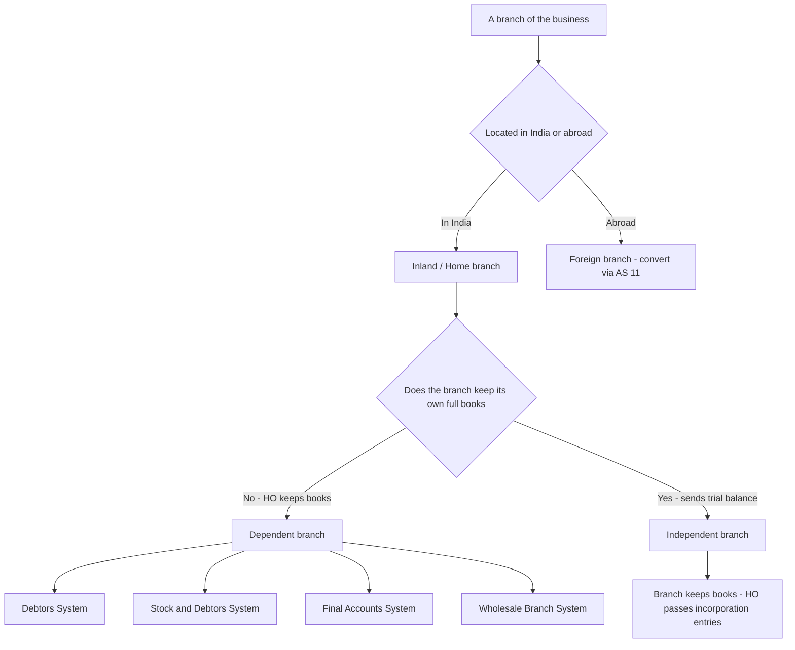
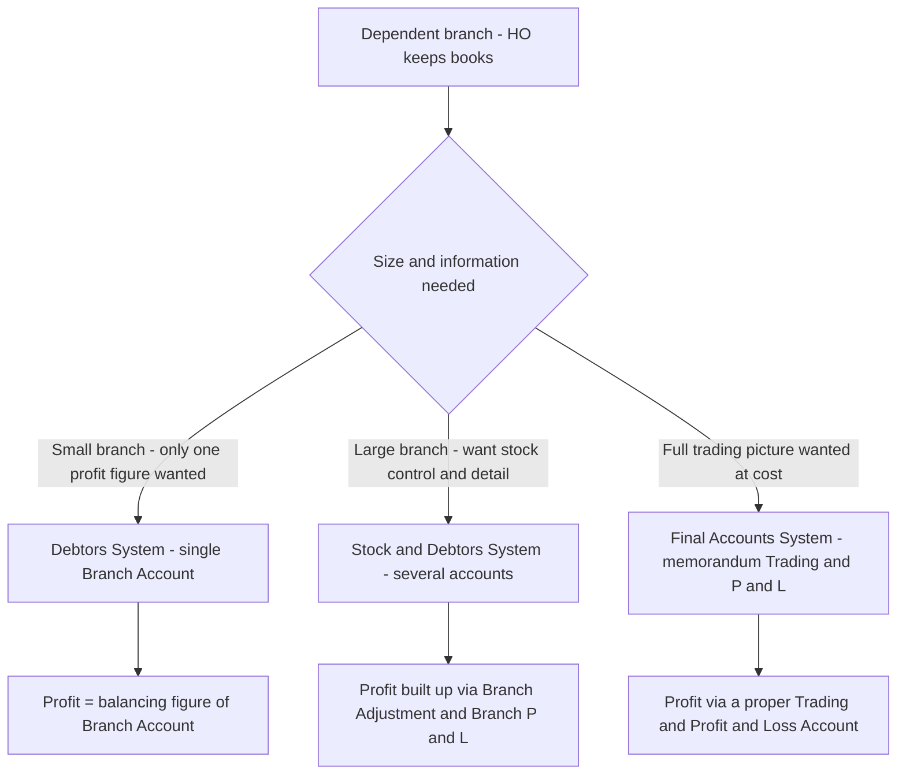
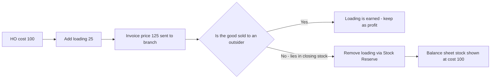
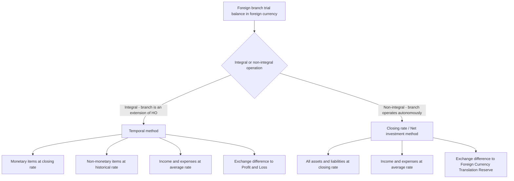

# Chapter 41 — Branch Accounts (including Foreign Branches)

## 1. The Problem

You run a company from Mumbai. Business is good, so you open a shop in Nagpur, then one in Pune, and — because a cousin swears the market is ripe — one in New York. Each of these outlets sells *your* goods, holds *your* cash, and runs up *your* expenses. At the end of the year you must file **one** set of financial statements for the whole company. Nagpur is not a separate legal person; it is you, wearing a different hat, 800 km away.

Now the trouble starts.

- **Which shop is actually making money?** The consolidated profit tells you the company earned ₹40 lakh. But is Pune subsidising Nagpur? If you can't see each branch's profit *separately*, you cannot decide which manager to promote and which shop to shut.
- **You don't trust the branch with pricing.** A dependent branch is often given goods to sell at a *fixed* price that you set. You send goods marked at ₹125 that cost you ₹100. If the branch's books record stock at ₹125, and you naively consolidate, your company balance sheet will show inventory at ₹125 — but you haven't *sold* anything to an outsider. You'd be reporting **unrealised profit** on goods sitting in your own godown. That is illegal under prudence and AS 2.
- **The branch might be leaking.** Goods worth ₹2,00,000 were sent; sales plus closing stock only account for ₹1,98,000. Where did ₹2,000 go — theft, breakage, a billing error? A good branch accounting system makes this **shortage jump out automatically**.
- **The New York branch keeps its books in dollars.** Its plant is $12,000, its sales $60,000. Your final accounts are in Rupees. At *which* exchange rate do you convert a fixed asset bought three years ago versus sales earned evenly through the year? Convert carelessly and your trial balance won't balance — a phantom "profit" or "loss" appears out of thin air from exchange movements.

Branch accounting is the discipline that answers all four questions at once: **measure each branch's performance, strip out unrealised inter-branch profit, expose stock losses, and translate foreign figures honestly.**

## 2. The Core Idea

Think of the Head Office (HO) as a **franchisor** and each dependent branch as a **franchise counter that isn't allowed to touch the till's own accounting**.

The franchisor ships pre-priced goods to the counter. The counter's only job is to *sell and collect*. The franchisor wants to know, from its own desk, exactly one number per counter: **did this counter earn its keep?** To get there, the franchisor keeps a running scorecard for the branch that behaves like a mini profit-and-loss account. Everything the branch received (opening stock, goods sent, cash spent on it) sits on one side; everything that came back or remains (cash banked, closing stock, closing debtors) sits on the other side. **The gap is the branch's profit.** That is the whole trick of the *Debtors System* — a single account that swallows the branch and coughs up its profit as a balancing figure.

For a *bigger* counter you want more than one number — you want to see the stock, the debtors, the loading and the expenses each as its own dial on a dashboard. That is the *Stock-and-Debtors System*: same profit, more visibility, and the stock dial is calibrated so any leakage lights up as a red "shortage" reading.

And the **loading** — the ₹25 you marked up before shipping — is like a price tag you stuck on your own goods for control purposes. It is *not* profit until an outsider pays for it. So every time you value branch stock, you must peel that tag back off. Peeling the tag = the *Stock Reserve*.

The foreign branch is the same franchise counter, but its scorecard is written in a foreign currency, and you must photocopy it into Rupees using the *right* exchange rate for each line — that is where **AS 11** walks in.

## 3. Why It's Built This Way

**Why track branches separately at all?** Because a company's *statutory* accounts are consolidated (the branch is legally part of the company — Section 2(14) of the Companies Act treats a branch office as part of the same entity), but *management* accounts must be dis-aggregated to be useful. The law needs one number; the manager needs many. Branch accounting serves both from one bookkeeping effort.

**Why the "dependent vs independent" split?** Because the *right* accounting method depends on **who keeps the books and how much autonomy the branch has**. A tiny retail counter that only sells and banks cash cannot be asked to run a double-entry ledger and prepare a trial balance — so HO keeps its accounts (*dependent branch*). A large branch that buys locally, sells on credit, pays its own expenses and even has its own bank account can and should keep a full set of books and send HO a trial balance (*independent branch*). The accounting machinery differs because the raw information available differs.

**Why load goods at invoice price instead of cost?** Two control reasons. (1) **Price control** — HO fixes the retail price and prevents the branch from under-cutting or pocketing margin. (2) **Stock control** — if every unit is booked at a known invoice price, then *goods sent minus sales minus closing stock* should be zero; any residue is a physical loss you can investigate. The cost figure would hide this because cost is not what the branch sells at. The price we pay for this control is that we must *remember to remove the loading* wherever unsold stock appears, so we never report unrealised profit.

**Why does AS 11 use different rates for different lines?** Because a balance sheet mixes items measured at *historical* value (a machine bought years ago) with items measured at *current* value (cash, debtors). Translating a historical-cost asset at today's rate would inject a currency gain that never economically occurred. AS 11 matches each item to a rate that preserves its measurement basis — and the unavoidable residual difference is reported honestly, either in the P&L (integral operation) or parked in a translation reserve (non-integral operation).

## 4. Full Technical Content

### 4.1 Classification of branches

*Figure 4.1 — how any branch is classified, which drives the accounting method chosen.*

- **Dependent branch** — sells HO goods, limited autonomy, HO maintains the accounts. Choose among Debtors / Stock-and-Debtors / Final Accounts / Wholesale systems.
- **Independent branch** — full self-contained books, own trial balance; HO records only its *Branch Account* and, at year-end, **incorporates** the branch trial balance. Reciprocal accounts ("HO Account" in branch books, "Branch Account" in HO books) are reconciled for goods/cash/assets *in transit* before incorporation.
- **Foreign branch** — a dependent or independent branch abroad whose figures must be **translated under AS 11** before incorporation.

### 4.2 The three dependent-branch systems and WHEN to use each

*Figure 4.2 — decision tree for picking a dependent-branch system.*

| System | When used | What it produces | Stock loss visible? |
|---|---|---|---|
| **Debtors System** | Small branch; only the profit number matters | One *Branch Account*; profit = balancing figure | No (netted away) |
| **Stock & Debtors System** | Large branch; management wants stock/debtor/loading detail and control | *Branch Stock, Branch Adjustment, Branch Debtors, Branch Expenses, Branch P&L, Stock Reserve, Goods Sent* accounts | **Yes** — surplus/shortage pops out of Branch Stock A/c |
| **Final Accounts System** | Want a conventional Trading + P&L at cost | Memorandum *Branch Trading & P&L A/c* | Only if reconciled separately |

### 4.3 Loading — the arithmetic you must never fumble

"Cost + 25%" and "20% on invoice" describe the *same* loading. Fix the relationship once:

- If goods are invoiced at **cost + 25%**: Invoice = Cost × 1.25. Loading = 25% of cost = **20% of invoice**.
- If goods are invoiced at **cost + 33⅓%**: Invoice = Cost × 4/3. Loading = 33⅓% of cost = **25% of invoice**.

General rule: if loading is *k*% on cost, then loading as a fraction of invoice = k / (100 + k).

Wherever stock or goods appear **at invoice price** and you need cost/profit truth, split every figure into *Cost portion* + *Loading portion*.

*Figure 4.3 — the life-cycle of loading and where it must be removed.*

### 4.4 Debtors System — mechanics

A **single Branch Account** in HO books. Prepared **at cost** (simple) or **at invoice price** (needs loading adjustments). Because debtors' internal movements (credit sales, bad debts, discount, returns from customers) all net out inside the debtors balance, they **do not appear** individually — only *opening debtors*, *closing debtors* and *cash received from debtors* enter the account.

**Branch Account (at invoice price) — standard layout:**

| Dr — Branch Account | ₹ | Cr — Branch Account | ₹ |
|---|---|---|---|
| To Balance b/d — Stock (IP) | x | By Stock Reserve (loading on **opening** stock) | x |
| To Balance b/d — Debtors | x | By Goods Sent to Branch (loading on **net goods sent**) | x |
| To Goods Sent to Branch (IP) | x | By Bank — Cash sales | x |
| To Bank — expenses paid by HO | x | By Bank — cash from debtors | x |
| To Stock Reserve (loading on **closing** stock) | x | By Balance c/d — Stock (IP) | x |
| **To Net Profit (bal. fig.)** | x | By Balance c/d — Debtors | x |

The four loading lines convert an invoice-price account into a true-profit account. At cost price, you simply drop all four loading lines.

### 4.5 Stock & Debtors System — the account family

Maintained **at invoice price**. Accounts:

1. **Branch Stock A/c** (at IP) — inflows (opening stock, goods sent, returns from customers) vs outflows (cash sales, credit sales, returns to HO, closing stock). **Any imbalance = surplus (Cr > Dr) or shortage (Dr > Cr).**
2. **Branch Adjustment A/c** — collects **loading only**. Credit: loading on opening stock + loading on *net* goods sent. Debit: loading on closing stock + loading on shortage. **Balance = Gross Profit** → to Branch P&L.
3. **Branch P&L A/c** — Gross profit (from Adjustment) less branch expenses, bad debts, discount, and the **cost portion** of any shortage → **Net Profit**.
4. **Branch Debtors A/c** — opening + credit sales − cash − returns from customers − bad debts − discount = closing.
5. **Branch Expenses A/c**, **Goods Sent to Branch A/c**, **Branch Stock Reserve A/c** (unrealised profit on opening & closing stock).

Treatment of a **shortage** of stock valued at invoice price: the **cost portion** is a real loss → Branch P&L (Dr); the **loading portion** is only reversal of unearned margin → Branch Adjustment (Dr). A **surplus** is the mirror image.

### 4.6 Final Accounts System

HO prepares a **memorandum Branch Trading and Profit & Loss Account at cost** — all goods restated to cost, closing stock at cost — giving a conventional profit figure. Useful when management wants a normal trading picture rather than control ledgers.

### 4.7 Wholesale Branch System (concept)

Where HO both wholesales to outsiders and supplies retail branches, goods are invoiced to the branch at **wholesale price**. Branch profit is measured only as the *retail-minus-wholesale* margin; the *wholesale-minus-cost* margin belongs to HO. Stock reserve is created on the difference between wholesale price and cost for unsold branch stock. (Rarely numerically heavy at CA Inter — know the logic.)

### 4.8 Foreign branches and AS 11

A foreign branch's books are in a foreign currency and must be **translated to ₹** before incorporation. AS 11 first asks: **is the foreign operation *integral* or *non-integral*?**

*Figure 4.4 — AS 11 translation route for a foreign branch.*

**Integral foreign operation** (branch is merely an arm of HO — e.g., it only sells goods shipped from India and remits cash) → **temporal method**:
- Monetary items (cash, debtors, creditors, loans) → **closing rate**.
- Non-monetary items carried at historical cost (fixed assets, stock at cost) → **rate on the date of the transaction** (historical rate).
- Income & expenses → **actual rate** on transaction date, or a suitable **average rate**; depreciation follows its asset's historical rate.
- **Exchange difference → Profit & Loss Account** (recognised immediately).

**Non-integral foreign operation** (branch operates with autonomy, accumulates cash locally, HO's stake is a *net investment*) → **closing rate / net-investment method**:
- **All assets and all liabilities** → **closing rate**.
- Income & expenses → **actual or average rate**.
- **Exchange difference → Foreign Currency Translation Reserve (FCTR)** under Reserves & Surplus; taken to P&L only on **disposal** of the branch.

The reciprocal **HO Account** is always converted at the figure appearing in HO's own books (it needs no rate — it is already in ₹).

## 5. Worked Examples

### Example 1 — Debtors System, goods at COST (easy)

*Prime Ltd, Mumbai, runs a dependent Nagpur branch. Goods are sent at cost. HO pays all branch expenses. From the following, find the branch profit.*

| Particulars | ₹ |
|---|---|
| Opening stock (cost) | 15,000 |
| Opening debtors | 12,000 |
| Goods sent to branch (cost) | 80,000 |
| Cash sales | 50,000 |
| Credit sales | 70,000 |
| Cash received from debtors | 65,000 |
| Discount allowed to debtors | 1,000 |
| Bad debts | 500 |
| Branch expenses paid by HO | 8,000 |
| Closing stock (cost) | 18,000 |

**Step 1 — closing debtors (memorandum):** 12,000 + 70,000 − 65,000 − 1,000 − 500 = **₹15,500**.

**Step 2 — Branch Account (at cost).** Discount, bad debts and credit sales do *not* appear individually; only opening/closing debtors and cash received do.

| Dr — Nagpur Branch A/c | ₹ | Cr — Nagpur Branch A/c | ₹ |
|---|---|---|---|
| To Opening Stock | 15,000 | By Bank — Cash sales | 50,000 |
| To Opening Debtors | 12,000 | By Bank — from debtors | 65,000 |
| To Goods Sent to Branch | 80,000 | By Closing Stock c/d | 18,000 |
| To Bank — expenses | 8,000 | By Closing Debtors c/d | 15,500 |
| **To Net Profit (bal.)** | **33,500** | | |
| | **1,48,500** | | **1,48,500** |

**Step 3 — independent check (memorandum trading):**
Sales = 50,000 + 70,000 = 1,20,000. COGS = 15,000 + 80,000 − 18,000 = 77,000. Gross profit = 43,000. Less expenses 8,000 + bad debts 500 + discount 1,000 = 9,500. **Net profit = 33,500.** ✔ Reconciles.

### Example 2 — Debtors System, goods at INVOICE PRICE with loading (medium)

*Zenith Ltd invoices goods to its Surat branch at cost + 25%. HO pays branch expenses. Prepare the Branch Account and find profit.*

| Particulars | ₹ |
|---|---|
| Opening stock at branch (invoice price) | 12,000 |
| Opening debtors | 10,000 |
| Goods sent to branch (invoice price) | 1,00,000 |
| Cash sales | 40,000 |
| Credit sales | 75,000 |
| Cash received from debtors | 70,000 |
| Discount allowed | 500 |
| Bad debts | 300 |
| Branch expenses paid by HO | 9,000 |
| Closing stock at branch (invoice price) | 15,000 |

**Step 1 — loading.** Cost + 25% ⟹ loading = 20% of invoice.
- Opening stock loading = 12,000 × 20% = **2,400**
- Goods sent loading = 1,00,000 × 20% = **20,000**
- Closing stock loading = 15,000 × 20% = **3,000**

**Step 2 — closing debtors:** 10,000 + 75,000 − 70,000 − 500 − 300 = **₹14,200**.

**Step 3 — Branch Account at invoice price** (with the four loading lines):

| Dr — Surat Branch A/c | ₹ | Cr — Surat Branch A/c | ₹ |
|---|---|---|---|
| To Opening Stock (IP) | 12,000 | By Stock Reserve — loading on opening stock | 2,400 |
| To Opening Debtors | 10,000 | By Goods Sent to Branch — loading on goods sent | 20,000 |
| To Goods Sent to Branch (IP) | 1,00,000 | By Bank — Cash sales | 40,000 |
| To Bank — expenses | 9,000 | By Bank — from debtors | 70,000 |
| To Stock Reserve — loading on closing stock | 3,000 | By Closing Stock c/d (IP) | 15,000 |
| **To Net Profit (bal.)** | **27,600** | By Closing Debtors c/d | 14,200 |
| | **1,61,600** | | **1,61,600** |

**Step 4 — independent check.**
Sales = 40,000 + 75,000 = 1,15,000. COGS at IP = 12,000 + 1,00,000 − 15,000 = 97,000. Loading inside COGS = 2,400 + 20,000 − 3,000 = 19,400 ⟹ COGS at cost = 97,000 − 19,400 = 77,600. Gross profit = 1,15,000 − 77,600 = 37,400. Less expenses 9,000 + bad debts 300 + discount 500 = 9,800. **Net profit = 27,600.** ✔ Reconciles.

**Note on HO books:** the opening Stock Reserve of ₹2,400 (created last year) is now released, and a new closing Stock Reserve of ₹3,000 is carried forward, so the branch stock appears in the company balance sheet at cost: 15,000 − 3,000 = **₹12,000**.

### Example 3 — Stock & Debtors System, invoice price, with a shortage (exam-hard)

*Apex Ltd supplies its Kochi branch at cost + 33⅓%. HO wants full stock control. From the data, prepare Branch Stock A/c, Branch Adjustment A/c, Branch Debtors A/c and Branch Profit & Loss A/c.*

| Particulars | ₹ |
|---|---|
| Opening stock at branch (invoice price) | 30,000 |
| Opening debtors | 20,000 |
| Goods sent to branch (invoice price) | 2,40,000 |
| Goods returned by branch to HO (invoice price) | 10,000 |
| Cash sales | 1,00,000 |
| Credit sales | 1,16,000 |
| Returns from customers (goods returned by debtors) | 6,000 |
| Cash received from debtors | 1,00,000 |
| Bad debts | 2,000 |
| Discount allowed | 1,000 |
| Branch expenses paid (rent, salaries) | 30,000 |
| Closing stock at branch **per physical count** (invoice price) | 48,000 |

**Step 0 — loading.** Cost + 33⅓% ⟹ loading = 25% of invoice; cost = 75% of invoice.

**Step 1 — Branch Stock A/c (at IP): reveal the shortage.** Goods available should equal goods gone plus stock left; the gap is a shortage.

| Dr — Branch Stock A/c | ₹ | Cr — Branch Stock A/c | ₹ |
|---|---|---|---|
| To Balance b/d (opening) | 30,000 | By Bank — Cash sales | 1,00,000 |
| To Goods Sent to Branch | 2,40,000 | By Branch Debtors — Credit sales | 1,16,000 |
| To Branch Debtors — returns from customers | 6,000 | By Goods Sent to Branch — returns to HO | 10,000 |
| | | By **Shortage (bal. fig.)** | **2,000** |
| | | By Balance c/d (closing, physical) | 48,000 |
| | **2,76,000** | | **2,76,000** |

The debit side (goods available at IP) totals 2,76,000; sales + returns to HO + physical closing = 2,74,000; the missing **₹2,000 at invoice price is a stock shortage**. Split it: **cost portion = 2,000 × 75% = ₹1,500** (real loss → Branch P&L); **loading portion = 2,000 × 25% = ₹500** (unearned → Branch Adjustment).

**Step 2 — Branch Adjustment A/c (loading only): derive gross profit.**
- Loading on opening stock = 30,000 × 25% = 7,500
- Loading on *net* goods sent = (2,40,000 − 10,000) × 25% = 2,30,000 × 25% = 57,500
- Loading on closing stock = 48,000 × 25% = 12,000
- Loading on shortage = 500

| Dr — Branch Adjustment A/c | ₹ | Cr — Branch Adjustment A/c | ₹ |
|---|---|---|---|
| To Stock Reserve — loading on closing stock | 12,000 | By Stock Reserve — loading on opening stock | 7,500 |
| To Branch Stock — loading on shortage | 500 | By Goods Sent to Branch — loading on net goods sent | 57,500 |
| **To Gross Profit c/d (to Branch P&L)** | **52,500** | | |
| | **65,000** | | **65,000** |

**Step 3 — Branch Debtors A/c (closing debtors).**

| Dr — Branch Debtors A/c | ₹ | Cr — Branch Debtors A/c | ₹ |
|---|---|---|---|
| To Balance b/d | 20,000 | By Bank — cash received | 1,00,000 |
| To Branch Stock — credit sales | 1,16,000 | By Branch Stock — returns from customers | 6,000 |
| | | By Bad debts | 2,000 |
| | | By Discount allowed | 1,000 |
| | | By Balance c/d | 27,000 |
| | **1,36,000** | | **1,36,000** |

**Step 4 — Branch Profit & Loss A/c (net profit).**

| Dr — Branch P&L A/c | ₹ | Cr — Branch P&L A/c | ₹ |
|---|---|---|---|
| To Branch Expenses | 30,000 | By Gross Profit b/d (from Adjustment) | 52,500 |
| To Bad debts | 2,000 | | |
| To Discount allowed | 1,000 | | |
| To Branch Stock — shortage (cost portion) | 1,500 | | |
| **To Net Profit (to General P&L)** | **18,000** | | |
| | **52,500** | | **52,500** |

**Step 5 — independent check.** Net sales = (1,00,000 + 1,16,000) − 6,000 returns = 2,10,000 (goods sold at IP = selling price). Cost of those goods = 2,10,000 × 75% = 1,57,500. Gross profit = 2,10,000 − 1,57,500 = **52,500** ✔. Net profit = 52,500 − 30,000 − 2,000 − 1,000 − 1,500 = **18,000** ✔ Reconciles.

**Stock Reserve in HO books:** opening reserve ₹7,500 released; closing reserve ₹12,000 carried forward, so branch closing stock is stated in the company balance sheet at cost 48,000 − 12,000 = **₹36,000**.

### Example 4 — Foreign branch translation under AS 11 (non-integral)

*Bharat Ltd's New York branch is a **non-integral** operation. Convert its trial balance (in $) to ₹ using the closing-rate / net-investment method and prepare the branch Trading & P&L and Balance Sheet. Closing stock = $9,000.*

Trial balance of New York branch as on 31 March:

| Account | Dr ($) | Cr ($) |
|---|---|---|
| Plant & machinery | 12,000 | |
| Opening stock | 8,000 | |
| Purchases | 40,000 | |
| Wages | 6,000 | |
| Salaries | 4,000 | |
| Debtors | 10,000 | |
| Cash & bank | 3,000 | |
| Sales | | 60,000 |
| Creditors | | 8,000 |
| Head Office A/c | | 15,000 |
| **Total** | **83,000** | **83,000** |

Exchange rates: opening ₹70/$, closing ₹75/$, average ₹72/$. The Head Office A/c per HO's own books stands at **₹10,50,000**. Closing stock is a balance-sheet item → closing rate.

**Rule application (non-integral):** all assets & liabilities at **closing ₹75**; income & expenses at **average ₹72**; opening stock at **opening ₹70** (it was the closing stock of last year); HO A/c at its ₹ book value; **exchange difference → FCTR (balancing figure)**.

**Step 1 — converted trial balance:**

| Account | $ | Rate | ₹ |
|---|---|---|---|
| Plant & machinery | 12,000 | 75 | 9,00,000 |
| Opening stock | 8,000 | 70 | 5,60,000 |
| Purchases | 40,000 | 72 | 28,80,000 |
| Wages | 6,000 | 72 | 4,32,000 |
| Salaries | 4,000 | 72 | 2,88,000 |
| Debtors | 10,000 | 75 | 7,50,000 |
| Cash & bank | 3,000 | 75 | 2,25,000 |
| **Total debits** | | | **60,35,000** |
| Sales | 60,000 | 72 | 43,20,000 |
| Creditors | 8,000 | 75 | 6,00,000 |
| Head Office A/c | — | book | 10,50,000 |
| **Sub-total credits** | | | **59,70,000** |
| **FCTR — exchange difference (bal. fig.)** | | | **65,000** (Cr) |
| **Total credits** | | | **60,35,000** |

The credit side falls short by ₹65,000, so a **credit balance of ₹65,000 is carried to the Foreign Currency Translation Reserve** (a translation *gain* this year).

**Step 2 — Branch Trading & Profit & Loss A/c (₹):**

| Dr | ₹ | Cr | ₹ |
|---|---|---|---|
| To Opening stock | 5,60,000 | By Sales | 43,20,000 |
| To Purchases | 28,80,000 | By Closing stock ($9,000 × 75) | 6,75,000 |
| To Wages | 4,32,000 | | |
| To Gross Profit c/d | 11,23,000 | | |
| | **49,95,000** | | **49,95,000** |
| To Salaries | 2,88,000 | By Gross Profit b/d | 11,23,000 |
| **To Net Profit** | **8,35,000** | | |
| | **11,23,000** | | **11,23,000** |

Under the non-integral method the exchange difference is **not** routed through P&L — it sits in FCTR — so net profit is a clean ₹8,35,000.

**Step 3 — Branch Balance Sheet (₹):**

| Liabilities | ₹ | Assets | ₹ |
|---|---|---|---|
| Head Office A/c | 10,50,000 | Plant & machinery | 9,00,000 |
| Add: Net profit | 8,35,000 | Closing stock | 6,75,000 |
| Creditors | 6,00,000 | Debtors | 7,50,000 |
| Foreign Currency Translation Reserve | 65,000 | Cash & bank | 2,25,000 |
| | **25,50,000** | | **25,50,000** |

**Check:** 10,50,000 + 8,35,000 + 6,00,000 + 65,000 = 25,50,000 = 9,00,000 + 6,75,000 + 7,50,000 + 2,25,000. ✔ **Balance sheet balances**, and the whole exchange effect is isolated in FCTR — exactly what AS 11 intends for a non-integral operation.

*(Contrast: had the branch been **integral**, plant would convert at its historical rate and opening stock at the rate when acquired, monetary items at closing rate, and the resulting exchange difference of that computation would flow through the **Profit & Loss Account** instead of FCTR.)*

## 6. Presentation Formats

**Debtors System — Branch A/c (invoice price):** as in §4.4 — remember the four loading lines (opening stock reserve and goods-sent loading on the *credit* side; closing stock reserve on the *debit* side).

**Stock & Debtors System — order of accounts:** (1) Branch Stock A/c → reveals shortage/surplus; (2) Branch Adjustment A/c → gross profit; (3) Branch Debtors A/c → closing debtors; (4) Branch Expenses A/c; (5) Branch P&L A/c → net profit; (6) Stock Reserve & Goods Sent A/c for HO incorporation.

**Independent branch — incorporation in HO books.** After reconciling in-transit items, HO passes an **incorporation entry** for the branch trading result (either detailed, revenue-by-revenue, or the abridged single net-profit entry) and adjusts the reciprocal Branch A/c. Unrealised profit on branch stock is eliminated via Stock Reserve.

**Foreign branch — company balance sheet presentation.** FCTR appears under **Reserves & Surplus** (Schedule III, Division I). The translated branch assets/liabilities are line-by-line added to HO's on incorporation.

**Schedule III note:** in the company's own statutory accounts, branch figures are *merged* with HO — branches are not shown as separate line items; only segment disclosure (AS 17) or notes may reveal them.

## 7. Connections

- **AS 2 (Inventories):** the *reason* loading must be stripped — inventory is stated at lower of cost and NRV; invoice price includes unrealised profit, which cannot sit in stock. Stock Reserve enforces AS 2. (See Chapter 3.)
- **AS 11 (Foreign Exchange Rates):** the entire foreign-branch translation is a direct application. Integral = temporal method, difference to P&L; non-integral = closing-rate method, difference to FCTR. (See Chapter 11.)
- **AS 17 (Segment Reporting):** branch-wise performance you compute here feeds segment disclosures. (See Chapter 17.)
- **Departmental Accounts:** same loading/stock-reserve logic applied *within one location* across departments and inter-departmental transfers — a sister chapter.
- **Companies Act, Section 2(14):** defines a branch office as part of the same company — the legal basis for consolidation rather than separate reporting.

## 8. Traps & Examiner Tricks

1. **Loading base confusion.** "Cost + 25%" ⟹ 20% of invoice, **not** 25% of invoice. Applying 25% to invoice figures is the single most common error. Convert once and label it.
2. **Putting credit sales / bad debts / discount in a Debtors-System Branch Account.** They belong *only* to the memorandum debtors working; in the Branch A/c they are already inside the closing-debtors figure. Double-counting inflates or deflates profit.
3. **Loading on *net* goods sent.** In the Adjustment/Branch A/c, compute loading on *goods sent minus returns to HO*, not on gross goods sent.
4. **Shortage split.** Only the **cost portion** hits Branch P&L as a loss; the **loading portion** goes to Branch Adjustment. Debiting the whole invoice-price shortage to P&L overstates the loss and understates gross profit reconciliation. Surplus is the exact mirror (credit).
5. **Stock Reserve direction.** *Create* a reserve on **closing** stock (debit the profit-measuring account) and *release* the reserve on **opening** stock (credit it). Reversing them flips profit by twice the loading.
6. **Expenses paid *by the branch* vs *by HO*.** In the Debtors System, only expenses HO pays *for* the branch appear as "To Bank — expenses." If the branch pays out of its own cash sales before banking, cash figures must be grossed up. Read the question carefully.
7. **Depreciation and abnormal losses on branch assets.** If the branch holds fixed assets, remember opening branch assets on the Dr side and closing on the Cr side of the Branch Account (Debtors System), plus depreciation adjustments — a favourite hidden line.
8. **Foreign branch — wrong rate for the wrong item.** Non-monetary historical-cost items (fixed assets, opening stock) at *historical/opening* rate under the integral method; everything at *closing* under non-integral. Mixing methods midway leaves the trial balance unbalanced — and the "difference" you then plug is a fabricated number.
9. **Where the exchange difference lands.** Integral → **P&L**; non-integral → **FCTR**. Routing a non-integral difference through P&L overstates/understates reported profit.
10. **HO Account needs no rate.** Convert it at its ₹ figure from HO's books; never multiply it by an exchange rate.
11. **Goods / cash in transit (independent branch).** Before incorporating, reconcile items dispatched by one side but not yet received by the other, or the reciprocal accounts won't agree.

## 9. First-Principles Recap

Start from the only two facts that matter: (a) a branch is *legally you*, so its profit is your profit and its unrealised internal margin is not real profit; (b) the branch may not keep good books or may keep them in another currency, so *you* must reconstruct its results.

From (a): if you price goods above cost for control, that mark-up (**loading**) is fiction until an outsider buys — hence a **Stock Reserve** wherever unsold branch stock exists, so your balance sheet shows stock at cost. From the desire to *see* each branch's result: build a single self-balancing **Branch Account** whose gap is profit (**Debtors System**); when you want control and to catch leakage, explode it into **Stock, Adjustment, Debtors, Expenses and P&L** accounts (**Stock-and-Debtors System**), where the Stock account's imbalance *is* the shortage.

From (b): a foreign branch's every line must be photocopied into ₹ at a rate that respects its measurement basis — current items at today's rate, historical items at their own old rate (integral), or the whole net investment at today's rate (non-integral) — and the honest leftover difference is either faced in the P&L (integral) or parked in **FCTR** until you actually exit the branch (non-integral). Every rule in this chapter is one of these two truths doing its job.

## 10. Quick-Revision Sheet

**Branch types:** Inland → Dependent (HO keeps books) or Independent (own books + TB). Foreign → translate via AS 11.

**Dependent systems — pick by need:**
- *Debtors System* → small branch → one Branch A/c → profit = balancing figure.
- *Stock & Debtors System* → large branch, control wanted → Stock, Adjustment, Debtors, Expenses, P&L → shortage/surplus visible.
- *Final Accounts System* → conventional Trading & P&L at cost.

**Loading:** k% on cost = k/(100+k) of invoice. Cost+25% → 20% of IP. Cost+33⅓% → 25% of IP. Cost portion of IP = 100/(100+k).

**Debtors System Branch A/c (invoice price) — four loading lines:**
- Dr: Opening stock (IP), Opening debtors, Goods sent (IP), Expenses, **Closing stock reserve (loading)**, Net profit (bal.).
- Cr: **Opening stock reserve (loading)**, **Goods-sent loading**, Cash sales, Cash from debtors, Closing stock (IP), Closing debtors.

**Stock & Debtors — account sequence:** Branch Stock (find shortage) → Branch Adjustment (gross profit) → Branch Debtors (closing debtors) → Branch P&L (net profit). Shortage: cost portion → P&L; loading portion → Adjustment.

**Branch Adjustment A/c:** Cr = loading on opening stock + loading on net goods sent. Dr = loading on closing stock + loading on shortage + Gross Profit (bal.).

**Stock Reserve:** create on closing stock (Dr profit), release on opening stock (Cr profit); balance-sheet stock shown at cost.

**Foreign branch (AS 11):**
- *Integral (temporal):* monetary → closing rate; non-monetary at cost → historical rate; income/expenses → average; **difference → P&L**.
- *Non-integral (closing rate/net investment):* all assets & liabilities → closing rate; income/expenses → average; **difference → FCTR** (to P&L only on disposal). HO A/c → its ₹ book value.

**Golden checks:** (1) Branch A/c or memorandum trading must give the *same* profit. (2) Balance sheet must balance. (3) Every unsold branch stock figure carries a stock reserve. (4) Foreign trial balance difference is FCTR (non-integral) — the balance sheet still balances.
