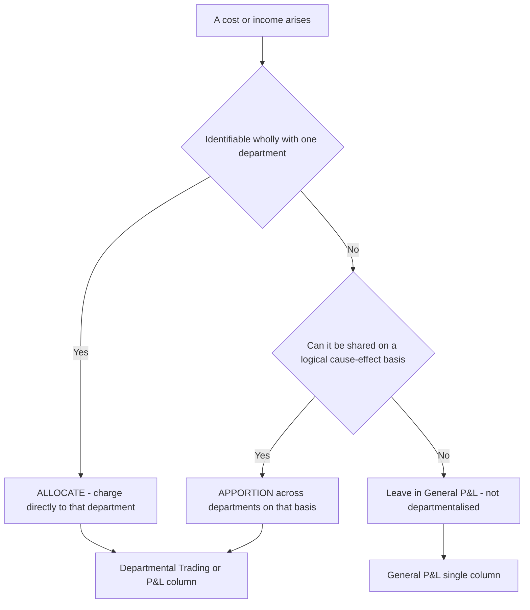
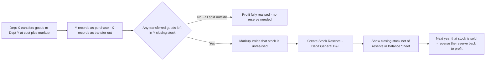

# Chapter 42 — Departmental Accounts

## 1. The Problem

Imagine you run a large store called **Modern Bazaar** on a single premises. Under one roof you sell three very different things: **Textiles** (cloth, garments), **Groceries** (rice, oil, spices), and **Electronics** (fans, mixers, small appliances). At the end of the year your accountant hands you a single Trading and Profit & Loss Account. It says:

> Net Profit for the year: ₹8,40,000.

You are pleased — until you start thinking like the BTech-MBA that you are. That single number is a *blended average*. It hides everything you actually need to know to run the business:

- Which of the three lines is the engine and which is the anchor dragging you down?
- Textiles occupies 60% of the floor space but maybe contributes only 20% of the profit. Should you shrink it?
- Groceries turns its stock over 12 times a year while Electronics turns it over twice. Are you tying up cash in the wrong place?
- The Electronics salesman earns a commission on his own sales — but you can only compute that fairly if you know **Electronics' own** profit, not the store's total.
- You want to give the grocery manager a bonus of *5% of the department's profit*. What number do you multiply by 5%?

A single combined P&L cannot answer a single one of these questions. The blended profit is **decision-useless** for a multi-line business. You are effectively flying three aeroplanes bolted together, watching one fuel gauge that averages all three tanks.

The core problem, then: **A business that runs several distinct activities under one legal entity needs to measure the profitability of each activity separately — but its transactions, its staff, its rent, its electricity, and its stock all get mixed together in one common set of books.** How do we un-mix them, fairly, so that each department gets credited with exactly the revenue and charged with exactly the costs it truly caused?

That is the entire subject of Departmental Accounts.

> A quick sibling comparison so you know the boundary. In the *next* chapter you meet **Branch Accounts**, where the business is split by **location** (Head Office in Mumbai, branch in Pune). Departmental accounts split by **activity within one location and one set of books**. Same instinct — "show me each unit's profit" — but branches are usually geographically separate and often keep their own books, whereas departments share one premises and one ledger. Keep this distinction; examiners love to test whether you can tell them apart.

---

## 2. The Core Idea (Analogy)

Think of the combined store as an **apartment building with shared utilities**, and each department as a **flat**.

Some bills belong cleanly to one flat. Flat 2 ran its own air-conditioner on its own sub-meter — that electricity is *directly* Flat 2's. No argument, no arithmetic. In accounting language this is **allocation**: a cost that is *wholly identifiable* with one department is simply *charged directly* to it.

But the building also has shared costs: the lift, the security guard, the water tank, the exterior paint. No flat "owns" these, yet all flats consume them. You cannot ignore them — they are real costs of living there. So you invent a **fair sharing rule**. The lift and paint (building-related) get split by **floor area**; the water bill gets split by **number of occupants**; the security guard's cost by… well, everyone benefits roughly equally, maybe split by area again. In accounting language this is **apportionment**: a *common* cost is *divided among* departments on a *logical basis that reflects who caused or benefited from it*.

The whole art of departmental accounting is exactly this: for every rupee of cost and every rupee of revenue, ask one question — **"Can I point directly at one department, or must I share it?"** If you can point, you *allocate*. If you must share, you *apportion* on the most cause-and-effect basis you can defend.

One more piece of the analogy, for the trickiest part of the chapter. Suppose Flat 1 (a bakery) sells bread to Flat 2 (a café) at a marked-up price. On the *building's* combined accounts, that "sale" is not a real sale to the outside world — it's money moving from one pocket to another. If the café hasn't yet sold that bread to a real customer, the bakery's "profit" on it is **imaginary from the building's point of view**. We must strip it out. This is **inter-departmental transfer** and **unrealised profit elimination** — Section 4.4 and 5's Example 3 make it concrete.

---

## 3. Why It's Built This Way

Why not just keep three completely separate businesses with three separate ledgers? Because that throws away the whole *point* of running them together. The departments genuinely **share** resources — one rent, one manager, one electricity connection, one set of administrative staff — and sharing those resources is *why* the combined business is cheaper to run than three standalone shops. So the books *must* be combined at the base level. The departmental split is a **reporting overlay** on top of a shared ledger, not three separate ledgers.

Why insist on *logical* apportionment bases rather than just splitting everything equally, or by sales? Because an arbitrary base produces a **misleading** departmental profit, and a misleading number is worse than no number — it drives wrong decisions. If you apportion rent equally across three departments when Textiles occupies 60% of the floor, you *flatter* Textiles and *punish* the small departments, and you might close a perfectly good department on the strength of a bad allocation. The principle is **cause and effect**: charge each department the cost *in proportion to the factor that drives that cost*. Rent is driven by space → apportion by **floor area**. Lighting by space or by points → **area** or **light-points**. Labour welfare by headcount → **number of employees**. Carriage inward by purchases → **purchase values**. Depreciation by asset value in each department → **asset values**.

Why eliminate unrealised profit on inter-departmental transfers? Because of the **prudence** and **realisation** concepts that run through all of accounting (and through AS 2 *Valuation of Inventories*). Profit is earned only when goods are sold to an **outside** party. If Department A "sells" to Department B at a profit, and B still holds those goods in closing stock, then from the *whole entity's* standpoint nothing has been sold to anyone outside — no profit has been realised. If you left A's mark-up inside B's closing stock, you would (a) overstate the entity's total profit and (b) overstate the value of an asset (stock) above cost, which AS 2 forbids (inventory is carried at *cost or net realisable value, whichever is lower* — never above cost). So a **stock reserve** is created to knock the unrealised profit back out.

Why does this matter beyond bookkeeping tidiness? Because the *combined* net profit that flows into the company's Balance Sheet must be **true**. Departmental accounting is not just a management convenience; when the departments belong to one company, the final combined figure hits the statutory financial statements, and that figure must obey the same AS and Companies Act discipline as any other. So the reasoning is not academic — get the unrealised profit wrong and your Balance Sheet is wrong.

---

## 4. Full Technical Content

### 4.1 The two-tier structure of a departmental account

A departmental set of final accounts has three tiers:

1. **Departmental Trading Account** — one column per department, computing **Gross Profit** for each. Everything here is either directly departmental or apportioned on a trading-related basis.
2. **Departmental Profit & Loss Account** — one column per department, taking each department's gross profit down to **Departmental Net Profit** after charging apportioned operating expenses.
3. **General Profit & Loss Account** — a *single* combined column (no departmental split) where truly **non-departmental** items sit: items that cannot sensibly be linked to any department by any cause-and-effect base. Examences: interest on loans/debentures, income tax, dividends received, general managerial salary of the whole entity, share transfer fees, profit/loss on sale of investments, and the **net stock reserve adjustment** on unrealised profit.

*Figure 4.1 — how a rupee of cost finds its home.*



*A cost is allocated if you can point at one department, apportioned if you must share it, and parked in the General P&L only if no logical base exists.*

### 4.2 Allocation vs Apportionment — the precise distinction

| Feature | **Allocation** | **Apportionment** |
|---|---|---|
| Nature of cost | Directly attributable to ONE department | Common / shared across departments |
| Method | Charged in full to that department | Split using a ratio (the "basis") |
| Judgement involved | None — it's a fact | Yes — choose the fairest basis |
| Example | Salesmen's salary of the Electronics counter; direct purchases of Groceries | Building rent, common lighting, general manager's salary |

Mnemonic to reason (not memorise): **Allocation = "Assign it, it's theirs." Apportionment = "Apportion it, it's shared."**

### 4.3 The standard apportionment bases (and the logic of each)

You should never memorise this table cold — you should be able to *derive* each row by asking "what drives this cost?" But here is the exam-standard set, with the driving logic:

| Expense | Usual basis of apportionment | Driving logic ("what causes it") |
|---|---|---|
| Rent, rates, taxes, building repairs, building insurance | **Floor area** (or space occupied) | Cost is driven by space consumed |
| Lighting & heating | **Floor area** or number of **light/power points** | Driven by space or by points used |
| Selling expenses, discount allowed, bad debts, salesmen's commission, freight **outward**, after-sale service | **Net sales** of each department | Driven by how much each dept sells |
| Carriage / freight **inward** | **Purchases** of each department | Driven by how much each dept buys |
| Depreciation, repairs & insurance of plant/machinery/assets | **Value of assets** in each dept | Driven by asset value held |
| Works manager's / supervisor's salary | **Time devoted** to each dept (or wages, or output) | Driven by supervisory time |
| Labour welfare, canteen, ESI, PF, staff welfare | **Number of employees** in each dept | Driven by headcount |
| Power / fuel | **Horse-power × hours**, or machine hours | Driven by machine usage |
| Discount received | **Purchases** of each department | Driven by purchase value |
| Insurance of **stock** | **Average stock** or purchases | Driven by stock value carried |

> **Watch the direction.** Carriage *inward* follows **purchases**; carriage/freight *outward* (a selling cost) follows **sales**. Students routinely apportion both by sales — that is wrong and a favourite trap (Section 8).

### 4.4 Inter-departmental transfers

Departments often supply each other. A **furniture** department may draw timber from a **timber** department; a **restaurant** may take provisions from a **grocery** department. Two questions arise:

**(a) At what price is the transfer recorded?** Either at **cost** or at a **transfer price** (cost + a loading/mark-up, sometimes called "cost plus" or "at selling price"). The exam tells you which.

**(b) How is it recorded?** The transferring department credits its Trading Account (like a sale to another dept) and the receiving department debits its Trading Account (like a purchase). To keep the *combined* accounts honest, these transfers are shown as separate lines — "Transfer to Dept Y" (a credit in X's Trading) and "Transfer from Dept X" (a debit in Y's Trading) — and they **cancel out** in the combined total, so the entity's total purchases and sales are not inflated.

**(c) Unrealised profit.** If the transfer was at a price **above cost**, and the receiving department still holds some of those goods in **closing stock**, then the mark-up sitting inside that closing stock is **unrealised** from the entity's viewpoint. We remove it by creating a **Stock Reserve**.

**Formula for unrealised profit in closing stock:**

$$\text{Unrealised profit} = \text{Closing stock arising from transfer} \times \frac{\text{Profit loading}}{\text{Transfer price (or cost, as given)}}$$

Be careful which fraction the question implies:
- If goods are transferred at **cost + 25% (i.e. 25% on cost)**, then in a transfer price of ₹125, profit = ₹25, so unrealised profit = closing-transfer-stock × **25/125**.
- If goods are transferred at a price that yields **25% on selling price**, then unrealised profit = closing-transfer-stock × **25/100**.

**Journal entries for the stock reserve (unrealised profit):**

For the **closing** unrealised profit (created at year-end):

| Particulars | Dr (₹) | Cr (₹) |
|---|---|---|
| General Profit & Loss A/c ......... Dr | XXX | |
| &nbsp;&nbsp;&nbsp;To Stock Reserve A/c | | XXX |
| *(Being unrealised profit in closing stock on inter-departmental transfer eliminated)* | | |

The Stock Reserve is then **deducted from the value of closing stock** in the Balance Sheet (stock is shown net of the reserve, i.e. at cost).

For the **opening** unrealised profit (which was created last year and is now realised because last year's stock has since been sold), we **reverse** it:

| Particulars | Dr (₹) | Cr (₹) |
|---|---|---|
| Stock Reserve A/c ......... Dr | XXX | |
| &nbsp;&nbsp;&nbsp;To General Profit & Loss A/c | | XXX |
| *(Being opening stock reserve written back as the profit is now realised)* | | |

**Net effect on General P&L** = Opening stock reserve (credit) − Closing stock reserve (debit). Only the *net* movement hits the combined profit — this is why the stock reserve adjustment lives in the **General** P&L, not in any single department's column (it concerns transfers *between* departments, so it belongs to no one department alone).

*Figure 4.2 — the life of unrealised profit on an inter-departmental transfer.*



*Unrealised profit is only the mark-up trapped inside unsold transferred stock; it is reserved this year and released next year.*

### 4.5 Items that are NEVER apportioned (stay in General P&L)

Because there is no cause-and-effect link to any department: interest on loan/debentures, income tax, transfer to general reserve, dividend paid, profit/loss on sale of investments or fixed assets, share issue expenses, and the net inter-departmental stock reserve. Also, the **general manager's salary** is often left in General P&L unless the question gives a basis (time devoted) to apportion it.

---

## 5. Worked Examples

### Example 1 — Warm-up: pure allocation vs apportionment (two departments)

**Facts.** M/s Sharma Traders has two departments, **A** and **B**. For the year ended 31 March 2026:

| Item | Dept A (₹) | Dept B (₹) |
|---|---|---|
| Opening stock | 40,000 | 20,000 |
| Purchases | 3,00,000 | 1,80,000 |
| Sales | 4,60,000 | 3,10,000 |
| Closing stock | 50,000 | 30,000 |

Common expenses to apportion: **Rent ₹48,000** (Dept A occupies 3,000 sq ft, Dept B occupies 1,000 sq ft). **Salaries ₹36,000** (10 employees in A, 8 in B). Direct wages allocated: A ₹22,000, B ₹15,000. Advertisement ₹15,400 to be apportioned on sales.

**Step 1 — Work out the apportionment ratios (with logic).**
- Rent → **floor area** 3,000 : 1,000 = **3 : 1**. So A = 48,000 × 3/4 = ₹36,000; B = ₹12,000.
- Salaries → **number of employees** 10 : 8 = **5 : 4**. A = 36,000 × 5/9 = ₹20,000; B = ₹16,000.
- Advertisement → **sales** 4,60,000 : 3,10,000 = **46 : 31** (total 77). A = 15,400 × 46/77 = ₹9,200; B = 15,400 × 31/77 = ₹6,200.

**Step 2 — Departmental Trading Account.**

| Particulars | Dept A (₹) | Dept B (₹) | Particulars | Dept A (₹) | Dept B (₹) |
|---|---|---|---|---|---|
| To Opening stock | 40,000 | 20,000 | By Sales | 4,60,000 | 3,10,000 |
| To Purchases | 3,00,000 | 1,80,000 | By Closing stock | 50,000 | 30,000 |
| To Direct wages | 22,000 | 15,000 | | | |
| To Gross profit c/d | 1,48,000 | 1,25,000 | | | |
| **Total** | **5,10,000** | **3,40,000** | **Total** | **5,10,000** | **3,40,000** |

Check A: 40,000 + 3,00,000 + 22,000 = 3,62,000 debit before GP; credit side 4,60,000 + 50,000 = 5,10,000; GP = 5,10,000 − 3,62,000 = **1,48,000**. ✓
Check B: 20,000 + 1,80,000 + 15,000 = 2,15,000; credit 3,40,000; GP = **1,25,000**. ✓

**Step 3 — Departmental Profit & Loss Account.**

| Particulars | Dept A (₹) | Dept B (₹) | Particulars | Dept A (₹) | Dept B (₹) |
|---|---|---|---|---|---|
| To Rent | 36,000 | 12,000 | By Gross profit b/d | 1,48,000 | 1,25,000 |
| To Salaries | 20,000 | 16,000 | | | |
| To Advertisement | 9,200 | 6,200 | | | |
| To Net profit | 82,800 | 90,800 | | | |
| **Total** | **1,48,000** | **1,25,000** | **Total** | **1,48,000** | **1,25,000** |

**Insight the single P&L would have hidden.** Combined net profit = ₹1,73,600. But Dept **B**, with *lower* sales (₹3,10,000 vs ₹4,60,000), earns *more* net profit (₹90,800 vs ₹82,800). B is the more efficient department. That is precisely the decision-useful fact departmental accounting exists to reveal.

---

### Example 2 — Deriving the apportionment ratios yourself (three departments)

**Facts.** Bright Stores has three departments — **X, Y, Z**. Trading results already give gross profits: X ₹2,10,000, Y ₹1,60,000, Z ₹1,30,000. Now apportion the following common expenses and find departmental net profit.

| Common expense | Amount (₹) | Given data |
|---|---|---|
| Rent & rates | 90,000 | Floor area X 4,000, Y 3,000, Z 2,000 sq ft |
| Lighting | 18,000 | Light points X 30, Y 24, Z 18 |
| Selling expenses | 66,000 | Sales X 8,00,000, Y 6,00,000, Z 4,00,000 |
| Carriage inward | 24,000 | Purchases X 5,00,000, Y 4,00,000, Z 3,00,000 |
| Depreciation | 21,000 | Asset value X 3,00,000, Y 2,50,000, Z 2,00,000 |
| Labour welfare | 12,000 | Employees X 20, Y 16, Z 12 |

**Step 1 — Choose the base for each (reason it out).**

| Expense | Base chosen | Ratio | Total parts |
|---|---|---|---|
| Rent & rates | Floor area | 4,000 : 3,000 : 2,000 = 4 : 3 : 2 | 9 |
| Lighting | Light points | 30 : 24 : 18 = 5 : 4 : 3 | 12 |
| Selling expenses | Sales | 8 : 6 : 4 = 4 : 3 : 2 | 9 |
| Carriage **inward** | Purchases | 5 : 4 : 3 | 12 |
| Depreciation | Asset value | 3,00,000 : 2,50,000 : 2,00,000 = 6 : 5 : 4 | 15 |
| Labour welfare | Employees | 20 : 16 : 12 = 5 : 4 : 3 | 12 |

**Step 2 — Apportion.**

| Expense | X (₹) | Y (₹) | Z (₹) | Total |
|---|---|---|---|---|
| Rent & rates (4:3:2) | 40,000 | 30,000 | 20,000 | 90,000 |
| Lighting (5:4:3) | 7,500 | 6,000 | 4,500 | 18,000 |
| Selling expenses (4:3:2) | 29,333 | 22,000 | 14,667 | 66,000 |
| Carriage inward (5:4:3) | 10,000 | 8,000 | 6,000 | 24,000 |
| Depreciation (6:5:4) | 8,400 | 7,000 | 5,600 | 21,000 |
| Labour welfare (5:4:3) | 5,000 | 4,000 | 3,000 | 12,000 |
| **Total expenses** | **1,00,233** | **77,000** | **53,767** | **2,31,000** |

*(Selling expenses: 66,000 × 4/9 = 29,333.33 → ₹29,333; × 3/9 = 22,000; × 2/9 = 14,666.67 → ₹14,667. Rounded to reconcile to 66,000.)*

**Step 3 — Departmental net profit.**

| | X (₹) | Y (₹) | Z (₹) | Total |
|---|---|---|---|---|
| Gross profit | 2,10,000 | 1,60,000 | 1,30,000 | 5,00,000 |
| Less: expenses | 1,00,233 | 77,000 | 53,767 | 2,31,000 |
| **Net profit** | **1,09,767** | **83,000** | **76,233** | **2,69,000** |

Combined net profit ₹2,69,000. Notice Z, the smallest by sales, still returns a healthy ₹76,233 — because it carries the *lowest* share of every common cost. Rank by *net margin* and you get a different story from ranking by sales. Decision-useful.

---

### Example 3 — Exam-hard: inter-departmental transfer + unrealised profit + full final accounts

This is the flagship problem type. Read every working note.

**Facts.** ABC Manufacturing Ltd has two departments: **Cloth (C)** and **Readymade Garments (G)**. The garments department makes garments *out of cloth supplied by the Cloth department*. For the year ended 31 March 2026:

| Particulars | Cloth Dept (₹) | Garments Dept (₹) |
|---|---|---|
| Opening stock (1 Apr 2025) | 3,00,000 | 50,000 |
| Purchases (from outside) | 20,00,000 | 15,000 |
| Sales (to outside) | 22,00,000 | 8,00,000 |
| **Transfer of cloth to Garments dept** | 3,00,000 | — |
| Manufacturing expenses (direct) | — | 3,60,000 |
| Selling expenses (direct) | 20,000 | 6,000 |
| Closing stock (31 Mar 2026) | 2,00,000 | 2,00,000 |

**Additional information:**
1. The Cloth department transfers cloth to the Garments department **at its usual selling price**, which includes a profit of **25% on cost** (i.e. cost + 25%).
2. The Garments department's **closing stock of ₹2,00,000 includes cloth (at transfer price) of ₹1,20,000**; the balance ₹80,000 is other conversion cost / outside purchases.
3. The Garments department's **opening stock of ₹50,000 included cloth (at transfer price) of ₹25,000**.
4. General expenses (not departmental): office salaries ₹90,000, general manager's salary ₹60,000. These are to be apportioned between the two departments in the ratio of their **net sales to outsiders** — *except* that the question says to charge them to a combined General P&L. (We will show both the departmental split and, per the requirement, run general items through General P&L. For clarity we apportion office salaries by sales and keep the stock-reserve adjustment in General P&L.)

To keep the illustration clean and unambiguous, we adopt this treatment (standard ICAI approach):
- Office salaries ₹90,000 → apportioned to departments on **sales to outsiders** (22,00,000 : 8,00,000 = 11 : 4).
- General manager's salary ₹60,000 and the **net stock reserve** → **General P&L** (non-departmental).

**Step 1 — Departmental Trading Account (compute gross profit).**

Note the transfer: it is a **credit** in Cloth's Trading (like a sale) and a **debit** in Garments' Trading (like a purchase).

| Particulars | Cloth (₹) | Garments (₹) | Particulars | Cloth (₹) | Garments (₹) |
|---|---|---|---|---|---|
| To Opening stock | 3,00,000 | 50,000 | By Sales | 22,00,000 | 8,00,000 |
| To Purchases | 20,00,000 | 15,000 | By Transfer to Garments | 3,00,000 | — |
| To Transfer from Cloth | — | 3,00,000 | By Closing stock | 2,00,000 | 2,00,000 |
| To Manufacturing exp. | — | 3,60,000 | | | |
| To Gross profit c/d | 4,00,000 | 2,75,000 | | | |
| **Total** | **27,00,000** | **10,00,000** | **Total** | **27,00,000** | **10,00,000** |

*Cloth check:* Debit before GP = 3,00,000 + 20,00,000 = 23,00,000. Credit = 22,00,000 + 3,00,000 + 2,00,000 = 27,00,000. GP = 27,00,000 − 23,00,000 = **4,00,000**. ✓
*Garments check:* Debit before GP = 50,000 + 15,000 + 3,00,000 + 3,60,000 = 7,25,000. Credit = 8,00,000 + 2,00,000 = 10,00,000. GP = 10,00,000 − 7,25,000 = **2,75,000**. ✓

**Step 2 — Departmental Profit & Loss Account.**

Office salaries ₹90,000 in ratio 11 : 4 → Cloth = 90,000 × 11/15 = ₹66,000; Garments = ₹24,000.

| Particulars | Cloth (₹) | Garments (₹) | Particulars | Cloth (₹) | Garments (₹) |
|---|---|---|---|---|---|
| To Selling expenses | 20,000 | 6,000 | By Gross profit b/d | 4,00,000 | 2,75,000 |
| To Office salaries | 66,000 | 24,000 | | | |
| To Net profit c/d | 3,14,000 | 2,45,000 | | | |
| **Total** | **4,00,000** | **2,75,000** | **Total** | **4,00,000** | **2,75,000** |

Departmental net profit (before general items) = Cloth ₹3,14,000 + Garments ₹2,45,000 = **₹5,59,000**.

**Step 3 — Unrealised profit on inter-departmental transfer (the crux).**

Cloth transfers at **cost + 25%**, so profit is **25/125 = 1/5** of the transfer price.

*Closing stock* of Garments contains transferred cloth of **₹1,20,000** (at transfer price).
Unrealised profit in closing stock = 1,20,000 × 25/125 = **₹24,000** → create **Stock Reserve (closing) = ₹24,000** (debit General P&L).

*Opening stock* of Garments contained transferred cloth of **₹25,000** (at transfer price).
Unrealised profit in opening stock = 25,000 × 25/125 = **₹5,000** → this reserve was created last year; reverse it now (credit General P&L).

**Net stock reserve charge to General P&L = closing 24,000 − opening 5,000 = ₹19,000 (net debit).**

**Journal entries:**

| Particulars | Dr (₹) | Cr (₹) |
|---|---|---|
| Stock Reserve A/c (opening) ......... Dr | 5,000 | |
| &nbsp;&nbsp;&nbsp;To General P&L A/c | | 5,000 |
| *(Opening unrealised profit now realised)* | | |
| General P&L A/c ......... Dr | 24,000 | |
| &nbsp;&nbsp;&nbsp;To Stock Reserve A/c (closing) | | 24,000 |
| *(Unrealised profit in closing stock eliminated)* | | |

**Step 4 — General Profit & Loss Account.**

| Particulars | ₹ | Particulars | ₹ |
|---|---|---|---|
| To General manager's salary | 60,000 | By Net profit b/d (Cloth) | 3,14,000 |
| To Stock reserve (closing) | 24,000 | By Net profit b/d (Garments) | 2,45,000 |
| To Net profit transferred to B/S | 4,80,000 | By Stock reserve (opening) w/back | 5,000 |
| **Total** | **5,64,000** | **Total** | **5,64,000** |

**Combined net profit for the year = ₹4,80,000.**

*Reconciliation:* 5,59,000 (dept net profit) − 60,000 (GM salary) − 24,000 (closing reserve) + 5,000 (opening reserve) = **4,80,000**. ✓

**Step 5 — Balance Sheet effect of the stock reserve.** In the Balance Sheet, closing stock is shown **net of the closing stock reserve**:

Total closing stock = Cloth 2,00,000 + Garments 2,00,000 = 4,00,000. *Less* Stock Reserve 24,000 = **₹3,76,000** carried to the Balance Sheet (this restores the transferred portion to cost, satisfying AS 2).

**Why this matters:** had we ignored the reserve, the entity's profit would be overstated by the *net* ₹19,000 and its stock asset overstated by ₹24,000 above cost. Departmental accounting forces both errors out.

---

## 6. Presentation Formats

**(A) Columnar Departmental Trading and Profit & Loss Account** — the standard exam format. One column per department, side by side, with a final "Total" column, and the General P&L shown *below* as a single combined section.

```
                 Departmental Trading and Profit & Loss Account
                        for the year ended 31 March 20XX
------------------------------------------------------------------------------
 Particulars      | Dept A | Dept B | Total ||  Particulars    | Dept A | Dept B | Total
------------------------------------------------------------------------------
 To Opening stock |   ...  |   ...  |  ...  ||  By Sales        |   ...  |   ...  |  ...
 To Purchases     |   ...  |   ...  |  ...  ||  By Transfers    |   ...  |   ...  |  ...
 To Direct wages  |   ...  |   ...  |  ...  ||  By Closing stock|   ...  |   ...  |  ...
 To Gross Profit  |   ...  |   ...  |  ...  ||                  |        |        |
------------------------------------------------------------------------------
 To (dept expenses)|  ...  |   ...  |  ...  ||  By Gross Profit |   ...  |   ...  |  ...
 To Net Profit c/d|   ...  |   ...  |  ...  ||                  |        |        |
------------------------------------------------------------------------------
             General Profit & Loss Account (NOT departmentalised)
 To General mgr salary ........ ||  By Net profit b/d (all depts) .......
 To Stock reserve (closing) .... ||  By Stock reserve (opening) .........
 To Net profit to Balance Sheet  ||
------------------------------------------------------------------------------
```

**(B) Balance Sheet presentation of the stock reserve.** Under Current Assets:

| Current Assets | ₹ | ₹ |
|---|---|---|
| Inventories (closing stock) | 4,00,000 | |
| Less: Stock Reserve (unrealised inter-dept profit) | (24,000) | 3,76,000 |

**(C) Memorandum vs actual.** In practice the departmental columns are often prepared as a **memorandum** (management) statement, while the ledger keeps one combined Trading and P&L. For CA Intermediate you present the **columnar** account as the answer unless told otherwise.

---

## 7. Connections

- **AS 2 – Valuation of Inventories.** The unrealised-profit / stock-reserve rule is a direct application of AS 2: inventory must never be carried above cost. Inter-departmental mark-up trapped in stock inflates it above cost, so AS 2 requires it removed. If you understand Chapter on AS 2, this chapter's hardest bit is just AS 2 in a new costume.
- **Branch Accounts (next chapter).** Same "measure each unit" instinct, but split by **location** and often with the branch keeping separate books. The **stock reserve** idea reappears identically for goods invoiced to a branch at cost-plus (the "loading" and stock reserve there is the same mathematics as unrealised inter-departmental profit here).
- **Cost Accounting – overhead apportionment.** The allocation-vs-apportionment framework and the "logical basis" idea are *exactly* the primary/secondary distribution of overheads you meet in Cost Accounting. Same reasoning, different report.
- **Companies Act / Schedule III.** When the departments are inside a company, the *combined* net profit and the *net-of-reserve* stock value flow into the Schedule III Balance Sheet and Statement of Profit and Loss. Departmental columns are the management overlay; the statutory statement shows only the consolidated figures.
- **Segment Reporting (AS 17).** Departmental accounts are the small-scale, internal ancestor of AS 17 segment reporting, which requires *listed/large* entities to disclose profitability by business/geographical segment. Same motive — don't hide unit performance inside a blended total — scaled up to a statutory disclosure.

---

## 8. Traps & Examiner Tricks

1. **Carriage inward apportioned on sales.** The single most common error. Carriage/freight **inward** is a *buying* cost → apportion on **purchases**. Only *selling*/outward costs follow sales.
2. **Wrong unrealised-profit fraction.** "Cost + 25%" means profit is **25/125** of transfer price, *not* 25/100. "25% on selling price" means **25/100**. Read which base the question states; mis-reading changes the reserve and hence the combined profit.
3. **Applying the reserve to the whole closing stock.** The reserve applies **only to the portion of closing stock that arose from inter-departmental transfer**, and only to the *mark-up* in it — not to the department's own outside-purchased stock. In Example 3, only ₹1,20,000 (not the full ₹2,00,000) was transferred cloth.
4. **Forgetting the opening stock reserve reversal.** Last year's unrealised profit becomes realised this year (that stock was sold). You must **write it back** (credit General P&L). Only the *net* (closing − opening) hits profit. Candidates who forget the opening reversal overstate the charge.
5. **Putting the stock reserve inside a department's column.** It concerns transfers *between* departments and belongs to *neither* alone → it goes in **General P&L**, never in a single department's P&L.
6. **Not cancelling transfers in the total column.** "Transfer to Garments" (credit, Cloth) and "Transfer from Cloth" (debit, Garments) are equal and opposite; in the *Total* column they net to zero, so the entity's total sales/purchases are not inflated. If your total column double-counts the transfer, it won't reconcile.
7. **Apportioning non-departmental items.** Interest on loan, income tax, dividends, profit on sale of asset — do **not** force these into departmental columns; park them in General P&L. Apportioning them fabricates precision that does not exist.
8. **Equal split by default.** Never split a common cost equally unless the question says so or no better base exists. Always hunt for the cause-and-effect base (area, employees, sales, purchases, asset value).
9. **Manager's commission on "profit".** If a manager gets a % of *his department's* profit, base it on that department's **net profit before his commission** (or after, as specified) — and be clear whether it is before or after charging the commission itself. State your assumption.
10. **Depreciation apportioned on sales.** Depreciation is driven by **asset value in each department**, not sales. Another cause-and-effect slip.

---

## 9. First-Principles Recap

Start from the felt need: *a multi-activity business needs each activity's profit, but shares one ledger.* Everything follows by pure reasoning:

1. **Un-mix revenue and cost, department by department.** For each rupee ask: *point at one department (allocate) or share (apportion)?*
2. **Apportion on cause and effect.** Charge each department the shared cost in proportion to the factor that *drives* it — space for rent, headcount for welfare, sales for selling costs, purchases for buying costs, asset value for depreciation. Any base that ignores causation produces a lie.
3. **Build two tiers.** Trading Account → each department's gross profit; P&L Account → each department's net profit after its share of operating costs.
4. **Handle internal trade honestly.** Transfers between departments are not real sales to the outside world. Record them, but cancel them in the total, and if any transferred goods remain unsold in closing stock, **strip out the mark-up** (stock reserve) because profit is only real when realised outside — and because AS 2 forbids carrying stock above cost.
5. **Keep the genuinely un-departmental items in a single General P&L**, then arrive at one true combined net profit that can face the statutory Balance Sheet.

If you internalise those five moves, you never need to memorise a format again — you can *reconstruct* the whole columnar statement from the logic.

---

## 10. Quick-Revision Sheet

**Purpose:** measure each department's own profitability inside one shared ledger → drive decisions (expand, shrink, reward, price).

**Allocation** = cost wholly one department's → charge direct. **Apportionment** = shared cost → split on a logical base.

**Standard bases (derive them — "what drives this cost?"):**

| Cost | Base |
|---|---|
| Rent, rates, building repairs/insurance, lighting/heating | Floor area (lighting also by light points) |
| Selling exp, discount allowed, bad debts, carriage **outward**, salesmen commission | Sales |
| Carriage **inward**, discount received | Purchases |
| Depreciation, repairs & insurance of assets | Asset value |
| Labour welfare, canteen, PF, ESI | No. of employees |
| Power / fuel | HP × hours or machine hours |
| Supervisor / works-manager salary | Time devoted |

**Structure:** Departmental Trading (GP per dept) → Departmental P&L (NP per dept) → **General P&L** (single column: interest, tax, GM salary, net stock reserve → final combined NP).

**Inter-departmental transfer:** credit transferring dept's Trading, debit receiving dept's Trading; **cancel in Total column**.

**Unrealised profit (stock reserve):**
- Only on **transferred goods still in closing stock**, and only the **mark-up** in them.
- Cost + x% → profit fraction = **x/(100+x)** of transfer price. "x% on sale price" → **x/100**.
- Closing reserve: **Dr General P&L, Cr Stock Reserve** (deduct from stock in B/S).
- Opening reserve: **Dr Stock Reserve, Cr General P&L** (write back).
- Net charge to profit = **Closing reserve − Opening reserve**.

**Never departmentalise:** interest on loan/debentures, income tax, dividends, profit/loss on sale of fixed assets/investments, net stock reserve → **General P&L**.

**Top traps:** carriage *inward* on purchases (not sales); reserve fraction 25/125 vs 25/100; reserve only on transferred portion; don't forget opening reserve reversal; reserve → General P&L not a department; depreciation on asset value not sales.

**Self-check every answer:** each Trading and P&L column must foot; Total column = sum of dept columns with transfers cancelled; combined NP must equal (Σ dept NP − general items − net reserve); Balance-Sheet stock shown *net of reserve*.
