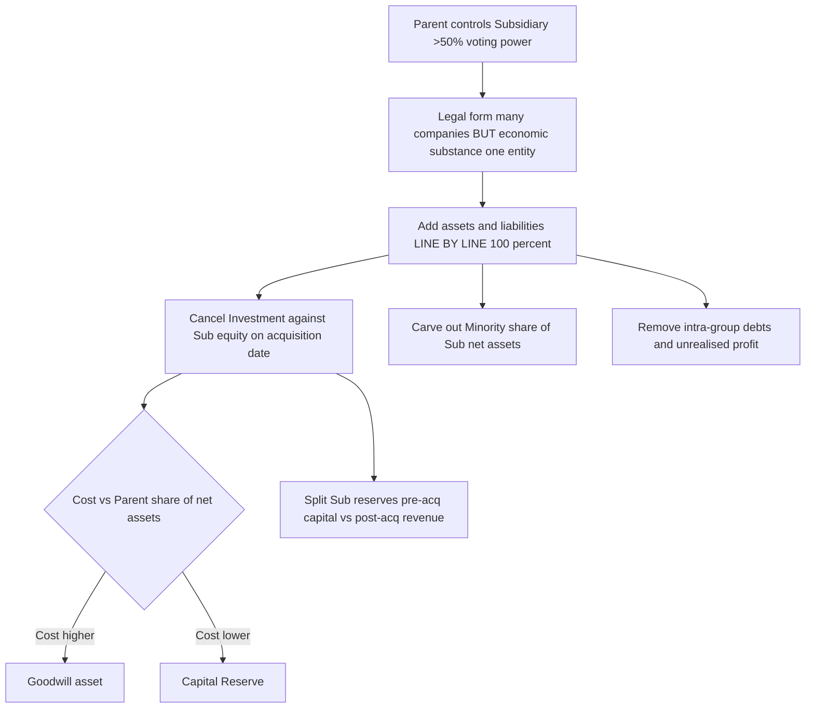
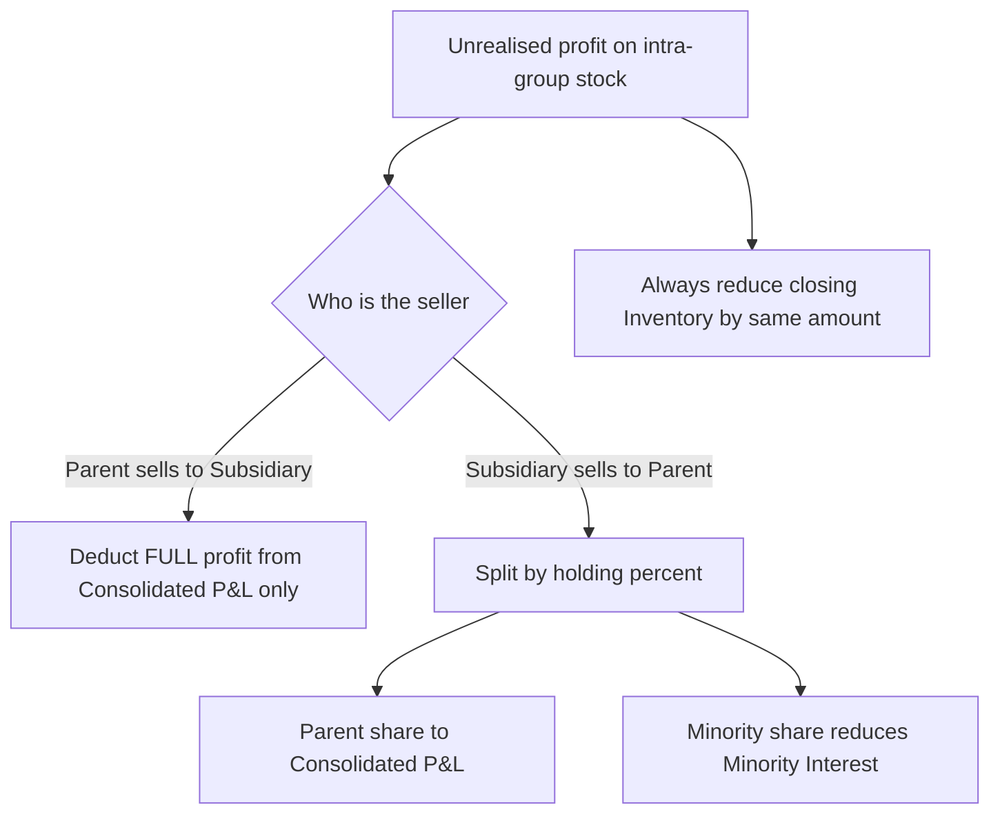
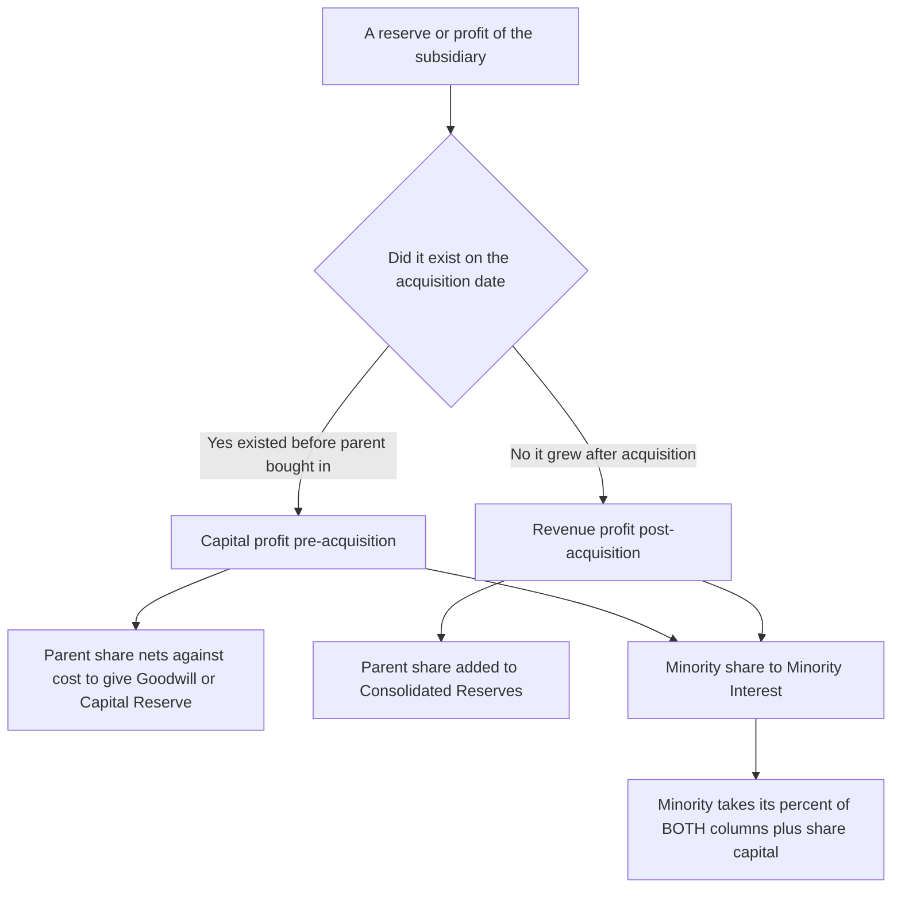

<!-- v2-deep -->

# Chapter 43 — Consolidated Financial Statements (Holding Companies)

---

## 1. The Problem

Imagine you are a shareholder of **Sun Ltd.** You open its Balance Sheet and see one line under Non-Current Investments:

> Investment in Moon Ltd. — 8,000 equity shares of ₹10 each ......... ₹1,20,000

That single line is hiding an entire company. Moon Ltd. might own a factory worth ₹50 lakh, owe ₹30 lakh to banks, hold inventory, employ people, and earn (or bleed) crores. Sun Ltd. *controls* all of that — it appointed Moon's board, it directs Moon's decisions — yet the reader of Sun's own Balance Sheet sees none of it. The reader sees a frozen historical number, ₹1,20,000, that tells you nothing about what Moon is worth *today* or how it is performing.

Now flip it around. Suppose a group deliberately wants to **hide bad news**. Parent company borrows heavily, dumps the debt and the loss-making operations into a subsidiary, and then only shows "Investment in Subsidiary ₹1" on its own face. The parent's standalone accounts look pristine. The rot is one legal layer down, invisible.

There is a third problem — **profit manufacturing inside the family**. Sun sells goods to Moon at a fat margin. Sun books a profit. But nothing left the *group* — the goods are still sitting in Moon's godown. If we simply add Sun's profit and Moon's numbers together, the group has "earned" profit by selling to itself. That is like claiming you got richer by moving cash from your left pocket to your right.

There is even a fourth, subtler problem — **valuation staleness**. The ₹1,20,000 investment figure is locked at *historical cost* under AS 13. Even if Moon has tripled in value or collapsed to worthlessness, Sun's Balance Sheet keeps repeating ₹1,20,000 year after year. A single frozen number cannot breathe with the subsidiary's fortunes; only a line-by-line combination of Moon's *current* assets and liabilities can.

So the core problem is this:

> **A single company's financial statements cannot tell the truth about a group of companies under common control. Legal separateness (each company is a distinct legal person) collides with economic reality (they operate as one business).**

Consolidated Financial Statements (CFS) exist to resolve this collision. They present a parent and its subsidiaries **as if they were one single company**, so the shareholder of the parent sees the *whole* economic empire he indirectly owns — its real assets, its real debts, its real (internally-eliminated) profit.

Note carefully what CFS do **not** replace: the parent still prepares its own **standalone** statements (which the law and creditors need, because dividends can only be paid out of the *parent's* own realised profits and creditors sue individual legal entities). CFS are prepared **in addition**, for the *shareholder's* information. Both coexist. This dual-existence point is examinable — students often wrongly think consolidation "merges" the companies. It does not; consolidation is a **reporting overlay**, not a legal event.

---

## 2. The Core Idea (Analogy)

Think of a **holding company as a person, and its subsidiaries as that person's wallets in different pockets**.

- Your standalone financial statement is like saying: "I have one wallet (my main pocket) containing ₹500, plus an *IOU* saying I put ₹120 into another jacket I own." That IOU is the "Investment in Subsidiary."
- Your **consolidated** statement throws away the IOU and instead says: "Forget the note — let me open the jacket and count what is *actually inside it*: ₹300 cash, a ₹200 watch, and a ₹150 debt I owe someone." Now the reader sees the real assets and real liabilities, pocket by pocket, added together **line by line**.

Two refinements make the analogy exact:

1. **The jacket isn't fully yours.** If you own only 75% of the jacket, then 25% of everything inside it belongs to a *partner* — the **Minority (Non-Controlling) Interest**. You must consolidate 100% of the jacket's contents (because you *control* the jacket), but then set aside a claim showing "25% of this belongs to my partner."

2. **You can't get rich moving money between your own pockets.** If your left pocket "sold" a watch to your right pocket at a mark-up, and the watch is still in the right pocket, the "profit" is fake. Consolidation strips it out (**unrealised profit elimination**). Likewise, if the left pocket owes the right pocket ₹40, that internal IOU cancels — it's you owing yourself (**intra-group balance elimination**).

A third refinement sharpens the *timing* idea. **The jacket had money in it before you bought it.** When you purchased the jacket, its price already reflected the ₹150 that was sitting inside. That ₹150 is not something you "earned" by owning the jacket — you *paid* for it. Only money that appears *after* you own the jacket counts as your gain. This is the pre-acquisition / post-acquisition divide, and it is the single most tested idea in the chapter.

The governing principle behind all of this is **substance over form**: the *legal* form is many companies; the *economic substance* is one entity. Accounting must report the substance. Every mechanical rule you will meet is just this principle wearing a different costume.

---

## 3. Why It's Built This Way

Every mechanical rule of consolidation is a direct answer to a "how do we avoid lying?" question. Let's derive them from scratch instead of memorising.

**Why add line-by-line instead of just one investment figure?**
Because the whole point is to *reveal* the assets and liabilities the parent controls. Keeping "Investment ₹1,20,000" as a single line would defeat the purpose. So we **replace** the Investment line with the *actual* underlying assets and liabilities of the subsidiary.

**Why add 100% of the subsidiary's assets even when the parent owns only 75%?**
Because the trigger for consolidation is **control**, not **ownership proportion**. The parent *controls* the deployment of 100% of the subsidiary's factory, cash and inventory — it decides what happens to all of it. Economic reality is that the whole ₹5,50,000 factory is under the group's command. So we bring in 100% of every asset and liability, and *then* acknowledge that outsiders have a claim on part of it via Minority Interest. This is why consolidation is called the **acquisition (or purchase) method with full consolidation** — full assets in, minority claim carved out on the equity side. Contrast this with the *equity method* used for associates (Section 7), where you bring in only your *share* as a single line.

**Why split the subsidiary's reserves into "pre-acquisition" and "post-acquisition"?**
This is the deepest idea in the chapter, so slow down. When Sun *bought* its shares in Moon, it paid a price. That price was based on what Moon was worth **on the purchase date** — including reserves and profits Moon had *already accumulated* by then. Those accumulated profits are **capital** to the buyer: Sun paid for them; they are not income Sun *earned*. If Sun later took credit for Moon's pre-acquisition reserves as group profit, it would be **double-counting** — paying for a stock of profit and then also booking it as fresh earnings.

Analogy: you buy a mango tree that already has 100 ripe mangoes hanging on it. You paid for those 100 mangoes in the purchase price. They are your *capital*, not your *harvest*. Only mangoes that grow *after* you buy the tree are your income. So:

- **Pre-acquisition profit** (profit that existed on the acquisition date) → treated as **capital**; it is netted against the cost of investment to compute goodwill or capital reserve.
- **Post-acquisition profit** (profit earned *after* the parent gained control) → the parent's share is genuine **group revenue profit**, added to consolidated reserves.

**Why does goodwill or capital reserve arise?**
Sun paid ₹1,20,000 for a slice of Moon. What did Sun *get* in book terms? It got its share of Moon's **net assets on the acquisition date** (share capital + pre-acquisition reserves, i.e., Sun's ownership % of Moon's equity). If Sun paid **more** than that share is worth on the books, the excess is **Goodwill** (Sun paid a premium — for brand, synergy, future prospects). If Sun paid **less**, the bargain gain is **Capital Reserve**. This is exactly the logic of purchase consideration versus net assets you saw in Amalgamation — reused here.

**Why is goodwill computed on the parent's share only, but minority interest on the full balance-sheet-date equity?**
Because goodwill answers "did the *parent* overpay for what *the parent* bought?" — inherently a parent-side, acquisition-date question. Minority interest answers "what do outsiders own *right now*?" — inherently a full-equity, reporting-date question. The two calculations look at different owners at different moments, which is why one uses pre-acquisition figures and the parent %, while the other uses total closing figures and the minority %. Conflating the two dates and the two owners is the commonest structural error.

**Why eliminate intra-group balances and unrealised profit?**
Because a single entity cannot owe money to itself, cannot earn revenue from itself, and cannot hold profit locked in goods it merely shifted internally. To a consolidated "one entity," these are non-events. Leaving them in would inflate both assets and profits fictitiously. Note the asymmetry the exam exploits: intra-group *debts* cancel cleanly (equal and opposite, no profit effect), but intra-group *sales of goods still held* leave a **profit residue** trapped in inventory that must be scrubbed from *both* the asset and the reserve.

Here is the whole logic as a flow:

*Figure 1 — The reasoning chain from control to consolidation adjustments.*

---

## 4. Full Technical Content

### 4.1 The governing standard — AS 21

**AS 21 "Consolidated Financial Statements"** governs CFS in the CA Intermediate syllabus. Core rules you must know:

- **Control** is the trigger. Control = ownership of **more than one-half (>50%) of the voting power**, OR **control of the composition of the Board of Directors** so as to obtain economic benefits. Either test suffices.
- Under the **Companies Act, 2013 (Section 129(3))**, a company having one or more subsidiaries (also associates/joint ventures) **must** prepare CFS in addition to its standalone statements, and lay both before the AGM.
- CFS are prepared by **combining the financial statements of parent and subsidiaries line by line** by adding together like items of assets, liabilities, income and expenses.
- **Uniform accounting policies** and, as far as practicable, the **same reporting date** must be used. (If reporting dates differ, they should not differ by more than 6 months, with adjustments for significant transactions.)
- A subsidiary may be **excluded** from consolidation only where control is **intended to be temporary** (subsidiary acquired and held exclusively for disposal in the near future) or it operates under **severe long-term restrictions** impairing transfer of funds to the parent. (These exclusions are curtailed under Ind AS but remain examinable under AS 21.)

> **Key terms:** *Parent (Holding Company)* — controls another. *Subsidiary* — controlled by another. *Minority Interest / Non-Controlling Interest (NCI)* — that part of the net results and net assets of a subsidiary attributable to shares **not owned** by the parent, directly or through subsidiaries.

**Finer distinctions AS 21 tests:**

- **"Voting power," not "share capital."** Control is measured on *voting* equity. If the subsidiary has non-voting preference shares or differential-rights shares, base the >50% test on the shares that actually vote. A parent can hold 40% of total capital yet >50% of votes and still consolidate.
- **Direct + indirect holdings combine.** If P holds 60% of Q, and Q holds 70% of R, then R is P's subsidiary too (P controls Q, Q controls R → P controls R). This is a **chain / sub-subsidiary** structure. P's *effective* interest in R is 60% × 70% = 42%, but R is still fully consolidated because control passes down the chain. Minority in R = 100% − effective parent interest, and includes both the direct outsiders of R *and* Q's own minority looking through. (Chain holdings are an advanced variant; know the principle even if computation is light at Inter level.)
- **Potential voting rights** (options, convertibles) are considered under Ind AS 110 but AS 21 looks at **presently exercisable** rights. For CA Inter, apply the AS 21 position: existing voting power.
- **Consolidation is required even for a single subsidiary.** There is no "one subsidiary is too small" exemption under the Act; materiality guides disclosure, not the duty to consolidate.
- **Loss of control** (parent sells down below 50%, or subsidiary passes to an administrator) ends consolidation from that date; the residual stake is then carried as an ordinary investment or associate.

### 4.2 The consolidation procedure — step by step

**Step 1 — Establish the shareholding pattern.**
Parent's holding % = (shares held by parent ÷ total shares of subsidiary). Minority % = 100% − Parent's %.

**Step 2 — Analyse the subsidiary's equity (Reserves & Surplus) into pre- and post-acquisition.**
Split the subsidiary's reserves and P&L balance as they stood at (a) the **acquisition date** (pre-acquisition, capital in nature) and (b) the **growth from acquisition date to the balance sheet date** (post-acquisition, revenue in nature). This is done in an **"Analysis of Profits" working note**.

**Step 3 — Compute Minority Interest.**

> **Minority Interest = Minority % × (Share Capital + ALL Reserves & Surplus of subsidiary on the Balance Sheet date, pre + post)**

The minority gets its proportionate share of *everything* the subsidiary owns on the reporting date — the pre/post split does **not** matter for the minority. (Minority also bears its share of any capital-profit adjustments if the question so specifies, e.g., revaluation.) If the subsidiary made *losses* that drove its net worth below par, minority interest can be small or even negative in theory; under AS 21 the minority still absorbs its share of losses.

**Step 4 — Compute Goodwill / Capital Reserve (Cost of Control).**

> **Cost of Control = Cost of Investment − Parent's share of [Share Capital + Pre-acquisition Reserves] of subsidiary**
>
> If positive → **Goodwill**. If negative → **Capital Reserve**.

(If the parent bought shares *cum-dividend* or received pre-acquisition dividend, that dividend reduces the cost of investment — see Traps.)

**Step 5 — Compute Consolidated Reserves / P&L.**

> **Consolidated Reserves = Parent's own Reserves + Parent's share of Post-acquisition Reserves of subsidiary − Unrealised profit on intra-group stock − Goodwill written off (if any) ± other consolidation adjustments**

**Step 6 — Eliminate intra-group items.**
- Mutual debts (e.g., subsidiary owes parent, or debtor/creditor between them) → knock off from **both** the asset side and the liability side.
- Unrealised profit on goods still in closing stock → deduct from **consolidated stock** (asset) and from **consolidated reserves** (profit).
- Any intra-group investment, loans, bills → cancel against each other.

**Step 7 — Prepare the Consolidated Balance Sheet** using Schedule III format, showing Minority Interest and Goodwill/Capital Reserve on the appropriate faces.

**A note on ordering and self-discipline:** always compute the **Analysis of Profits first**, because it feeds three later steps (MI, goodwill, consolidated reserves) simultaneously. If you jump to goodwill before splitting pre/post, you will keep re-deriving the same split under time pressure and risk inconsistency. The disciplined sequence is what makes a 15-mark problem tractable in ~20 minutes.

### 4.3 Analysis of Profits — the master working note

This single working note drives Steps 3, 4 and 5. Standard columnar format:

| Particulars | Capital Profit (Pre-acq) ₹ | Revenue Profit (Post-acq) ₹ |
|---|---|---|
| Reserves on B/S date | split → pre part | post part |
| P&L balance on B/S date | split → pre part | post part |
| Add/Less: adjustments (revaluation, dividend, etc.) | ... | ... |
| **Total** | **A** | **B** |
| Minority share (Minority %) | goes to M.I. | goes to M.I. |
| Parent share (Holding %) | → to Cost of Control | → to Consolidated P&L |

The pre-acquisition column's *parent share* flows into the **Goodwill** calculation. The post-acquisition column's *parent share* flows into **Consolidated Reserves**. Both columns' *minority share* flows into **Minority Interest** (together with share capital).

**Where each adjustment lands in the two columns — a lookup you must internalise:**

| Adjustment | Capital column (pre-acq) | Revenue column (post-acq) |
|---|---|---|
| Reserves/P&L existing on acquisition date | ✔ full amount | — |
| Growth in reserves/P&L after acquisition | — | ✔ full amount |
| Revaluation gain/loss of sub's assets *at acquisition* | ✔ (asset also restated) | — |
| Extra depreciation on the revaluation uplift, post-acq | — | ✔ as a reduction |
| Pre-acquisition dividend received by parent | reduces cost of control (not a column entry for parent's revenue) | — |
| Profit on sale of a fixed asset *before* acquisition | ✔ | — |
| Fictitious asset / preliminary expenses to be written off | reduce the relevant column by whichever period they relate to | possibly ✔ |

**Subtle point on *what* gets time-apportioned.** Only the **current year's profit** typically needs splitting when acquisition is mid-year. Opening reserves and opening P&L are entirely *pre-acquisition* (they existed before the mid-year date). So: pre-acq column = opening reserves + opening P&L + (current-year profit × months before acquisition ÷ 12); post-acq column = current-year profit × months after acquisition ÷ 12. Get the fraction wrong and every downstream number breaks.

### 4.4 Journal entries (conceptual — CFS is a working-paper exercise, not book entries)

CFS are **not** recorded in the books of any company; they are prepared on a consolidation worksheet. But the elimination logic mirrors these notional entries:

**(a) Cancelling investment against subsidiary's equity (with goodwill):**

| Particulars | Dr (₹) | Cr (₹) |
|---|---|---|
| Share Capital of Subsidiary (parent's share) A/c | ✔ | |
| Pre-acquisition Reserves (parent's share) A/c | ✔ | |
| Goodwill A/c (balancing, if cost > net assets) | ✔ | |
| &nbsp;&nbsp;To Investment in Subsidiary A/c | | ✔ |
| &nbsp;&nbsp;To Capital Reserve A/c (balancing, if net assets > cost) | | ✔ |

**(b) Recognising Minority Interest:**

| Particulars | Dr (₹) | Cr (₹) |
|---|---|---|
| Share Capital of Subsidiary (minority share) A/c | ✔ | |
| Reserves & Surplus of Subsidiary (minority share) A/c | ✔ | |
| &nbsp;&nbsp;To Minority Interest A/c | | ✔ |

**(c) Eliminating unrealised profit on closing stock:**

| Particulars | Dr (₹) | Cr (₹) |
|---|---|---|
| Consolidated P&L (Reserves) A/c | ✔ | |
| &nbsp;&nbsp;To Stock (Inventory) A/c | | ✔ |

**(d) Eliminating a mutual debt (intra-group creditor/debtor):**

| Particulars | Dr (₹) | Cr (₹) |
|---|---|---|
| Sundry Creditors A/c | ✔ | |
| &nbsp;&nbsp;To Sundry Debtors A/c | | ✔ |

Reading these as *worksheet* eliminations (not book entries) is itself an exam point: if a question asks "pass the consolidation adjustment," you write these, but you never post them to Sun's or Moon's ledgers.

---

## 5. Worked Examples

### Example 1 — The clean base case (100% subsidiary, goodwill, post-acq profit)

**Facts.** On **1 April 2025**, H Ltd. acquired **all 40,000 equity shares** of ₹10 each of S Ltd. for **₹5,20,000**. Balance Sheets on **31 March 2026**:

| Liabilities | H Ltd. ₹ | S Ltd. ₹ | Assets | H Ltd. ₹ | S Ltd. ₹ |
|---|---|---|---|---|---|
| Equity Share Capital (₹10) | 10,00,000 | 4,00,000 | Sundry Fixed Assets | 6,00,000 | 5,50,000 |
| Reserves | 3,00,000 | 60,000 | Investment in S (40,000 sh.) | 5,20,000 | — |
| Profit & Loss A/c | 2,40,000 | 90,000 | Inventory | 2,80,000 | 1,20,000 |
| Sundry Creditors | 1,60,000 | 2,20,000 | Sundry Debtors | 2,00,000 | 90,000 |
| | | | Cash & Bank | 1,00,000 | 10,000 |
| **Total** | **17,00,000** | **7,70,000** | **Total** | **17,00,000** | **7,70,000** |

On 1 April 2025 (acquisition date), S Ltd.'s Reserves stood at **₹40,000** and P&L at **₹30,000**.

**Step 1 — Holding pattern.** H owns 40,000 / 40,000 = **100%**. Minority = **0%**. (No minority interest will appear.)

**Step 2 — Analysis of Profits of S Ltd.**

| Particulars | Capital (Pre-acq) ₹ | Revenue (Post-acq) ₹ |
|---|---|---|
| Reserves: ₹40,000 (pre) + growth ₹20,000 (post) | 40,000 | 20,000 |
| P&L: ₹30,000 (pre) + growth ₹60,000 (post) | 30,000 | 60,000 |
| **Total** | **70,000** | **80,000** |

*(Reserves grew from ₹40,000 to ₹60,000 → ₹20,000 post; P&L grew from ₹30,000 to ₹90,000 → ₹60,000 post.)*

**Step 3 — Minority Interest.** 0% → **Nil**.

**Step 4 — Cost of Control (Goodwill).**

| Particulars | ₹ |
|---|---|
| Cost of investment | 5,20,000 |
| Less: Parent's share of Share Capital (100% × 4,00,000) | (4,00,000) |
| Less: Parent's share of Pre-acq profits (100% × 70,000) | (70,000) |
| **Goodwill** | **50,000** |

**Step 5 — Consolidated Reserves & P&L.**

- Consolidated Reserves = H's own Reserves ₹3,00,000 + H's share of post-acq Reserves of S (100% × 20,000) = **₹3,20,000**
- Consolidated P&L = H's own P&L ₹2,40,000 + H's share of post-acq P&L of S (100% × 60,000) = **₹3,00,000**

**Step 6 — No intra-group items given.**

**Consolidated Balance Sheet of H Ltd. and its subsidiary S Ltd. as at 31 March 2026**

| Liabilities | ₹ | Assets | ₹ |
|---|---|---|---|
| Equity Share Capital | 10,00,000 | Goodwill | 50,000 |
| Reserves (3,00,000+20,000) | 3,20,000 | Fixed Assets (6,00,000+5,50,000) | 11,50,000 |
| Profit & Loss A/c (2,40,000+60,000) | 3,00,000 | Inventory (2,80,000+1,20,000) | 4,00,000 |
| Sundry Creditors (1,60,000+2,20,000) | 3,80,000 | Sundry Debtors (2,00,000+90,000) | 2,90,000 |
| | | Cash & Bank (1,00,000+10,000) | 1,10,000 |
| **Total** | **20,00,000** | **Total** | **20,00,000** |

**Self-check:** Both sides = ₹20,00,000. ✔ Note the Investment line has *vanished* — replaced by S's real assets plus goodwill. That is consolidation working.

**"What if the examiner tweaks it?" (variation on Example 1).** Suppose H had paid only **₹4,40,000** instead of ₹5,20,000, everything else unchanged. Then Cost of Control = 4,40,000 − 4,00,000 − 70,000 = **(30,000)**, a negative → **Capital Reserve ₹30,000**. On the CFS, that ₹30,000 does **not** sit on the asset side as "negative goodwill"; it is added to Reserves & Surplus on the *equity* side. New Reserves = 3,20,000 + 30,000 = ₹3,50,000, and the Goodwill line disappears. Re-tallying: Assets fall by 50,000 (goodwill gone) to ₹19,50,000; Liabilities: reserves rise by 30,000 vs. the original *and* the original had no capital reserve — recompute cleanly: Equity capital 10,00,000 + Reserves (3,00,000+20,000+30,000 cap res) 3,50,000 + P&L 3,00,000 + Creditors 3,80,000 = ₹20,30,000; Assets = Fixed 11,50,000 + Inventory 4,00,000 + Debtors 2,90,000 + Cash 1,10,000 = ₹19,50,000. These do **not** match — because paying ₹80,000 less means H parted with ₹80,000 less cash. H's Cash was ₹1,00,000; paying ₹4,40,000 not ₹5,20,000 leaves H with ₹80,000 *more* cash. Add it back: Cash & Bank = 1,80,000+10,000 = ₹1,90,000, Assets = ₹20,30,000. ✔ **Lesson:** when you change the purchase price in a tweak, remember the parent's cash (or the funding source) moves by the same amount — the balance sheet only tallies if you track *both* legs of the payment.

---

### Example 2 — Partial holding: Minority Interest + Capital Reserve + intra-group debt

**Facts.** On **1 April 2025** P Ltd. acquired **30,000 of the 40,000** equity shares (₹10 each) of Q Ltd. for **₹4,10,000**. Balance Sheets on **31 March 2026**:

| Liabilities | P Ltd. ₹ | Q Ltd. ₹ | Assets | P Ltd. ₹ | Q Ltd. ₹ |
|---|---|---|---|---|---|
| Equity Capital (₹10) | 12,00,000 | 4,00,000 | Fixed Assets | 9,00,000 | 6,20,000 |
| General Reserve | 4,00,000 | 1,00,000 | Investment in Q | 4,10,000 | — |
| Profit & Loss A/c | 3,00,000 | 1,40,000 | Inventory | 3,20,000 | 1,50,000 |
| Sundry Creditors | 2,30,000 | 1,80,000 | Sundry Debtors | 3,60,000 | 2,00,000 |
| | | | Cash & Bank | 1,40,000 | 50,000 |
| **Total** | **21,30,000** | **8,20,000** | **Total** | **21,30,000** | **8,20,000** |

**Additional information.**
1. On 1 April 2025, Q's General Reserve was ₹80,000 and P&L was ₹40,000.
2. Q's Sundry Creditors include **₹50,000 owed to P Ltd.**; P's Sundry Debtors include the corresponding **₹50,000 receivable from Q Ltd.**

**Step 1 — Holding pattern.** P owns 30,000 / 40,000 = **75%**. Minority = **25%**.

**Step 2 — Analysis of Profits of Q Ltd.**

| Particulars | Capital (Pre-acq) ₹ | Revenue (Post-acq) ₹ |
|---|---|---|
| General Reserve: ₹80,000 pre + ₹20,000 growth | 80,000 | 20,000 |
| Profit & Loss: ₹40,000 pre + ₹1,00,000 growth | 40,000 | 1,00,000 |
| **Total** | **1,20,000** | **1,20,000** |

*(GR grew 80,000→1,00,000 = 20,000 post; P&L grew 40,000→1,40,000 = 1,00,000 post.)*

**Step 3 — Minority Interest (25% of everything Q owns on B/S date):**

| Component | ₹ |
|---|---|
| 25% × Share Capital 4,00,000 | 1,00,000 |
| 25% × General Reserve 1,00,000 | 25,000 |
| 25% × Profit & Loss 1,40,000 | 35,000 |
| **Minority Interest** | **1,60,000** |

*(Cross-check via analysis: 25% × capital 4,00,000 = 1,00,000, plus 25% × total profits (1,20,000+1,20,000=2,40,000) = 60,000 → 1,60,000. ✔ Same answer — pre/post split is irrelevant for MI.)*

**Step 4 — Cost of Control.**

| Particulars | ₹ |
|---|---|
| Cost of investment | 4,10,000 |
| Less: P's share of Share Capital (75% × 4,00,000) | (3,00,000) |
| Less: P's share of Pre-acq profits (75% × 1,20,000) | (90,000) |
| **Excess of cost over net assets → Goodwill** | **20,000** |

*(Cost ₹4,10,000 exceeds the ₹3,90,000 of net assets bought, so a premium of ₹20,000 is Goodwill — not a Capital Reserve.)*

**Step 5 — Consolidated Reserves & P&L.**

- Consolidated General Reserve = P's ₹4,00,000 + 75% × post-acq GR 20,000 (=15,000) = **₹4,15,000**
- Consolidated P&L = P's ₹3,00,000 + 75% × post-acq P&L 1,00,000 (=75,000) = **₹3,75,000**

**Step 6 — Eliminate intra-group debt ₹50,000.** Reduce consolidated Sundry Debtors by ₹50,000 and consolidated Sundry Creditors by ₹50,000.

- Consolidated Debtors = 3,60,000 + 2,00,000 − 50,000 = **₹5,10,000**
- Consolidated Creditors = 2,30,000 + 1,80,000 − 50,000 = **₹3,60,000**

**Consolidated Balance Sheet of P Ltd. and its subsidiary Q Ltd. as at 31 March 2026**

| Liabilities | ₹ | Assets | ₹ |
|---|---|---|---|
| Equity Share Capital | 12,00,000 | Goodwill | 20,000 |
| General Reserve | 4,15,000 | Fixed Assets (9,00,000+6,20,000) | 15,20,000 |
| Profit & Loss A/c | 3,75,000 | Inventory (3,20,000+1,50,000) | 4,70,000 |
| Minority Interest | 1,60,000 | Sundry Debtors | 5,10,000 |
| Sundry Creditors | 3,60,000 | Cash & Bank (1,40,000+50,000) | 1,90,000 |
| **Total** | **25,10,000** | **Total** | **25,10,000** |

**Self-check:** Liabilities 12,00,000+4,15,000+3,75,000+1,60,000+3,60,000 = **25,10,000**. Assets 20,000+15,20,000+4,70,000+5,10,000+1,90,000 = **25,10,000**. ✔ Balanced.

**"What if the examiner tweaks it?" (cash / goods in transit).** Suppose the question added: *"Of the ₹50,000 owed by Q to P, a cheque of ₹8,000 sent by Q on 30 March had not yet reached P by 31 March."* Now the two balances **do not agree**: P still shows ₹50,000 receivable, Q shows only ₹42,000 payable. Before cancelling, bring the item into transit: add the ₹8,000 **cash-in-transit** to consolidated Cash (or record ₹8,000 "Cash in Transit" as an asset) so both sides read ₹50,000, *then* cancel ₹50,000 against ₹50,000. The same treatment applies to **goods in transit** (add to consolidated inventory to reconcile before eliminating the intra-group creditor/debtor). Forgetting the in-transit reconciliation is the classic reason a consolidated sheet is off by a small odd figure.

---

### Example 3 — Exam-hard: unrealised profit on stock + revaluation + pre-acquisition dividend

**Facts.** On **1 April 2025** A Ltd. acquired **18,000 of the 24,000** equity shares (₹10 each) of B Ltd. for **₹3,00,000**. Balance Sheets on **31 March 2026**:

| Liabilities | A Ltd. ₹ | B Ltd. ₹ | Assets | A Ltd. ₹ | B Ltd. ₹ |
|---|---|---|---|---|---|
| Equity Capital (₹10) | 8,00,000 | 2,40,000 | Fixed Assets | 5,50,000 | 3,10,000 |
| General Reserve | 2,20,000 | 60,000 | Investment in B | 3,00,000 | — |
| Profit & Loss A/c | 1,90,000 | 1,20,000 | Inventory | 2,40,000 | 1,30,000 |
| Sundry Creditors | 1,80,000 | 1,40,000 | Sundry Debtors | 2,50,000 | 1,00,000 |
| | | | Cash & Bank | 50,000 | 20,000 |
| **Total** | **13,90,000** | **5,60,000** | **Total** | **13,90,000** | **5,60,000** |

**Additional information.**
1. On 1 April 2025, B's General Reserve was ₹40,000 and P&L was ₹50,000.
2. During the year, A Ltd. sold goods to B Ltd. for **₹80,000, at a profit of 25% on cost**. **One-fourth of these goods** remain unsold in B's closing inventory on 31 March 2026.
3. On 1 April 2025, B's Fixed Assets (book value then ₹3,00,000) were **revalued at ₹3,40,000**; no effect has yet been given in B's books. Ignore additional depreciation.
4. In **July 2025**, B Ltd. paid a dividend of **₹24,000 out of its pre-acquisition profits**; A Ltd. credited its share to its own Profit & Loss A/c.

**Step 1 — Holding pattern.** A owns 18,000 / 24,000 = **75%**. Minority = **25%**.

**Step 2 — Analysis of Profits of B Ltd.** (with revaluation and dividend adjustments)

First, the raw split of B's reserves:
- General Reserve: pre ₹40,000; post = 60,000 − 40,000 = ₹20,000.
- P&L: pre ₹50,000; post = 1,20,000 − 50,000 = ₹70,000.

**Adjustment (i) — Revaluation of fixed assets ₹40,000 (uplift).** This gain existed **on the acquisition date** → it is a **capital profit**. Add ₹40,000 to the capital column. (The asset itself will be shown at revalued figure in the CFS: add ₹40,000 to Fixed Assets.)

**Adjustment (ii) — Pre-acquisition dividend ₹24,000.** B paid ₹24,000 dividend out of **pre-acquisition** profits. A received 75% × 24,000 = **₹18,000**. A wrongly credited this to its own P&L. Correct treatment: a dividend out of *pre-acquisition* profit is a **return of capital** to the buyer — it must **reduce the cost of the investment**, not be treated as income.
- So: reduce A's cost of investment by ₹18,000 (3,00,000 → 2,82,000), and reduce A's own P&L by ₹18,000 (remove the wrongly-booked income).
- Correspondingly, B's pre-acquisition P&L is reduced by the total dividend ₹24,000 (it was distributed). Post-acquisition profits are unaffected. But note: B's *current* P&L balance of ₹1,20,000 is **after** paying the dividend, so we do not touch B's stated figures again — we only reflect the dividend by (a) reducing A's cost and (b) reducing A's P&L. The capital-profit column already uses the pre-acq figure that produced this dividend.

*(Careful reasoning: The ₹24,000 was paid out of the ₹50,000 pre-acquisition P&L. B's closing P&L ₹1,20,000 is the figure *after* the dividend outflow, so the analysis columns built from the closing balances already embed the payout. Standard ICAI treatment: pre-acq dividend received by the parent reduces cost of control and is removed from the parent's P&L; we adjust only the parent side. We follow that.)*

**Analysis of Profits table:**

| Particulars | Capital (Pre-acq) ₹ | Revenue (Post-acq) ₹ |
|---|---|---|
| General Reserve (pre 40,000 / post 20,000) | 40,000 | 20,000 |
| Profit & Loss (pre 50,000 / post 70,000) | 50,000 | 70,000 |
| Revaluation gain on Fixed Assets | 40,000 | — |
| **Total** | **1,30,000** | **90,000** |

**Step 3 — Minority Interest (25%).** Minority share of the subsidiary's net assets on B/S date **including** the revaluation gain:

| Component | ₹ |
|---|---|
| 25% × Share Capital 2,40,000 | 60,000 |
| 25% × Capital profits 1,30,000 | 32,500 |
| 25% × Revenue profits 90,000 | 22,500 |
| **Minority Interest** | **1,15,000** |

*(Equivalently: 25% × (2,40,000 + 1,30,000 + 90,000) = 25% × 4,60,000 = 1,15,000. ✔)*

**Step 4 — Cost of Control.**

| Particulars | ₹ |
|---|---|
| Cost of investment | 3,00,000 |
| Less: Pre-acquisition dividend wrongly credited (return of capital) | (18,000) |
| **Adjusted cost of investment** | **2,82,000** |
| Less: A's share of Share Capital (75% × 2,40,000) | (1,80,000) |
| Less: A's share of Capital profits (75% × 1,30,000) | (97,500) |
| **Goodwill** | **4,500** |

**Step 5 — Unrealised profit on intra-group stock.** A sold goods to B at 25% on cost. Total sale ₹80,000 → cost ₹64,000, profit ₹16,000 (since 80,000 = 64,000 × 1.25). One-fourth remains in B's stock:
- Unsold stock at transfer price = ¼ × 80,000 = ₹20,000; profit locked in it = ¼ × 16,000 = **₹4,000**.
- (Check: ₹20,000 sale price = cost ₹16,000 × 1.25, so profit = ₹4,000. ✔)

Because **A (the parent) is the seller**, the full ₹4,000 unrealised profit belongs to the parent's side; deduct it from **consolidated P&L** and from **consolidated Inventory**. (When the *subsidiary* is the seller, the minority bears its share too — see Traps, and Example 4.)

**Step 6 — Consolidated Reserves & P&L.**

Consolidated General Reserve = A's ₹2,20,000 + 75% × post-acq GR 20,000 (=15,000) = **₹2,35,000**

Consolidated P&L:

| Particulars | ₹ |
|---|---|
| A Ltd.'s own P&L | 1,90,000 |
| Less: Pre-acq dividend wrongly credited | (18,000) |
| Add: A's share of B's post-acq P&L (75% × 70,000) | 52,500 |
| Less: Unrealised profit on stock | (4,000) |
| **Consolidated Profit & Loss A/c** | **2,20,500** |

**Step 7 — Asset/liability line totals.**

- Fixed Assets = A 5,50,000 + B 3,10,000 + revaluation uplift 40,000 = **₹9,00,000**
- Inventory = A 2,40,000 + B 1,30,000 − unrealised profit 4,000 = **₹3,66,000**
- Sundry Debtors = 2,50,000 + 1,00,000 = **₹3,50,000** (no intra-group debtor given)
- Cash & Bank = 50,000 + 20,000 = **₹70,000**
- Sundry Creditors = 1,80,000 + 1,40,000 = **₹3,20,000**

**Consolidated Balance Sheet of A Ltd. and its subsidiary B Ltd. as at 31 March 2026**

| Liabilities | ₹ | Assets | ₹ |
|---|---|---|---|
| Equity Share Capital | 8,00,000 | Goodwill | 4,500 |
| General Reserve | 2,35,000 | Fixed Assets | 9,00,000 |
| Profit & Loss A/c | 2,20,500 | Inventory | 3,66,000 |
| Minority Interest | 1,15,000 | Sundry Debtors | 3,50,000 |
| Sundry Creditors | 3,20,000 | Cash & Bank | 70,000 |
| **Total** | **16,90,500** | **Total** | **16,90,500** |

**Self-check:**
Liabilities = 8,00,000 + 2,35,000 + 2,20,500 + 1,15,000 + 3,20,000 = **16,90,500**.
Assets = 4,500 + 9,00,000 + 3,66,000 + 3,50,000 + 70,000 = **16,90,500**. ✔ Balanced, with every adjustment (revaluation, pre-acq dividend, unrealised profit, minority) reconciled.

---

### Example 4 — Reverse direction: subsidiary sells to parent (minority bears its share)

This example isolates the single most flipped-trap in the chapter: **who is the seller**. It reuses A Ltd. and B Ltd. from Example 3, keeping *everything the same except the direction of the intra-group sale*, so you can see exactly how the numbers move.

**Changed fact (replaces info 2 of Example 3):** *"During the year **B Ltd. sold goods to A Ltd.** for ₹80,000 at a profit of 25% on cost. One-fourth of these goods remain unsold in **A's** closing inventory on 31 March 2026."* All other facts (revaluation, pre-acq dividend, holdings 75/25) are unchanged.

**Unrealised profit** is still ¼ × ₹16,000 = **₹4,000** locked in the unsold stock. But now the *seller* is B, the 75%-held subsidiary. The profit sits inside B's post-acquisition P&L, which is shared 75% parent / 25% minority. Therefore the ₹4,000 must be split:
- Parent's share = 75% × 4,000 = **₹3,000** → deduct from Consolidated P&L.
- Minority's share = 25% × 4,000 = **₹1,000** → deduct from Minority Interest.
- The **full ₹4,000** still comes out of consolidated **Inventory** (the asset is over-stated by the whole locked profit regardless of who owns the profit).

**How the CFS lines change versus Example 3:**

| Line | Example 3 (parent sells) | Example 4 (sub sells) | Why |
|---|---|---|---|
| Deduction from Consolidated P&L | ₹4,000 | ₹3,000 | only parent's share |
| Deduction from Minority Interest | nil | ₹1,000 | minority bears its share |
| Deduction from Inventory | ₹4,000 | ₹4,000 | asset over-stated by full amount |

**Recomputed figures.** Because the seller changed, B's *post-acquisition P&L available for sharing* is effectively reduced by the ₹4,000 unrealised profit **before** splitting. Cleanest method — adjust B's post-acq revenue profit down by ₹4,000, then re-share:

- Adjusted post-acq P&L of B = 70,000 − 4,000 = ₹66,000. Parent's share = 75% × 66,000 = ₹49,500; minority's share = 25% × 66,000 = ₹16,500.
- Consolidated P&L = A's own 1,90,000 − pre-acq dividend 18,000 + parent's share of B's (adjusted) post-acq P&L 49,500 = **₹2,21,500**. (Note there is *no separate* ₹4,000 line now — it is already netted inside the ₹49,500.)
- Minority Interest = 25% × Share Capital 2,40,000 (=60,000) + 25% × capital profits 1,30,000 (=32,500) + 25% × *adjusted* revenue profits (90,000 − 4,000 = 86,000) (=21,500) = **₹1,14,000**. (That is exactly ₹1,000 lower than Example 3's ₹1,15,000 — the minority's slice of the unrealised profit.)
- Inventory = 2,40,000 + 1,30,000 − 4,000 = **₹3,66,000** (unchanged from Example 3).
- Goodwill unchanged at **₹4,500** (the sale direction does not touch the acquisition-date calculation).

**Consolidated Balance Sheet of A Ltd. and its subsidiary B Ltd. as at 31 March 2026 (sub-sells case)**

| Liabilities | ₹ | Assets | ₹ |
|---|---|---|---|
| Equity Share Capital | 8,00,000 | Goodwill | 4,500 |
| General Reserve | 2,35,000 | Fixed Assets | 9,00,000 |
| Profit & Loss A/c | 2,21,500 | Inventory | 3,66,000 |
| Minority Interest | 1,14,000 | Sundry Debtors | 3,50,000 |
| Sundry Creditors | 3,20,000 | Cash & Bank | 70,000 |
| **Total** | **16,90,500** | **Total** | **16,90,500** |

**Self-check:** Liabilities = 8,00,000 + 2,35,000 + 2,21,500 + 1,14,000 + 3,20,000 = **16,90,500**. Assets = 4,500 + 9,00,000 + 3,66,000 + 3,50,000 + 70,000 = **16,90,500**. ✔ Both directions balance to the *same total*, but the ₹4,000 unrealised profit is split ₹3,000/₹1,000 when the subsidiary is the seller. **This is the difference the examiner is testing.**

---

### Example 5 — Mid-year acquisition (time-apportionment of pre/post)

**Facts.** On **1 October 2025**, C Ltd. acquired **60,000 of the 80,000** equity shares (₹10 each) of D Ltd. for **₹9,50,000**. D Ltd.'s year runs 1 April 2025 to 31 March 2026. On **31 March 2026**, D's General Reserve was **₹2,00,000** (unchanged all year — no transfers) and its Profit & Loss A/c stood at **₹3,60,000**. On **1 April 2025**, D's P&L opening balance was **₹1,20,000**. D earned its profit **evenly through the year**. Assume no other adjustments.

**Step 1 — Holding pattern.** C owns 60,000 / 80,000 = **75%**. Minority = **25%**.

**Step 2 — Split the current-year profit at the acquisition date (1 Oct = 6 months in).**
- Profit for the whole year = closing P&L 3,60,000 − opening P&L 1,20,000 = **₹2,40,000** (assuming no dividend/appropriation).
- Earned evenly → 6/12 before acquisition, 6/12 after.
  - Pre-acquisition slice = ₹2,40,000 × 6/12 = **₹1,20,000**.
  - Post-acquisition slice = ₹2,40,000 × 6/12 = **₹1,20,000**.

**Analysis of Profits of D Ltd.**

| Particulars | Capital (Pre-acq) ₹ | Revenue (Post-acq) ₹ |
|---|---|---|
| General Reserve (entirely pre — existed before 1 Oct) | 2,00,000 | — |
| P&L opening balance ₹1,20,000 (entirely pre) | 1,20,000 | — |
| Current-year profit ₹2,40,000 split 6:6 | 1,20,000 | 1,20,000 |
| **Total** | **4,40,000** | **1,20,000** |

*Reasoning for the two "entirely pre" rows:* the opening reserve and opening P&L existed **before** 1 October, so 100% of each is capital profit. Only the *current-year* profit straddles the acquisition date and needs apportioning.

**Step 3 — Minority Interest.** 25% × (Share Capital 8,00,000 + total reserves 2,00,000 + closing P&L 3,60,000) = 25% × 13,60,000 = **₹3,40,000**. (Cross-check via columns: 25% × 8,00,000 + 25% × (4,40,000 + 1,20,000) = 2,00,000 + 1,40,000 = ₹3,40,000. ✔)

**Step 4 — Cost of Control.**

| Particulars | ₹ |
|---|---|
| Cost of investment | 9,50,000 |
| Less: C's share of Share Capital (75% × 8,00,000) | (6,00,000) |
| Less: C's share of Pre-acq profits (75% × 4,40,000) | (3,30,000) |
| **Goodwill** | **20,000** |

**Step 5 — Parent's share of post-acquisition profit** (flows to Consolidated P&L) = 75% × 1,20,000 = **₹90,000**.

**Reconciliation check on total equity:** Minority Interest ₹3,40,000 + goodwill absorbed + parent shares must reconcile against D's total equity of ₹13,60,000. Parent's slice of D's total equity = 75% × 13,60,000 = ₹10,20,000, funded by cost ₹9,50,000 that produced ₹20,000 goodwill and ₹90,000 post-acq profit and (10,20,000 − 90,000 =) ₹9,30,000 acquisition-date net assets bought → cost 9,50,000 − net assets 9,30,000 = goodwill 20,000. ✔ Every number ties.

**The trap this example drills:** a careless student treats the whole ₹2,40,000 current-year profit as post-acquisition (because "the parent owns the shares now"). That would push ₹1,20,000 from the capital column into the revenue column — *inflating* consolidated reserves by 75% × 1,20,000 = ₹90,000 and *shrinking* goodwill by the same ₹90,000 (turning it into a large capital reserve). Getting the 6/12 apportionment right is worth several marks and is the examiner's favourite mid-year sting.

---

## 6. Presentation Formats

Under **Schedule III of the Companies Act, 2013**, CFS follow the **same vertical format** as standalone statements, with a few consolidation-specific placements. Skeleton of the **Consolidated Balance Sheet**:

| Particulars | Note | ₹ |
|---|---|---|
| **I. EQUITY AND LIABILITIES** | | |
| (1) Shareholders' Funds | | |
| &nbsp;&nbsp;(a) Share Capital *(parent only)* | | xxx |
| &nbsp;&nbsp;(b) Reserves & Surplus *(consolidated)* | | xxx |
| (2) **Minority Interest** | | xxx |
| (3) Non-Current Liabilities | | xxx |
| (4) Current Liabilities *(net of intra-group)* | | xxx |
| **Total** | | **xxx** |
| **II. ASSETS** | | |
| (1) Non-Current Assets | | |
| &nbsp;&nbsp;(a) Goodwill on Consolidation *(or Capital Reserve on the equity side)* | | xxx |
| &nbsp;&nbsp;(b) Fixed / Other Non-Current Assets | | xxx |
| (2) Current Assets *(inventory net of unrealised profit; receivables net of intra-group)* | | xxx |
| **Total** | | **xxx** |

Presentation rules to remember:
- **Only the parent's share capital** appears; the subsidiary's share capital is eliminated (parent's part against investment, minority's part into Minority Interest).
- **Minority Interest** is shown as a **separate line between Shareholders' Funds and Non-Current Liabilities** (under AS 21; under Ind AS it sits *within* equity, but for CA Inter follow AS 21 placement).
- **Goodwill on consolidation** is a non-current asset; **Capital Reserve on consolidation** is added to Reserves & Surplus on the equity side. (If both a subsidiary yields goodwill and another yields capital reserve, ICAI generally permits netting only within the same subsidiary; across subsidiaries show separately.)
- The heading must read: **"Consolidated Balance Sheet of [Parent] Ltd. and its Subsidiary [Sub] Ltd. as at ..."**

**Disclosure notes the exam sometimes asks for (not just the face of the sheet):**
- **List of subsidiaries** consolidated, with the country of incorporation, proportion of ownership interest, and the reporting date if different from the parent's.
- **Nature of the relationship** where control exists **without** >50% ownership (i.e., control of Board composition) — because the reader would otherwise be puzzled how a <50% holding got consolidated.
- Where a subsidiary is **excluded** from consolidation, the reasons for exclusion.
- The **effect of acquisition/disposal** of subsidiaries during the year on the group's financial position.
- Reserves & Surplus disclosed in the CFS should reconcile with the parent's own reserves plus the group's share of post-acquisition movements — a good final check.

**Consolidated Statement of Profit & Loss (awareness level for Inter):** income and expenses are added line by line; intra-group sales/purchases and intra-group dividends are eliminated; the profit is then split at the foot into "*Profit attributable to owners of the parent*" and "*Profit attributable to Minority Interest*." CA Inter problems usually stop at the Consolidated Balance Sheet, but knowing the P&L split explains *why* the minority's share of current-year profit lands inside Minority Interest on the Balance Sheet.

---

## 7. Connections

- **AS 21 vs Amalgamation (AS 14 / Ind AS 103):** The goodwill logic — *purchase consideration minus net assets acquired* — is identical in spirit. In amalgamation the companies **merge into one legal entity**; in consolidation they **stay separate legally but are combined only on paper** each year. Consolidation is a reporting exercise, not a transaction.
- **AS 23 (Associates)** and **AS 27 (Joint Ventures):** For entities the parent *influences* (20–50%) but does not *control*, you don't line-by-line consolidate — you use the **equity method** (carry investment at cost plus share of post-acquisition profits). Contrast: control → full consolidation; significant influence → equity method; joint control → proportionate/equity method as prescribed.
- **The three-way control ladder (memorise the cut-offs):** ≤20% → mere investment (AS 13, carried at cost); >20% to 50% and *significant influence* → associate (AS 23, equity method); >50% votes or Board control → subsidiary (AS 21, full consolidation). The examiner can hand you a 22% holding and expect the *equity method*, not consolidation — read the percentage before you reach for the Analysis of Profits sheet.
- **Ind AS 110 (Consolidated Financial Statements)** replaces AS 21 for Ind AS filers, redefining control around **power + exposure to variable returns + ability to affect returns**, and renaming Minority Interest as **Non-Controlling Interest (NCI)** shown *within equity*. Ind AS 110 also permits the **fair-value (full-goodwill) method** for NCI, and mandates fair-valuation of the subsidiary's net assets at acquisition — differences worth knowing directionally. CA Inter tests **AS 21**.
- **Investment accounting (AS 13):** The "Investment in Subsidiary" that gets eliminated was originally recorded at cost under AS 13 in the parent's standalone books; the pre-acquisition-dividend "return of capital" rule is itself an AS 13 principle carried into consolidation.
- **Ratio analysis / valuation:** Analysts use CFS (not standalone) to judge a group's true leverage, since intra-group debt hidden in standalone figures is stripped out. Debt-equity, interest cover and return-on-capital ratios all differ between standalone and consolidated bases — a favourite conceptual MCQ.

---

## 8. Traps & Examiner Tricks

1. **Pre/post split uses the ACQUISITION date, not year-start.** If the parent acquired shares *mid-year* (say 1 October), pre-acquisition profit = opening balance + profit up to 1 October; post-acquisition = profit from 1 October to year-end. Examiners love a mid-year acquisition — you must **time-apportion** the current year's profit (see Example 5). Missing this converts revenue profit into capital profit and destroys goodwill and reserves.

2. **Minority Interest ignores the pre/post split.** A very common error is to give minority only the post-acquisition share. **Minority gets its % of the subsidiary's TOTAL equity (capital + all reserves, pre and post) on the balance-sheet date.** The pre/post distinction matters only for splitting the *parent's* share.

3. **Pre-acquisition dividend is a return of capital.** If the parent receives dividend out of the subsidiary's *pre-acquisition* profits and credits it to income, reverse it: reduce the **cost of investment** and reduce the parent's P&L. A *post*-acquisition dividend, by contrast, is genuine income (but if already in the parent's P&L, ensure it isn't double-counted with the post-acquisition profit share).

4. **Who is the seller decides who bears the unrealised profit.** If the **parent** sells to the subsidiary → the parent bears 100% of the unrealised profit (deduct fully from consolidated P&L). If the **subsidiary** sells to the parent → the unrealised profit belongs to the subsidiary, so **the minority bears its share too**: deduct the minority's portion from Minority Interest and only the parent's portion from consolidated P&L. Examiners flip the direction to catch you (contrast Example 3 vs Example 4). **In both cases the full unrealised profit comes out of Inventory** — only the *profit-side* split differs.

5. **"Profit on cost" vs "profit on sales."** "25% on cost" means profit = sales × 25/125. "25% on sales" means profit = sales × 25/100. Read the wording. Then apply the **unsold fraction** — only the profit in *closing stock still held within the group* is unrealised. If the goods have been *re-sold outside the group*, the profit is realised and nothing is eliminated.

6. **Revaluation of the subsidiary's assets on acquisition = capital profit.** Any uplift (or write-down) at the acquisition date is a **capital** adjustment: it changes goodwill and minority interest, and the asset is carried at the revalued amount. Post-acquisition *additional depreciation* on the uplift (if not told to ignore) reduces post-acquisition profit — so the minority's revenue share and consolidated reserves both drop slightly. Don't forget to actually restate the asset on the face of the CFS.

7. **Bonus shares issued by the subsidiary.** If out of *pre-acquisition* profits → capital reserves shift to capital, changing the pre-acq profit figure (and hence goodwill) but not total equity — goodwill *rises* because the pre-acq reserve you net off shrank. If out of *post-acquisition* profits → post-acq reserves drop (goodwill unaffected). Watch which reserves fund the bonus. Total minority interest is unchanged either way (share capital up, reserves down by the same amount).

8. **Cum-dividend vs ex-dividend purchase price.** A "cum-dividend" cost includes a dividend the buyer will receive; strip it out to find the true cost of the shares. If that dividend is out of pre-acquisition profits, it further behaves as a return of capital (Trap 3).

9. **Intra-group unrealised profit in FIXED ASSETS** (one company sells a machine to the other at a profit) must also be eliminated from the asset and from profit, and future depreciation on the inflated cost adjusted back — a harder variant of the stock trap. The depreciation write-back *partly* unwinds the elimination each year, so the profit "realises" over the asset's life.

10. **Balance the sheet — always.** If the Consolidated Balance Sheet doesn't tally, the error is almost always (a) a mis-split of pre/post, (b) forgetting to net an intra-group balance on *both* sides, (c) an unrealised-profit deduction made on only one side, or (d) a purchase-price change not matched by the parent's cash movement (Example 1 tweak).

11. **Proposed dividend of the subsidiary.** If the subsidiary has *proposed* (not yet paid) a dividend at year-end, older ICAI treatment recognised the parent's share as receivable and the minority's share within minority interest. Under current Schedule III / AS 4 (revised), proposed dividend is generally **not** a liability until declared — so unless the question explicitly provides for it, do not create it. **Verify current ICAI material / AY** for the treatment expected in your attempt.

12. **Debit balance in the subsidiary's P&L (accumulated losses).** A loss is a *negative* profit: it reduces both the capital and/or revenue columns. The parent's share of a pre-acquisition *loss* **increases** goodwill (you are netting a negative), and the minority still bears its 25% of the loss — which can shrink minority interest below the bare share-capital figure. Sign errors here are lethal; carry the minus signs explicitly.

*Figure 2 — Decision tree for eliminating unrealised profit depending on the direction of the intra-group sale.*

*Figure 3 — Routing each rupee of subsidiary equity to its correct destination in the consolidation.*

---

## 9. First-Principles Recap

Strip everything away and rebuild:

1. **Why CFS exist:** A parent controls its subsidiaries, so economically they are **one entity**. Legal separateness would let assets, debts and losses hide one layer down. *Substance over form* forces us to report the whole. CFS supplement, never replace, the standalone accounts.

2. **The one mechanical move:** Delete "Investment in Subsidiary" and paste in the subsidiary's *actual* assets and liabilities, **line by line, 100%** — because control, not ownership %, is the trigger.

3. **Three corrections that follow inevitably:**
   - The parent doesn't own 100%? → **carve out Minority Interest** (their % of the subsidiary's net worth today, ignoring the pre/post split).
   - The parent *paid* for profits that existed *before* it bought in? → those are **capital (pre-acquisition)**; net the parent's share against cost to get **goodwill or capital reserve**. Only *post*-acquisition profit is the group's earned income. Timing is judged at the **acquisition date**, apportioned if mid-year.
   - The "group" traded with itself? → **cancel intra-group balances** and **strip unrealised profit** locked in unsold stock — the full profit from Inventory, and the *profit share* split by who sold.

4. **The invariant:** After all this, **the Consolidated Balance Sheet must still balance.** If it doesn't, a correction was applied to only one side, or a payment/cash leg was forgotten.

Everything in the chapter — every working note, every entry — is one of these four moves. Memorise the *logic*, and the rules regenerate themselves. If you can state, for any given number, *"which of the four moves does this belong to, and at which date, and to which owner?"*, you can solve any variant the examiner builds.

---

## 10. Quick-Revision Sheet

**Trigger for consolidation (AS 21):** Control = >50% voting power **OR** control of Board composition. Section 129(3) of Companies Act 2013 mandates CFS. Control, not ownership %, brings in 100% of assets.

**Control ladder:** ≤20% investment (AS 13) · >20–50% + influence → associate (AS 23, equity method) · >50% votes / Board control → subsidiary (AS 21, full consolidation).

**Master formulae:**

| Item | Formula |
|---|---|
| Holding % | Shares held by parent ÷ Total shares of subsidiary |
| Minority % | 100% − Holding % |
| **Minority Interest** | Minority % × (Share Capital + ALL Reserves & Surplus of sub on B/S date) |
| Pre-acq profit | Reserves/P&L existing **on acquisition date** (capital in nature) |
| Post-acq profit | Growth in reserves/P&L **after acquisition date** (revenue in nature) |
| Mid-year split | Pre = opening reserves+P&L + (year profit × months before ÷ 12); Post = year profit × months after ÷ 12 |
| **Cost of Control** | Cost of Investment − Parent's share of (Share Capital + Pre-acq profits) |
| → if positive | **Goodwill** (asset) |
| → if negative | **Capital Reserve** (equity) |
| **Consolidated Reserves** | Parent's own reserves + Parent's share of POST-acq profits − Unrealised profit − Goodwill w/off |
| Unrealised profit in stock | (Transfer price of unsold goods) × profit margin fraction |

**Standard sequence:** (1) Holding % → (2) Analysis of Profits (pre/post) → (3) Minority Interest → (4) Goodwill/Capital Reserve → (5) Consolidated Reserves → (6) Eliminate intra-group debts & unrealised profit → (7) Prepare Consolidated B/S.

**Elimination cheat-sheet:**
- Mutual debtor/creditor, loans, bills → knock off from **both** sides. Reconcile **cash/goods in transit** first if the two balances disagree.
- Unrealised profit on stock → less from **Inventory** (full) and **Consolidated P&L** (parent's share; split with minority only if **subsidiary is the seller**).
- Investment in subsidiary → cancelled against subsidiary's equity on acquisition date.
- Intra-group dividend → eliminate from group income.

**Adjustment quick-rules:**
- Revaluation at acquisition → **capital** profit; asset carried at revalued figure; watch extra depreciation post-acq.
- Pre-acquisition dividend received → reduce **Cost of Investment** & parent's P&L (return of capital).
- Post-acquisition dividend → income (avoid double count with profit share).
- Profit "on cost": profit = sale × 25/125; "on sales": sale × 25/100. Multiply by **unsold fraction**.
- Mid-year acquisition → **time-apportion** current-year profit into pre/post; opening balances are all pre-acq.
- Bonus from pre-acq reserves → goodwill up; from post-acq reserves → consolidated reserves down; MI unchanged.
- Subsidiary accumulated *loss* → carry minus signs; pre-acq loss increases goodwill; minority bears its share.
- Proposed dividend of subsidiary → generally not a liability until declared (**verify current ICAI material / AY**).

**Presentation (Schedule III):** Only parent's share capital shown · Minority Interest as separate line between equity and non-current liabilities · Goodwill on consolidation = non-current asset · Capital Reserve on consolidation = added to Reserves. Disclose list of subsidiaries, ownership %, and reason for any exclusion. Heading: *"Consolidated Balance Sheet of X Ltd. and its Subsidiary Y Ltd. as at ..."*

**Golden check:** The Consolidated Balance Sheet **must balance**; if not → recheck pre/post split, both-sides netting, one-sided unrealised-profit deduction, and whether a purchase-price/cash leg was tracked.
