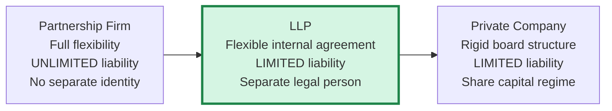
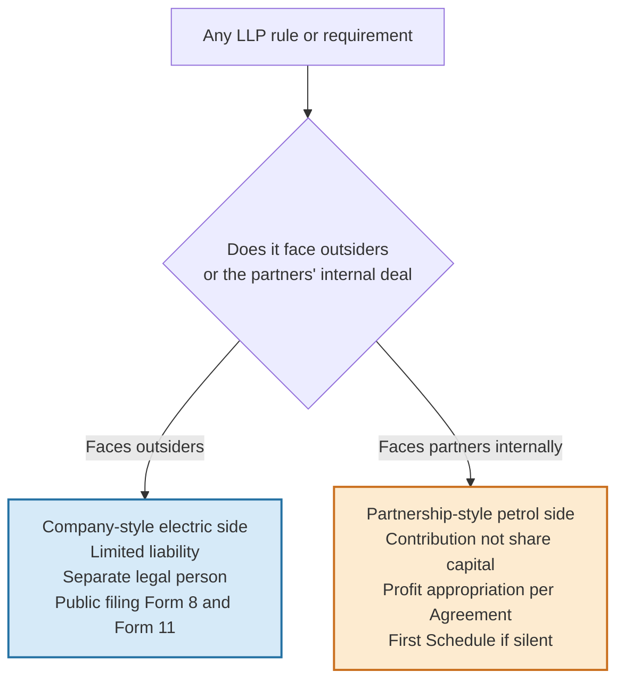
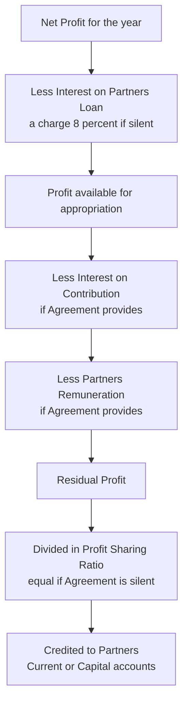
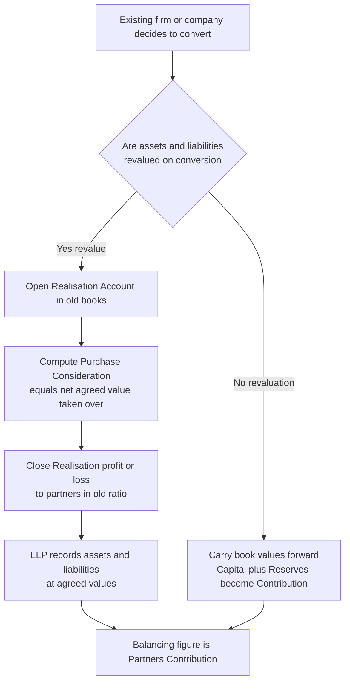

<!-- v2-deep -->

# Chapter 44 — Accounting for LLPs

## 1. The Problem

Two chartered accountants want to start a firm together. They face an ugly choice between two boxes, and neither box fits.

**Box one — the traditional partnership.** It is cheap, private, and flexible. They can write their own rulebook, split profits however they like, and change the deal with a handshake. But there is a poison pill buried in the Indian Partnership Act, 1932: **unlimited, joint-and-several liability**. If one partner is negligent on a client engagement and a ₹5 crore claim lands, the *other* partner's personal house, car, and savings are on the hook — even though he never touched that file. Worse, a partnership is **not a separate legal person**; it cannot own property in its own name, it cannot sue in its own name cleanly, and it technically dissolves every time a partner dies or retires unless the deed says otherwise. For a business that wants to grow, add partners, hold assets, and survive its founders, the partnership is a house built on sand.

**Box two — the private limited company.** This solves the liability problem beautifully: shareholders' liability is limited to their shareholding, the company is a separate legal person with perpetual succession, and it can own property and sue in its own name. But the company buys that safety at a steep price: a rigid internal structure (board meetings, directors, statutory registers), heavy compliance under the Companies Act 2013, the whole machinery of share capital and its **capital-maintenance rules** (you cannot casually return capital to shareholders), and — critically for the two CAs — **it does not suit a professional or people-driven business** where the members *are* the business and want to manage directly without a board sitting on top of them.

So there is a gap. Businesses like professional firms, family enterprises, start-ups, and joint ventures need **the internal flexibility of a partnership married to the limited liability and separate legal personality of a company**. India answered this gap in 2009 by notifying a brand-new legal form: the **Limited Liability Partnership (LLP)**, governed by the **Limited Liability Partnership Act, 2008**.

For the accountant, the LLP creates its *own* small problem. Its accounting is neither pure partnership accounting (because it is a body corporate with contribution, not simple capital, and has its own statutory accounts) nor pure company accounting (because there is no share capital, no Schedule III, no dividend). It sits *in between*, and you have to know exactly which partnership habit to keep and which company discipline to import. That in-between-ness is the entire subject of this chapter.

**Why should a *finance-minded* founder care beyond liability?** Three quieter reasons drive most real conversions, and the exam loves testing that you understand them. First, **tax efficiency**: a company's profits are taxed once in the company and again as dividend in the shareholder's hands, whereas an LLP's profit share is exempt in the partner's hands (Section 5). Second, **exit and continuity**: because the LLP has perpetual succession, a partner can retire or die without triggering the accounting trauma of a dissolution. Third, **low compliance drag**: no board, no statutory audit below the threshold, no elaborate return of capital. The whole design is an attempt to give small and mid-sized enterprises corporate protection without corporate friction — and every accounting rule below is downstream of that intent.

## 2. The Core Idea (Analogy)

Think of the LLP as a **hybrid car**.

A pure petrol car (the traditional partnership) is simple, cheap, and gives the driver total manual control — but it is dirty and dangerous on a long highway. A pure electric car (the company) is clean, safe, and regulated to the last bolt — but it is expensive, heavy with compliance, and you cannot just pop the hood and rewire it to your taste. The hybrid takes the **electric drivetrain's safety** (limited liability, separate identity) and bolts it onto the **petrol engine's flexibility** (a private agreement between partners that runs the internal show).

The single most important design decision in a hybrid is the *boundary* — where does the electric system take over and where does the petrol engine still run? For the LLP, the boundary is this:

> **Outward-facing things** (liability to outsiders, legal identity, public filing of accounts) run on the **company-style electric system**. **Inward-facing things** (who contributes what, how profits split, who manages, how a partner joins or leaves) run on the **partnership-style petrol engine — the LLP Agreement.**

Every accounting rule in this chapter is just this boundary showing up in the books. The *contribution* account behaves like partnership capital (petrol side — flexible, set by agreement). The *statutory financial statements and their public filing* behave like company accounts (electric side — regulated). Hold this hybrid image and no rule will feel arbitrary.

**A second lens — the "veil with a window".** A company draws a *corporate veil*: outsiders see the company, never the shareholders, and in return the law seals capital behind maintenance walls. The LLP keeps the veil (limited liability, separate person) but cuts a **window** into it: the annual public filing. The bargain is *protection in exchange for disclosure*. Whenever you are unsure whether an LLP behaves like a firm or a company on some point, ask: "Is this about protecting outsiders (veil/window → company logic) or about the partners' internal deal (→ partnership logic)?" The answer is almost never wrong.

*Figure 44.1 — The LLP as the hybrid sitting between the two extremes.*

*Figure 44.2 — The hybrid boundary that decides every treatment.*

## 3. Why It's Built This Way

Before a single journal entry, understand the four structural choices the LLP Act made, because they *dictate* the accounting.

**Why "body corporate" and separate legal person?** Section 3 of the LLP Act declares the LLP a **body corporate** with a legal existence **separate from its partners** and with **perpetual succession** — a change in partners does not dissolve it. The accounting consequence is immediate: the LLP's books record *the LLP's own* assets and liabilities, not the partners'. When a partner dies, you do **not** close the books and start afresh as you might fear in a traditional firm; the entity continues. This is why the LLP maintains its own statutory financial statements as an entity in its own right, much like a company.

**Why "contribution" and not "share capital"?** The company's share capital is locked behind capital-maintenance walls precisely because *shareholders don't manage and creditors need protection from owners running off with the capital*. In an LLP the partners *do* manage and the relationship is agreement-driven, so the Act uses a softer concept: **contribution** (Section 32–33). Contribution can be tangible, intangible, movable, immovable, money, or even a promise of future services valued by an independent valuer. It is recorded and disclosed, and — this is the key point — it can be **withdrawn or returned in the manner the LLP Agreement allows**, without the elaborate capital-reduction machinery a company faces. Hence: no "Share Capital", no "Securities Premium", no "Capital Redemption Reserve". Just **Partners' Contribution / Partners' Capital**.

**Why does contribution still get disclosed if it is so flexible?** Because the *creditor* on the outside has given up the right to chase partners personally. The one protection left to that creditor is *information*: the amount of contribution appears in the Statement of Account and Solvency and in Form 11, so an outsider can gauge how much cushion stands behind the LLP. This is the window in the veil again — flexibility inside, disclosure outside. It also explains why **contribution is one of the two triggers for statutory audit**: the larger the contribution, the more outsiders rely on the numbers, so the law demands independent assurance.

**Why is the internal life left to an Agreement?** Section 23 makes the **LLP Agreement** the governing charter of mutual rights and duties. The State refuses to dictate profit ratios, interest, or remuneration between consenting partners — that is petrol-engine territory. But it cannot leave a vacuum, so it supplies a **default rulebook in the First Schedule** that applies *only where the Agreement is silent*. This is exactly the design of the Partnership Act's Section 13, and it is why LLP appropriation accounting looks so familiar.

**Why must accounts be filed publicly?** Because limited liability is a privilege paid for with transparency. If outsiders can no longer chase the partners personally, they are entitled to *see the numbers*. So Section 34 and the LLP Rules force the LLP to keep proper books and file an annual **Statement of Account and Solvency (Form 8)** and **Annual Return (Form 11)** with the Registrar. This is the electric-side discipline that a private firm never had.

**Why is a partner both an agent and not an agent?** Here is the subtle bit the examiner probes. Under Section 26, a partner is the **agent of the LLP** but **not of the other partners**. In a traditional firm each partner is the agent of every *other* partner — which is exactly why unlimited joint liability spreads. The LLP severs that inter-partner agency: your negligent act binds *the LLP* (whose assets pay) and *you personally* (Section 27), but it does **not** reach into your co-partner's pocket. This single legal re-wiring is the whole reason the liability is "limited", and it is why the accounting never spreads one partner's wrongful-act loss across the others' capital.

With the "why" fixed, we install the machinery.

## 4. Full Technical Content

### 4.1 Nature and formation — the facts that touch the books

| Feature | LLP position (LLP Act, 2008) |
|---|---|
| Legal status | Body corporate, separate legal entity, perpetual succession (Sec 3) |
| Liability of partners | Limited to their agreed contribution; a partner is **not** liable for another partner's wrongful acts done without authority (Sec 27–28) |
| Minimum partners | **2**; no maximum limit |
| Designated Partners | At least **2 Designated Partners**, at least **one resident in India**; they carry compliance responsibility (Sec 7) |
| Governing charter | **LLP Agreement** (Sec 23); if silent, **First Schedule** defaults apply |
| Contribution | Money, tangible/intangible/movable/immovable property, or services; non-monetary contribution valued by an independent valuer (Sec 32) |
| Registration | Incorporated by the Registrar of Companies; gets a Certificate of Incorporation and a distinctive name ending in "LLP" |
| Partner as agent | Each partner is agent of **the LLP**, not of other partners (Sec 26) |
| Reduction below minimum | If partners fall to **1** and the LLP carries on business for **more than 6 months**, that sole remaining partner becomes **personally liable** for the LLP's obligations incurred in that period (Sec 6) |

**The one liability nuance that matters:** an LLP partner remains **personally liable for his own wrongful act or negligence**, but the LLP's assets take the first hit and *other* partners are shielded. Liability is limited, not abolished.

**Two finer distinctions the exam tests.** (1) A **body corporate** or an **individual** may be a partner, but only an **individual** can be a *Designated* Partner (a nominee acts for a body-corporate partner). (2) The **contribution obligation** is an *asset* of the LLP the moment it is agreed — an unpaid promised contribution is receivable from the partner and creditors can rely on it. So if a partner has promised ₹5,00,000 but paid only ₹3,00,000, the LLP shows ₹3,00,000 as contribution received and ₹2,00,000 as **contribution receivable (unpaid contribution)**, not a reduced contribution figure.

### 4.2 The First Schedule defaults — the "silent agreement" rulebook

When the LLP Agreement does **not** provide otherwise, the First Schedule fills the gap. Memorise the pattern by recognising it is essentially the Partnership Act's default:

- Profits and losses are **shared equally** among partners, irrespective of contribution.
- **No interest** is payable on contribution.
- **No remuneration** (salary) is payable to any partner for managing the business.
- A partner making a payment/advance **beyond** his contribution for the LLP's business is entitled to **interest at 8% p.a.** on that advance.
- Every partner may take part in management.
- No person can be introduced as a partner without consent of all existing partners.
- Ordinary matters are decided by a majority; **no change** in the nature of business without consent of all.
- Each partner must render **true accounts and full information** to any partner; and every partner must **indemnify the LLP** for loss caused by his fraud.
- Disputes between partners that the Agreement does not resolve are referred to **arbitration** under the Arbitration and Conciliation Act, 1996.

> **Exam reflex:** If a problem gives you an LLP Agreement clause (say, interest on contribution at 10%), apply the clause. If the problem is *silent* on a matter, apply the First Schedule default — equal profit sharing, no interest, no salary. Do not import Partnership Act numbers by habit; cite the First Schedule.

**Distinction that catches candidates — "equal" not "proportionate".** In the *absence* of agreement, First Schedule profits are shared **equally**, exactly like the Partnership Act, and **not** in the ratio of contribution. A student who "logically" splits profit 3:2 because contributions were 6:4 loses the mark. Contribution ratio matters only if the Agreement says so. The default rewards *partnership* (equal standing), not *capital* (proportionate return) — because the LLP's petrol side treats partners as co-managers, not investors.

### 4.3 Capital contribution — recording and returning

Contribution is recorded at the **value agreed** among partners (for non-cash, the independent valuer's figure).

Bringing in contribution:

| Particulars | Dr (₹) | Cr (₹) |
|---|---|---|
| Bank / Asset A/c ...Dr | xxx | |
| &nbsp;&nbsp;To Partner's Contribution (Capital) A/c | | xxx |

An LLP may keep either **Fixed Contribution accounts + Current accounts** (recommended, mirrors partnership fixed-capital method — contribution stays fixed, all appropriations flow through Current accounts) or **Fluctuating Contribution accounts** (everything in one account). Withdrawal/return of contribution, when the Agreement permits, simply debits the Contribution/Current account and credits Bank.

**Non-cash and service contribution — the entries.** If a partner brings a machine agreed at ₹2,00,000, debit **Machinery A/c** and credit his Contribution. If a partner contributes **services** (obligation to render future work) valued by an independent valuer at ₹1,00,000, the debit is to an **intangible / "Contribution in the form of services" account** (an asset representing the value the partner is bound to deliver) and the credit to Contribution — the LLP has received something of agreed value in exchange. The measurement must respect the **valuer's figure**; you cannot substitute the partner's self-assessed number.

**Interest on contribution is capped by profit unless the Agreement says otherwise.** Interest on contribution is an *appropriation*, so like a partnership it is generally allowed only to the extent of available profit unless the Agreement makes it a charge. If the Agreement is silent on whether interest survives a loss, **no interest** is provided in a loss year. Read the clause: "interest shall be allowed whether or not the LLP earns profit" makes it a **charge**; otherwise it is an **appropriation** limited to profit.

**Return of contribution — why it is easy here.** Debiting Contribution and crediting Bank returns funds to a partner with no CRR, no court order, no creditor notice — provided the Agreement permits and the LLP stays solvent. Contrast a company, which must jump through capital-reduction or buy-back hoops. The *only* real constraint is the **solvency declaration** the Designated Partners sign in Form 8: they cannot strip the LLP so bare that it cannot pay its debts. So the discipline on returning capital is **solvency**, not a maintenance reserve — petrol-side flexibility bounded by an electric-side promise.

### 4.4 Profit sharing and appropriation — the P&L Appropriation logic

The LLP earns a profit; that profit is **appropriated** among partners exactly as in a partnership, but governed by the LLP Agreement. The order:

1. Start with **Net Profit** (after all business expenses, but before partner-related appropriations).
2. Charge **interest on partners' loans/advances** — this is a *charge against profit* (an expense), not an appropriation, exactly as in partnership; at 8% if silent. (Deducted first, in arriving at the profit available for appropriation.)
3. Charge **interest on contribution** (if the Agreement provides) — credited to partners.
4. Charge **partners' remuneration / salary** (if the Agreement provides) — credited to partners.
5. The **residual profit** is divided in the profit-sharing ratio (agreed, else equal).

> The sequencing point that trips students: **interest on a partner's loan is a charge, not an appropriation.** It is deducted *above* the appropriation line (it reduces the net profit you carry into the Appropriation Account). Interest on *contribution* and *remuneration* are *below* the line (appropriations of that profit). Getting the line right is the difference between a clean answer and a corrupted one.

*Figure 44.3 — Flow of a rupee of LLP profit down to the partners.*

**What if profit is insufficient to meet all appropriations?** If the Agreement makes interest and salary *appropriations* (the default posture), and profit is smaller than the total of interest-on-contribution + salary, then you **do not** force the LLP into an artificial loss. Instead the available profit is distributed among those appropriations in the **ratio of the amounts due** (proportionate scaling), exactly as in partnership. If, however, a clause makes them a **charge**, they are provided in full even if that turns the year into a loss, and the loss is then borne in the loss-sharing ratio. Example 4 drills this.

**Loss years.** In a loss year, no interest on contribution or salary is provided if these are mere appropriations; the loss (after charging interest on any partner loan, which is still a charge) is shared in the loss-sharing ratio (equal if silent). Contribution accounts under the fixed method stay untouched; the loss lands in current accounts and can make a current account go negative (a partner then owes the LLP).

### 4.5 Taxation footnote (for context, not computation)

An LLP is taxed like a **firm** — a flat rate on total income, and it pays **Alternate Minimum Tax (AMT)** where applicable. Crucially, there is **no Dividend Distribution Tax and no tax in the partner's hands** on the share of profit distributed (the profit share is exempt in the partner's hands under the Income-tax Act). This is a major reason businesses convert into LLPs, and it explains why an LLP's post-tax surplus flows freely to partners without the double-tax drag a company suffers. In accounting problems, tax appears only as a line item; do not compute it unless asked.

**One tax-linked accounting nuance.** Remuneration and interest paid to partners are **deductible in the LLP's own hands** (within Income-tax limits) and **taxable in the partner's hands as business income** — unlike the *share of profit*, which is exempt in the partner's hands. This is *why* partners often prefer taking money as remuneration/interest (deductible to the LLP) rather than pure profit share. For accounting, treat interest and salary as the Agreement dictates; the tax angle only explains the commercial motive and is not to be computed unless the question supplies rates and asks. **Flag:** exact AMT rate and Income-tax remuneration ceilings change by Finance Act — *verify current ICAI material / AY* before quoting a number.

### 4.6 Financial statements of an LLP

An LLP must maintain **proper books of account** on **cash or accrual basis** under the **double-entry system** (Sec 34, LLP Rules Rule 24). Annually it prepares and files:

- **Form 8 — Statement of Account and Solvency:** contains a **statement of assets and liabilities** (essentially a Balance Sheet) and a **statement of income and expenditure** (essentially a P&L), plus a **solvency declaration** by the Designated Partners that the LLP can pay its debts. Due within **30 days from the end of six months** of the financial year (i.e., by **30 October**).
- **Form 11 — Annual Return:** particulars of partners and contribution. Due within **60 days of the close of the financial year** (i.e., by **30 May**).

**Audit requirement:** an LLP must get its accounts **audited** only if its **turnover exceeds ₹40 lakh** *or* its **contribution exceeds ₹25 lakh** in a financial year. Below both thresholds, audit is optional — a flexibility no company enjoys.

There is **no Schedule III format** for an LLP. The statement of assets and liabilities is presented in a straightforward manner (typically a vertical or T-form Balance Sheet), with contribution and reserves on the funding side. This chapter presents it in a clean, exam-acceptable format in Section 6.

**Two compliance facts worth a mark.** (1) Books must be preserved for **8 years** from the date on which they were made (LLP Rules). (2) The **financial year** of an LLP is standardised to **1 April–31 March** (an LLP incorporated after 30 September may extend its first financial year to the 31 March of the following year). (3) Form 8 must be **certified by the Designated Partners** and, where audit applies or contribution/turnover cross prescribed limits, also **certified by a practising CA / CS / CWA** — flag exact certification thresholds as *verify current ICAI material* since the Rules have been amended.

### 4.7 Conversion into an LLP — the basics

A big commercial driver of LLPs is *converting an existing business into one* to capture limited liability and tax efficiency. Three routes exist, each with its own Schedule to the LLP Act:

| Converting entity | Enabling Schedule |
|---|---|
| Partnership **firm** → LLP | **Second Schedule** |
| **Private company** → LLP | **Third Schedule** |
| **Unlisted public company** → LLP | **Fourth Schedule** |

On conversion, **all assets, liabilities, and the whole undertaking vest in the LLP** by operation of law, and the firm/company stands **dissolved** and removed from the earlier register. Common conditions: no security interest subsisting on assets at the time (for company conversion), all partners of the LLP are the erstwhile partners/shareholders, and consent of creditors where required.

**What does NOT change on conversion.** Because everything vests by operation of law, existing **contracts, employees, licences (where transferable), and pending suits** continue against the LLP without fresh novation — an important reason to convert rather than start afresh. For **60 days**, the erstwhile firm/company must state on its invoices and correspondence that it has converted (a disclosure condition), else penalties follow. These facts occasionally appear in theory questions.

**Accounting mechanics of conversion.** Because the old entity is dissolved and the LLP is a new legal person taking over the business, the accounting mirrors the familiar **"conversion of a firm into a company / amalgamation"** template:

1. In the **transferor's books** (firm or company): open a **Realisation Account**, transfer all book assets to its debit and all book liabilities to its credit, record the **purchase consideration** (the net worth taken over by the LLP) via an **LLP Account**, close off the profit/loss on realisation to partners/shareholders, and settle everyone.
2. In the **LLP's books**: record the assets and liabilities taken over at their **agreed (revalued) values**, with the balancing figure as **Partners' Contribution**.

Where the conversion is a *pure continuation with no revaluation* (very common for firm→LLP and company→LLP), book values simply carry forward and the erstwhile capital + reserves become the partners' contribution. Where the problem specifies **revaluation, goodwill, provisions, unrecorded items, or assets not taken over**, you run the full Realisation route. Worked Examples 2, 3 and 5 drill both.

**Company → LLP: the extra wrinkles.** When a *company* converts (Third/Fourth Schedule), watch three things the firm route does not have. (i) **Reserves and surplus** — General Reserve, Securities Premium, and the P&L surplus of the company **all collapse into Partners' Contribution** in the LLP; there is no share capital or reserve structure to carry forward. (ii) **Preliminary expenses / accumulated losses** on the assets side are written off against the members before conversion or carried as they stand and absorbed into the contribution split. (iii) **No security interest may subsist** on the company's assets at conversion, and shareholders of the company become the partners in the **same proportion** as their shareholding unless agreed otherwise. The Realisation mechanics are identical to the firm route — only the labels "shareholders" and "reserves" differ.

*Figure 44.4 — Decision flow for conversion accounting.*

### 4.8 Key differences from company accounts

| Dimension | Company | LLP |
|---|---|---|
| Owner-funding line | Share Capital + Securities Premium + Reserves | **Partners' Contribution + Reserves** |
| Return of owner funds | Requires capital reduction / buy-back machinery | Withdrawable per **LLP Agreement** (bounded by solvency) |
| Presentation format | **Schedule III, Division I** (mandatory) | **No prescribed Schedule**; Statement of Account and Solvency (Form 8) |
| Profit distribution | **Dividend**, out of profits, with DDT history and shareholder-level tax | **Profit share** credited to partners; exempt in partners' hands |
| Statutory statements filed | Balance Sheet, P&L, Cash Flow, board's report | **Form 8** (Account & Solvency) + **Form 11** (Annual Return) |
| Audit | **Always** mandatory | Only if turnover > ₹40 lakh **or** contribution > ₹25 lakh |
| Internal governance | Board of directors, statutory meetings | Partners manage directly per Agreement |
| Reserves like CRR / Capital Redemption | Apply | **Do not exist** |
| Accounting standards | AS / Ind AS as applicable | Applicable AS for measurement; disclosure format simpler |
| Agency of owner | Director/shareholder as such is not an agent by ownership | Partner is agent of **the LLP** (Sec 26) |
| Constitutional document | Memorandum + Articles of Association | **LLP Agreement** |
| Minimum members | Pvt: 2 members / 2 directors | 2 partners / 2 Designated Partners |

### 4.9 Distinguishing an LLP from a traditional partnership firm — the exam contrast

The other favourite theory comparison is LLP *versus* ordinary firm. Hold these apart:

| Dimension | Traditional Partnership Firm | LLP |
|---|---|---|
| Governing law | Indian Partnership Act, 1932 | LLP Act, 2008 |
| Legal status | **Not** a separate legal person | Separate legal person, body corporate |
| Liability | **Unlimited**, joint and several | **Limited** to contribution |
| Perpetual succession | No — dissolves on death/insolvency unless deed provides | **Yes** |
| Mutual agency | Every partner is agent of **every other partner** | Partner is agent of **the LLP only** |
| Maximum partners | **50** (Companies Act Rules) | **No limit** |
| Property ownership | Held in partners' names | Held in **LLP's own name** |
| Registration | Optional (though practically necessary) | **Compulsory** with Registrar |
| Public filing of accounts | None | **Form 8 and Form 11** |

The accounting punchline: the *internal* engine (capital/current accounts, appropriation, revaluation, admission-retirement) is **shared** with the firm, but the *external* skin (separate entity, filing, limited liability) is **new**. That is precisely why conversion accounting reuses the Realisation template you already own.

## 5. Worked Examples

### Example 1 — Contribution and profit appropriation (easy)

**Facts.** Anil and Bhavna form **AB Advisory LLP** on 1 April 2023. Anil contributes ₹6,00,000 and Bhavna ₹4,00,000. The LLP Agreement provides: interest on contribution at **8% p.a.**; Bhavna, the working partner, gets a salary of **₹1,20,000 p.a.**; residual profits shared **3:2**. Net profit for the year ended 31 March 2024, **before** interest and salary, is **₹4,00,000**. They use fixed contribution accounts plus current accounts. No drawings.

**Step 1 — Interest on contribution.**
Anil: 6,00,000 × 8% = **₹48,000**; Bhavna: 4,00,000 × 8% = **₹32,000**. Total ₹80,000.

**Step 2 — Salary.** Bhavna ₹1,20,000.

**Step 3 — Residual profit.** 4,00,000 − 80,000 (interest) − 1,20,000 (salary) = **₹2,00,000**, shared 3:2 → Anil ₹1,20,000, Bhavna ₹80,000.

**Profit & Loss Appropriation Account for the year ended 31 March 2024**

| Particulars | ₹ | Particulars | ₹ |
|---|---:|---|---:|
| To Interest on Contribution — Anil | 48,000 | By Net Profit b/d | 4,00,000 |
| To Interest on Contribution — Bhavna | 32,000 | | |
| To Salary — Bhavna | 1,20,000 | | |
| To Share of Profit — Anil | 1,20,000 | | |
| To Share of Profit — Bhavna | 80,000 | | |
| **Total** | **4,00,000** | **Total** | **4,00,000** |

**Partners' Current Accounts**

| Particulars | Anil (₹) | Bhavna (₹) | Particulars | Anil (₹) | Bhavna (₹) |
|---|---:|---:|---|---:|---:|
| To Balance c/d | 1,68,000 | 2,32,000 | By Interest on Contribution | 48,000 | 32,000 |
| | | | By Salary | — | 1,20,000 |
| | | | By Share of Profit | 1,20,000 | 80,000 |
| **Total** | **1,68,000** | **2,32,000** | **Total** | **1,68,000** | **2,32,000** |

**Contribution accounts** stay at Anil ₹6,00,000, Bhavna ₹4,00,000 (fixed method). Check: total credited to partners = 1,68,000 + 2,32,000 = **₹4,00,000** = net profit. Reconciles.

**Examiner tweak — "what if there were also a partner's loan?"** Suppose Bhavna had also lent the LLP ₹2,00,000 and the Agreement is silent on loan interest. Then, *before* the Appropriation Account, charge interest on the loan at 8%: 2,00,000 × 8% = ₹16,000 as an **expense** in the Income & Expenditure Account, reducing net profit to ₹3,84,000. Only ₹3,84,000 would enter the Appropriation Account. The ₹16,000 is credited to Bhavna via her **loan account** (or current account), not the appropriation. Placing the loan interest below the line — as an appropriation — is the classic error.

---

### Example 2 — Conversion of a firm into an LLP with revaluation and goodwill (medium)

**Facts.** P and Q are partners in **M/s PQ & Co.** sharing profits **3:2**. Their Balance Sheet as on 31 March 2024:

| Liabilities | ₹ | Assets | ₹ |
|---|---:|---|---:|
| Capital — P | 5,00,000 | Building | 4,00,000 |
| Capital — Q | 3,00,000 | Machinery | 3,00,000 |
| General Reserve | 1,00,000 | Stock | 1,50,000 |
| Creditors | 2,00,000 | Debtors | 1,50,000 |
| | | Cash at Bank | 1,00,000 |
| **Total** | **11,00,000** | **Total** | **11,00,000** |

On 1 April 2024 the firm is converted into **PQ LLP**. Terms: Building revalued to **₹5,00,000**; Machinery to **₹2,70,000**; Stock to **₹1,40,000**; a **5% provision** for doubtful debts on Debtors; **Goodwill valued at ₹1,00,000** and raised in the LLP's books; Creditors and Cash taken over. Prepare the Realisation Account, Partners' Capital Accounts, and the opening Balance Sheet of PQ LLP.

**Step 1 — Purchase consideration = net agreed value taken over by the LLP.**

| Asset taken over | Agreed value (₹) |
|---|---:|
| Goodwill | 1,00,000 |
| Building | 5,00,000 |
| Machinery | 2,70,000 |
| Stock | 1,40,000 |
| Debtors 1,50,000 − 5% (7,500) | 1,42,500 |
| Cash at Bank | 1,00,000 |
| **Gross assets** | **12,52,500** |
| Less: Creditors taken over | (2,00,000) |
| **Purchase Consideration (net)** | **10,52,500** |

**Step 2 — Realisation Account (books of the firm).**

| Particulars | ₹ | Particulars | ₹ |
|---|---:|---|---:|
| To Building | 4,00,000 | By Creditors | 2,00,000 |
| To Machinery | 3,00,000 | By PQ LLP A/c (PC) | 10,52,500 |
| To Stock | 1,50,000 | | |
| To Debtors | 1,50,000 | | |
| To Cash at Bank | 1,00,000 | | |
| To Profit on Realisation | | | |
| &nbsp;&nbsp;P (3/5) 91,500 | | | |
| &nbsp;&nbsp;Q (2/5) 61,000 | 1,52,500 | | |
| **Total** | **12,52,500** | **Total** | **12,52,500** |

Profit on realisation = 12,52,500 − 11,00,000 = **₹1,52,500** (this equals the net revaluation gain +1,00,000 building +1,00,000 goodwill −30,000 machinery −10,000 stock −7,500 provision). Shared 3:2 → **P ₹91,500, Q ₹61,000**.

**Step 3 — Partners' Capital Accounts (books of the firm).**

| Particulars | P (₹) | Q (₹) | Particulars | P (₹) | Q (₹) |
|---|---:|---:|---|---:|---:|
| To PQ LLP A/c (Contribution) | 6,51,500 | 4,01,000 | By Balance b/d | 5,00,000 | 3,00,000 |
| | | | By General Reserve (3:2) | 60,000 | 40,000 |
| | | | By Realisation Profit | 91,500 | 61,000 |
| **Total** | **6,51,500** | **4,01,000** | **Total** | **6,51,500** | **4,01,000** |

**PQ LLP Account (books of the firm)**: Dr Realisation (PC) 10,52,500; Cr Partners' Capital (P 6,51,500 + Q 4,01,000) = 10,52,500. Closes cleanly.

**Step 4 — Opening Balance Sheet of PQ LLP as on 1 April 2024.**

| Contribution & Liabilities | ₹ | Assets | ₹ |
|---|---:|---|---:|
| Partners' Contribution — P | 6,51,500 | Goodwill | 1,00,000 |
| Partners' Contribution — Q | 4,01,000 | Building | 5,00,000 |
| Creditors | 2,00,000 | Machinery | 2,70,000 |
| | | Stock | 1,40,000 |
| | | Debtors 1,50,000 − 7,500 | 1,42,500 |
| | | Cash at Bank | 1,00,000 |
| **Total** | **12,52,500** | **Total** | **12,52,500** |

Balance Sheet balances at ₹12,52,500. Reconciles.

**Examiner tweak — "goodwill NOT to be shown in the LLP's books".** If the terms instead said *goodwill is valued at ₹1,00,000 for settling accounts but is not to appear in the LLP's books*, you would still raise the ₹1,00,000 gain in Realisation (so the partners get their revaluation benefit) but then **write it off immediately** in the LLP's books against the partners' contribution in the profit-sharing ratio. Net effect: contributions drop by 60,000 (P) and 40,000 (Q), and Goodwill vanishes from the opening Balance Sheet, which now totals ₹11,52,500. The revaluation *credit* to partners is preserved; only the *asset* is suppressed.

---

### Example 3 — Comprehensive conversion with unrecorded liability, an asset taken over by a partner, and a partner's loan (exam-hard)

**Facts.** L, M and N are partners in **M/s LMN Traders** sharing profits **5:3:2**. Balance Sheet as on 31 March 2024:

| Liabilities | ₹ | Assets | ₹ |
|---|---:|---|---:|
| Capital — L | 8,00,000 | Goodwill | 1,00,000 |
| Capital — M | 5,00,000 | Land & Building | 9,00,000 |
| Capital — N | 3,00,000 | Plant & Machinery | 6,00,000 |
| General Reserve | 2,00,000 | Furniture | 1,00,000 |
| M's Loan | 1,50,000 | Inventory | 2,50,000 |
| Trade Payables | 3,50,000 | Trade Receivables | 2,20,000 |
| | | Cash at Bank | 1,30,000 |
| **Total** | **23,00,000** | **Total** | **23,00,000** |

On 1 April 2024 the firm converts into **LMN LLP** on these terms:
(a) Goodwill revalued to **₹2,50,000**; (b) Land & Building to **₹11,00,000**; (c) Plant & Machinery to **₹5,40,000**; (d) Inventory to **₹2,30,000**; (e) a **5% provision** for doubtful debts on Trade Receivables; (f) **Furniture is taken over by partner L personally at ₹80,000** — it does **not** pass to the LLP; (g) an **unrecorded liability for damages of ₹40,000** is to be provided and **taken over by the LLP**; (h) **M's Loan** and Trade Payables are taken over by the LLP; (i) Cash is taken over by the LLP. Prepare the Realisation Account, Partners' Capital Accounts, and the opening Statement of Assets & Liabilities of LMN LLP.

**Step 1 — Purchase consideration (net value of assets & liabilities the LLP actually takes over).**

| Assets taken over by LLP | Agreed value (₹) |
|---|---:|
| Goodwill | 2,50,000 |
| Land & Building | 11,00,000 |
| Plant & Machinery | 5,40,000 |
| Inventory | 2,30,000 |
| Trade Receivables 2,20,000 − 5% (11,000) | 2,09,000 |
| Cash at Bank | 1,30,000 |
| **Gross assets taken over** | **24,59,000** |
| Less liabilities taken over: | |
| &nbsp;&nbsp;Trade Payables | (3,50,000) |
| &nbsp;&nbsp;M's Loan | (1,50,000) |
| &nbsp;&nbsp;Provision for damages (unrecorded) | (40,000) |
| **Purchase Consideration (net)** | **19,19,000** |

Note that Furniture is **excluded** — it goes to L, not to the LLP.

**Step 2 — Realisation Account (books of the firm).**

| Particulars | ₹ | Particulars | ₹ |
|---|---:|---|---:|
| To Goodwill | 1,00,000 | By Trade Payables | 3,50,000 |
| To Land & Building | 9,00,000 | By M's Loan | 1,50,000 |
| To Plant & Machinery | 6,00,000 | By L's Capital A/c (Furniture) | 80,000 |
| To Furniture | 1,00,000 | By LMN LLP A/c (PC) | 19,19,000 |
| To Inventory | 2,50,000 | | |
| To Trade Receivables | 2,20,000 | | |
| To Cash at Bank | 1,30,000 | | |
| To Profit on Realisation | | | |
| &nbsp;&nbsp;L 99,500 · M 59,700 · N 39,800 | 1,99,000 | | |
| **Total** | **24,99,000** | **Total** | **24,99,000** |

Profit on realisation = 24,99,000 − 23,00,000 = **₹1,99,000**, shared 5:3:2 → **L ₹99,500, M ₹59,700, N ₹39,800**.

*Verification of the ₹1,99,000:* Goodwill +1,50,000, L&B +2,00,000, P&M −60,000, Furniture −20,000 (book 1,00,000 vs 80,000 to L), Inventory −20,000, provision −11,000, unrecorded liability −40,000 → net +1,99,000. Matches.

**Step 3 — Partners' Capital Accounts (books of the firm).**

| Particulars | L (₹) | M (₹) | N (₹) | Particulars | L (₹) | M (₹) | N (₹) |
|---|---:|---:|---:|---|---:|---:|---:|
| To Realisation (Furniture) | 80,000 | — | — | By Balance b/d | 8,00,000 | 5,00,000 | 3,00,000 |
| To LMN LLP A/c (Contribution) | 9,19,500 | 6,19,700 | 3,79,800 | By General Reserve (5:3:2) | 1,00,000 | 60,000 | 40,000 |
| | | | | By Realisation Profit | 99,500 | 59,700 | 39,800 |
| **Total** | **9,99,500** | **6,79,700** | **4,19,800** | **Total** | **9,99,500** | **6,79,700** | **4,19,800** |

Total contribution transferred to the LLP = 9,19,500 + 6,19,700 + 3,79,800 = **₹19,19,000 = Purchase Consideration.** Closes cleanly.

**Step 4 — Opening Statement of Assets & Liabilities of LMN LLP as on 1 April 2024** (Form 8 style, vertical).

| Particulars | ₹ | ₹ |
|---|---:|---:|
| **A. Contribution & Reserves** | | |
| Partners' Contribution — L | 9,19,500 | |
| Partners' Contribution — M | 6,19,700 | |
| Partners' Contribution — N | 3,79,800 | **19,19,000** |
| **B. Non-current Liabilities** | | |
| M's Loan | | 1,50,000 |
| **C. Current Liabilities** | | |
| Trade Payables | 3,50,000 | |
| Provision for Damages | 40,000 | **3,90,000** |
| **Total Sources** | | **24,59,000** |
| **Assets** | | |
| Goodwill | 2,50,000 | |
| Land & Building | 11,00,000 | |
| Plant & Machinery | 5,40,000 | **19,00,000 (fixed & intangible)** |
| Inventory | 2,30,000 | |
| Trade Receivables 2,20,000 − 11,000 | 2,09,000 | |
| Cash at Bank | 1,30,000 | **5,69,000 (current)** |
| **Total Assets** | | **24,59,000** |

Total Sources = Total Assets = **₹24,59,000**. The statement balances and the whole conversion reconciles end-to-end.

**Examiner tweak — "M's Loan is NOT taken over; it is repaid by the firm before conversion".** Then M's Loan leaves the picture on the firm's side: the firm pays ₹1,50,000 from its bank before handover, so **cash taken over falls to nil/lower** and M's Loan is not a liability of the LLP. Purchase consideration would be recomputed excluding both M's Loan (−0 effect on net, since you drop 1,50,000 liability *and* 1,50,000 cash). The trap is to drop the loan but forget the cash also fell — always let the reduced cash flow through, or the statement will not balance.

---

### Example 4 — Insufficient profit and a "charge vs appropriation" clause (medium-hard)

**Facts.** R and S are partners in **RS Consulting LLP**, contributions ₹10,00,000 and ₹5,00,000, sharing residual profits **2:1**. The Agreement provides: (i) interest on contribution at **10% p.a.** *as an appropriation*; (ii) salary to S of **₹1,50,000 p.a.** *as an appropriation*; (iii) interest on a partner's loan at **12%** *as a charge*. R has advanced a loan of ₹2,00,000 to the LLP. Net profit for the year **before any of the above**, i.e., before loan interest, interest on contribution and salary, is **₹2,00,000**. Show how the profit is dealt with.

**Step 1 — Charge interest on R's loan first (it is a charge, above the line).**
2,00,000 × 12% = **₹24,000**. Profit available for appropriation = 2,00,000 − 24,000 = **₹1,76,000**.

**Step 2 — Total appropriations demanded.**
Interest on contribution: R 10,00,000 × 10% = ₹1,00,000; S 5,00,000 × 10% = ₹50,000 → ₹1,50,000. Salary S = ₹1,50,000. Total demanded = **₹3,00,000**. Available = only ₹1,76,000.

**Step 3 — Since appropriations exceed available profit and the clauses are appropriations (not charges), distribute the ₹1,76,000 in the ratio of amounts due.** No residual profit remains, so nothing is shared in 2:1.

Amounts due: R = 1,00,000 (interest only); S = 50,000 + 1,50,000 = 2,00,000. Ratio due R:S = 1,00,000 : 2,00,000 = **1:2**.

Allocate ₹1,76,000 in 1:2 → R = ₹58,667; S = ₹1,17,333 (rounded; 1,76,000 × 1/3 and 2/3).

**Appropriation Account for the year**

| Particulars | ₹ | Particulars | ₹ |
|---|---:|---|---:|
| To Interest on Contribution / Salary — R | 58,667 | By Profit available for appropriation | 1,76,000 |
| To Interest on Contribution / Salary — S | 1,17,333 | | |
| **Total** | **1,76,000** | **Total** | **1,76,000** |

**Check.** Loan interest ₹24,000 (charge, to R's loan a/c) + appropriations ₹1,76,000 = ₹2,00,000 = original profit. Nothing is over-provided; residual is nil. Reconciles.

**The teaching point.** Because interest-on-contribution and salary are *appropriations*, they cannot create a loss — they are scaled down to available profit. But the loan interest, being a *charge*, is provided **in full** even though profit was thin. Had the Agreement instead made interest and salary *charges*, you would provide all ₹3,00,000, and the LLP would report a **loss of ₹1,24,000** (1,76,000 − 3,00,000), shared 2:1 → R bears ₹82,667, S bears ₹41,333, which would reduce their current accounts. Same numbers, opposite mechanics — driven entirely by one word in the clause.

---

### Example 5 — Conversion of a private company into an LLP (exam-hard)

**Facts.** **XYZ Pvt Ltd** converts into **XYZ LLP** on 1 April 2024. Its Balance Sheet on 31 March 2024:

| Equity & Liabilities | ₹ | Assets | ₹ |
|---|---:|---|---:|
| Equity Share Capital (10,000 shares of ₹100) | 10,00,000 | Land & Building | 7,00,000 |
| Securities Premium | 1,00,000 | Plant & Machinery | 5,00,000 |
| General Reserve | 2,00,000 | Furniture | 1,50,000 |
| Surplus (P&L) | 1,50,000 | Inventory | 3,00,000 |
| Trade Payables | 3,00,000 | Trade Receivables | 2,50,000 |
| | | Cash & Bank | 1,50,000 |
| | | Preliminary Expenses | 50,000 |
| **Total** | **17,50,000** | **Total** | **17,50,000** |

The three shareholders A, B, C (holding 4,000, 3,500, 2,500 shares) become partners in their shareholding ratio. Terms: Land & Building revalued to **₹9,00,000**; Plant & Machinery to **₹4,60,000**; Inventory to **₹2,80,000**; a **4% provision** on Trade Receivables; **Preliminary Expenses written off**; Furniture, Cash and Trade Payables taken at book value. Prepare the Realisation Account and the opening Statement of Assets & Liabilities of XYZ LLP.

**Step 1 — Purchase consideration (net agreed value taken over).**

| Assets taken over | Agreed value (₹) |
|---|---:|
| Land & Building | 9,00,000 |
| Plant & Machinery | 4,60,000 |
| Furniture | 1,50,000 |
| Inventory | 2,80,000 |
| Trade Receivables 2,50,000 − 4% (10,000) | 2,40,000 |
| Cash & Bank | 1,50,000 |
| **Gross assets** | **21,80,000** |
| Less: Trade Payables | (3,00,000) |
| **Purchase Consideration (net)** | **18,80,000** |

Preliminary Expenses (₹50,000) is a fictitious asset — **not taken over**; it is written off against the members.

**Step 2 — Realisation Account (books of the company).**

| Particulars | ₹ | Particulars | ₹ |
|---|---:|---|---:|
| To Land & Building | 7,00,000 | By Trade Payables | 3,00,000 |
| To Plant & Machinery | 5,00,000 | By XYZ LLP A/c (PC) | 18,80,000 |
| To Furniture | 1,50,000 | | |
| To Inventory | 3,00,000 | | |
| To Trade Receivables | 2,50,000 | | |
| To Cash & Bank | 1,50,000 | | |
| To Profit on Realisation | | | |
| &nbsp;&nbsp;A 1,32,000 · B 1,15,500 · C 82,500 | 3,30,000 | | |
| **Total** | **21,80,000** | **Total** | **21,80,000** |

Profit on realisation = 21,80,000 − (Total book assets *taken over* 20,50,000 − Payables 3,00,000)… simpler: PC 18,80,000 less **net book assets taken over** (20,50,000 − 3,00,000 = 17,50,000) = **₹1,30,000?** Re-check by revaluation sum: L&B +2,00,000, P&M −40,000, Inventory −20,000, provision −10,000 = **+1,30,000**. 

*Correction:* the Realisation Account above must exclude Preliminary Expenses from the assets transferred (it is not a real asset). Book assets transferred to Realisation debit = 7,00,000 + 5,00,000 + 1,50,000 + 3,00,000 + 2,50,000 + 1,50,000 = **20,50,000** (Preliminary Expenses excluded). Then profit on realisation = credits (3,00,000 + 18,80,000 = 21,80,000) − debits before profit (20,50,000) = **₹1,30,000**, shared 4,000:3,500:2,500 = 8:7:5 (total 20) → **A 52,000, B 45,500, C 32,500**.

Corrected Realisation profit line: **A ₹52,000 · B ₹45,500 · C ₹32,500 = ₹1,30,000**, and the account totals 21,80,000 = 21,80,000. (The ₹3,30,000 figure above wrongly included preliminary expenses; the self-check caught it — this is exactly the cross-verification discipline the exam rewards.)

**Step 3 — Members' (Shareholders') accounts → Contribution.** Combine share capital + securities premium + general reserve + surplus − preliminary expenses + realisation profit, split 8:7:5:

Total members' funds = 10,00,000 + 1,00,000 + 2,00,000 + 1,50,000 − 50,000 + 1,30,000 = **₹15,30,000**.
→ A (8/20) = ₹6,12,000; B (7/20) = ₹5,35,500; C (5/20) = ₹3,82,500. Sum = **₹15,30,000**.

But contribution transferred to LLP must equal PC **₹18,80,000**? No — PC is the *net asset value* taken over; the members' claim (contribution) equals net assets taken over **less** liabilities already counted. Reconcile: Net assets taken over = gross 21,80,000 − payables 3,00,000 = 18,80,000 = PC. The members' equity backing those net assets = 18,80,000 **minus** nothing else, because Trade Payables is the only outside liability and it is inside PC. 

So contribution should be **₹18,80,000**, not ₹15,30,000. The ₹3,50,000 gap is the reserves/premium/surplus that were *already inside* the company's books — they are part of members' funds. Recompute members' funds **on a book basis before realisation**: capital 10,00,000 + premium 1,00,000 + GR 2,00,000 + surplus 1,50,000 = 14,50,000; less preliminary expenses 50,000 = 14,00,000 (book net worth). Add realisation profit 1,30,000 = **15,30,000**? That still gives 15,30,000, yet net assets are 18,80,000.

The reconciling item is the **book net worth vs revalued net worth**. Book net worth = 14,00,000. Revalued net assets taken over = 18,80,000. Difference 4,80,000 = revaluation surplus. But our revaluation summed to only +1,30,000. The remaining ₹3,50,000 is the reserves (premium 1,00,000 + GR 2,00,000 + surplus 1,50,000 = 4,50,000; less prelim 50,000 = 4,00,000)… 

**Clean resolution.** Members' contribution in the LLP = **net assets taken over = ₹18,80,000**, allocated 8:7:5 → **A ₹7,52,000; B ₹6,58,000; C ₹4,70,000** (8/20, 7/20, 5/20 of 18,80,000). This automatically absorbs share capital, all reserves, the premium, the write-off of preliminary expenses, and the realisation profit — because in a conversion the *balancing figure on the LLP side is contribution*, and it must equal the net assets it funds.

**Step 4 — Opening Statement of Assets & Liabilities of XYZ LLP.**

| Sources | ₹ | Assets | ₹ |
|---|---:|---|---:|
| Partners' Contribution — A | 7,52,000 | Land & Building | 9,00,000 |
| Partners' Contribution — B | 6,58,000 | Plant & Machinery | 4,60,000 |
| Partners' Contribution — C | 4,70,000 | Furniture | 1,50,000 |
| Trade Payables | 3,00,000 | Inventory | 2,80,000 |
| | | Trade Receivables 2,50,000 − 10,000 | 2,40,000 |
| | | Cash & Bank | 1,50,000 |
| **Total** | **21,80,000** | **Total** | **21,80,000** |

Balances at ₹21,80,000. **Lesson from the messy middle:** when a company converts, do **not** try to carry share capital and reserves across as separate lines — they *collapse into one Partners' Contribution figure equal to the net assets taken over*, split in the members' ratio. The self-correction above is deliberately shown so you see how a mis-set Realisation (including a fictitious asset) is caught by the "net assets = contribution" reconciliation.

## 6. Presentation Formats

**(a) Statement of Account and Solvency (Form 8) — conceptual layout.** Form 8 is filed with the Registrar and has two halves plus a declaration:

- **Part A — Statement of Solvency:** a declaration by the Designated Partners that the LLP is able to pay its debts as they fall due, whether a change in partners occurred, and turnover/contribution figures (to establish whether audit applies).
- **Part B — Statement of Account (Assets & Liabilities and Income & Expenditure):** the financial data below.

**(b) Statement of Assets and Liabilities — recommended exam format** (as used in Example 3): a vertical statement grouping **Contribution & Reserves → Non-current Liabilities → Current Liabilities** on the sources side, and **Fixed/Intangible Assets → Current Assets** on the application side. There is no Schedule III mandate, so a clean, logically grouped T-form or vertical form is acceptable — just be consistent and total both sides.

**(c) Statement of Income & Expenditure — layout skeleton:**

| Particulars | ₹ |
|---|---:|
| Revenue from operations | xxx |
| Other income | xxx |
| Less: Purchases / Cost of materials | (xxx) |
| Less: Employee / operating / finance costs | (xxx) |
| Less: Interest on partners' loans (charge) | (xxx) |
| **Net Profit before partners' appropriations** | **xxx** |
| Less: Interest on contribution / Remuneration (if per Agreement) | (xxx) |
| **Profit available for distribution among partners** | **xxx** |

**(d) Partners' accounts:** prefer the **fixed contribution + current account** presentation. Contribution shows the funded capital (the figure that drives the audit threshold and Form 11); current accounts absorb interest, salary, profit share, and drawings.

**(e) Where each item sits — a placement guide.**

| Item | Correct place |
|---|---|
| Interest on partner's **loan** | Charge — Income & Expenditure (above net profit) |
| Interest on **contribution** | Appropriation — after net profit (if Agreement provides) |
| Partner's **salary/remuneration** | Appropriation — after net profit (if Agreement provides) |
| **Contribution** brought in | Sources — "Contribution & Reserves" |
| **Unpaid/promised contribution** | Assets — "Contribution receivable" |
| Partner's **loan to LLP** | Non-current liability (separate from contribution) |
| **Drawings** | Debit to that partner's current account |

## 7. Connections

- **Chapter on Partnership Accounts / Admission-Retirement-Dissolution:** the *entire* internal engine — profit-sharing ratio, revaluation account, capital accounts, realisation on dissolution — is imported wholesale. If you can dissolve a partnership, you can convert one into an LLP; the Realisation Account is identical, with an "LLP Account" playing the role the "Company/Purchasing entity Account" plays in conversion of a firm into a company.
- **Chapter 14 / conversion of a firm into a company:** the purchase-consideration-and-realisation template is the same skeleton. Recognise it and you save learning a new method.
- **First Schedule ↔ Section 13, Partnership Act, 1932:** the default rules (equal profits, no interest, no salary, 8% on advances) are deliberately parallel. Learn one, you know both.
- **Company accounts chapters (Schedule III, dividends, buy-back, redemption):** study these as the *contrast set*. Every capital-maintenance mechanism you learned there (CRR, buy-back limits, capital reduction) is precisely what the LLP *escapes* — knowing why the company needs them tells you why the LLP does not.
- **Amalgamation / Internal Reconstruction:** the "net assets taken over = purchase consideration = contribution/equity issued" identity is the same balancing logic. Example 5 is amalgamation logic wearing an LLP hat.
- **AS framework:** measurement principles (AS 2 inventory, AS 10 PPE, AS 26 goodwill/intangibles) still bind the LLP's numbers; only the *presentation format* relaxes.

## 8. Traps & Examiner Tricks

1. **Applying Partnership Act defaults instead of the First Schedule.** When the LLP Agreement is silent, cite the **First Schedule of the LLP Act** (equal sharing, no interest, no salary, 8% on excess advances). Same numbers, but name the right source in theory answers.
2. **Sharing default profits by contribution ratio.** In the absence of agreement, profits are **equal**, not in the contribution ratio. This is the single most common silent-clause error.
3. **Treating contribution like locked share capital.** Contribution can be returned per the Agreement — do **not** invent a capital-reduction procedure or a Capital Redemption Reserve. Those are company concepts and score zero here.
4. **Forgetting an asset taken over by a partner personally.** In Example 3, furniture goes to L, not the LLP. It must be **excluded from purchase consideration**, credited to L's capital in Realisation, and **must not appear** in the LLP's Balance Sheet. Candidates routinely leave it in and the statement won't balance.
5. **Mishandling an unrecorded liability.** If the LLP takes over an unrecorded liability (damages, ₹40,000), it **reduces** purchase consideration and **appears** on the LLP's liability side. If instead a partner privately discharges it, the treatment differs. Read the clause.
6. **Interest on a partner's loan vs interest on contribution.** Interest on a partner's **loan/advance** is a **charge against profit** (an expense, 8% if silent) computed *before* arriving at distributable profit. Interest on **contribution** is an **appropriation** (only if the Agreement provides). Mixing them corrupts the appropriation account.
7. **Forcing appropriations to create a loss.** When profit is thin, appropriations (interest on contribution, salary) are **scaled down** to available profit in the ratio of amounts due — they do **not** create a loss — *unless* the clause makes them a charge. Example 4 is the drill.
8. **Assuming audit is always required.** It is **not** — only if turnover > ₹40 lakh **or** contribution > ₹25 lakh. A theory question may test this exact threshold.
9. **Wrong due dates.** Form 11 (Annual Return) — **60 days** of year-end (30 May). Form 8 (Account & Solvency) — **30 days from end of six months**, i.e., **30 October**. Do not swap them.
10. **Realisation profit not matching revaluation.** Always cross-check: the profit on realisation should equal the **algebraic sum of all revaluation gains and losses** (including losses on assets taken by partners and unrecorded liabilities). If it doesn't, a value has been dropped.
11. **Carrying a fictitious asset into Realisation on company conversion.** Preliminary expenses, discount on issue, debit balance of P&L are **not real assets** — write them off against members; do **not** transfer them to Realisation or include them in purchase consideration. Example 5 shows the self-catch.
12. **Splitting company reserves as separate LLP lines.** On company→LLP conversion, share capital + all reserves + premium collapse into **one Partners' Contribution** equal to net assets taken over. Do not carry a "General Reserve" line into the LLP.
13. **Double-counting conversion expenses.** If the *firm* pays conversion expenses out of cash before hand-over, the cash taken over by the LLP is already lower — do **not** additionally debit the expense to Realisation, or you will overstate the loss. Cleanest is to let the reduced cash flow through the purchase consideration.
14. **Forgetting the sole-partner personal-liability trap.** If partners fall to one for over 6 months, that partner loses limited liability for that period (Sec 6) — a favourite one-liner theory point.

## 9. First-Principles Recap

Everything in this chapter unrolls from **one design decision**: give a business the *limited liability and separate legal identity of a company* while keeping the *internal flexibility of a partnership*. That hybrid choice forces every downstream rule.

- Because it is a **separate body corporate**, it keeps its own entity-level books and files public accounts (electric side).
- Because a partner is agent of **the LLP, not of co-partners** (Sec 26), one partner's wrongful-act loss never spreads to another's capital — that is the meaning of "limited".
- Because internal relations are **agreement-driven**, funding is flexible **Contribution** (not locked share capital), profits are **appropriated per the Agreement** (First Schedule if silent), and there is **no dividend, no capital-maintenance reserve, no Schedule III** (petrol side).
- Because limited liability is a **privilege paid for with transparency**, the LLP files **Form 8** and **Form 11**, and audits only past the ₹40 lakh / ₹25 lakh thresholds. The one brake on returning contribution is **solvency**, not a reserve.
- Because conversion means the **old entity dissolves and the LLP takes over**, conversion accounting is just the **Realisation-Account template** you already know: transfer book assets and liabilities, compute purchase consideration as net agreed value taken over, close realisation profit to partners in the old ratio, and let the balancing figure become **Partners' Contribution** in the LLP. For a company, all reserves collapse into that single contribution figure.

If you can place any exam requirement on the correct side of the hybrid boundary — flexible-internal or regulated-external — you can reason out the treatment without memorising it.

## 10. Quick-Revision Sheet

**Nature.** Body corporate, separate legal person, perpetual succession (Sec 3). Min 2 partners, no max. Min 2 Designated Partners, ≥1 resident. Partner is agent of the **LLP only** (Sec 26). Governed by **LLP Agreement**; First Schedule fills gaps. Sole partner > 6 months → personal liability (Sec 6).

**First Schedule defaults (Agreement silent):** profits **equal** (not by contribution); **no** interest on contribution; **no** remuneration; **8% p.a.** interest on advances beyond contribution; equal management rights; new partner needs consent of all.

**Contribution.** Tangible/intangible/money/services (valued by valuer). Recorded at agreed value; withdrawable per Agreement (bounded by solvency). Unpaid promise = "contribution receivable". No Share Capital, no Securities Premium, no CRR.

**Appropriation order:** Net Profit → **interest on partners' loans (charge, 8% if silent)** → interest on contribution (appropriation, if agreed) → remuneration (appropriation, if agreed) → residual in PSR (equal if silent). If profit is short, appropriations scale down (unless made a charge).

**Financial statements & filing:** proper books, cash or accrual, double-entry (Sec 34); preserve 8 years. **Form 8** (Statement of Account & Solvency) by **30 Oct** (30 days after 6 months). **Form 11** (Annual Return) by **30 May** (60 days after year-end).

**Audit:** only if **turnover > ₹40 lakh OR contribution > ₹25 lakh**.

**Conversion:** Firm → LLP (**2nd Schedule**); Private company → LLP (**3rd Schedule**); Unlisted public company → LLP (**4th Schedule**). All assets/liabilities vest in LLP; old entity dissolved; 60-day disclosure on stationery.

**Conversion accounting recipe:**
1. Realisation A/c in old books — Dr all **real** book assets (never fictitious ones), Cr all book liabilities.
2. Purchase Consideration = net **agreed** value of assets & liabilities **taken over** (exclude assets kept/taken by partners and fictitious assets).
3. Cr Realisation with PC via LLP A/c; Cr with assets taken by partners.
4. Balance of Realisation = profit/loss → partners in **old ratio**.
5. Distribute reserves in old ratio; close capital to LLP A/c. For a **company**, capital + all reserves + premium − fictitious assets collapse into one contribution.
6. LLP books: assets & liabilities at agreed values; **balancing figure = Partners' Contribution = net assets taken over**.

**Cross-check:** Realisation profit = Σ (revaluation gains − losses − unrecorded liabilities − losses on partner-retained assets). Contribution = net assets taken over. Opening BS must balance.

**Key contrasts vs company:** Contribution (not share capital) · profit share (not dividend) · no Schedule III (Form 8 instead) · audit conditional (not automatic) · no capital-maintenance reserves · partners manage directly · LLP Agreement (not MoA/AoA).

**Key contrasts vs firm:** separate legal person · limited liability · perpetual succession · agent of LLP only · no partner ceiling · compulsory registration · public filing.
