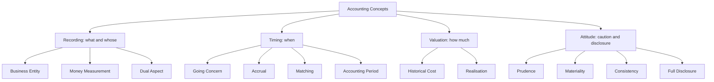
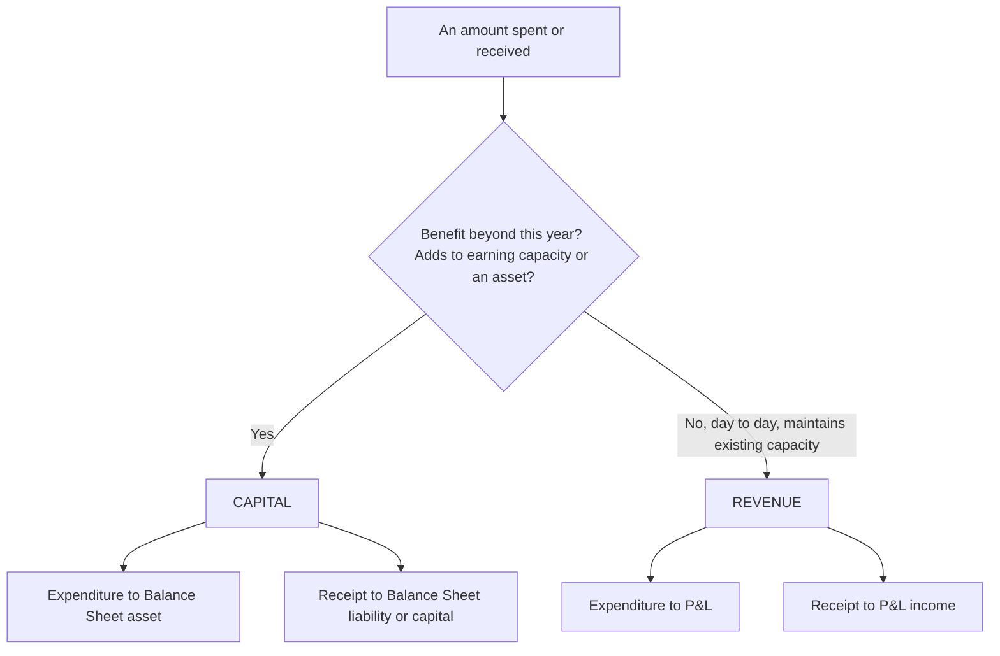
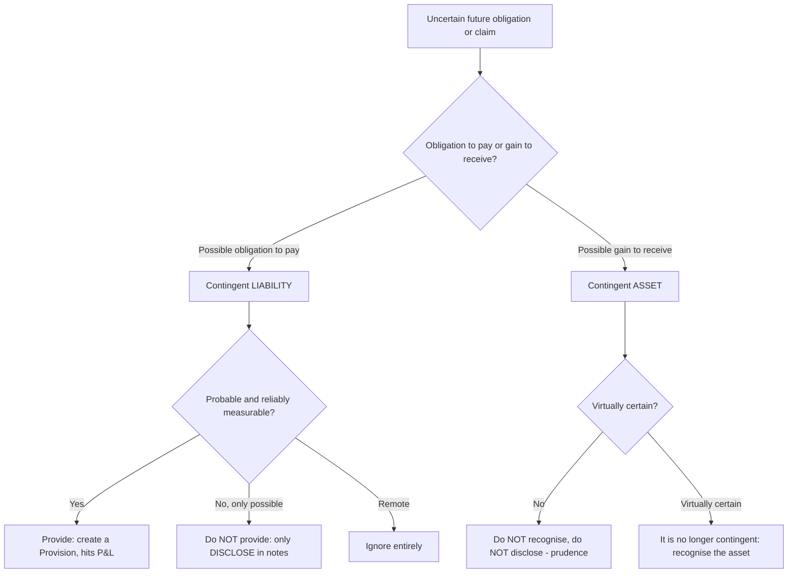

<!-- v2-deep -->

# Foundation: Theoretical Framework of Accounting

*You entered CA through Direct Entry, so you never sat through Foundation. That is fine — but everything above you (AS-2, Schedule III, consolidation, audit assertions) silently assumes you already carry these ten-or-so ideas in your bones. This chapter installs that missing operating system. Read it slowly once; you will never re-read it, because the rest of Accounting simply re-uses it.*

---

## 1. The Problem it solves

Money moves through a business every second — a sale here, a wage paid there, a machine bought, a loan taken, stock rotting in a warehouse. By 31 March, thousands of these events have happened. Now three different people knock on the owner's door:

- A **banker** wants to know: *if I lend ₹50 lakh, will this business survive to repay me?*
- An **investor** wants to know: *did this business actually earn money this year, or is it just shuffling cash?*
- The **tax officer** wants to know: *what is the true taxable profit?*

The owner cannot hand each of them the raw pile of 10,000 receipts. Nor can the owner just *say* "trust me, I made ₹20 lakh." The number has to be **produced by rules that everyone agrees on in advance**, so that the banker's ₹20 lakh, the investor's ₹20 lakh, and the tax officer's ₹20 lakh are the *same* ₹20 lakh — and so that a rival firm's ₹20 lakh is comparable.

That is the whole problem: **turning a chaotic stream of money-events into one trustworthy, comparable, decision-useful set of statements.** The "Theoretical Framework" is the rulebook that makes this possible. It answers, before you record a single rupee: *What counts as a business event? When do I record it? At what amount? Whose money is it? And what must I tell the outsider?*

Everything you will ever do in Accounting — every journal entry, every standard — is one of these five questions being answered in a specific situation.

---

## 2. Core Idea

**Accounting is a language with grammar.** The grammar is a small set of concepts, principles and conventions that every accountant in India follows, so that a financial statement written in Chennai can be *read* correctly in Mumbai, London or by a tax officer, without asking the writer what they meant.

The single most important rule of that grammar is the **dual aspect** (every transaction hits the books twice, keeping `Assets = Liabilities + Capital` always true). The rest of the concepts tell you *what* to record, *when*, and *at what value*. Accounting Standards are simply this grammar written down with legal force so nobody can quietly break it.

If you remember one line from this chapter: **an accountant's job is not to record what happened — it is to record what happened in the one specific way the rules demand, so a stranger can rely on it.**

---

## 3. Why it works this way (first principles)

Start from the outsider. The banker, investor and tax officer are *strangers* to the business. They cannot walk the factory floor. They can only trust a document. For that document to be trustworthy, three things must be guaranteed:

1. **It must not be the owner's opinion.** So we forbid the owner from mixing personal cash with business cash (Business Entity), forbid recording things that can't be measured in money (Money Measurement), and force values to be based on evidence — usually the price actually paid (Historical Cost).

2. **It must reflect earning, not just cash-handling.** A business that delivered ₹1 crore of goods in March but gets paid in April has *earned* in March. If we only recorded cash, the banker would think March was a disaster and April a miracle — both wrong. So we record when the *economic event* happens, not when cash moves (Accrual), and we line up each period's efforts against that period's rewards (Matching).

3. **It must lean toward caution, not optimism.** An owner selling a business has every incentive to look rich. So when the future is genuinely uncertain, the rules force us to book likely *losses* immediately but wait for *gains* to be near-certain (Prudence / Conservatism). A pessimistic statement that turns out too rosy destroys trust far worse than one that was quietly cautious.

Once you see that every concept is *engineered backwards from "what does a stranger need in order to safely rely on this?"*, you never have to memorize the list. You can re-derive it.

The reason it is standardized (Accounting Standards, and behind them the ICAI's *Framework*) rather than left to judgment is simply **scale and enforcement**: with millions of businesses and lakhs of accountants, "use your judgment" produces chaos and fraud. Codifying the grammar lets auditors, courts and regulators point to a written rule.

---

## 4. Full technical content

### 4.1 Meaning, scope and objectives of accounting

**Definition (AICPA / ICAI classic):** Accounting is *the art of recording, classifying and summarising in a significant manner and in terms of money, transactions and events which are, in part at least, of a financial character, and interpreting the results thereof.*

Break that into its **functions** — this is the life-cycle of every rupee that enters the books:

| Stage | Function | What it produces | Example |
|---|---|---|---|
| 1 | **Recording** (book-keeping) | Journal / subsidiary books | Write down each sale, purchase, payment |
| 2 | **Classifying** | Ledger | Group all "Salary" entries into one account |
| 3 | **Summarising** | Trial Balance, Final Accounts | Trial Balance → P&L → Balance Sheet |
| 4 | **Analysing & Interpreting** | Ratios, statements, reports | Is profit rising? Is the firm solvent? |
| 5 | **Communicating** | Reports to users | Annual report to shareholders |

**Book-keeping vs Accounting vs Accountancy** — a classic 2-mark distinction:

| Aspect | Book-keeping | Accounting | Accountancy |
|---|---|---|---|
| Scope | Recording & classifying only (stages 1–2) | All 5 stages | The whole body of knowledge / profession |
| Level | Clerical, routine | Analytical, needs judgment | Conceptual, the discipline itself |
| Who | Junior clerk | Accountant | The CA profession & its principles |
| Output | Ledgers | Financial statements + interpretation | Standards, theory, best practice |

**Objectives of accounting:**
1. Systematic **recording** of transactions.
2. Ascertaining **results of operations** (profit or loss) — via the P&L.
3. Ascertaining **financial position** (what is owned and owed) — via the Balance Sheet.
4. Providing information to **users** for decision-making.
5. Fulfilling **legal & regulatory** requirements (Companies Act, Income Tax, GST).
6. Acting as **evidence** in legal matters and protecting business assets.

**Sub-fields of accounting** (know the one-line purpose of each):

| Branch | Purpose | Primary user |
|---|---|---|
| **Financial Accounting** | Records past transactions, produces general-purpose statements | External users (investors, lenders) |
| **Cost Accounting** | Ascertains and controls cost per unit/job/process | Internal management |
| **Management Accounting** | Uses accounting data for planning, decisions, control | Internal management |

### 4.2 Accounting as an information system

Modern framing: accounting is an **information system** that converts raw economic data into decision-useful information.

- **Input:** business transactions and events with a financial character.
- **Process:** the accounting cycle (journal → ledger → trial balance → adjustments → final accounts).
- **Output:** financial statements + reports.
- **Users / feedback:** decisions feed back into new transactions.

### 4.3 Users of accounting information

The Framework classifies users as **internal** and **external**. Every accounting rule ultimately protects one of these users — naming them makes the "why" of any rule concrete.

| Type | User | What they decide with the accounts |
|---|---|---|
| Internal | **Owners / shareholders** | Is my capital safe and growing? |
| Internal | **Management** | Plan, control, price, invest |
| Internal | **Employees** | Job security, bonus, wage bargaining |
| External | **Investors (potential)** | Buy, hold, sell shares |
| External | **Lenders / bankers** | Grant loan? At what rate? Repayable? |
| External | **Suppliers / trade creditors** | Sell on credit? |
| External | **Customers** | Will the firm survive to honour warranties/supply? |
| External | **Government & tax authorities** | Tax due, regulation, statistics |
| External | **Researchers & public** | Economic impact, employment, CSR |

**Exam point:** financial statements are **general-purpose** — written for *external* users who *cannot* demand a custom report. That is why disclosure matters: "management already knows the truth" is never a defence.

### 4.4 The Framework, GAAP, and where concepts sit

- **GAAP (Generally Accepted Accounting Principles)** = the whole body of rules: concepts + conventions + Accounting Standards + law.
- Terminology (Foundation loves testing these labels):
  - **Concepts / Postulates** — basic assumptions taken as given (e.g., entity, going concern).
  - **Principles** — general rules of action derived from concepts (e.g., revenue recognition).
  - **Conventions** — customs/usage that guide preparation (e.g., conservatism, materiality, consistency, full disclosure).

Don't over-stress the concept-vs-convention boundary; ICAI itself uses the terms loosely. Know the *content* of each.

### 4.5 Fundamental Accounting Assumptions (AS-1)

AS-1 *Disclosure of Accounting Policies* names exactly **three** fundamental assumptions. These are **presumed to be followed**; you disclose only if one is **NOT** followed.

| Assumption | Meaning | Disclosure rule |
|---|---|---|
| **Going Concern** | Business will continue for the foreseeable future; not about to be liquidated | If NOT a going concern → **must disclose** |
| **Consistency** | Same accounting policies applied period after period | If a policy is changed → **must disclose** the change and effect |
| **Accrual** | Record revenues/costs when earned/incurred, not when cash moves | If not followed → **must disclose** |

> Memory hook: **"GAC"** — Going concern, Accrual, Consistency. If any GAC is broken, *shout it out* (disclose). If followed, stay silent.

### 4.6 Accounting Concepts, Principles & Conventions (the core list)

This is the heart of the chapter. Learn each as **rule → why → consequence**.

**1. Business Entity Concept.** The business is a *separate person* from its owner. The owner's personal house, personal loan, personal spending are **not** the business's. When the owner puts money in, the business *owes* it back to him — that is why **Capital is a liability** of the business. When the owner takes money out for personal use, it is **Drawings**, not an expense.
*Why:* without this wall, you could never tell if the *business* made money or the owner just topped it up. *Consequence:* Capital and Drawings accounts exist.

**2. Money Measurement Concept.** Record only what can be expressed in **money**. A skilled workforce, a brilliant CEO, high staff morale, a pending court case's moral weight — real, but **not recorded** because they can't be reliably measured in rupees.
*Why:* money is the only common unit that lets us add a building to a debtor to cash. *Limitation:* the balance sheet omits valuable non-monetary facts; also assumes money's value is stable (ignores inflation).

**3. Dual Aspect (Duality) Concept — the foundation of double-entry.** Every transaction has **two aspects** of equal amount: a *receiving* (debit) and a *giving* (credit). This gives the **Accounting Equation**:

> **Assets = Liabilities + Capital**  →  equivalently  **Capital = Assets − Liabilities**

*Why:* resources (assets) must come from *somewhere* — either owners (capital) or outsiders (liabilities). So the two sides can never diverge. *Consequence:* the trial balance tallies; the balance sheet balances.

**4. Going Concern Concept.** Assume the business will run indefinitely (foreseeable future, generally ≥12 months). *Why it matters:* it justifies (a) recording assets at cost and depreciating them over useful life rather than at forced-sale value, and (b) treating prepaid expenses as assets. If a firm were closing tomorrow, everything would be at liquidation value instead.

**5. Accounting Period Concept (Periodicity).** Chop the indefinite life into equal slices — usually **1 April to 31 March** in India — so results can be reported regularly. *Why:* users can't wait forever; the period lets us compare year to year and creates the need for *accruals and adjustments* at each period end.

**6. Accrual Concept.** Recognise revenue when **earned** and expense when **incurred**, regardless of cash. Rent for March owed but unpaid = expense of March (outstanding liability). Rent received in advance = not yet income (liability).
*Why:* profit measures *economic performance* of the period, not treasury movement. This is the concept that separates real accounting from a cash-book.

**7. Matching Concept.** Match the **expenses of a period against the revenues of that same period** to compute correct profit. If you sold goods this year, the *cost* of those goods, the salesmen's commission, and depreciation on the delivery van must all sit in *this* year's P&L.
*Why:* profit is meaningless unless effort (cost) and reward (revenue) belong to the same period. *Consequence:* prepaid/outstanding adjustments, depreciation, closing stock.

**8. Historical Cost Concept.** Record assets at the **price actually paid** to acquire them (plus costs to bring to use), not at current market value. A plot bought for ₹10 lakh in 2010 now worth ₹1 crore still sits at ₹10 lakh (less depreciation, if depreciable).
*Why:* cost is **objective and verifiable** (there's an invoice); market value is an opinion that changes daily. *Limitation:* the balance sheet can badly understate real worth. (Certain AS later permit revaluation — an exception, not the rule.)

**9. Realisation Concept.** Revenue is recognised only when it is **realised** — i.e., when the sale is complete / goods delivered / service rendered and a legally enforceable claim arises — **not** when the order is received or when cash is merely expected.
*Why:* an order can be cancelled; recognising it as income invites fictitious profit. Ties directly to **Prudence**.

**10. Prudence / Conservatism Convention.** *"Anticipate no profit, but provide for all possible losses."* When uncertain, choose the option that **understates** assets/income and **fully records** liabilities/losses. Hence: closing stock at *cost or net realisable value, whichever is lower*; provision for doubtful debts; no upward revaluation of gains until realised.
*Why:* protects the stranger from an over-optimistic owner. *Caution:* prudence must not become *deliberate* understatement (secret reserves) — that itself misleads.

**11. Materiality Convention.** Disclose separately every item **important enough to influence a user's decision**; trivial items may be aggregated or expensed for convenience. A ₹200 stapler is expensed, not capitalised and depreciated over 5 years, even though it's technically an asset — because it's immaterial.
*Why:* clutter hides the signal; users care about what *matters*. Materiality is **relative** — ₹1 lakh is material for a kirana shop, immaterial for Reliance.

**12. Consistency Convention.** Use the **same** accounting policies from one period to the next, so results are comparable. If you depreciate by SLM this year, use SLM next year too. A change is allowed only if required by law/AS or if it gives a *better* presentation — and then it must be **disclosed** with its effect (AS-1 & AS-5).
*Why:* without it, an owner could switch methods yearly to manufacture whatever profit trend they like.

**13. Full Disclosure Convention.** Disclose **all material information** — including things not in the numbers — so users are not misled. Contingent liabilities, accounting policies, changes in policies, events after the balance sheet date, etc., go into **notes to accounts**.
*Why:* a true and fair view needs *context*, not just numbers.

> Two conventions can pull against each other (Prudence vs Full Disclosure; Materiality vs Full Disclosure). The tie-breaker is always **"what gives a true and fair view to the user?"**

### 4.7 Capital vs Revenue — the four-way classification

This is one of the most heavily tested Foundation ideas and it powers *every* final-accounts question: **wrong classification puts an amount in the wrong statement and mis-states both profit and the balance sheet.**

The master rule:
- **Capital items → Balance Sheet** (benefit lasts beyond the current year / relates to the *structure* of the business).
- **Revenue items → Profit & Loss** (benefit is consumed within the current year / relates to *day-to-day running*).

| Type | Definition | Examples | Goes to |
|---|---|---|---|
| **Capital Expenditure** | Spent to acquire/improve a fixed asset or add to earning capacity; benefit > 1 year | Buying machinery; installation charges; major upgrade that raises output; legal fees to buy land | Balance Sheet (asset) |
| **Revenue Expenditure** | Spent to run the business day-to-day; benefit within the year; maintains (not improves) capacity | Salaries, rent, repairs, fuel, purchase of goods for resale | P&L (expense) |
| **Capital Receipt** | Received not in the ordinary course of trading; from owners/lenders or sale of fixed assets | Capital introduced, loan taken, sale proceeds of machinery | Balance Sheet (liability/capital); asset side reduced |
| **Revenue Receipt** | Received in the ordinary course of business | Sales, commission earned, interest/rent received | P&L (income) |

**Deferred Revenue Expenditure** — the important grey case. A *revenue* expense so large that its benefit spills over several years, so it is *deferred*: partly charged now, rest carried forward. Classic example: heavy advertising to launch a product. (Note: under current AS/Ind AS most such items are written off immediately as prudence tightened — but for **Foundation theory** the concept is still examinable.)

Special rules to memorise:
- **Repairs to a newly-bought second-hand machine to make it usable = capital** (it's part of getting the asset ready). Routine repairs later = revenue.
- **Legal fees to acquire an asset = capital; legal fees to defend day-to-day trade = revenue.**
- **Wages paid to install a machine = capital; wages to workers producing goods = revenue.**
- **Freight/carriage on a fixed asset = capital; carriage on goods = revenue.**

### 4.8 Measurement, valuation and accounting estimates

**Measurement** is assigning a monetary amount to an element. The Framework recognises **four measurement bases** — a favourite MCQ:

| Basis | Asset carried at | Liability carried at |
|---|---|---|
| **Historical Cost** | Cash paid to acquire | Proceeds received / amount expected to be paid |
| **Current Cost** | Cash needed to acquire the same asset *now* | Undiscounted cash needed to settle *now* |
| **Realisable (Settlement) Value** | Cash obtainable by selling in an orderly disposal | Undiscounted cash expected to settle in normal course |
| **Present Value** | Discounted future net cash inflows the asset generates | Discounted future net cash outflows to settle |

Historical cost is the **most commonly used** base in Indian GAAP because it is objective and verifiable.

**Accounting Estimates.** Many amounts cannot be measured precisely and must be *estimated* using judgment on the latest information — e.g., **useful life of an asset, provision for doubtful debts, provision for warranty, NRV of inventory**. An estimate is not an error; it is a reasoned approximation. When new information arrives, you **revise the estimate prospectively** (change affects current and future periods only, never restated backwards — AS-5). Contrast with a **change in accounting policy** (e.g., switching cost formula), which is a different, more serious change.

### 4.9 Accounting Policies

**Accounting policies** = the specific accounting *principles* and the *methods* of applying them, chosen by an enterprise. Examples: method of depreciation (SLM/WDV), method of inventory valuation (FIFO/weighted average), treatment of goodwill, valuation of investments.

Three characteristics that must guide the *selection* of policies (AS-1) — **memory hook "PSM"**:

| Consideration | Meaning |
|---|---|
| **Prudence** | Don't anticipate profits; provide for losses on available evidence |
| **Substance over form** | Record the economic reality, not merely the legal form |
| **Materiality** | Disclose everything material enough to influence users |

Rules:
- All **significant** accounting policies must be **disclosed at one place** (usually Note 1), so users can interpret the statements.
- Policies **need not be** the same across enterprises — different circumstances justify different policies (that's why disclosure exists).
- A **change** in policy that has a material effect must be **disclosed with the amount of the effect** (or the fact that it's unascertainable). (AS-1 read with AS-5.)

### 4.10 Contingent Assets and Contingent Liabilities (intro; full treatment in AS-29 / Inter)

A **contingency** is a condition whose outcome depends on an **uncertain future event**.

| Item | Recognition (in accounts) | Disclosure (in notes) |
|---|---|---|
| **Provision** (present obligation, probable outflow, measurable) | **Yes** — charge to P&L, show as liability | Yes |
| **Contingent Liability** (possible obligation, or not probable/measurable) | **No** | **Yes** — disclose in notes |
| **Remote contingent liability** | No | No |
| **Contingent Asset** | **No** (prudence) | **No** in the financials; disclosed in *Approving Authority's report* only when inflow is *probable* |

Textbook examples of **contingent liabilities**: a **pending lawsuit** the firm may lose, **bills receivable discounted** with the bank (you may have to pay if the customer defaults), **guarantees given** on behalf of others, **disputed tax demands**, **claims not acknowledged as debts**. The asymmetry — provide for losses, ignore gains — is **Prudence** in action.

### 4.11 Introduction to Accounting Standards & their role

- **Accounting Standards (AS)** are written policy documents issued by the **ICAI** (through the Accounting Standards Board, ASB) covering recognition, measurement, presentation and disclosure of transactions.
- **Role / objectives:**
  1. **Standardise** diverse accounting practices → remove the "Shop A vs Shop B" problem.
  2. Improve **reliability** and **comparability** of financial statements.
  3. Provide a **benchmark** against which auditors and courts can judge.
  4. Assist in giving a **true and fair view**.
- **Standard-setting bodies:** ICAI's **ASB** drafts AS; for companies these are notified by the **Central Government** as **Companies (Accounting Standards) Rules**, giving them legal teeth under the Companies Act, 2013.
- **Two streams in India:** **AS** (existing/converged-with-older-IAS, used by most non-listed entities) and **Ind AS** (converged with IFRS, mandatory for listed and large companies). Foundation focuses on the *idea* and the *role*; the individual standards come later.
- **Limitations to note for exam:** AS cannot override the law; they allow *alternatives* (choice of method) which limits comparability; and applying them still needs **judgment**.

> This chapter is deliberately the *doorway* to the standards. Chapter 01 of this kit ("Why Accounting Standards Exist") and AS-1 pick up exactly where 4.11 ends.

---

## 5. Worked examples

### Worked Example 1 — Business Entity + Dual Aspect: build the Accounting Equation

Mr. Rao starts a trading business. Record the effect of each transaction on the equation **Assets = Liabilities + Capital**, then prove the balance sheet balances.

Transactions:
1. Introduces ₹5,00,000 cash as capital.
2. Takes a bank loan of ₹2,00,000 (into bank).
3. Buys furniture for ₹1,50,000 cash.
4. Buys goods for ₹1,00,000 on credit from Suppliers.
5. Withdraws ₹20,000 cash for personal use (drawings).

**Step-by-step effect (all figures ₹):**

| # | Transaction | Cash | Bank | Furniture | Stock | = | Creditors | Loan | Capital |
|---|---|---:|---:|---:|---:|:-:|---:|---:|---:|
| 1 | Capital introduced | +5,00,000 | | | | = | | | +5,00,000 |
| 2 | Bank loan | | +2,00,000 | | | = | | +2,00,000 | |
| 3 | Furniture (cash) | −1,50,000 | | +1,50,000 | | = | | | |
| 4 | Goods on credit | | | | +1,00,000 | = | +1,00,000 | | |
| 5 | Drawings (cash) | −20,000 | | | | = | | | −20,000 |
| | **Balances** | **3,30,000** | **2,00,000** | **1,50,000** | **1,00,000** | = | **1,00,000** | **2,00,000** | **4,80,000** |

**Check the equation:**
Assets = 3,30,000 + 2,00,000 + 1,50,000 + 1,00,000 = **7,80,000**.
Liabilities + Capital = 1,00,000 + 2,00,000 + 4,80,000 = **7,80,000**. ✔

**Balance Sheet of Mr. Rao (as at start):**

| Liabilities | ₹ | Assets | ₹ |
|---|---:|---|---:|
| Capital 5,00,000 − Drawings 20,000 | 4,80,000 | Furniture | 1,50,000 |
| Bank Loan | 2,00,000 | Stock | 1,00,000 |
| Creditors | 1,00,000 | Cash | 3,30,000 |
| | | Bank | 2,00,000 |
| **Total** | **7,80,000** | **Total** | **7,80,000** |

**Takeaways:** Capital is a *liability* of the business to Rao (Entity concept). Drawings *reduce capital*, they are not an expense. Every line touched two accounts (Dual aspect), so the sheet balances automatically.

---

### Worked Example 2 — Accrual vs Cash, and the Matching Concept

Ms. Iyer runs a consultancy. During the year ended 31 Mar 2026, the following happened. Compute profit on the **cash basis** and on the **accrual basis**, and explain the difference.

Data:
- Fees **billed** during the year: ₹12,00,000. Of this, ₹2,00,000 is still **receivable** (not yet collected) at year-end.
- Additionally, ₹1,00,000 of the cash collected during the year was for **last year's** bills.
- Salaries **paid** in cash: ₹4,00,000, which includes ₹50,000 paid *in advance* for April 2026 (next year).
- Salaries for March 2026 **still unpaid** (outstanding): ₹40,000.
- Rent paid in cash: ₹1,20,000 for the 12 months — all relating to this year.

**Step 1 — Revenue under each basis.**
- *Cash basis* revenue = cash actually received this year = (Fees billed 12,00,000 − still receivable 2,00,000) + last year's collection 1,00,000 = 10,00,000 + 1,00,000 = **11,00,000**.
- *Accrual basis* revenue = fees **earned this year** = ₹12,00,000 (the ₹1,00,000 collected for last year is last year's income, not this year's). = **12,00,000**.

**Step 2 — Expenses under each basis.**
- *Cash basis* expense = cash paid = Salaries 4,00,000 + Rent 1,20,000 = **5,20,000**.
- *Accrual basis* expense = expense **incurred for this year**:
  - Salaries: 4,00,000 paid − 50,000 prepaid (belongs to next year) + 40,000 outstanding (this year's, unpaid) = **3,90,000**.
  - Rent: 1,20,000 (all this year) = 1,20,000.
  - Total accrual expense = 3,90,000 + 1,20,000 = **5,10,000**.

**Step 3 — Profit under each basis.**

| | Cash basis (₹) | Accrual basis (₹) |
|---|---:|---:|
| Revenue | 11,00,000 | 12,00,000 |
| Less: Expenses | 5,20,000 | 5,10,000 |
| **Profit** | **5,80,000** | **6,90,000** |

**Why they differ:** Accrual counts *earning* (₹12,00,000 earned) and *this-year effort* (₹5,10,000). Cash merely counts money handled. The ₹50,000 prepaid salary becomes an **asset** (Prepaid Salary) and the ₹40,000 outstanding becomes a **liability** (Salary Payable) on the accrual balance sheet — that is the Matching concept forcing each rupee into its correct period. **Accrual is the correct, AS-compliant profit.**

*Cross-check of the ₹1,10,000 gap:* Accrual profit − Cash profit = 6,90,000 − 5,80,000 = 1,10,000. Sources: +2,00,000 income earned but not received, −1,00,000 collected but earned last year, +50,000 salary prepaid (not this year's expense), −40,000 salary outstanding (added this year's expense) = 2,00,000 − 1,00,000 + 50,000 − 40,000 = **1,10,000**. ✔

---

### Worked Example 3 — Capital vs Revenue classification and its effect on profit

XYZ Traders spent the following during the year. (a) Classify each as capital or revenue expenditure. (b) The bookkeeper wrongly charged **all** of it to the Profit & Loss Account, reporting a profit of ₹3,00,000. Compute the **correct** profit and show the balance-sheet impact.

| # | Item | Amount ₹ |
|---|---|---:|
| 1 | Purchase of a delivery van | 4,00,000 |
| 2 | Petrol and driver salary for the van (year) | 80,000 |
| 3 | Repainting the office (routine) | 25,000 |
| 4 | Installation charges to fix a new machine | 30,000 |
| 5 | Overhaul of second-hand machine to make it usable | 70,000 |
| 6 | Annual insurance premium | 15,000 |
| 7 | Legal fees paid to acquire land | 60,000 |

**(a) Classification with reasoning:**

| # | Item | Classification | Reason |
|---|---|---|---|
| 1 | Delivery van | **Capital** | Fixed asset, benefit > 1 yr |
| 2 | Petrol & driver salary | **Revenue** | Day-to-day running |
| 3 | Repainting (routine) | **Revenue** | Maintains, doesn't improve |
| 4 | Installation of new machine | **Capital** | Cost of getting asset ready for use |
| 5 | Overhaul of 2nd-hand machine to *make it usable* | **Capital** | Necessary to bring asset to working condition |
| 6 | Insurance premium | **Revenue** | Recurring running cost |
| 7 | Legal fees to acquire land | **Capital** | Cost of acquiring a fixed asset |

Capital items = 1 + 4 + 5 + 7 = 4,00,000 + 30,000 + 70,000 + 60,000 = **₹5,60,000**.
Revenue items = 2 + 3 + 6 = 80,000 + 25,000 + 15,000 = **₹1,20,000**.
Grand total spent = 5,60,000 + 1,20,000 = **₹6,80,000** (this is what the clerk wrongly ran fully through P&L).

**(b) Correcting the profit.** The clerk debited P&L with ₹6,80,000 but only ₹1,20,000 was truly a revenue expense. So ₹5,60,000 was **over-charged** to P&L and should instead sit on the balance sheet as assets.

| | ₹ |
|---|---:|
| Profit as reported (wrong) | 3,00,000 |
| Add back: capital items wrongly charged to P&L | 5,60,000 |
| **Correct profit** | **8,60,000** |

**Balance-sheet impact:** assets rise by ₹5,60,000 —

| Asset created (capitalised) | ₹ |
|---|---:|
| Delivery van | 4,00,000 |
| Machine (30,000 install + 70,000 overhaul) | 1,00,000 |
| Land (incl. legal fees) | 60,000 |
| **Total added to assets** | **5,60,000** |

**Consistency check:** the ₹5,60,000 removed from expenses (raising profit by 5,60,000) is exactly the ₹5,60,000 added to assets. Higher profit → higher retained earnings/capital by 5,60,000; higher assets by 5,60,000; the balance sheet still balances. ✔ *(Depreciation on these assets would later be a legitimate revenue expense — but only a fraction, not the whole cost, which is precisely why the classification matters.)*

---

### Worked Example 4 — Prudence & the lower-of-cost-or-NRV rule (closing stock)

A firm has three products in closing stock. Value the total closing stock applying the Prudence convention (**cost or net realisable value, whichever is lower**), item by item.

| Product | Units | Cost/unit ₹ | Expected selling price/unit ₹ | Selling cost/unit ₹ |
|---|---:|---:|---:|---:|
| A | 100 | 200 | 260 | 20 |
| B | 150 | 300 | 310 | 40 |
| C | 80 | 500 | 460 | 10 |

**Step 1 — NRV per unit = selling price − selling cost:**
- A: 260 − 20 = 240
- B: 310 − 40 = 270
- C: 460 − 10 = 450

**Step 2 — Lower of cost vs NRV per unit:**
- A: cost 200 vs NRV 240 → lower = **200** (cost)
- B: cost 300 vs NRV 270 → lower = **270** (NRV — expected loss recognised now)
- C: cost 500 vs NRV 450 → lower = **450** (NRV)

**Step 3 — Value each line and total:**

| Product | Units | Value/unit ₹ | Total ₹ |
|---|---:|---:|---:|
| A | 100 | 200 | 20,000 |
| B | 150 | 270 | 40,500 |
| C | 80 | 450 | 36,000 |
| | | **Closing stock** | **96,500** |

**Contrast:** if valued naïvely at cost, stock would be 100×200 + 150×300 + 80×500 = 20,000 + 45,000 + 40,000 = **1,05,000**. Prudence writes it down by ₹8,500 (B: 150×30 = 4,500; C: 80×50 = 4,000), recognising the *anticipated loss* now — but note we did **not** write A *up* to its higher NRV. Anticipate losses, not gains. This is exactly the logic AS-2 formalises in Inter.

---

## 6. Connections — what this unlocks in CA Intermediate

| This Foundation idea | Grows into (CA Inter / later) |
|---|---|
| Fundamental assumptions & policies (AS-1) | **AS-1 Disclosure of Accounting Policies** (full standard) |
| Prudence + lower of cost or NRV | **AS-2 Valuation of Inventories** |
| Historical cost, going concern, capital vs revenue on assets | **AS-10 Property, Plant & Equipment** and depreciation |
| Accrual vs cash | **AS-3 Cash Flow Statements** (reconciling the two) |
| Consistency, change in policy vs estimate | **AS-5 Net Profit/Loss, Prior Period Items & Changes** |
| Contingencies, provisions, contingent assets/liabilities | **AS-4** and **AS-29 Provisions, Contingent Liabilities & Contingent Assets** |
| Realisation / revenue recognition | **AS-9 Revenue Recognition** (and Ind AS 115 later) |
| Dual aspect & the accounting equation | The entire **double-entry** machinery: journal, ledger, trial balance, final accounts, and **Schedule III** company statements |
| Money measurement & substance over form | **Ind AS Conceptual Framework** and fair-value measurement |

Master this chapter and AS-1/AS-2/AS-5/AS-29 will feel like *re-reading* rather than *learning*.

---

## 7. Traps & common mistakes

1. **Treating Drawings as an expense.** Drawings reduce *Capital* on the balance sheet; they never appear in the P&L. (Entity concept.)
2. **Confusing Realisation with Receipt of cash.** Revenue is realised when the sale is *complete*, not when cash arrives. An advance received is a *liability*, not income.
3. **Recording an order as a sale.** No sale until goods/services are delivered (Realisation + Prudence). Booking orders = fictitious profit.
4. **Writing stock *up* to NRV.** Lower of cost or NRV is a *one-way* rule — you write down, never up. (Prudence.)
5. **Charging the full cost of a fixed asset to P&L** (the Ex-3 error). Only *depreciation* hits P&L; the asset sits on the balance sheet.
6. **"Repairs are always revenue."** Repairs to bring a *newly acquired* asset into usable condition are **capital**. Only *subsequent* routine repairs are revenue.
7. **Disclosing the fundamental assumptions when they ARE followed.** AS-1 requires disclosure only when an assumption is **NOT** followed. Don't write a note saying "we follow going concern" — that's not required (though it's often stated in practice).
8. **Provisioning for a contingent asset.** Contingent *assets* are never recognised (prudence); only contingent *liabilities* may need disclosure, and *provisions* need recognition.
9. **Change in estimate treated like an error/prior-period correction.** Revision of an estimate (e.g., useful life) is applied **prospectively**; you do not restate the past.
10. **Materiality confusion.** Materiality is *relative to the entity's size*, and it justifies aggregation of *small* items — it is not a licence to hide *large* unfavourable ones.
11. **Ignoring "whichever is lower" per item.** In stock valuation you apply lower-of-cost-or-NRV **item by item** (or category by category), not on the total — applying it on the grand total understates the write-down or nets a loss against a gain (forbidden).

---

## 8. First-principles recap

- Accounting exists to convert a chaotic stream of money-events into **one trustworthy, comparable, decision-useful** set of statements for **outsiders who can only trust a document**.
- Every concept is **engineered backwards** from "what does a stranger need to safely rely on this?" — hence entity (whose money), money measurement (what), accrual (when), historical cost (how much), prudence (lean cautious), disclosure (tell all).
- **Dual aspect** is the load-bearing wall: `Assets = Liabilities + Capital` is *always* true, which is why books tally and balance sheets balance.
- **Accrual + Matching** measure *economic performance* of a period; cash accounting measures only treasury movement and is not AS-compliant.
- **Prudence is asymmetric on purpose:** provide for all losses, anticipate no gains — because an over-optimistic statement destroys trust worse than a cautious one.
- **Capital vs Revenue** decides *which statement* an amount lands in; get it wrong and you mis-state both profit and financial position simultaneously.
- **Accounting Standards** are this grammar written down with legal force, so auditors, courts and regulators can enforce it at national scale.

---

## 9. Quick-reference

| Concept / rule | One-line statement |
|---|---|
| Accounting Equation | Assets = Liabilities + Capital |
| Business Entity | Owner ≠ business; Capital is a liability; withdrawals = Drawings |
| Money Measurement | Record only what is expressible in money |
| Dual Aspect | Every transaction: equal debit + credit |
| Going Concern | Assume indefinite continuation → cost + depreciation basis |
| Accounting Period | Slice life into (usually) 1 Apr–31 Mar years |
| Accrual | Record when earned/incurred, not when cash moves |
| Matching | This year's revenue against this year's expenses |
| Historical Cost | Record assets at price actually paid |
| Realisation | Revenue recognised only when sale is complete |
| Prudence | Anticipate no profit; provide for all losses |
| Materiality | Disclose what could influence a user's decision |
| Consistency | Same policies year after year; disclose changes |
| Full Disclosure | Disclose all material info incl. notes |
| Fundamental assumptions (AS-1) | **G**oing concern, **A**ccrual, **C**onsistency — disclose only if NOT followed |
| Policy selection (AS-1) | **P**rudence, **S**ubstance over form, **M**ateriality |
| Stock valuation (Prudence) | Cost or Net Realisable Value, whichever is **lower**, item-wise |
| NRV | Selling price − costs to complete and sell |
| Capital vs Revenue | Benefit > 1 yr / adds capacity → Capital (B/S); day-to-day → Revenue (P&L) |
| Deferred Revenue Expenditure | Revenue expense with multi-year benefit, partly carried forward |
| Provision | Present obligation, probable outflow, measurable → recognise in P&L |
| Contingent Liability | Possible obligation / not probable → disclose only |
| Contingent Asset | Never recognise (prudence); disclose only if inflow probable |
| Measurement bases | Historical cost, Current cost, Realisable value, Present value |
| Accounting estimate change | Applied **prospectively** (AS-5) |
| AS issuing body | ICAI's **ASB**; notified by Central Govt under Companies Act |

*End of Foundation chapter F01. Next stop: the accounting cycle (journal → ledger → trial balance → final accounts), which is just the Dual Aspect concept applied ten thousand times.*
