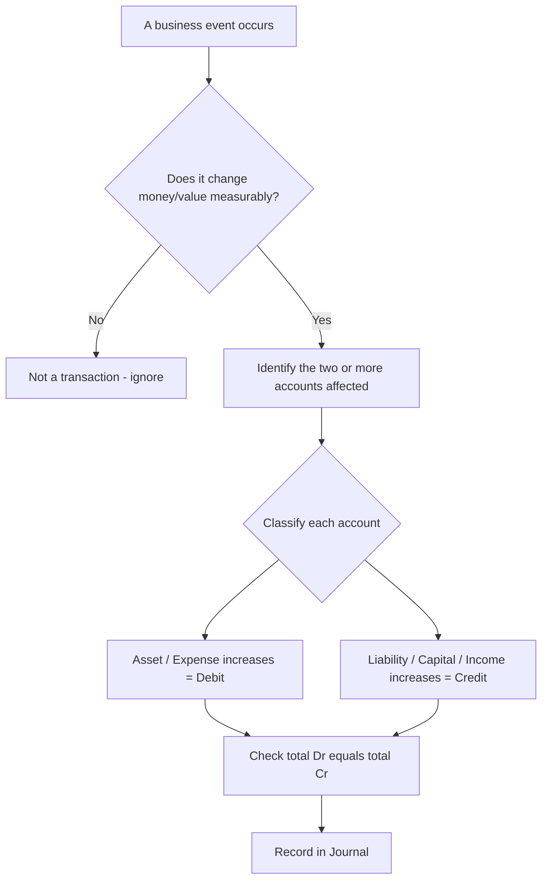
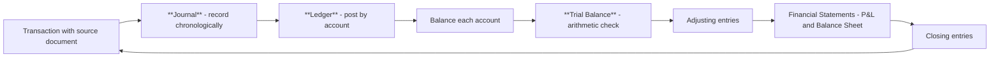
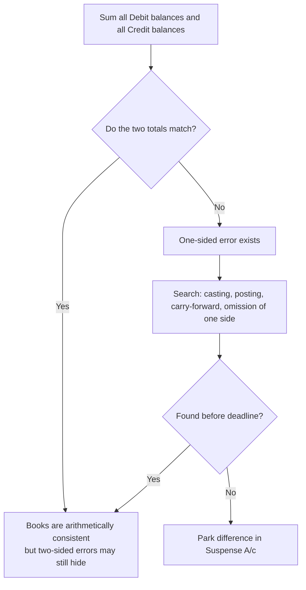

<!-- v2-deep -->

# Foundation: Accounting Process I — Journal, Ledger & Trial Balance

*You skipped Foundation on the Direct-Entry route, so you have never been shown the actual plumbing of accounting — how a raw business event turns into a number that eventually lands in a Balance Sheet. Every Inter-level topic (company accounts, amalgamation, branch accounts, AS adjustments) silently assumes you can pass a journal entry in your sleep and know why it balances. This chapter builds that plumbing from first principles. Read it slowly once; after that it becomes reflex.*

---

## 1. The Problem it solves

A business does hundreds of things every day. It buys goods, sells them, pays salaries, borrows money, buys a delivery van, pays electricity, collects from a customer who bought last month. Each of these is a **transaction** — an event with a measurable effect on money.

At the end of the year the owner, the banker, the tax officer and the investor all want two clean answers:

1. **How much did the business earn or lose this year?** (the Profit & Loss / Income Statement question)
2. **What does the business own and owe right now?** (the Balance Sheet / Position question)

Here is the difficulty. Those hundreds of scattered events are just noise — a shoebox full of bills and receipts. You cannot look at a shoebox and state a profit figure. You need a **system** that:

- captures every transaction the moment it happens, in date order, with proof;
- sorts those transactions by *what they affect* (all the cash events together, all the sales together, all the salary events together);
- and finally rolls each of those piles into a single figure you can drop onto the P&L or Balance Sheet.

That system is the **accounting process** — and its first three organs are the **Journal** (capture), the **Ledger** (sort), and the **Trial Balance** (an arithmetic health-check before you build the financial statements).

The problem this chapter solves: **how do you turn the raw, chaotic stream of daily business events into a mathematically self-checking record that can be trusted to produce true financial statements?**

---

## 2. Core Idea

Every business transaction has **two equal and opposite sides**, and we record **both** of them. That is the entire secret. It is called the **Double-Entry System**.

When you buy a ₹50,000 machine for cash, two true things happen at once:
- you **gained** a machine worth ₹50,000, and
- you **lost** cash worth ₹50,000.

A single-entry world would only note "spent 50,000." Double-entry insists you also record *what you got for it*. Because you always record a giving side and a receiving side of equal amount, the books can **never silently go out of balance** — and that built-in self-check is why the whole world of accounting, from a kirana shop to Reliance, runs on it.

The one identity that this rests on, and that must be true at every instant, is the **Accounting Equation**:

> **Assets = Liabilities + Capital**  
> (what the business controls) = (what it owes outsiders) + (what it owes its owner)

Every transaction changes at least two items in that equation in a way that keeps both sides equal. "Debit and credit" is simply the bookkeeping language for "left side / right side of an account," engineered so that the equation stays balanced automatically.

---

## 3. Why it works this way (first principles — do not skip)

Most students memorise "debit the receiver, credit the giver" and never understand it. Let us derive it instead, so the rules become obvious rather than remembered.

### 3.1 Where the equation comes from

A business is a separate "person" from its owner — this is the **Business Entity Concept**. So when you, the owner, put ₹1,00,000 into the business, the *business* now holds ₹1,00,000 cash (an asset) and simultaneously *owes that ₹1,00,000 back to you* (that debt to the owner is called **Capital**). Nothing came from nowhere; the asset is exactly matched by a claim on it.

Generalise: **everything the business owns (assets) was funded by somebody — either outsiders (liabilities) or the owner (capital).** Sources = Uses. Hence:

$$\text{Assets} = \text{Liabilities} + \text{Capital}$$

This is not a rule someone invented; it is an accounting *tautology*. Money used must equal money supplied.

### 3.2 Why two entries, and why they are equal

Because the equation must hold **after** every transaction as it held **before**, any change to one item must be offset by an equal change somewhere else. There is no way to alter one number in `A = L + C` and keep it true without a second, equal alteration. That mathematical necessity *is* double entry. Two equal entries are not a convention — they are forced on us by the equation.

### 3.3 What "debit" and "credit" actually mean

Take any single account (say, the Cash account). Draw it as a "T": a left side and a right side.

- **Debit (Dr)** = the **left** side of an account.
- **Credit (Cr)** = the **right** side of an account.

That is *all* the words mean — left and right. They carry no moral sense of "good/bad" or "increase/decrease" by themselves. Whether a debit increases or decreases an account depends on which *kind* of account it is. We choose the convention so the equation self-balances:

- **Assets** live on the **left** of the equation, so an asset **increases on its debit (left) side**.
- **Liabilities and Capital** live on the **right**, so they **increase on their credit (right) side**.
- **Income/Revenue** ultimately increases Capital (profit belongs to the owner), so income **increases on the credit side**.
- **Expenses** ultimately reduce Capital, so expenses **increase on the debit side**.

Now the golden test falls out automatically: *for every transaction, total debits must equal total credits*, because that is the only way the two sides of `A = L + C` stay equal.

### 3.4 The two rule-sets are the SAME rule wearing two costumes

CA Foundation teaches two approaches. They give identical entries; use whichever you find faster.

**Modern / Accounting-Equation approach** (recommended — it *is* the first-principles logic above):

| Account type | Increase by | Decrease by |
|---|---|---|
| **Asset** | Debit | Credit |
| **Liability** | Credit | Debit |
| **Capital** | Credit | Debit |
| **Income / Gain** | Credit | Debit |
| **Expense / Loss** | Debit | Credit |

**Traditional / British approach** — first classify the account into one of three types, then apply its rule:

| Account type | What it is | Rule |
|---|---|---|
| **Personal** | Accounts of persons/firms — debtors, creditors, bank, capital, drawings | **Debit the receiver, Credit the giver** |
| **Real** | Accounts of assets/things — cash, machinery, stock, furniture | **Debit what comes in, Credit what goes out** |
| **Nominal** | Accounts of expenses, losses, incomes, gains — rent, wages, sales, discount | **Debit all expenses & losses, Credit all incomes & gains** |

Both routes land on the same debit and credit every time. The modern approach is usually faster because you never have to first argue about which "type" an account is.

---

## 4. Full technical content (ICAI-aligned, CA Foundation 2024 New Scheme)

### 4.1 The Accounting Cycle — the map of the whole process

Everything in financial accounting is one loop repeated each period. This chapter covers the first three boxes in bold; later chapters finish the loop.

| Step | Name | What happens | Output |
|---|---|---|---|
| 1 | Source documents | Invoice, receipt, voucher, pay slip — the *evidence* | Paper/e-record |
| 2 | **Journal** | Every transaction written in date order with Dr/Cr and narration | Book of Original/Prime Entry |
| 3 | **Ledger** | Journal entries re-sorted account-wise | Book of Final Entry / Principal Book |
| 4 | Balancing | Net each ledger account to a single closing balance | Account balances |
| 5 | **Trial Balance** | List all balances; check total Dr = total Cr | Trial Balance |
| 6 | Adjustments | Outstanding, prepaid, depreciation, closing stock, etc. | Adjusting entries |
| 7 | Financial statements | Trading + P&L account, Balance Sheet | True profit & position |

### 4.2 Types of accounts you will meet

Under the modern classification there are **five** account heads: **Assets, Liabilities, Capital, Income, Expenses**. A few sub-terms you must know:

- **Drawings** — cash or goods the owner takes out for personal use. It *reduces* Capital, so it behaves oppositely to Capital: **Drawings increases on the debit side.**
- **Debtor (Trade Receivable)** — a customer who owes us (an asset, a personal account).
- **Creditor (Trade Payable)** — a supplier we owe (a liability, a personal account).
- **Purchases / Sales** — refer *only* to goods the business trades in. Buying a machine for use is **not** "Purchases"; it is an asset ("Machinery").
- **Purchase/Sales Returns** — goods sent back. "Return Inwards" = sales return (customer returns to us). "Return Outwards" = purchase return (we return to supplier).

### 4.3 The Journal — format and mechanics

The Journal is the **book of original entry**. Each entry names the account(s) debited, then the account(s) credited (indented), the amounts, and a **narration** (a short "being…" explanation). The standard ICAI format:

| Date | Particulars | L.F. | Debit (₹) | Credit (₹) |
|---|---|---|---|---|
| 2026 Apr 1 | Cash A/c ............................ Dr. | | 1,00,000 | |
| | &nbsp;&nbsp;&nbsp;&nbsp;To Capital A/c | | | 1,00,000 |
| | *(Being capital introduced by owner)* | | | |

Rules of form:
- The **debited** account is written first, at the margin, with "Dr." at the right end.
- The **credited** account is written on the next line, prefixed with "**To**" and indented.
- **L.F.** = Ledger Folio — the page number where this entry is later posted in the ledger (a cross-reference; fill it only after posting).
- A **narration** in brackets/italics follows every entry. No entry is complete without it.
- A single entry with one Dr and one Cr is **simple**; an entry with two or more accounts on either side is a **compound entry**. The rule "total Dr = total Cr" holds regardless.

**Opening entry:** at the start of a new year, the previous year's closing assets, liabilities and capital are brought in with one compound journal entry — debit all assets, credit all liabilities and capital.

### 4.4 The Ledger — format and posting

The Ledger regroups every journal entry **by account**, so that all activity of (say) "Cash" sits in one place and can be netted to a balance. Traditional format is the **T-account** (two-sided); the exam also accepts it. Its formal columnar version:

| Dr. |  |  |  | Cash Account |  |  | Cr. |
|---|---|---|---|---|---|---|---|
| **Date** | **Particulars** | **J.F.** | **₹** | **Date** | **Particulars** | **J.F.** | **₹** |
| Apr 1 | To Capital A/c | | 1,00,000 | Apr 5 | By Purchases A/c | | 40,000 |

**Posting rules (the part students get wrong):**
- The account that was **debited** in the journal is posted on the **debit (left) side** of *its own* ledger account, and the narration column shows "**To** [the other account]".
- The account that was **credited** is posted on the **credit (right) side** of its own ledger, written as "**By** [the other account]".
- So each journal entry creates **two** ledger postings — one on each account it touched. "To" and "By" are just linking words pointing to the contra account; they carry no Dr/Cr meaning of their own.

### 4.5 Balancing a ledger account

At period-end each account is netted:

1. Total both sides mentally.
2. The **bigger** side's total is written as the total on **both** sides (to force them level).
3. The difference is inserted on the **smaller** side as the **balancing figure**, labelled **"To/By Balance c/d"** (carried down).
4. That same balance is then brought down on the **opposite** side as **"Balance b/d"** (brought down) — this is the account's opening balance for the next period.

Which side the balance falls on tells you its nature:
- A **debit balance** (debit side bigger) → typical of **assets and expenses**.
- A **credit balance** (credit side bigger) → typical of **liabilities, capital and incomes**.

> Memory hook: an account's balance sits on the side where that account *increases*. Cash increases by debit, so a healthy Cash account carries a **debit balance c/d**, brought down on the debit side.

### 4.6 The Trial Balance — what it is and is not

A **Trial Balance** is a **list of the closing balances of every ledger account** on a given date, with all debit balances in one column and all credit balances in another. If the books obey double entry, **the two column totals must be equal.**

**Purposes:**
1. **Arithmetical accuracy check** — proves that for every debit there was an equal credit posted.
2. **Basis for financial statements** — every figure in the Trading A/c, P&L A/c and Balance Sheet is picked from the Trial Balance.
3. **Summary of the ledger** — one page shows the position of all accounts.
4. **Aids location of errors** — a mismatch signals (some) mistakes to hunt down.

**Methods of preparing it:**

| Method | How | Note |
|---|---|---|
| **Balance Method** | List the net *balance* of each account | Most common; feeds the final accounts directly |
| **Totals Method** | List the total of the debit side and total of the credit side of each account | Rarely used |
| **Total-cum-Balance** | Both of the above combined | Textbook completeness |

**The critical limitation — a Trial Balance that agrees does NOT prove the books are correct.** Certain errors leave the two totals equal and slip through:

| Error type | What it is | Does TB still tally? |
|---|---|---|
| **Error of Omission (complete)** | A transaction not recorded at all | **Yes — hidden** |
| **Error of Commission** | Right account type, wrong amount posted to both sides, or posted to wrong customer of same class | Often **hidden** if both sides equal |
| **Error of Principle** | Violating a concept, e.g. treating a capital purchase as revenue expense (machine repair vs machine bought) | **Yes — hidden** |
| **Compensating Error** | Two independent errors of equal amount cancelling out | **Yes — hidden** |
| **Error of Complete Reversal** | Debit and credit accounts swapped entirely | **Yes — hidden** |
| **Error of partial omission / wrong casting / one-sided posting / wrong carry-forward** | Only one side affected | **No — TB disagrees** |

So a Trial Balance catches errors that affect *one side only*, and is blind to errors that affect *both sides equally*. This distinction is a guaranteed exam question.

**Suspense Account:** if the Trial Balance still won't agree and the statements are urgently needed, the difference is temporarily parked in a **Suspense Account** to force agreement, and cleared later when the one-sided error is found via rectification entries. (Rectification of errors is its own Foundation chapter — flagged here as the natural sequel.)

---

## 5. Worked examples (every figure self-verified)

### Worked Example 1 — Full cycle: Journal → Ledger → Trial Balance

**Transactions of Mr. Arjun's trading business, April 2026:**

1. Apr 1 — Started business with cash ₹1,00,000.
2. Apr 3 — Opened a bank account, deposited ₹60,000 cash.
3. Apr 5 — Bought goods for cash ₹25,000.
4. Apr 8 — Bought goods from Ravi on credit ₹40,000.
5. Apr 12 — Sold goods to Meena on credit ₹35,000 (these goods had cost ₹20,000).
6. Apr 15 — Sold goods for cash ₹18,000.
7. Apr 20 — Paid Ravi ₹30,000 by cheque.
8. Apr 22 — Received ₹25,000 from Meena by cheque.
9. Apr 25 — Paid rent ₹5,000 cash.
10. Apr 30 — Arjun withdrew ₹4,000 cash for personal use.

**Step 1 — Journal**

| Date | Particulars | Dr (₹) | Cr (₹) |
|---|---|---|---|
| Apr 1 | Cash A/c .......... Dr. | 1,00,000 | |
| | &nbsp;&nbsp;To Capital A/c | | 1,00,000 |
| | *(Capital introduced)* | | |
| Apr 3 | Bank A/c .......... Dr. | 60,000 | |
| | &nbsp;&nbsp;To Cash A/c | | 60,000 |
| | *(Cash deposited into bank)* | | |
| Apr 5 | Purchases A/c .......... Dr. | 25,000 | |
| | &nbsp;&nbsp;To Cash A/c | | 25,000 |
| | *(Goods bought for cash)* | | |
| Apr 8 | Purchases A/c .......... Dr. | 40,000 | |
| | &nbsp;&nbsp;To Ravi A/c | | 40,000 |
| | *(Goods bought on credit from Ravi)* | | |
| Apr 12 | Meena A/c .......... Dr. | 35,000 | |
| | &nbsp;&nbsp;To Sales A/c | | 35,000 |
| | *(Goods sold on credit to Meena)* | | |
| Apr 15 | Cash A/c .......... Dr. | 18,000 | |
| | &nbsp;&nbsp;To Sales A/c | | 18,000 |
| | *(Goods sold for cash)* | | |
| Apr 20 | Ravi A/c .......... Dr. | 30,000 | |
| | &nbsp;&nbsp;To Bank A/c | | 30,000 |
| | *(Paid Ravi by cheque)* | | |
| Apr 22 | Bank A/c .......... Dr. | 25,000 | |
| | &nbsp;&nbsp;To Meena A/c | | 25,000 |
| | *(Received cheque from Meena)* | | |
| Apr 25 | Rent A/c .......... Dr. | 5,000 | |
| | &nbsp;&nbsp;To Cash A/c | | 5,000 |
| | *(Rent paid)* | | |
| Apr 30 | Drawings A/c .......... Dr. | 4,000 | |
| | &nbsp;&nbsp;To Cash A/c | | 4,000 |
| | *(Cash withdrawn for personal use)* | | |
| | **Totals** | **3,42,000** | **3,42,000** |

*Note: the goods sold on Apr 12 had cost ₹20,000 — we do NOT journalise cost of goods sold in a periodic system; cost flows through closing stock later. It is stated only for Example 3.*

**Debit total = Credit total = ₹3,42,000. Entry set balances.** ✔

**Step 2 — Ledger (T-accounts, balanced)**

**Cash A/c**

| Dr | ₹ | Cr | ₹ |
|---|---|---|---|
| To Capital | 1,00,000 | By Bank | 60,000 |
| To Sales | 18,000 | By Purchases | 25,000 |
| | | By Rent | 5,000 |
| | | By Drawings | 4,000 |
| | | **By Balance c/d** | **24,000** |
| | **1,18,000** | | **1,18,000** |
| To Balance b/d | 24,000 | | |

*Check: 1,18,000 − (60,000+25,000+5,000+4,000) = 24,000.* ✔

**Bank A/c**

| Dr | ₹ | Cr | ₹ |
|---|---|---|---|
| To Cash | 60,000 | By Ravi | 30,000 |
| To Meena | 25,000 | **By Balance c/d** | **55,000** |
| | **85,000** | | **85,000** |
| To Balance b/d | 55,000 | | |

**Capital A/c** — credit balance ₹1,00,000 (single entry; Balance c/d 1,00,000 on Dr side, b/d 1,00,000 on Cr side).

**Purchases A/c** — two debits 25,000 + 40,000 = **debit balance ₹65,000.**

**Sales A/c** — two credits 35,000 + 18,000 = **credit balance ₹53,000.**

**Ravi A/c**

| Dr | ₹ | Cr | ₹ |
|---|---|---|---|
| To Bank | 30,000 | By Purchases | 40,000 |
| **To Balance c/d** | **10,000** | | |
| | **40,000** | | **40,000** |
| | | By Balance b/d | 10,000 |

*Ravi is still owed ₹10,000 → credit balance (a creditor/liability).* ✔

**Meena A/c**

| Dr | ₹ | Cr | ₹ |
|---|---|---|---|
| To Sales | 35,000 | By Bank | 25,000 |
| | | **By Balance c/d** | **10,000** |
| | **35,000** | | **35,000** |
| To Balance b/d | 10,000 | | |

*Meena still owes ₹10,000 → debit balance (a debtor/asset).* ✔

**Rent A/c** — debit balance ₹5,000. **Drawings A/c** — debit balance ₹4,000.

**Step 3 — Trial Balance as at 30 April 2026**

| Account | Dr (₹) | Cr (₹) |
|---|---|---|
| Cash | 24,000 | |
| Bank | 55,000 | |
| Capital | | 1,00,000 |
| Purchases | 65,000 | |
| Sales | | 53,000 |
| Ravi (Creditor) | | 10,000 |
| Meena (Debtor) | 10,000 | |
| Rent | 5,000 | |
| Drawings | 4,000 | |
| **Total** | **1,63,000** | **1,63,000** |

**Both columns = ₹1,63,000. Trial Balance agrees.** ✔

*Independent cross-check via the accounting equation at month-end:*
- Assets = Cash 24,000 + Bank 55,000 + Debtor Meena 10,000 + Closing stock (Example 3) … ignoring stock for now, plus goods held.
- We can verify the ledger internally: total debit balances (24,000+55,000+65,000+10,000+5,000+4,000 = 1,63,000) equal total credit balances (1,00,000+53,000+10,000 = 1,63,000). ✔

---

### Worked Example 2 — Compound entry and the accounting equation

**Transaction:** On 1 June 2026, Nisha buys furniture worth ₹80,000, paying ₹50,000 by cheque immediately and agreeing to pay the remaining ₹30,000 to the supplier "WoodCo" after 60 days.

This single event touches **three** accounts → a **compound entry**.

| Date | Particulars | Dr (₹) | Cr (₹) |
|---|---|---|---|
| Jun 1 | Furniture A/c .......... Dr. | 80,000 | |
| | &nbsp;&nbsp;To Bank A/c | | 50,000 |
| | &nbsp;&nbsp;To WoodCo A/c | | 30,000 |
| | *(Furniture bought, part by cheque, part on credit)* | | |

**Balance check:** Dr 80,000 = Cr (50,000 + 30,000) = 80,000. ✔

**Effect on the accounting equation (Assets = Liabilities + Capital):**

| Item | Change |
|---|---|
| Furniture (Asset) | +80,000 |
| Bank (Asset) | −50,000 |
| WoodCo (Liability) | +30,000 |
| Net Asset change | +30,000 |
| Net Liability change | +30,000 |

Assets rise by net ₹30,000 (80,000 − 50,000) and Liabilities rise by ₹30,000. Capital is untouched. **The equation stays balanced** — which is exactly why the journal entry had to balance. ✔

*Why "Furniture," not "Purchases"? Because the business does not trade in furniture; it is bought for use → it is a fixed asset (Error of Principle if you called it Purchases — and note that error would NOT be caught by the Trial Balance).* 

---

### Worked Example 3 — Trial Balance with an error, and Suspense Account

A junior clerk prepares the Trial Balance of Kiran Traders and it will **not** agree. The balances given are:

| Account | Balance | Nature |
|---|---|---|
| Capital | 2,00,000 | Cr |
| Machinery | 1,20,000 | Dr |
| Purchases | 90,000 | Dr |
| Sales | 1,50,000 | Cr |
| Debtors | 45,000 | Dr |
| Creditors | 35,000 | Cr |
| Cash | 22,000 | Dr |
| Salaries | 28,000 | Dr |
| Rent | 12,000 | Dr |

**Step 1 — Add each column:**

- Debit: 1,20,000 + 90,000 + 45,000 + 22,000 + 28,000 + 12,000 = **3,17,000**
- Credit: 2,00,000 + 1,50,000 + 35,000 = **3,85,000**

**Difference = 3,85,000 − 3,17,000 = ₹68,000 (Credit side heavier).**

The books cannot be issued unbalanced, so the clerk parks the difference in a **Suspense Account** on the *lighter* (debit) side to force agreement:

| Trial Balance (with Suspense) | Dr (₹) | Cr (₹) |
|---|---|---|
| Machinery | 1,20,000 | |
| Purchases | 90,000 | |
| Debtors | 45,000 | |
| Cash | 22,000 | |
| Salaries | 28,000 | |
| Rent | 12,000 | |
| **Suspense A/c** | **68,000** | |
| Capital | | 2,00,000 |
| Sales | | 1,50,000 |
| Creditors | | 35,000 |
| **Total** | **3,85,000** | **3,85,000** |

**Now it agrees at ₹3,85,000.** ✔

**Step 2 — Later, the error is found:** Sales of ₹68,000 to a customer were credited to Sales correctly, but the corresponding debit to the customer (Debtors) was **completely omitted** — a classic **one-sided (partial omission) error**, which is exactly the kind a Trial Balance *does* catch. The rectification entry:

| Particulars | Dr (₹) | Cr (₹) |
|---|---|---|
| Debtors A/c .......... Dr. | 68,000 | |
| &nbsp;&nbsp;To Suspense A/c | | 68,000 |
| *(Omitted debit to debtors now recorded; suspense cleared)* | | |

After posting, Suspense A/c balance = 68,000 (Dr from TB) − 68,000 (Cr from rectification) = **nil**, and Debtors rises to 45,000 + 68,000 = 1,13,000. The Suspense Account has done its job and disappears. ✔

**Teaching point:** the Trial Balance *disagreed* because the error was one-sided. Had the clerk instead **completely omitted the whole sale** (both the debit and the credit), the Trial Balance would have **agreed at a wrong figure** and the error would have gone undetected — the core limitation from Section 4.6.

---

## 6. Connections — what this unlocks in CA Inter

This chapter is the literal foundation of the entire Accounting/Advanced Accounting syllabus. Concretely:

- **Preparation of Financial Statements (Inter Paper 1)** — the Trial Balance you build here is the *input sheet* to the Trading A/c, P&L A/c and Balance Sheet. Every adjustment (outstanding expenses, prepaid, depreciation, closing stock) is just an extra journal entry layered on top of this same process.
- **Company Accounts — shares, debentures, bonus & rights issue, buyback, redemption** — all of these are taught purely as *journal entries*. If you cannot pass a clean Dr/Cr entry, these chapters are impossible.
- **Amalgamation, Internal Reconstruction, Branch and Departmental Accounts, Consolidated Financial Statements** — each is an elaborate set of journal entries and ledger accounts resting on double entry.
- **Rectification of Errors & Bank Reconciliation Statement (Foundation → Inter)** — direct sequels to the Trial Balance limitations and the Suspense Account introduced here.
- **AS-level adjustments (AS 2 stock, AS 10 depreciation, AS 9 revenue)** — every standard ultimately expresses itself as *when and how you pass the journal entry* and *what balance appears in the Trial Balance*. The "why revenue is credited when earned" logic traces straight back to Section 3.3.

Master this chapter and roughly 40% of Inter Accounting becomes mechanical execution rather than new learning.

---

## 7. Traps & common mistakes

1. **Confusing "Purchases/Sales" with assets.** Purchases/Sales are ONLY for goods you trade in. Buying a computer for office use is "Computer A/c," not "Purchases." Getting this wrong is an **Error of Principle** — and it will *not* break your Trial Balance, so you cannot rely on the TB to warn you.
2. **Thinking a balanced Trial Balance means correct books.** The single most examined misconception. A TB is blind to omission, principle, commission (of the both-sides kind), compensating and complete-reversal errors.
3. **Drawings treated as an expense.** Drawings is a reduction of Capital, not a P&L expense. It appears in the Balance Sheet as a deduction from Capital, never in the P&L.
4. **Wrong side for "To" and "By."** "To" appears on the debit side, "By" on the credit side — always, mechanically. They are linking words, not Dr/Cr indicators.
5. **Forgetting the narration.** In the exam, an entry without a "(Being…)" narration loses marks even if the Dr/Cr is perfect.
6. **Netting cash and credit legs of a compound transaction incorrectly.** Buying goods part-cash part-credit needs both a Cash/Bank credit and a Creditor credit — students often forget one leg and the entry won't balance.
7. **Posting the balance to the wrong side.** The balance c/d goes on the *smaller* side; the balance b/d appears on the *opposite* side. Reversing these flips an asset into a liability on paper.
8. **Recording cost of goods sold as a journal entry in a periodic system.** In Foundation's periodic inventory, you record Sales at selling price only; cost enters via opening/closing stock later — do not journalise COGS.
9. **Discount confusion.** *Trade discount* is never recorded (it only reduces the invoice amount you record); *cash discount* IS recorded (Discount Allowed = expense/Dr; Discount Received = income/Cr).
10. **Suspense Account misuse.** Suspense is a *temporary* parking of a one-sided difference, placed on the lighter side; it is not a real account and must be cleared by rectification.

---

## 8. First-principles recap

- A business is a **separate entity** from its owner; therefore what it owns was funded by outsiders or the owner → **Assets = Liabilities + Capital**, true at every instant.
- Because that equation must stay balanced after every event, **every transaction is recorded twice, in equal amounts** — this is double entry, a mathematical necessity, not a convention.
- **Debit = left, Credit = right** of an account; each account increases on the side matching its position in the equation (Assets/Expenses ↑ by Dr; Liabilities/Capital/Income ↑ by Cr).
- The **Journal** captures events chronologically; the **Ledger** re-sorts them by account; **balancing** nets each account; the **Trial Balance** proves total Dr = total Cr.
- A Trial Balance proves **arithmetical** consistency only — it is **blind to five two-sided error types**, so agreement never guarantees correctness.
- A **Suspense Account** temporarily absorbs a one-sided difference so statements can be drawn, and is cleared by rectification.

---

## 9. Quick-reference

**Golden rules — modern approach**

| Head | ↑ | ↓ |
|---|---|---|
| Asset | Dr | Cr |
| Expense/Loss | Dr | Cr |
| Liability | Cr | Dr |
| Capital | Cr | Dr |
| Income/Gain | Cr | Dr |

**Golden rules — traditional approach**

| Account | Rule |
|---|---|
| Personal | Debit the receiver, Credit the giver |
| Real | Debit what comes in, Credit what goes out |
| Nominal | Debit expenses & losses, Credit incomes & gains |

**Key entry formats**

| Event | Entry |
|---|---|
| Capital introduced | Cash/Bank Dr → To Capital |
| Cash purchase | Purchases Dr → To Cash |
| Credit purchase | Purchases Dr → To Creditor |
| Cash sale | Cash Dr → To Sales |
| Credit sale | Debtor Dr → To Sales |
| Payment to creditor | Creditor Dr → To Cash/Bank |
| Receipt from debtor | Cash/Bank Dr → To Debtor |
| Expense paid | Expense Dr → To Cash/Bank |
| Drawings | Drawings Dr → To Cash/Goods |
| Asset bought for use | Asset A/c Dr → To Cash/Bank/Creditor |
| Discount allowed | Discount Allowed Dr (expense) |
| Discount received | To Discount Received (income) |

**Balancing / Trial Balance essentials**

| Item | Rule |
|---|---|
| Balance c/d | On the *smaller* side |
| Balance b/d | On the *opposite* (larger) side |
| Asset/Expense normal balance | Debit |
| Liability/Capital/Income normal balance | Credit |
| Trial Balance golden test | Total Dr balances = Total Cr balances |
| Errors TB catches | One-sided: partial omission, wrong casting, wrong carry-forward, one-sided posting |
| Errors TB misses | Complete omission, principle, commission (both sides), compensating, complete reversal |
| Suspense A/c | Temporary; on lighter side; cleared by rectification |

**Core identity:** Assets = Liabilities + Capital  → expanded: Assets = Liabilities + Capital + Income − Expenses − Drawings
