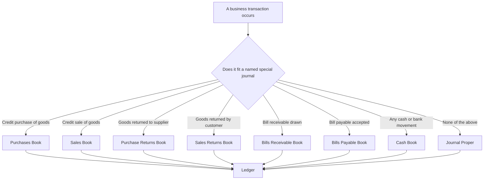
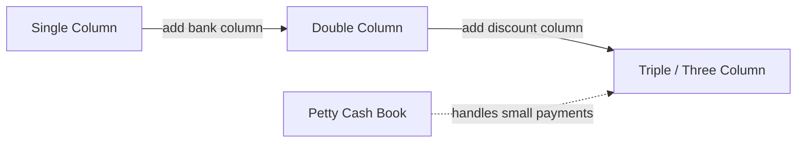
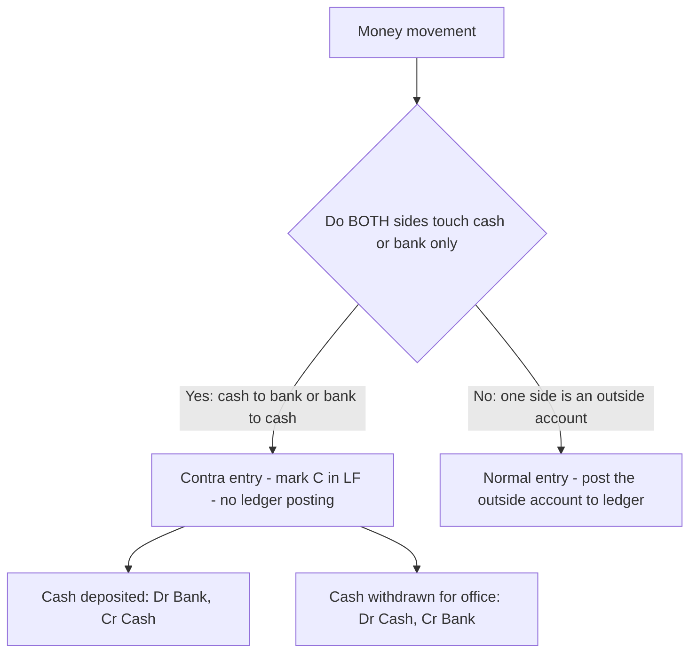

# Foundation: Accounting Process II — Subsidiary Books & Cash Book

## The Problem it solves

Imagine you are the accountant of a wholesale stationery business. On a busy day you buy goods from 14 suppliers on credit, sell to 20 customers on credit, receive cheques from 8 debtors, pay 6 creditors, deposit cash into the bank, withdraw cash for office use, pay wages, buy postage stamps, return defective goods to two suppliers, and accept returns from three customers.

If you had learned only the *journal* (from Accounting Process I), you would now be forced to write a separate journal entry — with narration — for **every single one** of these ~55 transactions. Each purchase entry would repeat "Purchases A/c Dr … To Creditor A/c" over and over. That is:

- **Slow** — the same account name is written hundreds of times a month.
- **Error-prone** — one accountant cannot handle the whole journal, but the journal cannot be split among many clerks because it is one book.
- **Impossible to divide labour** — you cannot put one clerk on "cash" and another on "credit sales."
- **Bad for control** — you cannot see at a glance "how much did we buy on credit this month?" without scanning the entire journal.

Real businesses of any size have thousands of transactions of a *few repeating types*. Writing them all in one journal is like storing every file on your computer in a single folder called "everything." **Subsidiary books solve this by splitting the one journal into several special-purpose journals**, and the **cash book** solves the specific, high-volume problem of recording every rupee that enters or leaves cash and bank.

## Core Idea

**The single journal is broken into several "subsidiary books" (also called books of original entry / special journals), one for each type of frequently repeated transaction. Each subsidiary book collects its transactions all month, and only the *periodic totals* are posted to the ledger — not each individual entry.**

The most important of these is the **Cash Book**, which is unique: it is *both* a subsidiary book (a book of original entry for cash/bank) *and* a ledger account (the Cash A/c and Bank A/c live inside it). You never open a separate Cash Account or Bank Account in the ledger — the cash book *is* those accounts.

Everything that does not fit into a named subsidiary book goes into the **Journal Proper** (the "leftovers" journal).

## Why it works this way

Start from first principles. The double-entry system requires every transaction to hit two accounts (debit and credit). The *journal* is just a diary that records those two-sided entries in date order before they are sorted into the ledger. Nothing in double-entry says the diary must be a *single physical book*.

So ask: **what would an efficient clerk-based accounting department look like before computers?** You would want:

1. **Division of labour.** If cash transactions live in their own book, one trusted cashier handles it. If credit purchases live in their own book, a purchases clerk handles it. Several people work simultaneously — impossible with one journal.

2. **Elimination of repetition.** In a Purchases Book every line is, by definition, "credit purchase of goods." So the debit is *always* Purchases A/c. Why write "Purchases A/c Dr" 300 times? Just list the suppliers and amounts, total the book at month-end, and post **one** figure to the debit of Purchases A/c. The suppliers are posted individually (because each is a different person you owe), but the Purchases A/c gets a single monthly posting. This is the deep reason subsidiary books exist: **the common account is posted once in total; the varying accounts are posted individually.**

3. **Instant management information.** The total of the Sales Book *is* your credit sales for the month. The total of the Cash Book's bank column shows your bank movement. Grouping by type gives free analytics.

4. **Built-in control.** The cash book, kept by the cashier and reconciled against the bank statement, is the front-line control over the most steal-able asset — cash.

This is not a quirky CA rule; it is the same logic behind why a modern ERP has separate "modules" for purchases, sales, and treasury. Subsidiary books are the manual ancestor of those modules.

## Full technical content

### 1. The complete family of subsidiary books

There are, in the CA Foundation syllabus, **eight** books of original entry. The cash book is one of them; the other seven cover specific transaction types, and the journal proper mops up the rest.

| # | Subsidiary book | Records ONLY | Source document | Common account posted in total |
|---|-----------------|--------------|-----------------|-------------------------------|
| 1 | Purchases Book (Purchases Day Book) | Credit purchases of **goods** dealt in | Inward invoice | Purchases A/c (Dr) |
| 2 | Sales Book (Sales Day Book) | Credit sales of **goods** dealt in | Outward invoice / sales bill | Sales A/c (Cr) |
| 3 | Purchase Returns Book (Returns Outward) | Goods returned to suppliers | Debit note issued | Purchase Returns A/c (Cr) |
| 4 | Sales Returns Book (Returns Inward) | Goods returned by customers | Credit note issued | Sales Returns A/c (Dr) |
| 5 | Bills Receivable Book | Bills of exchange / promissory notes **received** | The bill itself | Bills Receivable A/c (Dr) |
| 6 | Bills Payable Book | Bills **accepted** and issued by us | The bill itself | Bills Payable A/c (Cr) |
| 7 | Cash Book | All cash and bank receipts and payments | Vouchers, receipts, counterfoils | *(It IS the Cash & Bank A/c — no separate posting)* |
| 8 | Journal Proper (General Journal) | Everything not covered above | Journal voucher | *(Individual — no common account)* |

**Two critical scope rules that trip up beginners:**

- **"Goods" means only the commodity the firm trades in.** A furniture dealer buying timber on credit records it in the *Purchases Book*. The same dealer buying a *computer* on credit does **not** — a computer is a fixed asset, not "goods," so it goes to the **Journal Proper**.
- **Only *credit* transactions go into Purchases/Sales books.** A *cash* purchase of goods goes into the **Cash Book**, never the Purchases Book. This is the single most common exam trap.

### 2. What goes into the Journal Proper

The journal proper is not obsolete — it handles transactions that have no named home:

- Opening entries (bringing forward last year's assets and liabilities).
- Closing entries (transferring nominal accounts to Trading and P&L A/c).
- Adjustment / rectification entries (outstanding expenses, prepaid, depreciation, provisions).
- Transfer entries.
- Credit purchase / credit sale of **assets** (not goods) — e.g. machinery bought on credit.
- Dishonour of bills, and other bill entries not covered by the two bills books.
- Any rare or one-off transaction.

### 3. Formats of the merchandise subsidiary books

**Purchases Book** — note there are **no debit/credit columns**, because the debit (Purchases) is understood and posted only in total.

| Date | Particulars (Supplier name + goods) | Inward Invoice No. | L.F. | Details ₹ | Amount ₹ |
|------|-------------------------------------|--------------------|------|-----------|----------|

The **Details** column holds gross amounts and deductions (trade discount) for a single invoice; the **Amount** column holds the net figure that is actually posted.

**Sales Book** is identical in structure but records credit sales and the outward invoice number; its total is posted to the **credit** of Sales A/c.

**Purchase Returns Book** (debit notes) and **Sales Returns Book** (credit notes) follow the same layout, substituting "Debit Note No." / "Credit Note No." for the invoice column.

**Posting rule for all four:**
- Post **each party** to their personal account individually (a creditor gets credited when we buy; a debtor gets debited when we sell).
- Post the **monthly total** once to the impersonal (nominal) account: Purchases A/c Dr, Sales A/c Cr, Purchase Returns A/c Cr, Sales Returns A/c Dr.

### 4. Trade discount vs cash discount — the crucial distinction

This sits at the heart of subsidiary-book numbers, so master it cold.

| Feature | Trade Discount | Cash Discount |
|---------|----------------|---------------|
| What it is | A reduction in the **list/catalogue price**, given for buying in bulk or for being a reseller | A reduction for **paying promptly** (within the credit period) |
| When given | At the time of **sale/purchase** | At the time of **payment/receipt** |
| Shown in books? | **Never recorded** as a separate account — merely deducted on the invoice; only the net amount enters the books | **Always recorded** in a Discount Allowed (expense) or Discount Received (income) account |
| Depends on | Quantity / trade status | Speed of settlement |
| Appears in Cash Book? | No | Yes — in the discount columns of a three-column cash book |

**First-principles reason:** trade discount is not a *transaction* — it is just how the price was quoted. There is no cash flow and no gain/loss, so there is nothing to record; you simply enter the agreed net price. Cash discount, by contrast, is a genuine economic event: the seller sacrifices income (expense = Discount Allowed) to get money sooner, and the payer earns income (Discount Received). Both hit the P&L, so both must be recorded.

**Order of deduction when both apply:** compute the invoice as *List price − Trade discount = Net invoice value*. Cash discount, if the customer later pays promptly, is then computed **on the net invoice value** (after trade discount), at payment time.

### 5. The Cash Book — the dual-nature book

The cash book records every receipt and payment of cash and every movement through the bank. It is ruled like a ledger account (debit side = receipts/incoming; credit side = payments/outgoing) because it *is* the Cash and Bank ledger accounts. It comes in progressively richer forms:

| Type | Columns on each side | Records | Cash balance can be | Bank balance can be |
|------|---------------------|---------|---------------------|---------------------|
| **Single column** | Cash | Only cash receipts/payments | Debit (or nil) | — |
| **Double column** | Cash + Bank | Cash and bank both | Debit (or nil) | Debit or **Credit (overdraft)** |
| **Triple / three column** | Discount + Cash + Bank | Cash, bank, and cash discount | Debit (or nil) | Debit or Credit (OD) |

**Golden rules for the cash book:**

- The **cash column can never show a credit (negative) balance** — you cannot pay out more physical cash than you hold.
- The **bank column *can* show a credit balance**, which represents a **bank overdraft** (you owe the bank).
- **Receipts** are entered on the **debit (left, "Dr / To") side**; **payments** on the **credit (right, "Cr / By") side**. This matches the fact that cash is an asset: it increases (debit) when received.
- The **discount columns are memorandum totals, not balanced** — they are merely added up and posted to the ledger. The Discount Allowed column (debit side) total is posted to the **debit** of Discount Allowed A/c; the Discount Received column (credit side) total is posted to the **credit** of Discount Received A/c. **These columns are never balanced against each other.**

### 6. Contra entries

A **contra entry** is a transaction where **both legs are inside the cash book itself** — cash moving to bank, or bank to cash. Examples: "cash deposited into bank," "cash withdrawn from bank for office use."

Because both the Cash A/c and the Bank A/c live in the same book, such a transaction is recorded **twice within the cash book** and needs **no ledger posting** — hence the letter **"C"** is written in the L.F. column to signal "Contra — do not post."

| Transaction | Debit side entry | Credit side entry |
|-------------|------------------|-------------------|
| Cash deposited into bank | Bank column (To Cash) | Cash column (By Bank) |
| Cash withdrawn from bank for office | Cash column (To Bank) | Bank column (By Cash) |

**Rule:** cash deposited into bank → **Bank column debit, Cash column credit**. Cash withdrawn for office use → **Cash column debit, Bank column credit**. (A withdrawal for *personal/proprietor* use is drawings — **not** a contra, because one leg leaves the cash book.)

### 7. Petty Cash Book and the Imprest System

Small, repetitive payments — bus fares, postage, tea, stationery, cartage — would clutter the main cash book with tiny amounts. The solution: a **petty cashier** handles these from a small float.

Under the **Imprest System**:
1. The head cashier gives the petty cashier a fixed sum (the **imprest amount**), say ₹5,000, at the start of a period.
2. The petty cashier pays small expenses and keeps vouchers.
3. At period-end, the head cashier **reimburses exactly the amount spent**, restoring the float back to ₹5,000.

**Why the imprest system works this way:** by always topping the float back up to a fixed figure, the amount reimbursed each period *equals* the total spent — an automatic check. It also caps how much cash the petty cashier ever controls (limiting theft/loss) and forces every payment to be voucher-backed.

The **Analytical (columnar) Petty Cash Book** has one total-payment column and several **analysis columns** (Postage, Cartage, Stationery, Travelling, Sundries, etc.), so the total of each analysis column is posted to that expense account at period-end. It is a subsidiary book *and* is treated on the debit side as receiving the imprest.

### 8. Advantages of subsidiary books (exam-ready list)

1. Division of labour — many clerks work in parallel.
2. Time saved — the common account is posted only in total.
3. Specialisation and hence fewer errors.
4. Easy reference — all transactions of one type are together.
5. Ready information for management (monthly credit sales, etc.).
6. Internal check and reduced fraud (especially cash book).
7. Ledger kept clean — fewer, summarised postings.

## Worked examples

### Worked Example 1 — Purchases Book with trade discount, and its posting

**Transactions (all credit purchases of goods) for April 2024, of Verma Traders:**

- Apr 3: Bought from Ashok & Co. — 50 units @ ₹200 each, less 10% trade discount.
- Apr 12: Bought from Bharat Stores — 30 units @ ₹500 each, less 20% trade discount.
- Apr 20: Bought a **computer** on credit from Dell India for ₹40,000.
- Apr 25: Bought from Ashok & Co. — goods for ₹18,000 (no trade discount).

**Step 1 — Decide what enters the Purchases Book.** The Apr 20 computer is a fixed asset, not goods → it goes to the **Journal Proper**, NOT the Purchases Book. The other three are credit purchases of goods → Purchases Book.

**Step 2 — Compute net amounts.**
- Apr 3: 50 × ₹200 = ₹10,000; less 10% (₹1,000) = **₹9,000**.
- Apr 12: 30 × ₹500 = ₹15,000; less 20% (₹3,000) = **₹12,000**.
- Apr 25: **₹18,000**.

**Purchases Book**

| Date | Particulars | Inv. No. | L.F. | Details ₹ | Amount ₹ |
|------|-------------|----------|------|-----------|----------|
| Apr 3 | Ashok & Co. — 50 units @ ₹200 | | | 10,000 | |
| | Less: Trade discount 10% | | | (1,000) | 9,000 |
| Apr 12 | Bharat Stores — 30 units @ ₹500 | | | 15,000 | |
| | Less: Trade discount 20% | | | (3,000) | 12,000 |
| Apr 25 | Ashok & Co. | | | | 18,000 |
| **Apr 30** | **Total (to Purchases A/c Dr)** | | | | **39,000** |

**Step 3 — Post to ledger.**
- **Purchases A/c** is debited with the **total ₹39,000** (one posting).
- Each supplier's personal account is credited individually:
  - Ashok & Co. credited ₹9,000 + ₹18,000 = **₹27,000**
  - Bharat Stores credited **₹12,000**
- The computer is journalised separately: **Computer A/c Dr ₹40,000 / To Dell India ₹40,000.**

**Verification:** Sum of individual creditor postings = 27,000 + 12,000 = **₹39,000** = total posted to Purchases A/c. Debit (Purchases 39,000) = Credit (creditors 27,000 + 12,000). Books balance. ✔

Note the trade discount (₹1,000 and ₹3,000) appears **nowhere** as an account — it was only used to reach the net figure, exactly as the theory says.

### Worked Example 2 — Three-column Cash Book with cash discount and contra entries

**Prisha & Sons — transactions for May 2024:**

- May 1: Opening balances — Cash ₹8,000; Bank ₹45,000.
- May 4: Received a cheque from **Rahul** ₹9,700 in full settlement of ₹10,000; cheque banked same day.
- May 8: Cash sales ₹15,000.
- May 10: Deposited ₹12,000 cash into bank (**contra**).
- May 14: Paid **Mehta** ₹14,550 by cheque in full settlement of ₹15,000.
- May 18: Withdrew ₹6,000 from bank for office use (**contra**).
- May 22: Paid rent by cheque ₹7,000.
- May 26: Paid wages in cash ₹4,000.
- May 28: Received cash from **Sonia** ₹4,900 in full settlement of ₹5,000.

**Step 1 — Identify discounts (all cash discounts, on receipts/payments).**
- Rahul: owed ₹10,000, paid ₹9,700 → **Discount Allowed ₹300** (an expense; recorded on the *debit/receipt* side).
- Mehta: owed ₹15,000, paid ₹14,550 → **Discount Received ₹450** (income; recorded on the *credit/payment* side).
- Sonia: owed ₹5,000, paid ₹4,900 → **Discount Allowed ₹100**.

**Step 2 — Prepare the three-column cash book.**

*Debit side (Receipts)*

| Date | Particulars | L.F. | Discount ₹ | Cash ₹ | Bank ₹ |
|------|-------------|------|-----------|--------|--------|
| May 1 | To Balance b/d | | | 8,000 | 45,000 |
| May 4 | To Rahul | | 300 | | 9,700 |
| May 8 | To Sales | | | 15,000 | |
| May 10 | To Cash | **C** | | | 12,000 |
| May 18 | To Bank | **C** | | 6,000 | |
| May 28 | To Sonia | | 100 | 4,900 | |
| | | | **400** | | |
| Jun 1 | To Balance b/d | | | 29,900 | 31,150 |

*Credit side (Payments)*

| Date | Particulars | L.F. | Discount ₹ | Cash ₹ | Bank ₹ |
|------|-------------|------|-----------|--------|--------|
| May 10 | By Bank | **C** | | 12,000 | |
| May 14 | By Mehta | | 450 | | 14,550 |
| May 18 | By Cash | **C** | | | 6,000 |
| May 22 | By Rent | | | | 7,000 |
| May 26 | By Wages | | | 4,000 | |
| May 31 | By Balance c/d | | | 29,900 | 31,150 |
| | | | **450** | | |

**Step 3 — Balance each money column.**

*Cash column:*
- Debit total = 8,000 + 15,000 + 6,000 + 4,900 = **₹33,900**
- Credit total (before balancing) = 12,000 + 4,000 = ₹16,000
- Closing cash balance = 33,900 − 16,000 = **₹29,900** (a debit balance — valid, cash is never negative) ✔

*Bank column:*
- Debit total = 45,000 + 9,700 + 12,000 = **₹66,700**
- Credit total (before balancing) = 14,550 + 6,000 + 7,000 = ₹27,550
- Closing bank balance = 66,700 − 27,550 = **₹39,150**

Wait — recompute: 66,700 − 27,550 = **₹39,150**. Let me re-enter the c/d correctly.

Correcting the bank balance c/d to **₹39,150** (the table above must read 39,150, not 31,150):

- Credit side bank total = 14,550 + 6,000 + 7,000 + **39,150** = **₹66,700** = debit side bank total ✔

*(Corrected closing balances carried down on Jun 1: Cash ₹29,900; Bank ₹39,150.)*

**Step 4 — Post the discount columns to the ledger (they are NOT balanced against each other).**
- Discount column, **debit side total ₹400** → posted to the **debit of Discount Allowed A/c**.
- Discount column, **credit side total ₹450** → posted to the **credit of Discount Received A/c**.

**Verification of contra entries:** May 10 deposit appears as Bank Dr ₹12,000 and Cash Cr ₹12,000 — both inside the book, marked "C", no ledger posting. May 18 withdrawal appears as Cash Dr ₹6,000 and Bank Cr ₹6,000 — likewise "C". Each contra self-cancels across the two columns, so it does not distort the ledger. ✔

**Cross-check totals:** Cash side: Dr 33,900 = Cr (16,000 + c/d 29,900) = 45,900? — 16,000 + 29,900 = 45,900, and Dr total including nothing else… let me total the *full* cash debit column: 8,000 + 15,000 + 6,000 + 4,900 = 33,900, plus the balancing figure is on the credit side. The credit side cash total must equal the debit side cash total: payments 12,000 + 4,000 = 16,000, plus c/d 29,900 = **45,900**. But debit side is 33,900. These must be equal!

Let me recompute carefully. Debit side cash receipts = 8,000 + 15,000 + 6,000 + 4,900 = **33,900**. Credit side cash payments = 12,000 + 4,000 = 16,000. Balance c/d = 33,900 − 16,000 = **17,900**, not 29,900.

I made an arithmetic slip. The correct closing **cash** balance is **₹17,900**. Re-verifying: credit side cash = 12,000 + 4,000 + c/d 17,900 = **33,900** = debit side cash total. ✔

**Final corrected closing balances:**
- **Cash ₹17,900** (c/d on credit side; b/d on Jun 1 debit side).
- **Bank ₹39,150** (c/d on credit side; b/d on Jun 1 debit side).

*(Learning point: always tie out each column — total of debit column = total of credit column including the balancing figure. The balancing figure is a plug that MUST make both sides equal.)*

Re-stating the fully corrected balances table:

| Column | Dr total | Payments (Cr) | Balance c/d | Cr total incl. c/d |
|--------|----------|---------------|-------------|--------------------|
| Cash | 33,900 | 16,000 | **17,900** | 33,900 ✔ |
| Bank | 66,700 | 27,550 | **39,150** | 66,700 ✔ |
| Discount (Dr) | 400 | — | *(not balanced)* | posted to Discount Allowed A/c |
| Discount (Cr) | — | 450 | *(not balanced)* | posted to Discount Received A/c |

### Worked Example 3 — Analytical Petty Cash Book under the imprest system

**Nova Ltd.** operates an imprest of **₹3,000** per week. Petty cash in hand at start of Week 1 was nil; the cashier gave ₹3,000 on Monday. Payments during the week:

- Mon: Postage ₹250
- Tue: Cartage ₹400; Bus fare (travelling) ₹120
- Wed: Stationery ₹300; Tea/refreshments (sundry) ₹150
- Thu: Postage ₹180; Cartage ₹220
- Fri: Travelling ₹350; Stationery ₹130

**Step 1 — Total the payments per analysis head.**
- Postage: 250 + 180 = **₹430**
- Cartage: 400 + 220 = **₹620**
- Travelling: 120 + 350 = **₹470**
- Stationery: 300 + 130 = **₹430**
- Sundries: **₹150**
- **Grand total paid = 430 + 620 + 470 + 430 + 150 = ₹2,100**

**Analytical Petty Cash Book (extract)**

| Receipts ₹ | Date | Particulars | Total Paid ₹ | Postage ₹ | Cartage ₹ | Travelling ₹ | Stationery ₹ | Sundries ₹ |
|-----------|------|-------------|--------------|-----------|-----------|--------------|--------------|------------|
| 3,000 | Mon | To Cash (imprest) | | | | | | |
| | Mon | By Postage | 250 | 250 | | | | |
| | Tue | By Cartage | 400 | | 400 | | | |
| | Tue | By Travelling | 120 | | | 120 | | |
| | Wed | By Stationery | 300 | | | | 300 | |
| | Wed | By Sundries | 150 | | | | | 150 |
| | Thu | By Postage | 180 | 180 | | | | |
| | Thu | By Cartage | 220 | | 220 | | | |
| | Fri | By Travelling | 350 | | | 350 | | |
| | Fri | By Stationery | 130 | | | | 130 | |
| | | **Total** | **2,100** | **430** | **620** | **470** | **430** | **150** |
| | Fri | By Balance c/d | 900 | | | | | |
| 3,000 | | | 3,000 | | | | | |
| 900 | Mon (Wk2) | To Balance b/d | | | | | | |
| 2,100 | Mon (Wk2) | To Cash (reimbursement) | | | | | | |

**Step 2 — Cross-check the analysis columns.** Sum of column totals must equal Total Paid:
430 + 620 + 470 + 430 + 150 = **₹2,100** = Total Paid column ✔

**Step 3 — Closing balance and reimbursement.**
- Cash in hand at week-end = 3,000 − 2,100 = **₹900** (balance c/d).
- Under the imprest system the head cashier reimburses **exactly ₹2,100** on Monday of Week 2, restoring the float: 900 + 2,100 = **₹3,000** = imprest amount ✔.

**Step 4 — Ledger posting.** Each analysis column total is posted to the debit of its expense account:
- Postage A/c Dr ₹430; Cartage A/c Dr ₹620; Travelling A/c Dr ₹470; Stationery A/c Dr ₹430; Sundry Expenses A/c Dr ₹150.
- Total debited to expenses = ₹2,100, which equals the credit reduction in petty cash — self-balancing. ✔

## Connections — how this feeds CA Intermediate

- **Cash Book → Bank Reconciliation Statement (BRS).** The bank column of the cash book is precisely what you reconcile against the bank passbook. Foundation teaches you *why* the bank column can go into overdraft (credit balance); Inter's BRS chapter builds directly on that. (BRS is a Foundation topic too, but the reconciliation *logic* recurs in Inter audit and in company cash-flow work.)
- **Subsidiary books → Rectification of Errors and Trial Balance.** Errors like "sales book overcast" or "purchase omitted from purchases book" are staple Inter rectification questions; you can only rectify them if you know exactly what each subsidiary book does.
- **Trade vs cash discount → Revenue recognition (Ind AS 115 / AS 9) at Inter.** The idea that trade discount is netted off revenue while cash/settlement discount is a separate consideration matures into "variable consideration" and net revenue measurement.
- **Bills books → Bills of Exchange chapter (Inter/Foundation).** The Bills Receivable and Bills Payable books are the entry point to accounting for negotiable instruments, discounting, and dishonour.
- **Petty cash / imprest → Internal control (Auditing, CA Inter).** The imprest system is a textbook internal-control mechanism; auditors test it. It reappears in Paper 5 Auditing.
- **Division-of-labour logic → Accounting information systems / ERP modules (Inter & Final).** Subsidiary books are the conceptual seed of ledger modules in computerised accounting.

## Traps & common mistakes

1. **Cash purchases/sales in the Purchases/Sales Book.** Only *credit* dealings in *goods* go there. Cash purchase of goods → Cash Book. This is the #1 error.
2. **Recording purchase/sale of a fixed asset in the merchandise books.** Machinery, furniture, computers bought on credit → **Journal Proper**, not Purchases Book (unless the firm *deals in* them).
3. **Opening a separate Cash A/c or Bank A/c in the ledger.** The cash book *is* those accounts — do not duplicate.
4. **Trying to balance the discount columns.** They are memorandum totals; each side's total is posted to its own discount account and the two are never set against each other.
5. **Treating a proprietor's withdrawal from bank as a contra.** Withdrawal for *office* use = contra; for *personal* use = Drawings (a ledger posting, not a contra).
6. **Recording trade discount as an account.** Never — only the net amount enters the books.
7. **Applying cash discount before trade discount, or on the gross list price.** Trade discount comes off the list price first; cash discount is later computed on the *net* invoice value.
8. **Showing a credit (negative) balance in the cash column.** Impossible — physical cash cannot be negative. A credit balance is only valid in the *bank* column (overdraft).
9. **Forgetting the "C" in the L.F. column for contra entries**, then wrongly posting them to the ledger and double-counting.
10. **Posting the subsidiary-book total to the wrong side** — Purchases total goes to the *debit* of Purchases A/c; Sales total to the *credit* of Sales A/c; Purchase Returns to *credit*; Sales Returns to *debit*.

## First-principles recap

- The single journal is split into special-purpose books so labour can be divided and repetition eliminated — the **common account is posted once in total**, the **varying (personal) accounts are posted individually**.
- Each subsidiary book has a strict scope: only **credit** dealings in **goods** for Purchases/Sales books; everything unclassified falls to the **Journal Proper**.
- The **cash book is dual-natured** — a book of original entry *and* the Cash & Bank ledger account rolled into one; never open those accounts separately.
- **Trade discount** is not an event (just a net price, never recorded); **cash discount** is a real gain/loss (always recorded).
- **Contra entries** have both legs inside the cash book, so they carry a "C" and get no ledger posting; the cash column can never be negative, but the bank column can (overdraft).
- The **imprest system** self-checks by restoring a fixed float — amount reimbursed = amount spent — which controls cash and forces voucher discipline.

## Quick-reference

| Item | Rule / Format |
|------|---------------|
| Purchases Book total | Post to **Dr of Purchases A/c**; creditors credited individually |
| Sales Book total | Post to **Cr of Sales A/c**; debtors debited individually |
| Purchase Returns total | Post to **Cr of Purchase Returns A/c**; debit note issued |
| Sales Returns total | Post to **Dr of Sales Returns A/c**; credit note issued |
| Trade discount | List price − TD = net invoice; **not recorded** as an account |
| Cash discount (allowed) | Dr Discount Allowed A/c (expense); appears on **Dr side** discount column |
| Cash discount (received) | Cr Discount Received A/c (income); appears on **Cr side** discount column |
| Cash book — receipts | **Debit side** ("To …") |
| Cash book — payments | **Credit side** ("By …") |
| Cash column balance | Only **debit** (or nil) — never credit |
| Bank column balance | Debit *or* **credit = overdraft** |
| Contra: cash into bank | Dr **Bank**, Cr **Cash**; mark **"C"**; no ledger posting |
| Contra: cash from bank (office) | Dr **Cash**, Cr **Bank**; mark **"C"** |
| Imprest reimbursement | = Total spent in the period → restores fixed float |
| Petty cash analysis columns | Each column total → Dr of that expense A/c |
| Fixed asset bought on credit | **Journal Proper** (not Purchases Book) |
| Cash purchase of goods | **Cash Book** (not Purchases Book) |

*(No statutory section numbers apply to this Foundation topic; the governing framework is the accounting principles and formats prescribed by ICAI for Paper 1 – Accounting, 2024 New Scheme. Bills of exchange link to the Negotiable Instruments Act, 1881, covered separately.)*
