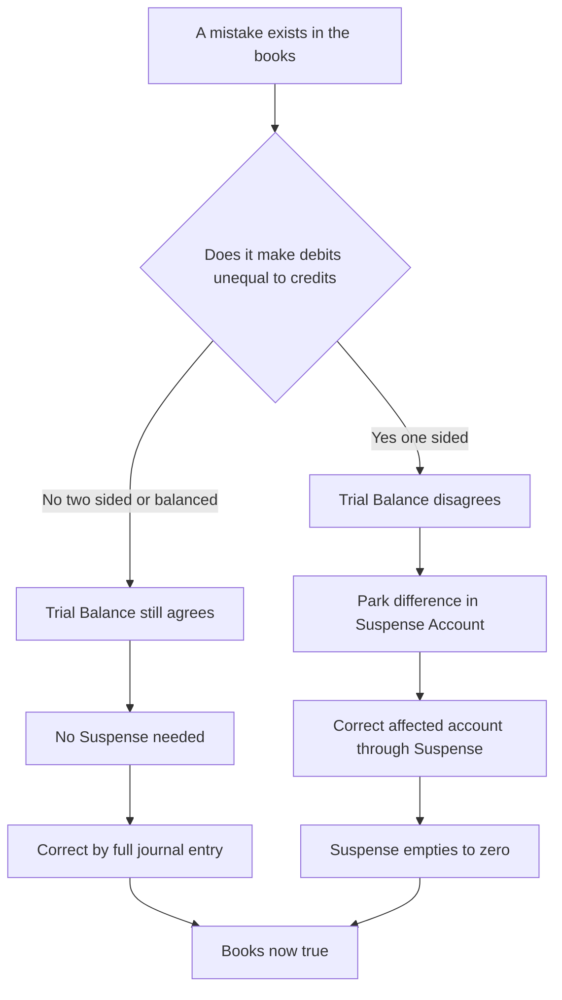
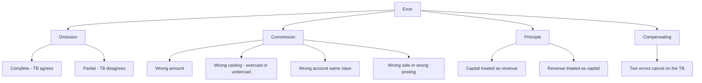
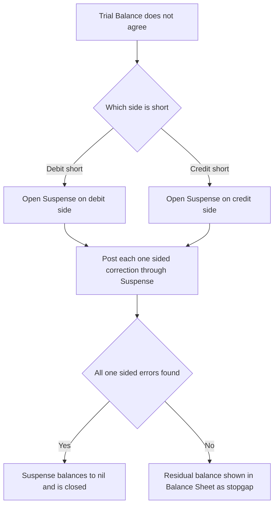

<!-- v1-foundation -->

# Foundation: Rectification of Errors

## 1. The Problem it solves — the books disagree, and you cannot just erase your way out

A bookkeeper has spent the whole year writing up the day-books, posting to the ledger, and balancing off accounts. On 31 March she extracts a **Trial Balance** — the list of every ledger balance, debits in one column, credits in the other. Under double-entry, every transaction put an equal debit and credit into the system, so the two columns *must* be equal. She totals them.

Debit ₹8,47,300. Credit ₹8,45,750. **A gap of ₹1,550.**

Somewhere in ten thousand postings, something went wrong. She cannot present accounts that do not balance, she cannot legally tear out a page and rewrite it (the books are a permanent, sequential record — over-writing destroys the audit trail and invites fraud), and she cannot simply plug the ₹1,550 into "miscellaneous" and move on. She has to *find* what broke and *correct it through a fresh entry* that itself obeys double-entry.

That is the entire problem this chapter solves: **how do you locate, classify, and correct mistakes in a double-entry system — after the fact, through new entries, without ever erasing anything — so that the Trial Balance agrees and the final accounts tell the truth?**

And there is a nastier version of the problem hiding underneath. Suppose the Trial Balance had actually *agreed*. Would that prove the books are correct? **No.** A whole family of errors — buying a machine and calling it "purchases," recording a ₹2,000 sale as ₹200 in *both* the customer's account and the sales account, forgetting a transaction entirely — leave the two columns perfectly equal while the accounts are quietly wrong. So the bookkeeper is fighting on two fronts: errors that *shout* (the columns don't match) and errors that *hide* (the columns match but lie). Rectification is the discipline of dealing with both.

There is real money at stake. If the machine sits in "purchases," profit is understated by ₹10,000 and an asset is missing from the Balance Sheet. If a credit sale is omitted, both a debtor and revenue vanish. Investors, banks, and the Income-Tax Department all read numbers that depend on these being right. Rectification is not clerical hygiene — it is what keeps the reported profit and the reported financial position *honest*.

## 2. Core Idea — every error is a broken double-entry, and you fix it with another double-entry

Here is the one sentence to carry through the whole chapter:

> **An error is a double-entry that came out wrong. Rectification is the additional double-entry (or single posting) that, added to the wrong one, produces the effect the *correct* entry would have produced — nothing more, nothing less.**

You never delete the wrong entry. You *neutralise* it. You ask two questions and subtract:

1. **What entry was actually made?** (the wrong one)
2. **What entry *should* have been made?** (the correct one)
3. The **rectifying entry** is whatever you must post so that *wrong + rectification = correct*.

That is the master algorithm. Everything else — the four types of errors, the suspense account, the profit adjustments — is just this idea applied in different situations. If you can always write down "what was done" and "what should have been done," you can always find the fix by difference. Students who memorise a table of standard corrections freeze the moment the exam twists the wording; students who run this two-line comparison never do.

The second half of the core idea is about *reach*. Some errors touch **both sides** of the ledger equally (a debit and a credit are both wrong by the same amount) — these keep the Trial Balance in agreement and can only be corrected by a full journal entry. Other errors touch **one side only** (a single posting is missing, wrong, or duplicated) — these throw the Trial Balance out of agreement and are corrected by posting to the one affected account, routed through a temporary holding account called the **Suspense Account**. Knowing which kind you are looking at tells you *how* to fix it.

## 3. Why it works this way — first principles, not rules

**Why can't you just erase?** Because the value of accounting records comes from their *integrity as evidence*. An erased or over-written book is worthless in a dispute, a tax scrutiny, or an audit — you cannot tell what was changed, when, or by whom. The convention is absolute: mistakes are corrected by *new dated entries that explain themselves*, leaving the original visible. This is the same instinct that later, in CA Inter and in law, becomes "maintain proper books of account" under the Companies Act and the Income-Tax Act. The correction is part of the story, not a cover-up of it.

**Why does the Trial Balance catch some errors but not others?** The Trial Balance is nothing more than a test of one thing: *did total debits equal total credits?* It is a checksum, not a proof of correctness. An error survives the checksum whenever it damages debits and credits *equally*. Post ₹200 instead of ₹2,000 to *both* the sales account and the customer — both columns fall by ₹1,800, the difference stays zero, the checksum passes. Omit a transaction entirely — no debit and no credit were ever made, both columns are untouched, checksum passes. The Trial Balance can only detect errors that create an *imbalance*, i.e. errors that hit one side by a different amount than the other. This is why "the Trial Balance agreed" is comforting but not conclusive — a truth every auditor internalises.

**Why route one-sided corrections through a Suspense Account?** When the columns don't agree by ₹1,550, you still have to close the books and get on with life. You cannot leave the Trial Balance un-totalled while you hunt for weeks. So you park the unexplained ₹1,550 in a temporary account — the **Suspense Account** — on whichever side makes the totals equal. The Suspense Account is a confession written into the ledger: *"₹1,550 of debits (or credits) exists that I cannot yet explain."* As you find each one-sided error and correct it, the correction flows through Suspense. When every one-sided error has been found, the Suspense Account automatically empties to zero and disappears. If it refuses to close, errors remain undiscovered. It is a diagnostic scratchpad, never a real asset or liability.

**Why does the *timing* of discovery change the correction?** Because at year-end you close all the **nominal accounts** (incomes and expenses — sales, purchases, wages, rent) into the Profit & Loss Account, and their balances cease to exist as live accounts. Before that closing, "purchases were overstated by ₹1,000" is fixed by crediting the still-open Purchases Account. *After* closing, there is no Purchases Account to credit — its balance has already flowed into a profit figure that is now sitting in the Balance Sheet as part of Capital. So a correction to any nominal account discovered *after* the accounts are closed must be routed through a stand-in for the P&L — the **Profit & Loss Adjustment Account** — which ultimately adjusts Capital. Real accounts (assets, liabilities) are not closed and are corrected directly in both periods. The timing rule is not arbitrary; it falls straight out of *which accounts still exist when you reach for them*.

*Figure 1 — the two families of error and the two repair routes. The left branch needs a Suspense Account; the right branch never touches it.*

## 4. Full technical content (ICAI-aligned, CA Foundation 2024 New Scheme)

Rectification of Errors is a **bookkeeping-mechanics** topic — it rests on the *dual-aspect concept* and the conventions of double-entry, not on any statute. There are therefore no Act sections to cite; the "authority" is the internal logic of double-entry itself, examined exactly as laid out in the ICAI Foundation Paper 1 Study Material. What follows is the complete apparatus.

### 4.1 The four types of errors (classification by *nature*)

Errors are first classified by **what kind of mistake was made**. This is the diagnostic vocabulary the exam expects you to use precisely.

| Type | What it is | Everyday trigger | TB effect |
|---|---|---|---|
| **Error of Omission** | A transaction is not recorded, wholly or partly | Invoice lost; forgot to post one side | Complete omission: **no effect** (TB agrees). Partial omission: **usually affects** TB |
| **Error of Commission** | A transaction is recorded but *incorrectly* — wrong amount, wrong side, wrong account of the **same class**, or a casting/carry-forward/posting slip | Wrote ₹540 as ₹450; posted to Ram instead of Ram Kumar; overcast a book | **May or may not** affect TB, depending on which sub-type |
| **Error of Principle** | An entry violates an accounting principle — most often mixing **capital and revenue** items | Machine repair charged to Machinery A/c; new machine charged to Purchases | **No effect** on TB (both sides posted, just to a wrong-*class* account) |
| **Compensating Errors** | Two or more independent errors whose net effect on the TB **cancels out** | An account over-debited ₹500 while another is over-credited ₹500 | **No effect** on TB (they neutralise each other) |

**Error of Omission — the two grades.**
- *Complete omission*: the transaction never entered the books at all. No debit, no credit. The Trial Balance is undisturbed, so this error hides.
- *Partial omission*: one aspect was recorded and the other was left out — e.g., a cash sale entered in the cash book but never posted to the Sales Account. Now one side moved and the other didn't, so the Trial Balance is thrown out.

**Error of Commission — the busy category.** This is the widest bucket and includes:
- *Wrong amounting*: recording ₹1,000 as ₹100 (or vice-versa).
- *Wrong casting*: totalling a subsidiary book wrong — **overcasting** (total too high) or **undercasting** (total too low).
- *Wrong posting to the correct-class account*: right amount, wrong account, but of the same category — posting a payment to *Suresh* instead of *Naresh* (both debtors). Because both are personal accounts, the *class* is right; only the identity is wrong.
- *Wrong side posting*: posting to the debit of an account when it should be on the credit.
- *Posting the wrong amount to one account*: e.g., sales book total ₹5,000 posted to Sales as ₹5,500.
- *Carry-forward errors*: a page total carried forward wrongly to the next page.

**Error of Principle — the silent distorter.** Here the debit and credit are both made (so the Trial Balance agrees), but one of them is in the *wrong class of account*. The classic and most-tested case is the **capital vs revenue** confusion:
- Treating a **capital expenditure as revenue** — e.g., wages paid to install a new machine (part of the machine's cost, a capital item) debited to the Wages Account (a revenue expense). Result: expenses overstated, asset understated, profit understated.
- Treating a **revenue expenditure as capital** — e.g., ordinary repairs to a building debited to the Building Account. Result: expenses understated, asset overstated, profit *overstated*.

Because both aspects are recorded, the Trial Balance never flags an error of principle. It is caught only by someone who *reads the accounts and knows the principle* — which is precisely the auditor's job in later papers.

**Compensating Errors — the lucky cancellation.** Two unrelated errors happen to push the Trial Balance in opposite directions by equal amounts, so the net imbalance is zero. Example: the Sales Account is over-credited by ₹500 *and* a debtor's account is over-debited by ₹500. Each alone would unbalance the TB; together they cancel. These are dangerous exactly because the agreeing Trial Balance gives false comfort.

*Figure 2 — classification tree. Learn to name any given error against this tree; the exam awards marks for the correct label as well as the correct entry.*

### 4.2 The second classification — by *effect on the Trial Balance*

The nature-based classification tells you *what kind* of mistake it is. But for *rectification mechanics*, the more useful split is by **effect on the Trial Balance**, because that decides whether you use a Suspense Account.

| | **Errors NOT affecting the Trial Balance** (two-sided) | **Errors affecting the Trial Balance** (one-sided) |
|---|---|---|
| **What broke** | Both debit and credit are wrong by equal amounts, OR both are missing | Only one account is wrong — a single posting missing, wrong, or duplicated |
| **Examples** | Complete omission; error of principle; wrong account same class; compensating errors; wrong amount recorded in the *original book* (so both postings carry the same wrong figure) | Wrong casting of a book; posting to the wrong side; posting the wrong amount to *one* account; omitting *one* posting; wrong balancing of an account |
| **How to rectify** | Pass a **complete journal entry** (Dr and Cr). **No Suspense Account involved** | Correct the **single affected account**; the other leg of the entry is the **Suspense Account** |
| **When found before final a/cs** | Straight journal entry | Journal entry with Suspense as the balancing leg |

The single most important skill in the whole chapter is deciding, for any given error, **is this one-sided or two-sided?** Ask: *"Did the mistake damage the debit total and the credit total by the same amount?"* If yes → two-sided → full journal entry, no Suspense. If no → one-sided → Suspense is the other leg.

### 4.3 The Suspense Account — mechanics

**When it is opened.** When the Trial Balance does not agree and you cannot immediately locate the difference, you insert the **Suspense Account** on the *shorter* side to force the totals to match, so the books can be closed.
- If the **debit total is short**, Suspense goes on the **debit** side (a temporary debit balance).
- If the **credit total is short**, Suspense goes on the **credit** side (a temporary credit balance).

**How one-sided errors flow through it.** Every one-sided rectification has one leg in the real (affected) account and the other leg in Suspense. As you post each correction, the Suspense balance moves toward zero.

**How it closes.** When all one-sided errors have been found and corrected, the total of the corrections exactly equals the original difference, and the Suspense Account balances to nil and is removed. **A Suspense Account that will not close means at least one one-sided error is still undiscovered** — and if final accounts must be prepared before it closes, the *balance of the Suspense Account is shown in the Balance Sheet* (debit balance on the assets side, credit balance on the liabilities side) as a stopgap, never as a genuine item.

**What it does NOT do.** The Suspense Account is *never* used for two-sided errors — those are self-balancing journal entries and touching Suspense would create a fresh imbalance.

*Figure 3 — life cycle of the Suspense Account.*

### 4.4 Rectification **before** preparing final accounts

At this stage every account — real *and* nominal — is still open. So:
- **Two-sided errors**: pass the plain journal entry that makes *wrong + rectification = correct*.
- **One-sided errors**: debit or credit the affected account for the shortfall/excess, with **Suspense Account** as the contra.

You are working directly with live accounts, so a wrongly-stated Sales Account is corrected in the Sales Account, wrongly-stated Wages in Wages, and so on.

### 4.5 Rectification **after** preparing final accounts

Once the P&L is prepared, all nominal accounts are **closed**; their balances have merged into the profit figure, which sits inside Capital on the Balance Sheet. Therefore:

- **Corrections to REAL accounts** (assets, liabilities, capital, debtors, creditors) are made **directly**, exactly as before — those accounts are still open.
- **Corrections to NOMINAL accounts** (any income or expense) cannot go to the now-closed account. They are routed through the **Profit & Loss Adjustment Account** (also called *Profit & Loss Suspense* in some texts), which acts as a proxy for the closed P&L. Its final balance is transferred to **Capital**.
- **One-sided errors** still use the **Suspense Account** for their non-P&L leg.

**The direction-of-profit rule** (used constantly):
- Anything that in the original error *understated an expense* or *overstated an income* had **inflated** profit → correcting it now **reduces** profit → **debit** P&L Adjustment.
- Anything that *overstated an expense* or *understated an income* had **depressed** profit → correcting it now **increases** profit → **credit** P&L Adjustment.

The net balance of the P&L Adjustment Account is the *net effect of all nominal-account errors on profit*, and it is carried to Capital: a debit balance reduces Capital (profit was over-reported), a credit balance increases it.

### 4.6 Effect of errors on profit and on the Balance Sheet

Every error ripples in a predictable way. For **profit**, only errors touching **nominal accounts** matter — errors between two *real* accounts (e.g., cash paid to a creditor posted to the wrong creditor) never touch profit. Trace the effect through this table:

| Error's effect on a nominal account | Effect on reported profit | Correcting entry's effect |
|---|---|---|
| Expense **overstated** (or recorded when it shouldn't be) | Profit **understated** | Correction **increases** profit |
| Expense **understated** (or omitted) | Profit **overstated** | Correction **decreases** profit |
| Income **overstated** (or recorded when it shouldn't be) | Profit **overstated** | Correction **decreases** profit |
| Income **understated** (or omitted) | Profit **understated** | Correction **increases** profit |

For the **Balance Sheet**, errors touching **real accounts** move assets/liabilities, and any change in profit flows into **Capital**. An error of principle like "repairs charged to Building" does *both*: it overstates the Building asset *and* overstates profit (through understated expense) — so the Balance Sheet is wrong on two lines that happen to keep it arithmetically balanced. Rectification restores both. A useful sanity check on any full problem: after rectification, the change in total assets must equal the change in (liabilities + capital).

## 5. Worked examples

### Worked Example 1 — Two-sided errors, rectified before final accounts (no Suspense)

The following errors were found in the books of **M/s Verma Traders** *before* the final accounts were prepared. Classify each and pass the rectifying journal entries.

1. Credit purchase of goods for ₹5,000 from **Ram** was completely omitted from the books.
2. Goods sold to **Shyam** for ₹2,000 were recorded in the Sales Book as ₹200.
3. A new machine bought for ₹10,000 (on credit from Bharat Machines) was debited to the **Purchases Account**.
4. ₹500 paid as wages for the **installation** of that machine was debited to the **Wages Account**.
5. Goods worth ₹1,500 returned by customer **Mohan** were not recorded at all.

**Step-by-step reasoning.** For each, write "what was done" vs "what should have been done," then the difference.

**(1) Complete omission.** Done: nothing. Should be: Purchases Dr 5,000 / Ram Cr 5,000. Difference = the whole correct entry.

**(2) Error of commission (wrong amount in the original book).** Done: Shyam Dr 200 / Sales Cr 200. Should be: Shyam Dr 2,000 / Sales Cr 2,000. Both legs are short by ₹1,800 → add ₹1,800 to each. (Both sides equally wrong → two-sided → no Suspense.)

**(3) Error of principle (capital treated as revenue).** Done: Purchases Dr 10,000 / Bharat Cr 10,000. Should be: Machinery Dr 10,000 / Bharat Cr 10,000. The creditor leg is already right; only the debit is in the wrong-class account. Move it: Machinery Dr 10,000 / Purchases Cr 10,000.

**(4) Error of principle.** Done: Wages Dr 500. Should be: Machinery Dr 500 (installation cost is part of the asset). Move it: Machinery Dr 500 / Wages Cr 500.

**(5) Complete omission of a sales return.** Should be: Sales Return Dr 1,500 / Mohan Cr 1,500.

**Rectifying journal entries:**

| # | Particulars | Dr (₹) | Cr (₹) |
|---|---|---:|---:|
| 1 | Purchases A/c ... Dr | 5,000 | |
| | &nbsp;&nbsp;To Ram | | 5,000 |
| 2 | Shyam ... Dr | 1,800 | |
| | &nbsp;&nbsp;To Sales A/c | | 1,800 |
| 3 | Machinery A/c ... Dr | 10,000 | |
| | &nbsp;&nbsp;To Purchases A/c | | 10,000 |
| 4 | Machinery A/c ... Dr | 500 | |
| | &nbsp;&nbsp;To Wages A/c | | 500 |
| 5 | Sales Return A/c ... Dr | 1,500 | |
| | &nbsp;&nbsp;To Mohan | | 1,500 |

**Verification.** Each entry has Dr = Cr, so none disturbs the Trial Balance's agreement — correct, because all five were two-sided errors. Total debits posted = 5,000 + 1,800 + 10,000 + 500 + 1,500 = **₹18,800**; total credits = 5,000 + 1,800 + 10,000 + 500 + 1,500 = **₹18,800**. Balanced. No Suspense Account was needed anywhere.

### Worked Example 2 — One-sided errors and the Suspense Account (before final accounts)

The Trial Balance of **M/s Anand Stores** did not agree; the **credit side exceeded the debit side by ₹1,550**, and the difference was placed in a Suspense Account. The books were later scrutinised and the following one-sided errors were found. Pass the rectifying entries and prepare the Suspense Account to show it closes.

(a) The **Purchases Book was undercast** by ₹500.
(b) The **Sales Book was overcast** by ₹800.
(c) The total of the **Sales Return Book, ₹250, was not posted** to the Sales Return Account.
(d) The **Discount Allowed Account was posted twice** with the discount total of ₹90.
(e) ₹430 paid for **rent** was posted to the Rent Account as ₹340.

**Step-by-step reasoning — for each, find which single account is wrong and by how much, then which side, then the Suspense leg.**

**(a)** Purchases Book undercast ₹500 → the Purchases Account (a debit account) was **under-debited by ₹500**. Fix: debit Purchases ₹500; contra = Suspense. → *Purchases Dr 500 / Suspense Cr 500.*

**(b)** Sales Book overcast ₹800 → Sales Account (a credit account) **over-credited by ₹800**. Fix: debit Sales ₹800 to reduce it; contra = Suspense. → *Sales Dr 800 / Suspense Cr 800.*

**(c)** Sales Return total not posted → Sales Return Account (a debit account) **under-debited by ₹250**. Fix: debit Sales Return ₹250. → *Sales Return Dr 250 / Suspense Cr 250.*

**(d)** Discount Allowed posted twice → Discount Allowed (a debit account) **over-debited by ₹90**. Fix: credit it ₹90 to remove the extra. → *Suspense Dr 90 / Discount Allowed Cr 90.*

**(e)** Rent ₹430 posted as ₹340 → Rent (a debit account) **under-debited by ₹90** (430 − 340). Fix: debit Rent ₹90. → *Rent Dr 90 / Suspense Cr 90.*

**Rectifying journal entries:**

| # | Particulars | Dr (₹) | Cr (₹) |
|---|---|---:|---:|
| a | Purchases A/c ... Dr | 500 | |
| | &nbsp;&nbsp;To Suspense A/c | | 500 |
| b | Sales A/c ... Dr | 800 | |
| | &nbsp;&nbsp;To Suspense A/c | | 800 |
| c | Sales Return A/c ... Dr | 250 | |
| | &nbsp;&nbsp;To Suspense A/c | | 250 |
| d | Suspense A/c ... Dr | 90 | |
| | &nbsp;&nbsp;To Discount Allowed A/c | | 90 |
| e | Rent A/c ... Dr | 90 | |
| | &nbsp;&nbsp;To Suspense A/c | | 90 |

**Which side did the original Suspense balance go?** Credit exceeded debit by ₹1,550, so debit was *short* → Suspense was opened on the **debit** side with a balance of ₹1,550 (a temporary debit balance b/d).

**Suspense Account:**

| Dr | ₹ | Cr | ₹ |
|---|---:|---|---:|
| To Balance b/d | 1,550 | By Purchases A/c | 500 |
| To Discount Allowed A/c | 90 | By Sales A/c | 800 |
| | | By Sales Return A/c | 250 |
| | | By Rent A/c | 90 |
| **Total** | **1,640** | **Total** | **1,640** |

**Verification.** Debit side = 1,550 + 90 = **1,640**. Credit side = 500 + 800 + 250 + 90 = **1,640**. The account balances to **nil** and is closed — confirming that all one-sided errors have been located. As an independent check, the original difference should equal the net of the corrections' Suspense legs: credits to Suspense (500 + 800 + 250 + 90 = 1,640) minus debit to Suspense (90) = **1,550**, exactly the opening difference. Both checks agree.

### Worked Example 3 — Rectification AFTER final accounts, with profit and Balance-Sheet effect

**M/s Kiran & Co.** prepared its final accounts and reported a **net profit of ₹50,000**. *Afterwards*, the following errors were discovered. A Suspense Account is in use. Pass the rectifying entries, prepare the Profit & Loss Adjustment Account, compute the corrected profit, and confirm the Balance Sheet still balances.

1. A credit purchase of goods for ₹3,000 was **completely omitted** from the books.
2. Goods sold on credit for ₹4,000 were recorded in the books as ₹400.
3. Repairs to building ₹2,000 were **debited to the Building Account** (error of principle).
4. The **Sales Return Book was overcast** by ₹500.
5. Wages ₹700 were **posted to the Wages Account as ₹70** (a one-sided posting error).

**Key idea:** nominal-account legs go to **Profit & Loss Adjustment A/c** (the closed P&L's proxy); real-account legs (creditors, debtors, building) go directly; one-sided legs go to **Suspense**.

**(1) Complete omission — purchase.** Correct entry would have been Purchases Dr 3,000 / Creditor Cr 3,000. Purchases is nominal → now P&L Adjustment. The omission had *understated* an expense → profit was *overstated* → correcting **reduces** profit → debit P&L Adjustment.
→ *P&L Adjustment A/c Dr 3,000 / To Creditors 3,000.* Profit effect: **−3,000.**

**(2) Sale under-recorded by ₹3,600** (4,000 − 400), both legs equally short → two-sided. Debtor (real) up 3,600; Sales (nominal) up 3,600. Income was understated → profit understated → correcting **increases** profit → credit P&L Adjustment.
→ *Debtors A/c Dr 3,600 / To P&L Adjustment A/c 3,600.* Profit effect: **+3,600.**

**(3) Error of principle — repairs in Building.** Building (real) overstated 2,000; Repairs (nominal expense) understated. Expense understated → profit overstated → correcting **reduces** profit → debit P&L Adjustment; credit the real Building account to remove the wrongly capitalised amount.
→ *P&L Adjustment A/c Dr 2,000 / To Building A/c 2,000.* Profit effect: **−2,000.** Balance-Sheet effect: Building asset **−2,000.**

**(4) Sales Return Book overcast ₹500 — one-sided.** Sales Return (nominal, debit-natured, a deduction from revenue) was over-debited by 500. Over-stated deduction from sales had *understated* profit → correcting **increases** profit → credit P&L Adjustment; the single-account fix means the contra is Suspense.
→ *Suspense A/c Dr 500 / To P&L Adjustment A/c 500.* Profit effect: **+500.**

**(5) Wages ₹700 posted as ₹70 — one-sided**, Wages under-debited by 630 (700 − 70). Expense understated → profit overstated → correcting **reduces** profit → debit P&L Adjustment; contra Suspense.
→ *P&L Adjustment A/c Dr 630 / To Suspense A/c 630.* Profit effect: **−630.**

**Rectifying journal entries:**

| # | Particulars | Dr (₹) | Cr (₹) |
|---|---|---:|---:|
| 1 | P&L Adjustment A/c ... Dr | 3,000 | |
| | &nbsp;&nbsp;To Creditors | | 3,000 |
| 2 | Debtors A/c ... Dr | 3,600 | |
| | &nbsp;&nbsp;To P&L Adjustment A/c | | 3,600 |
| 3 | P&L Adjustment A/c ... Dr | 2,000 | |
| | &nbsp;&nbsp;To Building A/c | | 2,000 |
| 4 | Suspense A/c ... Dr | 500 | |
| | &nbsp;&nbsp;To P&L Adjustment A/c | | 500 |
| 5 | P&L Adjustment A/c ... Dr | 630 | |
| | &nbsp;&nbsp;To Suspense A/c | | 630 |

**Profit & Loss Adjustment Account:**

| Dr (reduces profit) | ₹ | Cr (increases profit) | ₹ |
|---|---:|---|---:|
| To Creditors (omitted purchase) | 3,000 | By Debtors (sale under-recorded) | 3,600 |
| To Building (principle) | 2,000 | By Suspense (sales return overcast) | 500 |
| To Suspense (wages) | 630 | By Balance c/d (net fall in profit) | 1,530 |
| **Total** | **5,630** | **Total** | **5,630** |

The account shows a **debit balance of ₹1,530**, i.e. the net effect of all nominal-account errors was to *reduce* the true profit by ₹1,530. Transfer to Capital: *Capital A/c Dr 1,530 / To P&L Adjustment A/c 1,530.*

**Corrected profit** = 50,000 − 3,000 + 3,600 − 2,000 + 500 − 630 = **₹48,470.** (Cross-check: original 50,000 − net P&L Adjustment 1,530 = 48,470.) ✔

**Suspense Account** (from the two one-sided errors, entries 4 and 5):

One-sided TB impacts before rectification — (4) Sales Return over-debited by 500 → debit excess 500; (5) Wages under-debited by 630 → debit short 630. Net = debit short by 130 → Suspense had an opening **debit balance of ₹130.**

| Dr | ₹ | Cr | ₹ |
|---|---:|---|---:|
| To Balance b/d | 130 | By P&L Adjustment A/c (wages) | 630 |
| To P&L Adjustment A/c (sales return) | 500 | | |
| **Total** | **630** | **Total** | **630** |

Debit 130 + 500 = **630**; Credit **630**. Suspense **closes to nil.** ✔

**Balance-Sheet cross-check (the change in assets must equal the change in liabilities + capital):**

- Assets: Debtors **+3,600**, Building **−2,000**, Suspense (was a ₹130 debit balance, now gone) **−130**. Net change in assets = 3,600 − 2,000 − 130 = **+1,470.**
- Liabilities + Capital: Creditors **+3,000**, Capital **−1,530** (profit fell). Net change = 3,000 − 1,530 = **+1,470.**

Both sides change by **+₹1,470** — the Balance Sheet stays in balance after rectification. ✔ Every figure reconciles.

### Worked Example 4 — Locating the difference from the Suspense balance (reasoning drill)

A book-keeper found the Trial Balance out by ₹270, **debit side short**, and opened a Suspense Account. On investigation only **one** error was found: *the total of the Discount Received column of the Cash Book, ₹270, had not been posted to the Discount Received Account.*

**Reasoning.** Discount Received is an income → a **credit-natured** account. Failing to post its total means the Discount Received Account was **under-credited by ₹270** — the credit total of the ledger is short by ₹270. But the problem says the *debit* side was short. Contradiction? No — re-read: if a credit posting is missing, the credit column is short, so the *debit* column is comparatively *higher*… which means the Suspense would sit on the credit side, not the debit. So a single omitted *credit* posting cannot explain a *debit-short* difference. This tells the book-keeper: **the stated symptom does not match this single error — another error must exist.**

This is the diagnostic value of the exercise: the *side* of the Suspense difference constrains what kind of error you are hunting. Here, correcting the one known error is still valid — *Discount Received A/c is credited ₹270 with Suspense debited ₹270* (*Suspense A/c Dr 270 / To Discount Received A/c 270*), which would move Suspense, but because the original difference was on the opposite side, the Suspense will **not** close, proving more errors remain. The lesson: **the Suspense balance is a clue, and its side is half the clue.**

## 6. Connections — what this unlocks in CA Intermediate

- **Financial Statements of Companies (Inter Paper 1 / Advanced Accounting).** Every consolidation, restatement, and set of published accounts assumes the underlying ledgers are error-free. Rectification is the hygiene layer beneath Schedule III financial statements.
- **AS 5 — Prior Period Items & Errors (Inter).** The Foundation "error found after final accounts" becomes, at Inter level, the formal concept of a **prior period item**: an error relating to a previous period, discovered now, disclosed separately in the P&L. The P&L Adjustment mechanic you learn here is the seed of AS 5's treatment.
- **Auditing & Ethics (Inter Paper 5).** The whole audit risk model rests on the fact that *"a Trial Balance that agrees does not prove the books are correct."* Errors of principle, compensating errors, and complete omissions are precisely what substantive audit procedures (not arithmetic checks) are designed to catch. **SA 450** (evaluation of misstatements) is the professional-grade version of this chapter.
- **Bank Reconciliation Statement (Foundation/Inter).** A sibling technique — reconciling two independent records — uses the same "what was done vs what should be" logic.
- **Rectification in the next period / self-correcting errors.** Inter extends this to errors that *reverse themselves* over two years (e.g., closing-stock errors), building directly on the profit-effect analysis here.

## 7. Traps & common mistakes

1. **Assuming an agreed Trial Balance means correct books.** The single biggest conceptual trap. Complete omissions, errors of principle, wrong-account-same-class postings, and compensating errors *all* leave the TB agreed. State this explicitly if the exam asks.
2. **Using the Suspense Account for two-sided errors.** Suspense is *only* the balancing leg for one-sided errors. A full journal entry (Dr = Cr) already balances — adding Suspense would create a new imbalance. Marks are lost instantly here.
3. **Passing the *original* correct entry instead of the *rectifying* entry.** For an error of principle where the credit leg was already right, only the *debit* needs moving. Re-passing the whole correct entry double-counts the correct leg. Always compute *correct minus wrong*.
4. **Getting the profit direction backwards.** Overstated expense → profit was *understated* → correction *increases* profit (credit P&L Adjustment). Slow down and reason from the table in 4.6; do not guess the sign.
5. **Forgetting the timing rule after final accounts.** After closing, nominal-account corrections must go through **P&L Adjustment**, not the (now-closed) nominal account. Real accounts are still corrected directly. Mixing these up is a classic error.
6. **Mis-reading over/undercasting.** *Overcasting* a Sales Book over-credits Sales (reduce it to fix); *undercasting* a Purchases Book under-debits Purchases (add to fix). Read whether the account is debit-natured or credit-natured before deciding the fix side.
7. **Wrong Suspense side.** "Debit short" → Suspense on debit; "credit short" → Suspense on credit. Reversing this flips every subsequent entry.
8. **Treating installation/carriage on a new asset as revenue expense.** Costs to bring an asset to working condition are *capital* — classic error-of-principle bait.
9. **Ignoring the Balance-Sheet side of an error of principle.** "Repairs charged to Building" affects *both* profit and the Building figure — a full-marks answer mentions both and, in a comprehensive problem, restates the Balance Sheet.
10. **Netting compensating errors and "leaving them."** Even though two compensating errors cancel on the TB, each must be *separately rectified* — the individual accounts are still wrong.

## 8. First-principles recap

- An error is a **broken double-entry**; rectification is the entry that makes **wrong + fix = correct**. Never erase — neutralise with a fresh, self-explaining entry.
- The **Trial Balance is only a checksum** (debits = credits). It catches errors that create an *imbalance* and is blind to errors that damage both sides equally — omission, principle, wrong-account-same-class, compensating.
- **One-sided** errors (single account wrong) unbalance the TB and are fixed *through the Suspense Account*; **two-sided** errors (both legs wrong equally) keep the TB agreed and are fixed by a *full journal entry with no Suspense*.
- The **Suspense Account** is a temporary confession of an unexplained difference; it lives on the shorter side and dies (balances to nil) only when every one-sided error is found.
- **Timing decides the route:** before final accounts, correct live accounts directly; after final accounts, nominal-account corrections go through **P&L Adjustment A/c** (→ Capital), because the nominal accounts are closed.
- **Only nominal-account errors move profit;** real-to-real errors move the Balance Sheet, not profit. Trace expense/income over- or under-statement to get the profit direction right, and remember an error of principle can hit *both* profit and an asset.

## 9. Quick-reference

| Situation | Rectifying treatment |
|---|---|
| Complete omission | Pass the full correct entry (two-sided, no Suspense) |
| Error of principle (capital ↔ revenue) | Move the wrong-class leg: e.g. `Asset A/c Dr / To Expense A/c` |
| Wrong account, same class | `Correct account Dr / To Wrong account` (two-sided) |
| Book overcast/undercast (one-sided) | Adjust that book's account vs **Suspense** |
| Single posting omitted/wrong-amount (one-sided) | Adjust the one account vs **Suspense** |
| Compensating errors | Rectify each separately (net TB effect nil) |
| Nominal error found **after** final a/cs | Route through **P&L Adjustment A/c** → Capital |
| Real-account error found after final a/cs | Correct the real account **directly** |

| Rule / relationship | Statement |
|---|---|
| Trial Balance test | Total Debits = Total Credits (checksum only) |
| Suspense side | Debit total short → Suspense on Dr; Credit total short → Suspense on Cr |
| Suspense closes | When Σ(one-sided corrections) = original difference |
| Profit direction | Expense ↑ or Income ↓ ⇒ profit was ↓ ⇒ correction **increases** profit (Cr P&L Adj.) |
| | Expense ↓ or Income ↑ ⇒ profit was ↑ ⇒ correction **decreases** profit (Dr P&L Adj.) |
| P&L Adjustment balance | Dr balance ⇒ profit was over-reported ⇒ **reduce** Capital; Cr balance ⇒ **increase** Capital |
| Balance-Sheet check | After rectification: Δ Assets = Δ (Liabilities + Capital) |

| Key entry formats | Journal |
|---|---|
| One-sided (account under-stated on Dr) | `Concerned A/c Dr / To Suspense A/c` |
| One-sided (account over-stated on Dr) | `Suspense A/c Dr / To Concerned A/c` |
| Nominal correction after final a/cs (profit falls) | `P&L Adjustment A/c Dr / To Real or Suspense A/c` |
| Nominal correction after final a/cs (profit rises) | `Real or Suspense A/c Dr / To P&L Adjustment A/c` |
| Close P&L Adjustment | `Capital A/c Dr / To P&L Adjustment A/c` (if Dr balance), or reverse |

*Note: Rectification of Errors is a bookkeeping-mechanics topic grounded in the dual-aspect concept and double-entry conventions — there are no statutory sections to cite; the examinable authority is the ICAI Foundation Paper 1 Study Material and the internal logic of double-entry.*
