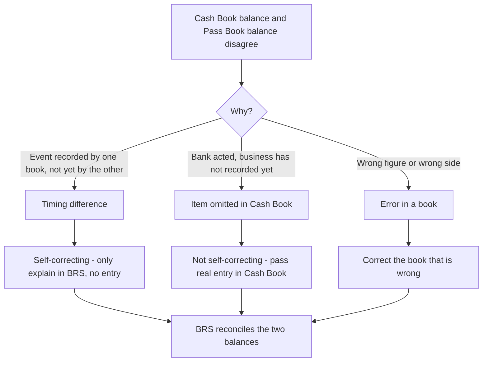
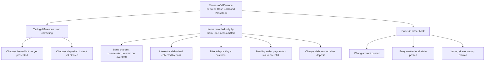
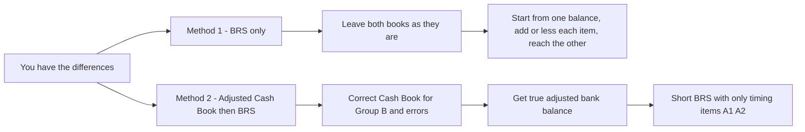

<!-- v2-deep -->

# Foundation: Bank Reconciliation Statement

*CA Foundation Paper 1 — Accounting | ICAI 2024 New Scheme | All amounts in Rupees (₹)*

---

## 2. The Problem it solves

You keep two independent records of the *same* bank account.

The first is **your own record** — the **bank column of the Cash Book**. Every time you receive a cheque and pay it into the bank, you debit the bank column. Every time you write a cheque to a supplier, you credit it. This is the book *you* maintain, in *your* premises, on *your* dates.

The second is the **bank's record of you** — historically a little booklet the bank sent you called the **Pass Book**, today a **Bank Statement** downloaded from net-banking. Here the roles are mirror-reversed: when you deposit money the bank *owes* it back to you, so the bank **credits** your account; when you draw a cheque the bank's liability to you falls, so it **debits** your account.

Here is the concrete situation this chapter answers. On 31 March you close your Cash Book and the bank column shows a balance of, say, **₹50,000**. Feeling confident, you log in to net-banking to confirm — and the bank statement stares back with **₹57,200**. Neither of you has stolen anything. Neither has necessarily made a mistake. Yet the two books that describe *one single pot of money* disagree by ₹7,200.

This is not a rare accident — it happens **every single day** in **every single business**. The moment you write a cheque, your book says the money is gone, but the bank knows nothing about that cheque until the supplier walks into *his* branch and presents it three days later. For those three days the two books *must* disagree — and they are *both correct*.

The danger is that you cannot tell, just by looking at the ₹7,200 gap, whether it is:

- an **innocent timing lag** (a cheque still in the post) that will vanish on its own, **or**
- a **real problem** — a cheque that bounced, a bank charge you forgot, a fraudulent withdrawal, or an arithmetical error in your own book.

If you simply *trust* one book and ignore the other, you will eventually issue a cheque against money that isn't there (and bounce it, attracting penalty and legal consequences under Section 138 of the Negotiable Instruments Act), or you will fail to notice that ₹40,000 has quietly left your account without your instruction.

The **Bank Reconciliation Statement (BRS)** is the disciplined procedure that takes the two balances, explains *every rupee* of the difference by name, proves that the gap is fully accounted for, and flushes out any genuine error or fraud hiding inside what looks like a harmless timing difference.

## 3. Core Idea

**Two honest books can show different balances for the same account, purely because they record the same events on different dates. A BRS is a statement that starts with one book's balance, adds or subtracts each cause of the difference, and arrives exactly at the other book's balance — proving the two are reconcilable.**

The BRS is **not** a ledger account and **not** part of the double-entry system. It posts nothing. It is a **memorandum statement** — a one-time working you prepare *outside* the books to satisfy yourself (and the auditor) that the Cash Book balance and the Bank Statement balance, though numerically different, describe the same reality and differ only for identifiable, legitimate reasons.

Think of it exactly like reconciling two people's accounts of a shared expense. You say "I paid ₹7,200 more"; your flatmate says "no you didn't." Neither of you is lying — you counted a payment he hasn't seen the receipt for yet. You sit down, list each item one paid but the other hasn't recorded, and the two totals click into agreement. The BRS is that sit-down, formalised.

## 4. Why it works this way

The whole subject collapses into **one governing principle** — the **mirror-image / opposite-signs rule** — plus **one habit of thought** — always ask *"which book knows about this event, and which one doesn't yet?"*

**First principle: the Cash Book and the Pass Book are mirror images.** The same bank balance is an **asset to you** (you can draw on it) but a **liability to the bank** (it owes you the money). Assets sit on the debit side in your books; liabilities sit on the credit side in the bank's books. Therefore:

| Situation | In *your* Cash Book (bank column) | In the *bank's* Pass Book / Statement |
|---|---|---|
| You have money in the bank (favourable) | **Debit** balance | **Credit** balance |
| You have overdrawn (overdraft — you owe the bank) | **Credit** balance | **Debit** balance |

Every entry is likewise reversed: a deposit is a **debit in your book** but a **credit in the bank's book**; a cheque you issue is a **credit in your book** but a **debit in the bank's book**. Once you internalise this reversal, the entire chapter is just careful bookkeeping.

**Second principle: differences exist for exactly two reasons — timing or error.**

1. **Timing differences (the honest ones).** One book has recorded an event; the other simply *hasn't got there yet*. These are *self-correcting* — given enough days, the lagging book catches up and the gap closes on its own. No entry is needed in your books because *nothing is wrong* — you were right to record when you did. Examples: a cheque you issued but the payee hasn't presented; a cheque you deposited but the bank hasn't cleared.

2. **Differences the business has not yet recorded (which become errors if left).** The bank *has* acted — it debited a charge, credited interest, honoured a standing-instruction insurance payment, collected a bill on your behalf — but *you* did not know until you saw the statement, so your Cash Book is silent. Here the bank is right and your book is incomplete. These are **not** self-correcting; you must **make a real journal/cash-book entry** to bring your book up to date. Plus genuine **arithmetical or posting errors** in either book.

Why does this matter for the *mechanics*? Because it dictates the two ways of solving every problem:

- The **BRS-only method** leaves both books untouched and just *explains* the gap on paper. It works for exams and for a quick month-end check.
- The **Adjusted Cash Book method** first *corrects* your Cash Book for everything the business genuinely omitted (charges, interest, direct credits, standing orders, your own errors), giving a "true" cash balance, and *then* prepares a much shorter BRS containing only the pure timing differences that are nobody's fault. This is what businesses actually do, because the corrected balance is the one that belongs in the final Balance Sheet.

**Third principle — the direction rule for signing items.** When you start from one balance and want to reach the other, ask: *"Compared with the book I'm starting from, does this item make the target book's balance HIGHER or LOWER?"* If higher, **add**; if lower, **subtract**. That single question, applied honestly item by item, removes all need to memorise long "add/less" tables — though a ready reckoner is given in Section 5 for speed.

---

## 5. Full technical content

### 5.1 The two books, precisely defined

**Cash Book (bank column).** A book of *original entry* and *also* a ledger account for cash and bank. In a "two-column" or "three-column" cash book, the **bank column** is effectively the **Bank Account** in the general ledger. A **debit balance** means money *at* bank (favourable / asset). A **credit balance** means a **bank overdraft** (you have drawn more than you had; the bank is financing you — a liability).

**Pass Book / Bank Statement.** The bank's ledger of your account, given to you as a certified copy. Because it is the *bank's* book, a **credit balance** means money standing to your favour, and a **debit balance** means an **overdraft** (you owe the bank). This reversal is the single most important thing to keep straight.

### 5.2 The causes of difference — the master classification

**Group A — Pure timing differences (both books eventually agree; no Cash Book entry needed).**

| # | Cause | What happened | Effect on *Pass Book* balance vs *Cash Book* |
|---|---|---|---|
| A1 | **Cheques issued but not yet presented** | You recorded the payment (credited Cash Book) the day you wrote the cheque; the payee has not yet banked it, so the bank has not debited you | Pass Book balance is **HIGHER** |
| A2 | **Cheques deposited but not yet collected/credited** | You recorded the receipt (debited Cash Book) on deposit; the bank has not yet cleared the cheque, so it has not credited you | Pass Book balance is **LOWER** |

**Group B — Items the bank recorded but the business has not (needs a real entry when adjusting).**

| # | Cause | What happened | Effect on *Pass Book* balance vs *Cash Book* |
|---|---|---|---|
| B1 | **Bank charges / commission / interest on overdraft** | Bank debited you; you did not know | Pass Book **LOWER** |
| B2 | **Interest allowed / dividend or bill collected by bank** | Bank credited you; you did not know | Pass Book **HIGHER** |
| B3 | **Direct deposit into your account by a customer** | Customer paid straight into your bank; you not yet informed | Pass Book **HIGHER** |
| B4 | **Direct payments by bank on standing instructions** (insurance premium, LIC, loan EMI, rent) | Bank paid on your behalf; you not yet recorded | Pass Book **LOWER** |
| B5 | **Cheque earlier deposited now dishonoured** | Bank reversed the earlier credit; you had recorded the receipt | Pass Book **LOWER** |
| B6 | **Cheque earlier issued now dishonoured / stopped** | Bank did not pay it after all; you had recorded the payment | Pass Book **HIGHER** |

**Group C — Errors.** Direction depends entirely on the specific mistake (over-casting a column, posting a receipt as a payment, recording ₹910 as ₹190, etc.). Handle each on first principles: work out what the balance *should* be, compare with what it *is*, and sign accordingly.

### 5.3 The direction rule (ready reckoner)

Memorise **one fact per item**: does it make the **Pass Book higher or lower than the Cash Book?** Then use this grid. "Fav." = favourable balance; "O/D" = overdraft.

| If the item makes Pass Book… | Start from **Cash Book fav.** → find Pass Book | Start from **Pass Book fav.** → find Cash Book | Start from **Cash Book O/D** → find Pass Book O/D | Start from **Pass Book O/D** → find Cash Book O/D |
|---|---|---|---|---|
| **HIGHER** (A1, B2, B3, B6) | **ADD** | **SUBTRACT** | **SUBTRACT** | **ADD** |
| **LOWER** (A2, B1, B4, B5) | **SUBTRACT** | **ADD** | **ADD** | **SUBTRACT** |

Two things make this foolproof:

1. **Reverse the sign when you reverse the direction.** Everything that is "add" when going Cash Book → Pass Book becomes "subtract" when going Pass Book → Cash Book. So you only ever memorise *one* column and flip.
2. **An overdraft is a negative balance.** A higher (more favourable) bank position means a *smaller* overdraft. That is why the sign flips again for overdraft columns. If you ever feel lost, put the overdraft in with a **minus sign** (e.g. cash-book overdraft ₹30,000 = −30,000), apply the plain favourable-balance rules, and read the final signed number.

### 5.4 The two solution methods

**Method 1 — BRS only.** Take either balance as the starting point and apply the direction rule to *all* causes (Groups A, B and C). Fast, and the only option when the question does not ask you to adjust the Cash Book.

**Method 2 — Adjusted (Amended) Cash Book, then BRS.** The professionally correct route and frequently examined:

- **Step 1 — Adjust the Cash Book.** Record in the bank column everything in **Group B** (charges, interest, direct credits, standing orders, dishonours) and correct any **Cash-Book errors** (Group C errors that are *yours*). Do **NOT** touch Group A timing items and do **NOT** touch errors that are the *bank's*. Balance the account to get the **true / adjusted bank balance** — this is the figure that goes into the Balance Sheet.
- **Step 2 — Prepare a short BRS.** Start from the adjusted Cash Book balance and reconcile only the remaining pure **timing differences (A1, A2)** and any **bank-side errors** to reach the Pass Book balance.

**Format of a Bank Reconciliation Statement:**

| Bank Reconciliation Statement as on 31 March 20X1 | ₹ | ₹ |
|---|---:|---:|
| Balance as per Cash Book (favourable, Dr.) | | XXX |
| **Add:** items making Pass Book higher (unpresented cheques, interest credited, direct deposits, etc.) | | XXX |
| **Less:** items making Pass Book lower (uncleared deposits, bank charges, standing orders, dishonours) | | (XXX) |
| **Balance as per Pass Book (favourable, Cr.)** | | **XXX** |

### 5.5 Real entries required (when adjusting the Cash Book)

Group B items are genuine transactions the business simply learned about late. When you "adjust the Cash Book" you are really passing normal journal entries whose bank leg is the cash book. Formats:

| Event | Entry (bank leg via Cash Book) |
|---|---|
| Bank charges / commission | **Bank Charges A/c Dr.** — To Bank A/c *(credit Cash Book)* |
| Interest on overdraft | **Interest A/c Dr.** — To Bank A/c |
| Interest allowed by bank | **Bank A/c Dr.** *(debit Cash Book)* — To Interest Income A/c |
| Dividend / bill collected by bank | **Bank A/c Dr.** — To Dividend/Bills Receivable A/c |
| Customer's direct deposit | **Bank A/c Dr.** — To Debtor's A/c |
| Insurance / EMI paid by bank (standing order) | **Insurance (or Loan) A/c Dr.** — To Bank A/c |
| Cheque deposited now dishonoured | **Debtor's A/c Dr.** — To Bank A/c *(reverse the earlier receipt)* |

In the **adjusted cash book** you do not write full journal narrations; you simply post the **bank leg** — debit side for increases (interest, dividend, direct deposit), credit side for decreases (charges, interest on OD, standing orders, dishonours) — and strike the balance.

### 5.6 Overdraft — the mirror world

When the account is overdrawn, **everything inverts once more**. The safest technique for a Foundation student:

1. Write the overdraft as a **negative** favourable balance.
2. Apply the ordinary favourable-balance rules (Section 5.3, first data column).
3. Read the answer: a negative result is an overdraft; a positive result is a favourable balance (an overdraft can, after adjustment, turn into a credit balance if enough deposits clear).

Alternatively use the dedicated overdraft columns of the reckoner. Both give identical answers; Worked Example 3 demonstrates the negative-number technique inside an adjusted cash book.

---

## 6. Worked examples

### Worked Example 1 — From Cash Book balance to Pass Book balance (favourable)

**Given.** On 31 March 20X1 the bank column of Mr. Rao's Cash Book shows a **debit (favourable) balance of ₹50,000**. On checking against the bank statement:

1. Cheques issued but not yet presented for payment: **₹8,000**.
2. Cheques deposited into bank but not yet collected/credited: **₹5,000**.
3. Bank charges debited by the bank, not recorded in Cash Book: **₹300**.
4. Interest credited by the bank, not recorded in Cash Book: **₹1,200**.
5. A customer paid **₹4,000** directly into the bank; Mr. Rao not yet informed.
6. A cheque for **₹700** earlier deposited was dishonoured and returned by the bank; not recorded in Cash Book.

**Required.** Prepare the BRS starting from the Cash Book balance.

**Reasoning (item by item — does it make the Pass Book higher or lower?).**

- Item 1 — unpresented cheque: bank has not yet paid, so Pass Book is **higher** → **ADD 8,000**.
- Item 2 — uncleared deposit: bank has not yet credited, so Pass Book is **lower** → **LESS 5,000**.
- Item 3 — bank charges: bank debited you, Pass Book **lower** → **LESS 300**.
- Item 4 — interest credited: bank credited you, Pass Book **higher** → **ADD 1,200**.
- Item 5 — direct deposit: bank credited you, Pass Book **higher** → **ADD 4,000**.
- Item 6 — dishonoured deposit: bank reversed the credit, Pass Book **lower** → **LESS 700**.

**Solution.**

| Bank Reconciliation Statement as on 31 March 20X1 | ₹ | ₹ |
|---|---:|---:|
| Balance as per Cash Book (Dr., favourable) | | 50,000 |
| **Add:** Cheques issued but not yet presented | 8,000 | |
| **Add:** Interest credited by bank | 1,200 | |
| **Add:** Direct deposit by customer | 4,000 | 13,200 |
| | | 63,200 |
| **Less:** Cheques deposited but not yet collected | 5,000 | |
| **Less:** Bank charges | 300 | |
| **Less:** Cheque deposited now dishonoured | 700 | (6,000) |
| **Balance as per Pass Book (Cr., favourable)** | | **57,200** |

**Check.** 50,000 + 13,200 − 6,000 = **₹57,200**. This is exactly the bank statement figure from the opening story — the ₹7,200 gap is now fully explained, rupee for rupee.

---

### Worked Example 2 — From Pass Book balance to Cash Book balance (favourable)

**Given.** The bank statement of M/s Sunrise Traders shows a **credit (favourable) balance of ₹42,000** on 31 March 20X1. Additional information:

1. Cheques issued but not yet presented: **₹6,500**.
2. Cheques deposited but not yet credited by bank: **₹9,200**.
3. Bank charges not recorded in Cash Book: **₹450**.
4. Insurance premium paid by bank on standing instructions, not recorded in Cash Book: **₹2,000**.
5. Interest on investments collected by the bank and credited, not recorded in Cash Book: **₹3,300**.

**Required.** Ascertain the balance as per Cash Book (BRS-only method).

**Reasoning.** Now we travel *backwards* — from Pass Book to Cash Book — so every sign is the **opposite** of the "make Pass Book higher/lower" verdict.

- Item 1 — unpresented cheque makes Pass Book higher, so going *back* to Cash Book → **LESS 6,500**.
- Item 2 — uncleared deposit makes Pass Book lower, so back to Cash Book → **ADD 9,200**.
- Item 3 — bank charges make Pass Book lower → back to Cash Book → **ADD 450**.
- Item 4 — insurance (standing order) makes Pass Book lower → back to Cash Book → **ADD 2,000**.
- Item 5 — interest collected makes Pass Book higher → back to Cash Book → **LESS 3,300**.

**Solution.**

| Bank Reconciliation Statement as on 31 March 20X1 | ₹ | ₹ |
|---|---:|---:|
| Balance as per Pass Book (Cr., favourable) | | 42,000 |
| **Add:** Cheques deposited but not yet credited | 9,200 | |
| **Add:** Bank charges | 450 | |
| **Add:** Insurance premium paid by bank | 2,000 | 11,650 |
| | | 53,650 |
| **Less:** Cheques issued but not yet presented | 6,500 | |
| **Less:** Interest on investments collected by bank | 3,300 | (9,800) |
| **Balance as per Cash Book (Dr., favourable)** | | **43,850** |

**Check (reverse the journey).** Start from Cash Book ₹43,850 → to reach Pass Book: add unpresented ₹6,500 and interest ₹3,300 (=+9,800), less uncleared ₹9,200, charges ₹450, insurance ₹2,000 (=−11,650): 43,850 + 9,800 − 11,650 = **₹42,000** = the Pass Book balance. Reconciled. ✓

---

### Worked Example 3 — Overdraft with the Adjusted Cash Book method

**Given.** On 31 March 20X1 the bank column of Mr. Verma's Cash Book shows an **overdraft (credit balance) of ₹30,000**. On comparison with the bank statement:

1. Cheques issued but not yet presented for payment: **₹12,000**.
2. Cheques deposited but not yet cleared by the bank: **₹7,000**.
3. Bank charges debited by bank, not in Cash Book: **₹600**.
4. Interest on overdraft charged by bank, not in Cash Book: **₹1,500**.
5. A customer directly deposited **₹9,000** into the bank; not recorded by Mr. Verma.
6. Bills receivable **₹4,000** collected by the bank on his behalf; not recorded in Cash Book.

**Required.** (a) Prepare the **Adjusted Cash Book** to find the true bank balance; (b) prepare the BRS to arrive at the Pass Book balance.

**Step 1 — Classify.** Items 3, 4, 5, 6 are **Group B** — the business genuinely omitted them, so they go **into the Adjusted Cash Book**. Items 1 and 2 are pure **timing differences (Group A)** — they stay for the BRS and are **not** entered in the cash book.

Within the cash book, an **overdraft is a credit balance**, shown as **"By Balance b/d"** on the credit side.

- Item 3 Bank charges ₹600 → reduces bank balance → **credit** side.
- Item 4 Interest on overdraft ₹1,500 → reduces bank balance → **credit** side.
- Item 5 Direct deposit ₹9,000 → increases bank balance → **debit** side.
- Item 6 Bills collected ₹4,000 → increases bank balance → **debit** side.

**Step 1 — Adjusted (Amended) Cash Book (bank column only):**

| Dr. | ₹ | Cr. | ₹ |
|---|---:|---|---:|
| To Customer (direct deposit) | 9,000 | By Balance b/d (overdraft) | 30,000 |
| To Bills Receivable (collected by bank) | 4,000 | By Bank charges | 600 |
| To Balance c/d (overdraft) | 19,100 | By Interest on overdraft | 1,500 |
| **Total** | **32,100** | **Total** | **32,100** |

**Working for the balancing figure.** Credit side (things reducing the balance / the opening overdraft) = 30,000 + 600 + 1,500 = **32,100**. Debit side receipts = 9,000 + 4,000 = **13,000**. Since credits exceed debits, the account still carries a **credit (overdraft) balance = 32,100 − 13,000 = ₹19,100**, entered as "To Balance c/d" on the debit side so both totals equal ₹32,100. So the **true overdraft as per the adjusted Cash Book is ₹19,100**.

**Step 2 — BRS from adjusted Cash Book overdraft to Pass Book overdraft.** Only the two timing items remain.

- Item 1 — cheques issued not presented ₹12,000: bank has not paid yet, so the bank's records show a **smaller** overdraft than your book → **LESS 12,000**.
- Item 2 — cheques deposited not cleared ₹7,000: bank has not credited yet, so the bank's records show a **larger** overdraft → **ADD 7,000**.

| Bank Reconciliation Statement as on 31 March 20X1 | ₹ | ₹ |
|---|---:|---:|
| Overdraft as per Adjusted Cash Book (Cr.) | | 19,100 |
| **Less:** Cheques issued but not yet presented | | (12,000) |
| | | 7,100 |
| **Add:** Cheques deposited but not yet cleared | | 7,000 |
| **Overdraft as per Pass Book (Dr.)** | | **14,100** |

**Check.** 19,100 − 12,000 + 7,000 = **₹14,100 overdraft** as per Pass Book. The unpresented cheques of ₹12,000 have not yet hit the bank, so the bank thinks Mr. Verma owes ₹12,000 less; the uncleared deposits of ₹7,000 have not yet reached the bank, so the bank thinks he owes ₹7,000 more — net ₹5,000 less than the adjusted book, and 19,100 − 5,000 = 14,100. Internally consistent. ✓

> **Note on the same problem by Method 1 (BRS only).** Had the question not asked for an adjusted cash book, you would start from the *original* overdraft ₹30,000 and process all six items. Using the negative-number technique (overdraft = −30,000; favourable rules): −30,000 + 12,000 (unpresented, raises balance) − 7,000 (uncleared, lowers) − 600 (charges) − 1,500 (interest) + 9,000 (deposit) + 4,000 (bills) = **−14,100**, i.e. a **₹14,100 overdraft as per Pass Book** — the identical answer. Two roads, one destination.

---

## 7. Connections — what this unlocks in CA Intermediate

- **Advanced Accounting — Cash Flow Statements (AS 3).** A cash flow statement is only trustworthy if the closing "cash and cash equivalents" tie to a *reconciled* bank balance. The habit you build here — proving that the book balance and the bank's balance agree after named adjustments — is exactly the control that makes AS 3's opening and closing cash figures reliable. Bank overdrafts repayable on demand are even treated *as* cash equivalents under AS 3, so understanding the overdraft mirror-image now pays off directly.
- **Auditing & Ethics — Audit of Cash & Bank / Vouching.** The **bank reconciliation** is a primary substantive audit procedure. Auditors obtain a *bank confirmation*, agree it to the client's reconciliation, and scrutinise stale unpresented cheques and long-outstanding deposits as classic red flags for **teeming-and-lading** and cash frauds. This chapter is the mechanical foundation of that audit test.
- **Advanced Accounting — Rectification of Errors & Final Accounts.** The adjusted-cash-book step is a live application of error rectification; the true bank balance you derive is what actually appears under "Cash and Cash Equivalents" in the Schedule III Balance Sheet.
- **Financial Management — Cash and Treasury Management.** Reconciliation feeds the *cash budget* and the float/overdraft management you meet in FM. Knowing why the book balance overstates or understates available funds is the starting point of working-capital control.

## 8. Traps & common mistakes

1. **Confusing which balance is Dr. and which is Cr.** A *favourable* balance is **Dr. in the Cash Book but Cr. in the Pass Book**; an *overdraft* is the reverse. Read the question's exact words ("debit balance as per pass book" = an **overdraft**, not a favourable balance).
2. **Forgetting to flip signs when you reverse direction.** The add/less pattern for Cash Book → Pass Book is the *exact opposite* of Pass Book → Cash Book. Students who memorise one table and forget to invert get every sign wrong.
3. **Putting timing differences into the adjusted cash book.** Unpresented cheques (A1) and uncleared deposits (A2) are **never** entered in the cash book — you were right to record them when you did; the bank is merely late. Only Group B items and your own errors get adjusted.
4. **Adjusting the cash book for the bank's own error.** If the bank wrongly debited *your* account for someone else's cheque, that is the **bank's** mistake — it goes in the **BRS**, never in your cash book.
5. **Mishandling overdraft signs.** The single biggest source of lost marks. When in doubt, treat the overdraft as a **negative number**, apply the plain favourable-balance rules, and read the sign of the answer.
6. **Double-counting a cheque that was recorded but never sent to the bank.** A "cheque entered in cash book but omitted to be banked" affects only the cash book side — do not also treat it as an uncleared deposit.
7. **Dishonour direction.** A *deposited* cheque that bounces makes the Pass Book **lower** (bank reverses a credit); an *issued* cheque that is dishonoured/stopped makes the Pass Book **higher** (bank did not pay after all). They pull in opposite directions — read which one it is.
8. **Wrong-amount errors.** If a cheque of ₹910 was recorded in the cash book as ₹190 on the payments side, the cash book has *under-credited* payments by ₹720 (its balance is overstated by ₹720). Always compute what the balance *should* be versus what it *is*, then sign — do not guess.
9. **Treating the BRS as part of double entry.** It posts nothing. Only the *adjusted cash book* changes the books; the BRS is a memorandum.

## 9. First-principles recap

- The Cash Book (your record) and the Pass Book (the bank's record) describe **one** bank account from **mirror-opposite** sides: your asset is the bank's liability, so debits and credits swap, and a favourable balance in one is the opposite sign in the other.
- Every difference has exactly one of three causes: a **timing lag** (self-correcting, explain only), an **item the business hasn't recorded yet** (bank is right — pass a real entry), or an **error** (correct the wrong book).
- To sign any item, ask one question: *does it make the target book's balance higher (ADD) or lower (SUBTRACT)?* — and flip every sign when you reverse the direction of travel.
- An **overdraft is a negative balance**; process it with favourable-balance rules using a minus sign, or use the dedicated overdraft columns.
- The **BRS-only** method just explains the gap; the **Adjusted Cash Book** method first corrects your book (yielding the true Balance-Sheet figure) and then reconciles the small residue of pure timing differences.
- The reconciliation is a **control**, not a bookkeeping entry — its real job is to catch the fraud or error hiding inside an innocent-looking difference.

## 10. Quick-reference

| Concept | Rule / format |
|---|---|
| Favourable balance | Cash Book: **Dr.**; Pass Book: **Cr.** |
| Overdraft | Cash Book: **Cr.**; Pass Book: **Dr.** |
| Cheque issued, not presented (A1) | Pass Book **higher** |
| Cheque deposited, not cleared (A2) | Pass Book **lower** |
| Bank charges / interest on O/D (B1) | Pass Book **lower** |
| Interest / dividend / bill collected (B2) | Pass Book **higher** |
| Direct deposit by customer (B3) | Pass Book **higher** |
| Standing-order payment by bank (B4) | Pass Book **lower** |
| Deposited cheque dishonoured (B5) | Pass Book **lower** |
| Direction rule | Ask: higher → **ADD**; lower → **SUBTRACT**. Flip all signs when reversing direction |
| Overdraft technique | Treat O/D as **negative**, apply favourable rules, read the sign |
| Items in Adjusted Cash Book | Group B + your own errors only (NOT timing A1/A2, NOT bank's errors) |
| Entry: bank charges | **Bank Charges A/c Dr. — To Bank A/c** |
| Entry: interest allowed | **Bank A/c Dr. — To Interest Income A/c** |
| Entry: customer direct deposit | **Bank A/c Dr. — To Debtor A/c** |
| Entry: deposited cheque dishonoured | **Debtor A/c Dr. — To Bank A/c** |
| Nature of BRS | Memorandum statement, **outside** double entry — posts nothing |
| Legal link | Bounced cheque → Section **138**, Negotiable Instruments Act, 1881 |
