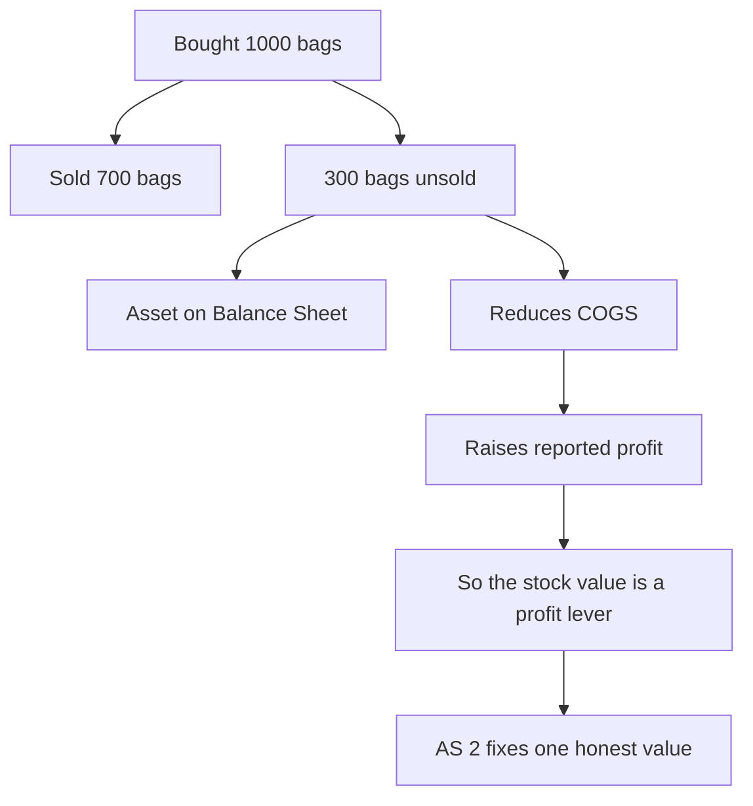
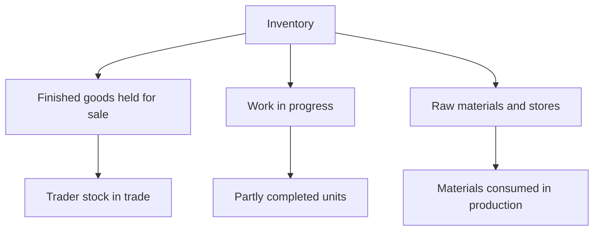
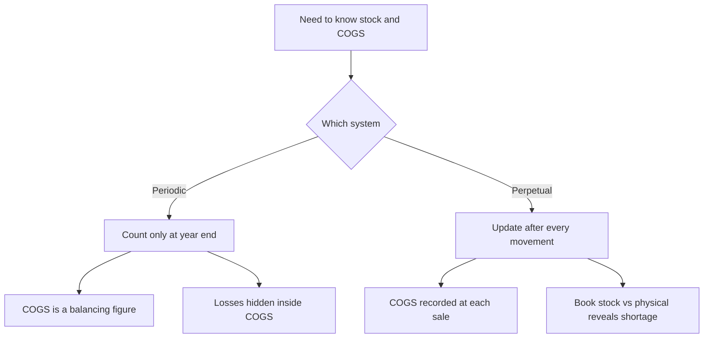

<!-- v2-deep -->

# Foundation: Inventories

*Inventory is the one asset that sits on both the Balance Sheet and the Profit & Loss Account at the same time — value it wrong and you get two lies for the price of one. This chapter builds the whole machinery from first principles: what stock is, what it costs, what it is now worth, and how the number you pick moves your profit.*

---

## 1. The Problem it solves

Picture a trader — call her Meera — who buys and sells rice. On 1 April she had nothing. During the year she bought 1,000 bags for Rs 50,000, and by 31 March she had sold 700 bags for Rs 63,000. On the last day, 300 bags are still lying in her godown, unsold.

Now answer a deceptively simple question: **what profit did Meera make this year?**

If you say "sales Rs 63,000 minus purchases Rs 50,000 = Rs 13,000 profit," you are wrong — and the reason exposes the entire problem this chapter solves. Meera did not *sell* everything she bought. She spent Rs 50,000 to acquire 1,000 bags, but only 700 of those bags left the shop and earned revenue. The other 300 bags are still hers — they are an **asset**, not an expense. Charging their full cost against this year's sales would understate profit and pretend money spent on stock she still owns has somehow vanished.

So before Meera can know her profit, she must answer two questions about those 300 unsold bags:

1. **What did they cost?** Just the price of the rice? Also the lorry freight to bring them in? Also the wages of the man who bagged them?
2. **Are they still worth that much?** If the market price of rice crashed after she bought, or if rats got into a few bags, the stock is worth *less* than she paid — should the Balance Sheet still show the old, higher figure?

These two questions — **cost measurement** and **valuation** — are the whole of inventory accounting. And they matter enormously because inventory is a *profit lever*:

> **Cost of Goods Sold (COGS) = Opening Stock + Purchases − Closing Stock**
>
> **Profit = Sales − COGS**

Read those two lines together. The **higher** you value **closing stock**, the **lower** your COGS, and the **higher** your reported profit. The valuation of a pile of bags in a godown directly determines the profit a business declares to its owners, its bank, and the tax department. If that number were left to management's mood, two identical businesses could report wildly different profits from the very same physical stock. Inventory accounting — and the standard behind it, **AS 2** — exists to nail that number down honestly.

*Figure 1 — Unsold stock is simultaneously a Balance Sheet asset and a profit lever, which is why its value cannot be left to discretion.*

---

## 2. Core Idea

There are really only three ideas in this whole chapter, and everything else is machinery:

> **1. Unsold goods at the year-end are an asset (closing inventory), not an expense — so their cost is carried forward, not charged against this year's sales.**
>
> **2. Inventory is valued at the LOWER of (a) Cost and (b) Net Realisable Value (NRV) — never higher than the cash it can actually bring in.**
>
> **3. Because identical units get bought at different prices over the year, we need a rule — a "cost formula" like FIFO or Weighted Average — to decide which cost attaches to the units sold and which to the units left.**

- **Cost** = everything you spent to bring the stock to its *present location and condition*, ready for sale.
- **Net Realisable Value (NRV)** = the estimated selling price in the ordinary course of business, **minus** the estimated costs still needed to complete the goods and to sell them.

That is the spine. The rest of the chapter is: how to compute cost, how to compute NRV, which cost formula to use, and how to keep track of stock as it moves (periodic vs perpetual).

---

## 3. Why it works this way

**Why carry unsold stock forward instead of expensing it?**
Because of the **matching concept.** Expenses must be matched against the revenue they helped earn. The cost of 700 bags *earned* this year's sales, so it is this year's expense (COGS). The cost of 300 unsold bags has not earned anything yet — it will earn revenue *next* year when those bags are sold. Charging it now would violate matching and understate this year's profit. So it waits in the Balance Sheet as an asset until the sale happens. This is also why closing stock of one year is automatically the **opening stock** of the next — the cost simply travels forward to meet its future revenue.

**Why "lower of cost or NRV" — why not just cost?**
Because of the **prudence concept:** anticipate all probable losses, but never anticipate a gain. An asset must never be shown at more than the cash it can realistically fetch. If stock cost Rs 100 but rice prices have crashed and it will now fetch only Rs 70, then Rs 30 of value is *already gone.* Carrying it at Rs 100 would (a) overstate the asset and (b) overstate profit by pretending the Rs 30 loss has not happened. Prudence says: recognise that loss **now**, the moment it becomes probable, by writing the stock down to Rs 70.

**Why is the rule one-directional — write down but never up?**
If NRV is *above* cost (stock cost Rs 100, now sellable for Rs 130), you keep it at Rs 100. Writing it up to Rs 130 would book a Rs 30 profit on goods you *have not yet sold* — an unrealised, imaginary gain. Prudence forbids anticipating gains. The profit on stock is recognised only when it is actually sold. So the write-down is asymmetric by design: losses now, gains only on sale.

**Why do we even need a "cost formula" like FIFO?**
Because prices change. If Meera bought bags at Rs 45, then Rs 50, then Rs 55 during the year, and she sells 700 of them, *which* bags did she sell — the Rs 45 ones or the Rs 55 ones? Physically the bags are identical and interchangeable; you cannot tell them apart. So accounting needs an *assumption* about the flow of cost. FIFO assumes the oldest costs leave first; Weighted Average blends them. The assumption does not have to match the physical movement — it only has to be a consistent, honest rule so that COGS and closing stock are measured on a defensible basis.

**Why not just count the physical stock and value it — why worry about "systems" (periodic vs perpetual)?**
Because a business needs to know its stock and its cost of sales *throughout* the year, not just count everything on the last day. A perpetual system updates the records after every single purchase and sale, so the stock figure is always live; a periodic system only physically counts at period-end and derives COGS as a balancing figure. Each has trade-offs in cost, control, and accuracy — which is exactly what the chapter has to teach.

---

## 4. Full technical content

### 4.1 What is "inventory"?

Under **AS 2 (Valuation of Inventories)**, inventories are assets:

| Type | Meaning | Example |
|---|---|---|
| **Held for sale** in the ordinary course of business | Finished goods / stock-in-trade | A trader's rice bags; a car dealer's cars |
| **In the process of production** for such sale | Work-in-progress (WIP) | Half-assembled furniture |
| **Materials/supplies to be consumed** in production or rendering of services | Raw materials, stores, spares, packing material | Timber, screws, lubricants |

At **Foundation level** you mostly deal with a **trader** (only finished goods / stock-in-trade), so "inventory" usually means "closing stock of goods." But know the three-fold classification — it is a favourite one-mark theory question.

*Figure 2 — The three-fold classification of inventory under AS 2.*

**What inventory is NOT:** machinery, buildings, and vehicles a business *uses* to operate are **fixed assets** (PPE), not inventory — even a car is inventory for a car dealer but a fixed asset for a courier company. The test is *purpose*: held for sale/consumption → inventory; held for use → fixed asset.

### 4.2 The measurement rule

> **Inventory is valued at the LOWER of COST and NET REALISABLE VALUE (NRV).**

This is applied **item-by-item** (or by groups of similar items), **not** on the total of all stock together. We will see in Example 3 exactly why the item-by-item basis is more prudent.

### 4.3 What goes INTO cost (and what stays out)

Cost of inventories comprises three layers:

| Layer | What it includes | Notes |
|---|---|---|
| **Cost of purchase** | Purchase price + import duties & other non-refundable taxes + freight inward + insurance in transit + other directly attributable acquisition costs | **Less:** trade discounts, rebates, duty drawbacks, and any **refundable** taxes (e.g. GST input credit) |
| **Cost of conversion** | Direct labour + direct expenses + a systematic allocation of **production overheads** (fixed and variable) | Relevant for manufacturers; light at Foundation |
| **Other costs** | Only those incurred to bring inventories to their **present location and condition** | E.g. specific design cost for a custom order |

**Costs specifically EXCLUDED from inventory cost (charge to P&L as period expense):**

| Excluded item | Why excluded |
|---|---|
| Abnormal wastage of material, labour, or overheads | Not a normal cost of bringing stock to saleable condition |
| **Storage costs** (unless necessary in the production process before a further stage) | Storing *finished* goods adds nothing to their value |
| **Administrative overheads** not contributing to present location/condition | Head-office cost is not a cost of the goods |
| **Selling and distribution costs** | Incurred to *sell*, not to *make/acquire* — they belong to the period, not the asset |
| **Interest / borrowing cost** (generally) | Financing cost, not a cost of the goods (special cases under AS 16) |

> **Rule of thumb:** a cost belongs *in* inventory only if it helped get the goods **to the shelf, ready to sell.** Everything spent *after* that point — storing, advertising, delivering to the customer, running the office — is a period expense.

### 4.4 Net Realisable Value (NRV)

> **NRV = Estimated Selling Price − Estimated Cost to Complete − Estimated Cost necessary to make the Sale**

NRV is an **entity-specific**, net figure — what *this* business will actually net from selling the stock in the ordinary course. Do not confuse it with:

- **Replacement cost** — what it would cost to *buy* the item again (an input price, not an output price).
- **Fair value / market value** — a general market exchange price, not net of the entity's own completion and selling costs.

**When does NRV fall below cost?** (the circumstances that trigger a write-down):
- Selling prices have fallen (market glut, competition).
- Goods are damaged, obsolete, or out of fashion.
- Estimated costs to complete or to sell have risen.

### 4.5 Cost formulas (cost-flow assumptions)

When identical items are bought at different prices, AS 2 permits these formulas to decide which cost is COGS and which is closing stock:

| Formula | Assumption | Effect in a period of RISING prices |
|---|---|---|
| **Specific Identification** | Each item's actual cost is tracked (only for items not ordinarily interchangeable, e.g. custom machinery, jewellery) | Exact, but impractical for bulk goods |
| **FIFO (First-In, First-Out)** | The *earliest* purchased goods are sold first; closing stock = *latest* (most recent) costs | Lower COGS, **higher** profit, **higher** closing stock value |
| **Weighted Average Cost** | Cost of available goods is averaged; both COGS and closing stock use the average | Figures sit *between* FIFO and LIFO |

> **LIFO (Last-In, First-Out) is NOT permitted under AS 2.** This is a very common trap. Do not use LIFO in any Indian-standards answer.

**FIFO vs Weighted Average — the intuition:** in rising prices FIFO leaves the *newest, dearest* costs in closing stock (so stock value and profit are higher), while Weighted Average smooths the peaks and troughs. Neither is "more correct" — AS 2 requires you to pick one and apply it **consistently** (the consistency concept).

### 4.6 Inventory record systems — Periodic vs Perpetual

Two ways to keep track of stock quantities and cost:

| Feature | **Periodic (Physical) System** | **Perpetual (Continuous) System** |
|---|---|---|
| When is stock counted? | Only at period-end, by physical count | Continuously — records updated after **every** receipt & issue |
| How is COGS found? | **Balancing figure:** Opening Stock + Purchases − Closing Stock | Recorded **directly** at each sale (from stock cards) |
| Stock ledger / cards kept? | No running record | Yes — a Stores Ledger / Bin Card per item |
| Cost to run | Cheap, simple | Costlier, needs systems/discipline |
| Control over pilferage | Weak — losses hide inside COGS | Strong — book stock vs physical stock reveals shortages |
| Typical user | Small trader, low-value high-volume goods | Larger firms, high-value goods, audited entities |

**Key insight on the difference:** under **periodic**, closing stock is *counted* and COGS is whatever is left over — so any theft or wastage silently inflates COGS and nobody notices. Under **perpetual**, the records tell you what *should* be on the shelf (**book stock**); a physical count then reveals any **shortage/surplus** as the difference. Perpetual therefore gives control; periodic gives simplicity.

*Figure 3 — Decision logic and consequences of periodic vs perpetual systems.*

### 4.7 Effect of closing-stock valuation on profit (and the reversal)

Because closing stock is subtracted in COGS, an error in it flows straight to profit — and, crucially, **reverses next year** because this year's closing stock becomes next year's opening stock:

| Error this year | Effect on THIS year's profit | Effect on NEXT year's profit |
|---|---|---|
| Closing stock **overstated** | **Overstated** (COGS too low) | **Understated** (opening too high) |
| Closing stock **understated** | **Understated** (COGS too high) | **Overstated** (opening too low) |

Over two years the errors cancel, but each single year's profit is wrong — which is exactly why a business tempted to inflate this year's profit (for a bonus, a loan, or a share issue) does it through closing stock. AS 2's single honest value slams that door.

### 4.8 Journal entries (how inventory hits the books)

At Foundation, the most common entries around closing stock (periodic system) are:

| Transaction | Journal Entry |
|---|---|
| Recording **closing stock** at year-end | **Closing Stock A/c** Dr / To Trading A/c *(brings the asset in and credits Trading, reducing COGS)* |
| Alternatively, shown in Trading A/c | Closing stock appears on the **credit** side of the Trading A/c and as a **current asset** in the Balance Sheet |
| **Opening stock** (last year's closing) | Trading A/c Dr / To Opening Stock A/c *(charged into this year's COGS)* |
| Write-down to NRV (loss of value) | The write-down is automatic — closing stock is simply *recorded at the lower NRV figure*, so the reduced credit to Trading A/c reduces profit by the write-down |

> In the **Final Accounts** presentation used at Foundation: **Opening Stock** goes to the **debit** side of the Trading A/c, **Closing Stock** to the **credit** side (and also into the Balance Sheet as a current asset). If closing stock appears in the **Trial Balance** already (meaning it was already adjusted), it goes *only* to the Balance Sheet, not the Trading A/c — a classic adjustment trap.

### 4.9 AS 2 disclosure (Foundation orientation)

A business must disclose:
- The **accounting policy** adopted for measuring inventories, including the **cost formula** used (FIFO / Weighted Average).
- The **total carrying amount** of inventories and its classification (raw materials, WIP, finished goods, stores & spares) appropriate to the entity.

---

## 5. Worked examples

### Example 1 — FIFO vs Weighted Average (Periodic system) and the effect on profit

**Data (a single product, periodic system):**

| Date | Particulars | Units | Rate (Rs) | Value (Rs) |
|---|---|---|---|---|
| 1 Apr | Opening stock | 200 | 10 | 2,000 |
| 10 Jun | Purchase | 300 | 12 | 3,600 |
| 5 Dec | Purchase | 500 | 15 | 7,500 |
| | **Total available** | **1,000** | | **13,100** |

Units **sold during the year = 700** (at Rs 25 each). Therefore **closing stock = 1,000 − 700 = 300 units.**

**Step 1 — Sales revenue:** 700 units × Rs 25 = **Rs 17,500.**

**Step 2 — Value the 300 closing units under FIFO.**
FIFO says the *earliest* costs leave first, so closing stock is made of the *latest* purchases. The last purchase was 500 units @ Rs 15. The 300 closing units all come from that lot:
Closing stock (FIFO) = 300 × Rs 15 = **Rs 4,500.**
COGS (FIFO) = Total available Rs 13,100 − Closing Rs 4,500 = **Rs 8,600.**

**Step 3 — Value the 300 closing units under Weighted Average.**
Weighted average rate = Total cost ÷ Total units = Rs 13,100 ÷ 1,000 = **Rs 13.10 per unit.**
Closing stock (WA) = 300 × Rs 13.10 = **Rs 3,930.**
COGS (WA) = Rs 13,100 − Rs 3,930 = **Rs 9,170.**

**Step 4 — Compare profit:**

| | FIFO (Rs) | Weighted Average (Rs) |
|---|---|---|
| Sales | 17,500 | 17,500 |
| Less: COGS | 8,600 | 9,170 |
| **Gross Profit** | **8,900** | **8,330** |
| Closing stock (Balance Sheet) | 4,500 | 3,930 |

**Verification:** In both methods, COGS + Closing stock = total goods available for sale.
FIFO: 8,600 + 4,500 = **13,100** ✓  Weighted Average: 9,170 + 3,930 = **13,100** ✓

**Reading the result:** prices rose during the year (Rs 10 → Rs 12 → Rs 15). FIFO leaves the dearest (Rs 15) costs in closing stock, so it reports a **higher** closing stock (Rs 4,500 vs Rs 3,930) and a **higher** profit (Rs 8,900 vs Rs 8,330). Neither is wrong — but the firm must pick one and stick to it.

---

### Example 2 — FIFO under the Perpetual system (Stock Card) and gross profit

**Data (perpetual system, product X):**

| Date | Transaction | Units | Rate (Rs) |
|---|---|---|---|
| 1 May | Opening stock | 40 | 100 |
| 10 May | Purchase | 100 | 110 |
| 15 May | **Sale** (@ Rs 180) | 80 | — |
| 22 May | Purchase | 150 | 120 |
| 28 May | **Sale** (@ Rs 190) | 120 | — |

We update the stock after **every** movement, always issuing the oldest cost first (FIFO).

**Stock Card (FIFO, perpetual)** — always issue the oldest cost layer first:

| Date | Receipts | Issues (COGS) | Balance |
|---|---|---|---|
| 1 May | — | — | 40 @ 100 = 4,000 |
| 10 May | 100 @ 110 = 11,000 | — | 40 @ 100; 100 @ 110 |
| 15 May | — | 40 @ 100 = 4,000; 40 @ 110 = 4,400 → **8,400** | 60 @ 110 = 6,600 |
| 22 May | 150 @ 120 = 18,000 | — | 60 @ 110; 150 @ 120 |
| 28 May | — | 60 @ 110 = 6,600; 60 @ 120 = 7,200 → **13,800** | 90 @ 120 = 10,800 |

Reading the two sales:
- **15 May sale of 80 units:** oldest first = 40 @ 100 (=4,000) + 40 @ 110 (=4,400) = **COGS Rs 8,400.** Remaining: 60 units @ 110 = Rs 6,600.
- **28 May sale of 120 units:** oldest first = 60 @ 110 (=6,600) + 60 @ 120 (=7,200) = **COGS Rs 13,800.** Remaining: 90 units @ 120 = Rs 10,800.

**Closing stock = 90 units @ Rs 120 = Rs 10,800.**
**Total COGS = 8,400 + 13,800 = Rs 22,200.**

**Verification:**
Goods available for sale = Opening 4,000 + Purchases (11,000 + 18,000) = **Rs 33,000.**
COGS + Closing stock = 22,200 + 10,800 = **Rs 33,000** ✓
Units: available 40 + 100 + 150 = 290; sold 80 + 120 = 200; closing 90; 200 + 90 = 290 ✓

**Gross profit:**
Sales = (80 × 180) + (120 × 190) = 14,400 + 22,800 = **Rs 37,200.**
Gross profit = Sales Rs 37,200 − COGS Rs 22,200 = **Rs 15,000.**

---

### Example 3 — Lower of Cost and NRV, applied item-by-item

**Data — three inventory items at year-end:**

| Item | Cost (Rs) | NRV (Rs) | Lower of Cost & NRV (Rs) |
|---|---|---|---|
| A | 50,000 | 46,000 | 46,000 |
| B | 30,000 | 35,000 | 30,000 |
| C | 20,000 | 12,000 | 12,000 |
| **Total** | **1,00,000** | **93,000** | **88,000** |

**Correct valuation (item-by-item):** compare cost vs NRV **for each item** and take the lower:
- Item A: NRV 46,000 < Cost 50,000 → take **46,000** (write down Rs 4,000).
- Item B: NRV 35,000 > Cost 30,000 → do **NOT** write up; take **30,000**.
- Item C: NRV 12,000 < Cost 20,000 → take **12,000** (write down Rs 8,000).

**Inventory value = 46,000 + 30,000 + 12,000 = Rs 88,000.**
Total write-down charged to P&L = (50,000 + 30,000 + 20,000) − 88,000 = **Rs 12,000.**

**Why not the "global" method?** If you (wrongly) compared *total* cost Rs 1,00,000 with *total* NRV Rs 93,000 and took the lower, you would carry inventory at **Rs 93,000** — Rs 5,000 higher than the correct Rs 88,000.

That Rs 5,000 gap is exactly the *unrealised gain on Item B* (35,000 − 30,000) being used to mask part of the *loss on Item C.* Netting a paper gain against a real, probable loss violates prudence. Hence AS 2's item-by-item rule: **write down every loss-making item fully, and ignore every item where NRV exceeds cost.**

---

### Example 4 — Effect of a closing-stock error on profit across two years

**Facts:** In Year 1, the correct figures are Sales Rs 5,00,000; Opening stock Rs 40,000; Purchases Rs 3,00,000; correct **closing stock Rs 60,000.** By mistake, the closing stock is **overstated by Rs 10,000** (recorded as Rs 70,000). In Year 2, everything is recorded correctly: Sales Rs 5,50,000; Purchases Rs 3,20,000; correct **closing stock Rs 80,000.** (Year 2's opening stock is whatever Year 1's closing stock was recorded as.)

**Year 1 — correct vs erroneous:**

| | Correct (Rs) | With error (Rs) |
|---|---|---|
| Sales | 5,00,000 | 5,00,000 |
| Opening stock | 40,000 | 40,000 |
| Add: Purchases | 3,00,000 | 3,00,000 |
| Less: Closing stock | (60,000) | (70,000) |
| **COGS** | **2,80,000** | **2,70,000** |
| **Gross Profit** | **2,20,000** | **2,30,000** |

→ Year 1 profit is **overstated by Rs 10,000** (2,30,000 vs 2,20,000).

**Year 2 — the reversal.** Year 2's opening stock = Year 1's *recorded* closing stock.

| | Correct (Rs) | Carrying the error (Rs) |
|---|---|---|
| Sales | 5,50,000 | 5,50,000 |
| Opening stock | 60,000 | 70,000 |
| Add: Purchases | 3,20,000 | 3,20,000 |
| Less: Closing stock | (80,000) | (80,000) |
| **COGS** | **3,00,000** | **3,10,000** |
| **Gross Profit** | **2,50,000** | **2,40,000** |

→ Year 2 profit is **understated by Rs 10,000** (2,40,000 vs 2,50,000).

**Verification of self-reversal:**
Two-year total profit, correct = 2,20,000 + 2,50,000 = **Rs 4,70,000.**
Two-year total profit, with error = 2,30,000 + 2,40,000 = **Rs 4,70,000.** ✓

The error cancels over two years, but **each individual year's profit is wrong** — Year 1 too high, Year 2 too low. This is precisely the "delayed self-reversing" nature of a closing-stock manipulation.

---

## 6. Connections — what this unlocks in CA Intermediate

This Foundation chapter is the seed for a surprising amount of the Intermediate syllabus:

- **AS 2 (full) — Valuation of Inventories** in *Inter Paper 1 (Advanced Accounting)*: the same lower-of-cost-or-NRV rule, but with full cost-of-conversion mechanics — allocation of **fixed production overheads based on normal capacity**, joint/by-product cost allocation, and detailed NRV for raw materials (RM is written down only if the finished good it goes into is loss-making). Your Foundation grip on "cost vs NRV, item-by-item" is exactly what makes that chapter easy.
- **Cost & Management Accounting — Material Cost:** FIFO, Weighted Average, and the perpetual/periodic (Bin Card / Stores Ledger) machinery you learned here is used in full for **material pricing and inventory control** (EOQ, reorder levels, ABC analysis, perpetual inventory vs physical verification).
- **Final Accounts of companies (Schedule III):** inventory presentation as a **current asset**, and the closing-stock adjustment logic feeds straight into preparing company financial statements.
- **Audit (Inter):** *physical verification of inventory*, cut-off testing, and the auditor's concern with exactly the closing-stock overstatement fraud in Example 4.
- **Branch and Departmental Accounts:** stock at cost vs invoice price, and stock reserves — all built on this valuation base.

---

## 7. Traps & common mistakes

1. **Using LIFO.** LIFO is *not permitted* under AS 2. If a problem gives data "for FIFO, LIFO and Weighted Average," solve only what's asked, but never present LIFO as the valuation basis for financial statements.
2. **Comparing cost and NRV on the total, not item-by-item.** As Example 3 shows, the global method overstates inventory by netting paper gains against real losses. Always go item-by-item.
3. **Writing inventory UP when NRV exceeds cost.** The rule is one-directional. NRV above cost → keep at cost. No unrealised gain.
4. **Putting selling/distribution or admin costs INTO inventory cost.** These are period expenses. Only costs that bring goods to their *present location and condition* go into cost.
5. **Forgetting refundable taxes and trade discounts reduce cost.** GST input credit and trade discounts are *deducted*; only *non-refundable* duties are added.
6. **NRV = selling price.** No — NRV is selling price *minus* costs to complete *minus* costs to sell. Dropping those deductions is a classic error.
7. **Double-counting closing stock in Final Accounts.** If closing stock is **already in the Trial Balance**, it goes *only* to the Balance Sheet, not also to the credit of the Trading A/c. If it's given as an *adjustment* (outside the TB), it goes to **both** the Trading A/c (credit) and the Balance Sheet.
8. **Wrong direction of the profit effect.** Overstated closing stock → *overstated* current-year profit and *understated* next-year profit. Memorise the reversal.
9. **Confusing NRV with replacement cost or market value.** NRV is an *output*, entity-specific, net figure — not what you'd pay to buy the item again.
10. **Perpetual FIFO arithmetic slips.** When issuing under perpetual FIFO, always exhaust the *oldest* layer first and carry the exact leftover layers forward. Re-verify: COGS + closing = goods available.

---

## 8. First-principles recap

- Unsold goods at year-end are an **asset**, carried forward to meet *next* year's revenue (matching) — not this year's expense. That is why closing stock reduces COGS and raises profit, making it a **profit lever**.
- Inventory is valued at the **lower of Cost and NRV** because **prudence** forbids carrying an asset above the cash it can fetch — recognise probable losses now, never anticipate gains.
- The lower-of rule is applied **item-by-item**, so a paper gain on one item can never mask a real loss on another.
- Because identical units cost different amounts, a **cost formula** (FIFO or Weighted Average — never LIFO) is needed to split cost between COGS and closing stock; in rising prices FIFO reports higher profit and higher stock.
- **Periodic** systems count only at year-end and derive COGS as a balancing figure (simple, weak control); **perpetual** systems track every movement and reveal shortages (costly, strong control).
- A closing-stock error hits *this* year's profit and **reverses** next year — the reason inventory is the auditor's and the fraudster's favourite line.

---

## 9. Quick-reference

| Concept | Formula / Rule | Key point |
|---|---|---|
| **Cost of Goods Sold** | Opening Stock + Purchases − Closing Stock | Higher closing stock → lower COGS → higher profit |
| **Gross Profit** | Sales − COGS | |
| **Valuation rule** | **Lower of Cost and NRV**, item-by-item | Prudence; write down, never up |
| **NRV** | Est. selling price − est. cost to complete − est. cost to sell | Net, entity-specific, output value |
| **Cost includes** | Purchase price + non-refundable duties + freight-in + insurance-in-transit + conversion + costs to bring to present location/condition | |
| **Cost excludes** | Abnormal wastage, storage of finished goods, admin & selling costs, (usually) interest | Period expenses → P&L |
| **Cost formulas** | Specific ID, **FIFO**, **Weighted Average** | **LIFO not allowed** |
| **Weighted avg rate** | Total cost of goods available ÷ total units available | Periodic = one rate; perpetual = moving rate after each purchase |
| **FIFO closing stock** | Priced at **latest** purchase costs | |
| **Periodic system** | Count at period-end; **COGS = balancing figure** | Simple, weak control |
| **Perpetual system** | Update after every movement; COGS recorded at each sale | Book stock vs physical reveals shortage |
| **Closing stock overstated** | This year profit ↑, next year profit ↓ | Self-reversing over two years |
| **Governing standard** | **AS 2 — Valuation of Inventories** | Foundation: orientation; Inter: full depth |
| **Final Accounts** | Opening stock → Trading A/c (Dr); Closing stock → Trading A/c (Cr) + Balance Sheet (current asset) | If closing stock in TB → Balance Sheet only |

*Verification note: every worked example above has been cross-checked so that COGS + Closing Stock = Goods Available for Sale, unit counts reconcile, and the two-year profit totals in Example 4 tie out (Rs 4,70,000 = Rs 4,70,000).*
