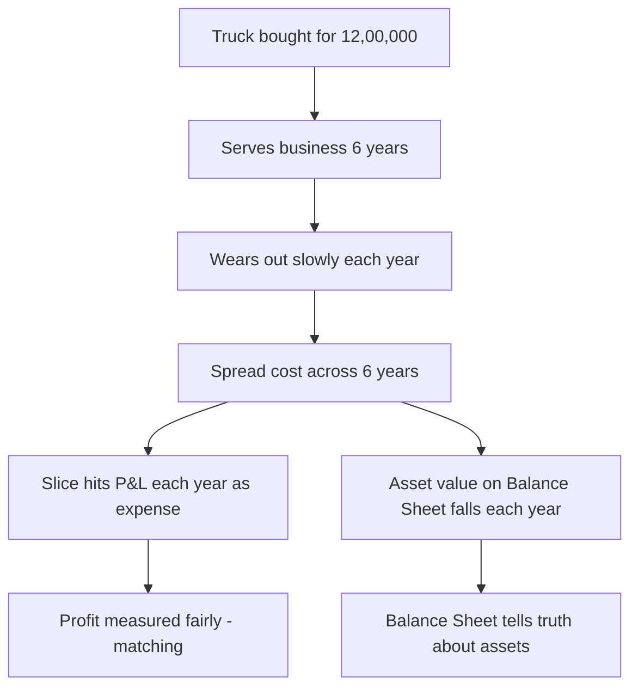
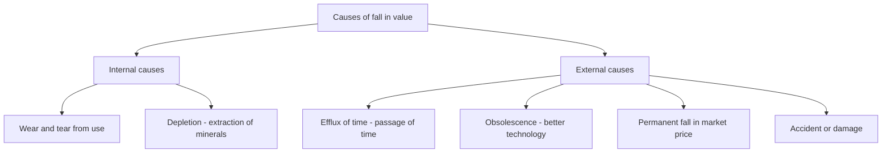
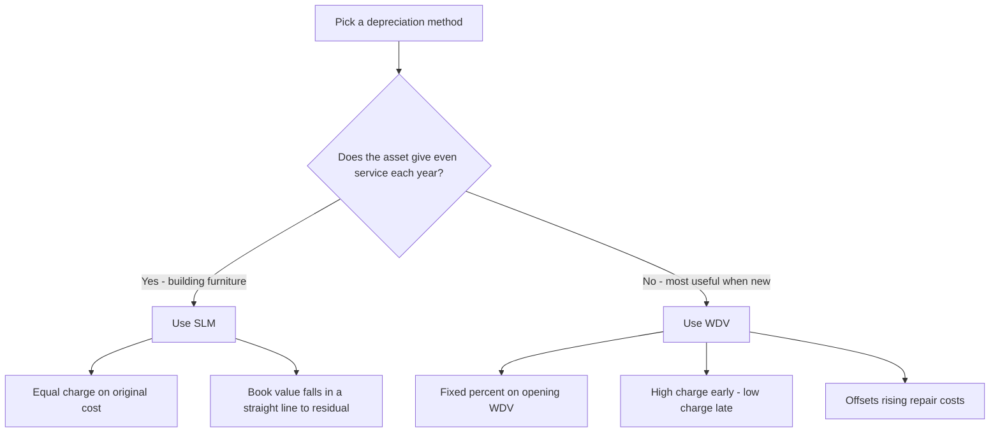
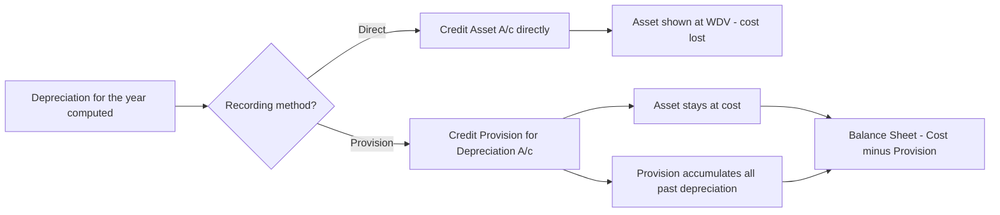
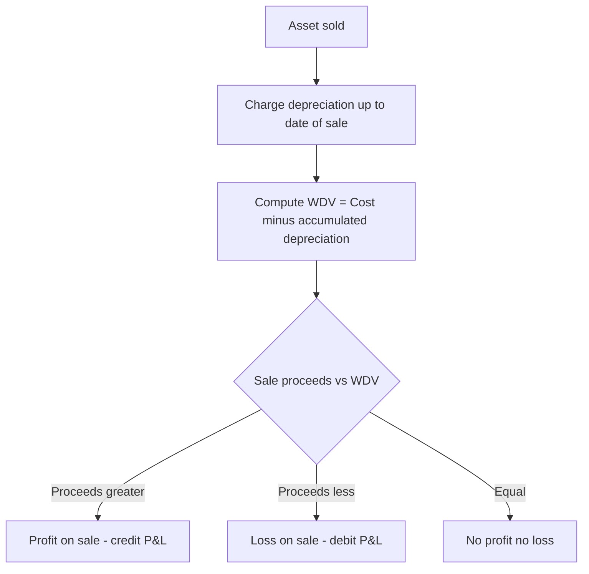

# Foundation: Depreciation & Amortisation

*A machine you buy for Rs 10 lakh does not vanish from your books the day you pay for it, nor does it stay worth Rs 10 lakh forever. It quietly wears out, year after year, silently financing the very profits it helps you earn. Depreciation is accounting's way of telling that slow truth honestly — of spreading the cost of a long-lived asset across the years that actually use it up. This chapter builds the whole machinery from first principles: why depreciation exists, how the two great methods (SLM and WDV) work and differ, how we park the wear-and-tear in a "provision" instead of shrinking the asset, and what happens to the profit or loss when the asset is finally sold.*

---

## 1. The Problem it solves

Imagine you run a small transport business. On 1 April 2021 you buy a delivery truck for Rs 12,00,000. That truck will haul goods for you for, say, six years and then be sold for scrap. Now ask the deceptively simple question that this entire chapter answers:

> **In which year's Profit & Loss Account should the Rs 12,00,000 appear as an expense?**

Three tempting answers are all *wrong*, and seeing *why* they are wrong is the whole insight.

**Wrong answer 1 — "Charge the full Rs 12,00,000 as an expense in 2021-22, the year I paid for it."** This would crush the first year's profit to almost nothing and make the next five years look artificially brilliant — years in which the truck is doing real work but costing you *nothing* on paper. That violates the **matching principle**: the cost of a resource must be reported in the same periods in which the resource earns revenue. The truck earns revenue across six years, so its cost belongs across six years.

**Wrong answer 2 — "It's not an expense at all; it's an asset, so leave the Rs 12,00,000 sitting on the Balance Sheet at full value until I sell it."** But this pretends the truck is as good in year six as it was on day one. It isn't — the engine is worn, the tyres bald, the resale value a fraction of the purchase price. Carrying it at Rs 12,00,000 overstates the firm's assets and, worse, means the *entire* fall in value crashes into the P&L in one lump in the year of sale — a year that had nothing to do with the wearing-out.

**Wrong answer 3 — "Charge an expense only when I actually spend cash on it (repairs, fuel)."** Those are separate running costs. They do not capture the fundamental fact that the *asset itself* is being consumed — a truck driven hard for a year is worth less at year-end even if you never lifted the bonnet.

The honest answer is the one accounting adopts: **the cost of a long-lived (fixed) asset, less whatever you expect to recover at the end, is systematically spread as an expense over the years the asset serves the business.** That systematic spreading is **depreciation.**

So depreciation solves four problems at once:

1. **Matching** — it puts a slice of the asset's cost against each year's revenue, so profit is measured fairly year by year.
2. **True asset value** — it reduces the asset's carrying amount on the Balance Sheet gradually, so the Balance Sheet does not lie about what the firm owns.
3. **Comparability** — because a systematic method is applied consistently, this year's profit can be compared with last year's and with other firms'.
4. **Capital maintenance** — by charging depreciation, the business refrains from treating the whole of its receipts as distributable profit; it implicitly retains funds so that, in principle, the asset can one day be replaced. (Note: depreciation does **not** create a cash fund — see the Traps section — it merely stops profits being overstated.)

*Figure 1 — Depreciation converts a one-time capital outlay into a fair yearly expense, keeping both the P&L and the Balance Sheet honest.*

---

## 2. Core Idea

Strip away every rule and formula and this is what remains:

> **Depreciation is the systematic allocation of the depreciable cost of a fixed asset over its useful life. It is a process of *allocation of cost*, not a process of *valuation*.**

Read that last clause twice, because it is the single most misunderstood point in the topic. Depreciation does **not** try to tell you what the asset is worth in the market today. It does not ask "what would this truck fetch if I sold it now?" Instead it takes a known number — the cost — and parcels it out over the years, subtracting a slice each year. The resulting book value (Written Down Value) is simply *cost minus the slices charged so far*; it is a leftover of an allocation exercise, not a market appraisal.

Three quantities define every depreciation calculation:

| Term | Meaning | Symbol |
|------|---------|--------|
| **Cost** | Purchase price + all costs to bring the asset to working condition (freight, installation, non-refundable duties, professional fees) | C |
| **Residual / Scrap value** | Estimated amount recoverable when the asset is retired at the end of its useful life | S |
| **Useful life** | The period over which the asset is expected to be used by *this* enterprise (may be shorter than physical life) | n |

The quantity actually spread is the **Depreciable Amount = Cost − Residual Value = C − S**. That is the pool of value the business genuinely consumes; the residual value is expected to come back, so it is never charged as depreciation.

Everything else — SLM, WDV, the provision account, disposal profit or loss — is just *machinery* for allocating that pool and keeping track of the total allocated so far.

---

## 3. Why it works this way

**Why "allocation," not "valuation"?** Because valuation every year would be subjective, expensive, and volatile. If accountants had to reappraise every machine to market value each 31 March, profits would swing with the second-hand-machinery market, two honest accountants would disagree, and manipulation would be trivial. By fixing on a known, verifiable number (historical cost) and spreading it by a stated, consistent rule, we get objectivity and comparability. This flows straight from the **cost concept** and the **consistency assumption** you met in the Theoretical Framework chapter.

**Why subtract residual value?** Because the business does not truly *consume* the whole cost. If you will get Rs 50,000 of scrap back, then you have only really used up Cost − 50,000 of the asset. Charging the full cost would over-depreciate and understate profit.

**Why is depreciation charged even in a loss-making year?** Because the asset is consumed whether or not the business made money. Matching is about the *asset's* service, not the firm's fortunes. Skipping depreciation in a bad year to flatter profit is exactly the manipulation the systematic-charge rule exists to prevent.

**Why two rival methods (SLM and WDV) instead of one "correct" one?** Because different assets lose usefulness in different *patterns*, and honesty means matching the charge to the pattern of consumption:

- A **building or furniture** delivers roughly the *same* service every year and needs little extra maintenance early on. An **equal** charge each year — the **Straight-Line Method** — matches that flat pattern.
- A **machine or vehicle** is most productive when new and progressively needs more repairs as it ages. Its economic contribution *declines* over time. To keep the *total* yearly burden on the P&L (depreciation + repairs) roughly level, we front-load depreciation — high early, low later — which is exactly what the **Written Down Value Method** does. Early years: big depreciation, small repairs. Later years: small depreciation, big repairs. The two roughly offset, giving a stable total cost per year.

That single insight — *WDV front-loads depreciation to offset rising repair costs* — is the "why" behind the whole SLM-versus-WDV debate, and examiners love it.

**Why keep a separate "Provision for Depreciation" account instead of just shrinking the asset?** Because managers, auditors, banks and tax officers all want to see, at a glance, *both* the original cost the firm committed *and* the total wear-and-tear accumulated to date. If you keep reducing the asset account directly, the original cost is lost after year one. The provision (accumulated depreciation) method preserves the asset at cost on one line and piles up the depreciation on another, so the Balance Sheet can show "Machine at cost 12,00,000 *less* accumulated depreciation 6,00,000 = 6,00,000." Both numbers survive.

---

## 4. Full technical content

### 4.1 What is a "depreciable asset"?

Depreciation applies to **depreciable fixed (non-current) assets** — assets that (a) are expected to be used for **more than one accounting period**, (b) have a **limited useful life**, and (c) are held for **use in production or supply of goods/services, for rental, or for administration**, and *not* for sale in the ordinary course of business.

- **Land** (freehold) is **not depreciated** — it has an unlimited useful life. Leasehold land *is* amortised over the lease period.
- **Inventory** is not depreciated — it is valued at lower of cost and NRV (that is the Inventories chapter).
- **Wasting assets** (mines, quarries, oil wells) are *depleted* rather than depreciated, but the idea is the same.

### 4.2 Causes of depreciation

*Figure 2 — The recognised causes of depreciation, split into internal (arising from the asset's own use) and external (arising from the environment around it).*

| Cause | Explanation |
|-------|-------------|
| **Wear and tear** | Physical deterioration from actual use and operation |
| **Efflux (passage) of time** | Some assets lose value simply with time, whether used or not (e.g., a lease running down) |
| **Obsolescence** | A newer, cheaper or better technology makes the existing asset economically outdated even if physically fine |
| **Depletion** | Exhaustion of a wasting asset as its contents (coal, oil, ore) are extracted |
| **Accident / permanent fall in value** | Sudden damage or a permanent (not temporary) decline in usefulness |

### 4.3 The two Foundation methods

#### (a) Straight-Line Method (SLM) — also "Fixed Instalment" / "Original Cost" method

An **equal** amount is charged every year, computed on the **original cost**.

$$\text{Annual Depreciation} = \frac{\text{Cost} - \text{Residual Value}}{\text{Useful Life}} = \frac{C - S}{n}$$

$$\text{Rate of Depreciation (\% on cost)} = \frac{\text{Annual Depreciation}}{\text{Cost}} \times 100$$

- The charge is a flat, constant figure year after year.
- The book value reduces in a straight line and reaches exactly the residual value at the end of the useful life.
- Suited to assets with even usage: buildings, furniture, patents, leases.

#### (b) Written Down Value Method (WDV) — also "Diminishing / Reducing Balance" method

A **fixed percentage** is charged every year, but on the **opening book value (WDV)** of that year, *not* on cost. Because the base shrinks each year, the rupee charge falls each year.

$$\text{Depreciation for the year} = \text{Opening WDV} \times \text{Rate}\%$$

$$\text{Closing WDV} = \text{Opening WDV} - \text{Depreciation for the year}$$

The rate that reduces cost exactly to residual value over *n* years (rarely required to derive at Foundation, but good to know) is:

$$r = \left(1 - \sqrt[n]{\frac{S}{C}}\right) \times 100$$

- The charge is high in early years and tapers off — front-loaded.
- The book value never mathematically reaches zero (which is why a residual value is assumed).
- Suited to assets that are most productive when new and need rising maintenance: plant, machinery, vehicles.

*Figure 3 — Choosing between SLM and WDV based on the pattern in which the asset delivers its service.*

#### SLM vs WDV — the comparison table examiners want

| Basis | Straight-Line Method (SLM) | Written Down Value (WDV) |
|-------|----------------------------|--------------------------|
| Base for charge | Original cost (fixed) | Opening book value (declining) |
| Annual charge | Equal every year | Decreases every year |
| Book value at end of life | Exactly residual value | Approaches but never reaches zero |
| Depreciation + repairs pattern | Rises over time (repairs grow, dep flat) | Roughly even (dep falls as repairs rise) |
| Ease of computation | Simpler | Slightly harder |
| Suitability | Assets with even use, small repairs | Machinery, vehicles with rising repairs |
| Recognised by Income-tax Act | Not for most assets | Yes — Income-tax uses WDV on blocks of assets |

### 4.4 Two ways to *record* depreciation

Whatever method computes the *amount*, there are two accepted ways to *post* it:

**Method A — Charging depreciation to the Asset Account directly ("no provision" method).**
The asset account is credited each year, so it shows the *written-down value* on the Balance Sheet. Original cost is lost after year one.

| Entry | Debit | Credit |
|-------|-------|--------|
| For depreciation | Depreciation A/c | Asset A/c |
| Transfer to P&L | Profit & Loss A/c | Depreciation A/c |

**Method B — Provision for Depreciation Account ("accumulated depreciation") method.**
The asset account stays at **cost** untouched; depreciation piles up in a separate **Provision for Depreciation A/c** (also called Accumulated Depreciation A/c). On the Balance Sheet the asset is shown at cost *less* the provision balance.

| Entry | Debit | Credit |
|-------|-------|--------|
| For depreciation | Depreciation A/c | Provision for Depreciation A/c |
| Transfer to P&L | Profit & Loss A/c | Depreciation A/c |

On disposal, the accumulated depreciation relating to the asset sold is transferred *out* of the provision account into the Asset Disposal Account.

*Figure 4 — The two recording routes. The provision route preserves original cost and accumulated depreciation as two separate, visible figures.*

### 4.5 Sale / disposal of an asset — profit or loss on sale

When an asset is sold (or scrapped), we compare what we **get** with what the asset is **worth on the books** at that moment:

$$\text{Written Down Value at date of sale} = \text{Cost} - \text{Accumulated depreciation up to the date of sale}$$

$$\text{Profit / (Loss) on sale} = \text{Sale proceeds} - \text{WDV at date of sale}$$

- **Sale proceeds > WDV → Profit on sale** (credited to P&L). It means we depreciated *too fast* in hindsight.
- **Sale proceeds < WDV → Loss on sale** (debited to P&L). We depreciated *too slowly*.
- Depreciation must first be charged **up to the date of sale** (for the part-year the asset was used before disposal) before computing WDV.

The cleanest exam technique is the **Asset Disposal Account**:

| Asset Disposal A/c — Dr side | Amount | Asset Disposal A/c — Cr side | Amount |
|------------------------------|--------|------------------------------|--------|
| To Asset A/c (cost of asset sold) | Cost | By Provision for Dep. A/c (accum. dep. on that asset) | Accum. dep |
| To Profit & Loss A/c (profit on sale)* | Bal. | By Bank/Cash A/c (sale proceeds) | Proceeds |
| | | By Profit & Loss A/c (loss on sale)* | Bal. |

*Only one of the two starred lines appears — profit balances on the debit side, loss on the credit side.

*Figure 5 — Disposal decision logic: always depreciate up to the sale date first, then compare proceeds with the resulting WDV.*

### 4.6 Change in method of depreciation

**The current position (CA Foundation 2024 scheme, aligned with AS 10 revised):** the *method* of depreciation, the *useful life* and the *residual value* are all **estimates**. A change in the depreciation *method* is therefore treated as a **change in accounting estimate**, applied **prospectively** — you do *not* rewrite past years. From the date of change, you simply depreciate the remaining book value over the remaining useful life using the new method.

**The classic textbook treatment (still examined for its mechanics):** older practice allowed a change with **retrospective effect** — recompute depreciation for all past years under the new method, find the difference between what *was* charged and what *should have been* charged, and adjust that "arrears of depreciation" through the P&L in the year of change:

- If the new method would have charged **more** in the past → charge the **shortfall as additional depreciation** (debit P&L).
- If the new method would have charged **less** → **write back the excess** (credit P&L).

Whichever the question asks for, always state your assumption. In an exam, read the words: "**with retrospective effect**" signals the arrears computation; "**with effect from … / prospectively**" signals the modern remaining-value approach.

### 4.7 Amortisation of intangible assets (Foundation level)

**Amortisation is depreciation's twin for intangible assets** — assets with no physical substance but a limited useful life: patents, copyrights, trademarks with finite life, licences, and (historically) goodwill.

- The mechanics are identical to SLM in the vast majority of cases: **cost spread evenly over the useful life**, usually with **zero residual value**.
- **Useful life is the *shorter* of the legal/contractual life and the economic (useful) life.** A patent with a 20-year legal life but only 8 years of commercial usefulness is amortised over **8** years.
- The entry mirrors depreciation:

| Entry | Debit | Credit |
|-------|-------|--------|
| Amortisation | Amortisation A/c (or P&L) | Intangible Asset A/c |

- **Goodwill** is *not* systematically amortised under AS; it is carried at cost and written down only on impairment (this nuance is developed fully in AS 26 at Inter). At Foundation, if a problem gives goodwill a life, amortise straight-line over that life as instructed.

---

## 5. Worked examples

> Every figure below has been recomputed and cross-checked: journal entries balance (Dr = Cr), ledger accounts tally, and disposal accounts close to nil.

### Example 1 — SLM vs WDV on the same machine (side-by-side)

**Facts.** A machine is bought on 1 April 2021 for **Rs 1,00,000**. Estimated residual value **Rs 10,000**, estimated useful life **5 years**. Under WDV the firm applies a rate of **20% p.a.** Show the depreciation and closing book value for each year under (a) SLM and (b) WDV, and compare.

**(a) Straight-Line Method**

Annual depreciation = (1,00,000 − 10,000) ÷ 5 = **Rs 18,000 per year.**

| Year | Opening BV | Depreciation | Closing BV |
|------|-----------:|-------------:|-----------:|
| 2021-22 | 1,00,000 | 18,000 | 82,000 |
| 2022-23 | 82,000 | 18,000 | 64,000 |
| 2023-24 | 64,000 | 18,000 | 46,000 |
| 2024-25 | 46,000 | 18,000 | 28,000 |
| 2025-26 | 28,000 | 18,000 | 10,000 |
| **Total** | | **90,000** | |

Check: total depreciation 90,000 = depreciable amount (1,00,000 − 10,000); closing BV lands exactly on residual value 10,000. ✔

**(b) Written Down Value Method @ 20%**

| Year | Opening WDV | Depreciation @ 20% | Closing WDV |
|------|------------:|-------------------:|------------:|
| 2021-22 | 1,00,000 | 20,000 | 80,000 |
| 2022-23 | 80,000 | 16,000 | 64,000 |
| 2023-24 | 64,000 | 12,800 | 51,200 |
| 2024-25 | 51,200 | 10,240 | 40,960 |
| 2025-26 | 40,960 | 8,192 | 32,768 |
| **Total** | | **67,232** | |

Check: 20,000 + 16,000 + 12,800 + 10,240 + 8,192 = 67,232; 1,00,000 − 67,232 = 32,768 = closing WDV. ✔

**Comparison / interpretation.**

| | SLM | WDV |
|---|----:|----:|
| Year-1 charge | 18,000 | 20,000 (higher) |
| Year-5 charge | 18,000 | 8,192 (lower) |
| Total over 5 yrs | 90,000 | 67,232 |
| Book value end of yr 5 | 10,000 (= residual) | 32,768 |

The WDV charge is **heavier early, lighter late** — front-loaded, as theory predicts. Note that at the chosen 20% rate, WDV does *not* reach the residual value in 5 years (it leaves 32,768); to land exactly on 10,000 the required WDV rate would be about 36.9%. This is precisely why WDV assets are said to "never quite reach zero" and why the rate must be chosen with care.

---

### Example 2 — Provision for Depreciation method with an asset sold (comprehensive ledgers)

**Facts.** Year-end is 31 March. Depreciation is **10% p.a. on cost (SLM)**, recorded through a **Provision for Depreciation A/c**. Transactions:

- 1 Apr 2021 — bought **Machine A** for **Rs 2,00,000**.
- 1 Oct 2022 — bought **Machine B** for **Rs 1,00,000**.
- 30 Jun 2024 — sold **Machine A** for **Rs 1,30,000**.

Prepare the Machinery A/c, Provision for Depreciation A/c, and Machinery Disposal A/c for the years 2021-22 to 2024-25.

**Step 1 — Depreciation for each year (10% on cost, time-apportioned).**

| Year | Machine A | Machine B | Total dep. |
|------|----------:|----------:|-----------:|
| 2021-22 | 20,000 (full yr) | — | 20,000 |
| 2022-23 | 20,000 | 5,000 (6 mths: 1,00,000×10%×6/12) | 25,000 |
| 2023-24 | 20,000 | 10,000 | 30,000 |
| 2024-25 | 5,000 (3 mths to 30 Jun) | 10,000 | 15,000 |

**Step 2 — Accumulated depreciation on Machine A at date of sale (30 Jun 2024).**
20,000 + 20,000 + 20,000 + 5,000 = **Rs 65,000.**
WDV of Machine A at sale = 2,00,000 − 65,000 = **Rs 1,35,000.**
Sale proceeds Rs 1,30,000 < WDV 1,35,000 → **Loss on sale Rs 5,000.**

**Machinery Account (at cost)**

| Date | Particulars | Rs | Date | Particulars | Rs |
|------|-------------|---:|------|-------------|---:|
| 01-04-21 | To Bank (A) | 2,00,000 | 31-03-22 | By Balance c/d | 2,00,000 |
| 01-04-22 | To Balance b/d | 2,00,000 | 31-03-23 | By Balance c/d | 3,00,000 |
| 01-10-22 | To Bank (B) | 1,00,000 | | | |
| | | **3,00,000** | | | **3,00,000** |
| 01-04-23 | To Balance b/d | 3,00,000 | 31-03-24 | By Balance c/d | 3,00,000 |
| 01-04-24 | To Balance b/d | 3,00,000 | 30-06-24 | By Machinery Disposal A/c (cost of A) | 2,00,000 |
| | | | 31-03-25 | By Balance c/d (B) | 1,00,000 |
| | | **3,00,000** | | | **3,00,000** |

**Provision for Depreciation Account**

| Date | Particulars | Rs | Date | Particulars | Rs |
|------|-------------|---:|------|-------------|---:|
| 31-03-22 | To Balance c/d | 20,000 | 31-03-22 | By Depreciation A/c | 20,000 |
| 31-03-23 | To Balance c/d | 45,000 | 01-04-22 | By Balance b/d | 20,000 |
| | | | 31-03-23 | By Depreciation A/c | 25,000 |
| | | **45,000** | | | **45,000** |
| 31-03-24 | To Balance c/d | 75,000 | 01-04-23 | By Balance b/d | 45,000 |
| | | | 31-03-24 | By Depreciation A/c | 30,000 |
| | | **75,000** | | | **75,000** |
| 30-06-24 | To Machinery Disposal A/c (accum. dep. on A) | 65,000 | 01-04-24 | By Balance b/d | 75,000 |
| 31-03-25 | To Balance c/d (B) | 25,000 | 31-03-25 | By Depreciation A/c | 15,000 |
| | | **90,000** | | | **90,000** |

Check on closing provision: it should equal accumulated depreciation on the *surviving* Machine B = 5,000 + 10,000 + 10,000 = **25,000.** ✔

**Machinery Disposal Account**

| Particulars | Rs | Particulars | Rs |
|-------------|---:|-------------|---:|
| To Machinery A/c (cost of A) | 2,00,000 | By Provision for Dep. A/c (accum. dep. on A) | 65,000 |
| | | By Bank A/c (sale proceeds) | 1,30,000 |
| | | By Profit & Loss A/c (loss on sale) | 5,000 |
| | **2,00,000** | | **2,00,000** |

The disposal account closes to nil, confirming every figure ties. ✔

**Journal entries on disposal (30 Jun 2024):**

| Particulars | Dr (Rs) | Cr (Rs) |
|-------------|--------:|--------:|
| Depreciation A/c ... Dr (3 mths on A + B, this is the year's charge) | 15,000 | |
| &nbsp;&nbsp;&nbsp;To Provision for Depreciation A/c | | 15,000 |
| Machinery Disposal A/c ... Dr | 2,00,000 | |
| &nbsp;&nbsp;&nbsp;To Machinery A/c | | 2,00,000 |
| Provision for Depreciation A/c ... Dr | 65,000 | |
| &nbsp;&nbsp;&nbsp;To Machinery Disposal A/c | | 65,000 |
| Bank A/c ... Dr | 1,30,000 | |
| &nbsp;&nbsp;&nbsp;To Machinery Disposal A/c | | 1,30,000 |
| Profit & Loss A/c ... Dr | 5,000 | |
| &nbsp;&nbsp;&nbsp;To Machinery Disposal A/c | | 5,000 |

Each entry balances Dr = Cr. ✔

**Balance Sheet extract as at 31 March 2025:**

| Assets | Rs | Rs |
|--------|---:|---:|
| Machinery (at cost — Machine B) | 1,00,000 | |
| Less: Provision for Depreciation | 25,000 | 75,000 |

---

### Example 3 — Change in method of depreciation (retrospective computation)

**Facts.** A machine was bought on 1 April 2021 for **Rs 4,00,000** and depreciated at **10% p.a. on the WDV** method. Books are closed on 31 March. On 31 March 2024 (after three full years) the firm decides to switch to the **Straight-Line Method @ 10% p.a. on cost, with retrospective effect** from the date of purchase. Compute the adjustment required and show the machine's book value after the change.

**Step 1 — Depreciation actually charged under WDV.**

| Year | Opening WDV | Dep @ 10% WDV | Closing WDV |
|------|------------:|--------------:|------------:|
| 2021-22 | 4,00,000 | 40,000 | 3,60,000 |
| 2022-23 | 3,60,000 | 36,000 | 3,24,000 |
| 2023-24 | 3,24,000 | 32,400 | 2,91,600 |
| **Total charged (WDV)** | | **1,08,400** | |

**Step 2 — Depreciation that *should* have been charged under SLM (10% on cost = 40,000 p.a.).**

3 years × 40,000 = **1,20,000.** Book value under SLM would be 4,00,000 − 1,20,000 = **2,80,000.**

**Step 3 — The arrears adjustment.**

| | Rs |
|---|---:|
| Depreciation required under new method (SLM, 3 yrs) | 1,20,000 |
| Depreciation already charged under old method (WDV) | 1,08,400 |
| **Additional depreciation (shortfall) to charge on change** | **11,600** |

Because SLM would have charged **more**, there is a **shortfall of Rs 11,600** to be charged as additional depreciation in 2023-24. The machine's book value is written down from 2,91,600 to **2,80,000**, bringing it in line with SLM.

**Journal entry on 31 March 2024:**

| Particulars | Dr (Rs) | Cr (Rs) |
|-------------|--------:|--------:|
| Depreciation / Profit & Loss A/c ... Dr (arrears) | 11,600 | |
| &nbsp;&nbsp;&nbsp;To Machinery A/c | | 11,600 |

*(If a Provision for Depreciation A/c were maintained, the credit would go to that account instead of Machinery A/c.)*

**From 2024-25 onwards** the firm charges SLM at 40,000 per year on the Rs 2,80,000-and-cost basis.

> **Modern note:** under the current AS 10 (revised) position, a change of *method* is a **change in accounting estimate** applied **prospectively** — the Rs 11,600 catch-up would *not* be booked; instead the WDV of Rs 2,91,600 would simply be depreciated on SLM over the *remaining* life. The retrospective version above is shown because ICAI Foundation problems still test its mechanics and explicitly say "with retrospective effect." Always follow the words of the question.

---

### Example 4 — Amortisation of an intangible (patent)

**Facts.** On 1 April 2023 a company buys a **patent for Rs 90,000**. Its remaining legal life is **10 years**, but the technology it protects is expected to be commercially useful for only **6 years**. Residual value is nil. Show the amortisation charge, the journal entry for year 1, and the Balance Sheet figure at 31 March 2024.

**Step 1 — Useful life = shorter of legal (10) and economic (6) = 6 years.**

Annual amortisation = 90,000 ÷ 6 = **Rs 15,000 per year.**

**Step 2 — Amortisation schedule (first three years shown).**

| Year | Opening carrying amount | Amortisation | Closing carrying amount |
|------|------------------------:|-------------:|------------------------:|
| 2023-24 | 90,000 | 15,000 | 75,000 |
| 2024-25 | 75,000 | 15,000 | 60,000 |
| 2025-26 | 60,000 | 15,000 | 45,000 |

Over 6 years the full 90,000 is written off (6 × 15,000 = 90,000), leaving nil — correct for a zero-residual intangible. ✔

**Step 3 — Journal entry, 31 March 2024:**

| Particulars | Dr (Rs) | Cr (Rs) |
|-------------|--------:|--------:|
| Amortisation A/c ... Dr | 15,000 | |
| &nbsp;&nbsp;&nbsp;To Patent A/c | | 15,000 |
| Profit & Loss A/c ... Dr | 15,000 | |
| &nbsp;&nbsp;&nbsp;To Amortisation A/c | | 15,000 |

**Balance Sheet extract, 31 March 2024:** Patent (at cost 90,000 less amortisation 15,000) = **Rs 75,000.**

---

## 6. Connections — how this feeds into CA Intermediate

Depreciation is one of the highest-leverage Foundation topics because almost every asset-related Inter topic assumes you already own these mechanics cold:

- **AS 10 — Property, Plant & Equipment** (Inter Accounting) is the grown-up version of this chapter. It formalises *componentisation* (depreciating parts of an asset separately), *revaluation* and its effect on future depreciation, and confirms that a change in method/life/residual is a **change in estimate applied prospectively** — exactly the "modern note" flagged in Example 3.
- **AS 26 — Intangible Assets** (Inter) develops the amortisation ideas here: which intangibles have finite vs indefinite lives, why **goodwill is not amortised but tested for impairment**, and the recognition criteria for internally generated intangibles.
- **AS 28 — Impairment of Assets** (Inter) picks up where depreciation stops: when an asset's recoverable amount falls *below* its depreciated book value, impairment writes it down further — depreciation handles the *expected* decline, impairment the *unexpected* one.
- **Company Final Accounts / Schedule III & the Companies Act, 2013** (Inter) require depreciation based on **useful lives specified in Schedule II** — the practical rulebook that decides the rates you will actually apply.
- **Depreciation Accounting under the Income-tax Act** (Inter Taxation) uses **WDV on "blocks of assets,"** and the profit/loss-on-sale logic you learned here becomes the basis of *short-term capital gains / balancing charge* computations.

Master the disposal account and the provision method now, and half of Inter's PPE questions become mechanical.

---

## 7. Traps & common mistakes

1. **Forgetting to depreciate up to the date of sale.** The single most common error. If an asset is sold on 30 June, you must charge 3 months' depreciation for the current year *before* computing WDV and profit/loss. Skipping it inflates the loss (or understates the profit).
2. **Treating WDV depreciation as if it were on cost.** In WDV, every year's charge is on the *opening book value*, not the original cost. Applying the rate to cost every year is a WDV/SLM hybrid that exists nowhere.
3. **Believing depreciation creates a cash fund.** Depreciation is a *non-cash* charge. It does **not** set aside money. It merely prevents profit (and hence dividends/drawings) from being overstated, so cash *tends* to be retained — but no fund physically exists unless the firm separately invests it (a "sinking fund").
4. **Depreciating land.** Freehold land has unlimited life and is **not** depreciated. Only *leasehold* land is amortised, over the lease term.
5. **Confusing "profit on sale" with "asset is now profitable."** Profit on sale simply means the asset was depreciated faster than its actual value fell — it is an accounting correction, not operating income.
6. **Using scrap value in the WDV *charge*.** In WDV the yearly charge is rate × opening WDV; residual value is *not* subtracted from the base each year (unlike SLM, where depreciable amount = cost − residual).
7. **Amortising over legal life when economic life is shorter.** Always take the *shorter* of the two. A 20-year patent useful for only 5 years is written off in 5.
8. **Retrospective vs prospective on change of method.** Read the question's wording. "With retrospective effect" → compute arrears through P&L (Example 3). "With effect from the date of change" → depreciate remaining WDV over remaining life. Stating your assumption protects your marks either way.
9. **Charging depreciation on assets held for sale / stock-in-trade.** A car dealer's cars are *inventory*, not fixed assets — no depreciation. Depreciation is only for assets *used* in the business.
10. **Reducing the asset account in the provision method.** If a Provision for Depreciation A/c is used, the asset account stays at **cost** and is *never* touched for annual depreciation — only on disposal is the cost of the sold item transferred out.

---

## 8. First-principles recap

- Depreciation exists to obey the **matching principle**: spread a long-lived asset's cost across the years that consume it, so each year's profit and the Balance Sheet both tell the truth.
- It is a process of **cost allocation, not valuation** — book value (WDV) is a leftover of allocation, not a market price.
- Only the **depreciable amount (Cost − Residual Value)** is spread; residual value is expected back, so it is never charged.
- **SLM** charges an equal amount on cost (flat service pattern); **WDV** charges a fixed % on the shrinking book value (front-loaded, to offset rising repairs).
- The **Provision for Depreciation** method keeps the asset at cost and accumulates all past depreciation separately, so both figures stay visible; on sale, the accumulated depreciation is transferred to a **Disposal Account** where **profit/loss = proceeds − WDV** falls out.
- **Amortisation** is the same idea for intangibles (patents, copyrights), spread over the *shorter* of legal and useful life, usually to nil.

---

## 9. Quick-reference

| Item | Formula / Format / Rule |
|------|-------------------------|
| Depreciable amount | Cost − Residual (Scrap) Value |
| SLM annual depreciation | (Cost − Residual) ÷ Useful life |
| SLM rate (% on cost) | (Annual dep ÷ Cost) × 100 |
| WDV depreciation | Opening WDV × Rate% |
| WDV rate (to reach residual) | r = [1 − (S/C)^(1/n)] × 100 |
| WDV at date of sale | Cost − Accumulated depreciation to that date |
| Profit / (Loss) on sale | Sale proceeds − WDV at date of sale |
| Depreciation entry (direct) | Depreciation A/c Dr → Asset A/c |
| Depreciation entry (provision) | Depreciation A/c Dr → Provision for Depreciation A/c |
| Transfer to P&L | Profit & Loss A/c Dr → Depreciation A/c |
| Amortisation entry | Amortisation A/c Dr → Intangible Asset A/c |
| Land (freehold) | Not depreciated (unlimited life) |
| Change of method (modern / AS 10) | Change in estimate → prospective |
| Change of method (classic exam) | Retrospective → charge/write-back arrears via P&L |
| Intangible useful life | Shorter of legal life and economic life |
| Governing standards (Inter) | AS 10 (PPE), AS 26 (Intangibles), AS 28 (Impairment); Schedule II, Companies Act 2013 |

*End of chapter — Foundation: Depreciation & Amortisation.*
