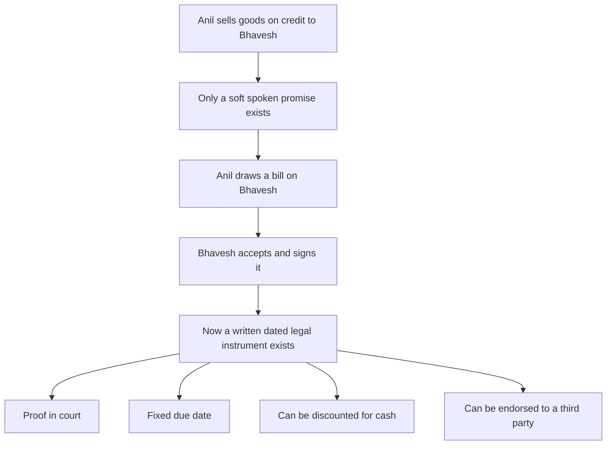
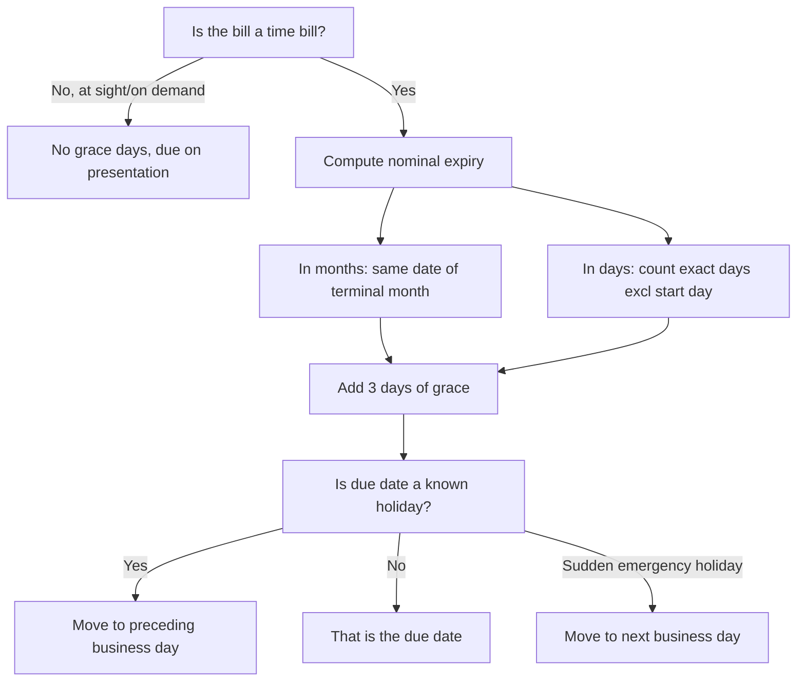
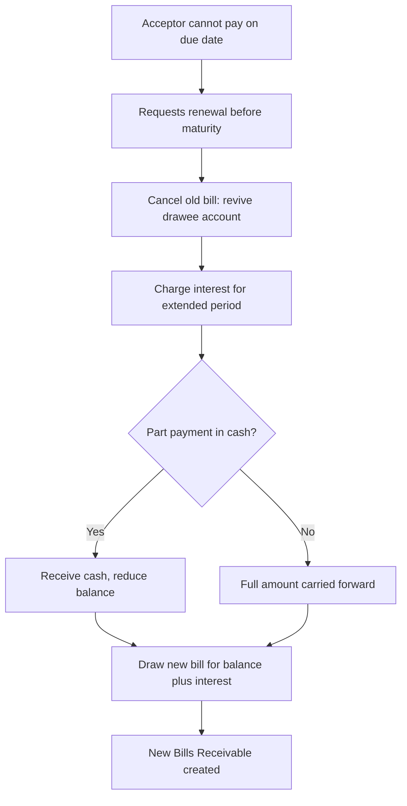
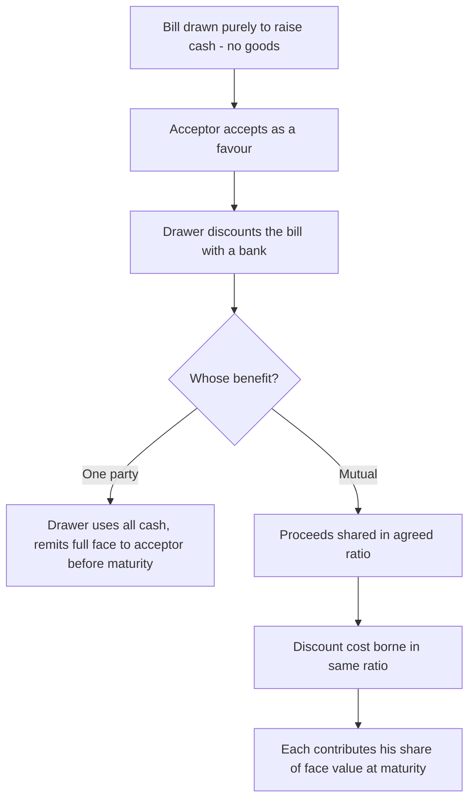

<!-- v2-deep -->

# Foundation: Bills of Exchange & Promissory Notes

*A credit sale creates a promise — "I will pay you later." But a promise you cannot see, cannot prove, and cannot sell is a weak asset. A bill of exchange turns that vague promise into a dated, signed, legally binding, transferable document you can bank on — literally. This chapter builds the whole machinery from first principles: what a bill is, why it exists, how it moves through the economy, and every journal entry it triggers in the books of both parties.*

---

## 1. The Problem it solves

Picture a wholesaler — call him **Anil** — who sells cloth worth Rs 50,000 to a retailer, **Bhavesh**, on 1 January. Bhavesh cannot pay today; he needs three months to sell the cloth first and collect cash from his own customers. Anil agrees to give him three months' credit.

The moment Anil agrees, he has a problem that looks small but is actually enormous:

1. **Proof.** Anil has handed over Rs 50,000 of goods and received nothing but Bhavesh's spoken word. If Bhavesh later denies the debt, or claims it was only Rs 30,000, Anil is stuck. An entry in Anil's own ledger is not proof — anyone can write in their own book.
2. **Certainty of date.** "Three months" is vague. Does Bhavesh pay on 1 April? The 4th? When exactly can Anil demand his money and, if refused, go to court?
3. **Liquidity.** Anil's Rs 50,000 is now frozen for three months. Suppose Anil himself needs cash next week to pay his own supplier. His only "asset" is Bhavesh's informal promise — which no bank will lend against and no third party will accept.
4. **Transferability.** Anil owes his own supplier, **Chetan**, Rs 50,000. Wouldn't it be elegant if Anil could simply hand Bhavesh's promise over to Chetan, so that Bhavesh pays Chetan directly? But you cannot "hand over" a spoken promise.

A **bill of exchange** solves all four at once. Anil writes out a formal document: *"Three months after date, pay to me (or to my order) the sum of Rs 50,000, for value received."* He signs it and sends it to Bhavesh. Bhavesh writes **"Accepted"** across it and signs. That single signed acceptance converts a soft, unprovable, frozen, non-transferable promise into:

- **Proof** — a written instrument signed by the debtor, admissible in court.
- **A fixed legal due date** — computable to the exact day.
- **A liquid asset** — Anil can walk into a bank and get cash *today* against it (discounting).
- **A transferable asset** — Anil can sign it over to Chetan (endorsement), and now Bhavesh's obligation flows to Chetan.

That is the entire reason bills of exchange exist. Before cheques and electronic transfers dominated, bills of exchange were the circulating credit-money of trade — a written, dated, transferable, enforceable IOU. They are governed in India by the **Negotiable Instruments Act, 1881**, and they remain a Foundation-level accounting staple because they teach, in one clean package, how a receivable becomes a *tradable financial instrument*.

*Figure 1 — A bill converts a weak verbal promise into a proof-carrying, dated, liquid, transferable instrument.*

---

## 2. Core Idea

There are really only three ideas in this whole chapter; everything else is mechanics:

> **1. A bill of exchange is an unconditional written order by a creditor (the drawer) directing his debtor (the drawee) to pay a fixed sum of money on a fixed future date — and it becomes binding on the debtor only when the debtor "accepts" it by signing.**
>
> **2. Once accepted, the bill is a financial asset in the creditor's hands (a Bills Receivable) and a financial liability in the debtor's hands (a Bills Payable). The same instrument sits on both balance sheets with opposite signs.**
>
> **3. The holder of a Bills Receivable has four things he can do with it — hold it to maturity, discount it with a bank for early cash, endorse it to his own creditor, or send it to a bank for collection. Every accounting entry in the topic is just one of these four choices playing out, plus what happens if the debtor fails to pay (dishonour), pays early (retirement), or asks for more time (renewal).**

A closely related instrument, the **promissory note**, does the same job but is written the *other way round*: it is a **promise** made by the debtor ("I promise to pay you...") rather than an **order** given by the creditor ("Pay me..."). The accounting is essentially identical — only the party who originates the document changes.

That is the spine. The rest of the chapter fleshes out the vocabulary, the legal rules (grace days, due dates), the four holder-choices, and the three "what-if" events (dishonour, retirement, renewal), finishing with the special case of **accommodation bills**, where the bill is drawn not to settle a trade debt at all but purely to raise finance.

---

## 3. Why it works this way

**Why must the debtor "accept" the bill — why isn't the drawer's signature enough?**
Because a bill is an *order* from the creditor, and you cannot make someone liable simply by ordering them to pay. Anil writing "pay me Rs 50,000" binds nobody by itself — otherwise anyone could manufacture debts against strangers. The obligation attaches only when the drawee **voluntarily signs his acceptance**, converting the drawer's demand into the drawee's own admitted, enforceable promise. This is the hinge of the whole instrument: no acceptance, no Bills Payable, no Bills Receivable. (A promissory note skips this step because the debtor writes and signs it himself from the start — the promise is his from birth.)

**Why "unconditional"?**
A bill must be payable come-what-may. If it said "pay Rs 50,000 *if* the cloth sells well," no bank would ever discount it and no one would accept it in payment — its value would depend on an uncertain event. Money circulates only if its transfer is certain. So the law insists the order/promise be **unconditional** and the sum **certain**; that certainty is precisely what makes the paper as good as cash.

**Why the three "days of grace"?**
Historically, the debtor was given three extra days beyond the stated period as a customary courtesy — a small buffer to arrange funds. The rule survived into the Act. It matters because it shifts the *legal* due date: a three-month bill dated 1 January does not fall due on 1 April but on **4 April**. Miss this and every downstream calculation — interest on renewal, rebate on retirement, the date of dishonour — is wrong. Grace days apply only to **time bills** (payable a fixed period after date or sight); bills payable "on demand" or "at sight" have **no** grace days.

**Why can the creditor get cash early by "discounting" — and why does the bank keep a slice?**
Because the accepted bill is a promise of a *certain* sum on a *certain* date, a bank is willing to buy it now for slightly less than face value. The gap — the **discount** — is simply *interest for the unexpired period*, the bank's reward for advancing money early and bearing the wait. Anil gets Rs 50,000 minus a few months' interest today, instead of Rs 50,000 in three months. The discount is Anil's **finance cost** (an expense), not a loss of principal.

**Why does an endorsed or discounted bill still haunt the drawer if it is dishonoured?**
Because when Anil signs the bill over to the bank or to Chetan, he does not vanish from the chain — he becomes a *guarantor*. If Bhavesh (the acceptor, the primary debtor) fails to pay at maturity, the holder turns back up the chain of endorsers and the drawer must make good. That is why a discounted bill is a **contingent liability** for the drawer until it safely matures: the debt has left his balance sheet, but it can boomerang back if the acceptor defaults.

**Why "noting charges" on dishonour, and why does the defaulting party ultimately bear them?**
When a bill is dishonoured, the holder wants independent, official proof that he presented it and payment was refused (again, because his own word is not proof). He has it formally "**noted**" — and later, for large or foreign bills, "protested" — by a public official called a **Notary Public**, who records the fact and charges a small fee, the **noting charges**. Since the dishonour is the **acceptor's fault**, the acceptor must reimburse these charges. So noting charges always end up debited to the party who defaulted.

**Why does renewal carry interest but retirement gives a rebate?**
Both are about the *time value of money*, pulling in opposite directions. In a **renewal**, the debtor wants *more* time than agreed, so he compensates the creditor with **interest** for the extension. In a **retirement**, the debtor pays *before* the due date, so the creditor rewards the early payment by knocking off a **rebate** (interest for the unexpired period). One pays extra for extra time; the other gets a discount for saving time. Same principle, mirror image.

---

## 4. Full technical content

### 4.1 The governing law and the two instruments

Both instruments are **negotiable instruments** under the **Negotiable Instruments Act, 1881**. "Negotiable" means the instrument can be transferred freely such that the transferee gets a good title (a right to sue in his own name) even better than the transferor's in some cases.

| | **Bill of Exchange** | **Promissory Note** |
|---|---|---|
| Governing section | **Section 5** of the N.I. Act, 1881 | **Section 4** of the N.I. Act, 1881 |
| Nature | An **order** to pay | A **promise** to pay |
| Who makes it | The **creditor** (drawer) | The **debtor** (maker) |
| Number of parties | Three — drawer, drawee, payee | Two — maker, payee |
| Acceptance needed? | **Yes** — drawee must accept | **No** — maker's own promise |
| Who is primarily liable | The **acceptor** (drawee) | The **maker** |
| Can maker/drawer & payee be same? | Drawer and payee can be the same person | Maker and payee **cannot** be the same |
| Payable to bearer on demand? | Not payable to bearer on demand (RBI restriction) | Cannot be made payable to bearer |

A **cheque** (**Section 6**) is a special bill of exchange always drawn on a **banker** and always payable **on demand**. Foundation Accounting treats cheques mostly under Bank Reconciliation; here they matter only as the family resemblance.

### 4.2 The parties — full vocabulary

| Term | Who they are |
|---|---|
| **Drawer** | The person who **makes/writes** the bill — the creditor who is entitled to receive the money. (In Anil-Bhavesh: **Anil**.) |
| **Drawee** | The person on whom the bill is drawn — the debtor **ordered** to pay. (**Bhavesh**.) |
| **Acceptor** | The drawee **after he signs his acceptance**. He becomes primarily liable. (Usually the same as the drawee.) |
| **Payee** | The person to whom the money is to be paid. Often the drawer himself; but if the drawer endorses the bill, the endorsee becomes the payee. |
| **Endorser** | A holder who signs the back of the bill to transfer it to another person. |
| **Endorsee** | The person to whom the bill is transferred by endorsement; he becomes the new holder. |
| **Holder** | The person legally entitled to possess the bill and receive/recover its amount in his own name. |
| **Holder in due course** | A holder who obtained the bill for value, in good faith, before maturity, without notice of any defect in title — he gets a specially protected title. |
| **Drawee in case of need** | A backup drawee named in the bill, resorted to if the original drawee dishonours. |
| **Acceptor for honour** | A third party who accepts a dishonoured bill to protect the reputation (honour) of a party liable on it. |

### 4.3 The two names of one instrument

The *same* physical bill has two names depending on whose books you are in:

| In the books of… | The bill is called a… | Nature |
|---|---|---|
| **Drawer / creditor / holder** | **Bills Receivable (B/R)** | An **asset** |
| **Drawee / debtor / acceptor** | **Bills Payable (B/P)** | A **liability** |

This mirror is the single most important idea for getting the journal entries right: whatever the drawer debits/credits in his B/R account, the drawee does the *opposite* in his B/P account.

### 4.4 Days of grace and computing the due date (date of maturity)

**Rule:** For a **time bill** (payable a fixed period after date or after sight), add **3 days of grace** to the nominal expiry to get the legal **due date**.

Method:
1. **Bills expressed in months** — the period is counted in *calendar months*, landing on the corresponding date of the terminal month; then add 3 days.
   - If the terminal month has **no corresponding date** (e.g. a one-month bill dated 31 January would need "31 February"), take the **last day of that month**, then add 3 days.
2. **Bills expressed in days** — count the **exact number of days**, **excluding** the date of drawing/acceptance and **including** the day of payment; then add 3 days.
3. **"At sight" / "on demand" / "on presentation" bills** — payable immediately, **no days of grace**.

**Holiday rule (Section 25):**
- If the due date is a **known public holiday** (e.g. Republic Day, a Sunday), the bill falls due on the **immediately preceding business day**.
- If the due date turns out to be an **emergency/unexpected holiday** (declared suddenly), it falls due on the **next following business day**.

**Worked due-date drills:**

| Bill drawn on | Tenure | Nominal date | + 3 grace | **Due date** |
|---|---|---|---|---|
| 1 January | 3 months | 1 April | +3 | **4 April** |
| 23 November | 4 months | 23 March | +3 | **26 March** |
| 31 January | 1 month | 28 Feb* | +3 | **3 March** |
| 15 June | 60 days | 14 August** | +3 | **17 August** |

\* February has no 31st, so the last day (28 Feb in a non-leap year) is taken.
\*\* Counting 60 days from 16 June: June (16→30) = 15 days; July = 31 days (running 46); need 14 more into August → 14 August. Then +3 grace = 17 August.

*Figure 2 — Decision logic for finding the legal due date.*

### 4.5 The core accounting entries — the mirror of the two books

Take Anil (drawer) selling goods worth Rs 50,000 to Bhavesh (drawee), settled by a 3-month bill.

**(a) The underlying trade transaction and drawing/acceptance**

| Stage | Books of **Anil (Drawer)** | Books of **Bhavesh (Drawee)** |
|---|---|---|
| Goods sold on credit | Bhavesh's A/c … Dr 50,000   &emsp; To Sales A/c 50,000 | Purchases A/c … Dr 50,000   &emsp; To Anil's A/c 50,000 |
| Bill drawn & accepted | Bills Receivable A/c … Dr 50,000   &emsp; To Bhavesh's A/c 50,000 | Anil's A/c … Dr 50,000   &emsp; To Bills Payable A/c 50,000 |

After this, the personal account (Bhavesh's A/c in Anil's books; Anil's A/c in Bhavesh's books) is **closed to nil** — the debt has become a formal bill.

**(b) What the drawer (Anil) does with the Bills Receivable — the four choices**

| Choice | Entry in Anil's books at the time |
|---|---|
| **(i) Retain till maturity** | *(no entry now; entry only on maturity)* |
| **(ii) Discount with bank** | Bank A/c … Dr (net)   Discount A/c … Dr (charge)   &emsp; To Bills Receivable A/c (face) |
| **(iii) Endorse to a creditor, say Chetan** | Chetan's A/c … Dr (face)   &emsp; To Bills Receivable A/c (face) |
| **(iv) Send to bank for collection** | Bills Sent for Collection A/c … Dr (face)   &emsp; To Bills Receivable A/c (face) |

Note the drawee (Bhavesh) makes **no entry** for any of these — he does not know or care whether Anil kept, discounted, or endorsed the bill. His B/P stays put until maturity.

**(c) On the due date, if the bill is honoured (paid)**

| Situation | Books of **Anil (Drawer)** | Books of **Bhavesh (Drawee)** |
|---|---|---|
| Bill **retained**, now paid | Cash/Bank A/c … Dr 50,000   &emsp; To Bills Receivable A/c 50,000 | Bills Payable A/c … Dr 50,000   &emsp; To Cash/Bank A/c 50,000 |
| Bill was **discounted** | *(no entry — bank collects from Bhavesh)* | Bills Payable A/c … Dr 50,000   &emsp; To Cash/Bank A/c 50,000 |
| Bill was **endorsed** to Chetan | *(no entry — Chetan collects)* | Bills Payable A/c … Dr 50,000   &emsp; To Cash/Bank A/c 50,000 |
| Bill was **sent for collection** | Bank A/c … Dr 50,000   &emsp; To Bills Sent for Collection A/c 50,000 | Bills Payable A/c … Dr 50,000   &emsp; To Cash/Bank A/c 50,000 |

The drawee's honouring entry is always the same (**B/P Dr, Cash Cr**), regardless of what the drawer did with the paper.

### 4.6 Discounting of bills — the finance-cost mechanics

**Discount = Face value × Rate p.a. × (Unexpired period ÷ 12)**, where the unexpired period runs from the date of discounting to the due date.

- The **drawer** debits a **Discount (Discounting Charges) A/c** — a finance expense in the P&L.
- The drawer's B/R is credited at **full face value** (the discount is a cost, not a reduction of the asset's face).
- A discounted bill becomes a **contingent liability** for the drawer until maturity — disclosed, not journalised, unless it is dishonoured.

### 4.7 Endorsement

Endorsement = signing the bill over to another person. The endorser writes on the back and delivers the bill; the endorsee becomes the new holder. In the drawer's books, endorsing to a creditor Chetan simply **settles Chetan's account** (Chetan's A/c Dr) and **removes the B/R** (B/R Cr). If that bill is later dishonoured, Chetan comes back to the drawer, who must pay Chetan *and* recover from the acceptor.

### 4.8 Dishonour of a bill and noting charges

**Dishonour** = the acceptor fails to pay on the due date. The bill's amount, **plus noting charges**, becomes recoverable from the acceptor. The core principle: **cancel the bill and revive the debtor's personal account** for the full amount the drawer/holder is now out of pocket.

Suppose the Rs 50,000 bill is dishonoured and noting charges are Rs 200.

| Where the bill was at dishonour | Books of **Anil (Drawer)** | Books of **Bhavesh (Drawee)** |
|---|---|---|
| **Retained** by Anil | Bhavesh's A/c … Dr 50,200   &emsp; To Bills Receivable A/c 50,000   &emsp; To Cash A/c (noting charges) 200 | Bills Payable A/c … Dr 50,000   Noting Charges A/c … Dr 200   &emsp; To Anil's A/c 50,200 |
| **Discounted** with bank | Bhavesh's A/c … Dr 50,200   &emsp; To Bank A/c 50,200 | *(same as above)* |
| **Endorsed** to Chetan | Bhavesh's A/c … Dr 50,200   &emsp; To Chetan's A/c 50,200 | *(same as above)* |
| **Sent for collection** | Bhavesh's A/c … Dr 50,200   &emsp; To Bills Sent for Collection A/c 50,000   &emsp; To Bank A/c (noting charges) 200 | *(same as above)* |

In every case the **debtor's personal account is re-debited for face + noting charges**, restoring exactly the position before the bill was drawn (plus the extra cost his default caused). Note in the discounted/endorsed cases the drawer must first repay the bank/Chetan (who paid the noting charges), hence the single credit for Rs 50,200.

### 4.9 Retirement of a bill (early payment with rebate)

The acceptor pays **before** the due date; the holder allows a **rebate** (discount) for the unexpired time.

**Rebate = Amount of bill × Rate p.a. × (Unexpired period ÷ 12).**

For a retained bill of Rs 50,000 retired with a rebate of Rs 500:

| Books of **Anil (Drawer)** | Books of **Bhavesh (Drawee)** |
|---|---|
| Cash/Bank A/c … Dr 49,500   Rebate on Bills A/c … Dr 500   &emsp; To Bills Receivable A/c 50,000 | Bills Payable A/c … Dr 50,000   &emsp; To Cash/Bank A/c 49,500   &emsp; To Rebate on Bills A/c 500 |

Rebate is an **expense/loss** for the drawer (he received less) and an **income/gain** for the drawee (he paid less).

### 4.10 Renewal of a bill (more time, with interest)

Before the due date, the acceptor realises he cannot pay and asks the drawer to **cancel the old bill and draw a fresh one** for a further period. The drawer usually charges **interest** for the extended time; the new bill's face value = old amount (or the unpaid balance) **plus interest**.

Three journal steps (in the drawer's books):
1. **Cancel the old bill:** Drawee's A/c … Dr (face) / To Bills Receivable A/c (face).
2. **Charge interest:** Drawee's A/c … Dr (interest) / To Interest A/c (interest).
3. **Draw the new bill:** Bills Receivable A/c … Dr (new face) / To Drawee's A/c (new face).

If the acceptor pays part in cash and renews only the balance, insert a "Cash A/c Dr / To Drawee's A/c" step for the cash portion. The drawee mirrors every entry with debits and credits reversed, and debits **Interest A/c** (an expense) rather than crediting it.

*Figure 3 — The renewal sequence: cancel, charge interest, optionally take part cash, redraw.*

### 4.11 Accommodation bills — bills that finance, not trade

Everything so far assumed a **trade bill**: a bill drawn to settle a genuine debt for goods or services. An **accommodation bill** has **no underlying trade transaction**. It is drawn and accepted purely so that one party (or both) can **raise short-term finance** by discounting the bill with a bank. The acceptor "accommodates" (does a favour to) the drawer by lending his credit/name.

Two flavours:
- **One-party accommodation:** the bill is for the benefit of one party (usually the drawer), who discounts it, uses the cash, and must remit the full amount to the acceptor before maturity so the acceptor can honour it. The acceptor gets nothing and merely lent his name.
- **Two-party (mutual) accommodation:** both parties want funds. The proceeds of discounting are **shared in an agreed ratio**, and the **discounting cost is borne in the same ratio**. Each contributes his share of the face value at maturity.

The accounting has **no Purchases/Sales entry** (no goods moved). It starts directly with the bill and revolves around who got how much cash and who repays what. The defining feature examiners test: **the discount is a shared cost apportioned in the benefit ratio.**

*Figure 4 — Accommodation bills raise finance rather than settle a trade debt.*

---

## 5. Worked examples

### Worked Example 1 — Full life-cycle of a trade bill (discounted), both books

**Facts.** On **1 January 2026**, Anil sells goods worth **Rs 50,000** to Bhavesh and draws a **3-month bill**, which Bhavesh accepts the same day. On **4 February 2026**, Anil **discounts** the bill with his bank at **12% p.a.** The bill is duly **honoured** on the due date.

**Step 1 — Due date.** 1 January + 3 months = 1 April; + 3 grace days = **4 April 2026**.

**Step 2 — Unexpired period at discounting.** From 4 February to 4 April = **2 months**.

**Step 3 — Discount.** Rs 50,000 × 12% × 2/12 = **Rs 1,000**. Net proceeds = 50,000 − 1,000 = **Rs 49,000**.

**Journal — Books of Anil (Drawer):**

| Date | Particulars | Dr (Rs) | Cr (Rs) |
|---|---|---|---|
| 1 Jan | Bhavesh's A/c … Dr   &emsp; To Sales A/c | 50,000 | 50,000 |
| 1 Jan | Bills Receivable A/c … Dr   &emsp; To Bhavesh's A/c | 50,000 | 50,000 |
| 4 Feb | Bank A/c … Dr   Discount A/c … Dr   &emsp; To Bills Receivable A/c | 49,000   1,000 | 50,000 |
| 4 Apr | *No entry (bank collects from Bhavesh)* | — | — |

*Check:* Discounting entry — debits 49,000 + 1,000 = 50,000 = credit. Balances.

**Journal — Books of Bhavesh (Drawee):**

| Date | Particulars | Dr (Rs) | Cr (Rs) |
|---|---|---|---|
| 1 Jan | Purchases A/c … Dr   &emsp; To Anil's A/c | 50,000 | 50,000 |
| 1 Jan | Anil's A/c … Dr   &emsp; To Bills Payable A/c | 50,000 | 50,000 |
| 4 Apr | Bills Payable A/c … Dr   &emsp; To Bank A/c | 50,000 | 50,000 |

*Check:* Bhavesh's personal account (Anil's A/c) — credited 50,000 on purchase, debited 50,000 on acceptance → **nil**, correct. Anil bore Rs 1,000 as a finance cost for getting his money two months early; Bhavesh paid the full Rs 50,000 at maturity, indifferent to the discounting.

---

### Worked Example 2 — Dishonour followed by renewal with part payment and interest, both books

**Facts.** On **1 March 2026**, Manoj draws a **3-month bill** on Naveen for **Rs 24,000**, accepted the same day; Manoj **retains** it. On the due date Naveen is unable to pay. He requests renewal. Manoj agrees to: (a) treat the bill as dishonoured with **noting charges Rs 200** (paid by Manoj); (b) accept **Rs 8,200 in cash** (which clears the noting charges plus Rs 8,000 of principal); and (c) draw a **new 3-month bill** for the balance **plus interest at 15% p.a.**

**Step 1 — Due date of original bill.** 1 March + 3 months = 1 June; +3 = **4 June 2026** (dishonour date).

**Step 2 — Amount due on dishonour.** Face 24,000 + noting charges 200 = **Rs 24,200**.

**Step 3 — After cash of Rs 8,200.** Balance owed = 24,200 − 8,200 = **Rs 16,000**.

**Step 4 — Interest on balance for the new 3 months.** Rs 16,000 × 15% × 3/12 = **Rs 600**.

**Step 5 — New bill amount.** 16,000 + 600 = **Rs 16,600**.

**Journal — Books of Manoj (Drawer):**

| Particulars | Dr (Rs) | Cr (Rs) |
|---|---|---|
| Naveen's A/c … Dr *(dishonour: revive debtor for face + noting)*   &emsp; To Bills Receivable A/c   &emsp; To Cash A/c *(noting charges)* | 24,200 | 24,000   200 |
| Cash A/c … Dr *(part payment received)*   &emsp; To Naveen's A/c | 8,200 | 8,200 |
| Naveen's A/c … Dr *(interest charged)*   &emsp; To Interest A/c | 600 | 600 |
| Bills Receivable A/c … Dr *(new bill)*   &emsp; To Naveen's A/c | 16,600 | 16,600 |

**Naveen's account in Manoj's books (verification):**

| Dr side | Rs | Cr side | Rs |
|---|---|---|---|
| To B/R (dishonour) | 24,200 | By Cash | 8,200 |
| To Interest | 600 | By Bills Receivable (new) | 16,600 |
| **Total** | **24,800** | **Total** | **24,800** |

*The account tallies at Rs 24,800 on both sides — nil balance, exactly right.*

**Journal — Books of Naveen (Drawee):**

| Particulars | Dr (Rs) | Cr (Rs) |
|---|---|---|
| Bills Payable A/c … Dr   Noting Charges A/c … Dr   &emsp; To Manoj's A/c *(dishonour)* | 24,000   200 | 24,200 |
| Manoj's A/c … Dr *(part payment)*   &emsp; To Cash A/c | 8,200 | 8,200 |
| Interest A/c … Dr *(interest expense)*   &emsp; To Manoj's A/c | 600 | 600 |
| Manoj's A/c … Dr *(new bill accepted)*   &emsp; To Bills Payable A/c | 16,600 | 16,600 |

*Check:* Manoj's account in Naveen's books — credited 24,200 + 600 = 24,800; debited 8,200 + 16,600 = 24,800 → **nil**. Naveen absorbed Rs 200 noting charges and Rs 600 interest as expenses — the cost of defaulting and buying more time.

---

### Worked Example 3 — Retirement of a bill under rebate, both books

**Facts.** On **1 April 2026**, Priya draws and Rahul accepts a **4-month bill** for **Rs 36,000**. On **4 July 2026**, Rahul offers to **retire** the bill; Priya allows a **rebate at 10% p.a.** for the unexpired period. (Priya had retained the bill.)

**Step 1 — Due date.** 1 April + 4 months = 1 August; +3 = **4 August 2026**.

**Step 2 — Unexpired period on 4 July.** 4 July → 4 August = **1 month**.

**Step 3 — Rebate.** Rs 36,000 × 10% × 1/12 = **Rs 300**. Cash paid by Rahul = 36,000 − 300 = **Rs 35,700**.

**Journal — Books of Priya (Drawer):**

| Particulars | Dr (Rs) | Cr (Rs) |
|---|---|---|
| Cash/Bank A/c … Dr   Rebate on Bills A/c … Dr *(loss)*   &emsp; To Bills Receivable A/c | 35,700   300 | 36,000 |

**Journal — Books of Rahul (Drawee):**

| Particulars | Dr (Rs) | Cr (Rs) |
|---|---|---|
| Bills Payable A/c … Dr   &emsp; To Cash/Bank A/c   &emsp; To Rebate on Bills A/c *(gain)* | 36,000 | 35,700   300 |

*Check:* Priya's debits 35,700 + 300 = 36,000 = B/R credit. Rahul's B/P debit 36,000 = 35,700 + 300 credits. Both balance. Priya sacrificed Rs 300 to get her money one month early; Rahul saved Rs 300 by paying early — mirror images, as the time-value logic demands.

---

### Worked Example 4 — Mutual accommodation bill with shared proceeds and shared discount

**Facts.** To raise working capital, **Sameer draws** a **3-month bill on Tarun for Rs 40,000** on **1 May 2026**; Tarun accepts it for their **mutual accommodation**. It is agreed that the proceeds and the discount will be shared in the ratio **Sameer : Tarun = 3 : 2**. On **1 May**, Sameer discounts the bill with his bank at **12% p.a.** and remits Tarun his share of the net proceeds. Before maturity, Tarun remits Sameer his share of the face value so that Sameer can honour the bill.

**Step 1 — Discount.** Rs 40,000 × 12% × 3/12 = **Rs 1,200**. Net proceeds = 40,000 − 1,200 = **Rs 38,800**.

**Step 2 — Sharing the net proceeds (3:2).**
- Sameer's share = 3/5 × 38,800 = **Rs 23,280** (he keeps this).
- Tarun's share = 2/5 × 38,800 = **Rs 15,520** (Sameer remits this to Tarun).

**Step 3 — Sharing the discount (3:2).** Sameer 3/5 × 1,200 = Rs 720; Tarun 2/5 × 1,200 = Rs 480.

**Step 4 — Tarun's contribution at maturity.** Tarun must ultimately bear his share of the face value = 2/5 × 40,000 = **Rs 16,000**, which he remits to Sameer before the due date. (Cross-check: Tarun received Rs 15,520, pays Rs 16,000 → net outflow Rs 480 = his share of discount. Sameer kept Rs 23,280, receives Rs 16,000, pays bank Rs 40,000 → net outflow Rs 720 = his share of discount. Both tie exactly.)

**Step 5 — Due date.** 1 May + 3 months = 1 August; +3 = **4 August 2026**.

**Journal — Books of Sameer (Drawer):**

| Date | Particulars | Dr (Rs) | Cr (Rs) |
|---|---|---|---|
| 1 May | Bills Receivable A/c … Dr   &emsp; To Tarun's A/c | 40,000 | 40,000 |
| 1 May | Bank A/c … Dr   Discount A/c … Dr   &emsp; To Bills Receivable A/c | 38,800   1,200 | 40,000 |
| 1 May | Tarun's A/c … Dr *(his share of proceeds remitted)*   &emsp; To Bank A/c | 15,520 | 15,520 |
| 1 May | Tarun's A/c … Dr *(recover Tarun's share of discount)*   &emsp; To Discount A/c | 480 | 480 |
| Before 4 Aug | Bank A/c … Dr *(Tarun remits his share of face)*   &emsp; To Tarun's A/c | 16,000 | 16,000 |
| 4 Aug | Tarun's A/c … Dr *(Sameer meets the discounted bill for the full Rs 40,000)*   &emsp; To Bank A/c | 40,000 | 40,000 |

On maturity, Sameer — as the drawer who discounted the bill — is the party the bank ultimately looks to, so he pays the full Rs 40,000, debiting the joint (Tarun's) account. Now verify Tarun's account in Sameer's books.

**Tarun's account in Sameer's books (verification):**

| Dr side | Rs | Cr side | Rs |
|---|---|---|---|
| To Bank (proceeds remitted) | 15,520 | By Bills Receivable | 40,000 |
| To Discount (his share) | 480 | By Bank (Tarun's remittance) | 16,000 |
| To Bank (bill met, Rs 40,000) | 40,000 | | |
| **Total** | **56,000** | **Total** | **56,000** |

*The account tallies at Rs 56,000 on both sides — nil balance. Every rupee is accounted for, and Sameer's own net cost works out to Rs 720 (his share of the discount), exactly as intended.*

**Discount A/c in Sameer's books (verification):** debited Rs 1,200 (on discounting), credited Rs 480 (recovered from Tarun) → net balance **Rs 720** borne by Sameer. Correct.

---

## 6. Connections — where this feeds in CA Intermediate

- **Bills of exchange as receivables/payables** are the seed of **Ind AS 109 / AS presentation of financial instruments** and the treatment of **trade receivables and notes receivable** you meet in **Intermediate Paper 1 (Advanced Accounting)**.
- The **discounting-as-finance-cost** idea and **contingent liability on discounted bills** grow directly into **contingent liability disclosure (AS 29 / Ind AS 37)** and the **finance cost** line in Schedule III statements.
- The mechanics of **dishonour, renewal, and interest** reappear in **hire-purchase and instalment accounting** (interest apportioned over time) at Intermediate level.
- Accommodation-bill logic — using an instrument purely to raise short-term finance — is the foundation of **working-capital financing and bills discounting** in **Financial Management (FM)** and the **bill-finance / factoring** discussion there.
- The **bank's role in collection and discounting** connects forward to **Bank Reconciliation, cheque dishonour, and banking-company audits**.

---

## 7. Traps & common mistakes

1. **Forgetting the 3 days of grace.** The single most common error. A 3-month bill dated 1 January is due **4 April**, not 1 April. Every interest/rebate calculation then uses the wrong period.
2. **Applying grace days to "at sight"/"on demand" bills.** These have **no** grace days — grace applies only to *time* bills.
3. **Netting the discount against the B/R.** The B/R is always credited at **full face value**; the discount is a **separate debit** (finance expense). Do not credit B/R with the net amount.
4. **Missing the noting charges in the dishonour entry.** On dishonour, the debtor's personal account is revived for **face value + noting charges**, and the party who *paid* the charges (bank, endorsee, or drawer) is credited for them.
5. **Drawee making entries for discounting/endorsement.** The **drawee makes no entry** when the drawer discounts, endorses, or sends the bill for collection — his B/P is untouched until maturity.
6. **Confusing rebate (retirement) with interest (renewal).** Retirement = early payment → **rebate is a loss to the holder / gain to the payer**. Renewal = extra time → **interest is income to the holder / expense to the payer**. Opposite directions.
7. **Adding interest to the wrong base in renewal.** Interest on renewal is charged on the **amount carried forward** (after any cash part-payment), for the **new** period — not on the original full face for the original period.
8. **In accommodation bills, forgetting to apportion the discount.** The discount is a **shared cost in the benefit ratio**; each party's net cost must reconcile to his ratio share. Also: **no Sales/Purchases entry** — there is no trade.
9. **Terminal-month date overflow.** A 1-month bill dated 31 January is due **3 March** (last day of Feb + 3), because "31 February" does not exist.
10. **Contingent liability slip.** A discounted/endorsed bill is a **contingent liability** for the drawer until maturity — disclosed, not journalised, unless dishonoured.

---

## 8. First-principles recap

- A bill of exchange converts a **soft verbal promise** into a **dated, signed, provable, transferable, enforceable** instrument — proof, certainty, liquidity, and transferability in one document.
- The instrument becomes binding only on the debtor's **acceptance**; a promissory note skips this because the debtor writes it himself.
- The **same bill is a Bills Receivable (asset) to the drawer and a Bills Payable (liability) to the drawee** — every entry in one book mirrors the other.
- The holder has **four choices** — retain, discount, endorse, or send for collection — and the whole topic is these choices plus three "what-ifs": **dishonour** (default), **retirement** (early payment, rebate), and **renewal** (extension, interest).
- **Time value of money** drives the arithmetic: discount and rebate are interest for the *unexpired* period; renewal interest is compensation for *extra* time.
- An **accommodation bill** carries no trade — it exists to raise finance, and its distinguishing feature is that **proceeds and discount are shared in the benefit ratio**.

---

## 9. Quick-reference

| Item | Rule / Format / Section |
|---|---|
| Bill of exchange — definition | **Section 5**, Negotiable Instruments Act, 1881 (an *order* to pay) |
| Promissory note — definition | **Section 4**, N.I. Act, 1881 (a *promise* to pay) |
| Cheque — definition | **Section 6**, N.I. Act, 1881 (bill on a banker, payable on demand) |
| Holiday rule | **Section 25** — known holiday → preceding business day |
| Days of grace | **3 days** added to time bills; **none** for at-sight/on-demand |
| Due date (months) | Corresponding date of terminal month + 3 grace days |
| Due date (days) | Exact days (exclude start day) + 3 grace days |
| **Discount / Rebate** | Amount × Rate p.a. × (Unexpired months ÷ 12) |
| **Renewal interest** | Balance carried forward × Rate p.a. × (New period ÷ 12) |
| Drawing/acceptance (drawer) | B/R A/c Dr / To Drawee's A/c |
| Drawing/acceptance (drawee) | Drawer's A/c Dr / To B/P A/c |
| Discounting (drawer) | Bank A/c Dr + Discount A/c Dr / To B/R A/c (face) |
| Endorsement (drawer) | Creditor's A/c Dr / To B/R A/c |
| Sent for collection (drawer) | Bills Sent for Collection A/c Dr / To B/R A/c |
| Honour on maturity (drawee) | B/P A/c Dr / To Cash A/c |
| Dishonour (drawer, retained) | Drawee's A/c Dr (face + noting) / To B/R + To Cash (noting) |
| Dishonour (drawee) | B/P A/c Dr + Noting Charges A/c Dr / To Drawer's A/c |
| Retirement (drawer) | Cash A/c Dr + Rebate on Bills A/c Dr / To B/R A/c |
| Retirement (drawee) | B/P A/c Dr / To Cash + To Rebate on Bills A/c |
| Renewal (drawer) | (1) Drawee A/c Dr / To B/R; (2) Drawee A/c Dr / To Interest; (3) B/R Dr / To Drawee A/c |
| Contingent liability | Discounted/endorsed bill until maturity — disclose, don't journalise |
| Accommodation bill | No Sales/Purchases; discount shared in benefit ratio |
