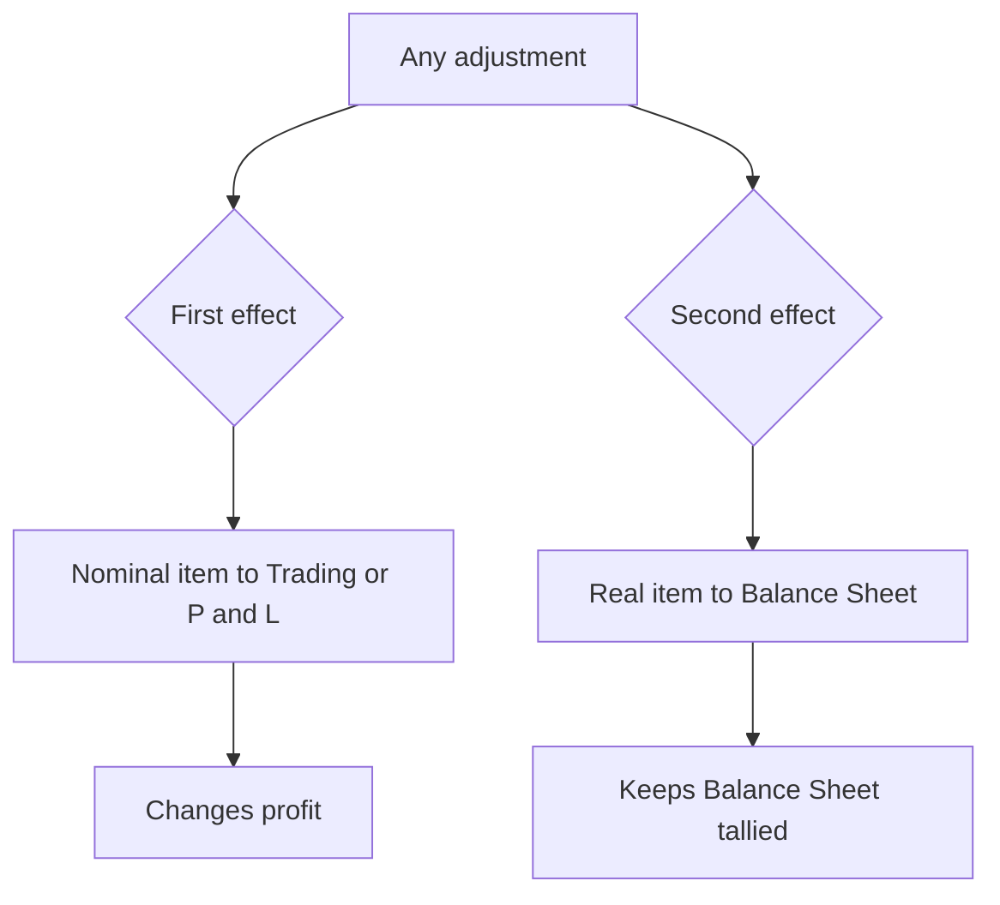
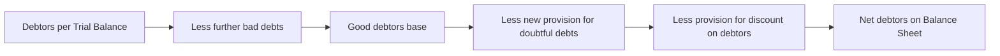
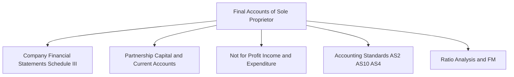

<!-- v2-deep -->

# Foundation: Final Accounts of Sole Proprietors

*Every year a business must stop the film and take a photograph: how much did I earn, and what am I worth right now? Final accounts are that photograph. This chapter builds the whole machine from first principles — the Trading Account, the Profit & Loss Account, the Balance Sheet, and the dozen "adjustments" that turn a raw trial balance into an honest set of statements. Master this and you have mastered the grammar of all financial reporting; everything you meet later in CA Intermediate and beyond is a dialect of it.*

---

## 1. The Problem it solves

Imagine Mr. Rao, who runs a hardware shop as a sole proprietor. Through the year he has been diligent: every purchase, sale, receipt and payment has been recorded by double entry, posted to ledgers, and the ledgers balanced. On 31 March he extracts a **Trial Balance** — a long list of debit and credit balances that agree to the paisa. He is proud of it. Then his banker asks two brutally simple questions:

1. **"How much profit did you make this year?"**
2. **"What is your business worth today — what does it own, and what does it owe?"**

Mr. Rao stares at his trial balance and realises it answers *neither* question directly. The trial balance is a heap of balances; it proves the books are arithmetically correct, but it does not *tell a story*. Profit is buried inside dozens of lines — sales, purchases, wages, rent, stock — and net worth is scattered across assets, liabilities and capital. Worse, the trial balance is **incomplete and slightly untrue** on the last day, because several economic facts have happened that the books have not yet captured:

- There is unsold **closing stock** in the godown — an asset the books haven't recorded.
- Two months' **rent is still unpaid** — an expense incurred but not entered.
- **Insurance** was paid for 15 months, so part of it belongs to next year — a prepaid asset.
- The **machinery is a year older** — it has silently lost value (depreciation) that nobody wrote a cheque for.
- Some **debtors will never pay** — the asset "debtors" is overstated.

Final accounts solve exactly this. They take the mechanically-correct-but-story-less trial balance, **layer on the missing economic truths (adjustments)**, and reorganise everything into three purpose-built statements that answer the banker's two questions:

> **Trading Account** → answers *"What did I earn from buying and selling goods?"* (Gross Profit)
>
> **Profit & Loss Account** → answers *"After all the running costs of the business, what did I actually make?"* (Net Profit)
>
> **Balance Sheet** → answers *"On this date, what do I own and owe, and what is my capital worth?"*

That is the problem: converting a correct-but-mute trial balance into a truthful, decision-useful set of financial statements. The adjustments are the heart of the difficulty, because each one is a fact the double-entry system missed at year-end and must now record — always with **two effects**, never one.

*Figure 1 — Final accounts convert a mute trial balance into three statements that answer earnings and net-worth questions.*

---

## 2. Core Idea

There is really only one idea, expressed in two halves:

> **1. Split every ledger balance into (a) things that affected THIS YEAR'S profit and (b) things that describe the business's STATE on the last day.** The first group flows into the Trading and Profit & Loss Account; the second group flows into the Balance Sheet.
>
> **2. Before you split, correct the trial balance for every economic event that has occurred but not yet been recorded (the adjustments) — and each adjustment always produces exactly TWO effects, because accounting is double entry.**

Everything else is detail. A "nominal" account (an expense or income like wages, rent, sales, commission received) has done its job during the year and is *closed off* to the Trading or P&L Account. A "real" or "personal" account (an asset, a liability, capital, debtors, creditors, cash) *survives* into the next year and is *carried down* onto the Balance Sheet.

The single most important habit this chapter must build in you is the **double-effect reflex**: whenever you see an adjustment, ask *"where does the first effect go, and where does the second effect go?"* Closing stock is not just an asset (Balance Sheet) — it is also a credit in the Trading Account (it reduces cost of goods sold). Outstanding rent is not just an expense (P&L) — it is also a liability (Balance Sheet). Get this reflex and adjustments become mechanical; miss it and you will lose half your marks silently, because the balance sheet will simply refuse to tally.

---

## 3. Why it works this way

**Why two profit statements (Trading + P&L) and not one?**
Because a trader wants to see profit at two levels. The **Trading Account** isolates the profit that comes purely from the core activity of *buying and selling goods* — sales minus the cost of what was sold. This is **Gross Profit**, and its ratio to sales (the gross-profit margin) tells the owner whether the fundamental trade is sound, before any office overheads muddy the picture. The **Profit & Loss Account** then takes that gross profit and subtracts all the *other* costs of running the business — salaries, rent, depreciation, selling costs — and adds *other* incomes, to arrive at **Net Profit**, the number that finally belongs to the owner. Separating them lets you diagnose *where* profit is being made or lost: a healthy gross margin but a net loss points to bloated overheads, not to bad buying.

**Why does closing stock appear in the Trading Account at all — isn't it just an asset?**
Because of the **matching concept.** You bought goods; some you sold, some you did not. Only the cost of goods actually *sold* should be matched against this year's sales. The arithmetic that achieves this is: **Cost of Goods Sold = Opening Stock + Net Purchases + Direct Expenses − Closing Stock.** Closing stock is *deducted* from the cost side because its cost has not yet earned any revenue — it is being carried forward to meet next year's sales. So closing stock is simultaneously (i) a credit in the Trading Account (removing unsold cost) and (ii) an asset on the Balance Sheet. Two effects, one fact.

**Why "adjust" for outstanding and prepaid amounts — why not just take what was paid?**
Because of the **accrual concept**: profit measures economic performance, not cash movement. If rent of Rs 24,000 relates to the year but only Rs 22,000 was paid, the *true cost of using the premises this year* is Rs 24,000 — the unpaid Rs 2,000 is still an expense (it was consumed) and simultaneously a liability (it is still owed). Conversely, if insurance of Rs 6,000 was paid but Rs 1,500 of it covers next year, only Rs 4,500 was *consumed* this year; the Rs 1,500 is a prepaid asset carried forward. Cash paid is not the same as expense incurred, and accrual accounting corrects for the gap.

**Why depreciate — nobody paid any cash?**
Because a fixed asset is a *bundle of future service* that you consume gradually. When machinery costing Rs 2,00,000 is used for a year, part of its usefulness is gone forever — that expiry is a real cost of earning this year's revenue, even though no cash left the business (the cash left years ago, when the asset was bought). Depreciation spreads the cost of the asset over the years it serves, honouring the matching concept. Its two effects: an expense in the P&L, and a reduction of the asset's book value on the Balance Sheet.

**Why provide for doubtful debts before any debtor has actually defaulted?**
Because of **prudence** — anticipate probable losses, do not wait for certainty. If experience says 5% of debtors typically go bad, then on the balance sheet date a probable loss of that 5% already exists, even though you cannot yet name which customers. Recognising it now (as a provision) states debtors at their realistic recoverable value and charges the expected loss against the year that *made* those sales. To wait until the debtor formally defaults next year would overstate this year's profit and this year's assets.

**Why is interest on the owner's own capital charged as an expense?**
This surprises newcomers. The proprietor's capital could have been deposited in a bank earning interest; by locking it into the business the owner forgoes that return. Charging **interest on capital** in the P&L recognises this *opportunity cost* and gives a truer picture of whether the business earns more than the owner's money would earn elsewhere. Its mirror image, **interest on drawings**, charges the owner for taking money out during the year (money the business could have used), and is treated as an income of the business. Both are ultimately adjustments *within* the owner's own capital account, but routing them through the P&L sharpens the measure of managerial performance.

---

## 4. Full technical content

### 4.1 The sequence: from trial balance to final accounts

The mechanical pipeline never changes:

1. Take the **trial balance**.
2. Read the **adjustments** and, for each, identify its **two effects**.
3. Prepare the **Trading Account** → transfer all *direct* items → strike **Gross Profit / Gross Loss**.
4. Prepare the **Profit & Loss Account** → bring down gross profit → transfer all *indirect* expenses and incomes → strike **Net Profit / Net Loss**.
5. Prepare the **Balance Sheet** → list assets and liabilities, take net profit and drawings into the capital account → both sides must tally.

### 4.2 Direct vs indirect — the master classification

| Belongs to TRADING A/c (direct) | Belongs to P&L A/c (indirect) |
|---|---|
| Opening stock | Salaries (office/administration) |
| Purchases (less returns) | Rent, rates, taxes, insurance (office) |
| Sales (less returns) | Printing, stationery, postage, telephone |
| Wages (factory/godown) | Depreciation on all fixed assets |
| Carriage inward / freight inward | Bad debts, provision for doubtful debts, provision for discount on debtors |
| Import duty, octroi, clearing charges | Interest paid, bank charges, discount allowed |
| Fuel, power, factory lighting | Carriage outward, advertisement, selling expenses |
| Manufacturing / factory expenses | Repairs, general expenses, legal charges |
| Royalty on production | Interest on capital, manager's commission |
| — | Incomes: discount received, commission received, interest received, rent received (shown on credit side) |

Memory hooks: **"Wages... in; carriage... in"** goes to Trading; **"salaries... out; carriage... out"** goes to P&L. Anything connected to *getting goods into saleable condition* is direct; anything connected to *running the office and selling* is indirect.

### 4.3 Format of the Trading Account

The Trading Account for the year ended 31 March …:

| Dr — Particulars | Rs | Cr — Particulars | Rs |
|---|---|---|---|
| To Opening Stock | xxx | By Sales | xxx |
| To Purchases | xxx | Less: Sales Returns | (xxx) |
| Less: Purchase Returns | (xxx) | By Closing Stock | xxx |
| To Wages (+ outstanding) | xxx | By Gross Loss c/d (if any) | xxx |
| To Carriage Inward | xxx | | |
| To Freight / Duty / Power | xxx | | |
| To Gross Profit c/d | xxx | | |
| **Total** | **xxx** | **Total** | **xxx** |

Gross Profit is the balancing figure carried down to the credit of the P&L Account (Gross Loss to the debit).

### 4.4 Format of the Profit & Loss Account

| Dr — Particulars | Rs | Cr — Particulars | Rs |
|---|---|---|---|
| To Gross Loss b/d (if any) | xxx | By Gross Profit b/d | xxx |
| To Salaries (+ outstanding) | xxx | By Discount Received | xxx |
| To Rent, Rates, Insurance (− prepaid) | xxx | By Commission Received (+ accrued − advance) | xxx |
| To Depreciation | xxx | By Interest / Rent Received | xxx |
| To Bad Debts + New Provision − Old Provision | xxx | By Interest on Drawings | xxx |
| To Provision for Discount on Debtors | xxx | By Net Loss c/d (if any) | xxx |
| To Carriage Outward, Advertisement | xxx | | |
| To Interest on Capital | xxx | | |
| To Manager's Commission | xxx | | |
| To Net Profit c/d (to Capital A/c) | xxx | | |
| **Total** | **xxx** | **Total** | **xxx** |

### 4.5 The Balance Sheet and marshalling

The Balance Sheet is **not** an account (no debit/credit, no "To/By"); it is a *statement* of balances left over after the nominal accounts are closed. It lists **Liabilities + Capital** on the left and **Assets** on the right (Indian horizontal format), and the two sides must be equal because of the accounting equation **Assets = Liabilities + Capital**.

**Marshalling** means the *order* in which assets and liabilities are arranged. Two accepted orders:

| Order of Liquidity (most liquid first) | Order of Permanence (most permanent first) |
|---|---|
| Assets: Cash → Bank → Debtors → Stock → Investments → Furniture → Machinery → Goodwill | Assets: Goodwill → Machinery → Furniture → Investments → Stock → Debtors → Bank → Cash |
| Liabilities: Outstanding expenses → Creditors → Bills payable → Loans → Capital | Liabilities: Capital → Long-term loans → Bills payable → Creditors → Outstanding expenses |

Sole proprietors most commonly present in the **order of permanence** (the order Schedule III companies also broadly follow), but either is acceptable if applied consistently.

| Liabilities | Rs | Assets | Rs |
|---|---|---|---|
| Capital xxx | | Fixed Assets: | |
|  Add: Net Profit / Interest on Capital | | Goodwill | xxx |
|  Less: Drawings / Interest on Drawings / Net Loss | xxx | Machinery (− depreciation) | xxx |
| Long-term Loans | xxx | Furniture (− depreciation) | xxx |
| Sundry Creditors | xxx | Investments | xxx |
| Bills Payable | xxx | Closing Stock | xxx |
| Outstanding Expenses | xxx | Debtors (− bad debts − provisions) | xxx |
| Income Received in Advance | xxx | Prepaid Expenses | xxx |
| | | Accrued Income | xxx |
| | | Cash at Bank / in Hand | xxx |
| **Total** | **xxx** | **Total** | **xxx** |

### 4.6 The adjustments — rule, journal entry, and the two effects

This is the examinable core. For each adjustment: the entry, and **where each of the two effects lands.**

**(1) Closing stock**
> Entry: `Closing Stock A/c   Dr` to `Trading A/c`.
> Effect 1: Credit side of Trading Account (reduces COGS). Effect 2: Asset on Balance Sheet.
> Valued at **lower of cost and net realisable value** (AS 2 logic — carried into Foundation).

**(2) Outstanding (accrued) expense** — expense incurred but not paid
> Entry: `Expense A/c   Dr` to `Outstanding Expense A/c`.
> Effect 1: *Added* to that expense in Trading/P&L. Effect 2: Shown as a **current liability**.

**(3) Prepaid (unexpired) expense** — paid but relates to next year
> Entry: `Prepaid Expense A/c   Dr` to `Expense A/c`.
> Effect 1: *Deducted* from that expense in Trading/P&L. Effect 2: Shown as a **current asset**.

**(4) Accrued income** — earned but not yet received
> Entry: `Accrued Income A/c   Dr` to `Income A/c`.
> Effect 1: *Added* to that income on the credit side of P&L. Effect 2: Shown as a **current asset**.

**(5) Income received in advance (unearned income)**
> Entry: `Income A/c   Dr` to `Income Received in Advance A/c`.
> Effect 1: *Deducted* from that income on the credit side of P&L. Effect 2: Shown as a **current liability**.

**(6) Depreciation**
> Entry: `Depreciation A/c   Dr` to `Asset A/c`.
> Effect 1: Expense in P&L. Effect 2: *Deducted* from the asset on the Balance Sheet.

**(7) Bad debts written off at year-end (further/additional bad debts)**
> Entry: `Bad Debts A/c   Dr` to `Sundry Debtors A/c`.
> Effect 1: Adds to bad debts expense (P&L). Effect 2: *Deducted* from debtors on the Balance Sheet.
> Note: further bad debts appear only in adjustments (once in P&L, once reducing debtors); bad debts already in the trial balance appear only in the P&L.

**(8) Provision for doubtful debts (PDD)**
> Entry: `Profit & Loss A/c   Dr` to `Provision for Doubtful Debts A/c`.
> Computed as a % of debtors **after** deducting further bad debts.
> Effect 1: Charge in P&L (combined with bad debts — see the formula below). Effect 2: *Deducted* from debtors on the Balance Sheet.
> **P&L charge = Bad debts (TB) + Further bad debts + New PDD required − Old PDD (opening).**

**(9) Provision for discount on debtors (PDDr)**
> Rationale: prudent debtors pay early to earn cash discount, so a probable discount cost exists.
> Computed as a % of *good* debtors = (Debtors − further bad debts − new PDD).
> Effect 1: Charge in P&L. Effect 2: *Deducted* from debtors on the Balance Sheet (after PDD).
> Order is strict: **first bad debts, then PDD, then PDDr** — each works on the balance the previous left.

**(10) Drawings of goods/cash**
> Cash drawings are usually already in the trial balance; deducted from capital. Goods withdrawn for personal use: `Drawings A/c Dr` to `Purchases A/c` — reduces purchases (Trading) and reduces capital (Balance Sheet).

**(11) Interest on capital**
> Entry: `Interest on Capital A/c Dr` to `Capital A/c`.
> Effect 1: Expense in P&L. Effect 2: *Added* to capital on the Balance Sheet.

**(12) Interest on drawings**
> Entry: `Capital A/c (or Drawings A/c) Dr` to `Interest on Drawings A/c`.
> Effect 1: Income on the credit side of P&L. Effect 2: *Deducted* from capital on the Balance Sheet.
> Average-period method for even drawings: interest = Total drawings × rate × (average months / 12).

**(13) Manager's commission**
> Two bases the examiner will specify:
> - **On profit BEFORE charging commission:** Commission = Net Profit (before) × Rate%.
> - **On profit AFTER charging commission:** Commission = Net Profit (before) × Rate ÷ (100 + Rate).
> Effect 1: Expense in P&L. Effect 2: **Commission outstanding** = a current liability (if unpaid).

*Figure 2 — The double-effect reflex: every adjustment touches profit once and the balance sheet once.*

### 4.7 The debtors "chain" — the order that must never be broken

*Figure 3 — Bad debts, then doubtful-debt provision, then discount provision — each computed on what the prior step left.*

---

## 5. Worked examples

### Example 1 — A full set of final accounts with twelve adjustments

**Trial Balance of Mr. X as on 31 March 2025**

| Debit balances | Rs | Credit balances | Rs |
|---|---|---|---|
| Opening Stock | 50,000 | Capital | 3,00,000 |
| Purchases | 3,50,000 | Sales | 6,00,000 |
| Wages | 40,000 | Sundry Creditors | 90,000 |
| Carriage Inward | 5,000 | Bills Payable | 20,000 |
| Salaries | 55,000 | Purchase Returns | 5,000 |
| Rent and Taxes | 18,000 | Provision for Doubtful Debts | 4,000 |
| Insurance | 6,000 | Commission Received | 10,000 |
| Advertisement | 12,000 | | |
| Carriage Outward | 6,000 | | |
| Bad Debts | 3,000 | | |
| Sundry Debtors | 1,20,000 | | |
| Furniture | 60,000 | | |
| Machinery | 2,10,000 | | |
| Cash at Bank | 40,000 | | |
| Cash in Hand | 8,000 | | |
| Drawings | 36,000 | | |
| General Expenses | 10,000 | | |
| **Total** | **10,29,000** | **Total** | **10,29,000** |

**Adjustments**
(a) Closing stock Rs 70,000. (b) Outstanding wages Rs 5,000. (c) Outstanding salaries Rs 5,000. (d) Prepaid insurance Rs 1,500. (e) Of the commission received, Rs 2,000 is received in advance; commission earned but not yet received is Rs 3,000. (f) Depreciate machinery and furniture @10% each. (g) Write off further bad debts Rs 5,000; maintain provision for doubtful debts @5% and provision for discount on debtors @2%. (h) Interest on capital @6% p.a. (i) Interest on drawings Rs 2,000. (j) The manager is entitled to a commission of 10% of net profit *after* charging such commission.

**Step 1 — Trading Account for the year ended 31 March 2025**

| Dr — Particulars | Rs | Cr — Particulars | Rs |
|---|---|---|---|
| To Opening Stock | 50,000 | By Sales | 6,00,000 |
| To Purchases 3,50,000 − Returns 5,000 | 3,45,000 | By Closing Stock | 70,000 |
| To Wages 40,000 + Outstanding 5,000 | 45,000 | | |
| To Carriage Inward | 5,000 | | |
| To Gross Profit c/d | 2,25,000 | | |
| **Total** | **6,70,000** | **Total** | **6,70,000** |

**Step 2 — Working: bad debts and provisions (the debtors chain)**
- Debtors Rs 1,20,000 − further bad debts Rs 5,000 = **Rs 1,15,000** (good-debtor base).
- New Provision for Doubtful Debts @5% of 1,15,000 = **Rs 5,750**.
- Provision for Discount on Debtors @2% of (1,15,000 − 5,750 = 1,09,250) = **Rs 2,185**.
- **P&L charge for bad debts & PDD** = Bad debts 3,000 + Further 5,000 + New PDD 5,750 − Old PDD 4,000 = **Rs 9,750**.

**Step 3 — Working: manager's commission**
- Net profit *before* commission (from Step 4 below) = Rs 70,565.
- Commission @10% after charging = 70,565 × 10 ÷ 110 = **Rs 6,415**. (Check: 6,415 × 11 = 70,565 ✓)

**Step 4 — Profit & Loss Account for the year ended 31 March 2025**

| Dr — Particulars | Rs | Cr — Particulars | Rs |
|---|---|---|---|
| To Salaries 55,000 + Outstanding 5,000 | 60,000 | By Gross Profit b/d | 2,25,000 |
| To Rent and Taxes | 18,000 | By Commission Received 10,000 − Advance 2,000 + Accrued 3,000 | 11,000 |
| To Insurance 6,000 − Prepaid 1,500 | 4,500 | By Interest on Drawings | 2,000 |
| To Advertisement | 12,000 | | |
| To Carriage Outward | 6,000 | | |
| To General Expenses | 10,000 | | |
| To Depreciation: Machinery 21,000 + Furniture 6,000 | 27,000 | | |
| To Bad Debts & Provision for DD (working) | 9,750 | | |
| To Provision for Discount on Debtors | 2,185 | | |
| To Interest on Capital (6% of 3,00,000) | 18,000 | | |
| To Manager's Commission | 6,415 | | |
| To Net Profit (to Capital A/c) | 64,150 | | |
| **Total** | **2,38,000** | **Total** | **2,38,000** |

*Check: expenses before net profit and commission = 1,67,435; + commission 6,415 + net profit 64,150 = 2,38,000 = total income. ✓*

**Step 5 — Balance Sheet as at 31 March 2025** (order of permanence)

| Liabilities | Rs | Assets | Rs |
|---|---|---|---|
| Capital 3,00,000 | | Machinery 2,10,000 − Dep 21,000 | 1,89,000 |
|  Add: Interest on Capital 18,000 | | Furniture 60,000 − Dep 6,000 | 54,000 |
|  Add: Net Profit 64,150 | | Closing Stock | 70,000 |
|  Less: Drawings 36,000 | | Debtors 1,20,000 − Bad 5,000 − PDD 5,750 − PDDr 2,185 | 1,07,065 |
|  Less: Interest on Drawings 2,000 | 3,44,150 | Accrued Commission | 3,000 |
| Sundry Creditors | 90,000 | Prepaid Insurance | 1,500 |
| Bills Payable | 20,000 | Cash at Bank | 40,000 |
| Outstanding Wages | 5,000 | Cash in Hand | 8,000 |
| Outstanding Salaries | 5,000 | | |
| Commission Received in Advance | 2,000 | | |
| Manager's Commission Outstanding | 6,415 | | |
| **Total** | **4,72,565** | **Total** | **4,72,565** |

**Both sides tally at Rs 4,72,565.** Every adjustment has landed twice: closing stock (Trading credit + asset), outstanding wages/salaries (added to expense + liability), prepaid insurance (deducted from expense + asset), commission in advance / accrued (adjusted income + liability/asset), depreciation (expense + asset reduction), bad debts and both provisions (P&L + reduced debtors), interest on capital (expense + capital), interest on drawings (income + capital reduction), manager's commission (expense + liability).

---

### Example 2 — Provision for doubtful debts across two years

*This shows how the provision "carries forward" and why the P&L charge is the balancing figure, not the whole provision.*

**Year 1 — 31 March 2024.** Debtors Rs 2,00,000. Bad debts already written off during the year Rs 15,000. A provision for doubtful debts is to be created @5%. No opening provision existed.

- New provision required = 5% of 2,00,000 = Rs 10,000.
- **P&L charge = Bad debts 15,000 + New provision 10,000 − Old provision 0 = Rs 25,000.**
- Balance Sheet: Debtors 2,00,000 − Provision 10,000 = **Rs 1,90,000**.
- The Rs 10,000 provision is *carried forward* to Year 2.

**Year 2 — 31 March 2025.** Bad debts written off during the year Rs 12,000 (already posted). At year-end, further bad debts Rs 8,000 are to be written off. Debtors before this write-off are Rs 2,50,000. Provision to be maintained @5%.

- Debtors after further bad debts = 2,50,000 − 8,000 = Rs 2,42,000.
- New provision required = 5% of 2,42,000 = Rs 12,100.

**Provision for Doubtful Debts Account (year ended 31 March 2025)**

| Dr — Particulars | Rs | Cr — Particulars | Rs |
|---|---|---|---|
| To Bad Debts A/c (12,000 + 8,000) | 20,000 | By Balance b/d | 10,000 |
| To Balance c/d (new provision) | 12,100 | By Profit & Loss A/c (bal. fig.) | 22,100 |
| **Total** | **32,100** | **Total** | **32,100** |

- **P&L charge for Year 2 = Rs 22,100** (= Bad debts 20,000 + New provision 12,100 − Old provision 10,000).
- Balance Sheet 31 March 2025: Debtors 2,42,000 − Provision 12,100 = **Rs 2,29,900**.

The lesson: you never charge the full new provision to P&L; you charge only the *movement* — bad debts absorbed, plus the top-up (or minus the release) needed to reach the new required balance.

---

### Example 3 — Manager's commission (both bases) and the capital account

**Part A — Manager's commission.** Net profit *before* charging the manager's commission is Rs 1,10,000. Compute the commission @10% on each basis.

| Basis | Formula | Working | Commission |
|---|---|---|---|
| On profit *before* charging | NP × Rate% | 1,10,000 × 10% | **Rs 11,000** |
| On profit *after* charging | NP × Rate ÷ (100 + Rate) | 1,10,000 × 10 ÷ 110 | **Rs 10,000** |

*Verification of the "after" basis:* profit remaining after commission = 1,10,000 − 10,000 = Rs 1,00,000; 10% of that = Rs 10,000, which equals the commission itself. Consistent. ✓ The "after" basis always gives the smaller figure, because the commission is being computed on a base that has already been reduced by the commission.

**Part B — Capital account.** Mr. Y's opening capital on 1 April 2024 was Rs 5,00,000. During the year he drew Rs 60,000, spread evenly through the year. Interest on capital is allowed @10% p.a.; interest on drawings is charged @8% p.a.; net profit for the year (after all charges above) is Rs 1,00,000.

- Interest on capital = 10% of 5,00,000 = Rs 50,000.
- Interest on drawings (even drawings → average period 6 months) = 60,000 × 8% × 6/12 = Rs 2,400.

**Capital Account of Mr. Y**

| Dr — Particulars | Rs | Cr — Particulars | Rs |
|---|---|---|---|
| To Drawings | 60,000 | By Balance b/d | 5,00,000 |
| To Interest on Drawings | 2,400 | By Interest on Capital | 50,000 |
| To Balance c/d (closing capital) | 5,87,600 | By Net Profit | 1,00,000 |
| **Total** | **6,50,000** | **Total** | **6,50,000** |

Closing capital carried to the Balance Sheet = **Rs 5,87,600**. Note that interest on capital and net profit are *credited* to the owner (they increase his claim), while drawings and interest on drawings are *debited* (they reduce it) — the very same two-sided treatment that appears inside the Balance Sheet capital section of Example 1.

---

## 6. Connections — what this unlocks in CA Intermediate

- **Financial Statements of Companies (Inter Paper 1 / Advanced Accounting).** The sole-trader Trading + P&L collapses into the company **Statement of Profit and Loss** and the Balance Sheet becomes the **Schedule III** vertical format. Every adjustment here reappears there — depreciation, provisions, prepaid/outstanding — dressed in company clothing.
- **Partnership Accounts.** The capital-account mechanics you just built (interest on capital, interest on drawings, drawings, profit share) scale directly into partners' capital and current accounts, profit-sharing ratios, and admission/retirement adjustments.
- **AS 2, AS 10, AS 4.** Closing-stock valuation (lower of cost and NRV), depreciation policy, and events after the balance sheet date are the standards that formalise the Foundation adjustments you did here by intuition.
- **Not-for-Profit Organisations.** The Receipts & Payments → Income & Expenditure conversion is *literally* the accrual adjustments of this chapter (outstanding, prepaid, accrued, advance) applied to a club's cash book.
- **Ratio analysis and Financial Management.** Gross-profit and net-profit margins, and the classification of current vs non-current items on the balance sheet, are the raw material for every ratio you compute later.

*Figure 4 — The Foundation final-accounts skeleton is the parent of most of Intermediate financial accounting.*

---

## 7. Traps & common mistakes

1. **Forgetting the second effect.** The single biggest killer. Outstanding rent added to expense but not shown as a liability → balance sheet won't tally. Always ask "where does effect two go?"
2. **Wrong side for closing stock.** It is a *credit* in the Trading Account and an *asset* — never a debit expense.
3. **Adjustment items given only in adjustments have TWO effects; items already in the trial balance have ONE.** Example: "further bad debts" (adjustment) hit both P&L and debtors; "bad debts" already in the TB hit only the P&L.
4. **Breaking the debtors chain order.** Compute PDD on debtors *after* further bad debts, and PDDr on debtors *after* PDD. Applying percentages to the gross debtors figure is the classic error.
5. **Charging the whole new provision to P&L.** Only the *movement* goes to P&L: new provision + bad debts − old provision. A *decrease* in required provision is a credit (income) in the P&L.
6. **Direct vs indirect confusion.** Carriage *inward* → Trading; carriage *outward* → P&L. Wages → Trading; salaries → P&L. Getting these wrong misstates gross profit even if net profit ends up right.
7. **Manager's commission base.** "After charging such commission" needs Rate/(100+Rate), not Rate/100. Mixing them is an instant mark loss.
8. **Interest on capital/drawings double-counting.** Route them through the P&L *and* the capital account — but do not also add them a third time elsewhere. Interest on capital: P&L expense + added to capital. Interest on drawings: P&L income + deducted from capital.
9. **Depreciation on the wrong base.** Depreciate the cost/opening WDV given in the trial balance (unless an addition/sale mid-year is specified). Do not depreciate an asset already shown net.
10. **Drawings of goods left in purchases.** Goods taken by the owner must be removed from purchases (reduces Trading debit) and deducted from capital — otherwise cost of goods sold and capital are both overstated.
11. **Abnormal loss / goods distributed as free samples / goods on approval** — each has its own two effects; do not silently ignore the note.
12. **Balance Sheet is a statement, not an account.** Never write "To/By" or "Dr/Cr" inside it.

---

## 8. First-principles recap

- Final accounts translate a mechanically-correct but story-less trial balance into three purpose-built statements: **Gross Profit (Trading), Net Profit (P&L), and Financial Position (Balance Sheet).**
- The universal split: **nominal accounts** (expenses/incomes) close into Trading/P&L and vanish; **real and personal accounts** (assets/liabilities/capital) survive onto the Balance Sheet.
- Adjustments exist because the accrual and matching concepts demand that profit reflect *economic events*, not cash timing — and prudence demands that probable losses (doubtful debts, stock write-downs) be recognised early.
- **Every adjustment has exactly two effects** — one on profit, one on the Balance Sheet — and the balance sheet tallying is your built-in proof that both were recorded.
- The debtors chain (bad debts → doubtful-debt provision → discount provision) and the capital account (interest on capital, drawings, interest on drawings, net profit) are the two mechanisms students most often get wrong; learn their exact order.
- This one skeleton is the parent of company accounts, partnership accounts, and not-for-profit accounts — invest here and Intermediate becomes recognition, not re-learning.

---

## 9. Quick-reference

| Item | Rule / Formula | Two effects |
|---|---|---|
| Cost of Goods Sold | Opening Stock + Net Purchases + Direct Expenses − Closing Stock | — |
| Gross Profit | Net Sales − COGS | Trading balancing figure |
| Net Profit | Gross Profit + Other Incomes − Indirect Expenses | P&L balancing figure → Capital |
| Closing stock | Lower of cost and NRV | Cr Trading; Asset |
| Outstanding expense | Add to expense | +Expense; +Liability |
| Prepaid expense | Deduct from expense | −Expense; +Asset |
| Accrued income | Add to income | +Income; +Asset |
| Income received in advance | Deduct from income | −Income; +Liability |
| Depreciation | Cost/WDV × rate | +Expense; −Asset |
| Further bad debts | Written off at year-end | +Bad debts (P&L); −Debtors |
| New PDD | % of (Debtors − further bad debts) | P&L charge; −Debtors |
| PDD charge to P&L | Bad debts + Further bad debts + New PDD − Old PDD | — |
| Provision for discount on debtors | % of (Debtors − further bad debts − new PDD) | +Expense; −Debtors |
| Interest on capital | Capital × rate | +Expense (P&L); +Capital |
| Interest on drawings | Drawings × rate × avg months/12 | +Income (P&L); −Capital |
| Manager commission (before) | NP before × rate% | +Expense; +Liability |
| Manager commission (after) | NP before × rate ÷ (100 + rate) | +Expense; +Liability |
| Accounting equation | Assets = Liabilities + Capital | Balance Sheet must tally |

*Key concepts invoked: matching, accrual, prudence (conservatism), going concern. Closing-stock valuation aligns with AS 2 (lower of cost and NRV); depreciation aligns with AS 10 principles — both formalised in CA Intermediate.*
