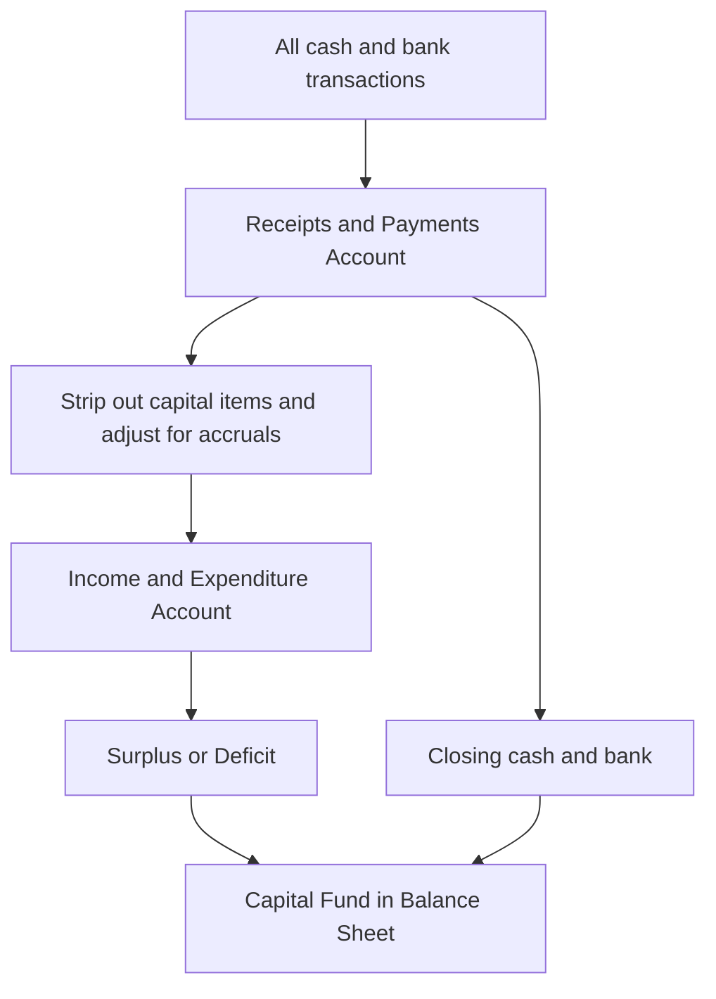
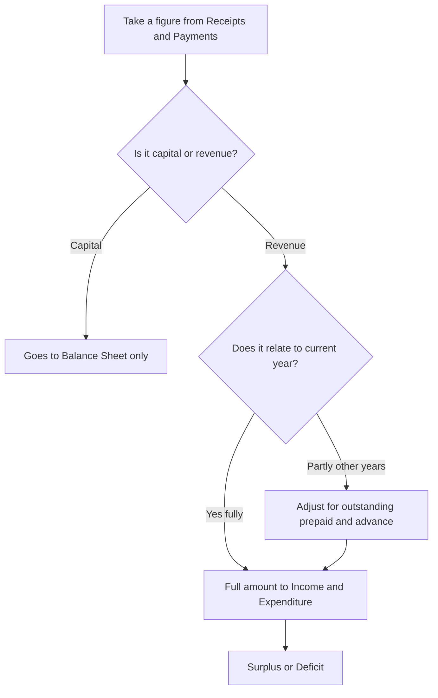
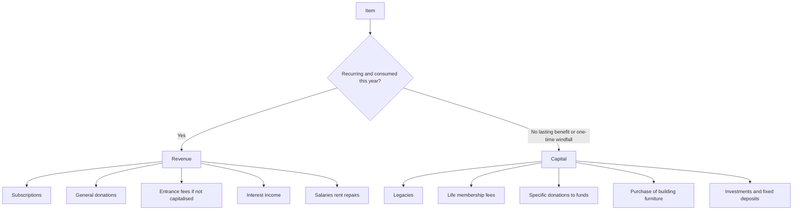

<!-- v2-deep -->

# Foundation: Financial Statements of Not-for-Profit Organisations

*A cricket club, a school trust, a hospital society, a temple committee — none of them exist to make profit, yet every rupee that flows through them must still be accounted for. This chapter builds the whole machinery for accounting where there is no "profit" to measure: the Receipts and Payments Account, the Income and Expenditure Account, and the Balance Sheet of a Not-for-Profit Organisation, plus the special treatment of subscriptions, donations, legacies, entrance fees, life membership and funds.*

---

## 1. The Problem it solves

A group of neighbours starts a **sports club**. Members pay an annual subscription. The club buys some cricket gear, pays a groundsman, runs a tournament, collects donations, and at year-end has some cash in the bank and a small pavilion it built. There are no shareholders, no owners taking dividends, no goods bought-and-sold for gain. The club is not trying to *earn* money — it exists only to *serve* its members.

Now the treasurer faces a question that looks simple but is not: **how do we show the members that their money was handled honestly, and how do we know whether the club is financially sustainable or slowly going broke?**

You cannot use ordinary trading accounts here, because the concepts do not fit:

- There is no "sales", no "gross profit", no "cost of goods sold" — the club sells nothing.
- There is no "capital" contributed by an owner who expects a return.
- There is no "net profit" to distribute — any surplus stays inside the organisation for its stated purpose.

Yet the underlying accounting *logic* has not changed at all. Money still comes in and goes out. Some of that money is **revenue** in nature (subscriptions, the groundsman's salary) and some is **capital** in nature (money to build the pavilion, a big one-time legacy). The club still owns **assets** (pavilion, sports equipment, bank balance) and may still owe **liabilities** (unpaid bills). Members are still owed a truthful report.

So the problem this chapter solves is: **how do we adapt the ordinary double-entry framework to an entity that has no profit motive — reporting whether it lived within its means (a "surplus" or "deficit" instead of profit or loss) and what it owns and owes at year-end?**

The answer is a set of three linked statements that mirror trading accounts almost exactly, just with different names:

| Trading / commercial concern | Not-for-Profit Organisation | Purpose |
|---|---|---|
| Cash Book | **Receipts and Payments Account** | Summary of all cash/bank movements |
| Profit and Loss Account | **Income and Expenditure Account** | Revenue items only; result is Surplus or Deficit |
| Balance Sheet | **Balance Sheet** | Assets, liabilities and accumulated funds |
| Capital Account | **Capital Fund / General Fund** | The organisation's own accumulated resources |
| Net Profit | **Surplus** (excess of income over expenditure) | Amount added to Capital Fund |
| Net Loss | **Deficit** (excess of expenditure over income) | Amount deducted from Capital Fund |

*Figure 1 — The three statements are linked: the cash summary feeds the revenue account, whose result flows into the Balance Sheet.*

---

## 2. Core Idea

There are really only three ideas here, and everything else is machinery:

> **1. A Not-for-Profit Organisation (NPO) does not measure "profit" — it measures whether its revenue income for the year covered its revenue expenditure. The excess is a Surplus; the shortfall is a Deficit.**
>
> **2. It prepares three statements: a Receipts and Payments Account (a pure cash summary), an Income and Expenditure Account (accrual-based, revenue items only), and a Balance Sheet. The middle statement is the real performance report.**
>
> **3. The single most important skill is separating capital items from revenue items, and cash-basis figures from accrual-basis figures — because the Receipts and Payments Account mixes them all up, and the Income and Expenditure Account must contain only revenue items, adjusted for accruals.**

- **Receipts and Payments Account** = a summarised, classified Cash Book. It records *every* rupee received and paid during the year — **whether capital or revenue, whether relating to this year or another year** — and shows opening and closing cash/bank. It is prepared on a **cash basis**.
- **Income and Expenditure Account** = the NPO's Profit and Loss Account. It records only **revenue income earned** and **revenue expenditure incurred** for the **current year**, on an **accrual basis**. Its balancing figure is **Surplus or Deficit**.
- **Balance Sheet** = exactly what it is for any business — assets on one side, liabilities and the **Capital Fund** on the other.

That is the spine. The whole chapter is: how to build the Income and Expenditure Account from the Receipts and Payments Account by (a) removing capital items and (b) converting cash figures to accrual figures, and then how to treat the tricky special items — subscriptions, donations, legacies, entrance fees, life membership and special funds.

---

## 3. Why it works this way

**Why not just use a Profit and Loss Account?**
Because "profit" is a meaningless target for an entity whose purpose is service, not gain. Members do not want to know "how much did we earn"; they want to know "did we spend more than we brought in, and is the club solvent?" So the Profit and Loss Account is renamed the **Income and Expenditure Account**, and its result is renamed **Surplus/Deficit** — but the double-entry logic (match this year's income against this year's expenditure) is identical. A surplus is *not* distributed; it is retained and added to the Capital Fund to strengthen the organisation.

**Why two separate "accounts" — Receipts and Payments AND Income and Expenditure?**
Because they answer two different questions and are prepared on two different bases:

- The **Receipts and Payments Account** answers *"where did the cash come from and go?"* It is cash-basis and includes capital items (e.g., cash spent buying furniture, a legacy received). It is easy to prepare — you just summarise the bank book — and is what a lay member intuitively understands. But it is a poor measure of *performance* because it (a) mixes capital with revenue and (b) ignores amounts owed to/by the club.
- The **Income and Expenditure Account** answers *"did we, on an accrual basis, live within our means this year?"* It is accrual-basis and includes **only revenue items**. It is the true performance statement.

You need both because the cash summary is transparent and verifiable, while the accrual statement is meaningful. One is the raw feed; the other is the analysis.

**Why does the capital-vs-revenue distinction matter so much for an NPO?**
For the same first-principle reason it matters everywhere: the **matching concept** and the definition of an asset. Money spent to acquire a lasting asset (a pavilion, furniture) is not "consumed" this year — it benefits many years — so it must sit on the Balance Sheet, not be charged as this year's expenditure. Money spent on the groundsman's wages *is* consumed this year and belongs in the Income and Expenditure Account. Similarly, a huge one-time **legacy** (money left to the club in someone's will) is a windfall addition to the club's permanent resources — capital in nature — while an ordinary **subscription** is recurring revenue. Misclassify these and both the Surplus and the Balance Sheet go wrong.

**Why the accrual adjustments (outstanding, prepaid, advance)?**
Because performance must be measured by what was *earned and incurred* this year, not merely what was *received and paid*. If the club earned Rs 50,000 of subscriptions but only Rs 45,000 was actually received (Rs 5,000 still owed by members), the Income and Expenditure Account must show the full Rs 50,000 earned — the Rs 5,000 outstanding is an asset (a receivable). The Receipts and Payments Account, being cash-basis, would show only Rs 45,000. Converting from one to the other is the mechanical heart of every NPO problem.

*Figure 2 — The two-question filter every item must pass before it can enter the Income and Expenditure Account.*

---

## 4. Full technical content

### 4.1 The Receipts and Payments Account

**Definition.** A summarised statement of all cash and bank transactions of an accounting period, classified under headings, starting with the **opening** cash/bank balance and ending with the **closing** cash/bank balance.

**Characteristics.**
- It is a **real account** — essentially a summarised Cash Book. Follows the rule *"debit what comes in, credit what goes out."*
- **Receipts are on the debit (left) side; Payments are on the credit (right) side.** (This is the opposite of the Income and Expenditure Account — a very common exam trap.)
- It records **all** receipts and payments — **capital and revenue**, and relating to **past, current or future** periods.
- Prepared on a **cash basis**: no outstanding, prepaid or accrual entries; no non-cash items such as depreciation, bad debts, or profit/loss on sale of assets.
- The **closing balance** (debit side total minus receipts already there — i.e., the balancing figure) is the year-end cash and bank balance, which is carried to the Balance Sheet. It normally shows a **debit balance** (cash in hand); a credit balance would mean a bank overdraft.

**Format:**

| Receipts (Dr) | Rs | Payments (Cr) | Rs |
|---|---:|---|---:|
| To Balance b/d (opening cash & bank) | xxx | By Salaries & wages | xxx |
| To Subscriptions | xxx | By Rent & rates | xxx |
| To Entrance fees | xxx | By Printing & stationery | xxx |
| To Donations | xxx | By Sports equipment (purchase) | xxx |
| To Life membership fees | xxx | By Furniture (purchase) | xxx |
| To Legacies | xxx | By Investments (purchase) | xxx |
| To Interest received | xxx | By Fixed deposit made | xxx |
| To Sale of old assets | xxx | By Sundry expenses | xxx |
| To Sale of newspapers/scrap | xxx | By Balance c/d (closing cash & bank) | xxx |
| | **Total** | | **Total** |

### 4.2 The Income and Expenditure Account

**Definition.** The revenue account of an NPO, equivalent to a Profit and Loss Account, showing revenue **incomes earned** and revenue **expenditures incurred** during the current year, prepared on the **accrual basis**. Its balancing figure is the **Surplus** (excess of income over expenditure) or **Deficit** (excess of expenditure over income).

**Characteristics.**
- It is a **nominal account** — follows *"debit all expenses and losses, credit all incomes and gains."*
- **Expenditure is on the debit (left) side; Income is on the credit (right) side.**
- Contains **only revenue items** — capital receipts and capital payments are excluded.
- Contains **only current-year** items — adjusted for outstanding, prepaid, income received in advance and income accrued.
- **Includes non-cash items**: depreciation on fixed assets, loss/profit on sale of an asset, provisions — because it measures true cost of the year.
- The **Surplus** is added to the Capital Fund; a **Deficit** is deducted from it. It is never "carried forward" as a separate balance the way profit is not distributed.

**Format:**

| Expenditure (Dr) | Rs | Income (Cr) | Rs |
|---|---:|---|---:|
| To Salaries & wages | xxx | By Subscriptions (current year) | xxx |
| To Rent, rates & taxes | xxx | By Entrance fees (revenue portion) | xxx |
| To Printing & stationery | xxx | By Donations (general) | xxx |
| To Postage & telephone | xxx | By Interest on investments | xxx |
| To Repairs & maintenance | xxx | By Proceeds of programmes (net) | xxx |
| To Audit fees | xxx | By Sundry income | xxx |
| To Depreciation on assets | xxx | By Deficit (bal. fig., if any) | xxx |
| To Loss on sale of asset | xxx | | |
| To Surplus (bal. fig., if any) | xxx | | |
| | **Total** | | **Total** |

### 4.3 Distinguishing Receipts and Payments A/c from Income and Expenditure A/c

| Basis | Receipts and Payments A/c | Income and Expenditure A/c |
|---|---|---|
| Nature | Real account (summarised Cash Book) | Nominal account (like P&L) |
| Sides | Receipts = Dr; Payments = Cr | Expenditure = Dr; Income = Cr |
| Basis | Cash basis | Accrual basis |
| Capital items | Included | Excluded |
| Period covered | Past, current and future | Current year only |
| Opening/closing balance | Starts & ends with cash/bank balance | No opening balance; ends with Surplus/Deficit |
| Non-cash items (depreciation etc.) | Not recorded | Recorded |
| Purpose | Shows cash movement | Shows performance (Surplus/Deficit) |

### 4.4 The Balance Sheet of an NPO

Identical in structure to any business Balance Sheet. The key differences are terminology:

- The place of "Capital" is taken by the **Capital Fund** (also called **General Fund** or **Accumulated Fund**).
- **Capital Fund** is built up from: (a) the opening balance, (b) **plus** Surplus (or minus Deficit) for the year, (c) **plus** capitalised items such as legacies, life membership fees and entrance fees where policy is to capitalise, (d) plus any donations specifically meant to be capitalised.
- **Special / Specific funds** (e.g., Building Fund, Prize Fund, Tournament Fund) appear as separate liabilities, not merged into the Capital Fund.

**Vertical/Horizontal format (horizontal shown):**

| Liabilities | Rs | Assets | Rs |
|---|---:|---|---:|
| Capital Fund: | | Fixed assets (net of depreciation): | |
|  Opening balance xxx | | Building | xxx |
|  Add: Surplus xxx | | Furniture | xxx |
|  Add: Capitalised legacy/life fee xxx | xxx | Sports equipment | xxx |
| Special funds (Building Fund etc.) | xxx | Investments | xxx |
| Subscriptions received in advance | xxx | Fixed deposits | xxx |
| Outstanding expenses | xxx | Accrued interest | xxx |
| Creditors for supplies | xxx | Subscriptions outstanding | xxx |
| | | Prepaid expenses | xxx |
| | | Cash in hand & at bank | xxx |
| | **Total** | | **Total** |

### 4.5 Treatment of special items — the heart of the chapter

#### (a) Subscriptions
The main recurring revenue. Always taken to the **Income and Expenditure Account on an accrual basis** — i.e., the amount *relating to the current year*, regardless of when received.

**Formula (subscription for current year):**

> Subscription income (I&E) = Subscriptions **received** during the year
> **+ Outstanding at the end** (earned, not yet received)
> **− Outstanding at the beginning** (last year's arrears, collected this year)
> **+ Advance at the beginning** (received last year for this year)
> **− Advance at the end** (received this year for next year)

Outstanding subscriptions = **asset**; subscriptions received in advance = **liability**.

A "Subscriptions Account" can be prepared as a ledger to derive the current-year figure — a favourite exam device (shown in Worked Example 2).

#### (b) Donations
- **General donations** (small, no specific purpose): treated as **revenue income** → credited to Income and Expenditure Account.
- **Specific / purpose-restricted donations** (e.g., "for building", "for prizes"): **capital in nature** → credited to the relevant **Special Fund** on the liabilities side, NOT to income. The donor has restricted its use, so it is not free income of the year.
- If a large general donation is received, examiners may direct it be capitalised (added to Capital Fund) — always follow the instruction given in the question.

#### (c) Legacies
Amount received under a **will** of a deceased person. Because it is a one-time, non-recurring windfall:
- **General rule: capital in nature** → added to the **Capital Fund** (Balance Sheet), NOT the Income and Expenditure Account.
- If the legacy is **small and recurring in character**, or the question directs, it may be treated as revenue income.
- A legacy received for a **specific purpose** goes to that Special Fund.

#### (d) Entrance / Admission fees
Paid once by a new member on joining.
- Practice varies. **General/ICAI approach: treat as revenue income** (credit Income and Expenditure Account), because new members join every year and it is fairly regular — *unless* the question directs otherwise.
- If the amount is large and the question says to capitalise, add it to the Capital Fund.
- **Follow the instruction in the question.** If silent, the safe treatment at Foundation is to credit it to Income and Expenditure Account and state your assumption.

#### (e) Life membership fees
A lump sum paid once, giving membership for life (in lieu of annual subscriptions).
- **Capital in nature** → credited to a **Life Membership Fund** / added to Capital Fund, NOT to income. The member has pre-paid for many future years, so recognising it all as one year's income would overstate that year's surplus.
- A common refinement: transfer an annual amount from the Life Membership Fund to income each year to represent the subscription "used up". At Foundation the standard treatment is to **capitalise the whole amount**.

#### (f) Special / Specific funds (e.g., Building Fund, Prize Fund, Tournament Fund)
- Created for a specific purpose from specific donations, subscriptions, or grants.
- Shown as a **separate liability**.
- **Income earned on fund investments** (e.g., interest on Building Fund investments) is **added to the fund**, not to general income.
- **Expenses met out of the fund** (e.g., prizes awarded, tournament costs) are **deducted from the fund**, not charged to the Income and Expenditure Account.
- Only the **net surplus of a fund**, if the question directs it be transferred, moves to the Capital Fund or to income.

**Building Fund movement example (liabilities side):**

| Building Fund | Rs |
|---|---:|
| Opening balance | xxx |
| Add: Donations for building | xxx |
| Add: Interest on Building Fund investments | xxx |
| Less: Amount spent on building (capitalised) | (xxx) |
| **Closing balance** | **xxx** |

#### (g) Sale of old asset, sale of newspapers/scrap
- **Sale of old newspapers, scrap, grass, old sports material of small value**: recurring, so **revenue income** → Income and Expenditure Account.
- **Sale of a fixed asset**: capital transaction. Remove the asset from books; any **profit/loss on sale** goes to Income and Expenditure Account (a revenue item), but the **sale proceeds** themselves are a capital receipt shown in Receipts and Payments only.

### 4.6 Capital vs Revenue — the master classification

*Figure 3 — Classification tree. When in doubt, ask: does this benefit only this year (revenue) or does it add lasting resources / relate to many years (capital)?*

| Item | Usual classification | Where it goes |
|---|---|---|
| Subscriptions | Revenue (accrual) | I&E credit |
| General donation | Revenue | I&E credit |
| Specific-purpose donation | Capital | Special Fund (liability) |
| Legacy (general) | Capital | Capital Fund |
| Entrance fee (if silent) | Revenue* | I&E credit |
| Life membership fee | Capital | Life Membership Fund / Capital Fund |
| Sale of old newspapers/scrap | Revenue | I&E credit |
| Sale proceeds of fixed asset | Capital | R&P only; profit/loss to I&E |
| Purchase of furniture/building | Capital | Balance Sheet asset |
| Depreciation | Revenue (non-cash) | I&E debit; reduces asset in B/S |
| Investment / Fixed deposit made | Capital | Balance Sheet asset |
| Salaries, rent, repairs, printing | Revenue | I&E debit |

*subject to any contrary instruction in the question.

### 4.7 Step-by-step method to solve any NPO problem

1. **Read the Receipts and Payments Account** and the list of adjustments.
2. **Prepare the Opening Balance Sheet** (if opening balances of assets/liabilities are given) to find the **opening Capital Fund** as the balancing figure.
3. **Classify every receipt and payment** as capital or revenue using the tree above.
4. **Build the Income and Expenditure Account**: take only revenue items, and adjust each to the accrual basis (outstanding, prepaid, advance, depreciation, profit/loss on sale).
5. **Find Surplus/Deficit** as the balancing figure.
6. **Prepare the Closing Balance Sheet**: update assets (add purchases, deduct depreciation and sales), update liabilities and funds (add fund donations/interest, deduct fund expenses), and roll the Capital Fund forward (opening + surplus + capitalised items).
7. **Check it balances.**

---

## 5. Worked examples

### Worked Example 1 — Converting a Receipts and Payments Account into an Income and Expenditure Account (with adjustments)

**Data.** The Receipts and Payments Account of *Sunrise Sports Club* for the year ended 31 March 2026:

| Receipts | Rs | Payments | Rs |
|---|---:|---|---:|
| To Balance b/d (cash & bank) | 18,000 | By Salaries | 42,000 |
| To Subscriptions | 90,000 | By Rent | 24,000 |
| To Entrance fees | 12,000 | By Printing & stationery | 6,000 |
| To Donations (general) | 15,000 | By Sports equipment (purchased 1 Apr 2025) | 40,000 |
| To Sale of old newspapers | 2,000 | By Sundry expenses | 9,000 |
| To Interest on investments | 8,000 | By Balance c/d (cash & bank) | 24,000 |
| | **1,45,000** | | **1,45,000** |

**Adjustments:**
1. Subscriptions outstanding on 31 Mar 2026: Rs 8,000; subscriptions received in advance on 31 Mar 2026: Rs 3,000. (No opening arrears/advance.)
2. Salaries outstanding on 31 Mar 2026: Rs 4,000.
3. Rent includes Rs 2,000 prepaid for April 2026.
4. Depreciate sports equipment at 10% p.a.
5. Entrance fees are to be treated as revenue income.
6. Interest accrued but not received: Rs 1,000.

**Step 1 — Verify the Receipts and Payments Account totals.**
Receipts: 18,000 + 90,000 + 12,000 + 15,000 + 2,000 + 8,000 = **1,45,000.** ✓
Payments: 42,000 + 24,000 + 6,000 + 40,000 + 9,000 + 24,000 = **1,45,000.** ✓ Balanced.

**Step 2 — Adjust each revenue item to accrual basis.**

- **Subscriptions:** received 90,000 + outstanding end 8,000 − advance end 3,000 = **95,000.**
- **Salaries:** paid 42,000 + outstanding end 4,000 = **46,000.**
- **Rent:** paid 24,000 − prepaid 2,000 = **22,000.**
- **Depreciation:** 10% × 40,000 = **4,000.**
- **Interest on investments:** received 8,000 + accrued 1,000 = **9,000.**
- Entrance fees 12,000 → revenue. General donations 15,000 → revenue. Sale of old newspapers 2,000 → revenue. Printing 6,000 and sundry 9,000 → revenue.
- **Excluded (capital):** purchase of sports equipment 40,000 → Balance Sheet asset.

**Step 3 — Income and Expenditure Account for the year ended 31 Mar 2026.**

| Expenditure (Dr) | Rs | Income (Cr) | Rs |
|---|---:|---|---:|
| To Salaries | 46,000 | By Subscriptions | 95,000 |
| To Rent | 22,000 | By Entrance fees | 12,000 |
| To Printing & stationery | 6,000 | By Donations (general) | 15,000 |
| To Sundry expenses | 9,000 | By Sale of old newspapers | 2,000 |
| To Depreciation on equipment | 4,000 | By Interest on investments | 9,000 |
| To Surplus (bal. fig.) | 46,000 | | |
| | **1,33,000** | | **1,33,000** |

*Check:* Total income = 95,000 + 12,000 + 15,000 + 2,000 + 9,000 = **1,33,000.** Total expenditure before surplus = 46,000 + 22,000 + 6,000 + 9,000 + 4,000 = **87,000.** Surplus = 1,33,000 − 87,000 = **46,000.** ✓

**Take-away:** every cash figure was pushed to its accrual value; the capital purchase (Rs 40,000) was dropped; depreciation (a non-cash cost) was added. The Surplus of Rs 46,000 will be added to the Capital Fund.

---

### Worked Example 2 — The Subscriptions Account (deriving current-year subscription income)

**Data.** *Green Valley Club* had the following in respect of subscriptions:

| Particulars | 1 Apr 2025 (Rs) | 31 Mar 2026 (Rs) |
|---|---:|---:|
| Subscriptions outstanding | 6,000 | 9,000 |
| Subscriptions received in advance | 4,000 | 2,500 |

Subscriptions **received** during 2025-26 (per Receipts and Payments A/c) = **Rs 1,20,000**. This figure includes Rs 5,500 relating to arrears of 2024-25 and Rs 2,500 received in advance for 2026-27.

**Required:** the subscription income to be credited to the Income and Expenditure Account, and the relevant Balance Sheet items.

**Step 1 — Apply the formula.**

> Subscription income = Received 1,20,000
> + Outstanding at end 9,000
> − Outstanding at beginning 6,000
> + Advance at beginning 4,000
> − Advance at end 2,500
> = **1,24,500.**

**Step 2 — Verify with a Subscriptions Account (ledger).**

| Subscriptions A/c (Dr) | Rs | (Cr) | Rs |
|---|---:|---|---:|
| To Balance b/d (outstanding, asset) | 6,000 | By Balance b/d (advance, liability) | 4,000 |
| To Income & Expenditure A/c (bal. fig.) | 1,24,500 | By Bank (received) | 1,20,000 |
| To Balance c/d (advance end, liability) | 2,500 | By Balance c/d (outstanding end, asset) | 9,000 |
| | **1,33,000** | | **1,33,000** |

*Check:* Debit total = 6,000 + 1,24,500 + 2,500 = **1,33,000.** Credit total = 4,000 + 1,20,000 + 9,000 = **1,33,000.** ✓ The balancing figure Rs 1,24,500 matches the formula. ✓

**Step 3 — Balance Sheet items.**
- **31 Mar 2026 asset:** Subscriptions outstanding **Rs 9,000.**
- **31 Mar 2026 liability:** Subscriptions received in advance **Rs 2,500.**

**Take-away:** the ledger and the formula must agree — always. If they don't, you have mis-placed an opening advance (it is a *credit* opening balance because advance received is a liability) or an opening outstanding (a *debit* balance because it is an asset).

---

### Worked Example 3 — Full set: Opening Balance Sheet, Income and Expenditure Account, and Closing Balance Sheet, including a Special Fund

**Data.** *City Charitable Society* — Receipts and Payments Account for the year ended 31 March 2026:

| Receipts | Rs | Payments | Rs |
|---|---:|---|---:|
| To Balance b/d (cash & bank) | 30,000 | By Salaries | 60,000 |
| To Subscriptions | 1,50,000 | By Rent & taxes | 24,000 |
| To Building Fund donations | 80,000 | By Printing & stationery | 8,000 |
| To Interest on Building Fund investments | 6,000 | By Investments (Building Fund) purchased | 70,000 |
| To Legacy (general) | 40,000 | By Furniture purchased (1 Oct 2025) | 20,000 |
| To Interest on general investments | 5,000 | By Sundry expenses | 12,000 |
| | | By Balance c/d (cash & bank) | 1,17,000 |
| | **3,11,000** | | **3,11,000** |

**Opening balances on 1 April 2025:** Furniture Rs 50,000; General investments Rs 60,000; Building Fund Rs 1,00,000; Building Fund investments Rs 1,00,000; Cash & bank Rs 30,000. (No other assets or liabilities.)

**Adjustments:**
1. Subscriptions outstanding: 1 Apr 2025 Rs 10,000; 31 Mar 2026 Rs 15,000.
2. Salaries outstanding on 31 Mar 2026: Rs 6,000.
3. Depreciate furniture at 10% p.a. (charge for full year on opening balance; new furniture bought 1 Oct 2025 — half-year).
4. The general legacy is to be **capitalised** (added to Capital Fund).
5. Building Fund: donations and interest on its investments are added to the fund; the investments bought (Rs 70,000) are Building Fund investments.

**Step 1 — Verify Receipts and Payments totals.**
Receipts: 30,000 + 1,50,000 + 80,000 + 6,000 + 40,000 + 5,000 = **3,11,000.** ✓
Payments: 60,000 + 24,000 + 8,000 + 70,000 + 20,000 + 12,000 + 1,17,000 = **3,11,000.** ✓

**Step 2 — Opening Balance Sheet as at 1 April 2025 (to find opening Capital Fund).**

First total the known assets = 50,000 + 60,000 + 1,00,000 + 30,000 + 10,000 = **2,50,000.** The only non-Capital-Fund liability is the Building Fund of Rs 1,00,000. So the Capital Fund is the balancing figure = 2,50,000 − 1,00,000 = **Rs 1,50,000.**

| Liabilities | Rs | Assets | Rs |
|---|---:|---|---:|
| Capital Fund (bal. fig.) | 1,50,000 | Furniture | 50,000 |
| Building Fund | 1,00,000 | General investments | 60,000 |
| | | Building Fund investments | 1,00,000 |
| | | Subscriptions outstanding | 10,000 |
| | | Cash & bank | 30,000 |
| | **2,50,000** | | **2,50,000** |

*Check:* 1,50,000 + 1,00,000 = 2,50,000 = total assets. ✓ Opening Capital Fund = **Rs 1,50,000.**

**Step 3 — Adjust revenue items.**
- **Subscriptions:** 1,50,000 + outstanding end 15,000 − outstanding beginning 10,000 = **1,55,000.**
- **Salaries:** 60,000 + outstanding end 6,000 = **66,000.**
- **Depreciation on furniture:** old 10% × 50,000 = 5,000; new 10% × 20,000 × 6/12 = 1,000; total = **6,000.**
- **Interest on general investments:** 5,000 (no adjustment) → revenue income.
- **Building Fund donations (80,000), interest on Building Fund investments (6,000):** capital → to Building Fund, NOT to income.
- **Legacy (40,000):** capitalised → Capital Fund, NOT to income.
- Rent 24,000, printing 8,000, sundry 12,000 → revenue expenditure.
- **Capital payments excluded from I&E:** Building Fund investments 70,000, furniture 20,000.

**Step 4 — Income and Expenditure Account for the year ended 31 March 2026.**

| Expenditure (Dr) | Rs | Income (Cr) | Rs |
|---|---:|---|---:|
| To Salaries | 66,000 | By Subscriptions | 1,55,000 |
| To Rent & taxes | 24,000 | By Interest on general investments | 5,000 |
| To Printing & stationery | 8,000 | | |
| To Sundry expenses | 12,000 | | |
| To Depreciation on furniture | 6,000 | | |
| To Surplus (bal. fig.) | 44,000 | | |
| | **1,60,000** | | **1,60,000** |

*Check:* Income = 1,55,000 + 5,000 = **1,60,000.** Expenditure before surplus = 66,000 + 24,000 + 8,000 + 12,000 + 6,000 = **1,16,000.** Surplus = 1,60,000 − 1,16,000 = **44,000.** ✓

**Step 5 — Building Fund movement.**

| Building Fund | Rs |
|---|---:|
| Opening balance | 1,00,000 |
| Add: Donations received | 80,000 |
| Add: Interest on Building Fund investments | 6,000 |
| **Closing balance** | **1,86,000** |

(The Rs 70,000 investments purchased remain an *asset*; the fund is a *liability*. No building was constructed, so nothing is deducted from the fund.)

**Step 6 — Capital Fund roll-forward.**

| Capital Fund | Rs |
|---|---:|
| Opening balance | 1,50,000 |
| Add: Surplus for the year | 44,000 |
| Add: Legacy capitalised | 40,000 |
| **Closing balance** | **2,34,000** |

**Step 7 — Closing Balance Sheet as at 31 March 2026.**

*Update assets:*
- Furniture: 50,000 + 20,000 − 6,000 depreciation = **64,000.**
- General investments: **60,000** (unchanged).
- Building Fund investments: 1,00,000 + 70,000 = **1,70,000.**
- Subscriptions outstanding: **15,000.**
- Cash & bank: **1,17,000** (closing per R&P).

*Update liabilities:*
- Capital Fund: **2,34,000.**
- Building Fund: **1,86,000.**
- Salaries outstanding: **6,000.**

| Liabilities | Rs | Assets | Rs |
|---|---:|---|---:|
| Capital Fund | 2,34,000 | Furniture | 64,000 |
| Building Fund | 1,86,000 | General investments | 60,000 |
| Salaries outstanding | 6,000 | Building Fund investments | 1,70,000 |
| | | Subscriptions outstanding | 15,000 |
| | | Cash & bank | 1,17,000 |
| | **4,26,000** | | **4,26,000** |

*Check:* Liabilities = 2,34,000 + 1,86,000 + 6,000 = **4,26,000.** Assets = 64,000 + 60,000 + 1,70,000 + 15,000 + 1,17,000 = **4,26,000.** ✓ **Balanced.**

**Take-away:** notice how fund income (Rs 80,000 + Rs 6,000) *bypassed* the Income and Expenditure Account entirely and swelled the Building Fund; the legacy *bypassed* income and swelled the Capital Fund directly; only genuine revenue items shaped the Rs 44,000 Surplus. This is the entire skill of the chapter in one problem.

---

## 6. Connections — how this unlocks CA Intermediate

- **CA Inter — Accounting / Advanced Accounting: "Financial Statements of Not-for-Profit Organisations" and "Accounts from Incomplete Records (Single Entry)."** The technique you just learned — reconstructing accrual figures and a Balance Sheet from a cash summary plus opening/closing balances — is *exactly* the single-entry method. NPO accounting is the gentlest on-ramp to it.
- **CA Inter — Company Accounts / Schedule III.** The capital-vs-revenue discipline and the fund/reserve distinction (Building Fund here → Capital Reserves, Sinking Funds, Debenture Redemption Reserve there) are the same muscle.
- **CA Inter & Final — Accounting for Charitable Trusts, Section 8 Companies, and NGOs** builds directly on this, layering statutory formats (e.g., FCRA, Income Tax Act Sections 11-13 for trusts) on top of the same three statements.
- **CA Inter/Final — Audit.** Auditing a club or trust means verifying subscription accruals, fund utilisation and capital/revenue classification — precisely these judgments.
- **The accrual conversion skill** feeds every future topic where you must move between cash and accrual: cash flow statements (AS 3), and receipts/payments reconciliation.

---

## 7. Traps & common mistakes

1. **Reversing the sides.** In Receipts and Payments, *Receipts are Debit*; in Income and Expenditure, *Income is Credit*. Students routinely flip one. Memorise: R&P is a Cash Book (money in = debit); I&E is a P&L (income = credit).
2. **Leaving capital items in the Income and Expenditure Account.** Purchase of furniture, investments, fixed deposits, and sale proceeds of assets must NOT appear in I&E. Only *depreciation* and *profit/loss on sale* do.
3. **Treating a legacy or life membership fee as income.** Both are capital by default → Capital Fund / Life Membership Fund, not I&E. Forgetting this overstates the Surplus.
4. **Adding specific-fund donations/interest to general income.** Building Fund donations and interest on Building Fund investments go to the *fund*, not the I&E. A classic trap that inflates surplus and unbalances the Balance Sheet.
5. **Subscription formula sign errors.** Add closing outstanding & opening advance; subtract opening outstanding & closing advance. Getting a sign wrong is the single most common numerical error. Verify by drawing the Subscriptions Account.
6. **Forgetting depreciation and outstanding expenses.** These are non-cash / accrual items absent from R&P but essential in I&E. Missing them overstates surplus.
7. **Not preparing the Opening Balance Sheet to find the opening Capital Fund.** When opening assets/liabilities are given, the Capital Fund is the balancing figure — you cannot roll it forward without it.
8. **Half-year depreciation on assets bought mid-year.** Read purchase dates carefully (Rs 20,000 furniture bought 1 Oct → only 6 months' depreciation).
9. **Entrance fee confusion.** If the question is silent, credit to I&E and *state the assumption*; if it says capitalise, add to Capital Fund. Never leave it out.
10. **Ignoring "sale of old newspapers/scrap".** Small recurring receipts ARE revenue income — do not drop them or treat them as capital.

---

## 8. First-principles recap

- An NPO exists to **serve, not to profit**, so it measures **Surplus/Deficit**, not profit/loss — but the double-entry logic is unchanged.
- It prepares **three statements**: Receipts and Payments (cash summary, includes capital, real account), Income and Expenditure (accrual, revenue-only, nominal account), and a Balance Sheet (with a **Capital Fund** in place of capital).
- The whole task is a **filter**: for every item ask *(1) capital or revenue?* and *(2) does it relate to this year?* — then place it accordingly.
- **Matching + prudence** justify every adjustment: outstanding income/expenses, prepaid, depreciation, and the segregation of capital items.
- **Special items follow their economic substance:** recurring & consumed → revenue; one-time windfall or lasting resource → capital; purpose-restricted → its own fund.
- The proof of correctness is arithmetic: the R&P balances, the Subscriptions Account tallies, the I&E cross-adds, and the **Balance Sheet balances** — if any of these fail, a classification or sign is wrong.

---

## 9. Quick-reference

| Concept | Rule / Formula |
|---|---|
| Subscription income (I&E) | Received + Closing outstanding − Opening outstanding + Opening advance − Closing advance |
| Surplus | Total revenue income − Total revenue expenditure (credit balancing fig. of I&E) |
| Deficit | Total revenue expenditure − Total revenue income (debit balancing fig. of I&E) |
| Capital Fund (closing) | Opening + Surplus (− Deficit) + Capitalised legacy/life fee/entrance fee |
| Special Fund (closing) | Opening + Fund donations + Interest on fund investments − Fund expenses |
| R&P Account | Cash basis; Receipts = Dr, Payments = Cr; includes capital; real account |
| I&E Account | Accrual basis; Expenditure = Dr, Income = Cr; revenue only; nominal account |
| Depreciation | Non-cash → I&E debit only; reduces asset in Balance Sheet |
| Outstanding subscription | Asset (Balance Sheet, debit) |
| Subscription in advance | Liability (Balance Sheet, credit) |
| Legacy (general) | Capital → Capital Fund |
| Life membership fee | Capital → Life Membership Fund / Capital Fund |
| Specific-purpose donation | Capital → relevant Special Fund |
| General donation, entrance fee (if silent), sale of scrap | Revenue → I&E credit |

*No statutory sections apply to NPO accounting at Foundation (these are not companies under the Companies Act); the relevant framework is the accrual concept, matching and prudence. Charitable trusts encounter Income Tax Act Sections 11-13 and FCRA later at Inter/Final level.*
