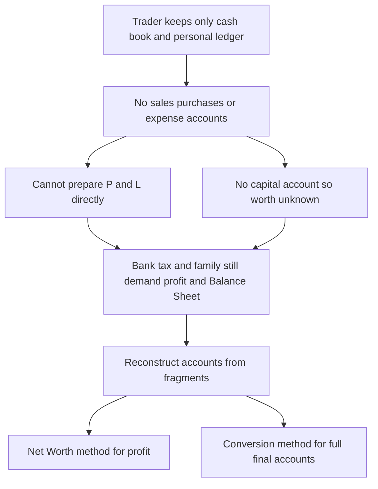
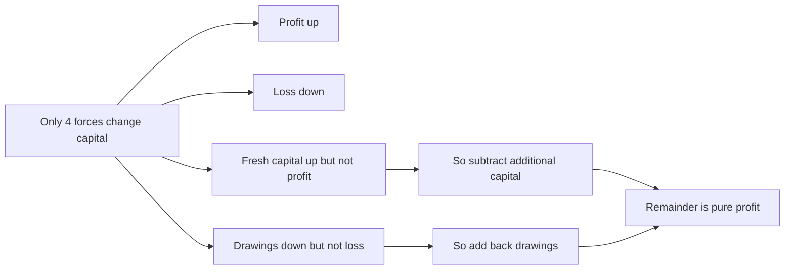
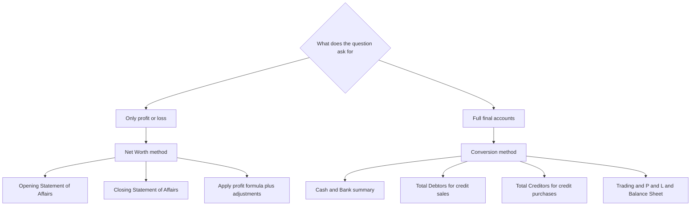

<!-- v2-deep -->

# Foundation: Accounts from Incomplete Records (Single Entry)

*Most double-entry chapters start with a clean set of books and ask "what is the profit?" This chapter starts from the opposite corner of the real world — a shopkeeper who kept a cash diary, a bundle of bills, and a rough list of who owes him money — and asks the same question. The whole skill here is detective work: reconstructing a full set of accounts from fragments, using the iron logic of double entry as your reasoning tool even when the trader never used it.*

---

## 1. The Problem it solves

Walk into the back room of almost any small trader in India — a cloth merchant, a hardware shop, a kirana store run by one family — and ask to see "the books." You will usually get three things:

1. A **cash book** or a cash diary: money in, money out. Reasonably complete, because cash is the one thing everyone watches.
2. A **personal ledger**: a page per customer and per supplier, showing who owes what and to whom. Kept because the trader wants his money back and wants to know what he owes.
3. **Nothing else.** No sales account, no purchases account, no expense accounts, no capital account, no nominal accounts at all. No trial balance. No two-sided recording of anything except, accidentally, the cash and personal accounts.

This is not laziness — it is rational for a one-person business. Full double entry needs a trained bookkeeper the trader cannot afford or does not think he needs. He records what directly protects his money (cash and debts) and ignores the rest. The result is a set of records that accountants politely call **"incomplete records"** and students traditionally call the **"single-entry system."**

Now the problem lands. At the year-end this trader must answer questions that his fragmentary books cannot answer directly:

- **What profit did I make this year?** He cannot prepare a Profit & Loss Account, because he never recorded sales, purchases, or expenses as ledger totals.
- **What is my business worth — what is my capital?** He never kept a capital account.
- The **bank** wants a Balance Sheet before renewing his loan. The **income-tax officer** wants a profit figure. His **family** wants to know if the business is actually growing or quietly bleeding.

He has the raw fragments but not the answers. This chapter is the toolkit that turns those fragments into a proper profit figure and a proper Balance Sheet — *without* him ever having kept double-entry books. It teaches you to think like an accountant working a case: "I know the cash that came from customers, I know what they owed at the start and the end — therefore I can deduce the sales, even though nobody wrote them down."

That deductive reconstruction is one of the most examined and most *transferable* skills in the whole CA syllabus. Once you can rebuild accounts from missing data, branch accounts, departmental accounts, and even forensic/investigation work at higher levels stop being frightening.

*Figure 1 — Incomplete records leave real questions unanswered; this chapter supplies two reconstruction routes.*

---

## 2. Core Idea

There is really only one big idea, and it has two applications.

> **The big idea:** Double entry is not just a *bookkeeping procedure* — it is a *law of arithmetic about a business*. Every transaction has two equal sides, so the totals must reconcile whether or not anyone wrote both sides down. Therefore, if you know all the pieces of an account except one, that one missing piece can always be found as the **balancing figure**.

Everything in this chapter is that single sentence applied twice:

> **Application 1 — Net Worth (Statement of Affairs) method.**
> Capital = Assets − Liabilities. If I can estimate the assets and liabilities at the *start* of the year and again at the *end*, I get opening capital and closing capital. The change in capital, after stripping out money the owner took out (drawings) and money he put in (fresh capital), *must* be the profit. I never needed a Profit & Loss Account — I inferred profit from how much richer the business got.

> **Application 2 — Conversion method.**
> I build the individual missing accounts as **control accounts** (Total Debtors A/c, Total Creditors A/c, Bills Receivable A/c, Bills Payable A/c) and let the *balancing figure* reveal the number nobody recorded — usually **credit sales** or **credit purchases**. With those, I can prepare a full Trading and Profit & Loss Account and a Balance Sheet, exactly as if the trader had kept proper books.

The Net Worth method answers only **"how much profit?"** The Conversion method answers **"how much profit, and made up of exactly which sales, purchases, and expenses?"** — a full set of final accounts. The exam chooses between them by what the question gives you and asks for.

---

## 3. Why it works this way

**Why the change in net worth equals profit.** A business is a pool of resources belonging to the owner. The owner's stake in that pool is *capital* — formally, everything the business owns minus everything it owes (the accounting equation, Assets = Liabilities + Capital, rearranged to Capital = Assets − Liabilities). Now ask: what are the *only* four things that can change the owner's stake over a year?

1. The business **earns profit** → capital goes up.
2. The business **suffers a loss** → capital goes down.
3. The owner **puts fresh money in** (additional capital) → capital goes up, but this is not profit — it is the owner funding the business, not the business enriching the owner.
4. The owner **takes money out** (drawings) → capital goes down, but this is not a loss — it is the owner spending what was already his.

So if capital rose from ₹1,00,000 to ₹1,30,000, that ₹30,000 rise came from *some combination* of profit and owner injections/withdrawals. To isolate profit, we reverse the two non-profit movements: **add back drawings** (the fall they caused was not a loss, so restore it) and **subtract additional capital** (the rise it caused was not profit, so remove it). What is left is pure profit. This is why the formula is:

> **Profit = Closing Capital + Drawings − Additional Capital − Opening Capital**

It is not a rule to memorise — it is forced by the fact that only four forces move capital, and two of them are not profit.

**Why the balancing figure in a control account is trustworthy.** A control account is just the sum of many personal accounts rolled into one. Consider the Total Debtors Account. Debtors go *up* for exactly one reason (goods sold to them on credit) and come *down* for a handful of reasons (they pay cash, we allow them a discount, we write them off as bad, they return goods, or they give us a bill of exchange). Every one of those down-movements is something the trader *did* record (cash in his cash book, bills in his bills book, etc.). So in the Debtors Account, everything is known except credit sales — and because the two sides of a real account must be equal, credit sales *pops out* as the balancing figure. The double-entry law guarantees the answer is arithmetically exact, not an estimate.

**Why a Statement of Affairs is not a Balance Sheet.** A Balance Sheet is built *from* ledger balances that were themselves produced by double entry — every figure is verified against its double. A Statement of Affairs is built from a physical **estimate** of assets and liabilities: you count the stock, list the debtors from the personal ledger, guess the value of the furniture. The capital figure is simply whatever makes it balance (Assets − Liabilities), not an independently maintained account. Same layout, completely different pedigree — and that difference is a favourite exam question (§5.5 below).

*Figure 2 — Why the net-worth formula takes the shape it does.*

---

## 4. Full technical content

### 4.1 What "single entry" really means

"Single entry" is a misleading nickname. There is no genuine *system* that deliberately records only one side of every transaction. In practice it is a **mixture**:

| Type of account | How it is kept under "single entry" |
|---|---|
| Cash and bank | Usually kept fully (both sides) — the cash book survives |
| Personal accounts (debtors, creditors) | Usually kept, because the trader tracks who owes/is owed |
| Real accounts (assets like machinery, furniture, stock) | Rarely kept; established by physical count/estimate |
| Nominal accounts (sales, purchases, expenses, incomes) | Not kept at all |

Because some transactions are recorded twice (cash + personal), some once (only cash, or only personal), and some not at all, the modern and technically correct name is **Accounts from Incomplete Records**. ICAI uses this term; "single entry" is the traditional label.

**Types traditionally described:**

| Variant | Description |
|---|---|
| Pure single entry | Only personal accounts kept; no cash book, no real accounts. Almost never seen. |
| Simple single entry | Personal accounts **and** a cash book kept. The common real-world case. |
| Quasi single entry | Simple single entry **plus** some subsidiary books (sales book, purchases book, bills books) — the richest and most convertible form. |

### 4.2 Features and limitations

**Features:** incomplete/unsystematic; suited to sole proprietors and small firms; a mixture of double, single, and no entry; final accounts cannot be drawn directly; profit is an estimate, not a proven figure.

**Limitations (why it is discouraged):**

| Limitation | Consequence |
|---|---|
| No trial balance can be prepared | Arithmetical accuracy cannot be checked |
| True profit cannot be ascertained | P&L cannot be prepared directly; profit is only estimated |
| Financial position unreliable | No proper Balance Sheet; only a Statement of Affairs |
| Frauds and errors go undetected | Missing second entries hide manipulation |
| Not accepted by law/tax/banks | Companies are legally barred; banks and tax authorities distrust it |
| No basis for comparison or planning | Absence of full data blocks ratio analysis and decision-making |

### 4.3 Method 1 — Net Worth / Statement of Affairs method

Used when the question asks **only for profit or loss** (not a full set of final accounts). Steps:

1. Prepare an **Opening Statement of Affairs** → derive **Opening Capital** = Opening Assets − Opening Liabilities.
2. Prepare a **Closing Statement of Affairs** → derive **Closing Capital** = Closing Assets − Closing Liabilities.
3. Apply the master formula.

> **Profit (before adjustments) = Closing Capital + Drawings − Additional Capital − Opening Capital**

4. Apply **adjustments** the trader never recorded (they were not in his figures): the general logic is that expenses/losses reduce profit and unrecorded incomes increase it.

| Adjustment | Effect on profit |
|---|---|
| Depreciation not yet charged | **Less** (deduct) |
| Bad debts / provision for doubtful debts | **Less** |
| Interest on capital | **Less** (a charge to the business) |
| Outstanding (unpaid) expenses | **Less** |
| Prepaid expenses | **Add** (part of an expense belongs to next year) |
| Accrued (earned but not received) income | **Add** |
| Interest on drawings | **Add** (income earned by business from owner) |

**Format — Statement of Affairs:**

| Liabilities | ₹ | Assets | ₹ |
|---|---|---|---|
| Creditors | xx | Cash and Bank | xx |
| Bills payable | xx | Debtors | xx |
| Outstanding expenses | xx | Bills receivable | xx |
| Bank overdraft | xx | Stock | xx |
| Capital (**balancing figure**) | xx | Furniture / Machinery etc. | xx |
| **Total** | **xxx** | Prepaid expenses | xx |
|  |  | **Total** | **xxx** |

The capital is inserted as the balancing figure — that is what distinguishes it from a Balance Sheet.

### 4.4 Method 2 — Conversion method

Used when the question demands a **full Trading and Profit & Loss Account and a Balance Sheet**. "Conversion" = converting incomplete records into a full double-entry set. Core tools are **control (total) accounts** whose balancing figure is the missing number.

**(a) Total Debtors Account → gives Credit Sales**

| Dr | ₹ | Cr | ₹ |
|---|---|---|---|
| To Balance b/d (opening debtors) | xx | By Cash / Bank received | xx |
| To **Credit Sales (bal. fig.)** | **xx** | By Discount allowed | xx |
| To Bills Receivable dishonoured | xx | By Bad debts | xx |
| To Bank (cheque dishonoured) | xx | By Sales returns (returns inward) | xx |
|  |  | By Bills Receivable received | xx |
|  |  | By Balance c/d (closing debtors) | xx |

**(b) Total Creditors Account → gives Credit Purchases**

| Dr | ₹ | Cr | ₹ |
|---|---|---|---|
| To Cash / Bank paid | xx | By Balance b/d (opening creditors) | xx |
| To Discount received | xx | By **Credit Purchases (bal. fig.)** | **xx** |
| To Purchase returns (returns outward) | xx | By Bills Payable dishonoured | xx |
| To Bills Payable accepted | xx |  |  |
| To Balance c/d (closing creditors) | xx |  |  |

**(c) Bills Receivable Account → gives B/R collected or received**

| Dr | ₹ | Cr | ₹ |
|---|---|---|---|
| To Balance b/d (opening B/R) | xx | By Cash / Bank (B/R honoured) | xx |
| To Debtors (B/R received) | xx | By Debtors (B/R dishonoured) | xx |
|  |  | By Balance c/d (closing B/R) | xx |

**(d) Bills Payable Account → gives B/P paid or accepted**

| Dr | ₹ | Cr | ₹ |
|---|---|---|---|
| To Cash / Bank (B/P honoured) | xx | By Balance b/d (opening B/P) | xx |
| To Balance c/d (closing B/P) | xx | By Creditors (B/P accepted) | xx |

**(e) The Cash / Bank summary** — often you must first build a combined Cash and Bank account from the receipts-and-payments diary to extract a missing figure (closing balance, drawings, cash sales, or expenses).

Once credit sales and credit purchases are found:

> **Total Sales = Credit Sales + Cash Sales**
> **Total Purchases = Credit Purchases + Cash Purchases**

Then prepare the **Trading Account** (gives Gross Profit), the **Profit & Loss Account** (gives Net Profit), and the **Balance Sheet**.

### 4.5 The Memorandum Trading Account technique

When a **missing figure is inside the trading account itself** — typically **closing stock**, **purchases**, or **sales** — and the question gives a **gross-profit rate**, you build a *rough* (memorandum) Trading Account and let the unknown balance out.

> **Cost of Goods Sold (COGS) = Opening Stock + Purchases − Closing Stock**
> **Gross Profit = Sales − COGS**
> If GP is a % **of sales**: GP = Sales × rate; if a % **of cost**: GP = COGS × rate.

Rearrange to isolate whichever figure is missing. (Worked in Q&A.)

*Figure 3 — Decision logic: let the requirement choose the method.*

### 4.6 Difference from double entry (examinable table)

| Basis | Single Entry / Incomplete Records | Double Entry |
|---|---|---|
| Recording | Both, one, or no aspect recorded | Both aspects of every transaction recorded |
| Accounts kept | Mainly cash and personal | All — personal, real, nominal |
| Trial balance | Cannot be prepared | Can be prepared to test accuracy |
| Profit | Estimated (net-worth) or reconstructed | Ascertained precisely via P&L |
| Financial position | Statement of Affairs (estimate) | Balance Sheet (from proven balances) |
| Accuracy / fraud check | Weak | Strong |
| Suitability | Sole proprietors, small firms | All entities; legally required for companies |
| Legal acceptability | Not accepted for companies/tax | Accepted everywhere |

---

## 5. Worked examples

Currency is Indian rupees (₹). Every account below is footed and every statement balances.

### Example 1 — Net Worth method with adjustments

Mr. Anand keeps incomplete records. His assets and liabilities were:

| Particulars | 1 Apr 2023 (₹) | 31 Mar 2024 (₹) |
|---|---|---|
| Cash | 5,000 | 8,000 |
| Bank | 15,000 | 22,000 |
| Debtors | 30,000 | 45,000 |
| Stock | 40,000 | 55,000 |
| Furniture | 20,000 | 20,000 |
| Machinery | 50,000 | 50,000 |
| Creditors | 25,000 | 30,000 |
| Bills payable | 10,000 | 8,000 |

During the year he **withdrew ₹24,000** for personal use and **introduced ₹10,000** fresh capital.
Adjustments (not yet reflected in the figures above): (i) depreciate furniture and machinery @10% p.a.; (ii) create a 5% provision for doubtful debts on closing debtors; (iii) charge interest on opening capital @6% p.a.; (iv) charge interest on drawings ₹720; (v) salary ₹1,000 is outstanding.

**Step 1 — Opening Statement of Affairs (find opening capital):**

| Liabilities | ₹ | Assets | ₹ |
|---|---|---|---|
| Creditors | 25,000 | Cash | 5,000 |
| Bills payable | 10,000 | Bank | 15,000 |
| **Capital (bal. fig.)** | **1,25,000** | Debtors | 30,000 |
|  |  | Stock | 40,000 |
|  |  | Furniture | 20,000 |
|  |  | Machinery | 50,000 |
| **Total** | **1,60,000** | **Total** | **1,60,000** |

Opening capital = 1,60,000 − 35,000 = **₹1,25,000**.

**Step 2 — Closing Statement of Affairs (before adjustments):**

| Liabilities | ₹ | Assets | ₹ |
|---|---|---|---|
| Creditors | 30,000 | Cash | 8,000 |
| Bills payable | 8,000 | Bank | 22,000 |
| **Capital (bal. fig.)** | **1,62,000** | Debtors | 45,000 |
|  |  | Stock | 55,000 |
|  |  | Furniture | 20,000 |
|  |  | Machinery | 50,000 |
| **Total** | **2,00,000** | **Total** | **2,00,000** |

Closing capital (before adjustments) = 2,00,000 − 38,000 = **₹1,62,000**.

**Step 3 — Profit before adjustments:**

Profit = Closing capital + Drawings − Additional capital − Opening capital
= 1,62,000 + 24,000 − 10,000 − 1,25,000 = **₹51,000**.

**Step 4 — Statement of Profit (apply adjustments):**

| Particulars | ₹ | ₹ |
|---|---|---|
| Profit before adjustments |  | 51,000 |
| Add: Interest on drawings |  | 720 |
|  |  | **51,720** |
| Less: Depreciation — Furniture @10% of 20,000 | 2,000 |  |
| Less: Depreciation — Machinery @10% of 50,000 | 5,000 |  |
| Less: Provision for doubtful debts @5% of 45,000 | 2,250 |  |
| Less: Interest on capital @6% of 1,25,000 | 7,500 |  |
| Less: Outstanding salary | 1,000 | (17,750) |
| **Net Profit for the year** |  | **33,970** |

**Verification:** 51,000 + 720 = 51,720; total deductions = 2,000 + 5,000 + 2,250 + 7,500 + 1,000 = 17,750; net profit = 51,720 − 17,750 = **₹33,970**. ✔

*Reading the answer:* the raw net-worth rise suggested ₹51,000 of profit, but once the unrecorded charges (depreciation, provision, interest on capital, outstanding salary) are honestly brought in, the true profit is only ₹33,970. That gap is exactly why incomplete-records profit is called an *estimate* until adjustments are made.

---

### Example 2 — Conversion method: find credit sales and credit purchases

From the incomplete records of Ms. Beena for the year ended 31 March 2024:

| Item | ₹ |
|---|---|
| Debtors — opening / closing | 40,000 / 52,000 |
| Creditors — opening / closing | 30,000 / 38,000 |
| Bills receivable — opening / closing | 10,000 / 8,000 |
| Bills payable — opening / closing | 12,000 / 9,000 |
| Cash received from debtors | 1,80,000 |
| Cash paid to creditors | 1,20,000 |
| Discount allowed / received | 4,000 / 2,500 |
| Bad debts | 3,000 |
| Returns inward / outward | 5,000 / 4,000 |
| Bills receivable received from debtors | 25,000 |
| Bills payable accepted to creditors | 20,000 |
| Bills receivable dishonoured | 3,000 |
| Cash sales / cash purchases | 30,000 / 15,000 |

**Step 1 — Total Debtors Account (credit sales is the balancing figure):**

| Dr | ₹ | Cr | ₹ |
|---|---|---|---|
| To Balance b/d | 40,000 | By Cash / Bank | 1,80,000 |
| To Bills Receivable (dishonoured) | 3,000 | By Discount allowed | 4,000 |
| To **Credit Sales (bal. fig.)** | **2,26,000** | By Bad debts | 3,000 |
|  |  | By Returns inward | 5,000 |
|  |  | By Bills Receivable received | 25,000 |
|  |  | By Balance c/d | 52,000 |
| **Total** | **2,69,000** | **Total** | **2,69,000** |

Credit sales = (1,80,000 + 4,000 + 3,000 + 5,000 + 25,000 + 52,000) − (40,000 + 3,000) = 2,69,000 − 43,000 = **₹2,26,000**. ✔ (both sides foot to 2,69,000)

**Step 2 — Total Creditors Account (credit purchases is the balancing figure):**

| Dr | ₹ | Cr | ₹ |
|---|---|---|---|
| To Cash / Bank | 1,20,000 | By Balance b/d | 30,000 |
| To Discount received | 2,500 | By **Credit Purchases (bal. fig.)** | **1,54,500** |
| To Returns outward | 4,000 |  |  |
| To Bills Payable accepted | 20,000 |  |  |
| To Balance c/d | 38,000 |  |  |
| **Total** | **1,84,500** | **Total** | **1,84,500** |

Credit purchases = (1,20,000 + 2,500 + 4,000 + 20,000 + 38,000) − 30,000 = 1,84,500 − 30,000 = **₹1,54,500**. ✔

**Step 3 — supporting bills accounts (proving the flows tie out):**

*Bills Receivable Account:*

| Dr | ₹ | Cr | ₹ |
|---|---|---|---|
| To Balance b/d | 10,000 | By Cash / Bank (honoured, bal. fig.) | 24,000 |
| To Debtors (B/R received) | 25,000 | By Debtors (dishonoured) | 3,000 |
|  |  | By Balance c/d | 8,000 |
| **Total** | **35,000** | **Total** | **35,000** |

*Bills Payable Account:*

| Dr | ₹ | Cr | ₹ |
|---|---|---|---|
| To Cash / Bank (honoured, bal. fig.) | 23,000 | By Balance b/d | 12,000 |
| To Balance c/d | 9,000 | By Creditors (B/P accepted) | 20,000 |
| **Total** | **32,000** | **Total** | **32,000** |

**Step 4 — totals for the Trading Account:**

- Total Sales = Credit 2,26,000 + Cash 30,000 = **₹2,56,000**
- Total Purchases = Credit 1,54,500 + Cash 15,000 = **₹1,69,500**

*Takeaway:* nobody at Beena's shop ever wrote a "sales ₹2,26,000" figure. It was deduced with certainty because the Debtors Account has only one unknown, and both sides of a real account must be equal.

---

### Example 3 — Full conversion: Trading, P&L and Balance Sheet

Mr. Rao does not keep proper books. His Balance Sheet at the start of the year and a summary of his year's cash/bank transactions are below. Prepare final accounts for the year ended 31 March 2024.

**Opening Balance Sheet as at 1 April 2023:**

| Liabilities | ₹ | Assets | ₹ |
|---|---|---|---|
| Creditors | 20,000 | Cash and Bank | 15,000 |
| **Capital (bal. fig.)** | **1,05,000** | Debtors | 25,000 |
|  |  | Stock | 30,000 |
|  |  | Furniture | 15,000 |
|  |  | Machinery | 40,000 |
| **Total** | **1,25,000** | **Total** | **1,25,000** |

Opening capital = 1,25,000 − 20,000 = **₹1,05,000**.

**Summary of Cash and Bank during the year:**

| Receipts | ₹ | Payments | ₹ |
|---|---|---|---|
| Received from debtors | 1,50,000 | Paid to creditors | 90,000 |
| Cash sales | 40,000 | Cash purchases | 25,000 |
| Additional capital introduced | 20,000 | Salaries | 18,000 |
|  |  | Rent | 12,000 |
|  |  | General expenses | 8,000 |
|  |  | Drawings | 24,000 |
|  |  | Furniture purchased (1 Oct 2023) | 10,000 |

**Other information:** closing debtors ₹35,000; closing creditors ₹28,000; closing stock ₹42,000; discount allowed ₹2,000; discount received ₹1,500; depreciate furniture and machinery @10% p.a.

**Step 1 — Cash and Bank Account (find the closing balance):**

| Dr | ₹ | Cr | ₹ |
|---|---|---|---|
| To Balance b/d | 15,000 | By Creditors | 90,000 |
| To Debtors | 1,50,000 | By Cash purchases | 25,000 |
| To Cash sales | 40,000 | By Salaries | 18,000 |
| To Additional capital | 20,000 | By Rent | 12,000 |
|  |  | By General expenses | 8,000 |
|  |  | By Drawings | 24,000 |
|  |  | By Furniture | 10,000 |
|  |  | By Balance c/d (bal. fig.) | 38,000 |
| **Total** | **2,25,000** | **Total** | **2,25,000** |

Closing cash and bank = 2,25,000 − 1,87,000 = **₹38,000**. ✔

**Step 2 — Total Debtors Account (credit sales):**

| Dr | ₹ | Cr | ₹ |
|---|---|---|---|
| To Balance b/d | 25,000 | By Cash / Bank | 1,50,000 |
| To **Credit Sales (bal. fig.)** | **1,62,000** | By Discount allowed | 2,000 |
|  |  | By Balance c/d | 35,000 |
| **Total** | **1,87,000** | **Total** | **1,87,000** |

Credit sales = (1,50,000 + 2,000 + 35,000) − 25,000 = **₹1,62,000**. ✔

**Step 3 — Total Creditors Account (credit purchases):**

| Dr | ₹ | Cr | ₹ |
|---|---|---|---|
| To Cash / Bank | 90,000 | By Balance b/d | 20,000 |
| To Discount received | 1,500 | By **Credit Purchases (bal. fig.)** | **99,500** |
| To Balance c/d | 28,000 |  |  |
| **Total** | **1,19,500** | **Total** | **1,19,500** |

Credit purchases = (90,000 + 1,500 + 28,000) − 20,000 = **₹99,500**. ✔

**Step 4 — totals and depreciation:**

- Total Sales = 1,62,000 + 40,000 = **₹2,02,000**
- Total Purchases = 99,500 + 25,000 = **₹1,24,500**
- Depreciation: Machinery 10% of 40,000 = 4,000; Furniture 10% of 15,000 (full year) = 1,500 **plus** 10% of 10,000 for 6 months (bought 1 Oct) = 500 → furniture 2,000. **Total depreciation = ₹6,000.**

**Step 5 — Trading and Profit & Loss Account for the year ended 31 Mar 2024:**

| Dr | ₹ | Cr | ₹ |
|---|---|---|---|
| To Opening stock | 30,000 | By Sales | 2,02,000 |
| To Purchases | 1,24,500 | By Closing stock | 42,000 |
| To **Gross Profit c/d** | **89,500** |  |  |
| **Total** | **2,44,000** | **Total** | **2,44,000** |
| To Salaries | 18,000 | By Gross Profit b/d | 89,500 |
| To Rent | 12,000 | By Discount received | 1,500 |
| To General expenses | 8,000 |  |  |
| To Discount allowed | 2,000 |  |  |
| To Depreciation | 6,000 |  |  |
| To **Net Profit** | **45,000** |  |  |
| **Total** | **91,000** | **Total** | **91,000** |

Gross profit = 2,44,000 − 1,54,500 = **₹89,500**; Net profit = 91,000 − 46,000 = **₹45,000**. ✔

**Step 6 — Balance Sheet as at 31 March 2024:**

| Liabilities | ₹ | Assets | ₹ |
|---|---|---|---|
| Creditors | 28,000 | Cash and Bank | 38,000 |
| Capital: |  | Debtors | 35,000 |
| &nbsp;&nbsp;Opening 1,05,000 |  | Closing stock | 42,000 |
| &nbsp;&nbsp;Add: Additional 20,000 |  | Furniture (15,000 + 10,000 − 2,000) | 23,000 |
| &nbsp;&nbsp;Add: Net profit 45,000 |  | Machinery (40,000 − 4,000) | 36,000 |
| &nbsp;&nbsp;Less: Drawings (24,000) |  |  |  |
| &nbsp;&nbsp;**Closing capital 1,46,000** | 1,46,000 |  |  |
| **Total** | **1,74,000** | **Total** | **1,74,000** |

**Verification:** closing capital = 1,05,000 + 20,000 + 45,000 − 24,000 = 1,46,000; total liabilities = 1,46,000 + 28,000 = 1,74,000; total assets = 38,000 + 35,000 + 42,000 + 23,000 + 36,000 = 1,74,000. **The Balance Sheet balances.** ✔

*What just happened:* starting from one opening Balance Sheet and a cash diary, we reconstructed an entire double-entry set — sales, purchases, gross profit, net profit, and a balanced closing position — none of which the trader had recorded. That is the conversion method in full.

---

## 6. Connections — what this unlocks at CA Intermediate

- **Single Entry / Incomplete Records (Intermediate Accounting)** — the Inter version raises the same machinery to harder settings: partial information across *two* years, missing multiple figures at once, and heavier use of the **memorandum trading account** with gross-profit ratios. The Foundation logic is identical; only the puzzle gets denser.
- **Branch Accounts (Inter)** — a *debtors-system* branch is literally solved with a Branch Debtors Account and a Branch Stock Account, i.e. the same control-account balancing-figure technique you learned here to find branch credit sales and shortages.
- **Departmental Accounts and inter-departmental transfers** rely on the same reconstruction of missing purchase/sale figures from control accounts.
- **Partnership final accounts and admission/retirement/dissolution (Inter)** all rest on the capital-movement identity `Closing Capital = Opening Capital + Profit + Introduced − Drawings` — proved here for a sole trader, reused there per partner.
- **Investigation and forensic-style questions** (and the audit paper's substantive testing) use exactly this "reconstruct the missing side from what must reconcile" mindset.

If you can rebuild a set of accounts from fragments, you have the single most reusable analytical skill in the accounting papers.

---

## 7. Traps & common mistakes

1. **Calling the closing statement a "Balance Sheet."** Under the net-worth method it is a **Statement of Affairs**; capital is a balancing figure, not a maintained account. Using the wrong term loses easy marks.
2. **Sign errors in the profit formula.** It is Closing Capital **+ Drawings − Additional Capital −** Opening Capital. Students routinely add additional capital or subtract drawings — reversing both non-profit forces the wrong way.
3. **Applying adjustments to the wrong base or wrong direction.** Interest on **capital** and interest on **drawings** move profit in *opposite* directions (capital = less, drawings = add). Depreciation and provisions always reduce profit.
4. **Wrong side of the control account.** Discount *allowed*, bad debts, returns *inward*, and B/R *received* all sit on the **credit** side of the Total Debtors A/c. A B/R *dishonoured* comes **back** to the debit side (the debtor owes again). Mirror-image for creditors.
5. **Double-counting bills.** A bill received from a debtor reduces debtors (credit side of Debtors A/c) *and* appears on the debit side of the B/R A/c. It is one event with two account effects — not two separate reductions of debtors.
6. **Forgetting to add cash sales/purchases.** Credit sales from the Debtors A/c is not total sales — add cash sales before it enters the Trading Account.
7. **Depreciating a mid-year asset for the full year.** Furniture bought on 1 Oct gets only 6 months' depreciation (Example 3).
8. **Treating drawings of goods as cash drawings.** Goods withdrawn reduce purchases/stock and reduce capital; they never touch the cash book.
9. **Putting additional capital or drawings through the P&L.** They are capital-account items, never income or expense.
10. **Net-worth method reveals only the *amount* of profit, never its *composition*.** If a question wants gross profit, expenses, or a Trading Account, you must use conversion — the net-worth method cannot produce them.

---

## 8. First-principles recap

- A sole trader rationally keeps only cash and personal accounts; the resulting "single entry" is really **incomplete records**, not a system.
- Double entry is an **arithmetic law about the business**, so any single missing figure can be recovered as a **balancing figure** — that one insight powers the whole chapter.
- **Net worth method:** because only four forces move capital (profit, loss, injections, withdrawals), stripping injections and withdrawals from the change in capital leaves pure profit. It answers *how much* profit, not *of what*.
- **Conversion method:** control accounts (Total Debtors, Total Creditors, Bills R/P) surrender the unrecorded credit sales and credit purchases as balancing figures, enabling a full Trading, P&L, and Balance Sheet.
- A **Statement of Affairs** looks like a Balance Sheet but is built from estimates with capital as the plug — hence profit under this method is an **estimate** until adjustments are honestly applied.
- Every reconstructed account must **foot equally** and the final Balance Sheet must **balance** — that self-check is your proof the reconstruction is correct.

---

## 9. Quick-reference

| Item | Formula / Rule |
|---|---|
| Opening / Closing capital | Assets − Liabilities (via Statement of Affairs) |
| **Profit (net-worth method)** | **Closing Capital + Drawings − Additional Capital − Opening Capital** |
| Credit sales | Balancing figure of **Total Debtors A/c** |
| Credit purchases | Balancing figure of **Total Creditors A/c** |
| Total sales / purchases | Credit + Cash |
| COGS | Opening Stock + Purchases − Closing Stock |
| Gross Profit | Sales − COGS (or Sales × GP-rate if % of sales) |
| B/R honoured / B/P honoured | Balancing figure of Bills R / Bills P account |
| Accounting equation | Assets = Liabilities + Capital |

| Adjustment | Direction on profit |
|---|---|
| Depreciation, bad debts, provision, interest on capital, outstanding expenses | **Less** |
| Prepaid expenses, accrued income, interest on drawings | **Add** |

| Debtors A/c — credit side items | Creditors A/c — debit side items |
|---|---|
| Cash received, discount allowed, bad debts, returns inward, B/R received, closing debtors | Cash paid, discount received, returns outward, B/P accepted, closing creditors |

**Key terms:** Incomplete Records • Single Entry (Pure / Simple / Quasi) • Statement of Affairs • Net Worth (Capital Comparison) Method • Conversion Method • Control / Total Accounts • Memorandum Trading Account • Balancing Figure.
